# Indian Pairs-Trading Scanner — 2026-07-24

> **What this is:** a market-neutral *pairs mean-reversion* scanner. It flags when two related NSE stocks have drifted apart far enough that their historical relationship signals a possible convergence trade. It does **not** forecast growth, rank "best" stocks, or predict company performance. A signal means the *spread between two stocks* is stretched — nothing about either stock being a good investment. Not investment advice; do your own research.

## Methodology (fixed in advance)

- **Universe:** 16 declared sector-mate pairs. Parameters (3y window, 60/40 train-test, z-entry 2.0, z-exit 0.5, 5 bps costs) are pre-registered; changes are logged in the README changelog *before* looking at results.
- **Multiple testing:** at the 5% level across 16 pairs, **≈0.8 false positives per run are expected by chance alone** even if nothing truly cointegrates. A single-day pass is a candidate, not a discovery.
- **Strict tier:** Bonferroni-corrected threshold p < 0.0031 (marked ✓✓).
- **Evidence = persistence:** the Persistence column counts how often each pair has passed the 5% test across all *real-data* daily runs recorded in `reports/history.csv`. Pairs deserve attention only when they pass persistently.

## Summary

| Pair | p-value | Coint. | Persistence | Current z | Signal | OOS Sharpe |
|---|---|---|---|---|---|---|
| HDFCBANK.NS/ICICIBANK.NS | 0.1068 | ✗ | 0/14 | +2.94 | SHORT spread | -0.45 |
| AXISBANK.NS/ICICIBANK.NS | 0.9294 | ✗ | 0/17 | +2.55 | SHORT spread | -0.37 |
| KOTAKBANK.NS/HDFCBANK.NS | 0.1678 | ✗ | 0/17 | -0.76 | watch | 0.12 |
| SBIN.NS/BANKBARODA.NS | 0.1788 | ✗ | 0/17 | -1.22 | watch | 0.48 |
| TCS.NS/INFY.NS | 0.4143 | ✗ | 0/17 | -2.37 | LONG spread | 0.90 |
| INFY.NS/WIPRO.NS | 0.1923 | ✗ | 0/17 | +0.03 | flat / no stretch | 1.73 |
| HCLTECH.NS/TECHM.NS | 0.3399 | ✗ | 0/17 | +0.70 | watch | -0.10 |
| ACC.NS/AMBUJACEM.NS | 0.8155 | ✗ | 0/17 | -0.31 | flat / no stretch | 1.06 |
| ULTRACEMCO.NS/SHREECEM.NS | 0.3115 | ✗ | 0/17 | +1.44 | watch | 0.25 |
| IOC.NS/BPCL.NS | 0.8191 | ✗ | 0/17 | +1.75 | watch | 0.60 |
| BPCL.NS/HINDPETRO.NS | 0.3227 | ✗ | 0/17 | -2.78 | LONG spread | -0.16 |
| ONGC.NS/COALINDIA.NS | 0.0300 | ✓ | 9/17 | -0.03 | flat / no stretch | 0.84 |
| NTPC.NS/POWERGRID.NS | 0.0793 | ✗ | 0/17 | +1.43 | watch | 0.42 |
| BAJAJ-AUTO.NS/HEROMOTOCO.NS | 0.1748 | ✗ | 0/17 | -1.90 | watch | -1.35 |
| TATASTEEL.NS/JSWSTEEL.NS | 0.7680 | ✗ | 0/17 | +1.32 | watch | 0.35 |
| SUNPHARMA.NS/CIPLA.NS | 0.0017 | ✓✓ | 17/17 | -0.79 | watch | -0.11 |

_Legend: ✓✓ passes strict Bonferroni tier · ✓ passes 5% only · ✗ fails. Persistence = 5%-passes / real-data runs recorded. \*no real-data history yet._

---

### HDFCBANK.NS / ICICIBANK.NS

- **Latest prices:** HDFCBANK.NS ₹742.80 · ICICIBANK.NS ₹1,432.90
- **Hedge ratio (train-fitted):** 1.7531
- **Cointegration (train):** FAIL at 5% — ADF -2.54, p=0.1068
- **Persistence:** passed 5% in 0 of 14 real-data runs (strict tier: 0/14)
- **Spread half-life:** 30.8 days
- **Current z-score:** +2.94
- **Signal today:** SHORT spread (short ICICIBANK.NS, long HDFCBANK.NS)
- ⚠️ _Pair did not cointegrate on training data. Any signal here is not statistically justified — observation only._

**Out-of-sample backtest** (beta frozen from train window):

| Metric | Value |
|---|---|
| Sharpe | -0.45 |
| Sortino | -0.46 |
| Annualised return | -2.89% |
| Annualised vol | 6.07% |
| Max drawdown | -8.63% |
| Round-trip trades | 5 |

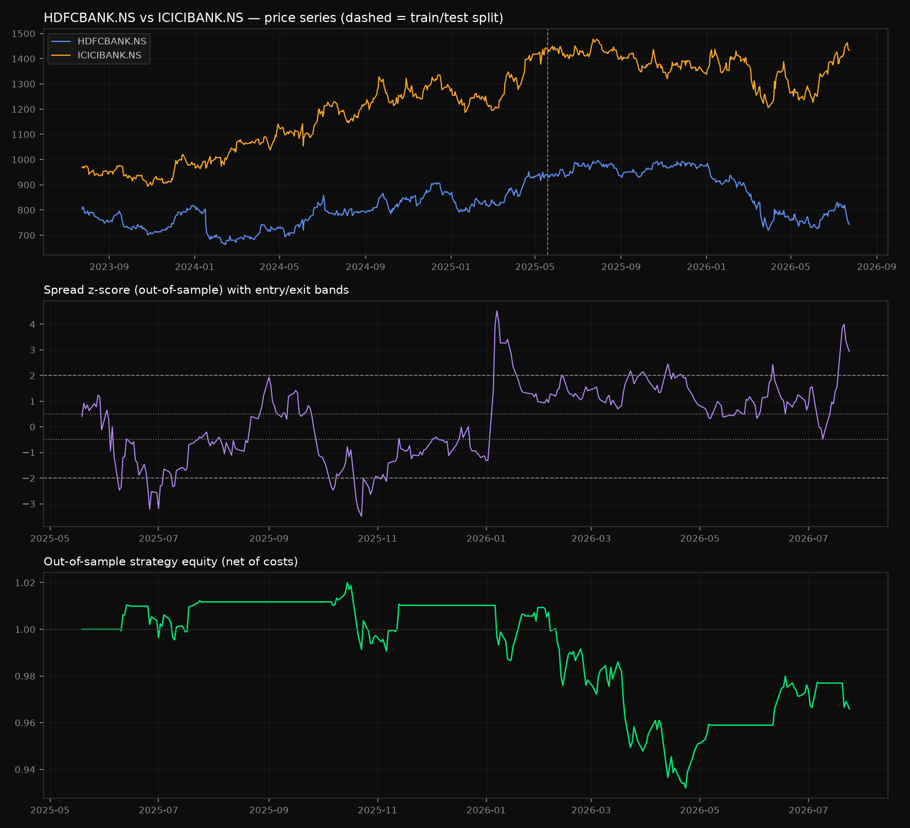

---

### AXISBANK.NS / ICICIBANK.NS

- **Latest prices:** AXISBANK.NS ₹1,227.30 · ICICIBANK.NS ₹1,432.90
- **Hedge ratio (train-fitted):** 0.9068
- **Cointegration (train):** FAIL at 5% — ADF -0.27, p=0.9294
- **Persistence:** passed 5% in 0 of 17 real-data runs (strict tier: 0/17)
- **Spread half-life:** 284.6 days
- **Current z-score:** +2.55
- **Signal today:** SHORT spread (short ICICIBANK.NS, long AXISBANK.NS)
- ⚠️ _Pair did not cointegrate on training data. Any signal here is not statistically justified — observation only._

**Out-of-sample backtest** (beta frozen from train window):

| Metric | Value |
|---|---|
| Sharpe | -0.37 |
| Sortino | -0.36 |
| Annualised return | -3.48% |
| Annualised vol | 8.51% |
| Max drawdown | -7.90% |
| Round-trip trades | 6 |

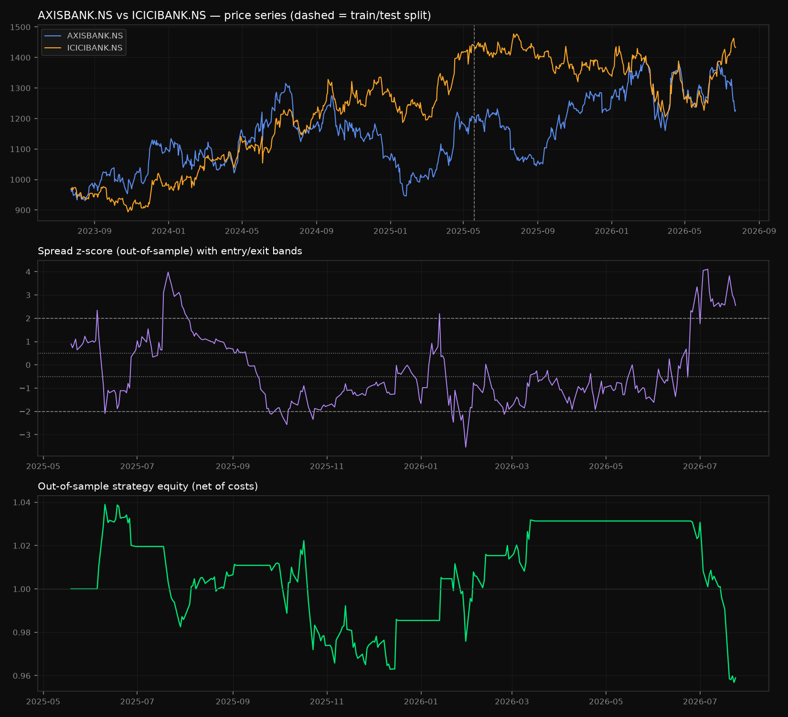

---

### KOTAKBANK.NS / HDFCBANK.NS

- **Latest prices:** KOTAKBANK.NS ₹384.75 · HDFCBANK.NS ₹742.80
- **Hedge ratio (train-fitted):** 1.8554
- **Cointegration (train):** FAIL at 5% — ADF -2.31, p=0.1678
- **Persistence:** passed 5% in 0 of 17 real-data runs (strict tier: 0/17)
- **Spread half-life:** 28.1 days
- **Current z-score:** -0.76
- **Signal today:** watch (approaching band)
- ⚠️ _Pair did not cointegrate on training data. Any signal here is not statistically justified — observation only._

**Out-of-sample backtest** (beta frozen from train window):

| Metric | Value |
|---|---|
| Sharpe | 0.12 |
| Sortino | 0.10 |
| Annualised return | 0.58% |
| Annualised vol | 6.26% |
| Max drawdown | -5.67% |
| Round-trip trades | 4 |

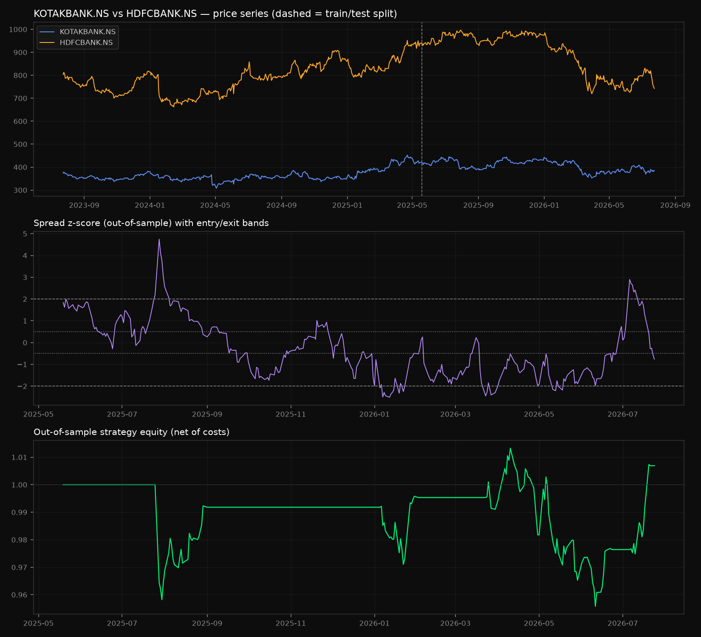

---

### SBIN.NS / BANKBARODA.NS

- **Latest prices:** SBIN.NS ₹1,015.00 · BANKBARODA.NS ₹246.45
- **Hedge ratio (train-fitted):** 0.2083
- **Cointegration (train):** FAIL at 5% — ADF -2.28, p=0.1788
- **Persistence:** passed 5% in 0 of 17 real-data runs (strict tier: 0/17)
- **Spread half-life:** 23.3 days
- **Current z-score:** -1.22
- **Signal today:** watch (approaching band)
- ⚠️ _Pair did not cointegrate on training data. Any signal here is not statistically justified — observation only._

**Out-of-sample backtest** (beta frozen from train window):

| Metric | Value |
|---|---|
| Sharpe | 0.48 |
| Sortino | 0.33 |
| Annualised return | 3.82% |
| Annualised vol | 8.60% |
| Max drawdown | -9.23% |
| Round-trip trades | 5 |

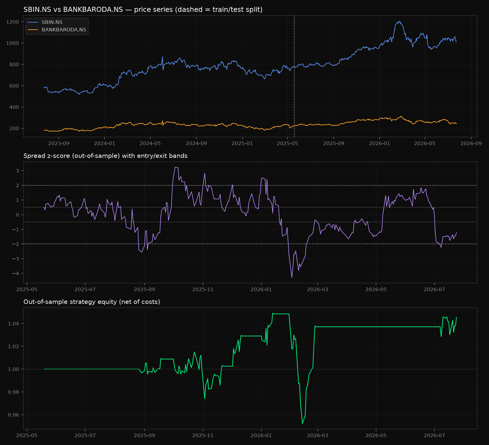

---

### TCS.NS / INFY.NS

- **Latest prices:** TCS.NS ₹2,254.30 · INFY.NS ₹1,040.90
- **Hedge ratio (train-fitted):** 0.5300
- **Cointegration (train):** FAIL at 5% — ADF -1.73, p=0.4143
- **Persistence:** passed 5% in 0 of 17 real-data runs (strict tier: 0/17)
- **Spread half-life:** 42.0 days
- **Current z-score:** -2.37
- **Signal today:** LONG spread (long INFY.NS, short TCS.NS)
- ⚠️ _Pair did not cointegrate on training data. Any signal here is not statistically justified — observation only._

**Out-of-sample backtest** (beta frozen from train window):

| Metric | Value |
|---|---|
| Sharpe | 0.90 |
| Sortino | 0.82 |
| Annualised return | 3.71% |
| Annualised vol | 4.16% |
| Max drawdown | -4.22% |
| Round-trip trades | 6 |

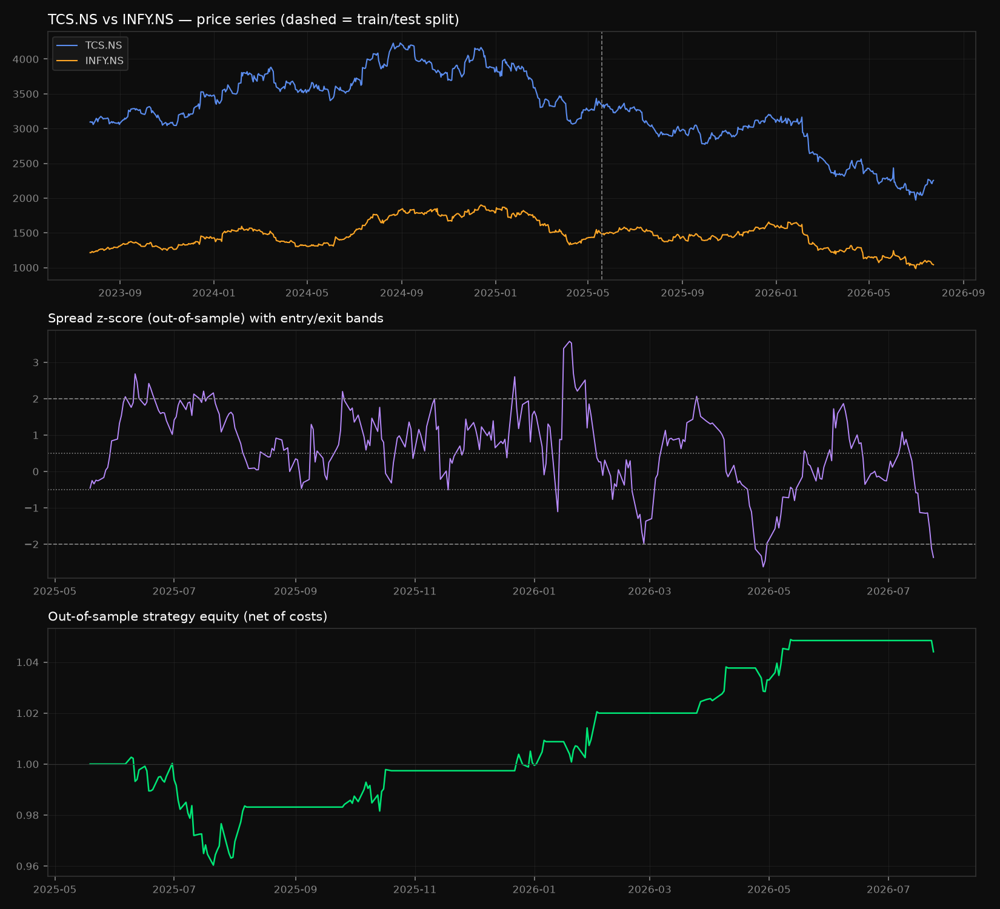

---

### INFY.NS / WIPRO.NS

- **Latest prices:** INFY.NS ₹1,040.90 · WIPRO.NS ₹177.12
- **Hedge ratio (train-fitted):** 0.1395
- **Cointegration (train):** FAIL at 5% — ADF -2.24, p=0.1923
- **Persistence:** passed 5% in 0 of 17 real-data runs (strict tier: 0/17)
- **Spread half-life:** 30.3 days
- **Current z-score:** +0.03
- **Signal today:** flat / no stretch
- ⚠️ _Pair did not cointegrate on training data. Any signal here is not statistically justified — observation only._

**Out-of-sample backtest** (beta frozen from train window):

| Metric | Value |
|---|---|
| Sharpe | 1.73 |
| Sortino | 2.03 |
| Annualised return | 9.38% |
| Annualised vol | 5.25% |
| Max drawdown | -2.50% |
| Round-trip trades | 6 |

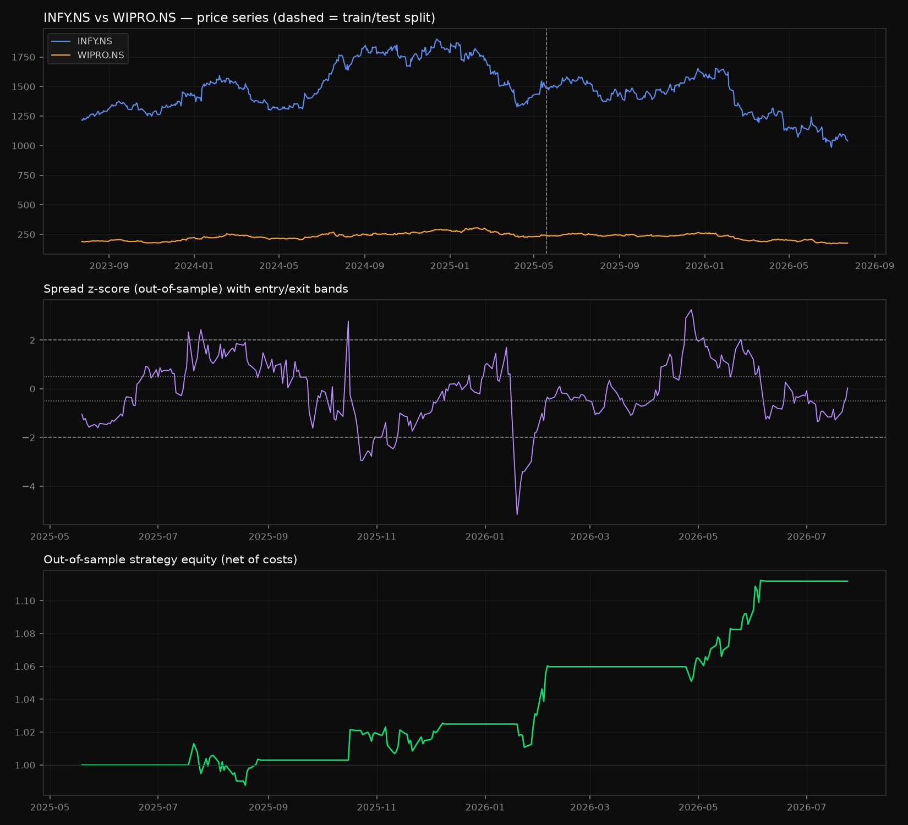

---

### HCLTECH.NS / TECHM.NS

- **Latest prices:** HCLTECH.NS ₹1,271.00 · TECHM.NS ₹1,559.50
- **Hedge ratio (train-fitted):** 0.8111
- **Cointegration (train):** FAIL at 5% — ADF -1.88, p=0.3399
- **Persistence:** passed 5% in 0 of 17 real-data runs (strict tier: 0/17)
- **Spread half-life:** 26.3 days
- **Current z-score:** +0.70
- **Signal today:** watch (approaching band)
- ⚠️ _Pair did not cointegrate on training data. Any signal here is not statistically justified — observation only._

**Out-of-sample backtest** (beta frozen from train window):

| Metric | Value |
|---|---|
| Sharpe | -0.10 |
| Sortino | -0.10 |
| Annualised return | -1.03% |
| Annualised vol | 7.60% |
| Max drawdown | -8.36% |
| Round-trip trades | 4 |

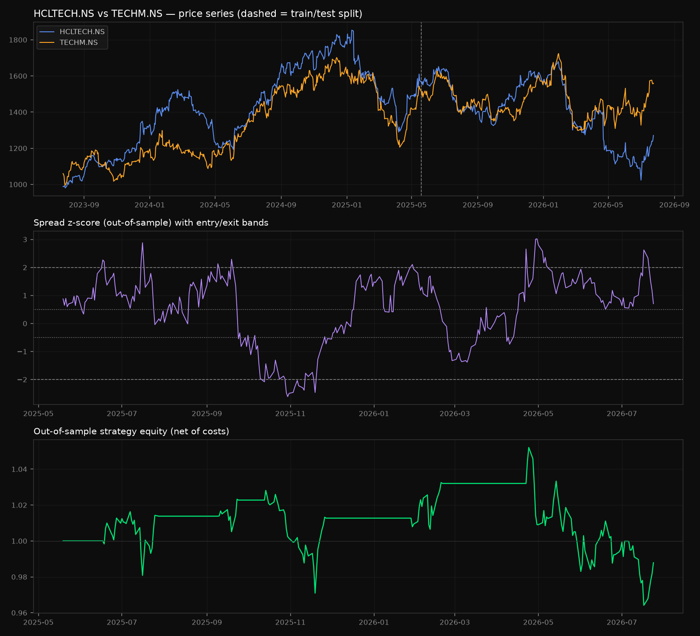

---

### ACC.NS / AMBUJACEM.NS

- **Latest prices:** ACC.NS ₹1,340.90 · AMBUJACEM.NS ₹425.15
- **Hedge ratio (train-fitted):** 0.2383
- **Cointegration (train):** FAIL at 5% — ADF -0.81, p=0.8155
- **Persistence:** passed 5% in 0 of 17 real-data runs (strict tier: 0/17)
- **Spread half-life:** 88.6 days
- **Current z-score:** -0.31
- **Signal today:** flat / no stretch
- ⚠️ _Pair did not cointegrate on training data. Any signal here is not statistically justified — observation only._

**Out-of-sample backtest** (beta frozen from train window):

| Metric | Value |
|---|---|
| Sharpe | 1.06 |
| Sortino | 0.90 |
| Annualised return | 5.83% |
| Annualised vol | 5.51% |
| Max drawdown | -4.38% |
| Round-trip trades | 5 |

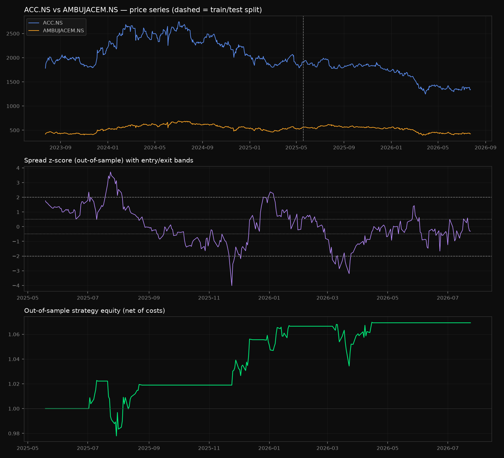

---

### ULTRACEMCO.NS / SHREECEM.NS

- **Latest prices:** ULTRACEMCO.NS ₹11,846.00 · SHREECEM.NS ₹26,740.00
- **Hedge ratio (train-fitted):** 0.6255
- **Cointegration (train):** FAIL at 5% — ADF -1.94, p=0.3115
- **Persistence:** passed 5% in 0 of 17 real-data runs (strict tier: 0/17)
- **Spread half-life:** 37.6 days
- **Current z-score:** +1.44
- **Signal today:** watch (approaching band)
- ⚠️ _Pair did not cointegrate on training data. Any signal here is not statistically justified — observation only._

**Out-of-sample backtest** (beta frozen from train window):

| Metric | Value |
|---|---|
| Sharpe | 0.25 |
| Sortino | 0.27 |
| Annualised return | 1.67% |
| Annualised vol | 7.75% |
| Max drawdown | -8.90% |
| Round-trip trades | 5 |

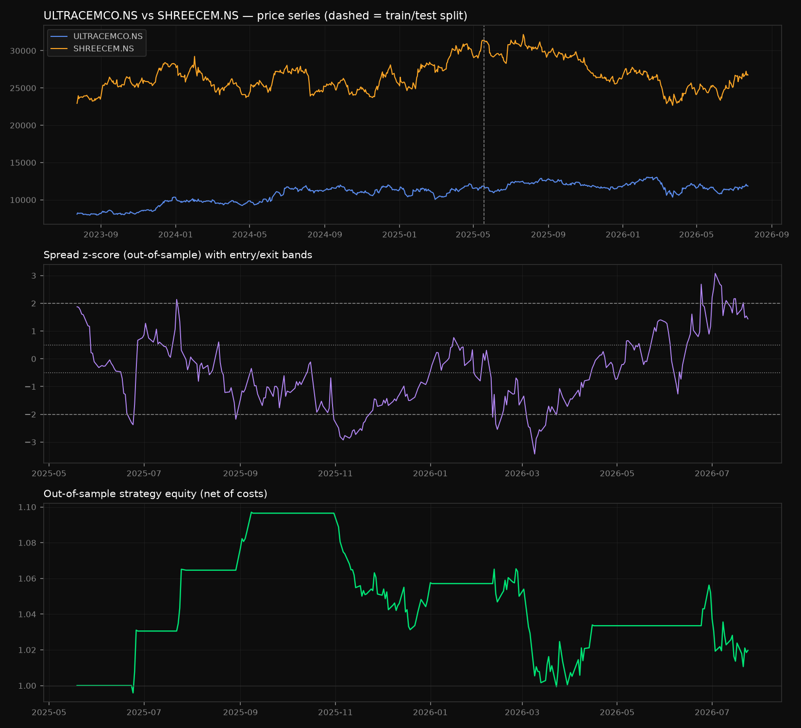

---

### IOC.NS / BPCL.NS

- **Latest prices:** IOC.NS ₹138.47 · BPCL.NS ₹310.15
- **Hedge ratio (train-fitted):** 1.7695
- **Cointegration (train):** FAIL at 5% — ADF -0.80, p=0.8191
- **Persistence:** passed 5% in 0 of 17 real-data runs (strict tier: 0/17)
- **Spread half-life:** 131.8 days
- **Current z-score:** +1.75
- **Signal today:** watch (approaching band)
- ⚠️ _Pair did not cointegrate on training data. Any signal here is not statistically justified — observation only._

**Out-of-sample backtest** (beta frozen from train window):

| Metric | Value |
|---|---|
| Sharpe | 0.60 |
| Sortino | 0.63 |
| Annualised return | 3.67% |
| Annualised vol | 6.35% |
| Max drawdown | -6.68% |
| Round-trip trades | 7 |

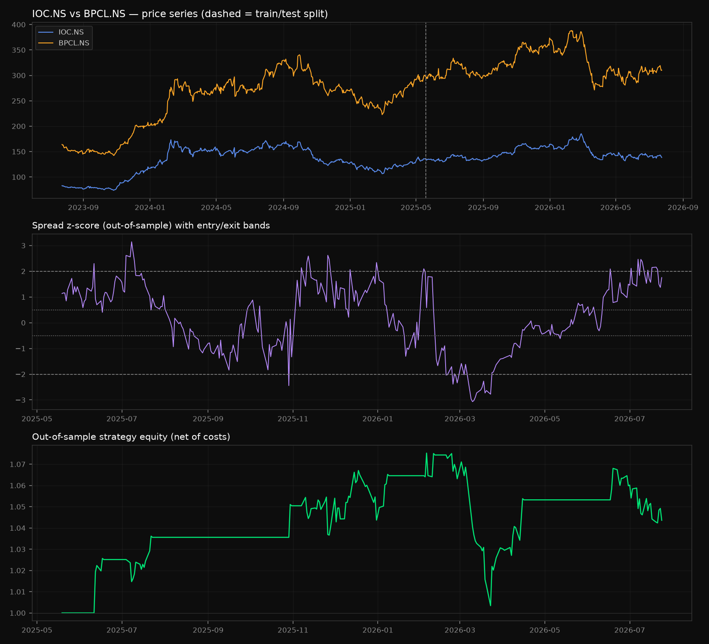

---

### BPCL.NS / HINDPETRO.NS

- **Latest prices:** BPCL.NS ₹310.15 · HINDPETRO.NS ₹381.10
- **Hedge ratio (train-fitted):** 1.4253
- **Cointegration (train):** FAIL at 5% — ADF -1.92, p=0.3227
- **Persistence:** passed 5% in 0 of 17 real-data runs (strict tier: 0/17)
- **Spread half-life:** 40.8 days
- **Current z-score:** -2.78
- **Signal today:** LONG spread (long HINDPETRO.NS, short BPCL.NS)
- ⚠️ _Pair did not cointegrate on training data. Any signal here is not statistically justified — observation only._

**Out-of-sample backtest** (beta frozen from train window):

| Metric | Value |
|---|---|
| Sharpe | -0.16 |
| Sortino | -0.13 |
| Annualised return | -1.06% |
| Annualised vol | 5.69% |
| Max drawdown | -6.92% |
| Round-trip trades | 4 |

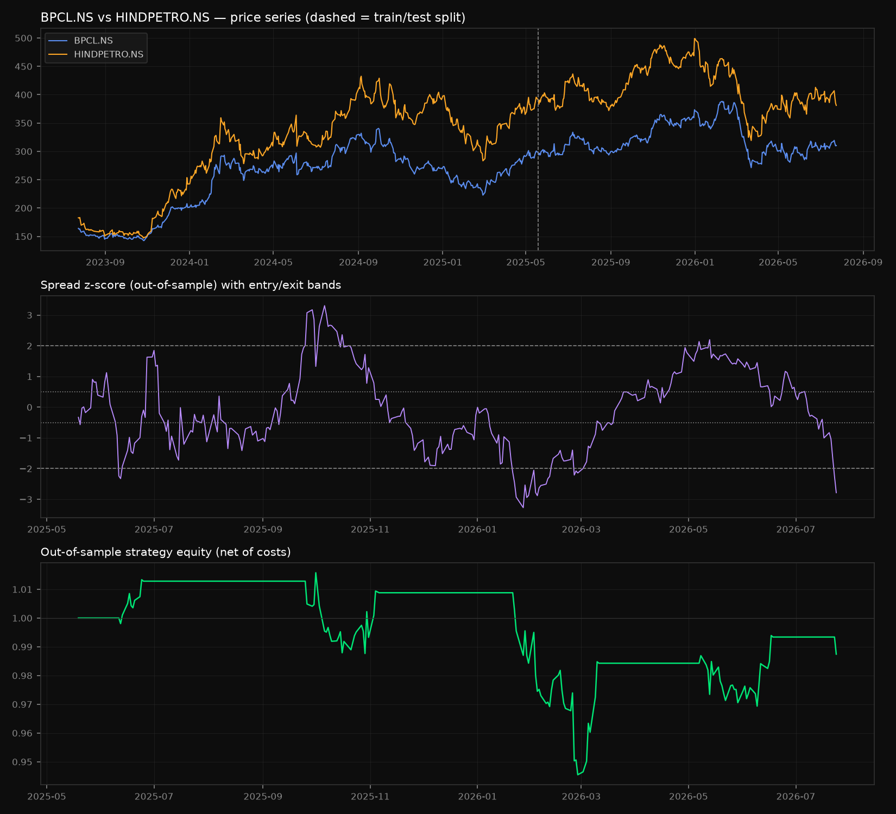

---

### ONGC.NS / COALINDIA.NS

- **Latest prices:** ONGC.NS ₹248.76 · COALINDIA.NS ₹427.40
- **Hedge ratio (train-fitted):** 1.7014
- **Cointegration (train):** PASS at 5% — ADF -3.06, p=0.0300
- **Persistence:** passed 5% in 9 of 17 real-data runs (strict tier: 0/17)
- **Spread half-life:** 15.8 days
- **Current z-score:** -0.03
- **Signal today:** flat / no stretch

**Out-of-sample backtest** (beta frozen from train window):

| Metric | Value |
|---|---|
| Sharpe | 0.84 |
| Sortino | 0.67 |
| Annualised return | 5.94% |
| Annualised vol | 7.18% |
| Max drawdown | -5.50% |
| Round-trip trades | 5 |

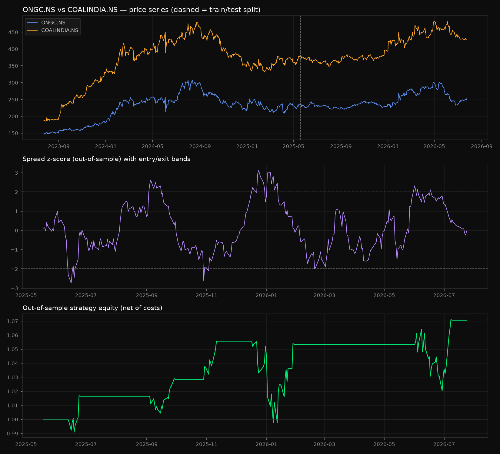

---

### NTPC.NS / POWERGRID.NS

- **Latest prices:** NTPC.NS ₹347.20 · POWERGRID.NS ₹288.20
- **Hedge ratio (train-fitted):** 0.8286
- **Cointegration (train):** FAIL at 5% — ADF -2.67, p=0.0793
- **Persistence:** passed 5% in 0 of 17 real-data runs (strict tier: 0/17)
- **Spread half-life:** 22.0 days
- **Current z-score:** +1.43
- **Signal today:** watch (approaching band)
- ⚠️ _Pair did not cointegrate on training data. Any signal here is not statistically justified — observation only._

**Out-of-sample backtest** (beta frozen from train window):

| Metric | Value |
|---|---|
| Sharpe | 0.42 |
| Sortino | 0.33 |
| Annualised return | 2.15% |
| Annualised vol | 5.37% |
| Max drawdown | -5.11% |
| Round-trip trades | 6 |

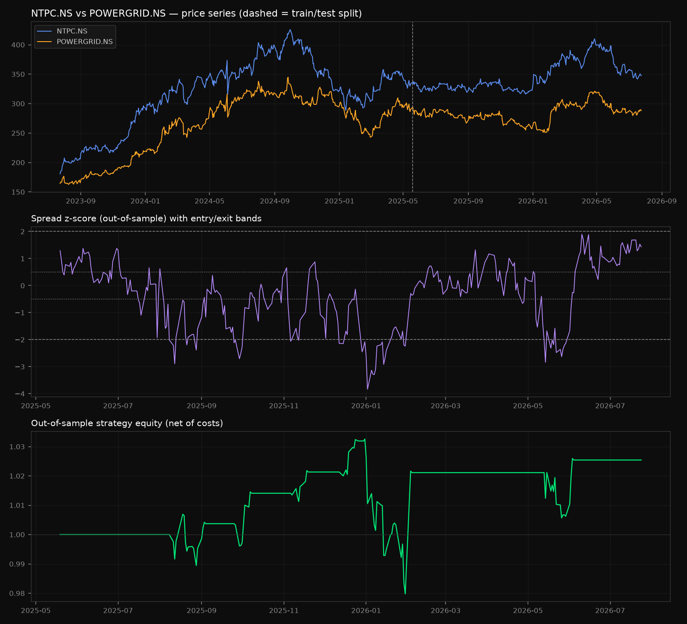

---

### BAJAJ-AUTO.NS / HEROMOTOCO.NS

- **Latest prices:** BAJAJ-AUTO.NS ₹11,130.00 · HEROMOTOCO.NS ₹5,011.10
- **Hedge ratio (train-fitted):** 0.4063
- **Cointegration (train):** FAIL at 5% — ADF -2.29, p=0.1748
- **Persistence:** passed 5% in 0 of 17 real-data runs (strict tier: 0/17)
- **Spread half-life:** 29.7 days
- **Current z-score:** -1.90
- **Signal today:** watch (approaching band)
- ⚠️ _Pair did not cointegrate on training data. Any signal here is not statistically justified — observation only._

**Out-of-sample backtest** (beta frozen from train window):

| Metric | Value |
|---|---|
| Sharpe | -1.35 |
| Sortino | -1.29 |
| Annualised return | -12.67% |
| Annualised vol | 9.67% |
| Max drawdown | -20.45% |
| Round-trip trades | 3 |

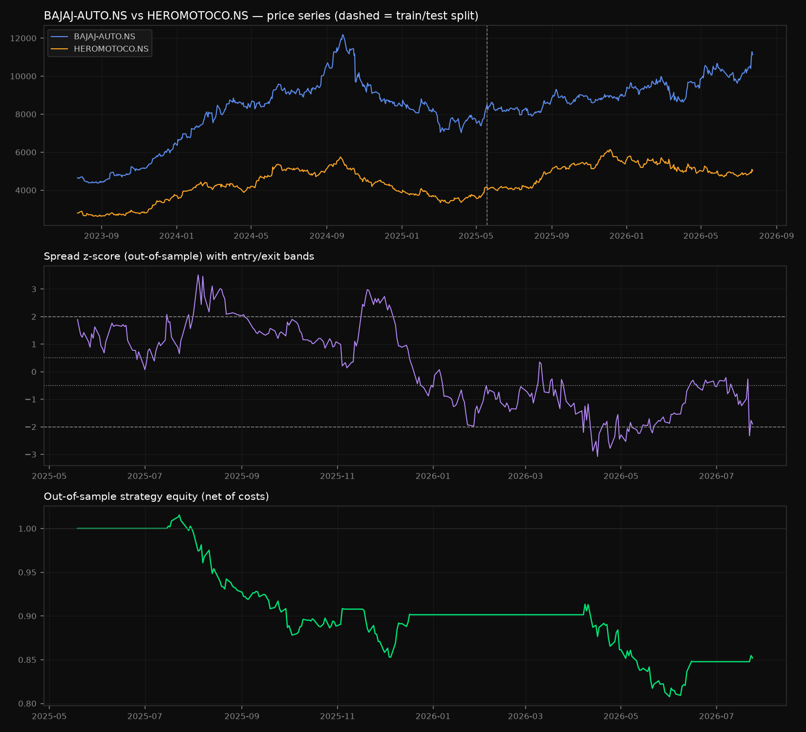

---

### TATASTEEL.NS / JSWSTEEL.NS

- **Latest prices:** TATASTEEL.NS ₹182.67 · JSWSTEEL.NS ₹1,240.80
- **Hedge ratio (train-fitted):** 3.0080
- **Cointegration (train):** FAIL at 5% — ADF -0.96, p=0.7680
- **Persistence:** passed 5% in 0 of 17 real-data runs (strict tier: 0/17)
- **Spread half-life:** 77.1 days
- **Current z-score:** +1.32
- **Signal today:** watch (approaching band)
- ⚠️ _Pair did not cointegrate on training data. Any signal here is not statistically justified — observation only._

**Out-of-sample backtest** (beta frozen from train window):

| Metric | Value |
|---|---|
| Sharpe | 0.35 |
| Sortino | 0.28 |
| Annualised return | 2.28% |
| Annualised vol | 7.27% |
| Max drawdown | -4.29% |
| Round-trip trades | 4 |

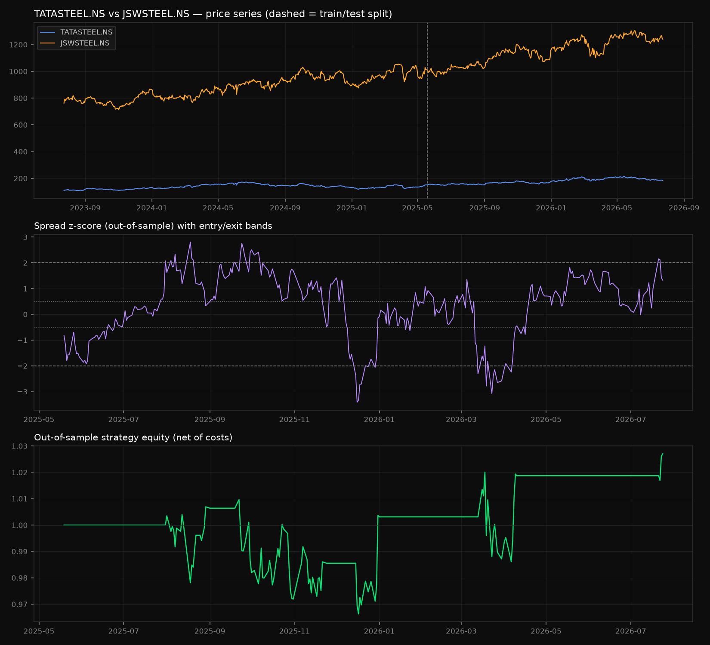

---

### SUNPHARMA.NS / CIPLA.NS

- **Latest prices:** SUNPHARMA.NS ₹1,941.10 · CIPLA.NS ₹1,410.60
- **Hedge ratio (train-fitted):** 0.4977
- **Cointegration (train):** PASS at 5% — ADF -3.95, p=0.0017 · **passes strict Bonferroni tier**
- **Persistence:** passed 5% in 17 of 17 real-data runs (strict tier: 5/17)
- **Spread half-life:** 9.5 days
- **Current z-score:** -0.79
- **Signal today:** watch (approaching band)

**Out-of-sample backtest** (beta frozen from train window):

| Metric | Value |
|---|---|
| Sharpe | -0.11 |
| Sortino | -0.12 |
| Annualised return | -1.14% |
| Annualised vol | 7.60% |
| Max drawdown | -10.22% |
| Round-trip trades | 5 |

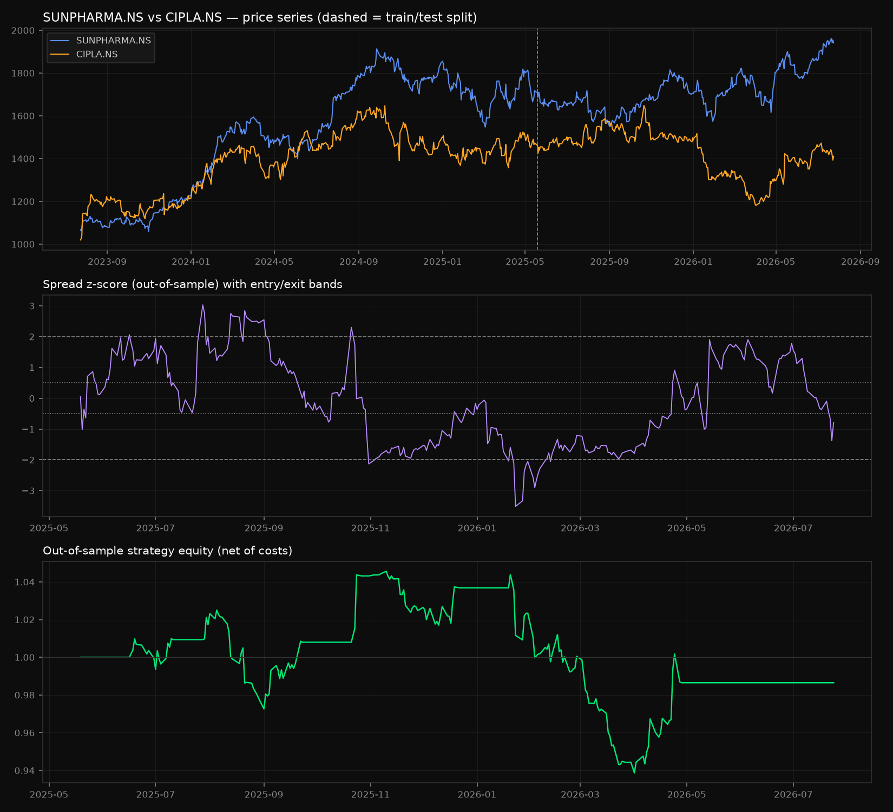

---

_Generated 2026-07-24 · pairs mean-reversion scanner · out-of-sample backtest · multiple-testing-aware · not investment advice._
