# Indian Pairs-Trading Scanner — 2026-07-27

> **What this is:** a market-neutral *pairs mean-reversion* scanner. It flags when two related NSE stocks have drifted apart far enough that their historical relationship signals a possible convergence trade. It does **not** forecast growth, rank "best" stocks, or predict company performance. A signal means the *spread between two stocks* is stretched — nothing about either stock being a good investment. Not investment advice; do your own research.

## Methodology (fixed in advance)

- **Universe:** 16 declared sector-mate pairs. Parameters (3y window, 60/40 train-test, z-entry 2.0, z-exit 0.5, 5 bps costs) are pre-registered; changes are logged in the README changelog *before* looking at results.
- **Multiple testing:** at the 5% level across 16 pairs, **≈0.8 false positives per run are expected by chance alone** even if nothing truly cointegrates. A single-day pass is a candidate, not a discovery.
- **Strict tier:** Bonferroni-corrected threshold p < 0.0031 (marked ✓✓).
- **Evidence = persistence:** the Persistence column counts how often each pair has passed the 5% test across all *real-data* daily runs recorded in `reports/history.csv`. Pairs deserve attention only when they pass persistently.

## Summary

| Pair | p-value | Coint. | Persistence | Current z | Signal | OOS Sharpe |
|---|---|---|---|---|---|---|
| HDFCBANK.NS/ICICIBANK.NS | 0.0973 | ✗ | 0/15 | +2.99 | SHORT spread | -0.52 |
| AXISBANK.NS/ICICIBANK.NS | 0.9261 | ✗ | 0/18 | +2.54 | SHORT spread | -0.41 |
| KOTAKBANK.NS/HDFCBANK.NS | 0.1657 | ✗ | 0/18 | -0.82 | watch | 0.11 |
| SBIN.NS/BANKBARODA.NS | 0.1842 | ✗ | 0/18 | -1.48 | watch | 0.39 |
| TCS.NS/INFY.NS | 0.4094 | ✗ | 0/18 | -1.93 | watch | 1.26 |
| INFY.NS/WIPRO.NS | 0.1877 | ✗ | 0/18 | -0.20 | flat / no stretch | 1.66 |
| HCLTECH.NS/TECHM.NS | 0.2980 | ✗ | 0/18 | +0.55 | watch | -0.09 |
| ACC.NS/AMBUJACEM.NS | 0.8185 | ✗ | 0/18 | +0.05 | flat / no stretch | 0.57 |
| ULTRACEMCO.NS/SHREECEM.NS | 0.2964 | ✗ | 0/18 | +1.50 | watch | 0.23 |
| IOC.NS/BPCL.NS | 0.7958 | ✗ | 0/18 | +1.78 | watch | 0.58 |
| BPCL.NS/HINDPETRO.NS | 0.3163 | ✗ | 0/18 | -2.18 | LONG spread | -0.08 |
| ONGC.NS/COALINDIA.NS | 0.0263 | ✓ | 10/18 | +0.57 | watch | 0.84 |
| NTPC.NS/POWERGRID.NS | 0.0780 | ✗ | 0/18 | +1.15 | watch | 0.38 |
| BAJAJ-AUTO.NS/HEROMOTOCO.NS | 0.1778 | ✗ | 0/18 | -1.25 | watch | -1.26 |
| TATASTEEL.NS/JSWSTEEL.NS | 0.7542 | ✗ | 0/18 | +1.24 | watch | 0.35 |
| SUNPHARMA.NS/CIPLA.NS | 0.0105 | ✓ | 18/18 | -1.25 | watch | -0.11 |

_Legend: ✓✓ passes strict Bonferroni tier · ✓ passes 5% only · ✗ fails. Persistence = 5%-passes / real-data runs recorded. \*no real-data history yet._

---

### HDFCBANK.NS / ICICIBANK.NS

- **Latest prices:** HDFCBANK.NS ₹739.55 · ICICIBANK.NS ₹1,445.70
- **Hedge ratio (train-fitted):** 1.7653
- **Cointegration (train):** FAIL at 5% — ADF -2.58, p=0.0973
- **Persistence:** passed 5% in 0 of 15 real-data runs (strict tier: 0/15)
- **Spread half-life:** 29.6 days
- **Current z-score:** +2.99
- **Signal today:** SHORT spread (short ICICIBANK.NS, long HDFCBANK.NS)
- ⚠️ _Pair did not cointegrate on training data. Any signal here is not statistically justified — observation only._

**Out-of-sample backtest** (beta frozen from train window):

| Metric | Value |
|---|---|
| Sharpe | -0.52 |
| Sortino | -0.50 |
| Annualised return | -3.24% |
| Annualised vol | 5.97% |
| Max drawdown | -8.70% |
| Round-trip trades | 5 |

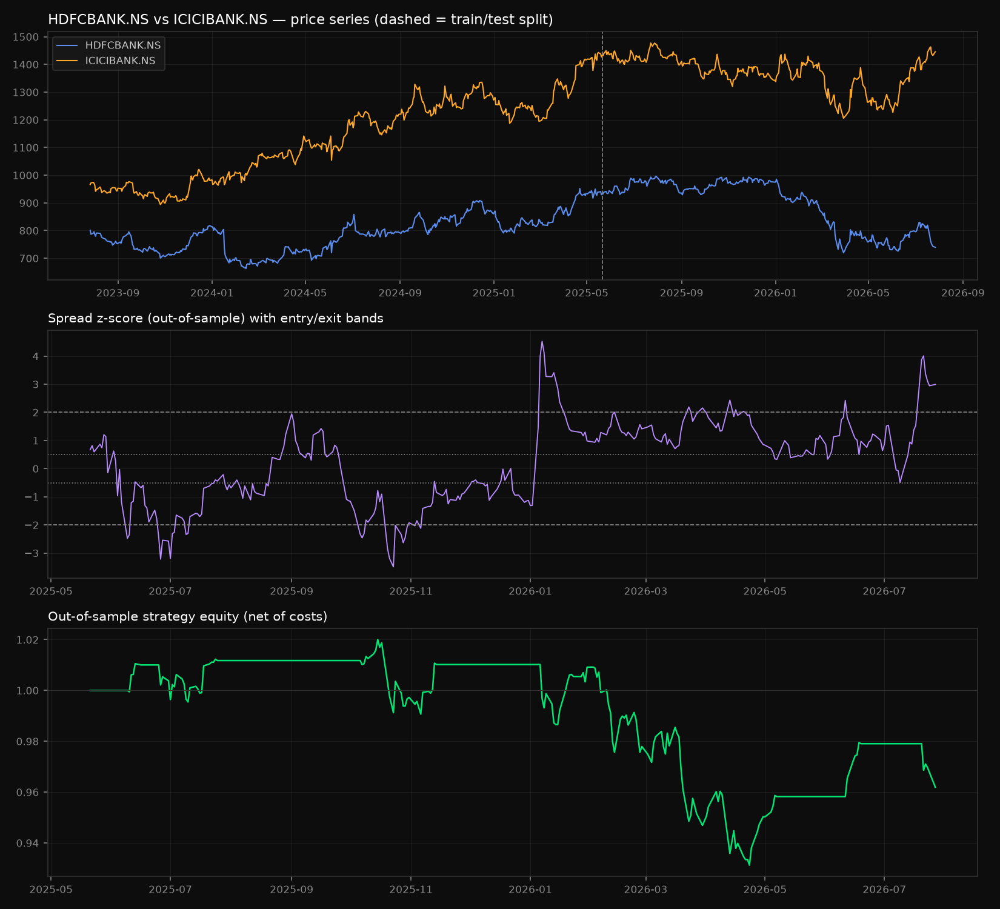

---

### AXISBANK.NS / ICICIBANK.NS

- **Latest prices:** AXISBANK.NS ₹1,227.50 · ICICIBANK.NS ₹1,445.70
- **Hedge ratio (train-fitted):** 0.9139
- **Cointegration (train):** FAIL at 5% — ADF -0.30, p=0.9261
- **Persistence:** passed 5% in 0 of 18 real-data runs (strict tier: 0/18)
- **Spread half-life:** 271.0 days
- **Current z-score:** +2.54
- **Signal today:** SHORT spread (short ICICIBANK.NS, long AXISBANK.NS)
- ⚠️ _Pair did not cointegrate on training data. Any signal here is not statistically justified — observation only._

**Out-of-sample backtest** (beta frozen from train window):

| Metric | Value |
|---|---|
| Sharpe | -0.41 |
| Sortino | -0.41 |
| Annualised return | -3.81% |
| Annualised vol | 8.62% |
| Max drawdown | -8.08% |
| Round-trip trades | 6 |

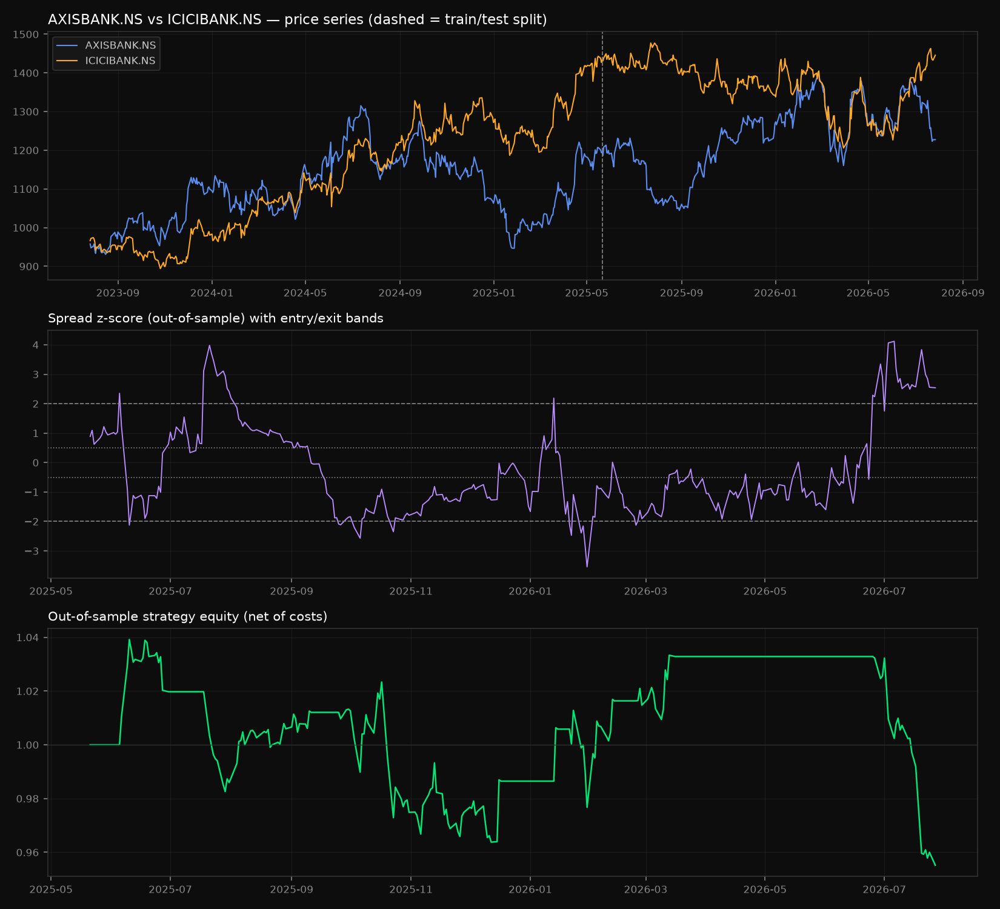

---

### KOTAKBANK.NS / HDFCBANK.NS

- **Latest prices:** KOTAKBANK.NS ₹384.65 · HDFCBANK.NS ₹739.55
- **Hedge ratio (train-fitted):** 1.8742
- **Cointegration (train):** FAIL at 5% — ADF -2.32, p=0.1657
- **Persistence:** passed 5% in 0 of 18 real-data runs (strict tier: 0/18)
- **Spread half-life:** 28.0 days
- **Current z-score:** -0.82
- **Signal today:** watch (approaching band)
- ⚠️ _Pair did not cointegrate on training data. Any signal here is not statistically justified — observation only._

**Out-of-sample backtest** (beta frozen from train window):

| Metric | Value |
|---|---|
| Sharpe | 0.11 |
| Sortino | 0.09 |
| Annualised return | 0.52% |
| Annualised vol | 6.40% |
| Max drawdown | -5.73% |
| Round-trip trades | 4 |

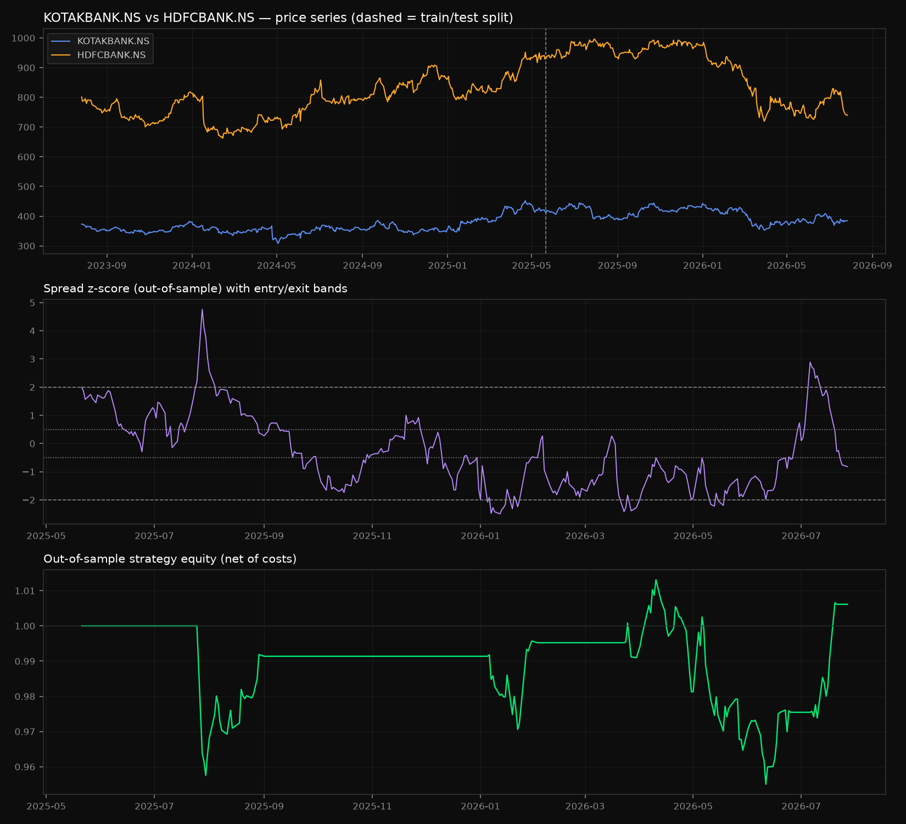

---

### SBIN.NS / BANKBARODA.NS

- **Latest prices:** SBIN.NS ₹1,020.60 · BANKBARODA.NS ₹244.00
- **Hedge ratio (train-fitted):** 0.2069
- **Cointegration (train):** FAIL at 5% — ADF -2.26, p=0.1842
- **Persistence:** passed 5% in 0 of 18 real-data runs (strict tier: 0/18)
- **Spread half-life:** 23.1 days
- **Current z-score:** -1.48
- **Signal today:** watch (approaching band)
- ⚠️ _Pair did not cointegrate on training data. Any signal here is not statistically justified — observation only._

**Out-of-sample backtest** (beta frozen from train window):

| Metric | Value |
|---|---|
| Sharpe | 0.39 |
| Sortino | 0.27 |
| Annualised return | 3.03% |
| Annualised vol | 8.69% |
| Max drawdown | -9.22% |
| Round-trip trades | 5 |

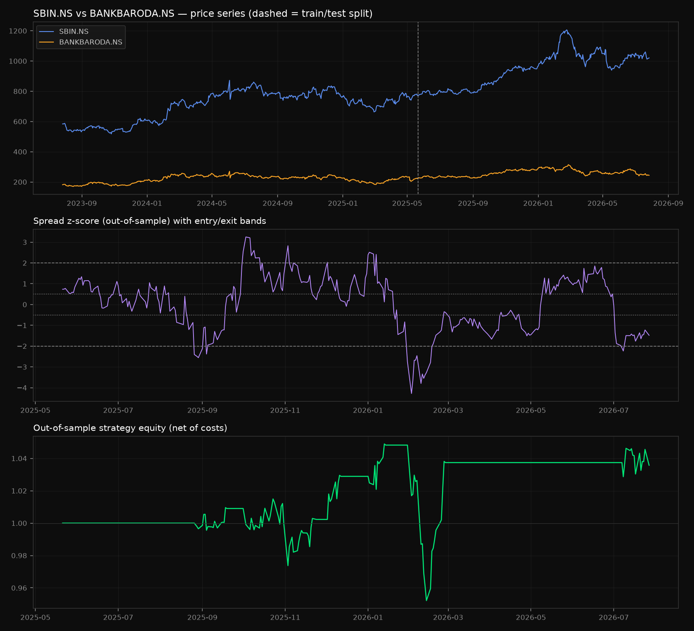

---

### TCS.NS / INFY.NS

- **Latest prices:** TCS.NS ₹2,295.60 · INFY.NS ₹1,079.20
- **Hedge ratio (train-fitted):** 0.5274
- **Cointegration (train):** FAIL at 5% — ADF -1.74, p=0.4094
- **Persistence:** passed 5% in 0 of 18 real-data runs (strict tier: 0/18)
- **Spread half-life:** 42.8 days
- **Current z-score:** -1.93
- **Signal today:** watch (approaching band)
- ⚠️ _Pair did not cointegrate on training data. Any signal here is not statistically justified — observation only._

**Out-of-sample backtest** (beta frozen from train window):

| Metric | Value |
|---|---|
| Sharpe | 1.26 |
| Sortino | 1.19 |
| Annualised return | 5.44% |
| Annualised vol | 4.29% |
| Max drawdown | -4.20% |
| Round-trip trades | 7 |

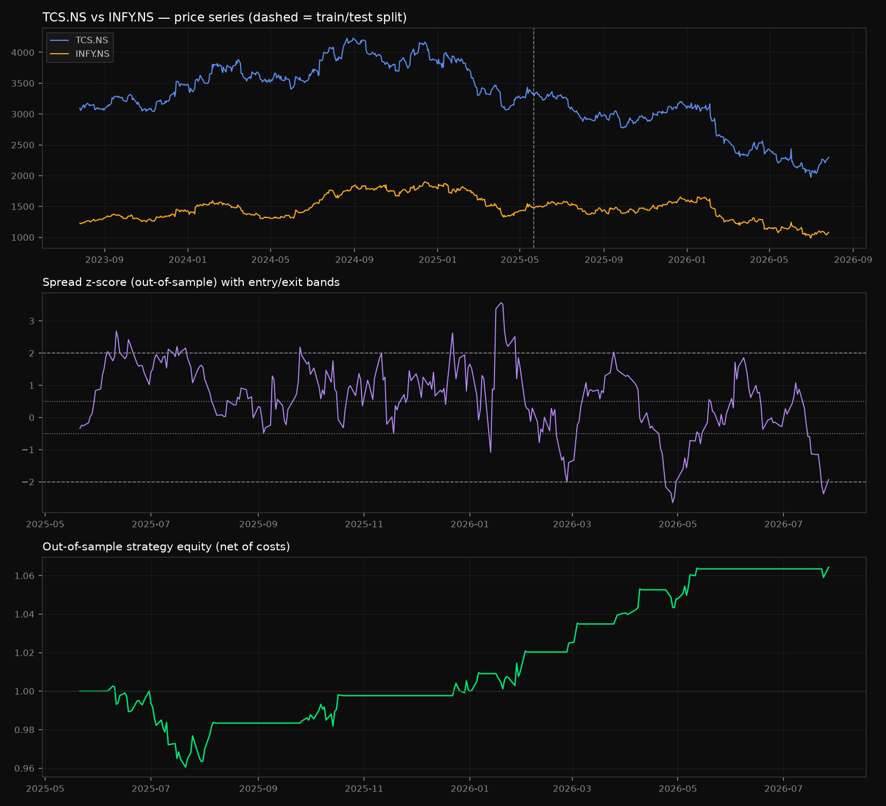

---

### INFY.NS / WIPRO.NS

- **Latest prices:** INFY.NS ₹1,079.20 · WIPRO.NS ₹178.53
- **Hedge ratio (train-fitted):** 0.1377
- **Cointegration (train):** FAIL at 5% — ADF -2.25, p=0.1877
- **Persistence:** passed 5% in 0 of 18 real-data runs (strict tier: 0/18)
- **Spread half-life:** 30.1 days
- **Current z-score:** -0.20
- **Signal today:** flat / no stretch
- ⚠️ _Pair did not cointegrate on training data. Any signal here is not statistically justified — observation only._

**Out-of-sample backtest** (beta frozen from train window):

| Metric | Value |
|---|---|
| Sharpe | 1.66 |
| Sortino | 1.95 |
| Annualised return | 8.96% |
| Annualised vol | 5.24% |
| Max drawdown | -2.50% |
| Round-trip trades | 6 |

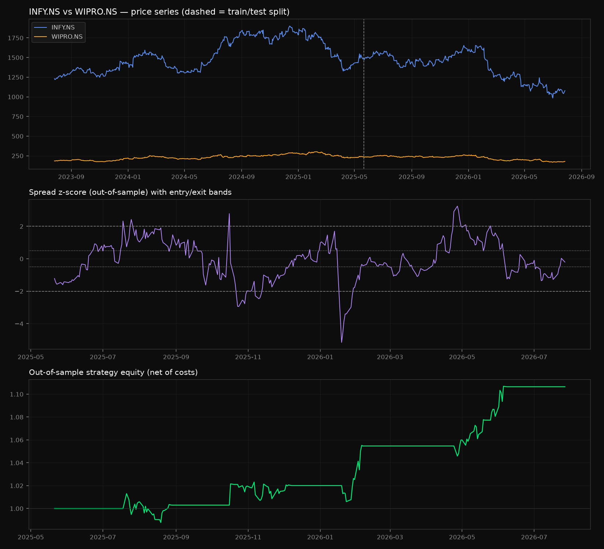

---

### HCLTECH.NS / TECHM.NS

- **Latest prices:** HCLTECH.NS ₹1,295.90 · TECHM.NS ₹1,575.00
- **Hedge ratio (train-fitted):** 0.8166
- **Cointegration (train):** FAIL at 5% — ADF -1.97, p=0.2980
- **Persistence:** passed 5% in 0 of 18 real-data runs (strict tier: 0/18)
- **Spread half-life:** 27.0 days
- **Current z-score:** +0.55
- **Signal today:** watch (approaching band)
- ⚠️ _Pair did not cointegrate on training data. Any signal here is not statistically justified — observation only._

**Out-of-sample backtest** (beta frozen from train window):

| Metric | Value |
|---|---|
| Sharpe | -0.09 |
| Sortino | -0.10 |
| Annualised return | -0.98% |
| Annualised vol | 7.59% |
| Max drawdown | -8.32% |
| Round-trip trades | 4 |

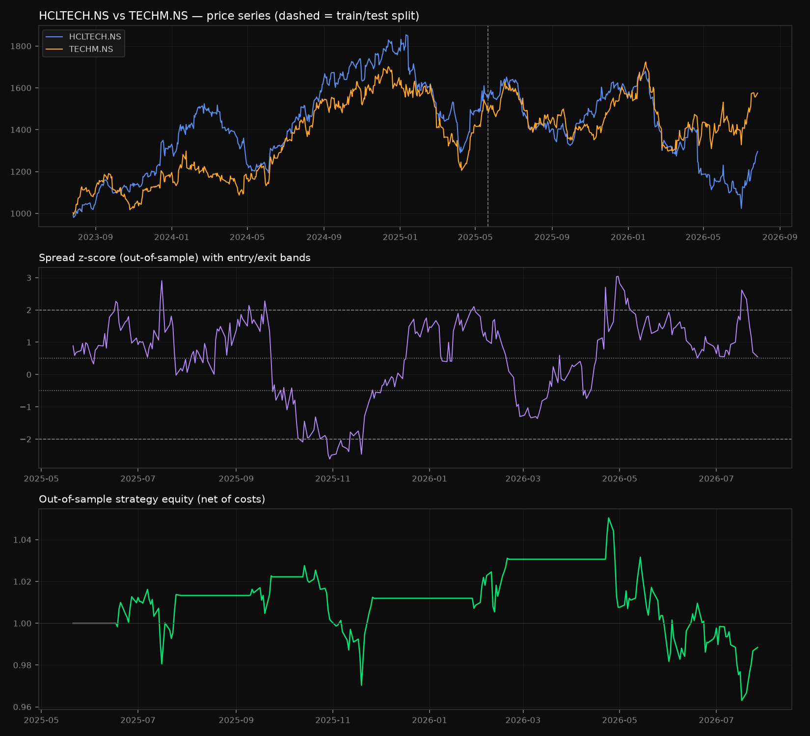

---

### ACC.NS / AMBUJACEM.NS

- **Latest prices:** ACC.NS ₹1,358.10 · AMBUJACEM.NS ₹430.95
- **Hedge ratio (train-fitted):** 0.2358
- **Cointegration (train):** FAIL at 5% — ADF -0.80, p=0.8185
- **Persistence:** passed 5% in 0 of 18 real-data runs (strict tier: 0/18)
- **Spread half-life:** 86.6 days
- **Current z-score:** +0.05
- **Signal today:** flat / no stretch
- ⚠️ _Pair did not cointegrate on training data. Any signal here is not statistically justified — observation only._

**Out-of-sample backtest** (beta frozen from train window):

| Metric | Value |
|---|---|
| Sharpe | 0.57 |
| Sortino | 0.50 |
| Annualised return | 3.12% |
| Annualised vol | 5.71% |
| Max drawdown | -7.32% |
| Round-trip trades | 4 |

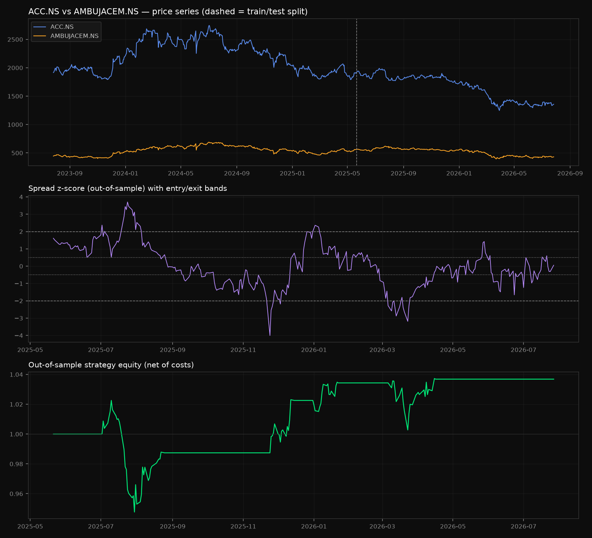

---

### ULTRACEMCO.NS / SHREECEM.NS

- **Latest prices:** ULTRACEMCO.NS ₹11,881.00 · SHREECEM.NS ₹26,860.00
- **Hedge ratio (train-fitted):** 0.6298
- **Cointegration (train):** FAIL at 5% — ADF -1.98, p=0.2964
- **Persistence:** passed 5% in 0 of 18 real-data runs (strict tier: 0/18)
- **Spread half-life:** 41.3 days
- **Current z-score:** +1.50
- **Signal today:** watch (approaching band)
- ⚠️ _Pair did not cointegrate on training data. Any signal here is not statistically justified — observation only._

**Out-of-sample backtest** (beta frozen from train window):

| Metric | Value |
|---|---|
| Sharpe | 0.23 |
| Sortino | 0.24 |
| Annualised return | 1.47% |
| Annualised vol | 7.80% |
| Max drawdown | -8.92% |
| Round-trip trades | 5 |

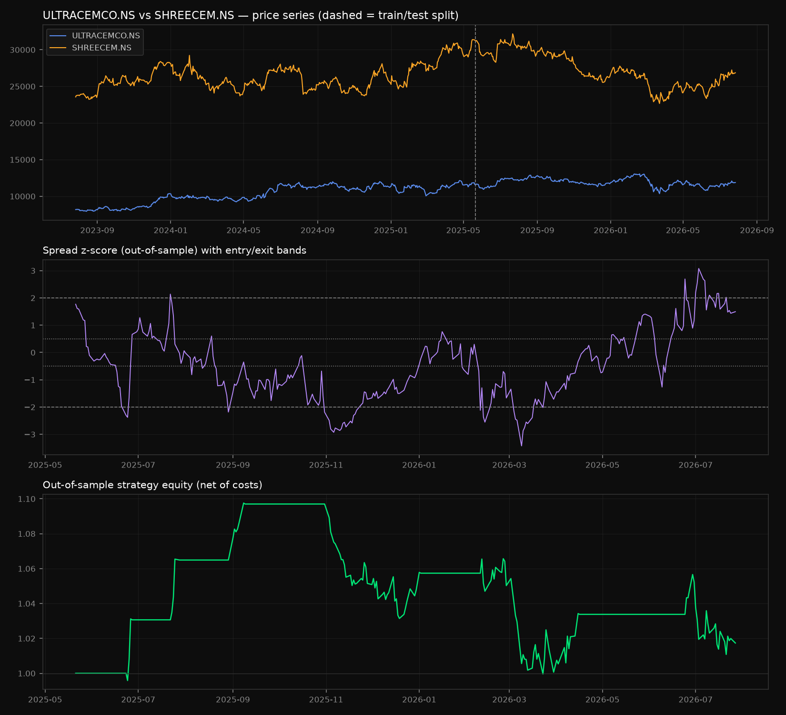

---

### IOC.NS / BPCL.NS

- **Latest prices:** IOC.NS ₹141.52 · BPCL.NS ₹316.25
- **Hedge ratio (train-fitted):** 1.7696
- **Cointegration (train):** FAIL at 5% — ADF -0.88, p=0.7958
- **Persistence:** passed 5% in 0 of 18 real-data runs (strict tier: 0/18)
- **Spread half-life:** 121.1 days
- **Current z-score:** +1.78
- **Signal today:** watch (approaching band)
- ⚠️ _Pair did not cointegrate on training data. Any signal here is not statistically justified — observation only._

**Out-of-sample backtest** (beta frozen from train window):

| Metric | Value |
|---|---|
| Sharpe | 0.58 |
| Sortino | 0.61 |
| Annualised return | 3.59% |
| Annualised vol | 6.41% |
| Max drawdown | -6.72% |
| Round-trip trades | 7 |

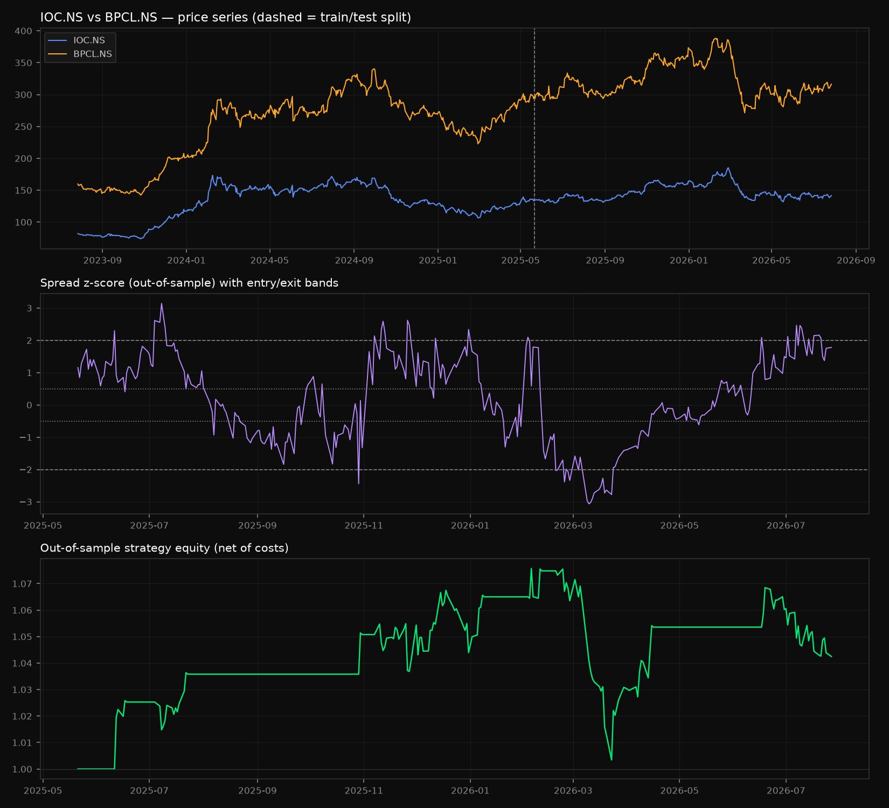

---

### BPCL.NS / HINDPETRO.NS

- **Latest prices:** BPCL.NS ₹316.25 · HINDPETRO.NS ₹393.95
- **Hedge ratio (train-fitted):** 1.4260
- **Cointegration (train):** FAIL at 5% — ADF -1.93, p=0.3163
- **Persistence:** passed 5% in 0 of 18 real-data runs (strict tier: 0/18)
- **Spread half-life:** 40.5 days
- **Current z-score:** -2.18
- **Signal today:** LONG spread (long HINDPETRO.NS, short BPCL.NS)
- ⚠️ _Pair did not cointegrate on training data. Any signal here is not statistically justified — observation only._

**Out-of-sample backtest** (beta frozen from train window):

| Metric | Value |
|---|---|
| Sharpe | -0.08 |
| Sortino | -0.07 |
| Annualised return | -0.64% |
| Annualised vol | 5.73% |
| Max drawdown | -6.93% |
| Round-trip trades | 4 |

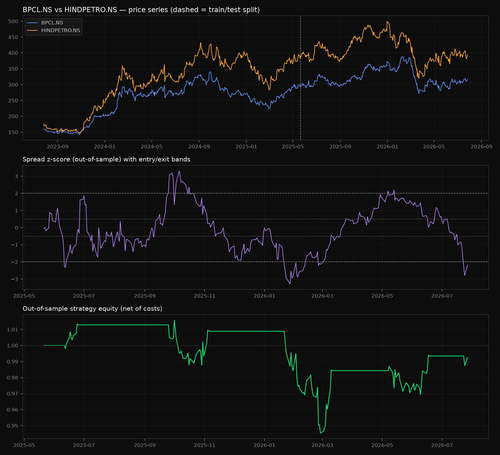

---

### ONGC.NS / COALINDIA.NS

- **Latest prices:** ONGC.NS ₹238.56 · COALINDIA.NS ₹427.50
- **Hedge ratio (train-fitted):** 1.6891
- **Cointegration (train):** PASS at 5% — ADF -3.10, p=0.0263
- **Persistence:** passed 5% in 10 of 18 real-data runs (strict tier: 0/18)
- **Spread half-life:** 15.4 days
- **Current z-score:** +0.57
- **Signal today:** watch (approaching band)

**Out-of-sample backtest** (beta frozen from train window):

| Metric | Value |
|---|---|
| Sharpe | 0.84 |
| Sortino | 0.66 |
| Annualised return | 5.89% |
| Annualised vol | 7.14% |
| Max drawdown | -5.49% |
| Round-trip trades | 5 |

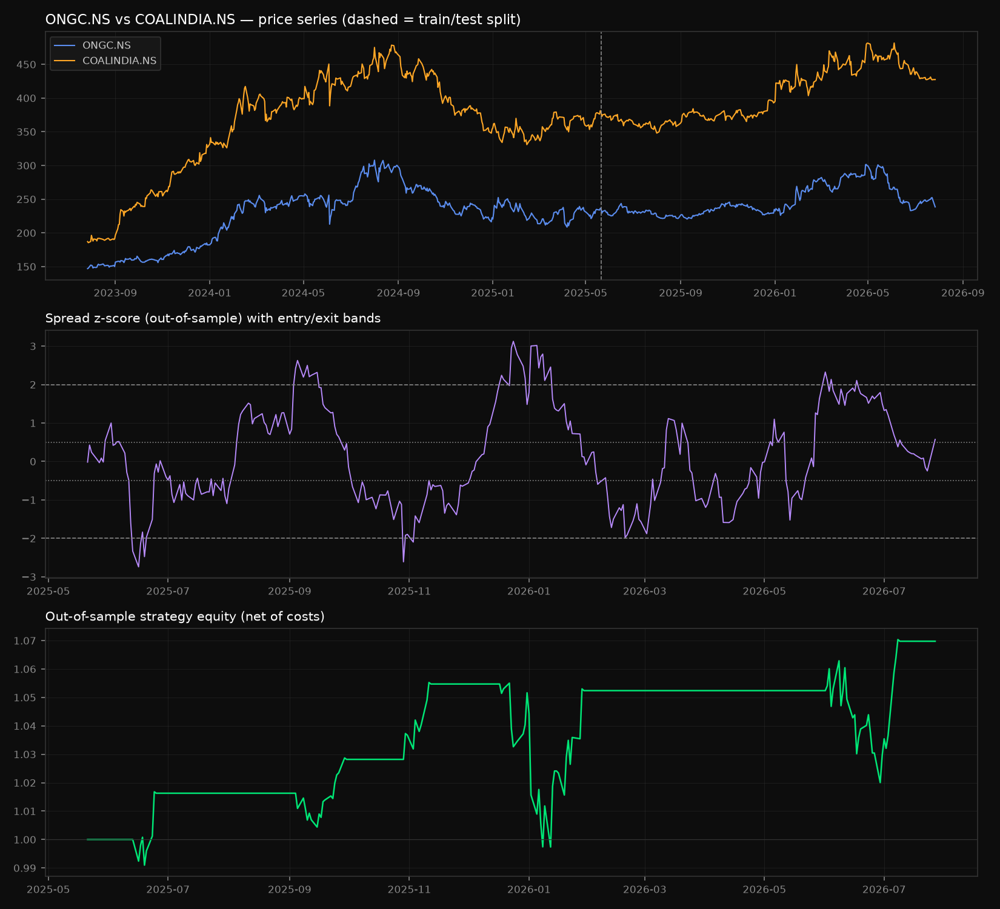

---

### NTPC.NS / POWERGRID.NS

- **Latest prices:** NTPC.NS ₹350.80 · POWERGRID.NS ₹288.85
- **Hedge ratio (train-fitted):** 0.8327
- **Cointegration (train):** FAIL at 5% — ADF -2.68, p=0.0780
- **Persistence:** passed 5% in 0 of 18 real-data runs (strict tier: 0/18)
- **Spread half-life:** 21.8 days
- **Current z-score:** +1.15
- **Signal today:** watch (approaching band)
- ⚠️ _Pair did not cointegrate on training data. Any signal here is not statistically justified — observation only._

**Out-of-sample backtest** (beta frozen from train window):

| Metric | Value |
|---|---|
| Sharpe | 0.38 |
| Sortino | 0.29 |
| Annualised return | 1.94% |
| Annualised vol | 5.44% |
| Max drawdown | -5.18% |
| Round-trip trades | 6 |

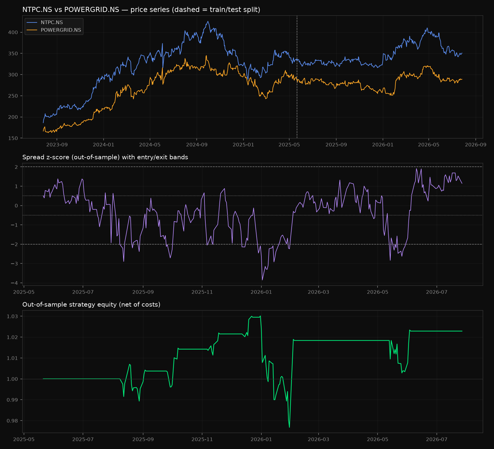

---

### BAJAJ-AUTO.NS / HEROMOTOCO.NS

- **Latest prices:** BAJAJ-AUTO.NS ₹11,183.50 · HEROMOTOCO.NS ₹5,113.80
- **Hedge ratio (train-fitted):** 0.4067
- **Cointegration (train):** FAIL at 5% — ADF -2.28, p=0.1778
- **Persistence:** passed 5% in 0 of 18 real-data runs (strict tier: 0/18)
- **Spread half-life:** 29.7 days
- **Current z-score:** -1.25
- **Signal today:** watch (approaching band)
- ⚠️ _Pair did not cointegrate on training data. Any signal here is not statistically justified — observation only._

**Out-of-sample backtest** (beta frozen from train window):

| Metric | Value |
|---|---|
| Sharpe | -1.26 |
| Sortino | -1.21 |
| Annualised return | -12.21% |
| Annualised vol | 9.97% |
| Max drawdown | -20.90% |
| Round-trip trades | 3 |

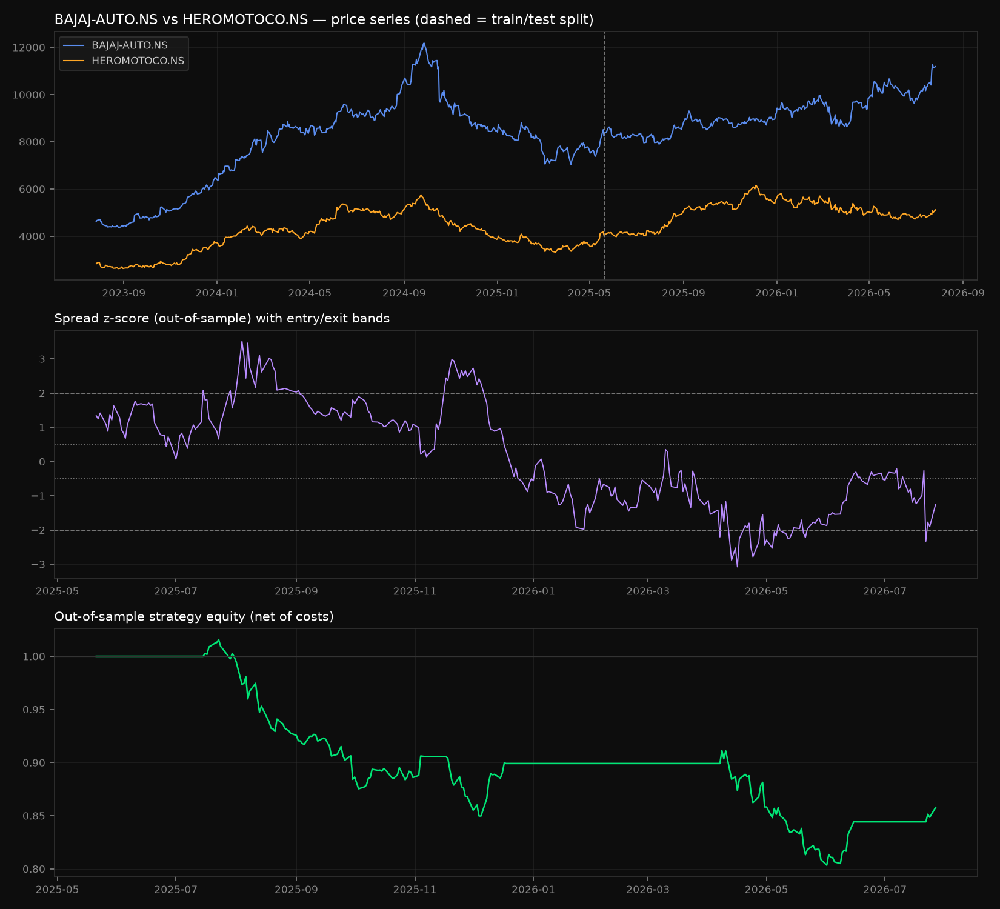

---

### TATASTEEL.NS / JSWSTEEL.NS

- **Latest prices:** TATASTEEL.NS ₹184.25 · JSWSTEEL.NS ₹1,244.60
- **Hedge ratio (train-fitted):** 3.0124
- **Cointegration (train):** FAIL at 5% — ADF -1.00, p=0.7542
- **Persistence:** passed 5% in 0 of 18 real-data runs (strict tier: 0/18)
- **Spread half-life:** 74.6 days
- **Current z-score:** +1.24
- **Signal today:** watch (approaching band)
- ⚠️ _Pair did not cointegrate on training data. Any signal here is not statistically justified — observation only._

**Out-of-sample backtest** (beta frozen from train window):

| Metric | Value |
|---|---|
| Sharpe | 0.35 |
| Sortino | 0.29 |
| Annualised return | 2.34% |
| Annualised vol | 7.31% |
| Max drawdown | -4.31% |
| Round-trip trades | 4 |

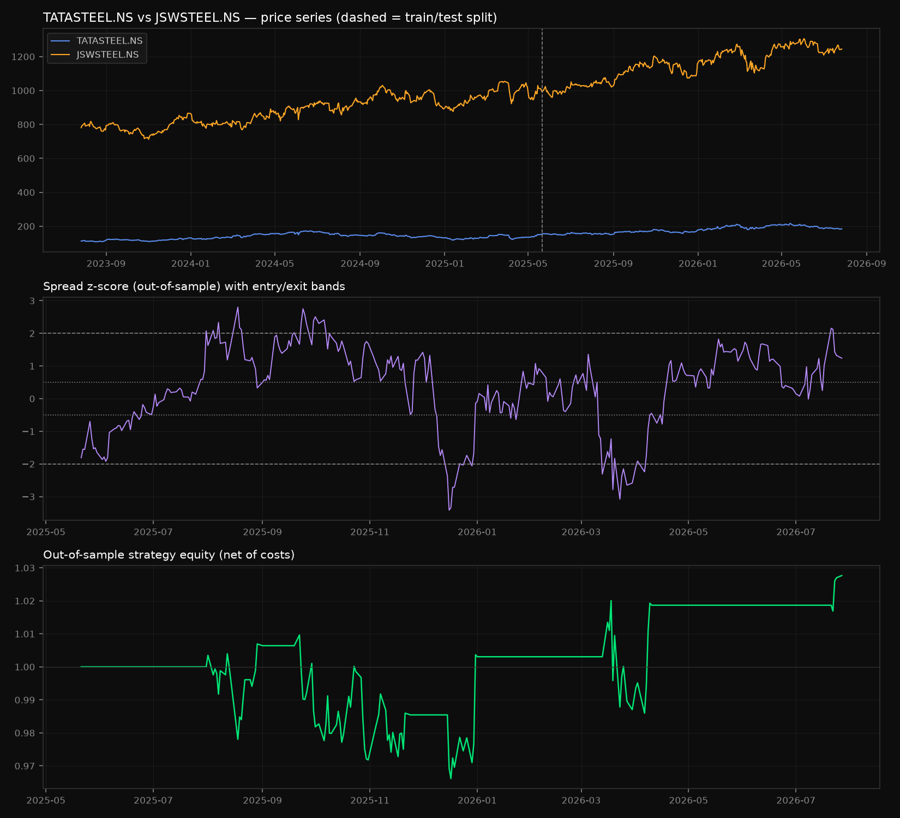

---

### SUNPHARMA.NS / CIPLA.NS

- **Latest prices:** SUNPHARMA.NS ₹1,973.70 · CIPLA.NS ₹1,409.40
- **Hedge ratio (train-fitted):** 0.4911
- **Cointegration (train):** PASS at 5% — ADF -3.41, p=0.0105
- **Persistence:** passed 5% in 18 of 18 real-data runs (strict tier: 5/18)
- **Spread half-life:** 10.7 days
- **Current z-score:** -1.25
- **Signal today:** watch (approaching band)

**Out-of-sample backtest** (beta frozen from train window):

| Metric | Value |
|---|---|
| Sharpe | -0.11 |
| Sortino | -0.12 |
| Annualised return | -1.11% |
| Annualised vol | 7.66% |
| Max drawdown | -10.28% |
| Round-trip trades | 5 |

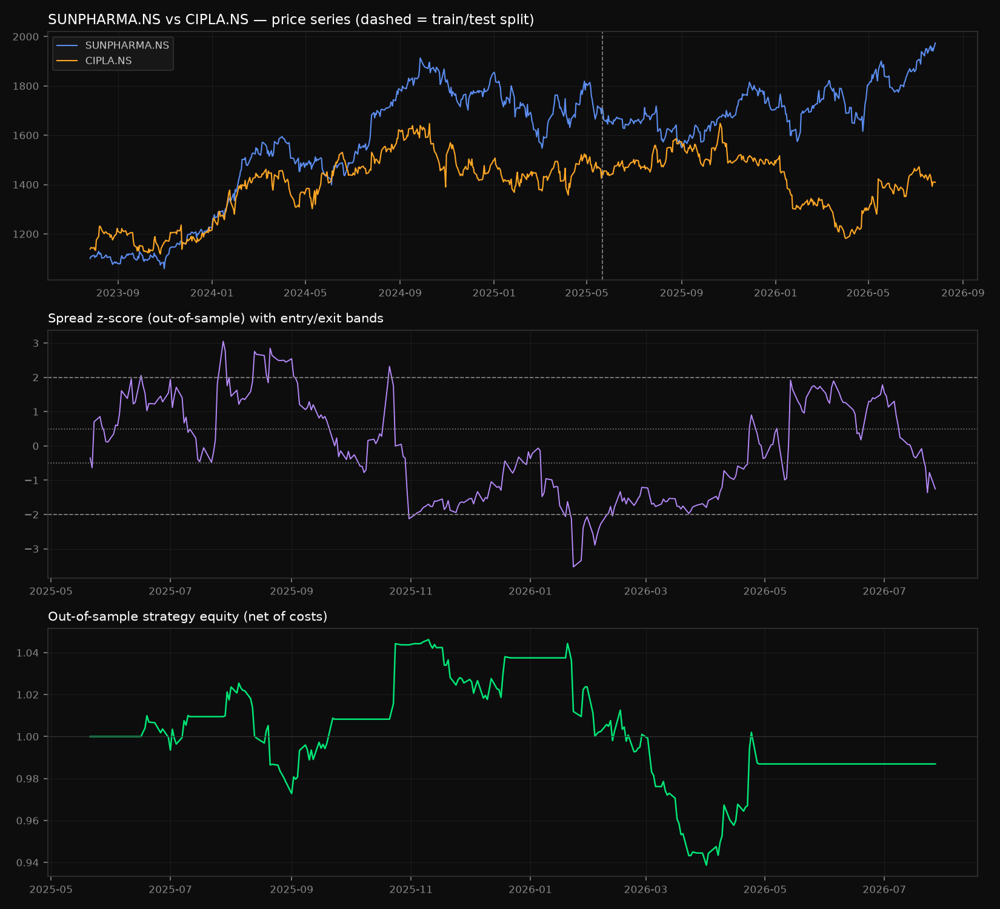

---

_Generated 2026-07-27 · pairs mean-reversion scanner · out-of-sample backtest · multiple-testing-aware · not investment advice._
