# Indian Pairs-Trading Scanner — 2026-07-28

> **What this is:** a market-neutral *pairs mean-reversion* scanner. It flags when two related NSE stocks have drifted apart far enough that their historical relationship signals a possible convergence trade. It does **not** forecast growth, rank "best" stocks, or predict company performance. A signal means the *spread between two stocks* is stretched — nothing about either stock being a good investment. Not investment advice; do your own research.

## Methodology (fixed in advance)

- **Universe:** 16 declared sector-mate pairs. Parameters (3y window, 60/40 train-test, z-entry 2.0, z-exit 0.5, 5 bps costs) are pre-registered; changes are logged in the README changelog *before* looking at results.
- **Multiple testing:** at the 5% level across 16 pairs, **≈0.8 false positives per run are expected by chance alone** even if nothing truly cointegrates. A single-day pass is a candidate, not a discovery.
- **Strict tier:** Bonferroni-corrected threshold p < 0.0031 (marked ✓✓).
- **Evidence = persistence:** the Persistence column counts how often each pair has passed the 5% test across all *real-data* daily runs recorded in `reports/history.csv`. Pairs deserve attention only when they pass persistently.

## Summary

| Pair | p-value | Coint. | Persistence | Current z | Signal | OOS Sharpe |
|---|---|---|---|---|---|---|
| HDFCBANK.NS/ICICIBANK.NS | 0.1358 | ✗ | 0/16 | +2.65 | SHORT spread | -0.49 |
| AXISBANK.NS/ICICIBANK.NS | 0.9283 | ✗ | 0/19 | +2.24 | SHORT spread | -0.36 |
| KOTAKBANK.NS/HDFCBANK.NS | 0.1746 | ✗ | 0/19 | -0.95 | watch | 0.11 |
| SBIN.NS/BANKBARODA.NS | 0.1713 | ✗ | 0/19 | -1.69 | watch | 0.30 |
| TCS.NS/INFY.NS | 0.4015 | ✗ | 0/19 | -2.47 | LONG spread | 1.34 |
| INFY.NS/WIPRO.NS | 0.1899 | ✗ | 0/19 | -0.33 | flat / no stretch | 1.67 |
| HCLTECH.NS/TECHM.NS | 0.3031 | ✗ | 0/19 | +1.54 | watch | -0.26 |
| ACC.NS/AMBUJACEM.NS | 0.8050 | ✗ | 0/19 | -0.19 | flat / no stretch | 0.57 |
| ULTRACEMCO.NS/SHREECEM.NS | 0.2939 | ✗ | 0/19 | +1.40 | watch | 0.24 |
| IOC.NS/BPCL.NS | 0.7960 | ✗ | 0/19 | +2.29 | SHORT spread | 0.48 |
| BPCL.NS/HINDPETRO.NS | 0.3233 | ✗ | 0/19 | -2.03 | LONG spread | -0.07 |
| ONGC.NS/COALINDIA.NS | 0.0193 | ✓ | 11/19 | -0.10 | flat / no stretch | 0.84 |
| NTPC.NS/POWERGRID.NS | 0.0725 | ✗ | 0/19 | +1.35 | watch | 0.38 |
| BAJAJ-AUTO.NS/HEROMOTOCO.NS | 0.1793 | ✗ | 0/19 | -1.50 | watch | -1.30 |
| TATASTEEL.NS/JSWSTEEL.NS | 0.6922 | ✗ | 0/19 | +1.56 | watch | 0.29 |
| SUNPHARMA.NS/CIPLA.NS | 0.0095 | ✓ | 19/19 | -0.36 | flat / no stretch | -0.11 |

_Legend: ✓✓ passes strict Bonferroni tier · ✓ passes 5% only · ✗ fails. Persistence = 5%-passes / real-data runs recorded. \*no real-data history yet._

---

### HDFCBANK.NS / ICICIBANK.NS

- **Latest prices:** HDFCBANK.NS ₹735.40 · ICICIBANK.NS ₹1,430.80
- **Hedge ratio (train-fitted):** 1.7694
- **Cointegration (train):** FAIL at 5% — ADF -2.42, p=0.1358
- **Persistence:** passed 5% in 0 of 16 real-data runs (strict tier: 0/16)
- **Spread half-life:** 31.5 days
- **Current z-score:** +2.65
- **Signal today:** SHORT spread (short ICICIBANK.NS, long HDFCBANK.NS)
- ⚠️ _Pair did not cointegrate on training data. Any signal here is not statistically justified — observation only._

**Out-of-sample backtest** (beta frozen from train window):

| Metric | Value |
|---|---|
| Sharpe | -0.49 |
| Sortino | -0.47 |
| Annualised return | -3.06% |
| Annualised vol | 5.99% |
| Max drawdown | -8.74% |
| Round-trip trades | 5 |

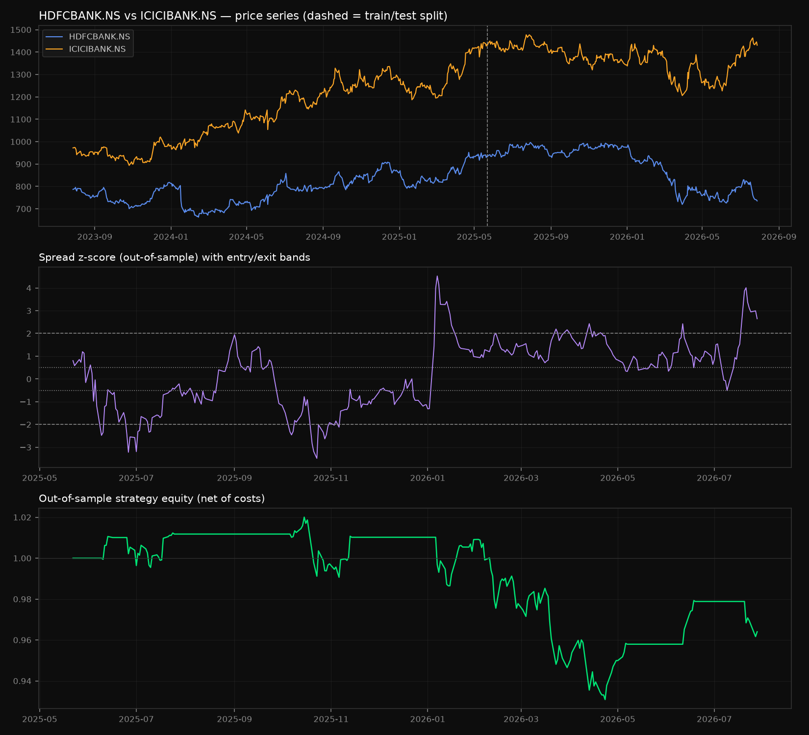

---

### AXISBANK.NS / ICICIBANK.NS

- **Latest prices:** AXISBANK.NS ₹1,223.50 · ICICIBANK.NS ₹1,430.80
- **Hedge ratio (train-fitted):** 0.9182
- **Cointegration (train):** FAIL at 5% — ADF -0.28, p=0.9283
- **Persistence:** passed 5% in 0 of 19 real-data runs (strict tier: 0/19)
- **Spread half-life:** 292.2 days
- **Current z-score:** +2.24
- **Signal today:** SHORT spread (short ICICIBANK.NS, long AXISBANK.NS)
- ⚠️ _Pair did not cointegrate on training data. Any signal here is not statistically justified — observation only._

**Out-of-sample backtest** (beta frozen from train window):

| Metric | Value |
|---|---|
| Sharpe | -0.36 |
| Sortino | -0.36 |
| Annualised return | -3.46% |
| Annualised vol | 8.67% |
| Max drawdown | -8.11% |
| Round-trip trades | 6 |

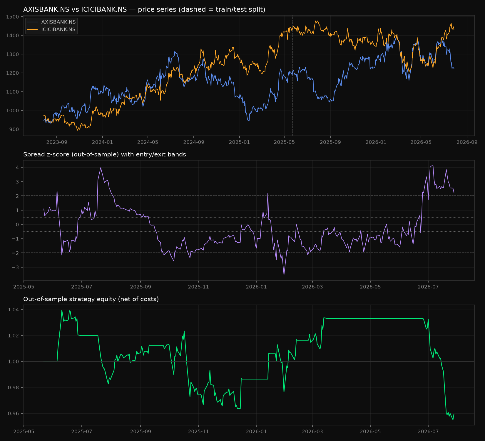

---

### KOTAKBANK.NS / HDFCBANK.NS

- **Latest prices:** KOTAKBANK.NS ₹385.30 · HDFCBANK.NS ₹735.40
- **Hedge ratio (train-fitted):** 1.8842
- **Cointegration (train):** FAIL at 5% — ADF -2.29, p=0.1746
- **Persistence:** passed 5% in 0 of 19 real-data runs (strict tier: 0/19)
- **Spread half-life:** 28.3 days
- **Current z-score:** -0.95
- **Signal today:** watch (approaching band)
- ⚠️ _Pair did not cointegrate on training data. Any signal here is not statistically justified — observation only._

**Out-of-sample backtest** (beta frozen from train window):

| Metric | Value |
|---|---|
| Sharpe | 0.11 |
| Sortino | 0.09 |
| Annualised return | 0.49% |
| Annualised vol | 6.42% |
| Max drawdown | -5.75% |
| Round-trip trades | 4 |

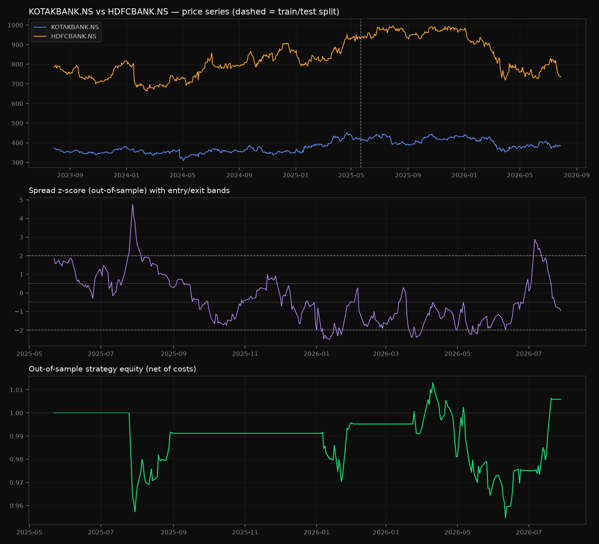

---

### SBIN.NS / BANKBARODA.NS

- **Latest prices:** SBIN.NS ₹1,013.20 · BANKBARODA.NS ₹239.20
- **Hedge ratio (train-fitted):** 0.2065
- **Cointegration (train):** FAIL at 5% — ADF -2.30, p=0.1713
- **Persistence:** passed 5% in 0 of 19 real-data runs (strict tier: 0/19)
- **Spread half-life:** 22.8 days
- **Current z-score:** -1.69
- **Signal today:** watch (approaching band)
- ⚠️ _Pair did not cointegrate on training data. Any signal here is not statistically justified — observation only._

**Out-of-sample backtest** (beta frozen from train window):

| Metric | Value |
|---|---|
| Sharpe | 0.30 |
| Sortino | 0.22 |
| Annualised return | 2.29% |
| Annualised vol | 8.74% |
| Max drawdown | -9.23% |
| Round-trip trades | 5 |

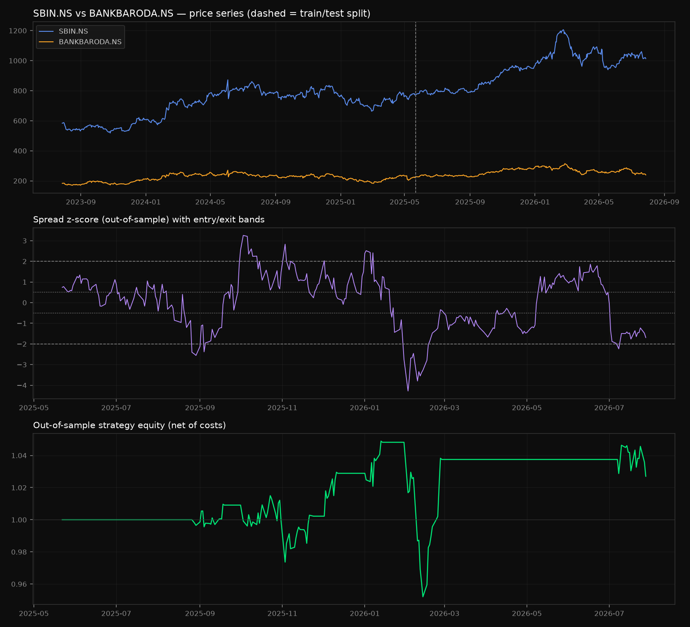

---

### TCS.NS / INFY.NS

- **Latest prices:** TCS.NS ₹2,398.00 · INFY.NS ₹1,105.70
- **Hedge ratio (train-fitted):** 0.5265
- **Cointegration (train):** FAIL at 5% — ADF -1.76, p=0.4015
- **Persistence:** passed 5% in 0 of 19 real-data runs (strict tier: 0/19)
- **Spread half-life:** 42.8 days
- **Current z-score:** -2.47
- **Signal today:** LONG spread (long INFY.NS, short TCS.NS)
- ⚠️ _Pair did not cointegrate on training data. Any signal here is not statistically justified — observation only._

**Out-of-sample backtest** (beta frozen from train window):

| Metric | Value |
|---|---|
| Sharpe | 1.34 |
| Sortino | 1.32 |
| Annualised return | 6.25% |
| Annualised vol | 4.59% |
| Max drawdown | -4.25% |
| Round-trip trades | 8 |

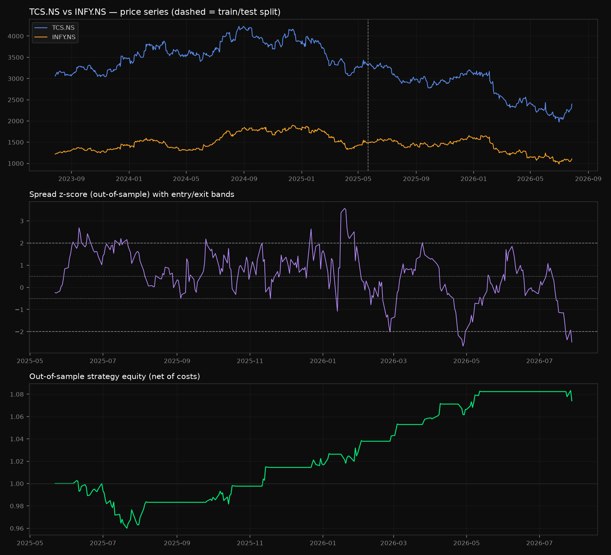

---

### INFY.NS / WIPRO.NS

- **Latest prices:** INFY.NS ₹1,105.70 · WIPRO.NS ₹181.12
- **Hedge ratio (train-fitted):** 0.1376
- **Cointegration (train):** FAIL at 5% — ADF -2.25, p=0.1899
- **Persistence:** passed 5% in 0 of 19 real-data runs (strict tier: 0/19)
- **Spread half-life:** 30.2 days
- **Current z-score:** -0.33
- **Signal today:** flat / no stretch
- ⚠️ _Pair did not cointegrate on training data. Any signal here is not statistically justified — observation only._

**Out-of-sample backtest** (beta frozen from train window):

| Metric | Value |
|---|---|
| Sharpe | 1.67 |
| Sortino | 1.95 |
| Annualised return | 9.13% |
| Annualised vol | 5.33% |
| Max drawdown | -2.54% |
| Round-trip trades | 6 |

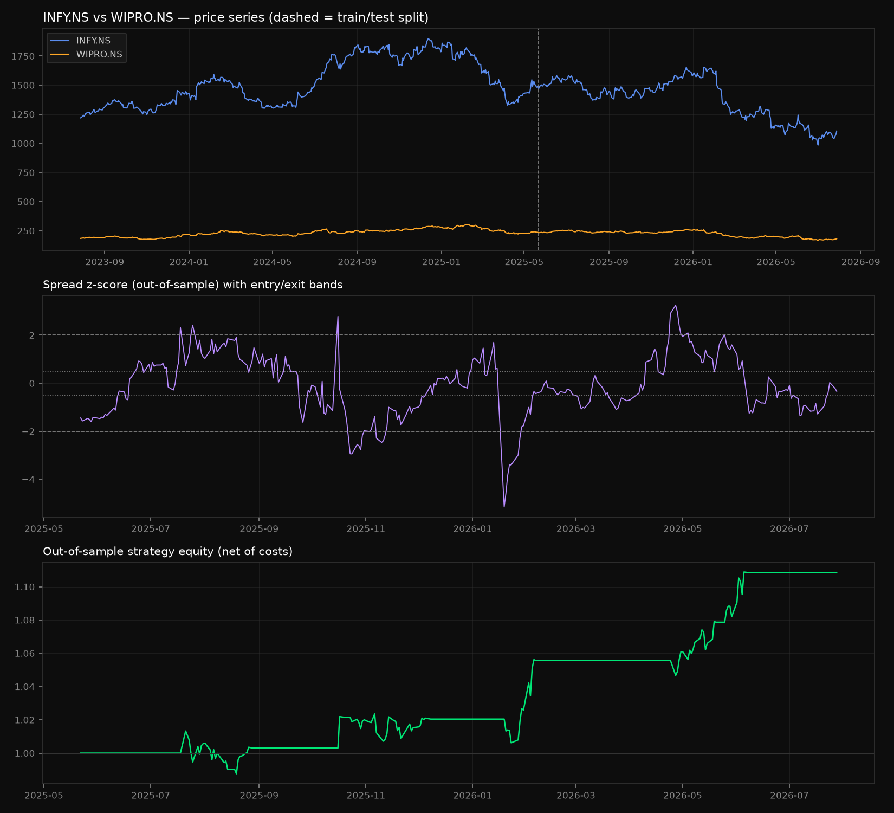

---

### HCLTECH.NS / TECHM.NS

- **Latest prices:** HCLTECH.NS ₹1,318.60 · TECHM.NS ₹1,635.20
- **Hedge ratio (train-fitted):** 0.8176
- **Cointegration (train):** FAIL at 5% — ADF -1.96, p=0.3031
- **Persistence:** passed 5% in 0 of 19 real-data runs (strict tier: 0/19)
- **Spread half-life:** 27.2 days
- **Current z-score:** +1.54
- **Signal today:** watch (approaching band)
- ⚠️ _Pair did not cointegrate on training data. Any signal here is not statistically justified — observation only._

**Out-of-sample backtest** (beta frozen from train window):

| Metric | Value |
|---|---|
| Sharpe | -0.26 |
| Sortino | -0.27 |
| Annualised return | -2.29% |
| Annualised vol | 7.83% |
| Max drawdown | -8.45% |
| Round-trip trades | 4 |

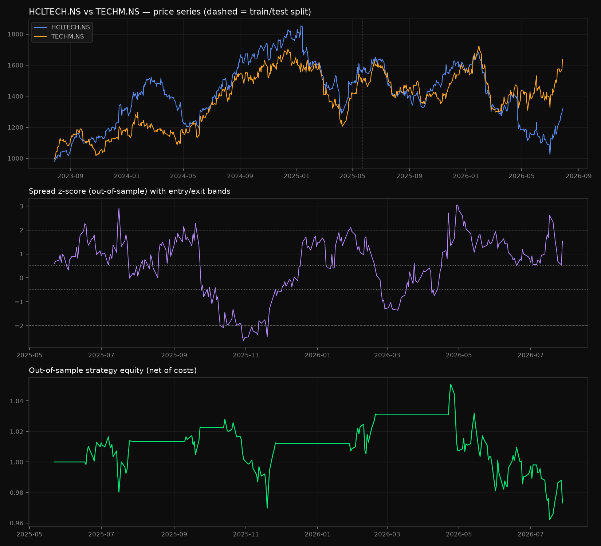

---

### ACC.NS / AMBUJACEM.NS

- **Latest prices:** ACC.NS ₹1,341.80 · AMBUJACEM.NS ₹426.00
- **Hedge ratio (train-fitted):** 0.2347
- **Cointegration (train):** FAIL at 5% — ADF -0.85, p=0.8050
- **Persistence:** passed 5% in 0 of 19 real-data runs (strict tier: 0/19)
- **Spread half-life:** 89.2 days
- **Current z-score:** -0.19
- **Signal today:** flat / no stretch
- ⚠️ _Pair did not cointegrate on training data. Any signal here is not statistically justified — observation only._

**Out-of-sample backtest** (beta frozen from train window):

| Metric | Value |
|---|---|
| Sharpe | 0.57 |
| Sortino | 0.50 |
| Annualised return | 3.12% |
| Annualised vol | 5.72% |
| Max drawdown | -7.32% |
| Round-trip trades | 4 |

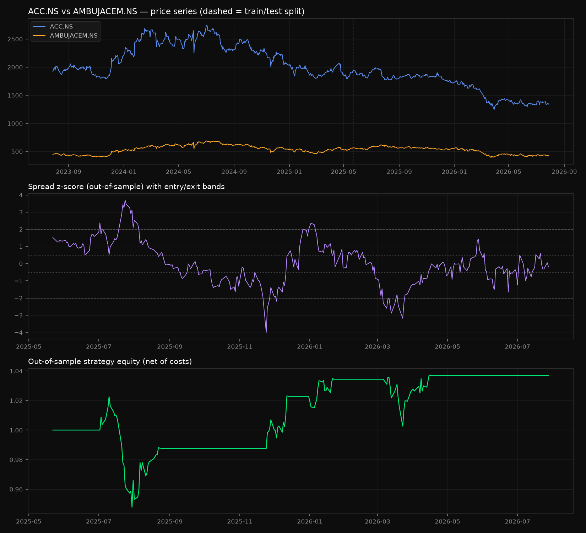

---

### ULTRACEMCO.NS / SHREECEM.NS

- **Latest prices:** ULTRACEMCO.NS ₹11,956.00 · SHREECEM.NS ₹26,875.00
- **Hedge ratio (train-fitted):** 0.6337
- **Cointegration (train):** FAIL at 5% — ADF -1.98, p=0.2939
- **Persistence:** passed 5% in 0 of 19 real-data runs (strict tier: 0/19)
- **Spread half-life:** 42.1 days
- **Current z-score:** +1.40
- **Signal today:** watch (approaching band)
- ⚠️ _Pair did not cointegrate on training data. Any signal here is not statistically justified — observation only._

**Out-of-sample backtest** (beta frozen from train window):

| Metric | Value |
|---|---|
| Sharpe | 0.24 |
| Sortino | 0.25 |
| Annualised return | 1.55% |
| Annualised vol | 7.79% |
| Max drawdown | -8.90% |
| Round-trip trades | 5 |

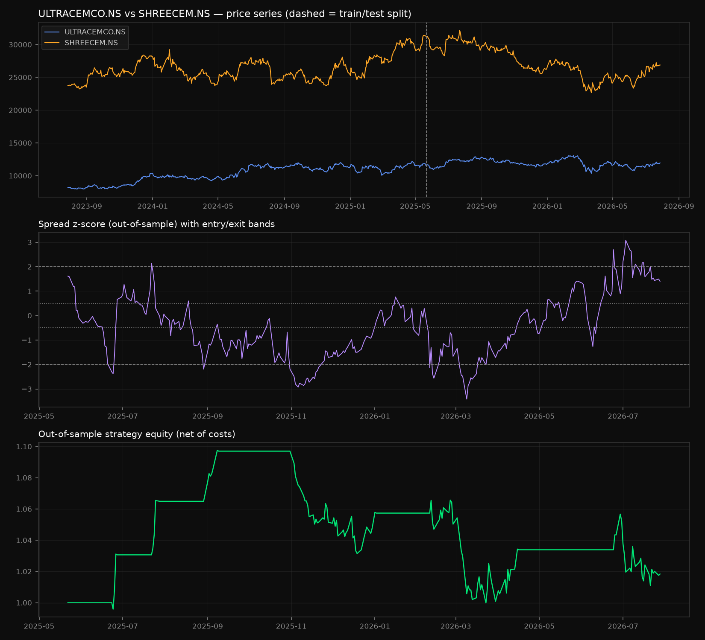

---

### IOC.NS / BPCL.NS

- **Latest prices:** IOC.NS ₹141.28 · BPCL.NS ₹320.05
- **Hedge ratio (train-fitted):** 1.7696
- **Cointegration (train):** FAIL at 5% — ADF -0.88, p=0.7960
- **Persistence:** passed 5% in 0 of 19 real-data runs (strict tier: 0/19)
- **Spread half-life:** 121.8 days
- **Current z-score:** +2.29
- **Signal today:** SHORT spread (short BPCL.NS, long IOC.NS)
- ⚠️ _Pair did not cointegrate on training data. Any signal here is not statistically justified — observation only._

**Out-of-sample backtest** (beta frozen from train window):

| Metric | Value |
|---|---|
| Sharpe | 0.48 |
| Sortino | 0.50 |
| Annualised return | 2.91% |
| Annualised vol | 6.48% |
| Max drawdown | -6.75% |
| Round-trip trades | 7 |

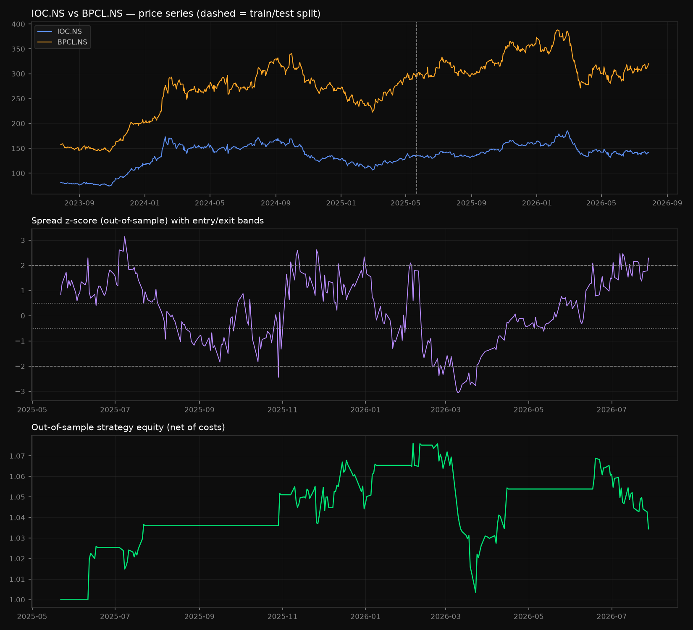

---

### BPCL.NS / HINDPETRO.NS

- **Latest prices:** BPCL.NS ₹320.05 · HINDPETRO.NS ₹400.05
- **Hedge ratio (train-fitted):** 1.4264
- **Cointegration (train):** FAIL at 5% — ADF -1.92, p=0.3233
- **Persistence:** passed 5% in 0 of 19 real-data runs (strict tier: 0/19)
- **Spread half-life:** 40.9 days
- **Current z-score:** -2.03
- **Signal today:** LONG spread (long HINDPETRO.NS, short BPCL.NS)
- ⚠️ _Pair did not cointegrate on training data. Any signal here is not statistically justified — observation only._

**Out-of-sample backtest** (beta frozen from train window):

| Metric | Value |
|---|---|
| Sharpe | -0.07 |
| Sortino | -0.06 |
| Annualised return | -0.57% |
| Annualised vol | 5.79% |
| Max drawdown | -6.99% |
| Round-trip trades | 4 |

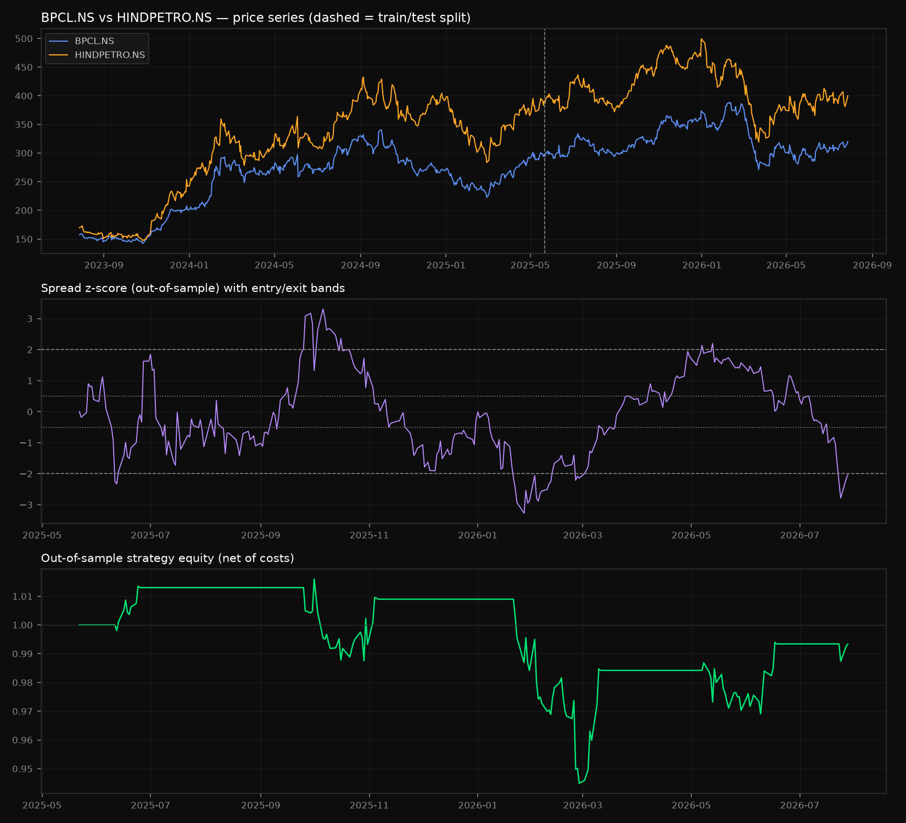

---

### ONGC.NS / COALINDIA.NS

- **Latest prices:** ONGC.NS ₹238.91 · COALINDIA.NS ₹410.15
- **Hedge ratio (train-fitted):** 1.6849
- **Cointegration (train):** PASS at 5% — ADF -3.21, p=0.0193
- **Persistence:** passed 5% in 11 of 19 real-data runs (strict tier: 0/19)
- **Spread half-life:** 15.2 days
- **Current z-score:** -0.10
- **Signal today:** flat / no stretch

**Out-of-sample backtest** (beta frozen from train window):

| Metric | Value |
|---|---|
| Sharpe | 0.84 |
| Sortino | 0.66 |
| Annualised return | 6.01% |
| Annualised vol | 7.30% |
| Max drawdown | -5.62% |
| Round-trip trades | 5 |

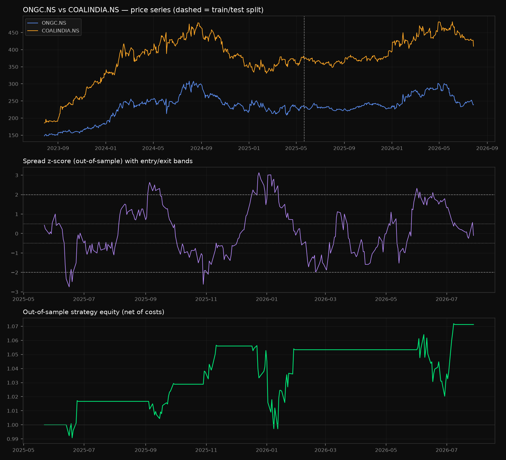

---

### NTPC.NS / POWERGRID.NS

- **Latest prices:** NTPC.NS ₹343.75 · POWERGRID.NS ₹285.30
- **Hedge ratio (train-fitted):** 0.8339
- **Cointegration (train):** FAIL at 5% — ADF -2.71, p=0.0725
- **Persistence:** passed 5% in 0 of 19 real-data runs (strict tier: 0/19)
- **Spread half-life:** 21.5 days
- **Current z-score:** +1.35
- **Signal today:** watch (approaching band)
- ⚠️ _Pair did not cointegrate on training data. Any signal here is not statistically justified — observation only._

**Out-of-sample backtest** (beta frozen from train window):

| Metric | Value |
|---|---|
| Sharpe | 0.38 |
| Sortino | 0.29 |
| Annualised return | 1.96% |
| Annualised vol | 5.52% |
| Max drawdown | -5.26% |
| Round-trip trades | 6 |

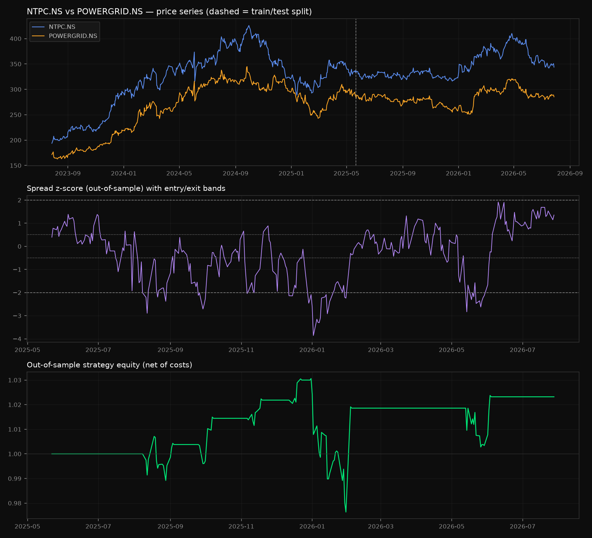

---

### BAJAJ-AUTO.NS / HEROMOTOCO.NS

- **Latest prices:** BAJAJ-AUTO.NS ₹11,374.00 · HEROMOTOCO.NS ₹5,154.30
- **Hedge ratio (train-fitted):** 0.4069
- **Cointegration (train):** FAIL at 5% — ADF -2.28, p=0.1793
- **Persistence:** passed 5% in 0 of 19 real-data runs (strict tier: 0/19)
- **Spread half-life:** 29.7 days
- **Current z-score:** -1.50
- **Signal today:** watch (approaching band)
- ⚠️ _Pair did not cointegrate on training data. Any signal here is not statistically justified — observation only._

**Out-of-sample backtest** (beta frozen from train window):

| Metric | Value |
|---|---|
| Sharpe | -1.30 |
| Sortino | -1.25 |
| Annualised return | -12.53% |
| Annualised vol | 9.94% |
| Max drawdown | -20.82% |
| Round-trip trades | 3 |

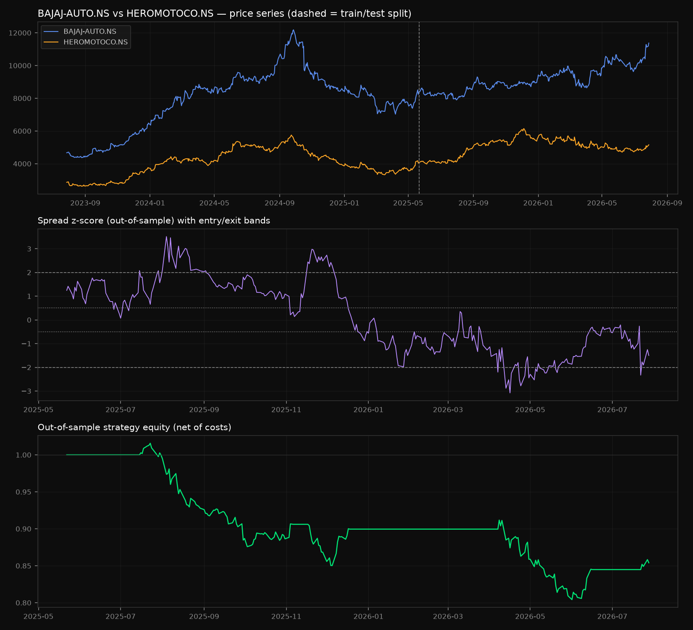

---

### TATASTEEL.NS / JSWSTEEL.NS

- **Latest prices:** TATASTEEL.NS ₹182.63 · JSWSTEEL.NS ₹1,246.90
- **Hedge ratio (train-fitted):** 3.0150
- **Cointegration (train):** FAIL at 5% — ADF -1.16, p=0.6922
- **Persistence:** passed 5% in 0 of 19 real-data runs (strict tier: 0/19)
- **Spread half-life:** 70.2 days
- **Current z-score:** +1.56
- **Signal today:** watch (approaching band)
- ⚠️ _Pair did not cointegrate on training data. Any signal here is not statistically justified — observation only._

**Out-of-sample backtest** (beta frozen from train window):

| Metric | Value |
|---|---|
| Sharpe | 0.29 |
| Sortino | 0.24 |
| Annualised return | 1.90% |
| Annualised vol | 7.31% |
| Max drawdown | -4.30% |
| Round-trip trades | 4 |

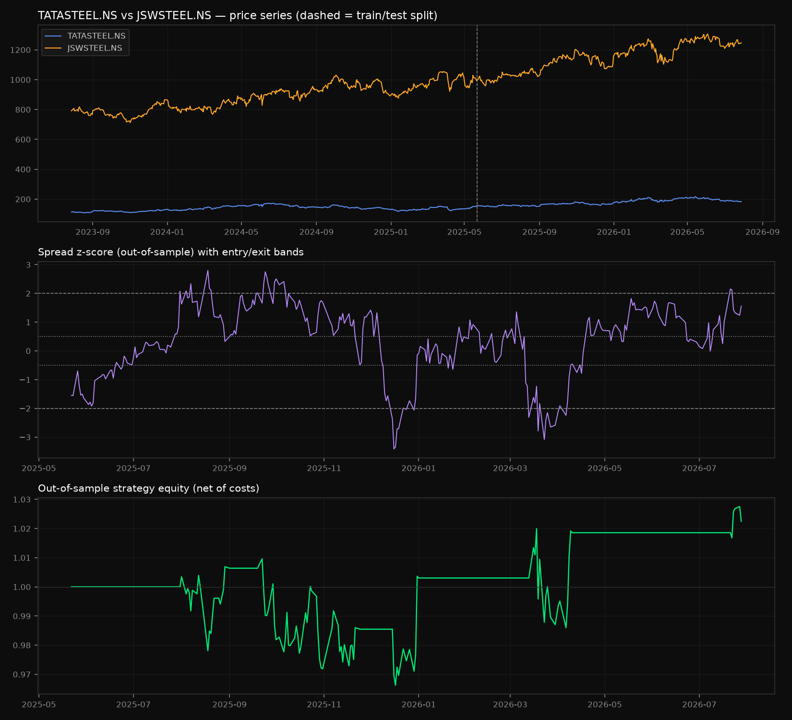

---

### SUNPHARMA.NS / CIPLA.NS

- **Latest prices:** SUNPHARMA.NS ₹1,976.70 · CIPLA.NS ₹1,444.60
- **Hedge ratio (train-fitted):** 0.4903
- **Cointegration (train):** PASS at 5% — ADF -3.44, p=0.0095
- **Persistence:** passed 5% in 19 of 19 real-data runs (strict tier: 5/19)
- **Spread half-life:** 10.6 days
- **Current z-score:** -0.36
- **Signal today:** flat / no stretch

**Out-of-sample backtest** (beta frozen from train window):

| Metric | Value |
|---|---|
| Sharpe | -0.11 |
| Sortino | -0.12 |
| Annualised return | -1.12% |
| Annualised vol | 7.73% |
| Max drawdown | -10.36% |
| Round-trip trades | 5 |

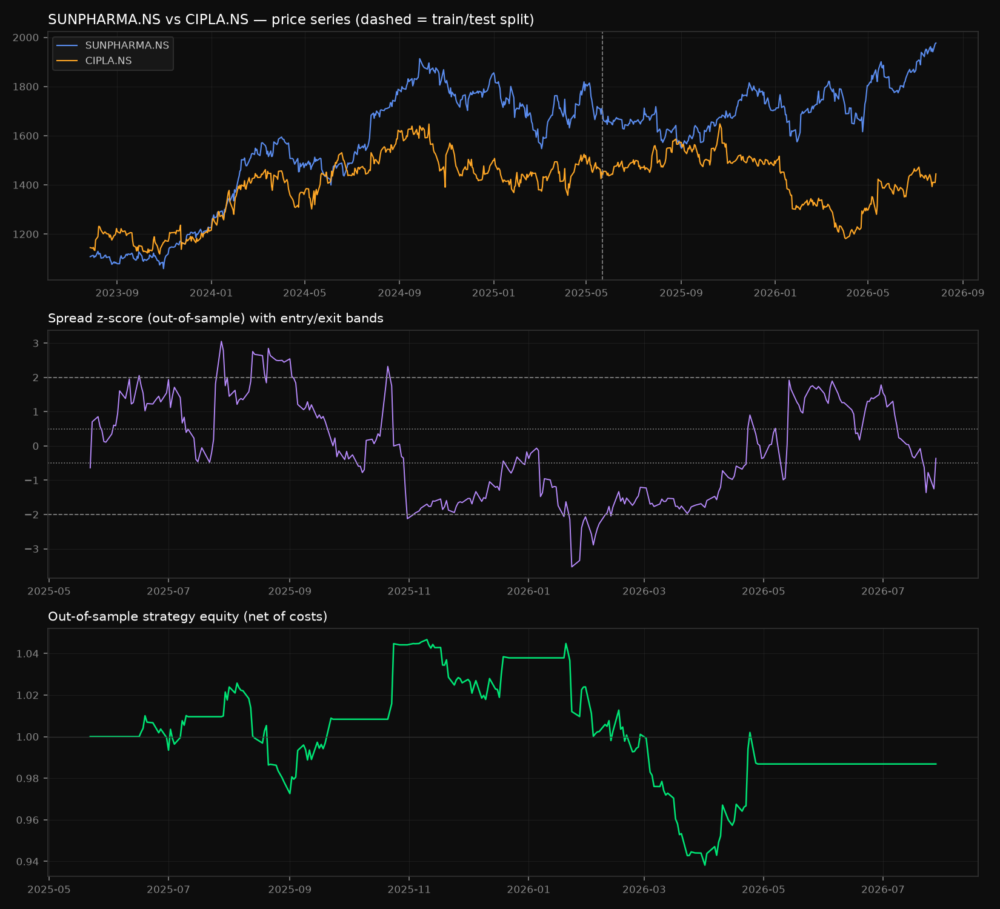

---

_Generated 2026-07-28 · pairs mean-reversion scanner · out-of-sample backtest · multiple-testing-aware · not investment advice._
