# Indian Pairs-Trading Scanner — 2026-07-29

> **What this is:** a market-neutral *pairs mean-reversion* scanner. It flags when two related NSE stocks have drifted apart far enough that their historical relationship signals a possible convergence trade. It does **not** forecast growth, rank "best" stocks, or predict company performance. A signal means the *spread between two stocks* is stretched — nothing about either stock being a good investment. Not investment advice; do your own research.

## Methodology (fixed in advance)

- **Universe:** 16 declared sector-mate pairs. Parameters (3y window, 60/40 train-test, z-entry 2.0, z-exit 0.5, 5 bps costs) are pre-registered; changes are logged in the README changelog *before* looking at results.
- **Multiple testing:** at the 5% level across 16 pairs, **≈0.8 false positives per run are expected by chance alone** even if nothing truly cointegrates. A single-day pass is a candidate, not a discovery.
- **Strict tier:** Bonferroni-corrected threshold p < 0.0031 (marked ✓✓).
- **Evidence = persistence:** the Persistence column counts how often each pair has passed the 5% test across all *real-data* daily runs recorded in `reports/history.csv`. Pairs deserve attention only when they pass persistently.

> ⚠️ **Some results use SIMULATED fallback data** (real data was unreachable this run) and are not real market results. These are marked below and are EXCLUDED from persistence counts.

## Summary

| Pair | p-value | Coint. | Persistence | Current z | Signal | OOS Sharpe |
|---|---|---|---|---|---|---|
| HDFCBANK.NS/ICICIBANK.NS *(sim)* | 0.0030 | ✓✓ | 0/16 | -1.55 | watch | 1.13 |
| AXISBANK.NS/ICICIBANK.NS | 0.9312 | ✗ | 0/20 | +2.07 | SHORT spread | -0.35 |
| KOTAKBANK.NS/HDFCBANK.NS | 0.1769 | ✗ | 0/20 | -0.82 | watch | 0.53 |
| SBIN.NS/BANKBARODA.NS | 0.1702 | ✗ | 0/20 | -1.37 | watch | 0.40 |
| TCS.NS/INFY.NS | 0.4229 | ✗ | 0/20 | -1.87 | watch | 1.43 |
| INFY.NS/WIPRO.NS | 0.1856 | ✗ | 0/20 | -0.92 | watch | 1.67 |
| HCLTECH.NS/TECHM.NS | 0.2824 | ✗ | 0/20 | +1.19 | watch | -0.21 |
| ACC.NS/AMBUJACEM.NS | 0.7983 | ✗ | 0/20 | +0.32 | flat / no stretch | 0.60 |
| ULTRACEMCO.NS/SHREECEM.NS | 0.2869 | ✗ | 0/20 | +1.27 | watch | 0.26 |
| IOC.NS/BPCL.NS | 0.7786 | ✗ | 0/20 | +2.08 | SHORT spread | 0.49 |
| BPCL.NS/HINDPETRO.NS | 0.3233 | ✗ | 0/20 | -2.39 | LONG spread | -0.13 |
| ONGC.NS/COALINDIA.NS | 0.0274 | ✓ | 12/20 | -0.08 | flat / no stretch | 0.84 |
| NTPC.NS/POWERGRID.NS | 0.0725 | ✗ | 0/20 | +1.09 | watch | 0.38 |
| BAJAJ-AUTO.NS/HEROMOTOCO.NS | 0.1783 | ✗ | 0/20 | -1.39 | watch | -1.29 |
| TATASTEEL.NS/JSWSTEEL.NS | 0.6987 | ✗ | 0/20 | +2.23 | SHORT spread | 0.17 |
| SUNPHARMA.NS/CIPLA.NS | 0.0099 | ✓ | 20/20 | +0.26 | flat / no stretch | -0.11 |

_Legend: ✓✓ passes strict Bonferroni tier · ✓ passes 5% only · ✗ fails. Persistence = 5%-passes / real-data runs recorded. \*no real-data history yet._

---

### HDFCBANK.NS / ICICIBANK.NS · _SIMULATED_

- **Latest prices:** HDFCBANK.NS ₹77.27 · ICICIBANK.NS ₹113.78
- **Hedge ratio (train-fitted):** 1.5557
- **Cointegration (train):** PASS at 5% — ADF -3.79, p=0.0030 · **passes strict Bonferroni tier**
- **Persistence:** passed 5% in 0 of 16 real-data runs (strict tier: 0/16)
- **Spread half-life:** 14.0 days
- **Current z-score:** -1.55
- **Signal today:** watch (approaching band)

**Out-of-sample backtest** (beta frozen from train window):

| Metric | Value |
|---|---|
| Sharpe | 1.13 |
| Sortino | 0.86 |
| Annualised return | 1.88% |
| Annualised vol | 1.66% |
| Max drawdown | -1.19% |
| Round-trip trades | 5 |

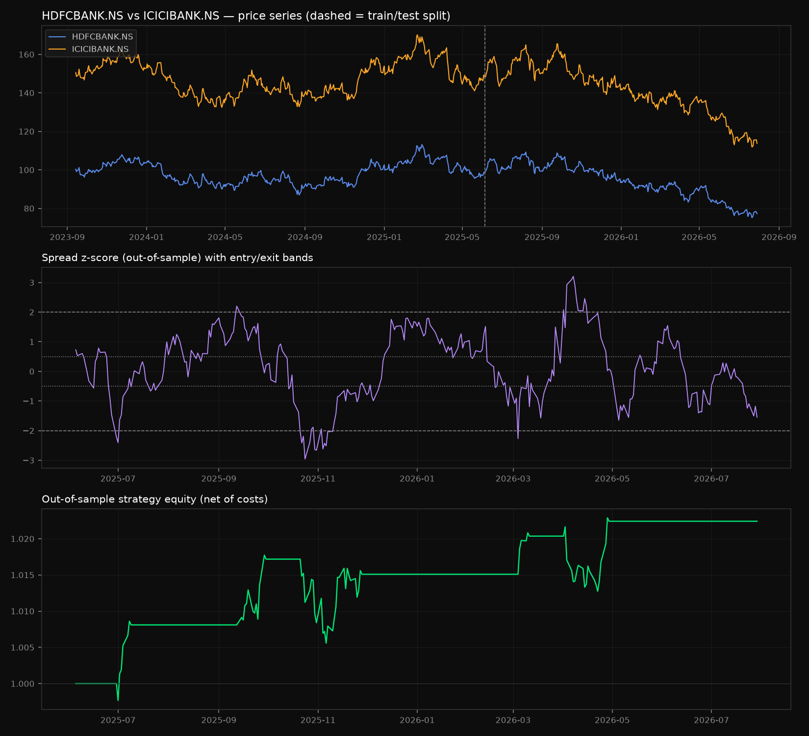

---

### AXISBANK.NS / ICICIBANK.NS

- **Latest prices:** AXISBANK.NS ₹1,235.40 · ICICIBANK.NS ₹1,437.90
- **Hedge ratio (train-fitted):** 0.9226
- **Cointegration (train):** FAIL at 5% — ADF -0.26, p=0.9312
- **Persistence:** passed 5% in 0 of 20 real-data runs (strict tier: 0/20)
- **Spread half-life:** 309.7 days
- **Current z-score:** +2.07
- **Signal today:** SHORT spread (short ICICIBANK.NS, long AXISBANK.NS)
- ⚠️ _Pair did not cointegrate on training data. Any signal here is not statistically justified — observation only._

**Out-of-sample backtest** (beta frozen from train window):

| Metric | Value |
|---|---|
| Sharpe | -0.35 |
| Sortino | -0.35 |
| Annualised return | -3.29% |
| Annualised vol | 8.59% |
| Max drawdown | -8.02% |
| Round-trip trades | 6 |

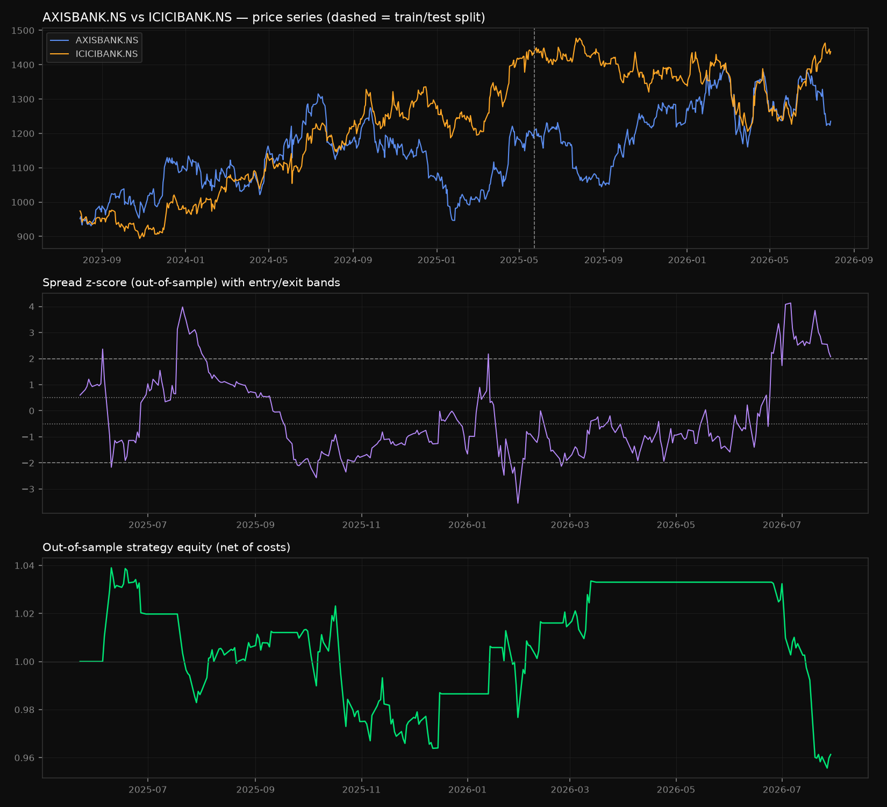

---

### KOTAKBANK.NS / HDFCBANK.NS

- **Latest prices:** KOTAKBANK.NS ₹390.20 · HDFCBANK.NS ₹748.20
- **Hedge ratio (train-fitted):** 1.8941
- **Cointegration (train):** FAIL at 5% — ADF -2.28, p=0.1769
- **Persistence:** passed 5% in 0 of 20 real-data runs (strict tier: 0/20)
- **Spread half-life:** 28.4 days
- **Current z-score:** -0.82
- **Signal today:** watch (approaching band)
- ⚠️ _Pair did not cointegrate on training data. Any signal here is not statistically justified — observation only._

**Out-of-sample backtest** (beta frozen from train window):

| Metric | Value |
|---|---|
| Sharpe | 0.53 |
| Sortino | 0.37 |
| Annualised return | 3.12% |
| Annualised vol | 6.18% |
| Max drawdown | -4.70% |
| Round-trip trades | 5 |

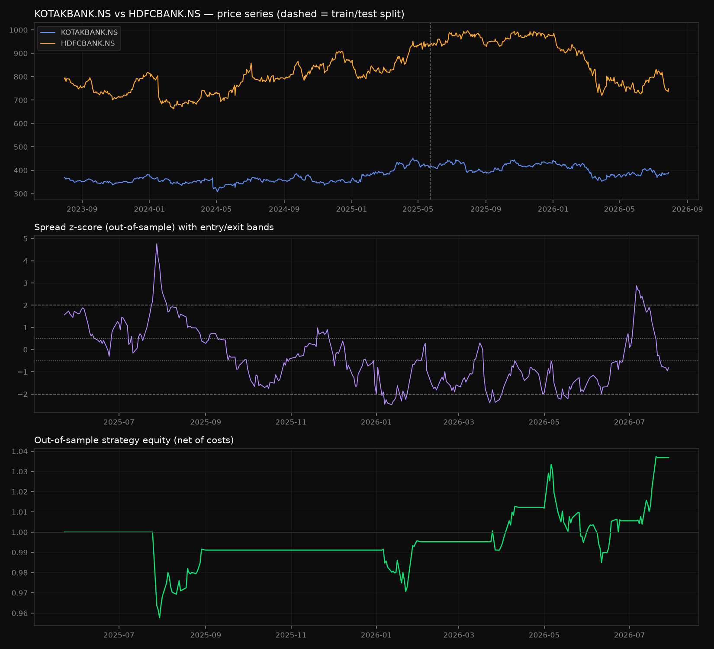

---

### SBIN.NS / BANKBARODA.NS

- **Latest prices:** SBIN.NS ₹1,013.70 · BANKBARODA.NS ₹243.35
- **Hedge ratio (train-fitted):** 0.2061
- **Cointegration (train):** FAIL at 5% — ADF -2.31, p=0.1702
- **Persistence:** passed 5% in 0 of 20 real-data runs (strict tier: 0/20)
- **Spread half-life:** 22.7 days
- **Current z-score:** -1.37
- **Signal today:** watch (approaching band)
- ⚠️ _Pair did not cointegrate on training data. Any signal here is not statistically justified — observation only._

**Out-of-sample backtest** (beta frozen from train window):

| Metric | Value |
|---|---|
| Sharpe | 0.40 |
| Sortino | 0.29 |
| Annualised return | 3.18% |
| Annualised vol | 8.74% |
| Max drawdown | -9.16% |
| Round-trip trades | 5 |

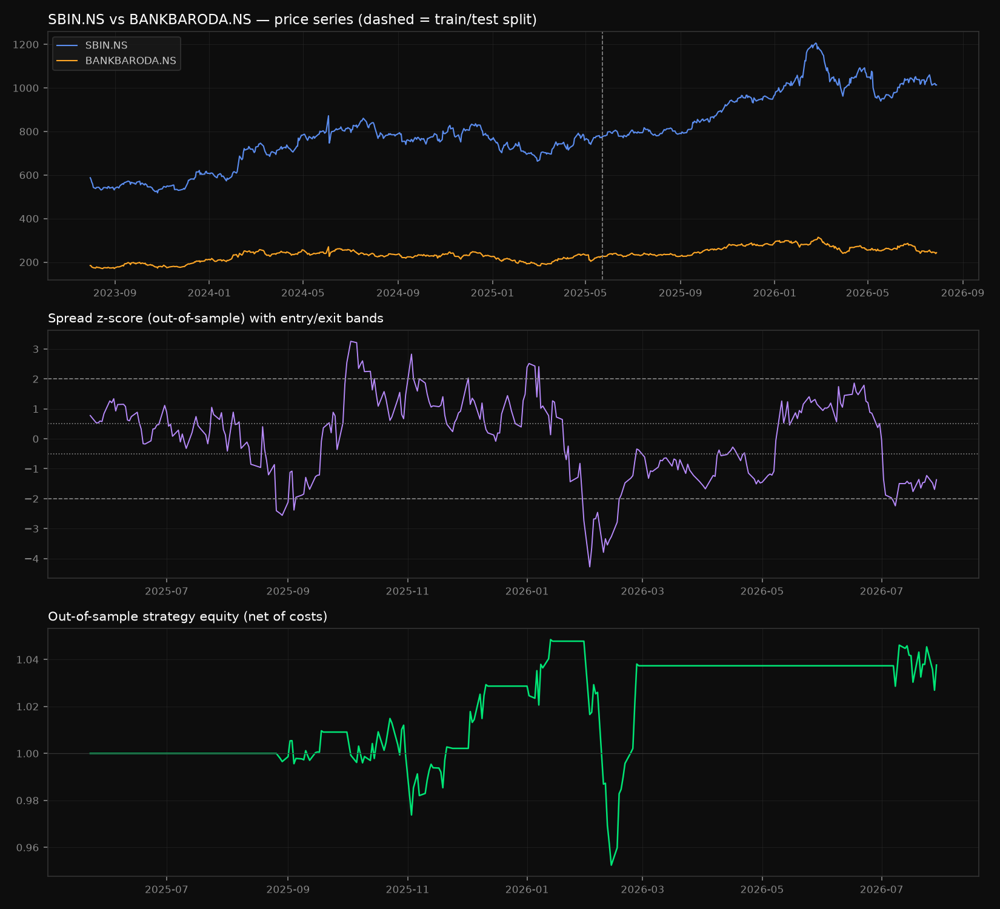

---

### TCS.NS / INFY.NS

- **Latest prices:** TCS.NS ₹2,446.60 · INFY.NS ₹1,155.60
- **Hedge ratio (train-fitted):** 0.5255
- **Cointegration (train):** FAIL at 5% — ADF -1.72, p=0.4229
- **Persistence:** passed 5% in 0 of 20 real-data runs (strict tier: 0/20)
- **Spread half-life:** 42.8 days
- **Current z-score:** -1.87
- **Signal today:** watch (approaching band)
- ⚠️ _Pair did not cointegrate on training data. Any signal here is not statistically justified — observation only._

**Out-of-sample backtest** (beta frozen from train window):

| Metric | Value |
|---|---|
| Sharpe | 1.43 |
| Sortino | 1.42 |
| Annualised return | 6.68% |
| Annualised vol | 4.58% |
| Max drawdown | -4.21% |
| Round-trip trades | 8 |

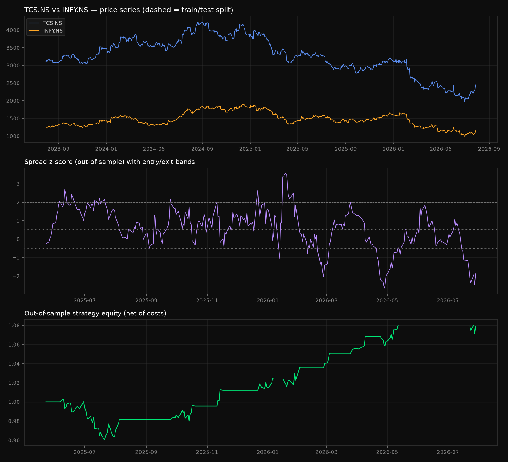

---

### INFY.NS / WIPRO.NS

- **Latest prices:** INFY.NS ₹1,155.60 · WIPRO.NS ₹183.61
- **Hedge ratio (train-fitted):** 0.1375
- **Cointegration (train):** FAIL at 5% — ADF -2.26, p=0.1856
- **Persistence:** passed 5% in 0 of 20 real-data runs (strict tier: 0/20)
- **Spread half-life:** 30.0 days
- **Current z-score:** -0.92
- **Signal today:** watch (approaching band)
- ⚠️ _Pair did not cointegrate on training data. Any signal here is not statistically justified — observation only._

**Out-of-sample backtest** (beta frozen from train window):

| Metric | Value |
|---|---|
| Sharpe | 1.67 |
| Sortino | 1.95 |
| Annualised return | 9.05% |
| Annualised vol | 5.28% |
| Max drawdown | -2.51% |
| Round-trip trades | 6 |

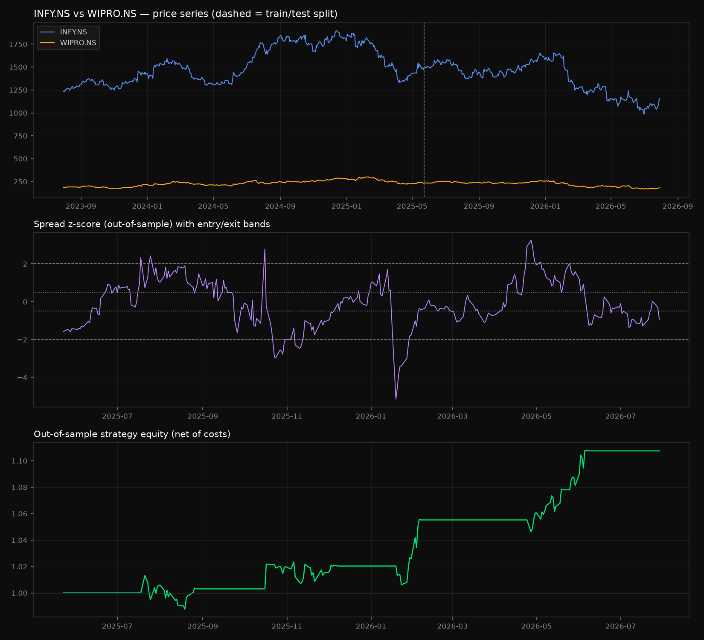

---

### HCLTECH.NS / TECHM.NS

- **Latest prices:** HCLTECH.NS ₹1,344.30 · TECHM.NS ₹1,644.20
- **Hedge ratio (train-fitted):** 0.8185
- **Cointegration (train):** FAIL at 5% — ADF -2.01, p=0.2824
- **Persistence:** passed 5% in 0 of 20 real-data runs (strict tier: 0/20)
- **Spread half-life:** 26.7 days
- **Current z-score:** +1.19
- **Signal today:** watch (approaching band)
- ⚠️ _Pair did not cointegrate on training data. Any signal here is not statistically justified — observation only._

**Out-of-sample backtest** (beta frozen from train window):

| Metric | Value |
|---|---|
| Sharpe | -0.21 |
| Sortino | -0.22 |
| Annualised return | -1.92% |
| Annualised vol | 7.77% |
| Max drawdown | -8.37% |
| Round-trip trades | 4 |

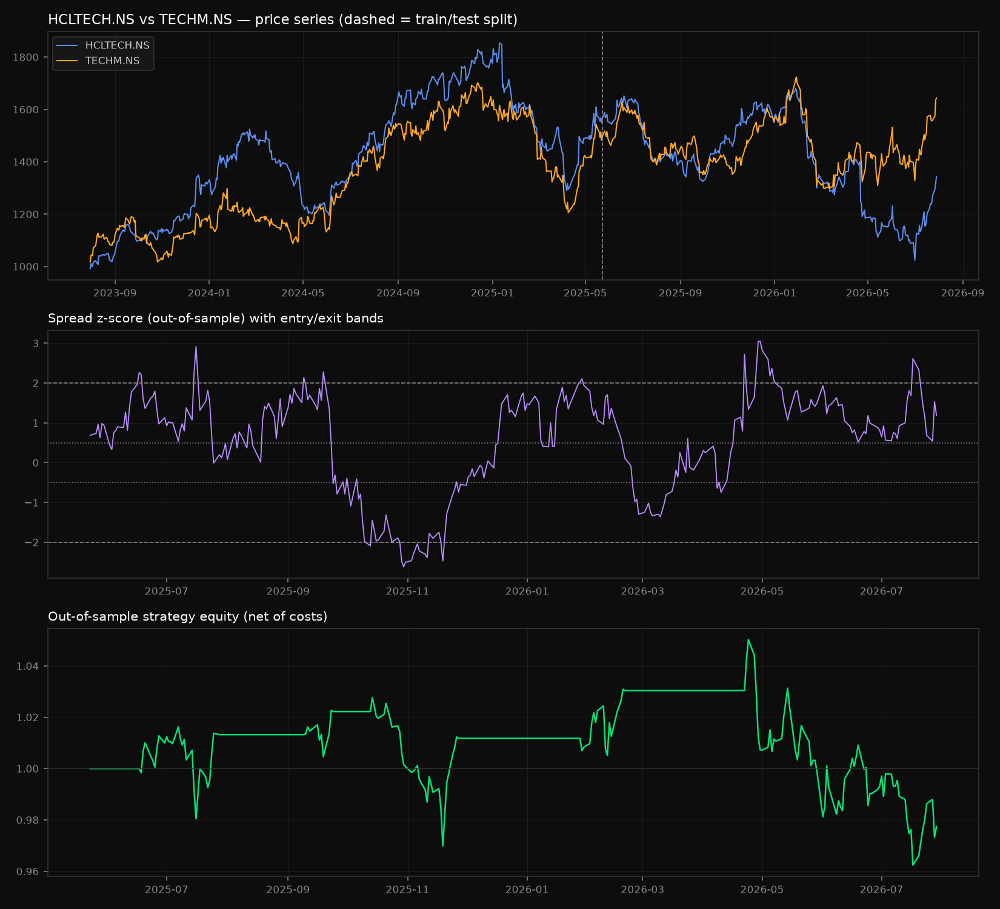

---

### ACC.NS / AMBUJACEM.NS

- **Latest prices:** ACC.NS ₹1,370.80 · AMBUJACEM.NS ₹435.30
- **Hedge ratio (train-fitted):** 0.2338
- **Cointegration (train):** FAIL at 5% — ADF -0.87, p=0.7983
- **Persistence:** passed 5% in 0 of 20 real-data runs (strict tier: 0/20)
- **Spread half-life:** 84.5 days
- **Current z-score:** +0.32
- **Signal today:** flat / no stretch
- ⚠️ _Pair did not cointegrate on training data. Any signal here is not statistically justified — observation only._

**Out-of-sample backtest** (beta frozen from train window):

| Metric | Value |
|---|---|
| Sharpe | 0.60 |
| Sortino | 0.53 |
| Annualised return | 3.32% |
| Annualised vol | 5.69% |
| Max drawdown | -7.27% |
| Round-trip trades | 4 |

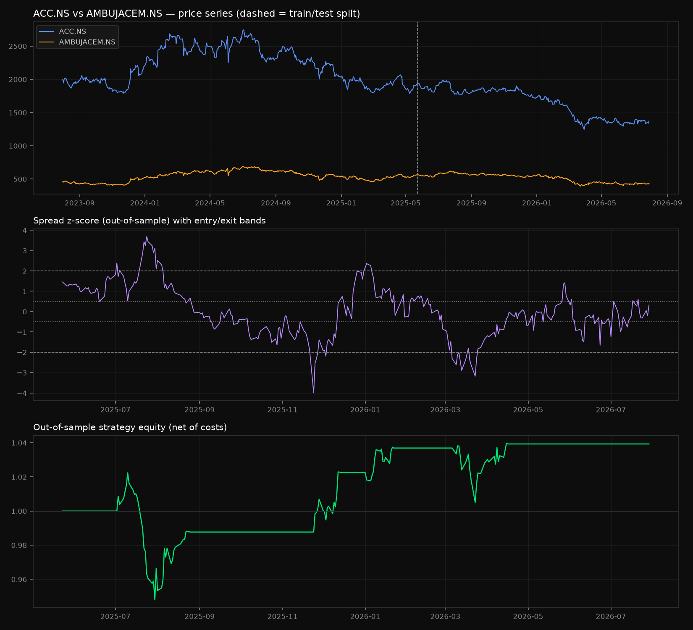

---

### ULTRACEMCO.NS / SHREECEM.NS

- **Latest prices:** ULTRACEMCO.NS ₹11,998.00 · SHREECEM.NS ₹26,825.00
- **Hedge ratio (train-fitted):** 0.6380
- **Cointegration (train):** FAIL at 5% — ADF -2.00, p=0.2869
- **Persistence:** passed 5% in 0 of 20 real-data runs (strict tier: 0/20)
- **Spread half-life:** 41.9 days
- **Current z-score:** +1.27
- **Signal today:** watch (approaching band)
- ⚠️ _Pair did not cointegrate on training data. Any signal here is not statistically justified — observation only._

**Out-of-sample backtest** (beta frozen from train window):

| Metric | Value |
|---|---|
| Sharpe | 0.26 |
| Sortino | 0.28 |
| Annualised return | 1.73% |
| Annualised vol | 7.74% |
| Max drawdown | -8.84% |
| Round-trip trades | 5 |

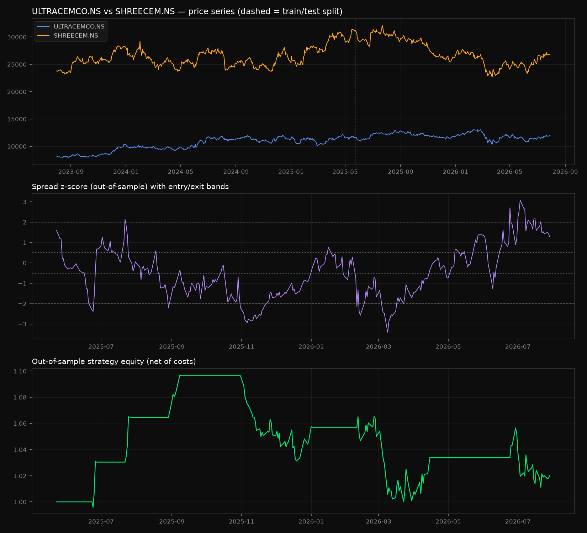

---

### IOC.NS / BPCL.NS

- **Latest prices:** IOC.NS ₹140.11 · BPCL.NS ₹317.40
- **Hedge ratio (train-fitted):** 1.7692
- **Cointegration (train):** FAIL at 5% — ADF -0.93, p=0.7786
- **Persistence:** passed 5% in 0 of 20 real-data runs (strict tier: 0/20)
- **Spread half-life:** 115.4 days
- **Current z-score:** +2.08
- **Signal today:** SHORT spread (short BPCL.NS, long IOC.NS)
- ⚠️ _Pair did not cointegrate on training data. Any signal here is not statistically justified — observation only._

**Out-of-sample backtest** (beta frozen from train window):

| Metric | Value |
|---|---|
| Sharpe | 0.49 |
| Sortino | 0.52 |
| Annualised return | 2.97% |
| Annualised vol | 6.40% |
| Max drawdown | -6.67% |
| Round-trip trades | 7 |

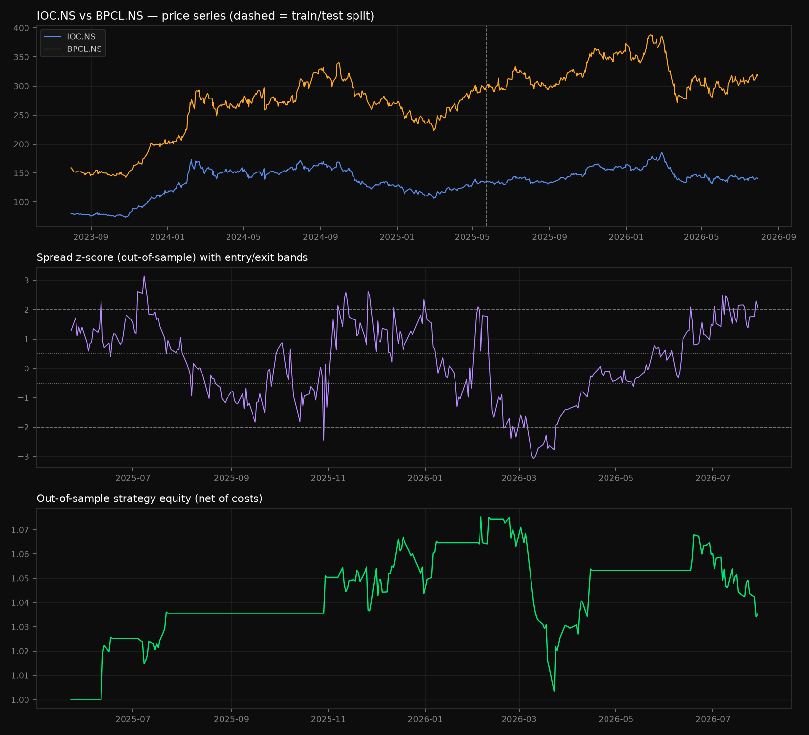

---

### BPCL.NS / HINDPETRO.NS

- **Latest prices:** BPCL.NS ₹317.40 · HINDPETRO.NS ₹392.75
- **Hedge ratio (train-fitted):** 1.4265
- **Cointegration (train):** FAIL at 5% — ADF -1.92, p=0.3233
- **Persistence:** passed 5% in 0 of 20 real-data runs (strict tier: 0/20)
- **Spread half-life:** 40.9 days
- **Current z-score:** -2.39
- **Signal today:** LONG spread (long HINDPETRO.NS, short BPCL.NS)
- ⚠️ _Pair did not cointegrate on training data. Any signal here is not statistically justified — observation only._

**Out-of-sample backtest** (beta frozen from train window):

| Metric | Value |
|---|---|
| Sharpe | -0.13 |
| Sortino | -0.11 |
| Annualised return | -0.92% |
| Annualised vol | 5.70% |
| Max drawdown | -6.87% |
| Round-trip trades | 4 |

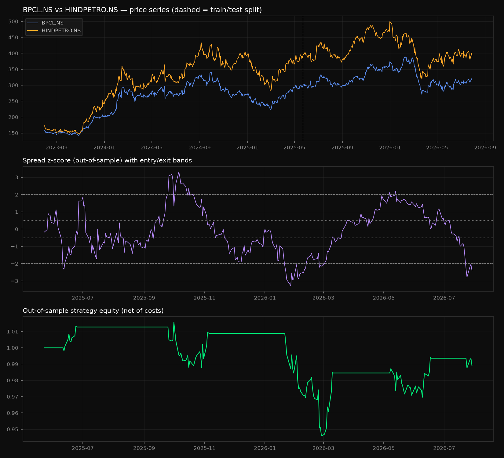

---

### ONGC.NS / COALINDIA.NS

- **Latest prices:** ONGC.NS ₹238.31 · COALINDIA.NS ₹410.05
- **Hedge ratio (train-fitted):** 1.6803
- **Cointegration (train):** PASS at 5% — ADF -3.09, p=0.0274
- **Persistence:** passed 5% in 12 of 20 real-data runs (strict tier: 0/20)
- **Spread half-life:** 14.7 days
- **Current z-score:** -0.08
- **Signal today:** flat / no stretch

**Out-of-sample backtest** (beta frozen from train window):

| Metric | Value |
|---|---|
| Sharpe | 0.84 |
| Sortino | 0.66 |
| Annualised return | 5.95% |
| Annualised vol | 7.24% |
| Max drawdown | -5.58% |
| Round-trip trades | 5 |

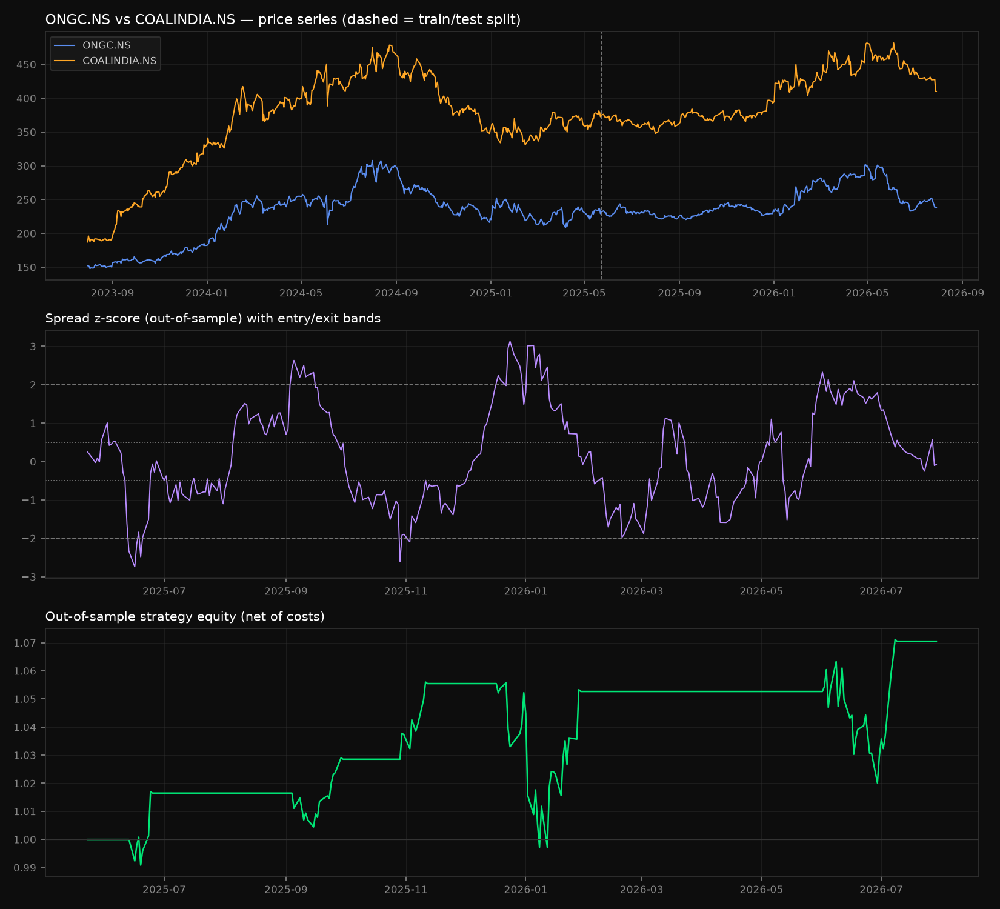

---

### NTPC.NS / POWERGRID.NS

- **Latest prices:** NTPC.NS ₹343.50 · POWERGRID.NS ₹282.85
- **Hedge ratio (train-fitted):** 0.8350
- **Cointegration (train):** FAIL at 5% — ADF -2.71, p=0.0725
- **Persistence:** passed 5% in 0 of 20 real-data runs (strict tier: 0/20)
- **Spread half-life:** 21.5 days
- **Current z-score:** +1.09
- **Signal today:** watch (approaching band)
- ⚠️ _Pair did not cointegrate on training data. Any signal here is not statistically justified — observation only._

**Out-of-sample backtest** (beta frozen from train window):

| Metric | Value |
|---|---|
| Sharpe | 0.38 |
| Sortino | 0.29 |
| Annualised return | 1.93% |
| Annualised vol | 5.43% |
| Max drawdown | -5.18% |
| Round-trip trades | 6 |

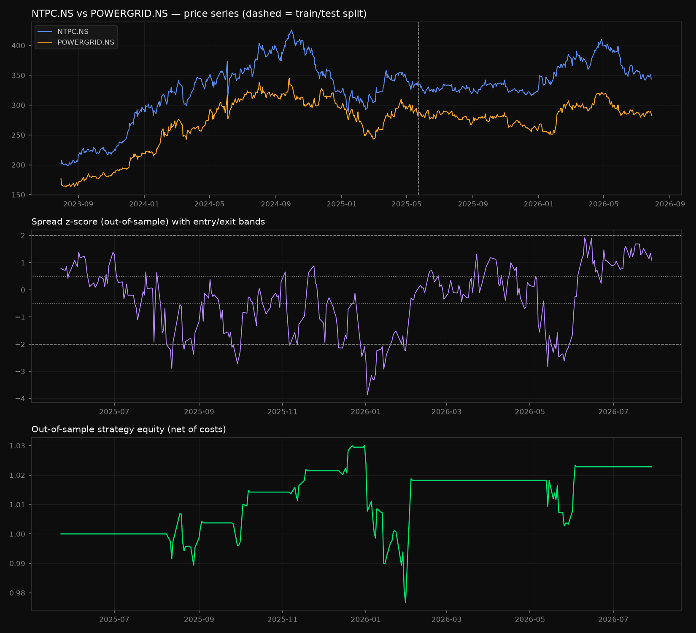

---

### BAJAJ-AUTO.NS / HEROMOTOCO.NS

- **Latest prices:** BAJAJ-AUTO.NS ₹11,338.00 · HEROMOTOCO.NS ₹5,149.10
- **Hedge ratio (train-fitted):** 0.4071
- **Cointegration (train):** FAIL at 5% — ADF -2.28, p=0.1783
- **Persistence:** passed 5% in 0 of 20 real-data runs (strict tier: 0/20)
- **Spread half-life:** 29.7 days
- **Current z-score:** -1.39
- **Signal today:** watch (approaching band)
- ⚠️ _Pair did not cointegrate on training data. Any signal here is not statistically justified — observation only._

**Out-of-sample backtest** (beta frozen from train window):

| Metric | Value |
|---|---|
| Sharpe | -1.29 |
| Sortino | -1.24 |
| Annualised return | -12.38% |
| Annualised vol | 9.89% |
| Max drawdown | -20.73% |
| Round-trip trades | 3 |

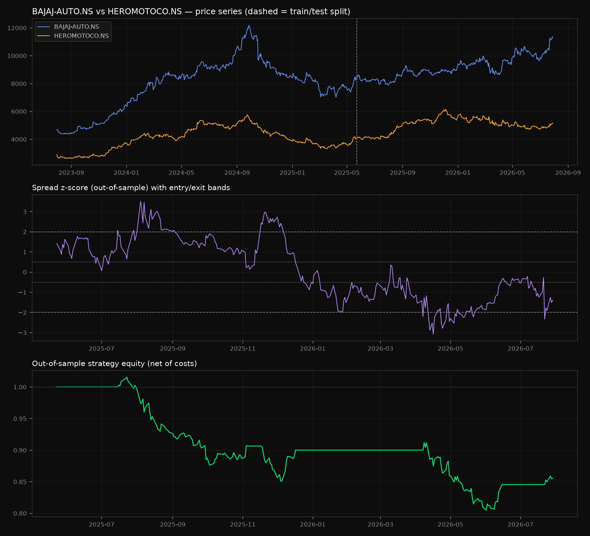

---

### TATASTEEL.NS / JSWSTEEL.NS

- **Latest prices:** TATASTEEL.NS ₹187.27 · JSWSTEEL.NS ₹1,276.60
- **Hedge ratio (train-fitted):** 3.0202
- **Cointegration (train):** FAIL at 5% — ADF -1.14, p=0.6987
- **Persistence:** passed 5% in 0 of 20 real-data runs (strict tier: 0/20)
- **Spread half-life:** 71.7 days
- **Current z-score:** +2.23
- **Signal today:** SHORT spread (short JSWSTEEL.NS, long TATASTEEL.NS)
- ⚠️ _Pair did not cointegrate on training data. Any signal here is not statistically justified — observation only._

**Out-of-sample backtest** (beta frozen from train window):

| Metric | Value |
|---|---|
| Sharpe | 0.17 |
| Sortino | 0.14 |
| Annualised return | 0.96% |
| Annualised vol | 7.33% |
| Max drawdown | -4.27% |
| Round-trip trades | 4 |

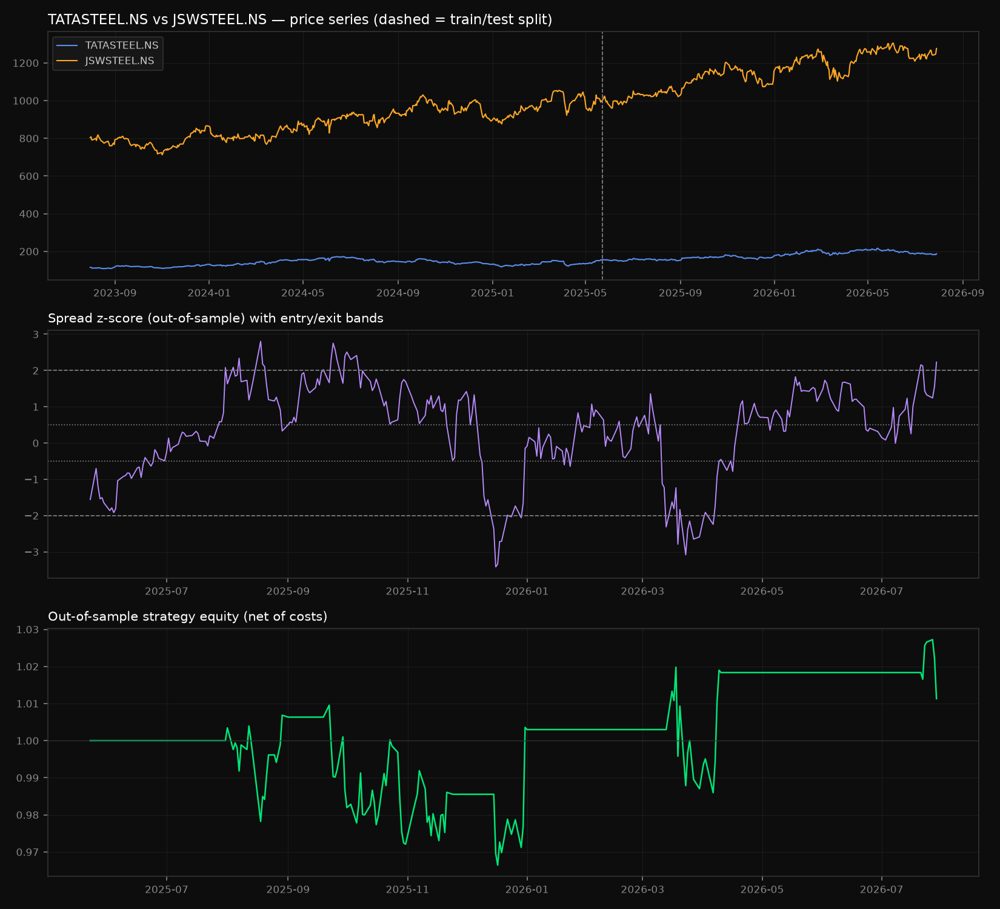

---

### SUNPHARMA.NS / CIPLA.NS

- **Latest prices:** SUNPHARMA.NS ₹1,989.90 · CIPLA.NS ₹1,474.30
- **Hedge ratio (train-fitted):** 0.4895
- **Cointegration (train):** PASS at 5% — ADF -3.43, p=0.0099
- **Persistence:** passed 5% in 20 of 20 real-data runs (strict tier: 5/20)
- **Spread half-life:** 10.6 days
- **Current z-score:** +0.26
- **Signal today:** flat / no stretch

**Out-of-sample backtest** (beta frozen from train window):

| Metric | Value |
|---|---|
| Sharpe | -0.11 |
| Sortino | -0.12 |
| Annualised return | -1.11% |
| Annualised vol | 7.74% |
| Max drawdown | -10.37% |
| Round-trip trades | 5 |

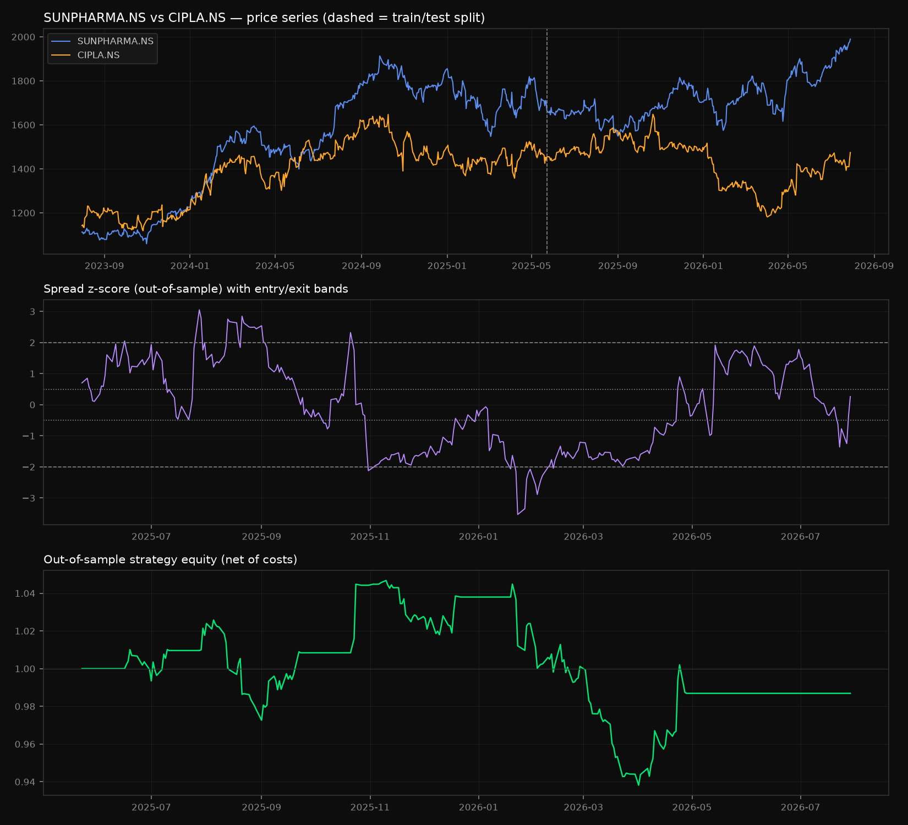

---

_Generated 2026-07-29 · pairs mean-reversion scanner · out-of-sample backtest · multiple-testing-aware · not investment advice._
