# Indian Pairs-Trading Scanner — 2026-07-31

> **What this is:** a market-neutral *pairs mean-reversion* scanner. It flags when two related NSE stocks have drifted apart far enough that their historical relationship signals a possible convergence trade. It does **not** forecast growth, rank "best" stocks, or predict company performance. A signal means the *spread between two stocks* is stretched — nothing about either stock being a good investment. Not investment advice; do your own research.

## Methodology (fixed in advance)

- **Universe:** 16 declared sector-mate pairs. Parameters (3y window, 60/40 train-test, z-entry 2.0, z-exit 0.5, 5 bps costs) are pre-registered; changes are logged in the README changelog *before* looking at results.
- **Multiple testing:** at the 5% level across 16 pairs, **≈0.8 false positives per run are expected by chance alone** even if nothing truly cointegrates. A single-day pass is a candidate, not a discovery.
- **Strict tier:** Bonferroni-corrected threshold p < 0.0031 (marked ✓✓).
- **Evidence = persistence:** the Persistence column counts how often each pair has passed the 5% test across all *real-data* daily runs recorded in `reports/history.csv`. Pairs deserve attention only when they pass persistently.

## Summary

| Pair | p-value | Coint. | Persistence | Current z | Signal | OOS Sharpe |
|---|---|---|---|---|---|---|
| HDFCBANK.NS/ICICIBANK.NS | 0.1240 | ✗ | 0/18 | +2.02 | SHORT spread | -0.41 |
| AXISBANK.NS/ICICIBANK.NS | 0.9191 | ✗ | 0/22 | +1.90 | watch | -0.36 |
| KOTAKBANK.NS/HDFCBANK.NS | 0.1651 | ✗ | 0/22 | -0.78 | watch | 0.52 |
| SBIN.NS/BANKBARODA.NS | 0.1679 | ✗ | 0/22 | -1.54 | watch | 0.31 |
| TCS.NS/INFY.NS | 0.4190 | ✗ | 0/22 | -1.41 | watch | 1.53 |
| INFY.NS/WIPRO.NS | 0.1827 | ✗ | 0/22 | -0.37 | flat / no stretch | 1.66 |
| HCLTECH.NS/TECHM.NS | 0.2816 | ✗ | 0/22 | +1.21 | watch | -0.23 |
| ACC.NS/AMBUJACEM.NS | 0.7946 | ✗ | 0/22 | +0.36 | flat / no stretch | 0.60 |
| ULTRACEMCO.NS/SHREECEM.NS | 0.2979 | ✗ | 0/22 | +0.21 | flat / no stretch | 0.50 |
| IOC.NS/BPCL.NS | 0.8172 | ✗ | 0/22 | +2.18 | SHORT spread | 0.43 |
| BPCL.NS/HINDPETRO.NS | 0.3182 | ✗ | 0/22 | -2.78 | LONG spread | -0.25 |
| ONGC.NS/COALINDIA.NS | 0.0271 | ✓ | 14/22 | -0.01 | flat / no stretch | 0.83 |
| NTPC.NS/POWERGRID.NS | 0.0764 | ✗ | 0/22 | +0.85 | watch | 0.38 |
| BAJAJ-AUTO.NS/HEROMOTOCO.NS | 0.1738 | ✗ | 0/22 | -0.05 | flat / no stretch | -1.12 |
| TATASTEEL.NS/JSWSTEEL.NS | 0.6968 | ✗ | 0/22 | +1.43 | watch | 0.28 |
| SUNPHARMA.NS/CIPLA.NS | 0.0087 | ✓ | 22/22 | +0.18 | flat / no stretch | -0.11 |

_Legend: ✓✓ passes strict Bonferroni tier · ✓ passes 5% only · ✗ fails. Persistence = 5%-passes / real-data runs recorded. \*no real-data history yet._

---

### HDFCBANK.NS / ICICIBANK.NS

- **Latest prices:** HDFCBANK.NS ₹748.15 · ICICIBANK.NS ₹1,435.40
- **Hedge ratio (train-fitted):** 1.7751
- **Cointegration (train):** FAIL at 5% — ADF -2.47, p=0.1240
- **Persistence:** passed 5% in 0 of 18 real-data runs (strict tier: 0/18)
- **Spread half-life:** 30.8 days
- **Current z-score:** +2.02
- **Signal today:** SHORT spread (short ICICIBANK.NS, long HDFCBANK.NS)
- ⚠️ _Pair did not cointegrate on training data. Any signal here is not statistically justified — observation only._

**Out-of-sample backtest** (beta frozen from train window):

| Metric | Value |
|---|---|
| Sharpe | -0.41 |
| Sortino | -0.40 |
| Annualised return | -2.56% |
| Annualised vol | 5.96% |
| Max drawdown | -8.66% |
| Round-trip trades | 5 |

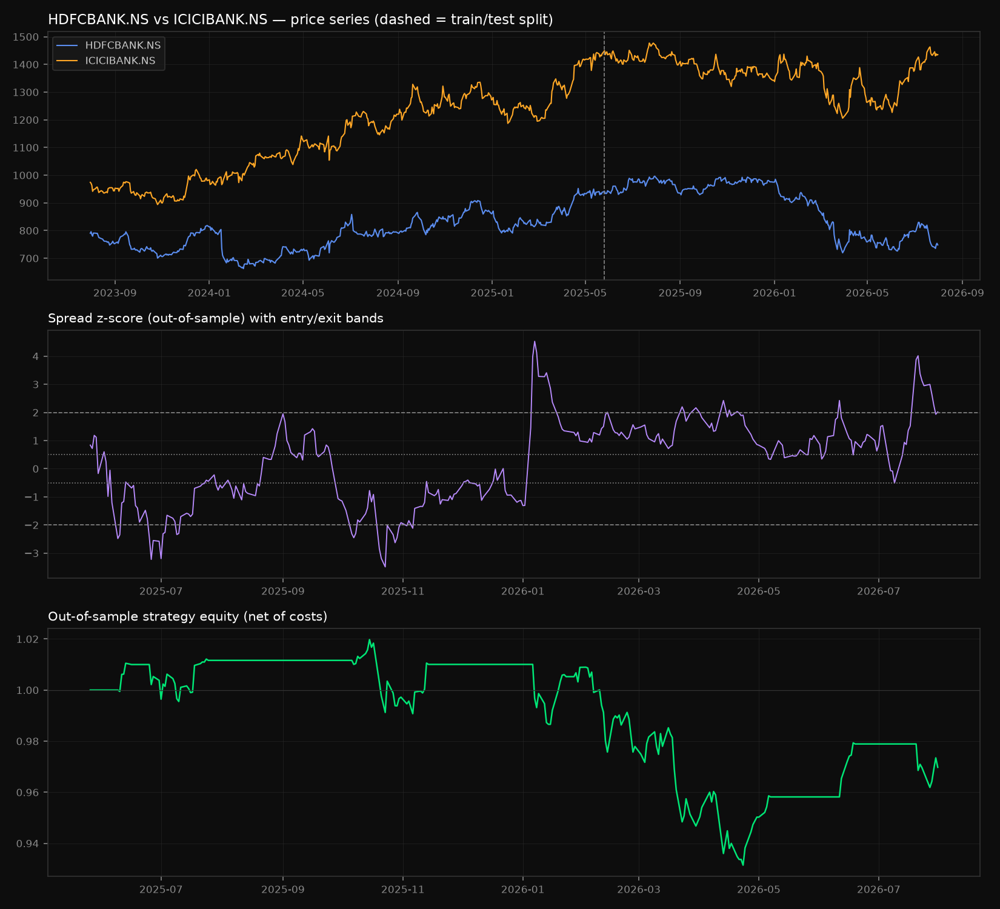

---

### AXISBANK.NS / ICICIBANK.NS

- **Latest prices:** AXISBANK.NS ₹1,229.50 · ICICIBANK.NS ₹1,435.40
- **Hedge ratio (train-fitted):** 0.9291
- **Cointegration (train):** FAIL at 5% — ADF -0.34, p=0.9191
- **Persistence:** passed 5% in 0 of 22 real-data runs (strict tier: 0/22)
- **Spread half-life:** 257.7 days
- **Current z-score:** +1.90
- **Signal today:** watch (approaching band)
- ⚠️ _Pair did not cointegrate on training data. Any signal here is not statistically justified — observation only._

**Out-of-sample backtest** (beta frozen from train window):

| Metric | Value |
|---|---|
| Sharpe | -0.36 |
| Sortino | -0.36 |
| Annualised return | -3.35% |
| Annualised vol | 8.53% |
| Max drawdown | -7.97% |
| Round-trip trades | 6 |

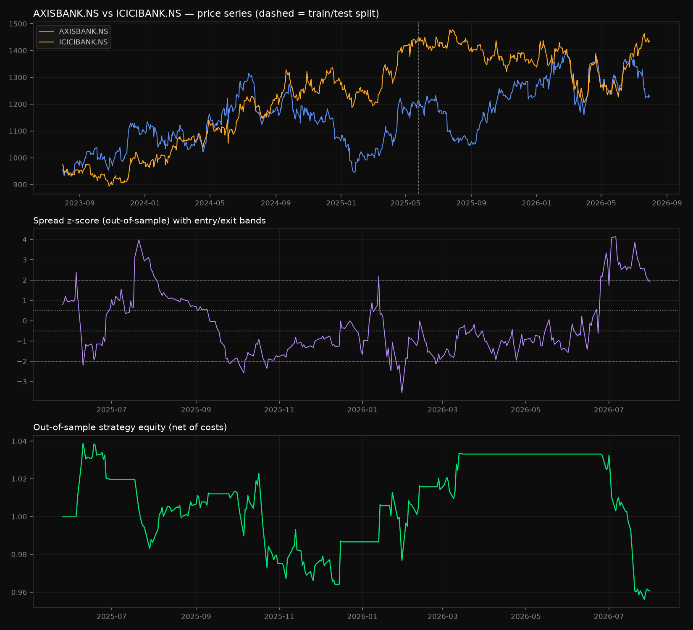

---

### KOTAKBANK.NS / HDFCBANK.NS

- **Latest prices:** KOTAKBANK.NS ₹390.30 · HDFCBANK.NS ₹748.15
- **Hedge ratio (train-fitted):** 1.9029
- **Cointegration (train):** FAIL at 5% — ADF -2.32, p=0.1651
- **Persistence:** passed 5% in 0 of 22 real-data runs (strict tier: 0/22)
- **Spread half-life:** 27.9 days
- **Current z-score:** -0.78
- **Signal today:** watch (approaching band)
- ⚠️ _Pair did not cointegrate on training data. Any signal here is not statistically justified — observation only._

**Out-of-sample backtest** (beta frozen from train window):

| Metric | Value |
|---|---|
| Sharpe | 0.52 |
| Sortino | 0.37 |
| Annualised return | 3.08% |
| Annualised vol | 6.18% |
| Max drawdown | -4.70% |
| Round-trip trades | 5 |

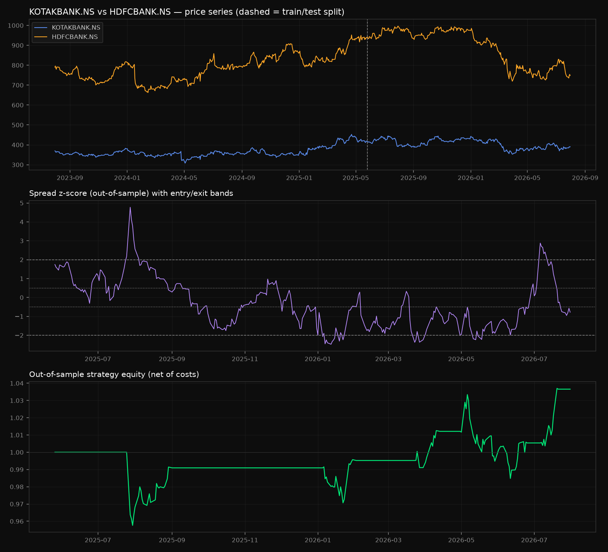

---

### SBIN.NS / BANKBARODA.NS

- **Latest prices:** SBIN.NS ₹1,027.40 · BANKBARODA.NS ₹242.60
- **Hedge ratio (train-fitted):** 0.2060
- **Cointegration (train):** FAIL at 5% — ADF -2.31, p=0.1679
- **Persistence:** passed 5% in 0 of 22 real-data runs (strict tier: 0/22)
- **Spread half-life:** 22.7 days
- **Current z-score:** -1.54
- **Signal today:** watch (approaching band)
- ⚠️ _Pair did not cointegrate on training data. Any signal here is not statistically justified — observation only._

**Out-of-sample backtest** (beta frozen from train window):

| Metric | Value |
|---|---|
| Sharpe | 0.31 |
| Sortino | 0.22 |
| Annualised return | 2.37% |
| Annualised vol | 8.79% |
| Max drawdown | -9.17% |
| Round-trip trades | 5 |

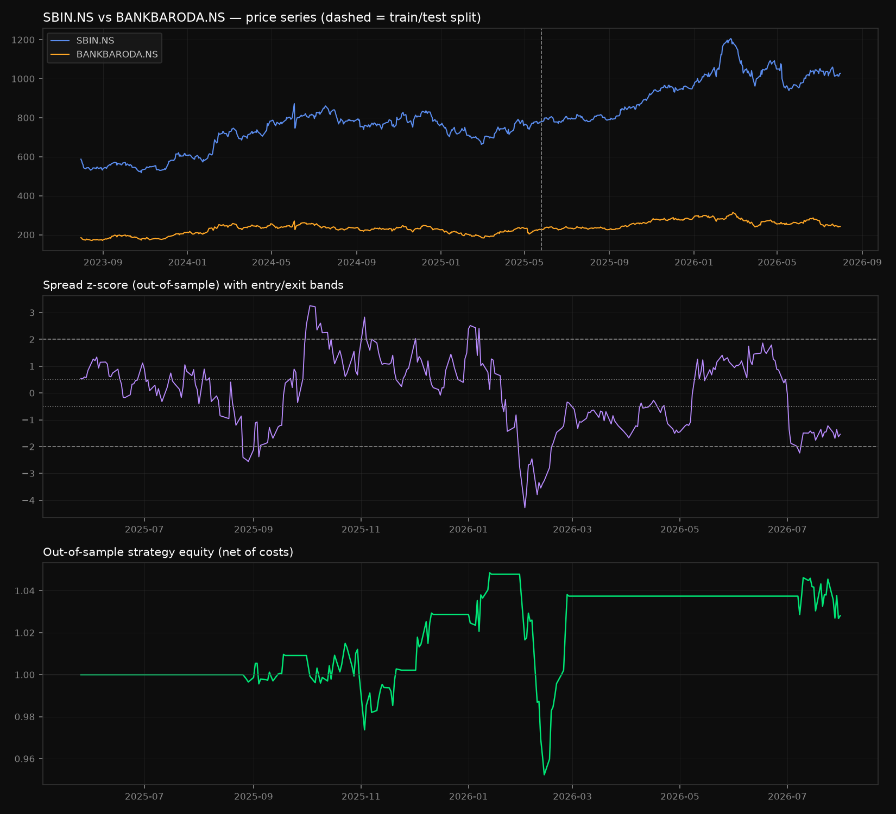

---

### TCS.NS / INFY.NS

- **Latest prices:** TCS.NS ₹2,365.60 · INFY.NS ₹1,130.10
- **Hedge ratio (train-fitted):** 0.5250
- **Cointegration (train):** FAIL at 5% — ADF -1.72, p=0.4190
- **Persistence:** passed 5% in 0 of 22 real-data runs (strict tier: 0/22)
- **Spread half-life:** 42.8 days
- **Current z-score:** -1.41
- **Signal today:** watch (approaching band)
- ⚠️ _Pair did not cointegrate on training data. Any signal here is not statistically justified — observation only._

**Out-of-sample backtest** (beta frozen from train window):

| Metric | Value |
|---|---|
| Sharpe | 1.53 |
| Sortino | 1.52 |
| Annualised return | 7.08% |
| Annualised vol | 4.55% |
| Max drawdown | -4.17% |
| Round-trip trades | 8 |

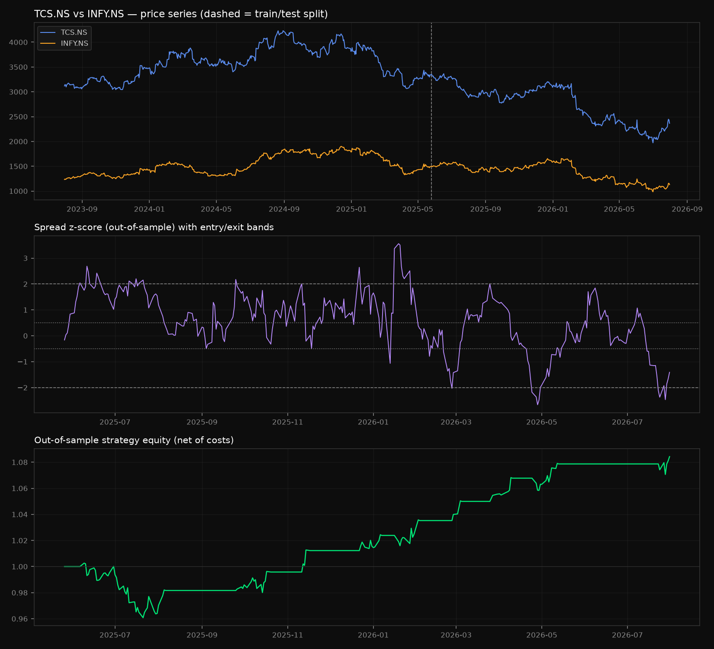

---

### INFY.NS / WIPRO.NS

- **Latest prices:** INFY.NS ₹1,130.10 · WIPRO.NS ₹183.65
- **Hedge ratio (train-fitted):** 0.1375
- **Cointegration (train):** FAIL at 5% — ADF -2.27, p=0.1827
- **Persistence:** passed 5% in 0 of 22 real-data runs (strict tier: 0/22)
- **Spread half-life:** 30.0 days
- **Current z-score:** -0.37
- **Signal today:** flat / no stretch
- ⚠️ _Pair did not cointegrate on training data. Any signal here is not statistically justified — observation only._

**Out-of-sample backtest** (beta frozen from train window):

| Metric | Value |
|---|---|
| Sharpe | 1.66 |
| Sortino | 1.94 |
| Annualised return | 8.92% |
| Annualised vol | 5.22% |
| Max drawdown | -2.48% |
| Round-trip trades | 6 |

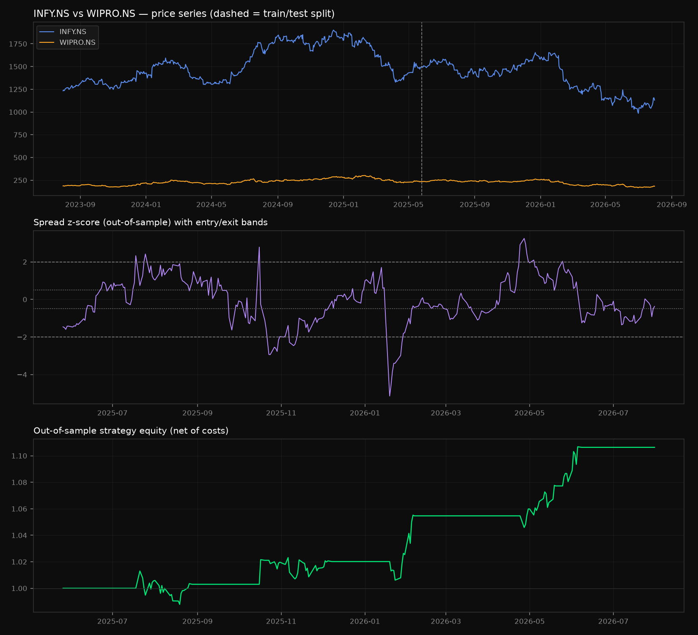

---

### HCLTECH.NS / TECHM.NS

- **Latest prices:** HCLTECH.NS ₹1,346.90 · TECHM.NS ₹1,651.30
- **Hedge ratio (train-fitted):** 0.8189
- **Cointegration (train):** FAIL at 5% — ADF -2.01, p=0.2816
- **Persistence:** passed 5% in 0 of 22 real-data runs (strict tier: 0/22)
- **Spread half-life:** 26.7 days
- **Current z-score:** +1.21
- **Signal today:** watch (approaching band)
- ⚠️ _Pair did not cointegrate on training data. Any signal here is not statistically justified — observation only._

**Out-of-sample backtest** (beta frozen from train window):

| Metric | Value |
|---|---|
| Sharpe | -0.23 |
| Sortino | -0.24 |
| Annualised return | -2.04% |
| Annualised vol | 7.68% |
| Max drawdown | -8.25% |
| Round-trip trades | 4 |

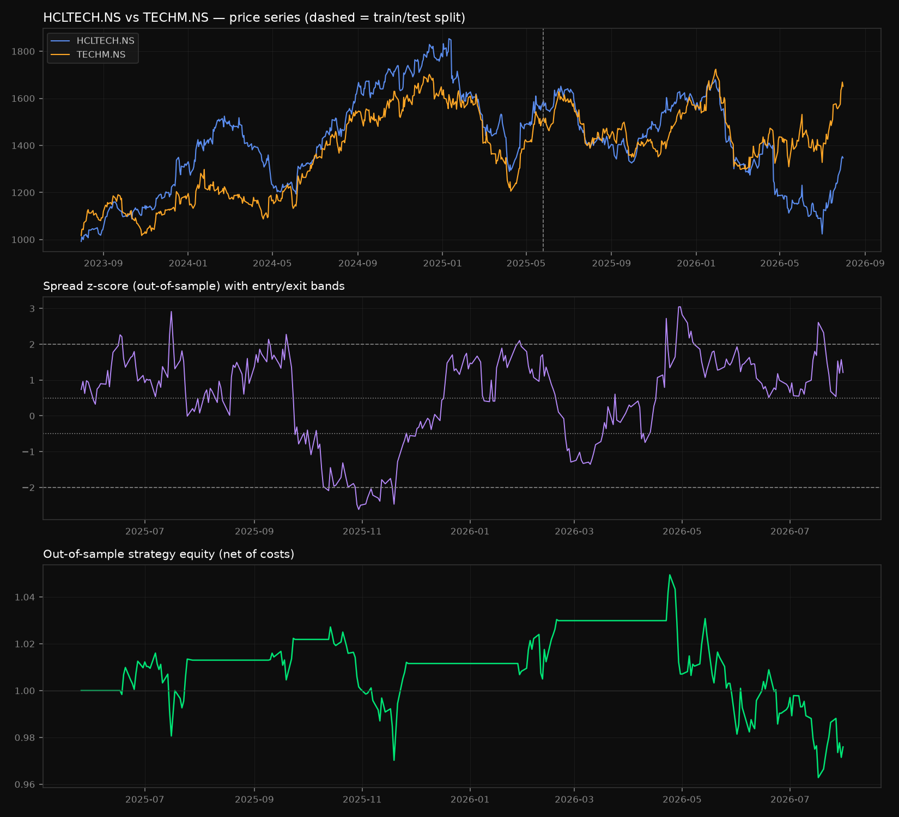

---

### ACC.NS / AMBUJACEM.NS

- **Latest prices:** ACC.NS ₹1,357.40 · AMBUJACEM.NS ₹432.20
- **Hedge ratio (train-fitted):** 0.2331
- **Cointegration (train):** FAIL at 5% — ADF -0.88, p=0.7946
- **Persistence:** passed 5% in 0 of 22 real-data runs (strict tier: 0/22)
- **Spread half-life:** 84.3 days
- **Current z-score:** +0.36
- **Signal today:** flat / no stretch
- ⚠️ _Pair did not cointegrate on training data. Any signal here is not statistically justified — observation only._

**Out-of-sample backtest** (beta frozen from train window):

| Metric | Value |
|---|---|
| Sharpe | 0.60 |
| Sortino | 0.52 |
| Annualised return | 3.33% |
| Annualised vol | 5.71% |
| Max drawdown | -7.29% |
| Round-trip trades | 4 |

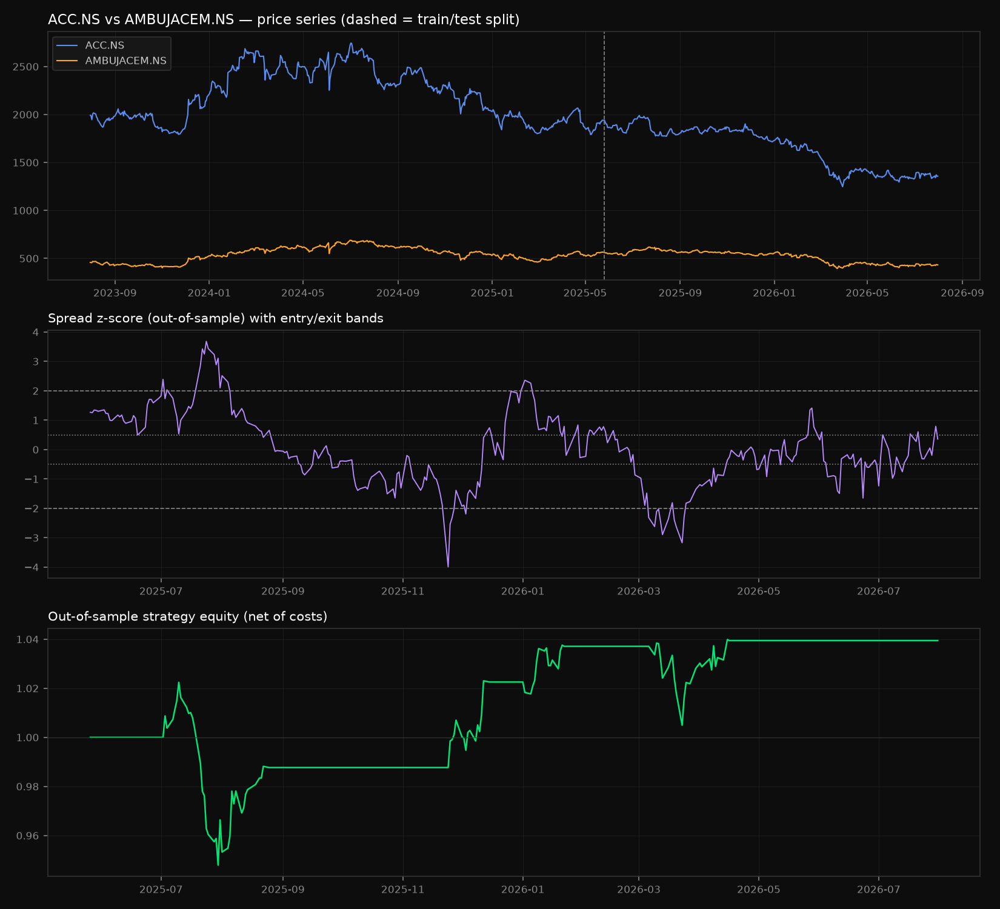

---

### ULTRACEMCO.NS / SHREECEM.NS

- **Latest prices:** ULTRACEMCO.NS ₹11,903.00 · SHREECEM.NS ₹26,055.00
- **Hedge ratio (train-fitted):** 0.6597
- **Cointegration (train):** FAIL at 5% — ADF -1.97, p=0.2979
- **Persistence:** passed 5% in 0 of 22 real-data runs (strict tier: 0/22)
- **Spread half-life:** 42.9 days
- **Current z-score:** +0.21
- **Signal today:** flat / no stretch
- ⚠️ _Pair did not cointegrate on training data. Any signal here is not statistically justified — observation only._

**Out-of-sample backtest** (beta frozen from train window):

| Metric | Value |
|---|---|
| Sharpe | 0.50 |
| Sortino | 0.54 |
| Annualised return | 3.71% |
| Annualised vol | 7.90% |
| Max drawdown | -8.85% |
| Round-trip trades | 5 |

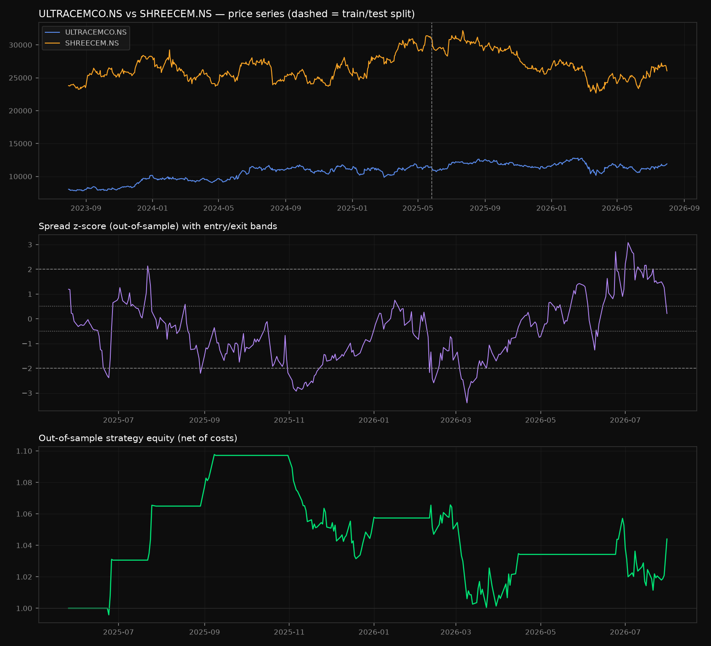

---

### IOC.NS / BPCL.NS

- **Latest prices:** IOC.NS ₹140.17 · BPCL.NS ₹319.75
- **Hedge ratio (train-fitted):** 1.7699
- **Cointegration (train):** FAIL at 5% — ADF -0.81, p=0.8172
- **Persistence:** passed 5% in 0 of 22 real-data runs (strict tier: 0/22)
- **Spread half-life:** 133.1 days
- **Current z-score:** +2.18
- **Signal today:** SHORT spread (short BPCL.NS, long IOC.NS)
- ⚠️ _Pair did not cointegrate on training data. Any signal here is not statistically justified — observation only._

**Out-of-sample backtest** (beta frozen from train window):

| Metric | Value |
|---|---|
| Sharpe | 0.43 |
| Sortino | 0.46 |
| Annualised return | 2.59% |
| Annualised vol | 6.39% |
| Max drawdown | -6.63% |
| Round-trip trades | 7 |

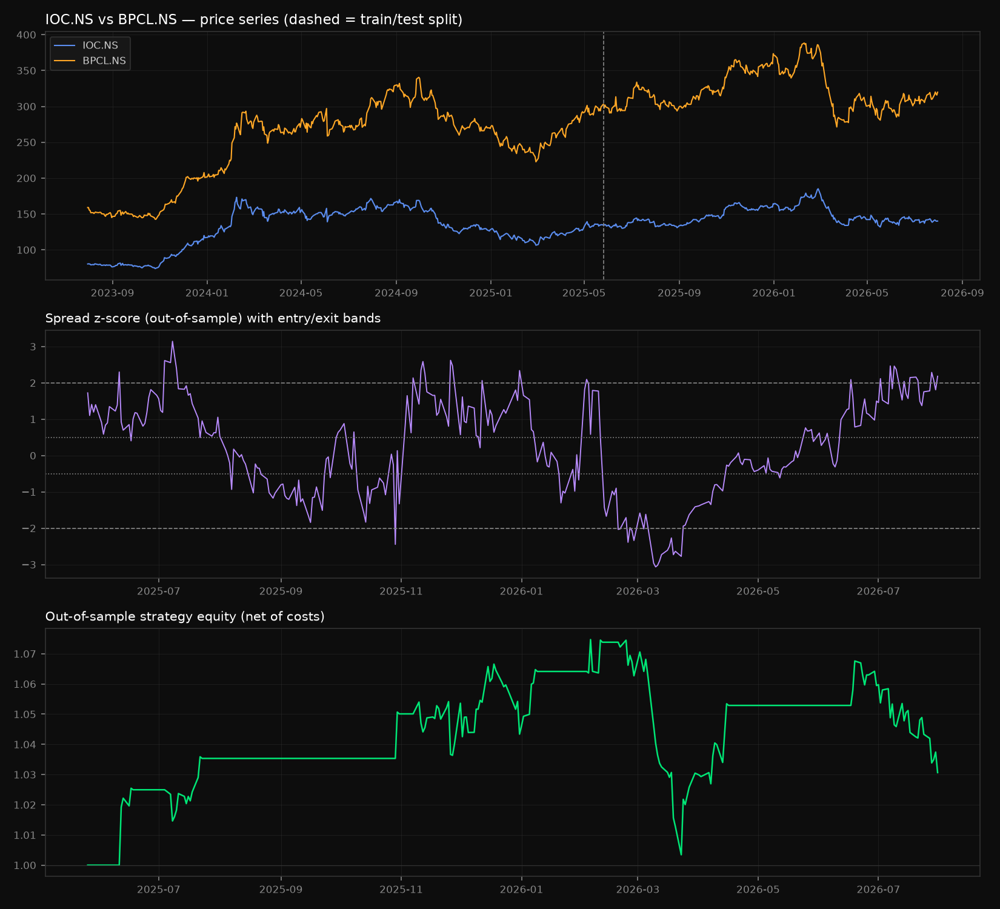

---

### BPCL.NS / HINDPETRO.NS

- **Latest prices:** BPCL.NS ₹319.75 · HINDPETRO.NS ₹389.75
- **Hedge ratio (train-fitted):** 1.4271
- **Cointegration (train):** FAIL at 5% — ADF -1.93, p=0.3182
- **Persistence:** passed 5% in 0 of 22 real-data runs (strict tier: 0/22)
- **Spread half-life:** 40.7 days
- **Current z-score:** -2.78
- **Signal today:** LONG spread (long HINDPETRO.NS, short BPCL.NS)
- ⚠️ _Pair did not cointegrate on training data. Any signal here is not statistically justified — observation only._

**Out-of-sample backtest** (beta frozen from train window):

| Metric | Value |
|---|---|
| Sharpe | -0.25 |
| Sortino | -0.22 |
| Annualised return | -1.53% |
| Annualised vol | 5.63% |
| Max drawdown | -6.78% |
| Round-trip trades | 4 |

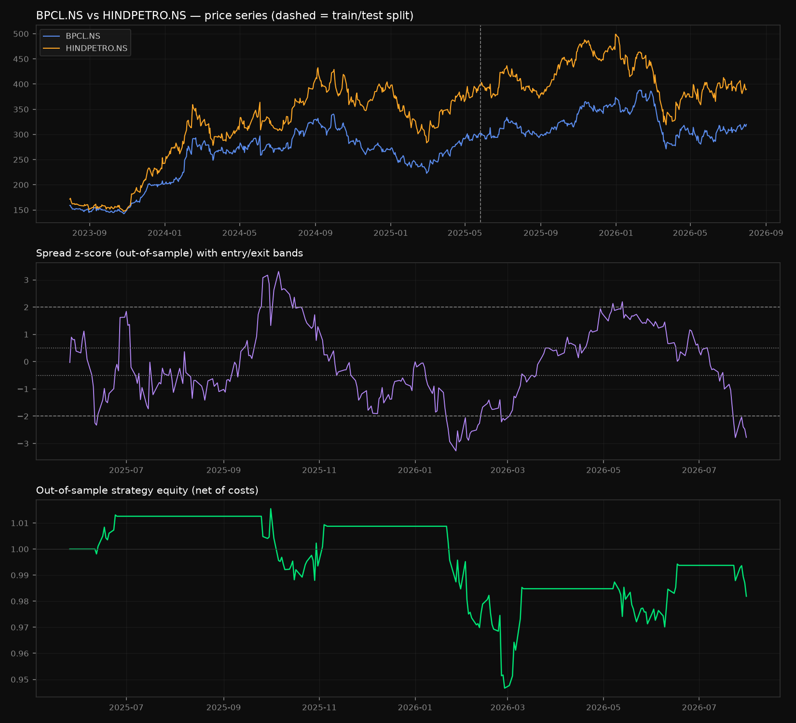

---

### ONGC.NS / COALINDIA.NS

- **Latest prices:** ONGC.NS ₹242.53 · COALINDIA.NS ₹414.15
- **Hedge ratio (train-fitted):** 1.6582
- **Cointegration (train):** PASS at 5% — ADF -3.09, p=0.0271
- **Persistence:** passed 5% in 14 of 22 real-data runs (strict tier: 0/22)
- **Spread half-life:** 14.7 days
- **Current z-score:** -0.01
- **Signal today:** flat / no stretch

**Out-of-sample backtest** (beta frozen from train window):

| Metric | Value |
|---|---|
| Sharpe | 0.83 |
| Sortino | 0.66 |
| Annualised return | 5.90% |
| Annualised vol | 7.19% |
| Max drawdown | -5.55% |
| Round-trip trades | 5 |

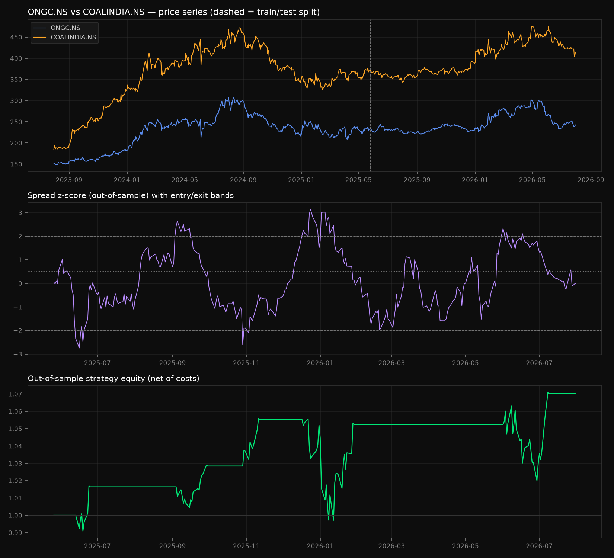

---

### NTPC.NS / POWERGRID.NS

- **Latest prices:** NTPC.NS ₹347.25 · POWERGRID.NS ₹284.25
- **Hedge ratio (train-fitted):** 0.8351
- **Cointegration (train):** FAIL at 5% — ADF -2.69, p=0.0764
- **Persistence:** passed 5% in 0 of 22 real-data runs (strict tier: 0/22)
- **Spread half-life:** 21.6 days
- **Current z-score:** +0.85
- **Signal today:** watch (approaching band)
- ⚠️ _Pair did not cointegrate on training data. Any signal here is not statistically justified — observation only._

**Out-of-sample backtest** (beta frozen from train window):

| Metric | Value |
|---|---|
| Sharpe | 0.38 |
| Sortino | 0.29 |
| Annualised return | 1.93% |
| Annualised vol | 5.44% |
| Max drawdown | -5.20% |
| Round-trip trades | 6 |

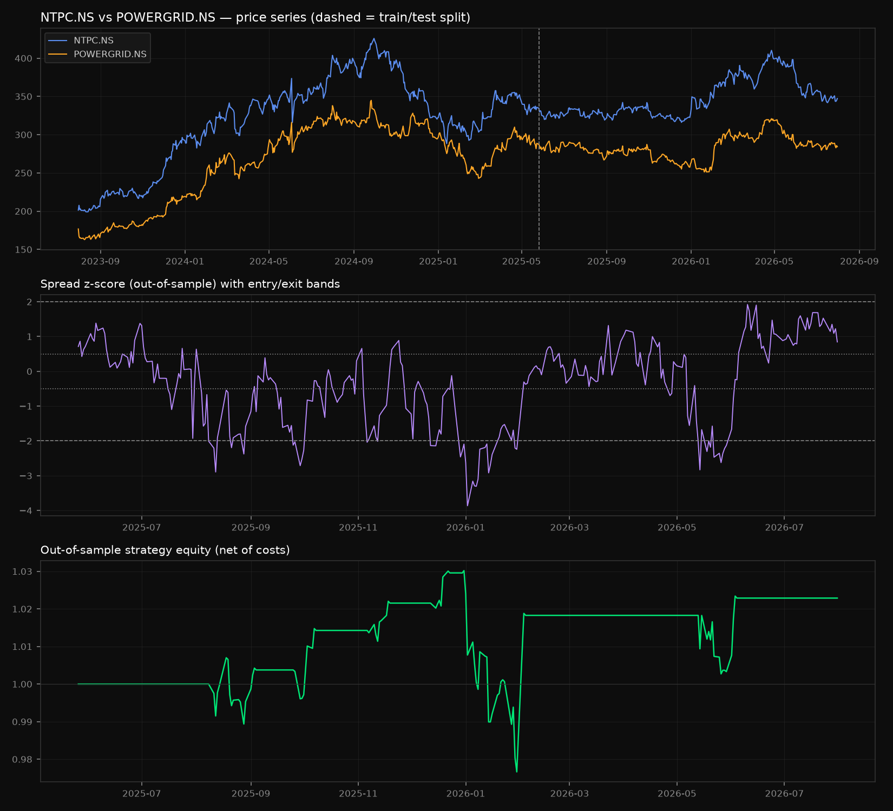

---

### BAJAJ-AUTO.NS / HEROMOTOCO.NS

- **Latest prices:** BAJAJ-AUTO.NS ₹11,520.50 · HEROMOTOCO.NS ₹5,386.00
- **Hedge ratio (train-fitted):** 0.4071
- **Cointegration (train):** FAIL at 5% — ADF -2.29, p=0.1738
- **Persistence:** passed 5% in 0 of 22 real-data runs (strict tier: 0/22)
- **Spread half-life:** 29.5 days
- **Current z-score:** -0.05
- **Signal today:** flat / no stretch
- ⚠️ _Pair did not cointegrate on training data. Any signal here is not statistically justified — observation only._

**Out-of-sample backtest** (beta frozen from train window):

| Metric | Value |
|---|---|
| Sharpe | -1.12 |
| Sortino | -1.09 |
| Annualised return | -10.85% |
| Annualised vol | 9.85% |
| Max drawdown | -20.41% |
| Round-trip trades | 4 |

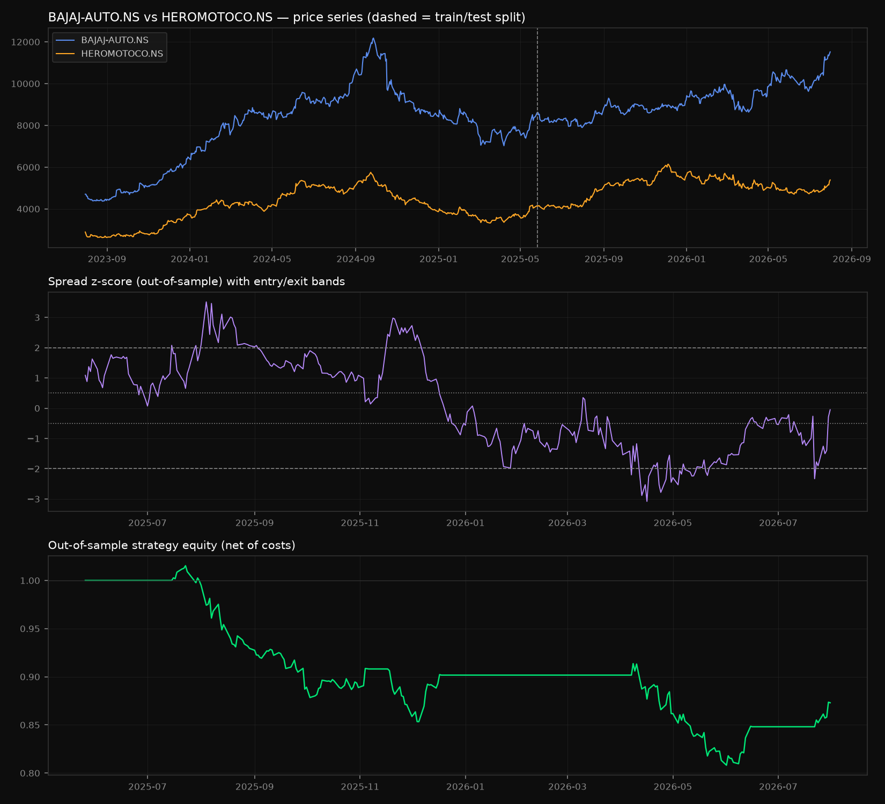

---

### TATASTEEL.NS / JSWSTEEL.NS

- **Latest prices:** TATASTEEL.NS ₹189.69 · JSWSTEEL.NS ₹1,270.00
- **Hedge ratio (train-fitted):** 3.0302
- **Cointegration (train):** FAIL at 5% — ADF -1.14, p=0.6968
- **Persistence:** passed 5% in 0 of 22 real-data runs (strict tier: 0/22)
- **Spread half-life:** 71.5 days
- **Current z-score:** +1.43
- **Signal today:** watch (approaching band)
- ⚠️ _Pair did not cointegrate on training data. Any signal here is not statistically justified — observation only._

**Out-of-sample backtest** (beta frozen from train window):

| Metric | Value |
|---|---|
| Sharpe | 0.28 |
| Sortino | 0.23 |
| Annualised return | 1.77% |
| Annualised vol | 7.22% |
| Max drawdown | -4.20% |
| Round-trip trades | 4 |

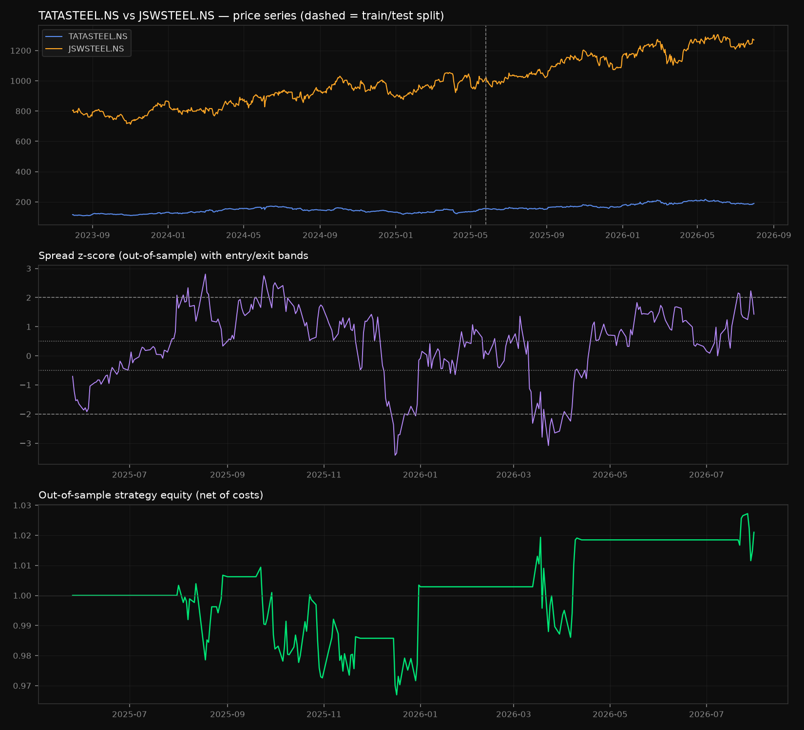

---

### SUNPHARMA.NS / CIPLA.NS

- **Latest prices:** SUNPHARMA.NS ₹1,990.50 · CIPLA.NS ₹1,473.20
- **Hedge ratio (train-fitted):** 0.4894
- **Cointegration (train):** PASS at 5% — ADF -3.47, p=0.0087
- **Persistence:** passed 5% in 22 of 22 real-data runs (strict tier: 5/22)
- **Spread half-life:** 10.4 days
- **Current z-score:** +0.18
- **Signal today:** flat / no stretch

**Out-of-sample backtest** (beta frozen from train window):

| Metric | Value |
|---|---|
| Sharpe | -0.11 |
| Sortino | -0.12 |
| Annualised return | -1.11% |
| Annualised vol | 7.74% |
| Max drawdown | -10.39% |
| Round-trip trades | 5 |

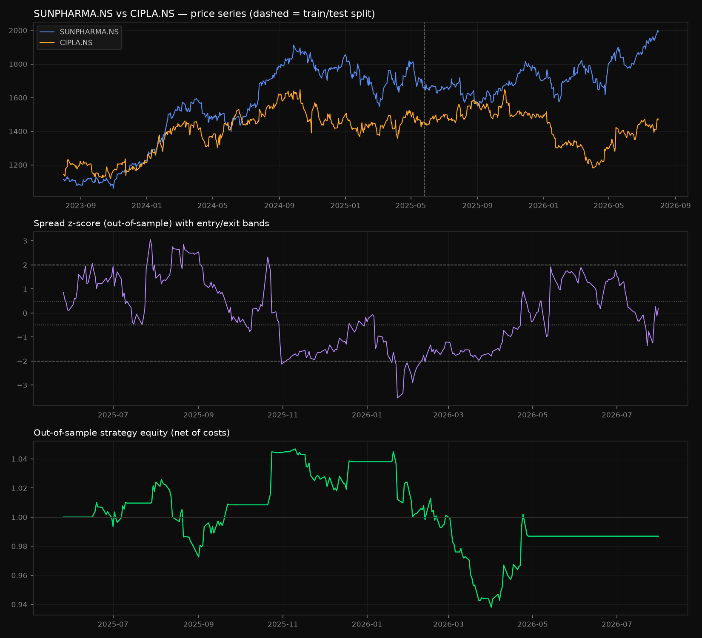

---

_Generated 2026-07-31 · pairs mean-reversion scanner · out-of-sample backtest · multiple-testing-aware · not investment advice._
