# Indian Pairs-Trading Scanner — 2026-08-03

> **What this is:** a market-neutral *pairs mean-reversion* scanner. It flags when two related NSE stocks have drifted apart far enough that their historical relationship signals a possible convergence trade. It does **not** forecast growth, rank "best" stocks, or predict company performance. A signal means the *spread between two stocks* is stretched — nothing about either stock being a good investment. Not investment advice; do your own research.

## Methodology (fixed in advance)

- **Universe:** 16 declared sector-mate pairs. Parameters (3y window, 60/40 train-test, z-entry 2.0, z-exit 0.5, 5 bps costs) are pre-registered; changes are logged in the README changelog *before* looking at results.
- **Multiple testing:** at the 5% level across 16 pairs, **≈0.8 false positives per run are expected by chance alone** even if nothing truly cointegrates. A single-day pass is a candidate, not a discovery.
- **Strict tier:** Bonferroni-corrected threshold p < 0.0031 (marked ✓✓).
- **Evidence = persistence:** the Persistence column counts how often each pair has passed the 5% test across all *real-data* daily runs recorded in `reports/history.csv`. Pairs deserve attention only when they pass persistently.

## Summary

| Pair | p-value | Coint. | Persistence | Current z | Signal | OOS Sharpe |
|---|---|---|---|---|---|---|
| HDFCBANK.NS/ICICIBANK.NS | 0.0975 | ✗ | 0/19 | +2.30 | SHORT spread | -0.53 |
| AXISBANK.NS/ICICIBANK.NS | 0.9217 | ✗ | 0/23 | +1.78 | watch | -0.34 |
| KOTAKBANK.NS/HDFCBANK.NS | 0.1697 | ✗ | 0/23 | -1.03 | watch | 0.70 |
| SBIN.NS/BANKBARODA.NS | 0.1651 | ✗ | 0/23 | -1.41 | watch | 0.34 |
| TCS.NS/INFY.NS | 0.4324 | ✗ | 0/23 | -1.51 | watch | 1.21 |
| INFY.NS/WIPRO.NS | 0.1783 | ✗ | 0/23 | -0.61 | watch | 1.67 |
| HCLTECH.NS/TECHM.NS | 0.2355 | ✗ | 0/23 | +0.51 | watch | -0.13 |
| ACC.NS/AMBUJACEM.NS | 0.7829 | ✗ | 0/23 | +0.86 | watch | 0.60 |
| ULTRACEMCO.NS/SHREECEM.NS | 0.2573 | ✗ | 0/23 | +1.17 | watch | 0.50 |
| IOC.NS/BPCL.NS | 0.8025 | ✗ | 0/23 | +2.54 | SHORT spread | 0.33 |
| BPCL.NS/HINDPETRO.NS | 0.3410 | ✗ | 0/23 | -3.41 | LONG spread | -0.41 |
| ONGC.NS/COALINDIA.NS | 0.0236 | ✓ | 15/23 | +0.07 | flat / no stretch | 0.83 |
| NTPC.NS/POWERGRID.NS | 0.0968 | ✗ | 0/23 | +0.79 | watch | 0.38 |
| BAJAJ-AUTO.NS/HEROMOTOCO.NS | 0.1949 | ✗ | 0/23 | -0.56 | watch | -1.12 |
| TATASTEEL.NS/JSWSTEEL.NS | 0.7185 | ✗ | 0/23 | +2.21 | SHORT spread | 0.13 |
| SUNPHARMA.NS/CIPLA.NS | 0.0102 | ✓ | 23/23 | +0.60 | watch | -0.10 |

_Legend: ✓✓ passes strict Bonferroni tier · ✓ passes 5% only · ✗ fails. Persistence = 5%-passes / real-data runs recorded. \*no real-data history yet._

---

### HDFCBANK.NS / ICICIBANK.NS

- **Latest prices:** HDFCBANK.NS ₹753.00 · ICICIBANK.NS ₹1,460.00
- **Hedge ratio (train-fitted):** 1.7661
- **Cointegration (train):** FAIL at 5% — ADF -2.58, p=0.0975
- **Persistence:** passed 5% in 0 of 19 real-data runs (strict tier: 0/19)
- **Spread half-life:** 29.0 days
- **Current z-score:** +2.30
- **Signal today:** SHORT spread (short ICICIBANK.NS, long HDFCBANK.NS)
- ⚠️ _Pair did not cointegrate on training data. Any signal here is not statistically justified — observation only._

**Out-of-sample backtest** (beta frozen from train window):

| Metric | Value |
|---|---|
| Sharpe | -0.53 |
| Sortino | -0.53 |
| Annualised return | -3.36% |
| Annualised vol | 6.07% |
| Max drawdown | -8.73% |
| Round-trip trades | 5 |

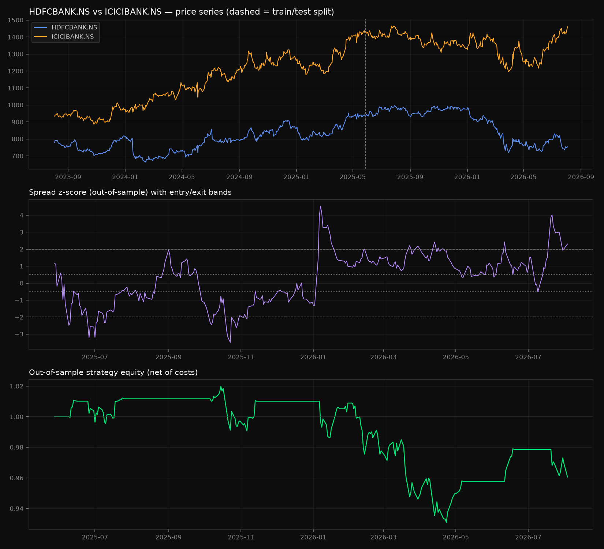

---

### AXISBANK.NS / ICICIBANK.NS

- **Latest prices:** AXISBANK.NS ₹1,272.00 · ICICIBANK.NS ₹1,460.00
- **Hedge ratio (train-fitted):** 0.9299
- **Cointegration (train):** FAIL at 5% — ADF -0.33, p=0.9217
- **Persistence:** passed 5% in 0 of 23 real-data runs (strict tier: 0/23)
- **Spread half-life:** 273.3 days
- **Current z-score:** +1.78
- **Signal today:** watch (approaching band)
- ⚠️ _Pair did not cointegrate on training data. Any signal here is not statistically justified — observation only._

**Out-of-sample backtest** (beta frozen from train window):

| Metric | Value |
|---|---|
| Sharpe | -0.34 |
| Sortino | -0.34 |
| Annualised return | -3.29% |
| Annualised vol | 8.65% |
| Max drawdown | -8.04% |
| Round-trip trades | 6 |

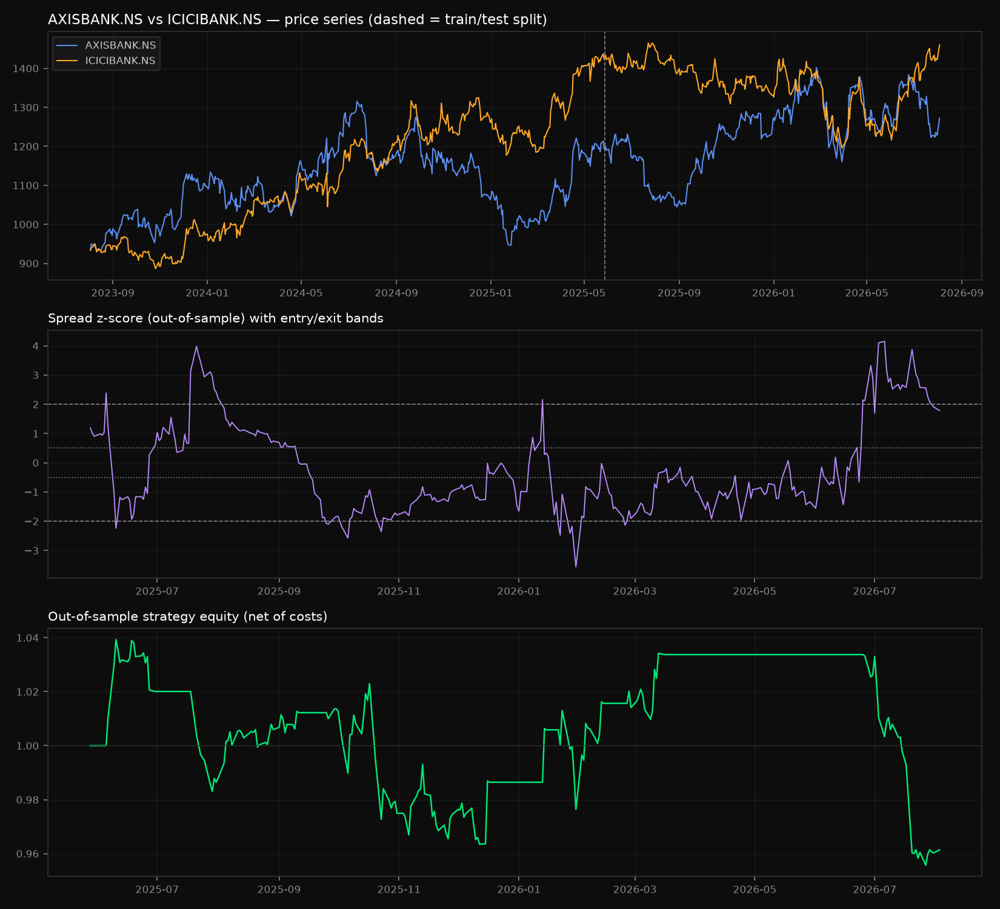

---

### KOTAKBANK.NS / HDFCBANK.NS

- **Latest prices:** KOTAKBANK.NS ₹397.50 · HDFCBANK.NS ₹753.00
- **Hedge ratio (train-fitted):** 1.9215
- **Cointegration (train):** FAIL at 5% — ADF -2.31, p=0.1697
- **Persistence:** passed 5% in 0 of 23 real-data runs (strict tier: 0/23)
- **Spread half-life:** 28.0 days
- **Current z-score:** -1.03
- **Signal today:** watch (approaching band)
- ⚠️ _Pair did not cointegrate on training data. Any signal here is not statistically justified — observation only._

**Out-of-sample backtest** (beta frozen from train window):

| Metric | Value |
|---|---|
| Sharpe | 0.70 |
| Sortino | 0.51 |
| Annualised return | 4.36% |
| Annualised vol | 6.42% |
| Max drawdown | -4.73% |
| Round-trip trades | 5 |

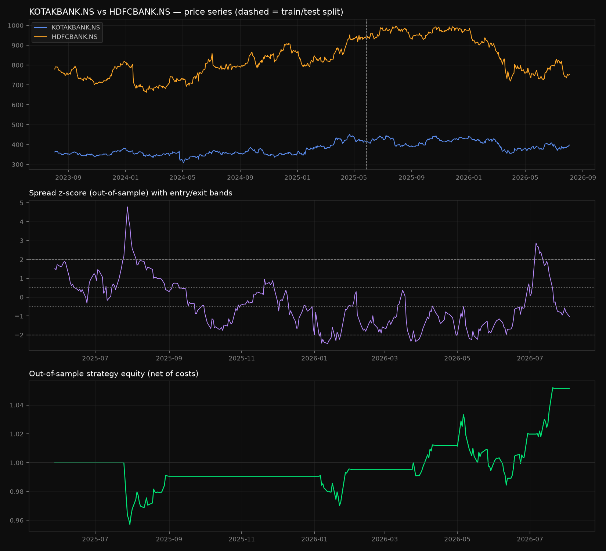

---

### SBIN.NS / BANKBARODA.NS

- **Latest prices:** SBIN.NS ₹1,045.00 · BANKBARODA.NS ₹247.25
- **Hedge ratio (train-fitted):** 0.2047
- **Cointegration (train):** FAIL at 5% — ADF -2.32, p=0.1651
- **Persistence:** passed 5% in 0 of 23 real-data runs (strict tier: 0/23)
- **Spread half-life:** 22.4 days
- **Current z-score:** -1.41
- **Signal today:** watch (approaching band)
- ⚠️ _Pair did not cointegrate on training data. Any signal here is not statistically justified — observation only._

**Out-of-sample backtest** (beta frozen from train window):

| Metric | Value |
|---|---|
| Sharpe | 0.34 |
| Sortino | 0.25 |
| Annualised return | 2.62% |
| Annualised vol | 8.79% |
| Max drawdown | -9.12% |
| Round-trip trades | 5 |

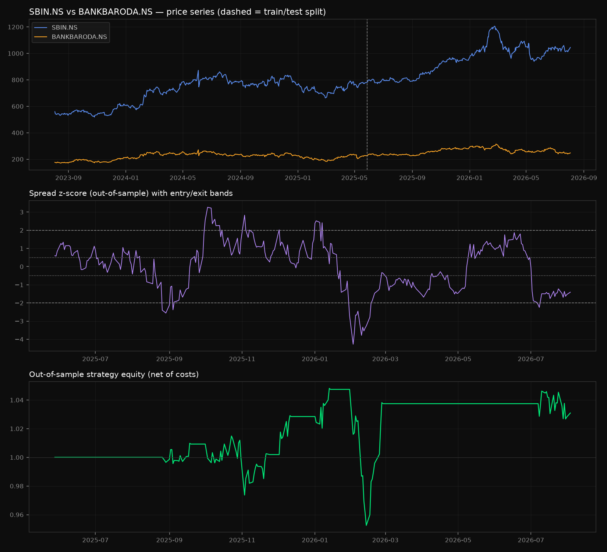

---

### TCS.NS / INFY.NS

- **Latest prices:** TCS.NS ₹2,473.70 · INFY.NS ₹1,180.00
- **Hedge ratio (train-fitted):** 0.5222
- **Cointegration (train):** FAIL at 5% — ADF -1.70, p=0.4324
- **Persistence:** passed 5% in 0 of 23 real-data runs (strict tier: 0/23)
- **Spread half-life:** 44.4 days
- **Current z-score:** -1.51
- **Signal today:** watch (approaching band)
- ⚠️ _Pair did not cointegrate on training data. Any signal here is not statistically justified — observation only._

**Out-of-sample backtest** (beta frozen from train window):

| Metric | Value |
|---|---|
| Sharpe | 1.21 |
| Sortino | 1.19 |
| Annualised return | 5.49% |
| Annualised vol | 4.51% |
| Max drawdown | -4.20% |
| Round-trip trades | 7 |

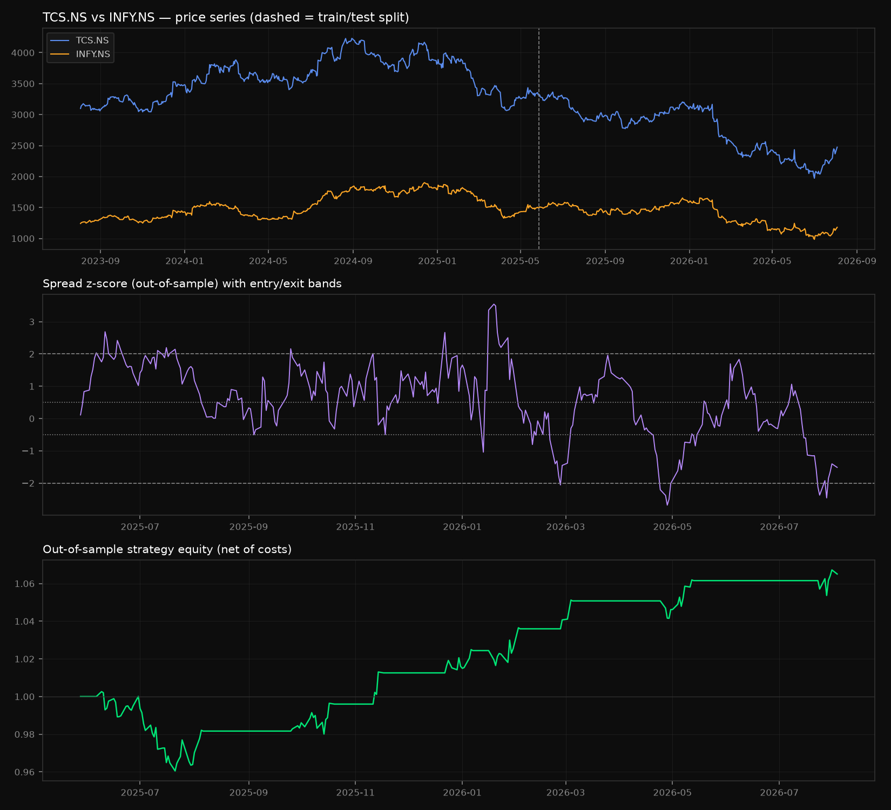

---

### INFY.NS / WIPRO.NS

- **Latest prices:** INFY.NS ₹1,180.00 · WIPRO.NS ₹188.66
- **Hedge ratio (train-fitted):** 0.1372
- **Cointegration (train):** FAIL at 5% — ADF -2.28, p=0.1783
- **Persistence:** passed 5% in 0 of 23 real-data runs (strict tier: 0/23)
- **Spread half-life:** 29.8 days
- **Current z-score:** -0.61
- **Signal today:** watch (approaching band)
- ⚠️ _Pair did not cointegrate on training data. Any signal here is not statistically justified — observation only._

**Out-of-sample backtest** (beta frozen from train window):

| Metric | Value |
|---|---|
| Sharpe | 1.67 |
| Sortino | 1.95 |
| Annualised return | 9.04% |
| Annualised vol | 5.27% |
| Max drawdown | -2.50% |
| Round-trip trades | 6 |

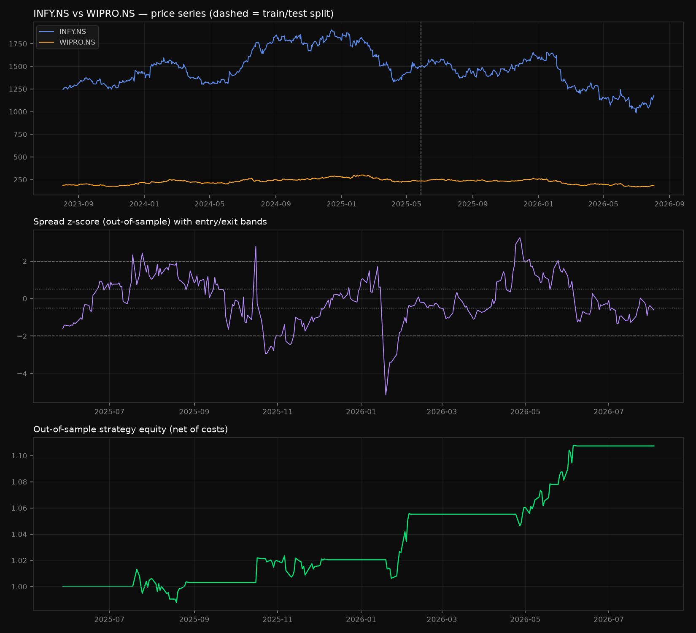

---

### HCLTECH.NS / TECHM.NS

- **Latest prices:** HCLTECH.NS ₹1,377.00 · TECHM.NS ₹1,649.00
- **Hedge ratio (train-fitted):** 0.8229
- **Cointegration (train):** FAIL at 5% — ADF -2.12, p=0.2355
- **Persistence:** passed 5% in 0 of 23 real-data runs (strict tier: 0/23)
- **Spread half-life:** 26.4 days
- **Current z-score:** +0.51
- **Signal today:** watch (approaching band)
- ⚠️ _Pair did not cointegrate on training data. Any signal here is not statistically justified — observation only._

**Out-of-sample backtest** (beta frozen from train window):

| Metric | Value |
|---|---|
| Sharpe | -0.13 |
| Sortino | -0.14 |
| Annualised return | -1.32% |
| Annualised vol | 7.82% |
| Max drawdown | -8.33% |
| Round-trip trades | 4 |

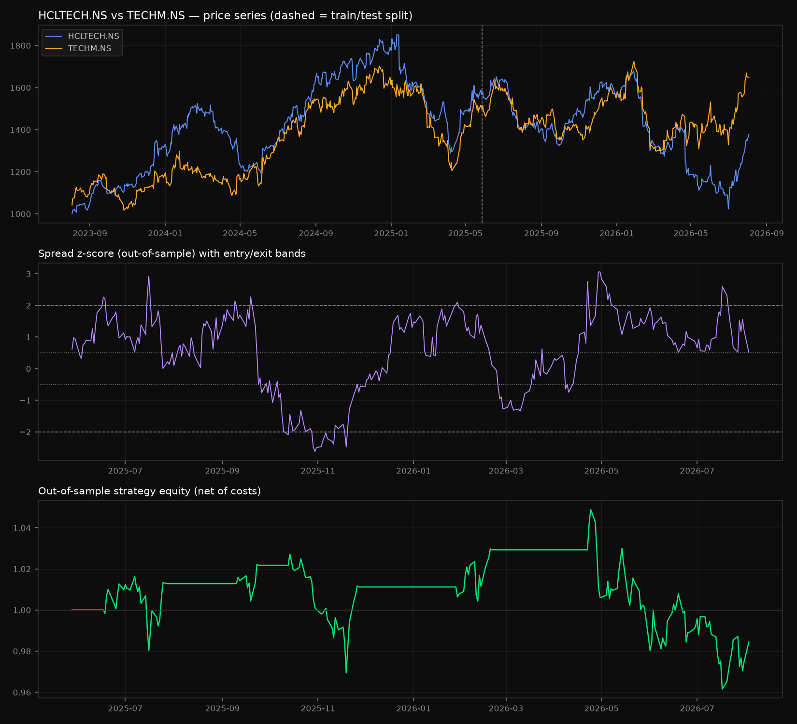

---

### ACC.NS / AMBUJACEM.NS

- **Latest prices:** ACC.NS ₹1,398.00 · AMBUJACEM.NS ₹444.00
- **Hedge ratio (train-fitted):** 0.2310
- **Cointegration (train):** FAIL at 5% — ADF -0.92, p=0.7829
- **Persistence:** passed 5% in 0 of 23 real-data runs (strict tier: 0/23)
- **Spread half-life:** 85.1 days
- **Current z-score:** +0.86
- **Signal today:** watch (approaching band)
- ⚠️ _Pair did not cointegrate on training data. Any signal here is not statistically justified — observation only._

**Out-of-sample backtest** (beta frozen from train window):

| Metric | Value |
|---|---|
| Sharpe | 0.60 |
| Sortino | 0.52 |
| Annualised return | 3.39% |
| Annualised vol | 5.83% |
| Max drawdown | -7.38% |
| Round-trip trades | 4 |

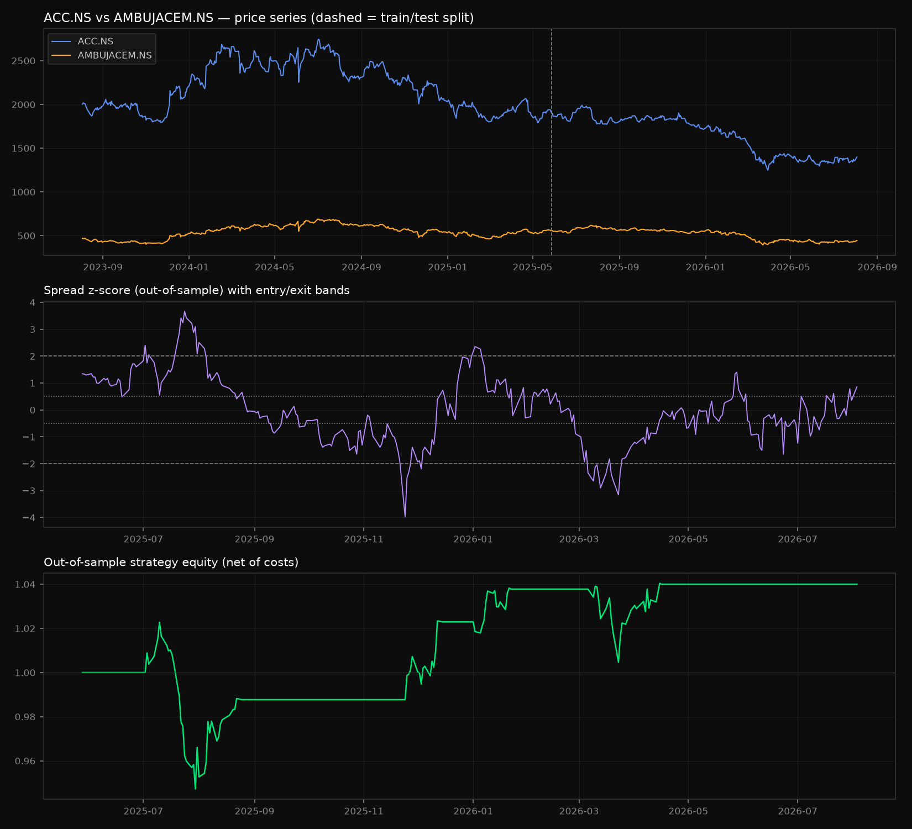

---

### ULTRACEMCO.NS / SHREECEM.NS

- **Latest prices:** ULTRACEMCO.NS ₹12,054.00 · SHREECEM.NS ₹27,000.00
- **Hedge ratio (train-fitted):** 0.6617
- **Cointegration (train):** FAIL at 5% — ADF -2.07, p=0.2573
- **Persistence:** passed 5% in 0 of 23 real-data runs (strict tier: 0/23)
- **Spread half-life:** 40.9 days
- **Current z-score:** +1.17
- **Signal today:** watch (approaching band)
- ⚠️ _Pair did not cointegrate on training data. Any signal here is not statistically justified — observation only._

**Out-of-sample backtest** (beta frozen from train window):

| Metric | Value |
|---|---|
| Sharpe | 0.50 |
| Sortino | 0.54 |
| Annualised return | 3.83% |
| Annualised vol | 8.22% |
| Max drawdown | -9.18% |
| Round-trip trades | 6 |

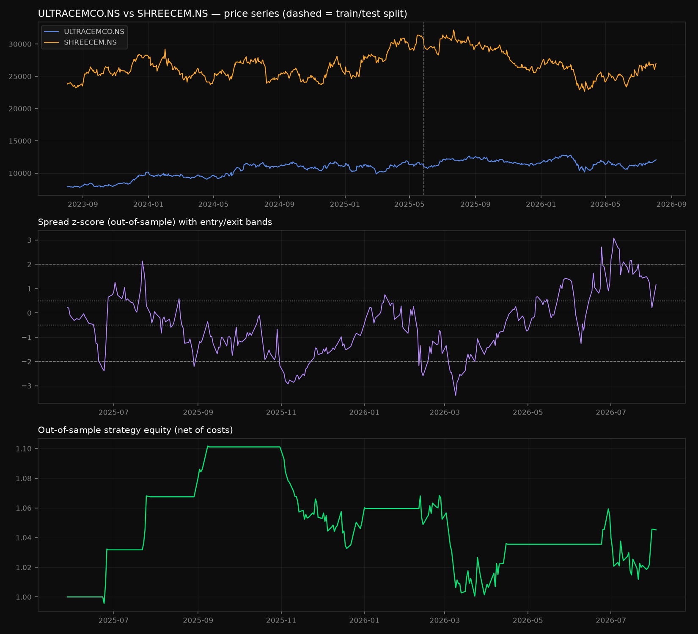

---

### IOC.NS / BPCL.NS

- **Latest prices:** IOC.NS ₹143.70 · BPCL.NS ₹329.95
- **Hedge ratio (train-fitted):** 1.7692
- **Cointegration (train):** FAIL at 5% — ADF -0.85, p=0.8025
- **Persistence:** passed 5% in 0 of 23 real-data runs (strict tier: 0/23)
- **Spread half-life:** 125.8 days
- **Current z-score:** +2.54
- **Signal today:** SHORT spread (short BPCL.NS, long IOC.NS)
- ⚠️ _Pair did not cointegrate on training data. Any signal here is not statistically justified — observation only._

**Out-of-sample backtest** (beta frozen from train window):

| Metric | Value |
|---|---|
| Sharpe | 0.33 |
| Sortino | 0.36 |
| Annualised return | 1.96% |
| Annualised vol | 6.44% |
| Max drawdown | -6.64% |
| Round-trip trades | 7 |

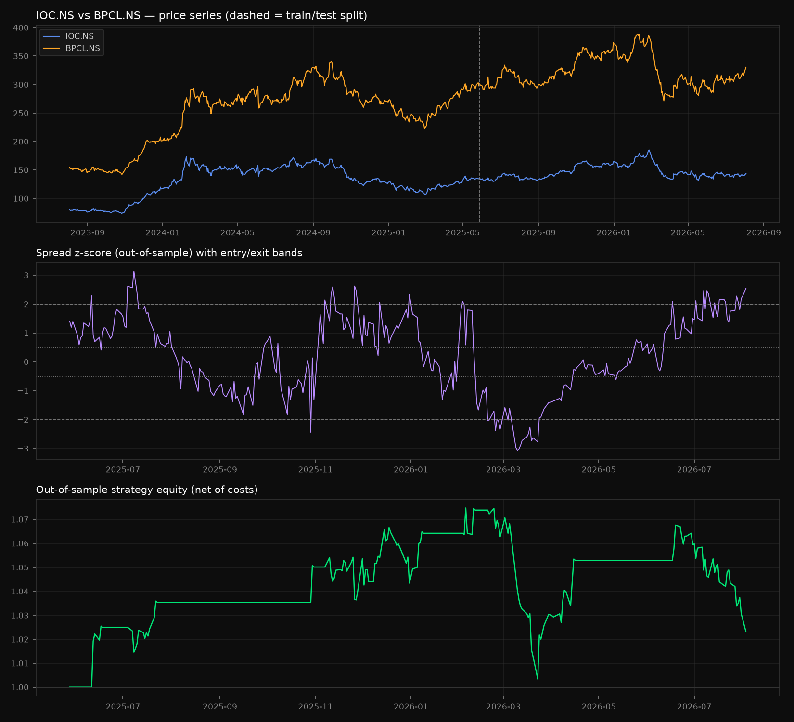

---

### BPCL.NS / HINDPETRO.NS

- **Latest prices:** BPCL.NS ₹329.95 · HINDPETRO.NS ₹395.00
- **Hedge ratio (train-fitted):** 1.4274
- **Cointegration (train):** FAIL at 5% — ADF -1.88, p=0.3410
- **Persistence:** passed 5% in 0 of 23 real-data runs (strict tier: 0/23)
- **Spread half-life:** 41.7 days
- **Current z-score:** -3.41
- **Signal today:** LONG spread (long HINDPETRO.NS, short BPCL.NS)
- ⚠️ _Pair did not cointegrate on training data. Any signal here is not statistically justified — observation only._

**Out-of-sample backtest** (beta frozen from train window):

| Metric | Value |
|---|---|
| Sharpe | -0.41 |
| Sortino | -0.36 |
| Annualised return | -2.47% |
| Annualised vol | 5.72% |
| Max drawdown | -6.76% |
| Round-trip trades | 4 |

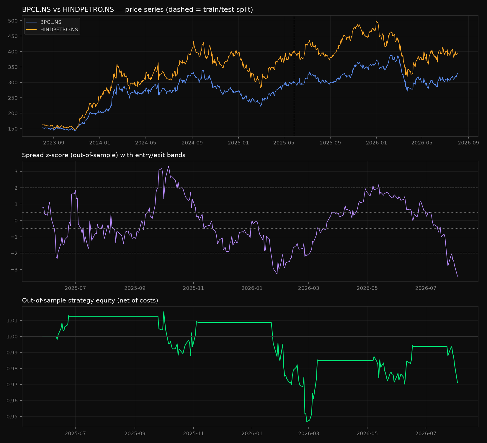

---

### ONGC.NS / COALINDIA.NS

- **Latest prices:** ONGC.NS ₹242.00 · COALINDIA.NS ₹416.00
- **Hedge ratio (train-fitted):** 1.6446
- **Cointegration (train):** PASS at 5% — ADF -3.14, p=0.0236
- **Persistence:** passed 5% in 15 of 23 real-data runs (strict tier: 0/23)
- **Spread half-life:** 14.9 days
- **Current z-score:** +0.07
- **Signal today:** flat / no stretch

**Out-of-sample backtest** (beta frozen from train window):

| Metric | Value |
|---|---|
| Sharpe | 0.83 |
| Sortino | 0.66 |
| Annualised return | 5.97% |
| Annualised vol | 7.29% |
| Max drawdown | -5.65% |
| Round-trip trades | 5 |

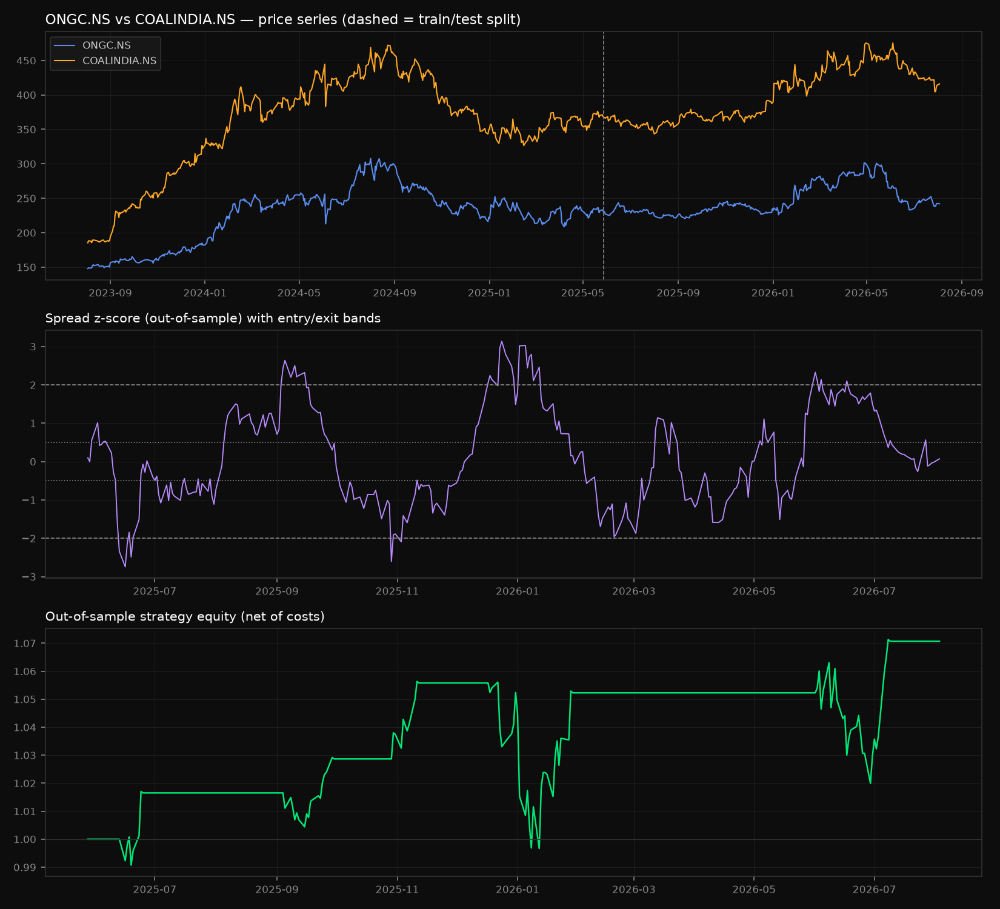

---

### NTPC.NS / POWERGRID.NS

- **Latest prices:** NTPC.NS ₹350.90 · POWERGRID.NS ₹287.00
- **Hedge ratio (train-fitted):** 0.8358
- **Cointegration (train):** FAIL at 5% — ADF -2.58, p=0.0968
- **Persistence:** passed 5% in 0 of 23 real-data runs (strict tier: 0/23)
- **Spread half-life:** 22.8 days
- **Current z-score:** +0.79
- **Signal today:** watch (approaching band)
- ⚠️ _Pair did not cointegrate on training data. Any signal here is not statistically justified — observation only._

**Out-of-sample backtest** (beta frozen from train window):

| Metric | Value |
|---|---|
| Sharpe | 0.38 |
| Sortino | 0.29 |
| Annualised return | 1.96% |
| Annualised vol | 5.53% |
| Max drawdown | -5.27% |
| Round-trip trades | 6 |

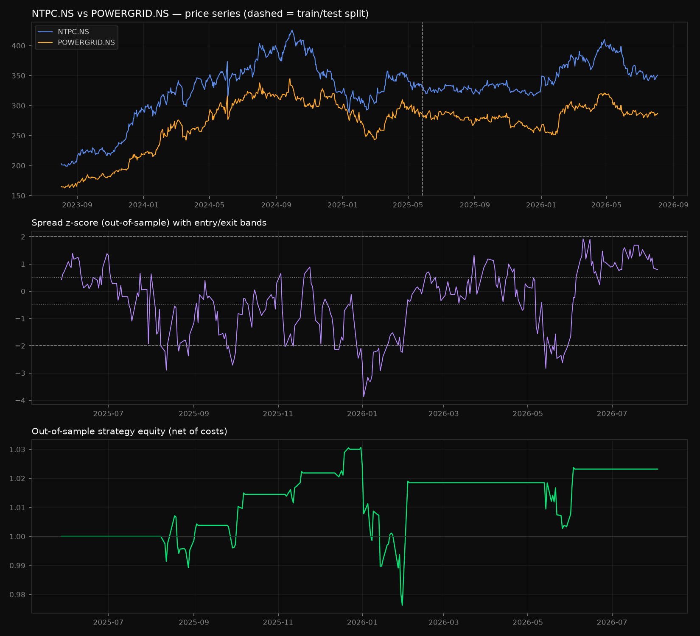

---

### BAJAJ-AUTO.NS / HEROMOTOCO.NS

- **Latest prices:** BAJAJ-AUTO.NS ₹11,856.00 · HEROMOTOCO.NS ₹5,460.00
- **Hedge ratio (train-fitted):** 0.4073
- **Cointegration (train):** FAIL at 5% — ADF -2.23, p=0.1949
- **Persistence:** passed 5% in 0 of 23 real-data runs (strict tier: 0/23)
- **Spread half-life:** 30.4 days
- **Current z-score:** -0.56
- **Signal today:** watch (approaching band)
- ⚠️ _Pair did not cointegrate on training data. Any signal here is not statistically justified — observation only._

**Out-of-sample backtest** (beta frozen from train window):

| Metric | Value |
|---|---|
| Sharpe | -1.12 |
| Sortino | -1.10 |
| Annualised return | -10.94% |
| Annualised vol | 9.92% |
| Max drawdown | -20.50% |
| Round-trip trades | 4 |

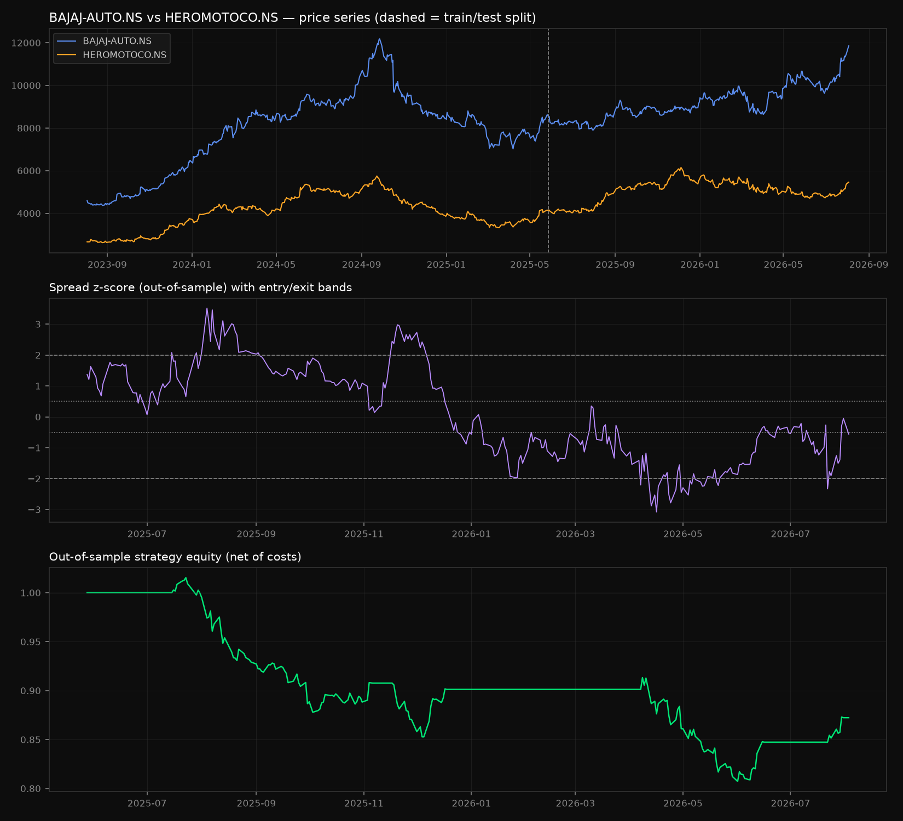

---

### TATASTEEL.NS / JSWSTEEL.NS

- **Latest prices:** TATASTEEL.NS ₹191.00 · JSWSTEEL.NS ₹1,292.30
- **Hedge ratio (train-fitted):** 3.0458
- **Cointegration (train):** FAIL at 5% — ADF -1.09, p=0.7185
- **Persistence:** passed 5% in 0 of 23 real-data runs (strict tier: 0/23)
- **Spread half-life:** 72.4 days
- **Current z-score:** +2.21
- **Signal today:** SHORT spread (short JSWSTEEL.NS, long TATASTEEL.NS)
- ⚠️ _Pair did not cointegrate on training data. Any signal here is not statistically justified — observation only._

**Out-of-sample backtest** (beta frozen from train window):

| Metric | Value |
|---|---|
| Sharpe | 0.13 |
| Sortino | 0.11 |
| Annualised return | 0.70% |
| Annualised vol | 7.47% |
| Max drawdown | -4.30% |
| Round-trip trades | 4 |

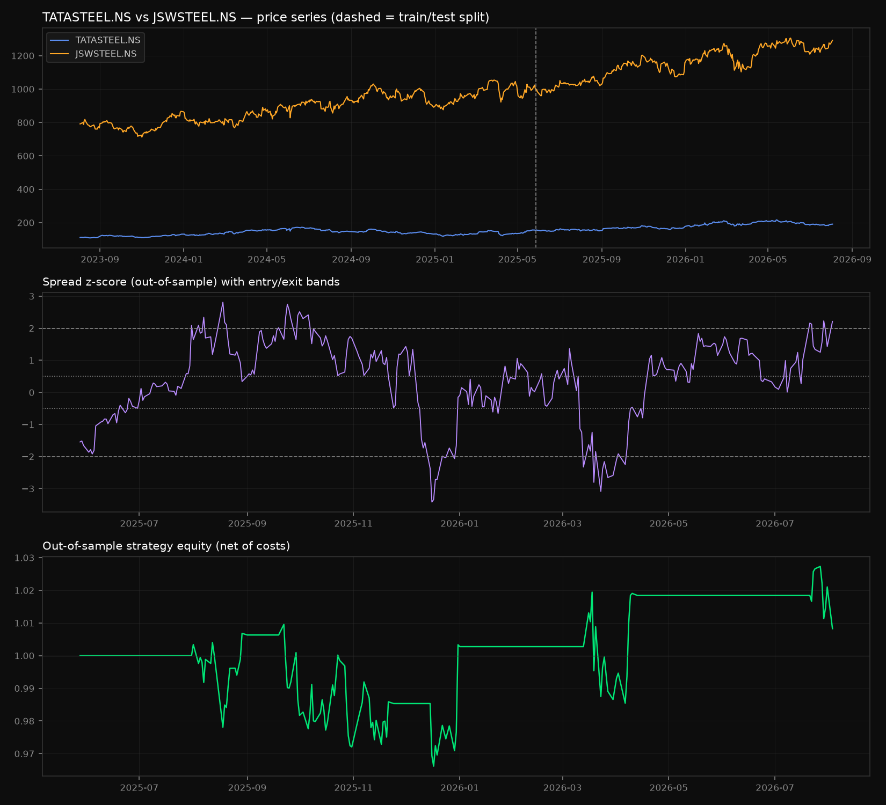

---

### SUNPHARMA.NS / CIPLA.NS

- **Latest prices:** SUNPHARMA.NS ₹1,963.50 · CIPLA.NS ₹1,474.40
- **Hedge ratio (train-fitted):** 0.4874
- **Cointegration (train):** PASS at 5% — ADF -3.42, p=0.0102
- **Persistence:** passed 5% in 23 of 23 real-data runs (strict tier: 5/23)
- **Spread half-life:** 10.3 days
- **Current z-score:** +0.60
- **Signal today:** watch (approaching band)

**Out-of-sample backtest** (beta frozen from train window):

| Metric | Value |
|---|---|
| Sharpe | -0.10 |
| Sortino | -0.11 |
| Annualised return | -1.11% |
| Annualised vol | 7.83% |
| Max drawdown | -10.48% |
| Round-trip trades | 5 |

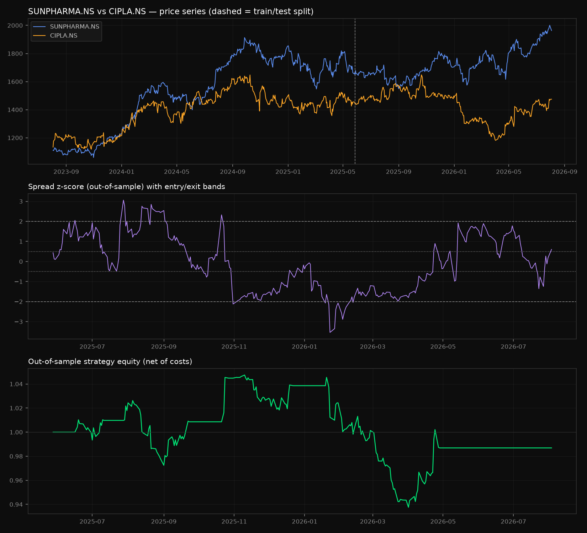

---

_Generated 2026-08-03 · pairs mean-reversion scanner · out-of-sample backtest · multiple-testing-aware · not investment advice._
