# Indian Pairs-Trading Scanner — 2026-08-04

> **What this is:** a market-neutral *pairs mean-reversion* scanner. It flags when two related NSE stocks have drifted apart far enough that their historical relationship signals a possible convergence trade. It does **not** forecast growth, rank "best" stocks, or predict company performance. A signal means the *spread between two stocks* is stretched — nothing about either stock being a good investment. Not investment advice; do your own research.

## Methodology (fixed in advance)

- **Universe:** 16 declared sector-mate pairs. Parameters (3y window, 60/40 train-test, z-entry 2.0, z-exit 0.5, 5 bps costs) are pre-registered; changes are logged in the README changelog *before* looking at results.
- **Multiple testing:** at the 5% level across 16 pairs, **≈0.8 false positives per run are expected by chance alone** even if nothing truly cointegrates. A single-day pass is a candidate, not a discovery.
- **Strict tier:** Bonferroni-corrected threshold p < 0.0031 (marked ✓✓).
- **Evidence = persistence:** the Persistence column counts how often each pair has passed the 5% test across all *real-data* daily runs recorded in `reports/history.csv`. Pairs deserve attention only when they pass persistently.

## Summary

| Pair | p-value | Coint. | Persistence | Current z | Signal | OOS Sharpe |
|---|---|---|---|---|---|---|
| HDFCBANK.NS/ICICIBANK.NS | 0.0787 | ✗ | 0/20 | +2.35 | SHORT spread | -0.60 |
| AXISBANK.NS/ICICIBANK.NS | 0.9292 | ✗ | 0/24 | +1.75 | watch | -0.36 |
| KOTAKBANK.NS/HDFCBANK.NS | 0.1690 | ✗ | 0/24 | -1.35 | watch | 0.69 |
| SBIN.NS/BANKBARODA.NS | 0.1593 | ✗ | 0/24 | -1.48 | watch | 0.34 |
| TCS.NS/INFY.NS | 0.4420 | ✗ | 0/24 | -1.58 | watch | 1.18 |
| INFY.NS/WIPRO.NS | 0.1812 | ✗ | 0/24 | -0.68 | watch | 1.67 |
| HCLTECH.NS/TECHM.NS | 0.1971 | ✗ | 0/24 | +0.61 | watch | -0.05 |
| ACC.NS/AMBUJACEM.NS | 0.8036 | ✗ | 0/24 | -0.14 | flat / no stretch | 0.60 |
| ULTRACEMCO.NS/SHREECEM.NS | 0.1449 | ✗ | 0/24 | +1.02 | watch | 0.50 |
| IOC.NS/BPCL.NS | 0.8283 | ✗ | 0/24 | +2.14 | SHORT spread | 0.39 |
| BPCL.NS/HINDPETRO.NS | 0.3429 | ✗ | 0/24 | -2.65 | LONG spread | -0.32 |
| ONGC.NS/COALINDIA.NS | 0.0226 | ✓ | 16/24 | +0.10 | flat / no stretch | 0.83 |
| NTPC.NS/POWERGRID.NS | 0.0893 | ✗ | 0/24 | +1.01 | watch | 0.38 |
| BAJAJ-AUTO.NS/HEROMOTOCO.NS | 0.1851 | ✗ | 0/24 | +1.11 | watch | -1.12 |
| TATASTEEL.NS/JSWSTEEL.NS | 0.6928 | ✗ | 0/24 | +2.49 | SHORT spread | 0.07 |
| SUNPHARMA.NS/CIPLA.NS | 0.0106 | ✓ | 24/24 | +0.08 | flat / no stretch | -0.10 |

_Legend: ✓✓ passes strict Bonferroni tier · ✓ passes 5% only · ✗ fails. Persistence = 5%-passes / real-data runs recorded. \*no real-data history yet._

---

### HDFCBANK.NS / ICICIBANK.NS

- **Latest prices:** HDFCBANK.NS ₹742.00 · ICICIBANK.NS ₹1,454.60
- **Hedge ratio (train-fitted):** 1.7685
- **Cointegration (train):** FAIL at 5% — ADF -2.67, p=0.0787
- **Persistence:** passed 5% in 0 of 20 real-data runs (strict tier: 0/20)
- **Spread half-life:** 27.9 days
- **Current z-score:** +2.35
- **Signal today:** SHORT spread (short ICICIBANK.NS, long HDFCBANK.NS)
- ⚠️ _Pair did not cointegrate on training data. Any signal here is not statistically justified — observation only._

**Out-of-sample backtest** (beta frozen from train window):

| Metric | Value |
|---|---|
| Sharpe | -0.60 |
| Sortino | -0.59 |
| Annualised return | -3.74% |
| Annualised vol | 6.08% |
| Max drawdown | -8.72% |
| Round-trip trades | 5 |

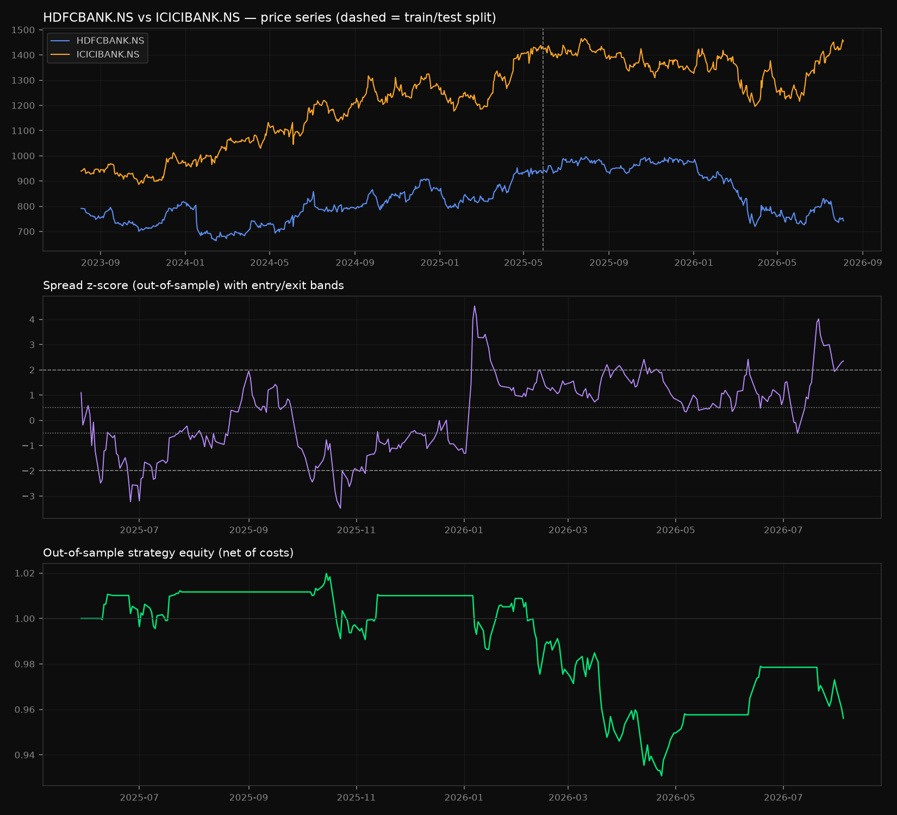

---

### AXISBANK.NS / ICICIBANK.NS

- **Latest prices:** AXISBANK.NS ₹1,261.80 · ICICIBANK.NS ₹1,454.60
- **Hedge ratio (train-fitted):** 0.9338
- **Cointegration (train):** FAIL at 5% — ADF -0.27, p=0.9292
- **Persistence:** passed 5% in 0 of 24 real-data runs (strict tier: 0/24)
- **Spread half-life:** 289.9 days
- **Current z-score:** +1.75
- **Signal today:** watch (approaching band)
- ⚠️ _Pair did not cointegrate on training data. Any signal here is not statistically justified — observation only._

**Out-of-sample backtest** (beta frozen from train window):

| Metric | Value |
|---|---|
| Sharpe | -0.36 |
| Sortino | -0.36 |
| Annualised return | -3.40% |
| Annualised vol | 8.63% |
| Max drawdown | -8.01% |
| Round-trip trades | 6 |

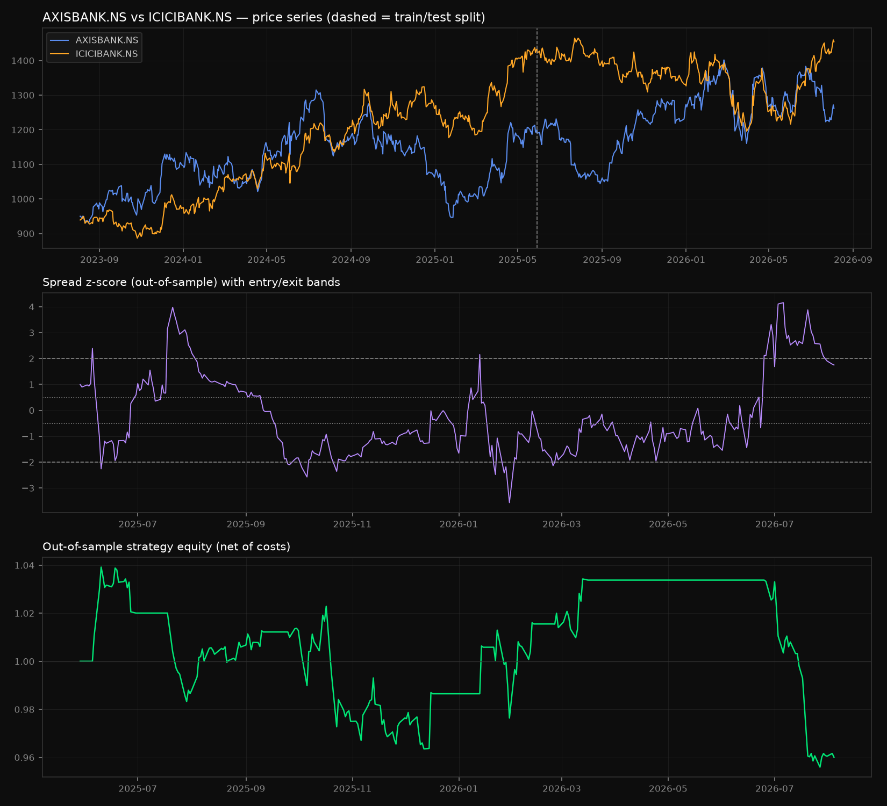

---

### KOTAKBANK.NS / HDFCBANK.NS

- **Latest prices:** KOTAKBANK.NS ₹398.00 · HDFCBANK.NS ₹742.00
- **Hedge ratio (train-fitted):** 1.9297
- **Cointegration (train):** FAIL at 5% — ADF -2.31, p=0.1690
- **Persistence:** passed 5% in 0 of 24 real-data runs (strict tier: 0/24)
- **Spread half-life:** 27.9 days
- **Current z-score:** -1.35
- **Signal today:** watch (approaching band)
- ⚠️ _Pair did not cointegrate on training data. Any signal here is not statistically justified — observation only._

**Out-of-sample backtest** (beta frozen from train window):

| Metric | Value |
|---|---|
| Sharpe | 0.69 |
| Sortino | 0.51 |
| Annualised return | 4.33% |
| Annualised vol | 6.40% |
| Max drawdown | -4.72% |
| Round-trip trades | 5 |

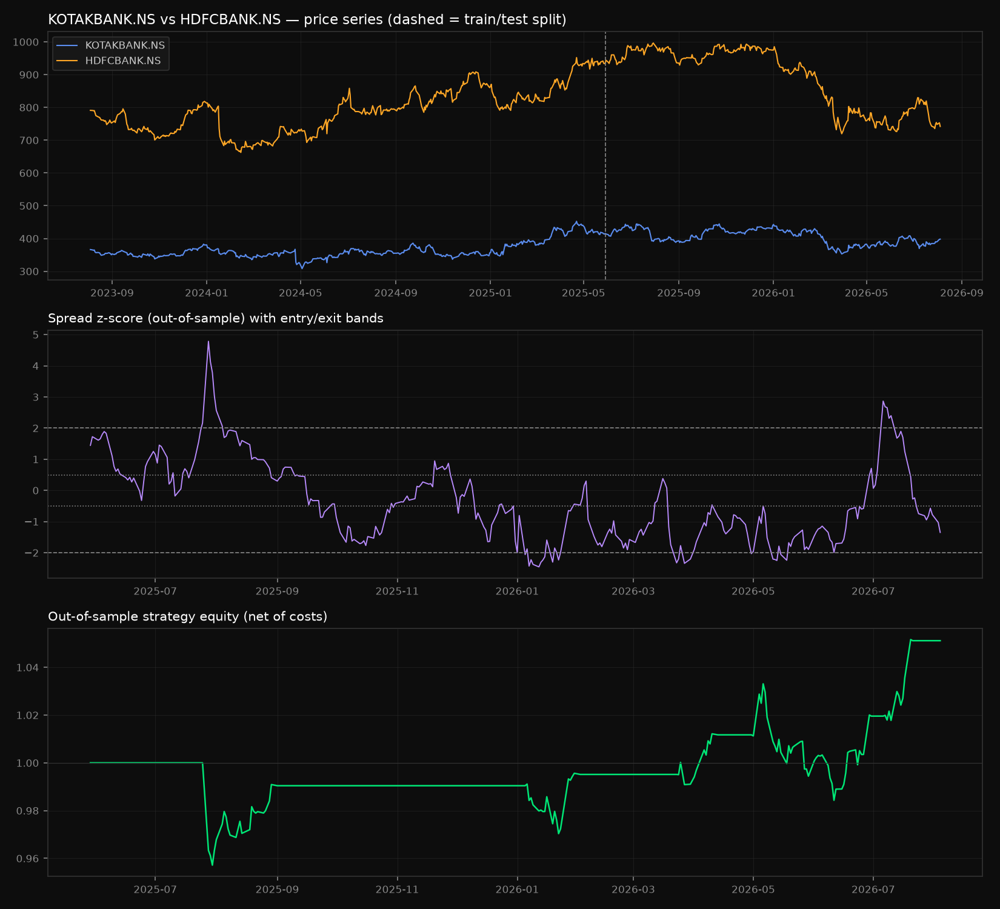

---

### SBIN.NS / BANKBARODA.NS

- **Latest prices:** SBIN.NS ₹1,042.70 · BANKBARODA.NS ₹245.00
- **Hedge ratio (train-fitted):** 0.2042
- **Cointegration (train):** FAIL at 5% — ADF -2.34, p=0.1593
- **Persistence:** passed 5% in 0 of 24 real-data runs (strict tier: 0/24)
- **Spread half-life:** 22.5 days
- **Current z-score:** -1.48
- **Signal today:** watch (approaching band)
- ⚠️ _Pair did not cointegrate on training data. Any signal here is not statistically justified — observation only._

**Out-of-sample backtest** (beta frozen from train window):

| Metric | Value |
|---|---|
| Sharpe | 0.34 |
| Sortino | 0.25 |
| Annualised return | 2.62% |
| Annualised vol | 8.81% |
| Max drawdown | -9.10% |
| Round-trip trades | 5 |

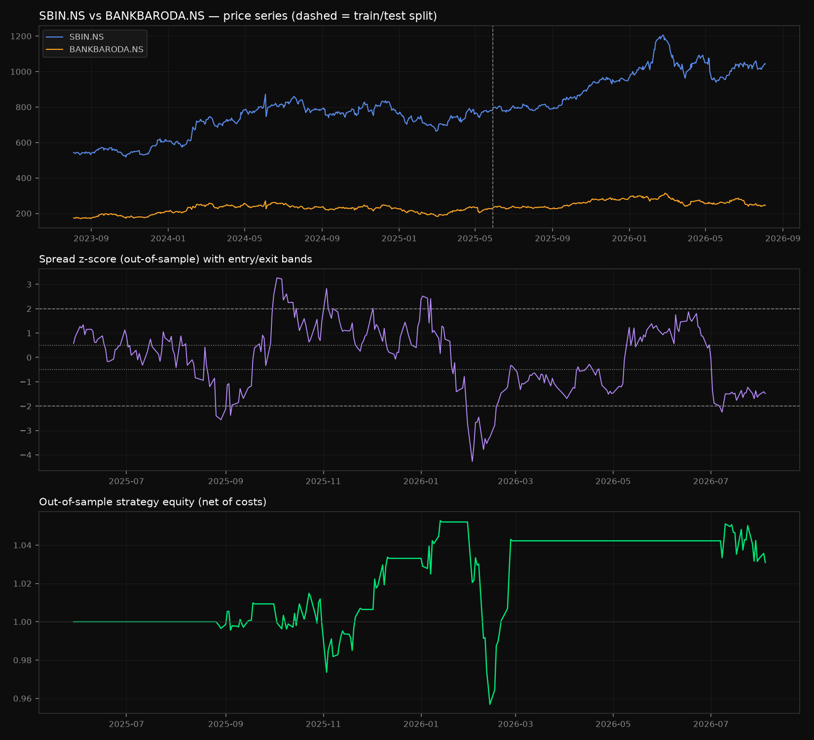

---

### TCS.NS / INFY.NS

- **Latest prices:** TCS.NS ₹2,460.00 · INFY.NS ₹1,167.50
- **Hedge ratio (train-fitted):** 0.5212
- **Cointegration (train):** FAIL at 5% — ADF -1.68, p=0.4420
- **Persistence:** passed 5% in 0 of 24 real-data runs (strict tier: 0/24)
- **Spread half-life:** 44.5 days
- **Current z-score:** -1.58
- **Signal today:** watch (approaching band)
- ⚠️ _Pair did not cointegrate on training data. Any signal here is not statistically justified — observation only._

**Out-of-sample backtest** (beta frozen from train window):

| Metric | Value |
|---|---|
| Sharpe | 1.18 |
| Sortino | 1.17 |
| Annualised return | 5.34% |
| Annualised vol | 4.49% |
| Max drawdown | -4.18% |
| Round-trip trades | 7 |

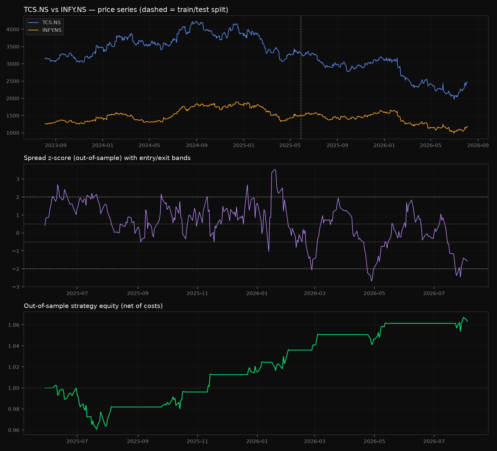

---

### INFY.NS / WIPRO.NS

- **Latest prices:** INFY.NS ₹1,167.50 · WIPRO.NS ₹186.30
- **Hedge ratio (train-fitted):** 0.1371
- **Cointegration (train):** FAIL at 5% — ADF -2.27, p=0.1812
- **Persistence:** passed 5% in 0 of 24 real-data runs (strict tier: 0/24)
- **Spread half-life:** 29.9 days
- **Current z-score:** -0.68
- **Signal today:** watch (approaching band)
- ⚠️ _Pair did not cointegrate on training data. Any signal here is not statistically justified — observation only._

**Out-of-sample backtest** (beta frozen from train window):

| Metric | Value |
|---|---|
| Sharpe | 1.67 |
| Sortino | 1.95 |
| Annualised return | 8.95% |
| Annualised vol | 5.22% |
| Max drawdown | -2.47% |
| Round-trip trades | 6 |

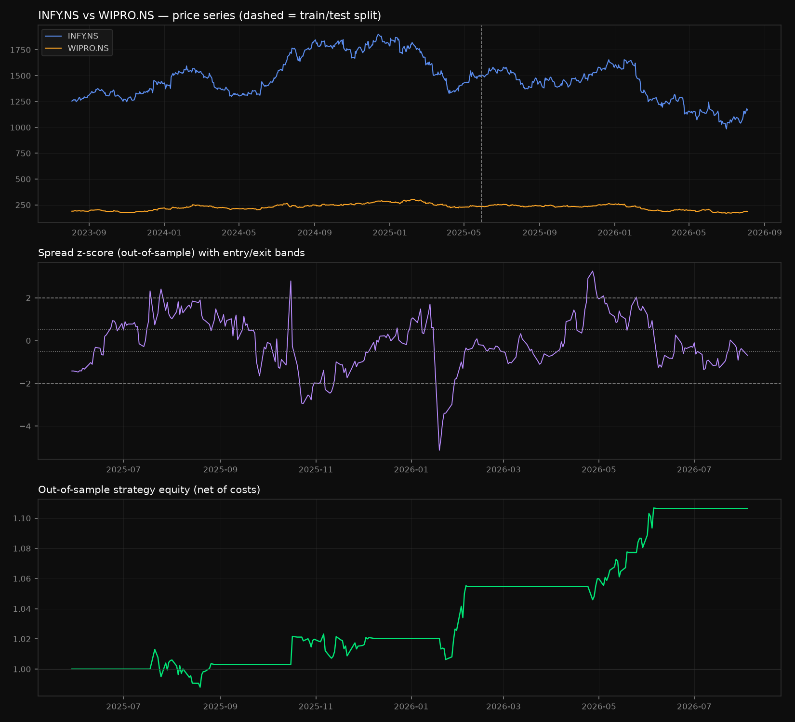

---

### HCLTECH.NS / TECHM.NS

- **Latest prices:** HCLTECH.NS ₹1,369.90 · TECHM.NS ₹1,648.50
- **Hedge ratio (train-fitted):** 0.8245
- **Cointegration (train):** FAIL at 5% — ADF -2.23, p=0.1971
- **Persistence:** passed 5% in 0 of 24 real-data runs (strict tier: 0/24)
- **Spread half-life:** 25.7 days
- **Current z-score:** +0.61
- **Signal today:** watch (approaching band)
- ⚠️ _Pair did not cointegrate on training data. Any signal here is not statistically justified — observation only._

**Out-of-sample backtest** (beta frozen from train window):

| Metric | Value |
|---|---|
| Sharpe | -0.05 |
| Sortino | -0.06 |
| Annualised return | -0.72% |
| Annualised vol | 7.80% |
| Max drawdown | -8.25% |
| Round-trip trades | 5 |

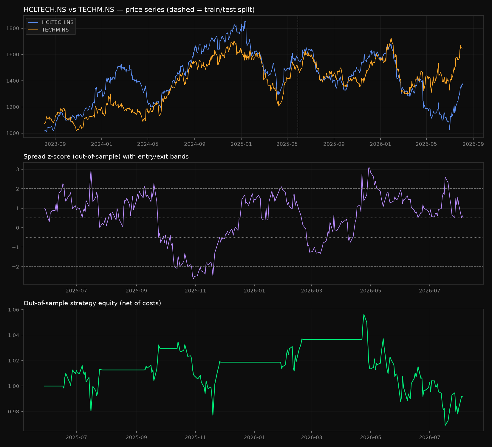

---

### ACC.NS / AMBUJACEM.NS

- **Latest prices:** ACC.NS ₹1,384.70 · AMBUJACEM.NS ₹436.05
- **Hedge ratio (train-fitted):** 0.2301
- **Cointegration (train):** FAIL at 5% — ADF -0.85, p=0.8036
- **Persistence:** passed 5% in 0 of 24 real-data runs (strict tier: 0/24)
- **Spread half-life:** 85.5 days
- **Current z-score:** -0.14
- **Signal today:** flat / no stretch
- ⚠️ _Pair did not cointegrate on training data. Any signal here is not statistically justified — observation only._

**Out-of-sample backtest** (beta frozen from train window):

| Metric | Value |
|---|---|
| Sharpe | 0.60 |
| Sortino | 0.52 |
| Annualised return | 3.39% |
| Annualised vol | 5.84% |
| Max drawdown | -7.38% |
| Round-trip trades | 4 |

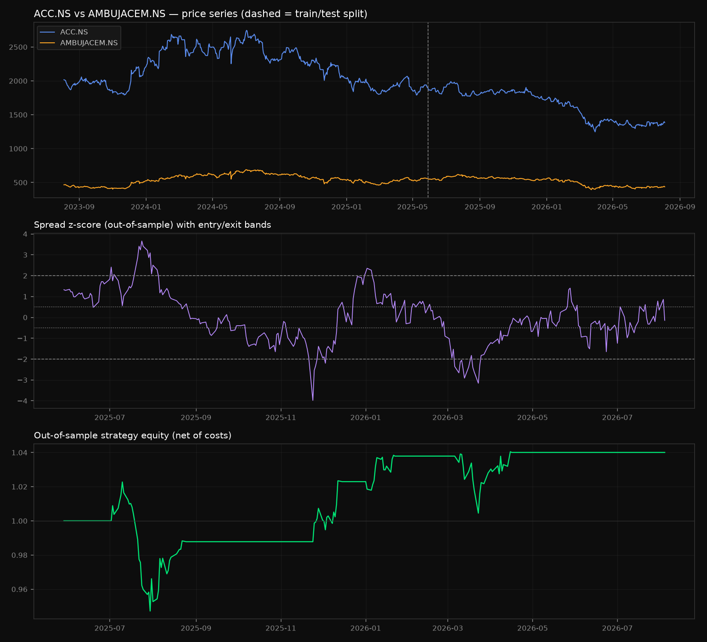

---

### ULTRACEMCO.NS / SHREECEM.NS

- **Latest prices:** ULTRACEMCO.NS ₹12,050.00 · SHREECEM.NS ₹26,900.00
- **Hedge ratio (train-fitted):** 0.6616
- **Cointegration (train):** FAIL at 5% — ADF -2.39, p=0.1449
- **Persistence:** passed 5% in 0 of 24 real-data runs (strict tier: 0/24)
- **Spread half-life:** 35.2 days
- **Current z-score:** +1.02
- **Signal today:** watch (approaching band)
- ⚠️ _Pair did not cointegrate on training data. Any signal here is not statistically justified — observation only._

**Out-of-sample backtest** (beta frozen from train window):

| Metric | Value |
|---|---|
| Sharpe | 0.50 |
| Sortino | 0.54 |
| Annualised return | 3.82% |
| Annualised vol | 8.21% |
| Max drawdown | -9.17% |
| Round-trip trades | 6 |

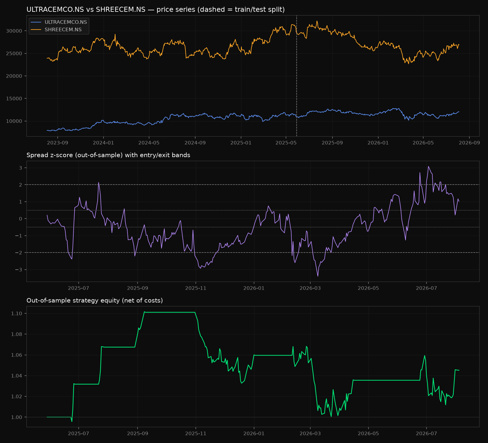

---

### IOC.NS / BPCL.NS

- **Latest prices:** IOC.NS ₹141.60 · BPCL.NS ₹324.00
- **Hedge ratio (train-fitted):** 1.7689
- **Cointegration (train):** FAIL at 5% — ADF -0.77, p=0.8283
- **Persistence:** passed 5% in 0 of 24 real-data runs (strict tier: 0/24)
- **Spread half-life:** 140.4 days
- **Current z-score:** +2.14
- **Signal today:** SHORT spread (short BPCL.NS, long IOC.NS)
- ⚠️ _Pair did not cointegrate on training data. Any signal here is not statistically justified — observation only._

**Out-of-sample backtest** (beta frozen from train window):

| Metric | Value |
|---|---|
| Sharpe | 0.39 |
| Sortino | 0.42 |
| Annualised return | 2.33% |
| Annualised vol | 6.49% |
| Max drawdown | -6.68% |
| Round-trip trades | 7 |

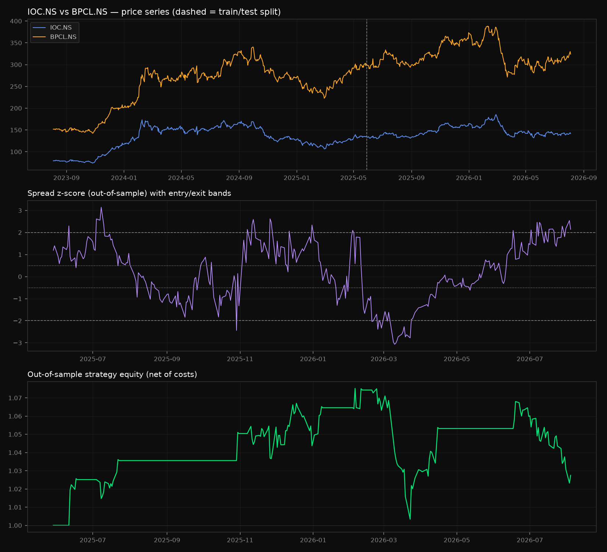

---

### BPCL.NS / HINDPETRO.NS

- **Latest prices:** BPCL.NS ₹324.00 · HINDPETRO.NS ₹391.50
- **Hedge ratio (train-fitted):** 1.4276
- **Cointegration (train):** FAIL at 5% — ADF -1.88, p=0.3429
- **Persistence:** passed 5% in 0 of 24 real-data runs (strict tier: 0/24)
- **Spread half-life:** 41.8 days
- **Current z-score:** -2.65
- **Signal today:** LONG spread (long HINDPETRO.NS, short BPCL.NS)
- ⚠️ _Pair did not cointegrate on training data. Any signal here is not statistically justified — observation only._

**Out-of-sample backtest** (beta frozen from train window):

| Metric | Value |
|---|---|
| Sharpe | -0.32 |
| Sortino | -0.28 |
| Annualised return | -1.99% |
| Annualised vol | 5.80% |
| Max drawdown | -6.82% |
| Round-trip trades | 4 |

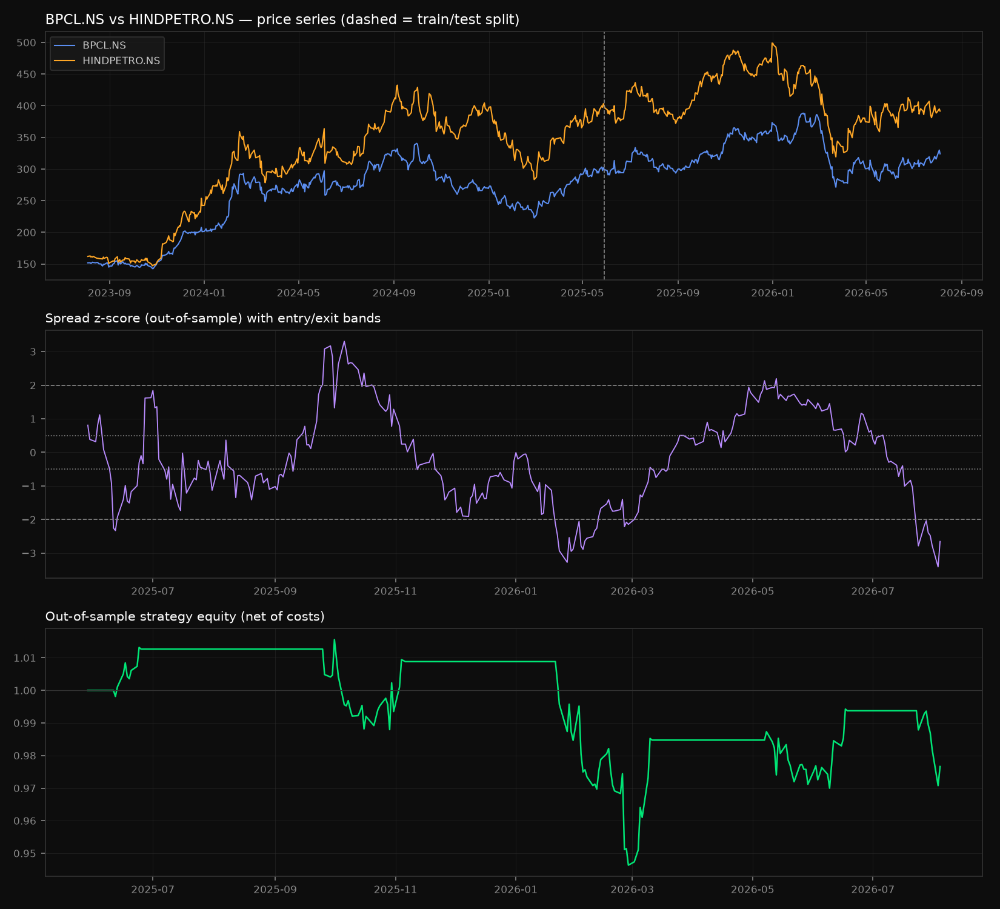

---

### ONGC.NS / COALINDIA.NS

- **Latest prices:** ONGC.NS ₹242.00 · COALINDIA.NS ₹417.60
- **Hedge ratio (train-fitted):** 1.6399
- **Cointegration (train):** PASS at 5% — ADF -3.16, p=0.0226
- **Persistence:** passed 5% in 16 of 24 real-data runs (strict tier: 0/24)
- **Spread half-life:** 14.9 days
- **Current z-score:** +0.10
- **Signal today:** flat / no stretch

**Out-of-sample backtest** (beta frozen from train window):

| Metric | Value |
|---|---|
| Sharpe | 0.83 |
| Sortino | 0.65 |
| Annualised return | 5.95% |
| Annualised vol | 7.29% |
| Max drawdown | -5.65% |
| Round-trip trades | 5 |

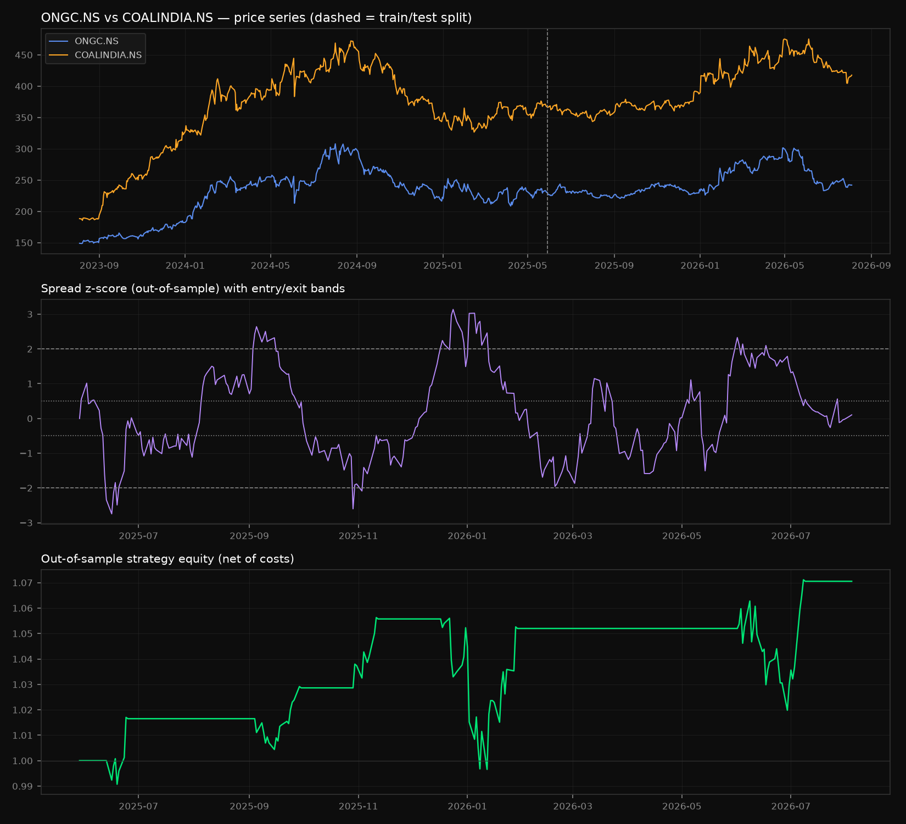

---

### NTPC.NS / POWERGRID.NS

- **Latest prices:** NTPC.NS ₹343.65 · POWERGRID.NS ₹283.40
- **Hedge ratio (train-fitted):** 0.8358
- **Cointegration (train):** FAIL at 5% — ADF -2.62, p=0.0893
- **Persistence:** passed 5% in 0 of 24 real-data runs (strict tier: 0/24)
- **Spread half-life:** 22.5 days
- **Current z-score:** +1.01
- **Signal today:** watch (approaching band)
- ⚠️ _Pair did not cointegrate on training data. Any signal here is not statistically justified — observation only._

**Out-of-sample backtest** (beta frozen from train window):

| Metric | Value |
|---|---|
| Sharpe | 0.38 |
| Sortino | 0.29 |
| Annualised return | 1.96% |
| Annualised vol | 5.52% |
| Max drawdown | -5.26% |
| Round-trip trades | 6 |

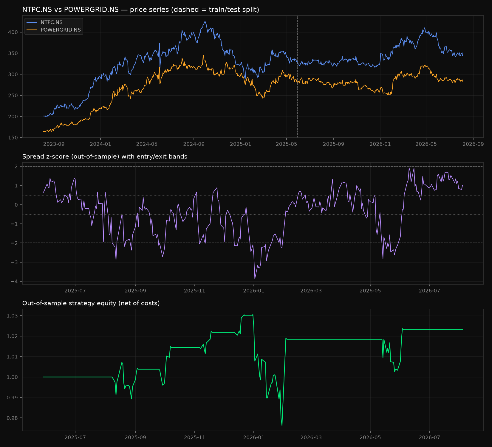

---

### BAJAJ-AUTO.NS / HEROMOTOCO.NS

- **Latest prices:** BAJAJ-AUTO.NS ₹11,600.00 · HEROMOTOCO.NS ₹5,548.00
- **Hedge ratio (train-fitted):** 0.4072
- **Cointegration (train):** FAIL at 5% — ADF -2.26, p=0.1851
- **Persistence:** passed 5% in 0 of 24 real-data runs (strict tier: 0/24)
- **Spread half-life:** 30.0 days
- **Current z-score:** +1.11
- **Signal today:** watch (approaching band)
- ⚠️ _Pair did not cointegrate on training data. Any signal here is not statistically justified — observation only._

**Out-of-sample backtest** (beta frozen from train window):

| Metric | Value |
|---|---|
| Sharpe | -1.12 |
| Sortino | -1.10 |
| Annualised return | -10.93% |
| Annualised vol | 9.91% |
| Max drawdown | -20.49% |
| Round-trip trades | 4 |

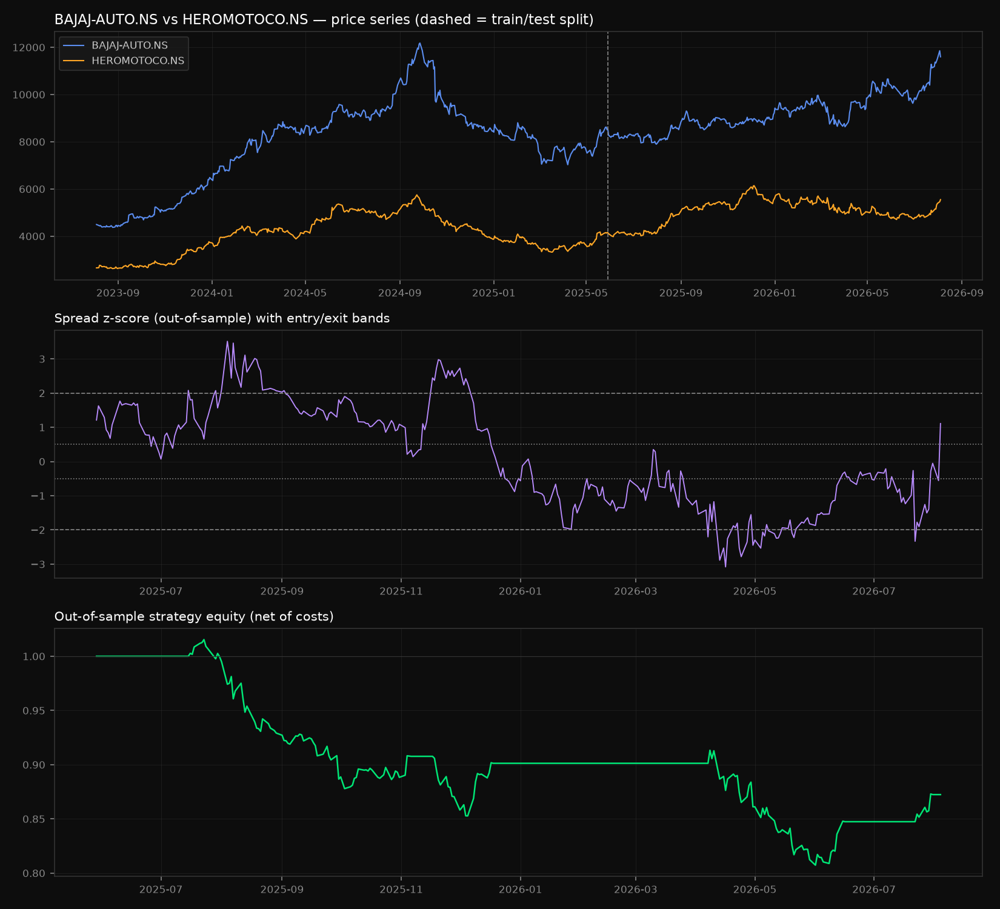

---

### TATASTEEL.NS / JSWSTEEL.NS

- **Latest prices:** TATASTEEL.NS ₹190.95 · JSWSTEEL.NS ₹1,300.00
- **Hedge ratio (train-fitted):** 3.0512
- **Cointegration (train):** FAIL at 5% — ADF -1.15, p=0.6928
- **Persistence:** passed 5% in 0 of 24 real-data runs (strict tier: 0/24)
- **Spread half-life:** 70.0 days
- **Current z-score:** +2.49
- **Signal today:** SHORT spread (short JSWSTEEL.NS, long TATASTEEL.NS)
- ⚠️ _Pair did not cointegrate on training data. Any signal here is not statistically justified — observation only._

**Out-of-sample backtest** (beta frozen from train window):

| Metric | Value |
|---|---|
| Sharpe | 0.07 |
| Sortino | 0.06 |
| Annualised return | 0.23% |
| Annualised vol | 7.42% |
| Max drawdown | -4.26% |
| Round-trip trades | 4 |

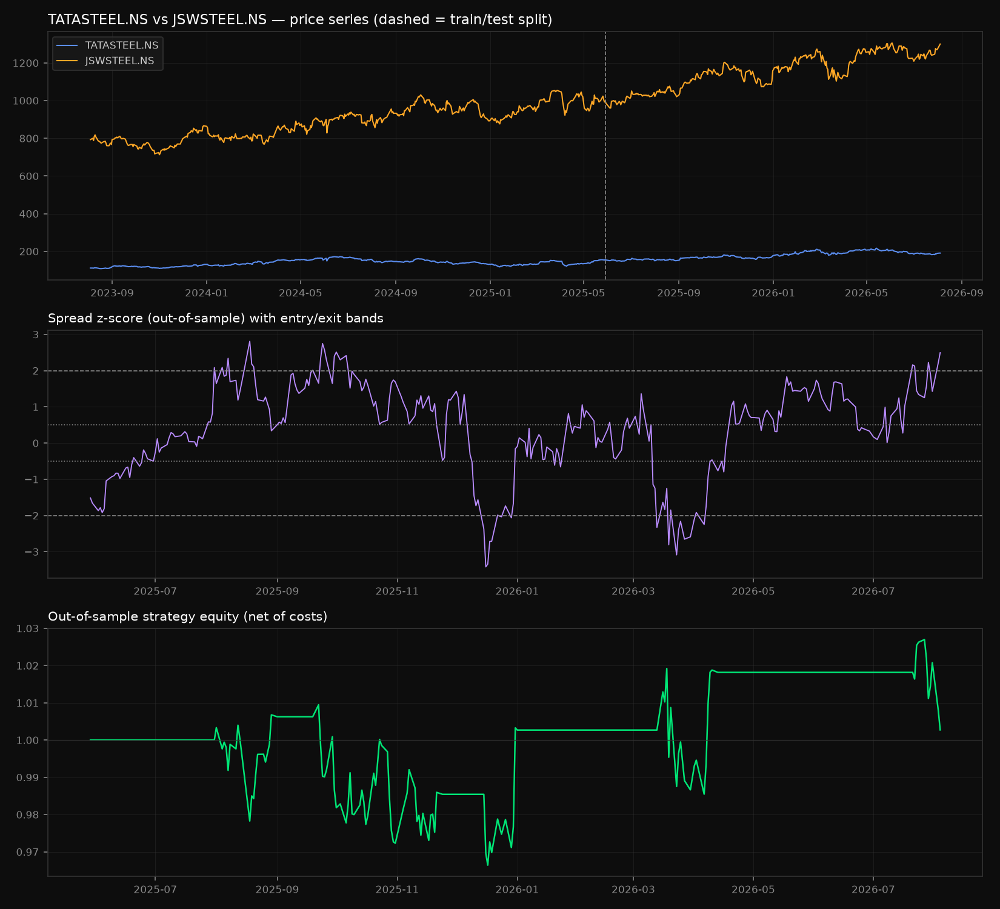

---

### SUNPHARMA.NS / CIPLA.NS

- **Latest prices:** SUNPHARMA.NS ₹1,964.00 · CIPLA.NS ₹1,460.00
- **Hedge ratio (train-fitted):** 0.4865
- **Cointegration (train):** PASS at 5% — ADF -3.41, p=0.0106
- **Persistence:** passed 5% in 24 of 24 real-data runs (strict tier: 5/24)
- **Spread half-life:** 10.6 days
- **Current z-score:** +0.08
- **Signal today:** flat / no stretch

**Out-of-sample backtest** (beta frozen from train window):

| Metric | Value |
|---|---|
| Sharpe | -0.10 |
| Sortino | -0.11 |
| Annualised return | -1.09% |
| Annualised vol | 7.75% |
| Max drawdown | -10.38% |
| Round-trip trades | 5 |

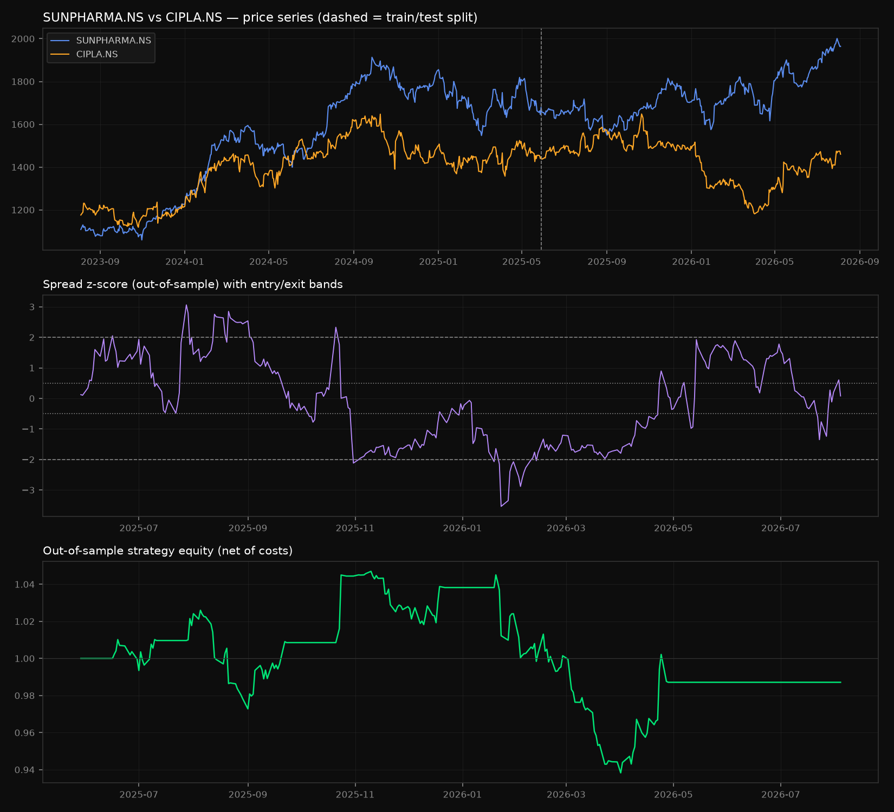

---

_Generated 2026-08-04 · pairs mean-reversion scanner · out-of-sample backtest · multiple-testing-aware · not investment advice._
