# Indian Pairs-Trading Scanner — 2026-08-06

> **What this is:** a market-neutral *pairs mean-reversion* scanner. It flags when two related NSE stocks have drifted apart far enough that their historical relationship signals a possible convergence trade. It does **not** forecast growth, rank "best" stocks, or predict company performance. A signal means the *spread between two stocks* is stretched — nothing about either stock being a good investment. Not investment advice; do your own research.

## Methodology (fixed in advance)

- **Universe:** 16 declared sector-mate pairs. Parameters (3y window, 60/40 train-test, z-entry 2.0, z-exit 0.5, 5 bps costs) are pre-registered; changes are logged in the README changelog *before* looking at results.
- **Multiple testing:** at the 5% level across 16 pairs, **≈0.8 false positives per run are expected by chance alone** even if nothing truly cointegrates. A single-day pass is a candidate, not a discovery.
- **Strict tier:** Bonferroni-corrected threshold p < 0.0031 (marked ✓✓).
- **Evidence = persistence:** the Persistence column counts how often each pair has passed the 5% test across all *real-data* daily runs recorded in `reports/history.csv`. Pairs deserve attention only when they pass persistently.

> ⚠️ **Some results use SIMULATED fallback data** (real data was unreachable this run) and are not real market results. These are marked below and are EXCLUDED from persistence counts.

## Summary

| Pair | p-value | Coint. | Persistence | Current z | Signal | OOS Sharpe |
|---|---|---|---|---|---|---|
| HDFCBANK.NS/ICICIBANK.NS *(sim)* | 0.0030 | ✓✓ | 0/21 | -1.55 | watch | 1.13 |
| AXISBANK.NS/ICICIBANK.NS | 0.9253 | ✗ | 0/26 | +1.69 | watch | -0.39 |
| KOTAKBANK.NS/HDFCBANK.NS | 0.1665 | ✗ | 0/26 | -1.26 | watch | 0.69 |
| SBIN.NS/BANKBARODA.NS | 0.1721 | ✗ | 0/26 | -1.53 | watch | 0.27 |
| TCS.NS/INFY.NS | 0.4641 | ✗ | 0/26 | -0.63 | watch | 1.40 |
| INFY.NS/WIPRO.NS | 0.1816 | ✗ | 0/26 | -0.61 | watch | 1.67 |
| HCLTECH.NS/TECHM.NS | 0.1794 | ✗ | 0/26 | +0.89 | watch | -0.03 |
| ACC.NS/AMBUJACEM.NS | 0.8040 | ✗ | 0/26 | +0.28 | flat / no stretch | 0.60 |
| ULTRACEMCO.NS/SHREECEM.NS | 0.1433 | ✗ | 0/26 | +0.19 | flat / no stretch | 0.50 |
| IOC.NS/BPCL.NS | 0.8114 | ✗ | 0/26 | +1.71 | watch | 0.44 |
| BPCL.NS/HINDPETRO.NS | 0.3447 | ✗ | 0/26 | -2.00 | watch | -0.25 |
| ONGC.NS/COALINDIA.NS | 0.0190 | ✓ | 18/26 | +0.23 | flat / no stretch | 0.75 |
| NTPC.NS/POWERGRID.NS | 0.0927 | ✗ | 0/26 | -0.44 | flat / no stretch | 0.38 |
| BAJAJ-AUTO.NS/HEROMOTOCO.NS | 0.1870 | ✗ | 0/26 | +1.03 | watch | -1.12 |
| TATASTEEL.NS/JSWSTEEL.NS | 0.6864 | ✗ | 0/26 | +2.68 | SHORT spread | -0.03 |
| SUNPHARMA.NS/CIPLA.NS | 0.0108 | ✓ | 26/26 | +0.94 | watch | -0.10 |

_Legend: ✓✓ passes strict Bonferroni tier · ✓ passes 5% only · ✗ fails. Persistence = 5%-passes / real-data runs recorded. \*no real-data history yet._

---

### HDFCBANK.NS / ICICIBANK.NS · _SIMULATED_

- **Latest prices:** HDFCBANK.NS ₹77.27 · ICICIBANK.NS ₹113.78
- **Hedge ratio (train-fitted):** 1.5557
- **Cointegration (train):** PASS at 5% — ADF -3.79, p=0.0030 · **passes strict Bonferroni tier**
- **Persistence:** passed 5% in 0 of 21 real-data runs (strict tier: 0/21)
- **Spread half-life:** 14.0 days
- **Current z-score:** -1.55
- **Signal today:** watch (approaching band)

**Out-of-sample backtest** (beta frozen from train window):

| Metric | Value |
|---|---|
| Sharpe | 1.13 |
| Sortino | 0.86 |
| Annualised return | 1.88% |
| Annualised vol | 1.66% |
| Max drawdown | -1.19% |
| Round-trip trades | 5 |

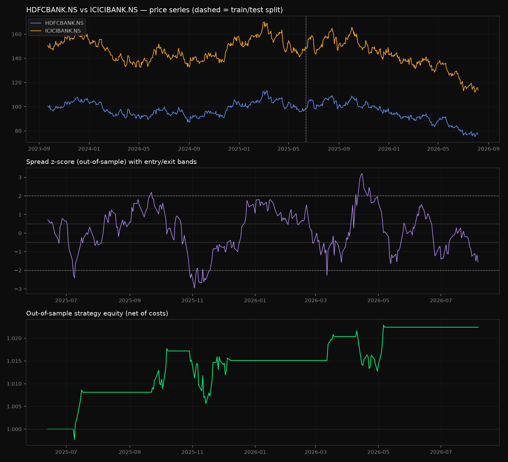

---

### AXISBANK.NS / ICICIBANK.NS

- **Latest prices:** AXISBANK.NS ₹1,256.00 · ICICIBANK.NS ₹1,457.50
- **Hedge ratio (train-fitted):** 0.9376
- **Cointegration (train):** FAIL at 5% — ADF -0.30, p=0.9253
- **Persistence:** passed 5% in 0 of 26 real-data runs (strict tier: 0/26)
- **Spread half-life:** 279.0 days
- **Current z-score:** +1.69
- **Signal today:** watch (approaching band)
- ⚠️ _Pair did not cointegrate on training data. Any signal here is not statistically justified — observation only._

**Out-of-sample backtest** (beta frozen from train window):

| Metric | Value |
|---|---|
| Sharpe | -0.39 |
| Sortino | -0.39 |
| Annualised return | -3.67% |
| Annualised vol | 8.69% |
| Max drawdown | -8.07% |
| Round-trip trades | 6 |

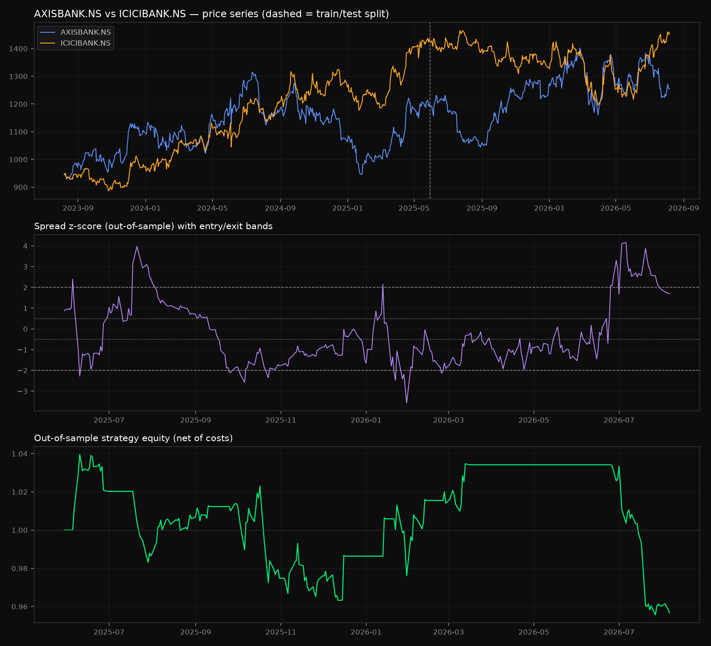

---

### KOTAKBANK.NS / HDFCBANK.NS

- **Latest prices:** KOTAKBANK.NS ₹394.00 · HDFCBANK.NS ₹734.30
- **Hedge ratio (train-fitted):** 1.9379
- **Cointegration (train):** FAIL at 5% — ADF -2.32, p=0.1665
- **Persistence:** passed 5% in 0 of 26 real-data runs (strict tier: 0/26)
- **Spread half-life:** 27.8 days
- **Current z-score:** -1.26
- **Signal today:** watch (approaching band)
- ⚠️ _Pair did not cointegrate on training data. Any signal here is not statistically justified — observation only._

**Out-of-sample backtest** (beta frozen from train window):

| Metric | Value |
|---|---|
| Sharpe | 0.69 |
| Sortino | 0.50 |
| Annualised return | 4.27% |
| Annualised vol | 6.37% |
| Max drawdown | -4.70% |
| Round-trip trades | 5 |

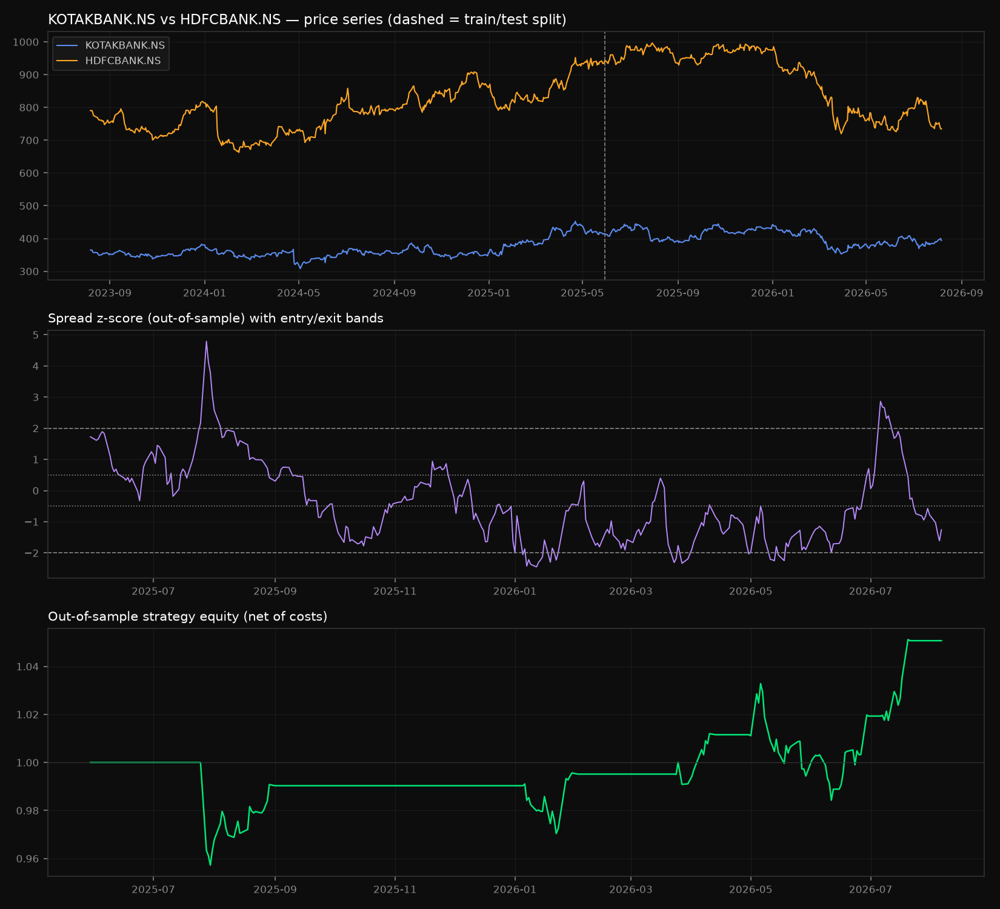

---

### SBIN.NS / BANKBARODA.NS

- **Latest prices:** SBIN.NS ₹1,085.00 · BANKBARODA.NS ₹251.00
- **Hedge ratio (train-fitted):** 0.2036
- **Cointegration (train):** FAIL at 5% — ADF -2.30, p=0.1721
- **Persistence:** passed 5% in 0 of 26 real-data runs (strict tier: 0/26)
- **Spread half-life:** 22.3 days
- **Current z-score:** -1.53
- **Signal today:** watch (approaching band)
- ⚠️ _Pair did not cointegrate on training data. Any signal here is not statistically justified — observation only._

**Out-of-sample backtest** (beta frozen from train window):

| Metric | Value |
|---|---|
| Sharpe | 0.27 |
| Sortino | 0.20 |
| Annualised return | 2.00% |
| Annualised vol | 8.62% |
| Max drawdown | -8.90% |
| Round-trip trades | 5 |

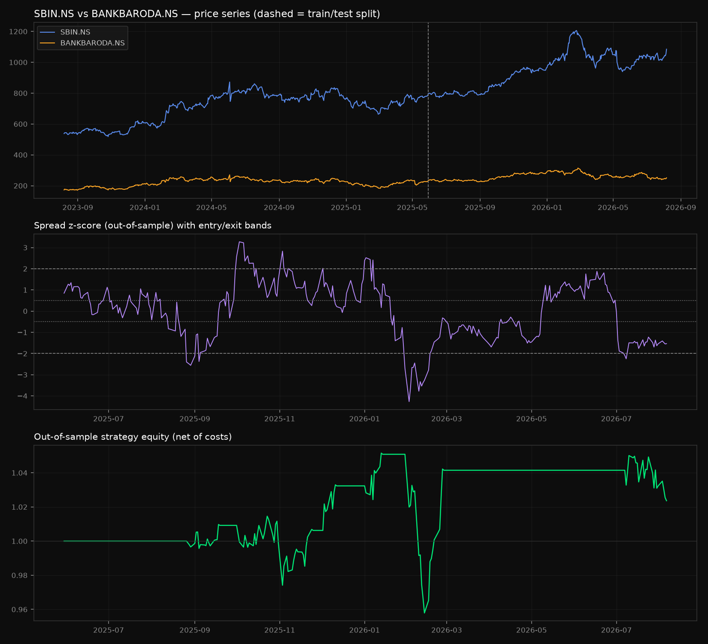

---

### TCS.NS / INFY.NS

- **Latest prices:** TCS.NS ₹2,373.00 · INFY.NS ₹1,165.00
- **Hedge ratio (train-fitted):** 0.5201
- **Cointegration (train):** FAIL at 5% — ADF -1.64, p=0.4641
- **Persistence:** passed 5% in 0 of 26 real-data runs (strict tier: 0/26)
- **Spread half-life:** 45.3 days
- **Current z-score:** -0.63
- **Signal today:** watch (approaching band)
- ⚠️ _Pair did not cointegrate on training data. Any signal here is not statistically justified — observation only._

**Out-of-sample backtest** (beta frozen from train window):

| Metric | Value |
|---|---|
| Sharpe | 1.40 |
| Sortino | 1.42 |
| Annualised return | 6.56% |
| Annualised vol | 4.60% |
| Max drawdown | -4.20% |
| Round-trip trades | 7 |

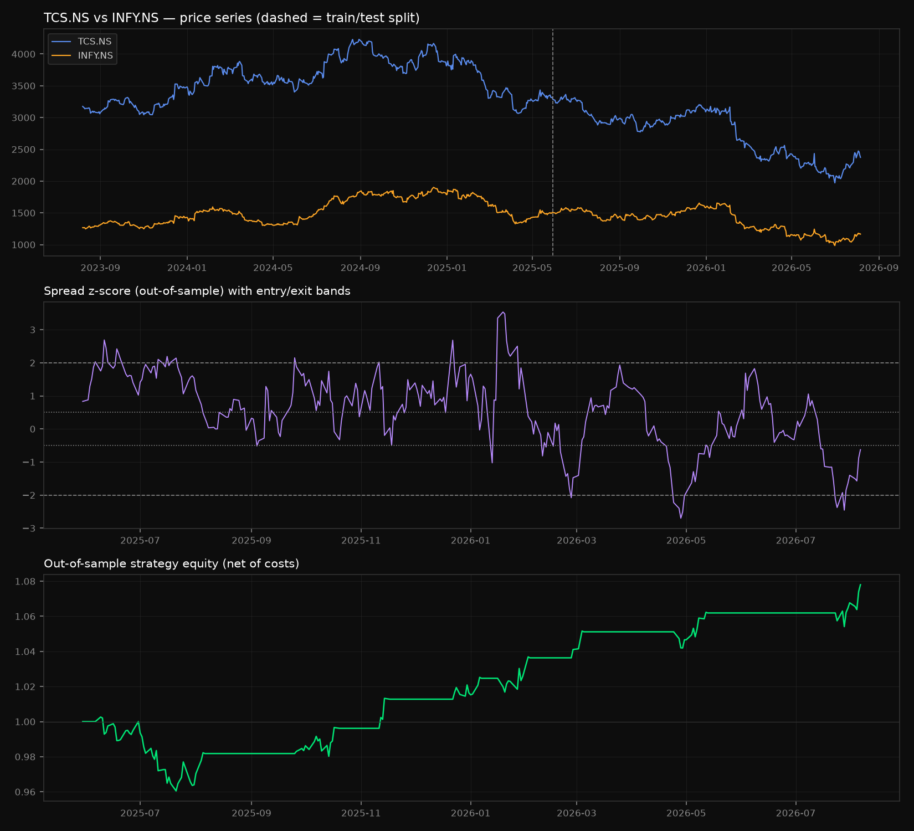

---

### INFY.NS / WIPRO.NS

- **Latest prices:** INFY.NS ₹1,165.00 · WIPRO.NS ₹186.12
- **Hedge ratio (train-fitted):** 0.1370
- **Cointegration (train):** FAIL at 5% — ADF -2.27, p=0.1816
- **Persistence:** passed 5% in 0 of 26 real-data runs (strict tier: 0/26)
- **Spread half-life:** 29.9 days
- **Current z-score:** -0.61
- **Signal today:** watch (approaching band)
- ⚠️ _Pair did not cointegrate on training data. Any signal here is not statistically justified — observation only._

**Out-of-sample backtest** (beta frozen from train window):

| Metric | Value |
|---|---|
| Sharpe | 1.67 |
| Sortino | 1.94 |
| Annualised return | 8.93% |
| Annualised vol | 5.22% |
| Max drawdown | -2.47% |
| Round-trip trades | 6 |

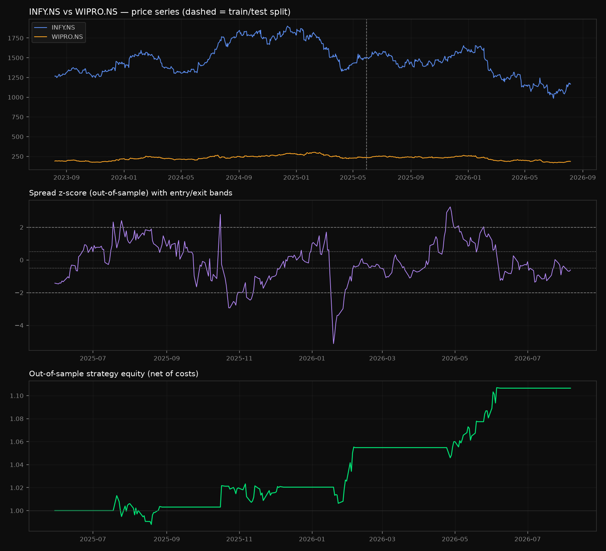

---

### HCLTECH.NS / TECHM.NS

- **Latest prices:** HCLTECH.NS ₹1,335.00 · TECHM.NS ₹1,632.20
- **Hedge ratio (train-fitted):** 0.8266
- **Cointegration (train):** FAIL at 5% — ADF -2.28, p=0.1794
- **Persistence:** passed 5% in 0 of 26 real-data runs (strict tier: 0/26)
- **Spread half-life:** 25.7 days
- **Current z-score:** +0.89
- **Signal today:** watch (approaching band)
- ⚠️ _Pair did not cointegrate on training data. Any signal here is not statistically justified — observation only._

**Out-of-sample backtest** (beta frozen from train window):

| Metric | Value |
|---|---|
| Sharpe | -0.03 |
| Sortino | -0.03 |
| Annualised return | -0.56% |
| Annualised vol | 7.91% |
| Max drawdown | -8.37% |
| Round-trip trades | 5 |

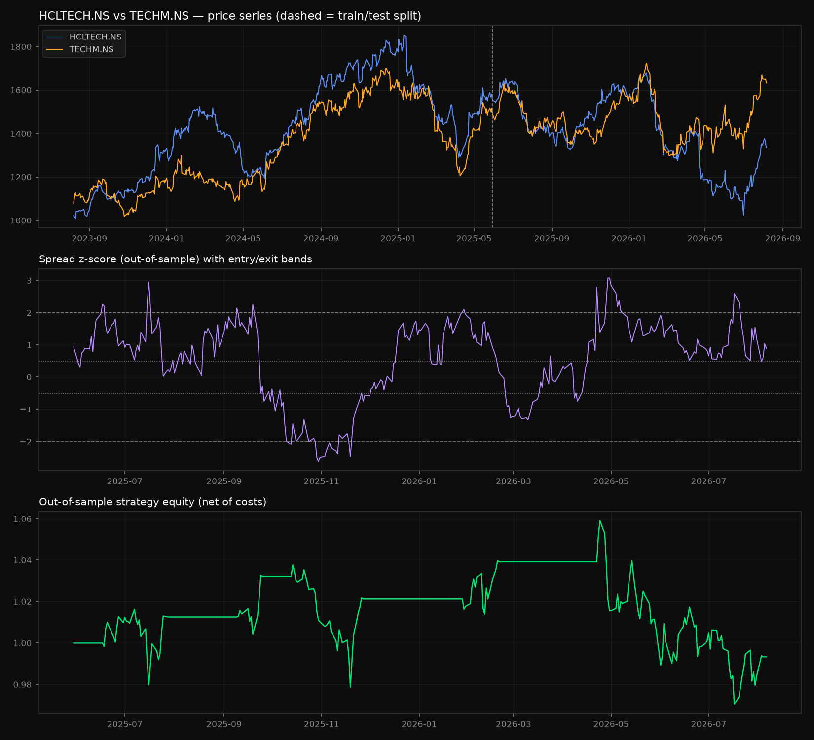

---

### ACC.NS / AMBUJACEM.NS

- **Latest prices:** ACC.NS ₹1,378.40 · AMBUJACEM.NS ₹436.50
- **Hedge ratio (train-fitted):** 0.2291
- **Cointegration (train):** FAIL at 5% — ADF -0.85, p=0.8040
- **Persistence:** passed 5% in 0 of 26 real-data runs (strict tier: 0/26)
- **Spread half-life:** 88.7 days
- **Current z-score:** +0.28
- **Signal today:** flat / no stretch
- ⚠️ _Pair did not cointegrate on training data. Any signal here is not statistically justified — observation only._

**Out-of-sample backtest** (beta frozen from train window):

| Metric | Value |
|---|---|
| Sharpe | 0.60 |
| Sortino | 0.52 |
| Annualised return | 3.43% |
| Annualised vol | 5.94% |
| Max drawdown | -7.50% |
| Round-trip trades | 4 |

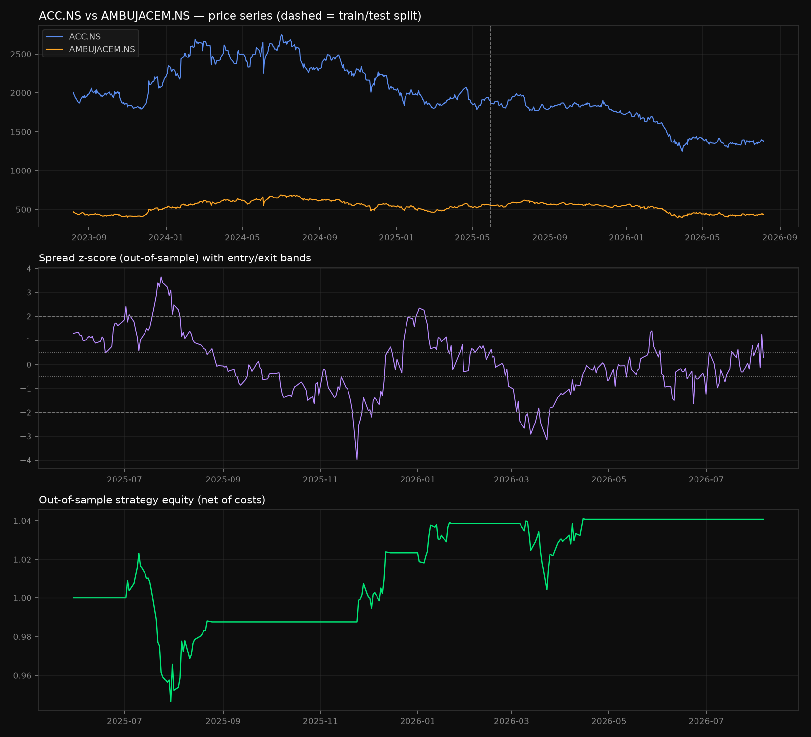

---

### ULTRACEMCO.NS / SHREECEM.NS

- **Latest prices:** ULTRACEMCO.NS ₹12,075.00 · SHREECEM.NS ₹26,245.00
- **Hedge ratio (train-fitted):** 0.6619
- **Cointegration (train):** FAIL at 5% — ADF -2.39, p=0.1433
- **Persistence:** passed 5% in 0 of 26 real-data runs (strict tier: 0/26)
- **Spread half-life:** 35.4 days
- **Current z-score:** +0.19
- **Signal today:** flat / no stretch
- ⚠️ _Pair did not cointegrate on training data. Any signal here is not statistically justified — observation only._

**Out-of-sample backtest** (beta frozen from train window):

| Metric | Value |
|---|---|
| Sharpe | 0.50 |
| Sortino | 0.54 |
| Annualised return | 3.84% |
| Annualised vol | 8.28% |
| Max drawdown | -9.26% |
| Round-trip trades | 6 |

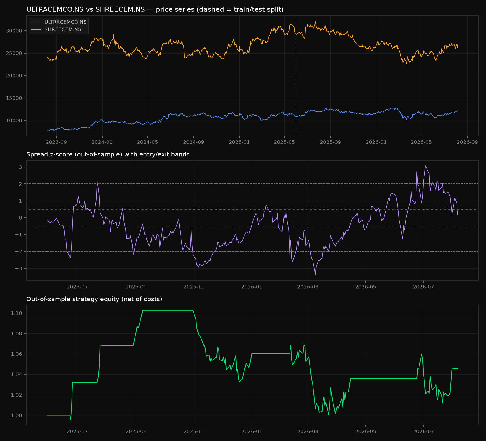

---

### IOC.NS / BPCL.NS

- **Latest prices:** IOC.NS ₹142.66 · BPCL.NS ₹323.70
- **Hedge ratio (train-fitted):** 1.7682
- **Cointegration (train):** FAIL at 5% — ADF -0.83, p=0.8114
- **Persistence:** passed 5% in 0 of 26 real-data runs (strict tier: 0/26)
- **Spread half-life:** 131.2 days
- **Current z-score:** +1.71
- **Signal today:** watch (approaching band)
- ⚠️ _Pair did not cointegrate on training data. Any signal here is not statistically justified — observation only._

**Out-of-sample backtest** (beta frozen from train window):

| Metric | Value |
|---|---|
| Sharpe | 0.44 |
| Sortino | 0.47 |
| Annualised return | 2.68% |
| Annualised vol | 6.53% |
| Max drawdown | -6.73% |
| Round-trip trades | 7 |

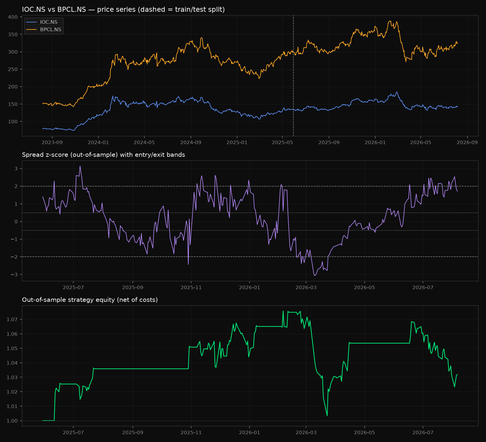

---

### BPCL.NS / HINDPETRO.NS

- **Latest prices:** BPCL.NS ₹323.70 · HINDPETRO.NS ₹395.00
- **Hedge ratio (train-fitted):** 1.4279
- **Cointegration (train):** FAIL at 5% — ADF -1.87, p=0.3447
- **Persistence:** passed 5% in 0 of 26 real-data runs (strict tier: 0/26)
- **Spread half-life:** 41.9 days
- **Current z-score:** -2.00
- **Signal today:** watch (approaching band)
- ⚠️ _Pair did not cointegrate on training data. Any signal here is not statistically justified — observation only._

**Out-of-sample backtest** (beta frozen from train window):

| Metric | Value |
|---|---|
| Sharpe | -0.25 |
| Sortino | -0.22 |
| Annualised return | -1.59% |
| Annualised vol | 5.83% |
| Max drawdown | -6.85% |
| Round-trip trades | 4 |

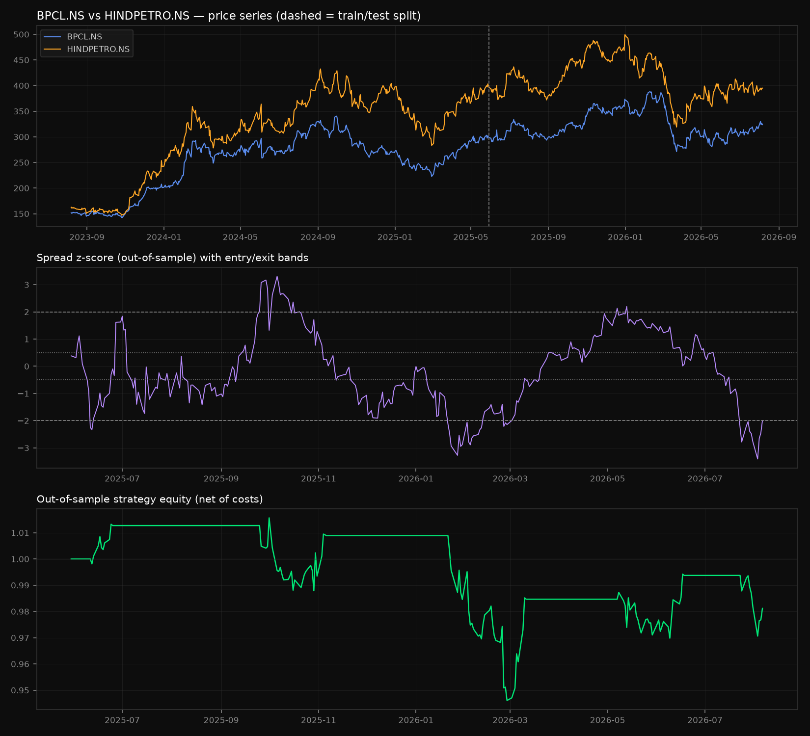

---

### ONGC.NS / COALINDIA.NS

- **Latest prices:** ONGC.NS ₹237.80 · COALINDIA.NS ₹415.60
- **Hedge ratio (train-fitted):** 1.6353
- **Cointegration (train):** PASS at 5% — ADF -3.22, p=0.0190
- **Persistence:** passed 5% in 18 of 26 real-data runs (strict tier: 0/26)
- **Spread half-life:** 14.8 days
- **Current z-score:** +0.23
- **Signal today:** flat / no stretch

**Out-of-sample backtest** (beta frozen from train window):

| Metric | Value |
|---|---|
| Sharpe | 0.75 |
| Sortino | 0.60 |
| Annualised return | 5.39% |
| Annualised vol | 7.37% |
| Max drawdown | -5.71% |
| Round-trip trades | 5 |

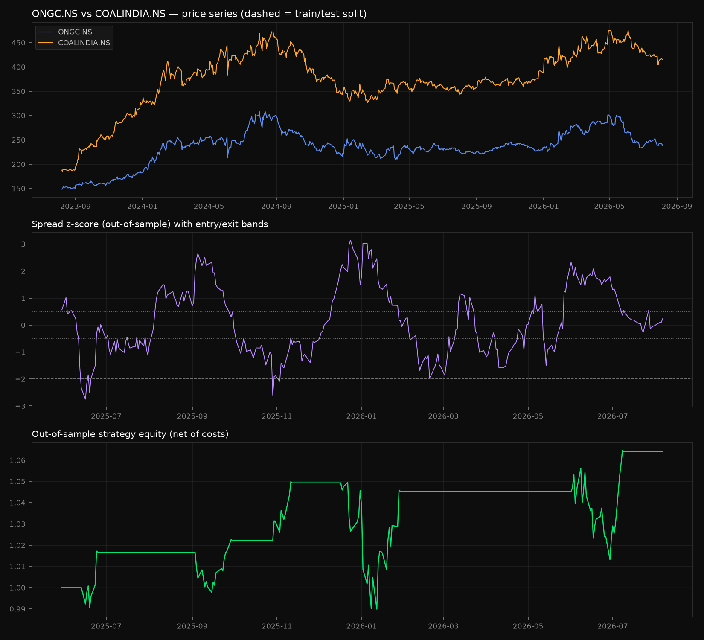

---

### NTPC.NS / POWERGRID.NS

- **Latest prices:** NTPC.NS ₹345.00 · POWERGRID.NS ₹270.75
- **Hedge ratio (train-fitted):** 0.8357
- **Cointegration (train):** FAIL at 5% — ADF -2.60, p=0.0927
- **Persistence:** passed 5% in 0 of 26 real-data runs (strict tier: 0/26)
- **Spread half-life:** 22.6 days
- **Current z-score:** -0.44
- **Signal today:** flat / no stretch
- ⚠️ _Pair did not cointegrate on training data. Any signal here is not statistically justified — observation only._

**Out-of-sample backtest** (beta frozen from train window):

| Metric | Value |
|---|---|
| Sharpe | 0.38 |
| Sortino | 0.29 |
| Annualised return | 1.98% |
| Annualised vol | 5.59% |
| Max drawdown | -5.33% |
| Round-trip trades | 6 |

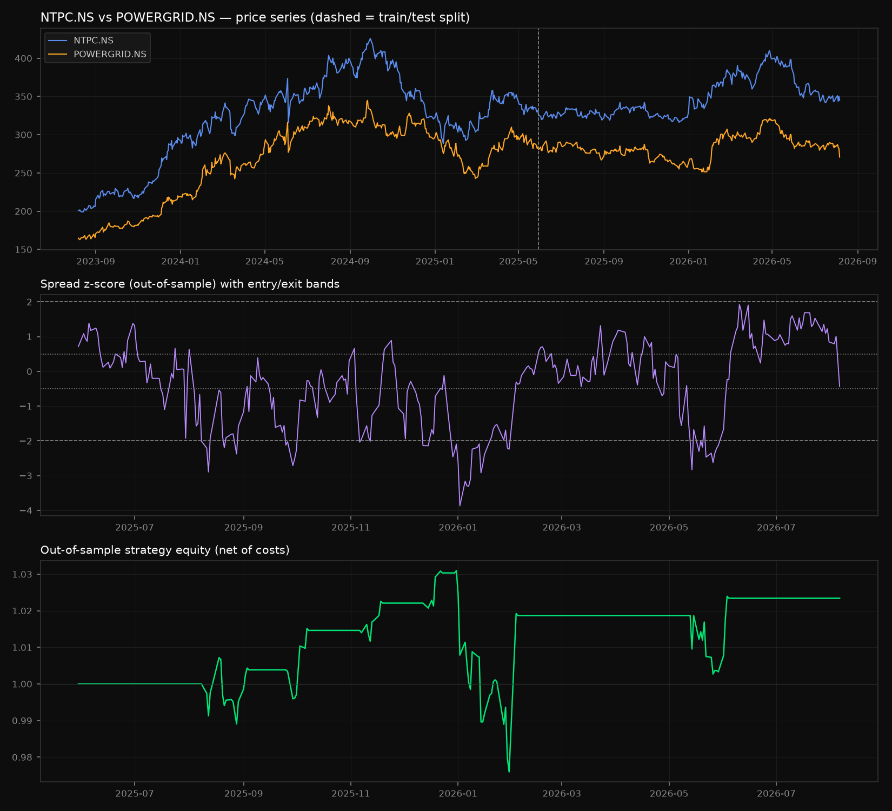

---

### BAJAJ-AUTO.NS / HEROMOTOCO.NS

- **Latest prices:** BAJAJ-AUTO.NS ₹11,620.00 · HEROMOTOCO.NS ₹5,550.50
- **Hedge ratio (train-fitted):** 0.4071
- **Cointegration (train):** FAIL at 5% — ADF -2.25, p=0.1870
- **Persistence:** passed 5% in 0 of 26 real-data runs (strict tier: 0/26)
- **Spread half-life:** 30.1 days
- **Current z-score:** +1.03
- **Signal today:** watch (approaching band)
- ⚠️ _Pair did not cointegrate on training data. Any signal here is not statistically justified — observation only._

**Out-of-sample backtest** (beta frozen from train window):

| Metric | Value |
|---|---|
| Sharpe | -1.12 |
| Sortino | -1.09 |
| Annualised return | -11.11% |
| Annualised vol | 10.09% |
| Max drawdown | -20.86% |
| Round-trip trades | 4 |

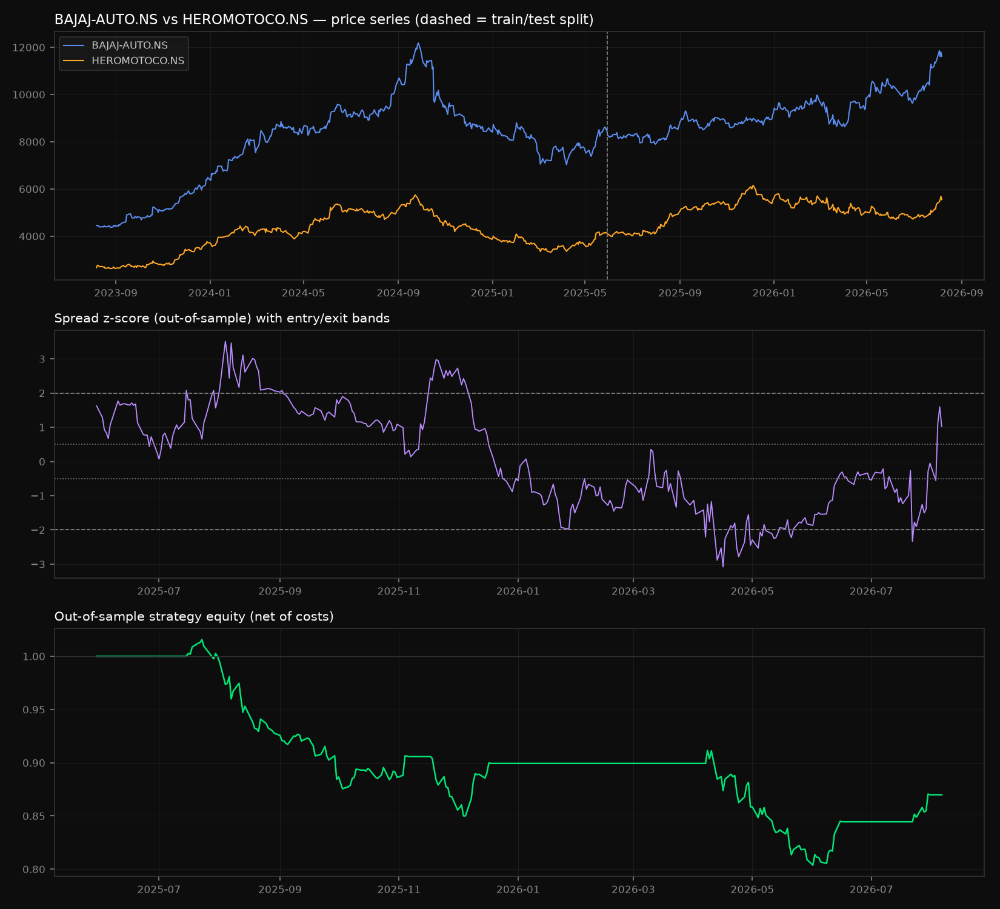

---

### TATASTEEL.NS / JSWSTEEL.NS

- **Latest prices:** TATASTEEL.NS ₹189.30 · JSWSTEEL.NS ₹1,307.90
- **Hedge ratio (train-fitted):** 3.0573
- **Cointegration (train):** FAIL at 5% — ADF -1.17, p=0.6864
- **Persistence:** passed 5% in 0 of 26 real-data runs (strict tier: 0/26)
- **Spread half-life:** 70.4 days
- **Current z-score:** +2.68
- **Signal today:** SHORT spread (short JSWSTEEL.NS, long TATASTEEL.NS)
- ⚠️ _Pair did not cointegrate on training data. Any signal here is not statistically justified — observation only._

**Out-of-sample backtest** (beta frozen from train window):

| Metric | Value |
|---|---|
| Sharpe | -0.03 |
| Sortino | -0.03 |
| Annualised return | -0.55% |
| Annualised vol | 7.67% |
| Max drawdown | -4.32% |
| Round-trip trades | 4 |

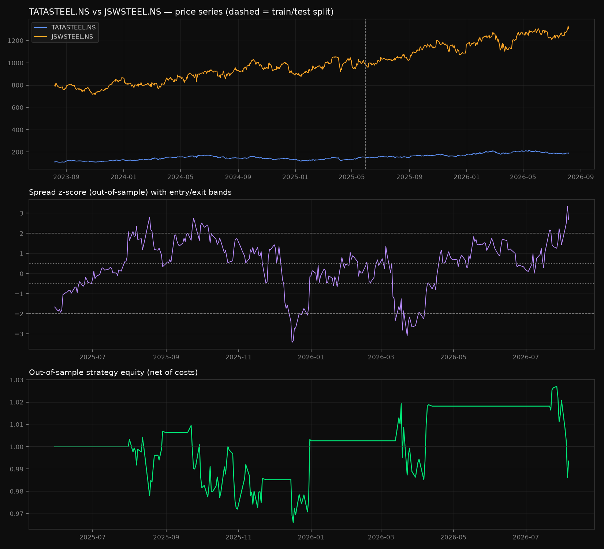

---

### SUNPHARMA.NS / CIPLA.NS

- **Latest prices:** SUNPHARMA.NS ₹1,951.00 · CIPLA.NS ₹1,477.00
- **Hedge ratio (train-fitted):** 0.4862
- **Cointegration (train):** PASS at 5% — ADF -3.40, p=0.0108
- **Persistence:** passed 5% in 26 of 26 real-data runs (strict tier: 5/26)
- **Spread half-life:** 10.6 days
- **Current z-score:** +0.94
- **Signal today:** watch (approaching band)

**Out-of-sample backtest** (beta frozen from train window):

| Metric | Value |
|---|---|
| Sharpe | -0.10 |
| Sortino | -0.11 |
| Annualised return | -1.10% |
| Annualised vol | 7.81% |
| Max drawdown | -10.48% |
| Round-trip trades | 5 |

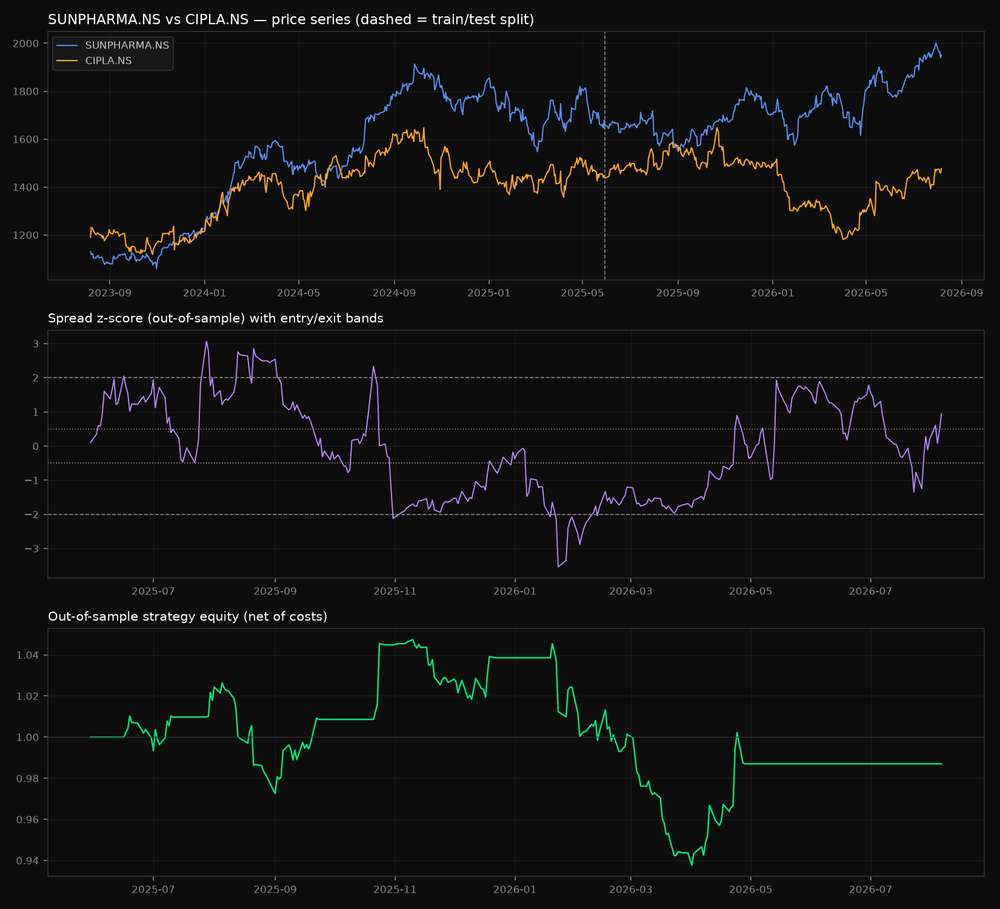

---

_Generated 2026-08-06 · pairs mean-reversion scanner · out-of-sample backtest · multiple-testing-aware · not investment advice._
