# Indian Pairs-Trading Scanner — 2026-08-07

> **What this is:** a market-neutral *pairs mean-reversion* scanner. It flags when two related NSE stocks have drifted apart far enough that their historical relationship signals a possible convergence trade. It does **not** forecast growth, rank "best" stocks, or predict company performance. A signal means the *spread between two stocks* is stretched — nothing about either stock being a good investment. Not investment advice; do your own research.

## Methodology (fixed in advance)

- **Universe:** 16 declared sector-mate pairs. Parameters (3y window, 60/40 train-test, z-entry 2.0, z-exit 0.5, 5 bps costs) are pre-registered; changes are logged in the README changelog *before* looking at results.
- **Multiple testing:** at the 5% level across 16 pairs, **≈0.8 false positives per run are expected by chance alone** even if nothing truly cointegrates. A single-day pass is a candidate, not a discovery.
- **Strict tier:** Bonferroni-corrected threshold p < 0.0031 (marked ✓✓).
- **Evidence = persistence:** the Persistence column counts how often each pair has passed the 5% test across all *real-data* daily runs recorded in `reports/history.csv`. Pairs deserve attention only when they pass persistently.

## Summary

| Pair | p-value | Coint. | Persistence | Current z | Signal | OOS Sharpe |
|---|---|---|---|---|---|---|
| HDFCBANK.NS/ICICIBANK.NS | 0.0747 | ✗ | 0/22 | +1.80 | watch | -0.53 |
| AXISBANK.NS/ICICIBANK.NS | 0.9217 | ✗ | 0/27 | +1.42 | watch | -0.31 |
| KOTAKBANK.NS/HDFCBANK.NS | 0.1665 | ✗ | 0/27 | -1.15 | watch | 0.69 |
| SBIN.NS/BANKBARODA.NS | 0.1651 | ✗ | 0/27 | -1.65 | watch | 0.20 |
| TCS.NS/INFY.NS | 0.4880 | ✗ | 0/27 | -1.28 | watch | 1.20 |
| INFY.NS/WIPRO.NS | 0.1801 | ✗ | 0/27 | -0.59 | watch | 1.67 |
| HCLTECH.NS/TECHM.NS | 0.1780 | ✗ | 0/27 | +0.44 | flat / no stretch | -0.03 |
| ACC.NS/AMBUJACEM.NS | 0.8040 | ✗ | 0/27 | +0.50 | flat / no stretch | 0.60 |
| ULTRACEMCO.NS/SHREECEM.NS | 0.1433 | ✗ | 0/27 | -0.10 | flat / no stretch | 0.47 |
| IOC.NS/BPCL.NS | 0.8310 | ✗ | 0/27 | +1.18 | watch | 0.53 |
| BPCL.NS/HINDPETRO.NS | 0.3326 | ✗ | 0/27 | -1.74 | watch | -0.21 |
| ONGC.NS/COALINDIA.NS | 0.0192 | ✓ | 19/27 | +0.11 | flat / no stretch | 0.75 |
| NTPC.NS/POWERGRID.NS | 0.0943 | ✗ | 0/27 | -0.15 | flat / no stretch | 0.38 |
| BAJAJ-AUTO.NS/HEROMOTOCO.NS | 0.1870 | ✗ | 0/27 | +2.23 | SHORT spread | -1.12 |
| TATASTEEL.NS/JSWSTEEL.NS | 0.6762 | ✗ | 0/27 | +2.42 | SHORT spread | -0.01 |
| SUNPHARMA.NS/CIPLA.NS | 0.0108 | ✓ | 27/27 | +0.53 | watch | -0.10 |

_Legend: ✓✓ passes strict Bonferroni tier · ✓ passes 5% only · ✗ fails. Persistence = 5%-passes / real-data runs recorded. \*no real-data history yet._

---

### HDFCBANK.NS / ICICIBANK.NS

- **Latest prices:** HDFCBANK.NS ₹731.00 · ICICIBANK.NS ₹1,421.00
- **Hedge ratio (train-fitted):** 1.7730
- **Cointegration (train):** FAIL at 5% — ADF -2.70, p=0.0747
- **Persistence:** passed 5% in 0 of 22 real-data runs (strict tier: 0/22)
- **Spread half-life:** 27.4 days
- **Current z-score:** +1.80
- **Signal today:** watch (approaching band)
- ⚠️ _Pair did not cointegrate on training data. Any signal here is not statistically justified — observation only._

**Out-of-sample backtest** (beta frozen from train window):

| Metric | Value |
|---|---|
| Sharpe | -0.53 |
| Sortino | -0.54 |
| Annualised return | -3.37% |
| Annualised vol | 6.15% |
| Max drawdown | -8.74% |
| Round-trip trades | 5 |

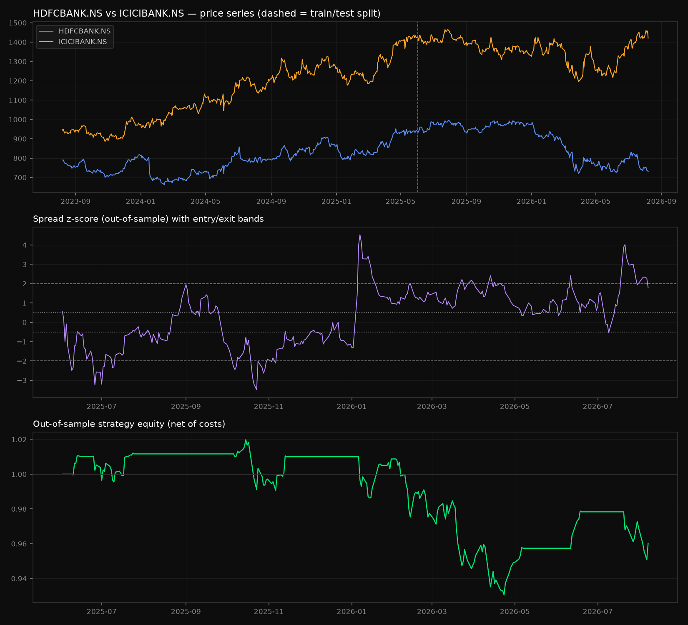

---

### AXISBANK.NS / ICICIBANK.NS

- **Latest prices:** AXISBANK.NS ₹1,238.00 · ICICIBANK.NS ₹1,421.00
- **Hedge ratio (train-fitted):** 0.9431
- **Cointegration (train):** FAIL at 5% — ADF -0.33, p=0.9217
- **Persistence:** passed 5% in 0 of 27 real-data runs (strict tier: 0/27)
- **Spread half-life:** 268.0 days
- **Current z-score:** +1.42
- **Signal today:** watch (approaching band)
- ⚠️ _Pair did not cointegrate on training data. Any signal here is not statistically justified — observation only._

**Out-of-sample backtest** (beta frozen from train window):

| Metric | Value |
|---|---|
| Sharpe | -0.31 |
| Sortino | -0.32 |
| Annualised return | -3.03% |
| Annualised vol | 8.70% |
| Max drawdown | -8.05% |
| Round-trip trades | 6 |

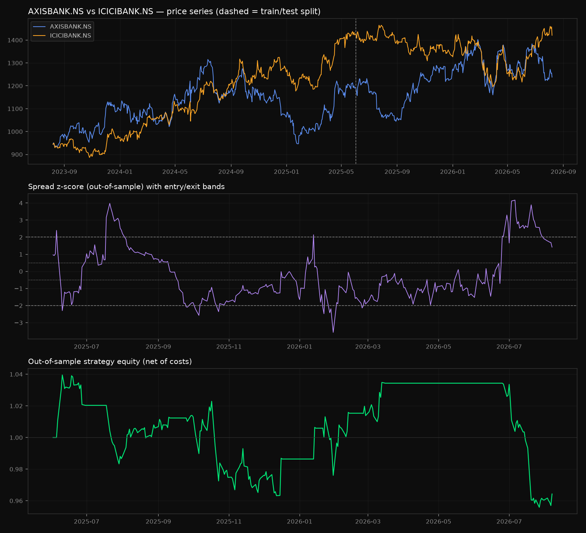

---

### KOTAKBANK.NS / HDFCBANK.NS

- **Latest prices:** KOTAKBANK.NS ₹390.75 · HDFCBANK.NS ₹731.00
- **Hedge ratio (train-fitted):** 1.9379
- **Cointegration (train):** FAIL at 5% — ADF -2.32, p=0.1665
- **Persistence:** passed 5% in 0 of 27 real-data runs (strict tier: 0/27)
- **Spread half-life:** 27.8 days
- **Current z-score:** -1.15
- **Signal today:** watch (approaching band)
- ⚠️ _Pair did not cointegrate on training data. Any signal here is not statistically justified — observation only._

**Out-of-sample backtest** (beta frozen from train window):

| Metric | Value |
|---|---|
| Sharpe | 0.69 |
| Sortino | 0.50 |
| Annualised return | 4.27% |
| Annualised vol | 6.37% |
| Max drawdown | -4.70% |
| Round-trip trades | 5 |

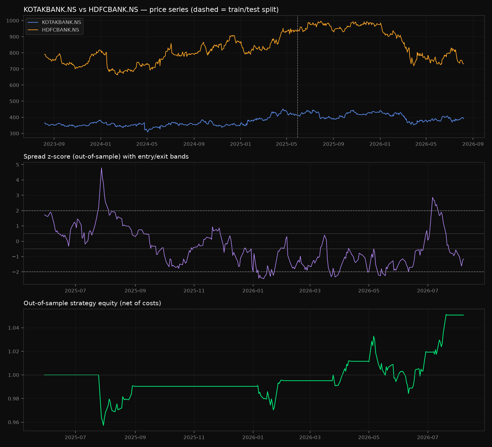

---

### SBIN.NS / BANKBARODA.NS

- **Latest prices:** SBIN.NS ₹1,097.20 · BANKBARODA.NS ₹250.70
- **Hedge ratio (train-fitted):** 0.2036
- **Cointegration (train):** FAIL at 5% — ADF -2.32, p=0.1651
- **Persistence:** passed 5% in 0 of 27 real-data runs (strict tier: 0/27)
- **Spread half-life:** 22.2 days
- **Current z-score:** -1.65
- **Signal today:** watch (approaching band)
- ⚠️ _Pair did not cointegrate on training data. Any signal here is not statistically justified — observation only._

**Out-of-sample backtest** (beta frozen from train window):

| Metric | Value |
|---|---|
| Sharpe | 0.20 |
| Sortino | 0.15 |
| Annualised return | 1.38% |
| Annualised vol | 8.53% |
| Max drawdown | -8.79% |
| Round-trip trades | 5 |

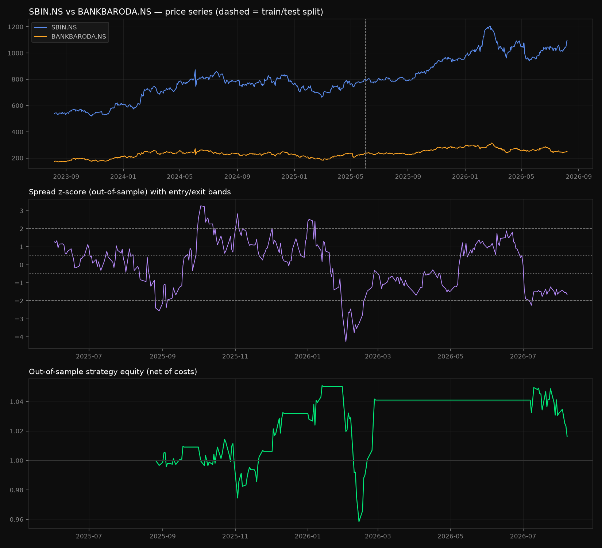

---

### TCS.NS / INFY.NS

- **Latest prices:** TCS.NS ₹2,452.70 · INFY.NS ₹1,175.10
- **Hedge ratio (train-fitted):** 0.5192
- **Cointegration (train):** FAIL at 5% — ADF -1.59, p=0.4880
- **Persistence:** passed 5% in 0 of 27 real-data runs (strict tier: 0/27)
- **Spread half-life:** 46.6 days
- **Current z-score:** -1.28
- **Signal today:** watch (approaching band)
- ⚠️ _Pair did not cointegrate on training data. Any signal here is not statistically justified — observation only._

**Out-of-sample backtest** (beta frozen from train window):

| Metric | Value |
|---|---|
| Sharpe | 1.20 |
| Sortino | 1.20 |
| Annualised return | 5.72% |
| Annualised vol | 4.71% |
| Max drawdown | -4.22% |
| Round-trip trades | 7 |

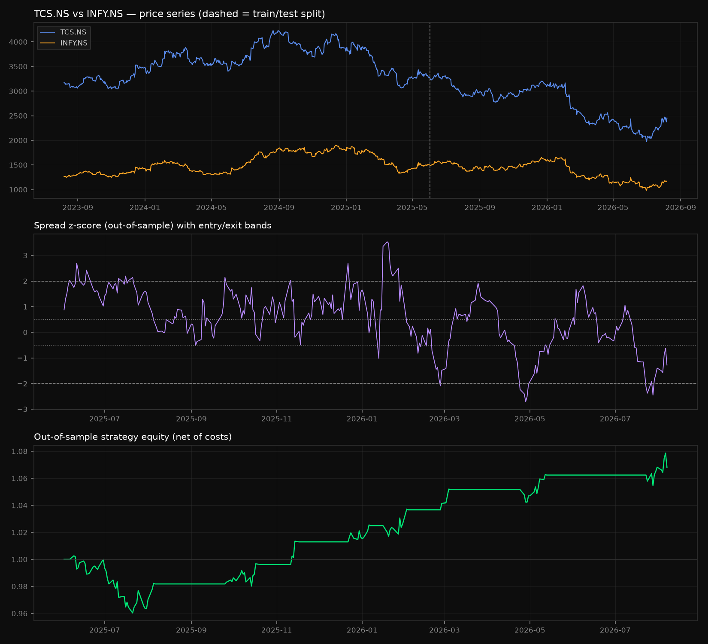

---

### INFY.NS / WIPRO.NS

- **Latest prices:** INFY.NS ₹1,175.10 · WIPRO.NS ₹187.53
- **Hedge ratio (train-fitted):** 0.1369
- **Cointegration (train):** FAIL at 5% — ADF -2.28, p=0.1801
- **Persistence:** passed 5% in 0 of 27 real-data runs (strict tier: 0/27)
- **Spread half-life:** 29.9 days
- **Current z-score:** -0.59
- **Signal today:** watch (approaching band)
- ⚠️ _Pair did not cointegrate on training data. Any signal here is not statistically justified — observation only._

**Out-of-sample backtest** (beta frozen from train window):

| Metric | Value |
|---|---|
| Sharpe | 1.67 |
| Sortino | 1.94 |
| Annualised return | 9.00% |
| Annualised vol | 5.25% |
| Max drawdown | -2.49% |
| Round-trip trades | 6 |

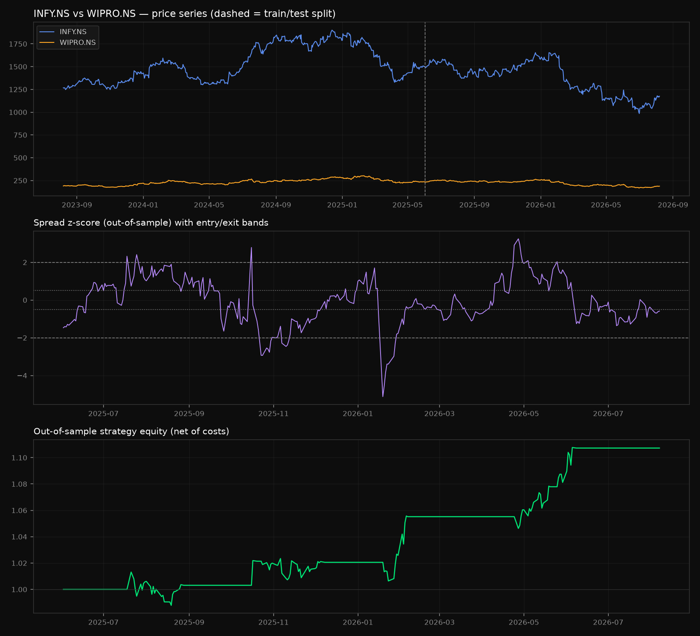

---

### HCLTECH.NS / TECHM.NS

- **Latest prices:** HCLTECH.NS ₹1,356.60 · TECHM.NS ₹1,635.00
- **Hedge ratio (train-fitted):** 0.8269
- **Cointegration (train):** FAIL at 5% — ADF -2.28, p=0.1780
- **Persistence:** passed 5% in 0 of 27 real-data runs (strict tier: 0/27)
- **Spread half-life:** 25.7 days
- **Current z-score:** +0.44
- **Signal today:** flat / no stretch
- ⚠️ _Pair did not cointegrate on training data. Any signal here is not statistically justified — observation only._

**Out-of-sample backtest** (beta frozen from train window):

| Metric | Value |
|---|---|
| Sharpe | -0.03 |
| Sortino | -0.03 |
| Annualised return | -0.58% |
| Annualised vol | 7.99% |
| Max drawdown | -8.45% |
| Round-trip trades | 5 |

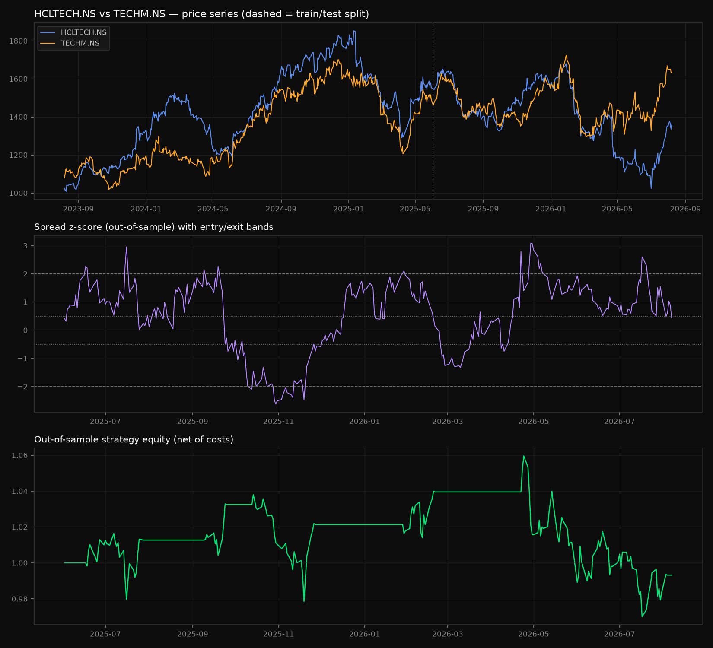

---

### ACC.NS / AMBUJACEM.NS

- **Latest prices:** ACC.NS ₹1,362.80 · AMBUJACEM.NS ₹434.00
- **Hedge ratio (train-fitted):** 0.2291
- **Cointegration (train):** FAIL at 5% — ADF -0.85, p=0.8040
- **Persistence:** passed 5% in 0 of 27 real-data runs (strict tier: 0/27)
- **Spread half-life:** 88.7 days
- **Current z-score:** +0.50
- **Signal today:** flat / no stretch
- ⚠️ _Pair did not cointegrate on training data. Any signal here is not statistically justified — observation only._

**Out-of-sample backtest** (beta frozen from train window):

| Metric | Value |
|---|---|
| Sharpe | 0.60 |
| Sortino | 0.52 |
| Annualised return | 3.43% |
| Annualised vol | 5.94% |
| Max drawdown | -7.50% |
| Round-trip trades | 4 |

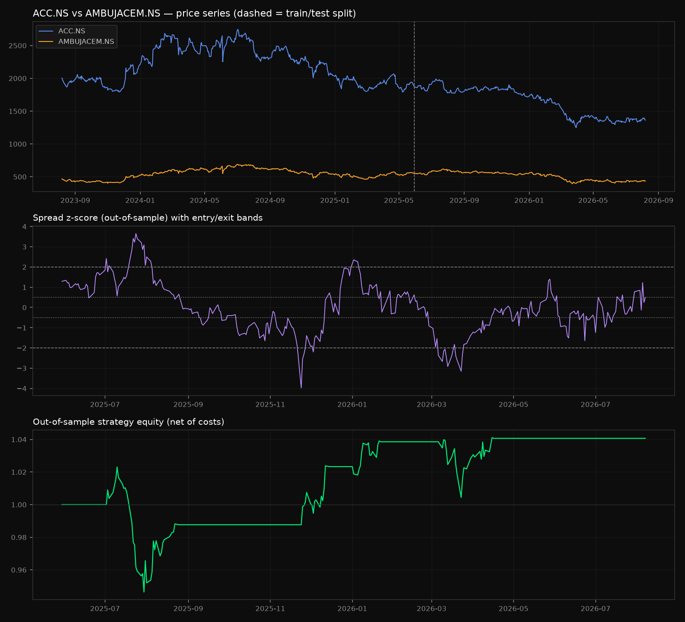

---

### ULTRACEMCO.NS / SHREECEM.NS

- **Latest prices:** ULTRACEMCO.NS ₹12,105.00 · SHREECEM.NS ₹26,010.00
- **Hedge ratio (train-fitted):** 0.6619
- **Cointegration (train):** FAIL at 5% — ADF -2.39, p=0.1433
- **Persistence:** passed 5% in 0 of 27 real-data runs (strict tier: 0/27)
- **Spread half-life:** 35.4 days
- **Current z-score:** -0.10
- **Signal today:** flat / no stretch
- ⚠️ _Pair did not cointegrate on training data. Any signal here is not statistically justified — observation only._

**Out-of-sample backtest** (beta frozen from train window):

| Metric | Value |
|---|---|
| Sharpe | 0.47 |
| Sortino | 0.51 |
| Annualised return | 3.65% |
| Annualised vol | 8.40% |
| Max drawdown | -9.26% |
| Round-trip trades | 6 |

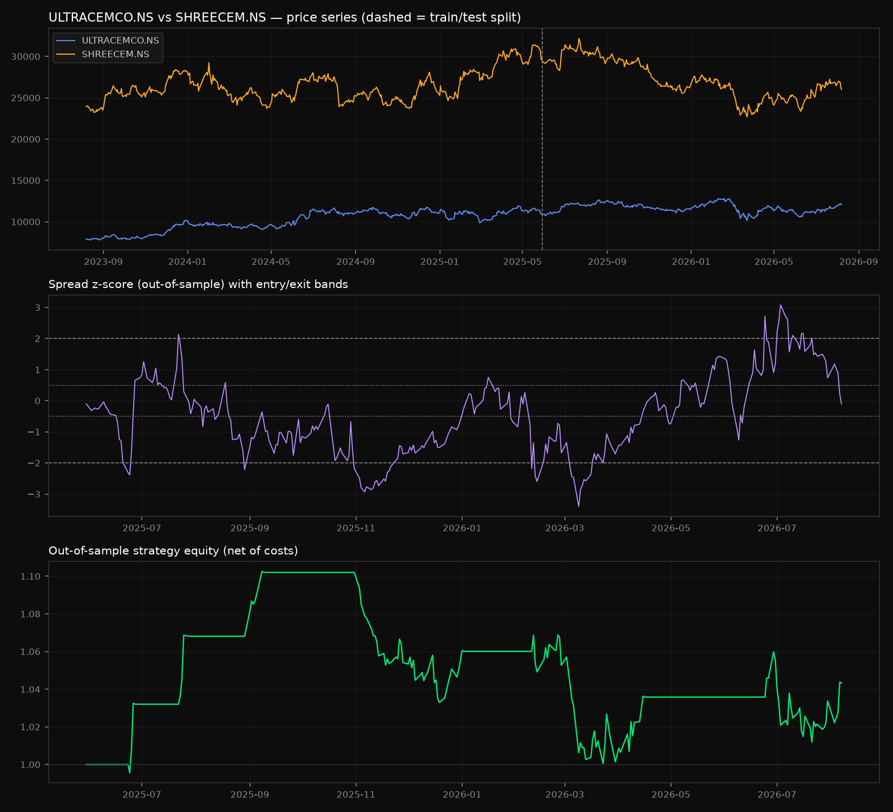

---

### IOC.NS / BPCL.NS

- **Latest prices:** IOC.NS ₹143.38 · BPCL.NS ₹321.00
- **Hedge ratio (train-fitted):** 1.7687
- **Cointegration (train):** FAIL at 5% — ADF -0.76, p=0.8310
- **Persistence:** passed 5% in 0 of 27 real-data runs (strict tier: 0/27)
- **Spread half-life:** 143.4 days
- **Current z-score:** +1.18
- **Signal today:** watch (approaching band)
- ⚠️ _Pair did not cointegrate on training data. Any signal here is not statistically justified — observation only._

**Out-of-sample backtest** (beta frozen from train window):

| Metric | Value |
|---|---|
| Sharpe | 0.53 |
| Sortino | 0.57 |
| Annualised return | 3.33% |
| Annualised vol | 6.56% |
| Max drawdown | -6.72% |
| Round-trip trades | 7 |

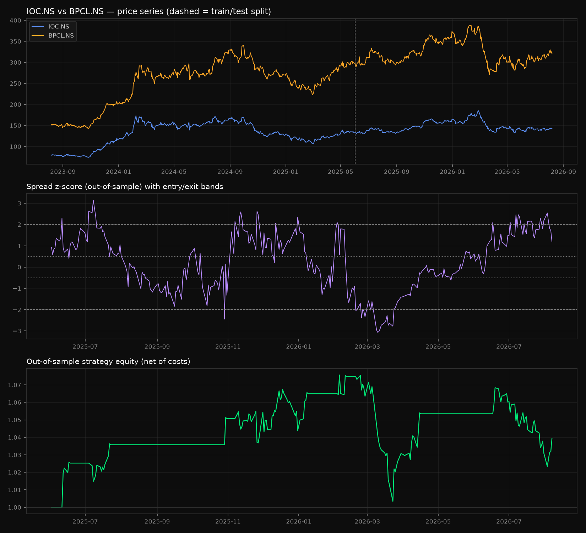

---

### BPCL.NS / HINDPETRO.NS

- **Latest prices:** BPCL.NS ₹321.00 · HINDPETRO.NS ₹393.05
- **Hedge ratio (train-fitted):** 1.4286
- **Cointegration (train):** FAIL at 5% — ADF -1.90, p=0.3326
- **Persistence:** passed 5% in 0 of 27 real-data runs (strict tier: 0/27)
- **Spread half-life:** 41.4 days
- **Current z-score:** -1.74
- **Signal today:** watch (approaching band)
- ⚠️ _Pair did not cointegrate on training data. Any signal here is not statistically justified — observation only._

**Out-of-sample backtest** (beta frozen from train window):

| Metric | Value |
|---|---|
| Sharpe | -0.21 |
| Sortino | -0.19 |
| Annualised return | -1.41% |
| Annualised vol | 5.87% |
| Max drawdown | -6.89% |
| Round-trip trades | 4 |

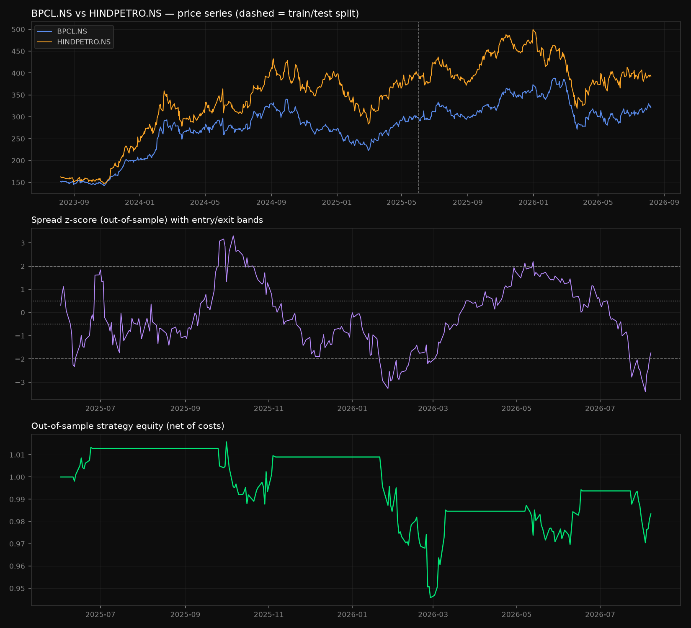

---

### ONGC.NS / COALINDIA.NS

- **Latest prices:** ONGC.NS ₹238.85 · COALINDIA.NS ₹415.25
- **Hedge ratio (train-fitted):** 1.6353
- **Cointegration (train):** PASS at 5% — ADF -3.21, p=0.0192
- **Persistence:** passed 5% in 19 of 27 real-data runs (strict tier: 0/27)
- **Spread half-life:** 14.8 days
- **Current z-score:** +0.11
- **Signal today:** flat / no stretch

**Out-of-sample backtest** (beta frozen from train window):

| Metric | Value |
|---|---|
| Sharpe | 0.75 |
| Sortino | 0.60 |
| Annualised return | 5.38% |
| Annualised vol | 7.36% |
| Max drawdown | -5.71% |
| Round-trip trades | 5 |

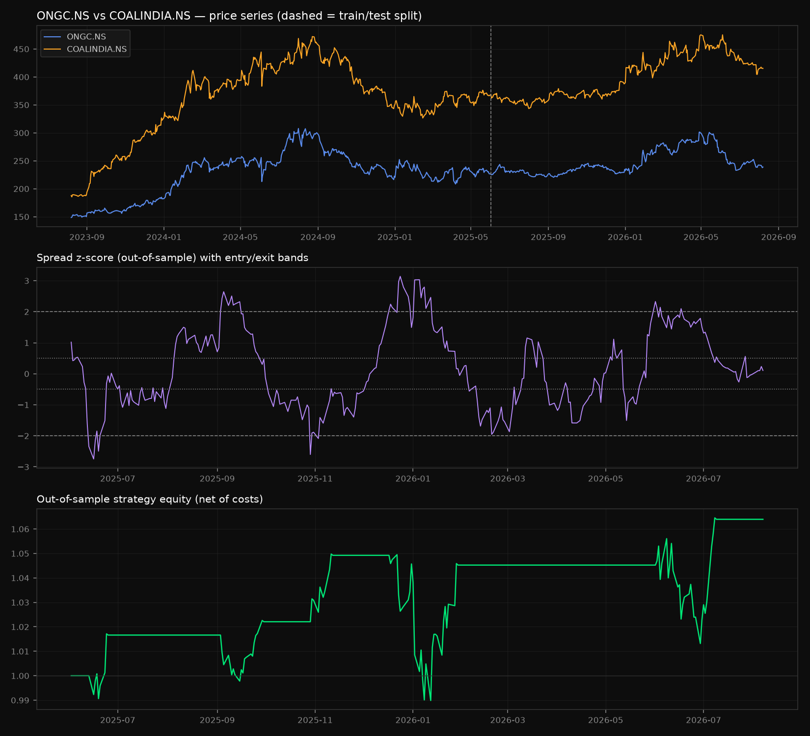

---

### NTPC.NS / POWERGRID.NS

- **Latest prices:** NTPC.NS ₹342.50 · POWERGRID.NS ₹271.60
- **Hedge ratio (train-fitted):** 0.8358
- **Cointegration (train):** FAIL at 5% — ADF -2.59, p=0.0943
- **Persistence:** passed 5% in 0 of 27 real-data runs (strict tier: 0/27)
- **Spread half-life:** 22.7 days
- **Current z-score:** -0.15
- **Signal today:** flat / no stretch
- ⚠️ _Pair did not cointegrate on training data. Any signal here is not statistically justified — observation only._

**Out-of-sample backtest** (beta frozen from train window):

| Metric | Value |
|---|---|
| Sharpe | 0.38 |
| Sortino | 0.29 |
| Annualised return | 1.97% |
| Annualised vol | 5.57% |
| Max drawdown | -5.31% |
| Round-trip trades | 6 |

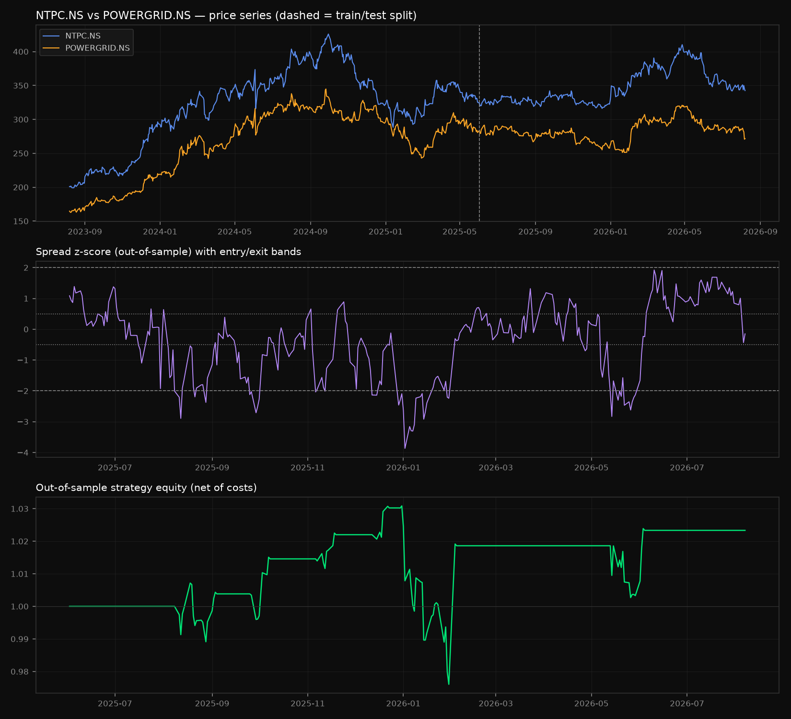

---

### BAJAJ-AUTO.NS / HEROMOTOCO.NS

- **Latest prices:** BAJAJ-AUTO.NS ₹11,662.00 · HEROMOTOCO.NS ₹5,725.00
- **Hedge ratio (train-fitted):** 0.4071
- **Cointegration (train):** FAIL at 5% — ADF -2.25, p=0.1870
- **Persistence:** passed 5% in 0 of 27 real-data runs (strict tier: 0/27)
- **Spread half-life:** 30.1 days
- **Current z-score:** +2.23
- **Signal today:** SHORT spread (short HEROMOTOCO.NS, long BAJAJ-AUTO.NS)
- ⚠️ _Pair did not cointegrate on training data. Any signal here is not statistically justified — observation only._

**Out-of-sample backtest** (beta frozen from train window):

| Metric | Value |
|---|---|
| Sharpe | -1.12 |
| Sortino | -1.09 |
| Annualised return | -11.12% |
| Annualised vol | 10.09% |
| Max drawdown | -20.86% |
| Round-trip trades | 4 |

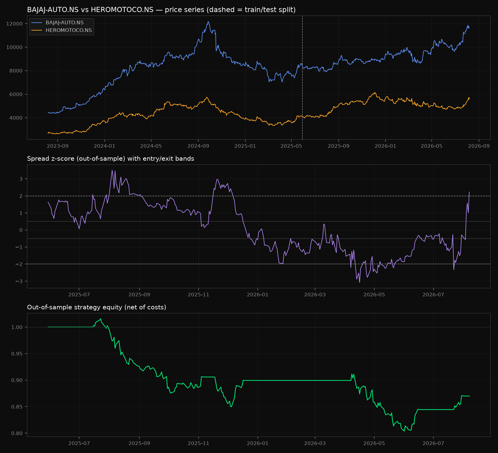

---

### TATASTEEL.NS / JSWSTEEL.NS

- **Latest prices:** TATASTEEL.NS ₹187.55 · JSWSTEEL.NS ₹1,299.50
- **Hedge ratio (train-fitted):** 3.0645
- **Cointegration (train):** FAIL at 5% — ADF -1.19, p=0.6762
- **Persistence:** passed 5% in 0 of 27 real-data runs (strict tier: 0/27)
- **Spread half-life:** 69.4 days
- **Current z-score:** +2.42
- **Signal today:** SHORT spread (short JSWSTEEL.NS, long TATASTEEL.NS)
- ⚠️ _Pair did not cointegrate on training data. Any signal here is not statistically justified — observation only._

**Out-of-sample backtest** (beta frozen from train window):

| Metric | Value |
|---|---|
| Sharpe | -0.01 |
| Sortino | -0.01 |
| Annualised return | -0.39% |
| Annualised vol | 7.77% |
| Max drawdown | -4.37% |
| Round-trip trades | 4 |

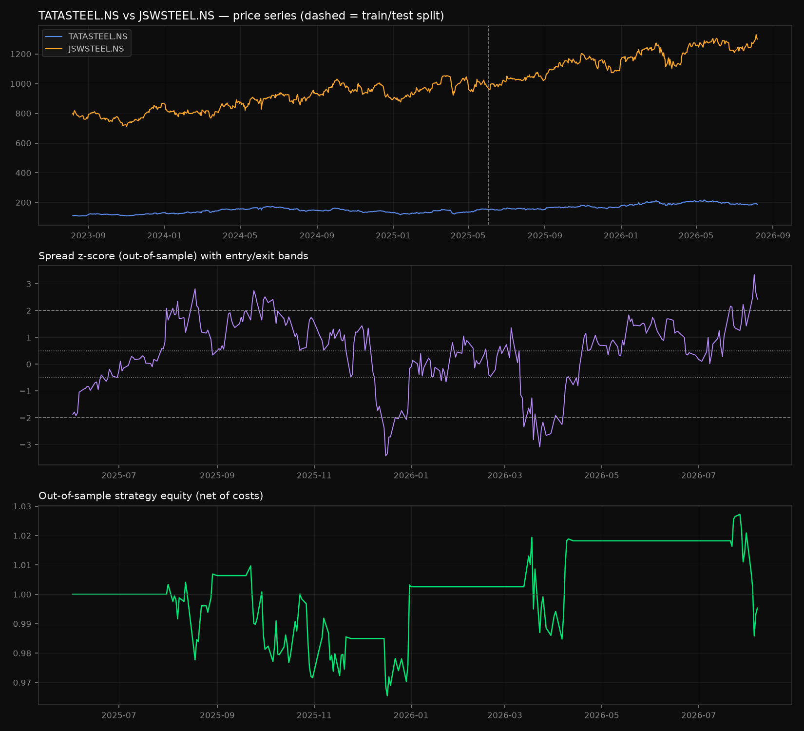

---

### SUNPHARMA.NS / CIPLA.NS

- **Latest prices:** SUNPHARMA.NS ₹1,945.00 · CIPLA.NS ₹1,463.80
- **Hedge ratio (train-fitted):** 0.4861
- **Cointegration (train):** PASS at 5% — ADF -3.41, p=0.0108
- **Persistence:** passed 5% in 27 of 27 real-data runs (strict tier: 5/27)
- **Spread half-life:** 10.6 days
- **Current z-score:** +0.53
- **Signal today:** watch (approaching band)

**Out-of-sample backtest** (beta frozen from train window):

| Metric | Value |
|---|---|
| Sharpe | -0.10 |
| Sortino | -0.11 |
| Annualised return | -1.10% |
| Annualised vol | 7.80% |
| Max drawdown | -10.46% |
| Round-trip trades | 5 |

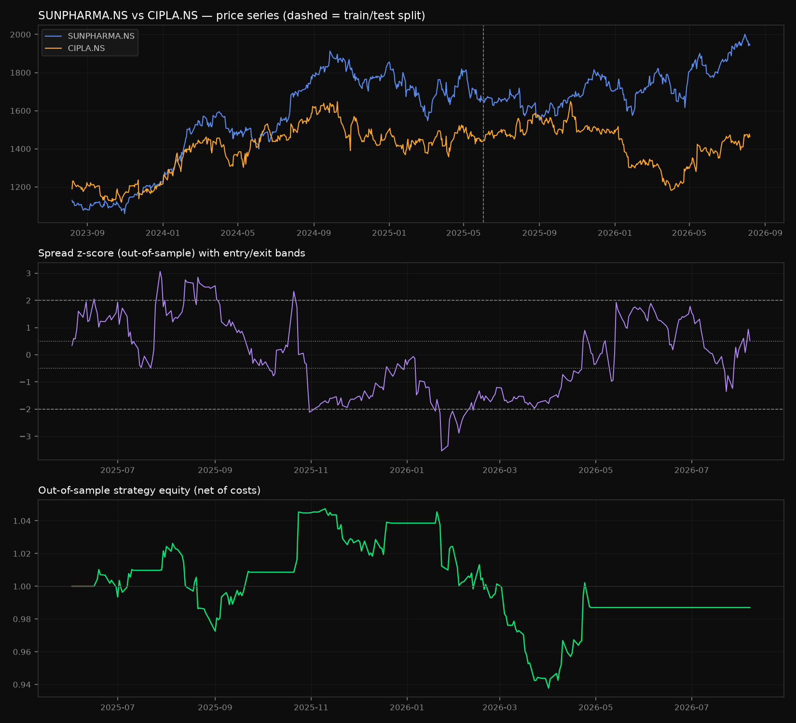

---

_Generated 2026-08-07 · pairs mean-reversion scanner · out-of-sample backtest · multiple-testing-aware · not investment advice._
