# Indian Pairs-Trading Scanner — 2026-08-10

> **What this is:** a market-neutral *pairs mean-reversion* scanner. It flags when two related NSE stocks have drifted apart far enough that their historical relationship signals a possible convergence trade. It does **not** forecast growth, rank "best" stocks, or predict company performance. A signal means the *spread between two stocks* is stretched — nothing about either stock being a good investment. Not investment advice; do your own research.

## Methodology (fixed in advance)

- **Universe:** 16 declared sector-mate pairs. Parameters (3y window, 60/40 train-test, z-entry 2.0, z-exit 0.5, 5 bps costs) are pre-registered; changes are logged in the README changelog *before* looking at results.
- **Multiple testing:** at the 5% level across 16 pairs, **≈0.8 false positives per run are expected by chance alone** even if nothing truly cointegrates. A single-day pass is a candidate, not a discovery.
- **Strict tier:** Bonferroni-corrected threshold p < 0.0031 (marked ✓✓).
- **Evidence = persistence:** the Persistence column counts how often each pair has passed the 5% test across all *real-data* daily runs recorded in `reports/history.csv`. Pairs deserve attention only when they pass persistently.

> ⚠️ **Some results use SIMULATED fallback data** (real data was unreachable this run) and are not real market results. These are marked below and are EXCLUDED from persistence counts.

## Summary

| Pair | p-value | Coint. | Persistence | Current z | Signal | OOS Sharpe |
|---|---|---|---|---|---|---|
| HDFCBANK.NS/ICICIBANK.NS *(sim)* | 0.0030 | ✓✓ | 0/22 | -1.55 | watch | 1.13 |
| AXISBANK.NS/ICICIBANK.NS | 0.9212 | ✗ | 0/28 | +1.39 | watch | -0.32 |
| KOTAKBANK.NS/HDFCBANK.NS | 0.1759 | ✗ | 0/28 | -1.27 | watch | 1.00 |
| SBIN.NS/BANKBARODA.NS | 0.1499 | ✗ | 0/28 | -1.43 | watch | 0.27 |
| TCS.NS/INFY.NS | 0.5160 | ✗ | 0/28 | -0.78 | watch | 1.38 |
| INFY.NS/WIPRO.NS | 0.1852 | ✗ | 0/28 | -1.00 | watch | 1.67 |
| HCLTECH.NS/TECHM.NS | 0.1921 | ✗ | 0/28 | +0.51 | watch | -0.01 |
| ACC.NS/AMBUJACEM.NS | 0.8077 | ✗ | 0/28 | +0.09 | flat / no stretch | 0.60 |
| ULTRACEMCO.NS/SHREECEM.NS | 0.1102 | ✗ | 0/28 | +0.05 | flat / no stretch | 0.47 |
| IOC.NS/BPCL.NS | 0.7639 | ✗ | 0/28 | +1.14 | watch | 0.64 |
| BPCL.NS/HINDPETRO.NS | 0.3411 | ✗ | 0/28 | -1.36 | watch | -0.15 |
| ONGC.NS/COALINDIA.NS | 0.0140 | ✓ | 20/28 | -0.22 | flat / no stretch | 0.75 |
| NTPC.NS/POWERGRID.NS | 0.1019 | ✗ | 0/28 | -0.15 | flat / no stretch | 0.38 |
| BAJAJ-AUTO.NS/HEROMOTOCO.NS | 0.1804 | ✗ | 0/28 | +3.00 | SHORT spread | -1.25 |
| TATASTEEL.NS/JSWSTEEL.NS | 0.6667 | ✗ | 0/28 | +2.06 | SHORT spread | 0.03 |
| SUNPHARMA.NS/CIPLA.NS | 0.0107 | ✓ | 28/28 | +0.67 | watch | -0.10 |

_Legend: ✓✓ passes strict Bonferroni tier · ✓ passes 5% only · ✗ fails. Persistence = 5%-passes / real-data runs recorded. \*no real-data history yet._

---

### HDFCBANK.NS / ICICIBANK.NS · _SIMULATED_

- **Latest prices:** HDFCBANK.NS ₹77.27 · ICICIBANK.NS ₹113.78
- **Hedge ratio (train-fitted):** 1.5557
- **Cointegration (train):** PASS at 5% — ADF -3.79, p=0.0030 · **passes strict Bonferroni tier**
- **Persistence:** passed 5% in 0 of 22 real-data runs (strict tier: 0/22)
- **Spread half-life:** 14.0 days
- **Current z-score:** -1.55
- **Signal today:** watch (approaching band)

**Out-of-sample backtest** (beta frozen from train window):

| Metric | Value |
|---|---|
| Sharpe | 1.13 |
| Sortino | 0.86 |
| Annualised return | 1.88% |
| Annualised vol | 1.66% |
| Max drawdown | -1.19% |
| Round-trip trades | 5 |

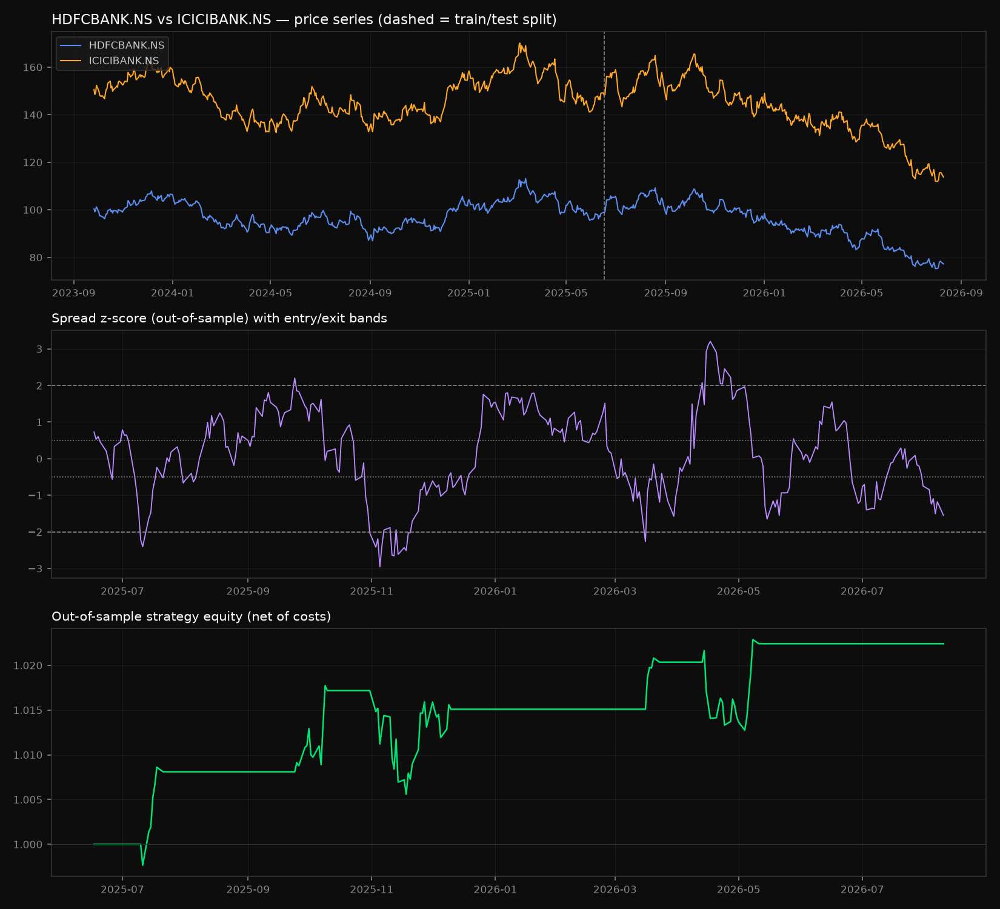

---

### AXISBANK.NS / ICICIBANK.NS

- **Latest prices:** AXISBANK.NS ₹1,247.30 · ICICIBANK.NS ₹1,431.80
- **Hedge ratio (train-fitted):** 0.9478
- **Cointegration (train):** FAIL at 5% — ADF -0.33, p=0.9212
- **Persistence:** passed 5% in 0 of 28 real-data runs (strict tier: 0/28)
- **Spread half-life:** 271.8 days
- **Current z-score:** +1.39
- **Signal today:** watch (approaching band)
- ⚠️ _Pair did not cointegrate on training data. Any signal here is not statistically justified — observation only._

**Out-of-sample backtest** (beta frozen from train window):

| Metric | Value |
|---|---|
| Sharpe | -0.32 |
| Sortino | -0.32 |
| Annualised return | -3.15% |
| Annualised vol | 8.87% |
| Max drawdown | -8.18% |
| Round-trip trades | 6 |

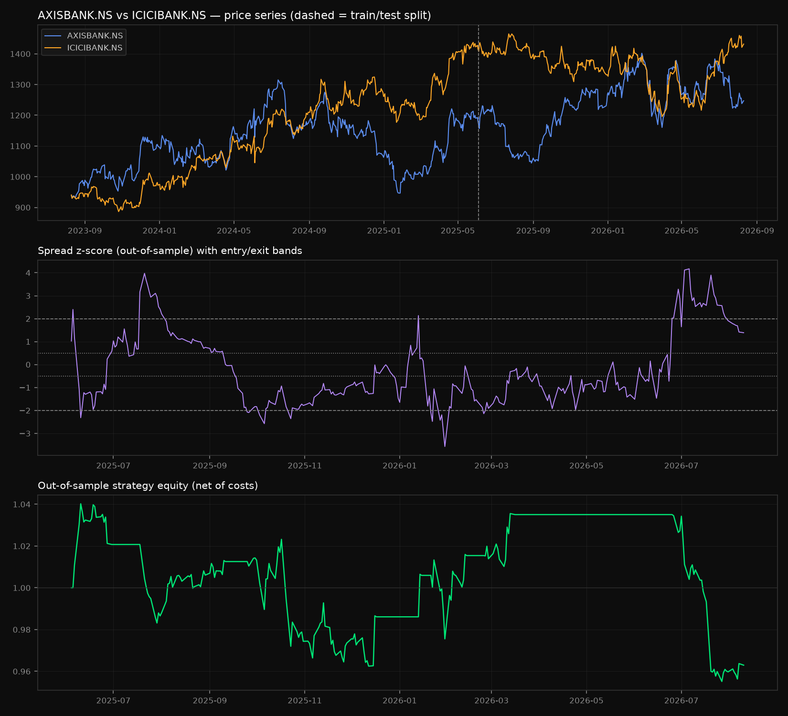

---

### KOTAKBANK.NS / HDFCBANK.NS

- **Latest prices:** KOTAKBANK.NS ₹393.50 · HDFCBANK.NS ₹731.00
- **Hedge ratio (train-fitted):** 1.9564
- **Cointegration (train):** FAIL at 5% — ADF -2.29, p=0.1759
- **Persistence:** passed 5% in 0 of 28 real-data runs (strict tier: 0/28)
- **Spread half-life:** 28.1 days
- **Current z-score:** -1.27
- **Signal today:** watch (approaching band)
- ⚠️ _Pair did not cointegrate on training data. Any signal here is not statistically justified — observation only._

**Out-of-sample backtest** (beta frozen from train window):

| Metric | Value |
|---|---|
| Sharpe | 1.00 |
| Sortino | 0.71 |
| Annualised return | 6.34% |
| Annualised vol | 6.32% |
| Max drawdown | -4.35% |
| Round-trip trades | 6 |

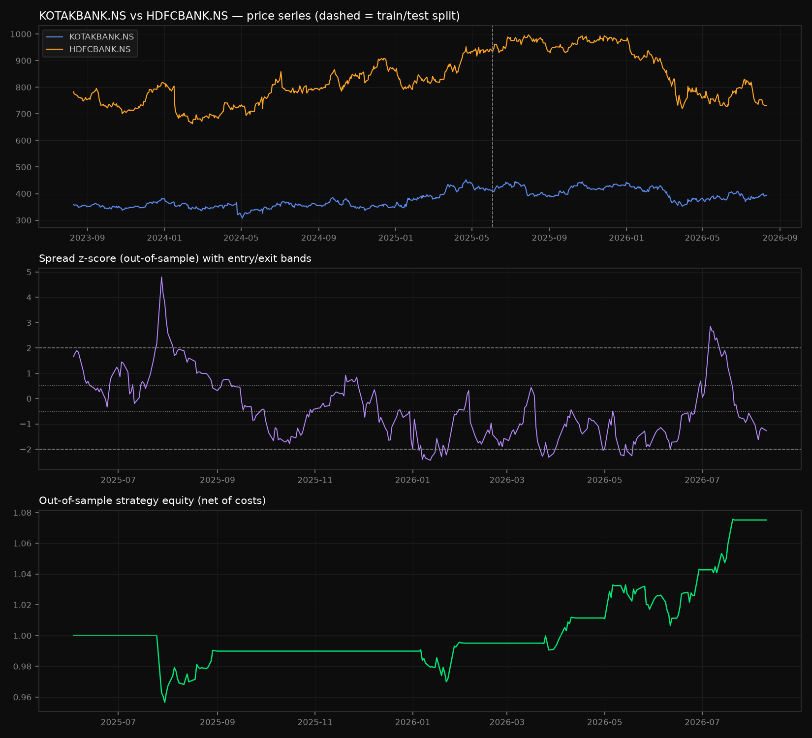

---

### SBIN.NS / BANKBARODA.NS

- **Latest prices:** SBIN.NS ₹1,071.00 · BANKBARODA.NS ₹247.81
- **Hedge ratio (train-fitted):** 0.2024
- **Cointegration (train):** FAIL at 5% — ADF -2.37, p=0.1499
- **Persistence:** passed 5% in 0 of 28 real-data runs (strict tier: 0/28)
- **Spread half-life:** 22.0 days
- **Current z-score:** -1.43
- **Signal today:** watch (approaching band)
- ⚠️ _Pair did not cointegrate on training data. Any signal here is not statistically justified — observation only._

**Out-of-sample backtest** (beta frozen from train window):

| Metric | Value |
|---|---|
| Sharpe | 0.27 |
| Sortino | 0.20 |
| Annualised return | 1.93% |
| Annualised vol | 8.61% |
| Max drawdown | -8.81% |
| Round-trip trades | 5 |

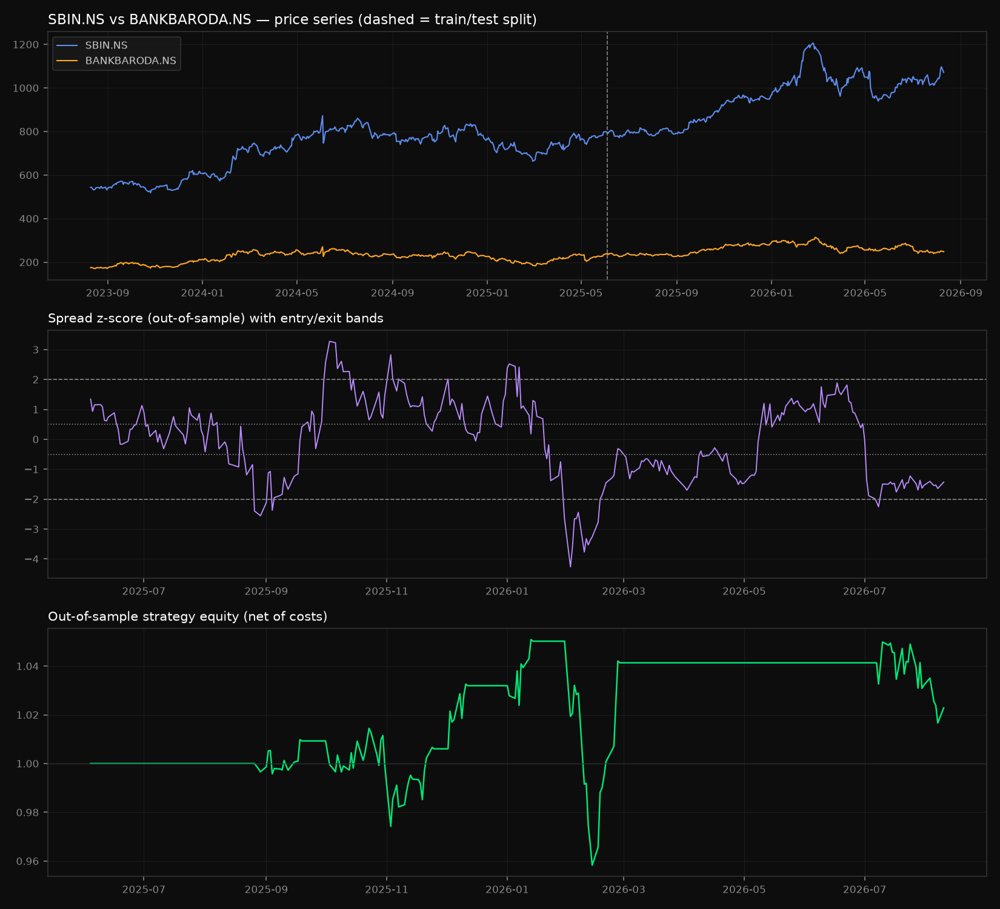

---

### TCS.NS / INFY.NS

- **Latest prices:** TCS.NS ₹2,425.70 · INFY.NS ₹1,183.00
- **Hedge ratio (train-fitted):** 0.5158
- **Cointegration (train):** FAIL at 5% — ADF -1.54, p=0.5160
- **Persistence:** passed 5% in 0 of 28 real-data runs (strict tier: 0/28)
- **Spread half-life:** 48.4 days
- **Current z-score:** -0.78
- **Signal today:** watch (approaching band)
- ⚠️ _Pair did not cointegrate on training data. Any signal here is not statistically justified — observation only._

**Out-of-sample backtest** (beta frozen from train window):

| Metric | Value |
|---|---|
| Sharpe | 1.38 |
| Sortino | 1.42 |
| Annualised return | 6.77% |
| Annualised vol | 4.84% |
| Max drawdown | -4.23% |
| Round-trip trades | 7 |

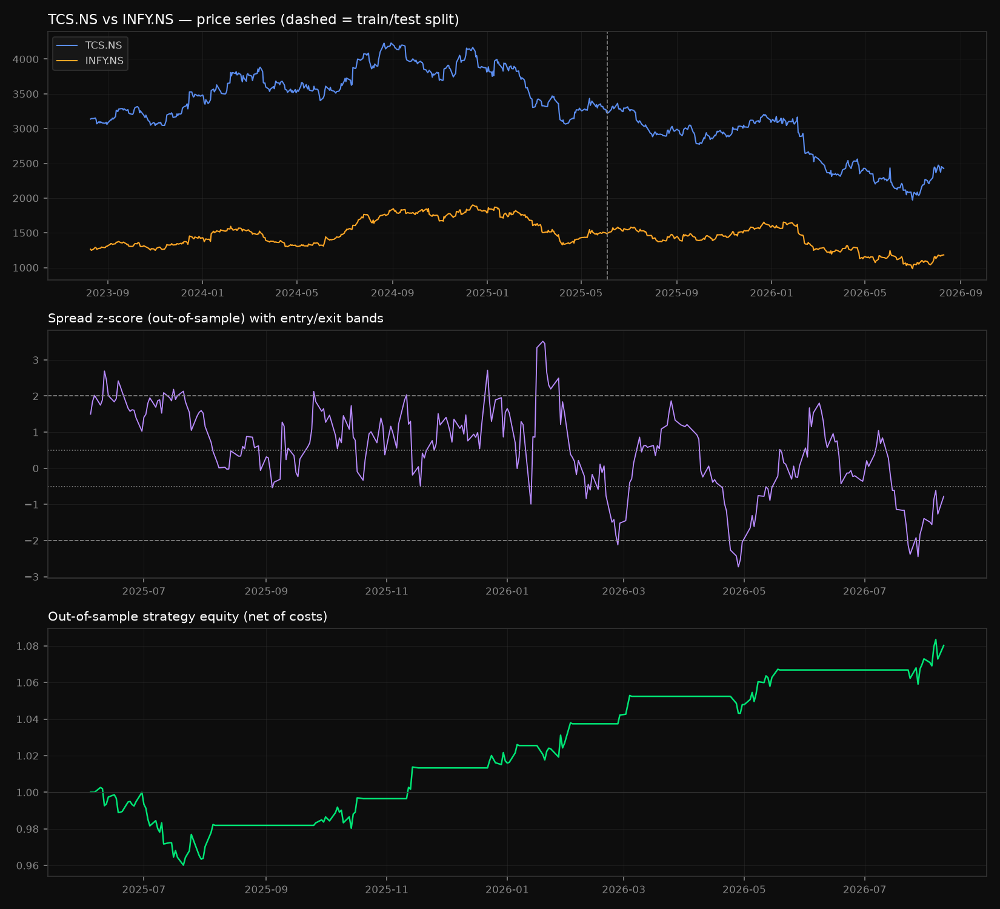

---

### INFY.NS / WIPRO.NS

- **Latest prices:** INFY.NS ₹1,183.00 · WIPRO.NS ₹185.50
- **Hedge ratio (train-fitted):** 0.1367
- **Cointegration (train):** FAIL at 5% — ADF -2.26, p=0.1852
- **Persistence:** passed 5% in 0 of 28 real-data runs (strict tier: 0/28)
- **Spread half-life:** 30.1 days
- **Current z-score:** -1.00
- **Signal today:** watch (approaching band)
- ⚠️ _Pair did not cointegrate on training data. Any signal here is not statistically justified — observation only._

**Out-of-sample backtest** (beta frozen from train window):

| Metric | Value |
|---|---|
| Sharpe | 1.67 |
| Sortino | 1.95 |
| Annualised return | 9.06% |
| Annualised vol | 5.27% |
| Max drawdown | -2.49% |
| Round-trip trades | 6 |

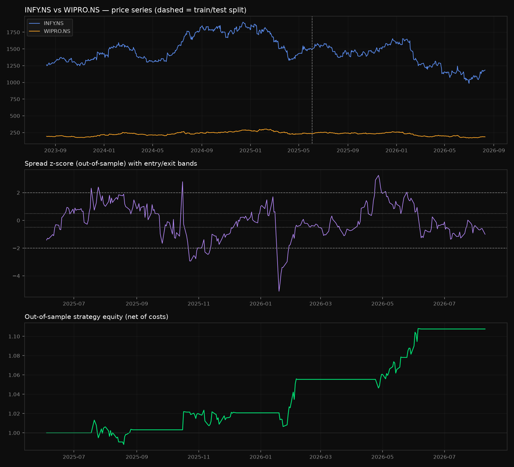

---

### HCLTECH.NS / TECHM.NS

- **Latest prices:** HCLTECH.NS ₹1,357.20 · TECHM.NS ₹1,640.00
- **Hedge ratio (train-fitted):** 0.8340
- **Cointegration (train):** FAIL at 5% — ADF -2.24, p=0.1921
- **Persistence:** passed 5% in 0 of 28 real-data runs (strict tier: 0/28)
- **Spread half-life:** 22.9 days
- **Current z-score:** +0.51
- **Signal today:** watch (approaching band)
- ⚠️ _Pair did not cointegrate on training data. Any signal here is not statistically justified — observation only._

**Out-of-sample backtest** (beta frozen from train window):

| Metric | Value |
|---|---|
| Sharpe | -0.01 |
| Sortino | -0.02 |
| Annualised return | -0.42% |
| Annualised vol | 7.79% |
| Max drawdown | -8.41% |
| Round-trip trades | 5 |

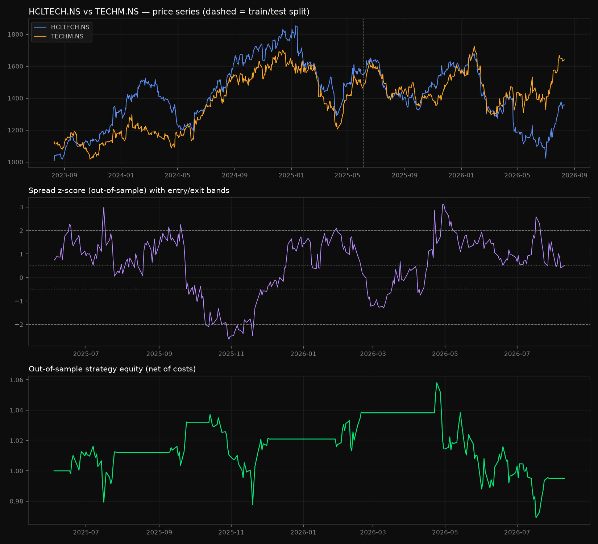

---

### ACC.NS / AMBUJACEM.NS

- **Latest prices:** ACC.NS ₹1,357.60 · AMBUJACEM.NS ₹430.85
- **Hedge ratio (train-fitted):** 0.2267
- **Cointegration (train):** FAIL at 5% — ADF -0.84, p=0.8077
- **Persistence:** passed 5% in 0 of 28 real-data runs (strict tier: 0/28)
- **Spread half-life:** 89.3 days
- **Current z-score:** +0.09
- **Signal today:** flat / no stretch
- ⚠️ _Pair did not cointegrate on training data. Any signal here is not statistically justified — observation only._

**Out-of-sample backtest** (beta frozen from train window):

| Metric | Value |
|---|---|
| Sharpe | 0.60 |
| Sortino | 0.52 |
| Annualised return | 3.45% |
| Annualised vol | 6.00% |
| Max drawdown | -7.50% |
| Round-trip trades | 4 |

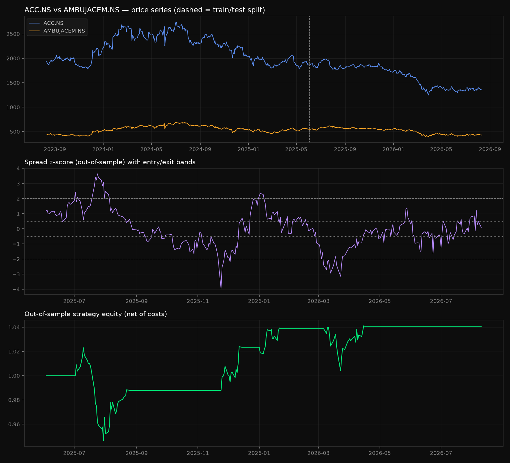

---

### ULTRACEMCO.NS / SHREECEM.NS

- **Latest prices:** ULTRACEMCO.NS ₹12,038.00 · SHREECEM.NS ₹26,100.00
- **Hedge ratio (train-fitted):** 0.6577
- **Cointegration (train):** FAIL at 5% — ADF -2.52, p=0.1102
- **Persistence:** passed 5% in 0 of 28 real-data runs (strict tier: 0/28)
- **Spread half-life:** 33.8 days
- **Current z-score:** +0.05
- **Signal today:** flat / no stretch
- ⚠️ _Pair did not cointegrate on training data. Any signal here is not statistically justified — observation only._

**Out-of-sample backtest** (beta frozen from train window):

| Metric | Value |
|---|---|
| Sharpe | 0.47 |
| Sortino | 0.51 |
| Annualised return | 3.68% |
| Annualised vol | 8.52% |
| Max drawdown | -9.38% |
| Round-trip trades | 6 |

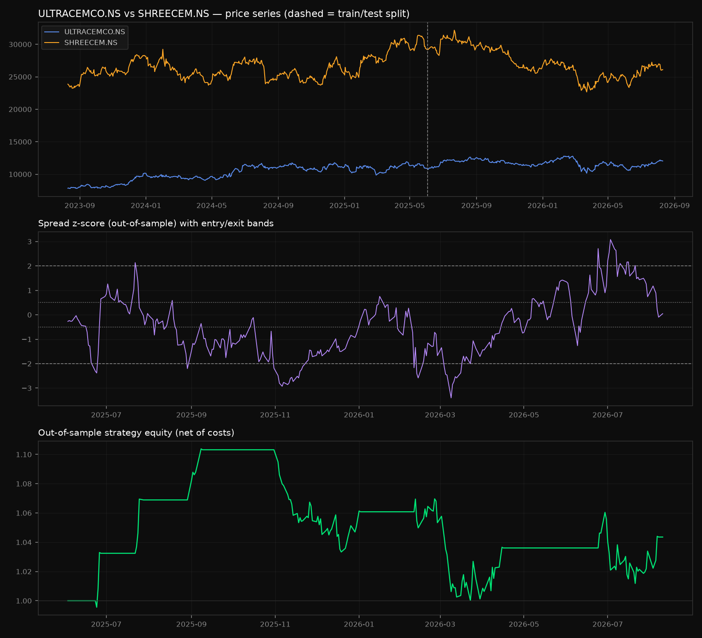

---

### IOC.NS / BPCL.NS

- **Latest prices:** IOC.NS ₹142.00 · BPCL.NS ₹318.50
- **Hedge ratio (train-fitted):** 1.7648
- **Cointegration (train):** FAIL at 5% — ADF -0.97, p=0.7639
- **Persistence:** passed 5% in 0 of 28 real-data runs (strict tier: 0/28)
- **Spread half-life:** 112.6 days
- **Current z-score:** +1.14
- **Signal today:** watch (approaching band)
- ⚠️ _Pair did not cointegrate on training data. Any signal here is not statistically justified — observation only._

**Out-of-sample backtest** (beta frozen from train window):

| Metric | Value |
|---|---|
| Sharpe | 0.64 |
| Sortino | 0.71 |
| Annualised return | 4.21% |
| Annualised vol | 6.82% |
| Max drawdown | -6.84% |
| Round-trip trades | 7 |

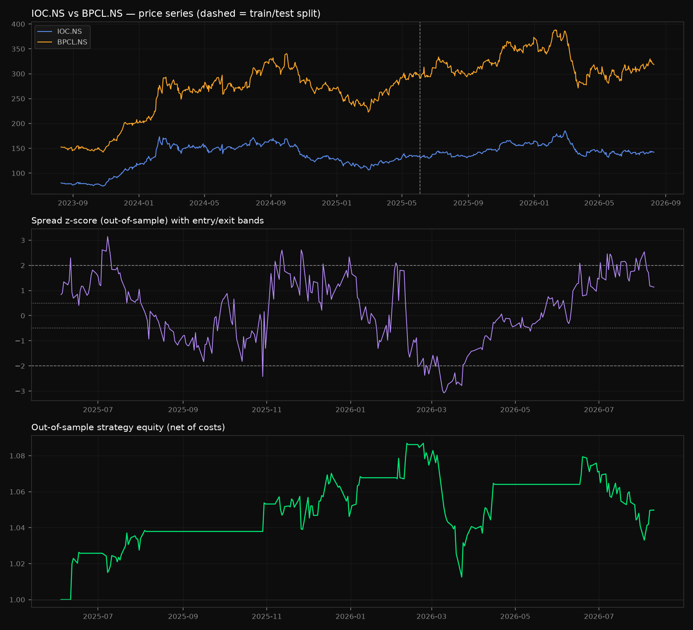

---

### BPCL.NS / HINDPETRO.NS

- **Latest prices:** BPCL.NS ₹318.50 · HINDPETRO.NS ₹393.15
- **Hedge ratio (train-fitted):** 1.4285
- **Cointegration (train):** FAIL at 5% — ADF -1.88, p=0.3411
- **Persistence:** passed 5% in 0 of 28 real-data runs (strict tier: 0/28)
- **Spread half-life:** 41.8 days
- **Current z-score:** -1.36
- **Signal today:** watch (approaching band)
- ⚠️ _Pair did not cointegrate on training data. Any signal here is not statistically justified — observation only._

**Out-of-sample backtest** (beta frozen from train window):

| Metric | Value |
|---|---|
| Sharpe | -0.15 |
| Sortino | -0.13 |
| Annualised return | -1.05% |
| Annualised vol | 5.96% |
| Max drawdown | -6.96% |
| Round-trip trades | 4 |

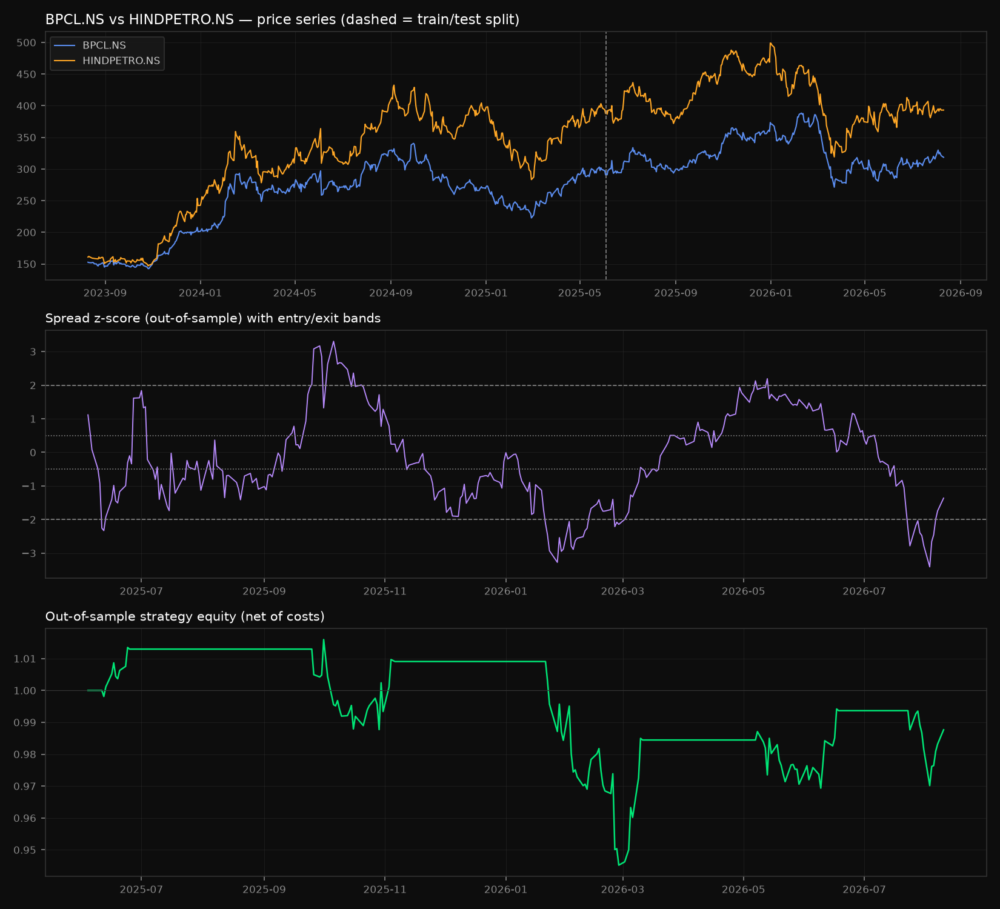

---

### ONGC.NS / COALINDIA.NS

- **Latest prices:** ONGC.NS ₹239.84 · COALINDIA.NS ₹411.00
- **Hedge ratio (train-fitted):** 1.6202
- **Cointegration (train):** PASS at 5% — ADF -3.32, p=0.0140
- **Persistence:** passed 5% in 20 of 28 real-data runs (strict tier: 0/28)
- **Spread half-life:** 14.0 days
- **Current z-score:** -0.22
- **Signal today:** flat / no stretch

**Out-of-sample backtest** (beta frozen from train window):

| Metric | Value |
|---|---|
| Sharpe | 0.75 |
| Sortino | 0.59 |
| Annualised return | 5.41% |
| Annualised vol | 7.43% |
| Max drawdown | -5.78% |
| Round-trip trades | 5 |

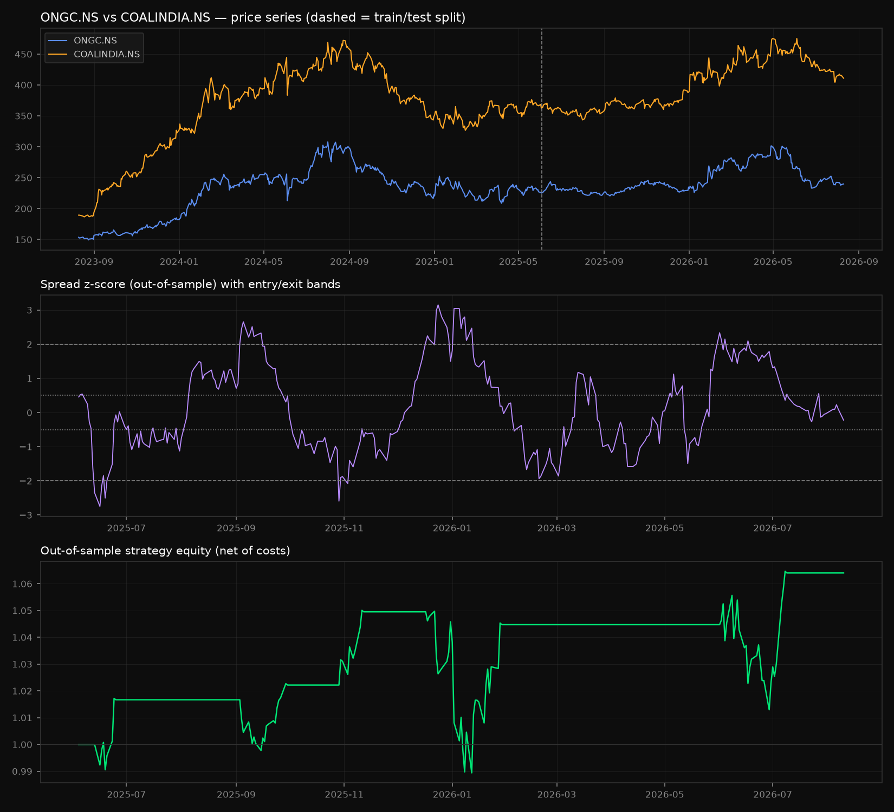

---

### NTPC.NS / POWERGRID.NS

- **Latest prices:** NTPC.NS ₹340.45 · POWERGRID.NS ₹270.10
- **Hedge ratio (train-fitted):** 0.8353
- **Cointegration (train):** FAIL at 5% — ADF -2.56, p=0.1019
- **Persistence:** passed 5% in 0 of 28 real-data runs (strict tier: 0/28)
- **Spread half-life:** 23.1 days
- **Current z-score:** -0.15
- **Signal today:** flat / no stretch
- ⚠️ _Pair did not cointegrate on training data. Any signal here is not statistically justified — observation only._

**Out-of-sample backtest** (beta frozen from train window):

| Metric | Value |
|---|---|
| Sharpe | 0.38 |
| Sortino | 0.29 |
| Annualised return | 2.00% |
| Annualised vol | 5.65% |
| Max drawdown | -5.38% |
| Round-trip trades | 6 |

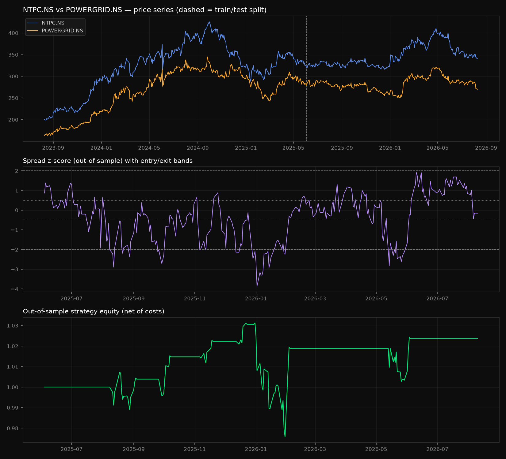

---

### BAJAJ-AUTO.NS / HEROMOTOCO.NS

- **Latest prices:** BAJAJ-AUTO.NS ₹11,677.00 · HEROMOTOCO.NS ₹5,860.00
- **Hedge ratio (train-fitted):** 0.4078
- **Cointegration (train):** FAIL at 5% — ADF -2.27, p=0.1804
- **Persistence:** passed 5% in 0 of 28 real-data runs (strict tier: 0/28)
- **Spread half-life:** 29.9 days
- **Current z-score:** +3.00
- **Signal today:** SHORT spread (short HEROMOTOCO.NS, long BAJAJ-AUTO.NS)
- ⚠️ _Pair did not cointegrate on training data. Any signal here is not statistically justified — observation only._

**Out-of-sample backtest** (beta frozen from train window):

| Metric | Value |
|---|---|
| Sharpe | -1.25 |
| Sortino | -1.23 |
| Annualised return | -12.69% |
| Annualised vol | 10.39% |
| Max drawdown | -21.15% |
| Round-trip trades | 4 |

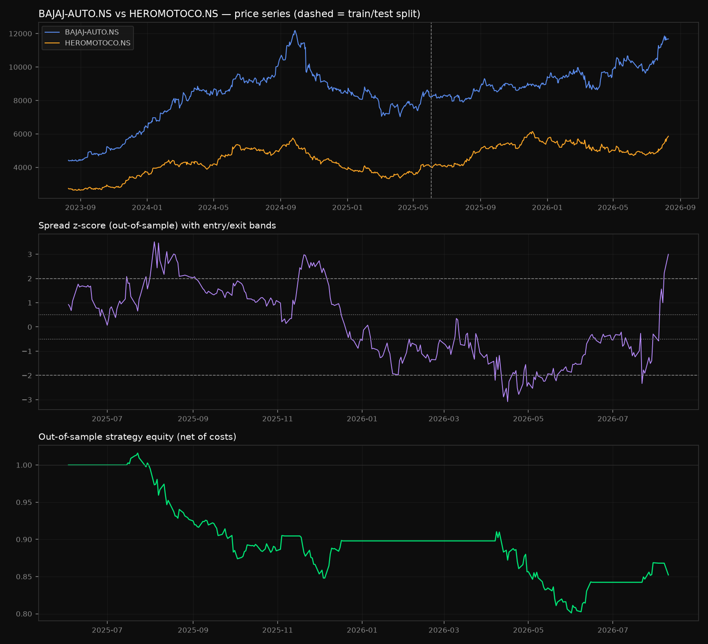

---

### TATASTEEL.NS / JSWSTEEL.NS

- **Latest prices:** TATASTEEL.NS ₹190.24 · JSWSTEEL.NS ₹1,302.00
- **Hedge ratio (train-fitted):** 3.0690
- **Cointegration (train):** FAIL at 5% — ADF -1.22, p=0.6667
- **Persistence:** passed 5% in 0 of 28 real-data runs (strict tier: 0/28)
- **Spread half-life:** 68.8 days
- **Current z-score:** +2.06
- **Signal today:** SHORT spread (short JSWSTEEL.NS, long TATASTEEL.NS)
- ⚠️ _Pair did not cointegrate on training data. Any signal here is not statistically justified — observation only._

**Out-of-sample backtest** (beta frozen from train window):

| Metric | Value |
|---|---|
| Sharpe | 0.03 |
| Sortino | 0.03 |
| Annualised return | -0.07% |
| Annualised vol | 7.85% |
| Max drawdown | -4.41% |
| Round-trip trades | 4 |

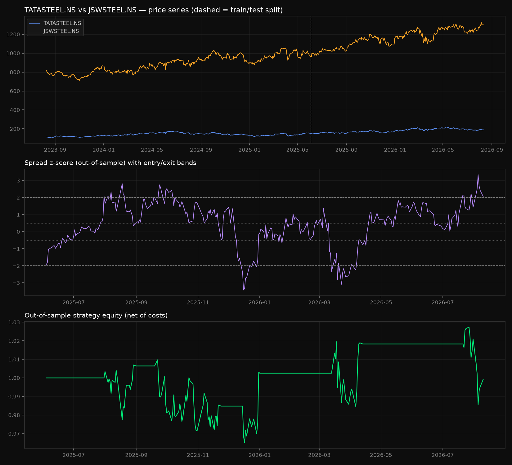

---

### SUNPHARMA.NS / CIPLA.NS

- **Latest prices:** SUNPHARMA.NS ₹1,944.40 · CIPLA.NS ₹1,467.70
- **Hedge ratio (train-fitted):** 0.4870
- **Cointegration (train):** PASS at 5% — ADF -3.41, p=0.0107
- **Persistence:** passed 5% in 28 of 28 real-data runs (strict tier: 5/28)
- **Spread half-life:** 10.7 days
- **Current z-score:** +0.67
- **Signal today:** watch (approaching band)

**Out-of-sample backtest** (beta frozen from train window):

| Metric | Value |
|---|---|
| Sharpe | -0.10 |
| Sortino | -0.11 |
| Annualised return | -1.11% |
| Annualised vol | 7.82% |
| Max drawdown | -10.47% |
| Round-trip trades | 5 |

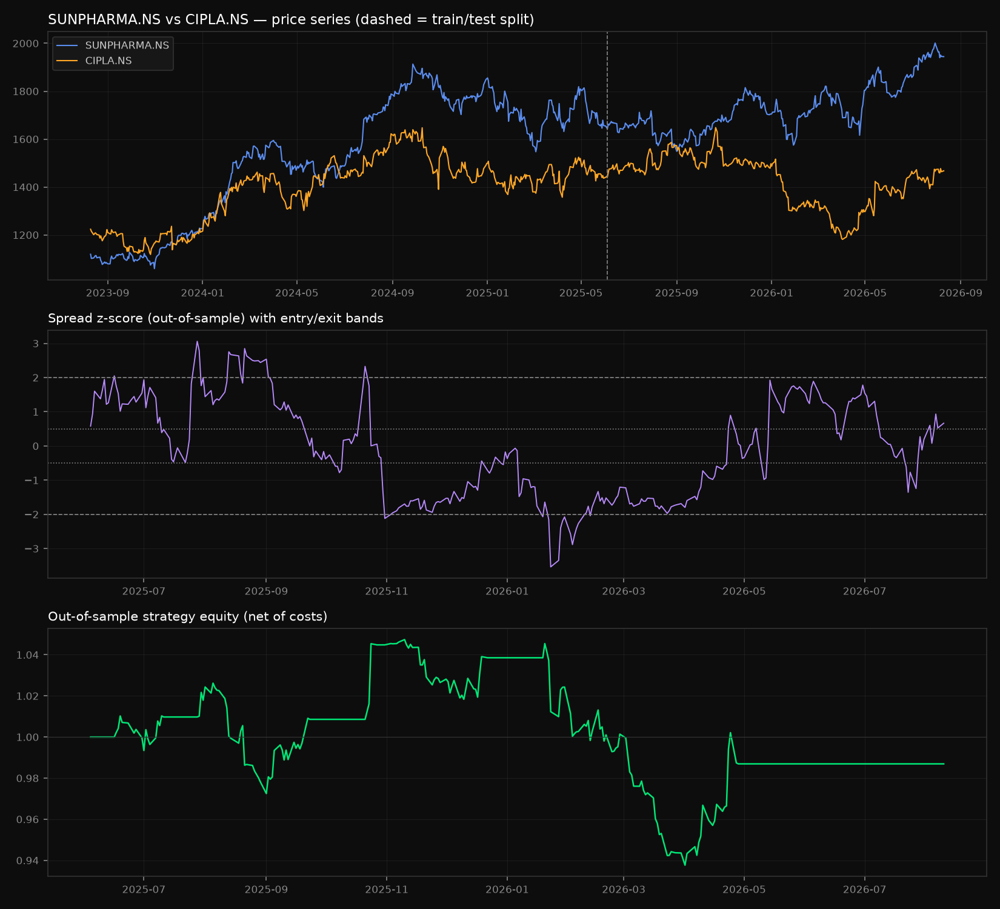

---

_Generated 2026-08-10 · pairs mean-reversion scanner · out-of-sample backtest · multiple-testing-aware · not investment advice._
