# Indian Pairs-Trading Scanner — 2026-08-11

> **What this is:** a market-neutral *pairs mean-reversion* scanner. It flags when two related NSE stocks have drifted apart far enough that their historical relationship signals a possible convergence trade. It does **not** forecast growth, rank "best" stocks, or predict company performance. A signal means the *spread between two stocks* is stretched — nothing about either stock being a good investment. Not investment advice; do your own research.

## Methodology (fixed in advance)

- **Universe:** 16 declared sector-mate pairs. Parameters (3y window, 60/40 train-test, z-entry 2.0, z-exit 0.5, 5 bps costs) are pre-registered; changes are logged in the README changelog *before* looking at results.
- **Multiple testing:** at the 5% level across 16 pairs, **≈0.8 false positives per run are expected by chance alone** even if nothing truly cointegrates. A single-day pass is a candidate, not a discovery.
- **Strict tier:** Bonferroni-corrected threshold p < 0.0031 (marked ✓✓).
- **Evidence = persistence:** the Persistence column counts how often each pair has passed the 5% test across all *real-data* daily runs recorded in `reports/history.csv`. Pairs deserve attention only when they pass persistently.

## Summary

| Pair | p-value | Coint. | Persistence | Current z | Signal | OOS Sharpe |
|---|---|---|---|---|---|---|
| HDFCBANK.NS/ICICIBANK.NS | 0.0753 | ✗ | 0/23 | +1.79 | watch | -0.58 |
| AXISBANK.NS/ICICIBANK.NS | 0.9235 | ✗ | 0/29 | +1.48 | watch | -0.37 |
| KOTAKBANK.NS/HDFCBANK.NS | 0.1900 | ✗ | 0/29 | -1.25 | watch | 1.00 |
| SBIN.NS/BANKBARODA.NS | 0.1460 | ✗ | 0/29 | -1.41 | watch | 0.25 |
| TCS.NS/INFY.NS | 0.5282 | ✗ | 0/29 | -0.80 | watch | 1.37 |
| INFY.NS/WIPRO.NS | 0.1841 | ✗ | 0/29 | -1.24 | watch | 1.67 |
| HCLTECH.NS/TECHM.NS | 0.1960 | ✗ | 0/29 | +0.36 | flat / no stretch | -0.02 |
| ACC.NS/AMBUJACEM.NS | 0.7829 | ✗ | 0/29 | -0.49 | flat / no stretch | 0.54 |
| ULTRACEMCO.NS/SHREECEM.NS | 0.1213 | ✗ | 0/29 | -0.50 | flat / no stretch | 0.50 |
| IOC.NS/BPCL.NS | 0.7855 | ✗ | 0/29 | +1.44 | watch | 0.57 |
| BPCL.NS/HINDPETRO.NS | 0.3543 | ✗ | 0/29 | -1.42 | watch | -0.17 |
| ONGC.NS/COALINDIA.NS | 0.0117 | ✓ | 21/29 | -0.17 | flat / no stretch | 0.74 |
| NTPC.NS/POWERGRID.NS | 0.1015 | ✗ | 0/29 | -0.23 | flat / no stretch | 0.38 |
| BAJAJ-AUTO.NS/HEROMOTOCO.NS | 0.1873 | ✗ | 0/29 | +2.73 | SHORT spread | -1.24 |
| TATASTEEL.NS/JSWSTEEL.NS | 0.6585 | ✗ | 0/29 | +1.49 | watch | 0.12 |
| SUNPHARMA.NS/CIPLA.NS | 0.0113 | ✓ | 29/29 | +0.51 | watch | -0.10 |

_Legend: ✓✓ passes strict Bonferroni tier · ✓ passes 5% only · ✗ fails. Persistence = 5%-passes / real-data runs recorded. \*no real-data history yet._

---

### HDFCBANK.NS / ICICIBANK.NS

- **Latest prices:** HDFCBANK.NS ₹729.00 · ICICIBANK.NS ₹1,429.60
- **Hedge ratio (train-fitted):** 1.7764
- **Cointegration (train):** FAIL at 5% — ADF -2.69, p=0.0753
- **Persistence:** passed 5% in 0 of 23 real-data runs (strict tier: 0/23)
- **Spread half-life:** 26.7 days
- **Current z-score:** +1.79
- **Signal today:** watch (approaching band)
- ⚠️ _Pair did not cointegrate on training data. Any signal here is not statistically justified — observation only._

**Out-of-sample backtest** (beta frozen from train window):

| Metric | Value |
|---|---|
| Sharpe | -0.58 |
| Sortino | -0.60 |
| Annualised return | -3.69% |
| Annualised vol | 6.13% |
| Max drawdown | -8.70% |
| Round-trip trades | 5 |

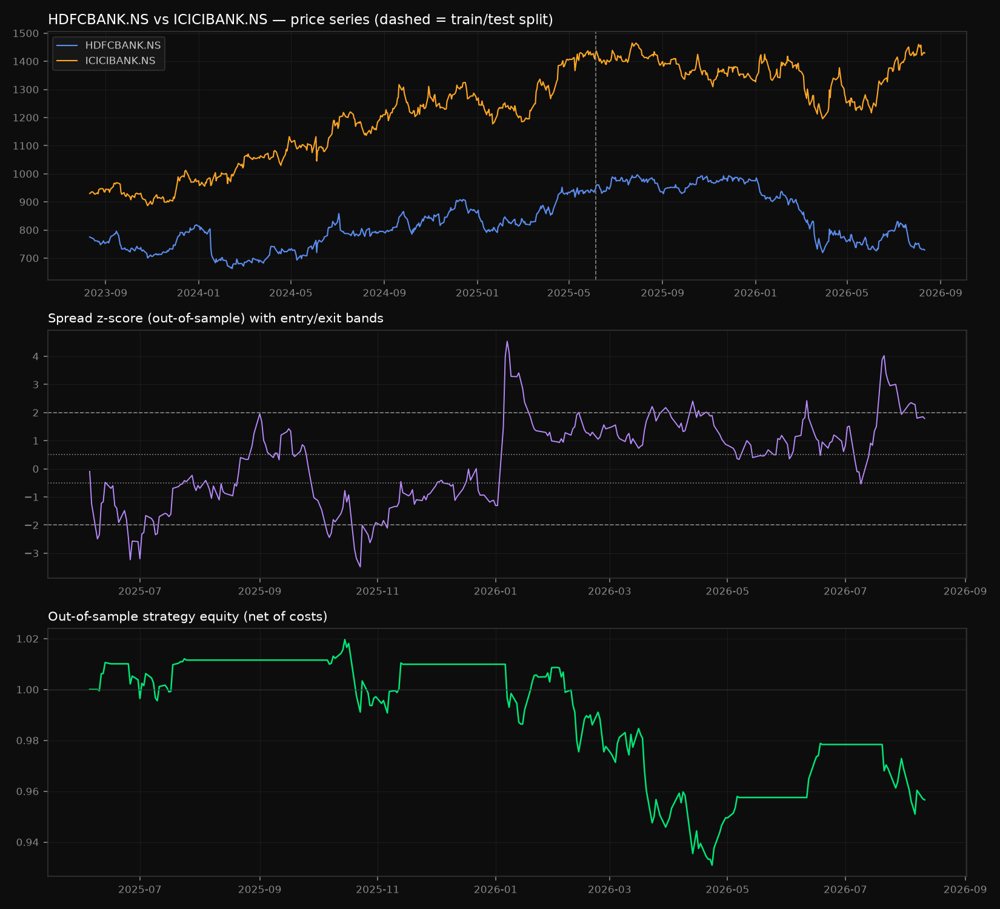

---

### AXISBANK.NS / ICICIBANK.NS

- **Latest prices:** AXISBANK.NS ₹1,229.80 · ICICIBANK.NS ₹1,429.60
- **Hedge ratio (train-fitted):** 0.9501
- **Cointegration (train):** FAIL at 5% — ADF -0.31, p=0.9235
- **Persistence:** passed 5% in 0 of 29 real-data runs (strict tier: 0/29)
- **Spread half-life:** 274.3 days
- **Current z-score:** +1.48
- **Signal today:** watch (approaching band)
- ⚠️ _Pair did not cointegrate on training data. Any signal here is not statistically justified — observation only._

**Out-of-sample backtest** (beta frozen from train window):

| Metric | Value |
|---|---|
| Sharpe | -0.37 |
| Sortino | -0.38 |
| Annualised return | -3.60% |
| Annualised vol | 8.85% |
| Max drawdown | -8.14% |
| Round-trip trades | 6 |

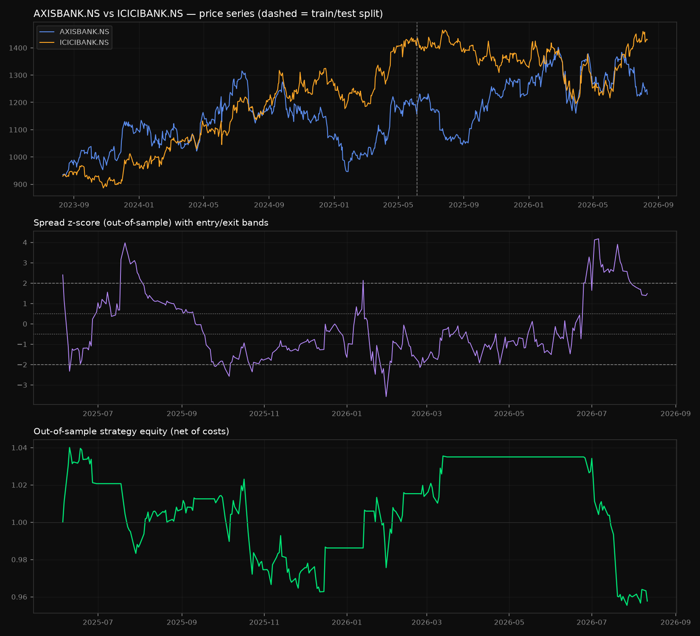

---

### KOTAKBANK.NS / HDFCBANK.NS

- **Latest prices:** KOTAKBANK.NS ₹392.90 · HDFCBANK.NS ₹729.00
- **Hedge ratio (train-fitted):** 1.9744
- **Cointegration (train):** FAIL at 5% — ADF -2.25, p=0.1900
- **Persistence:** passed 5% in 0 of 29 real-data runs (strict tier: 0/29)
- **Spread half-life:** 28.5 days
- **Current z-score:** -1.25
- **Signal today:** watch (approaching band)
- ⚠️ _Pair did not cointegrate on training data. Any signal here is not statistically justified — observation only._

**Out-of-sample backtest** (beta frozen from train window):

| Metric | Value |
|---|---|
| Sharpe | 1.00 |
| Sortino | 0.71 |
| Annualised return | 6.25% |
| Annualised vol | 6.29% |
| Max drawdown | -4.34% |
| Round-trip trades | 6 |

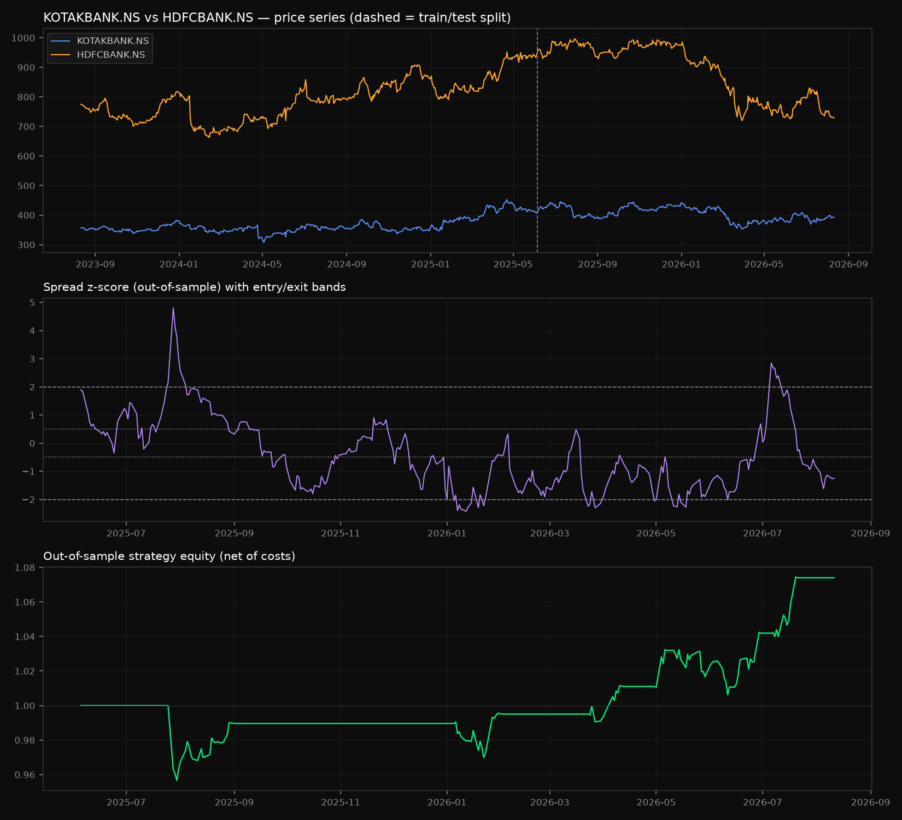

---

### SBIN.NS / BANKBARODA.NS

- **Latest prices:** SBIN.NS ₹1,066.00 · BANKBARODA.NS ₹246.20
- **Hedge ratio (train-fitted):** 0.2020
- **Cointegration (train):** FAIL at 5% — ADF -2.38, p=0.1460
- **Persistence:** passed 5% in 0 of 29 real-data runs (strict tier: 0/29)
- **Spread half-life:** 22.0 days
- **Current z-score:** -1.41
- **Signal today:** watch (approaching band)
- ⚠️ _Pair did not cointegrate on training data. Any signal here is not statistically justified — observation only._

**Out-of-sample backtest** (beta frozen from train window):

| Metric | Value |
|---|---|
| Sharpe | 0.25 |
| Sortino | 0.19 |
| Annualised return | 1.82% |
| Annualised vol | 8.70% |
| Max drawdown | -8.89% |
| Round-trip trades | 5 |

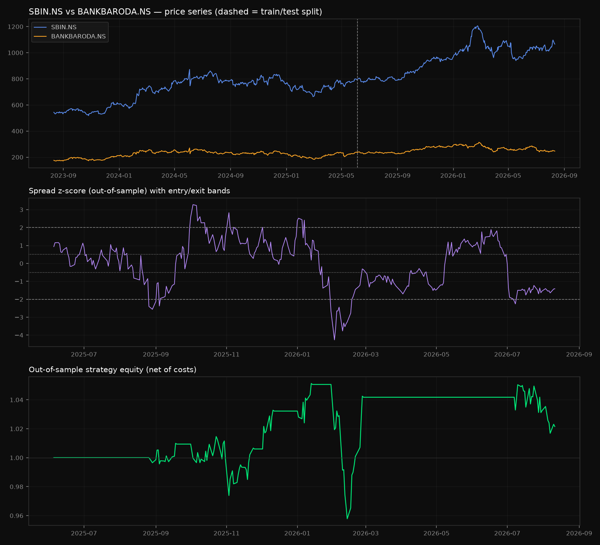

---

### TCS.NS / INFY.NS

- **Latest prices:** TCS.NS ₹2,445.70 · INFY.NS ₹1,190.70
- **Hedge ratio (train-fitted):** 0.5143
- **Cointegration (train):** FAIL at 5% — ADF -1.51, p=0.5282
- **Persistence:** passed 5% in 0 of 29 real-data runs (strict tier: 0/29)
- **Spread half-life:** 48.7 days
- **Current z-score:** -0.80
- **Signal today:** watch (approaching band)
- ⚠️ _Pair did not cointegrate on training data. Any signal here is not statistically justified — observation only._

**Out-of-sample backtest** (beta frozen from train window):

| Metric | Value |
|---|---|
| Sharpe | 1.37 |
| Sortino | 1.41 |
| Annualised return | 6.72% |
| Annualised vol | 4.85% |
| Max drawdown | -4.23% |
| Round-trip trades | 7 |

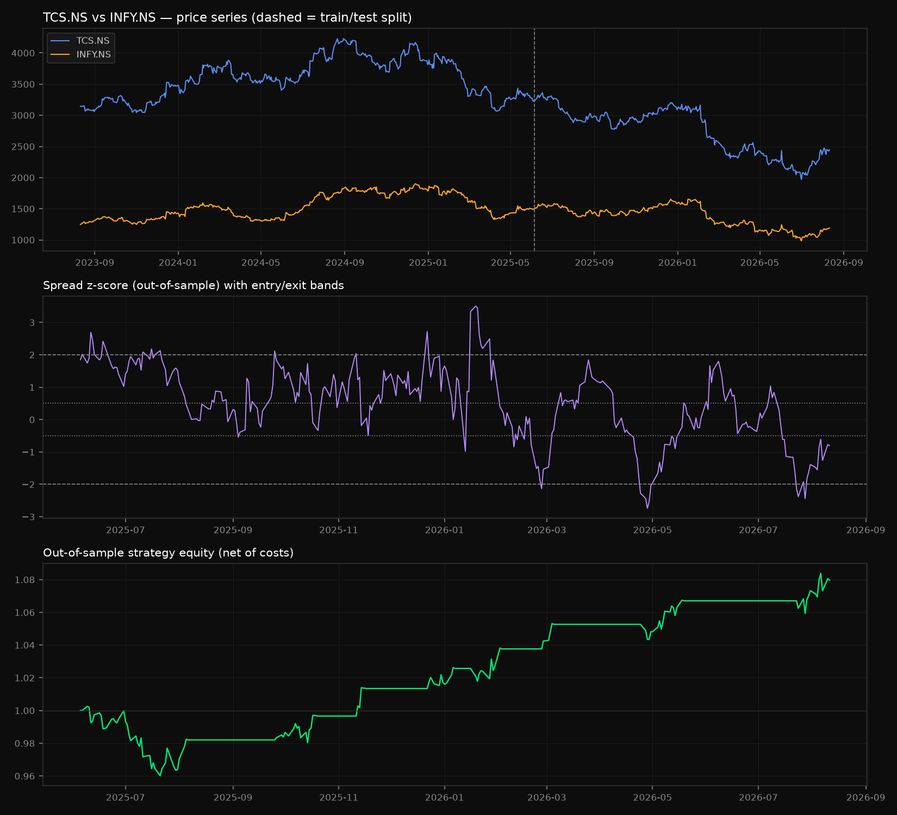

---

### INFY.NS / WIPRO.NS

- **Latest prices:** INFY.NS ₹1,190.70 · WIPRO.NS ₹184.60
- **Hedge ratio (train-fitted):** 0.1367
- **Cointegration (train):** FAIL at 5% — ADF -2.26, p=0.1841
- **Persistence:** passed 5% in 0 of 29 real-data runs (strict tier: 0/29)
- **Spread half-life:** 30.1 days
- **Current z-score:** -1.24
- **Signal today:** watch (approaching band)
- ⚠️ _Pair did not cointegrate on training data. Any signal here is not statistically justified — observation only._

**Out-of-sample backtest** (beta frozen from train window):

| Metric | Value |
|---|---|
| Sharpe | 1.67 |
| Sortino | 1.95 |
| Annualised return | 9.03% |
| Annualised vol | 5.26% |
| Max drawdown | -2.48% |
| Round-trip trades | 6 |

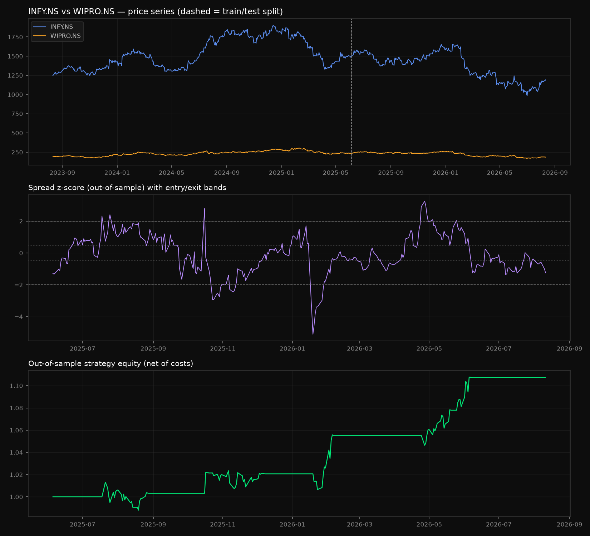

---

### HCLTECH.NS / TECHM.NS

- **Latest prices:** HCLTECH.NS ₹1,365.40 · TECHM.NS ₹1,643.00
- **Hedge ratio (train-fitted):** 0.8375
- **Cointegration (train):** FAIL at 5% — ADF -2.23, p=0.1960
- **Persistence:** passed 5% in 0 of 29 real-data runs (strict tier: 0/29)
- **Spread half-life:** 24.5 days
- **Current z-score:** +0.36
- **Signal today:** flat / no stretch
- ⚠️ _Pair did not cointegrate on training data. Any signal here is not statistically justified — observation only._

**Out-of-sample backtest** (beta frozen from train window):

| Metric | Value |
|---|---|
| Sharpe | -0.02 |
| Sortino | -0.02 |
| Annualised return | -0.47% |
| Annualised vol | 7.75% |
| Max drawdown | -8.36% |
| Round-trip trades | 5 |

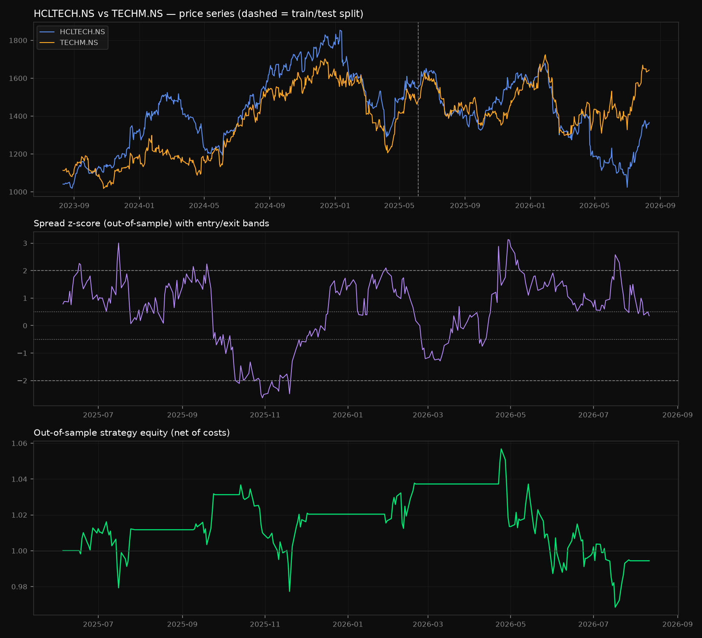

---

### ACC.NS / AMBUJACEM.NS

- **Latest prices:** ACC.NS ₹1,339.80 · AMBUJACEM.NS ₹424.00
- **Hedge ratio (train-fitted):** 0.2248
- **Cointegration (train):** FAIL at 5% — ADF -0.92, p=0.7829
- **Persistence:** passed 5% in 0 of 29 real-data runs (strict tier: 0/29)
- **Spread half-life:** 87.4 days
- **Current z-score:** -0.49
- **Signal today:** flat / no stretch
- ⚠️ _Pair did not cointegrate on training data. Any signal here is not statistically justified — observation only._

**Out-of-sample backtest** (beta frozen from train window):

| Metric | Value |
|---|---|
| Sharpe | 0.54 |
| Sortino | 0.48 |
| Annualised return | 3.18% |
| Annualised vol | 6.10% |
| Max drawdown | -7.50% |
| Round-trip trades | 4 |

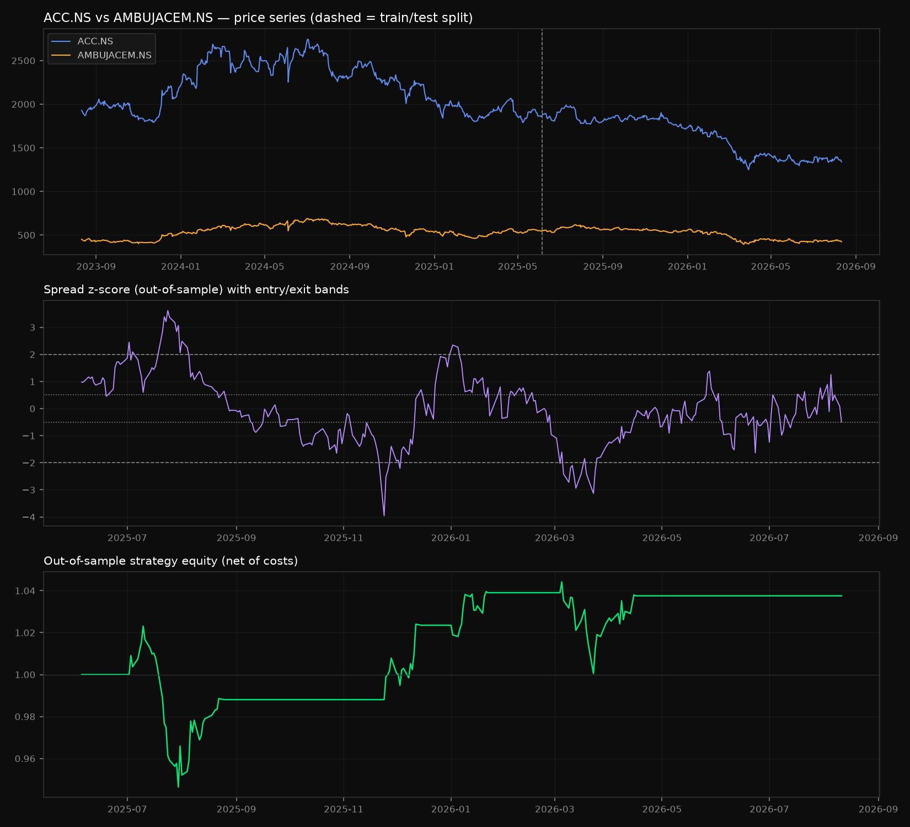

---

### ULTRACEMCO.NS / SHREECEM.NS

- **Latest prices:** ULTRACEMCO.NS ₹11,780.00 · SHREECEM.NS ₹25,510.00
- **Hedge ratio (train-fitted):** 0.6586
- **Cointegration (train):** FAIL at 5% — ADF -2.48, p=0.1213
- **Persistence:** passed 5% in 0 of 29 real-data runs (strict tier: 0/29)
- **Spread half-life:** 34.3 days
- **Current z-score:** -0.50
- **Signal today:** flat / no stretch
- ⚠️ _Pair did not cointegrate on training data. Any signal here is not statistically justified — observation only._

**Out-of-sample backtest** (beta frozen from train window):

| Metric | Value |
|---|---|
| Sharpe | 0.50 |
| Sortino | 0.54 |
| Annualised return | 3.86% |
| Annualised vol | 8.34% |
| Max drawdown | -9.32% |
| Round-trip trades | 6 |

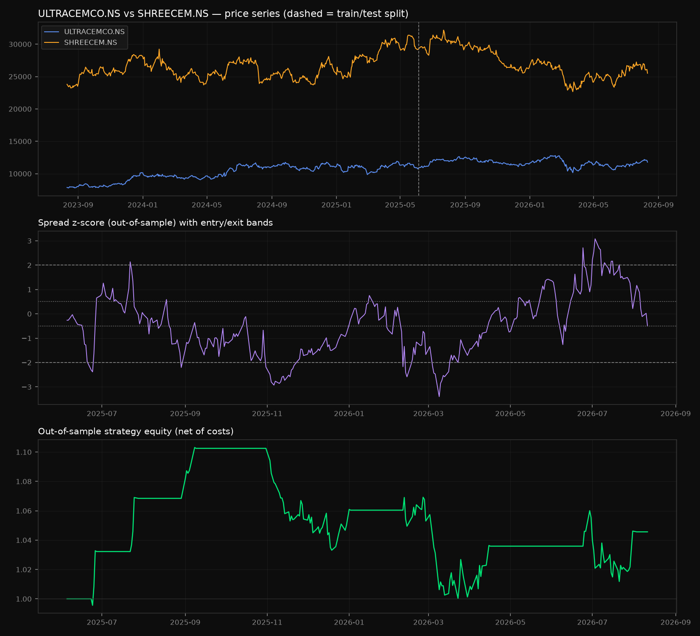

---

### IOC.NS / BPCL.NS

- **Latest prices:** IOC.NS ₹140.00 · BPCL.NS ₹317.80
- **Hedge ratio (train-fitted):** 1.7634
- **Cointegration (train):** FAIL at 5% — ADF -0.91, p=0.7855
- **Persistence:** passed 5% in 0 of 29 real-data runs (strict tier: 0/29)
- **Spread half-life:** 120.6 days
- **Current z-score:** +1.44
- **Signal today:** watch (approaching band)
- ⚠️ _Pair did not cointegrate on training data. Any signal here is not statistically justified — observation only._

**Out-of-sample backtest** (beta frozen from train window):

| Metric | Value |
|---|---|
| Sharpe | 0.57 |
| Sortino | 0.64 |
| Annualised return | 3.76% |
| Annualised vol | 6.90% |
| Max drawdown | -6.91% |
| Round-trip trades | 7 |

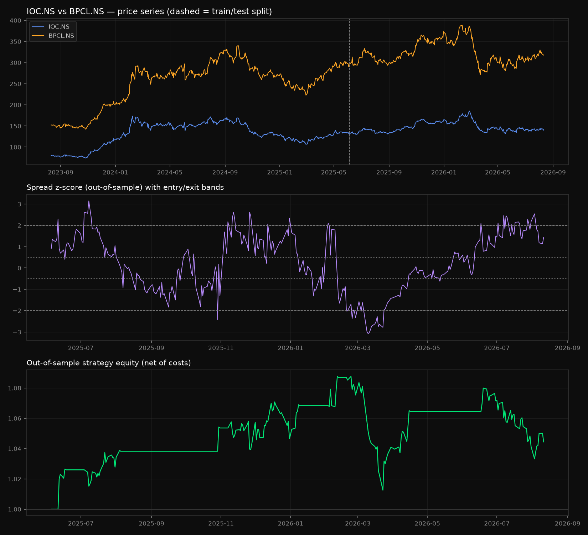

---

### BPCL.NS / HINDPETRO.NS

- **Latest prices:** BPCL.NS ₹317.80 · HINDPETRO.NS ₹390.85
- **Hedge ratio (train-fitted):** 1.4286
- **Cointegration (train):** FAIL at 5% — ADF -1.85, p=0.3543
- **Persistence:** passed 5% in 0 of 29 real-data runs (strict tier: 0/29)
- **Spread half-life:** 42.5 days
- **Current z-score:** -1.42
- **Signal today:** watch (approaching band)
- ⚠️ _Pair did not cointegrate on training data. Any signal here is not statistically justified — observation only._

**Out-of-sample backtest** (beta frozen from train window):

| Metric | Value |
|---|---|
| Sharpe | -0.17 |
| Sortino | -0.15 |
| Annualised return | -1.20% |
| Annualised vol | 6.02% |
| Max drawdown | -7.03% |
| Round-trip trades | 4 |

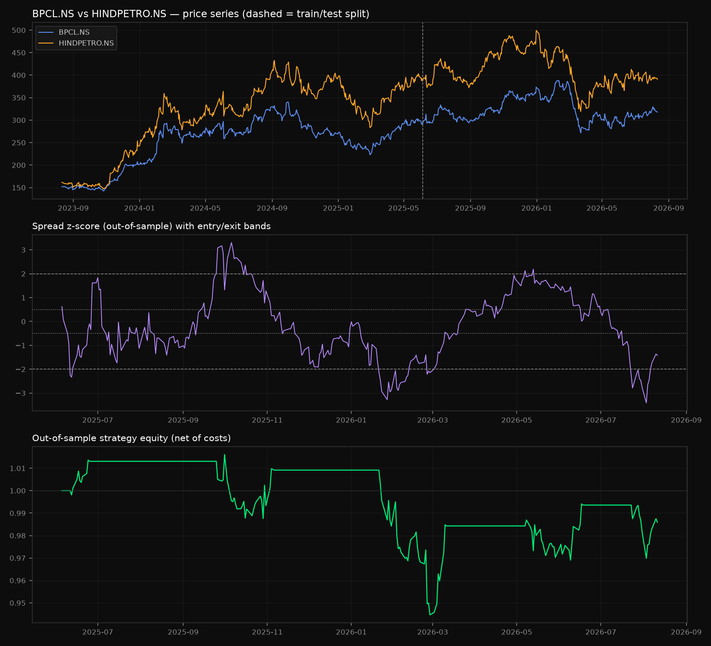

---

### ONGC.NS / COALINDIA.NS

- **Latest prices:** ONGC.NS ₹239.45 · COALINDIA.NS ₹412.60
- **Hedge ratio (train-fitted):** 1.6147
- **Cointegration (train):** PASS at 5% — ADF -3.38, p=0.0117
- **Persistence:** passed 5% in 21 of 29 real-data runs (strict tier: 0/29)
- **Spread half-life:** 14.0 days
- **Current z-score:** -0.17
- **Signal today:** flat / no stretch

**Out-of-sample backtest** (beta frozen from train window):

| Metric | Value |
|---|---|
| Sharpe | 0.74 |
| Sortino | 0.59 |
| Annualised return | 5.40% |
| Annualised vol | 7.43% |
| Max drawdown | -5.79% |
| Round-trip trades | 5 |

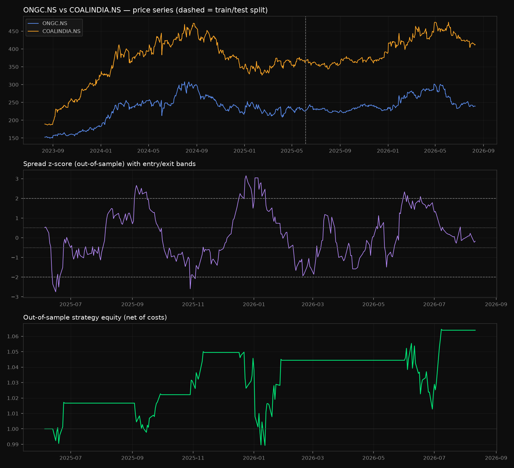

---

### NTPC.NS / POWERGRID.NS

- **Latest prices:** NTPC.NS ₹338.45 · POWERGRID.NS ₹267.95
- **Hedge ratio (train-fitted):** 0.8352
- **Cointegration (train):** FAIL at 5% — ADF -2.56, p=0.1015
- **Persistence:** passed 5% in 0 of 29 real-data runs (strict tier: 0/29)
- **Spread half-life:** 23.1 days
- **Current z-score:** -0.23
- **Signal today:** flat / no stretch
- ⚠️ _Pair did not cointegrate on training data. Any signal here is not statistically justified — observation only._

**Out-of-sample backtest** (beta frozen from train window):

| Metric | Value |
|---|---|
| Sharpe | 0.38 |
| Sortino | 0.29 |
| Annualised return | 1.98% |
| Annualised vol | 5.60% |
| Max drawdown | -5.33% |
| Round-trip trades | 6 |

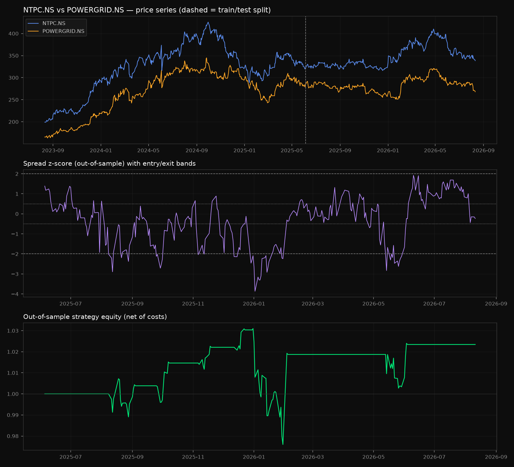

---

### BAJAJ-AUTO.NS / HEROMOTOCO.NS

- **Latest prices:** BAJAJ-AUTO.NS ₹11,717.00 · HEROMOTOCO.NS ₹5,865.50
- **Hedge ratio (train-fitted):** 0.4080
- **Cointegration (train):** FAIL at 5% — ADF -2.25, p=0.1873
- **Persistence:** passed 5% in 0 of 29 real-data runs (strict tier: 0/29)
- **Spread half-life:** 30.2 days
- **Current z-score:** +2.73
- **Signal today:** SHORT spread (short HEROMOTOCO.NS, long BAJAJ-AUTO.NS)
- ⚠️ _Pair did not cointegrate on training data. Any signal here is not statistically justified — observation only._

**Out-of-sample backtest** (beta frozen from train window):

| Metric | Value |
|---|---|
| Sharpe | -1.24 |
| Sortino | -1.22 |
| Annualised return | -12.63% |
| Annualised vol | 10.43% |
| Max drawdown | -21.23% |
| Round-trip trades | 4 |

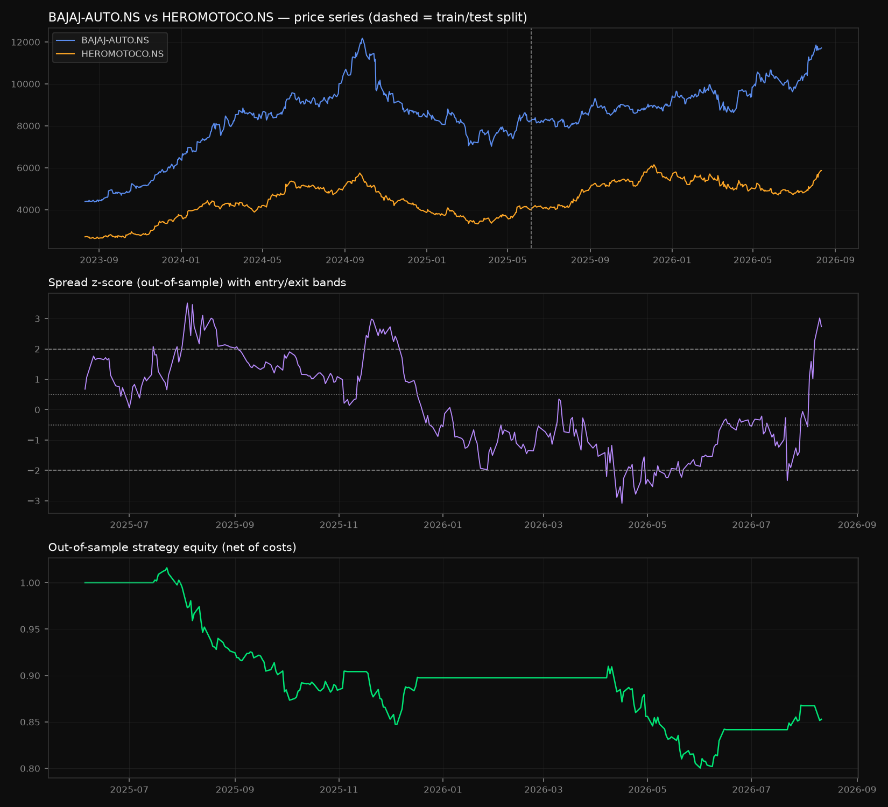

---

### TATASTEEL.NS / JSWSTEEL.NS

- **Latest prices:** TATASTEEL.NS ₹188.25 · JSWSTEEL.NS ₹1,283.40
- **Hedge ratio (train-fitted):** 3.0750
- **Cointegration (train):** FAIL at 5% — ADF -1.23, p=0.6585
- **Persistence:** passed 5% in 0 of 29 real-data runs (strict tier: 0/29)
- **Spread half-life:** 68.3 days
- **Current z-score:** +1.49
- **Signal today:** watch (approaching band)
- ⚠️ _Pair did not cointegrate on training data. Any signal here is not statistically justified — observation only._

**Out-of-sample backtest** (beta frozen from train window):

| Metric | Value |
|---|---|
| Sharpe | 0.12 |
| Sortino | 0.11 |
| Annualised return | 0.66% |
| Annualised vol | 7.89% |
| Max drawdown | -4.41% |
| Round-trip trades | 4 |

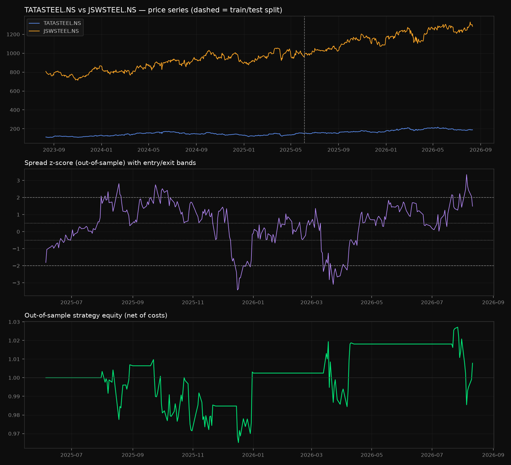

---

### SUNPHARMA.NS / CIPLA.NS

- **Latest prices:** SUNPHARMA.NS ₹1,942.00 · CIPLA.NS ₹1,463.00
- **Hedge ratio (train-fitted):** 0.4874
- **Cointegration (train):** PASS at 5% — ADF -3.39, p=0.0113
- **Persistence:** passed 5% in 29 of 29 real-data runs (strict tier: 5/29)
- **Spread half-life:** 10.7 days
- **Current z-score:** +0.51
- **Signal today:** watch (approaching band)

**Out-of-sample backtest** (beta frozen from train window):

| Metric | Value |
|---|---|
| Sharpe | -0.10 |
| Sortino | -0.11 |
| Annualised return | -1.10% |
| Annualised vol | 7.73% |
| Max drawdown | -10.36% |
| Round-trip trades | 5 |

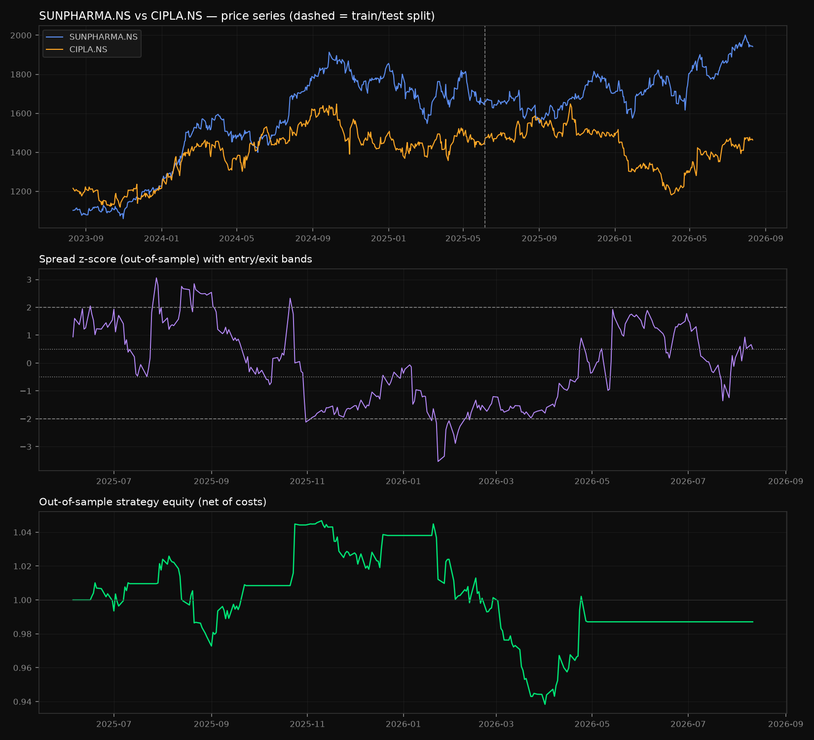

---

_Generated 2026-08-11 · pairs mean-reversion scanner · out-of-sample backtest · multiple-testing-aware · not investment advice._
