# Indian Pairs-Trading Scanner — 2026-08-12

> **What this is:** a market-neutral *pairs mean-reversion* scanner. It flags when two related NSE stocks have drifted apart far enough that their historical relationship signals a possible convergence trade. It does **not** forecast growth, rank "best" stocks, or predict company performance. A signal means the *spread between two stocks* is stretched — nothing about either stock being a good investment. Not investment advice; do your own research.

## Methodology (fixed in advance)

- **Universe:** 16 declared sector-mate pairs. Parameters (3y window, 60/40 train-test, z-entry 2.0, z-exit 0.5, 5 bps costs) are pre-registered; changes are logged in the README changelog *before* looking at results.
- **Multiple testing:** at the 5% level across 16 pairs, **≈0.8 false positives per run are expected by chance alone** even if nothing truly cointegrates. A single-day pass is a candidate, not a discovery.
- **Strict tier:** Bonferroni-corrected threshold p < 0.0031 (marked ✓✓).
- **Evidence = persistence:** the Persistence column counts how often each pair has passed the 5% test across all *real-data* daily runs recorded in `reports/history.csv`. Pairs deserve attention only when they pass persistently.

## Summary

| Pair | p-value | Coint. | Persistence | Current z | Signal | OOS Sharpe |
|---|---|---|---|---|---|---|
| HDFCBANK.NS/ICICIBANK.NS | 0.0878 | ✗ | 0/24 | +1.78 | watch | -0.59 |
| AXISBANK.NS/ICICIBANK.NS | 0.9490 | ✗ | 0/30 | +1.45 | watch | -0.43 |
| KOTAKBANK.NS/HDFCBANK.NS | 0.2004 | ✗ | 0/30 | -1.09 | watch | 0.94 |
| SBIN.NS/BANKBARODA.NS | 0.1351 | ✗ | 0/30 | -1.29 | watch | 0.29 |
| TCS.NS/INFY.NS | 0.5344 | ✗ | 0/30 | -0.07 | flat / no stretch | 1.53 |
| INFY.NS/WIPRO.NS | 0.1833 | ✗ | 0/30 | -1.03 | watch | 1.67 |
| HCLTECH.NS/TECHM.NS | 0.2130 | ✗ | 0/30 | -0.25 | flat / no stretch | -0.03 |
| ACC.NS/AMBUJACEM.NS | 0.7580 | ✗ | 0/30 | -0.76 | watch | 0.54 |
| ULTRACEMCO.NS/SHREECEM.NS | 0.1265 | ✗ | 0/30 | -0.54 | watch | 0.49 |
| IOC.NS/BPCL.NS | 0.7945 | ✗ | 0/30 | +1.17 | watch | 0.61 |
| BPCL.NS/HINDPETRO.NS | 0.3373 | ✗ | 0/30 | -1.34 | watch | -0.16 |
| ONGC.NS/COALINDIA.NS | 0.0093 | ✓ | 22/30 | -0.40 | flat / no stretch | 0.74 |
| NTPC.NS/POWERGRID.NS | 0.1185 | ✗ | 0/30 | -0.19 | flat / no stretch | 0.38 |
| BAJAJ-AUTO.NS/HEROMOTOCO.NS | 0.1896 | ✗ | 0/30 | +2.74 | SHORT spread | -1.28 |
| TATASTEEL.NS/JSWSTEEL.NS | 0.6580 | ✗ | 0/30 | +1.13 | watch | 0.18 |
| SUNPHARMA.NS/CIPLA.NS | 0.0112 | ✓ | 30/30 | +0.44 | flat / no stretch | -0.10 |

_Legend: ✓✓ passes strict Bonferroni tier · ✓ passes 5% only · ✗ fails. Persistence = 5%-passes / real-data runs recorded. \*no real-data history yet._

---

### HDFCBANK.NS / ICICIBANK.NS

- **Latest prices:** HDFCBANK.NS ₹729.00 · ICICIBANK.NS ₹1,431.70
- **Hedge ratio (train-fitted):** 1.7750
- **Cointegration (train):** FAIL at 5% — ADF -2.63, p=0.0878
- **Persistence:** passed 5% in 0 of 24 real-data runs (strict tier: 0/24)
- **Spread half-life:** 27.2 days
- **Current z-score:** +1.78
- **Signal today:** watch (approaching band)
- ⚠️ _Pair did not cointegrate on training data. Any signal here is not statistically justified — observation only._

**Out-of-sample backtest** (beta frozen from train window):

| Metric | Value |
|---|---|
| Sharpe | -0.59 |
| Sortino | -0.61 |
| Annualised return | -3.74% |
| Annualised vol | 6.13% |
| Max drawdown | -8.70% |
| Round-trip trades | 5 |

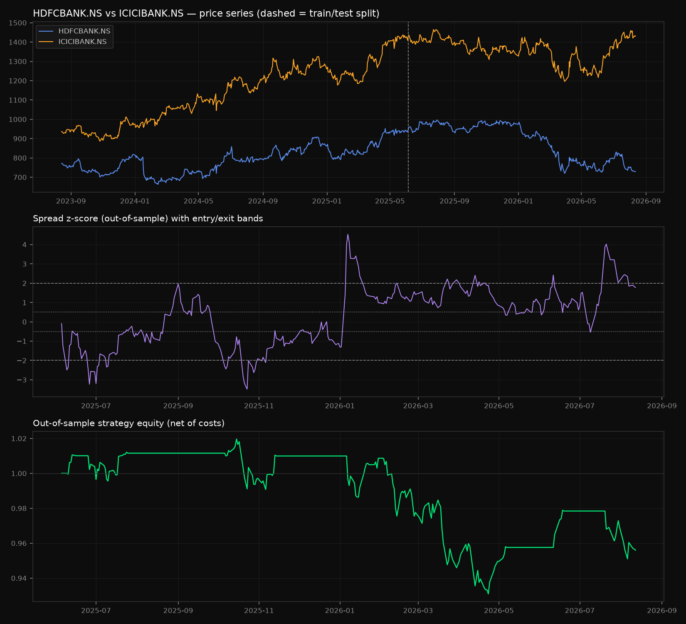

---

### AXISBANK.NS / ICICIBANK.NS

- **Latest prices:** AXISBANK.NS ₹1,230.00 · ICICIBANK.NS ₹1,431.70
- **Hedge ratio (train-fitted):** 0.9516
- **Cointegration (train):** FAIL at 5% — ADF -0.10, p=0.9490
- **Persistence:** passed 5% in 0 of 30 real-data runs (strict tier: 0/30)
- **Spread half-life:** 467.1 days
- **Current z-score:** +1.45
- **Signal today:** watch (approaching band)
- ⚠️ _Pair did not cointegrate on training data. Any signal here is not statistically justified — observation only._

**Out-of-sample backtest** (beta frozen from train window):

| Metric | Value |
|---|---|
| Sharpe | -0.43 |
| Sortino | -0.43 |
| Annualised return | -3.88% |
| Annualised vol | 8.44% |
| Max drawdown | -7.62% |
| Round-trip trades | 6 |

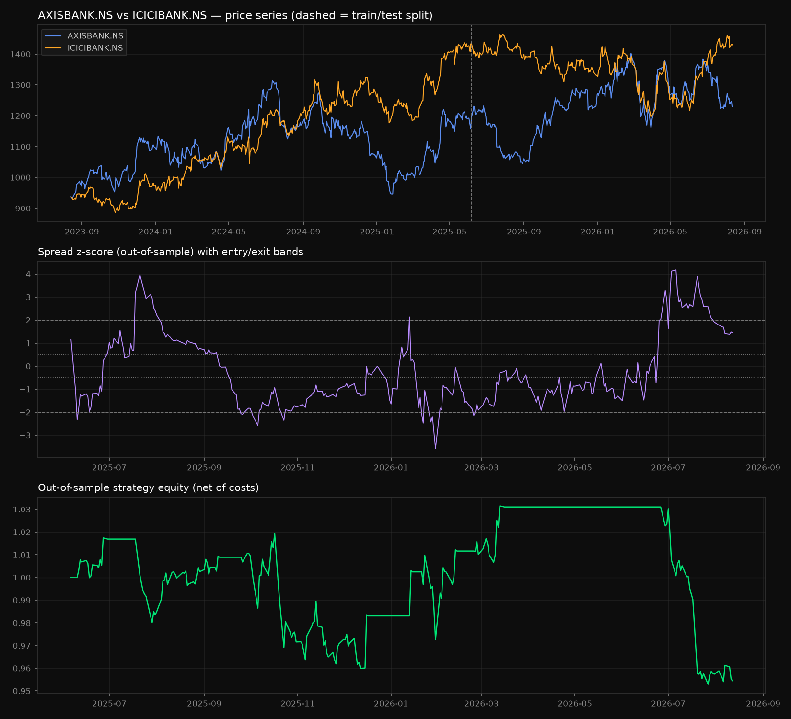

---

### KOTAKBANK.NS / HDFCBANK.NS

- **Latest prices:** KOTAKBANK.NS ₹390.50 · HDFCBANK.NS ₹729.00
- **Hedge ratio (train-fitted):** 1.9844
- **Cointegration (train):** FAIL at 5% — ADF -2.22, p=0.2004
- **Persistence:** passed 5% in 0 of 30 real-data runs (strict tier: 0/30)
- **Spread half-life:** 28.9 days
- **Current z-score:** -1.09
- **Signal today:** watch (approaching band)
- ⚠️ _Pair did not cointegrate on training data. Any signal here is not statistically justified — observation only._

**Out-of-sample backtest** (beta frozen from train window):

| Metric | Value |
|---|---|
| Sharpe | 0.94 |
| Sortino | 0.68 |
| Annualised return | 5.97% |
| Annualised vol | 6.37% |
| Max drawdown | -4.28% |
| Round-trip trades | 6 |

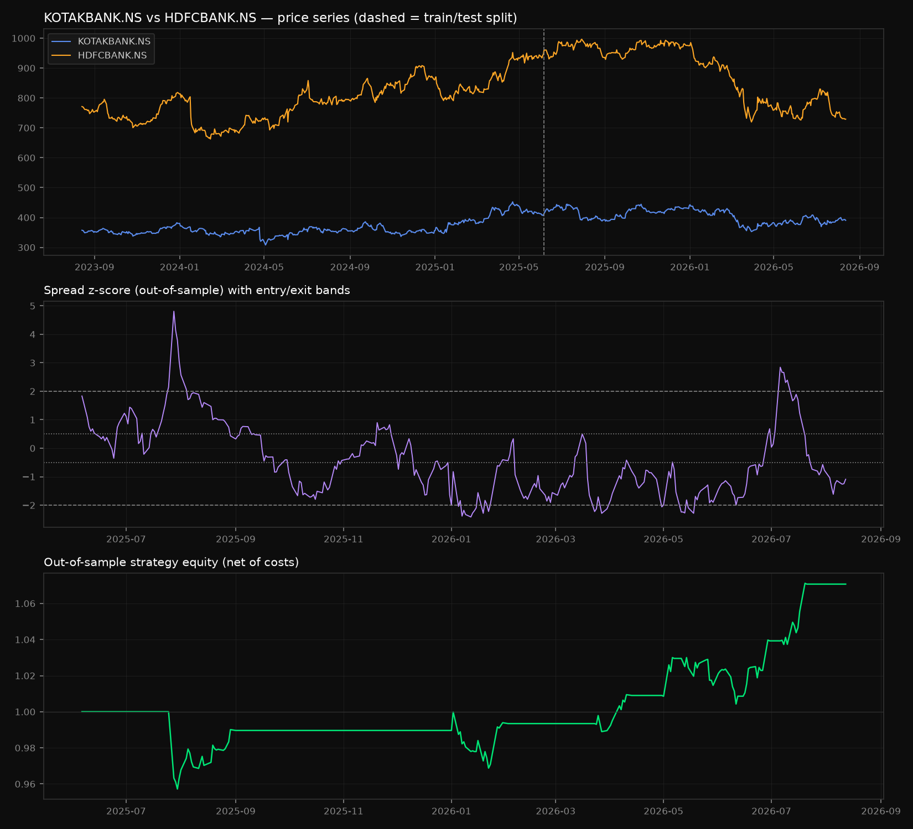

---

### SBIN.NS / BANKBARODA.NS

- **Latest prices:** SBIN.NS ₹1,082.00 · BANKBARODA.NS ₹251.00
- **Hedge ratio (train-fitted):** 0.2016
- **Cointegration (train):** FAIL at 5% — ADF -2.42, p=0.1351
- **Persistence:** passed 5% in 0 of 30 real-data runs (strict tier: 0/30)
- **Spread half-life:** 21.9 days
- **Current z-score:** -1.29
- **Signal today:** watch (approaching band)
- ⚠️ _Pair did not cointegrate on training data. Any signal here is not statistically justified — observation only._

**Out-of-sample backtest** (beta frozen from train window):

| Metric | Value |
|---|---|
| Sharpe | 0.29 |
| Sortino | 0.22 |
| Annualised return | 2.18% |
| Annualised vol | 8.72% |
| Max drawdown | -8.88% |
| Round-trip trades | 5 |

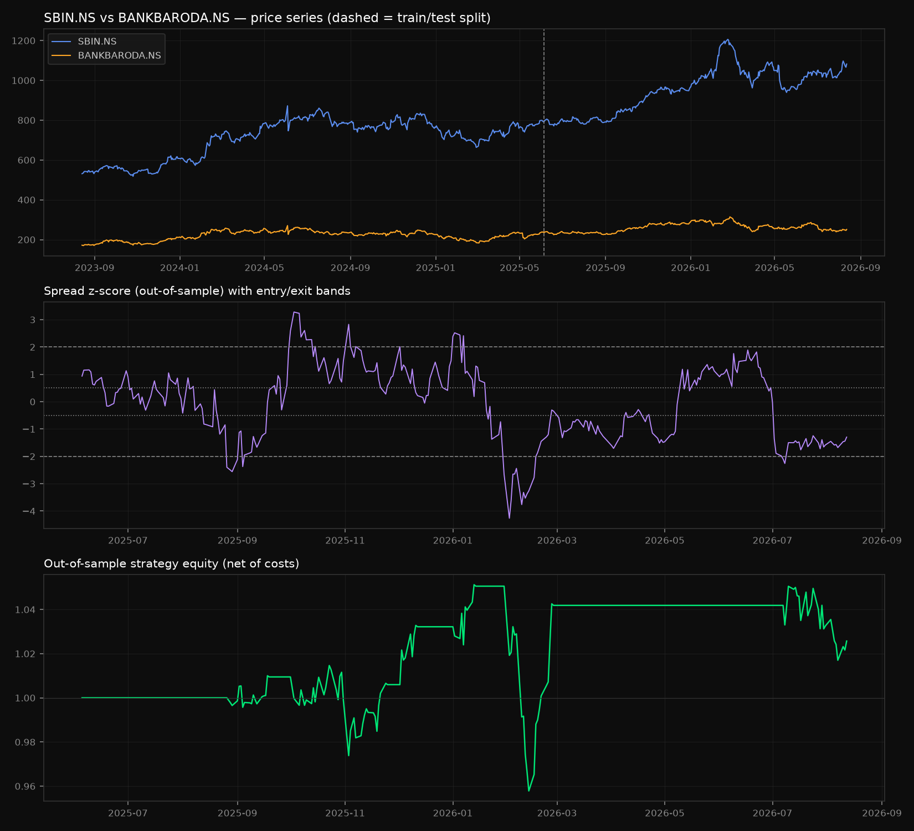

---

### TCS.NS / INFY.NS

- **Latest prices:** TCS.NS ₹2,349.70 · INFY.NS ₹1,176.10
- **Hedge ratio (train-fitted):** 0.5137
- **Cointegration (train):** FAIL at 5% — ADF -1.50, p=0.5344
- **Persistence:** passed 5% in 0 of 30 real-data runs (strict tier: 0/30)
- **Spread half-life:** 49.5 days
- **Current z-score:** -0.07
- **Signal today:** flat / no stretch
- ⚠️ _Pair did not cointegrate on training data. Any signal here is not statistically justified — observation only._

**Out-of-sample backtest** (beta frozen from train window):

| Metric | Value |
|---|---|
| Sharpe | 1.53 |
| Sortino | 1.61 |
| Annualised return | 7.73% |
| Annualised vol | 4.95% |
| Max drawdown | -4.23% |
| Round-trip trades | 7 |

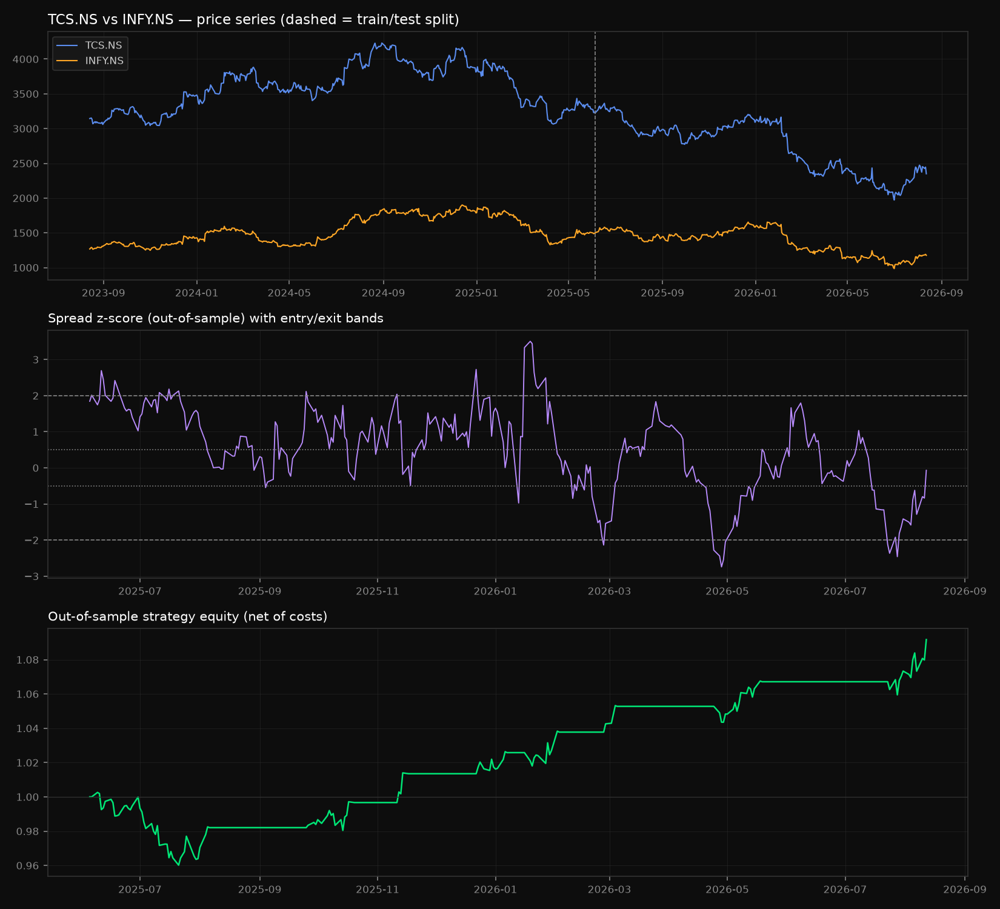

---

### INFY.NS / WIPRO.NS

- **Latest prices:** INFY.NS ₹1,176.10 · WIPRO.NS ₹183.94
- **Hedge ratio (train-fitted):** 0.1366
- **Cointegration (train):** FAIL at 5% — ADF -2.27, p=0.1833
- **Persistence:** passed 5% in 0 of 30 real-data runs (strict tier: 0/30)
- **Spread half-life:** 30.0 days
- **Current z-score:** -1.03
- **Signal today:** watch (approaching band)
- ⚠️ _Pair did not cointegrate on training data. Any signal here is not statistically justified — observation only._

**Out-of-sample backtest** (beta frozen from train window):

| Metric | Value |
|---|---|
| Sharpe | 1.67 |
| Sortino | 1.95 |
| Annualised return | 9.03% |
| Annualised vol | 5.26% |
| Max drawdown | -2.48% |
| Round-trip trades | 6 |

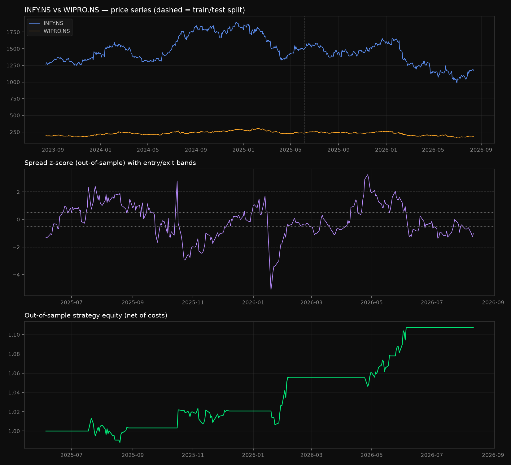

---

### HCLTECH.NS / TECHM.NS

- **Latest prices:** HCLTECH.NS ₹1,365.40 · TECHM.NS ₹1,625.00
- **Hedge ratio (train-fitted):** 0.8399
- **Cointegration (train):** FAIL at 5% — ADF -2.18, p=0.2130
- **Persistence:** passed 5% in 0 of 30 real-data runs (strict tier: 0/30)
- **Spread half-life:** 24.4 days
- **Current z-score:** -0.25
- **Signal today:** flat / no stretch
- ⚠️ _Pair did not cointegrate on training data. Any signal here is not statistically justified — observation only._

**Out-of-sample backtest** (beta frozen from train window):

| Metric | Value |
|---|---|
| Sharpe | -0.03 |
| Sortino | -0.03 |
| Annualised return | -0.51% |
| Annualised vol | 7.70% |
| Max drawdown | -8.31% |
| Round-trip trades | 5 |

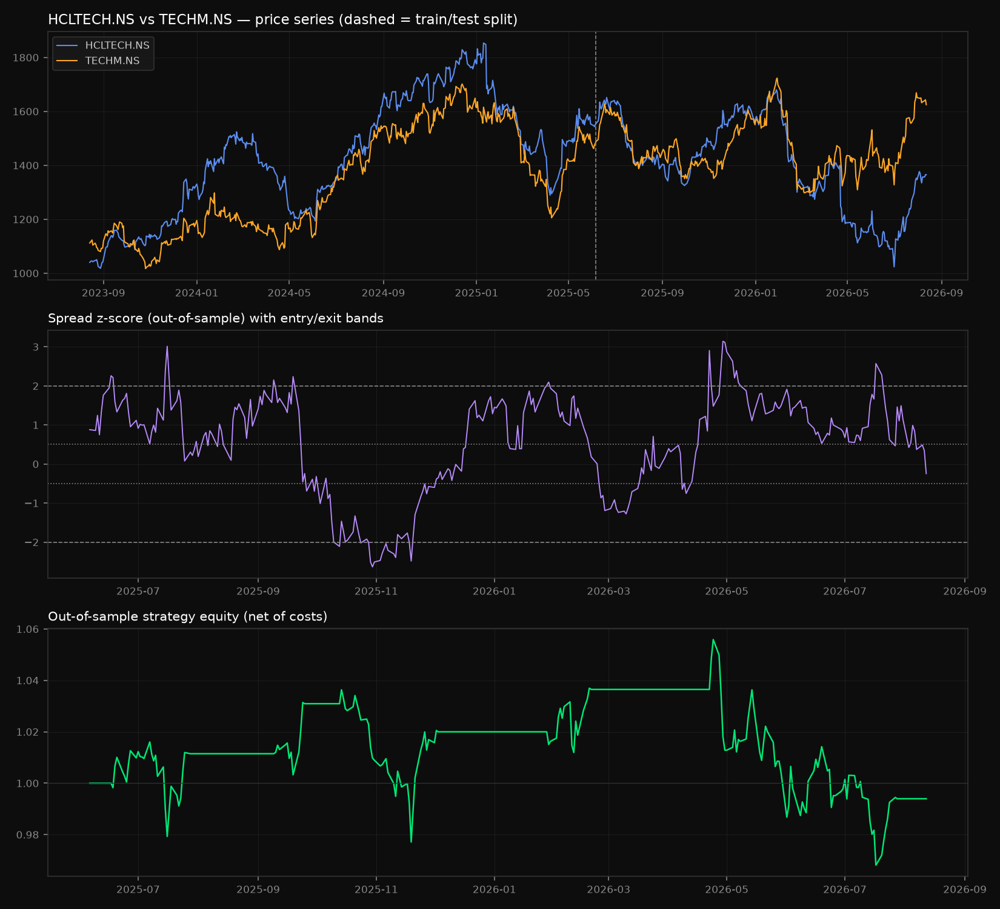

---

### ACC.NS / AMBUJACEM.NS

- **Latest prices:** ACC.NS ₹1,332.80 · AMBUJACEM.NS ₹421.00
- **Hedge ratio (train-fitted):** 0.2238
- **Cointegration (train):** FAIL at 5% — ADF -0.99, p=0.7580
- **Persistence:** passed 5% in 0 of 30 real-data runs (strict tier: 0/30)
- **Spread half-life:** 80.1 days
- **Current z-score:** -0.76
- **Signal today:** watch (approaching band)
- ⚠️ _Pair did not cointegrate on training data. Any signal here is not statistically justified — observation only._

**Out-of-sample backtest** (beta frozen from train window):

| Metric | Value |
|---|---|
| Sharpe | 0.54 |
| Sortino | 0.48 |
| Annualised return | 3.14% |
| Annualised vol | 6.05% |
| Max drawdown | -7.42% |
| Round-trip trades | 4 |

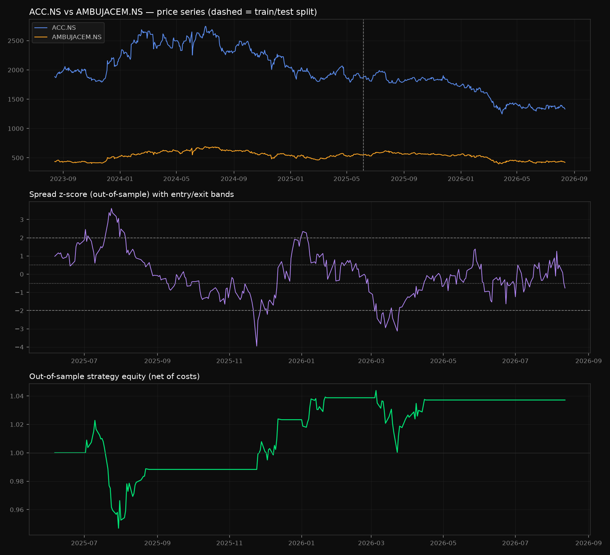

---

### ULTRACEMCO.NS / SHREECEM.NS

- **Latest prices:** ULTRACEMCO.NS ₹11,891.00 · SHREECEM.NS ₹25,570.00
- **Hedge ratio (train-fitted):** 0.6572
- **Cointegration (train):** FAIL at 5% — ADF -2.46, p=0.1265
- **Persistence:** passed 5% in 0 of 30 real-data runs (strict tier: 0/30)
- **Spread half-life:** 33.9 days
- **Current z-score:** -0.54
- **Signal today:** watch (approaching band)
- ⚠️ _Pair did not cointegrate on training data. Any signal here is not statistically justified — observation only._

**Out-of-sample backtest** (beta frozen from train window):

| Metric | Value |
|---|---|
| Sharpe | 0.49 |
| Sortino | 0.54 |
| Annualised return | 3.84% |
| Annualised vol | 8.31% |
| Max drawdown | -9.29% |
| Round-trip trades | 6 |

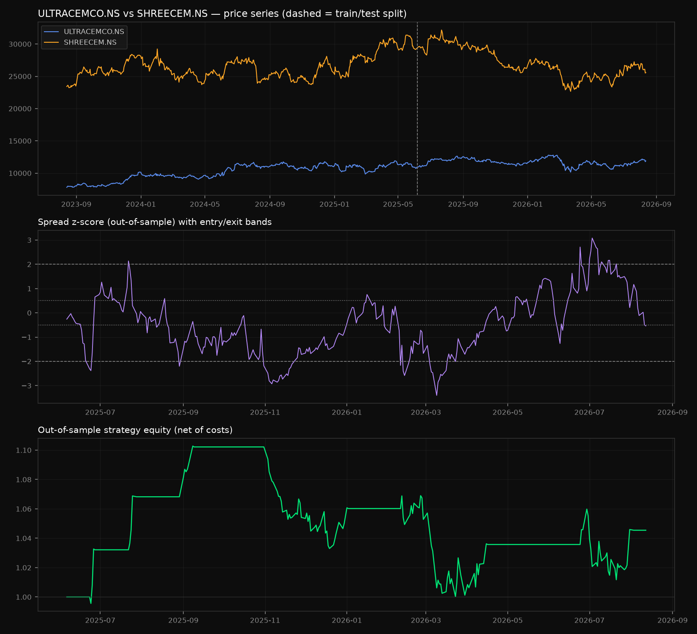

---

### IOC.NS / BPCL.NS

- **Latest prices:** IOC.NS ₹140.60 · BPCL.NS ₹317.00
- **Hedge ratio (train-fitted):** 1.7618
- **Cointegration (train):** FAIL at 5% — ADF -0.88, p=0.7945
- **Persistence:** passed 5% in 0 of 30 real-data runs (strict tier: 0/30)
- **Spread half-life:** 124.9 days
- **Current z-score:** +1.17
- **Signal today:** watch (approaching band)
- ⚠️ _Pair did not cointegrate on training data. Any signal here is not statistically justified — observation only._

**Out-of-sample backtest** (beta frozen from train window):

| Metric | Value |
|---|---|
| Sharpe | 0.61 |
| Sortino | 0.69 |
| Annualised return | 4.00% |
| Annualised vol | 6.79% |
| Max drawdown | -6.80% |
| Round-trip trades | 7 |

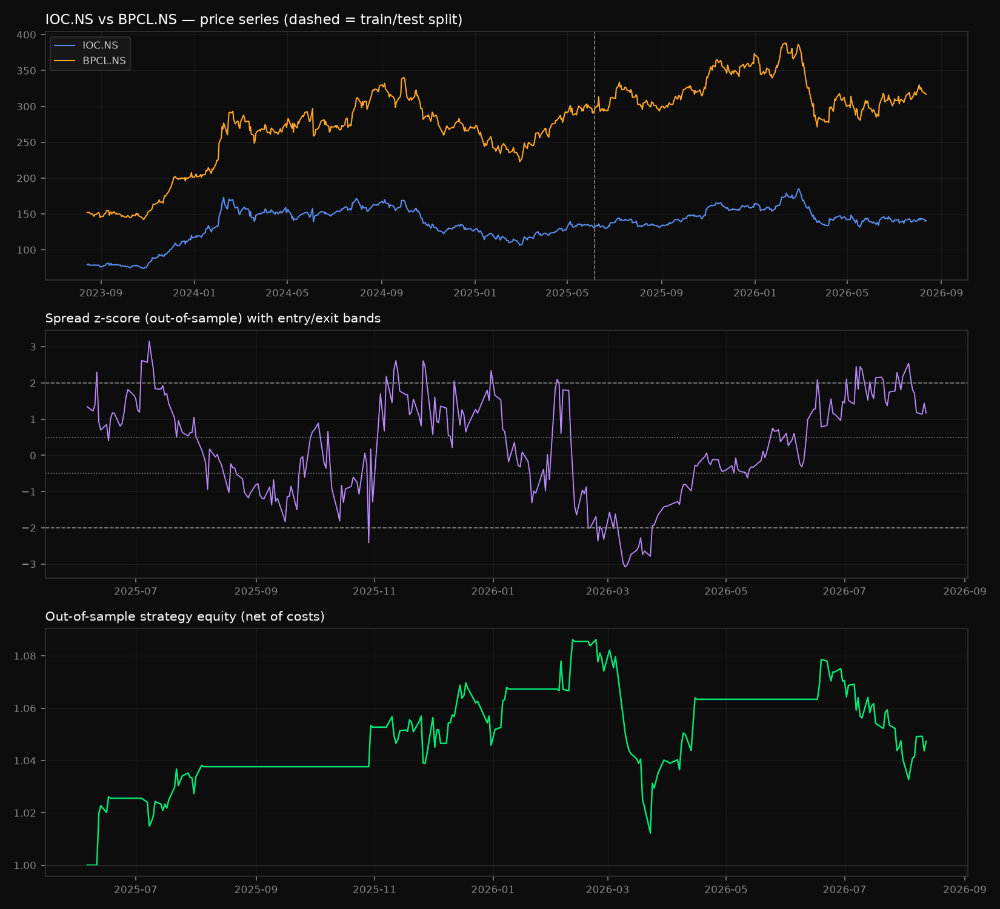

---

### BPCL.NS / HINDPETRO.NS

- **Latest prices:** BPCL.NS ₹317.00 · HINDPETRO.NS ₹390.00
- **Hedge ratio (train-fitted):** 1.4286
- **Cointegration (train):** FAIL at 5% — ADF -1.89, p=0.3373
- **Persistence:** passed 5% in 0 of 30 real-data runs (strict tier: 0/30)
- **Spread half-life:** 41.7 days
- **Current z-score:** -1.34
- **Signal today:** watch (approaching band)
- ⚠️ _Pair did not cointegrate on training data. Any signal here is not statistically justified — observation only._

**Out-of-sample backtest** (beta frozen from train window):

| Metric | Value |
|---|---|
| Sharpe | -0.16 |
| Sortino | -0.15 |
| Annualised return | -1.14% |
| Annualised vol | 5.91% |
| Max drawdown | -6.90% |
| Round-trip trades | 4 |

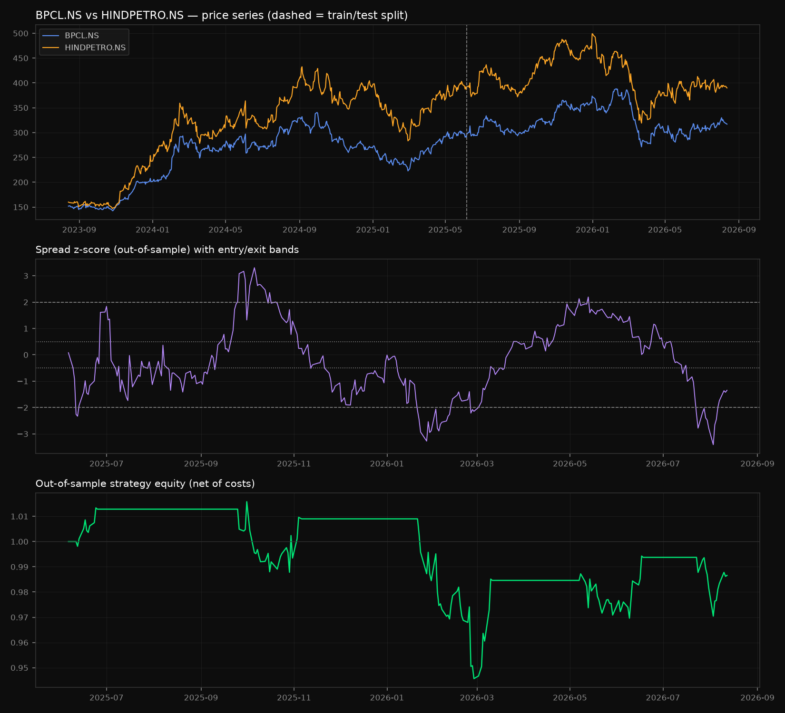

---

### ONGC.NS / COALINDIA.NS

- **Latest prices:** ONGC.NS ₹239.05 · COALINDIA.NS ₹409.30
- **Hedge ratio (train-fitted):** 1.6093
- **Cointegration (train):** PASS at 5% — ADF -3.45, p=0.0093
- **Persistence:** passed 5% in 22 of 30 real-data runs (strict tier: 0/30)
- **Spread half-life:** 13.7 days
- **Current z-score:** -0.40
- **Signal today:** flat / no stretch

**Out-of-sample backtest** (beta frozen from train window):

| Metric | Value |
|---|---|
| Sharpe | 0.74 |
| Sortino | 0.59 |
| Annualised return | 5.33% |
| Annualised vol | 7.36% |
| Max drawdown | -5.74% |
| Round-trip trades | 5 |

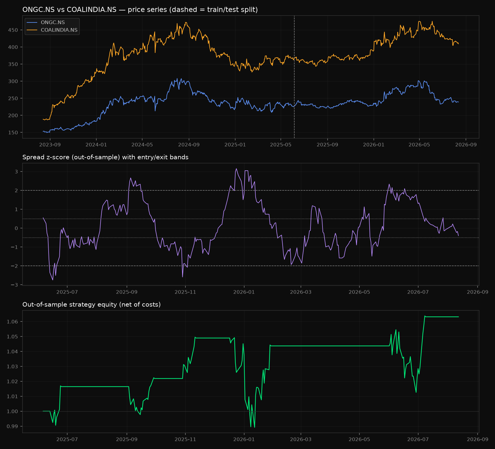

---

### NTPC.NS / POWERGRID.NS

- **Latest prices:** NTPC.NS ₹339.45 · POWERGRID.NS ₹269.45
- **Hedge ratio (train-fitted):** 0.8353
- **Cointegration (train):** FAIL at 5% — ADF -2.49, p=0.1185
- **Persistence:** passed 5% in 0 of 30 real-data runs (strict tier: 0/30)
- **Spread half-life:** 23.7 days
- **Current z-score:** -0.19
- **Signal today:** flat / no stretch
- ⚠️ _Pair did not cointegrate on training data. Any signal here is not statistically justified — observation only._

**Out-of-sample backtest** (beta frozen from train window):

| Metric | Value |
|---|---|
| Sharpe | 0.38 |
| Sortino | 0.29 |
| Annualised return | 1.97% |
| Annualised vol | 5.55% |
| Max drawdown | -5.29% |
| Round-trip trades | 6 |

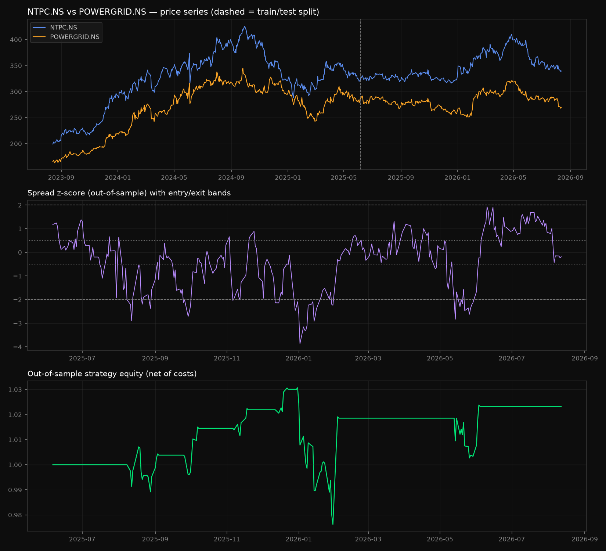

---

### BAJAJ-AUTO.NS / HEROMOTOCO.NS

- **Latest prices:** BAJAJ-AUTO.NS ₹11,700.00 · HEROMOTOCO.NS ₹5,895.00
- **Hedge ratio (train-fitted):** 0.4082
- **Cointegration (train):** FAIL at 5% — ADF -2.25, p=0.1896
- **Persistence:** passed 5% in 0 of 30 real-data runs (strict tier: 0/30)
- **Spread half-life:** 30.2 days
- **Current z-score:** +2.74
- **Signal today:** SHORT spread (short HEROMOTOCO.NS, long BAJAJ-AUTO.NS)
- ⚠️ _Pair did not cointegrate on training data. Any signal here is not statistically justified — observation only._

**Out-of-sample backtest** (beta frozen from train window):

| Metric | Value |
|---|---|
| Sharpe | -1.28 |
| Sortino | -1.27 |
| Annualised return | -12.80% |
| Annualised vol | 10.27% |
| Max drawdown | -20.92% |
| Round-trip trades | 4 |

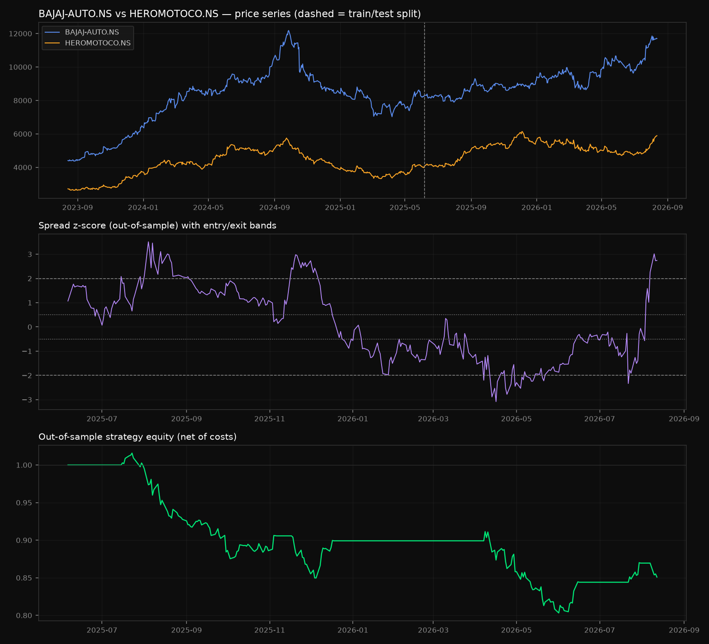

---

### TATASTEEL.NS / JSWSTEEL.NS

- **Latest prices:** TATASTEEL.NS ₹186.20 · JSWSTEEL.NS ₹1,269.10
- **Hedge ratio (train-fitted):** 3.0783
- **Cointegration (train):** FAIL at 5% — ADF -1.24, p=0.6580
- **Persistence:** passed 5% in 0 of 30 real-data runs (strict tier: 0/30)
- **Spread half-life:** 68.3 days
- **Current z-score:** +1.13
- **Signal today:** watch (approaching band)
- ⚠️ _Pair did not cointegrate on training data. Any signal here is not statistically justified — observation only._

**Out-of-sample backtest** (beta frozen from train window):

| Metric | Value |
|---|---|
| Sharpe | 0.18 |
| Sortino | 0.16 |
| Annualised return | 1.11% |
| Annualised vol | 7.66% |
| Max drawdown | -4.27% |
| Round-trip trades | 4 |

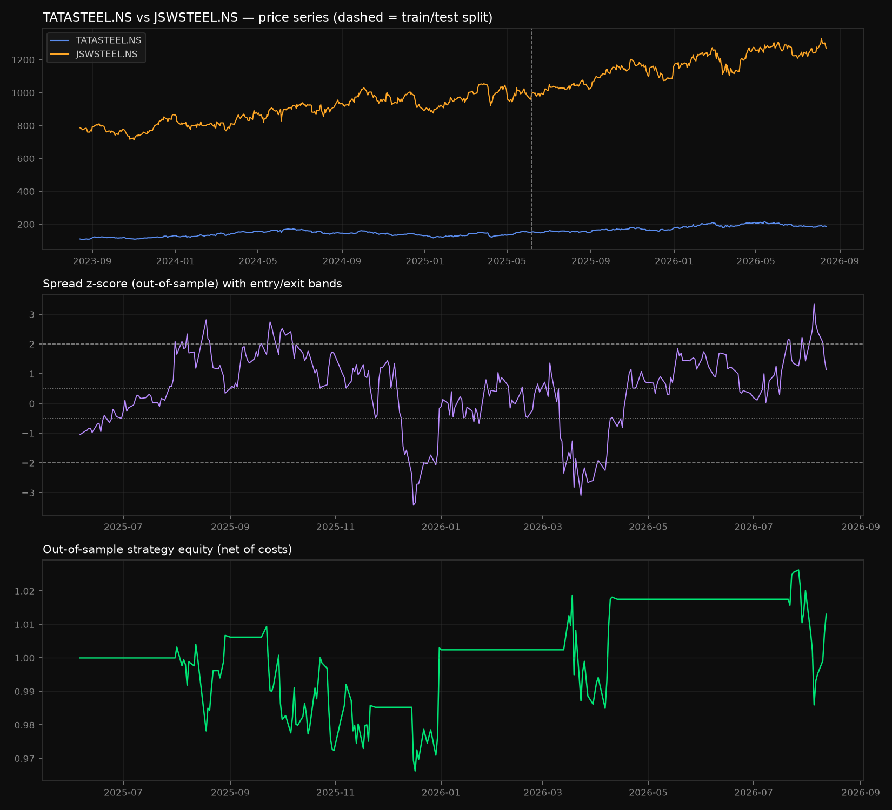

---

### SUNPHARMA.NS / CIPLA.NS

- **Latest prices:** SUNPHARMA.NS ₹1,944.00 · CIPLA.NS ₹1,463.00
- **Hedge ratio (train-fitted):** 0.4879
- **Cointegration (train):** PASS at 5% — ADF -3.39, p=0.0112
- **Persistence:** passed 5% in 30 of 30 real-data runs (strict tier: 5/30)
- **Spread half-life:** 10.7 days
- **Current z-score:** +0.44
- **Signal today:** flat / no stretch

**Out-of-sample backtest** (beta frozen from train window):

| Metric | Value |
|---|---|
| Sharpe | -0.10 |
| Sortino | -0.11 |
| Annualised return | -1.09% |
| Annualised vol | 7.68% |
| Max drawdown | -10.30% |
| Round-trip trades | 5 |

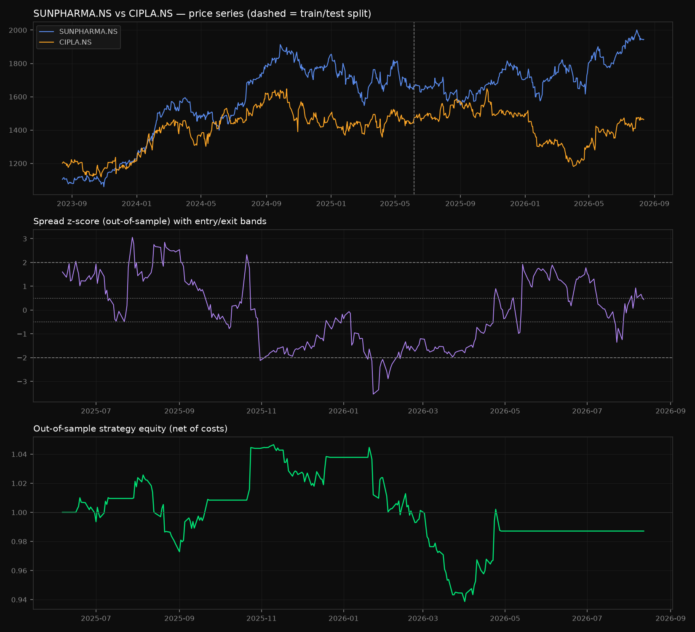

---

_Generated 2026-08-12 · pairs mean-reversion scanner · out-of-sample backtest · multiple-testing-aware · not investment advice._
