# Indian Pairs-Trading Scanner — 2026-08-13

> **What this is:** a market-neutral *pairs mean-reversion* scanner. It flags when two related NSE stocks have drifted apart far enough that their historical relationship signals a possible convergence trade. It does **not** forecast growth, rank "best" stocks, or predict company performance. A signal means the *spread between two stocks* is stretched — nothing about either stock being a good investment. Not investment advice; do your own research.

## Methodology (fixed in advance)

- **Universe:** 16 declared sector-mate pairs. Parameters (3y window, 60/40 train-test, z-entry 2.0, z-exit 0.5, 5 bps costs) are pre-registered; changes are logged in the README changelog *before* looking at results.
- **Multiple testing:** at the 5% level across 16 pairs, **≈0.8 false positives per run are expected by chance alone** even if nothing truly cointegrates. A single-day pass is a candidate, not a discovery.
- **Strict tier:** Bonferroni-corrected threshold p < 0.0031 (marked ✓✓).
- **Evidence = persistence:** the Persistence column counts how often each pair has passed the 5% test across all *real-data* daily runs recorded in `reports/history.csv`. Pairs deserve attention only when they pass persistently.

> ⚠️ **Some results use SIMULATED fallback data** (real data was unreachable this run) and are not real market results. These are marked below and are EXCLUDED from persistence counts.

## Summary

| Pair | p-value | Coint. | Persistence | Current z | Signal | OOS Sharpe |
|---|---|---|---|---|---|---|
| HDFCBANK.NS/ICICIBANK.NS *(sim)* | 0.0030 | ✓✓ | 0/24 | -1.55 | watch | 1.13 |
| AXISBANK.NS/ICICIBANK.NS | 0.9490 | ✗ | 0/31 | +1.27 | watch | -0.36 |
| KOTAKBANK.NS/HDFCBANK.NS | 0.1903 | ✗ | 0/31 | -1.27 | watch | 1.00 |
| SBIN.NS/BANKBARODA.NS | 0.1335 | ✗ | 0/31 | -1.44 | watch | 0.21 |
| TCS.NS/INFY.NS | 0.5511 | ✗ | 0/31 | -0.36 | flat / no stretch | 1.53 |
| INFY.NS/WIPRO.NS | 0.1836 | ✗ | 0/31 | -1.09 | watch | 1.67 |
| HCLTECH.NS/TECHM.NS | 0.2130 | ✗ | 0/31 | +0.10 | flat / no stretch | -0.05 |
| ACC.NS/AMBUJACEM.NS | 0.7808 | ✗ | 0/31 | -0.70 | watch | 0.54 |
| ULTRACEMCO.NS/SHREECEM.NS | 0.1226 | ✗ | 0/31 | -0.72 | watch | 0.46 |
| IOC.NS/BPCL.NS | 0.7945 | ✗ | 0/31 | +0.71 | watch | 0.69 |
| BPCL.NS/HINDPETRO.NS | 0.3373 | ✗ | 0/31 | -0.84 | watch | -0.06 |
| ONGC.NS/COALINDIA.NS | 0.0093 | ✓ | 23/31 | -0.42 | flat / no stretch | 0.74 |
| NTPC.NS/POWERGRID.NS | 0.1185 | ✗ | 0/31 | -0.93 | watch | 0.38 |
| BAJAJ-AUTO.NS/HEROMOTOCO.NS | 0.1874 | ✗ | 0/31 | +2.42 | SHORT spread | -1.53 |
| TATASTEEL.NS/JSWSTEEL.NS | 0.6580 | ✗ | 0/31 | +1.47 | watch | 0.11 |
| SUNPHARMA.NS/CIPLA.NS | 0.0112 | ✓ | 31/31 | +0.48 | flat / no stretch | -0.10 |

_Legend: ✓✓ passes strict Bonferroni tier · ✓ passes 5% only · ✗ fails. Persistence = 5%-passes / real-data runs recorded. \*no real-data history yet._

---

### HDFCBANK.NS / ICICIBANK.NS · _SIMULATED_

- **Latest prices:** HDFCBANK.NS ₹77.27 · ICICIBANK.NS ₹113.78
- **Hedge ratio (train-fitted):** 1.5557
- **Cointegration (train):** PASS at 5% — ADF -3.79, p=0.0030 · **passes strict Bonferroni tier**
- **Persistence:** passed 5% in 0 of 24 real-data runs (strict tier: 0/24)
- **Spread half-life:** 14.0 days
- **Current z-score:** -1.55
- **Signal today:** watch (approaching band)

**Out-of-sample backtest** (beta frozen from train window):

| Metric | Value |
|---|---|
| Sharpe | 1.13 |
| Sortino | 0.86 |
| Annualised return | 1.88% |
| Annualised vol | 1.66% |
| Max drawdown | -1.19% |
| Round-trip trades | 5 |

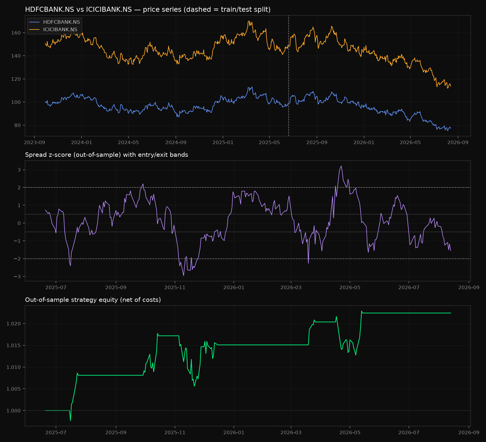

---

### AXISBANK.NS / ICICIBANK.NS

- **Latest prices:** AXISBANK.NS ₹1,221.80 · ICICIBANK.NS ₹1,406.80
- **Hedge ratio (train-fitted):** 0.9516
- **Cointegration (train):** FAIL at 5% — ADF -0.10, p=0.9490
- **Persistence:** passed 5% in 0 of 31 real-data runs (strict tier: 0/31)
- **Spread half-life:** 467.1 days
- **Current z-score:** +1.27
- **Signal today:** watch (approaching band)
- ⚠️ _Pair did not cointegrate on training data. Any signal here is not statistically justified — observation only._

**Out-of-sample backtest** (beta frozen from train window):

| Metric | Value |
|---|---|
| Sharpe | -0.36 |
| Sortino | -0.36 |
| Annualised return | -3.34% |
| Annualised vol | 8.46% |
| Max drawdown | -7.62% |
| Round-trip trades | 6 |

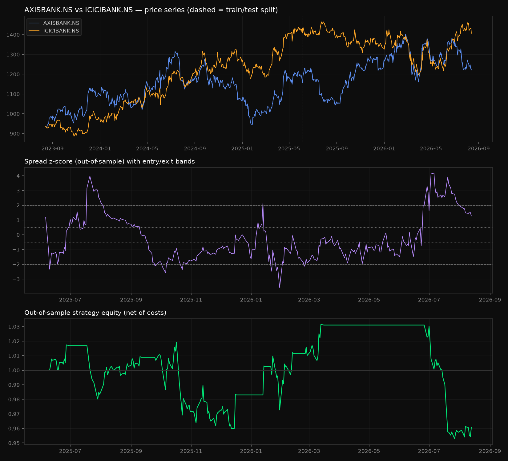

---

### KOTAKBANK.NS / HDFCBANK.NS

- **Latest prices:** KOTAKBANK.NS ₹392.40 · HDFCBANK.NS ₹725.00
- **Hedge ratio (train-fitted):** 1.9744
- **Cointegration (train):** FAIL at 5% — ADF -2.25, p=0.1903
- **Persistence:** passed 5% in 0 of 31 real-data runs (strict tier: 0/31)
- **Spread half-life:** 28.5 days
- **Current z-score:** -1.27
- **Signal today:** watch (approaching band)
- ⚠️ _Pair did not cointegrate on training data. Any signal here is not statistically justified — observation only._

**Out-of-sample backtest** (beta frozen from train window):

| Metric | Value |
|---|---|
| Sharpe | 1.00 |
| Sortino | 0.71 |
| Annualised return | 6.25% |
| Annualised vol | 6.29% |
| Max drawdown | -4.34% |
| Round-trip trades | 6 |

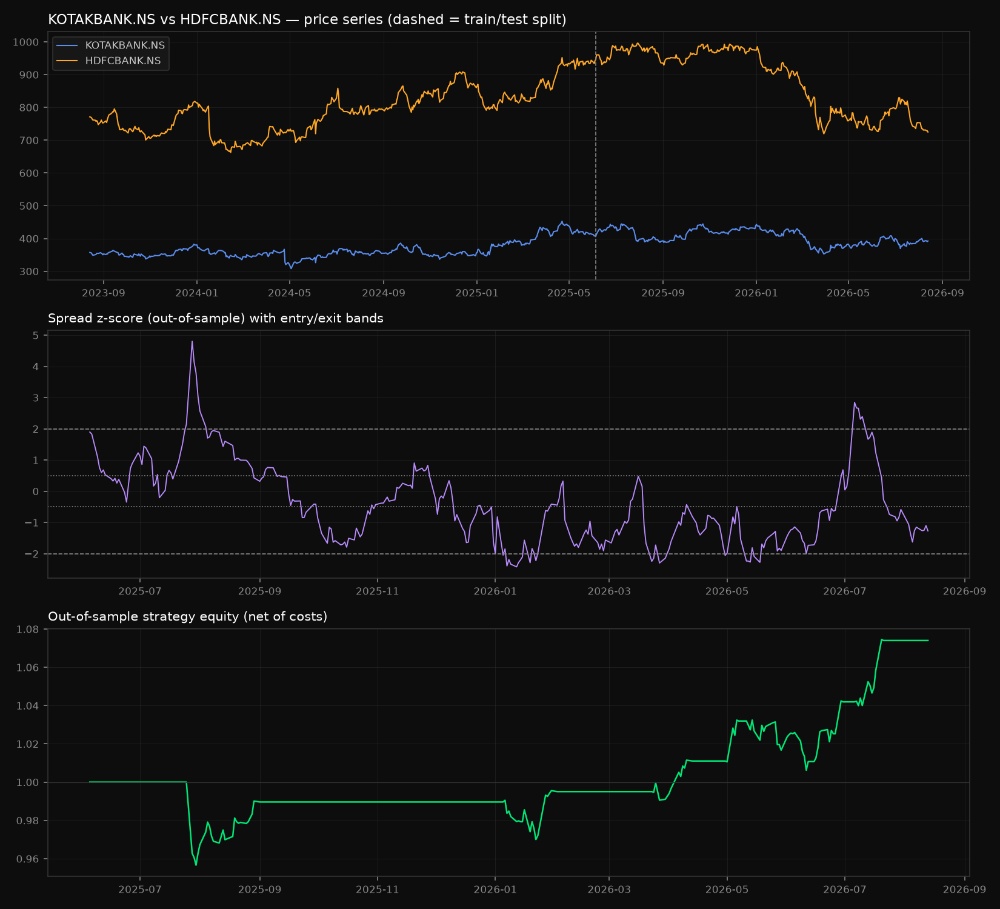

---

### SBIN.NS / BANKBARODA.NS

- **Latest prices:** SBIN.NS ₹1,083.00 · BANKBARODA.NS ₹248.00
- **Hedge ratio (train-fitted):** 0.2016
- **Cointegration (train):** FAIL at 5% — ADF -2.43, p=0.1335
- **Persistence:** passed 5% in 0 of 31 real-data runs (strict tier: 0/31)
- **Spread half-life:** 21.8 days
- **Current z-score:** -1.44
- **Signal today:** watch (approaching band)
- ⚠️ _Pair did not cointegrate on training data. Any signal here is not statistically justified — observation only._

**Out-of-sample backtest** (beta frozen from train window):

| Metric | Value |
|---|---|
| Sharpe | 0.21 |
| Sortino | 0.16 |
| Annualised return | 1.46% |
| Annualised vol | 8.64% |
| Max drawdown | -8.77% |
| Round-trip trades | 5 |

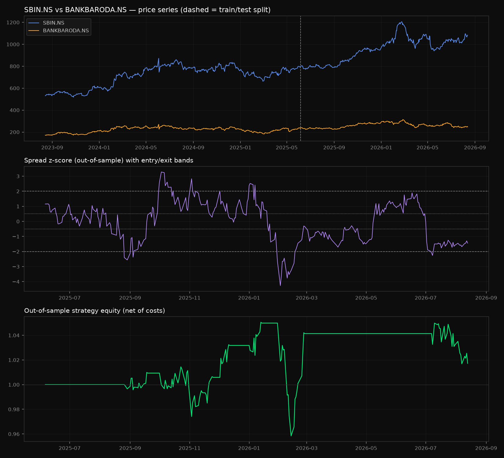

---

### TCS.NS / INFY.NS

- **Latest prices:** TCS.NS ₹2,375.00 · INFY.NS ₹1,175.00
- **Hedge ratio (train-fitted):** 0.5125
- **Cointegration (train):** FAIL at 5% — ADF -1.46, p=0.5511
- **Persistence:** passed 5% in 0 of 31 real-data runs (strict tier: 0/31)
- **Spread half-life:** 50.6 days
- **Current z-score:** -0.36
- **Signal today:** flat / no stretch
- ⚠️ _Pair did not cointegrate on training data. Any signal here is not statistically justified — observation only._

**Out-of-sample backtest** (beta frozen from train window):

| Metric | Value |
|---|---|
| Sharpe | 1.53 |
| Sortino | 1.61 |
| Annualised return | 7.68% |
| Annualised vol | 4.92% |
| Max drawdown | -4.20% |
| Round-trip trades | 8 |

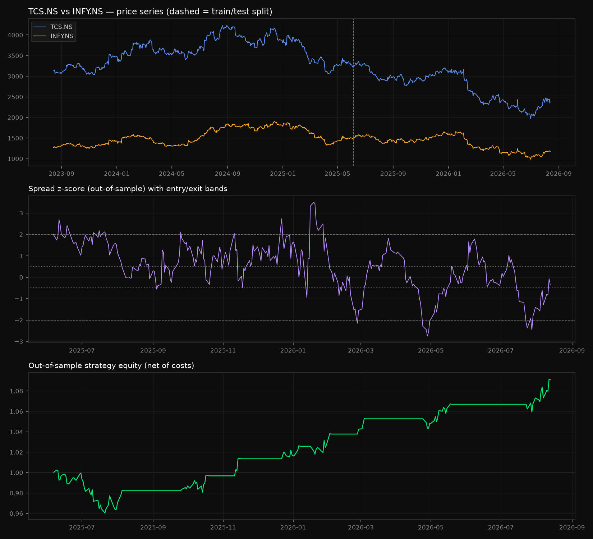

---

### INFY.NS / WIPRO.NS

- **Latest prices:** INFY.NS ₹1,175.00 · WIPRO.NS ₹183.10
- **Hedge ratio (train-fitted):** 0.1366
- **Cointegration (train):** FAIL at 5% — ADF -2.26, p=0.1836
- **Persistence:** passed 5% in 0 of 31 real-data runs (strict tier: 0/31)
- **Spread half-life:** 30.1 days
- **Current z-score:** -1.09
- **Signal today:** watch (approaching band)
- ⚠️ _Pair did not cointegrate on training data. Any signal here is not statistically justified — observation only._

**Out-of-sample backtest** (beta frozen from train window):

| Metric | Value |
|---|---|
| Sharpe | 1.67 |
| Sortino | 1.95 |
| Annualised return | 8.99% |
| Annualised vol | 5.23% |
| Max drawdown | -2.47% |
| Round-trip trades | 6 |

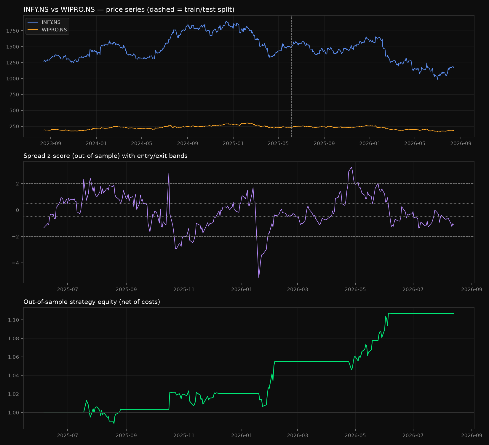

---

### HCLTECH.NS / TECHM.NS

- **Latest prices:** HCLTECH.NS ₹1,370.00 · TECHM.NS ₹1,639.00
- **Hedge ratio (train-fitted):** 0.8399
- **Cointegration (train):** FAIL at 5% — ADF -2.18, p=0.2130
- **Persistence:** passed 5% in 0 of 31 real-data runs (strict tier: 0/31)
- **Spread half-life:** 24.4 days
- **Current z-score:** +0.10
- **Signal today:** flat / no stretch
- ⚠️ _Pair did not cointegrate on training data. Any signal here is not statistically justified — observation only._

**Out-of-sample backtest** (beta frozen from train window):

| Metric | Value |
|---|---|
| Sharpe | -0.05 |
| Sortino | -0.05 |
| Annualised return | -0.71% |
| Annualised vol | 7.94% |
| Max drawdown | -8.31% |
| Round-trip trades | 5 |

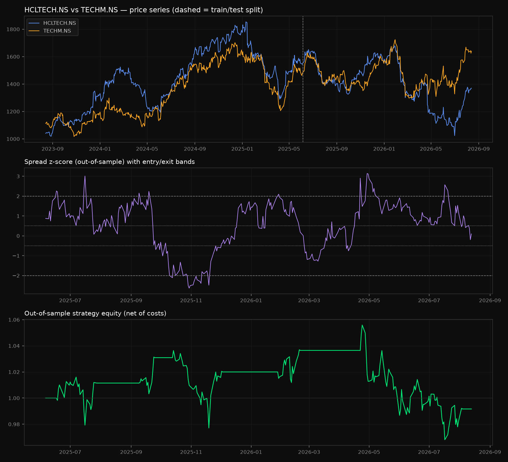

---

### ACC.NS / AMBUJACEM.NS

- **Latest prices:** ACC.NS ₹1,324.70 · AMBUJACEM.NS ₹419.40
- **Hedge ratio (train-fitted):** 0.2245
- **Cointegration (train):** FAIL at 5% — ADF -0.92, p=0.7808
- **Persistence:** passed 5% in 0 of 31 real-data runs (strict tier: 0/31)
- **Spread half-life:** 84.2 days
- **Current z-score:** -0.70
- **Signal today:** watch (approaching band)
- ⚠️ _Pair did not cointegrate on training data. Any signal here is not statistically justified — observation only._

**Out-of-sample backtest** (beta frozen from train window):

| Metric | Value |
|---|---|
| Sharpe | 0.54 |
| Sortino | 0.48 |
| Annualised return | 3.18% |
| Annualised vol | 6.10% |
| Max drawdown | -7.50% |
| Round-trip trades | 4 |

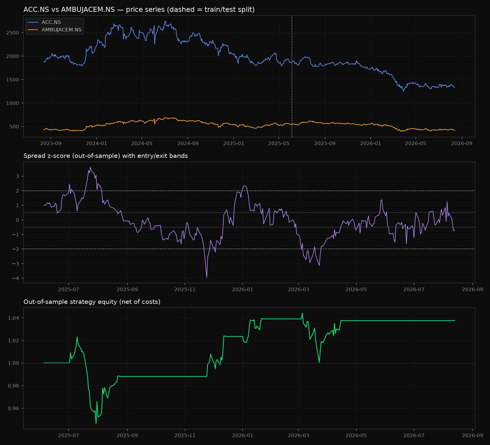

---

### ULTRACEMCO.NS / SHREECEM.NS

- **Latest prices:** ULTRACEMCO.NS ₹11,706.00 · SHREECEM.NS ₹25,245.00
- **Hedge ratio (train-fitted):** 0.6542
- **Cointegration (train):** FAIL at 5% — ADF -2.47, p=0.1226
- **Persistence:** passed 5% in 0 of 31 real-data runs (strict tier: 0/31)
- **Spread half-life:** 33.7 days
- **Current z-score:** -0.72
- **Signal today:** watch (approaching band)
- ⚠️ _Pair did not cointegrate on training data. Any signal here is not statistically justified — observation only._

**Out-of-sample backtest** (beta frozen from train window):

| Metric | Value |
|---|---|
| Sharpe | 0.46 |
| Sortino | 0.50 |
| Annualised return | 3.65% |
| Annualised vol | 8.54% |
| Max drawdown | -9.36% |
| Round-trip trades | 6 |

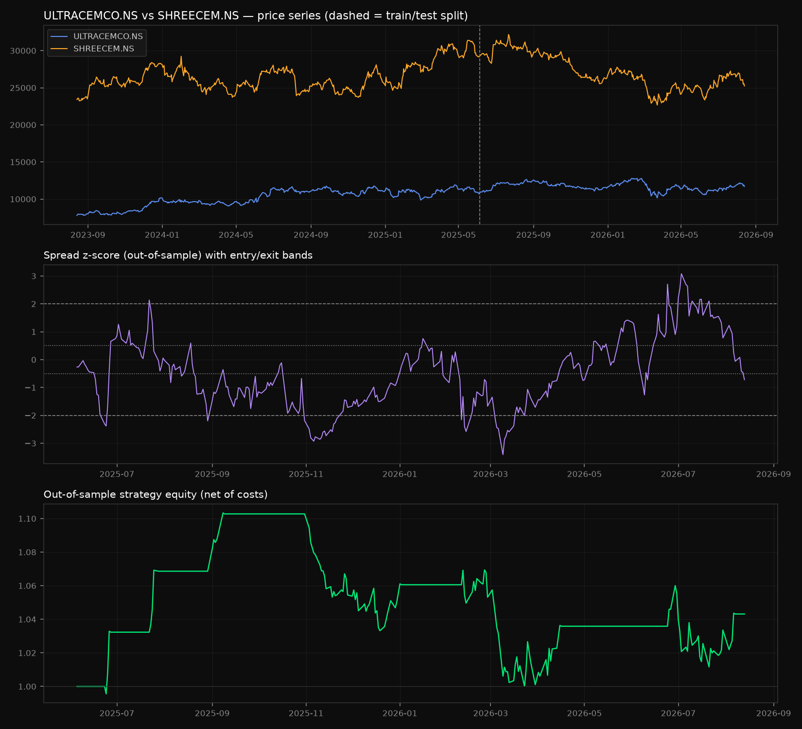

---

### IOC.NS / BPCL.NS

- **Latest prices:** IOC.NS ₹141.50 · BPCL.NS ₹315.00
- **Hedge ratio (train-fitted):** 1.7618
- **Cointegration (train):** FAIL at 5% — ADF -0.88, p=0.7945
- **Persistence:** passed 5% in 0 of 31 real-data runs (strict tier: 0/31)
- **Spread half-life:** 124.9 days
- **Current z-score:** +0.71
- **Signal today:** watch (approaching band)
- ⚠️ _Pair did not cointegrate on training data. Any signal here is not statistically justified — observation only._

**Out-of-sample backtest** (beta frozen from train window):

| Metric | Value |
|---|---|
| Sharpe | 0.69 |
| Sortino | 0.79 |
| Annualised return | 4.60% |
| Annualised vol | 6.83% |
| Max drawdown | -6.80% |
| Round-trip trades | 7 |

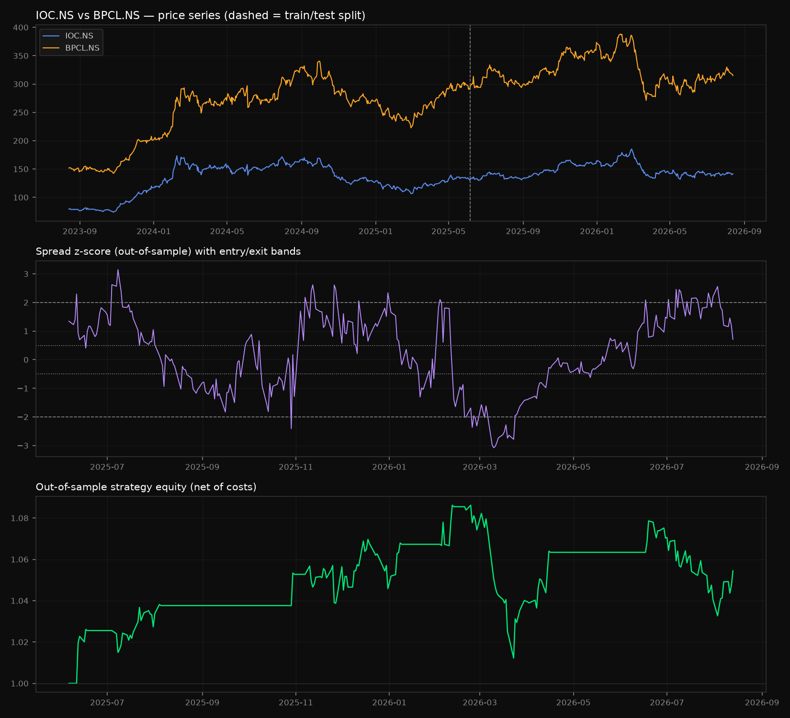

---

### BPCL.NS / HINDPETRO.NS

- **Latest prices:** BPCL.NS ₹315.00 · HINDPETRO.NS ₹392.90
- **Hedge ratio (train-fitted):** 1.4286
- **Cointegration (train):** FAIL at 5% — ADF -1.89, p=0.3373
- **Persistence:** passed 5% in 0 of 31 real-data runs (strict tier: 0/31)
- **Spread half-life:** 41.7 days
- **Current z-score:** -0.84
- **Signal today:** watch (approaching band)
- ⚠️ _Pair did not cointegrate on training data. Any signal here is not statistically justified — observation only._

**Out-of-sample backtest** (beta frozen from train window):

| Metric | Value |
|---|---|
| Sharpe | -0.06 |
| Sortino | -0.06 |
| Annualised return | -0.55% |
| Annualised vol | 5.94% |
| Max drawdown | -6.90% |
| Round-trip trades | 4 |

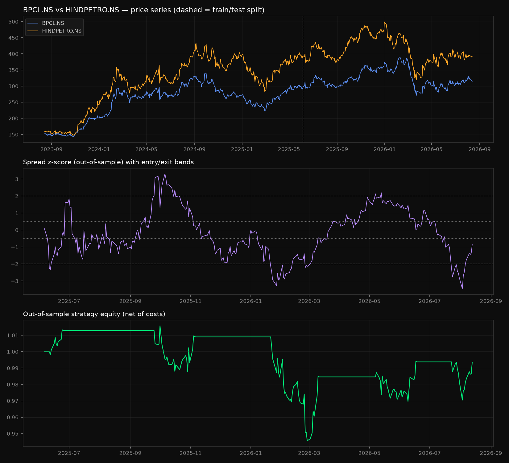

---

### ONGC.NS / COALINDIA.NS

- **Latest prices:** ONGC.NS ₹239.90 · COALINDIA.NS ₹410.50
- **Hedge ratio (train-fitted):** 1.6093
- **Cointegration (train):** PASS at 5% — ADF -3.45, p=0.0093
- **Persistence:** passed 5% in 23 of 31 real-data runs (strict tier: 0/31)
- **Spread half-life:** 13.7 days
- **Current z-score:** -0.42
- **Signal today:** flat / no stretch

**Out-of-sample backtest** (beta frozen from train window):

| Metric | Value |
|---|---|
| Sharpe | 0.74 |
| Sortino | 0.59 |
| Annualised return | 5.33% |
| Annualised vol | 7.36% |
| Max drawdown | -5.74% |
| Round-trip trades | 5 |

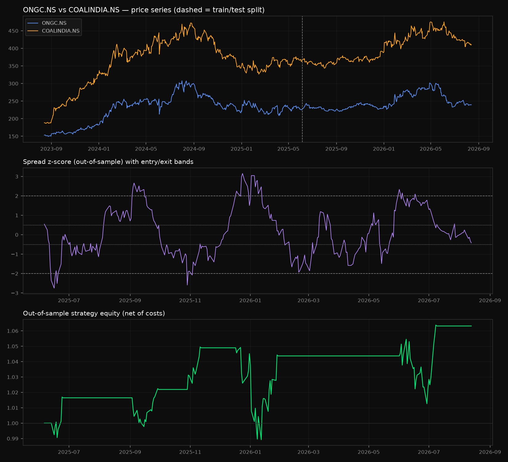

---

### NTPC.NS / POWERGRID.NS

- **Latest prices:** NTPC.NS ₹344.25 · POWERGRID.NS ₹266.60
- **Hedge ratio (train-fitted):** 0.8353
- **Cointegration (train):** FAIL at 5% — ADF -2.49, p=0.1185
- **Persistence:** passed 5% in 0 of 31 real-data runs (strict tier: 0/31)
- **Spread half-life:** 23.7 days
- **Current z-score:** -0.93
- **Signal today:** watch (approaching band)
- ⚠️ _Pair did not cointegrate on training data. Any signal here is not statistically justified — observation only._

**Out-of-sample backtest** (beta frozen from train window):

| Metric | Value |
|---|---|
| Sharpe | 0.38 |
| Sortino | 0.29 |
| Annualised return | 1.97% |
| Annualised vol | 5.55% |
| Max drawdown | -5.29% |
| Round-trip trades | 6 |

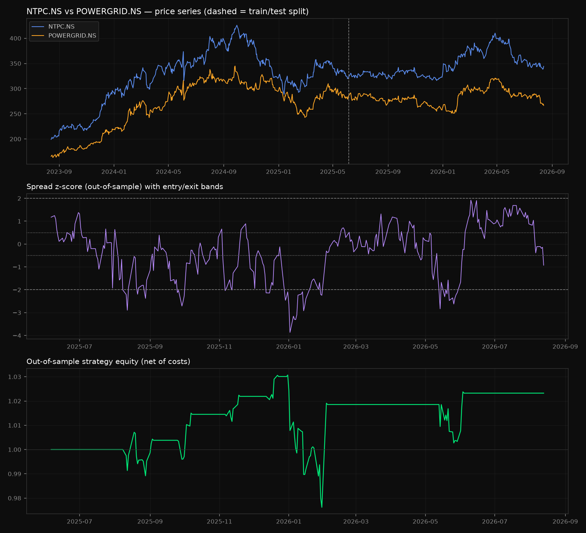

---

### BAJAJ-AUTO.NS / HEROMOTOCO.NS

- **Latest prices:** BAJAJ-AUTO.NS ₹11,661.00 · HEROMOTOCO.NS ₹5,850.00
- **Hedge ratio (train-fitted):** 0.4082
- **Cointegration (train):** FAIL at 5% — ADF -2.25, p=0.1874
- **Persistence:** passed 5% in 0 of 31 real-data runs (strict tier: 0/31)
- **Spread half-life:** 30.1 days
- **Current z-score:** +2.42
- **Signal today:** SHORT spread (short HEROMOTOCO.NS, long BAJAJ-AUTO.NS)
- ⚠️ _Pair did not cointegrate on training data. Any signal here is not statistically justified — observation only._

**Out-of-sample backtest** (beta frozen from train window):

| Metric | Value |
|---|---|
| Sharpe | -1.53 |
| Sortino | -1.47 |
| Annualised return | -14.91% |
| Annualised vol | 10.19% |
| Max drawdown | -21.22% |
| Round-trip trades | 3 |

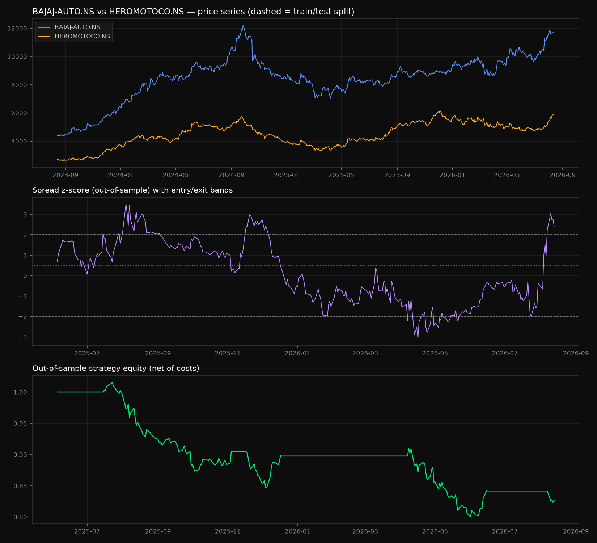

---

### TATASTEEL.NS / JSWSTEEL.NS

- **Latest prices:** TATASTEEL.NS ₹184.85 · JSWSTEEL.NS ₹1,275.00
- **Hedge ratio (train-fitted):** 3.0783
- **Cointegration (train):** FAIL at 5% — ADF -1.24, p=0.6580
- **Persistence:** passed 5% in 0 of 31 real-data runs (strict tier: 0/31)
- **Spread half-life:** 68.3 days
- **Current z-score:** +1.47
- **Signal today:** watch (approaching band)
- ⚠️ _Pair did not cointegrate on training data. Any signal here is not statistically justified — observation only._

**Out-of-sample backtest** (beta frozen from train window):

| Metric | Value |
|---|---|
| Sharpe | 0.11 |
| Sortino | 0.09 |
| Annualised return | 0.52% |
| Annualised vol | 7.67% |
| Max drawdown | -4.27% |
| Round-trip trades | 4 |

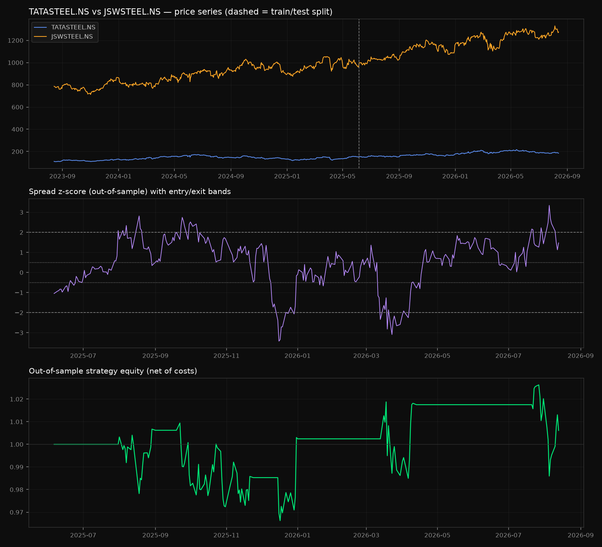

---

### SUNPHARMA.NS / CIPLA.NS

- **Latest prices:** SUNPHARMA.NS ₹1,932.00 · CIPLA.NS ₹1,458.80
- **Hedge ratio (train-fitted):** 0.4879
- **Cointegration (train):** PASS at 5% — ADF -3.39, p=0.0112
- **Persistence:** passed 5% in 31 of 31 real-data runs (strict tier: 5/31)
- **Spread half-life:** 10.7 days
- **Current z-score:** +0.48
- **Signal today:** flat / no stretch

**Out-of-sample backtest** (beta frozen from train window):

| Metric | Value |
|---|---|
| Sharpe | -0.10 |
| Sortino | -0.11 |
| Annualised return | -1.09% |
| Annualised vol | 7.67% |
| Max drawdown | -10.30% |
| Round-trip trades | 5 |

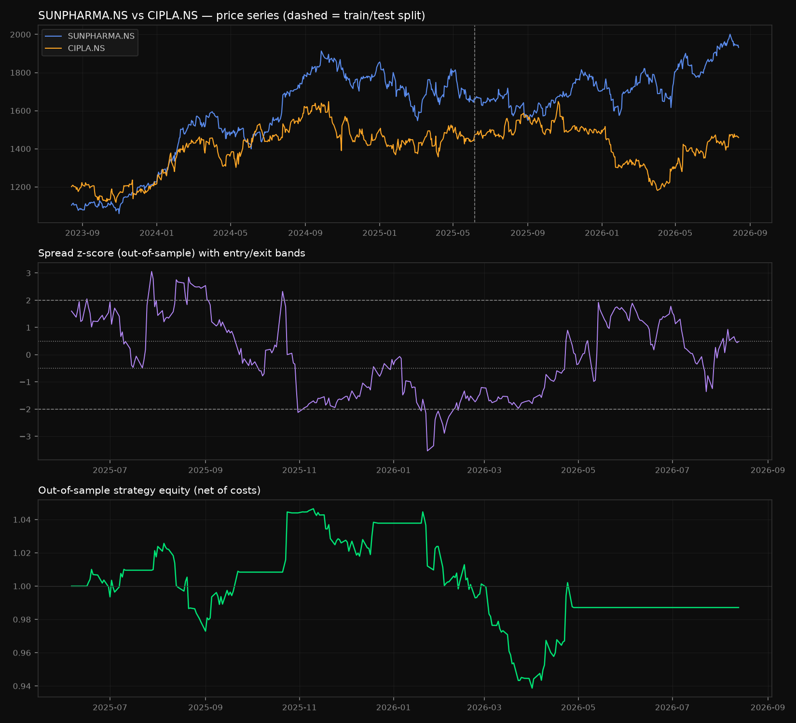

---

_Generated 2026-08-13 · pairs mean-reversion scanner · out-of-sample backtest · multiple-testing-aware · not investment advice._
