# Indian Pairs-Trading Scanner — 2026-08-14

> **What this is:** a market-neutral *pairs mean-reversion* scanner. It flags when two related NSE stocks have drifted apart far enough that their historical relationship signals a possible convergence trade. It does **not** forecast growth, rank "best" stocks, or predict company performance. A signal means the *spread between two stocks* is stretched — nothing about either stock being a good investment. Not investment advice; do your own research.

## Methodology (fixed in advance)

- **Universe:** 16 declared sector-mate pairs. Parameters (3y window, 60/40 train-test, z-entry 2.0, z-exit 0.5, 5 bps costs) are pre-registered; changes are logged in the README changelog *before* looking at results.
- **Multiple testing:** at the 5% level across 16 pairs, **≈0.8 false positives per run are expected by chance alone** even if nothing truly cointegrates. A single-day pass is a candidate, not a discovery.
- **Strict tier:** Bonferroni-corrected threshold p < 0.0031 (marked ✓✓).
- **Evidence = persistence:** the Persistence column counts how often each pair has passed the 5% test across all *real-data* daily runs recorded in `reports/history.csv`. Pairs deserve attention only when they pass persistently.

## Summary

| Pair | p-value | Coint. | Persistence | Current z | Signal | OOS Sharpe |
|---|---|---|---|---|---|---|
| HDFCBANK.NS/ICICIBANK.NS | 0.0854 | ✗ | 0/25 | +1.49 | watch | -0.54 |
| AXISBANK.NS/ICICIBANK.NS | 0.9297 | ✗ | 0/32 | +1.33 | watch | -0.34 |
| KOTAKBANK.NS/HDFCBANK.NS | 0.2004 | ✗ | 0/32 | -1.12 | watch | 0.94 |
| SBIN.NS/BANKBARODA.NS | 0.1333 | ✗ | 0/32 | -1.17 | watch | 0.29 |
| TCS.NS/INFY.NS | 0.5568 | ✗ | 0/32 | -0.29 | flat / no stretch | 1.68 |
| INFY.NS/WIPRO.NS | 0.1817 | ✗ | 0/32 | -0.81 | watch | 1.67 |
| HCLTECH.NS/TECHM.NS | 0.2141 | ✗ | 0/32 | +0.07 | flat / no stretch | -0.03 |
| ACC.NS/AMBUJACEM.NS | 0.7580 | ✗ | 0/32 | -0.90 | watch | 0.54 |
| ULTRACEMCO.NS/SHREECEM.NS | 0.1265 | ✗ | 0/32 | -1.25 | watch | 0.47 |
| IOC.NS/BPCL.NS | 0.8294 | ✗ | 0/32 | +1.40 | watch | 0.55 |
| BPCL.NS/HINDPETRO.NS | 0.3226 | ✗ | 0/32 | -1.34 | watch | -0.17 |
| ONGC.NS/COALINDIA.NS | 0.0092 | ✓ | 24/32 | -0.44 | flat / no stretch | 0.74 |
| NTPC.NS/POWERGRID.NS | 0.1118 | ✗ | 0/32 | -0.68 | watch | 0.38 |
| BAJAJ-AUTO.NS/HEROMOTOCO.NS | 0.1896 | ✗ | 0/32 | +1.81 | watch | -1.16 |
| TATASTEEL.NS/JSWSTEEL.NS | 0.6861 | ✗ | 0/32 | +1.39 | watch | 0.19 |
| SUNPHARMA.NS/CIPLA.NS | 0.0111 | ✓ | 32/32 | +0.16 | flat / no stretch | -0.10 |

_Legend: ✓✓ passes strict Bonferroni tier · ✓ passes 5% only · ✗ fails. Persistence = 5%-passes / real-data runs recorded. \*no real-data history yet._

---

### HDFCBANK.NS / ICICIBANK.NS

- **Latest prices:** HDFCBANK.NS ₹727.00 · ICICIBANK.NS ₹1,417.00
- **Hedge ratio (train-fitted):** 1.7767
- **Cointegration (train):** FAIL at 5% — ADF -2.64, p=0.0854
- **Persistence:** passed 5% in 0 of 25 real-data runs (strict tier: 0/25)
- **Spread half-life:** 27.1 days
- **Current z-score:** +1.49
- **Signal today:** watch (approaching band)
- ⚠️ _Pair did not cointegrate on training data. Any signal here is not statistically justified — observation only._

**Out-of-sample backtest** (beta frozen from train window):

| Metric | Value |
|---|---|
| Sharpe | -0.54 |
| Sortino | -0.56 |
| Annualised return | -3.44% |
| Annualised vol | 6.14% |
| Max drawdown | -8.69% |
| Round-trip trades | 5 |

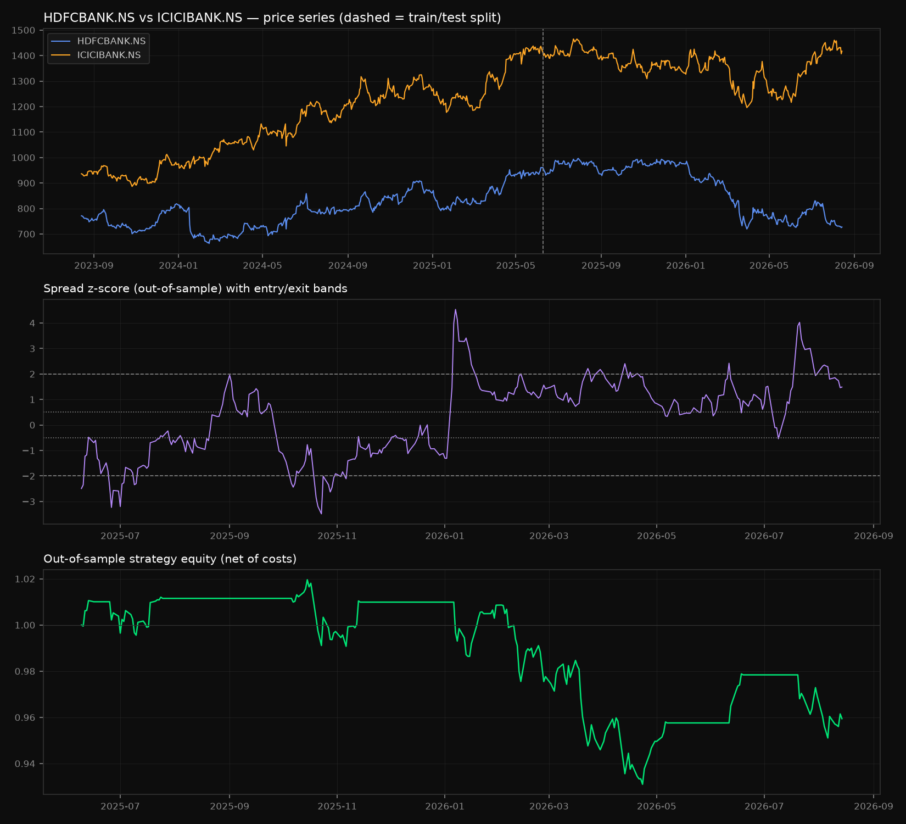

---

### AXISBANK.NS / ICICIBANK.NS

- **Latest prices:** AXISBANK.NS ₹1,217.40 · ICICIBANK.NS ₹1,417.00
- **Hedge ratio (train-fitted):** 0.9575
- **Cointegration (train):** FAIL at 5% — ADF -0.27, p=0.9297
- **Persistence:** passed 5% in 0 of 32 real-data runs (strict tier: 0/32)
- **Spread half-life:** 272.5 days
- **Current z-score:** +1.33
- **Signal today:** watch (approaching band)
- ⚠️ _Pair did not cointegrate on training data. Any signal here is not statistically justified — observation only._

**Out-of-sample backtest** (beta frozen from train window):

| Metric | Value |
|---|---|
| Sharpe | -0.34 |
| Sortino | -0.34 |
| Annualised return | -3.17% |
| Annualised vol | 8.44% |
| Max drawdown | -7.52% |
| Round-trip trades | 6 |

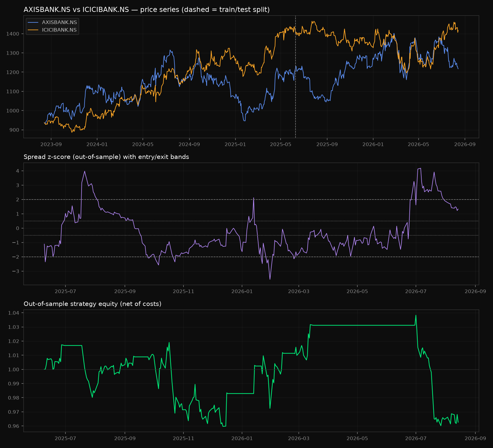

---

### KOTAKBANK.NS / HDFCBANK.NS

- **Latest prices:** KOTAKBANK.NS ₹391.15 · HDFCBANK.NS ₹727.00
- **Hedge ratio (train-fitted):** 1.9844
- **Cointegration (train):** FAIL at 5% — ADF -2.22, p=0.2004
- **Persistence:** passed 5% in 0 of 32 real-data runs (strict tier: 0/32)
- **Spread half-life:** 28.9 days
- **Current z-score:** -1.12
- **Signal today:** watch (approaching band)
- ⚠️ _Pair did not cointegrate on training data. Any signal here is not statistically justified — observation only._

**Out-of-sample backtest** (beta frozen from train window):

| Metric | Value |
|---|---|
| Sharpe | 0.94 |
| Sortino | 0.68 |
| Annualised return | 5.95% |
| Annualised vol | 6.36% |
| Max drawdown | -4.28% |
| Round-trip trades | 6 |

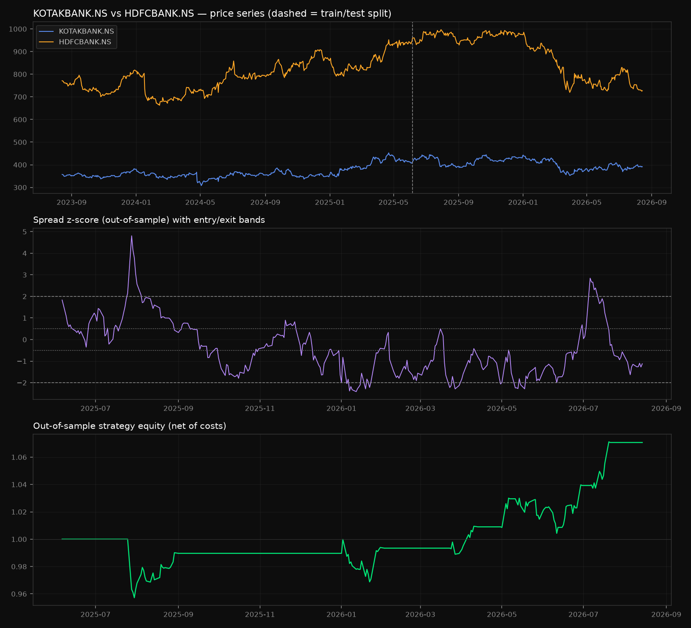

---

### SBIN.NS / BANKBARODA.NS

- **Latest prices:** SBIN.NS ₹1,067.70 · BANKBARODA.NS ₹248.22
- **Hedge ratio (train-fitted):** 0.2016
- **Cointegration (train):** FAIL at 5% — ADF -2.43, p=0.1333
- **Persistence:** passed 5% in 0 of 32 real-data runs (strict tier: 0/32)
- **Spread half-life:** 21.8 days
- **Current z-score:** -1.17
- **Signal today:** watch (approaching band)
- ⚠️ _Pair did not cointegrate on training data. Any signal here is not statistically justified — observation only._

**Out-of-sample backtest** (beta frozen from train window):

| Metric | Value |
|---|---|
| Sharpe | 0.29 |
| Sortino | 0.22 |
| Annualised return | 2.15% |
| Annualised vol | 8.59% |
| Max drawdown | -8.70% |
| Round-trip trades | 5 |

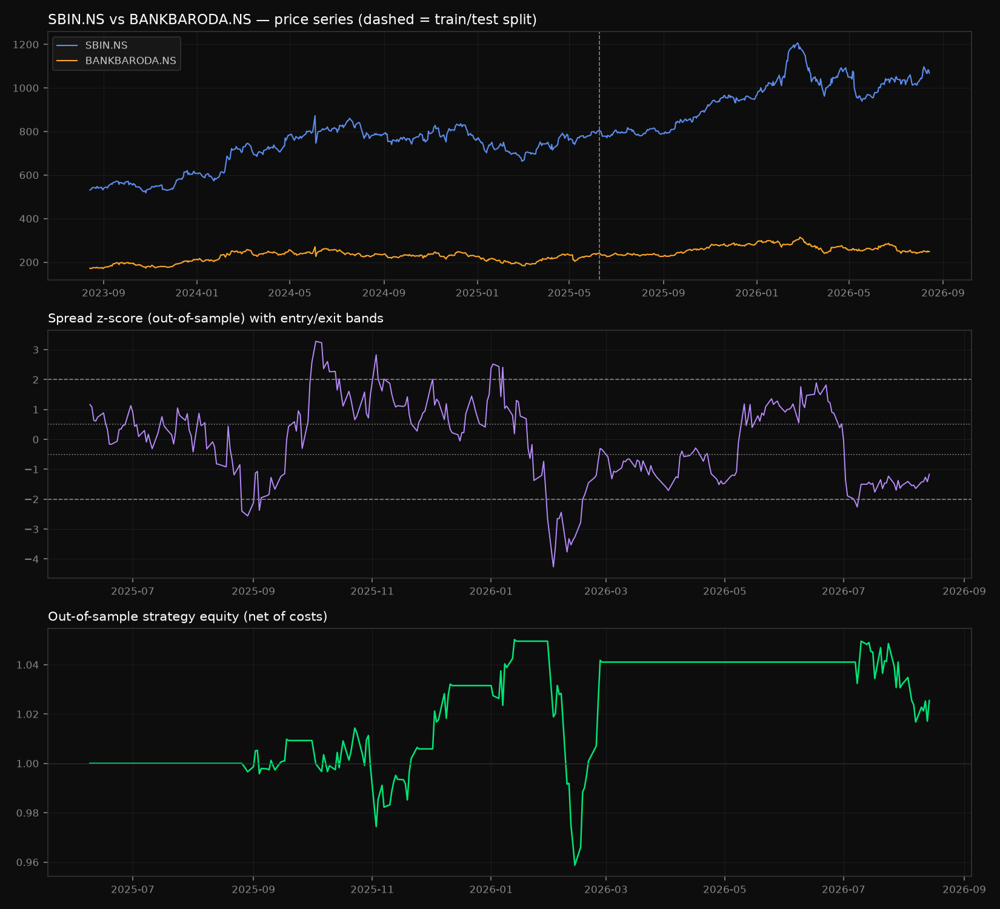

---

### TCS.NS / INFY.NS

- **Latest prices:** TCS.NS ₹2,361.00 · INFY.NS ₹1,169.20
- **Hedge ratio (train-fitted):** 0.5113
- **Cointegration (train):** FAIL at 5% — ADF -1.45, p=0.5568
- **Persistence:** passed 5% in 0 of 32 real-data runs (strict tier: 0/32)
- **Spread half-life:** 51.2 days
- **Current z-score:** -0.29
- **Signal today:** flat / no stretch
- ⚠️ _Pair did not cointegrate on training data. Any signal here is not statistically justified — observation only._

**Out-of-sample backtest** (beta frozen from train window):

| Metric | Value |
|---|---|
| Sharpe | 1.68 |
| Sortino | 1.80 |
| Annualised return | 8.23% |
| Annualised vol | 4.78% |
| Max drawdown | -3.91% |
| Round-trip trades | 8 |

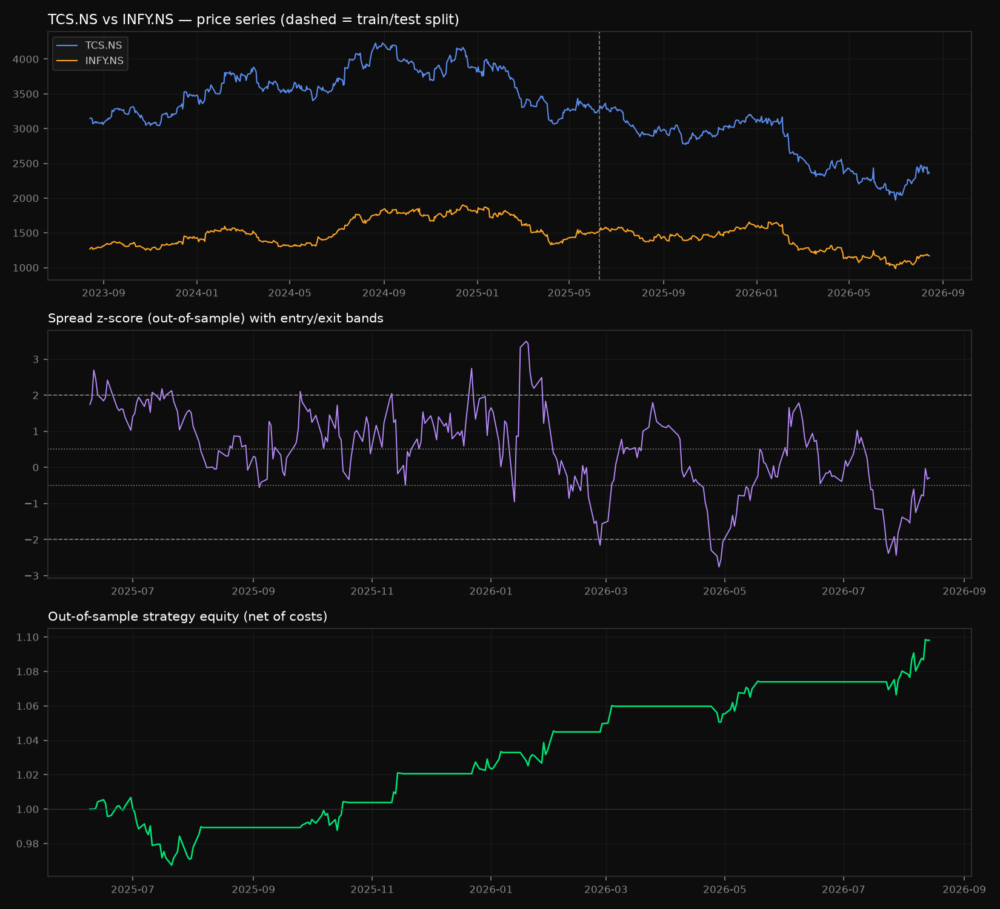

---

### INFY.NS / WIPRO.NS

- **Latest prices:** INFY.NS ₹1,169.20 · WIPRO.NS ₹184.00
- **Hedge ratio (train-fitted):** 0.1366
- **Cointegration (train):** FAIL at 5% — ADF -2.27, p=0.1817
- **Persistence:** passed 5% in 0 of 32 real-data runs (strict tier: 0/32)
- **Spread half-life:** 30.1 days
- **Current z-score:** -0.81
- **Signal today:** watch (approaching band)
- ⚠️ _Pair did not cointegrate on training data. Any signal here is not statistically justified — observation only._

**Out-of-sample backtest** (beta frozen from train window):

| Metric | Value |
|---|---|
| Sharpe | 1.67 |
| Sortino | 1.95 |
| Annualised return | 8.88% |
| Annualised vol | 5.18% |
| Max drawdown | -2.45% |
| Round-trip trades | 6 |

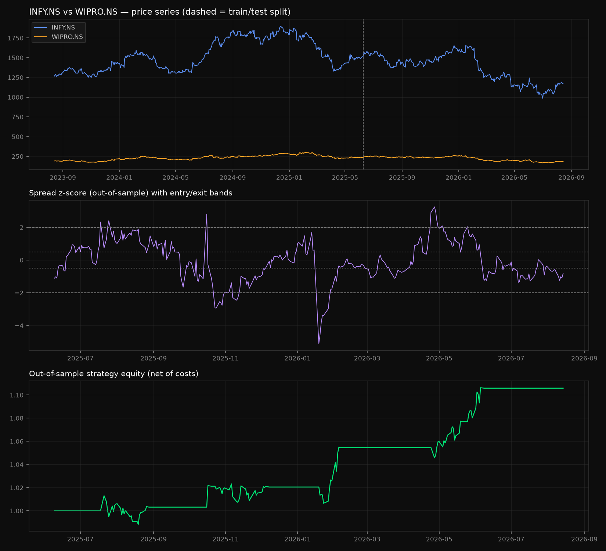

---

### HCLTECH.NS / TECHM.NS

- **Latest prices:** HCLTECH.NS ₹1,360.00 · TECHM.NS ₹1,632.80
- **Hedge ratio (train-fitted):** 0.8402
- **Cointegration (train):** FAIL at 5% — ADF -2.18, p=0.2141
- **Persistence:** passed 5% in 0 of 32 real-data runs (strict tier: 0/32)
- **Spread half-life:** 24.4 days
- **Current z-score:** +0.07
- **Signal today:** flat / no stretch
- ⚠️ _Pair did not cointegrate on training data. Any signal here is not statistically justified — observation only._

**Out-of-sample backtest** (beta frozen from train window):

| Metric | Value |
|---|---|
| Sharpe | -0.03 |
| Sortino | -0.03 |
| Annualised return | -0.51% |
| Annualised vol | 7.65% |
| Max drawdown | -8.26% |
| Round-trip trades | 5 |

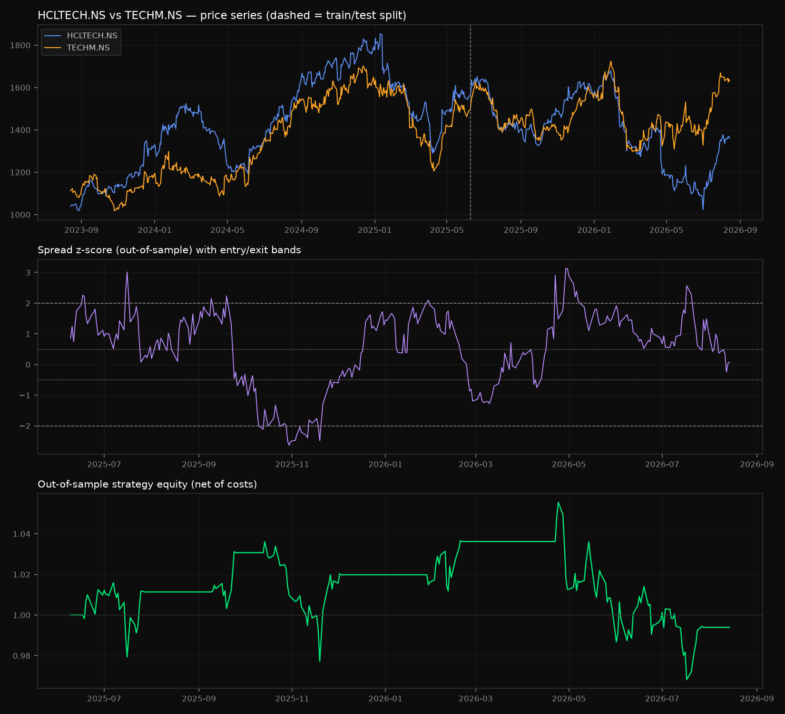

---

### ACC.NS / AMBUJACEM.NS

- **Latest prices:** ACC.NS ₹1,321.40 · AMBUJACEM.NS ₹417.50
- **Hedge ratio (train-fitted):** 0.2238
- **Cointegration (train):** FAIL at 5% — ADF -0.99, p=0.7580
- **Persistence:** passed 5% in 0 of 32 real-data runs (strict tier: 0/32)
- **Spread half-life:** 80.1 days
- **Current z-score:** -0.90
- **Signal today:** watch (approaching band)
- ⚠️ _Pair did not cointegrate on training data. Any signal here is not statistically justified — observation only._

**Out-of-sample backtest** (beta frozen from train window):

| Metric | Value |
|---|---|
| Sharpe | 0.54 |
| Sortino | 0.48 |
| Annualised return | 3.13% |
| Annualised vol | 6.04% |
| Max drawdown | -7.42% |
| Round-trip trades | 4 |

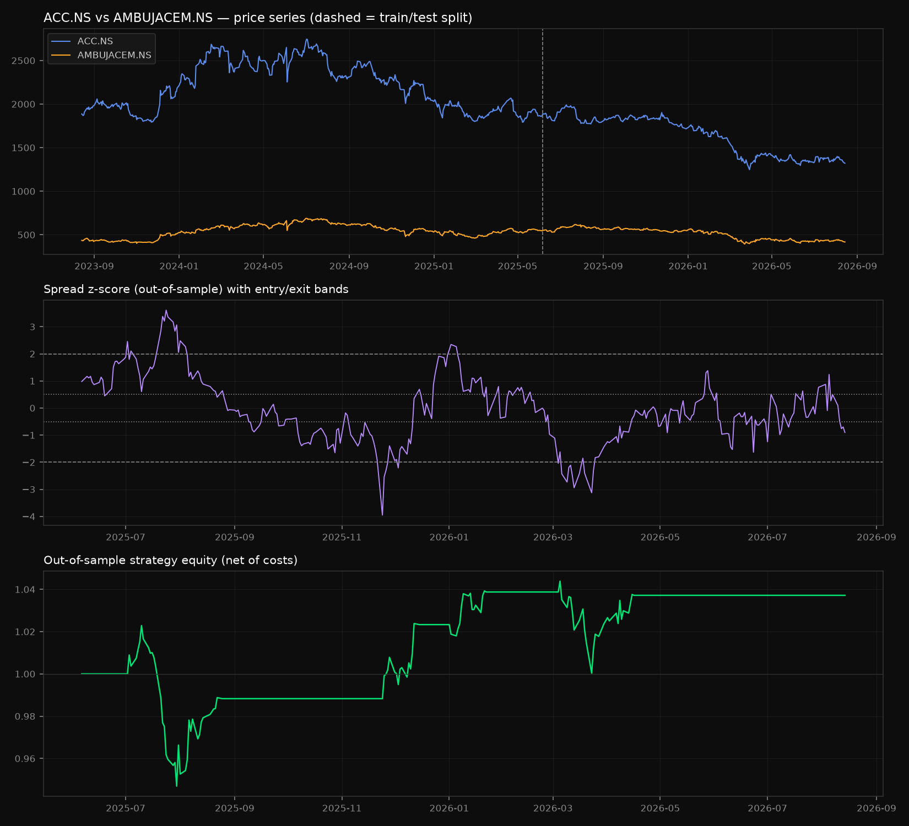

---

### ULTRACEMCO.NS / SHREECEM.NS

- **Latest prices:** ULTRACEMCO.NS ₹11,619.00 · SHREECEM.NS ₹24,795.00
- **Hedge ratio (train-fitted):** 0.6572
- **Cointegration (train):** FAIL at 5% — ADF -2.46, p=0.1265
- **Persistence:** passed 5% in 0 of 32 real-data runs (strict tier: 0/32)
- **Spread half-life:** 33.9 days
- **Current z-score:** -1.25
- **Signal today:** watch (approaching band)
- ⚠️ _Pair did not cointegrate on training data. Any signal here is not statistically justified — observation only._

**Out-of-sample backtest** (beta frozen from train window):

| Metric | Value |
|---|---|
| Sharpe | 0.47 |
| Sortino | 0.51 |
| Annualised return | 3.63% |
| Annualised vol | 8.42% |
| Max drawdown | -9.29% |
| Round-trip trades | 6 |

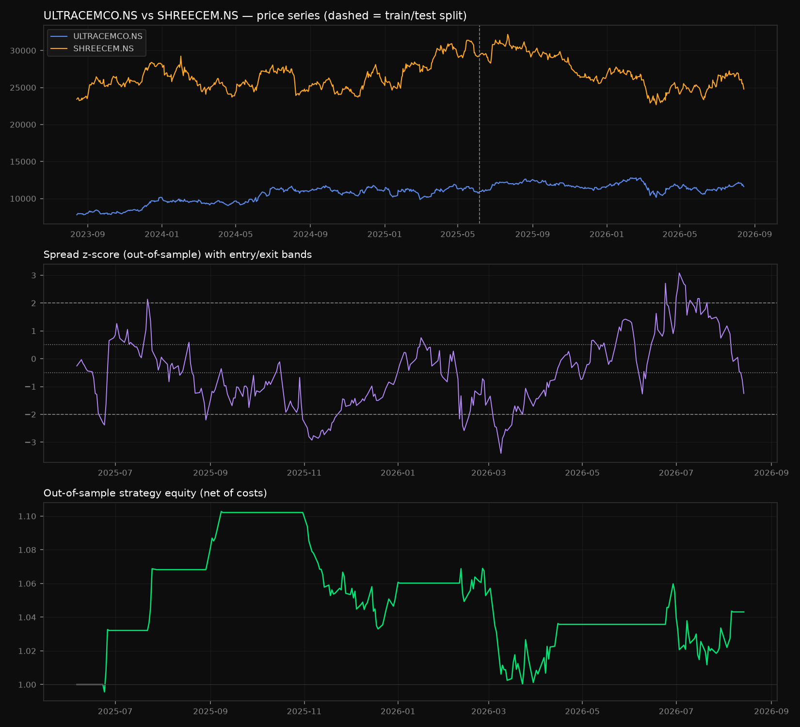

---

### IOC.NS / BPCL.NS

- **Latest prices:** IOC.NS ₹139.40 · BPCL.NS ₹319.45
- **Hedge ratio (train-fitted):** 1.7778
- **Cointegration (train):** FAIL at 5% — ADF -0.76, p=0.8294
- **Persistence:** passed 5% in 0 of 32 real-data runs (strict tier: 0/32)
- **Spread half-life:** 144.1 days
- **Current z-score:** +1.40
- **Signal today:** watch (approaching band)
- ⚠️ _Pair did not cointegrate on training data. Any signal here is not statistically justified — observation only._

**Out-of-sample backtest** (beta frozen from train window):

| Metric | Value |
|---|---|
| Sharpe | 0.55 |
| Sortino | 0.62 |
| Annualised return | 3.54% |
| Annualised vol | 6.79% |
| Max drawdown | -6.71% |
| Round-trip trades | 7 |

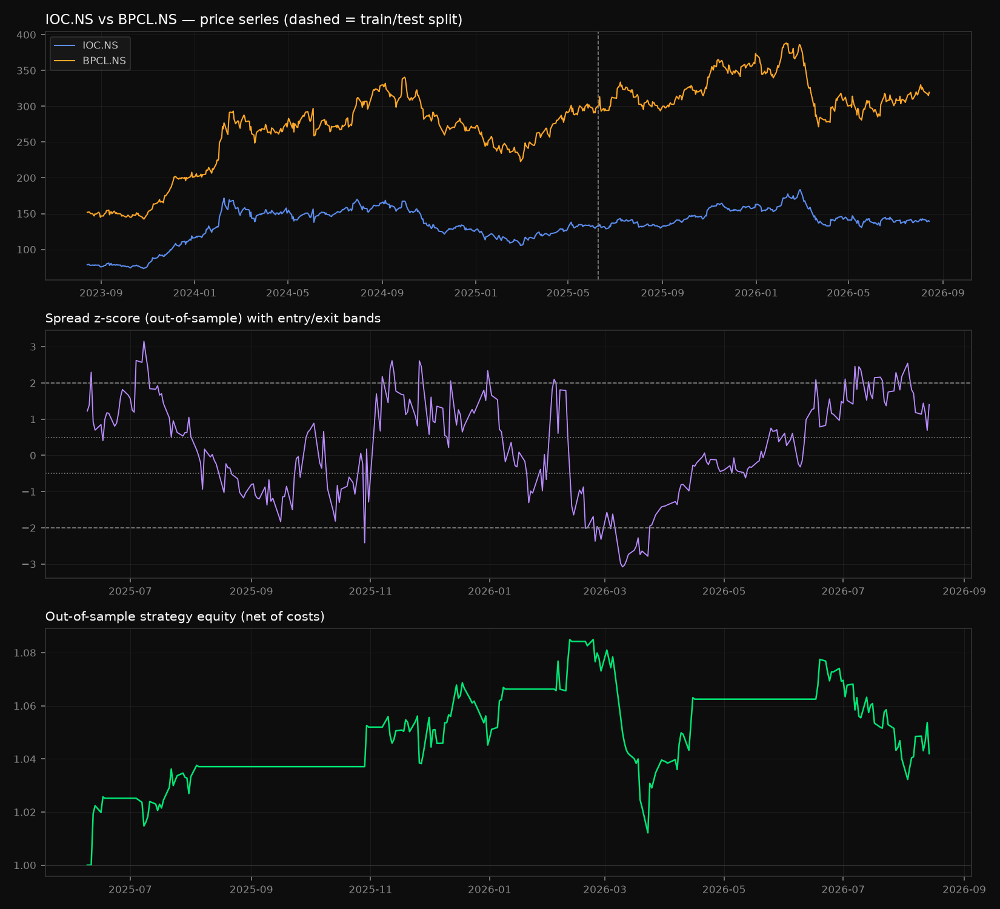

---

### BPCL.NS / HINDPETRO.NS

- **Latest prices:** BPCL.NS ₹319.45 · HINDPETRO.NS ₹373.50
- **Hedge ratio (train-fitted):** 1.3592
- **Cointegration (train):** FAIL at 5% — ADF -1.92, p=0.3226
- **Persistence:** passed 5% in 0 of 32 real-data runs (strict tier: 0/32)
- **Spread half-life:** 41.1 days
- **Current z-score:** -1.34
- **Signal today:** watch (approaching band)
- ⚠️ _Pair did not cointegrate on training data. Any signal here is not statistically justified — observation only._

**Out-of-sample backtest** (beta frozen from train window):

| Metric | Value |
|---|---|
| Sharpe | -0.17 |
| Sortino | -0.16 |
| Annualised return | -1.20% |
| Annualised vol | 5.93% |
| Max drawdown | -6.85% |
| Round-trip trades | 4 |

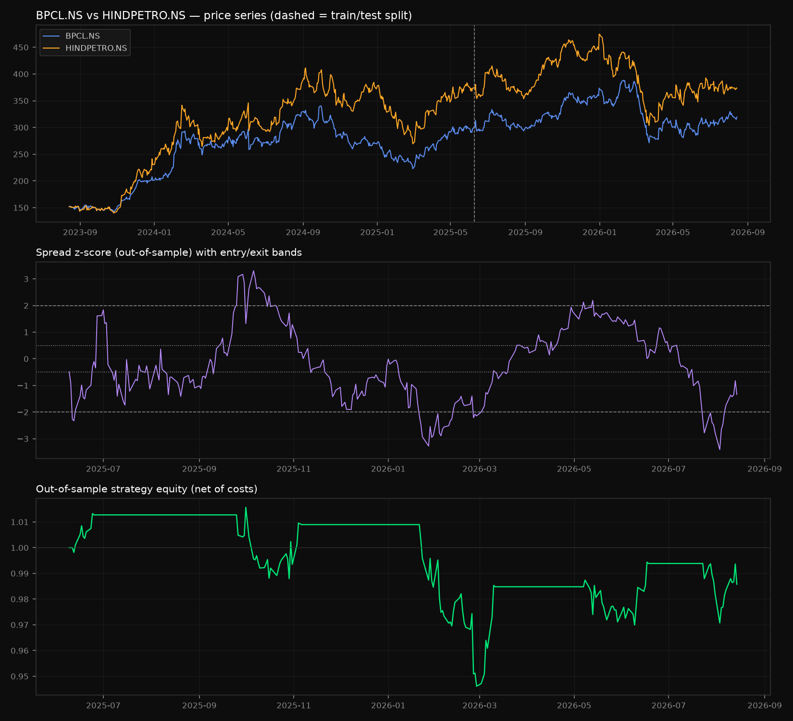

---

### ONGC.NS / COALINDIA.NS

- **Latest prices:** ONGC.NS ₹236.40 · COALINDIA.NS ₹407.10
- **Hedge ratio (train-fitted):** 1.6093
- **Cointegration (train):** PASS at 5% — ADF -3.45, p=0.0092
- **Persistence:** passed 5% in 24 of 32 real-data runs (strict tier: 0/32)
- **Spread half-life:** 13.7 days
- **Current z-score:** -0.44
- **Signal today:** flat / no stretch

**Out-of-sample backtest** (beta frozen from train window):

| Metric | Value |
|---|---|
| Sharpe | 0.74 |
| Sortino | 0.59 |
| Annualised return | 5.27% |
| Annualised vol | 7.28% |
| Max drawdown | -5.70% |
| Round-trip trades | 5 |

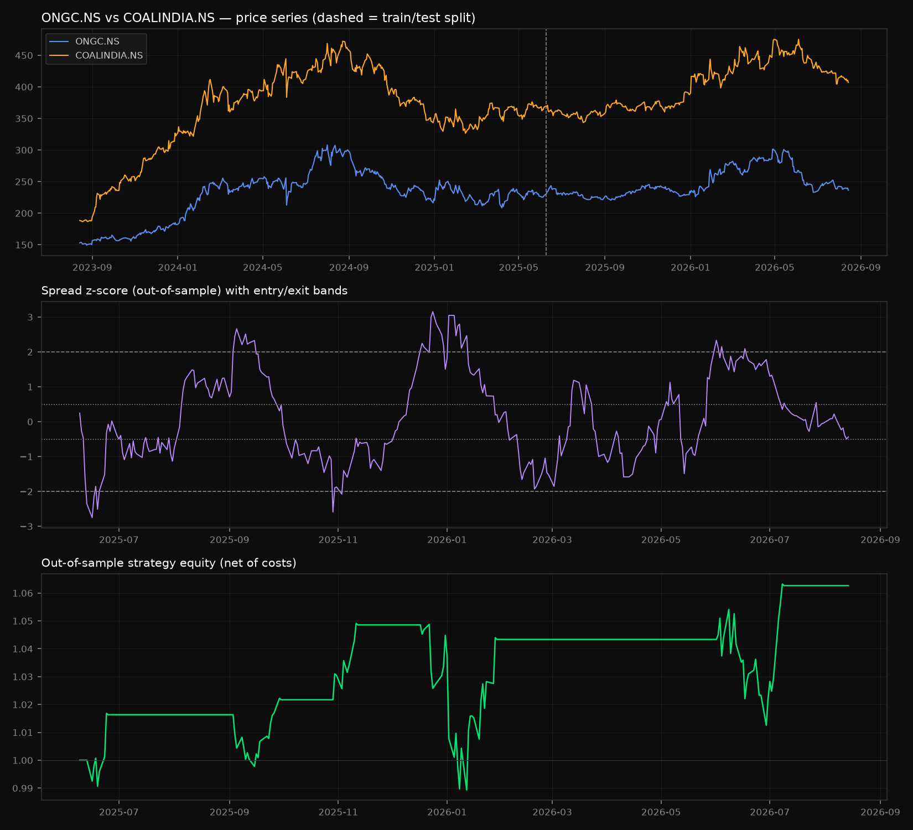

---

### NTPC.NS / POWERGRID.NS

- **Latest prices:** NTPC.NS ₹340.00 · POWERGRID.NS ₹266.05
- **Hedge ratio (train-fitted):** 0.8353
- **Cointegration (train):** FAIL at 5% — ADF -2.52, p=0.1118
- **Persistence:** passed 5% in 0 of 32 real-data runs (strict tier: 0/32)
- **Spread half-life:** 23.5 days
- **Current z-score:** -0.68
- **Signal today:** watch (approaching band)
- ⚠️ _Pair did not cointegrate on training data. Any signal here is not statistically justified — observation only._

**Out-of-sample backtest** (beta frozen from train window):

| Metric | Value |
|---|---|
| Sharpe | 0.38 |
| Sortino | 0.29 |
| Annualised return | 1.94% |
| Annualised vol | 5.46% |
| Max drawdown | -5.21% |
| Round-trip trades | 6 |

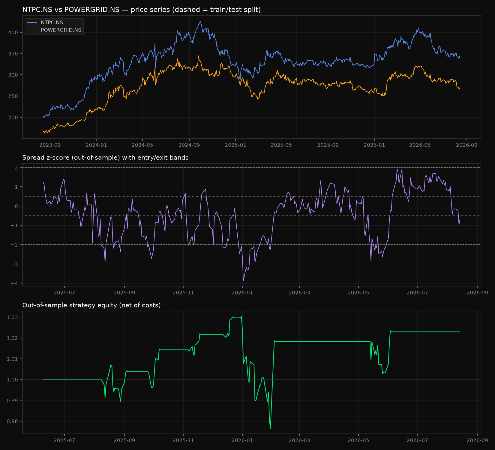

---

### BAJAJ-AUTO.NS / HEROMOTOCO.NS

- **Latest prices:** BAJAJ-AUTO.NS ₹11,700.00 · HEROMOTOCO.NS ₹5,790.00
- **Hedge ratio (train-fitted):** 0.4082
- **Cointegration (train):** FAIL at 5% — ADF -2.25, p=0.1896
- **Persistence:** passed 5% in 0 of 32 real-data runs (strict tier: 0/32)
- **Spread half-life:** 30.2 days
- **Current z-score:** +1.81
- **Signal today:** watch (approaching band)
- ⚠️ _Pair did not cointegrate on training data. Any signal here is not statistically justified — observation only._

**Out-of-sample backtest** (beta frozen from train window):

| Metric | Value |
|---|---|
| Sharpe | -1.16 |
| Sortino | -1.15 |
| Annualised return | -11.72% |
| Annualised vol | 10.31% |
| Max drawdown | -20.92% |
| Round-trip trades | 4 |

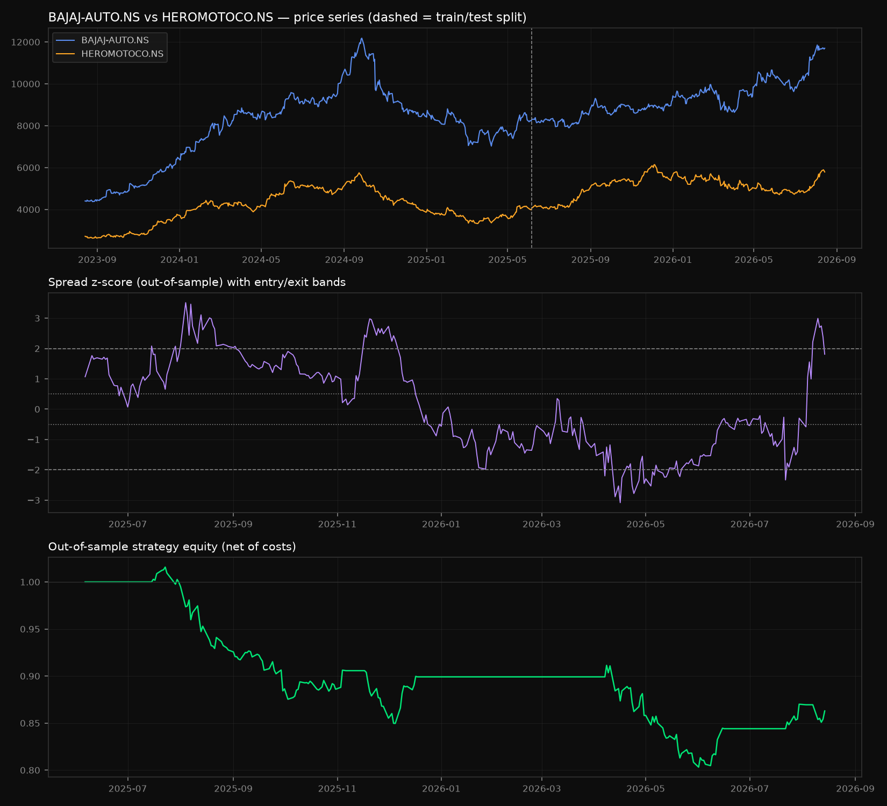

---

### TATASTEEL.NS / JSWSTEEL.NS

- **Latest prices:** TATASTEEL.NS ₹183.50 · JSWSTEEL.NS ₹1,270.00
- **Hedge ratio (train-fitted):** 3.0871
- **Cointegration (train):** FAIL at 5% — ADF -1.17, p=0.6861
- **Persistence:** passed 5% in 0 of 32 real-data runs (strict tier: 0/32)
- **Spread half-life:** 71.1 days
- **Current z-score:** +1.39
- **Signal today:** watch (approaching band)
- ⚠️ _Pair did not cointegrate on training data. Any signal here is not statistically justified — observation only._

**Out-of-sample backtest** (beta frozen from train window):

| Metric | Value |
|---|---|
| Sharpe | 0.19 |
| Sortino | 0.16 |
| Annualised return | 1.13% |
| Annualised vol | 7.58% |
| Max drawdown | -3.91% |
| Round-trip trades | 4 |

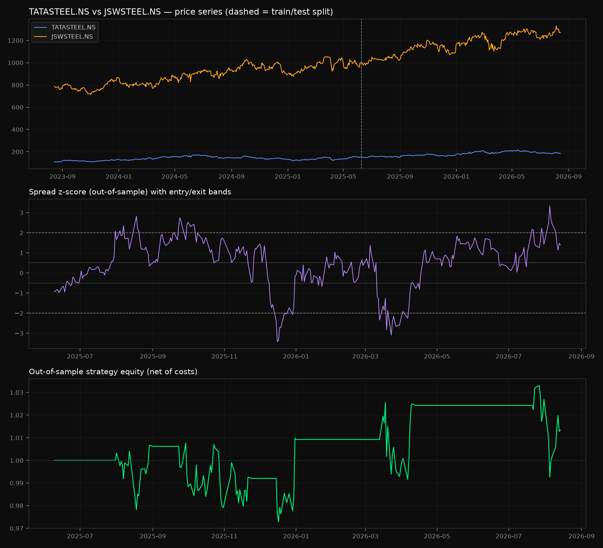

---

### SUNPHARMA.NS / CIPLA.NS

- **Latest prices:** SUNPHARMA.NS ₹1,930.00 · CIPLA.NS ₹1,450.00
- **Hedge ratio (train-fitted):** 0.4880
- **Cointegration (train):** PASS at 5% — ADF -3.40, p=0.0111
- **Persistence:** passed 5% in 32 of 32 real-data runs (strict tier: 5/32)
- **Spread half-life:** 10.7 days
- **Current z-score:** +0.16
- **Signal today:** flat / no stretch

**Out-of-sample backtest** (beta frozen from train window):

| Metric | Value |
|---|---|
| Sharpe | -0.10 |
| Sortino | -0.11 |
| Annualised return | -1.08% |
| Annualised vol | 7.64% |
| Max drawdown | -10.26% |
| Round-trip trades | 5 |

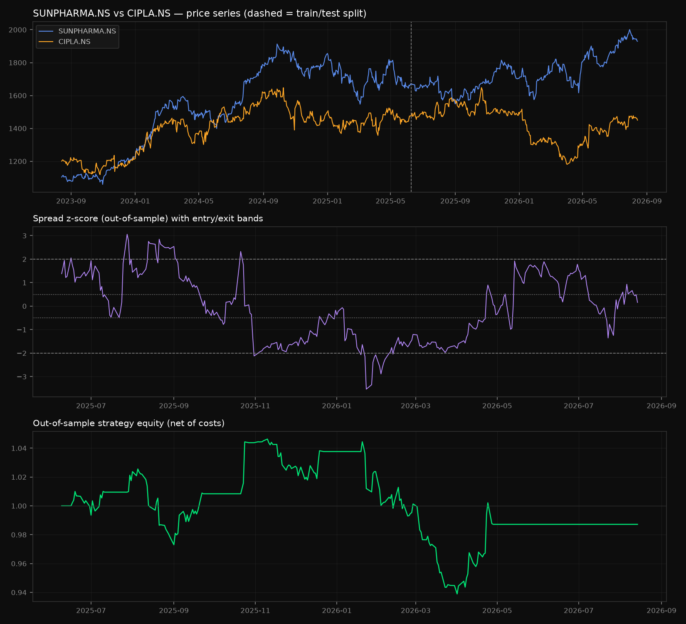

---

_Generated 2026-08-14 · pairs mean-reversion scanner · out-of-sample backtest · multiple-testing-aware · not investment advice._
