# Indian Pairs-Trading Scanner — 2026-08-17

> **What this is:** a market-neutral *pairs mean-reversion* scanner. It flags when two related NSE stocks have drifted apart far enough that their historical relationship signals a possible convergence trade. It does **not** forecast growth, rank "best" stocks, or predict company performance. A signal means the *spread between two stocks* is stretched — nothing about either stock being a good investment. Not investment advice; do your own research.

## Methodology (fixed in advance)

- **Universe:** 16 declared sector-mate pairs. Parameters (3y window, 60/40 train-test, z-entry 2.0, z-exit 0.5, 5 bps costs) are pre-registered; changes are logged in the README changelog *before* looking at results.
- **Multiple testing:** at the 5% level across 16 pairs, **≈0.8 false positives per run are expected by chance alone** even if nothing truly cointegrates. A single-day pass is a candidate, not a discovery.
- **Strict tier:** Bonferroni-corrected threshold p < 0.0031 (marked ✓✓).
- **Evidence = persistence:** the Persistence column counts how often each pair has passed the 5% test across all *real-data* daily runs recorded in `reports/history.csv`. Pairs deserve attention only when they pass persistently.

## Summary

| Pair | p-value | Coint. | Persistence | Current z | Signal | OOS Sharpe |
|---|---|---|---|---|---|---|
| HDFCBANK.NS/ICICIBANK.NS | 0.0863 | ✗ | 0/26 | +1.37 | watch | -0.51 |
| AXISBANK.NS/ICICIBANK.NS | 0.8639 | ✗ | 0/33 | +1.17 | watch | -0.29 |
| KOTAKBANK.NS/HDFCBANK.NS | 0.1535 | ✗ | 0/33 | -1.11 | watch | 0.93 |
| SBIN.NS/BANKBARODA.NS | 0.1424 | ✗ | 0/33 | -1.15 | watch | 0.28 |
| TCS.NS/INFY.NS | 0.5444 | ✗ | 0/33 | -0.39 | flat / no stretch | 1.68 |
| INFY.NS/WIPRO.NS | 0.1834 | ✗ | 0/33 | -0.52 | watch | 1.67 |
| HCLTECH.NS/TECHM.NS | 0.2104 | ✗ | 0/33 | +0.26 | flat / no stretch | -0.06 |
| ACC.NS/AMBUJACEM.NS | 0.7930 | ✗ | 0/33 | -1.11 | watch | 0.54 |
| ULTRACEMCO.NS/SHREECEM.NS | 0.1327 | ✗ | 0/33 | -1.55 | watch | 0.46 |
| IOC.NS/BPCL.NS | 0.8240 | ✗ | 0/33 | +1.18 | watch | 0.58 |
| BPCL.NS/HINDPETRO.NS | 0.3093 | ✗ | 0/33 | -1.18 | watch | -0.15 |
| ONGC.NS/COALINDIA.NS | 0.0090 | ✓ | 25/33 | -0.66 | watch | 0.74 |
| NTPC.NS/POWERGRID.NS | 0.1170 | ✗ | 0/33 | -0.42 | flat / no stretch | 0.38 |
| BAJAJ-AUTO.NS/HEROMOTOCO.NS | 0.1761 | ✗ | 0/33 | +1.56 | watch | -1.12 |
| TATASTEEL.NS/JSWSTEEL.NS | 0.6825 | ✗ | 0/33 | +1.41 | watch | 0.11 |
| SUNPHARMA.NS/CIPLA.NS | 0.0112 | ✓ | 33/33 | +0.35 | flat / no stretch | -0.11 |

_Legend: ✓✓ passes strict Bonferroni tier · ✓ passes 5% only · ✗ fails. Persistence = 5%-passes / real-data runs recorded. \*no real-data history yet._

---

### HDFCBANK.NS / ICICIBANK.NS

- **Latest prices:** HDFCBANK.NS ₹729.00 · ICICIBANK.NS ₹1,415.30
- **Hedge ratio (train-fitted):** 1.7716
- **Cointegration (train):** FAIL at 5% — ADF -2.63, p=0.0863
- **Persistence:** passed 5% in 0 of 26 real-data runs (strict tier: 0/26)
- **Spread half-life:** 26.9 days
- **Current z-score:** +1.37
- **Signal today:** watch (approaching band)
- ⚠️ _Pair did not cointegrate on training data. Any signal here is not statistically justified — observation only._

**Out-of-sample backtest** (beta frozen from train window):

| Metric | Value |
|---|---|
| Sharpe | -0.51 |
| Sortino | -0.53 |
| Annualised return | -3.31% |
| Annualised vol | 6.18% |
| Max drawdown | -8.74% |
| Round-trip trades | 5 |

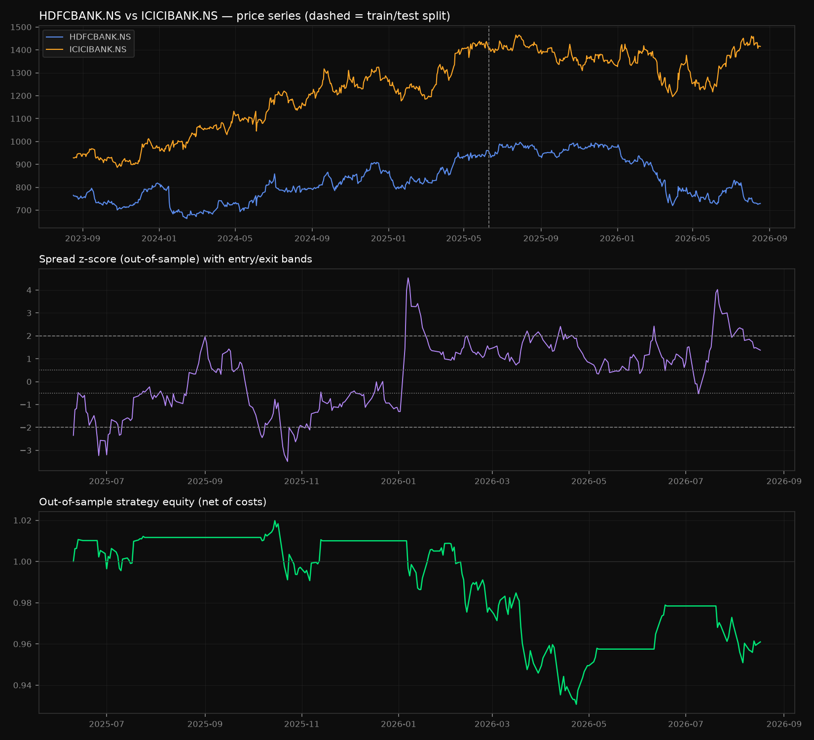

---

### AXISBANK.NS / ICICIBANK.NS

- **Latest prices:** AXISBANK.NS ₹1,227.30 · ICICIBANK.NS ₹1,415.30
- **Hedge ratio (train-fitted):** 0.9588
- **Cointegration (train):** FAIL at 5% — ADF -0.63, p=0.8639
- **Persistence:** passed 5% in 0 of 33 real-data runs (strict tier: 0/33)
- **Spread half-life:** 171.5 days
- **Current z-score:** +1.17
- **Signal today:** watch (approaching band)
- ⚠️ _Pair did not cointegrate on training data. Any signal here is not statistically justified — observation only._

**Out-of-sample backtest** (beta frozen from train window):

| Metric | Value |
|---|---|
| Sharpe | -0.29 |
| Sortino | -0.29 |
| Annualised return | -2.81% |
| Annualised vol | 8.45% |
| Max drawdown | -7.52% |
| Round-trip trades | 6 |

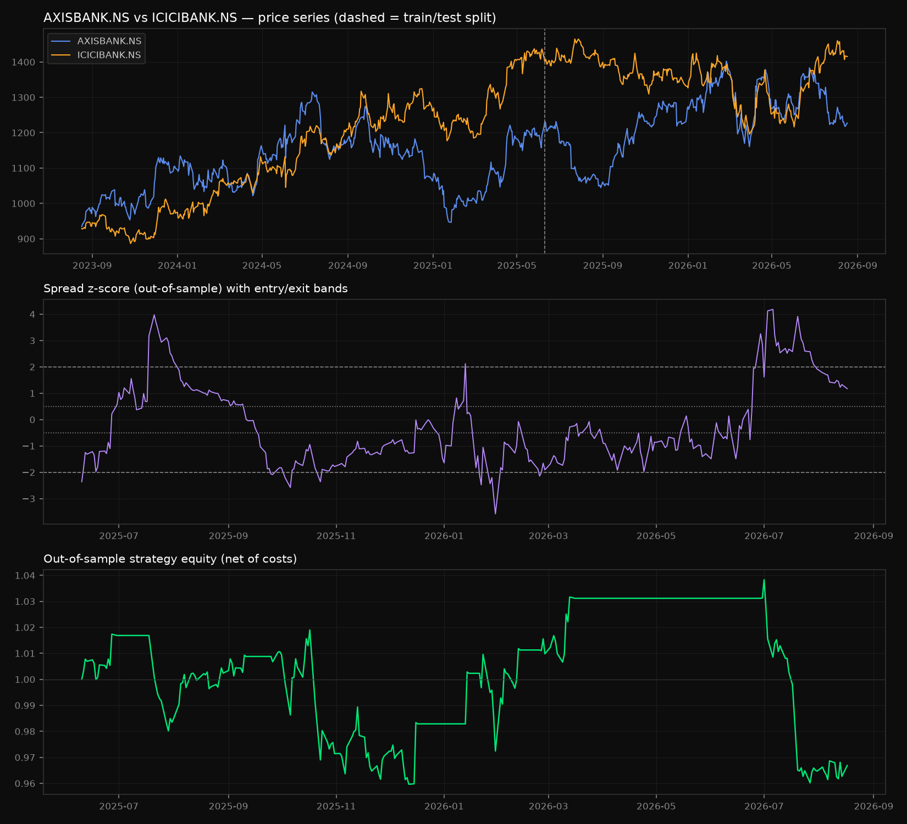

---

### KOTAKBANK.NS / HDFCBANK.NS

- **Latest prices:** KOTAKBANK.NS ₹392.70 · HDFCBANK.NS ₹729.00
- **Hedge ratio (train-fitted):** 2.0044
- **Cointegration (train):** FAIL at 5% — ADF -2.36, p=0.1535
- **Persistence:** passed 5% in 0 of 33 real-data runs (strict tier: 0/33)
- **Spread half-life:** 27.0 days
- **Current z-score:** -1.11
- **Signal today:** watch (approaching band)
- ⚠️ _Pair did not cointegrate on training data. Any signal here is not statistically justified — observation only._

**Out-of-sample backtest** (beta frozen from train window):

| Metric | Value |
|---|---|
| Sharpe | 0.93 |
| Sortino | 0.67 |
| Annualised return | 5.81% |
| Annualised vol | 6.28% |
| Max drawdown | -4.24% |
| Round-trip trades | 6 |

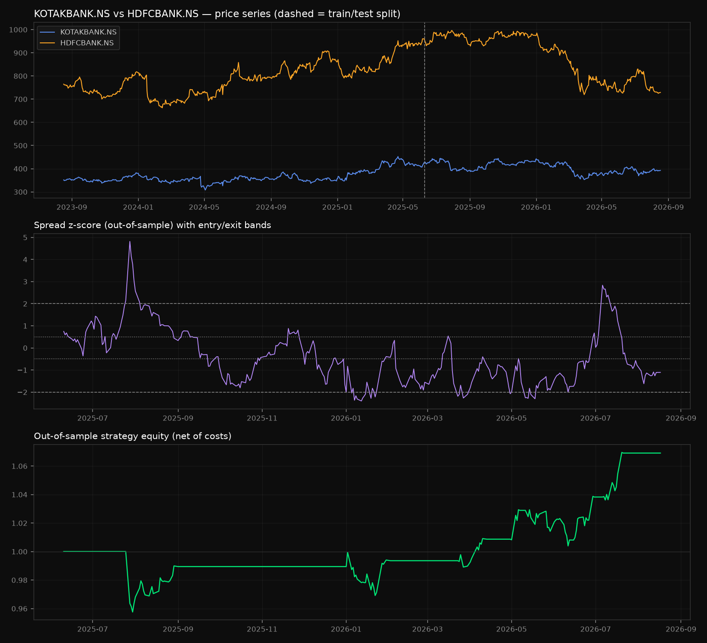

---

### SBIN.NS / BANKBARODA.NS

- **Latest prices:** SBIN.NS ₹1,061.20 · BANKBARODA.NS ₹246.55
- **Hedge ratio (train-fitted):** 0.2005
- **Cointegration (train):** FAIL at 5% — ADF -2.40, p=0.1424
- **Persistence:** passed 5% in 0 of 33 real-data runs (strict tier: 0/33)
- **Spread half-life:** 21.5 days
- **Current z-score:** -1.15
- **Signal today:** watch (approaching band)
- ⚠️ _Pair did not cointegrate on training data. Any signal here is not statistically justified — observation only._

**Out-of-sample backtest** (beta frozen from train window):

| Metric | Value |
|---|---|
| Sharpe | 0.28 |
| Sortino | 0.22 |
| Annualised return | 2.10% |
| Annualised vol | 8.64% |
| Max drawdown | -8.73% |
| Round-trip trades | 5 |

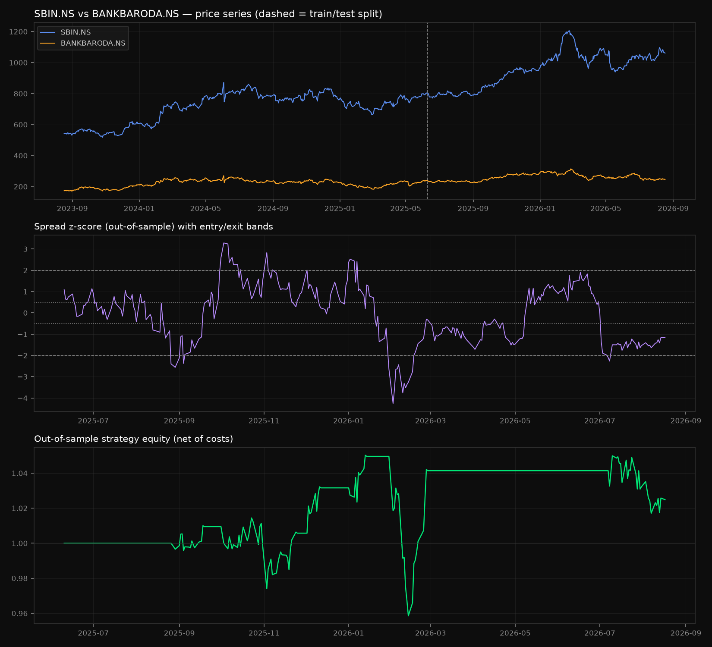

---

### TCS.NS / INFY.NS

- **Latest prices:** TCS.NS ₹2,313.20 · INFY.NS ₹1,139.90
- **Hedge ratio (train-fitted):** 0.5096
- **Cointegration (train):** FAIL at 5% — ADF -1.48, p=0.5444
- **Persistence:** passed 5% in 0 of 33 real-data runs (strict tier: 0/33)
- **Spread half-life:** 51.0 days
- **Current z-score:** -0.39
- **Signal today:** flat / no stretch
- ⚠️ _Pair did not cointegrate on training data. Any signal here is not statistically justified — observation only._

**Out-of-sample backtest** (beta frozen from train window):

| Metric | Value |
|---|---|
| Sharpe | 1.68 |
| Sortino | 1.81 |
| Annualised return | 8.15% |
| Annualised vol | 4.72% |
| Max drawdown | -3.85% |
| Round-trip trades | 8 |

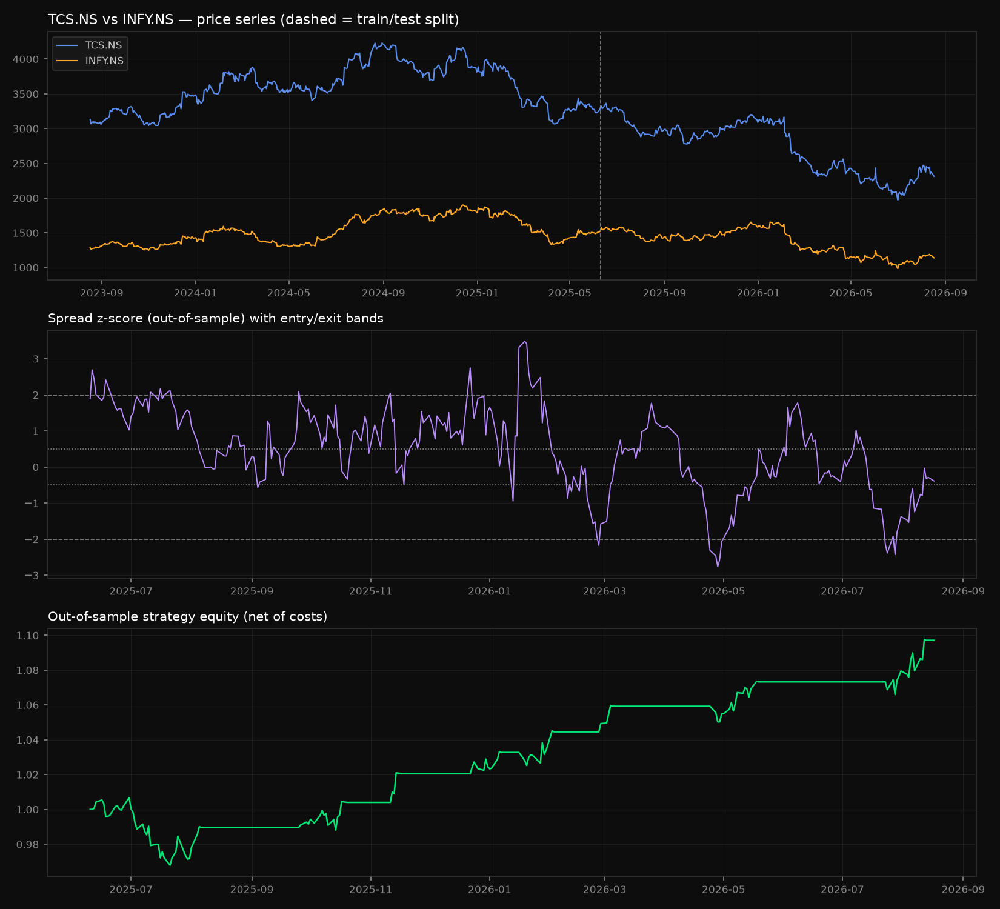

---

### INFY.NS / WIPRO.NS

- **Latest prices:** INFY.NS ₹1,139.90 · WIPRO.NS ₹181.90
- **Hedge ratio (train-fitted):** 0.1364
- **Cointegration (train):** FAIL at 5% — ADF -2.27, p=0.1834
- **Persistence:** passed 5% in 0 of 33 real-data runs (strict tier: 0/33)
- **Spread half-life:** 30.1 days
- **Current z-score:** -0.52
- **Signal today:** watch (approaching band)
- ⚠️ _Pair did not cointegrate on training data. Any signal here is not statistically justified — observation only._

**Out-of-sample backtest** (beta frozen from train window):

| Metric | Value |
|---|---|
| Sharpe | 1.67 |
| Sortino | 1.95 |
| Annualised return | 8.79% |
| Annualised vol | 5.12% |
| Max drawdown | -2.41% |
| Round-trip trades | 6 |

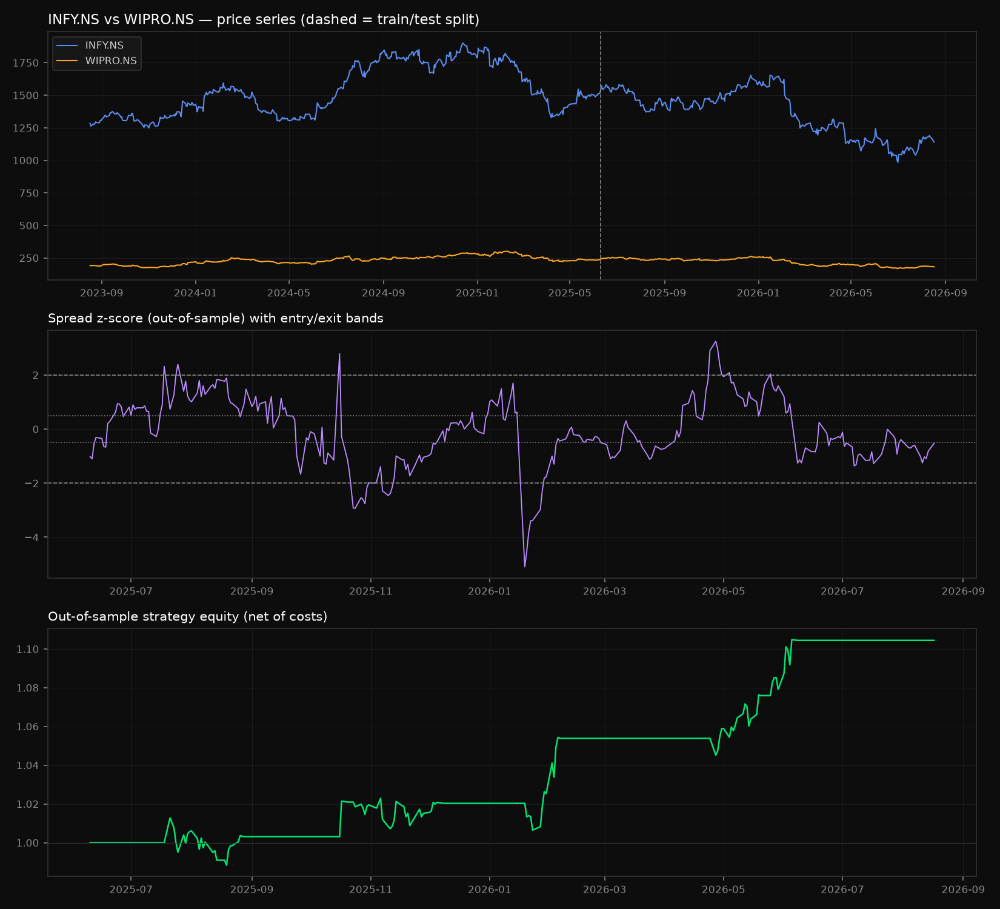

---

### HCLTECH.NS / TECHM.NS

- **Latest prices:** HCLTECH.NS ₹1,325.00 · TECHM.NS ₹1,610.00
- **Hedge ratio (train-fitted):** 0.8450
- **Cointegration (train):** FAIL at 5% — ADF -2.19, p=0.2104
- **Persistence:** passed 5% in 0 of 33 real-data runs (strict tier: 0/33)
- **Spread half-life:** 23.9 days
- **Current z-score:** +0.26
- **Signal today:** flat / no stretch
- ⚠️ _Pair did not cointegrate on training data. Any signal here is not statistically justified — observation only._

**Out-of-sample backtest** (beta frozen from train window):

| Metric | Value |
|---|---|
| Sharpe | -0.06 |
| Sortino | -0.06 |
| Annualised return | -0.74% |
| Annualised vol | 7.51% |
| Max drawdown | -8.11% |
| Round-trip trades | 5 |

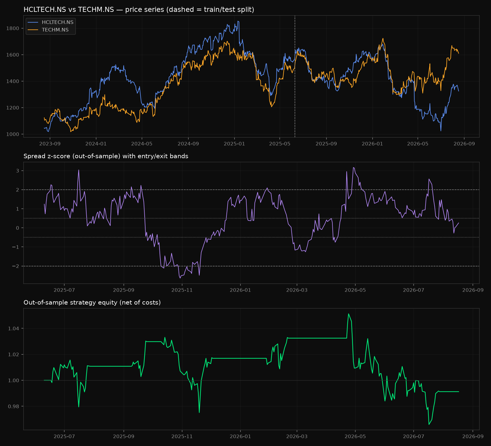

---

### ACC.NS / AMBUJACEM.NS

- **Latest prices:** ACC.NS ₹1,316.60 · AMBUJACEM.NS ₹415.25
- **Hedge ratio (train-fitted):** 0.2215
- **Cointegration (train):** FAIL at 5% — ADF -0.88, p=0.7930
- **Persistence:** passed 5% in 0 of 33 real-data runs (strict tier: 0/33)
- **Spread half-life:** 88.2 days
- **Current z-score:** -1.11
- **Signal today:** watch (approaching band)
- ⚠️ _Pair did not cointegrate on training data. Any signal here is not statistically justified — observation only._

**Out-of-sample backtest** (beta frozen from train window):

| Metric | Value |
|---|---|
| Sharpe | 0.54 |
| Sortino | 0.48 |
| Annualised return | 3.12% |
| Annualised vol | 6.04% |
| Max drawdown | -7.36% |
| Round-trip trades | 4 |

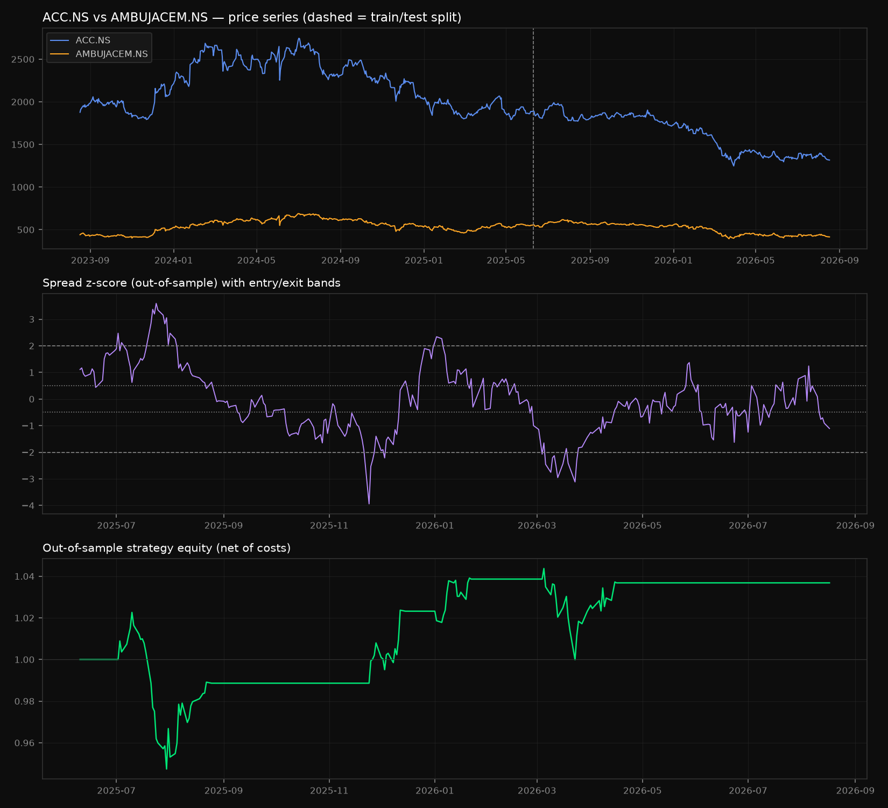

---

### ULTRACEMCO.NS / SHREECEM.NS

- **Latest prices:** ULTRACEMCO.NS ₹11,681.00 · SHREECEM.NS ₹24,535.00
- **Hedge ratio (train-fitted):** 0.6493
- **Cointegration (train):** FAIL at 5% — ADF -2.43, p=0.1327
- **Persistence:** passed 5% in 0 of 33 real-data runs (strict tier: 0/33)
- **Spread half-life:** 33.8 days
- **Current z-score:** -1.55
- **Signal today:** watch (approaching band)
- ⚠️ _Pair did not cointegrate on training data. Any signal here is not statistically justified — observation only._

**Out-of-sample backtest** (beta frozen from train window):

| Metric | Value |
|---|---|
| Sharpe | 0.46 |
| Sortino | 0.49 |
| Annualised return | 3.60% |
| Annualised vol | 8.48% |
| Max drawdown | -9.31% |
| Round-trip trades | 6 |

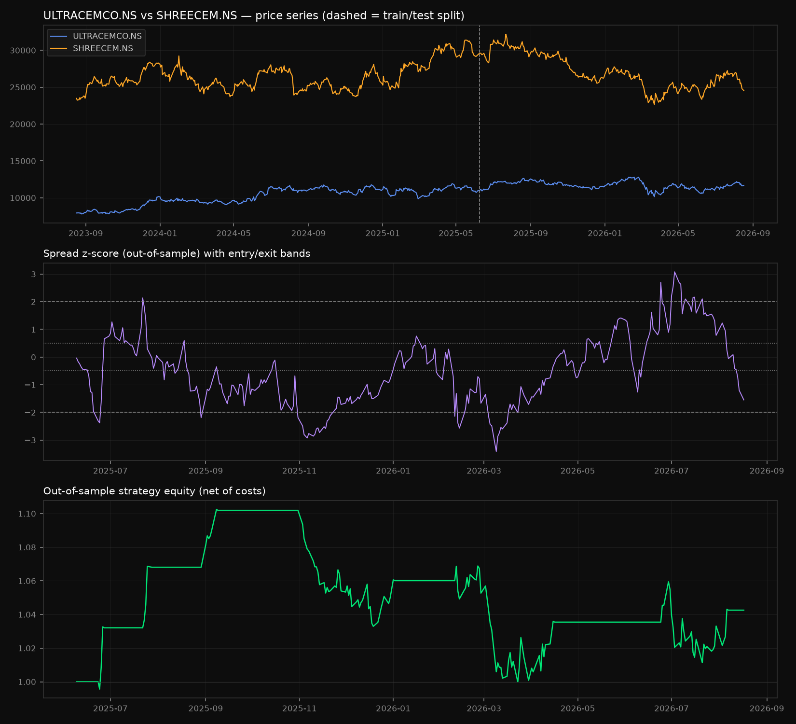

---

### IOC.NS / BPCL.NS

- **Latest prices:** IOC.NS ₹138.61 · BPCL.NS ₹316.65
- **Hedge ratio (train-fitted):** 1.7750
- **Cointegration (train):** FAIL at 5% — ADF -0.78, p=0.8240
- **Persistence:** passed 5% in 0 of 33 real-data runs (strict tier: 0/33)
- **Spread half-life:** 141.1 days
- **Current z-score:** +1.18
- **Signal today:** watch (approaching band)
- ⚠️ _Pair did not cointegrate on training data. Any signal here is not statistically justified — observation only._

**Out-of-sample backtest** (beta frozen from train window):

| Metric | Value |
|---|---|
| Sharpe | 0.58 |
| Sortino | 0.65 |
| Annualised return | 3.78% |
| Annualised vol | 6.83% |
| Max drawdown | -6.76% |
| Round-trip trades | 7 |

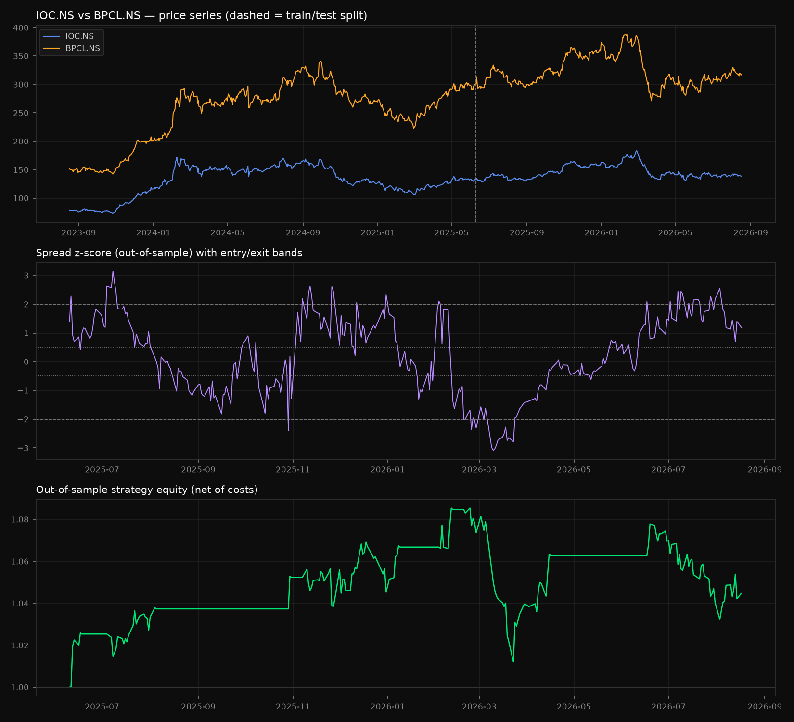

---

### BPCL.NS / HINDPETRO.NS

- **Latest prices:** BPCL.NS ₹316.65 · HINDPETRO.NS ₹371.00
- **Hedge ratio (train-fitted):** 1.3582
- **Cointegration (train):** FAIL at 5% — ADF -1.95, p=0.3093
- **Persistence:** passed 5% in 0 of 33 real-data runs (strict tier: 0/33)
- **Spread half-life:** 40.4 days
- **Current z-score:** -1.18
- **Signal today:** watch (approaching band)
- ⚠️ _Pair did not cointegrate on training data. Any signal here is not statistically justified — observation only._

**Out-of-sample backtest** (beta frozen from train window):

| Metric | Value |
|---|---|
| Sharpe | -0.15 |
| Sortino | -0.14 |
| Annualised return | -1.08% |
| Annualised vol | 5.96% |
| Max drawdown | -6.88% |
| Round-trip trades | 4 |

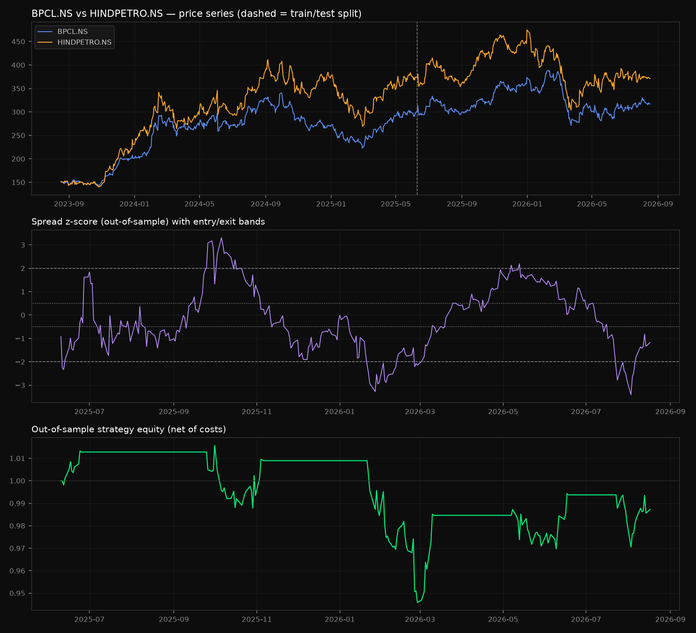

---

### ONGC.NS / COALINDIA.NS

- **Latest prices:** ONGC.NS ₹238.49 · COALINDIA.NS ₹408.45
- **Hedge ratio (train-fitted):** 1.5976
- **Cointegration (train):** PASS at 5% — ADF -3.46, p=0.0090
- **Persistence:** passed 5% in 25 of 33 real-data runs (strict tier: 0/33)
- **Spread half-life:** 13.3 days
- **Current z-score:** -0.66
- **Signal today:** watch (approaching band)

**Out-of-sample backtest** (beta frozen from train window):

| Metric | Value |
|---|---|
| Sharpe | 0.74 |
| Sortino | 0.58 |
| Annualised return | 5.24% |
| Annualised vol | 7.27% |
| Max drawdown | -5.71% |
| Round-trip trades | 5 |

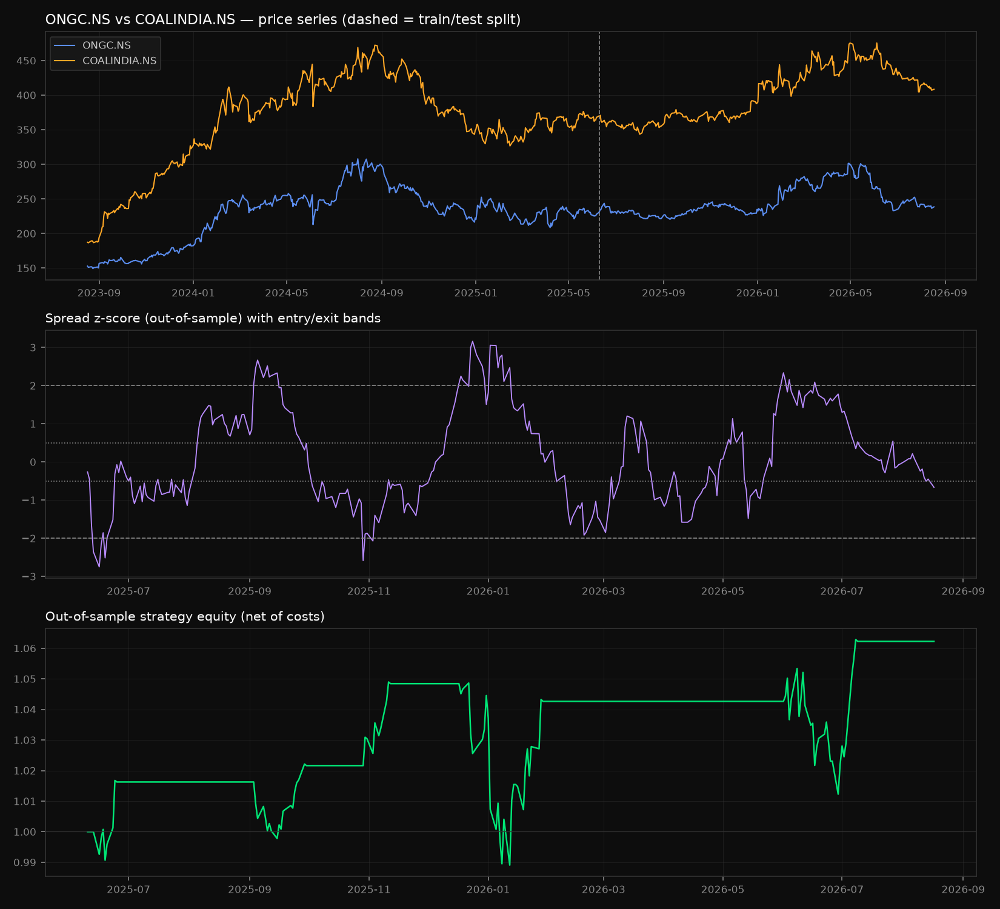

---

### NTPC.NS / POWERGRID.NS

- **Latest prices:** NTPC.NS ₹337.00 · POWERGRID.NS ₹266.15
- **Hedge ratio (train-fitted):** 0.8356
- **Cointegration (train):** FAIL at 5% — ADF -2.49, p=0.1170
- **Persistence:** passed 5% in 0 of 33 real-data runs (strict tier: 0/33)
- **Spread half-life:** 23.7 days
- **Current z-score:** -0.42
- **Signal today:** flat / no stretch
- ⚠️ _Pair did not cointegrate on training data. Any signal here is not statistically justified — observation only._

**Out-of-sample backtest** (beta frozen from train window):

| Metric | Value |
|---|---|
| Sharpe | 0.38 |
| Sortino | 0.29 |
| Annualised return | 1.93% |
| Annualised vol | 5.44% |
| Max drawdown | -5.19% |
| Round-trip trades | 6 |

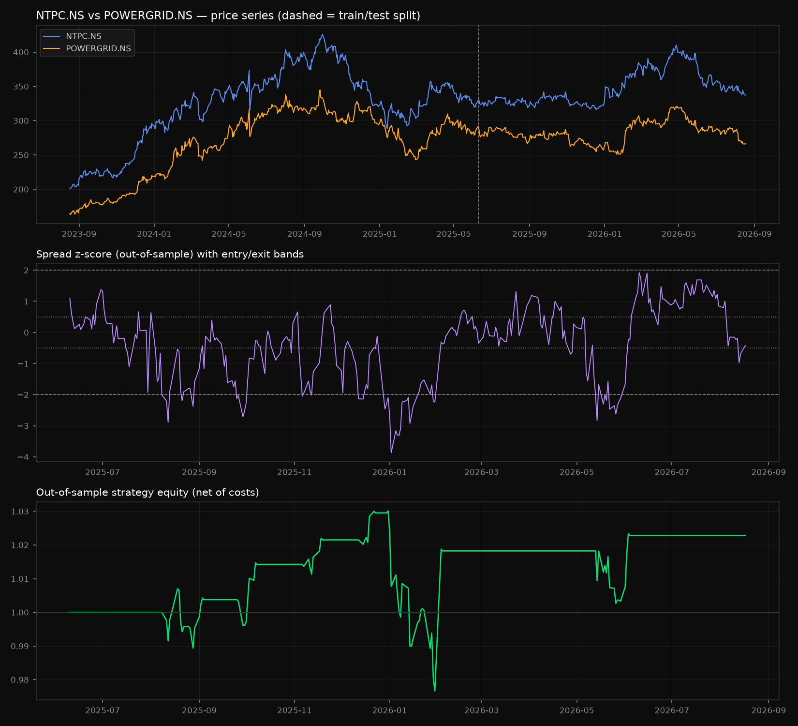

---

### BAJAJ-AUTO.NS / HEROMOTOCO.NS

- **Latest prices:** BAJAJ-AUTO.NS ₹11,663.00 · HEROMOTOCO.NS ₹5,745.00
- **Hedge ratio (train-fitted):** 0.4086
- **Cointegration (train):** FAIL at 5% — ADF -2.29, p=0.1761
- **Persistence:** passed 5% in 0 of 33 real-data runs (strict tier: 0/33)
- **Spread half-life:** 29.7 days
- **Current z-score:** +1.56
- **Signal today:** watch (approaching band)
- ⚠️ _Pair did not cointegrate on training data. Any signal here is not statistically justified — observation only._

**Out-of-sample backtest** (beta frozen from train window):

| Metric | Value |
|---|---|
| Sharpe | -1.12 |
| Sortino | -1.12 |
| Annualised return | -11.27% |
| Annualised vol | 10.17% |
| Max drawdown | -20.67% |
| Round-trip trades | 4 |

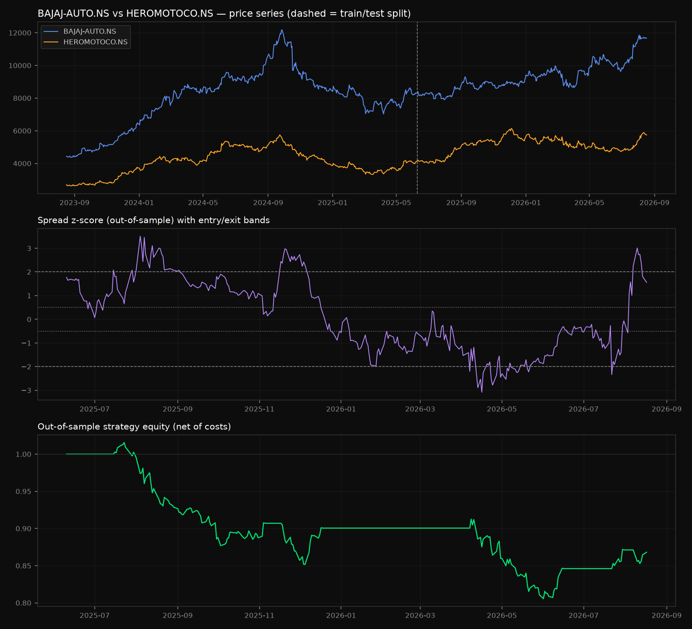

---

### TATASTEEL.NS / JSWSTEEL.NS

- **Latest prices:** TATASTEEL.NS ₹186.00 · JSWSTEEL.NS ₹1,277.80
- **Hedge ratio (train-fitted):** 3.0783
- **Cointegration (train):** FAIL at 5% — ADF -1.18, p=0.6825
- **Persistence:** passed 5% in 0 of 33 real-data runs (strict tier: 0/33)
- **Spread half-life:** 70.8 days
- **Current z-score:** +1.41
- **Signal today:** watch (approaching band)
- ⚠️ _Pair did not cointegrate on training data. Any signal here is not statistically justified — observation only._

**Out-of-sample backtest** (beta frozen from train window):

| Metric | Value |
|---|---|
| Sharpe | 0.11 |
| Sortino | 0.10 |
| Annualised return | 0.56% |
| Annualised vol | 7.67% |
| Max drawdown | -4.27% |
| Round-trip trades | 4 |

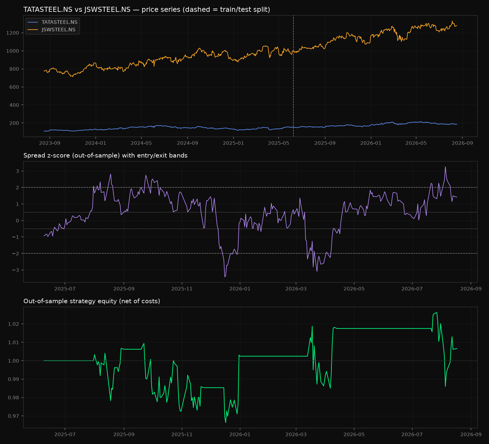

---

### SUNPHARMA.NS / CIPLA.NS

- **Latest prices:** SUNPHARMA.NS ₹1,882.00 · CIPLA.NS ₹1,431.50
- **Hedge ratio (train-fitted):** 0.4886
- **Cointegration (train):** PASS at 5% — ADF -3.39, p=0.0112
- **Persistence:** passed 5% in 33 of 33 real-data runs (strict tier: 5/33)
- **Spread half-life:** 10.7 days
- **Current z-score:** +0.35
- **Signal today:** flat / no stretch

**Out-of-sample backtest** (beta frozen from train window):

| Metric | Value |
|---|---|
| Sharpe | -0.11 |
| Sortino | -0.11 |
| Annualised return | -1.09% |
| Annualised vol | 7.63% |
| Max drawdown | -10.25% |
| Round-trip trades | 5 |

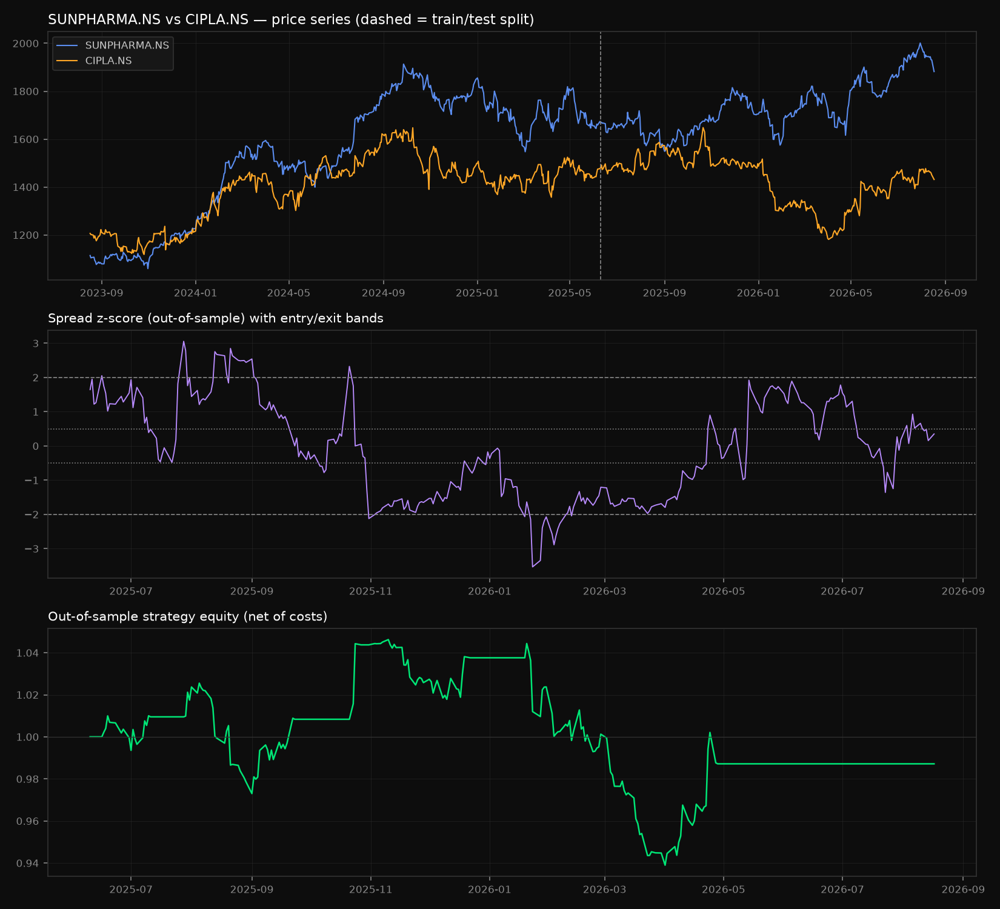

---

_Generated 2026-08-17 · pairs mean-reversion scanner · out-of-sample backtest · multiple-testing-aware · not investment advice._
