# Indian Pairs-Trading Scanner — 2026-08-18

> **What this is:** a market-neutral *pairs mean-reversion* scanner. It flags when two related NSE stocks have drifted apart far enough that their historical relationship signals a possible convergence trade. It does **not** forecast growth, rank "best" stocks, or predict company performance. A signal means the *spread between two stocks* is stretched — nothing about either stock being a good investment. Not investment advice; do your own research.

## Methodology (fixed in advance)

- **Universe:** 16 declared sector-mate pairs. Parameters (3y window, 60/40 train-test, z-entry 2.0, z-exit 0.5, 5 bps costs) are pre-registered; changes are logged in the README changelog *before* looking at results.
- **Multiple testing:** at the 5% level across 16 pairs, **≈0.8 false positives per run are expected by chance alone** even if nothing truly cointegrates. A single-day pass is a candidate, not a discovery.
- **Strict tier:** Bonferroni-corrected threshold p < 0.0031 (marked ✓✓).
- **Evidence = persistence:** the Persistence column counts how often each pair has passed the 5% test across all *real-data* daily runs recorded in `reports/history.csv`. Pairs deserve attention only when they pass persistently.

## Summary

| Pair | p-value | Coint. | Persistence | Current z | Signal | OOS Sharpe |
|---|---|---|---|---|---|---|
| HDFCBANK.NS/ICICIBANK.NS | 0.0891 | ✗ | 0/27 | +1.41 | watch | -0.69 |
| AXISBANK.NS/ICICIBANK.NS | 0.8201 | ✗ | 0/34 | +0.95 | watch | -0.40 |
| KOTAKBANK.NS/HDFCBANK.NS | 0.1410 | ✗ | 0/34 | -0.98 | watch | 0.93 |
| SBIN.NS/BANKBARODA.NS | 0.1395 | ✗ | 0/34 | -1.16 | watch | 0.26 |
| TCS.NS/INFY.NS | 0.5476 | ✗ | 0/34 | -0.55 | watch | 1.69 |
| INFY.NS/WIPRO.NS | 0.1843 | ✗ | 0/34 | -0.56 | watch | 1.67 |
| HCLTECH.NS/TECHM.NS | 0.2365 | ✗ | 0/34 | +0.40 | flat / no stretch | -0.07 |
| ACC.NS/AMBUJACEM.NS | 0.7980 | ✗ | 0/34 | -1.08 | watch | 0.54 |
| ULTRACEMCO.NS/SHREECEM.NS | 0.1476 | ✗ | 0/34 | -1.19 | watch | 0.46 |
| IOC.NS/BPCL.NS | 0.8365 | ✗ | 0/34 | +0.54 | watch | 0.69 |
| BPCL.NS/HINDPETRO.NS | 0.3065 | ✗ | 0/34 | -0.82 | watch | -0.09 |
| ONGC.NS/COALINDIA.NS | 0.0086 | ✓ | 26/34 | -1.03 | watch | 0.74 |
| NTPC.NS/POWERGRID.NS | 0.1133 | ✗ | 0/34 | -0.26 | flat / no stretch | 0.38 |
| BAJAJ-AUTO.NS/HEROMOTOCO.NS | 0.1766 | ✗ | 0/34 | +1.63 | watch | -1.15 |
| TATASTEEL.NS/JSWSTEEL.NS | 0.6963 | ✗ | 0/34 | +0.97 | watch | 0.44 |
| SUNPHARMA.NS/CIPLA.NS | 0.0115 | ✓ | 34/34 | +0.46 | flat / no stretch | -0.11 |

_Legend: ✓✓ passes strict Bonferroni tier · ✓ passes 5% only · ✗ fails. Persistence = 5%-passes / real-data runs recorded. \*no real-data history yet._

---

### HDFCBANK.NS / ICICIBANK.NS

- **Latest prices:** HDFCBANK.NS ₹723.00 · ICICIBANK.NS ₹1,412.00
- **Hedge ratio (train-fitted):** 1.7679
- **Cointegration (train):** FAIL at 5% — ADF -2.62, p=0.0891
- **Persistence:** passed 5% in 0 of 27 real-data runs (strict tier: 0/27)
- **Spread half-life:** 26.9 days
- **Current z-score:** +1.41
- **Signal today:** watch (approaching band)
- ⚠️ _Pair did not cointegrate on training data. Any signal here is not statistically justified — observation only._

**Out-of-sample backtest** (beta frozen from train window):

| Metric | Value |
|---|---|
| Sharpe | -0.69 |
| Sortino | -0.71 |
| Annualised return | -4.32% |
| Annualised vol | 6.15% |
| Max drawdown | -8.74% |
| Round-trip trades | 4 |

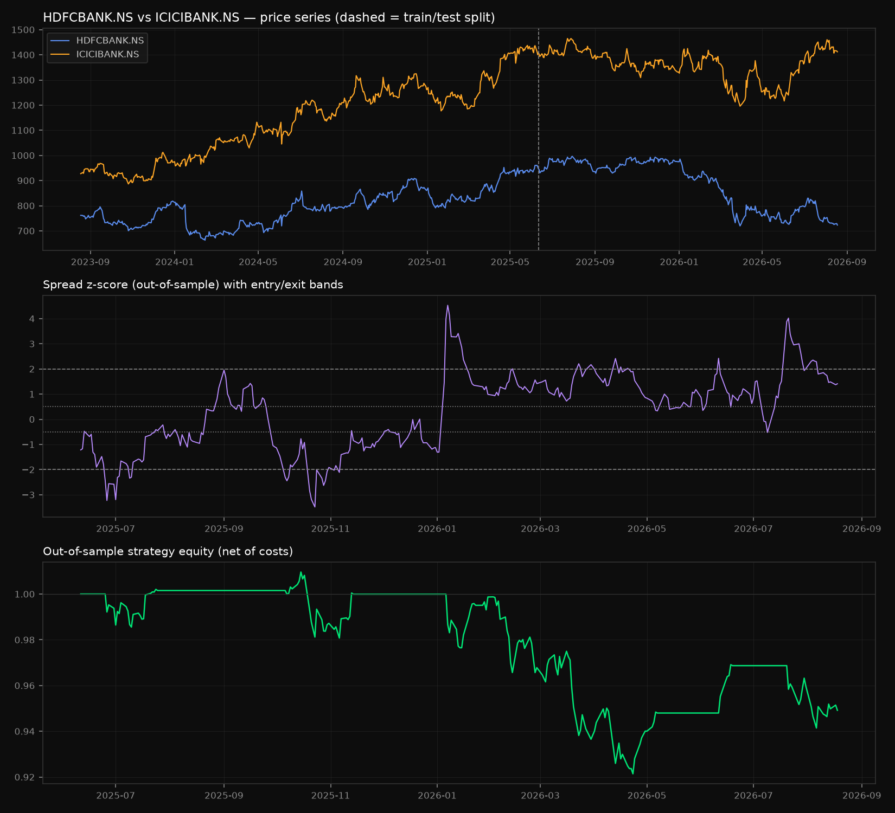

---

### AXISBANK.NS / ICICIBANK.NS

- **Latest prices:** AXISBANK.NS ₹1,243.00 · ICICIBANK.NS ₹1,412.00
- **Hedge ratio (train-fitted):** 0.9618
- **Cointegration (train):** FAIL at 5% — ADF -0.80, p=0.8201
- **Persistence:** passed 5% in 0 of 34 real-data runs (strict tier: 0/34)
- **Spread half-life:** 148.5 days
- **Current z-score:** +0.95
- **Signal today:** watch (approaching band)
- ⚠️ _Pair did not cointegrate on training data. Any signal here is not statistically justified — observation only._

**Out-of-sample backtest** (beta frozen from train window):

| Metric | Value |
|---|---|
| Sharpe | -0.40 |
| Sortino | -0.38 |
| Annualised return | -3.59% |
| Annualised vol | 8.33% |
| Max drawdown | -7.51% |
| Round-trip trades | 5 |

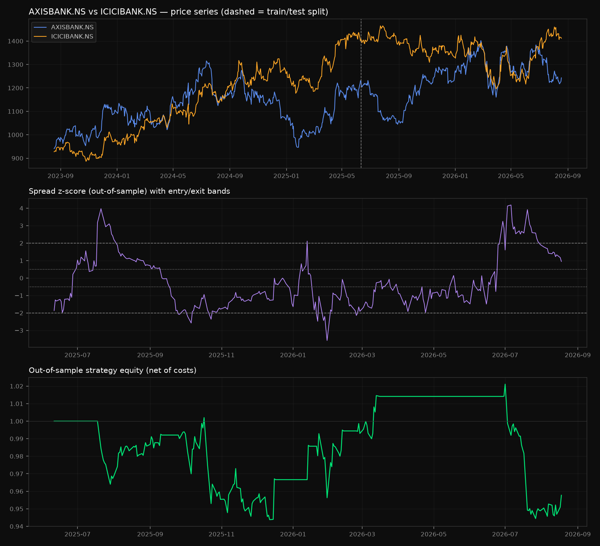

---

### KOTAKBANK.NS / HDFCBANK.NS

- **Latest prices:** KOTAKBANK.NS ₹387.65 · HDFCBANK.NS ₹723.00
- **Hedge ratio (train-fitted):** 2.0108
- **Cointegration (train):** FAIL at 5% — ADF -2.40, p=0.1410
- **Persistence:** passed 5% in 0 of 34 real-data runs (strict tier: 0/34)
- **Spread half-life:** 26.5 days
- **Current z-score:** -0.98
- **Signal today:** watch (approaching band)
- ⚠️ _Pair did not cointegrate on training data. Any signal here is not statistically justified — observation only._

**Out-of-sample backtest** (beta frozen from train window):

| Metric | Value |
|---|---|
| Sharpe | 0.93 |
| Sortino | 0.67 |
| Annualised return | 5.85% |
| Annualised vol | 6.33% |
| Max drawdown | -4.27% |
| Round-trip trades | 6 |

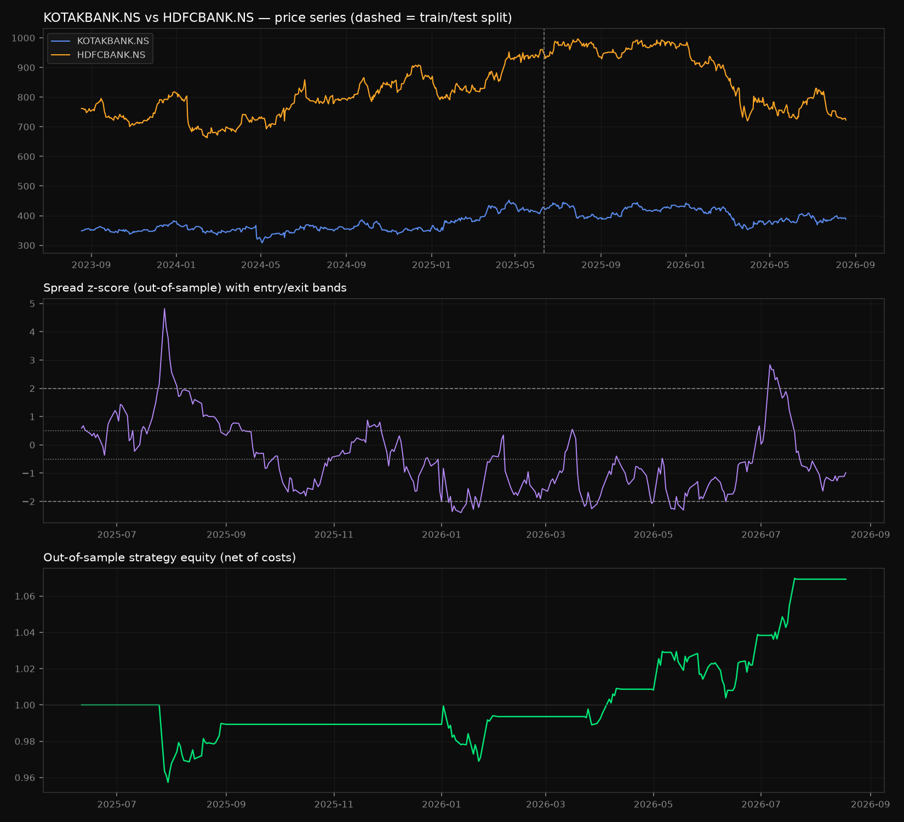

---

### SBIN.NS / BANKBARODA.NS

- **Latest prices:** SBIN.NS ₹1,053.00 · BANKBARODA.NS ₹244.00
- **Hedge ratio (train-fitted):** 0.2000
- **Cointegration (train):** FAIL at 5% — ADF -2.41, p=0.1395
- **Persistence:** passed 5% in 0 of 34 real-data runs (strict tier: 0/34)
- **Spread half-life:** 21.6 days
- **Current z-score:** -1.16
- **Signal today:** watch (approaching band)
- ⚠️ _Pair did not cointegrate on training data. Any signal here is not statistically justified — observation only._

**Out-of-sample backtest** (beta frozen from train window):

| Metric | Value |
|---|---|
| Sharpe | 0.26 |
| Sortino | 0.20 |
| Annualised return | 1.93% |
| Annualised vol | 8.75% |
| Max drawdown | -8.82% |
| Round-trip trades | 5 |

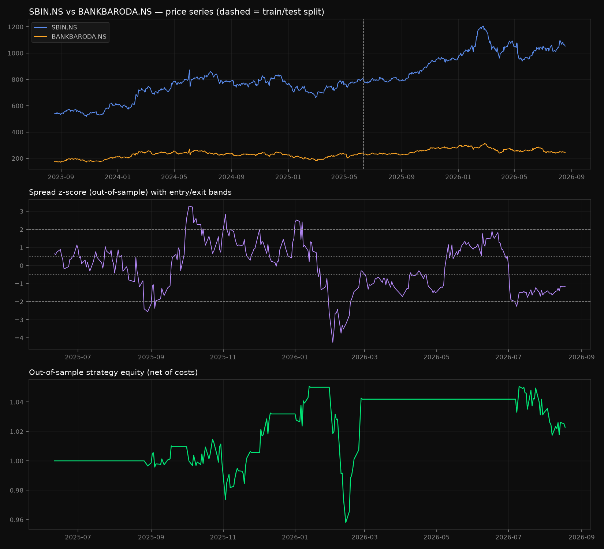

---

### TCS.NS / INFY.NS

- **Latest prices:** TCS.NS ₹2,280.00 · INFY.NS ₹1,115.00
- **Hedge ratio (train-fitted):** 0.5085
- **Cointegration (train):** FAIL at 5% — ADF -1.47, p=0.5476
- **Persistence:** passed 5% in 0 of 34 real-data runs (strict tier: 0/34)
- **Spread half-life:** 51.7 days
- **Current z-score:** -0.55
- **Signal today:** watch (approaching band)
- ⚠️ _Pair did not cointegrate on training data. Any signal here is not statistically justified — observation only._

**Out-of-sample backtest** (beta frozen from train window):

| Metric | Value |
|---|---|
| Sharpe | 1.69 |
| Sortino | 1.82 |
| Annualised return | 8.08% |
| Annualised vol | 4.67% |
| Max drawdown | -3.80% |
| Round-trip trades | 8 |

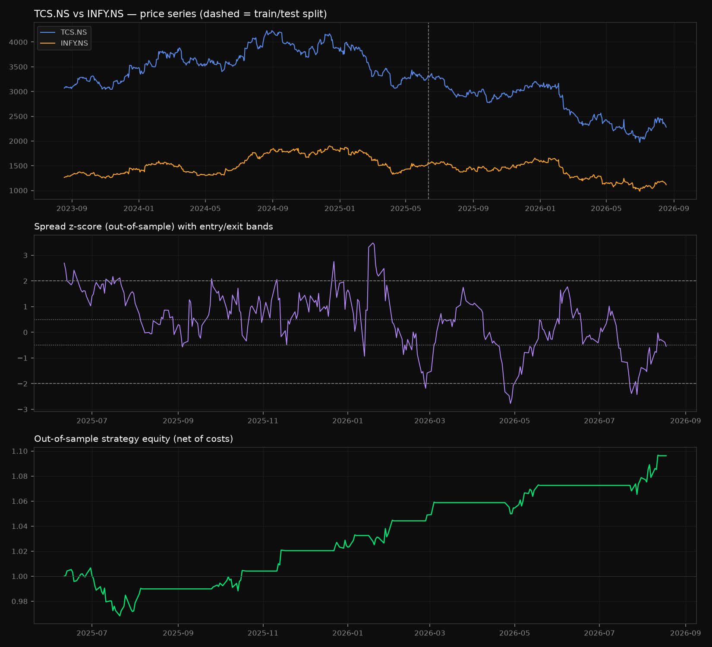

---

### INFY.NS / WIPRO.NS

- **Latest prices:** INFY.NS ₹1,115.00 · WIPRO.NS ₹178.06
- **Hedge ratio (train-fitted):** 0.1363
- **Cointegration (train):** FAIL at 5% — ADF -2.26, p=0.1843
- **Persistence:** passed 5% in 0 of 34 real-data runs (strict tier: 0/34)
- **Spread half-life:** 30.1 days
- **Current z-score:** -0.56
- **Signal today:** watch (approaching band)
- ⚠️ _Pair did not cointegrate on training data. Any signal here is not statistically justified — observation only._

**Out-of-sample backtest** (beta frozen from train window):

| Metric | Value |
|---|---|
| Sharpe | 1.67 |
| Sortino | 1.95 |
| Annualised return | 8.60% |
| Annualised vol | 5.01% |
| Max drawdown | -2.36% |
| Round-trip trades | 6 |

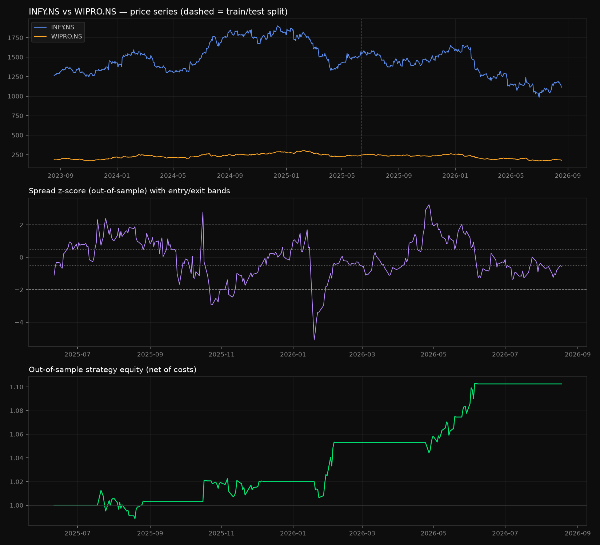

---

### HCLTECH.NS / TECHM.NS

- **Latest prices:** HCLTECH.NS ₹1,298.00 · TECHM.NS ₹1,592.00
- **Hedge ratio (train-fitted):** 0.8478
- **Cointegration (train):** FAIL at 5% — ADF -2.12, p=0.2365
- **Persistence:** passed 5% in 0 of 34 real-data runs (strict tier: 0/34)
- **Spread half-life:** 24.5 days
- **Current z-score:** +0.40
- **Signal today:** flat / no stretch
- ⚠️ _Pair did not cointegrate on training data. Any signal here is not statistically justified — observation only._

**Out-of-sample backtest** (beta frozen from train window):

| Metric | Value |
|---|---|
| Sharpe | -0.07 |
| Sortino | -0.07 |
| Annualised return | -0.76% |
| Annualised vol | 7.33% |
| Max drawdown | -7.91% |
| Round-trip trades | 5 |

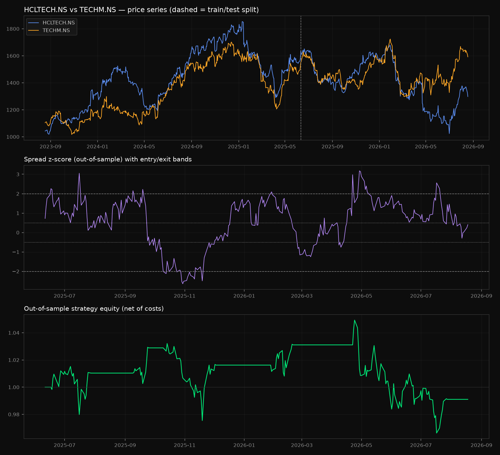

---

### ACC.NS / AMBUJACEM.NS

- **Latest prices:** ACC.NS ₹1,303.80 · AMBUJACEM.NS ₹412.40
- **Hedge ratio (train-fitted):** 0.2204
- **Cointegration (train):** FAIL at 5% — ADF -0.87, p=0.7980
- **Persistence:** passed 5% in 0 of 34 real-data runs (strict tier: 0/34)
- **Spread half-life:** 86.9 days
- **Current z-score:** -1.08
- **Signal today:** watch (approaching band)
- ⚠️ _Pair did not cointegrate on training data. Any signal here is not statistically justified — observation only._

**Out-of-sample backtest** (beta frozen from train window):

| Metric | Value |
|---|---|
| Sharpe | 0.54 |
| Sortino | 0.48 |
| Annualised return | 3.12% |
| Annualised vol | 6.06% |
| Max drawdown | -7.36% |
| Round-trip trades | 4 |

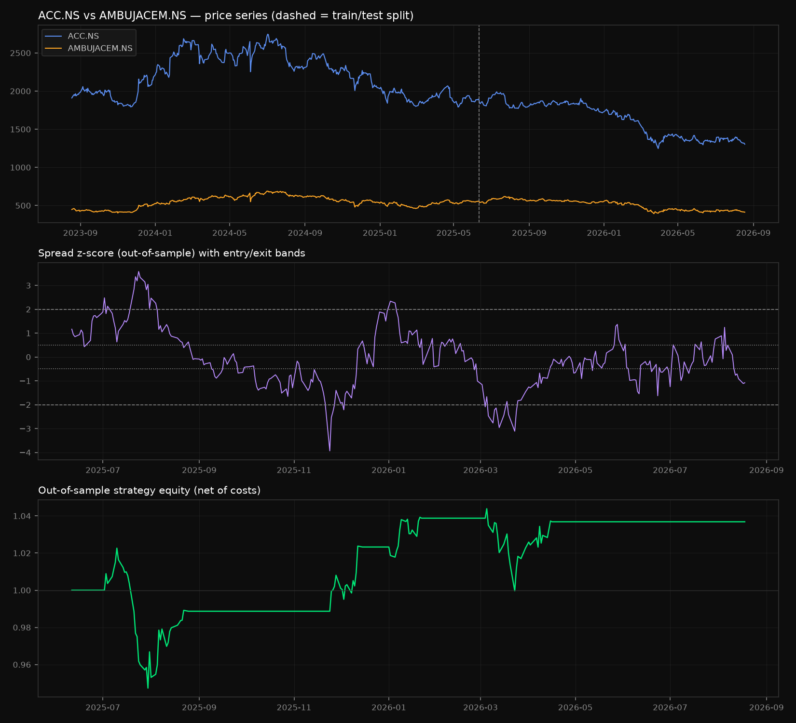

---

### ULTRACEMCO.NS / SHREECEM.NS

- **Latest prices:** ULTRACEMCO.NS ₹11,499.00 · SHREECEM.NS ₹24,725.00
- **Hedge ratio (train-fitted):** 0.6511
- **Cointegration (train):** FAIL at 5% — ADF -2.38, p=0.1476
- **Persistence:** passed 5% in 0 of 34 real-data runs (strict tier: 0/34)
- **Spread half-life:** 33.9 days
- **Current z-score:** -1.19
- **Signal today:** watch (approaching band)
- ⚠️ _Pair did not cointegrate on training data. Any signal here is not statistically justified — observation only._

**Out-of-sample backtest** (beta frozen from train window):

| Metric | Value |
|---|---|
| Sharpe | 0.46 |
| Sortino | 0.51 |
| Annualised return | 3.60% |
| Annualised vol | 8.39% |
| Max drawdown | -9.26% |
| Round-trip trades | 6 |

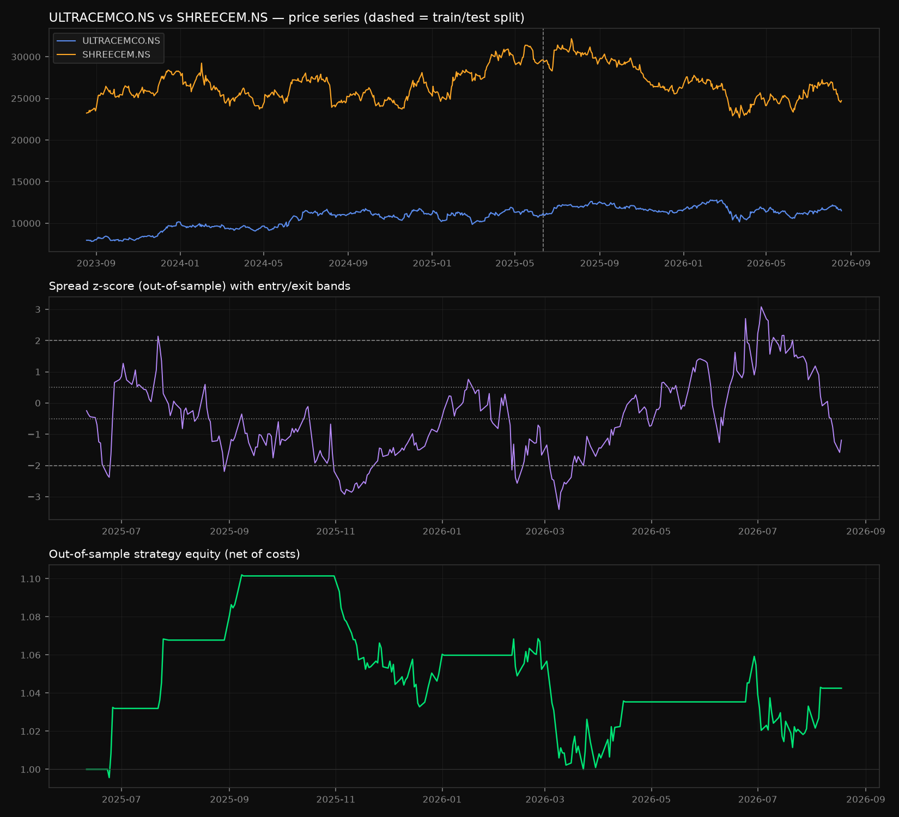

---

### IOC.NS / BPCL.NS

- **Latest prices:** IOC.NS ₹137.80 · BPCL.NS ₹310.30
- **Hedge ratio (train-fitted):** 1.7738
- **Cointegration (train):** FAIL at 5% — ADF -0.74, p=0.8365
- **Persistence:** passed 5% in 0 of 34 real-data runs (strict tier: 0/34)
- **Spread half-life:** 150.1 days
- **Current z-score:** +0.54
- **Signal today:** watch (approaching band)
- ⚠️ _Pair did not cointegrate on training data. Any signal here is not statistically justified — observation only._

**Out-of-sample backtest** (beta frozen from train window):

| Metric | Value |
|---|---|
| Sharpe | 0.69 |
| Sortino | 0.78 |
| Annualised return | 4.44% |
| Annualised vol | 6.66% |
| Max drawdown | -6.55% |
| Round-trip trades | 7 |

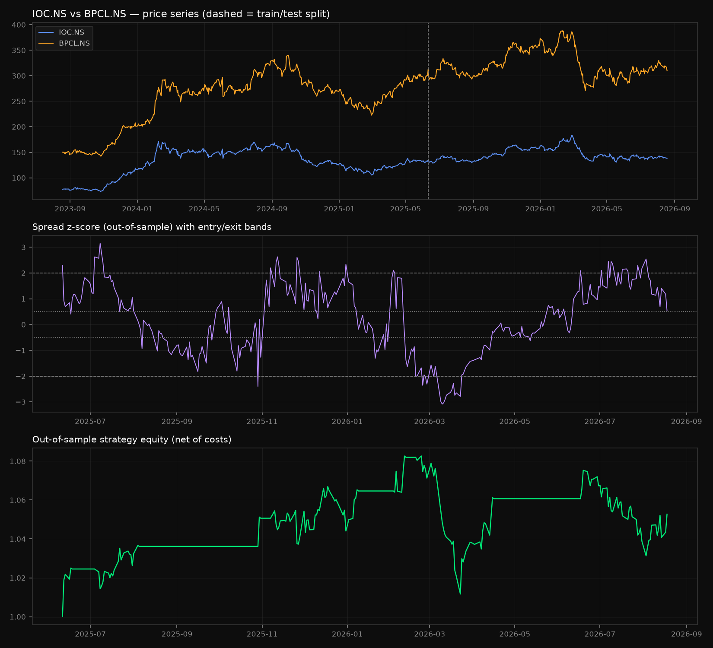

---

### BPCL.NS / HINDPETRO.NS

- **Latest prices:** BPCL.NS ₹310.30 · HINDPETRO.NS ₹366.00
- **Hedge ratio (train-fitted):** 1.3578
- **Cointegration (train):** FAIL at 5% — ADF -1.96, p=0.3065
- **Persistence:** passed 5% in 0 of 34 real-data runs (strict tier: 0/34)
- **Spread half-life:** 40.3 days
- **Current z-score:** -0.82
- **Signal today:** watch (approaching band)
- ⚠️ _Pair did not cointegrate on training data. Any signal here is not statistically justified — observation only._

**Out-of-sample backtest** (beta frozen from train window):

| Metric | Value |
|---|---|
| Sharpe | -0.09 |
| Sortino | -0.08 |
| Annualised return | -0.66% |
| Annualised vol | 5.78% |
| Max drawdown | -6.66% |
| Round-trip trades | 4 |

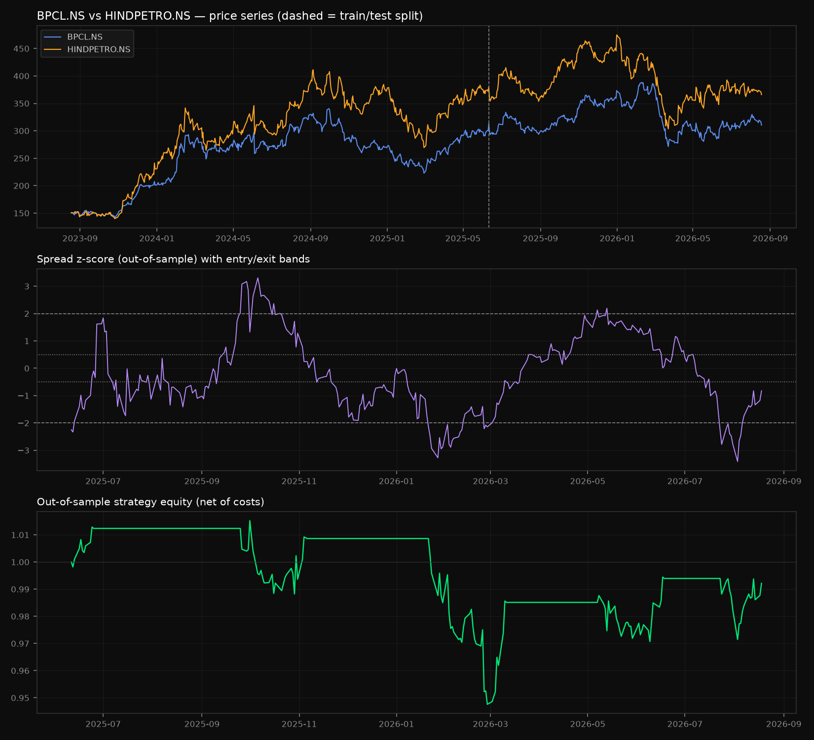

---

### ONGC.NS / COALINDIA.NS

- **Latest prices:** ONGC.NS ₹239.50 · COALINDIA.NS ₹406.90
- **Hedge ratio (train-fitted):** 1.5915
- **Cointegration (train):** PASS at 5% — ADF -3.48, p=0.0086
- **Persistence:** passed 5% in 26 of 34 real-data runs (strict tier: 0/34)
- **Spread half-life:** 13.2 days
- **Current z-score:** -1.03
- **Signal today:** watch (approaching band)

**Out-of-sample backtest** (beta frozen from train window):

| Metric | Value |
|---|---|
| Sharpe | 0.74 |
| Sortino | 0.58 |
| Annualised return | 5.18% |
| Annualised vol | 7.21% |
| Max drawdown | -5.67% |
| Round-trip trades | 5 |

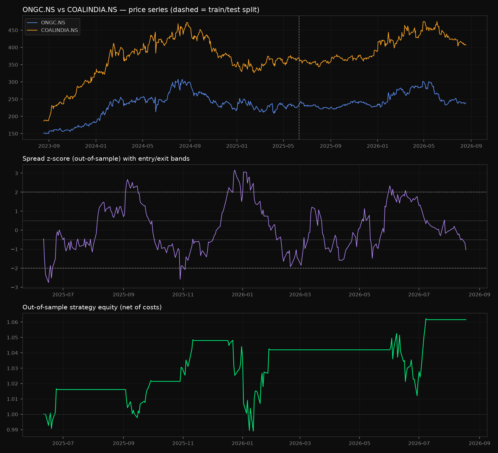

---

### NTPC.NS / POWERGRID.NS

- **Latest prices:** NTPC.NS ₹337.10 · POWERGRID.NS ₹268.00
- **Hedge ratio (train-fitted):** 0.8356
- **Cointegration (train):** FAIL at 5% — ADF -2.51, p=0.1133
- **Persistence:** passed 5% in 0 of 34 real-data runs (strict tier: 0/34)
- **Spread half-life:** 23.6 days
- **Current z-score:** -0.26
- **Signal today:** flat / no stretch
- ⚠️ _Pair did not cointegrate on training data. Any signal here is not statistically justified — observation only._

**Out-of-sample backtest** (beta frozen from train window):

| Metric | Value |
|---|---|
| Sharpe | 0.38 |
| Sortino | 0.29 |
| Annualised return | 1.95% |
| Annualised vol | 5.50% |
| Max drawdown | -5.25% |
| Round-trip trades | 6 |

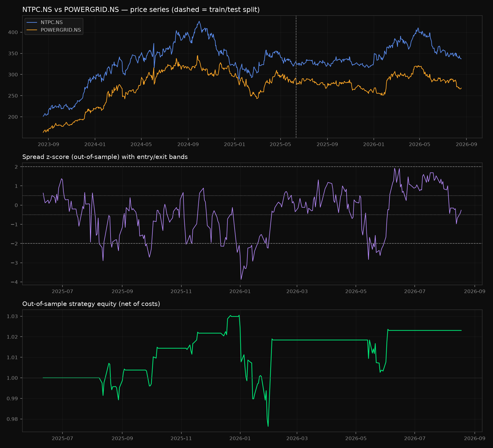

---

### BAJAJ-AUTO.NS / HEROMOTOCO.NS

- **Latest prices:** BAJAJ-AUTO.NS ₹11,607.00 · HEROMOTOCO.NS ₹5,745.50
- **Hedge ratio (train-fitted):** 0.4088
- **Cointegration (train):** FAIL at 5% — ADF -2.29, p=0.1766
- **Persistence:** passed 5% in 0 of 34 real-data runs (strict tier: 0/34)
- **Spread half-life:** 29.7 days
- **Current z-score:** +1.63
- **Signal today:** watch (approaching band)
- ⚠️ _Pair did not cointegrate on training data. Any signal here is not statistically justified — observation only._

**Out-of-sample backtest** (beta frozen from train window):

| Metric | Value |
|---|---|
| Sharpe | -1.15 |
| Sortino | -1.15 |
| Annualised return | -11.44% |
| Annualised vol | 10.10% |
| Max drawdown | -20.50% |
| Round-trip trades | 4 |

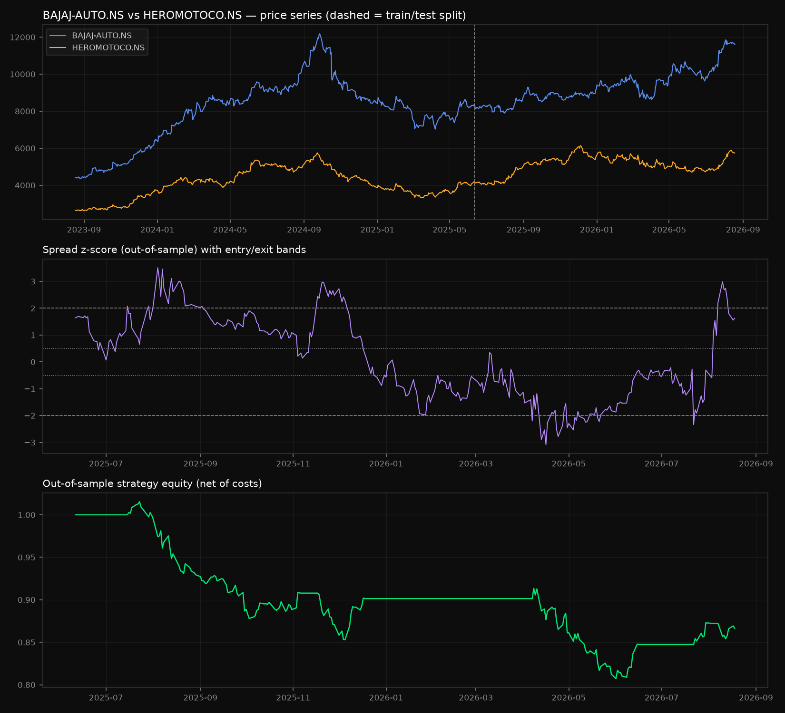

---

### TATASTEEL.NS / JSWSTEEL.NS

- **Latest prices:** TATASTEEL.NS ₹185.50 · JSWSTEEL.NS ₹1,267.60
- **Hedge ratio (train-fitted):** 3.0898
- **Cointegration (train):** FAIL at 5% — ADF -1.15, p=0.6963
- **Persistence:** passed 5% in 0 of 34 real-data runs (strict tier: 0/34)
- **Spread half-life:** 71.6 days
- **Current z-score:** +0.97
- **Signal today:** watch (approaching band)
- ⚠️ _Pair did not cointegrate on training data. Any signal here is not statistically justified — observation only._

**Out-of-sample backtest** (beta frozen from train window):

| Metric | Value |
|---|---|
| Sharpe | 0.44 |
| Sortino | 0.39 |
| Annualised return | 3.15% |
| Annualised vol | 7.78% |
| Max drawdown | -3.92% |
| Round-trip trades | 4 |

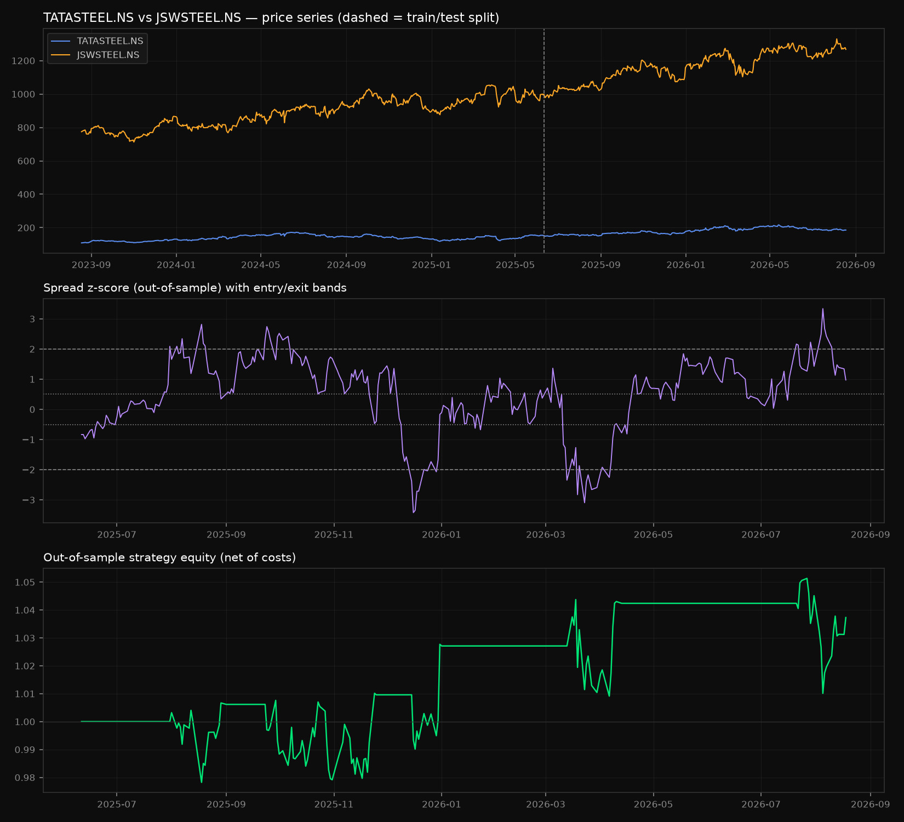

---

### SUNPHARMA.NS / CIPLA.NS

- **Latest prices:** SUNPHARMA.NS ₹1,875.10 · CIPLA.NS ₹1,431.10
- **Hedge ratio (train-fitted):** 0.4890
- **Cointegration (train):** PASS at 5% — ADF -3.38, p=0.0115
- **Persistence:** passed 5% in 34 of 34 real-data runs (strict tier: 5/34)
- **Spread half-life:** 10.7 days
- **Current z-score:** +0.46
- **Signal today:** flat / no stretch

**Out-of-sample backtest** (beta frozen from train window):

| Metric | Value |
|---|---|
| Sharpe | -0.11 |
| Sortino | -0.12 |
| Annualised return | -1.08% |
| Annualised vol | 7.59% |
| Max drawdown | -10.20% |
| Round-trip trades | 5 |

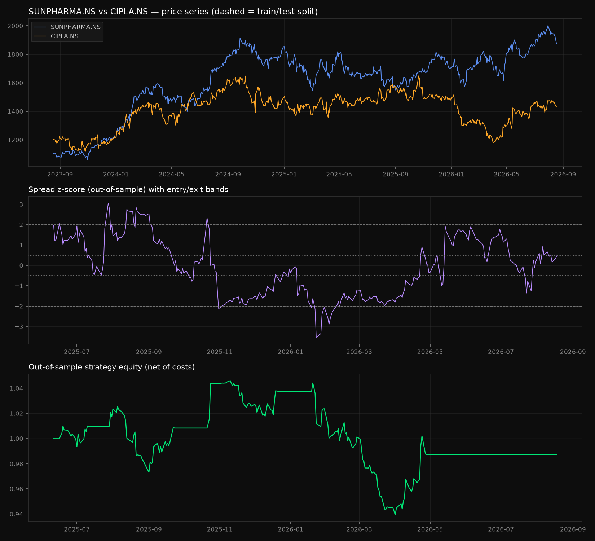

---

_Generated 2026-08-18 · pairs mean-reversion scanner · out-of-sample backtest · multiple-testing-aware · not investment advice._
