# Indian Pairs-Trading Scanner — 2026-08-20

> **What this is:** a market-neutral *pairs mean-reversion* scanner. It flags when two related NSE stocks have drifted apart far enough that their historical relationship signals a possible convergence trade. It does **not** forecast growth, rank "best" stocks, or predict company performance. A signal means the *spread between two stocks* is stretched — nothing about either stock being a good investment. Not investment advice; do your own research.

## Methodology (fixed in advance)

- **Universe:** 16 declared sector-mate pairs. Parameters (3y window, 60/40 train-test, z-entry 2.0, z-exit 0.5, 5 bps costs) are pre-registered; changes are logged in the README changelog *before* looking at results.
- **Multiple testing:** at the 5% level across 16 pairs, **≈0.8 false positives per run are expected by chance alone** even if nothing truly cointegrates. A single-day pass is a candidate, not a discovery.
- **Strict tier:** Bonferroni-corrected threshold p < 0.0031 (marked ✓✓).
- **Evidence = persistence:** the Persistence column counts how often each pair has passed the 5% test across all *real-data* daily runs recorded in `reports/history.csv`. Pairs deserve attention only when they pass persistently.

> ⚠️ **Some results use SIMULATED fallback data** (real data was unreachable this run) and are not real market results. These are marked below and are EXCLUDED from persistence counts.

## Summary

| Pair | p-value | Coint. | Persistence | Current z | Signal | OOS Sharpe |
|---|---|---|---|---|---|---|
| HDFCBANK.NS/ICICIBANK.NS *(sim)* | 0.0030 | ✓✓ | 0/27 | -1.55 | watch | 1.13 |
| AXISBANK.NS/ICICIBANK.NS | 0.8239 | ✗ | 0/36 | +0.85 | watch | -0.37 |
| KOTAKBANK.NS/HDFCBANK.NS | 0.1365 | ✗ | 0/36 | -1.35 | watch | 0.91 |
| SBIN.NS/BANKBARODA.NS | 0.1373 | ✗ | 0/36 | -1.02 | watch | 0.30 |
| TCS.NS/INFY.NS | 0.6033 | ✗ | 0/36 | -0.43 | flat / no stretch | 1.69 |
| INFY.NS/WIPRO.NS | 0.1887 | ✗ | 0/36 | -0.35 | flat / no stretch | 1.67 |
| HCLTECH.NS/TECHM.NS | 0.2133 | ✗ | 0/36 | -0.25 | flat / no stretch | -0.07 |
| ACC.NS/AMBUJACEM.NS | 0.7977 | ✗ | 0/36 | -1.16 | watch | 0.53 |
| ULTRACEMCO.NS/SHREECEM.NS | 0.1466 | ✗ | 0/36 | -1.64 | watch | 0.46 |
| IOC.NS/BPCL.NS | 0.8943 | ✗ | 0/36 | +0.73 | watch | 0.40 |
| BPCL.NS/HINDPETRO.NS | 0.2928 | ✗ | 0/36 | -0.85 | watch | 0.01 |
| ONGC.NS/COALINDIA.NS | 0.0080 | ✓ | 28/36 | -1.27 | watch | 0.74 |
| NTPC.NS/POWERGRID.NS | 0.1013 | ✗ | 0/36 | -0.69 | watch | 0.38 |
| BAJAJ-AUTO.NS/HEROMOTOCO.NS | 0.1772 | ✗ | 0/36 | +1.14 | watch | -1.33 |
| TATASTEEL.NS/JSWSTEEL.NS | 0.6989 | ✗ | 0/36 | +2.29 | SHORT spread | 0.15 |
| SUNPHARMA.NS/CIPLA.NS | 0.0114 | ✓ | 36/36 | +0.18 | flat / no stretch | -0.11 |

_Legend: ✓✓ passes strict Bonferroni tier · ✓ passes 5% only · ✗ fails. Persistence = 5%-passes / real-data runs recorded. \*no real-data history yet._

---

### HDFCBANK.NS / ICICIBANK.NS · _SIMULATED_

- **Latest prices:** HDFCBANK.NS ₹77.27 · ICICIBANK.NS ₹113.78
- **Hedge ratio (train-fitted):** 1.5557
- **Cointegration (train):** PASS at 5% — ADF -3.79, p=0.0030 · **passes strict Bonferroni tier**
- **Persistence:** passed 5% in 0 of 27 real-data runs (strict tier: 0/27)
- **Spread half-life:** 14.0 days
- **Current z-score:** -1.55
- **Signal today:** watch (approaching band)

**Out-of-sample backtest** (beta frozen from train window):

| Metric | Value |
|---|---|
| Sharpe | 1.13 |
| Sortino | 0.86 |
| Annualised return | 1.88% |
| Annualised vol | 1.66% |
| Max drawdown | -1.19% |
| Round-trip trades | 5 |

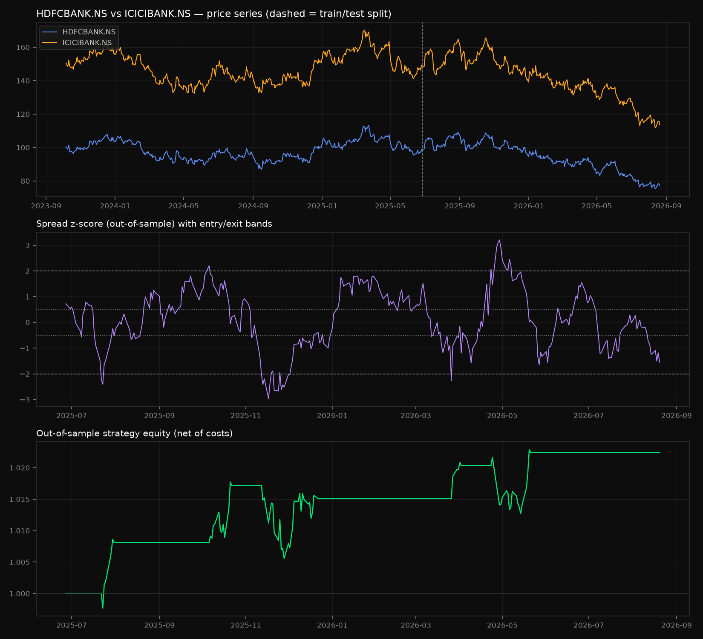

---

### AXISBANK.NS / ICICIBANK.NS

- **Latest prices:** AXISBANK.NS ₹1,251.00 · ICICIBANK.NS ₹1,411.90
- **Hedge ratio (train-fitted):** 0.9646
- **Cointegration (train):** FAIL at 5% — ADF -0.78, p=0.8239
- **Persistence:** passed 5% in 0 of 36 real-data runs (strict tier: 0/36)
- **Spread half-life:** 152.3 days
- **Current z-score:** +0.85
- **Signal today:** watch (approaching band)
- ⚠️ _Pair did not cointegrate on training data. Any signal here is not statistically justified — observation only._

**Out-of-sample backtest** (beta frozen from train window):

| Metric | Value |
|---|---|
| Sharpe | -0.37 |
| Sortino | -0.35 |
| Annualised return | -3.37% |
| Annualised vol | 8.41% |
| Max drawdown | -7.58% |
| Round-trip trades | 5 |

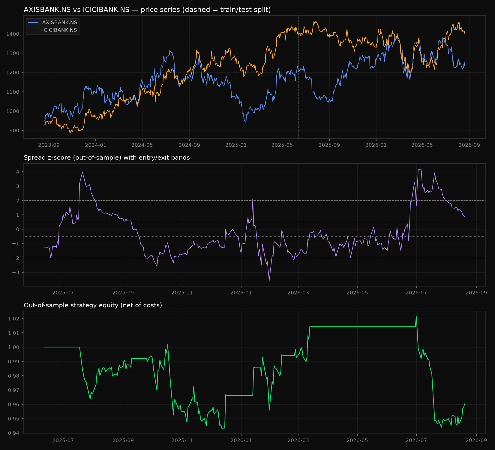

---

### KOTAKBANK.NS / HDFCBANK.NS

- **Latest prices:** KOTAKBANK.NS ₹397.35 · HDFCBANK.NS ₹725.05
- **Hedge ratio (train-fitted):** 2.0160
- **Cointegration (train):** FAIL at 5% — ADF -2.42, p=0.1365
- **Persistence:** passed 5% in 0 of 36 real-data runs (strict tier: 0/36)
- **Spread half-life:** 26.3 days
- **Current z-score:** -1.35
- **Signal today:** watch (approaching band)
- ⚠️ _Pair did not cointegrate on training data. Any signal here is not statistically justified — observation only._

**Out-of-sample backtest** (beta frozen from train window):

| Metric | Value |
|---|---|
| Sharpe | 0.91 |
| Sortino | 0.65 |
| Annualised return | 5.73% |
| Annualised vol | 6.36% |
| Max drawdown | -4.30% |
| Round-trip trades | 6 |

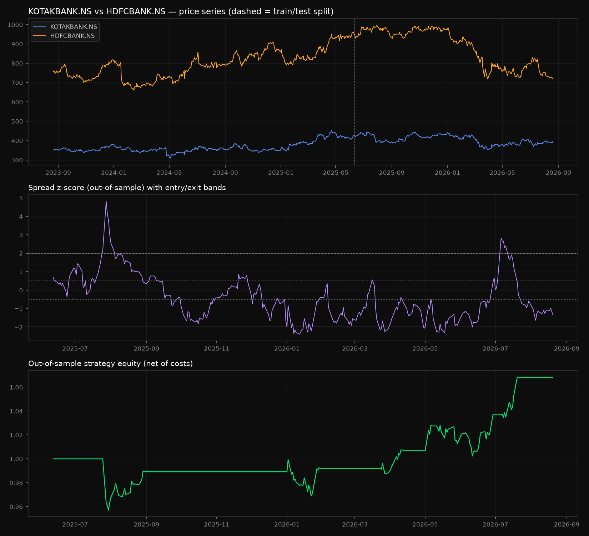

---

### SBIN.NS / BANKBARODA.NS

- **Latest prices:** SBIN.NS ₹1,048.00 · BANKBARODA.NS ₹244.50
- **Hedge ratio (train-fitted):** 0.1994
- **Cointegration (train):** FAIL at 5% — ADF -2.42, p=0.1373
- **Persistence:** passed 5% in 0 of 36 real-data runs (strict tier: 0/36)
- **Spread half-life:** 21.4 days
- **Current z-score:** -1.02
- **Signal today:** watch (approaching band)
- ⚠️ _Pair did not cointegrate on training data. Any signal here is not statistically justified — observation only._

**Out-of-sample backtest** (beta frozen from train window):

| Metric | Value |
|---|---|
| Sharpe | 0.30 |
| Sortino | 0.23 |
| Annualised return | 2.28% |
| Annualised vol | 8.85% |
| Max drawdown | -8.89% |
| Round-trip trades | 5 |

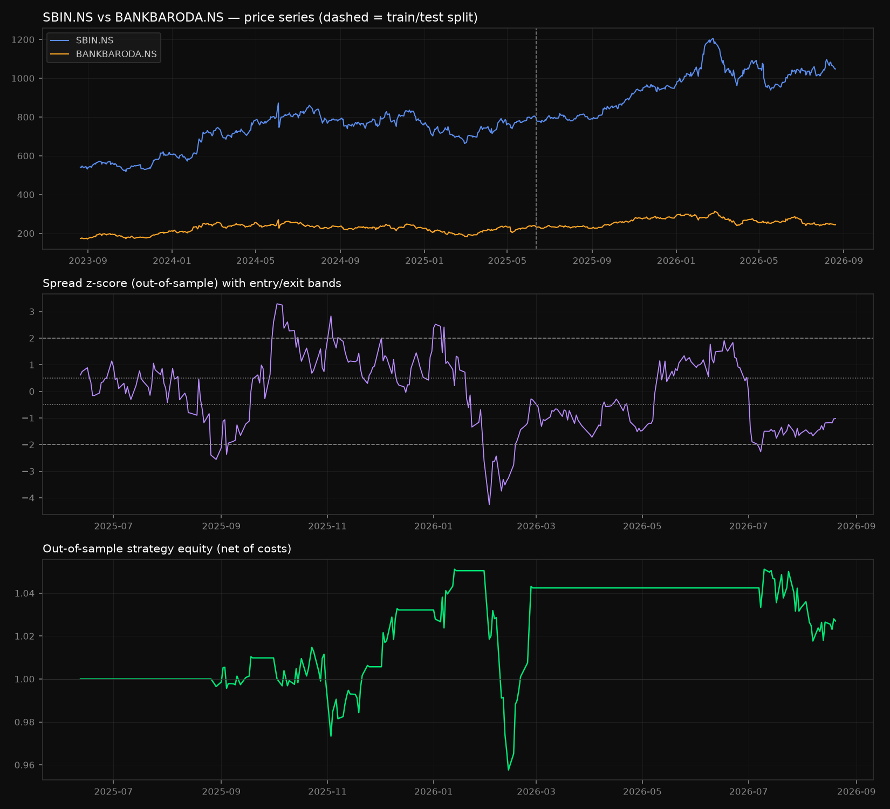

---

### TCS.NS / INFY.NS

- **Latest prices:** TCS.NS ₹2,298.00 · INFY.NS ₹1,130.00
- **Hedge ratio (train-fitted):** 0.5074
- **Cointegration (train):** FAIL at 5% — ADF -1.36, p=0.6033
- **Persistence:** passed 5% in 0 of 36 real-data runs (strict tier: 0/36)
- **Spread half-life:** 55.5 days
- **Current z-score:** -0.43
- **Signal today:** flat / no stretch
- ⚠️ _Pair did not cointegrate on training data. Any signal here is not statistically justified — observation only._

**Out-of-sample backtest** (beta frozen from train window):

| Metric | Value |
|---|---|
| Sharpe | 1.69 |
| Sortino | 1.83 |
| Annualised return | 8.22% |
| Annualised vol | 4.73% |
| Max drawdown | -3.84% |
| Round-trip trades | 8 |

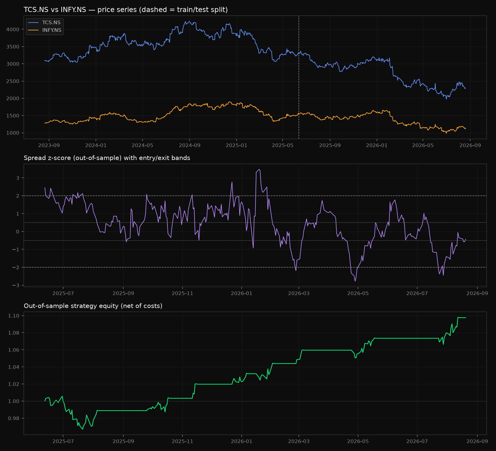

---

### INFY.NS / WIPRO.NS

- **Latest prices:** INFY.NS ₹1,130.00 · WIPRO.NS ₹181.00
- **Hedge ratio (train-fitted):** 0.1362
- **Cointegration (train):** FAIL at 5% — ADF -2.25, p=0.1887
- **Persistence:** passed 5% in 0 of 36 real-data runs (strict tier: 0/36)
- **Spread half-life:** 30.3 days
- **Current z-score:** -0.35
- **Signal today:** flat / no stretch
- ⚠️ _Pair did not cointegrate on training data. Any signal here is not statistically justified — observation only._

**Out-of-sample backtest** (beta frozen from train window):

| Metric | Value |
|---|---|
| Sharpe | 1.67 |
| Sortino | 1.95 |
| Annualised return | 8.65% |
| Annualised vol | 5.04% |
| Max drawdown | -2.38% |
| Round-trip trades | 6 |

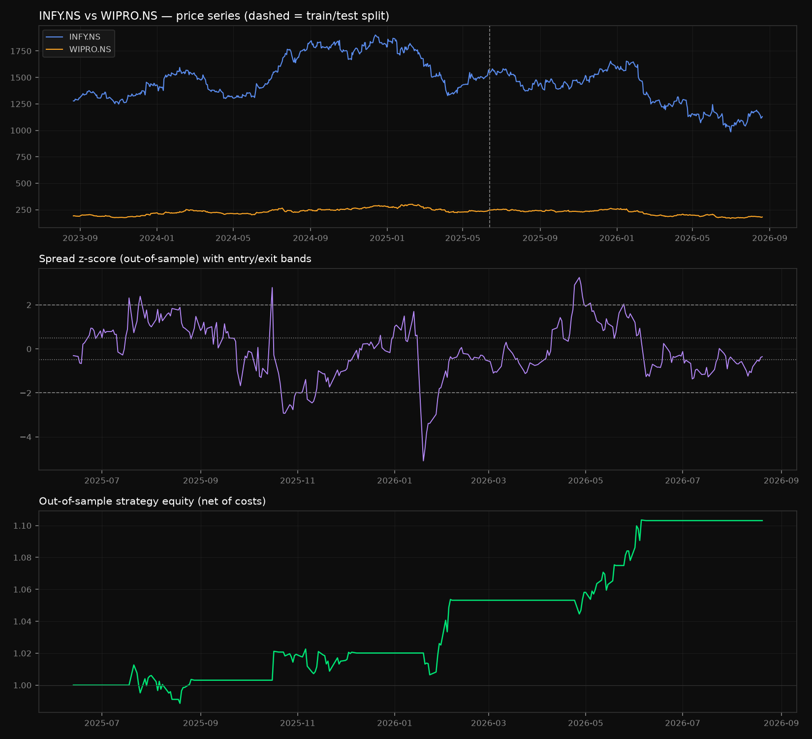

---

### HCLTECH.NS / TECHM.NS

- **Latest prices:** HCLTECH.NS ₹1,318.40 · TECHM.NS ₹1,592.10
- **Hedge ratio (train-fitted):** 0.8504
- **Cointegration (train):** FAIL at 5% — ADF -2.18, p=0.2133
- **Persistence:** passed 5% in 0 of 36 real-data runs (strict tier: 0/36)
- **Spread half-life:** 23.9 days
- **Current z-score:** -0.25
- **Signal today:** flat / no stretch
- ⚠️ _Pair did not cointegrate on training data. Any signal here is not statistically justified — observation only._

**Out-of-sample backtest** (beta frozen from train window):

| Metric | Value |
|---|---|
| Sharpe | -0.07 |
| Sortino | -0.08 |
| Annualised return | -0.81% |
| Annualised vol | 7.36% |
| Max drawdown | -7.93% |
| Round-trip trades | 5 |

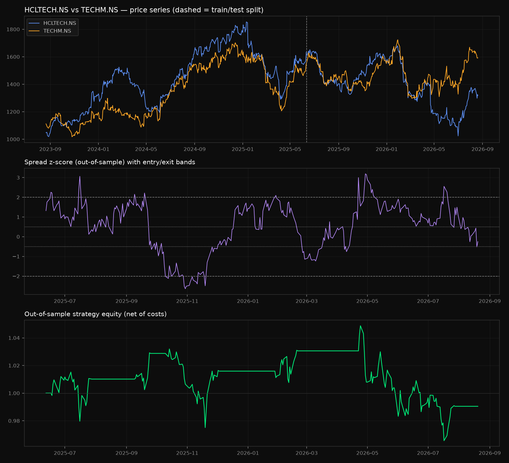

---

### ACC.NS / AMBUJACEM.NS

- **Latest prices:** ACC.NS ₹1,301.10 · AMBUJACEM.NS ₹411.00
- **Hedge ratio (train-fitted):** 0.2193
- **Cointegration (train):** FAIL at 5% — ADF -0.87, p=0.7977
- **Persistence:** passed 5% in 0 of 36 real-data runs (strict tier: 0/36)
- **Spread half-life:** 90.5 days
- **Current z-score:** -1.16
- **Signal today:** watch (approaching band)
- ⚠️ _Pair did not cointegrate on training data. Any signal here is not statistically justified — observation only._

**Out-of-sample backtest** (beta frozen from train window):

| Metric | Value |
|---|---|
| Sharpe | 0.53 |
| Sortino | 0.48 |
| Annualised return | 3.18% |
| Annualised vol | 6.22% |
| Max drawdown | -7.52% |
| Round-trip trades | 4 |

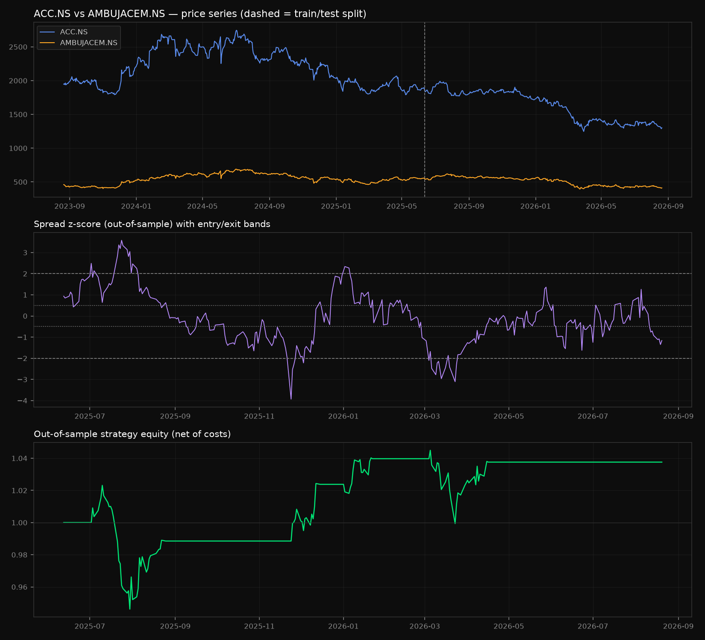

---

### ULTRACEMCO.NS / SHREECEM.NS

- **Latest prices:** ULTRACEMCO.NS ₹11,575.00 · SHREECEM.NS ₹24,300.00
- **Hedge ratio (train-fitted):** 0.6484
- **Cointegration (train):** FAIL at 5% — ADF -2.38, p=0.1466
- **Persistence:** passed 5% in 0 of 36 real-data runs (strict tier: 0/36)
- **Spread half-life:** 33.9 days
- **Current z-score:** -1.64
- **Signal today:** watch (approaching band)
- ⚠️ _Pair did not cointegrate on training data. Any signal here is not statistically justified — observation only._

**Out-of-sample backtest** (beta frozen from train window):

| Metric | Value |
|---|---|
| Sharpe | 0.46 |
| Sortino | 0.49 |
| Annualised return | 3.61% |
| Annualised vol | 8.51% |
| Max drawdown | -9.34% |
| Round-trip trades | 6 |

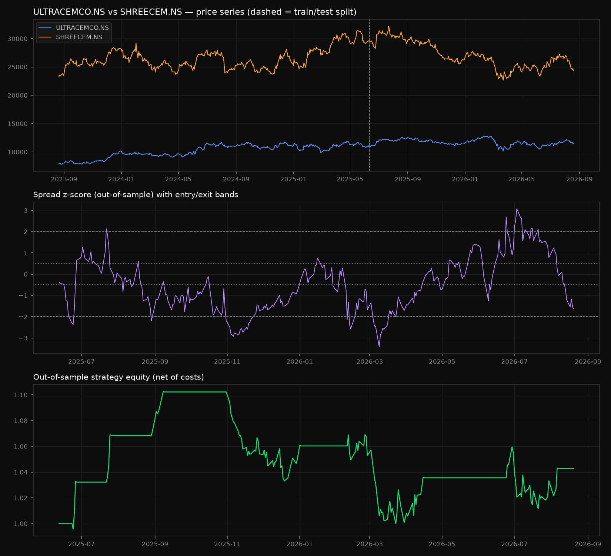

---

### IOC.NS / BPCL.NS

- **Latest prices:** IOC.NS ₹135.90 · BPCL.NS ₹308.70
- **Hedge ratio (train-fitted):** 1.7730
- **Cointegration (train):** FAIL at 5% — ADF -0.49, p=0.8943
- **Persistence:** passed 5% in 0 of 36 real-data runs (strict tier: 0/36)
- **Spread half-life:** 226.1 days
- **Current z-score:** +0.73
- **Signal today:** watch (approaching band)
- ⚠️ _Pair did not cointegrate on training data. Any signal here is not statistically justified — observation only._

**Out-of-sample backtest** (beta frozen from train window):

| Metric | Value |
|---|---|
| Sharpe | 0.40 |
| Sortino | 0.43 |
| Annualised return | 2.45% |
| Annualised vol | 6.63% |
| Max drawdown | -6.77% |
| Round-trip trades | 7 |

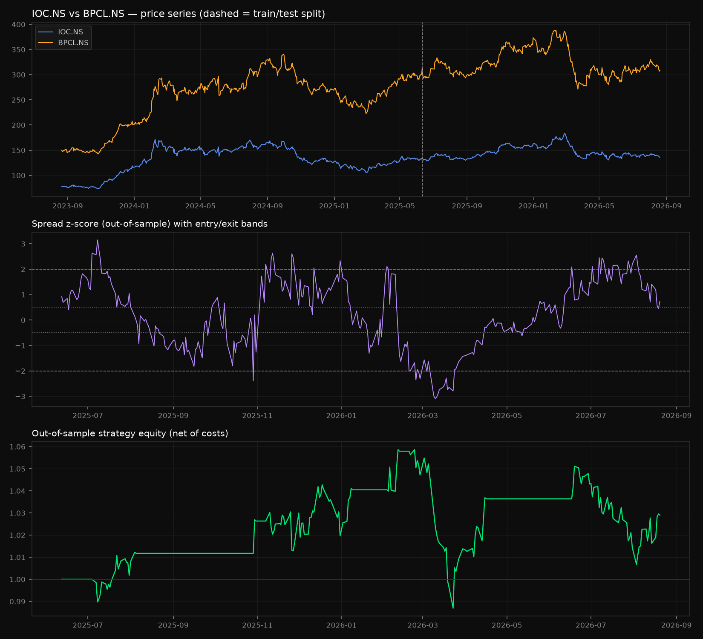

---

### BPCL.NS / HINDPETRO.NS

- **Latest prices:** BPCL.NS ₹308.70 · HINDPETRO.NS ₹363.20
- **Hedge ratio (train-fitted):** 1.3571
- **Cointegration (train):** FAIL at 5% — ADF -1.99, p=0.2928
- **Persistence:** passed 5% in 0 of 36 real-data runs (strict tier: 0/36)
- **Spread half-life:** 39.5 days
- **Current z-score:** -0.85
- **Signal today:** watch (approaching band)
- ⚠️ _Pair did not cointegrate on training data. Any signal here is not statistically justified — observation only._

**Out-of-sample backtest** (beta frozen from train window):

| Metric | Value |
|---|---|
| Sharpe | 0.01 |
| Sortino | 0.01 |
| Annualised return | -0.10% |
| Annualised vol | 6.11% |
| Max drawdown | -7.00% |
| Round-trip trades | 5 |

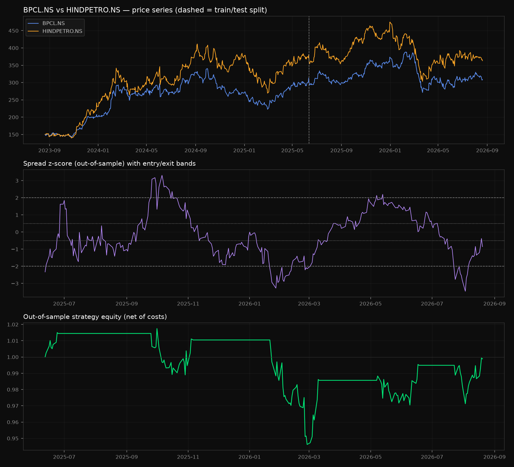

---

### ONGC.NS / COALINDIA.NS

- **Latest prices:** ONGC.NS ₹238.50 · COALINDIA.NS ₹402.50
- **Hedge ratio (train-fitted):** 1.5854
- **Cointegration (train):** PASS at 5% — ADF -3.50, p=0.0080
- **Persistence:** passed 5% in 28 of 36 real-data runs (strict tier: 0/36)
- **Spread half-life:** 13.1 days
- **Current z-score:** -1.27
- **Signal today:** watch (approaching band)

**Out-of-sample backtest** (beta frozen from train window):

| Metric | Value |
|---|---|
| Sharpe | 0.74 |
| Sortino | 0.58 |
| Annualised return | 5.22% |
| Annualised vol | 7.29% |
| Max drawdown | -5.75% |
| Round-trip trades | 5 |

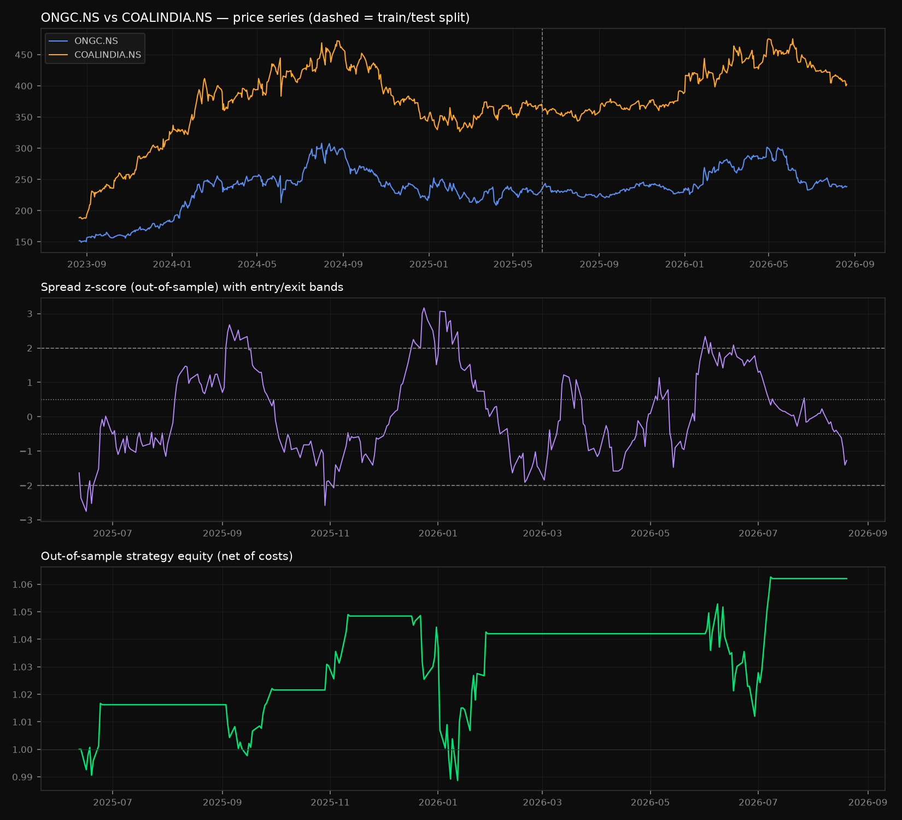

---

### NTPC.NS / POWERGRID.NS

- **Latest prices:** NTPC.NS ₹337.50 · POWERGRID.NS ₹264.80
- **Hedge ratio (train-fitted):** 0.8354
- **Cointegration (train):** FAIL at 5% — ADF -2.56, p=0.1013
- **Persistence:** passed 5% in 0 of 36 real-data runs (strict tier: 0/36)
- **Spread half-life:** 23.1 days
- **Current z-score:** -0.69
- **Signal today:** watch (approaching band)
- ⚠️ _Pair did not cointegrate on training data. Any signal here is not statistically justified — observation only._

**Out-of-sample backtest** (beta frozen from train window):

| Metric | Value |
|---|---|
| Sharpe | 0.38 |
| Sortino | 0.29 |
| Annualised return | 1.99% |
| Annualised vol | 5.61% |
| Max drawdown | -5.34% |
| Round-trip trades | 6 |

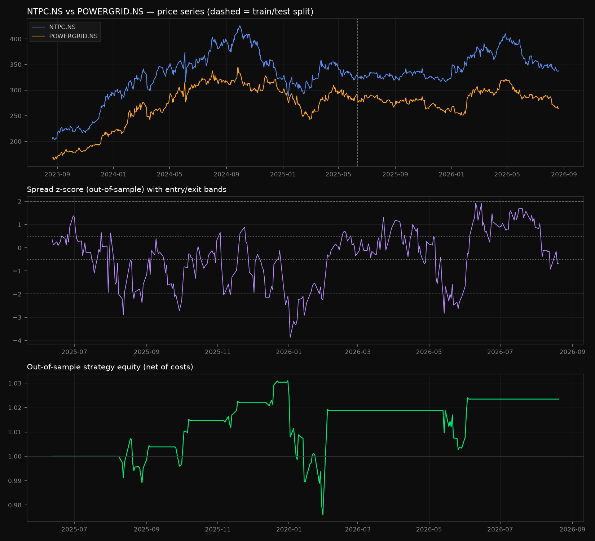

---

### BAJAJ-AUTO.NS / HEROMOTOCO.NS

- **Latest prices:** BAJAJ-AUTO.NS ₹11,793.00 · HEROMOTOCO.NS ₹5,740.50
- **Hedge ratio (train-fitted):** 0.4089
- **Cointegration (train):** FAIL at 5% — ADF -2.28, p=0.1772
- **Persistence:** passed 5% in 0 of 36 real-data runs (strict tier: 0/36)
- **Spread half-life:** 29.7 days
- **Current z-score:** +1.14
- **Signal today:** watch (approaching band)
- ⚠️ _Pair did not cointegrate on training data. Any signal here is not statistically justified — observation only._

**Out-of-sample backtest** (beta frozen from train window):

| Metric | Value |
|---|---|
| Sharpe | -1.33 |
| Sortino | -1.29 |
| Annualised return | -12.81% |
| Annualised vol | 9.92% |
| Max drawdown | -20.50% |
| Round-trip trades | 3 |

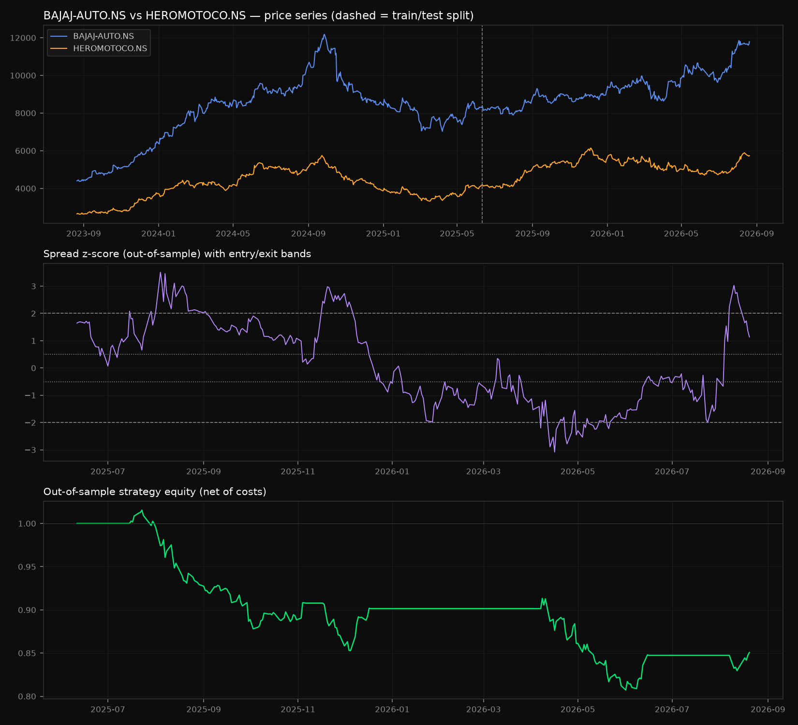

---

### TATASTEEL.NS / JSWSTEEL.NS

- **Latest prices:** TATASTEEL.NS ₹183.50 · JSWSTEEL.NS ₹1,299.70
- **Hedge ratio (train-fitted):** 3.0920
- **Cointegration (train):** FAIL at 5% — ADF -1.14, p=0.6989
- **Persistence:** passed 5% in 0 of 36 real-data runs (strict tier: 0/36)
- **Spread half-life:** 72.4 days
- **Current z-score:** +2.29
- **Signal today:** SHORT spread (short JSWSTEEL.NS, long TATASTEEL.NS)
- ⚠️ _Pair did not cointegrate on training data. Any signal here is not statistically justified — observation only._

**Out-of-sample backtest** (beta frozen from train window):

| Metric | Value |
|---|---|
| Sharpe | 0.15 |
| Sortino | 0.13 |
| Annualised return | 0.89% |
| Annualised vol | 8.09% |
| Max drawdown | -3.98% |
| Round-trip trades | 4 |

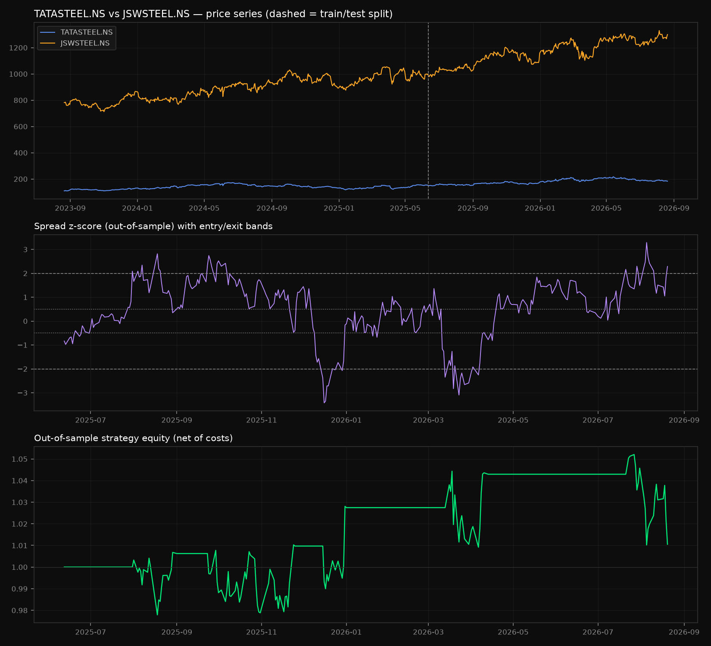

---

### SUNPHARMA.NS / CIPLA.NS

- **Latest prices:** SUNPHARMA.NS ₹1,904.00 · CIPLA.NS ₹1,438.00
- **Hedge ratio (train-fitted):** 0.4894
- **Cointegration (train):** PASS at 5% — ADF -3.39, p=0.0114
- **Persistence:** passed 5% in 36 of 36 real-data runs (strict tier: 5/36)
- **Spread half-life:** 10.7 days
- **Current z-score:** +0.18
- **Signal today:** flat / no stretch

**Out-of-sample backtest** (beta frozen from train window):

| Metric | Value |
|---|---|
| Sharpe | -0.11 |
| Sortino | -0.12 |
| Annualised return | -1.10% |
| Annualised vol | 7.65% |
| Max drawdown | -10.28% |
| Round-trip trades | 5 |

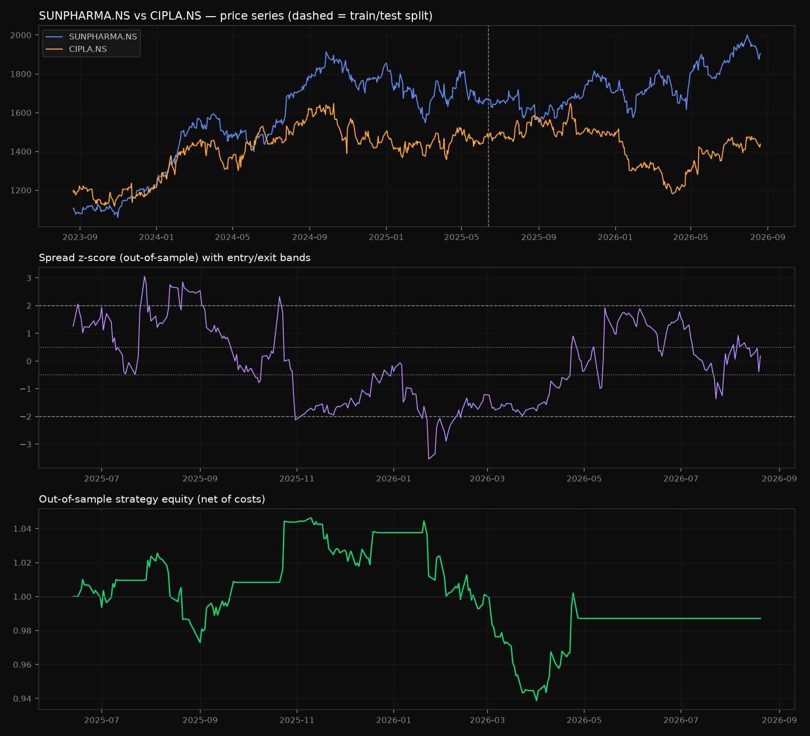

---

_Generated 2026-08-20 · pairs mean-reversion scanner · out-of-sample backtest · multiple-testing-aware · not investment advice._
