# Indian Pairs-Trading Scanner — 2026-08-21

> **What this is:** a market-neutral *pairs mean-reversion* scanner. It flags when two related NSE stocks have drifted apart far enough that their historical relationship signals a possible convergence trade. It does **not** forecast growth, rank "best" stocks, or predict company performance. A signal means the *spread between two stocks* is stretched — nothing about either stock being a good investment. Not investment advice; do your own research.

## Methodology (fixed in advance)

- **Universe:** 16 declared sector-mate pairs. Parameters (3y window, 60/40 train-test, z-entry 2.0, z-exit 0.5, 5 bps costs) are pre-registered; changes are logged in the README changelog *before* looking at results.
- **Multiple testing:** at the 5% level across 16 pairs, **≈0.8 false positives per run are expected by chance alone** even if nothing truly cointegrates. A single-day pass is a candidate, not a discovery.
- **Strict tier:** Bonferroni-corrected threshold p < 0.0031 (marked ✓✓).
- **Evidence = persistence:** the Persistence column counts how often each pair has passed the 5% test across all *real-data* daily runs recorded in `reports/history.csv`. Pairs deserve attention only when they pass persistently.

> ⚠️ **Some results use SIMULATED fallback data** (real data was unreachable this run) and are not real market results. These are marked below and are EXCLUDED from persistence counts.

## Summary

| Pair | p-value | Coint. | Persistence | Current z | Signal | OOS Sharpe |
|---|---|---|---|---|---|---|
| HDFCBANK.NS/ICICIBANK.NS *(sim)* | 0.0030 | ✓✓ | 0/27 | -1.55 | watch | 1.13 |
| AXISBANK.NS/ICICIBANK.NS | 0.8328 | ✗ | 0/37 | +0.92 | watch | -0.41 |
| KOTAKBANK.NS/HDFCBANK.NS | 0.1327 | ✗ | 0/37 | -1.54 | watch | 0.90 |
| SBIN.NS/BANKBARODA.NS | 0.1349 | ✗ | 0/37 | -0.83 | watch | 0.36 |
| TCS.NS/INFY.NS | 0.5879 | ✗ | 0/37 | -0.62 | watch | 1.81 |
| INFY.NS/WIPRO.NS | 0.1926 | ✗ | 0/37 | -0.11 | flat / no stretch | 1.67 |
| HCLTECH.NS/TECHM.NS | 0.2448 | ✗ | 0/37 | -0.11 | flat / no stretch | -0.08 |
| ACC.NS/AMBUJACEM.NS | 0.7664 | ✗ | 0/37 | -0.78 | watch | 0.53 |
| ULTRACEMCO.NS/SHREECEM.NS | 0.1423 | ✗ | 0/37 | -1.62 | watch | 0.49 |
| IOC.NS/BPCL.NS | 0.7785 | ✗ | 0/37 | +0.98 | watch | 0.40 |
| BPCL.NS/HINDPETRO.NS | 0.2907 | ✗ | 0/37 | -1.08 | watch | -0.19 |
| ONGC.NS/COALINDIA.NS | 0.0088 | ✓ | 29/37 | -0.78 | watch | 0.82 |
| NTPC.NS/POWERGRID.NS | 0.0920 | ✗ | 0/37 | -0.15 | flat / no stretch | 0.38 |
| BAJAJ-AUTO.NS/HEROMOTOCO.NS | 0.1743 | ✗ | 0/37 | +1.21 | watch | -1.09 |
| TATASTEEL.NS/JSWSTEEL.NS | 0.6874 | ✗ | 0/37 | +1.96 | watch | 0.18 |
| SUNPHARMA.NS/CIPLA.NS | 0.0113 | ✓ | 37/37 | -0.02 | flat / no stretch | -0.11 |

_Legend: ✓✓ passes strict Bonferroni tier · ✓ passes 5% only · ✗ fails. Persistence = 5%-passes / real-data runs recorded. \*no real-data history yet._

---

### HDFCBANK.NS / ICICIBANK.NS · _SIMULATED_

- **Latest prices:** HDFCBANK.NS ₹77.27 · ICICIBANK.NS ₹113.78
- **Hedge ratio (train-fitted):** 1.5557
- **Cointegration (train):** PASS at 5% — ADF -3.79, p=0.0030 · **passes strict Bonferroni tier**
- **Persistence:** passed 5% in 0 of 27 real-data runs (strict tier: 0/27)
- **Spread half-life:** 14.0 days
- **Current z-score:** -1.55
- **Signal today:** watch (approaching band)

**Out-of-sample backtest** (beta frozen from train window):

| Metric | Value |
|---|---|
| Sharpe | 1.13 |
| Sortino | 0.86 |
| Annualised return | 1.88% |
| Annualised vol | 1.66% |
| Max drawdown | -1.19% |
| Round-trip trades | 5 |

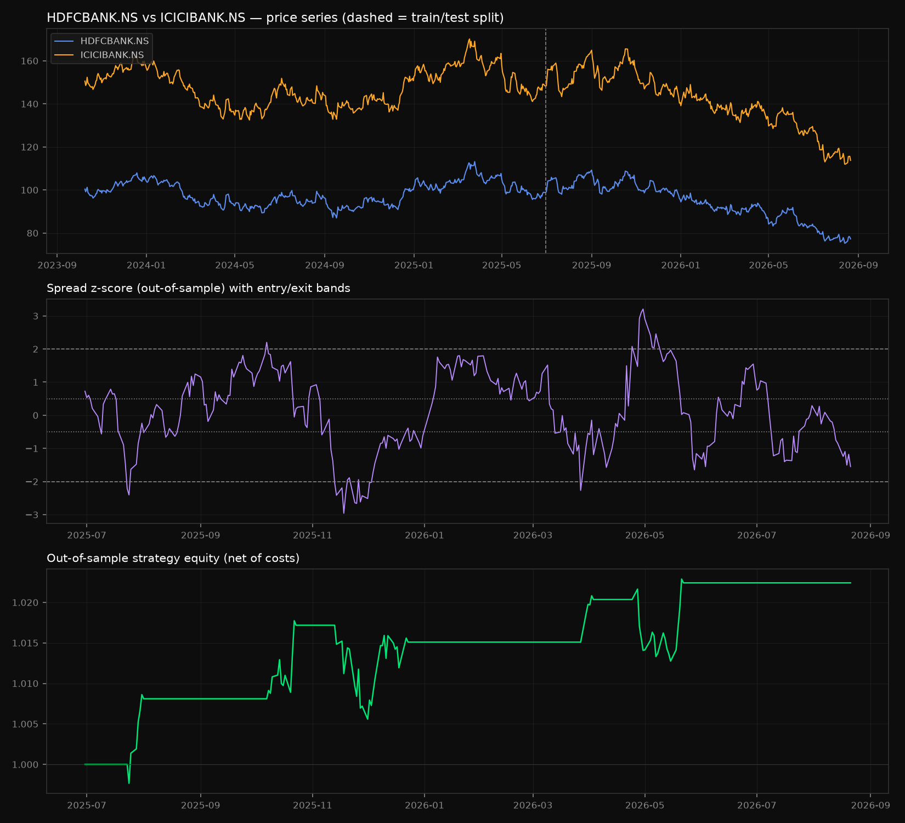

---

### AXISBANK.NS / ICICIBANK.NS

- **Latest prices:** AXISBANK.NS ₹1,245.80 · ICICIBANK.NS ₹1,420.00
- **Hedge ratio (train-fitted):** 0.9746
- **Cointegration (train):** FAIL at 5% — ADF -0.75, p=0.8328
- **Persistence:** passed 5% in 0 of 37 real-data runs (strict tier: 0/37)
- **Spread half-life:** 156.5 days
- **Current z-score:** +0.92
- **Signal today:** watch (approaching band)
- ⚠️ _Pair did not cointegrate on training data. Any signal here is not statistically justified — observation only._

**Out-of-sample backtest** (beta frozen from train window):

| Metric | Value |
|---|---|
| Sharpe | -0.41 |
| Sortino | -0.40 |
| Annualised return | -3.78% |
| Annualised vol | 8.43% |
| Max drawdown | -7.58% |
| Round-trip trades | 5 |

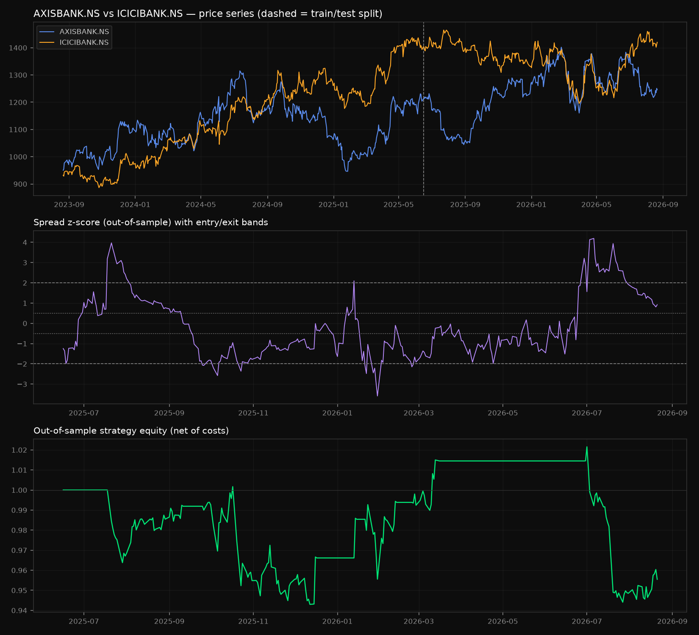

---

### KOTAKBANK.NS / HDFCBANK.NS

- **Latest prices:** KOTAKBANK.NS ₹402.80 · HDFCBANK.NS ₹726.95
- **Hedge ratio (train-fitted):** 2.0257
- **Cointegration (train):** FAIL at 5% — ADF -2.43, p=0.1327
- **Persistence:** passed 5% in 0 of 37 real-data runs (strict tier: 0/37)
- **Spread half-life:** 26.1 days
- **Current z-score:** -1.54
- **Signal today:** watch (approaching band)
- ⚠️ _Pair did not cointegrate on training data. Any signal here is not statistically justified — observation only._

**Out-of-sample backtest** (beta frozen from train window):

| Metric | Value |
|---|---|
| Sharpe | 0.90 |
| Sortino | 0.65 |
| Annualised return | 5.68% |
| Annualised vol | 6.35% |
| Max drawdown | -4.30% |
| Round-trip trades | 6 |

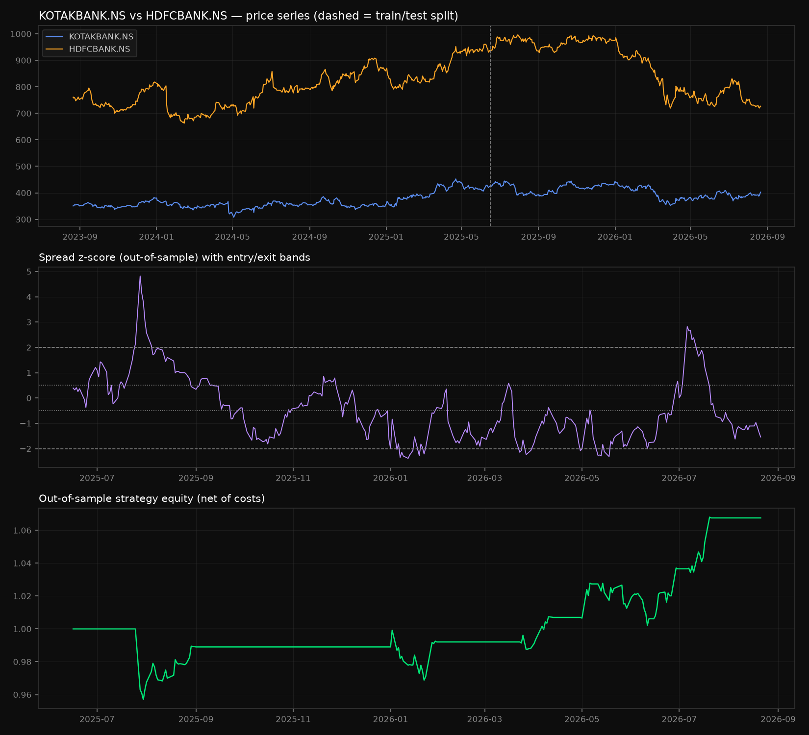

---

### SBIN.NS / BANKBARODA.NS

- **Latest prices:** SBIN.NS ₹1,048.70 · BANKBARODA.NS ₹247.00
- **Hedge ratio (train-fitted):** 0.1994
- **Cointegration (train):** FAIL at 5% — ADF -2.42, p=0.1349
- **Persistence:** passed 5% in 0 of 37 real-data runs (strict tier: 0/37)
- **Spread half-life:** 21.4 days
- **Current z-score:** -0.83
- **Signal today:** watch (approaching band)
- ⚠️ _Pair did not cointegrate on training data. Any signal here is not statistically justified — observation only._

**Out-of-sample backtest** (beta frozen from train window):

| Metric | Value |
|---|---|
| Sharpe | 0.36 |
| Sortino | 0.28 |
| Annualised return | 2.82% |
| Annualised vol | 8.93% |
| Max drawdown | -8.95% |
| Round-trip trades | 5 |

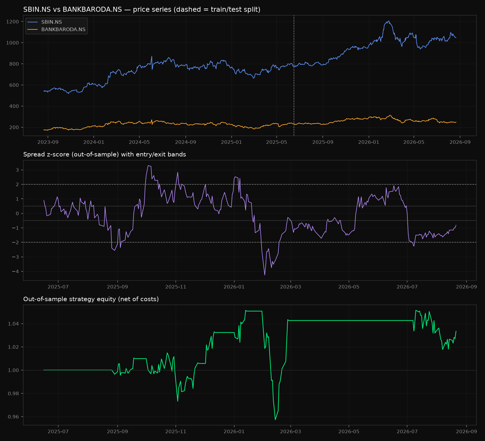

---

### TCS.NS / INFY.NS

- **Latest prices:** TCS.NS ₹2,302.00 · INFY.NS ₹1,121.00
- **Hedge ratio (train-fitted):** 0.5052
- **Cointegration (train):** FAIL at 5% — ADF -1.39, p=0.5879
- **Persistence:** passed 5% in 0 of 37 real-data runs (strict tier: 0/37)
- **Spread half-life:** 54.0 days
- **Current z-score:** -0.62
- **Signal today:** watch (approaching band)
- ⚠️ _Pair did not cointegrate on training data. Any signal here is not statistically justified — observation only._

**Out-of-sample backtest** (beta frozen from train window):

| Metric | Value |
|---|---|
| Sharpe | 1.81 |
| Sortino | 1.93 |
| Annualised return | 8.54% |
| Annualised vol | 4.59% |
| Max drawdown | -3.78% |
| Round-trip trades | 8 |

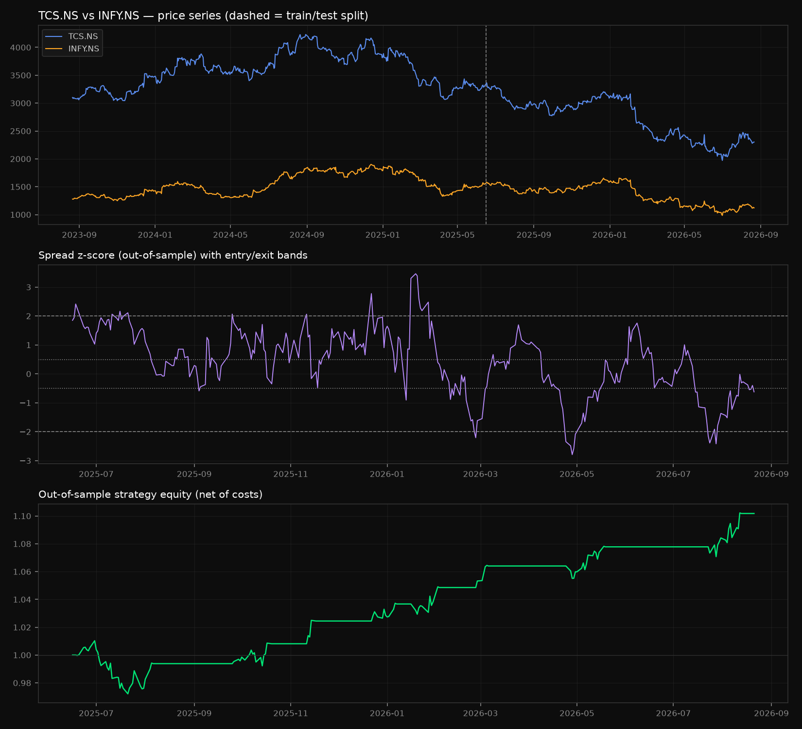

---

### INFY.NS / WIPRO.NS

- **Latest prices:** INFY.NS ₹1,121.00 · WIPRO.NS ₹180.79
- **Hedge ratio (train-fitted):** 0.1362
- **Cointegration (train):** FAIL at 5% — ADF -2.24, p=0.1926
- **Persistence:** passed 5% in 0 of 37 real-data runs (strict tier: 0/37)
- **Spread half-life:** 30.5 days
- **Current z-score:** -0.11
- **Signal today:** flat / no stretch
- ⚠️ _Pair did not cointegrate on training data. Any signal here is not statistically justified — observation only._

**Out-of-sample backtest** (beta frozen from train window):

| Metric | Value |
|---|---|
| Sharpe | 1.67 |
| Sortino | 1.95 |
| Annualised return | 8.55% |
| Annualised vol | 4.98% |
| Max drawdown | -2.35% |
| Round-trip trades | 6 |

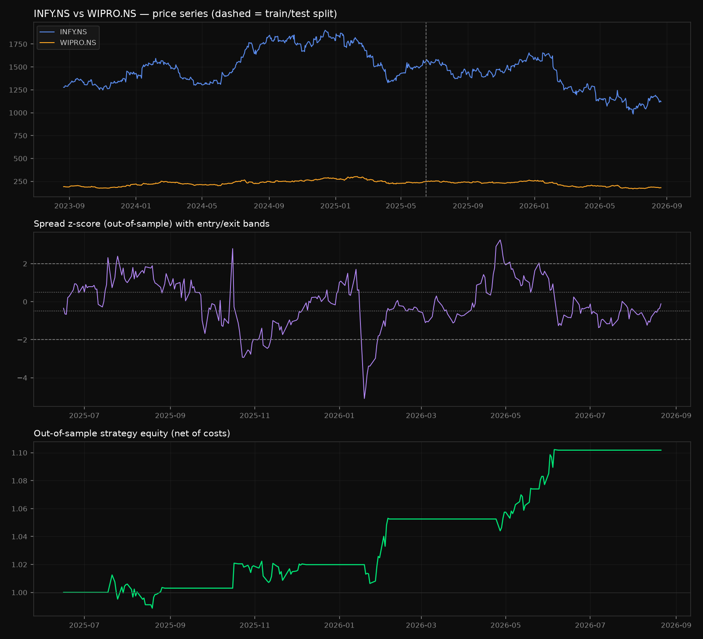

---

### HCLTECH.NS / TECHM.NS

- **Latest prices:** HCLTECH.NS ₹1,302.50 · TECHM.NS ₹1,584.00
- **Hedge ratio (train-fitted):** 0.8518
- **Cointegration (train):** FAIL at 5% — ADF -2.10, p=0.2448
- **Persistence:** passed 5% in 0 of 37 real-data runs (strict tier: 0/37)
- **Spread half-life:** 24.6 days
- **Current z-score:** -0.11
- **Signal today:** flat / no stretch
- ⚠️ _Pair did not cointegrate on training data. Any signal here is not statistically justified — observation only._

**Out-of-sample backtest** (beta frozen from train window):

| Metric | Value |
|---|---|
| Sharpe | -0.08 |
| Sortino | -0.08 |
| Annualised return | -0.80% |
| Annualised vol | 7.18% |
| Max drawdown | -7.75% |
| Round-trip trades | 5 |

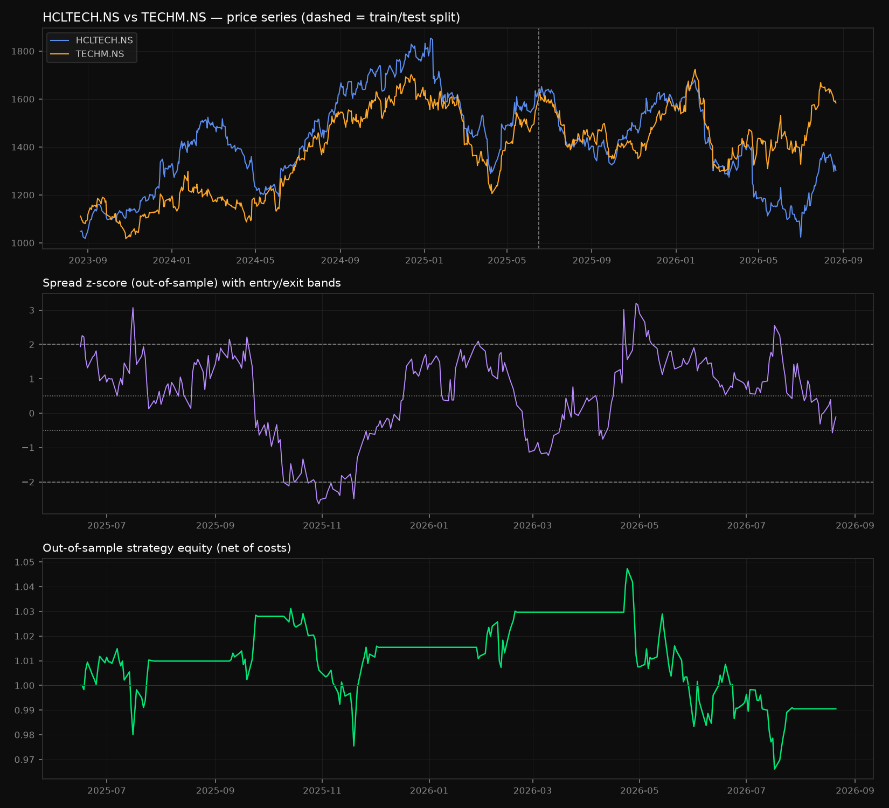

---

### ACC.NS / AMBUJACEM.NS

- **Latest prices:** ACC.NS ₹1,307.40 · AMBUJACEM.NS ₹414.50
- **Hedge ratio (train-fitted):** 0.2178
- **Cointegration (train):** FAIL at 5% — ADF -0.96, p=0.7664
- **Persistence:** passed 5% in 0 of 37 real-data runs (strict tier: 0/37)
- **Spread half-life:** 84.5 days
- **Current z-score:** -0.78
- **Signal today:** watch (approaching band)
- ⚠️ _Pair did not cointegrate on training data. Any signal here is not statistically justified — observation only._

**Out-of-sample backtest** (beta frozen from train window):

| Metric | Value |
|---|---|
| Sharpe | 0.53 |
| Sortino | 0.47 |
| Annualised return | 3.14% |
| Annualised vol | 6.19% |
| Max drawdown | -7.46% |
| Round-trip trades | 4 |

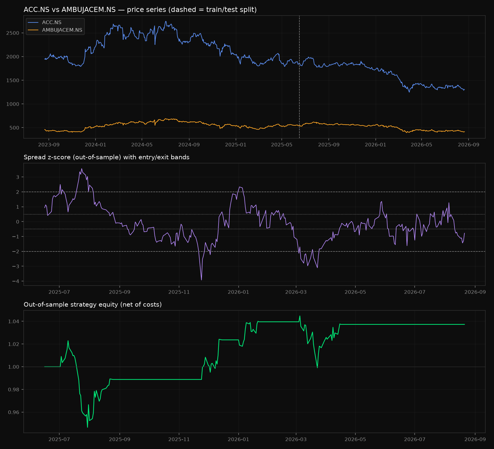

---

### ULTRACEMCO.NS / SHREECEM.NS

- **Latest prices:** ULTRACEMCO.NS ₹11,570.00 · SHREECEM.NS ₹24,280.00
- **Hedge ratio (train-fitted):** 0.6552
- **Cointegration (train):** FAIL at 5% — ADF -2.40, p=0.1423
- **Persistence:** passed 5% in 0 of 37 real-data runs (strict tier: 0/37)
- **Spread half-life:** 34.1 days
- **Current z-score:** -1.62
- **Signal today:** watch (approaching band)
- ⚠️ _Pair did not cointegrate on training data. Any signal here is not statistically justified — observation only._

**Out-of-sample backtest** (beta frozen from train window):

| Metric | Value |
|---|---|
| Sharpe | 0.49 |
| Sortino | 0.53 |
| Annualised return | 3.79% |
| Annualised vol | 8.23% |
| Max drawdown | -9.22% |
| Round-trip trades | 6 |

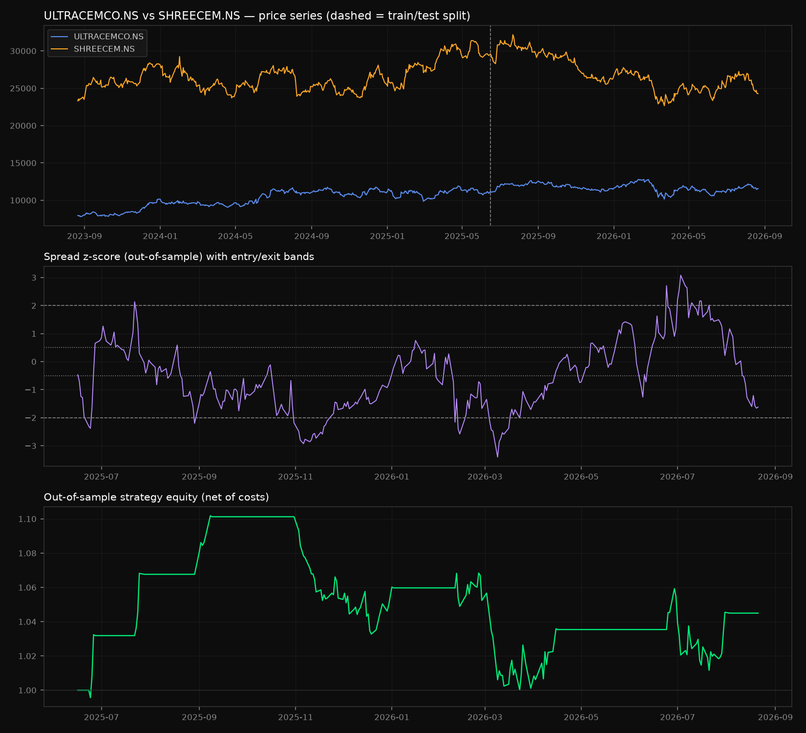

---

### IOC.NS / BPCL.NS

- **Latest prices:** IOC.NS ₹135.90 · BPCL.NS ₹311.00
- **Hedge ratio (train-fitted):** 1.7736
- **Cointegration (train):** FAIL at 5% — ADF -0.93, p=0.7785
- **Persistence:** passed 5% in 0 of 37 real-data runs (strict tier: 0/37)
- **Spread half-life:** 118.5 days
- **Current z-score:** +0.98
- **Signal today:** watch (approaching band)
- ⚠️ _Pair did not cointegrate on training data. Any signal here is not statistically justified — observation only._

**Out-of-sample backtest** (beta frozen from train window):

| Metric | Value |
|---|---|
| Sharpe | 0.40 |
| Sortino | 0.43 |
| Annualised return | 2.47% |
| Annualised vol | 6.67% |
| Max drawdown | -6.82% |
| Round-trip trades | 7 |

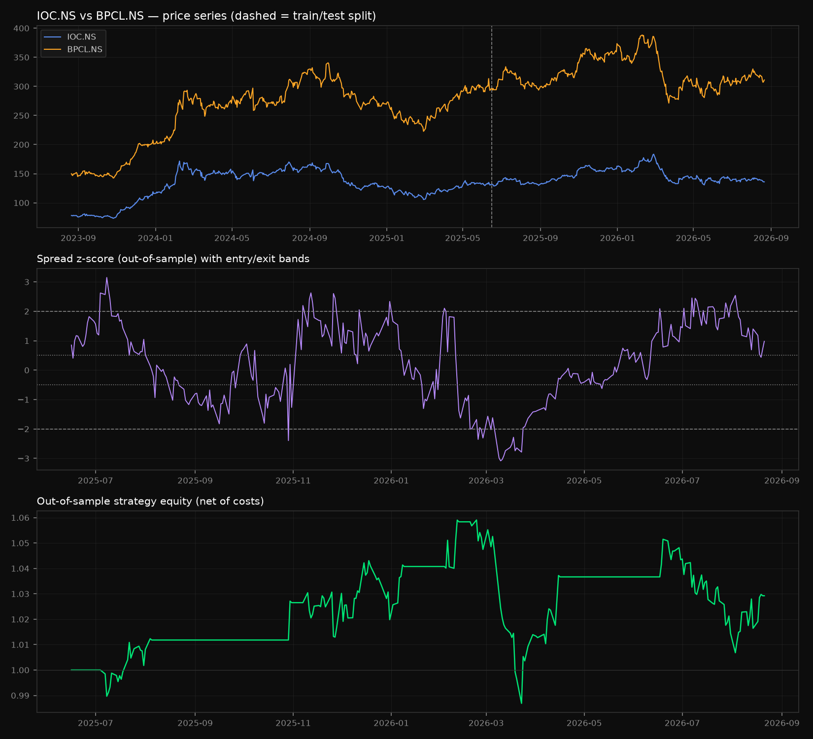

---

### BPCL.NS / HINDPETRO.NS

- **Latest prices:** BPCL.NS ₹311.00 · HINDPETRO.NS ₹363.25
- **Hedge ratio (train-fitted):** 1.3572
- **Cointegration (train):** FAIL at 5% — ADF -1.99, p=0.2907
- **Persistence:** passed 5% in 0 of 37 real-data runs (strict tier: 0/37)
- **Spread half-life:** 39.5 days
- **Current z-score:** -1.08
- **Signal today:** watch (approaching band)
- ⚠️ _Pair did not cointegrate on training data. Any signal here is not statistically justified — observation only._

**Out-of-sample backtest** (beta frozen from train window):

| Metric | Value |
|---|---|
| Sharpe | -0.19 |
| Sortino | -0.17 |
| Annualised return | -1.30% |
| Annualised vol | 6.04% |
| Max drawdown | -7.00% |
| Round-trip trades | 4 |

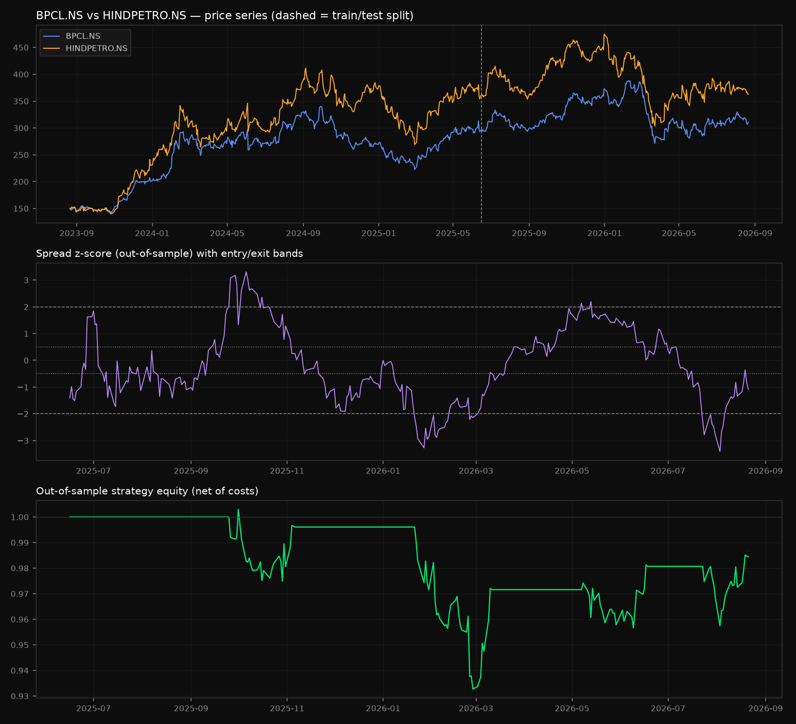

---

### ONGC.NS / COALINDIA.NS

- **Latest prices:** ONGC.NS ₹236.40 · COALINDIA.NS ₹405.20
- **Hedge ratio (train-fitted):** 1.5850
- **Cointegration (train):** PASS at 5% — ADF -3.47, p=0.0088
- **Persistence:** passed 5% in 29 of 37 real-data runs (strict tier: 0/37)
- **Spread half-life:** 13.2 days
- **Current z-score:** -0.78
- **Signal today:** watch (approaching band)

**Out-of-sample backtest** (beta frozen from train window):

| Metric | Value |
|---|---|
| Sharpe | 0.82 |
| Sortino | 0.63 |
| Annualised return | 5.72% |
| Annualised vol | 7.11% |
| Max drawdown | -5.64% |
| Round-trip trades | 5 |

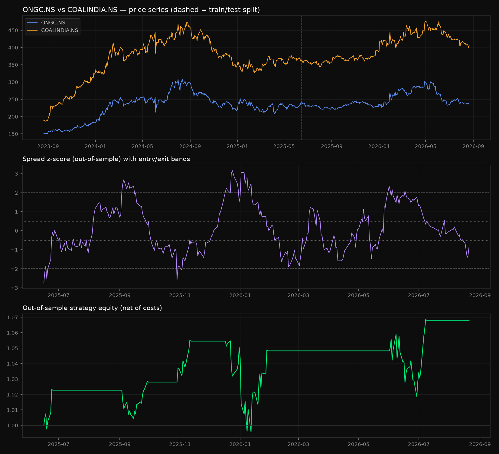

---

### NTPC.NS / POWERGRID.NS

- **Latest prices:** NTPC.NS ₹340.00 · POWERGRID.NS ₹272.40
- **Hedge ratio (train-fitted):** 0.8354
- **Cointegration (train):** FAIL at 5% — ADF -2.60, p=0.0920
- **Persistence:** passed 5% in 0 of 37 real-data runs (strict tier: 0/37)
- **Spread half-life:** 22.8 days
- **Current z-score:** -0.15
- **Signal today:** flat / no stretch
- ⚠️ _Pair did not cointegrate on training data. Any signal here is not statistically justified — observation only._

**Out-of-sample backtest** (beta frozen from train window):

| Metric | Value |
|---|---|
| Sharpe | 0.38 |
| Sortino | 0.29 |
| Annualised return | 1.98% |
| Annualised vol | 5.60% |
| Max drawdown | -5.35% |
| Round-trip trades | 6 |

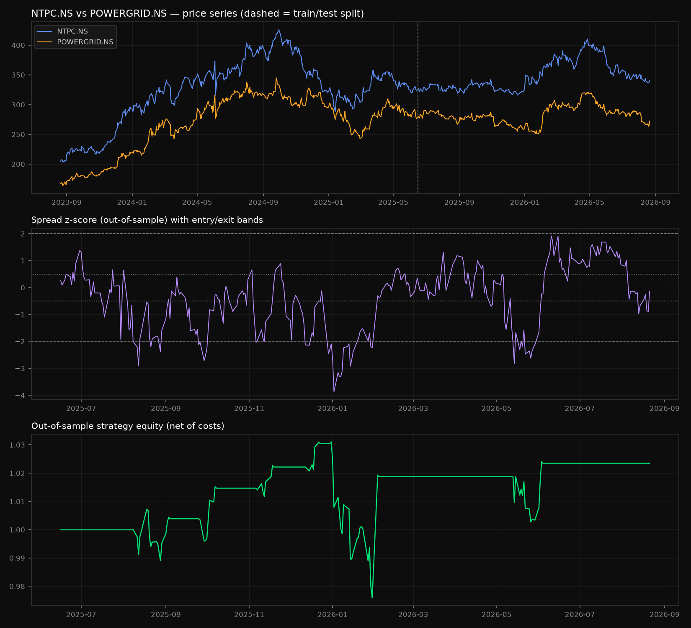

---

### BAJAJ-AUTO.NS / HEROMOTOCO.NS

- **Latest prices:** BAJAJ-AUTO.NS ₹11,700.00 · HEROMOTOCO.NS ₹5,735.00
- **Hedge ratio (train-fitted):** 0.4089
- **Cointegration (train):** FAIL at 5% — ADF -2.29, p=0.1743
- **Persistence:** passed 5% in 0 of 37 real-data runs (strict tier: 0/37)
- **Spread half-life:** 29.6 days
- **Current z-score:** +1.21
- **Signal today:** watch (approaching band)
- ⚠️ _Pair did not cointegrate on training data. Any signal here is not statistically justified — observation only._

**Out-of-sample backtest** (beta frozen from train window):

| Metric | Value |
|---|---|
| Sharpe | -1.09 |
| Sortino | -1.10 |
| Annualised return | -11.10% |
| Annualised vol | 10.28% |
| Max drawdown | -20.79% |
| Round-trip trades | 4 |

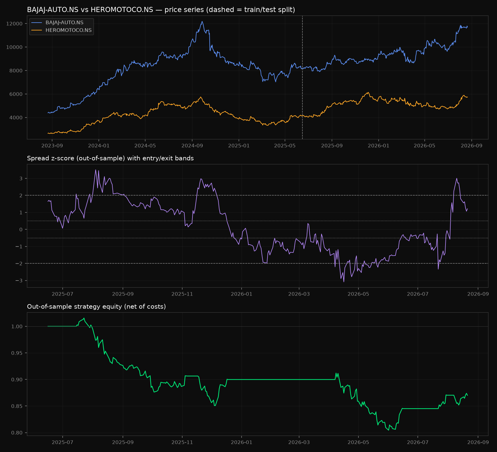

---

### TATASTEEL.NS / JSWSTEEL.NS

- **Latest prices:** TATASTEEL.NS ₹183.00 · JSWSTEEL.NS ₹1,293.70
- **Hedge ratio (train-fitted):** 3.1042
- **Cointegration (train):** FAIL at 5% — ADF -1.17, p=0.6874
- **Persistence:** passed 5% in 0 of 37 real-data runs (strict tier: 0/37)
- **Spread half-life:** 71.3 days
- **Current z-score:** +1.96
- **Signal today:** watch (approaching band)
- ⚠️ _Pair did not cointegrate on training data. Any signal here is not statistically justified — observation only._

**Out-of-sample backtest** (beta frozen from train window):

| Metric | Value |
|---|---|
| Sharpe | 0.18 |
| Sortino | 0.16 |
| Annualised return | 1.11% |
| Annualised vol | 8.01% |
| Max drawdown | -3.93% |
| Round-trip trades | 4 |

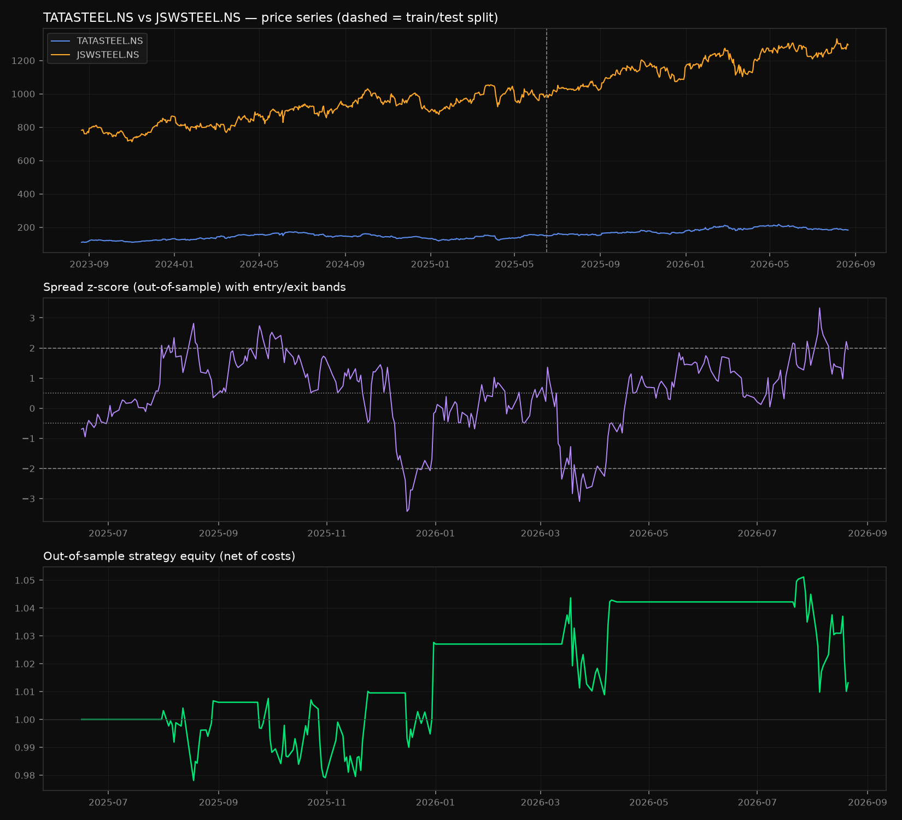

---

### SUNPHARMA.NS / CIPLA.NS

- **Latest prices:** SUNPHARMA.NS ₹1,902.40 · CIPLA.NS ₹1,432.20
- **Hedge ratio (train-fitted):** 0.4895
- **Cointegration (train):** PASS at 5% — ADF -3.39, p=0.0113
- **Persistence:** passed 5% in 37 of 37 real-data runs (strict tier: 5/37)
- **Spread half-life:** 10.7 days
- **Current z-score:** -0.02
- **Signal today:** flat / no stretch

**Out-of-sample backtest** (beta frozen from train window):

| Metric | Value |
|---|---|
| Sharpe | -0.11 |
| Sortino | -0.12 |
| Annualised return | -1.08% |
| Annualised vol | 7.58% |
| Max drawdown | -10.19% |
| Round-trip trades | 5 |

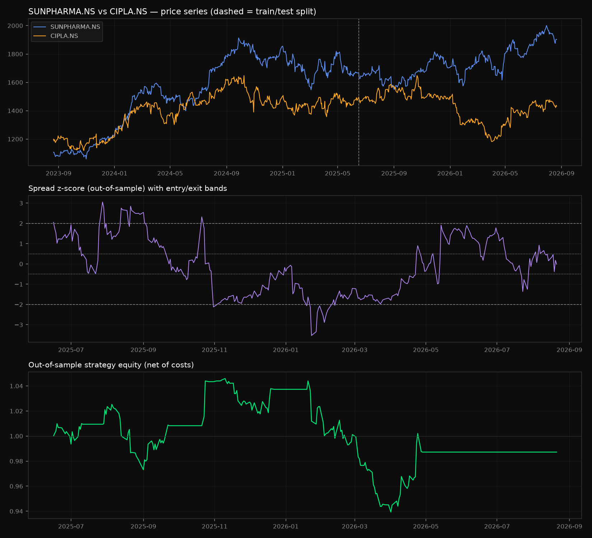

---

_Generated 2026-08-21 · pairs mean-reversion scanner · out-of-sample backtest · multiple-testing-aware · not investment advice._
