# Indian Pairs-Trading Scanner — 2026-08-24

> **What this is:** a market-neutral *pairs mean-reversion* scanner. It flags when two related NSE stocks have drifted apart far enough that their historical relationship signals a possible convergence trade. It does **not** forecast growth, rank "best" stocks, or predict company performance. A signal means the *spread between two stocks* is stretched — nothing about either stock being a good investment. Not investment advice; do your own research.

## Methodology (fixed in advance)

- **Universe:** 16 declared sector-mate pairs. Parameters (3y window, 60/40 train-test, z-entry 2.0, z-exit 0.5, 5 bps costs) are pre-registered; changes are logged in the README changelog *before* looking at results.
- **Multiple testing:** at the 5% level across 16 pairs, **≈0.8 false positives per run are expected by chance alone** even if nothing truly cointegrates. A single-day pass is a candidate, not a discovery.
- **Strict tier:** Bonferroni-corrected threshold p < 0.0031 (marked ✓✓).
- **Evidence = persistence:** the Persistence column counts how often each pair has passed the 5% test across all *real-data* daily runs recorded in `reports/history.csv`. Pairs deserve attention only when they pass persistently.

## Summary

| Pair | p-value | Coint. | Persistence | Current z | Signal | OOS Sharpe |
|---|---|---|---|---|---|---|
| HDFCBANK.NS/ICICIBANK.NS | 0.1081 | ✗ | 0/28 | +1.14 | watch | -0.65 |
| AXISBANK.NS/ICICIBANK.NS | 0.8304 | ✗ | 0/38 | +0.93 | watch | -0.43 |
| KOTAKBANK.NS/HDFCBANK.NS | 0.1284 | ✗ | 0/38 | -1.38 | watch | 0.90 |
| SBIN.NS/BANKBARODA.NS | 0.1284 | ✗ | 0/38 | -1.02 | watch | 0.02 |
| TCS.NS/INFY.NS | 0.5785 | ✗ | 0/38 | -0.21 | flat / no stretch | 1.80 |
| INFY.NS/WIPRO.NS | 0.1864 | ✗ | 0/38 | -0.22 | flat / no stretch | 1.67 |
| HCLTECH.NS/TECHM.NS | 0.2317 | ✗ | 0/38 | -0.78 | watch | 0.24 |
| ACC.NS/AMBUJACEM.NS | 0.6799 | ✗ | 0/38 | -1.75 | watch | 0.53 |
| ULTRACEMCO.NS/SHREECEM.NS | 0.1442 | ✗ | 0/38 | -1.78 | watch | 0.48 |
| IOC.NS/BPCL.NS | 0.7882 | ✗ | 0/38 | +0.48 | flat / no stretch | 0.48 |
| BPCL.NS/HINDPETRO.NS | 0.2992 | ✗ | 0/38 | -0.37 | flat / no stretch | -0.19 |
| ONGC.NS/COALINDIA.NS | 0.0073 | ✓ | 30/38 | -0.65 | watch | 0.69 |
| NTPC.NS/POWERGRID.NS | 0.0952 | ✗ | 0/38 | -0.32 | flat / no stretch | 0.38 |
| BAJAJ-AUTO.NS/HEROMOTOCO.NS | 0.1760 | ✗ | 0/38 | +0.66 | watch | -0.99 |
| TATASTEEL.NS/JSWSTEEL.NS | 0.6879 | ✗ | 0/38 | +2.57 | SHORT spread | 0.01 |
| SUNPHARMA.NS/CIPLA.NS | 0.0123 | ✓ | 38/38 | +0.06 | flat / no stretch | -0.22 |

_Legend: ✓✓ passes strict Bonferroni tier · ✓ passes 5% only · ✗ fails. Persistence = 5%-passes / real-data runs recorded. \*no real-data history yet._

---

### HDFCBANK.NS / ICICIBANK.NS

- **Latest prices:** HDFCBANK.NS ₹729.00 · ICICIBANK.NS ₹1,415.00
- **Hedge ratio (train-fitted):** 1.7599
- **Cointegration (train):** FAIL at 5% — ADF -2.53, p=0.1081
- **Persistence:** passed 5% in 0 of 28 real-data runs (strict tier: 0/28)
- **Spread half-life:** 27.5 days
- **Current z-score:** +1.14
- **Signal today:** watch (approaching band)
- ⚠️ _Pair did not cointegrate on training data. Any signal here is not statistically justified — observation only._

**Out-of-sample backtest** (beta frozen from train window):

| Metric | Value |
|---|---|
| Sharpe | -0.65 |
| Sortino | -0.67 |
| Annualised return | -4.12% |
| Annualised vol | 6.21% |
| Max drawdown | -8.78% |
| Round-trip trades | 4 |

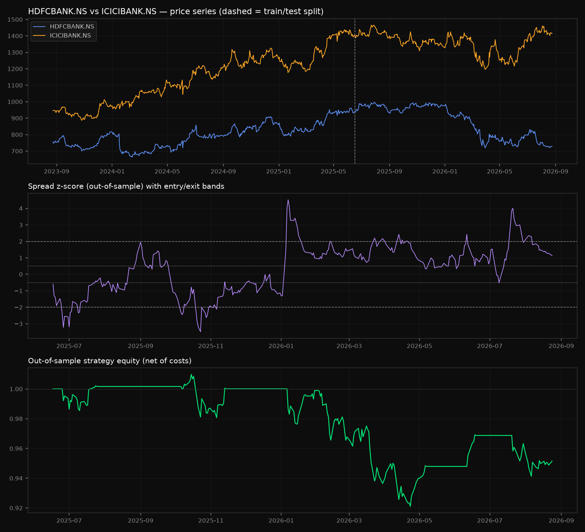

---

### AXISBANK.NS / ICICIBANK.NS

- **Latest prices:** AXISBANK.NS ₹1,236.00 · ICICIBANK.NS ₹1,415.00
- **Hedge ratio (train-fitted):** 0.9706
- **Cointegration (train):** FAIL at 5% — ADF -0.76, p=0.8304
- **Persistence:** passed 5% in 0 of 38 real-data runs (strict tier: 0/38)
- **Spread half-life:** 153.8 days
- **Current z-score:** +0.93
- **Signal today:** watch (approaching band)
- ⚠️ _Pair did not cointegrate on training data. Any signal here is not statistically justified — observation only._

**Out-of-sample backtest** (beta frozen from train window):

| Metric | Value |
|---|---|
| Sharpe | -0.43 |
| Sortino | -0.42 |
| Annualised return | -3.93% |
| Annualised vol | 8.44% |
| Max drawdown | -7.59% |
| Round-trip trades | 5 |

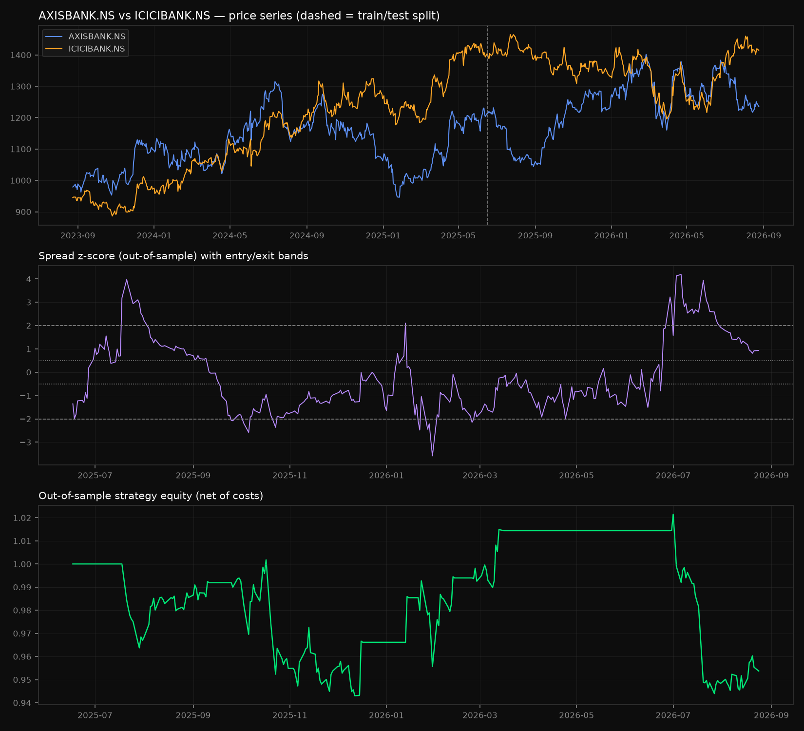

---

### KOTAKBANK.NS / HDFCBANK.NS

- **Latest prices:** KOTAKBANK.NS ₹401.45 · HDFCBANK.NS ₹729.00
- **Hedge ratio (train-fitted):** 2.0283
- **Cointegration (train):** FAIL at 5% — ADF -2.45, p=0.1284
- **Persistence:** passed 5% in 0 of 38 real-data runs (strict tier: 0/38)
- **Spread half-life:** 25.9 days
- **Current z-score:** -1.38
- **Signal today:** watch (approaching band)
- ⚠️ _Pair did not cointegrate on training data. Any signal here is not statistically justified — observation only._

**Out-of-sample backtest** (beta frozen from train window):

| Metric | Value |
|---|---|
| Sharpe | 0.90 |
| Sortino | 0.65 |
| Annualised return | 5.69% |
| Annualised vol | 6.37% |
| Max drawdown | -4.31% |
| Round-trip trades | 6 |

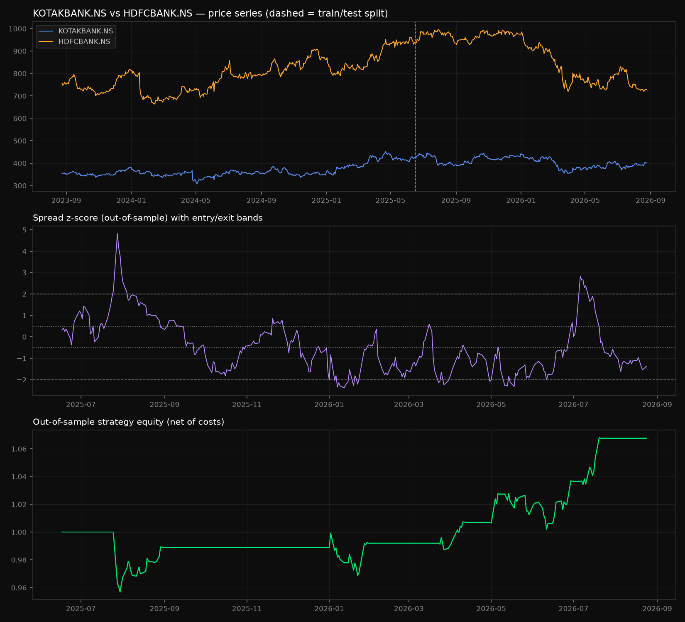

---

### SBIN.NS / BANKBARODA.NS

- **Latest prices:** SBIN.NS ₹1,039.50 · BANKBARODA.NS ₹241.50
- **Hedge ratio (train-fitted):** 0.1978
- **Cointegration (train):** FAIL at 5% — ADF -2.45, p=0.1284
- **Persistence:** passed 5% in 0 of 38 real-data runs (strict tier: 0/38)
- **Spread half-life:** 21.1 days
- **Current z-score:** -1.02
- **Signal today:** watch (approaching band)
- ⚠️ _Pair did not cointegrate on training data. Any signal here is not statistically justified — observation only._

**Out-of-sample backtest** (beta frozen from train window):

| Metric | Value |
|---|---|
| Sharpe | 0.02 |
| Sortino | 0.01 |
| Annualised return | -0.23% |
| Annualised vol | 8.76% |
| Max drawdown | -8.99% |
| Round-trip trades | 4 |

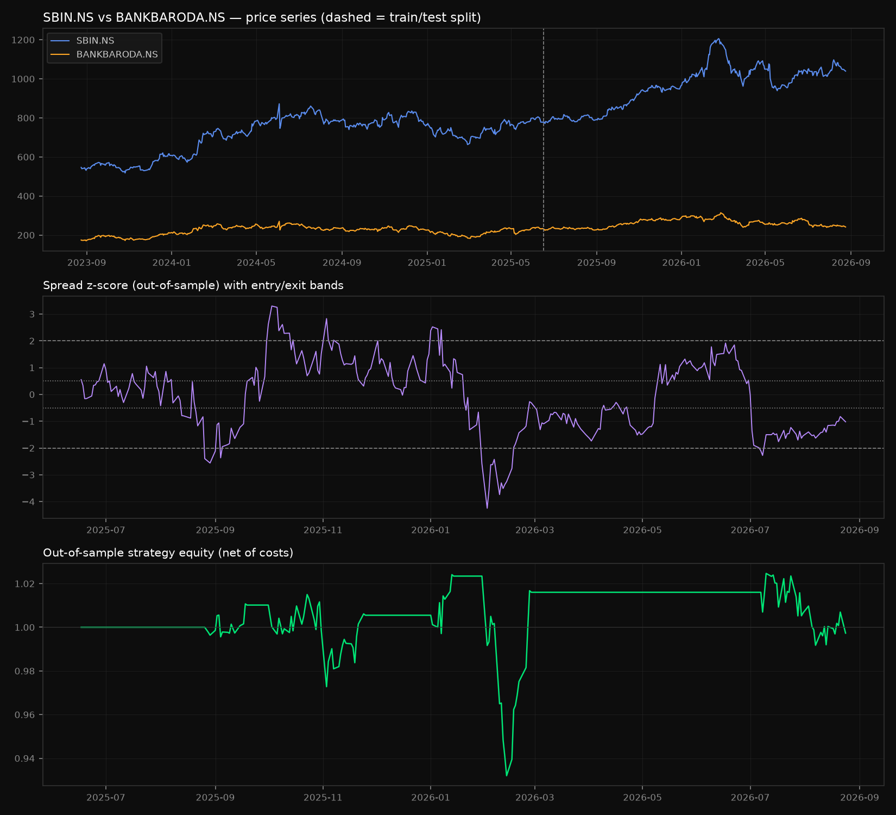

---

### TCS.NS / INFY.NS

- **Latest prices:** TCS.NS ₹2,284.10 · INFY.NS ₹1,130.00
- **Hedge ratio (train-fitted):** 0.5040
- **Cointegration (train):** FAIL at 5% — ADF -1.41, p=0.5785
- **Persistence:** passed 5% in 0 of 38 real-data runs (strict tier: 0/38)
- **Spread half-life:** 54.0 days
- **Current z-score:** -0.21
- **Signal today:** flat / no stretch
- ⚠️ _Pair did not cointegrate on training data. Any signal here is not statistically justified — observation only._

**Out-of-sample backtest** (beta frozen from train window):

| Metric | Value |
|---|---|
| Sharpe | 1.80 |
| Sortino | 1.84 |
| Annualised return | 8.04% |
| Annualised vol | 4.35% |
| Max drawdown | -3.75% |
| Round-trip trades | 8 |

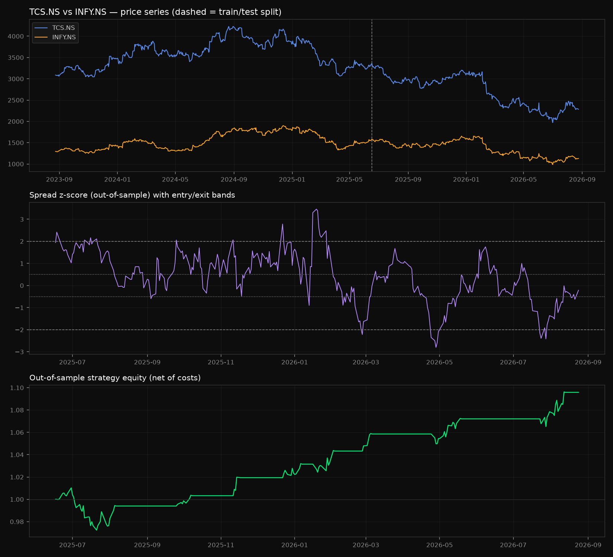

---

### INFY.NS / WIPRO.NS

- **Latest prices:** INFY.NS ₹1,130.00 · WIPRO.NS ₹181.31
- **Hedge ratio (train-fitted):** 0.1360
- **Cointegration (train):** FAIL at 5% — ADF -2.26, p=0.1864
- **Persistence:** passed 5% in 0 of 38 real-data runs (strict tier: 0/38)
- **Spread half-life:** 30.3 days
- **Current z-score:** -0.22
- **Signal today:** flat / no stretch
- ⚠️ _Pair did not cointegrate on training data. Any signal here is not statistically justified — observation only._

**Out-of-sample backtest** (beta frozen from train window):

| Metric | Value |
|---|---|
| Sharpe | 1.67 |
| Sortino | 1.95 |
| Annualised return | 8.51% |
| Annualised vol | 4.96% |
| Max drawdown | -2.33% |
| Round-trip trades | 6 |

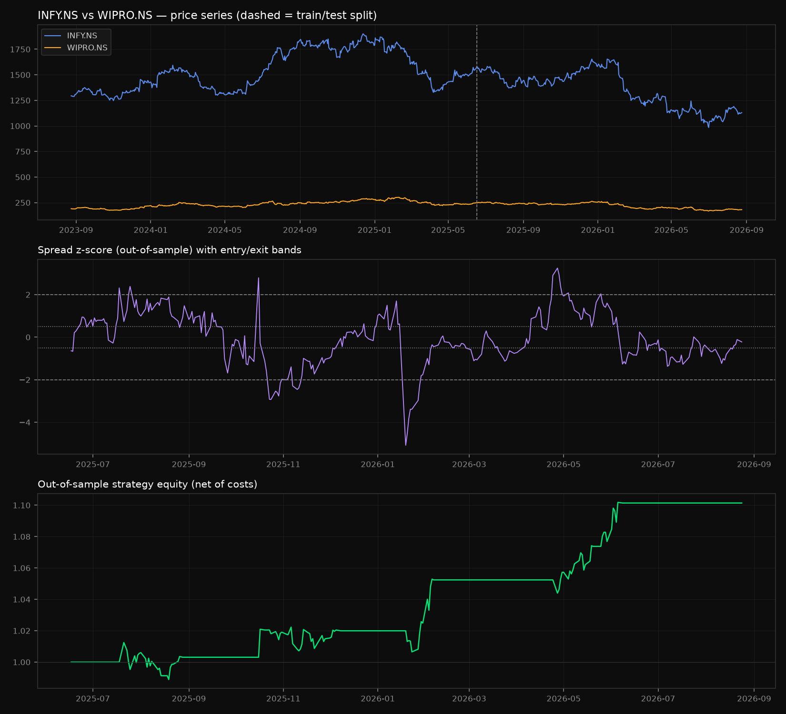

---

### HCLTECH.NS / TECHM.NS

- **Latest prices:** HCLTECH.NS ₹1,322.00 · TECHM.NS ₹1,584.00
- **Hedge ratio (train-fitted):** 0.8590
- **Cointegration (train):** FAIL at 5% — ADF -2.13, p=0.2317
- **Persistence:** passed 5% in 0 of 38 real-data runs (strict tier: 0/38)
- **Spread half-life:** 24.9 days
- **Current z-score:** -0.78
- **Signal today:** watch (approaching band)
- ⚠️ _Pair did not cointegrate on training data. Any signal here is not statistically justified — observation only._

**Out-of-sample backtest** (beta frozen from train window):

| Metric | Value |
|---|---|
| Sharpe | 0.24 |
| Sortino | 0.25 |
| Annualised return | 1.43% |
| Annualised vol | 6.88% |
| Max drawdown | -7.65% |
| Round-trip trades | 6 |

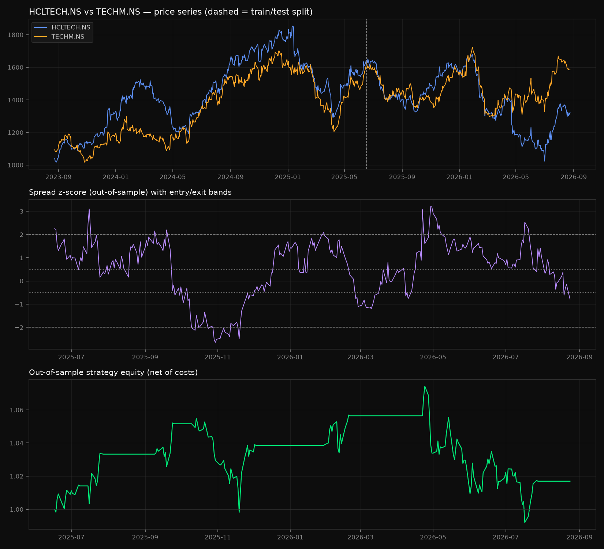

---

### ACC.NS / AMBUJACEM.NS

- **Latest prices:** ACC.NS ₹1,300.90 · AMBUJACEM.NS ₹408.75
- **Hedge ratio (train-fitted):** 0.2161
- **Cointegration (train):** FAIL at 5% — ADF -1.19, p=0.6799
- **Persistence:** passed 5% in 0 of 38 real-data runs (strict tier: 0/38)
- **Spread half-life:** 75.4 days
- **Current z-score:** -1.75
- **Signal today:** watch (approaching band)
- ⚠️ _Pair did not cointegrate on training data. Any signal here is not statistically justified — observation only._

**Out-of-sample backtest** (beta frozen from train window):

| Metric | Value |
|---|---|
| Sharpe | 0.53 |
| Sortino | 0.47 |
| Annualised return | 3.15% |
| Annualised vol | 6.22% |
| Max drawdown | -7.47% |
| Round-trip trades | 4 |

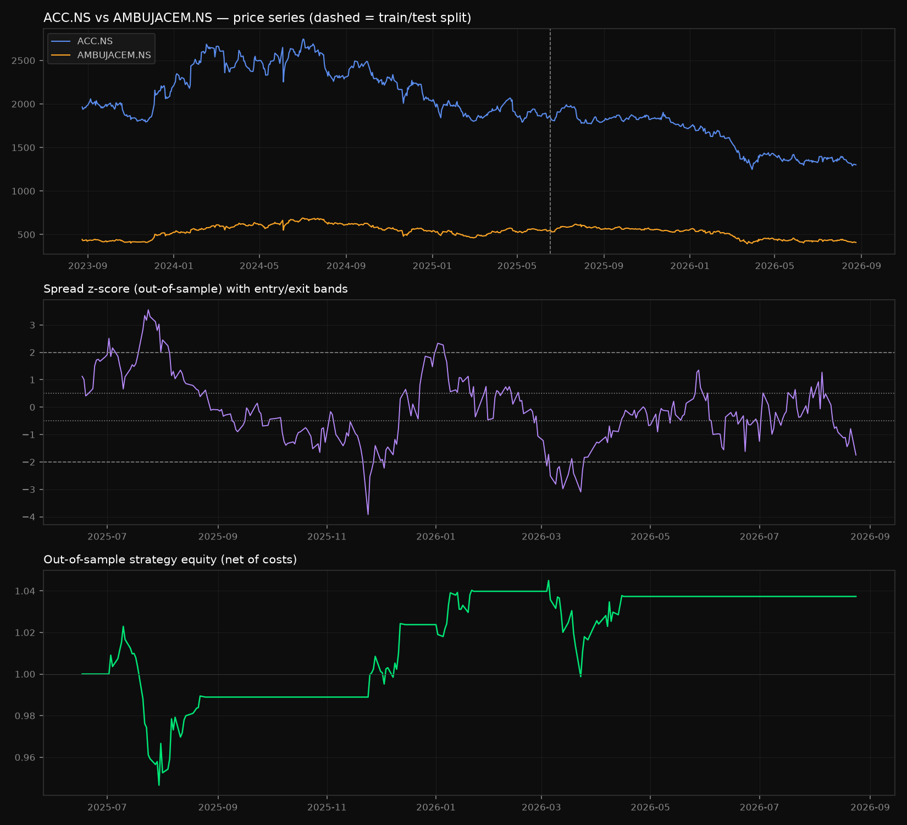

---

### ULTRACEMCO.NS / SHREECEM.NS

- **Latest prices:** ULTRACEMCO.NS ₹11,504.00 · SHREECEM.NS ₹24,020.00
- **Hedge ratio (train-fitted):** 0.6399
- **Cointegration (train):** FAIL at 5% — ADF -2.39, p=0.1442
- **Persistence:** passed 5% in 0 of 38 real-data runs (strict tier: 0/38)
- **Spread half-life:** 34.5 days
- **Current z-score:** -1.78
- **Signal today:** watch (approaching band)
- ⚠️ _Pair did not cointegrate on training data. Any signal here is not statistically justified — observation only._

**Out-of-sample backtest** (beta frozen from train window):

| Metric | Value |
|---|---|
| Sharpe | 0.48 |
| Sortino | 0.52 |
| Annualised return | 3.78% |
| Annualised vol | 8.38% |
| Max drawdown | -9.43% |
| Round-trip trades | 6 |

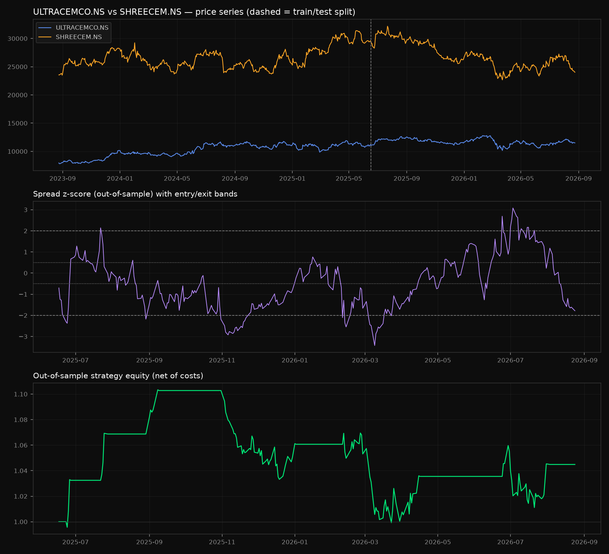

---

### IOC.NS / BPCL.NS

- **Latest prices:** IOC.NS ₹138.50 · BPCL.NS ₹311.90
- **Hedge ratio (train-fitted):** 1.7670
- **Cointegration (train):** FAIL at 5% — ADF -0.90, p=0.7882
- **Persistence:** passed 5% in 0 of 38 real-data runs (strict tier: 0/38)
- **Spread half-life:** 122.5 days
- **Current z-score:** +0.48
- **Signal today:** flat / no stretch
- ⚠️ _Pair did not cointegrate on training data. Any signal here is not statistically justified — observation only._

**Out-of-sample backtest** (beta frozen from train window):

| Metric | Value |
|---|---|
| Sharpe | 0.48 |
| Sortino | 0.51 |
| Annualised return | 3.03% |
| Annualised vol | 6.69% |
| Max drawdown | -6.58% |
| Round-trip trades | 7 |

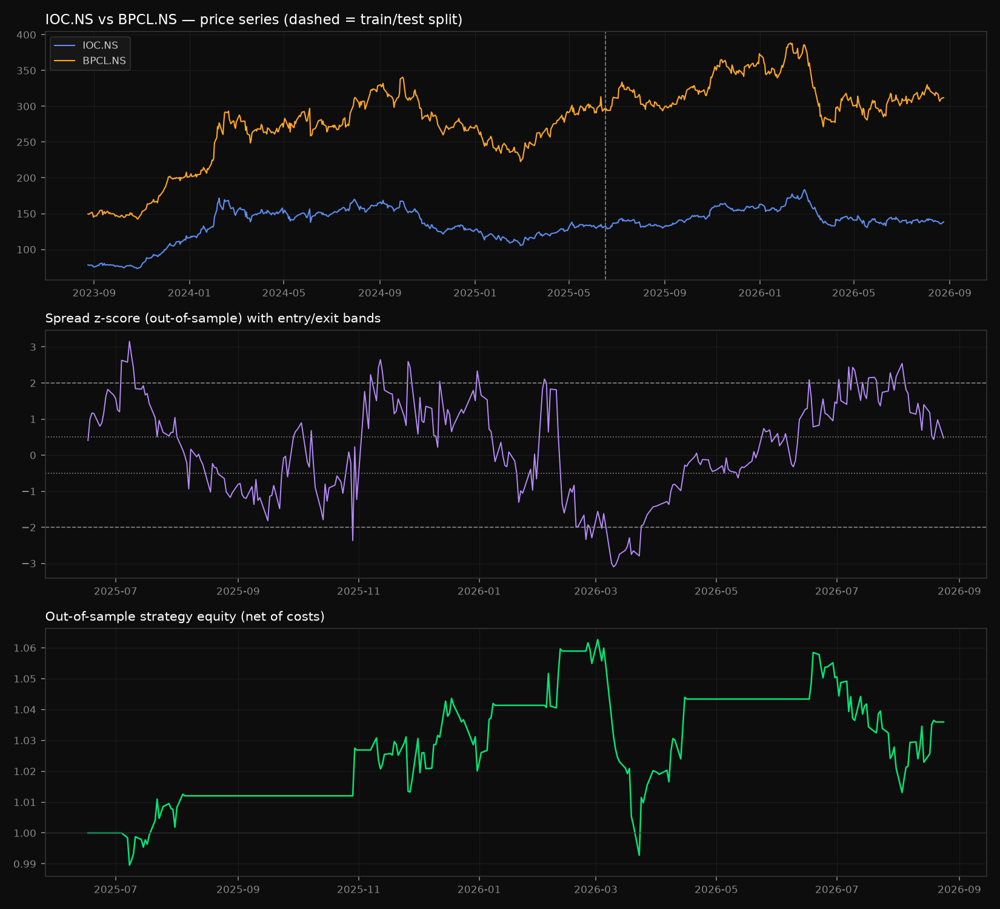

---

### BPCL.NS / HINDPETRO.NS

- **Latest prices:** BPCL.NS ₹311.90 · HINDPETRO.NS ₹371.95
- **Hedge ratio (train-fitted):** 1.3559
- **Cointegration (train):** FAIL at 5% — ADF -1.97, p=0.2992
- **Persistence:** passed 5% in 0 of 38 real-data runs (strict tier: 0/38)
- **Spread half-life:** 39.8 days
- **Current z-score:** -0.37
- **Signal today:** flat / no stretch
- ⚠️ _Pair did not cointegrate on training data. Any signal here is not statistically justified — observation only._

**Out-of-sample backtest** (beta frozen from train window):

| Metric | Value |
|---|---|
| Sharpe | -0.19 |
| Sortino | -0.17 |
| Annualised return | -1.32% |
| Annualised vol | 6.09% |
| Max drawdown | -7.06% |
| Round-trip trades | 4 |

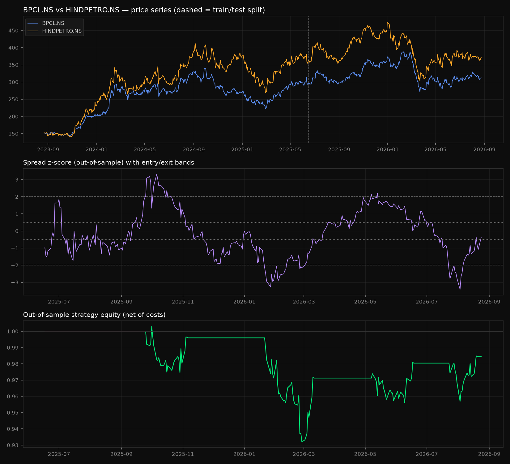

---

### ONGC.NS / COALINDIA.NS

- **Latest prices:** ONGC.NS ₹236.55 · COALINDIA.NS ₹406.90
- **Hedge ratio (train-fitted):** 1.5660
- **Cointegration (train):** PASS at 5% — ADF -3.53, p=0.0073
- **Persistence:** passed 5% in 30 of 38 real-data runs (strict tier: 0/38)
- **Spread half-life:** 13.1 days
- **Current z-score:** -0.65
- **Signal today:** watch (approaching band)

**Out-of-sample backtest** (beta frozen from train window):

| Metric | Value |
|---|---|
| Sharpe | 0.69 |
| Sortino | 0.52 |
| Annualised return | 4.77% |
| Annualised vol | 7.17% |
| Max drawdown | -5.75% |
| Round-trip trades | 5 |

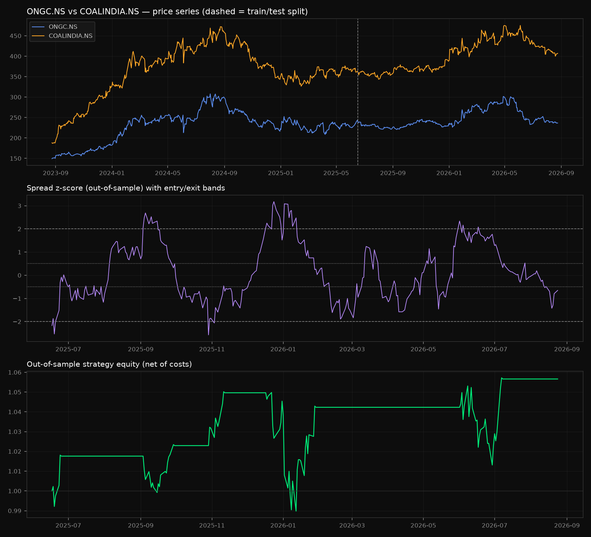

---

### NTPC.NS / POWERGRID.NS

- **Latest prices:** NTPC.NS ₹339.50 · POWERGRID.NS ₹271.40
- **Hedge ratio (train-fitted):** 0.8348
- **Cointegration (train):** FAIL at 5% — ADF -2.59, p=0.0952
- **Persistence:** passed 5% in 0 of 38 real-data runs (strict tier: 0/38)
- **Spread half-life:** 22.9 days
- **Current z-score:** -0.32
- **Signal today:** flat / no stretch
- ⚠️ _Pair did not cointegrate on training data. Any signal here is not statistically justified — observation only._

**Out-of-sample backtest** (beta frozen from train window):

| Metric | Value |
|---|---|
| Sharpe | 0.38 |
| Sortino | 0.29 |
| Annualised return | 1.98% |
| Annualised vol | 5.59% |
| Max drawdown | -5.33% |
| Round-trip trades | 6 |

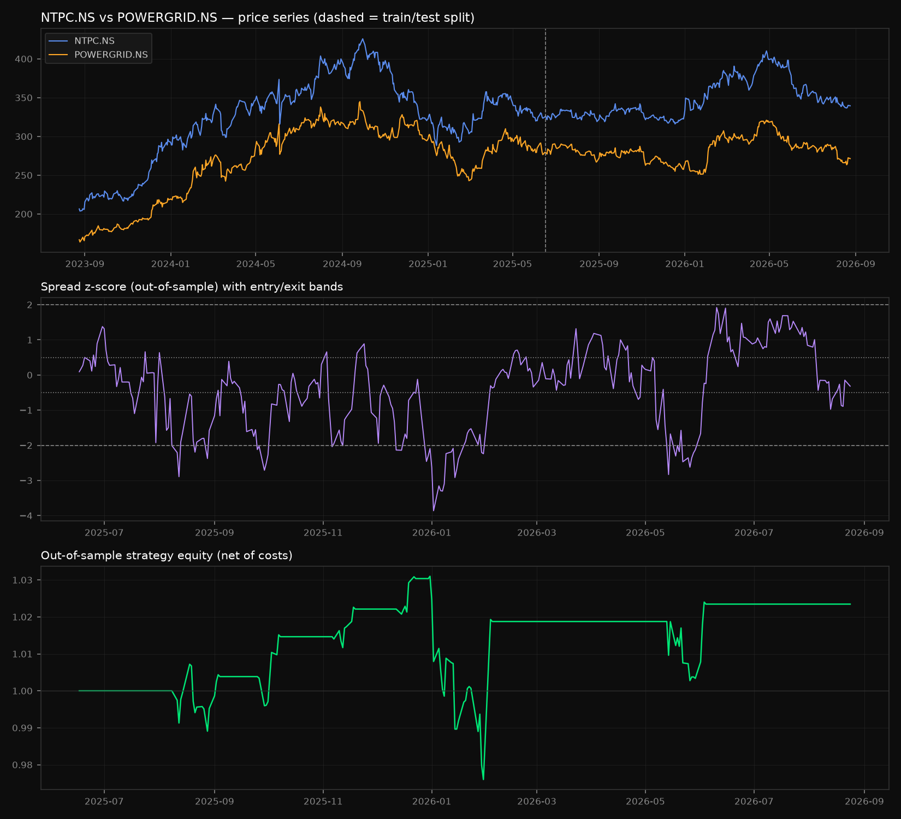

---

### BAJAJ-AUTO.NS / HEROMOTOCO.NS

- **Latest prices:** BAJAJ-AUTO.NS ₹11,800.00 · HEROMOTOCO.NS ₹5,685.00
- **Hedge ratio (train-fitted):** 0.4093
- **Cointegration (train):** FAIL at 5% — ADF -2.29, p=0.1760
- **Persistence:** passed 5% in 0 of 38 real-data runs (strict tier: 0/38)
- **Spread half-life:** 29.6 days
- **Current z-score:** +0.66
- **Signal today:** watch (approaching band)
- ⚠️ _Pair did not cointegrate on training data. Any signal here is not statistically justified — observation only._

**Out-of-sample backtest** (beta frozen from train window):

| Metric | Value |
|---|---|
| Sharpe | -0.99 |
| Sortino | -1.00 |
| Annualised return | -10.20% |
| Annualised vol | 10.35% |
| Max drawdown | -20.81% |
| Round-trip trades | 4 |

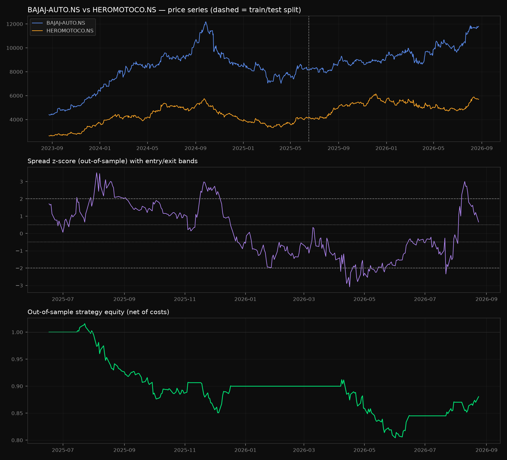

---

### TATASTEEL.NS / JSWSTEEL.NS

- **Latest prices:** TATASTEEL.NS ₹186.30 · JSWSTEEL.NS ₹1,327.00
- **Hedge ratio (train-fitted):** 3.0952
- **Cointegration (train):** FAIL at 5% — ADF -1.17, p=0.6879
- **Persistence:** passed 5% in 0 of 38 real-data runs (strict tier: 0/38)
- **Spread half-life:** 72.3 days
- **Current z-score:** +2.57
- **Signal today:** SHORT spread (short JSWSTEEL.NS, long TATASTEEL.NS)
- ⚠️ _Pair did not cointegrate on training data. Any signal here is not statistically justified — observation only._

**Out-of-sample backtest** (beta frozen from train window):

| Metric | Value |
|---|---|
| Sharpe | 0.01 |
| Sortino | 0.01 |
| Annualised return | -0.22% |
| Annualised vol | 8.21% |
| Max drawdown | -5.17% |
| Round-trip trades | 4 |

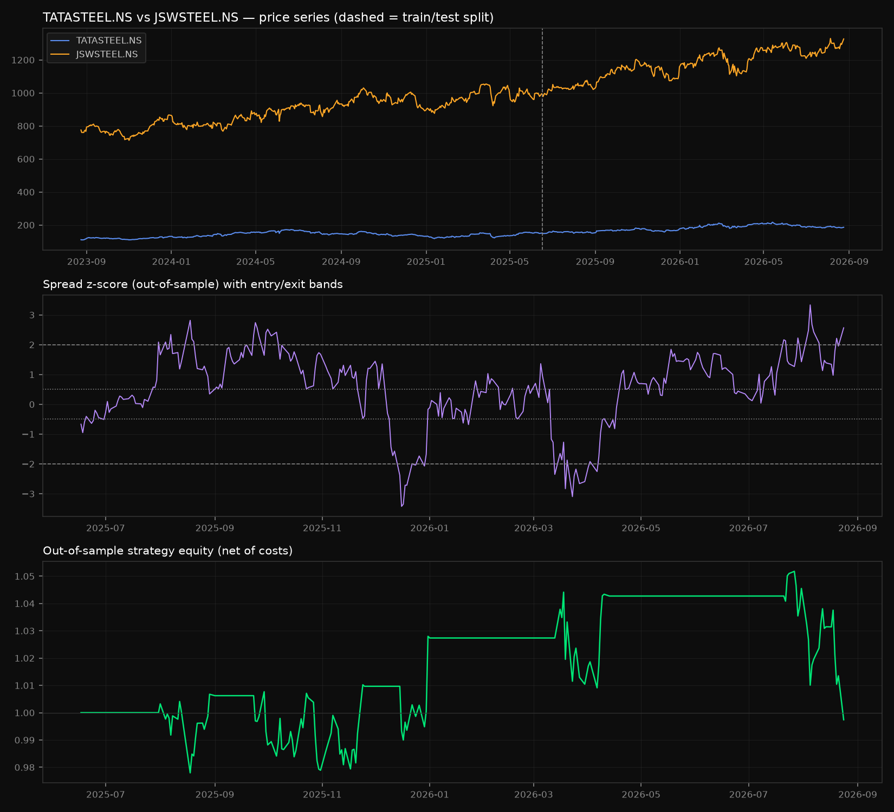

---

### SUNPHARMA.NS / CIPLA.NS

- **Latest prices:** SUNPHARMA.NS ₹1,910.00 · CIPLA.NS ₹1,437.90
- **Hedge ratio (train-fitted):** 0.4902
- **Cointegration (train):** PASS at 5% — ADF -3.36, p=0.0123
- **Persistence:** passed 5% in 38 of 38 real-data runs (strict tier: 5/38)
- **Spread half-life:** 10.8 days
- **Current z-score:** +0.06
- **Signal today:** flat / no stretch

**Out-of-sample backtest** (beta frozen from train window):

| Metric | Value |
|---|---|
| Sharpe | -0.22 |
| Sortino | -0.22 |
| Annualised return | -1.91% |
| Annualised vol | 7.52% |
| Max drawdown | -10.36% |
| Round-trip trades | 4 |

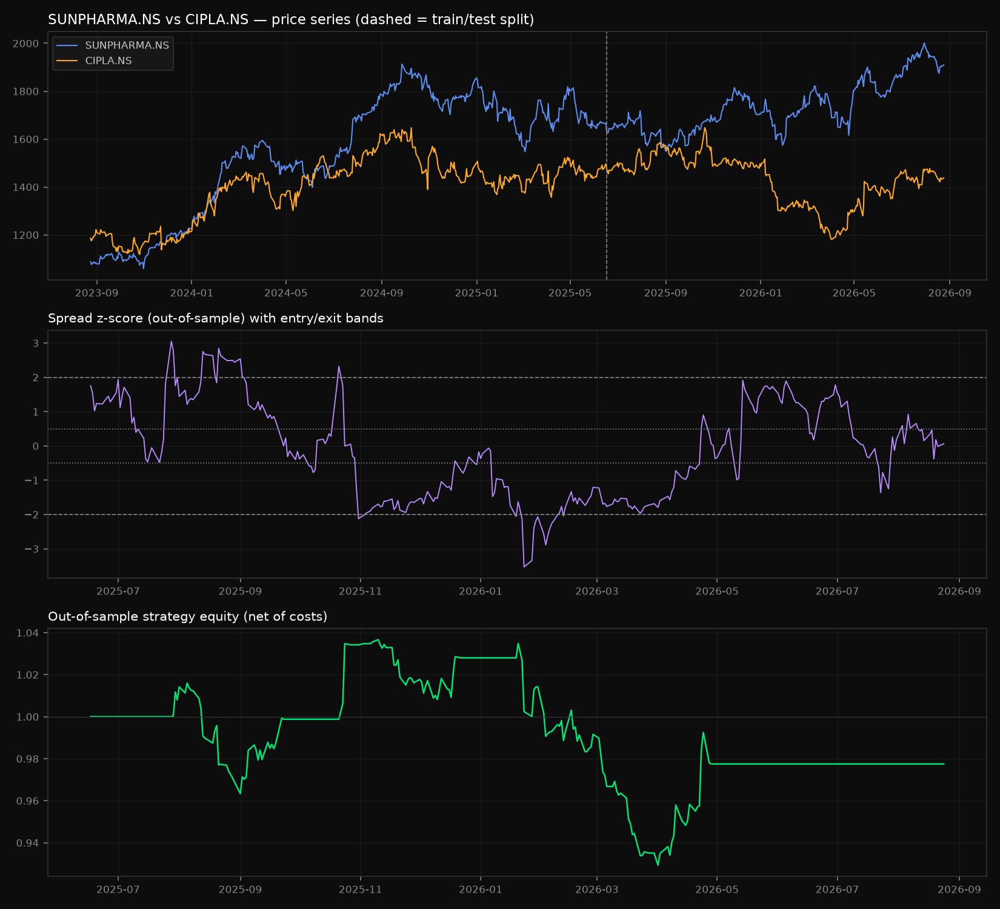

---

_Generated 2026-08-24 · pairs mean-reversion scanner · out-of-sample backtest · multiple-testing-aware · not investment advice._
