# Indian Pairs-Trading Scanner — 2026-08-25

> **What this is:** a market-neutral *pairs mean-reversion* scanner. It flags when two related NSE stocks have drifted apart far enough that their historical relationship signals a possible convergence trade. It does **not** forecast growth, rank "best" stocks, or predict company performance. A signal means the *spread between two stocks* is stretched — nothing about either stock being a good investment. Not investment advice; do your own research.

## Methodology (fixed in advance)

- **Universe:** 16 declared sector-mate pairs. Parameters (3y window, 60/40 train-test, z-entry 2.0, z-exit 0.5, 5 bps costs) are pre-registered; changes are logged in the README changelog *before* looking at results.
- **Multiple testing:** at the 5% level across 16 pairs, **≈0.8 false positives per run are expected by chance alone** even if nothing truly cointegrates. A single-day pass is a candidate, not a discovery.
- **Strict tier:** Bonferroni-corrected threshold p < 0.0031 (marked ✓✓).
- **Evidence = persistence:** the Persistence column counts how often each pair has passed the 5% test across all *real-data* daily runs recorded in `reports/history.csv`. Pairs deserve attention only when they pass persistently.

## Summary

| Pair | p-value | Coint. | Persistence | Current z | Signal | OOS Sharpe |
|---|---|---|---|---|---|---|
| HDFCBANK.NS/ICICIBANK.NS | 0.1243 | ✗ | 0/29 | +1.22 | watch | -0.69 |
| AXISBANK.NS/ICICIBANK.NS | 0.8212 | ✗ | 0/39 | +1.00 | watch | -0.47 |
| KOTAKBANK.NS/HDFCBANK.NS | 0.1236 | ✗ | 0/39 | -1.42 | watch | 0.90 |
| SBIN.NS/BANKBARODA.NS | 0.1266 | ✗ | 0/39 | -1.12 | watch | -0.04 |
| TCS.NS/INFY.NS | 0.5901 | ✗ | 0/39 | -0.03 | flat / no stretch | 1.80 |
| INFY.NS/WIPRO.NS | 0.1769 | ✗ | 0/39 | -0.93 | watch | 1.67 |
| HCLTECH.NS/TECHM.NS | 0.1242 | ✗ | 0/39 | +0.04 | flat / no stretch | 0.25 |
| ACC.NS/AMBUJACEM.NS | 0.6851 | ✗ | 0/39 | -0.96 | watch | 0.53 |
| ULTRACEMCO.NS/SHREECEM.NS | 0.1272 | ✗ | 0/39 | -1.37 | watch | 0.48 |
| IOC.NS/BPCL.NS | 0.7582 | ✗ | 0/39 | +1.15 | watch | 0.48 |
| BPCL.NS/HINDPETRO.NS | 0.3010 | ✗ | 0/39 | -1.02 | watch | -0.19 |
| ONGC.NS/COALINDIA.NS | 0.0062 | ✓ | 31/39 | -0.55 | watch | 0.78 |
| NTPC.NS/POWERGRID.NS | 0.0930 | ✗ | 0/39 | -0.50 | watch | 0.38 |
| BAJAJ-AUTO.NS/HEROMOTOCO.NS | 0.1759 | ✗ | 0/39 | +0.01 | flat / no stretch | -0.85 |
| TATASTEEL.NS/JSWSTEEL.NS | 0.6874 | ✗ | 0/39 | +2.14 | SHORT spread | 0.08 |
| SUNPHARMA.NS/CIPLA.NS | 0.0120 | ✓ | 39/39 | -0.79 | watch | -0.22 |

_Legend: ✓✓ passes strict Bonferroni tier · ✓ passes 5% only · ✗ fails. Persistence = 5%-passes / real-data runs recorded. \*no real-data history yet._

---

### HDFCBANK.NS / ICICIBANK.NS

- **Latest prices:** HDFCBANK.NS ₹727.50 · ICICIBANK.NS ₹1,422.70
- **Hedge ratio (train-fitted):** 1.7582
- **Cointegration (train):** FAIL at 5% — ADF -2.46, p=0.1243
- **Persistence:** passed 5% in 0 of 29 real-data runs (strict tier: 0/29)
- **Spread half-life:** 28.2 days
- **Current z-score:** +1.22
- **Signal today:** watch (approaching band)
- ⚠️ _Pair did not cointegrate on training data. Any signal here is not statistically justified — observation only._

**Out-of-sample backtest** (beta frozen from train window):

| Metric | Value |
|---|---|
| Sharpe | -0.69 |
| Sortino | -0.72 |
| Annualised return | -4.40% |
| Annualised vol | 6.23% |
| Max drawdown | -8.80% |
| Round-trip trades | 4 |

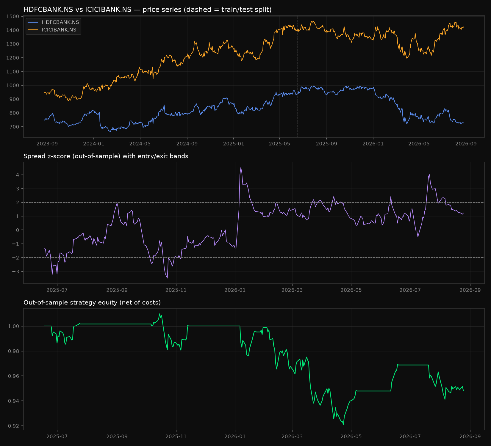

---

### AXISBANK.NS / ICICIBANK.NS

- **Latest prices:** AXISBANK.NS ₹1,235.00 · ICICIBANK.NS ₹1,422.70
- **Hedge ratio (train-fitted):** 0.9726
- **Cointegration (train):** FAIL at 5% — ADF -0.79, p=0.8212
- **Persistence:** passed 5% in 0 of 39 real-data runs (strict tier: 0/39)
- **Spread half-life:** 150.5 days
- **Current z-score:** +1.00
- **Signal today:** watch (approaching band)
- ⚠️ _Pair did not cointegrate on training data. Any signal here is not statistically justified — observation only._

**Out-of-sample backtest** (beta frozen from train window):

| Metric | Value |
|---|---|
| Sharpe | -0.47 |
| Sortino | -0.46 |
| Annualised return | -4.21% |
| Annualised vol | 8.46% |
| Max drawdown | -7.60% |
| Round-trip trades | 5 |

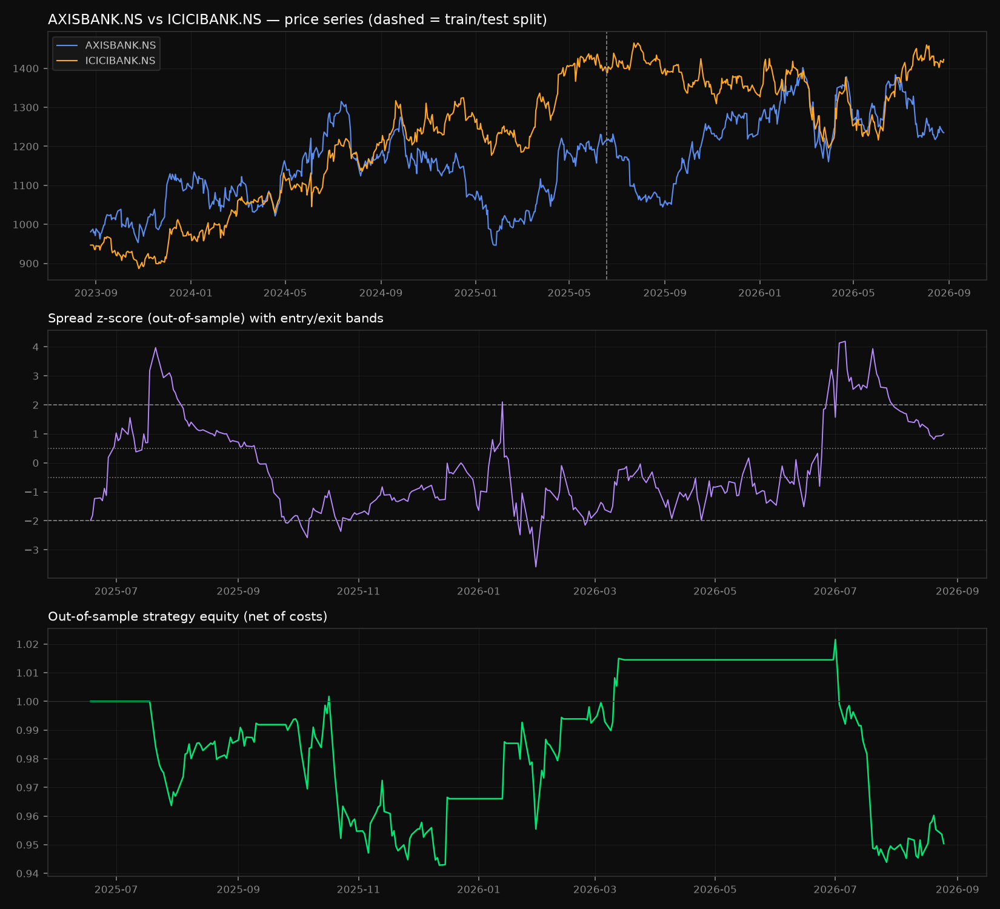

---

### KOTAKBANK.NS / HDFCBANK.NS

- **Latest prices:** KOTAKBANK.NS ₹401.60 · HDFCBANK.NS ₹727.50
- **Hedge ratio (train-fitted):** 2.0309
- **Cointegration (train):** FAIL at 5% — ADF -2.47, p=0.1236
- **Persistence:** passed 5% in 0 of 39 real-data runs (strict tier: 0/39)
- **Spread half-life:** 25.7 days
- **Current z-score:** -1.42
- **Signal today:** watch (approaching band)
- ⚠️ _Pair did not cointegrate on training data. Any signal here is not statistically justified — observation only._

**Out-of-sample backtest** (beta frozen from train window):

| Metric | Value |
|---|---|
| Sharpe | 0.90 |
| Sortino | 0.65 |
| Annualised return | 5.70% |
| Annualised vol | 6.38% |
| Max drawdown | -4.31% |
| Round-trip trades | 6 |

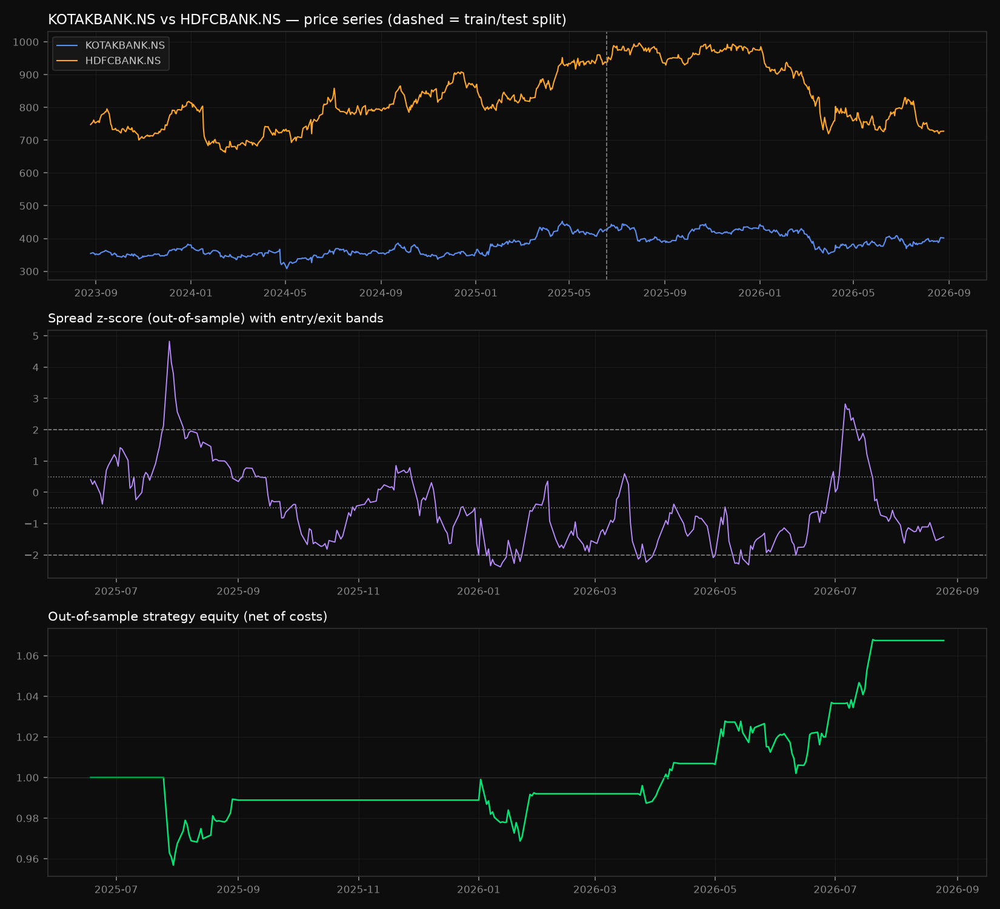

---

### SBIN.NS / BANKBARODA.NS

- **Latest prices:** SBIN.NS ₹1,048.00 · BANKBARODA.NS ₹241.00
- **Hedge ratio (train-fitted):** 0.1972
- **Cointegration (train):** FAIL at 5% — ADF -2.46, p=0.1266
- **Persistence:** passed 5% in 0 of 39 real-data runs (strict tier: 0/39)
- **Spread half-life:** 21.0 days
- **Current z-score:** -1.12
- **Signal today:** watch (approaching band)
- ⚠️ _Pair did not cointegrate on training data. Any signal here is not statistically justified — observation only._

**Out-of-sample backtest** (beta frozen from train window):

| Metric | Value |
|---|---|
| Sharpe | -0.04 |
| Sortino | -0.03 |
| Annualised return | -0.71% |
| Annualised vol | 8.82% |
| Max drawdown | -9.02% |
| Round-trip trades | 4 |

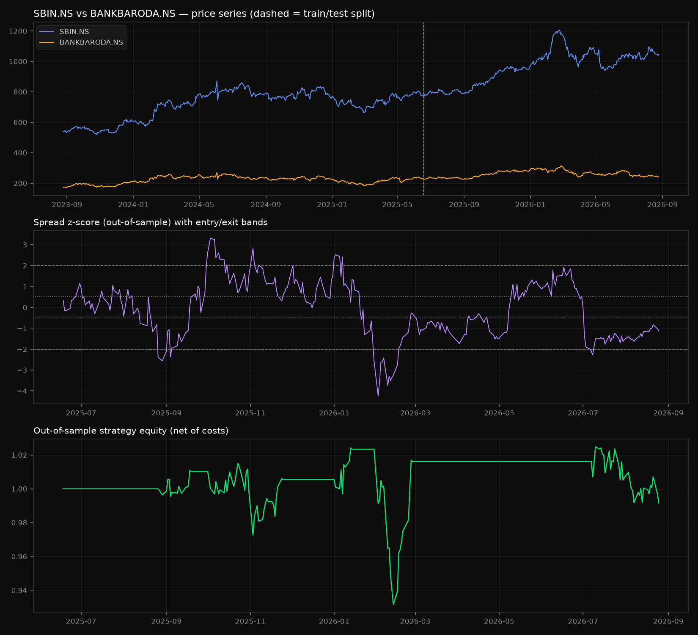

---

### TCS.NS / INFY.NS

- **Latest prices:** TCS.NS ₹2,296.20 · INFY.NS ₹1,144.00
- **Hedge ratio (train-fitted):** 0.5033
- **Cointegration (train):** FAIL at 5% — ADF -1.38, p=0.5901
- **Persistence:** passed 5% in 0 of 39 real-data runs (strict tier: 0/39)
- **Spread half-life:** 55.2 days
- **Current z-score:** -0.03
- **Signal today:** flat / no stretch
- ⚠️ _Pair did not cointegrate on training data. Any signal here is not statistically justified — observation only._

**Out-of-sample backtest** (beta frozen from train window):

| Metric | Value |
|---|---|
| Sharpe | 1.80 |
| Sortino | 1.85 |
| Annualised return | 8.15% |
| Annualised vol | 4.40% |
| Max drawdown | -3.79% |
| Round-trip trades | 8 |

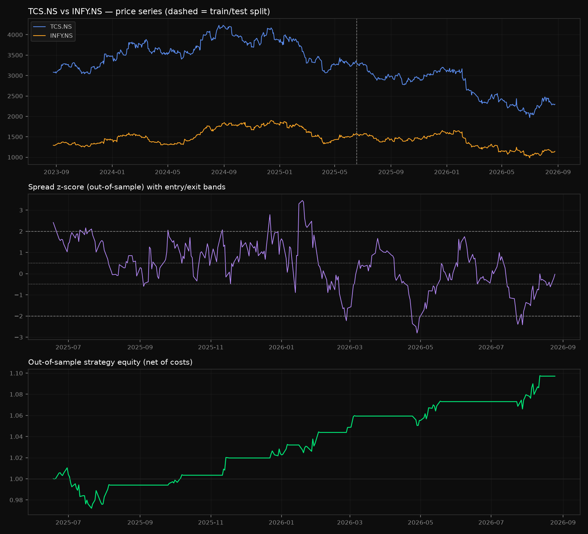

---

### INFY.NS / WIPRO.NS

- **Latest prices:** INFY.NS ₹1,144.00 · WIPRO.NS ₹180.09
- **Hedge ratio (train-fitted):** 0.1358
- **Cointegration (train):** FAIL at 5% — ADF -2.28, p=0.1769
- **Persistence:** passed 5% in 0 of 39 real-data runs (strict tier: 0/39)
- **Spread half-life:** 29.9 days
- **Current z-score:** -0.93
- **Signal today:** watch (approaching band)
- ⚠️ _Pair did not cointegrate on training data. Any signal here is not statistically justified — observation only._

**Out-of-sample backtest** (beta frozen from train window):

| Metric | Value |
|---|---|
| Sharpe | 1.67 |
| Sortino | 1.95 |
| Annualised return | 8.56% |
| Annualised vol | 4.98% |
| Max drawdown | -2.34% |
| Round-trip trades | 6 |

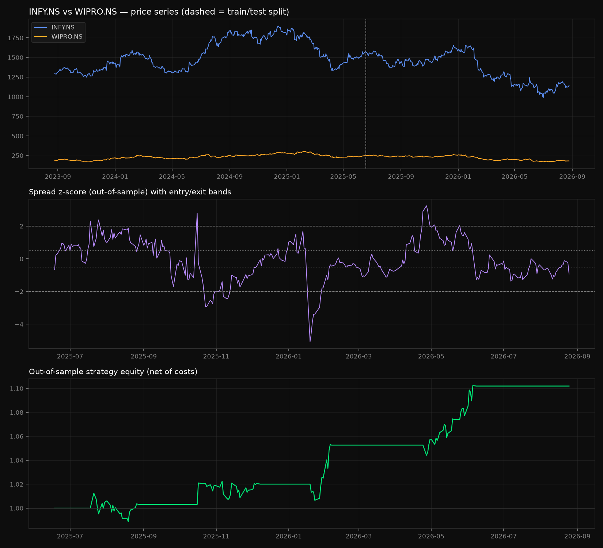

---

### HCLTECH.NS / TECHM.NS

- **Latest prices:** HCLTECH.NS ₹1,315.80 · TECHM.NS ₹1,599.90
- **Hedge ratio (train-fitted):** 0.8623
- **Cointegration (train):** FAIL at 5% — ADF -2.47, p=0.1242
- **Persistence:** passed 5% in 0 of 39 real-data runs (strict tier: 0/39)
- **Spread half-life:** 25.1 days
- **Current z-score:** +0.04
- **Signal today:** flat / no stretch
- ⚠️ _Pair did not cointegrate on training data. Any signal here is not statistically justified — observation only._

**Out-of-sample backtest** (beta frozen from train window):

| Metric | Value |
|---|---|
| Sharpe | 0.25 |
| Sortino | 0.26 |
| Annualised return | 1.51% |
| Annualised vol | 6.92% |
| Max drawdown | -7.68% |
| Round-trip trades | 6 |

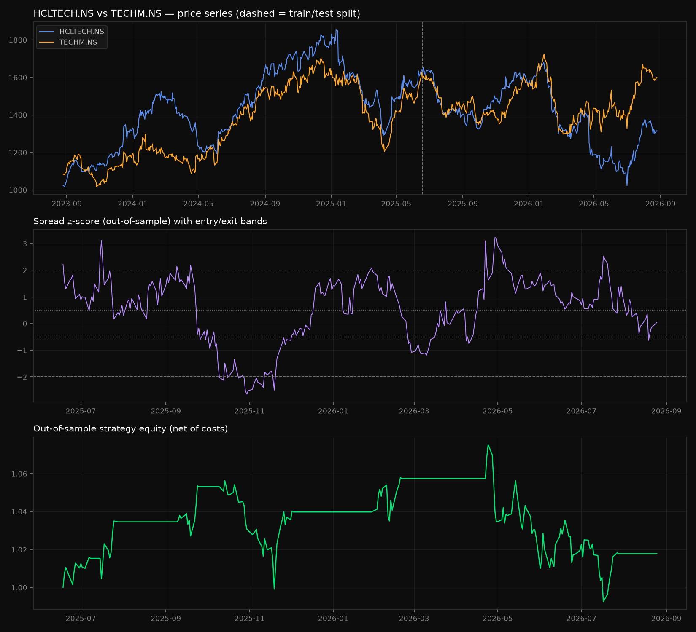

---

### ACC.NS / AMBUJACEM.NS

- **Latest prices:** ACC.NS ₹1,305.90 · AMBUJACEM.NS ₹413.10
- **Hedge ratio (train-fitted):** 0.2149
- **Cointegration (train):** FAIL at 5% — ADF -1.17, p=0.6851
- **Persistence:** passed 5% in 0 of 39 real-data runs (strict tier: 0/39)
- **Spread half-life:** 72.6 days
- **Current z-score:** -0.96
- **Signal today:** watch (approaching band)
- ⚠️ _Pair did not cointegrate on training data. Any signal here is not statistically justified — observation only._

**Out-of-sample backtest** (beta frozen from train window):

| Metric | Value |
|---|---|
| Sharpe | 0.53 |
| Sortino | 0.47 |
| Annualised return | 3.17% |
| Annualised vol | 6.31% |
| Max drawdown | -7.54% |
| Round-trip trades | 4 |

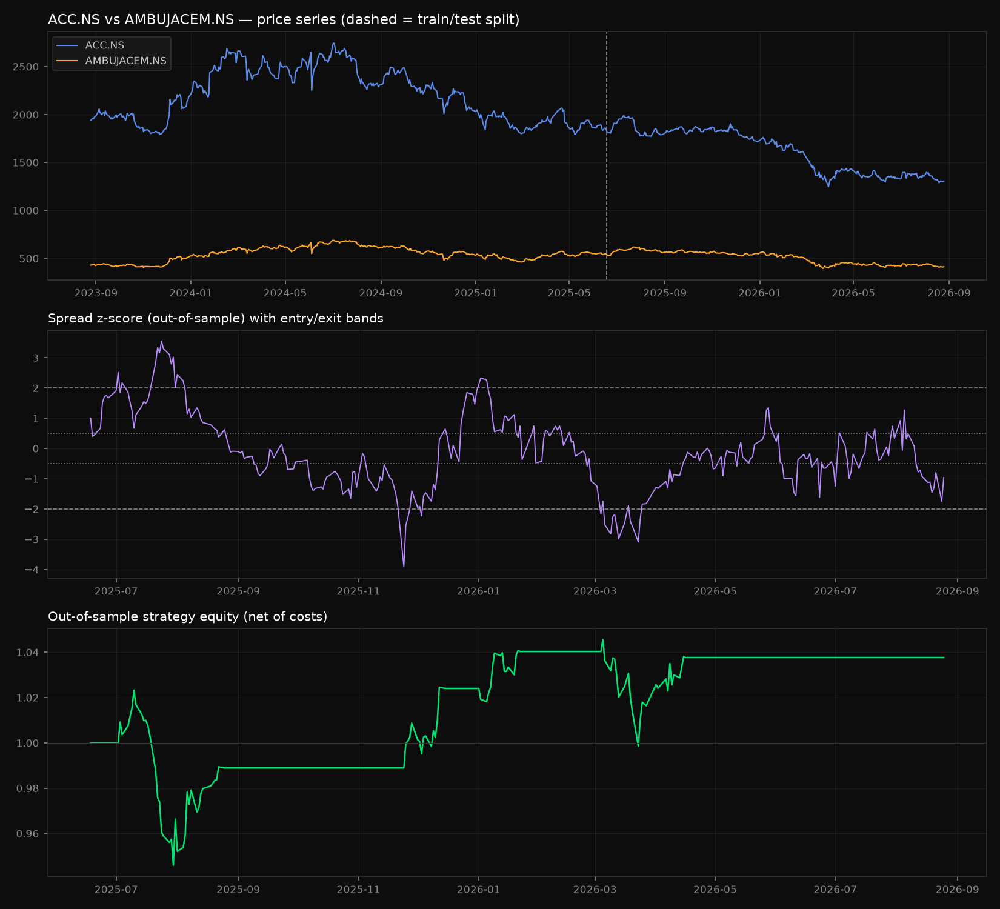

---

### ULTRACEMCO.NS / SHREECEM.NS

- **Latest prices:** ULTRACEMCO.NS ₹11,540.00 · SHREECEM.NS ₹24,440.00
- **Hedge ratio (train-fitted):** 0.6373
- **Cointegration (train):** FAIL at 5% — ADF -2.45, p=0.1272
- **Persistence:** passed 5% in 0 of 39 real-data runs (strict tier: 0/39)
- **Spread half-life:** 34.3 days
- **Current z-score:** -1.37
- **Signal today:** watch (approaching band)
- ⚠️ _Pair did not cointegrate on training data. Any signal here is not statistically justified — observation only._

**Out-of-sample backtest** (beta frozen from train window):

| Metric | Value |
|---|---|
| Sharpe | 0.48 |
| Sortino | 0.52 |
| Annualised return | 3.82% |
| Annualised vol | 8.48% |
| Max drawdown | -9.53% |
| Round-trip trades | 6 |

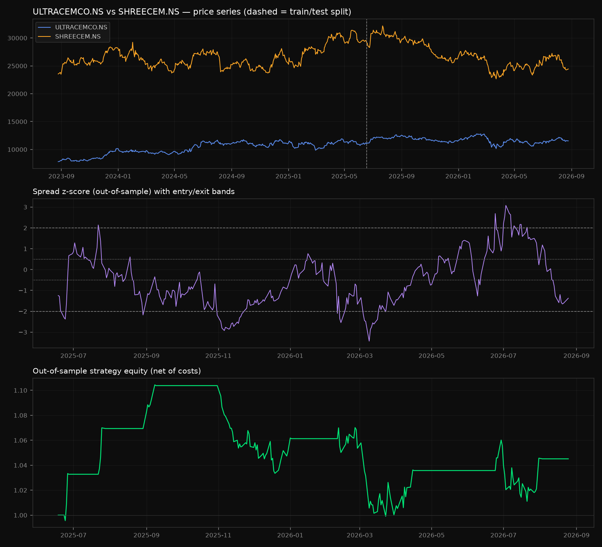

---

### IOC.NS / BPCL.NS

- **Latest prices:** IOC.NS ₹139.00 · BPCL.NS ₹318.10
- **Hedge ratio (train-fitted):** 1.7649
- **Cointegration (train):** FAIL at 5% — ADF -0.99, p=0.7582
- **Persistence:** passed 5% in 0 of 39 real-data runs (strict tier: 0/39)
- **Spread half-life:** 111.9 days
- **Current z-score:** +1.15
- **Signal today:** watch (approaching band)
- ⚠️ _Pair did not cointegrate on training data. Any signal here is not statistically justified — observation only._

**Out-of-sample backtest** (beta frozen from train window):

| Metric | Value |
|---|---|
| Sharpe | 0.48 |
| Sortino | 0.51 |
| Annualised return | 3.03% |
| Annualised vol | 6.69% |
| Max drawdown | -6.58% |
| Round-trip trades | 7 |

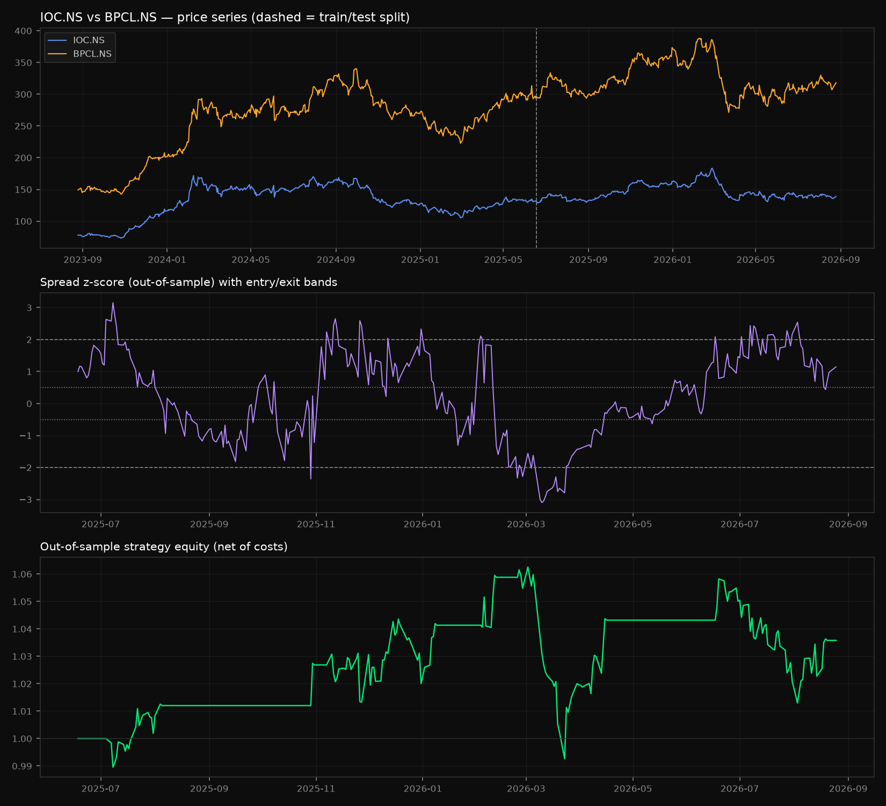

---

### BPCL.NS / HINDPETRO.NS

- **Latest prices:** BPCL.NS ₹318.10 · HINDPETRO.NS ₹373.20
- **Hedge ratio (train-fitted):** 1.3557
- **Cointegration (train):** FAIL at 5% — ADF -1.97, p=0.3010
- **Persistence:** passed 5% in 0 of 39 real-data runs (strict tier: 0/39)
- **Spread half-life:** 39.8 days
- **Current z-score:** -1.02
- **Signal today:** watch (approaching band)
- ⚠️ _Pair did not cointegrate on training data. Any signal here is not statistically justified — observation only._

**Out-of-sample backtest** (beta frozen from train window):

| Metric | Value |
|---|---|
| Sharpe | -0.19 |
| Sortino | -0.17 |
| Annualised return | -1.32% |
| Annualised vol | 6.07% |
| Max drawdown | -7.02% |
| Round-trip trades | 4 |

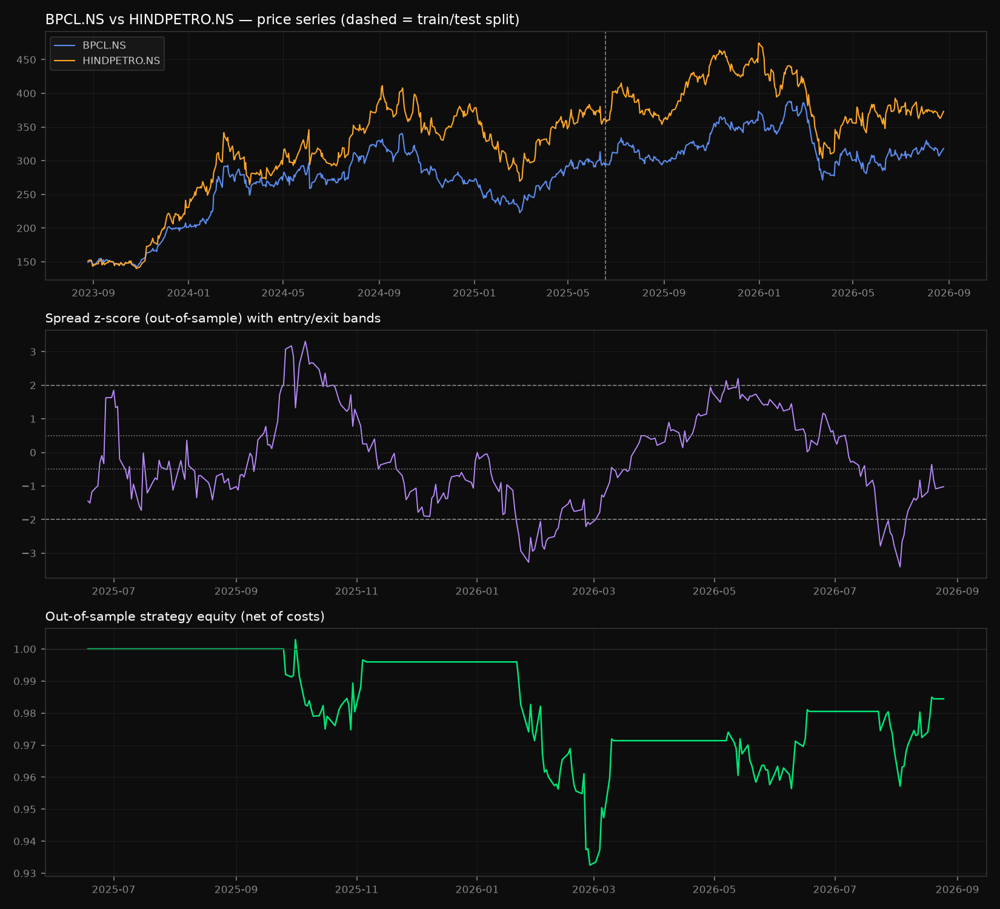

---

### ONGC.NS / COALINDIA.NS

- **Latest prices:** ONGC.NS ₹234.00 · COALINDIA.NS ₹404.00
- **Hedge ratio (train-fitted):** 1.5594
- **Cointegration (train):** PASS at 5% — ADF -3.58, p=0.0062
- **Persistence:** passed 5% in 31 of 39 real-data runs (strict tier: 0/39)
- **Spread half-life:** 12.6 days
- **Current z-score:** -0.55
- **Signal today:** watch (approaching band)

**Out-of-sample backtest** (beta frozen from train window):

| Metric | Value |
|---|---|
| Sharpe | 0.78 |
| Sortino | 0.58 |
| Annualised return | 5.44% |
| Annualised vol | 7.14% |
| Max drawdown | -5.79% |
| Round-trip trades | 5 |

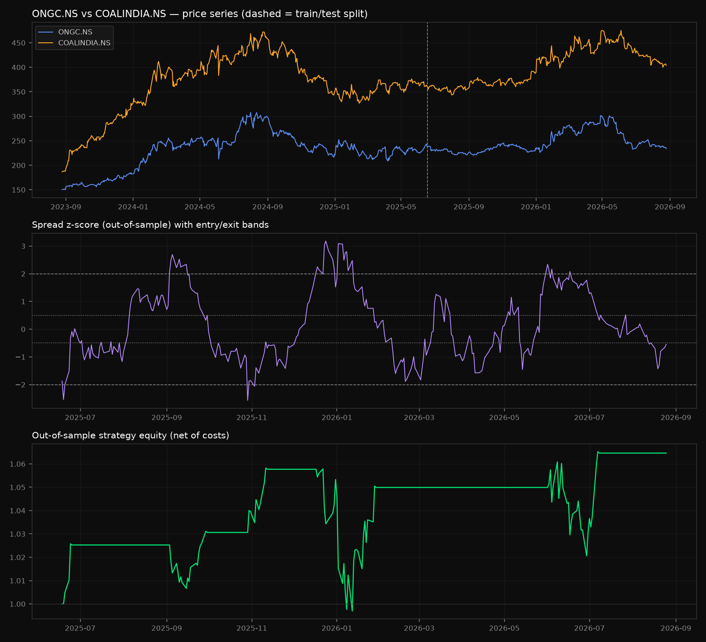

---

### NTPC.NS / POWERGRID.NS

- **Latest prices:** NTPC.NS ₹339.85 · POWERGRID.NS ₹271.00
- **Hedge ratio (train-fitted):** 0.8344
- **Cointegration (train):** FAIL at 5% — ADF -2.60, p=0.0930
- **Persistence:** passed 5% in 0 of 39 real-data runs (strict tier: 0/39)
- **Spread half-life:** 22.8 days
- **Current z-score:** -0.50
- **Signal today:** watch (approaching band)
- ⚠️ _Pair did not cointegrate on training data. Any signal here is not statistically justified — observation only._

**Out-of-sample backtest** (beta frozen from train window):

| Metric | Value |
|---|---|
| Sharpe | 0.38 |
| Sortino | 0.29 |
| Annualised return | 1.99% |
| Annualised vol | 5.62% |
| Max drawdown | -5.37% |
| Round-trip trades | 6 |

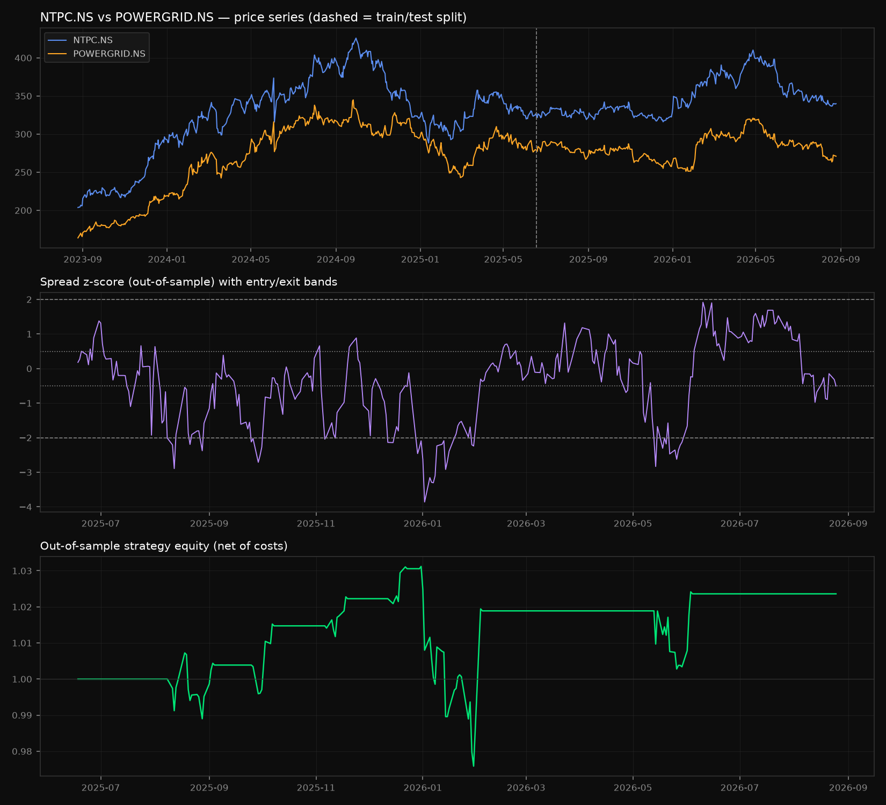

---

### BAJAJ-AUTO.NS / HEROMOTOCO.NS

- **Latest prices:** BAJAJ-AUTO.NS ₹11,927.00 · HEROMOTOCO.NS ₹5,624.50
- **Hedge ratio (train-fitted):** 0.4093
- **Cointegration (train):** FAIL at 5% — ADF -2.29, p=0.1759
- **Persistence:** passed 5% in 0 of 39 real-data runs (strict tier: 0/39)
- **Spread half-life:** 29.6 days
- **Current z-score:** +0.01
- **Signal today:** flat / no stretch
- ⚠️ _Pair did not cointegrate on training data. Any signal here is not statistically justified — observation only._

**Out-of-sample backtest** (beta frozen from train window):

| Metric | Value |
|---|---|
| Sharpe | -0.85 |
| Sortino | -0.88 |
| Annualised return | -9.14% |
| Annualised vol | 10.64% |
| Max drawdown | -20.87% |
| Round-trip trades | 4 |

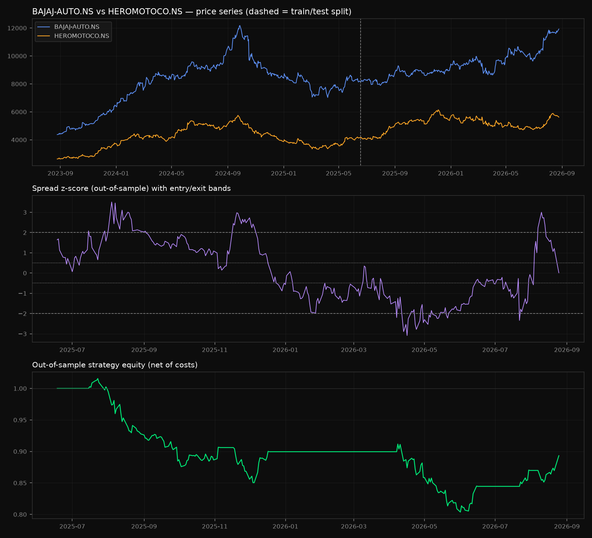

---

### TATASTEEL.NS / JSWSTEEL.NS

- **Latest prices:** TATASTEEL.NS ₹186.94 · JSWSTEEL.NS ₹1,320.30
- **Hedge ratio (train-fitted):** 3.0938
- **Cointegration (train):** FAIL at 5% — ADF -1.17, p=0.6874
- **Persistence:** passed 5% in 0 of 39 real-data runs (strict tier: 0/39)
- **Spread half-life:** 71.5 days
- **Current z-score:** +2.14
- **Signal today:** SHORT spread (short JSWSTEEL.NS, long TATASTEEL.NS)
- ⚠️ _Pair did not cointegrate on training data. Any signal here is not statistically justified — observation only._

**Out-of-sample backtest** (beta frozen from train window):

| Metric | Value |
|---|---|
| Sharpe | 0.08 |
| Sortino | 0.07 |
| Annualised return | 0.29% |
| Annualised vol | 8.31% |
| Max drawdown | -5.22% |
| Round-trip trades | 4 |

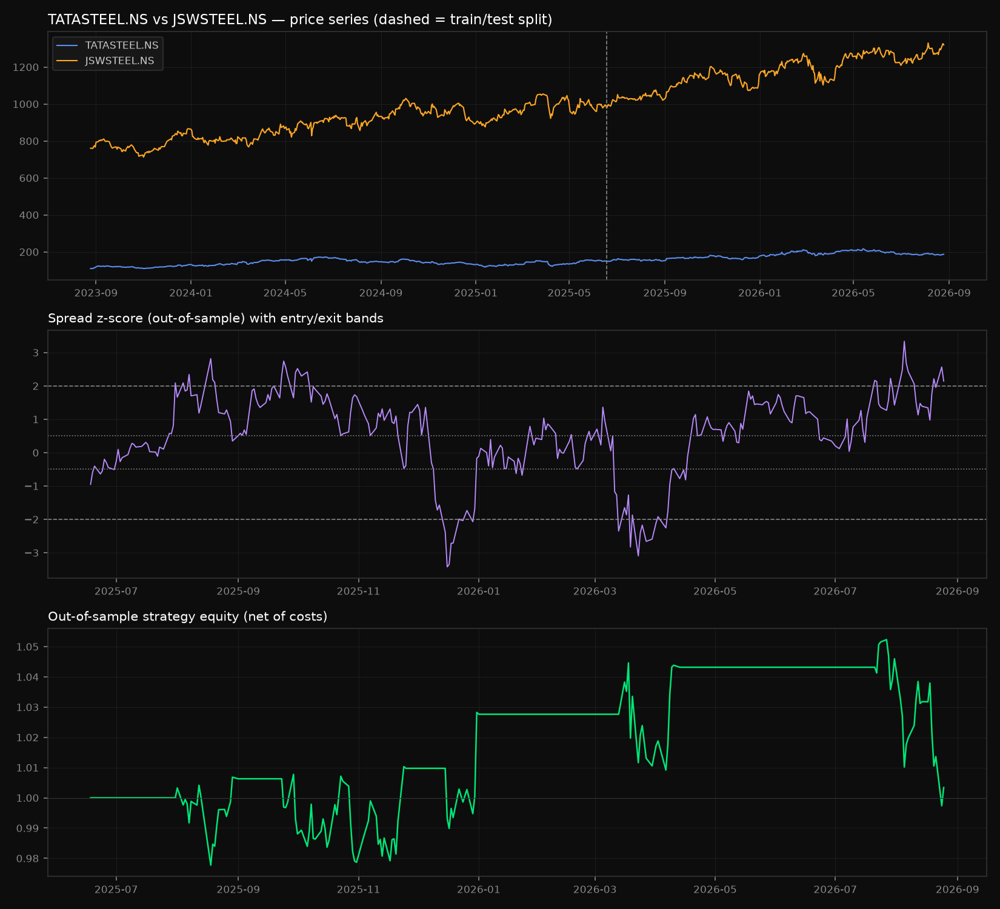

---

### SUNPHARMA.NS / CIPLA.NS

- **Latest prices:** SUNPHARMA.NS ₹1,922.00 · CIPLA.NS ₹1,422.00
- **Hedge ratio (train-fitted):** 0.4905
- **Cointegration (train):** PASS at 5% — ADF -3.37, p=0.0120
- **Persistence:** passed 5% in 39 of 39 real-data runs (strict tier: 5/39)
- **Spread half-life:** 10.8 days
- **Current z-score:** -0.79
- **Signal today:** watch (approaching band)

**Out-of-sample backtest** (beta frozen from train window):

| Metric | Value |
|---|---|
| Sharpe | -0.22 |
| Sortino | -0.22 |
| Annualised return | -1.92% |
| Annualised vol | 7.55% |
| Max drawdown | -10.39% |
| Round-trip trades | 4 |

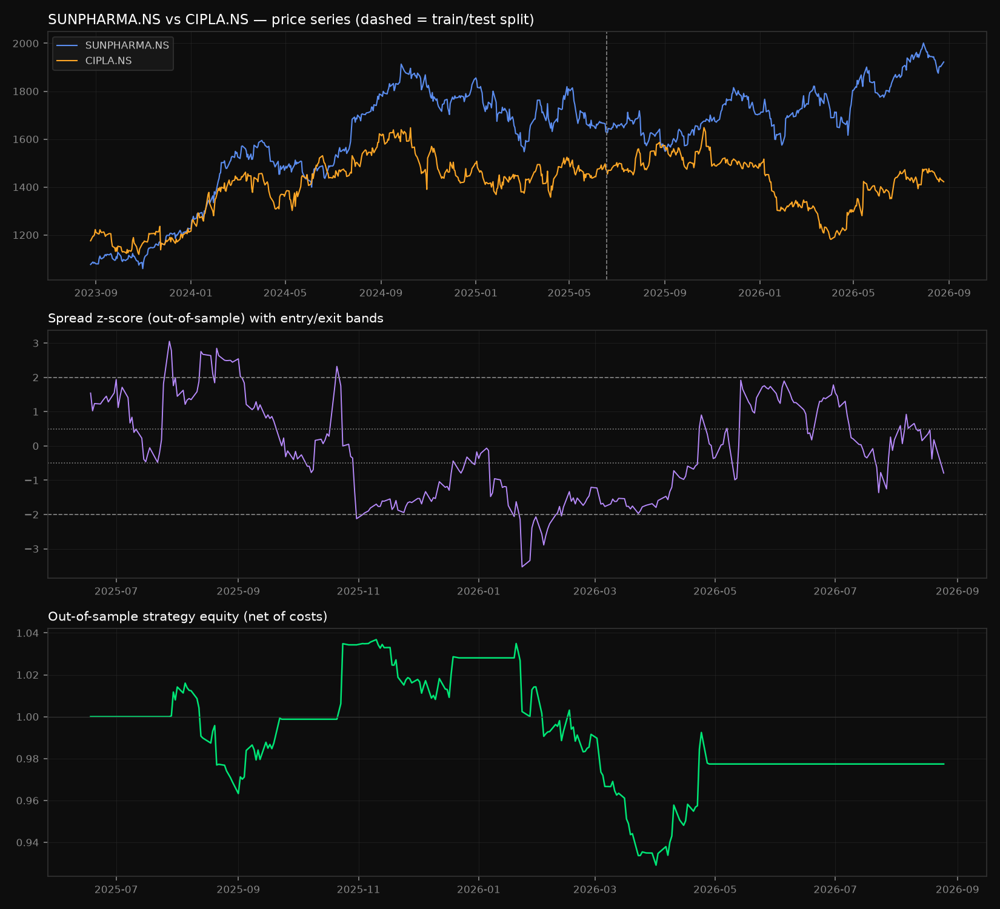

---

_Generated 2026-08-25 · pairs mean-reversion scanner · out-of-sample backtest · multiple-testing-aware · not investment advice._
