# Indian Pairs-Trading Scanner — 2026-08-27

> **What this is:** a market-neutral *pairs mean-reversion* scanner. It flags when two related NSE stocks have drifted apart far enough that their historical relationship signals a possible convergence trade. It does **not** forecast growth, rank "best" stocks, or predict company performance. A signal means the *spread between two stocks* is stretched — nothing about either stock being a good investment. Not investment advice; do your own research.

## Methodology (fixed in advance)

- **Universe:** 16 declared sector-mate pairs. Parameters (3y window, 60/40 train-test, z-entry 2.0, z-exit 0.5, 5 bps costs) are pre-registered; changes are logged in the README changelog *before* looking at results.
- **Multiple testing:** at the 5% level across 16 pairs, **≈0.8 false positives per run are expected by chance alone** even if nothing truly cointegrates. A single-day pass is a candidate, not a discovery.
- **Strict tier:** Bonferroni-corrected threshold p < 0.0031 (marked ✓✓).
- **Evidence = persistence:** the Persistence column counts how often each pair has passed the 5% test across all *real-data* daily runs recorded in `reports/history.csv`. Pairs deserve attention only when they pass persistently.

## Summary

| Pair | p-value | Coint. | Persistence | Current z | Signal | OOS Sharpe |
|---|---|---|---|---|---|---|
| HDFCBANK.NS/ICICIBANK.NS | 0.1084 | ✗ | 0/31 | +1.27 | watch | -0.72 |
| AXISBANK.NS/ICICIBANK.NS | 0.8033 | ✗ | 0/41 | +0.84 | watch | -0.42 |
| KOTAKBANK.NS/HDFCBANK.NS | 0.1261 | ✗ | 0/41 | -2.01 | LONG spread | 0.90 |
| SBIN.NS/BANKBARODA.NS | 0.1276 | ✗ | 0/41 | -1.04 | watch | -0.02 |
| TCS.NS/INFY.NS | 0.6383 | ✗ | 0/41 | -0.24 | flat / no stretch | 1.74 |
| INFY.NS/WIPRO.NS | 0.1751 | ✗ | 0/41 | -0.80 | watch | 1.67 |
| HCLTECH.NS/TECHM.NS | 0.1239 | ✗ | 0/41 | -0.54 | watch | 0.10 |
| ACC.NS/AMBUJACEM.NS | 0.6857 | ✗ | 0/41 | -0.81 | watch | 0.52 |
| ULTRACEMCO.NS/SHREECEM.NS | 0.1208 | ✗ | 0/41 | -0.97 | watch | 0.48 |
| IOC.NS/BPCL.NS | 0.8025 | ✗ | 0/41 | +0.98 | watch | 0.48 |
| BPCL.NS/HINDPETRO.NS | 0.2940 | ✗ | 0/41 | -0.75 | watch | -0.19 |
| ONGC.NS/COALINDIA.NS | 0.0051 | ✓ | 33/41 | -0.36 | flat / no stretch | 0.78 |
| NTPC.NS/POWERGRID.NS | 0.0969 | ✗ | 0/41 | -0.82 | watch | 0.38 |
| BAJAJ-AUTO.NS/HEROMOTOCO.NS | 0.1753 | ✗ | 0/41 | +0.28 | flat / no stretch | -0.86 |
| TATASTEEL.NS/JSWSTEEL.NS | 0.6696 | ✗ | 0/41 | +2.51 | SHORT spread | -0.23 |
| SUNPHARMA.NS/CIPLA.NS | 0.0116 | ✓ | 41/41 | -1.11 | watch | -0.22 |

_Legend: ✓✓ passes strict Bonferroni tier · ✓ passes 5% only · ✗ fails. Persistence = 5%-passes / real-data runs recorded. \*no real-data history yet._

---

### HDFCBANK.NS / ICICIBANK.NS

- **Latest prices:** HDFCBANK.NS ₹727.20 · ICICIBANK.NS ₹1,430.00
- **Hedge ratio (train-fitted):** 1.7555
- **Cointegration (train):** FAIL at 5% — ADF -2.53, p=0.1084
- **Persistence:** passed 5% in 0 of 31 real-data runs (strict tier: 0/31)
- **Spread half-life:** 27.4 days
- **Current z-score:** +1.27
- **Signal today:** watch (approaching band)
- ⚠️ _Pair did not cointegrate on training data. Any signal here is not statistically justified — observation only._

**Out-of-sample backtest** (beta frozen from train window):

| Metric | Value |
|---|---|
| Sharpe | -0.72 |
| Sortino | -0.76 |
| Annualised return | -4.59% |
| Annualised vol | 6.23% |
| Max drawdown | -8.79% |
| Round-trip trades | 4 |

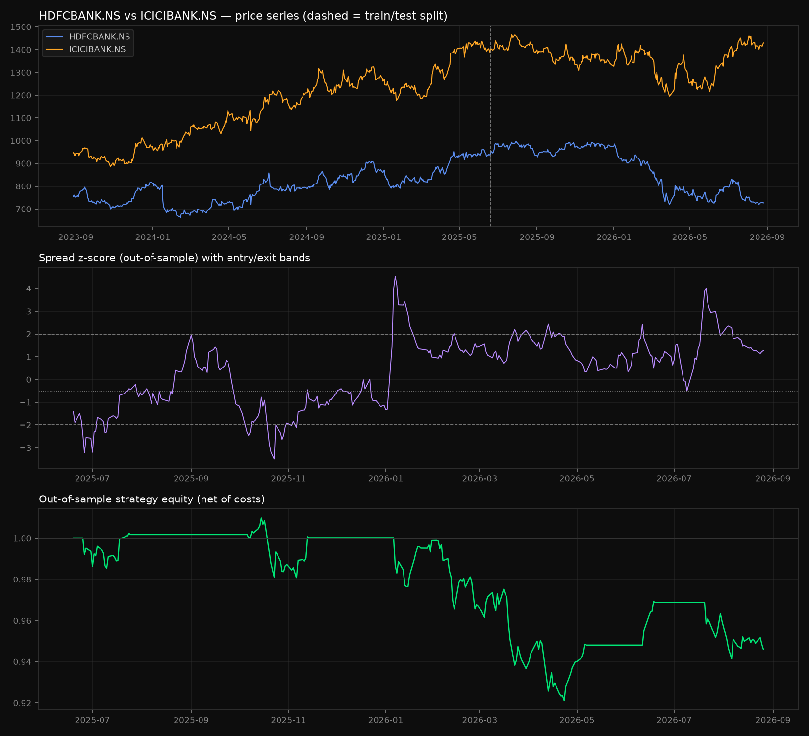

---

### AXISBANK.NS / ICICIBANK.NS

- **Latest prices:** AXISBANK.NS ₹1,255.00 · ICICIBANK.NS ₹1,430.00
- **Hedge ratio (train-fitted):** 0.9743
- **Cointegration (train):** FAIL at 5% — ADF -0.85, p=0.8033
- **Persistence:** passed 5% in 0 of 41 real-data runs (strict tier: 0/41)
- **Spread half-life:** 137.7 days
- **Current z-score:** +0.84
- **Signal today:** watch (approaching band)
- ⚠️ _Pair did not cointegrate on training data. Any signal here is not statistically justified — observation only._

**Out-of-sample backtest** (beta frozen from train window):

| Metric | Value |
|---|---|
| Sharpe | -0.42 |
| Sortino | -0.41 |
| Annualised return | -3.83% |
| Annualised vol | 8.49% |
| Max drawdown | -7.62% |
| Round-trip trades | 5 |

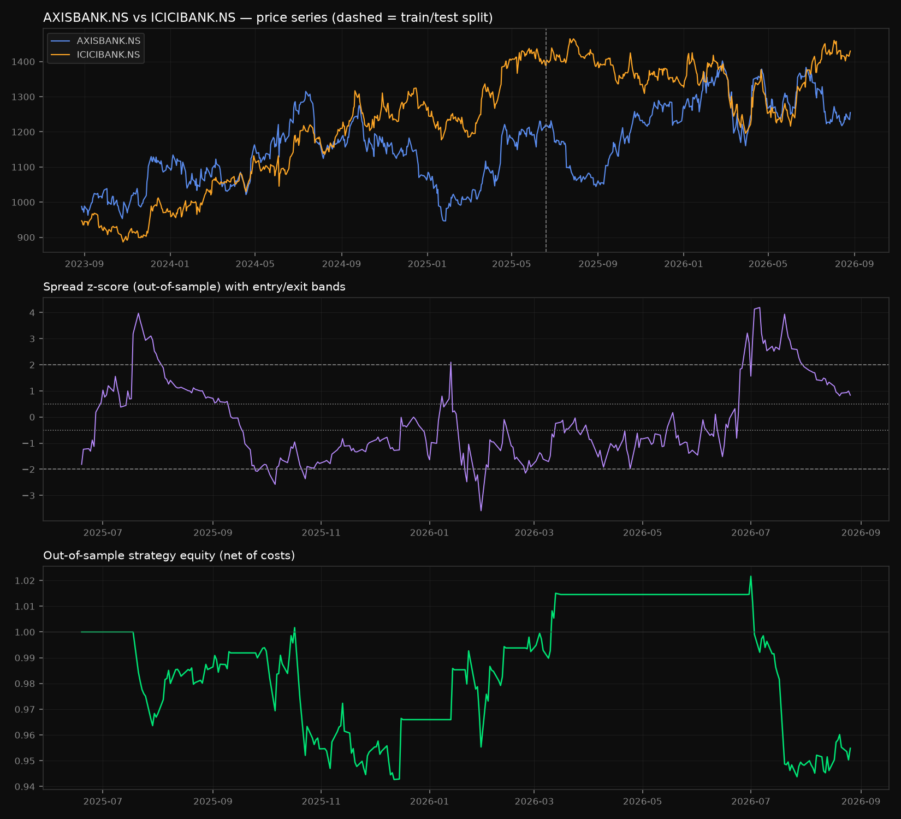

---

### KOTAKBANK.NS / HDFCBANK.NS

- **Latest prices:** KOTAKBANK.NS ₹416.70 · HDFCBANK.NS ₹727.20
- **Hedge ratio (train-fitted):** 2.0339
- **Cointegration (train):** FAIL at 5% — ADF -2.46, p=0.1261
- **Persistence:** passed 5% in 0 of 41 real-data runs (strict tier: 0/41)
- **Spread half-life:** 25.7 days
- **Current z-score:** -2.01
- **Signal today:** LONG spread (long HDFCBANK.NS, short KOTAKBANK.NS)
- ⚠️ _Pair did not cointegrate on training data. Any signal here is not statistically justified — observation only._

**Out-of-sample backtest** (beta frozen from train window):

| Metric | Value |
|---|---|
| Sharpe | 0.90 |
| Sortino | 0.64 |
| Annualised return | 5.65% |
| Annualised vol | 6.34% |
| Max drawdown | -4.30% |
| Round-trip trades | 6 |

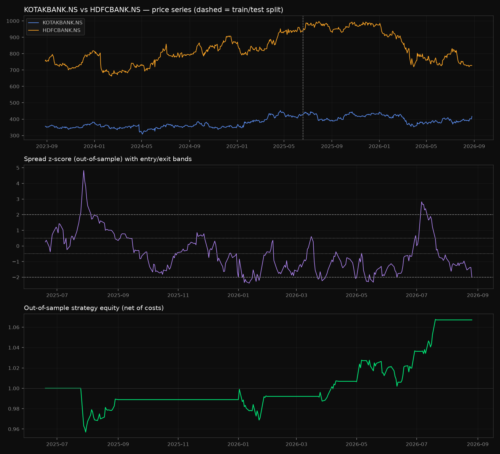

---

### SBIN.NS / BANKBARODA.NS

- **Latest prices:** SBIN.NS ₹1,052.00 · BANKBARODA.NS ₹242.50
- **Hedge ratio (train-fitted):** 0.1965
- **Cointegration (train):** FAIL at 5% — ADF -2.45, p=0.1276
- **Persistence:** passed 5% in 0 of 41 real-data runs (strict tier: 0/41)
- **Spread half-life:** 20.9 days
- **Current z-score:** -1.04
- **Signal today:** watch (approaching band)
- ⚠️ _Pair did not cointegrate on training data. Any signal here is not statistically justified — observation only._

**Out-of-sample backtest** (beta frozen from train window):

| Metric | Value |
|---|---|
| Sharpe | -0.02 |
| Sortino | -0.01 |
| Annualised return | -0.56% |
| Annualised vol | 8.97% |
| Max drawdown | -9.15% |
| Round-trip trades | 4 |

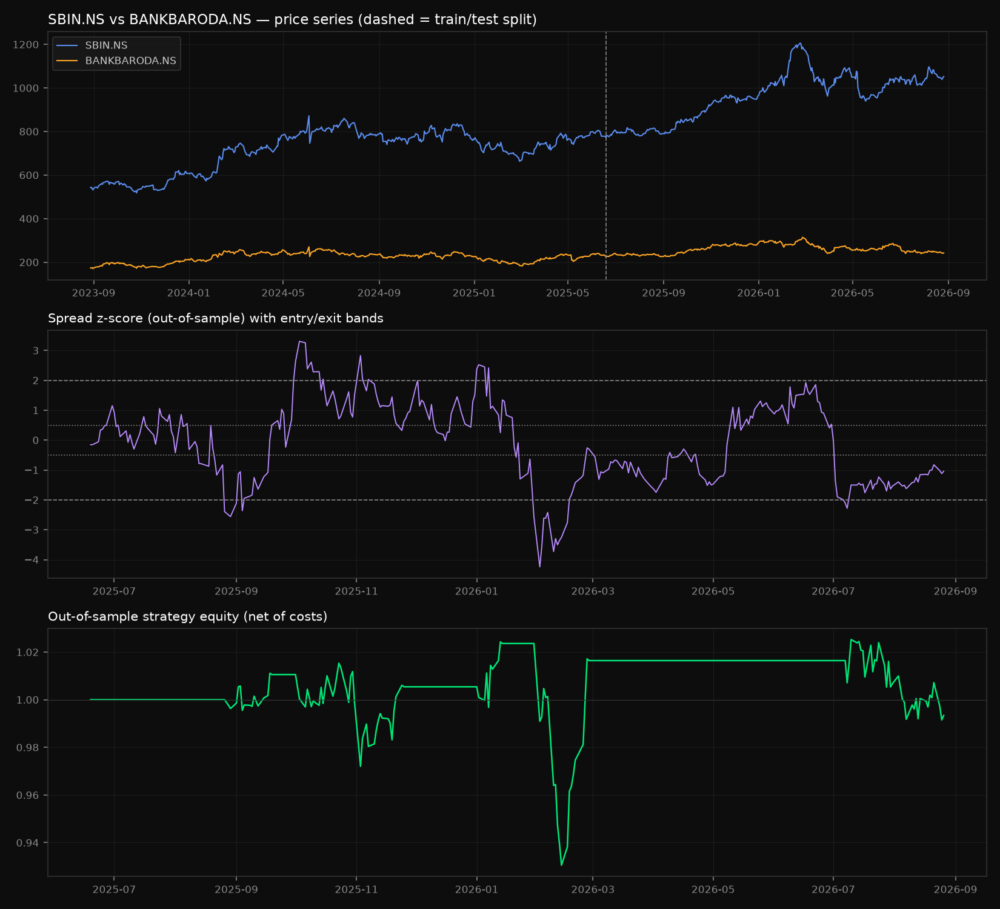

---

### TCS.NS / INFY.NS

- **Latest prices:** TCS.NS ₹2,270.00 · INFY.NS ₹1,120.00
- **Hedge ratio (train-fitted):** 0.5022
- **Cointegration (train):** FAIL at 5% — ADF -1.28, p=0.6383
- **Persistence:** passed 5% in 0 of 41 real-data runs (strict tier: 0/41)
- **Spread half-life:** 59.1 days
- **Current z-score:** -0.24
- **Signal today:** flat / no stretch
- ⚠️ _Pair did not cointegrate on training data. Any signal here is not statistically justified — observation only._

**Out-of-sample backtest** (beta frozen from train window):

| Metric | Value |
|---|---|
| Sharpe | 1.74 |
| Sortino | 1.80 |
| Annualised return | 7.94% |
| Annualised vol | 4.45% |
| Max drawdown | -3.81% |
| Round-trip trades | 8 |

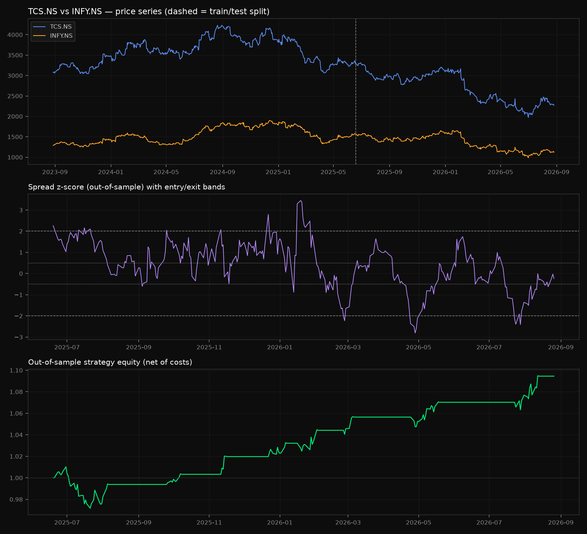

---

### INFY.NS / WIPRO.NS

- **Latest prices:** INFY.NS ₹1,120.00 · WIPRO.NS ₹177.35
- **Hedge ratio (train-fitted):** 0.1357
- **Cointegration (train):** FAIL at 5% — ADF -2.29, p=0.1751
- **Persistence:** passed 5% in 0 of 41 real-data runs (strict tier: 0/41)
- **Spread half-life:** 29.8 days
- **Current z-score:** -0.80
- **Signal today:** watch (approaching band)
- ⚠️ _Pair did not cointegrate on training data. Any signal here is not statistically justified — observation only._

**Out-of-sample backtest** (beta frozen from train window):

| Metric | Value |
|---|---|
| Sharpe | 1.67 |
| Sortino | 1.95 |
| Annualised return | 8.52% |
| Annualised vol | 4.96% |
| Max drawdown | -2.33% |
| Round-trip trades | 6 |

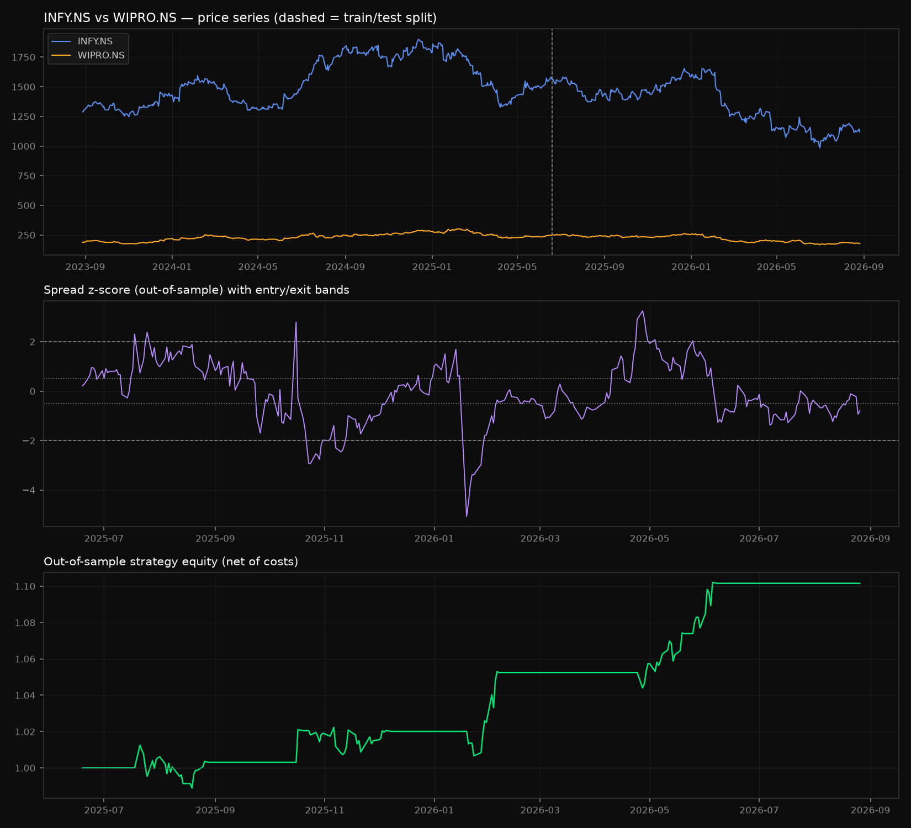

---

### HCLTECH.NS / TECHM.NS

- **Latest prices:** HCLTECH.NS ₹1,298.50 · TECHM.NS ₹1,571.00
- **Hedge ratio (train-fitted):** 0.8658
- **Cointegration (train):** FAIL at 5% — ADF -2.47, p=0.1239
- **Persistence:** passed 5% in 0 of 41 real-data runs (strict tier: 0/41)
- **Spread half-life:** 25.1 days
- **Current z-score:** -0.54
- **Signal today:** watch (approaching band)
- ⚠️ _Pair did not cointegrate on training data. Any signal here is not statistically justified — observation only._

**Out-of-sample backtest** (beta frozen from train window):

| Metric | Value |
|---|---|
| Sharpe | 0.10 |
| Sortino | 0.10 |
| Annualised return | 0.44% |
| Annualised vol | 6.83% |
| Max drawdown | -7.73% |
| Round-trip trades | 5 |

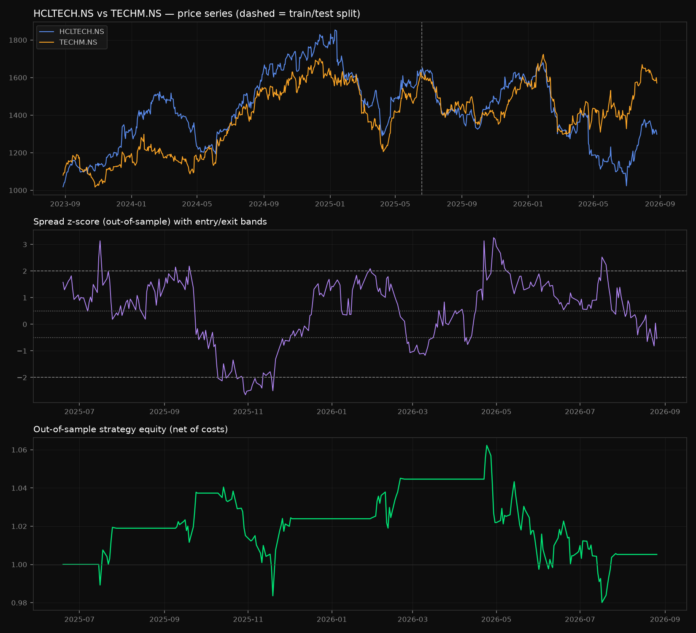

---

### ACC.NS / AMBUJACEM.NS

- **Latest prices:** ACC.NS ₹1,331.70 · AMBUJACEM.NS ₹419.20
- **Hedge ratio (train-fitted):** 0.2136
- **Cointegration (train):** FAIL at 5% — ADF -1.17, p=0.6857
- **Persistence:** passed 5% in 0 of 41 real-data runs (strict tier: 0/41)
- **Spread half-life:** 70.2 days
- **Current z-score:** -0.81
- **Signal today:** watch (approaching band)
- ⚠️ _Pair did not cointegrate on training data. Any signal here is not statistically justified — observation only._

**Out-of-sample backtest** (beta frozen from train window):

| Metric | Value |
|---|---|
| Sharpe | 0.52 |
| Sortino | 0.47 |
| Annualised return | 3.22% |
| Annualised vol | 6.44% |
| Max drawdown | -7.66% |
| Round-trip trades | 4 |

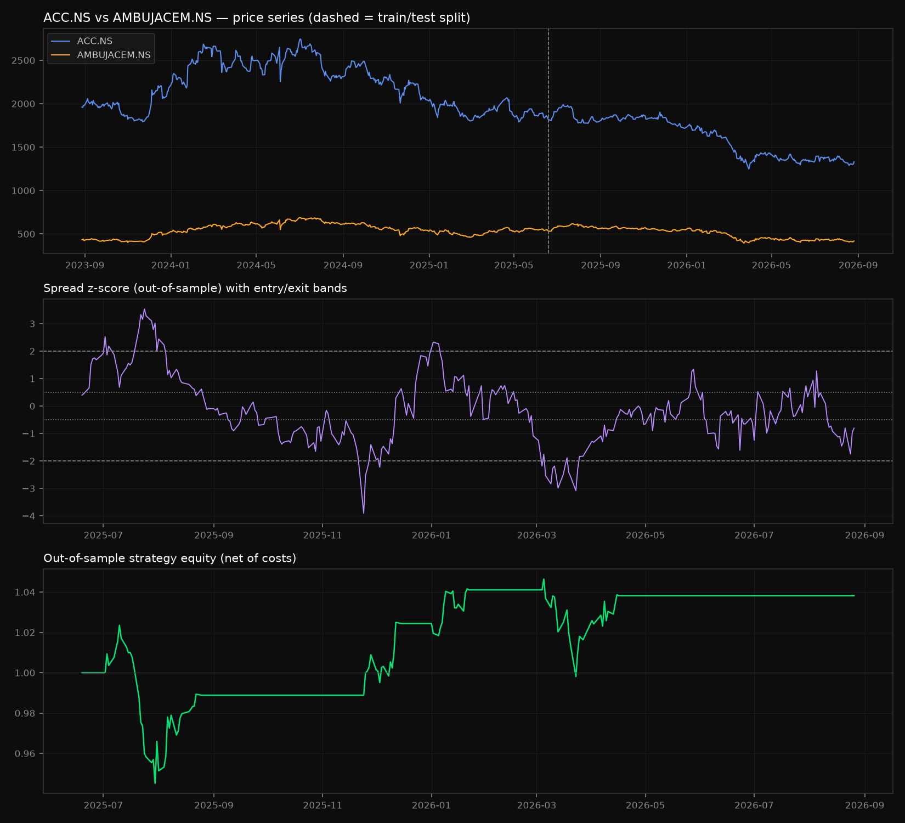

---

### ULTRACEMCO.NS / SHREECEM.NS

- **Latest prices:** ULTRACEMCO.NS ₹11,717.00 · SHREECEM.NS ₹24,865.00
- **Hedge ratio (train-fitted):** 0.6341
- **Cointegration (train):** FAIL at 5% — ADF -2.48, p=0.1208
- **Persistence:** passed 5% in 0 of 41 real-data runs (strict tier: 0/41)
- **Spread half-life:** 33.5 days
- **Current z-score:** -0.97
- **Signal today:** watch (approaching band)
- ⚠️ _Pair did not cointegrate on training data. Any signal here is not statistically justified — observation only._

**Out-of-sample backtest** (beta frozen from train window):

| Metric | Value |
|---|---|
| Sharpe | 0.48 |
| Sortino | 0.52 |
| Annualised return | 3.79% |
| Annualised vol | 8.48% |
| Max drawdown | -9.56% |
| Round-trip trades | 6 |

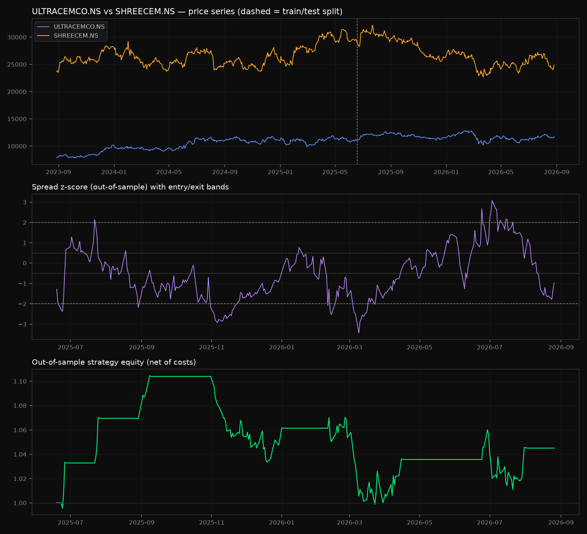

---

### IOC.NS / BPCL.NS

- **Latest prices:** IOC.NS ₹139.48 · BPCL.NS ₹318.00
- **Hedge ratio (train-fitted):** 1.7627
- **Cointegration (train):** FAIL at 5% — ADF -0.85, p=0.8025
- **Persistence:** passed 5% in 0 of 41 real-data runs (strict tier: 0/41)
- **Spread half-life:** 129.2 days
- **Current z-score:** +0.98
- **Signal today:** watch (approaching band)
- ⚠️ _Pair did not cointegrate on training data. Any signal here is not statistically justified — observation only._

**Out-of-sample backtest** (beta frozen from train window):

| Metric | Value |
|---|---|
| Sharpe | 0.48 |
| Sortino | 0.51 |
| Annualised return | 3.04% |
| Annualised vol | 6.76% |
| Max drawdown | -6.67% |
| Round-trip trades | 7 |

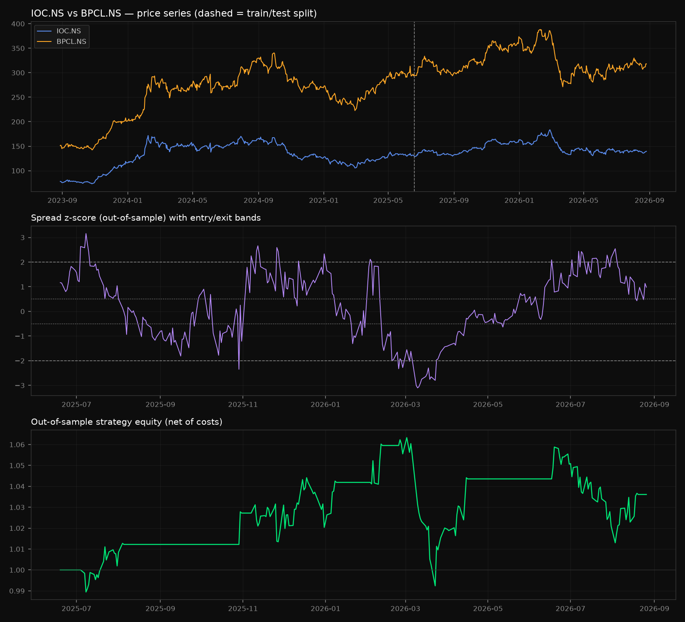

---

### BPCL.NS / HINDPETRO.NS

- **Latest prices:** BPCL.NS ₹318.00 · HINDPETRO.NS ₹375.50
- **Hedge ratio (train-fitted):** 1.3553
- **Cointegration (train):** FAIL at 5% — ADF -1.98, p=0.2940
- **Persistence:** passed 5% in 0 of 41 real-data runs (strict tier: 0/41)
- **Spread half-life:** 39.5 days
- **Current z-score:** -0.75
- **Signal today:** watch (approaching band)
- ⚠️ _Pair did not cointegrate on training data. Any signal here is not statistically justified — observation only._

**Out-of-sample backtest** (beta frozen from train window):

| Metric | Value |
|---|---|
| Sharpe | -0.19 |
| Sortino | -0.17 |
| Annualised return | -1.33% |
| Annualised vol | 6.11% |
| Max drawdown | -7.08% |
| Round-trip trades | 4 |

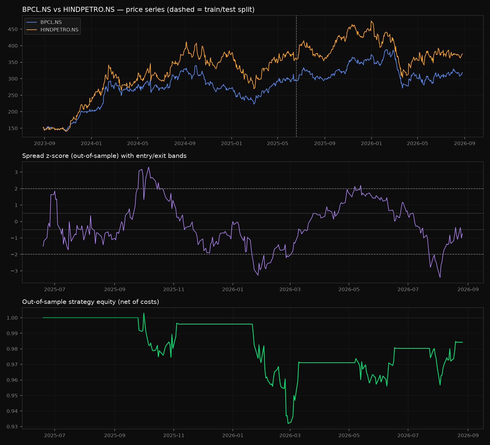

---

### ONGC.NS / COALINDIA.NS

- **Latest prices:** ONGC.NS ₹232.21 · COALINDIA.NS ₹403.50
- **Hedge ratio (train-fitted):** 1.5524
- **Cointegration (train):** PASS at 5% — ADF -3.64, p=0.0051
- **Persistence:** passed 5% in 33 of 41 real-data runs (strict tier: 0/41)
- **Spread half-life:** 12.4 days
- **Current z-score:** -0.36
- **Signal today:** flat / no stretch

**Out-of-sample backtest** (beta frozen from train window):

| Metric | Value |
|---|---|
| Sharpe | 0.78 |
| Sortino | 0.58 |
| Annualised return | 5.45% |
| Annualised vol | 7.18% |
| Max drawdown | -5.84% |
| Round-trip trades | 5 |

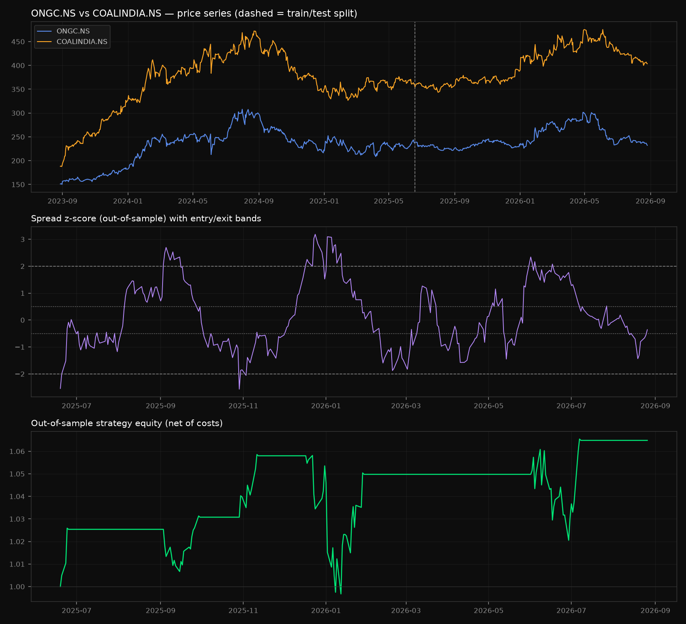

---

### NTPC.NS / POWERGRID.NS

- **Latest prices:** NTPC.NS ₹334.60 · POWERGRID.NS ₹265.20
- **Hedge ratio (train-fitted):** 0.8340
- **Cointegration (train):** FAIL at 5% — ADF -2.58, p=0.0969
- **Persistence:** passed 5% in 0 of 41 real-data runs (strict tier: 0/41)
- **Spread half-life:** 23.0 days
- **Current z-score:** -0.82
- **Signal today:** watch (approaching band)
- ⚠️ _Pair did not cointegrate on training data. Any signal here is not statistically justified — observation only._

**Out-of-sample backtest** (beta frozen from train window):

| Metric | Value |
|---|---|
| Sharpe | 0.38 |
| Sortino | 0.29 |
| Annualised return | 2.00% |
| Annualised vol | 5.65% |
| Max drawdown | -5.39% |
| Round-trip trades | 6 |

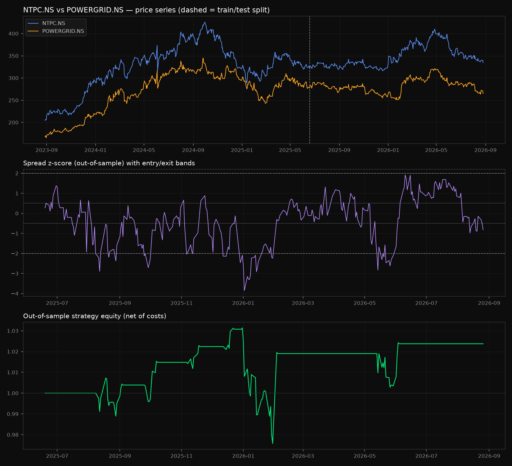

---

### BAJAJ-AUTO.NS / HEROMOTOCO.NS

- **Latest prices:** BAJAJ-AUTO.NS ₹11,724.00 · HEROMOTOCO.NS ₹5,595.00
- **Hedge ratio (train-fitted):** 0.4094
- **Cointegration (train):** FAIL at 5% — ADF -2.29, p=0.1753
- **Persistence:** passed 5% in 0 of 41 real-data runs (strict tier: 0/41)
- **Spread half-life:** 29.6 days
- **Current z-score:** +0.28
- **Signal today:** flat / no stretch
- ⚠️ _Pair did not cointegrate on training data. Any signal here is not statistically justified — observation only._

**Out-of-sample backtest** (beta frozen from train window):

| Metric | Value |
|---|---|
| Sharpe | -0.86 |
| Sortino | -0.88 |
| Annualised return | -9.10% |
| Annualised vol | 10.43% |
| Max drawdown | -20.77% |
| Round-trip trades | 5 |

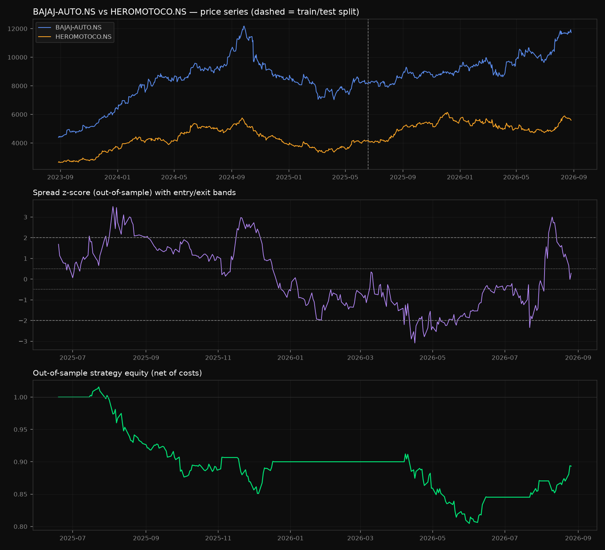

---

### TATASTEEL.NS / JSWSTEEL.NS

- **Latest prices:** TATASTEEL.NS ₹188.01 · JSWSTEEL.NS ₹1,341.00
- **Hedge ratio (train-fitted):** 3.0872
- **Cointegration (train):** FAIL at 5% — ADF -1.21, p=0.6696
- **Persistence:** passed 5% in 0 of 41 real-data runs (strict tier: 0/41)
- **Spread half-life:** 68.7 days
- **Current z-score:** +2.51
- **Signal today:** SHORT spread (short JSWSTEEL.NS, long TATASTEEL.NS)
- ⚠️ _Pair did not cointegrate on training data. Any signal here is not statistically justified — observation only._

**Out-of-sample backtest** (beta frozen from train window):

| Metric | Value |
|---|---|
| Sharpe | -0.23 |
| Sortino | -0.21 |
| Annualised return | -2.21% |
| Annualised vol | 8.19% |
| Max drawdown | -5.78% |
| Round-trip trades | 4 |

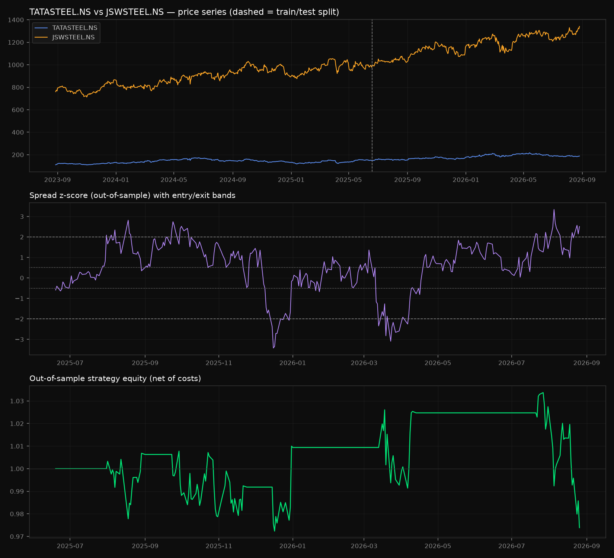

---

### SUNPHARMA.NS / CIPLA.NS

- **Latest prices:** SUNPHARMA.NS ₹1,899.50 · CIPLA.NS ₹1,402.70
- **Hedge ratio (train-fitted):** 0.4906
- **Cointegration (train):** PASS at 5% — ADF -3.38, p=0.0116
- **Persistence:** passed 5% in 41 of 41 real-data runs (strict tier: 5/41)
- **Spread half-life:** 10.8 days
- **Current z-score:** -1.11
- **Signal today:** watch (approaching band)

**Out-of-sample backtest** (beta frozen from train window):

| Metric | Value |
|---|---|
| Sharpe | -0.22 |
| Sortino | -0.22 |
| Annualised return | -1.93% |
| Annualised vol | 7.59% |
| Max drawdown | -10.45% |
| Round-trip trades | 4 |

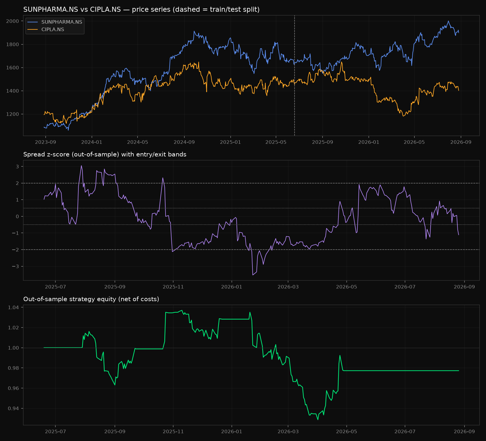

---

_Generated 2026-08-27 · pairs mean-reversion scanner · out-of-sample backtest · multiple-testing-aware · not investment advice._
