# Indian Pairs-Trading Scanner — 2026-08-28

> **What this is:** a market-neutral *pairs mean-reversion* scanner. It flags when two related NSE stocks have drifted apart far enough that their historical relationship signals a possible convergence trade. It does **not** forecast growth, rank "best" stocks, or predict company performance. A signal means the *spread between two stocks* is stretched — nothing about either stock being a good investment. Not investment advice; do your own research.

## Methodology (fixed in advance)

- **Universe:** 16 declared sector-mate pairs. Parameters (3y window, 60/40 train-test, z-entry 2.0, z-exit 0.5, 5 bps costs) are pre-registered; changes are logged in the README changelog *before* looking at results.
- **Multiple testing:** at the 5% level across 16 pairs, **≈0.8 false positives per run are expected by chance alone** even if nothing truly cointegrates. A single-day pass is a candidate, not a discovery.
- **Strict tier:** Bonferroni-corrected threshold p < 0.0031 (marked ✓✓).
- **Evidence = persistence:** the Persistence column counts how often each pair has passed the 5% test across all *real-data* daily runs recorded in `reports/history.csv`. Pairs deserve attention only when they pass persistently.

## Summary

| Pair | p-value | Coint. | Persistence | Current z | Signal | OOS Sharpe |
|---|---|---|---|---|---|---|
| HDFCBANK.NS/ICICIBANK.NS | 0.1079 | ✗ | 0/32 | +1.69 | watch | -0.89 |
| AXISBANK.NS/ICICIBANK.NS | 0.8021 | ✗ | 0/42 | +0.93 | watch | -0.46 |
| KOTAKBANK.NS/HDFCBANK.NS | 0.1228 | ✗ | 0/42 | -2.53 | LONG spread | 0.64 |
| SBIN.NS/BANKBARODA.NS | 0.1312 | ✗ | 0/42 | -0.99 | watch | -0.01 |
| TCS.NS/INFY.NS | 0.6435 | ✗ | 0/42 | -0.17 | flat / no stretch | 1.74 |
| INFY.NS/WIPRO.NS | 0.1912 | ✗ | 0/42 | -0.73 | watch | 1.67 |
| HCLTECH.NS/TECHM.NS | 0.1033 | ✗ | 0/42 | +0.59 | watch | 0.10 |
| ACC.NS/AMBUJACEM.NS | 0.6272 | ✗ | 0/42 | -1.60 | watch | 0.52 |
| ULTRACEMCO.NS/SHREECEM.NS | 0.1203 | ✗ | 0/42 | -1.36 | watch | 0.48 |
| IOC.NS/BPCL.NS | 0.8135 | ✗ | 0/42 | +1.39 | watch | 0.48 |
| BPCL.NS/HINDPETRO.NS | 0.2925 | ✗ | 0/42 | -1.15 | watch | -0.19 |
| ONGC.NS/COALINDIA.NS | 0.0061 | ✓ | 34/42 | -0.60 | watch | 0.71 |
| NTPC.NS/POWERGRID.NS | 0.0983 | ✗ | 0/42 | -0.33 | flat / no stretch | 0.38 |
| BAJAJ-AUTO.NS/HEROMOTOCO.NS | 0.1747 | ✗ | 0/42 | +0.01 | flat / no stretch | -0.86 |
| TATASTEEL.NS/JSWSTEEL.NS | 0.6887 | ✗ | 0/42 | +2.35 | SHORT spread | -0.05 |
| SUNPHARMA.NS/CIPLA.NS | 0.0109 | ✓ | 42/42 | -0.67 | watch | -0.22 |

_Legend: ✓✓ passes strict Bonferroni tier · ✓ passes 5% only · ✗ fails. Persistence = 5%-passes / real-data runs recorded. \*no real-data history yet._

---

### HDFCBANK.NS / ICICIBANK.NS

- **Latest prices:** HDFCBANK.NS ₹711.00 · ICICIBANK.NS ₹1,443.00
- **Hedge ratio (train-fitted):** 1.7551
- **Cointegration (train):** FAIL at 5% — ADF -2.53, p=0.1079
- **Persistence:** passed 5% in 0 of 32 real-data runs (strict tier: 0/32)
- **Spread half-life:** 27.4 days
- **Current z-score:** +1.69
- **Signal today:** watch (approaching band)
- ⚠️ _Pair did not cointegrate on training data. Any signal here is not statistically justified — observation only._

**Out-of-sample backtest** (beta frozen from train window):

| Metric | Value |
|---|---|
| Sharpe | -0.89 |
| Sortino | -0.93 |
| Annualised return | -5.62% |
| Annualised vol | 6.27% |
| Max drawdown | -8.68% |
| Round-trip trades | 4 |

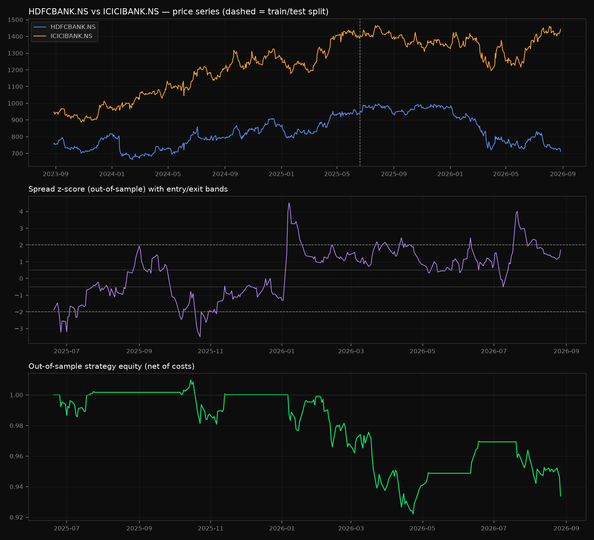

---

### AXISBANK.NS / ICICIBANK.NS

- **Latest prices:** AXISBANK.NS ₹1,256.00 · ICICIBANK.NS ₹1,443.00
- **Hedge ratio (train-fitted):** 0.9790
- **Cointegration (train):** FAIL at 5% — ADF -0.86, p=0.8021
- **Persistence:** passed 5% in 0 of 42 real-data runs (strict tier: 0/42)
- **Spread half-life:** 137.8 days
- **Current z-score:** +0.93
- **Signal today:** watch (approaching band)
- ⚠️ _Pair did not cointegrate on training data. Any signal here is not statistically justified — observation only._

**Out-of-sample backtest** (beta frozen from train window):

| Metric | Value |
|---|---|
| Sharpe | -0.46 |
| Sortino | -0.46 |
| Annualised return | -4.18% |
| Annualised vol | 8.45% |
| Max drawdown | -7.58% |
| Round-trip trades | 5 |

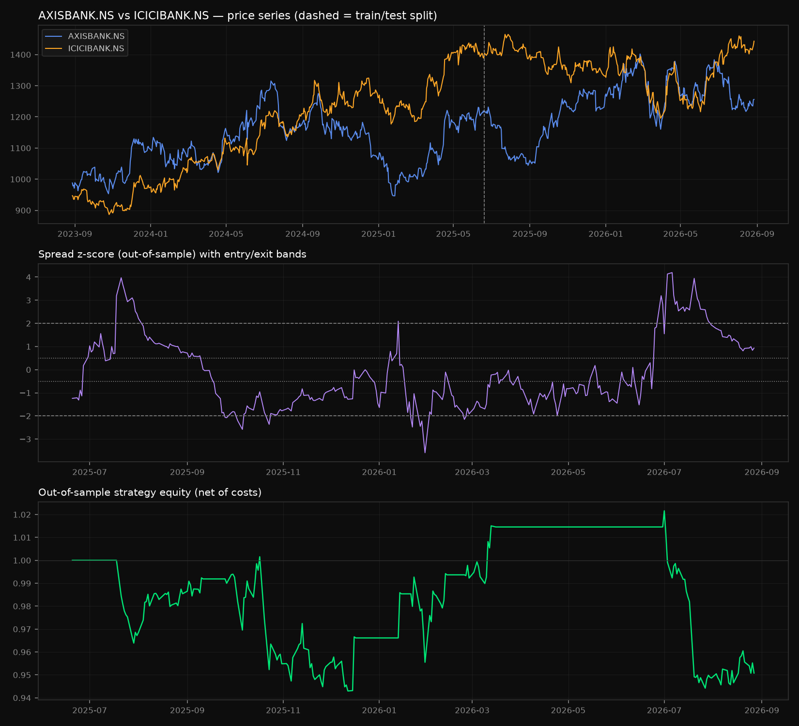

---

### KOTAKBANK.NS / HDFCBANK.NS

- **Latest prices:** KOTAKBANK.NS ₹424.20 · HDFCBANK.NS ₹711.00
- **Hedge ratio (train-fitted):** 2.0369
- **Cointegration (train):** FAIL at 5% — ADF -2.47, p=0.1228
- **Persistence:** passed 5% in 0 of 42 real-data runs (strict tier: 0/42)
- **Spread half-life:** 25.6 days
- **Current z-score:** -2.53
- **Signal today:** LONG spread (long HDFCBANK.NS, short KOTAKBANK.NS)
- ⚠️ _Pair did not cointegrate on training data. Any signal here is not statistically justified — observation only._

**Out-of-sample backtest** (beta frozen from train window):

| Metric | Value |
|---|---|
| Sharpe | 0.64 |
| Sortino | 0.45 |
| Annualised return | 4.00% |
| Annualised vol | 6.47% |
| Max drawdown | -4.25% |
| Round-trip trades | 6 |

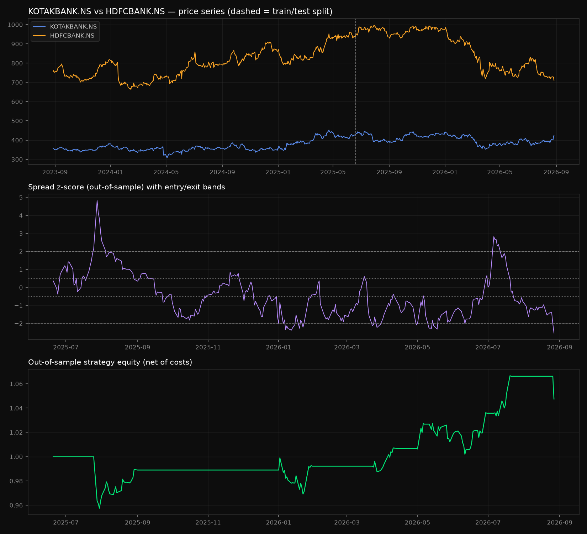

---

### SBIN.NS / BANKBARODA.NS

- **Latest prices:** SBIN.NS ₹1,042.90 · BANKBARODA.NS ₹241.00
- **Hedge ratio (train-fitted):** 0.1964
- **Cointegration (train):** FAIL at 5% — ADF -2.44, p=0.1312
- **Persistence:** passed 5% in 0 of 42 real-data runs (strict tier: 0/42)
- **Spread half-life:** 21.0 days
- **Current z-score:** -0.99
- **Signal today:** watch (approaching band)
- ⚠️ _Pair did not cointegrate on training data. Any signal here is not statistically justified — observation only._

**Out-of-sample backtest** (beta frozen from train window):

| Metric | Value |
|---|---|
| Sharpe | -0.01 |
| Sortino | -0.01 |
| Annualised return | -0.48% |
| Annualised vol | 8.87% |
| Max drawdown | -9.05% |
| Round-trip trades | 4 |

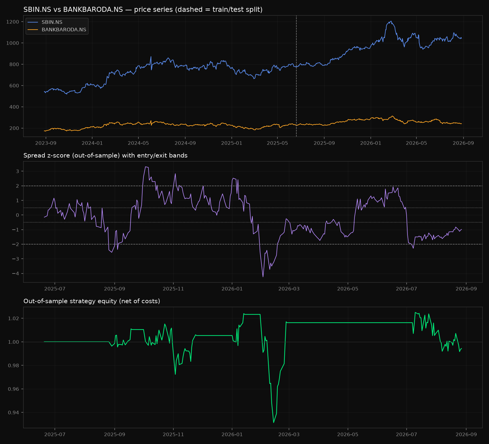

---

### TCS.NS / INFY.NS

- **Latest prices:** TCS.NS ₹2,248.40 · INFY.NS ₹1,110.80
- **Hedge ratio (train-fitted):** 0.5009
- **Cointegration (train):** FAIL at 5% — ADF -1.27, p=0.6435
- **Persistence:** passed 5% in 0 of 42 real-data runs (strict tier: 0/42)
- **Spread half-life:** 59.4 days
- **Current z-score:** -0.17
- **Signal today:** flat / no stretch
- ⚠️ _Pair did not cointegrate on training data. Any signal here is not statistically justified — observation only._

**Out-of-sample backtest** (beta frozen from train window):

| Metric | Value |
|---|---|
| Sharpe | 1.74 |
| Sortino | 1.81 |
| Annualised return | 7.90% |
| Annualised vol | 4.43% |
| Max drawdown | -3.79% |
| Round-trip trades | 8 |

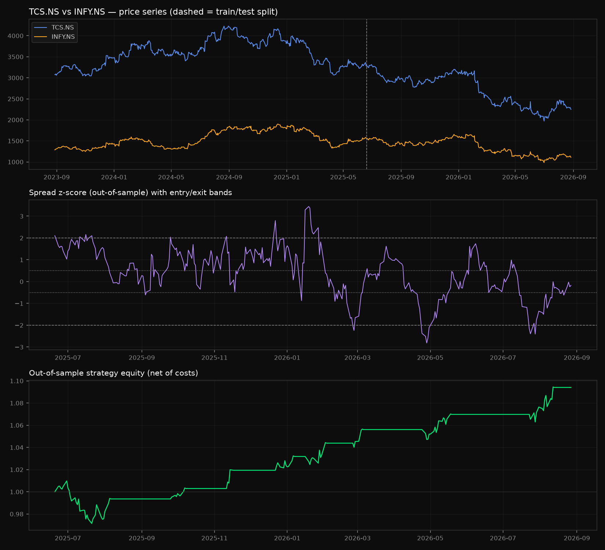

---

### INFY.NS / WIPRO.NS

- **Latest prices:** INFY.NS ₹1,110.80 · WIPRO.NS ₹176.40
- **Hedge ratio (train-fitted):** 0.1357
- **Cointegration (train):** FAIL at 5% — ADF -2.24, p=0.1912
- **Persistence:** passed 5% in 0 of 42 real-data runs (strict tier: 0/42)
- **Spread half-life:** 30.4 days
- **Current z-score:** -0.73
- **Signal today:** watch (approaching band)
- ⚠️ _Pair did not cointegrate on training data. Any signal here is not statistically justified — observation only._

**Out-of-sample backtest** (beta frozen from train window):

| Metric | Value |
|---|---|
| Sharpe | 1.67 |
| Sortino | 1.95 |
| Annualised return | 8.50% |
| Annualised vol | 4.95% |
| Max drawdown | -2.32% |
| Round-trip trades | 6 |

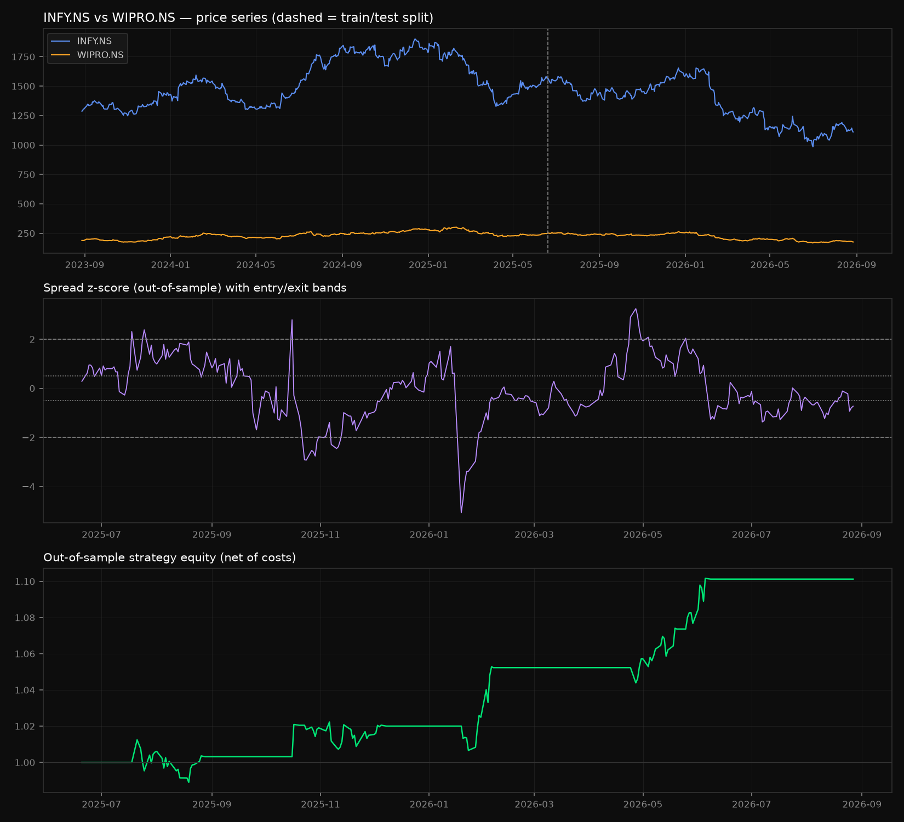

---

### HCLTECH.NS / TECHM.NS

- **Latest prices:** HCLTECH.NS ₹1,282.00 · TECHM.NS ₹1,585.00
- **Hedge ratio (train-fitted):** 0.8666
- **Cointegration (train):** FAIL at 5% — ADF -2.55, p=0.1033
- **Persistence:** passed 5% in 0 of 42 real-data runs (strict tier: 0/42)
- **Spread half-life:** 24.3 days
- **Current z-score:** +0.59
- **Signal today:** watch (approaching band)
- ⚠️ _Pair did not cointegrate on training data. Any signal here is not statistically justified — observation only._

**Out-of-sample backtest** (beta frozen from train window):

| Metric | Value |
|---|---|
| Sharpe | 0.10 |
| Sortino | 0.10 |
| Annualised return | 0.43% |
| Annualised vol | 6.76% |
| Max drawdown | -7.65% |
| Round-trip trades | 5 |

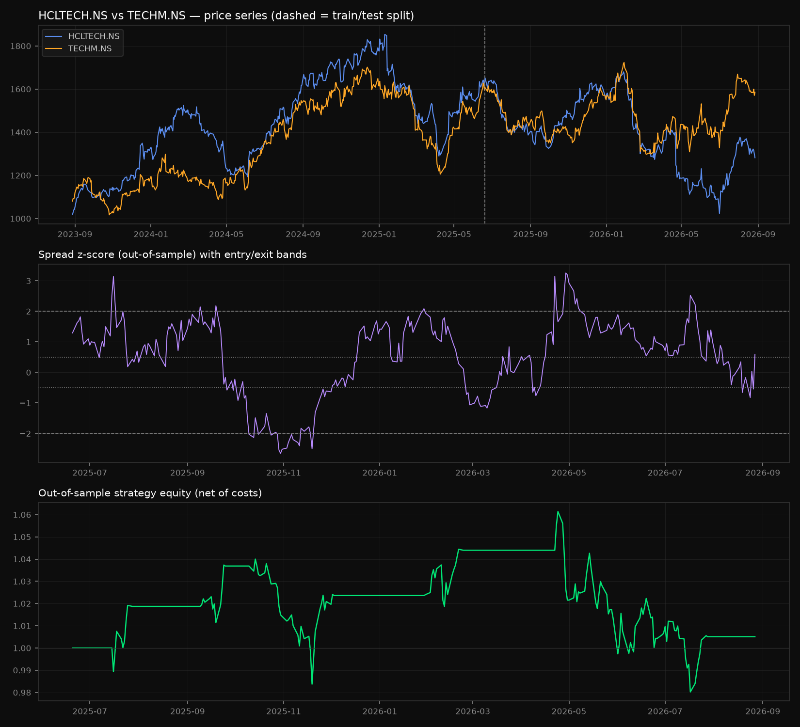

---

### ACC.NS / AMBUJACEM.NS

- **Latest prices:** ACC.NS ₹1,310.60 · AMBUJACEM.NS ₹411.05
- **Hedge ratio (train-fitted):** 0.2129
- **Cointegration (train):** FAIL at 5% — ADF -1.30, p=0.6272
- **Persistence:** passed 5% in 0 of 42 real-data runs (strict tier: 0/42)
- **Spread half-life:** 64.7 days
- **Current z-score:** -1.60
- **Signal today:** watch (approaching band)
- ⚠️ _Pair did not cointegrate on training data. Any signal here is not statistically justified — observation only._

**Out-of-sample backtest** (beta frozen from train window):

| Metric | Value |
|---|---|
| Sharpe | 0.52 |
| Sortino | 0.46 |
| Annualised return | 3.22% |
| Annualised vol | 6.45% |
| Max drawdown | -7.65% |
| Round-trip trades | 4 |

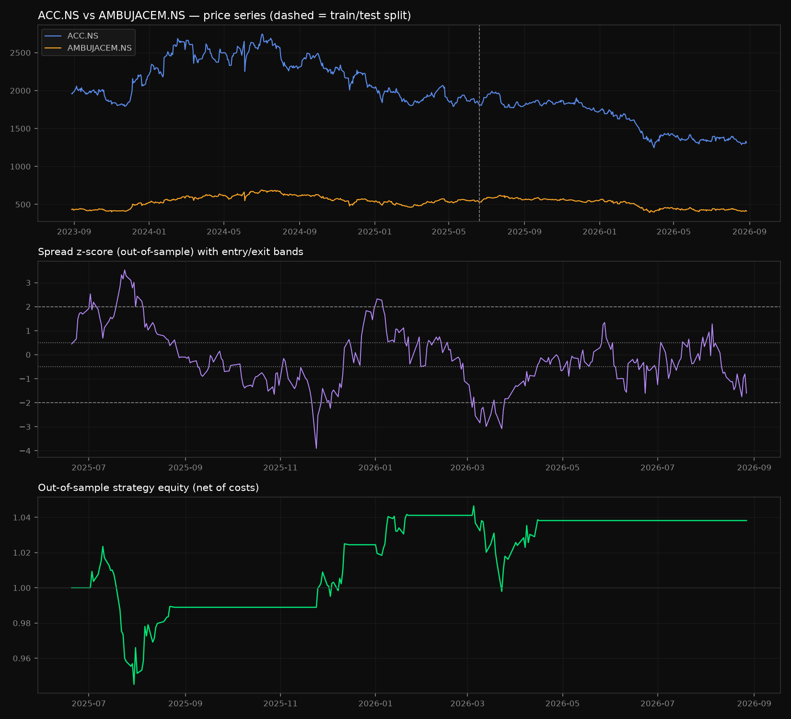

---

### ULTRACEMCO.NS / SHREECEM.NS

- **Latest prices:** ULTRACEMCO.NS ₹11,717.00 · SHREECEM.NS ₹24,480.00
- **Hedge ratio (train-fitted):** 0.6373
- **Cointegration (train):** FAIL at 5% — ADF -2.48, p=0.1203
- **Persistence:** passed 5% in 0 of 42 real-data runs (strict tier: 0/42)
- **Spread half-life:** 33.7 days
- **Current z-score:** -1.36
- **Signal today:** watch (approaching band)
- ⚠️ _Pair did not cointegrate on training data. Any signal here is not statistically justified — observation only._

**Out-of-sample backtest** (beta frozen from train window):

| Metric | Value |
|---|---|
| Sharpe | 0.48 |
| Sortino | 0.52 |
| Annualised return | 3.84% |
| Annualised vol | 8.55% |
| Max drawdown | -9.63% |
| Round-trip trades | 6 |

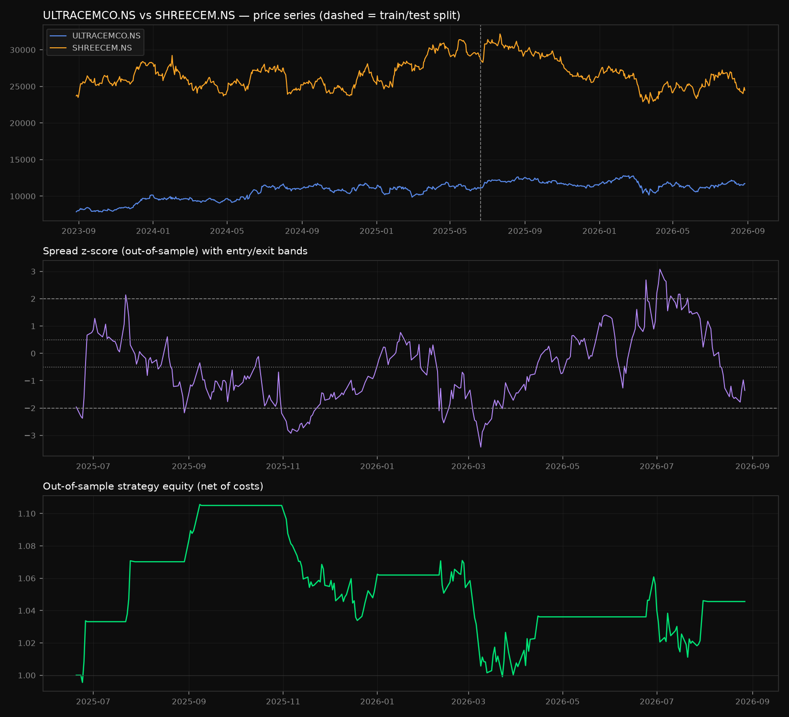

---

### IOC.NS / BPCL.NS

- **Latest prices:** IOC.NS ₹137.57 · BPCL.NS ₹318.00
- **Hedge ratio (train-fitted):** 1.7626
- **Cointegration (train):** FAIL at 5% — ADF -0.82, p=0.8135
- **Persistence:** passed 5% in 0 of 42 real-data runs (strict tier: 0/42)
- **Spread half-life:** 135.5 days
- **Current z-score:** +1.39
- **Signal today:** watch (approaching band)
- ⚠️ _Pair did not cointegrate on training data. Any signal here is not statistically justified — observation only._

**Out-of-sample backtest** (beta frozen from train window):

| Metric | Value |
|---|---|
| Sharpe | 0.48 |
| Sortino | 0.51 |
| Annualised return | 3.04% |
| Annualised vol | 6.76% |
| Max drawdown | -6.67% |
| Round-trip trades | 7 |

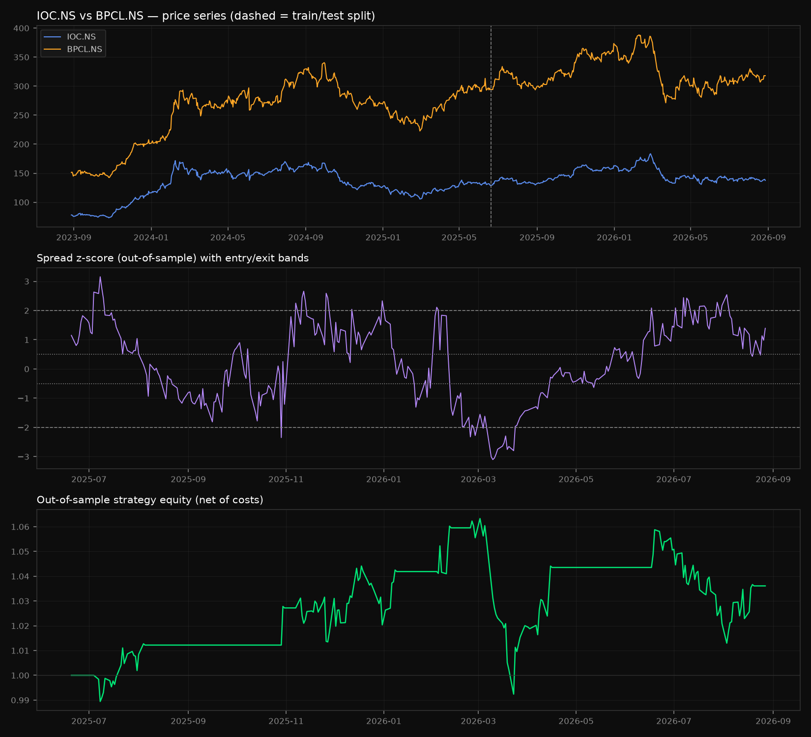

---

### BPCL.NS / HINDPETRO.NS

- **Latest prices:** BPCL.NS ₹318.00 · HINDPETRO.NS ₹371.00
- **Hedge ratio (train-fitted):** 1.3555
- **Cointegration (train):** FAIL at 5% — ADF -1.99, p=0.2925
- **Persistence:** passed 5% in 0 of 42 real-data runs (strict tier: 0/42)
- **Spread half-life:** 39.5 days
- **Current z-score:** -1.15
- **Signal today:** watch (approaching band)
- ⚠️ _Pair did not cointegrate on training data. Any signal here is not statistically justified — observation only._

**Out-of-sample backtest** (beta frozen from train window):

| Metric | Value |
|---|---|
| Sharpe | -0.19 |
| Sortino | -0.17 |
| Annualised return | -1.33% |
| Annualised vol | 6.09% |
| Max drawdown | -7.06% |
| Round-trip trades | 4 |

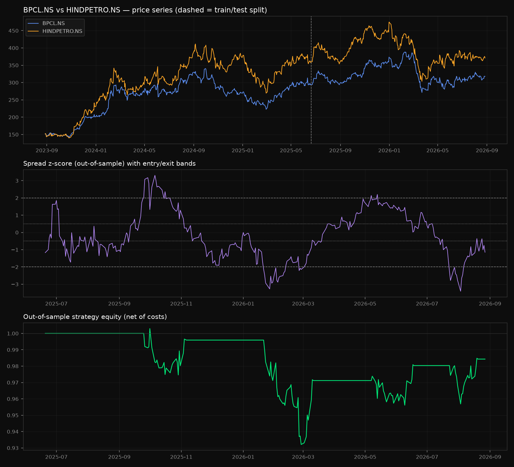

---

### ONGC.NS / COALINDIA.NS

- **Latest prices:** ONGC.NS ₹232.00 · COALINDIA.NS ₹400.00
- **Hedge ratio (train-fitted):** 1.5520
- **Cointegration (train):** PASS at 5% — ADF -3.58, p=0.0061
- **Persistence:** passed 5% in 34 of 42 real-data runs (strict tier: 0/42)
- **Spread half-life:** 12.6 days
- **Current z-score:** -0.60
- **Signal today:** watch (approaching band)

**Out-of-sample backtest** (beta frozen from train window):

| Metric | Value |
|---|---|
| Sharpe | 0.71 |
| Sortino | 0.53 |
| Annualised return | 4.94% |
| Annualised vol | 7.12% |
| Max drawdown | -5.80% |
| Round-trip trades | 5 |

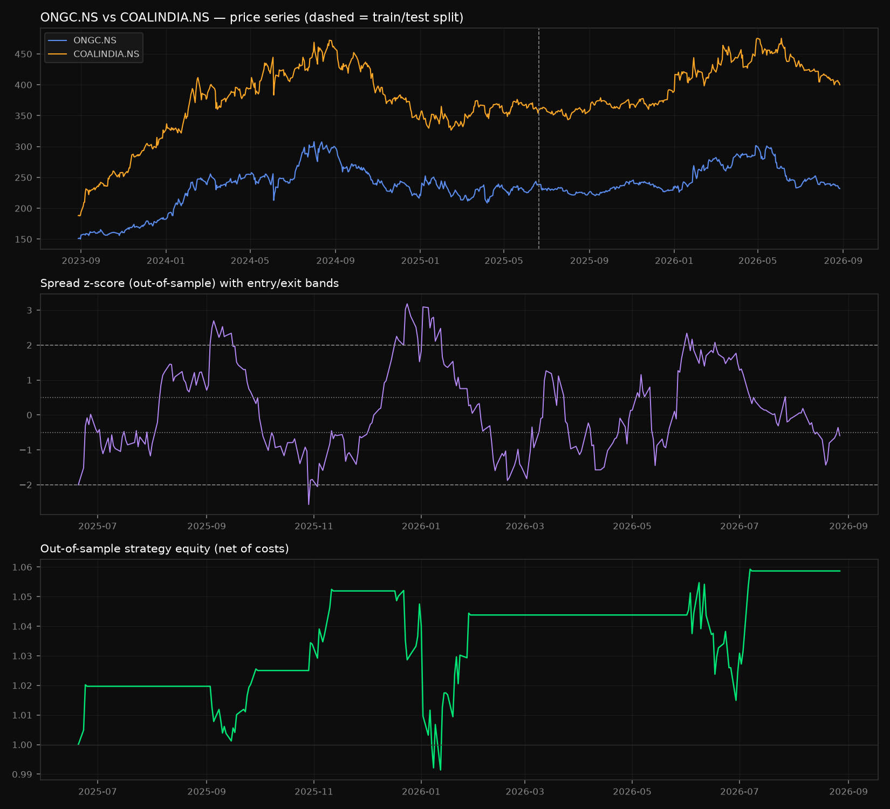

---

### NTPC.NS / POWERGRID.NS

- **Latest prices:** NTPC.NS ₹330.90 · POWERGRID.NS ₹264.90
- **Hedge ratio (train-fitted):** 0.8340
- **Cointegration (train):** FAIL at 5% — ADF -2.58, p=0.0983
- **Persistence:** passed 5% in 0 of 42 real-data runs (strict tier: 0/42)
- **Spread half-life:** 23.1 days
- **Current z-score:** -0.33
- **Signal today:** flat / no stretch
- ⚠️ _Pair did not cointegrate on training data. Any signal here is not statistically justified — observation only._

**Out-of-sample backtest** (beta frozen from train window):

| Metric | Value |
|---|---|
| Sharpe | 0.38 |
| Sortino | 0.29 |
| Annualised return | 1.97% |
| Annualised vol | 5.54% |
| Max drawdown | -5.29% |
| Round-trip trades | 6 |

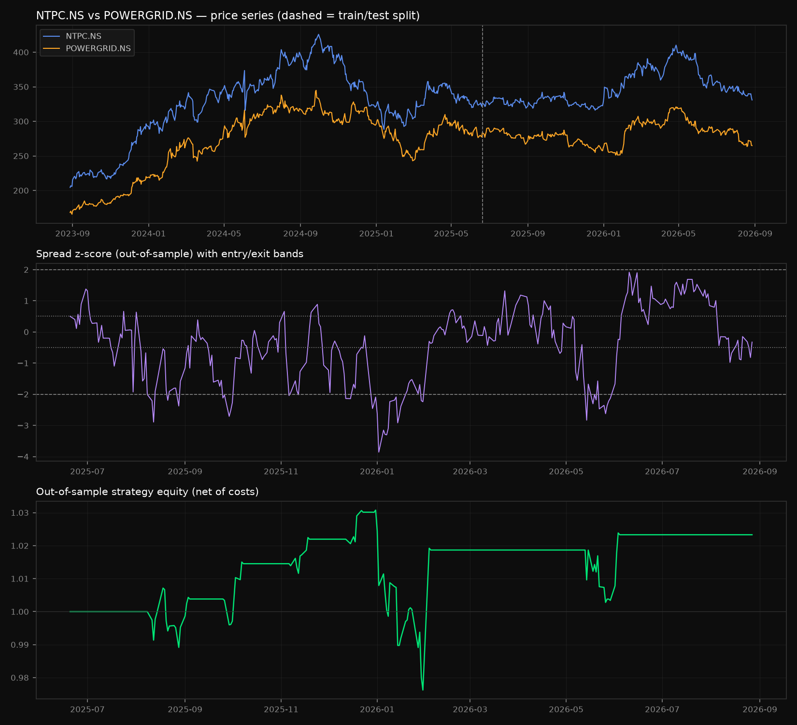

---

### BAJAJ-AUTO.NS / HEROMOTOCO.NS

- **Latest prices:** BAJAJ-AUTO.NS ₹11,720.00 · HEROMOTOCO.NS ₹5,550.00
- **Hedge ratio (train-fitted):** 0.4094
- **Cointegration (train):** FAIL at 5% — ADF -2.29, p=0.1747
- **Persistence:** passed 5% in 0 of 42 real-data runs (strict tier: 0/42)
- **Spread half-life:** 29.6 days
- **Current z-score:** +0.01
- **Signal today:** flat / no stretch
- ⚠️ _Pair did not cointegrate on training data. Any signal here is not statistically justified — observation only._

**Out-of-sample backtest** (beta frozen from train window):

| Metric | Value |
|---|---|
| Sharpe | -0.86 |
| Sortino | -0.88 |
| Annualised return | -9.11% |
| Annualised vol | 10.44% |
| Max drawdown | -20.80% |
| Round-trip trades | 5 |

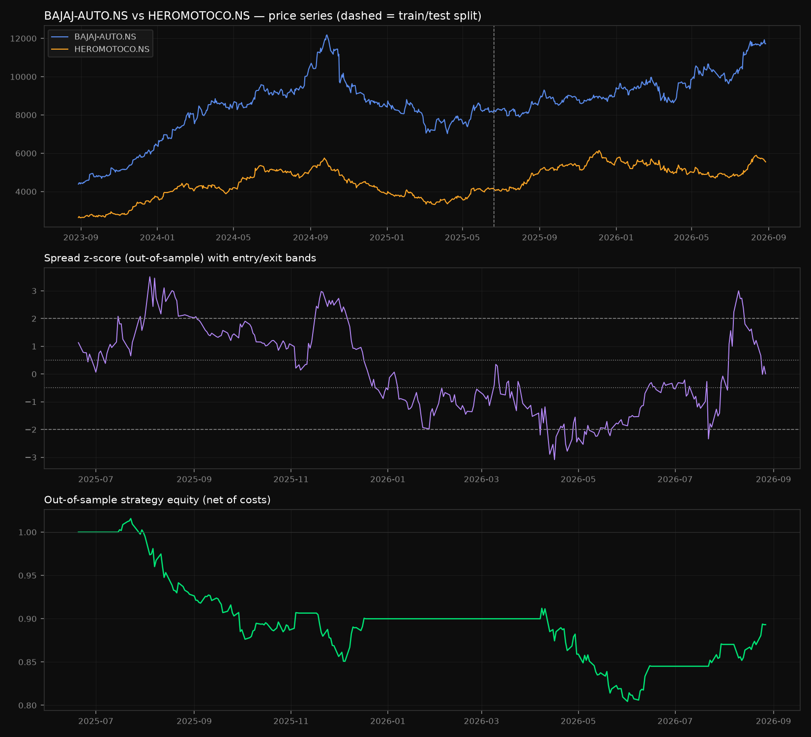

---

### TATASTEEL.NS / JSWSTEEL.NS

- **Latest prices:** TATASTEEL.NS ₹186.80 · JSWSTEEL.NS ₹1,337.50
- **Hedge ratio (train-fitted):** 3.0931
- **Cointegration (train):** FAIL at 5% — ADF -1.16, p=0.6887
- **Persistence:** passed 5% in 0 of 42 real-data runs (strict tier: 0/42)
- **Spread half-life:** 71.0 days
- **Current z-score:** +2.35
- **Signal today:** SHORT spread (short JSWSTEEL.NS, long TATASTEEL.NS)
- ⚠️ _Pair did not cointegrate on training data. Any signal here is not statistically justified — observation only._

**Out-of-sample backtest** (beta frozen from train window):

| Metric | Value |
|---|---|
| Sharpe | -0.05 |
| Sortino | -0.04 |
| Annualised return | -0.74% |
| Annualised vol | 8.28% |
| Max drawdown | -5.75% |
| Round-trip trades | 4 |

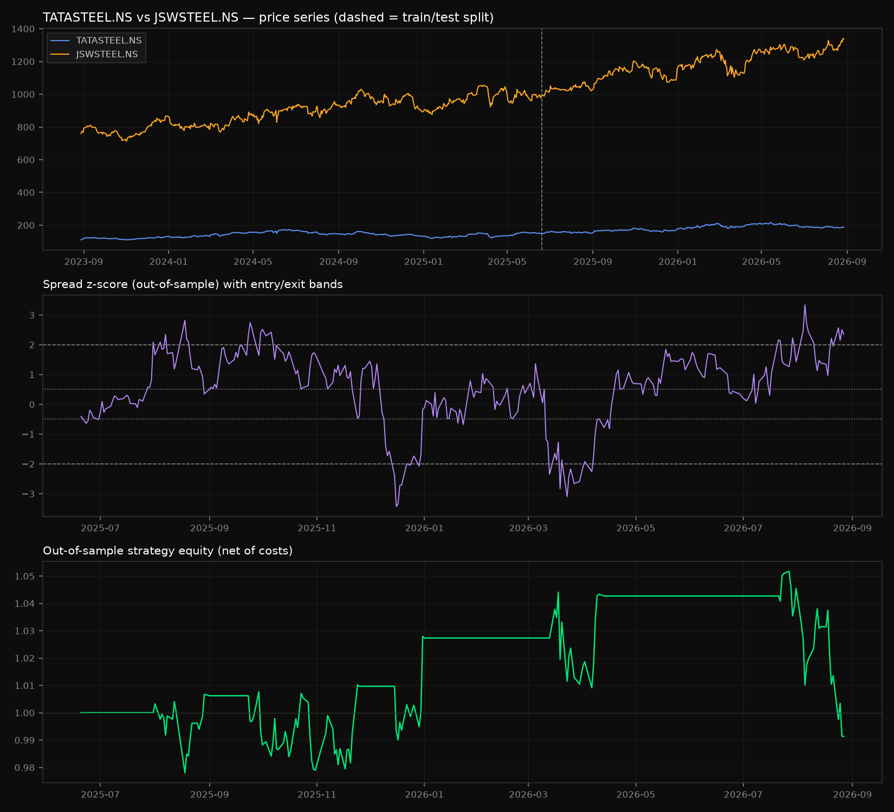

---

### SUNPHARMA.NS / CIPLA.NS

- **Latest prices:** SUNPHARMA.NS ₹1,913.30 · CIPLA.NS ₹1,420.00
- **Hedge ratio (train-fitted):** 0.4907
- **Cointegration (train):** PASS at 5% — ADF -3.40, p=0.0109
- **Persistence:** passed 5% in 42 of 42 real-data runs (strict tier: 5/42)
- **Spread half-life:** 10.7 days
- **Current z-score:** -0.67
- **Signal today:** watch (approaching band)

**Out-of-sample backtest** (beta frozen from train window):

| Metric | Value |
|---|---|
| Sharpe | -0.22 |
| Sortino | -0.22 |
| Annualised return | -1.91% |
| Annualised vol | 7.51% |
| Max drawdown | -10.34% |
| Round-trip trades | 4 |

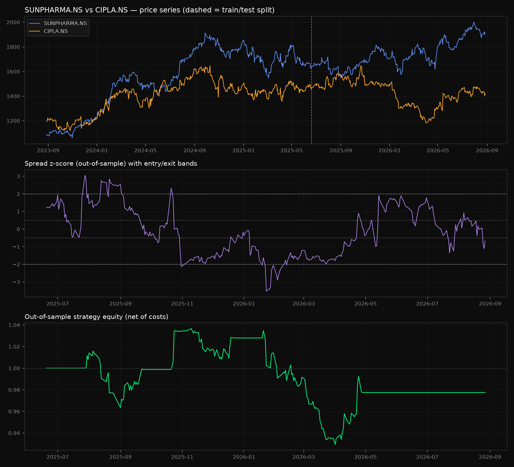

---

_Generated 2026-08-28 · pairs mean-reversion scanner · out-of-sample backtest · multiple-testing-aware · not investment advice._
