# Indian Pairs-Trading Scanner — 2026-08-31

> **What this is:** a market-neutral *pairs mean-reversion* scanner. It flags when two related NSE stocks have drifted apart far enough that their historical relationship signals a possible convergence trade. It does **not** forecast growth, rank "best" stocks, or predict company performance. A signal means the *spread between two stocks* is stretched — nothing about either stock being a good investment. Not investment advice; do your own research.

## Methodology (fixed in advance)

- **Universe:** 16 declared sector-mate pairs. Parameters (3y window, 60/40 train-test, z-entry 2.0, z-exit 0.5, 5 bps costs) are pre-registered; changes are logged in the README changelog *before* looking at results.
- **Multiple testing:** at the 5% level across 16 pairs, **≈0.8 false positives per run are expected by chance alone** even if nothing truly cointegrates. A single-day pass is a candidate, not a discovery.
- **Strict tier:** Bonferroni-corrected threshold p < 0.0031 (marked ✓✓).
- **Evidence = persistence:** the Persistence column counts how often each pair has passed the 5% test across all *real-data* daily runs recorded in `reports/history.csv`. Pairs deserve attention only when they pass persistently.

## Summary

| Pair | p-value | Coint. | Persistence | Current z | Signal | OOS Sharpe |
|---|---|---|---|---|---|---|
| HDFCBANK.NS/ICICIBANK.NS | 0.0966 | ✗ | 0/33 | +1.22 | watch | -0.73 |
| AXISBANK.NS/ICICIBANK.NS | 0.8093 | ✗ | 0/43 | +0.59 | watch | -0.35 |
| KOTAKBANK.NS/HDFCBANK.NS | 0.1238 | ✗ | 0/43 | -2.18 | LONG spread | 0.71 |
| SBIN.NS/BANKBARODA.NS | 0.1266 | ✗ | 0/43 | -0.96 | watch | -0.06 |
| TCS.NS/INFY.NS | 0.6103 | ✗ | 0/43 | -0.46 | flat / no stretch | 2.32 |
| INFY.NS/WIPRO.NS | 0.1931 | ✗ | 0/43 | -0.70 | watch | 1.68 |
| HCLTECH.NS/TECHM.NS | 0.1032 | ✗ | 0/43 | +1.59 | watch | 0.08 |
| ACC.NS/AMBUJACEM.NS | 0.5310 | ✗ | 0/43 | -1.17 | watch | 0.49 |
| ULTRACEMCO.NS/SHREECEM.NS | 0.1180 | ✗ | 0/43 | -1.73 | watch | 0.52 |
| IOC.NS/BPCL.NS | 0.7870 | ✗ | 0/43 | +1.61 | watch | 0.47 |
| BPCL.NS/HINDPETRO.NS | 0.2948 | ✗ | 0/43 | -1.90 | watch | -0.19 |
| ONGC.NS/COALINDIA.NS | 0.0028 | ✓✓ | 35/43 | -0.54 | watch | 0.49 |
| NTPC.NS/POWERGRID.NS | 0.1009 | ✗ | 0/43 | +0.03 | flat / no stretch | 0.38 |
| BAJAJ-AUTO.NS/HEROMOTOCO.NS | 0.1780 | ✗ | 0/43 | -0.19 | flat / no stretch | -0.86 |
| TATASTEEL.NS/JSWSTEEL.NS | 0.7021 | ✗ | 0/43 | +2.35 | SHORT spread | -0.30 |
| SUNPHARMA.NS/CIPLA.NS | 0.0103 | ✓ | 43/43 | -0.67 | watch | -0.22 |

_Legend: ✓✓ passes strict Bonferroni tier · ✓ passes 5% only · ✗ fails. Persistence = 5%-passes / real-data runs recorded. \*no real-data history yet._

---

### HDFCBANK.NS / ICICIBANK.NS

- **Latest prices:** HDFCBANK.NS ₹720.30 · ICICIBANK.NS ₹1,422.80
- **Hedge ratio (train-fitted):** 1.7466
- **Cointegration (train):** FAIL at 5% — ADF -2.58, p=0.0966
- **Persistence:** passed 5% in 0 of 33 real-data runs (strict tier: 0/33)
- **Spread half-life:** 26.7 days
- **Current z-score:** +1.22
- **Signal today:** watch (approaching band)
- ⚠️ _Pair did not cointegrate on training data. Any signal here is not statistically justified — observation only._

**Out-of-sample backtest** (beta frozen from train window):

| Metric | Value |
|---|---|
| Sharpe | -0.73 |
| Sortino | -0.81 |
| Annualised return | -4.86% |
| Annualised vol | 6.54% |
| Max drawdown | -8.67% |
| Round-trip trades | 4 |

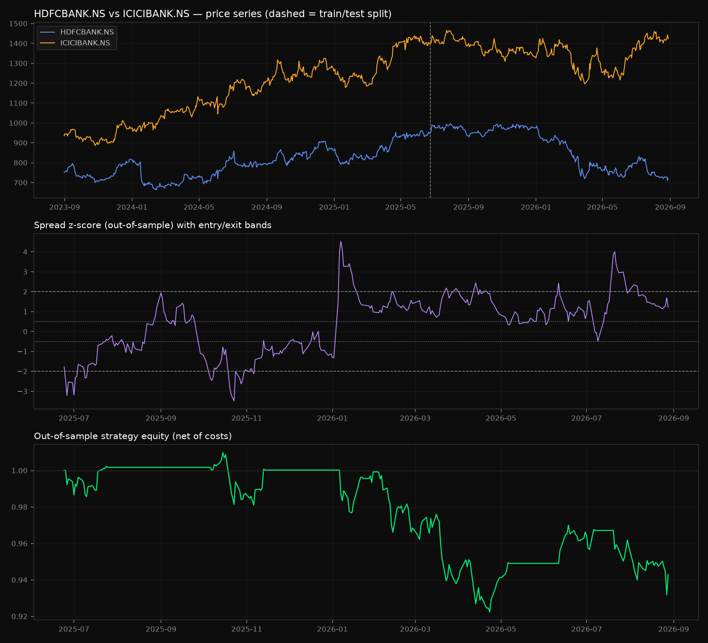

---

### AXISBANK.NS / ICICIBANK.NS

- **Latest prices:** AXISBANK.NS ₹1,265.00 · ICICIBANK.NS ₹1,422.80
- **Hedge ratio (train-fitted):** 0.9789
- **Cointegration (train):** FAIL at 5% — ADF -0.83, p=0.8093
- **Persistence:** passed 5% in 0 of 43 real-data runs (strict tier: 0/43)
- **Spread half-life:** 145.7 days
- **Current z-score:** +0.59
- **Signal today:** watch (approaching band)
- ⚠️ _Pair did not cointegrate on training data. Any signal here is not statistically justified — observation only._

**Out-of-sample backtest** (beta frozen from train window):

| Metric | Value |
|---|---|
| Sharpe | -0.35 |
| Sortino | -0.35 |
| Annualised return | -3.29% |
| Annualised vol | 8.53% |
| Max drawdown | -7.58% |
| Round-trip trades | 5 |

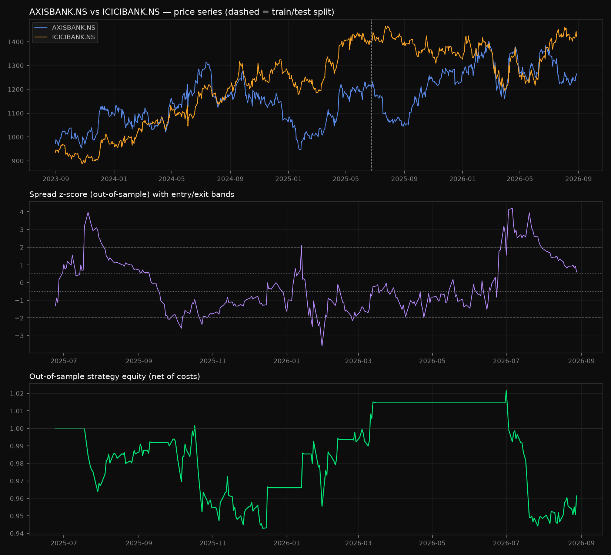

---

### KOTAKBANK.NS / HDFCBANK.NS

- **Latest prices:** KOTAKBANK.NS ₹423.70 · HDFCBANK.NS ₹720.30
- **Hedge ratio (train-fitted):** 2.0404
- **Cointegration (train):** FAIL at 5% — ADF -2.47, p=0.1238
- **Persistence:** passed 5% in 0 of 43 real-data runs (strict tier: 0/43)
- **Spread half-life:** 25.6 days
- **Current z-score:** -2.18
- **Signal today:** LONG spread (long HDFCBANK.NS, short KOTAKBANK.NS)
- ⚠️ _Pair did not cointegrate on training data. Any signal here is not statistically justified — observation only._

**Out-of-sample backtest** (beta frozen from train window):

| Metric | Value |
|---|---|
| Sharpe | 0.71 |
| Sortino | 0.50 |
| Annualised return | 4.45% |
| Annualised vol | 6.43% |
| Max drawdown | -4.21% |
| Round-trip trades | 6 |

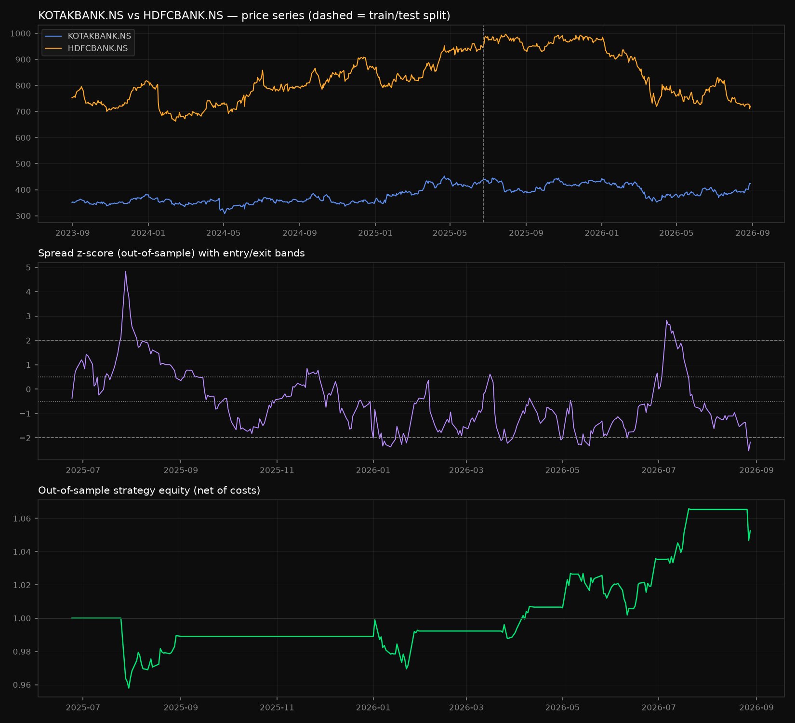

---

### SBIN.NS / BANKBARODA.NS

- **Latest prices:** SBIN.NS ₹1,047.50 · BANKBARODA.NS ₹241.90
- **Hedge ratio (train-fitted):** 0.1945
- **Cointegration (train):** FAIL at 5% — ADF -2.46, p=0.1266
- **Persistence:** passed 5% in 0 of 43 real-data runs (strict tier: 0/43)
- **Spread half-life:** 20.6 days
- **Current z-score:** -0.96
- **Signal today:** watch (approaching band)
- ⚠️ _Pair did not cointegrate on training data. Any signal here is not statistically justified — observation only._

**Out-of-sample backtest** (beta frozen from train window):

| Metric | Value |
|---|---|
| Sharpe | -0.06 |
| Sortino | -0.05 |
| Annualised return | -0.94% |
| Annualised vol | 8.85% |
| Max drawdown | -8.94% |
| Round-trip trades | 4 |

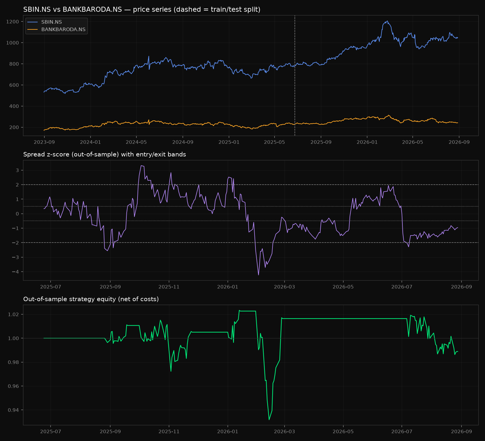

---

### TCS.NS / INFY.NS

- **Latest prices:** TCS.NS ₹2,342.00 · INFY.NS ₹1,144.00
- **Hedge ratio (train-fitted):** 0.4986
- **Cointegration (train):** FAIL at 5% — ADF -1.34, p=0.6103
- **Persistence:** passed 5% in 0 of 43 real-data runs (strict tier: 0/43)
- **Spread half-life:** 56.8 days
- **Current z-score:** -0.46
- **Signal today:** flat / no stretch
- ⚠️ _Pair did not cointegrate on training data. Any signal here is not statistically justified — observation only._

**Out-of-sample backtest** (beta frozen from train window):

| Metric | Value |
|---|---|
| Sharpe | 2.32 |
| Sortino | 2.38 |
| Annualised return | 10.12% |
| Annualised vol | 4.19% |
| Max drawdown | -1.35% |
| Round-trip trades | 8 |

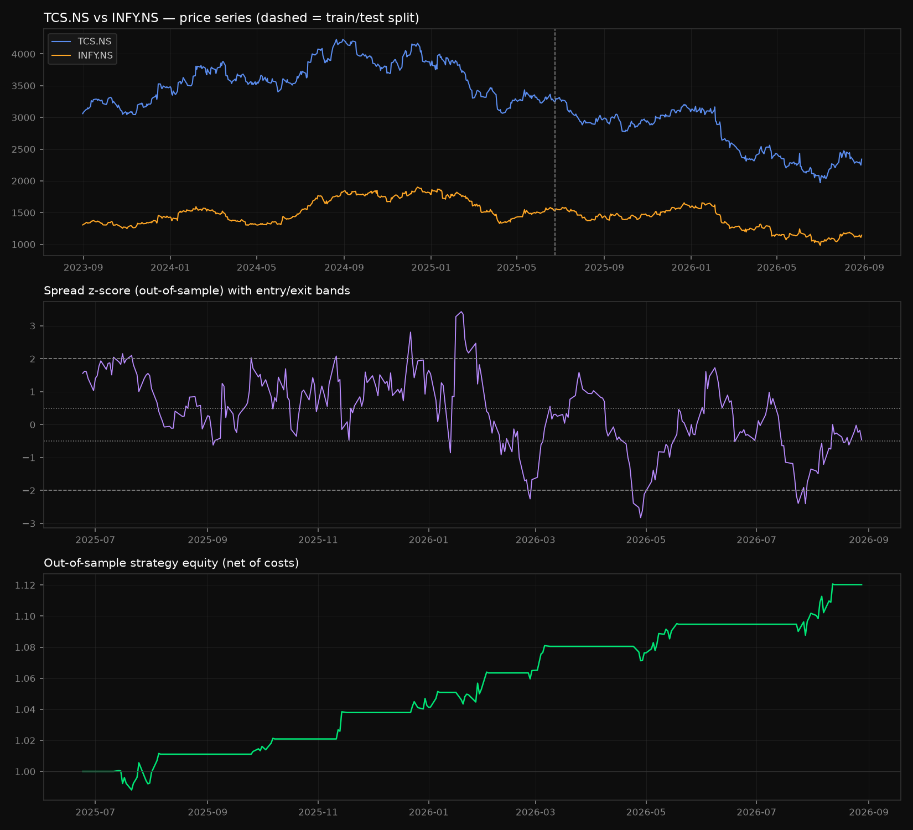

---

### INFY.NS / WIPRO.NS

- **Latest prices:** INFY.NS ₹1,144.00 · WIPRO.NS ₹180.95
- **Hedge ratio (train-fitted):** 0.1351
- **Cointegration (train):** FAIL at 5% — ADF -2.24, p=0.1931
- **Persistence:** passed 5% in 0 of 43 real-data runs (strict tier: 0/43)
- **Spread half-life:** 30.5 days
- **Current z-score:** -0.70
- **Signal today:** watch (approaching band)
- ⚠️ _Pair did not cointegrate on training data. Any signal here is not statistically justified — observation only._

**Out-of-sample backtest** (beta frozen from train window):

| Metric | Value |
|---|---|
| Sharpe | 1.68 |
| Sortino | 1.96 |
| Annualised return | 8.67% |
| Annualised vol | 5.03% |
| Max drawdown | -2.34% |
| Round-trip trades | 6 |

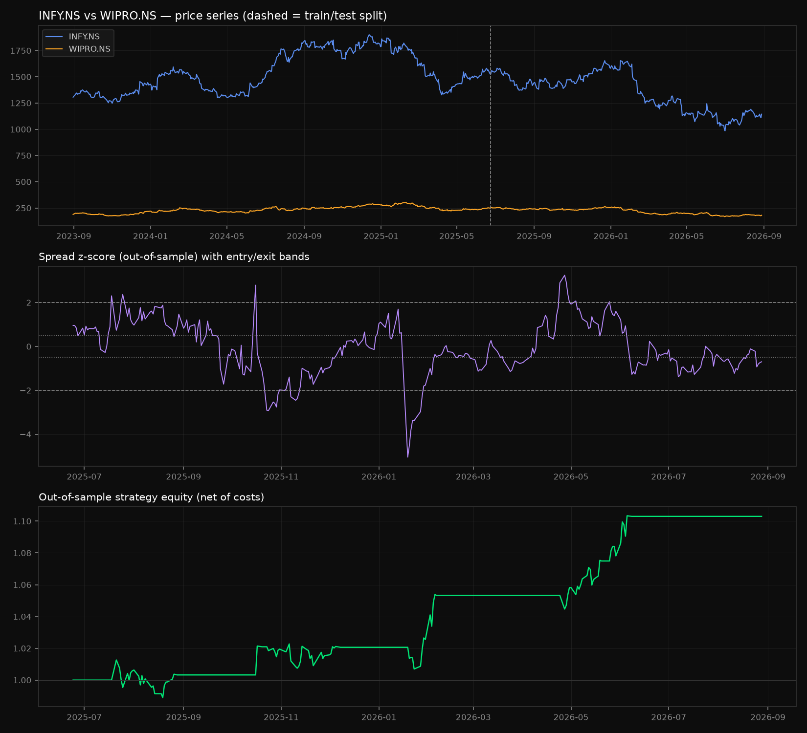

---

### HCLTECH.NS / TECHM.NS

- **Latest prices:** HCLTECH.NS ₹1,316.10 · TECHM.NS ₹1,640.90
- **Hedge ratio (train-fitted):** 0.8758
- **Cointegration (train):** FAIL at 5% — ADF -2.55, p=0.1032
- **Persistence:** passed 5% in 0 of 43 real-data runs (strict tier: 0/43)
- **Spread half-life:** 24.1 days
- **Current z-score:** +1.59
- **Signal today:** watch (approaching band)
- ⚠️ _Pair did not cointegrate on training data. Any signal here is not statistically justified — observation only._

**Out-of-sample backtest** (beta frozen from train window):

| Metric | Value |
|---|---|
| Sharpe | 0.08 |
| Sortino | 0.08 |
| Annualised return | 0.32% |
| Annualised vol | 6.87% |
| Max drawdown | -7.75% |
| Round-trip trades | 5 |

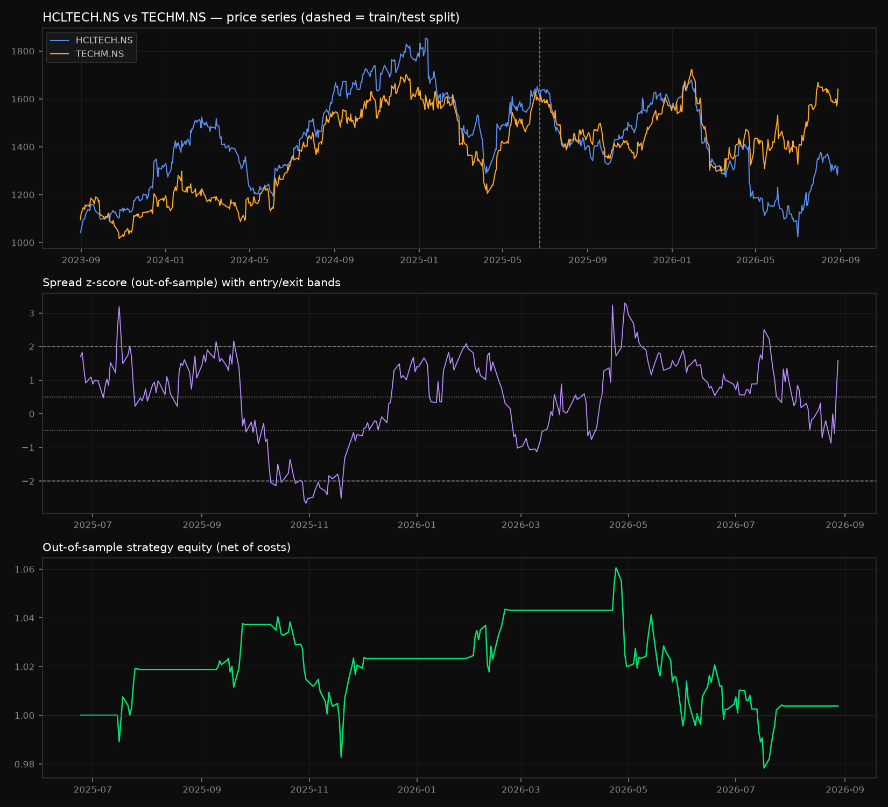

---

### ACC.NS / AMBUJACEM.NS

- **Latest prices:** ACC.NS ₹1,306.40 · AMBUJACEM.NS ₹412.05
- **Hedge ratio (train-fitted):** 0.2100
- **Cointegration (train):** FAIL at 5% — ADF -1.50, p=0.5310
- **Persistence:** passed 5% in 0 of 43 real-data runs (strict tier: 0/43)
- **Spread half-life:** 58.2 days
- **Current z-score:** -1.17
- **Signal today:** watch (approaching band)
- ⚠️ _Pair did not cointegrate on training data. Any signal here is not statistically justified — observation only._

**Out-of-sample backtest** (beta frozen from train window):

| Metric | Value |
|---|---|
| Sharpe | 0.49 |
| Sortino | 0.44 |
| Annualised return | 2.97% |
| Annualised vol | 6.33% |
| Max drawdown | -7.43% |
| Round-trip trades | 4 |

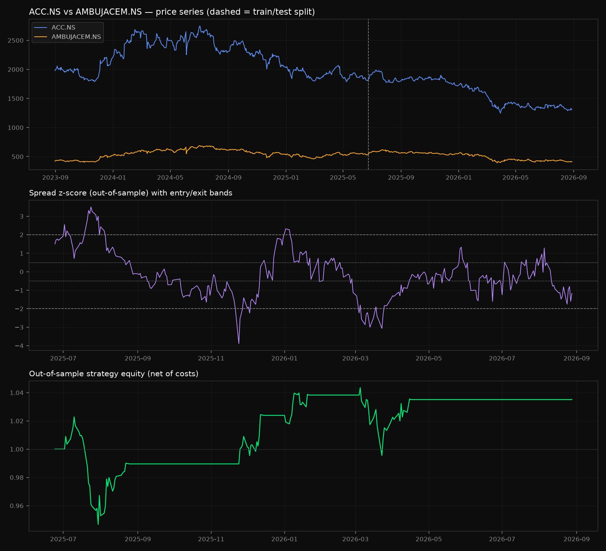

---

### ULTRACEMCO.NS / SHREECEM.NS

- **Latest prices:** ULTRACEMCO.NS ₹11,589.00 · SHREECEM.NS ₹24,000.00
- **Hedge ratio (train-fitted):** 0.6247
- **Cointegration (train):** FAIL at 5% — ADF -2.49, p=0.1180
- **Persistence:** passed 5% in 0 of 43 real-data runs (strict tier: 0/43)
- **Spread half-life:** 31.3 days
- **Current z-score:** -1.73
- **Signal today:** watch (approaching band)
- ⚠️ _Pair did not cointegrate on training data. Any signal here is not statistically justified — observation only._

**Out-of-sample backtest** (beta frozen from train window):

| Metric | Value |
|---|---|
| Sharpe | 0.52 |
| Sortino | 0.55 |
| Annualised return | 4.20% |
| Annualised vol | 8.70% |
| Max drawdown | -9.83% |
| Round-trip trades | 6 |

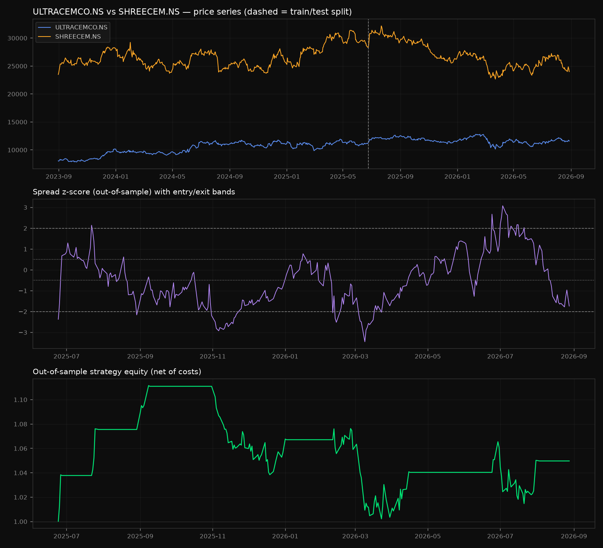

---

### IOC.NS / BPCL.NS

- **Latest prices:** IOC.NS ₹137.10 · BPCL.NS ₹319.25
- **Hedge ratio (train-fitted):** 1.7562
- **Cointegration (train):** FAIL at 5% — ADF -0.90, p=0.7870
- **Persistence:** passed 5% in 0 of 43 real-data runs (strict tier: 0/43)
- **Spread half-life:** 123.8 days
- **Current z-score:** +1.61
- **Signal today:** watch (approaching band)
- ⚠️ _Pair did not cointegrate on training data. Any signal here is not statistically justified — observation only._

**Out-of-sample backtest** (beta frozen from train window):

| Metric | Value |
|---|---|
| Sharpe | 0.47 |
| Sortino | 0.51 |
| Annualised return | 2.97% |
| Annualised vol | 6.63% |
| Max drawdown | -6.57% |
| Round-trip trades | 7 |

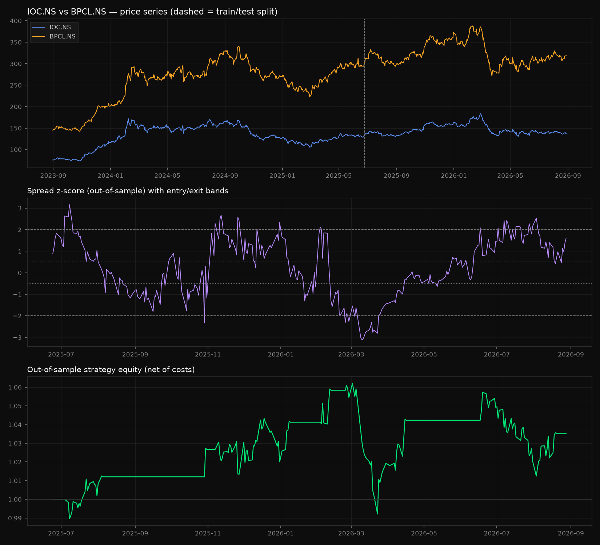

---

### BPCL.NS / HINDPETRO.NS

- **Latest prices:** BPCL.NS ₹319.25 · HINDPETRO.NS ₹364.00
- **Hedge ratio (train-fitted):** 1.3535
- **Cointegration (train):** FAIL at 5% — ADF -1.98, p=0.2948
- **Persistence:** passed 5% in 0 of 43 real-data runs (strict tier: 0/43)
- **Spread half-life:** 39.5 days
- **Current z-score:** -1.90
- **Signal today:** watch (approaching band)
- ⚠️ _Pair did not cointegrate on training data. Any signal here is not statistically justified — observation only._

**Out-of-sample backtest** (beta frozen from train window):

| Metric | Value |
|---|---|
| Sharpe | -0.19 |
| Sortino | -0.17 |
| Annualised return | -1.31% |
| Annualised vol | 5.94% |
| Max drawdown | -6.89% |
| Round-trip trades | 4 |

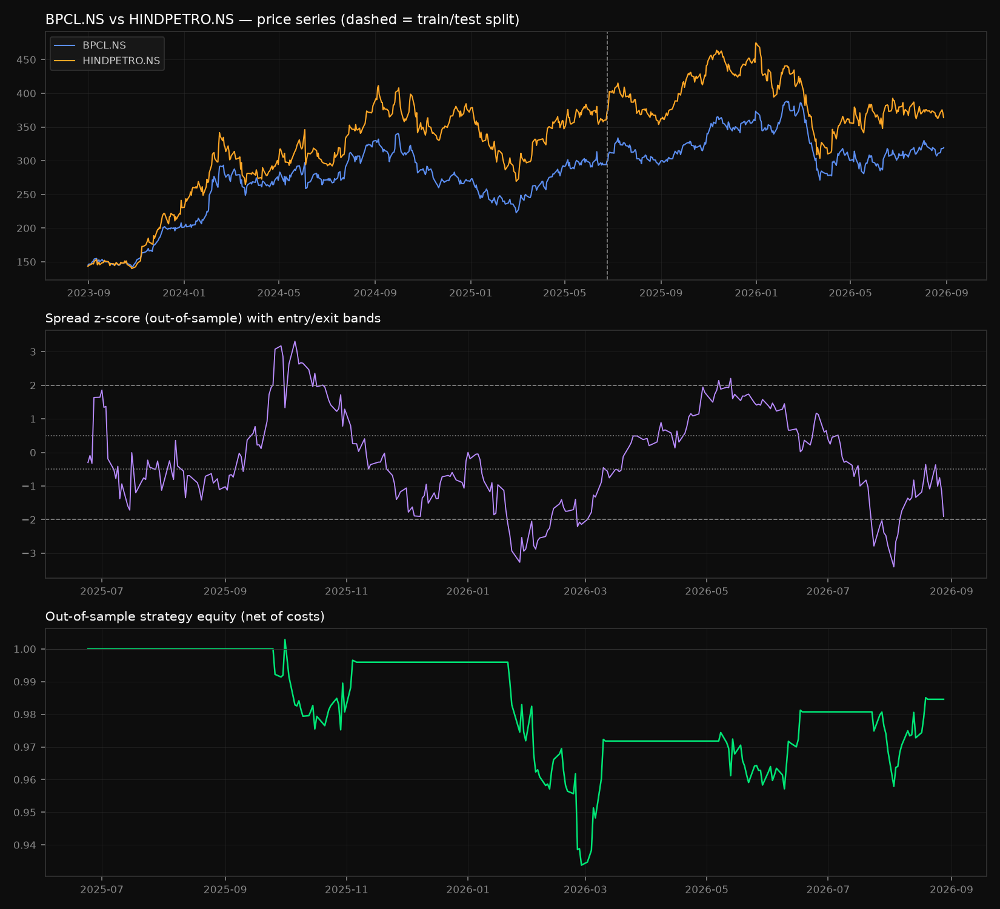

---

### ONGC.NS / COALINDIA.NS

- **Latest prices:** ONGC.NS ₹232.25 · COALINDIA.NS ₹401.00
- **Hedge ratio (train-fitted):** 1.5304
- **Cointegration (train):** PASS at 5% — ADF -3.82, p=0.0028 · **passes strict Bonferroni tier**
- **Persistence:** passed 5% in 35 of 43 real-data runs (strict tier: 1/43)
- **Spread half-life:** 12.0 days
- **Current z-score:** -0.54
- **Signal today:** watch (approaching band)

**Out-of-sample backtest** (beta frozen from train window):

| Metric | Value |
|---|---|
| Sharpe | 0.49 |
| Sortino | 0.35 |
| Annualised return | 3.24% |
| Annualised vol | 7.07% |
| Max drawdown | -5.91% |
| Round-trip trades | 4 |

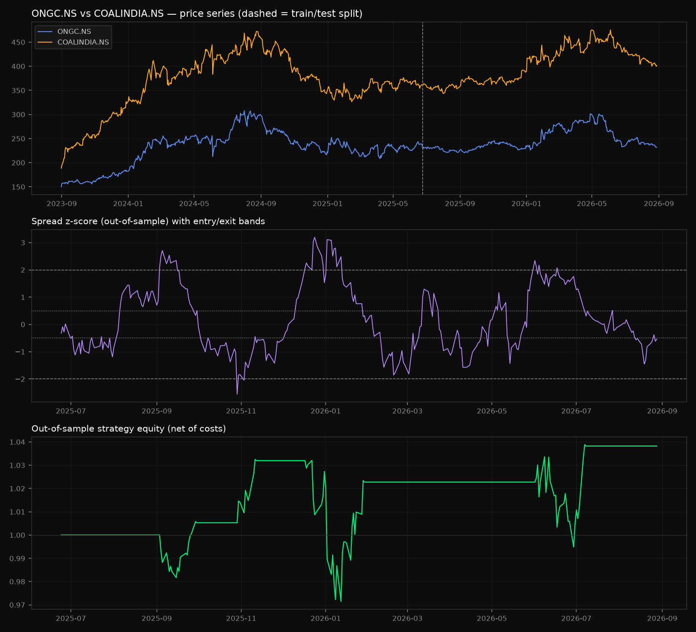

---

### NTPC.NS / POWERGRID.NS

- **Latest prices:** NTPC.NS ₹330.05 · POWERGRID.NS ₹266.05
- **Hedge ratio (train-fitted):** 0.8335
- **Cointegration (train):** FAIL at 5% — ADF -2.56, p=0.1009
- **Persistence:** passed 5% in 0 of 43 real-data runs (strict tier: 0/43)
- **Spread half-life:** 23.2 days
- **Current z-score:** +0.03
- **Signal today:** flat / no stretch
- ⚠️ _Pair did not cointegrate on training data. Any signal here is not statistically justified — observation only._

**Out-of-sample backtest** (beta frozen from train window):

| Metric | Value |
|---|---|
| Sharpe | 0.38 |
| Sortino | 0.29 |
| Annualised return | 2.01% |
| Annualised vol | 5.67% |
| Max drawdown | -5.40% |
| Round-trip trades | 6 |

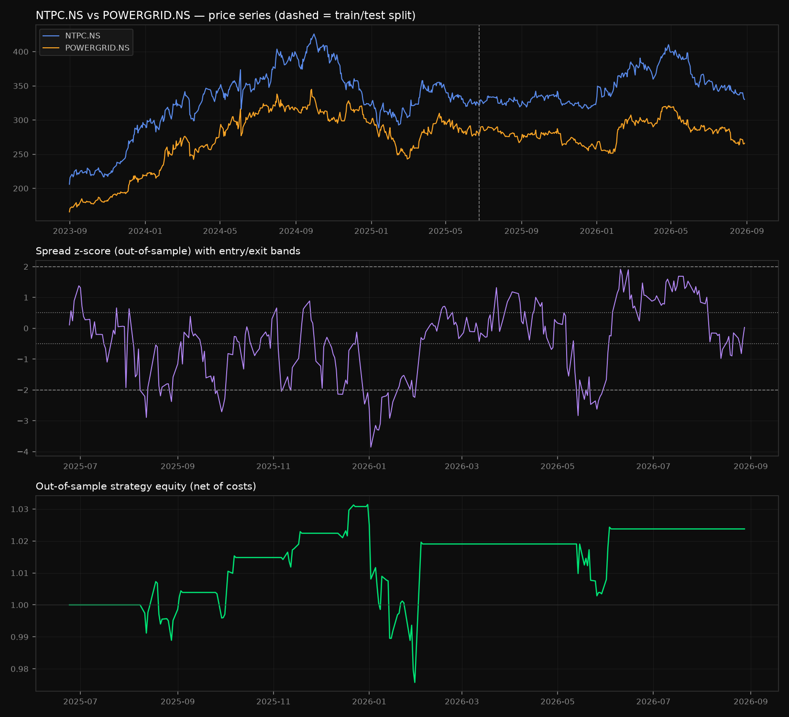

---

### BAJAJ-AUTO.NS / HEROMOTOCO.NS

- **Latest prices:** BAJAJ-AUTO.NS ₹11,910.00 · HEROMOTOCO.NS ₹5,600.00
- **Hedge ratio (train-fitted):** 0.4099
- **Cointegration (train):** FAIL at 5% — ADF -2.28, p=0.1780
- **Persistence:** passed 5% in 0 of 43 real-data runs (strict tier: 0/43)
- **Spread half-life:** 29.6 days
- **Current z-score:** -0.19
- **Signal today:** flat / no stretch
- ⚠️ _Pair did not cointegrate on training data. Any signal here is not statistically justified — observation only._

**Out-of-sample backtest** (beta frozen from train window):

| Metric | Value |
|---|---|
| Sharpe | -0.86 |
| Sortino | -0.89 |
| Annualised return | -9.19% |
| Annualised vol | 10.51% |
| Max drawdown | -20.90% |
| Round-trip trades | 5 |

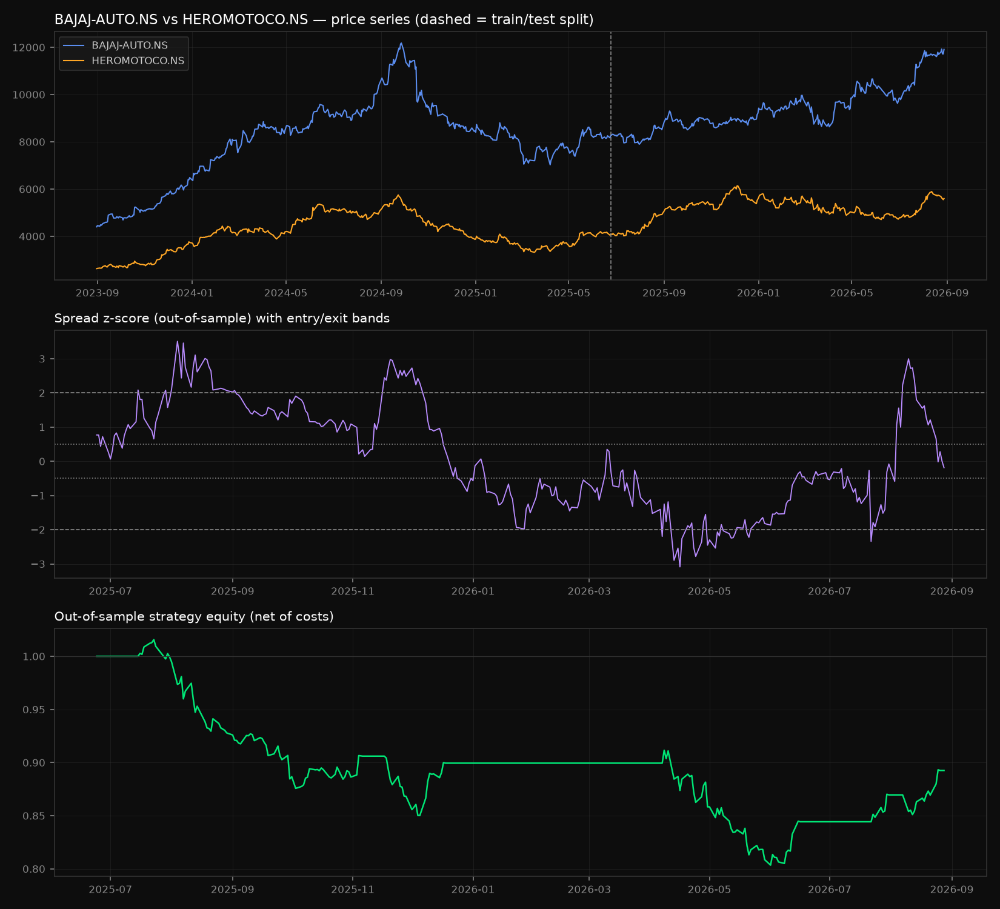

---

### TATASTEEL.NS / JSWSTEEL.NS

- **Latest prices:** TATASTEEL.NS ₹186.80 · JSWSTEEL.NS ₹1,337.50
- **Hedge ratio (train-fitted):** 3.0658
- **Cointegration (train):** FAIL at 5% — ADF -1.13, p=0.7021
- **Persistence:** passed 5% in 0 of 43 real-data runs (strict tier: 0/43)
- **Spread half-life:** 70.7 days
- **Current z-score:** +2.35
- **Signal today:** SHORT spread (short JSWSTEEL.NS, long TATASTEEL.NS)
- ⚠️ _Pair did not cointegrate on training data. Any signal here is not statistically justified — observation only._

**Out-of-sample backtest** (beta frozen from train window):

| Metric | Value |
|---|---|
| Sharpe | -0.30 |
| Sortino | -0.27 |
| Annualised return | -2.76% |
| Annualised vol | 8.27% |
| Max drawdown | -5.79% |
| Round-trip trades | 4 |

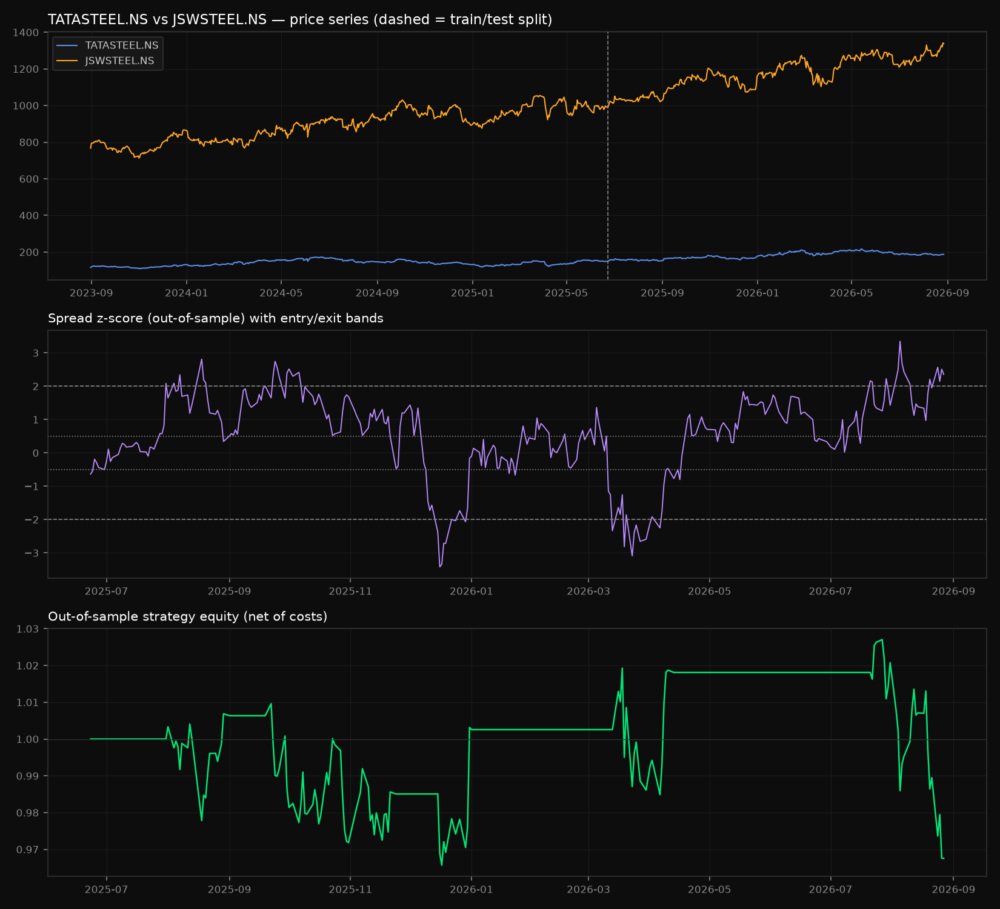

---

### SUNPHARMA.NS / CIPLA.NS

- **Latest prices:** SUNPHARMA.NS ₹1,913.30 · CIPLA.NS ₹1,420.00
- **Hedge ratio (train-fitted):** 0.4920
- **Cointegration (train):** PASS at 5% — ADF -3.42, p=0.0103
- **Persistence:** passed 5% in 43 of 43 real-data runs (strict tier: 5/43)
- **Spread half-life:** 10.6 days
- **Current z-score:** -0.67
- **Signal today:** watch (approaching band)

**Out-of-sample backtest** (beta frozen from train window):

| Metric | Value |
|---|---|
| Sharpe | -0.22 |
| Sortino | -0.22 |
| Annualised return | -1.92% |
| Annualised vol | 7.52% |
| Max drawdown | -10.35% |
| Round-trip trades | 4 |

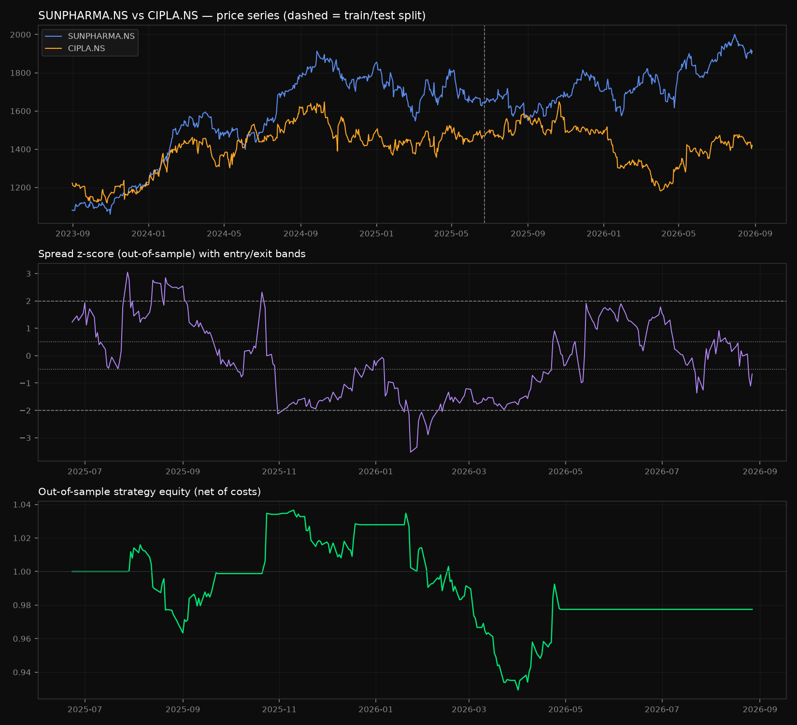

---

_Generated 2026-08-31 · pairs mean-reversion scanner · out-of-sample backtest · multiple-testing-aware · not investment advice._
