# Indian Pairs-Trading Scanner — 2026-09-01

> **What this is:** a market-neutral *pairs mean-reversion* scanner. It flags when two related NSE stocks have drifted apart far enough that their historical relationship signals a possible convergence trade. It does **not** forecast growth, rank "best" stocks, or predict company performance. A signal means the *spread between two stocks* is stretched — nothing about either stock being a good investment. Not investment advice; do your own research.

## Methodology (fixed in advance)

- **Universe:** 16 declared sector-mate pairs. Parameters (3y window, 60/40 train-test, z-entry 2.0, z-exit 0.5, 5 bps costs) are pre-registered; changes are logged in the README changelog *before* looking at results.
- **Multiple testing:** at the 5% level across 16 pairs, **≈0.8 false positives per run are expected by chance alone** even if nothing truly cointegrates. A single-day pass is a candidate, not a discovery.
- **Strict tier:** Bonferroni-corrected threshold p < 0.0031 (marked ✓✓).
- **Evidence = persistence:** the Persistence column counts how often each pair has passed the 5% test across all *real-data* daily runs recorded in `reports/history.csv`. Pairs deserve attention only when they pass persistently.

## Summary

| Pair | p-value | Coint. | Persistence | Current z | Signal | OOS Sharpe |
|---|---|---|---|---|---|---|
| HDFCBANK.NS/ICICIBANK.NS | 0.1030 | ✗ | 0/34 | +1.44 | watch | -0.83 |
| AXISBANK.NS/ICICIBANK.NS | 0.8088 | ✗ | 0/44 | +0.79 | watch | -0.43 |
| KOTAKBANK.NS/HDFCBANK.NS | 0.1221 | ✗ | 0/44 | -2.15 | LONG spread | 0.63 |
| SBIN.NS/BANKBARODA.NS | 0.1333 | ✗ | 0/44 | -0.99 | watch | -0.10 |
| TCS.NS/INFY.NS | 0.6083 | ✗ | 0/44 | -0.42 | flat / no stretch | 2.32 |
| INFY.NS/WIPRO.NS | 0.2140 | ✗ | 0/44 | -1.06 | watch | 1.68 |
| HCLTECH.NS/TECHM.NS | 0.0941 | ✗ | 0/44 | +0.19 | flat / no stretch | 0.08 |
| ACC.NS/AMBUJACEM.NS | 0.5830 | ✗ | 0/44 | -1.69 | watch | 0.53 |
| ULTRACEMCO.NS/SHREECEM.NS | 0.1110 | ✗ | 0/44 | -2.04 | LONG spread | 0.24 |
| IOC.NS/BPCL.NS | 0.7979 | ✗ | 0/44 | +1.49 | watch | 0.42 |
| BPCL.NS/HINDPETRO.NS | 0.3010 | ✗ | 0/44 | -1.63 | watch | -0.09 |
| ONGC.NS/COALINDIA.NS | 0.0033 | ✓ | 36/44 | -0.99 | watch | 0.48 |
| NTPC.NS/POWERGRID.NS | 0.0946 | ✗ | 0/44 | +0.14 | flat / no stretch | 0.38 |
| BAJAJ-AUTO.NS/HEROMOTOCO.NS | 0.1782 | ✗ | 0/44 | -1.54 | watch | -0.86 |
| TATASTEEL.NS/JSWSTEEL.NS | 0.6765 | ✗ | 0/44 | +1.65 | watch | -0.18 |
| SUNPHARMA.NS/CIPLA.NS | 0.0108 | ✓ | 44/44 | -0.73 | watch | -0.02 |

_Legend: ✓✓ passes strict Bonferroni tier · ✓ passes 5% only · ✗ fails. Persistence = 5%-passes / real-data runs recorded. \*no real-data history yet._

---

### HDFCBANK.NS / ICICIBANK.NS

- **Latest prices:** HDFCBANK.NS ₹711.90 · ICICIBANK.NS ₹1,438.00
- **Hedge ratio (train-fitted):** 1.7431
- **Cointegration (train):** FAIL at 5% — ADF -2.55, p=0.1030
- **Persistence:** passed 5% in 0 of 34 real-data runs (strict tier: 0/34)
- **Spread half-life:** 27.0 days
- **Current z-score:** +1.44
- **Signal today:** watch (approaching band)
- ⚠️ _Pair did not cointegrate on training data. Any signal here is not statistically justified — observation only._

**Out-of-sample backtest** (beta frozen from train window):

| Metric | Value |
|---|---|
| Sharpe | -0.83 |
| Sortino | -0.90 |
| Annualised return | -5.60% |
| Annualised vol | 6.69% |
| Max drawdown | -8.61% |
| Round-trip trades | 4 |

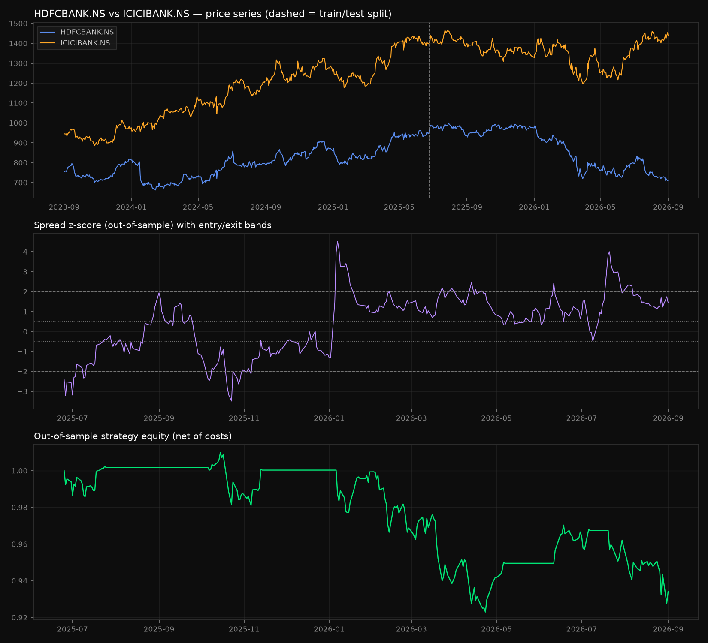

---

### AXISBANK.NS / ICICIBANK.NS

- **Latest prices:** AXISBANK.NS ₹1,258.00 · ICICIBANK.NS ₹1,438.00
- **Hedge ratio (train-fitted):** 0.9804
- **Cointegration (train):** FAIL at 5% — ADF -0.83, p=0.8088
- **Persistence:** passed 5% in 0 of 44 real-data runs (strict tier: 0/44)
- **Spread half-life:** 140.9 days
- **Current z-score:** +0.79
- **Signal today:** watch (approaching band)
- ⚠️ _Pair did not cointegrate on training data. Any signal here is not statistically justified — observation only._

**Out-of-sample backtest** (beta frozen from train window):

| Metric | Value |
|---|---|
| Sharpe | -0.43 |
| Sortino | -0.43 |
| Annualised return | -3.98% |
| Annualised vol | 8.59% |
| Max drawdown | -7.60% |
| Round-trip trades | 5 |

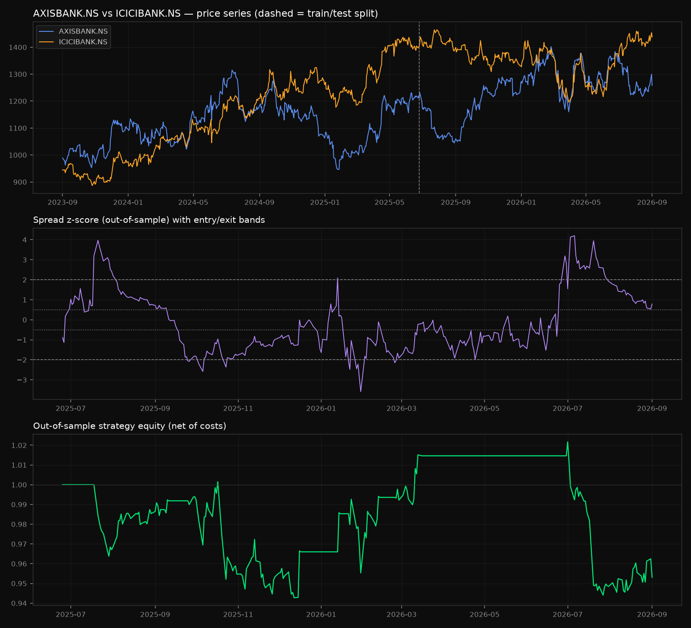

---

### KOTAKBANK.NS / HDFCBANK.NS

- **Latest prices:** KOTAKBANK.NS ₹425.00 · HDFCBANK.NS ₹711.90
- **Hedge ratio (train-fitted):** 2.0389
- **Cointegration (train):** FAIL at 5% — ADF -2.47, p=0.1221
- **Persistence:** passed 5% in 0 of 44 real-data runs (strict tier: 0/44)
- **Spread half-life:** 25.5 days
- **Current z-score:** -2.15
- **Signal today:** LONG spread (long HDFCBANK.NS, short KOTAKBANK.NS)
- ⚠️ _Pair did not cointegrate on training data. Any signal here is not statistically justified — observation only._

**Out-of-sample backtest** (beta frozen from train window):

| Metric | Value |
|---|---|
| Sharpe | 0.63 |
| Sortino | 0.45 |
| Annualised return | 3.91% |
| Annualised vol | 6.44% |
| Max drawdown | -4.21% |
| Round-trip trades | 6 |

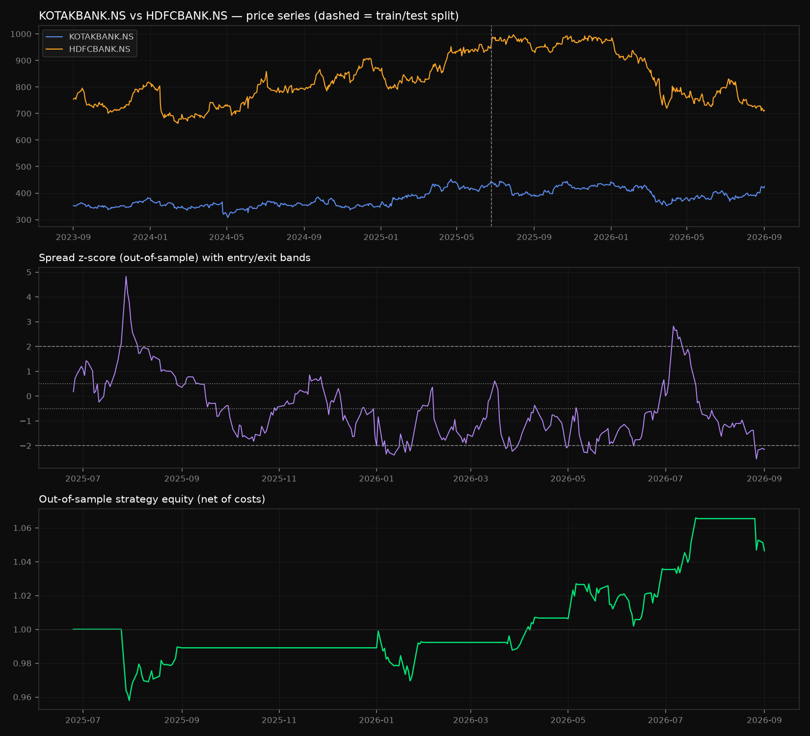

---

### SBIN.NS / BANKBARODA.NS

- **Latest prices:** SBIN.NS ₹1,034.50 · BANKBARODA.NS ₹237.70
- **Hedge ratio (train-fitted):** 0.1937
- **Cointegration (train):** FAIL at 5% — ADF -2.43, p=0.1333
- **Persistence:** passed 5% in 0 of 44 real-data runs (strict tier: 0/44)
- **Spread half-life:** 20.6 days
- **Current z-score:** -0.99
- **Signal today:** watch (approaching band)
- ⚠️ _Pair did not cointegrate on training data. Any signal here is not statistically justified — observation only._

**Out-of-sample backtest** (beta frozen from train window):

| Metric | Value |
|---|---|
| Sharpe | -0.10 |
| Sortino | -0.08 |
| Annualised return | -1.31% |
| Annualised vol | 8.95% |
| Max drawdown | -8.89% |
| Round-trip trades | 4 |

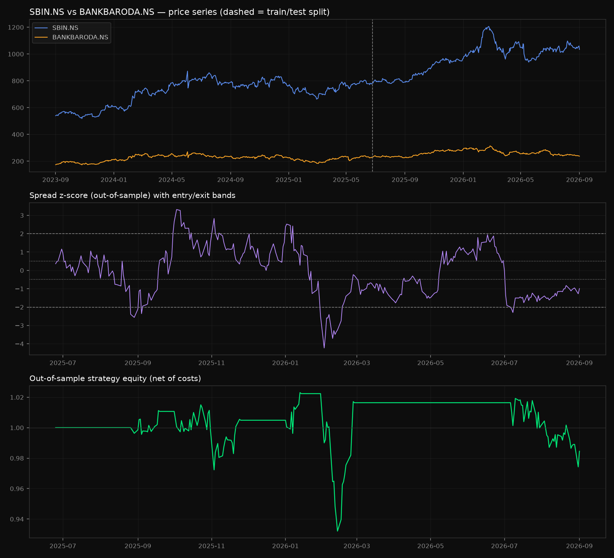

---

### TCS.NS / INFY.NS

- **Latest prices:** TCS.NS ₹2,369.00 · INFY.NS ₹1,156.00
- **Hedge ratio (train-fitted):** 0.4977
- **Cointegration (train):** FAIL at 5% — ADF -1.35, p=0.6083
- **Persistence:** passed 5% in 0 of 44 real-data runs (strict tier: 0/44)
- **Spread half-life:** 57.0 days
- **Current z-score:** -0.42
- **Signal today:** flat / no stretch
- ⚠️ _Pair did not cointegrate on training data. Any signal here is not statistically justified — observation only._

**Out-of-sample backtest** (beta frozen from train window):

| Metric | Value |
|---|---|
| Sharpe | 2.32 |
| Sortino | 2.37 |
| Annualised return | 9.90% |
| Annualised vol | 4.11% |
| Max drawdown | -1.32% |
| Round-trip trades | 8 |

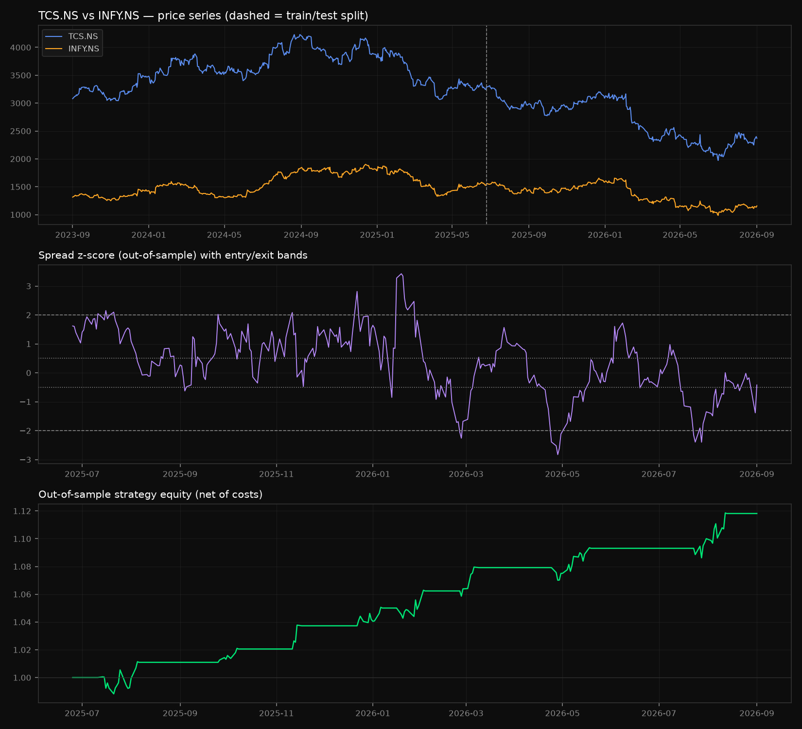

---

### INFY.NS / WIPRO.NS

- **Latest prices:** INFY.NS ₹1,156.00 · WIPRO.NS ₹181.70
- **Hedge ratio (train-fitted):** 0.1349
- **Cointegration (train):** FAIL at 5% — ADF -2.18, p=0.2140
- **Persistence:** passed 5% in 0 of 44 real-data runs (strict tier: 0/44)
- **Spread half-life:** 31.3 days
- **Current z-score:** -1.06
- **Signal today:** watch (approaching band)
- ⚠️ _Pair did not cointegrate on training data. Any signal here is not statistically justified — observation only._

**Out-of-sample backtest** (beta frozen from train window):

| Metric | Value |
|---|---|
| Sharpe | 1.68 |
| Sortino | 1.95 |
| Annualised return | 8.49% |
| Annualised vol | 4.93% |
| Max drawdown | -2.29% |
| Round-trip trades | 6 |

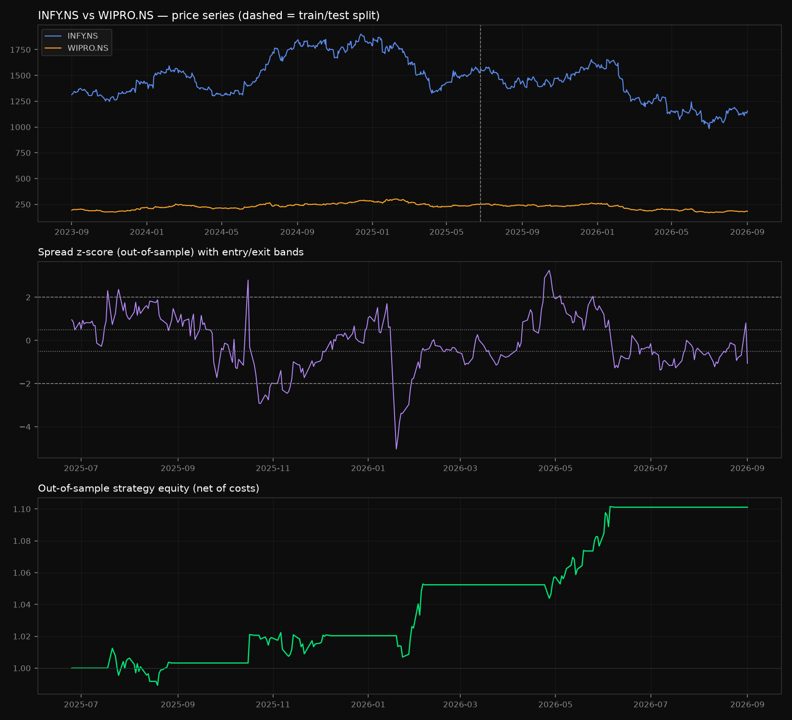

---

### HCLTECH.NS / TECHM.NS

- **Latest prices:** HCLTECH.NS ₹1,351.40 · TECHM.NS ₹1,638.00
- **Hedge ratio (train-fitted):** 0.8791
- **Cointegration (train):** FAIL at 5% — ADF -2.59, p=0.0941
- **Persistence:** passed 5% in 0 of 44 real-data runs (strict tier: 0/44)
- **Spread half-life:** 23.7 days
- **Current z-score:** +0.19
- **Signal today:** flat / no stretch
- ⚠️ _Pair did not cointegrate on training data. Any signal here is not statistically justified — observation only._

**Out-of-sample backtest** (beta frozen from train window):

| Metric | Value |
|---|---|
| Sharpe | 0.08 |
| Sortino | 0.07 |
| Annualised return | 0.28% |
| Annualised vol | 6.74% |
| Max drawdown | -7.62% |
| Round-trip trades | 5 |

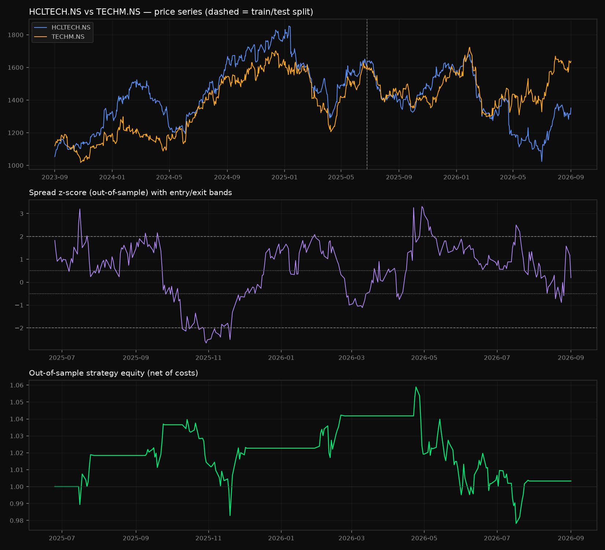

---

### ACC.NS / AMBUJACEM.NS

- **Latest prices:** ACC.NS ₹1,272.30 · AMBUJACEM.NS ₹402.20
- **Hedge ratio (train-fitted):** 0.2086
- **Cointegration (train):** FAIL at 5% — ADF -1.40, p=0.5830
- **Persistence:** passed 5% in 0 of 44 real-data runs (strict tier: 0/44)
- **Spread half-life:** 65.3 days
- **Current z-score:** -1.69
- **Signal today:** watch (approaching band)
- ⚠️ _Pair did not cointegrate on training data. Any signal here is not statistically justified — observation only._

**Out-of-sample backtest** (beta frozen from train window):

| Metric | Value |
|---|---|
| Sharpe | 0.53 |
| Sortino | 0.46 |
| Annualised return | 3.17% |
| Annualised vol | 6.20% |
| Max drawdown | -7.38% |
| Round-trip trades | 4 |

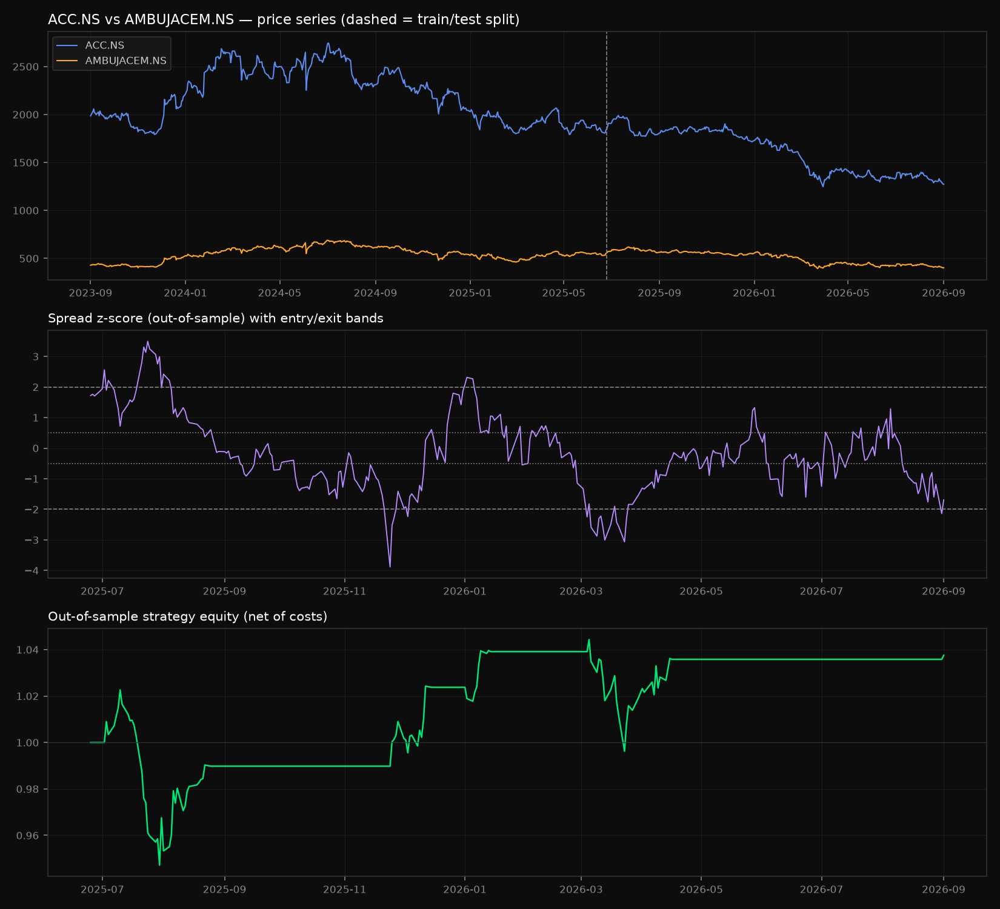

---

### ULTRACEMCO.NS / SHREECEM.NS

- **Latest prices:** ULTRACEMCO.NS ₹11,400.00 · SHREECEM.NS ₹23,490.00
- **Hedge ratio (train-fitted):** 0.6197
- **Cointegration (train):** FAIL at 5% — ADF -2.52, p=0.1110
- **Persistence:** passed 5% in 0 of 44 real-data runs (strict tier: 0/44)
- **Spread half-life:** 31.7 days
- **Current z-score:** -2.04
- **Signal today:** LONG spread (long SHREECEM.NS, short ULTRACEMCO.NS)
- ⚠️ _Pair did not cointegrate on training data. Any signal here is not statistically justified — observation only._

**Out-of-sample backtest** (beta frozen from train window):

| Metric | Value |
|---|---|
| Sharpe | 0.24 |
| Sortino | 0.25 |
| Annualised return | 1.66% |
| Annualised vol | 8.21% |
| Max drawdown | -9.71% |
| Round-trip trades | 5 |

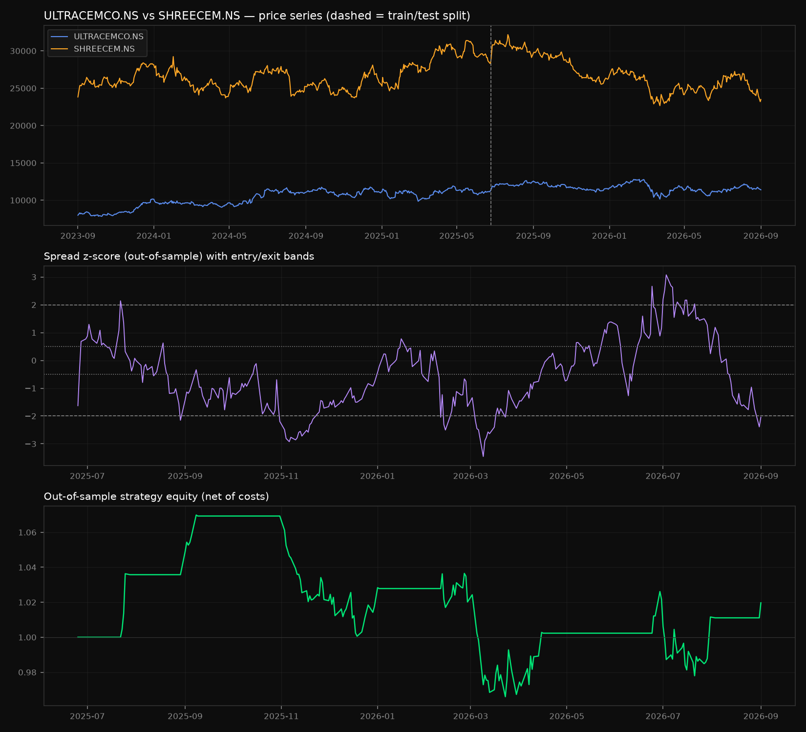

---

### IOC.NS / BPCL.NS

- **Latest prices:** IOC.NS ₹136.53 · BPCL.NS ₹317.65
- **Hedge ratio (train-fitted):** 1.7538
- **Cointegration (train):** FAIL at 5% — ADF -0.87, p=0.7979
- **Persistence:** passed 5% in 0 of 44 real-data runs (strict tier: 0/44)
- **Spread half-life:** 129.0 days
- **Current z-score:** +1.49
- **Signal today:** watch (approaching band)
- ⚠️ _Pair did not cointegrate on training data. Any signal here is not statistically justified — observation only._

**Out-of-sample backtest** (beta frozen from train window):

| Metric | Value |
|---|---|
| Sharpe | 0.42 |
| Sortino | 0.45 |
| Annualised return | 2.60% |
| Annualised vol | 6.63% |
| Max drawdown | -6.60% |
| Round-trip trades | 7 |

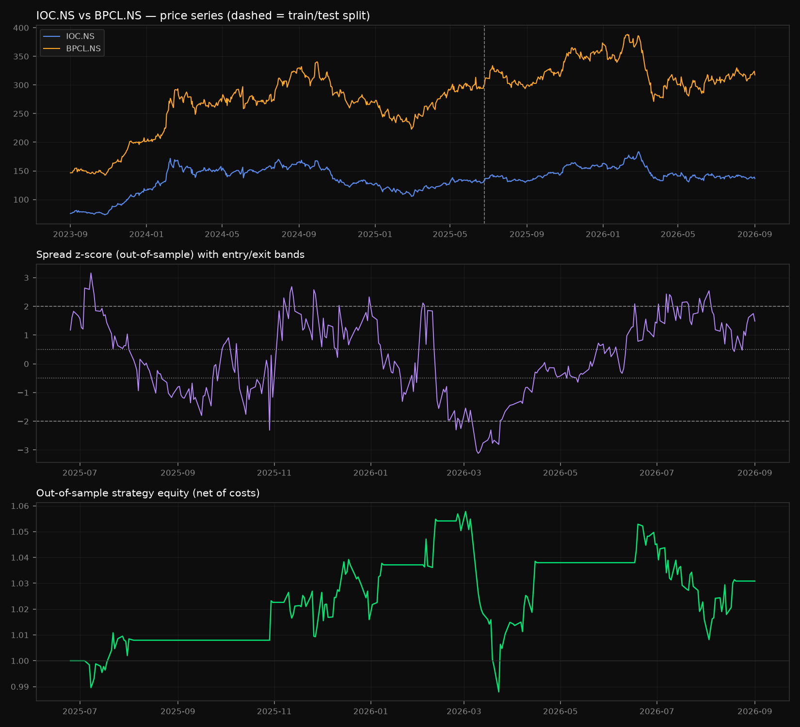

---

### BPCL.NS / HINDPETRO.NS

- **Latest prices:** BPCL.NS ₹317.65 · HINDPETRO.NS ₹363.10
- **Hedge ratio (train-fitted):** 1.3531
- **Cointegration (train):** FAIL at 5% — ADF -1.97, p=0.3010
- **Persistence:** passed 5% in 0 of 44 real-data runs (strict tier: 0/44)
- **Spread half-life:** 39.8 days
- **Current z-score:** -1.63
- **Signal today:** watch (approaching band)
- ⚠️ _Pair did not cointegrate on training data. Any signal here is not statistically justified — observation only._

**Out-of-sample backtest** (beta frozen from train window):

| Metric | Value |
|---|---|
| Sharpe | -0.09 |
| Sortino | -0.08 |
| Annualised return | -0.70% |
| Annualised vol | 5.96% |
| Max drawdown | -6.87% |
| Round-trip trades | 4 |

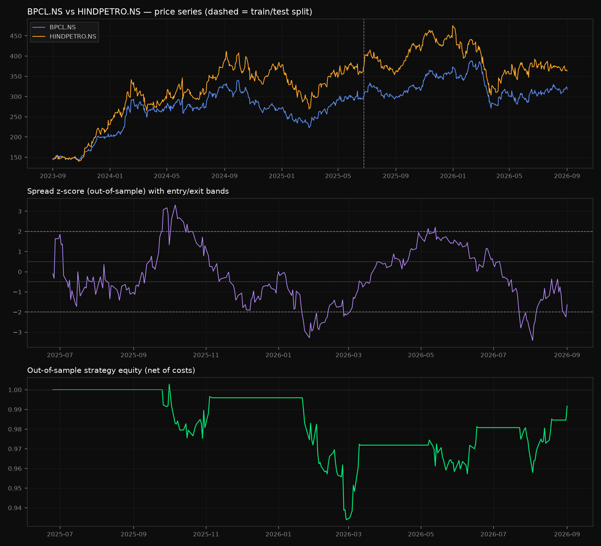

---

### ONGC.NS / COALINDIA.NS

- **Latest prices:** ONGC.NS ₹236.45 · COALINDIA.NS ₹401.60
- **Hedge ratio (train-fitted):** 1.5232
- **Cointegration (train):** PASS at 5% — ADF -3.77, p=0.0033
- **Persistence:** passed 5% in 36 of 44 real-data runs (strict tier: 1/44)
- **Spread half-life:** 11.3 days
- **Current z-score:** -0.99
- **Signal today:** watch (approaching band)

**Out-of-sample backtest** (beta frozen from train window):

| Metric | Value |
|---|---|
| Sharpe | 0.48 |
| Sortino | 0.35 |
| Annualised return | 3.23% |
| Annualised vol | 7.10% |
| Max drawdown | -5.96% |
| Round-trip trades | 4 |

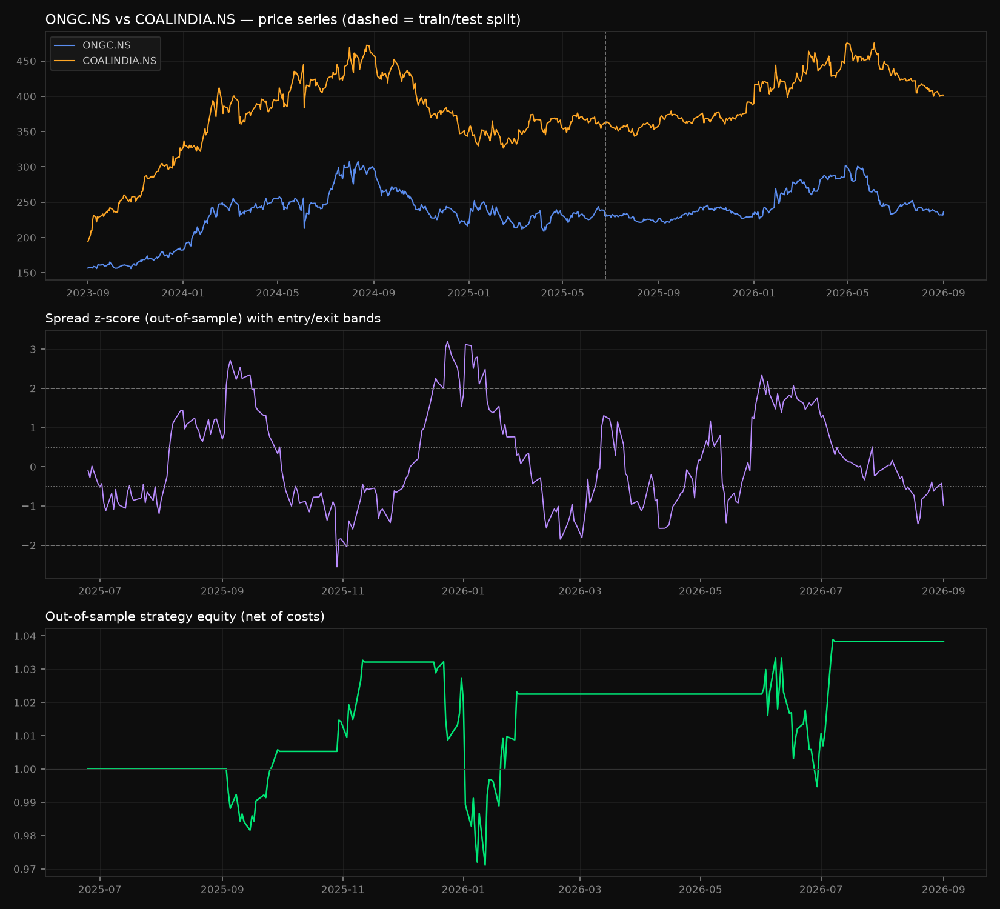

---

### NTPC.NS / POWERGRID.NS

- **Latest prices:** NTPC.NS ₹327.50 · POWERGRID.NS ₹264.55
- **Hedge ratio (train-fitted):** 0.8330
- **Cointegration (train):** FAIL at 5% — ADF -2.59, p=0.0946
- **Persistence:** passed 5% in 0 of 44 real-data runs (strict tier: 0/44)
- **Spread half-life:** 23.0 days
- **Current z-score:** +0.14
- **Signal today:** flat / no stretch
- ⚠️ _Pair did not cointegrate on training data. Any signal here is not statistically justified — observation only._

**Out-of-sample backtest** (beta frozen from train window):

| Metric | Value |
|---|---|
| Sharpe | 0.38 |
| Sortino | 0.29 |
| Annualised return | 1.99% |
| Annualised vol | 5.61% |
| Max drawdown | -5.35% |
| Round-trip trades | 6 |

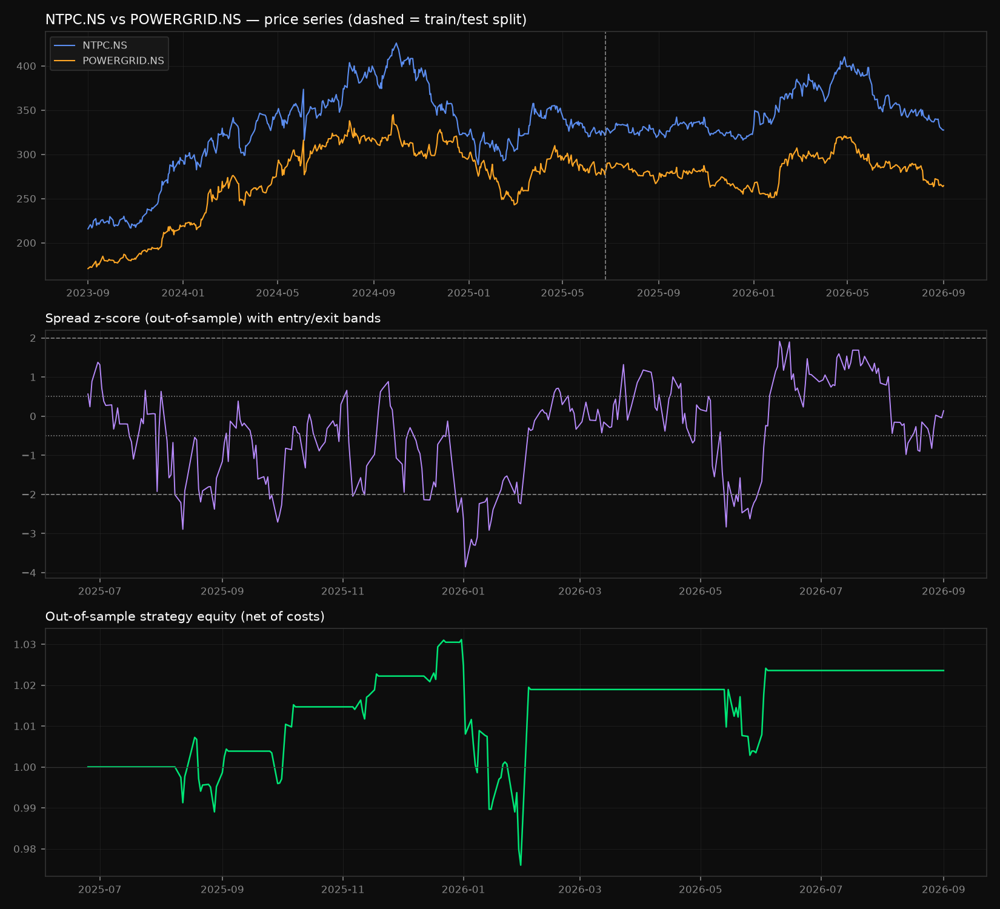

---

### BAJAJ-AUTO.NS / HEROMOTOCO.NS

- **Latest prices:** BAJAJ-AUTO.NS ₹12,361.00 · HEROMOTOCO.NS ₹5,555.00
- **Hedge ratio (train-fitted):** 0.4099
- **Cointegration (train):** FAIL at 5% — ADF -2.28, p=0.1782
- **Persistence:** passed 5% in 0 of 44 real-data runs (strict tier: 0/44)
- **Spread half-life:** 29.6 days
- **Current z-score:** -1.54
- **Signal today:** watch (approaching band)
- ⚠️ _Pair did not cointegrate on training data. Any signal here is not statistically justified — observation only._

**Out-of-sample backtest** (beta frozen from train window):

| Metric | Value |
|---|---|
| Sharpe | -0.86 |
| Sortino | -0.88 |
| Annualised return | -9.15% |
| Annualised vol | 10.47% |
| Max drawdown | -20.87% |
| Round-trip trades | 5 |

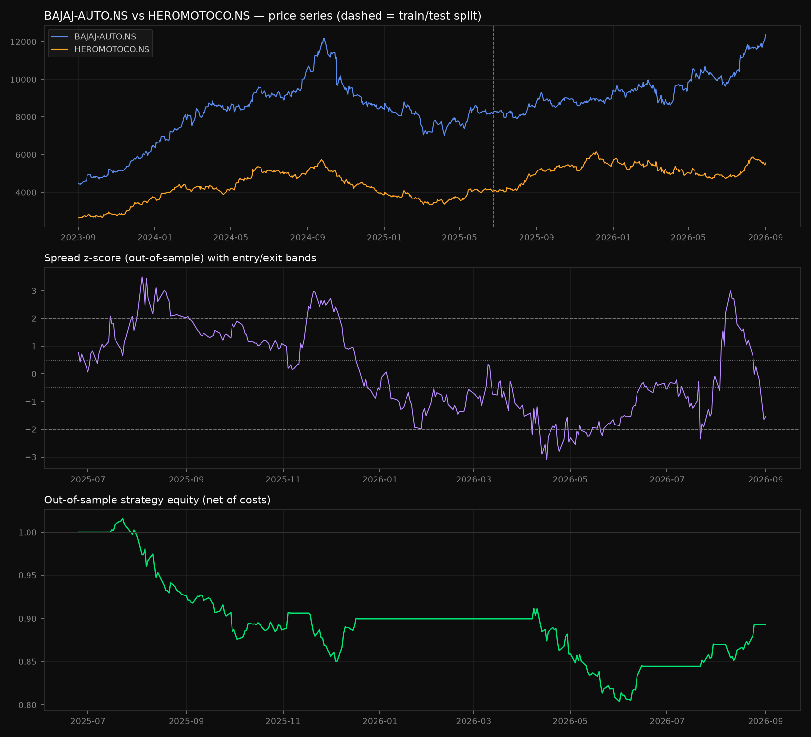

---

### TATASTEEL.NS / JSWSTEEL.NS

- **Latest prices:** TATASTEEL.NS ₹184.07 · JSWSTEEL.NS ₹1,313.50
- **Hedge ratio (train-fitted):** 3.0674
- **Cointegration (train):** FAIL at 5% — ADF -1.19, p=0.6765
- **Persistence:** passed 5% in 0 of 44 real-data runs (strict tier: 0/44)
- **Spread half-life:** 71.5 days
- **Current z-score:** +1.65
- **Signal today:** watch (approaching band)
- ⚠️ _Pair did not cointegrate on training data. Any signal here is not statistically justified — observation only._

**Out-of-sample backtest** (beta frozen from train window):

| Metric | Value |
|---|---|
| Sharpe | -0.18 |
| Sortino | -0.17 |
| Annualised return | -1.82% |
| Annualised vol | 8.15% |
| Max drawdown | -5.64% |
| Round-trip trades | 4 |

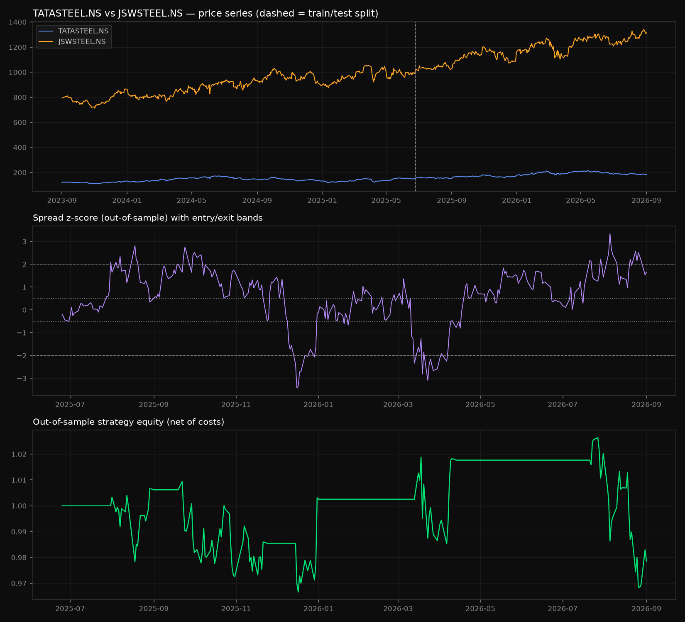

---

### SUNPHARMA.NS / CIPLA.NS

- **Latest prices:** SUNPHARMA.NS ₹1,929.00 · CIPLA.NS ₹1,423.00
- **Hedge ratio (train-fitted):** 0.4931
- **Cointegration (train):** PASS at 5% — ADF -3.41, p=0.0108
- **Persistence:** passed 5% in 44 of 44 real-data runs (strict tier: 5/44)
- **Spread half-life:** 10.7 days
- **Current z-score:** -0.73
- **Signal today:** watch (approaching band)

**Out-of-sample backtest** (beta frozen from train window):

| Metric | Value |
|---|---|
| Sharpe | -0.02 |
| Sortino | -0.02 |
| Annualised return | -0.46% |
| Annualised vol | 7.63% |
| Max drawdown | -10.28% |
| Round-trip trades | 4 |

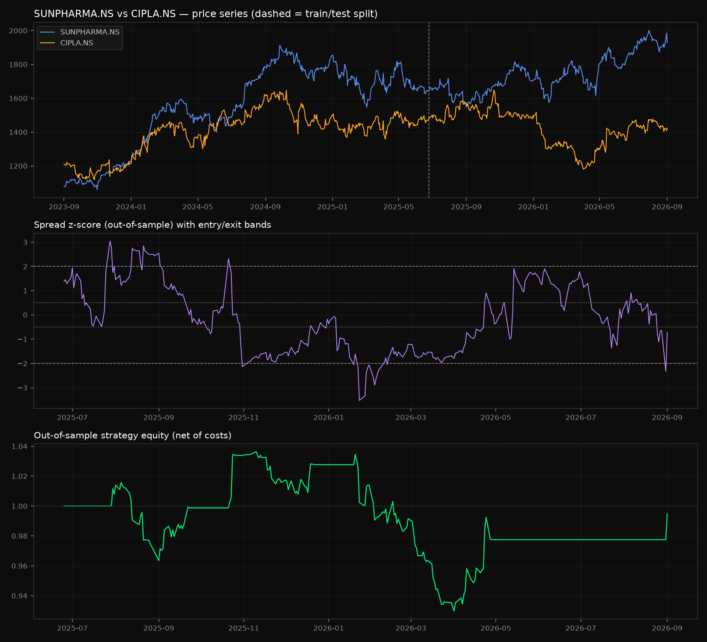

---

_Generated 2026-09-01 · pairs mean-reversion scanner · out-of-sample backtest · multiple-testing-aware · not investment advice._
