# Indian Pairs-Trading Scanner — 2026-09-02

> **What this is:** a market-neutral *pairs mean-reversion* scanner. It flags when two related NSE stocks have drifted apart far enough that their historical relationship signals a possible convergence trade. It does **not** forecast growth, rank "best" stocks, or predict company performance. A signal means the *spread between two stocks* is stretched — nothing about either stock being a good investment. Not investment advice; do your own research.

## Methodology (fixed in advance)

- **Universe:** 16 declared sector-mate pairs. Parameters (3y window, 60/40 train-test, z-entry 2.0, z-exit 0.5, 5 bps costs) are pre-registered; changes are logged in the README changelog *before* looking at results.
- **Multiple testing:** at the 5% level across 16 pairs, **≈0.8 false positives per run are expected by chance alone** even if nothing truly cointegrates. A single-day pass is a candidate, not a discovery.
- **Strict tier:** Bonferroni-corrected threshold p < 0.0031 (marked ✓✓).
- **Evidence = persistence:** the Persistence column counts how often each pair has passed the 5% test across all *real-data* daily runs recorded in `reports/history.csv`. Pairs deserve attention only when they pass persistently.

## Summary

| Pair | p-value | Coint. | Persistence | Current z | Signal | OOS Sharpe |
|---|---|---|---|---|---|---|
| HDFCBANK.NS/ICICIBANK.NS | 0.0939 | ✗ | 0/35 | +1.47 | watch | -0.77 |
| AXISBANK.NS/ICICIBANK.NS | 0.8199 | ✗ | 0/45 | +0.68 | watch | -0.40 |
| KOTAKBANK.NS/HDFCBANK.NS | 0.1246 | ✗ | 0/45 | -2.18 | LONG spread | 0.57 |
| SBIN.NS/BANKBARODA.NS | 0.1350 | ✗ | 0/45 | -0.57 | watch | -0.02 |
| TCS.NS/INFY.NS | 0.6263 | ✗ | 0/45 | -0.54 | watch | 2.32 |
| INFY.NS/WIPRO.NS | 0.2318 | ✗ | 0/45 | -1.88 | watch | 1.68 |
| HCLTECH.NS/TECHM.NS | 0.1037 | ✗ | 0/45 | +0.28 | flat / no stretch | 0.04 |
| ACC.NS/AMBUJACEM.NS | 0.5593 | ✗ | 0/45 | -1.38 | watch | 0.55 |
| ULTRACEMCO.NS/SHREECEM.NS | 0.1332 | ✗ | 0/45 | -1.81 | watch | 0.30 |
| IOC.NS/BPCL.NS | 0.8086 | ✗ | 0/45 | +1.63 | watch | 0.42 |
| BPCL.NS/HINDPETRO.NS | 0.3073 | ✗ | 0/45 | -2.16 | LONG spread | -0.21 |
| ONGC.NS/COALINDIA.NS | 0.0046 | ✓ | 37/45 | +0.23 | flat / no stretch | 0.48 |
| NTPC.NS/POWERGRID.NS | 0.0988 | ✗ | 0/45 | -0.43 | flat / no stretch | 0.38 |
| BAJAJ-AUTO.NS/HEROMOTOCO.NS | 0.1774 | ✗ | 0/45 | -2.36 | LONG spread | -0.86 |
| TATASTEEL.NS/JSWSTEEL.NS | 0.7051 | ✗ | 0/45 | +1.41 | watch | -0.14 |
| SUNPHARMA.NS/CIPLA.NS | 0.0116 | ✓ | 45/45 | -1.13 | watch | -0.08 |

_Legend: ✓✓ passes strict Bonferroni tier · ✓ passes 5% only · ✗ fails. Persistence = 5%-passes / real-data runs recorded. \*no real-data history yet._

---

### HDFCBANK.NS / ICICIBANK.NS

- **Latest prices:** HDFCBANK.NS ₹700.80 · ICICIBANK.NS ₹1,426.50
- **Hedge ratio (train-fitted):** 1.7388
- **Cointegration (train):** FAIL at 5% — ADF -2.60, p=0.0939
- **Persistence:** passed 5% in 0 of 35 real-data runs (strict tier: 0/35)
- **Spread half-life:** 26.5 days
- **Current z-score:** +1.47
- **Signal today:** watch (approaching band)
- ⚠️ _Pair did not cointegrate on training data. Any signal here is not statistically justified — observation only._

**Out-of-sample backtest** (beta frozen from train window):

| Metric | Value |
|---|---|
| Sharpe | -0.77 |
| Sortino | -0.83 |
| Annualised return | -5.13% |
| Annualised vol | 6.56% |
| Max drawdown | -8.47% |
| Round-trip trades | 4 |

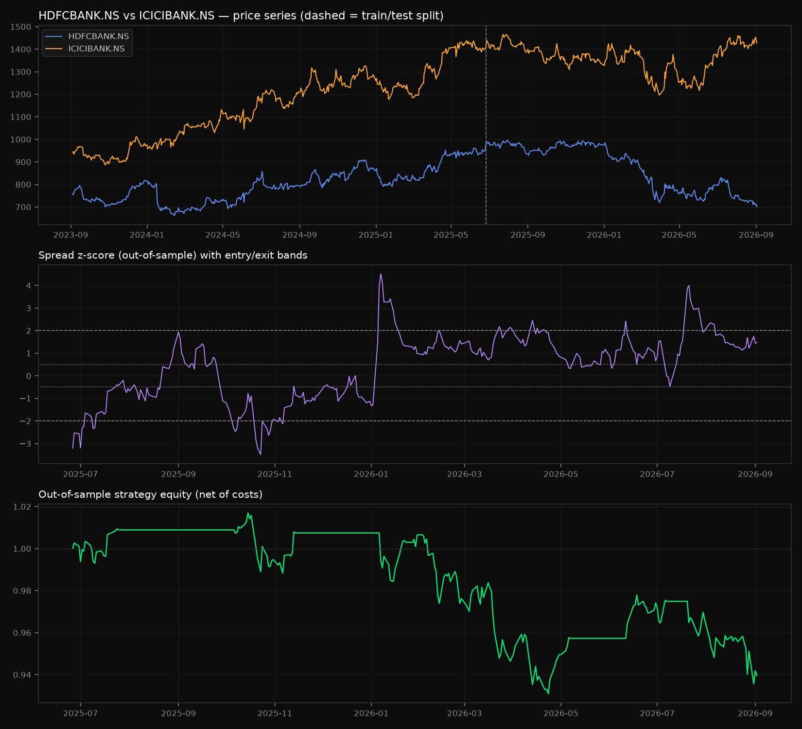

---

### AXISBANK.NS / ICICIBANK.NS

- **Latest prices:** AXISBANK.NS ₹1,253.90 · ICICIBANK.NS ₹1,426.50
- **Hedge ratio (train-fitted):** 0.9819
- **Cointegration (train):** FAIL at 5% — ADF -0.80, p=0.8199
- **Persistence:** passed 5% in 0 of 45 real-data runs (strict tier: 0/45)
- **Spread half-life:** 148.5 days
- **Current z-score:** +0.68
- **Signal today:** watch (approaching band)
- ⚠️ _Pair did not cointegrate on training data. Any signal here is not statistically justified — observation only._

**Out-of-sample backtest** (beta frozen from train window):

| Metric | Value |
|---|---|
| Sharpe | -0.40 |
| Sortino | -0.40 |
| Annualised return | -3.69% |
| Annualised vol | 8.49% |
| Max drawdown | -7.51% |
| Round-trip trades | 5 |

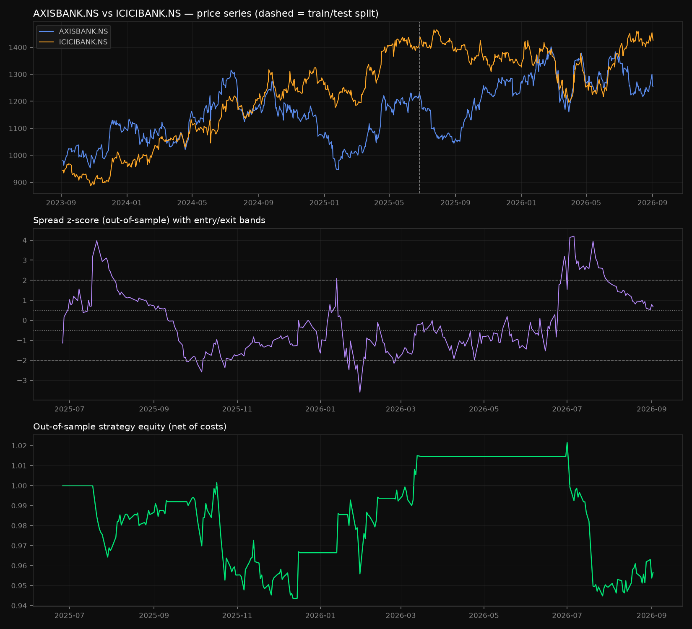

---

### KOTAKBANK.NS / HDFCBANK.NS

- **Latest prices:** KOTAKBANK.NS ₹423.50 · HDFCBANK.NS ₹700.80
- **Hedge ratio (train-fitted):** 2.0415
- **Cointegration (train):** FAIL at 5% — ADF -2.46, p=0.1246
- **Persistence:** passed 5% in 0 of 45 real-data runs (strict tier: 0/45)
- **Spread half-life:** 25.5 days
- **Current z-score:** -2.18
- **Signal today:** LONG spread (long HDFCBANK.NS, short KOTAKBANK.NS)
- ⚠️ _Pair did not cointegrate on training data. Any signal here is not statistically justified — observation only._

**Out-of-sample backtest** (beta frozen from train window):

| Metric | Value |
|---|---|
| Sharpe | 0.57 |
| Sortino | 0.42 |
| Annualised return | 3.49% |
| Annualised vol | 6.38% |
| Max drawdown | -4.16% |
| Round-trip trades | 6 |

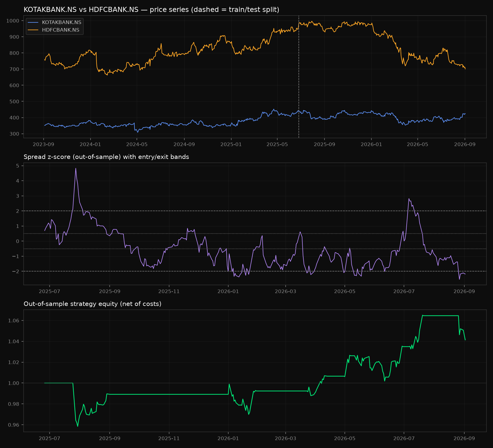

---

### SBIN.NS / BANKBARODA.NS

- **Latest prices:** SBIN.NS ₹1,020.90 · BANKBARODA.NS ₹241.20
- **Hedge ratio (train-fitted):** 0.1930
- **Cointegration (train):** FAIL at 5% — ADF -2.42, p=0.1350
- **Persistence:** passed 5% in 0 of 45 real-data runs (strict tier: 0/45)
- **Spread half-life:** 20.8 days
- **Current z-score:** -0.57
- **Signal today:** watch (approaching band)
- ⚠️ _Pair did not cointegrate on training data. Any signal here is not statistically justified — observation only._

**Out-of-sample backtest** (beta frozen from train window):

| Metric | Value |
|---|---|
| Sharpe | -0.02 |
| Sortino | -0.01 |
| Annualised return | -0.55% |
| Annualised vol | 9.11% |
| Max drawdown | -8.89% |
| Round-trip trades | 4 |

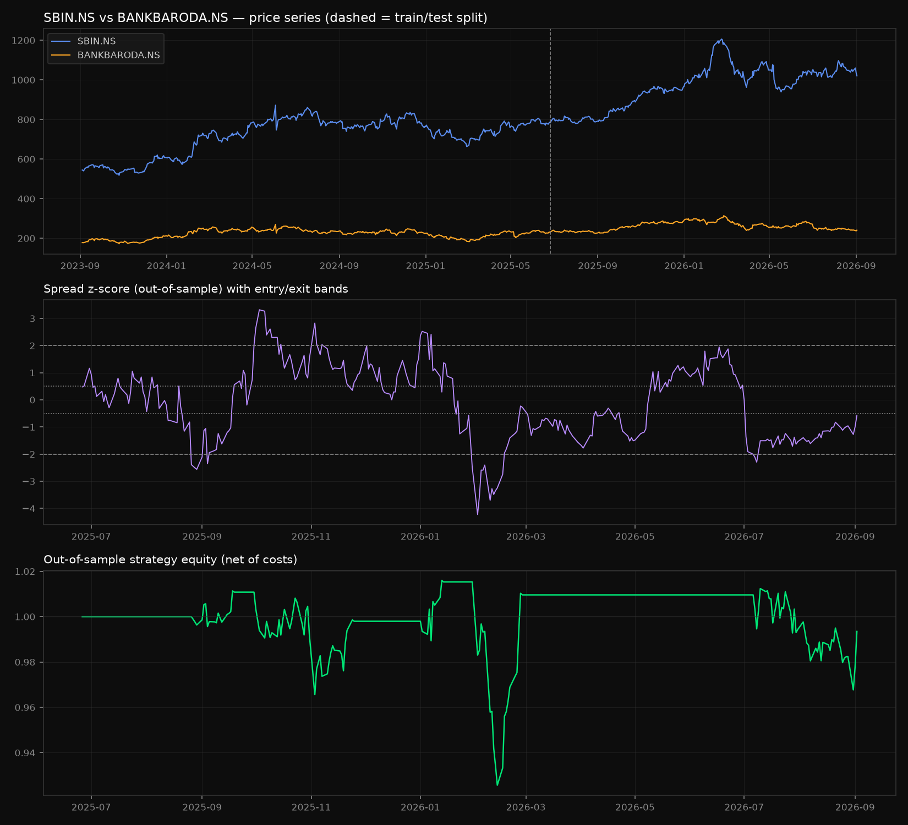

---

### TCS.NS / INFY.NS

- **Latest prices:** TCS.NS ₹2,348.00 · INFY.NS ₹1,140.00
- **Hedge ratio (train-fitted):** 0.4969
- **Cointegration (train):** FAIL at 5% — ADF -1.31, p=0.6263
- **Persistence:** passed 5% in 0 of 45 real-data runs (strict tier: 0/45)
- **Spread half-life:** 58.2 days
- **Current z-score:** -0.54
- **Signal today:** watch (approaching band)
- ⚠️ _Pair did not cointegrate on training data. Any signal here is not statistically justified — observation only._

**Out-of-sample backtest** (beta frozen from train window):

| Metric | Value |
|---|---|
| Sharpe | 2.32 |
| Sortino | 2.38 |
| Annualised return | 9.92% |
| Annualised vol | 4.11% |
| Max drawdown | -1.32% |
| Round-trip trades | 8 |

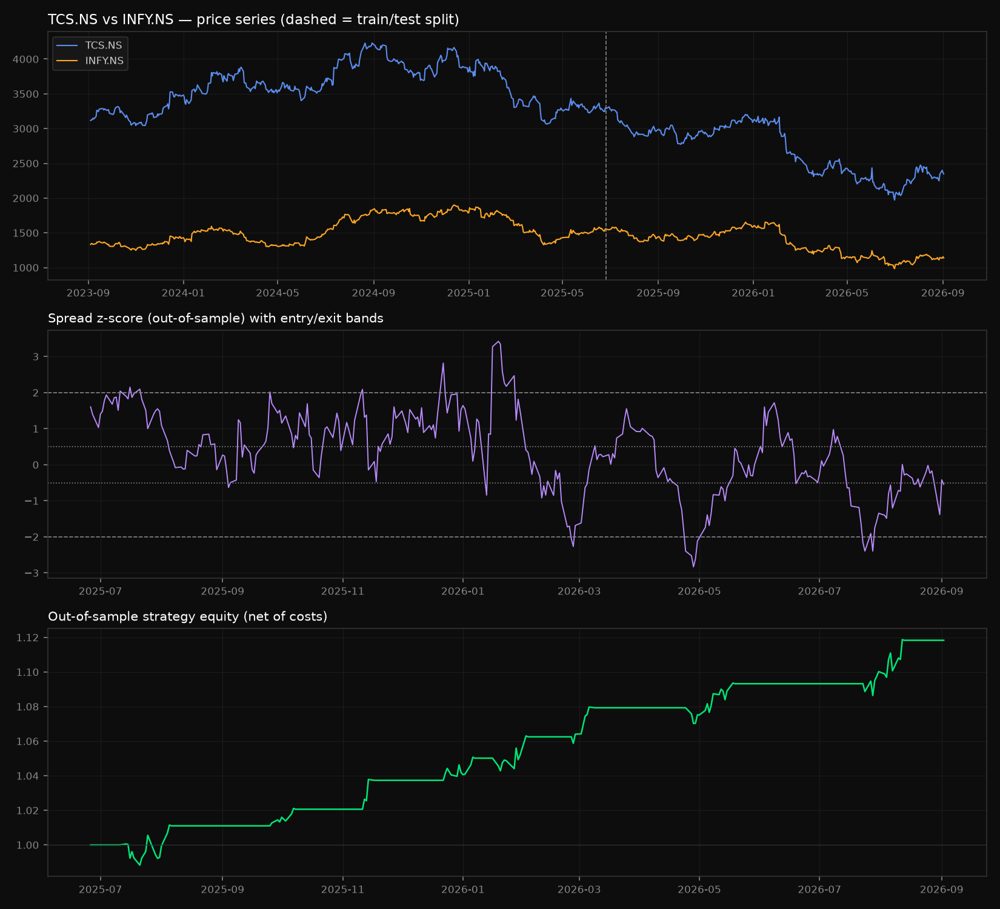

---

### INFY.NS / WIPRO.NS

- **Latest prices:** INFY.NS ₹1,140.00 · WIPRO.NS ₹177.09
- **Hedge ratio (train-fitted):** 0.1347
- **Cointegration (train):** FAIL at 5% — ADF -2.13, p=0.2318
- **Persistence:** passed 5% in 0 of 45 real-data runs (strict tier: 0/45)
- **Spread half-life:** 32.1 days
- **Current z-score:** -1.88
- **Signal today:** watch (approaching band)
- ⚠️ _Pair did not cointegrate on training data. Any signal here is not statistically justified — observation only._

**Out-of-sample backtest** (beta frozen from train window):

| Metric | Value |
|---|---|
| Sharpe | 1.68 |
| Sortino | 1.95 |
| Annualised return | 8.50% |
| Annualised vol | 4.93% |
| Max drawdown | -2.29% |
| Round-trip trades | 6 |

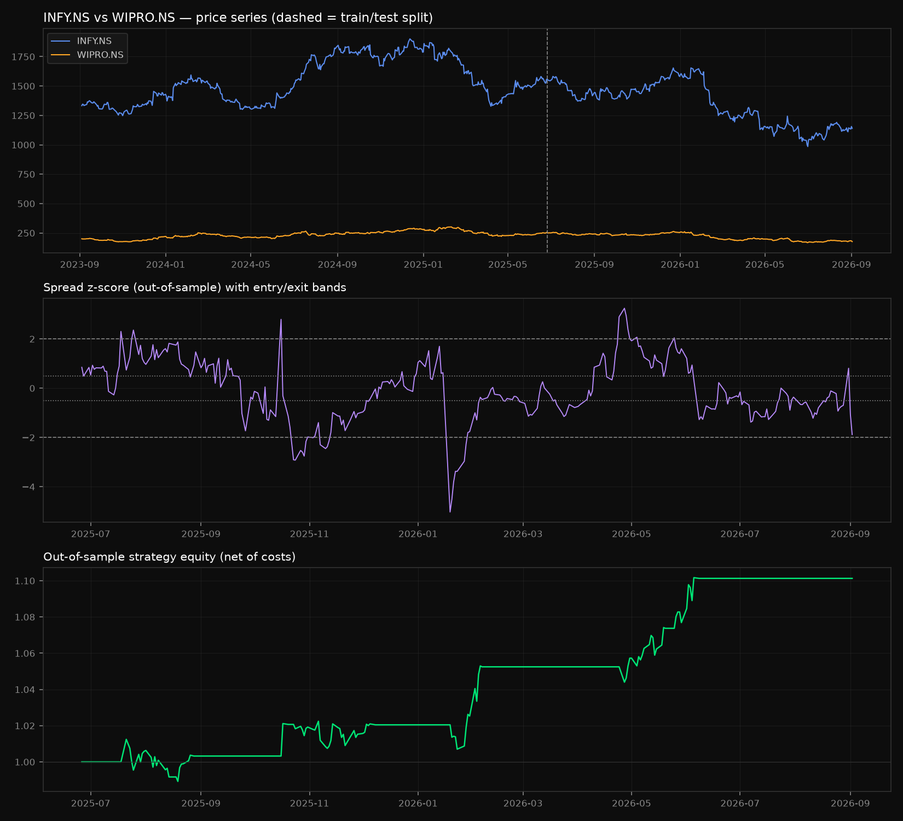

---

### HCLTECH.NS / TECHM.NS

- **Latest prices:** HCLTECH.NS ₹1,331.50 · TECHM.NS ₹1,623.00
- **Hedge ratio (train-fitted):** 0.8829
- **Cointegration (train):** FAIL at 5% — ADF -2.55, p=0.1037
- **Persistence:** passed 5% in 0 of 45 real-data runs (strict tier: 0/45)
- **Spread half-life:** 24.0 days
- **Current z-score:** +0.28
- **Signal today:** flat / no stretch
- ⚠️ _Pair did not cointegrate on training data. Any signal here is not statistically justified — observation only._

**Out-of-sample backtest** (beta frozen from train window):

| Metric | Value |
|---|---|
| Sharpe | 0.04 |
| Sortino | 0.04 |
| Annualised return | 0.06% |
| Annualised vol | 6.74% |
| Max drawdown | -7.62% |
| Round-trip trades | 5 |

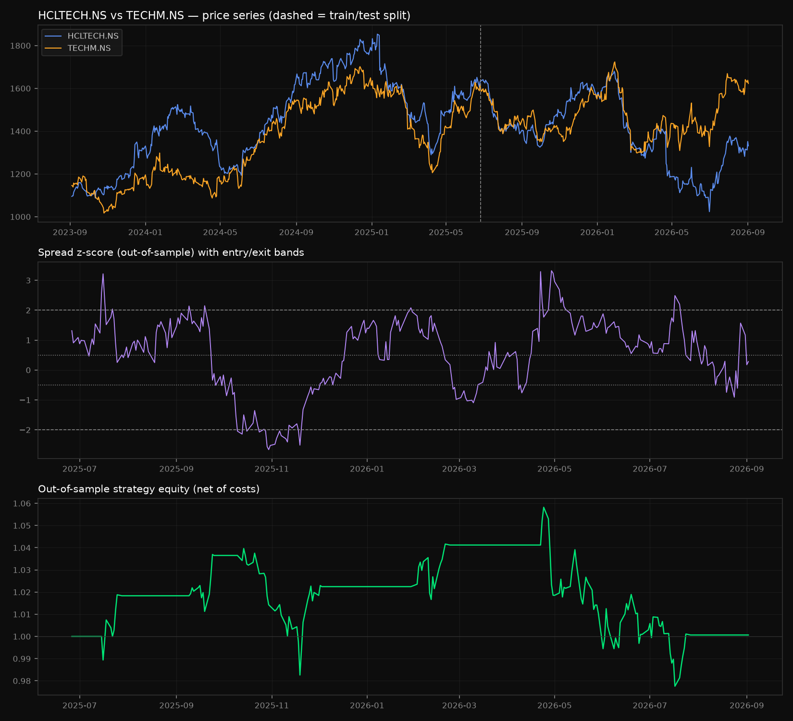

---

### ACC.NS / AMBUJACEM.NS

- **Latest prices:** ACC.NS ₹1,266.60 · AMBUJACEM.NS ₹402.70
- **Hedge ratio (train-fitted):** 0.2073
- **Cointegration (train):** FAIL at 5% — ADF -1.45, p=0.5593
- **Persistence:** passed 5% in 0 of 45 real-data runs (strict tier: 0/45)
- **Spread half-life:** 65.1 days
- **Current z-score:** -1.38
- **Signal today:** watch (approaching band)
- ⚠️ _Pair did not cointegrate on training data. Any signal here is not statistically justified — observation only._

**Out-of-sample backtest** (beta frozen from train window):

| Metric | Value |
|---|---|
| Sharpe | 0.55 |
| Sortino | 0.48 |
| Annualised return | 3.26% |
| Annualised vol | 6.13% |
| Max drawdown | -7.27% |
| Round-trip trades | 4 |

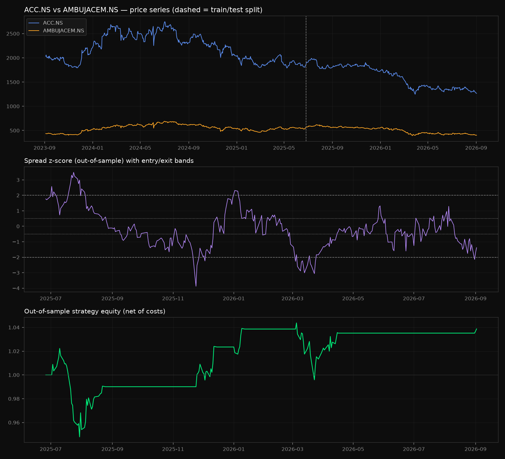

---

### ULTRACEMCO.NS / SHREECEM.NS

- **Latest prices:** ULTRACEMCO.NS ₹11,393.00 · SHREECEM.NS ₹23,680.00
- **Hedge ratio (train-fitted):** 0.6172
- **Cointegration (train):** FAIL at 5% — ADF -2.43, p=0.1332
- **Persistence:** passed 5% in 0 of 45 real-data runs (strict tier: 0/45)
- **Spread half-life:** 34.6 days
- **Current z-score:** -1.81
- **Signal today:** watch (approaching band)
- ⚠️ _Pair did not cointegrate on training data. Any signal here is not statistically justified — observation only._

**Out-of-sample backtest** (beta frozen from train window):

| Metric | Value |
|---|---|
| Sharpe | 0.30 |
| Sortino | 0.30 |
| Annualised return | 2.06% |
| Annualised vol | 7.98% |
| Max drawdown | -9.44% |
| Round-trip trades | 5 |

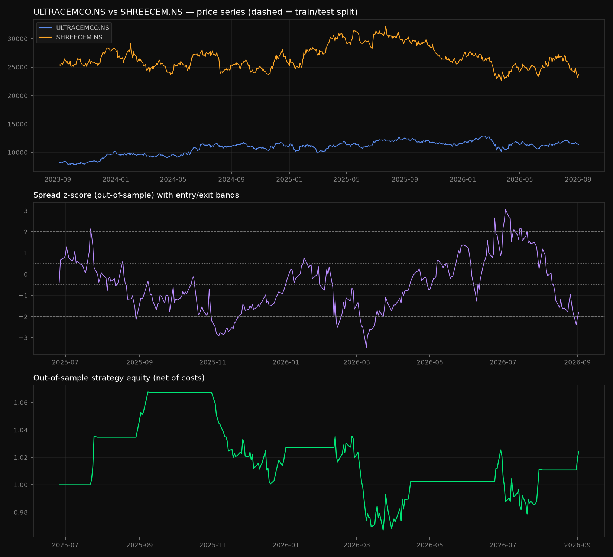

---

### IOC.NS / BPCL.NS

- **Latest prices:** IOC.NS ₹137.00 · BPCL.NS ₹319.60
- **Hedge ratio (train-fitted):** 1.7515
- **Cointegration (train):** FAIL at 5% — ADF -0.83, p=0.8086
- **Persistence:** passed 5% in 0 of 45 real-data runs (strict tier: 0/45)
- **Spread half-life:** 134.8 days
- **Current z-score:** +1.63
- **Signal today:** watch (approaching band)
- ⚠️ _Pair did not cointegrate on training data. Any signal here is not statistically justified — observation only._

**Out-of-sample backtest** (beta frozen from train window):

| Metric | Value |
|---|---|
| Sharpe | 0.42 |
| Sortino | 0.45 |
| Annualised return | 2.53% |
| Annualised vol | 6.44% |
| Max drawdown | -6.43% |
| Round-trip trades | 7 |

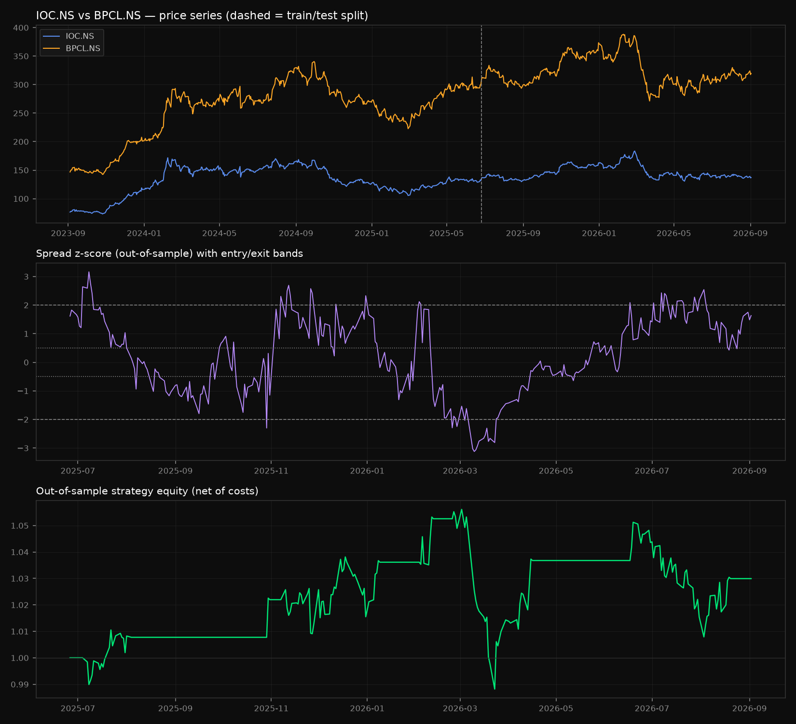

---

### BPCL.NS / HINDPETRO.NS

- **Latest prices:** BPCL.NS ₹319.60 · HINDPETRO.NS ₹359.00
- **Hedge ratio (train-fitted):** 1.3526
- **Cointegration (train):** FAIL at 5% — ADF -1.95, p=0.3073
- **Persistence:** passed 5% in 0 of 45 real-data runs (strict tier: 0/45)
- **Spread half-life:** 40.0 days
- **Current z-score:** -2.16
- **Signal today:** LONG spread (long HINDPETRO.NS, short BPCL.NS)
- ⚠️ _Pair did not cointegrate on training data. Any signal here is not statistically justified — observation only._

**Out-of-sample backtest** (beta frozen from train window):

| Metric | Value |
|---|---|
| Sharpe | -0.21 |
| Sortino | -0.19 |
| Annualised return | -1.39% |
| Annualised vol | 5.83% |
| Max drawdown | -6.67% |
| Round-trip trades | 4 |

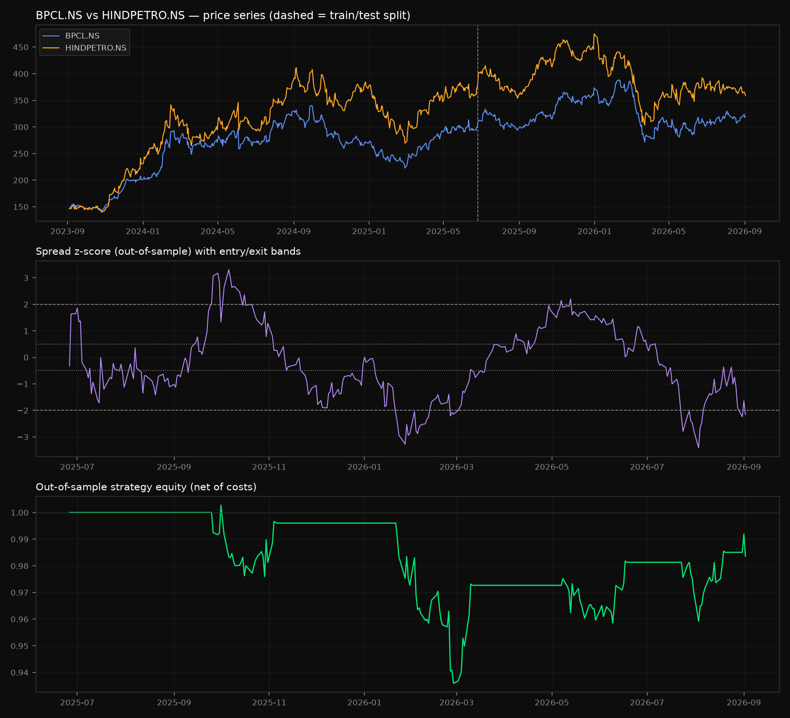

---

### ONGC.NS / COALINDIA.NS

- **Latest prices:** ONGC.NS ₹237.50 · COALINDIA.NS ₹417.85
- **Hedge ratio (train-fitted):** 1.5160
- **Cointegration (train):** PASS at 5% — ADF -3.67, p=0.0046
- **Persistence:** passed 5% in 37 of 45 real-data runs (strict tier: 1/45)
- **Spread half-life:** 11.6 days
- **Current z-score:** +0.23
- **Signal today:** flat / no stretch

**Out-of-sample backtest** (beta frozen from train window):

| Metric | Value |
|---|---|
| Sharpe | 0.48 |
| Sortino | 0.35 |
| Annualised return | 3.19% |
| Annualised vol | 7.04% |
| Max drawdown | -5.92% |
| Round-trip trades | 4 |

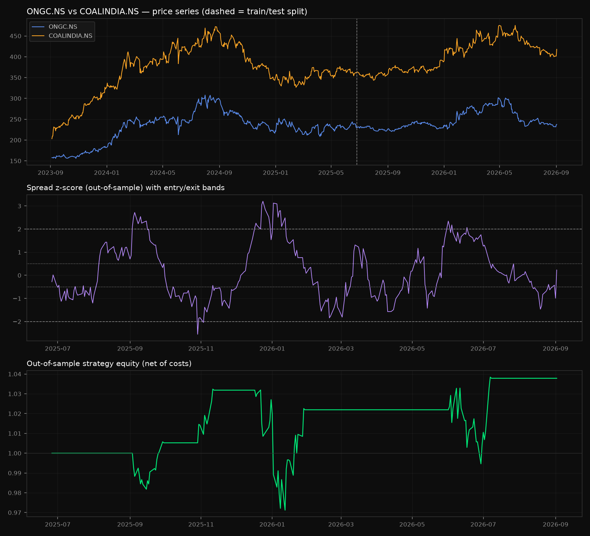

---

### NTPC.NS / POWERGRID.NS

- **Latest prices:** NTPC.NS ₹330.00 · POWERGRID.NS ₹266.80
- **Hedge ratio (train-fitted):** 0.8412
- **Cointegration (train):** FAIL at 5% — ADF -2.57, p=0.0988
- **Persistence:** passed 5% in 0 of 45 real-data runs (strict tier: 0/45)
- **Spread half-life:** 23.2 days
- **Current z-score:** -0.43
- **Signal today:** flat / no stretch
- ⚠️ _Pair did not cointegrate on training data. Any signal here is not statistically justified — observation only._

**Out-of-sample backtest** (beta frozen from train window):

| Metric | Value |
|---|---|
| Sharpe | 0.38 |
| Sortino | 0.29 |
| Annualised return | 1.97% |
| Annualised vol | 5.52% |
| Max drawdown | -5.27% |
| Round-trip trades | 6 |

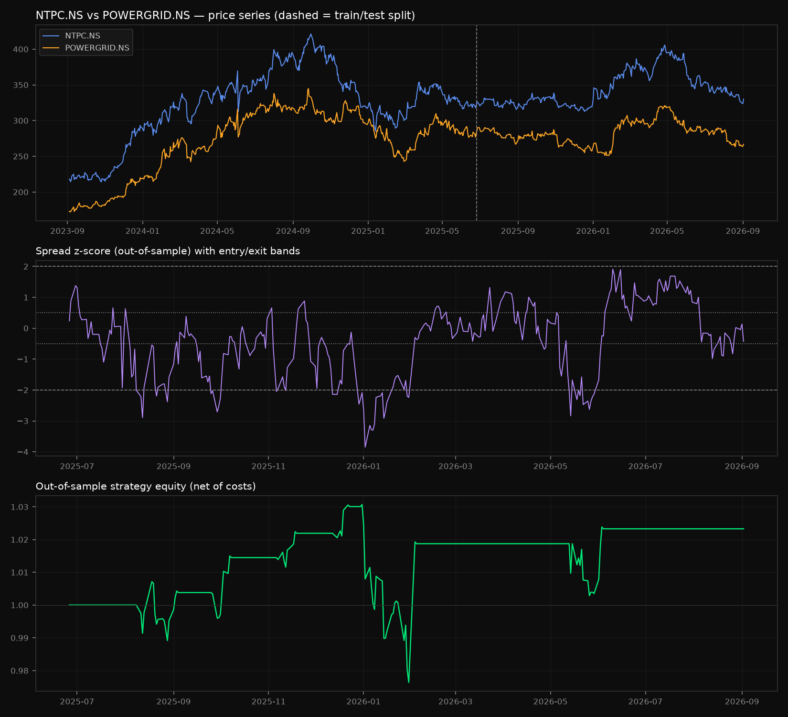

---

### BAJAJ-AUTO.NS / HEROMOTOCO.NS

- **Latest prices:** BAJAJ-AUTO.NS ₹12,130.00 · HEROMOTOCO.NS ₹5,300.00
- **Hedge ratio (train-fitted):** 0.4100
- **Cointegration (train):** FAIL at 5% — ADF -2.28, p=0.1774
- **Persistence:** passed 5% in 0 of 45 real-data runs (strict tier: 0/45)
- **Spread half-life:** 29.6 days
- **Current z-score:** -2.36
- **Signal today:** LONG spread (long HEROMOTOCO.NS, short BAJAJ-AUTO.NS)
- ⚠️ _Pair did not cointegrate on training data. Any signal here is not statistically justified — observation only._

**Out-of-sample backtest** (beta frozen from train window):

| Metric | Value |
|---|---|
| Sharpe | -0.86 |
| Sortino | -0.88 |
| Annualised return | -9.15% |
| Annualised vol | 10.48% |
| Max drawdown | -20.88% |
| Round-trip trades | 5 |

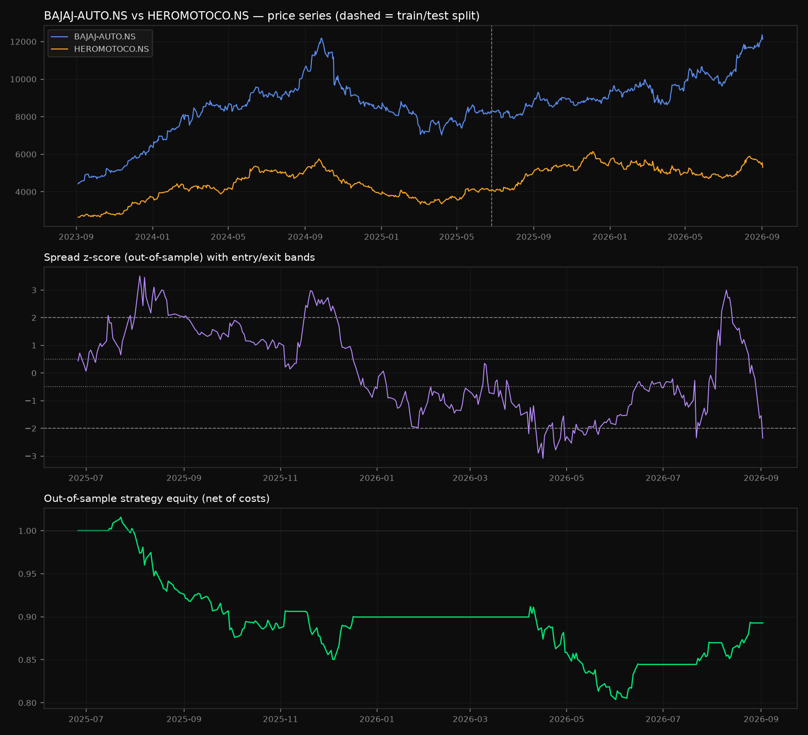

---

### TATASTEEL.NS / JSWSTEEL.NS

- **Latest prices:** TATASTEEL.NS ₹183.85 · JSWSTEEL.NS ₹1,306.00
- **Hedge ratio (train-fitted):** 3.0702
- **Cointegration (train):** FAIL at 5% — ADF -1.12, p=0.7051
- **Persistence:** passed 5% in 0 of 45 real-data runs (strict tier: 0/45)
- **Spread half-life:** 72.9 days
- **Current z-score:** +1.41
- **Signal today:** watch (approaching band)
- ⚠️ _Pair did not cointegrate on training data. Any signal here is not statistically justified — observation only._

**Out-of-sample backtest** (beta frozen from train window):

| Metric | Value |
|---|---|
| Sharpe | -0.14 |
| Sortino | -0.13 |
| Annualised return | -1.42% |
| Annualised vol | 8.05% |
| Max drawdown | -5.56% |
| Round-trip trades | 4 |

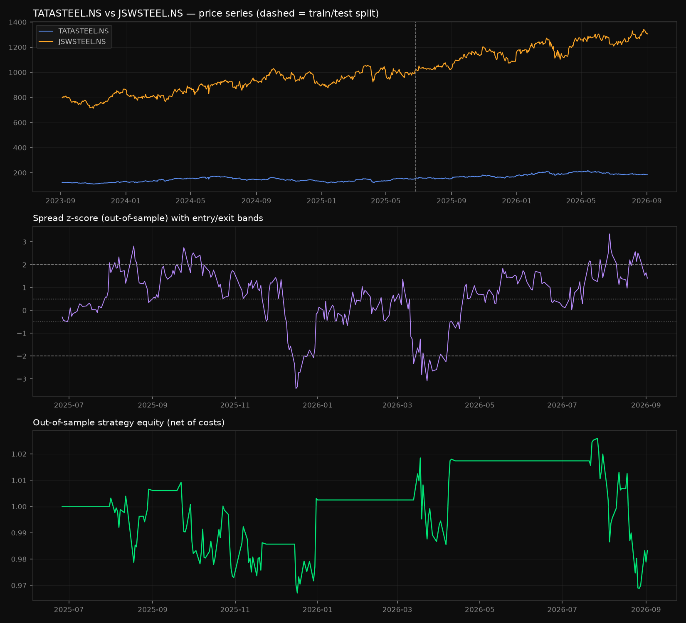

---

### SUNPHARMA.NS / CIPLA.NS

- **Latest prices:** SUNPHARMA.NS ₹1,931.70 · CIPLA.NS ₹1,412.80
- **Hedge ratio (train-fitted):** 0.4939
- **Cointegration (train):** PASS at 5% — ADF -3.38, p=0.0116
- **Persistence:** passed 5% in 45 of 45 real-data runs (strict tier: 5/45)
- **Spread half-life:** 10.7 days
- **Current z-score:** -1.13
- **Signal today:** watch (approaching band)

**Out-of-sample backtest** (beta frozen from train window):

| Metric | Value |
|---|---|
| Sharpe | -0.08 |
| Sortino | -0.08 |
| Annualised return | -0.88% |
| Annualised vol | 7.63% |
| Max drawdown | -10.27% |
| Round-trip trades | 4 |

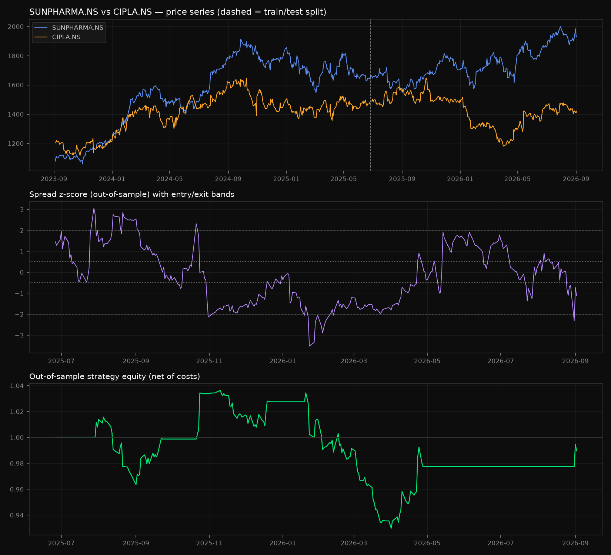

---

_Generated 2026-09-02 · pairs mean-reversion scanner · out-of-sample backtest · multiple-testing-aware · not investment advice._
