# Indian Pairs-Trading Scanner — 2026-09-03

> **What this is:** a market-neutral *pairs mean-reversion* scanner. It flags when two related NSE stocks have drifted apart far enough that their historical relationship signals a possible convergence trade. It does **not** forecast growth, rank "best" stocks, or predict company performance. A signal means the *spread between two stocks* is stretched — nothing about either stock being a good investment. Not investment advice; do your own research.

## Methodology (fixed in advance)

- **Universe:** 16 declared sector-mate pairs. Parameters (3y window, 60/40 train-test, z-entry 2.0, z-exit 0.5, 5 bps costs) are pre-registered; changes are logged in the README changelog *before* looking at results.
- **Multiple testing:** at the 5% level across 16 pairs, **≈0.8 false positives per run are expected by chance alone** even if nothing truly cointegrates. A single-day pass is a candidate, not a discovery.
- **Strict tier:** Bonferroni-corrected threshold p < 0.0031 (marked ✓✓).
- **Evidence = persistence:** the Persistence column counts how often each pair has passed the 5% test across all *real-data* daily runs recorded in `reports/history.csv`. Pairs deserve attention only when they pass persistently.

## Summary

| Pair | p-value | Coint. | Persistence | Current z | Signal | OOS Sharpe |
|---|---|---|---|---|---|---|
| HDFCBANK.NS/ICICIBANK.NS | 0.1001 | ✗ | 0/36 | +1.35 | watch | -0.78 |
| AXISBANK.NS/ICICIBANK.NS | 0.8106 | ✗ | 0/46 | +0.54 | watch | -0.36 |
| KOTAKBANK.NS/HDFCBANK.NS | 0.1304 | ✗ | 0/46 | -1.90 | watch | 0.64 |
| SBIN.NS/BANKBARODA.NS | 0.1335 | ✗ | 0/46 | -0.63 | watch | -0.05 |
| TCS.NS/INFY.NS | 0.6362 | ✗ | 0/46 | -0.40 | flat / no stretch | 2.33 |
| INFY.NS/WIPRO.NS | 0.2258 | ✗ | 0/46 | -1.86 | watch | 1.68 |
| HCLTECH.NS/TECHM.NS | 0.2113 | ✗ | 0/46 | -0.27 | flat / no stretch | 0.04 |
| ACC.NS/AMBUJACEM.NS | 0.5708 | ✗ | 0/46 | -1.20 | watch | 0.57 |
| ULTRACEMCO.NS/SHREECEM.NS | 0.1882 | ✗ | 0/46 | -1.51 | watch | 0.38 |
| IOC.NS/BPCL.NS | 0.8301 | ✗ | 0/46 | +1.47 | watch | 0.42 |
| BPCL.NS/HINDPETRO.NS | 0.3015 | ✗ | 0/46 | -1.90 | watch | -0.18 |
| ONGC.NS/COALINDIA.NS | 0.0046 | ✓ | 38/46 | +0.59 | watch | 0.48 |
| NTPC.NS/POWERGRID.NS | 0.0939 | ✗ | 0/46 | -0.81 | watch | 0.38 |
| BAJAJ-AUTO.NS/HEROMOTOCO.NS | 0.1800 | ✗ | 0/46 | -1.76 | watch | -0.76 |
| TATASTEEL.NS/JSWSTEEL.NS | 0.7005 | ✗ | 0/46 | +1.38 | watch | -0.15 |
| SUNPHARMA.NS/CIPLA.NS | 0.0117 | ✓ | 46/46 | -1.46 | watch | -0.13 |

_Legend: ✓✓ passes strict Bonferroni tier · ✓ passes 5% only · ✗ fails. Persistence = 5%-passes / real-data runs recorded. \*no real-data history yet._

---

### HDFCBANK.NS / ICICIBANK.NS

- **Latest prices:** HDFCBANK.NS ₹706.65 · ICICIBANK.NS ₹1,430.00
- **Hedge ratio (train-fitted):** 1.7351
- **Cointegration (train):** FAIL at 5% — ADF -2.57, p=0.1001
- **Persistence:** passed 5% in 0 of 36 real-data runs (strict tier: 0/36)
- **Spread half-life:** 26.8 days
- **Current z-score:** +1.35
- **Signal today:** watch (approaching band)
- ⚠️ _Pair did not cointegrate on training data. Any signal here is not statistically justified — observation only._

**Out-of-sample backtest** (beta frozen from train window):

| Metric | Value |
|---|---|
| Sharpe | -0.78 |
| Sortino | -0.85 |
| Annualised return | -5.15% |
| Annualised vol | 6.48% |
| Max drawdown | -8.36% |
| Round-trip trades | 4 |

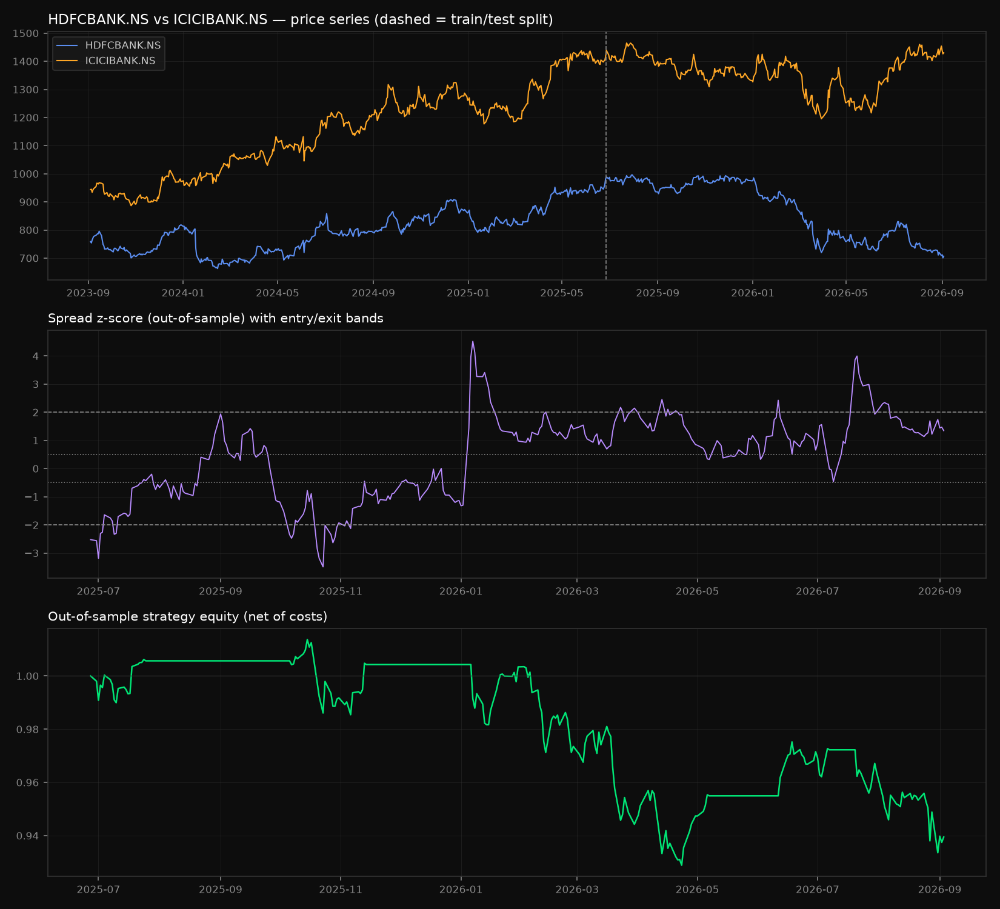

---

### AXISBANK.NS / ICICIBANK.NS

- **Latest prices:** AXISBANK.NS ₹1,267.00 · ICICIBANK.NS ₹1,430.00
- **Hedge ratio (train-fitted):** 0.9875
- **Cointegration (train):** FAIL at 5% — ADF -0.83, p=0.8106
- **Persistence:** passed 5% in 0 of 46 real-data runs (strict tier: 0/46)
- **Spread half-life:** 142.8 days
- **Current z-score:** +0.54
- **Signal today:** watch (approaching band)
- ⚠️ _Pair did not cointegrate on training data. Any signal here is not statistically justified — observation only._

**Out-of-sample backtest** (beta frozen from train window):

| Metric | Value |
|---|---|
| Sharpe | -0.36 |
| Sortino | -0.37 |
| Annualised return | -3.38% |
| Annualised vol | 8.46% |
| Max drawdown | -7.48% |
| Round-trip trades | 5 |

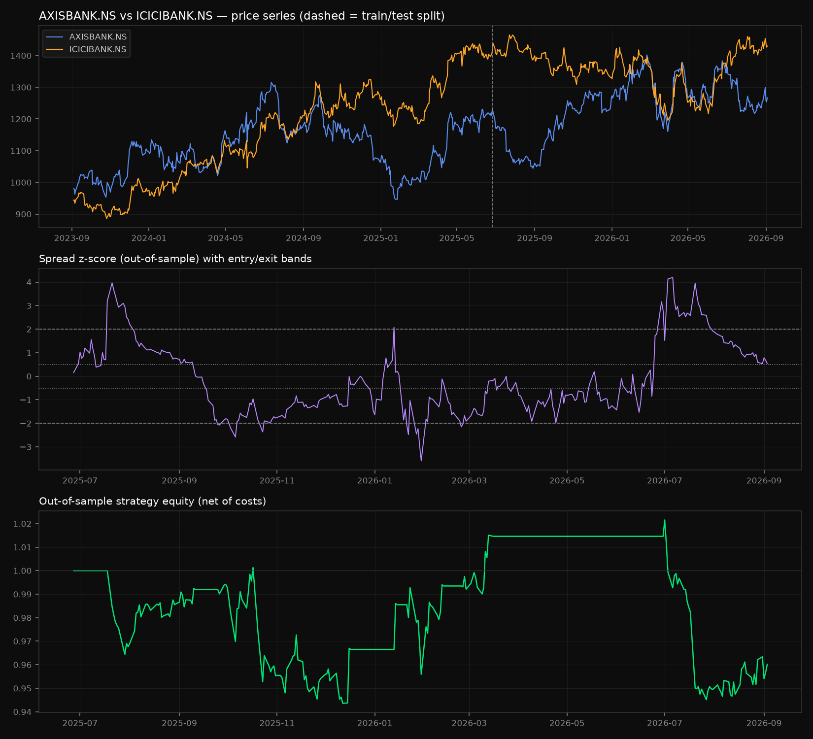

---

### KOTAKBANK.NS / HDFCBANK.NS

- **Latest prices:** KOTAKBANK.NS ₹421.15 · HDFCBANK.NS ₹706.65
- **Hedge ratio (train-fitted):** 2.0484
- **Cointegration (train):** FAIL at 5% — ADF -2.44, p=0.1304
- **Persistence:** passed 5% in 0 of 46 real-data runs (strict tier: 0/46)
- **Spread half-life:** 25.7 days
- **Current z-score:** -1.90
- **Signal today:** watch (approaching band)
- ⚠️ _Pair did not cointegrate on training data. Any signal here is not statistically justified — observation only._

**Out-of-sample backtest** (beta frozen from train window):

| Metric | Value |
|---|---|
| Sharpe | 0.64 |
| Sortino | 0.47 |
| Annualised return | 3.95% |
| Annualised vol | 6.37% |
| Max drawdown | -4.14% |
| Round-trip trades | 6 |

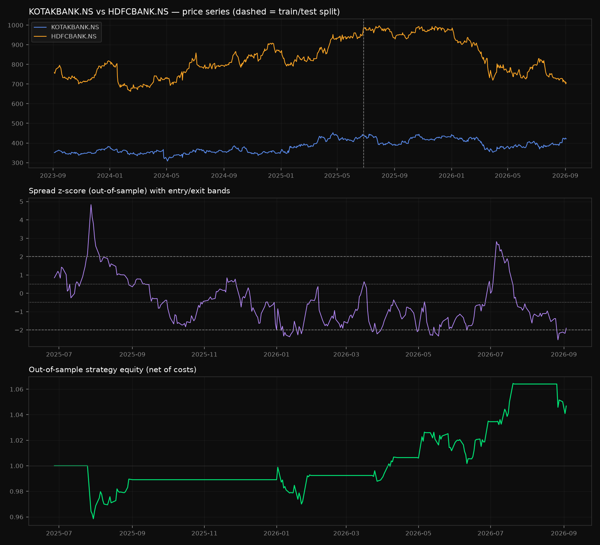

---

### SBIN.NS / BANKBARODA.NS

- **Latest prices:** SBIN.NS ₹1,023.40 · BANKBARODA.NS ₹240.44
- **Hedge ratio (train-fitted):** 0.1930
- **Cointegration (train):** FAIL at 5% — ADF -2.43, p=0.1335
- **Persistence:** passed 5% in 0 of 46 real-data runs (strict tier: 0/46)
- **Spread half-life:** 20.8 days
- **Current z-score:** -0.63
- **Signal today:** watch (approaching band)
- ⚠️ _Pair did not cointegrate on training data. Any signal here is not statistically justified — observation only._

**Out-of-sample backtest** (beta frozen from train window):

| Metric | Value |
|---|---|
| Sharpe | -0.05 |
| Sortino | -0.04 |
| Annualised return | -0.81% |
| Annualised vol | 9.03% |
| Max drawdown | -8.81% |
| Round-trip trades | 4 |

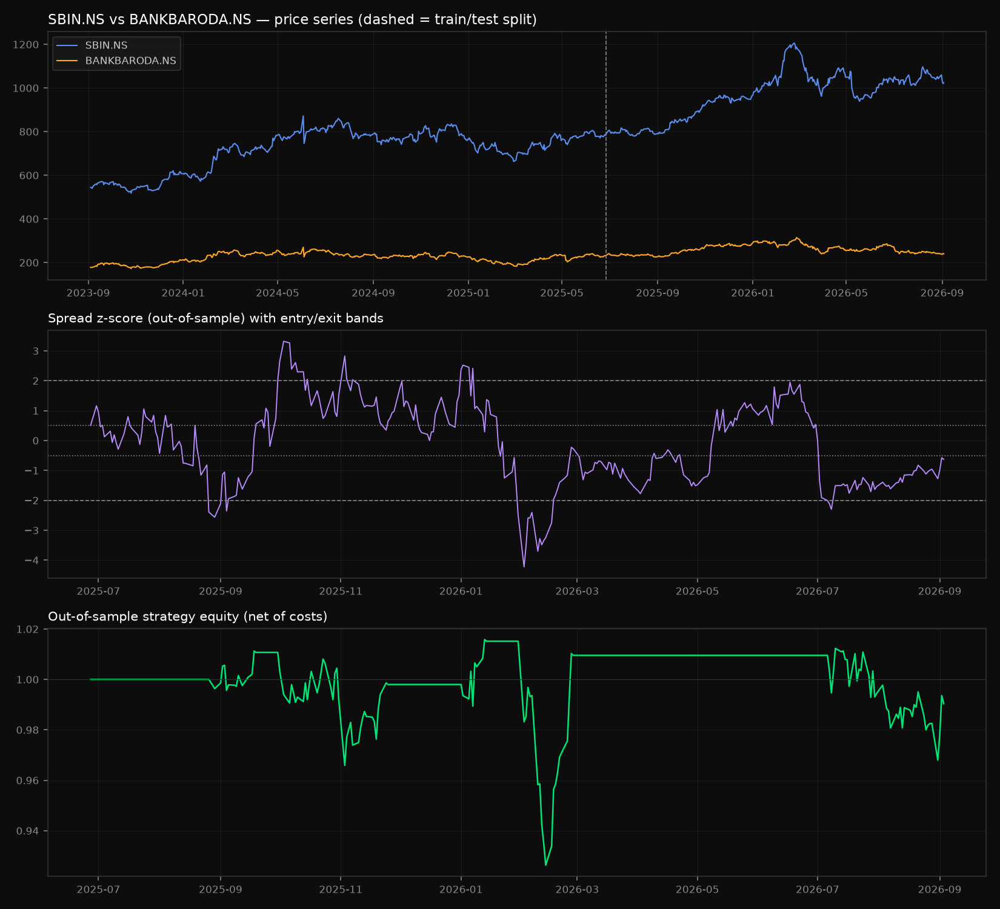

---

### TCS.NS / INFY.NS

- **Latest prices:** TCS.NS ₹2,320.10 · INFY.NS ₹1,130.30
- **Hedge ratio (train-fitted):** 0.4957
- **Cointegration (train):** FAIL at 5% — ADF -1.28, p=0.6362
- **Persistence:** passed 5% in 0 of 46 real-data runs (strict tier: 0/46)
- **Spread half-life:** 59.0 days
- **Current z-score:** -0.40
- **Signal today:** flat / no stretch
- ⚠️ _Pair did not cointegrate on training data. Any signal here is not statistically justified — observation only._

**Out-of-sample backtest** (beta frozen from train window):

| Metric | Value |
|---|---|
| Sharpe | 2.33 |
| Sortino | 2.38 |
| Annualised return | 9.96% |
| Annualised vol | 4.12% |
| Max drawdown | -1.32% |
| Round-trip trades | 8 |

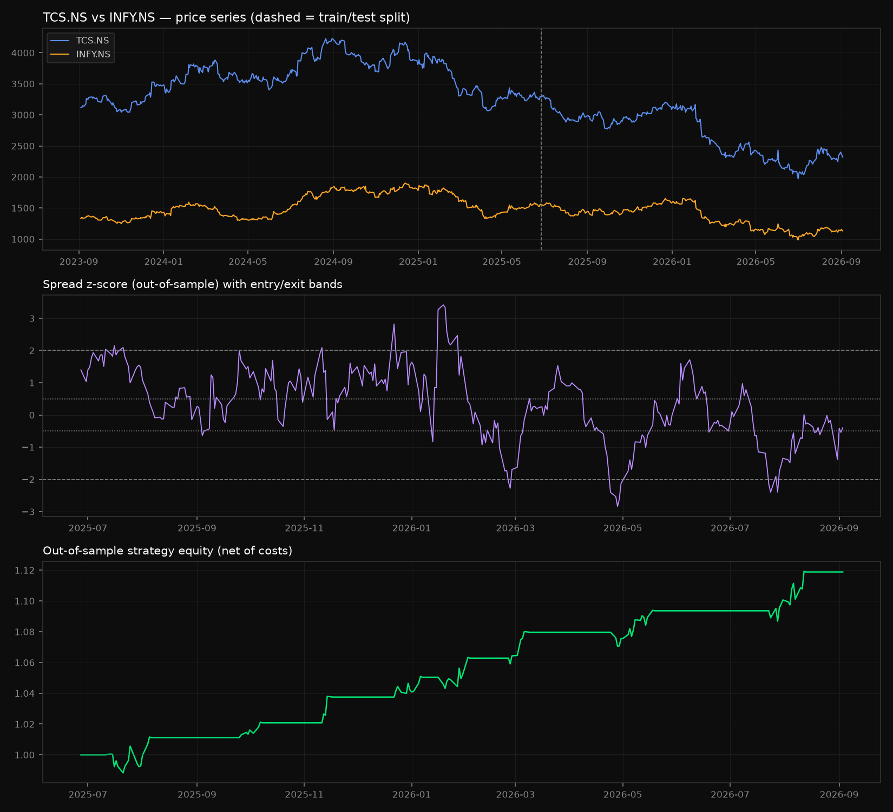

---

### INFY.NS / WIPRO.NS

- **Latest prices:** INFY.NS ₹1,130.30 · WIPRO.NS ₹175.72
- **Hedge ratio (train-fitted):** 0.1347
- **Cointegration (train):** FAIL at 5% — ADF -2.15, p=0.2258
- **Persistence:** passed 5% in 0 of 46 real-data runs (strict tier: 0/46)
- **Spread half-life:** 32.0 days
- **Current z-score:** -1.86
- **Signal today:** watch (approaching band)
- ⚠️ _Pair did not cointegrate on training data. Any signal here is not statistically justified — observation only._

**Out-of-sample backtest** (beta frozen from train window):

| Metric | Value |
|---|---|
| Sharpe | 1.68 |
| Sortino | 1.95 |
| Annualised return | 8.58% |
| Annualised vol | 4.98% |
| Max drawdown | -2.32% |
| Round-trip trades | 6 |

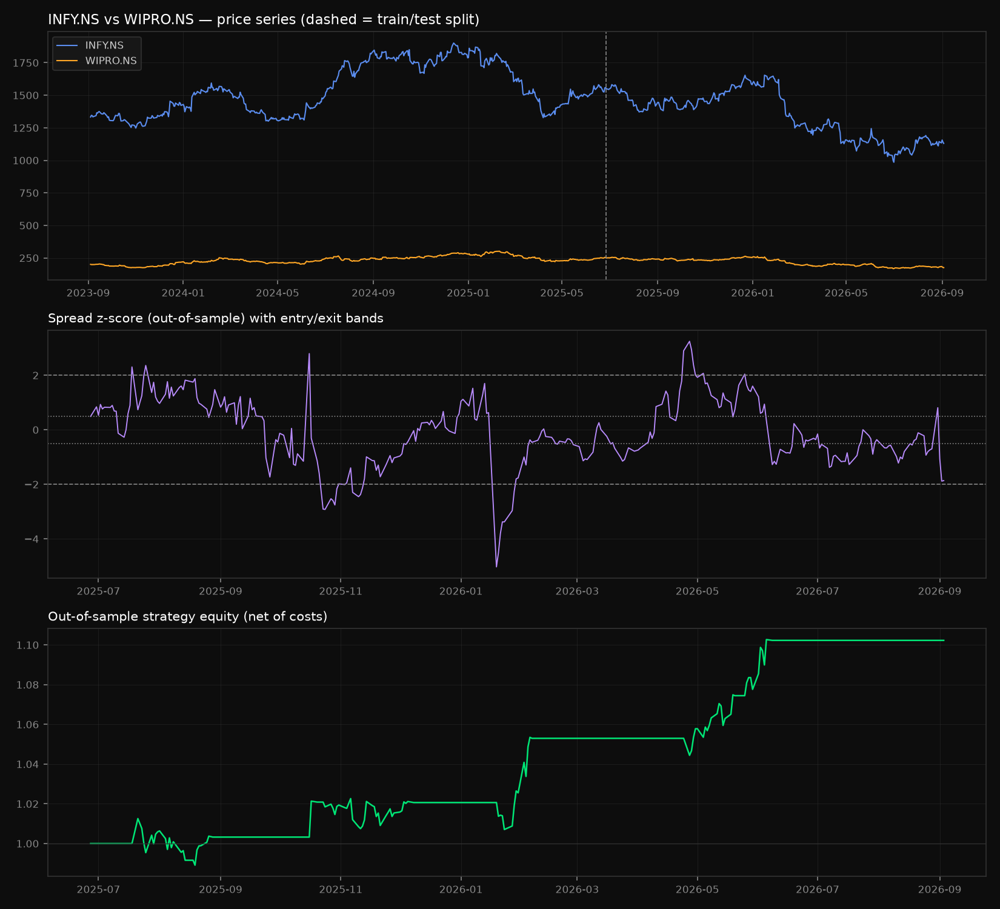

---

### HCLTECH.NS / TECHM.NS

- **Latest prices:** HCLTECH.NS ₹1,319.00 · TECHM.NS ₹1,598.00
- **Hedge ratio (train-fitted):** 0.8838
- **Cointegration (train):** FAIL at 5% — ADF -2.19, p=0.2113
- **Persistence:** passed 5% in 0 of 46 real-data runs (strict tier: 0/46)
- **Spread half-life:** 23.4 days
- **Current z-score:** -0.27
- **Signal today:** flat / no stretch
- ⚠️ _Pair did not cointegrate on training data. Any signal here is not statistically justified — observation only._

**Out-of-sample backtest** (beta frozen from train window):

| Metric | Value |
|---|---|
| Sharpe | 0.04 |
| Sortino | 0.04 |
| Annualised return | 0.04% |
| Annualised vol | 6.77% |
| Max drawdown | -7.66% |
| Round-trip trades | 5 |

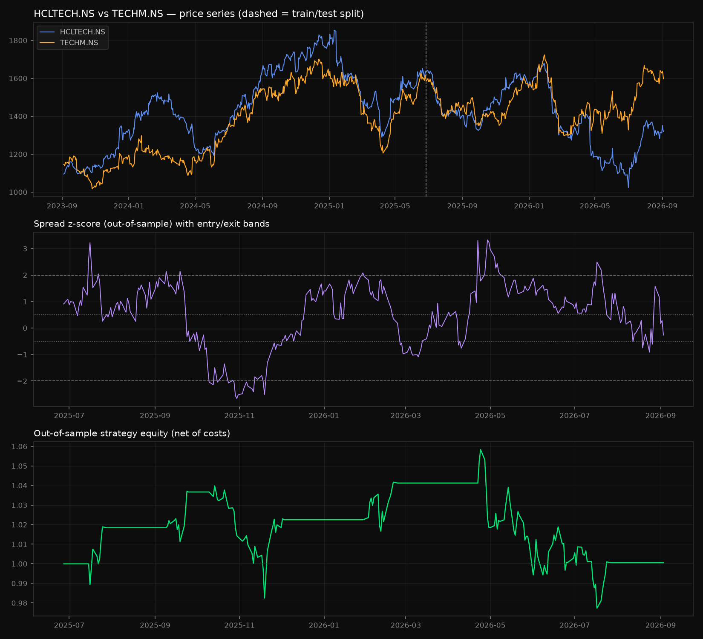

---

### ACC.NS / AMBUJACEM.NS

- **Latest prices:** ACC.NS ₹1,272.00 · AMBUJACEM.NS ₹405.00
- **Hedge ratio (train-fitted):** 0.2065
- **Cointegration (train):** FAIL at 5% — ADF -1.42, p=0.5708
- **Persistence:** passed 5% in 0 of 46 real-data runs (strict tier: 0/46)
- **Spread half-life:** 66.1 days
- **Current z-score:** -1.20
- **Signal today:** watch (approaching band)
- ⚠️ _Pair did not cointegrate on training data. Any signal here is not statistically justified — observation only._

**Out-of-sample backtest** (beta frozen from train window):

| Metric | Value |
|---|---|
| Sharpe | 0.57 |
| Sortino | 0.49 |
| Annualised return | 3.32% |
| Annualised vol | 6.04% |
| Max drawdown | -7.15% |
| Round-trip trades | 4 |

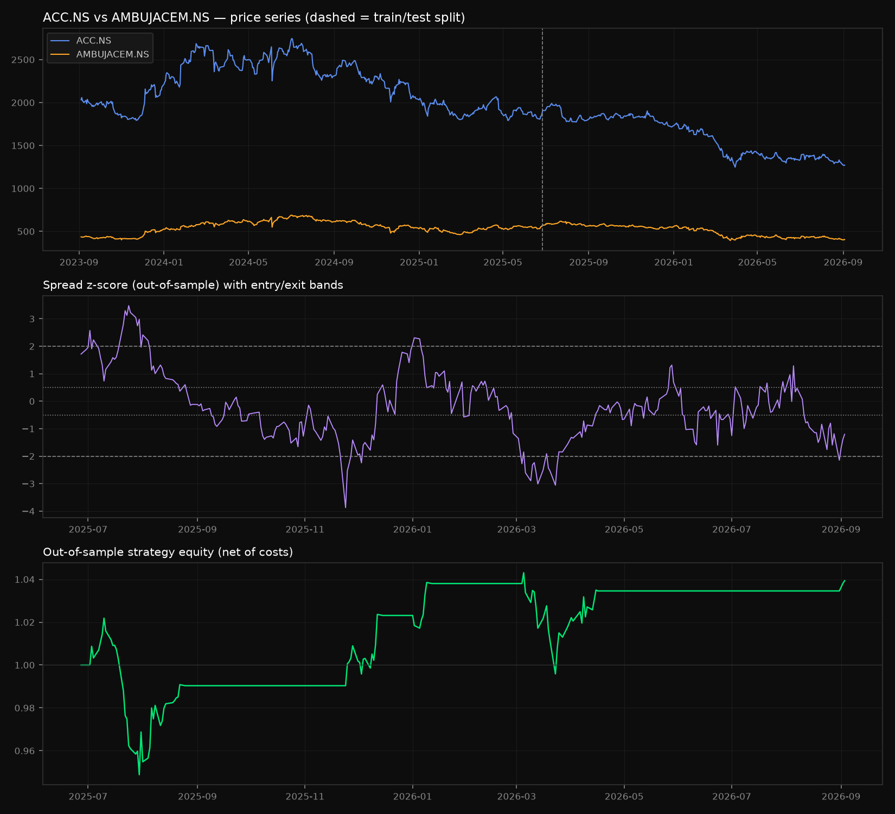

---

### ULTRACEMCO.NS / SHREECEM.NS

- **Latest prices:** ULTRACEMCO.NS ₹11,275.00 · SHREECEM.NS ₹23,910.00
- **Hedge ratio (train-fitted):** 0.6235
- **Cointegration (train):** FAIL at 5% — ADF -2.25, p=0.1882
- **Persistence:** passed 5% in 0 of 46 real-data runs (strict tier: 0/46)
- **Spread half-life:** 36.7 days
- **Current z-score:** -1.51
- **Signal today:** watch (approaching band)
- ⚠️ _Pair did not cointegrate on training data. Any signal here is not statistically justified — observation only._

**Out-of-sample backtest** (beta frozen from train window):

| Metric | Value |
|---|---|
| Sharpe | 0.38 |
| Sortino | 0.40 |
| Annualised return | 2.72% |
| Annualised vol | 7.75% |
| Max drawdown | -9.12% |
| Round-trip trades | 5 |

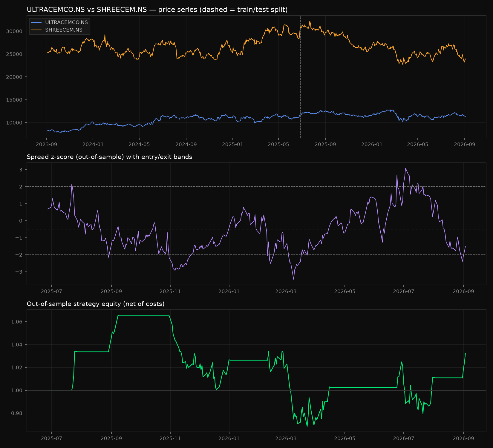

---

### IOC.NS / BPCL.NS

- **Latest prices:** IOC.NS ₹137.80 · BPCL.NS ₹320.05
- **Hedge ratio (train-fitted):** 1.7524
- **Cointegration (train):** FAIL at 5% — ADF -0.76, p=0.8301
- **Persistence:** passed 5% in 0 of 46 real-data runs (strict tier: 0/46)
- **Spread half-life:** 148.3 days
- **Current z-score:** +1.47
- **Signal today:** watch (approaching band)
- ⚠️ _Pair did not cointegrate on training data. Any signal here is not statistically justified — observation only._

**Out-of-sample backtest** (beta frozen from train window):

| Metric | Value |
|---|---|
| Sharpe | 0.42 |
| Sortino | 0.45 |
| Annualised return | 2.51% |
| Annualised vol | 6.38% |
| Max drawdown | -6.37% |
| Round-trip trades | 7 |

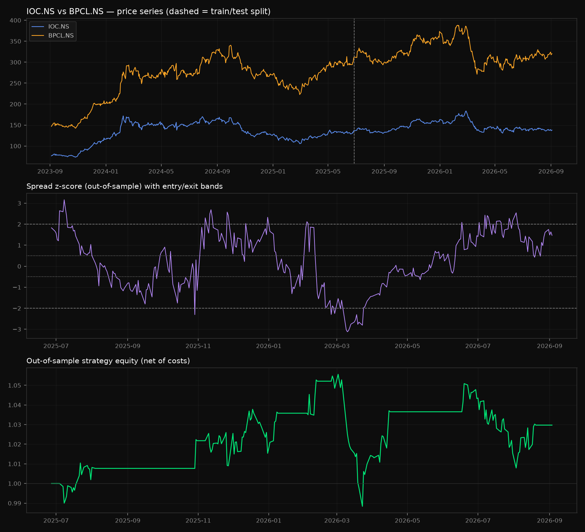

---

### BPCL.NS / HINDPETRO.NS

- **Latest prices:** BPCL.NS ₹320.05 · HINDPETRO.NS ₹361.35
- **Hedge ratio (train-fitted):** 1.3531
- **Cointegration (train):** FAIL at 5% — ADF -1.97, p=0.3015
- **Persistence:** passed 5% in 0 of 46 real-data runs (strict tier: 0/46)
- **Spread half-life:** 39.8 days
- **Current z-score:** -1.90
- **Signal today:** watch (approaching band)
- ⚠️ _Pair did not cointegrate on training data. Any signal here is not statistically justified — observation only._

**Out-of-sample backtest** (beta frozen from train window):

| Metric | Value |
|---|---|
| Sharpe | -0.18 |
| Sortino | -0.16 |
| Annualised return | -1.17% |
| Annualised vol | 5.68% |
| Max drawdown | -6.50% |
| Round-trip trades | 4 |

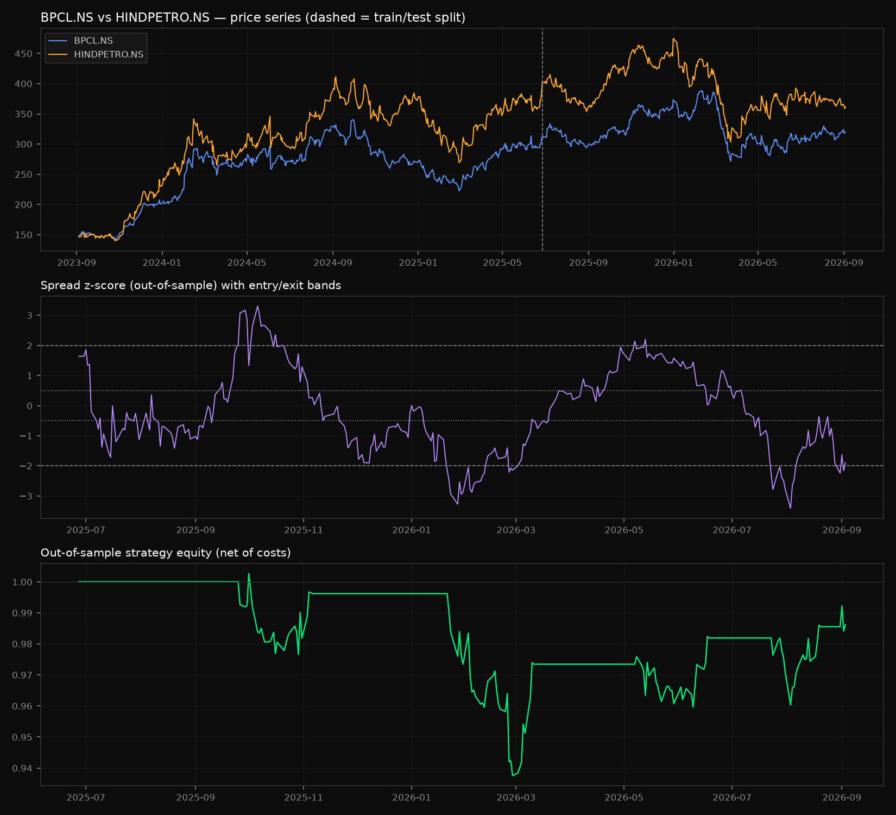

---

### ONGC.NS / COALINDIA.NS

- **Latest prices:** ONGC.NS ₹236.00 · COALINDIA.NS ₹420.05
- **Hedge ratio (train-fitted):** 1.5160
- **Cointegration (train):** PASS at 5% — ADF -3.67, p=0.0046
- **Persistence:** passed 5% in 38 of 46 real-data runs (strict tier: 1/46)
- **Spread half-life:** 11.6 days
- **Current z-score:** +0.59
- **Signal today:** watch (approaching band)

**Out-of-sample backtest** (beta frozen from train window):

| Metric | Value |
|---|---|
| Sharpe | 0.48 |
| Sortino | 0.35 |
| Annualised return | 3.20% |
| Annualised vol | 7.07% |
| Max drawdown | -5.95% |
| Round-trip trades | 4 |

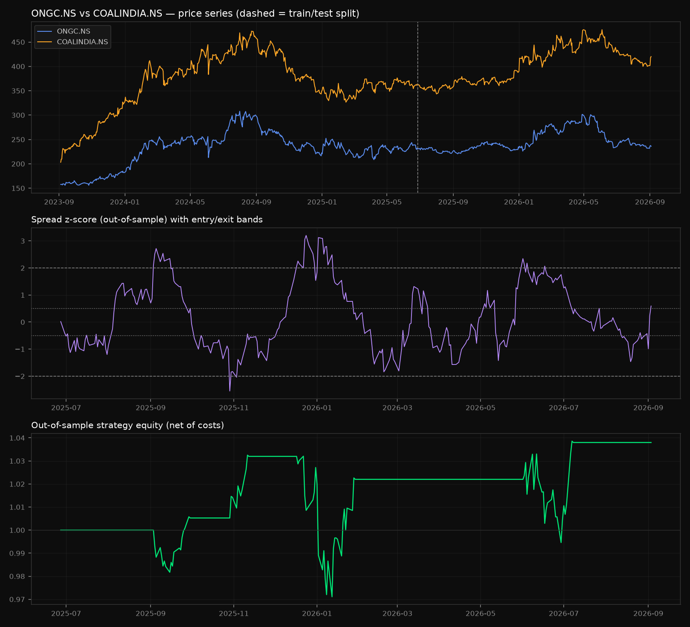

---

### NTPC.NS / POWERGRID.NS

- **Latest prices:** NTPC.NS ₹330.90 · POWERGRID.NS ₹265.60
- **Hedge ratio (train-fitted):** 0.8412
- **Cointegration (train):** FAIL at 5% — ADF -2.60, p=0.0939
- **Persistence:** passed 5% in 0 of 46 real-data runs (strict tier: 0/46)
- **Spread half-life:** 23.0 days
- **Current z-score:** -0.81
- **Signal today:** watch (approaching band)
- ⚠️ _Pair did not cointegrate on training data. Any signal here is not statistically justified — observation only._

**Out-of-sample backtest** (beta frozen from train window):

| Metric | Value |
|---|---|
| Sharpe | 0.38 |
| Sortino | 0.29 |
| Annualised return | 1.94% |
| Annualised vol | 5.46% |
| Max drawdown | -5.21% |
| Round-trip trades | 6 |

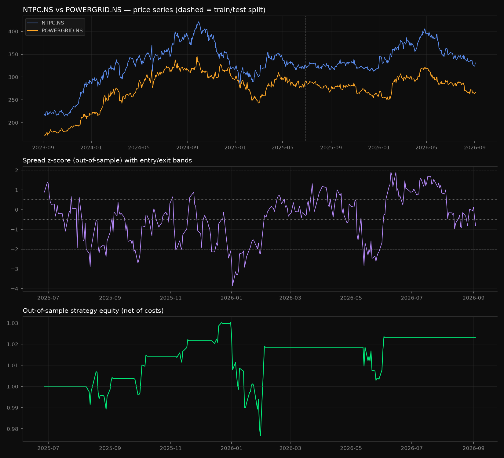

---

### BAJAJ-AUTO.NS / HEROMOTOCO.NS

- **Latest prices:** BAJAJ-AUTO.NS ₹11,920.00 · HEROMOTOCO.NS ₹5,308.50
- **Hedge ratio (train-fitted):** 0.4100
- **Cointegration (train):** FAIL at 5% — ADF -2.28, p=0.1800
- **Persistence:** passed 5% in 0 of 46 real-data runs (strict tier: 0/46)
- **Spread half-life:** 29.7 days
- **Current z-score:** -1.76
- **Signal today:** watch (approaching band)
- ⚠️ _Pair did not cointegrate on training data. Any signal here is not statistically justified — observation only._

**Out-of-sample backtest** (beta frozen from train window):

| Metric | Value |
|---|---|
| Sharpe | -0.76 |
| Sortino | -0.78 |
| Annualised return | -8.19% |
| Annualised vol | 10.48% |
| Max drawdown | -20.77% |
| Round-trip trades | 5 |

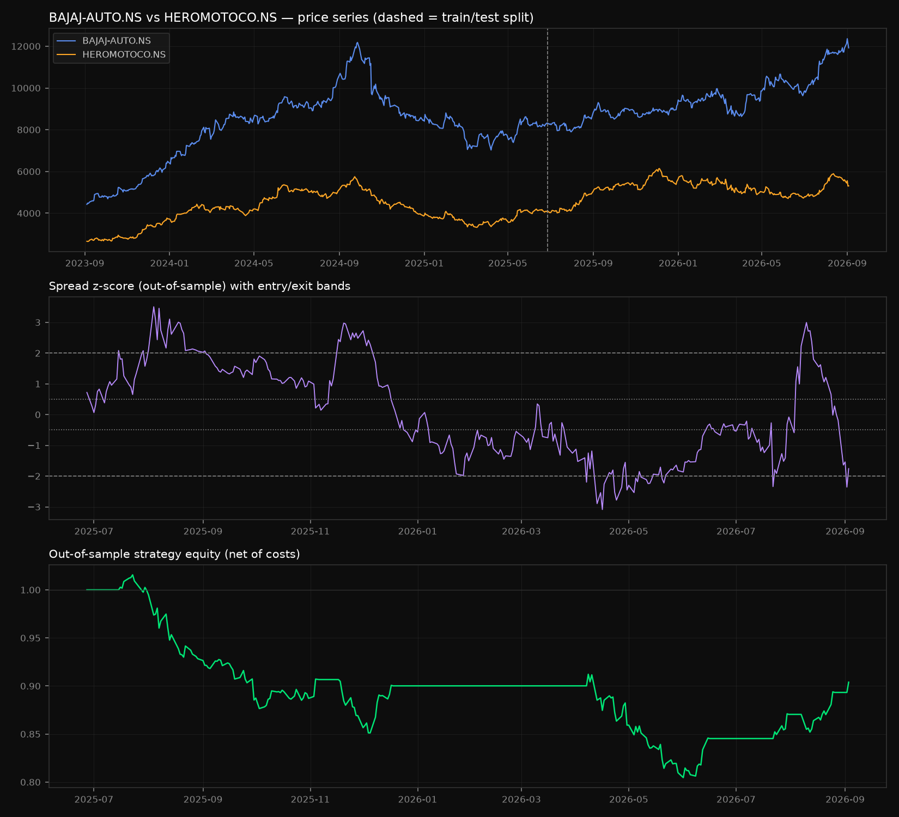

---

### TATASTEEL.NS / JSWSTEEL.NS

- **Latest prices:** TATASTEEL.NS ₹184.20 · JSWSTEEL.NS ₹1,308.00
- **Hedge ratio (train-fitted):** 3.0836
- **Cointegration (train):** FAIL at 5% — ADF -1.14, p=0.7005
- **Persistence:** passed 5% in 0 of 46 real-data runs (strict tier: 0/46)
- **Spread half-life:** 72.0 days
- **Current z-score:** +1.38
- **Signal today:** watch (approaching band)
- ⚠️ _Pair did not cointegrate on training data. Any signal here is not statistically justified — observation only._

**Out-of-sample backtest** (beta frozen from train window):

| Metric | Value |
|---|---|
| Sharpe | -0.15 |
| Sortino | -0.14 |
| Annualised return | -1.49% |
| Annualised vol | 8.03% |
| Max drawdown | -5.56% |
| Round-trip trades | 4 |

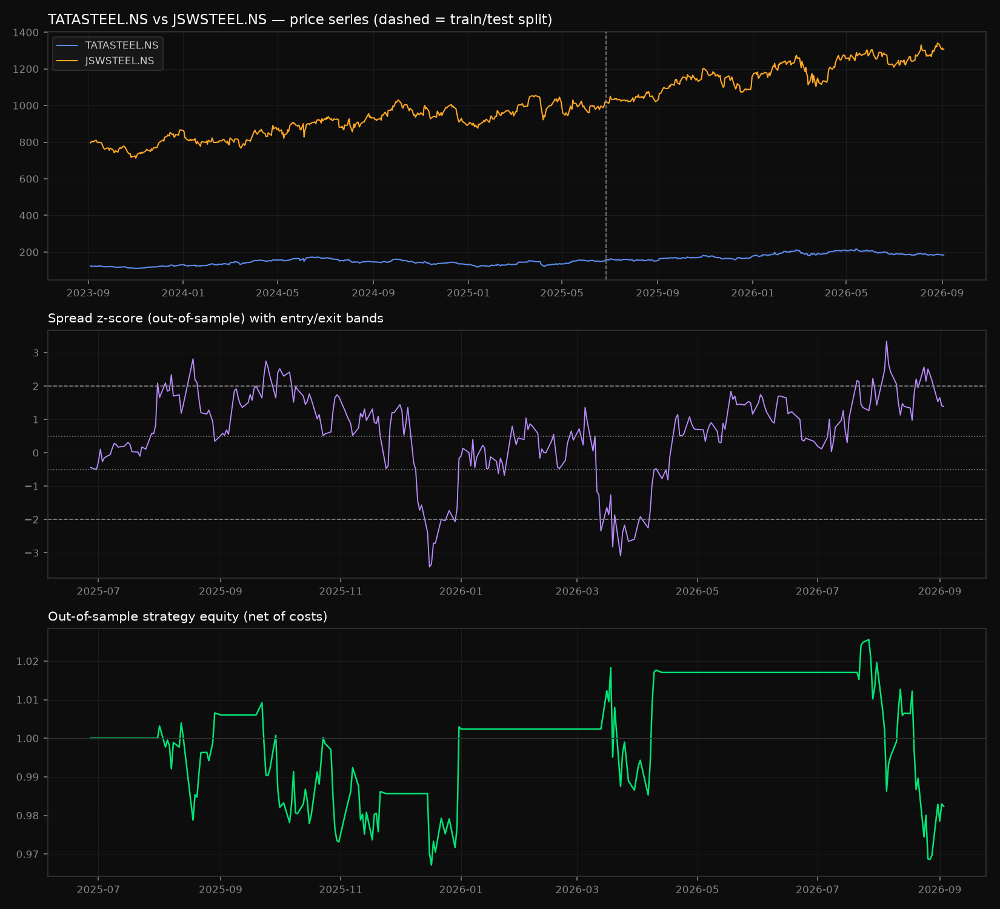

---

### SUNPHARMA.NS / CIPLA.NS

- **Latest prices:** SUNPHARMA.NS ₹1,916.00 · CIPLA.NS ₹1,394.70
- **Hedge ratio (train-fitted):** 0.4940
- **Cointegration (train):** PASS at 5% — ADF -3.38, p=0.0117
- **Persistence:** passed 5% in 46 of 46 real-data runs (strict tier: 5/46)
- **Spread half-life:** 10.7 days
- **Current z-score:** -1.46
- **Signal today:** watch (approaching band)

**Out-of-sample backtest** (beta frozen from train window):

| Metric | Value |
|---|---|
| Sharpe | -0.13 |
| Sortino | -0.13 |
| Annualised return | -1.25% |
| Annualised vol | 7.60% |
| Max drawdown | -10.21% |
| Round-trip trades | 4 |

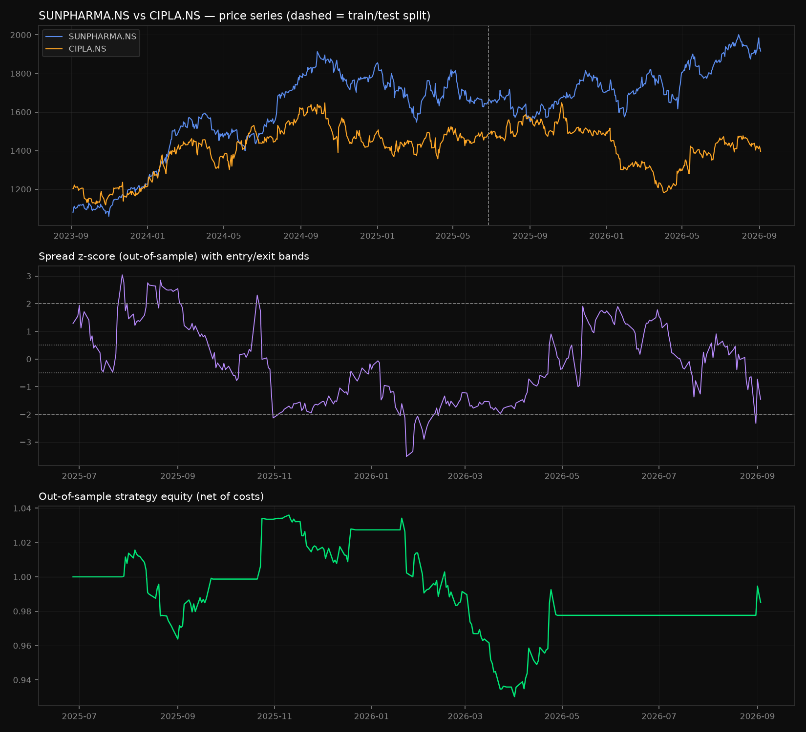

---

_Generated 2026-09-03 · pairs mean-reversion scanner · out-of-sample backtest · multiple-testing-aware · not investment advice._
