# Indian Pairs-Trading Scanner — 2026-09-04

> **What this is:** a market-neutral *pairs mean-reversion* scanner. It flags when two related NSE stocks have drifted apart far enough that their historical relationship signals a possible convergence trade. It does **not** forecast growth, rank "best" stocks, or predict company performance. A signal means the *spread between two stocks* is stretched — nothing about either stock being a good investment. Not investment advice; do your own research.

## Methodology (fixed in advance)

- **Universe:** 16 declared sector-mate pairs. Parameters (3y window, 60/40 train-test, z-entry 2.0, z-exit 0.5, 5 bps costs) are pre-registered; changes are logged in the README changelog *before* looking at results.
- **Multiple testing:** at the 5% level across 16 pairs, **≈0.8 false positives per run are expected by chance alone** even if nothing truly cointegrates. A single-day pass is a candidate, not a discovery.
- **Strict tier:** Bonferroni-corrected threshold p < 0.0031 (marked ✓✓).
- **Evidence = persistence:** the Persistence column counts how often each pair has passed the 5% test across all *real-data* daily runs recorded in `reports/history.csv`. Pairs deserve attention only when they pass persistently.

## Summary

| Pair | p-value | Coint. | Persistence | Current z | Signal | OOS Sharpe |
|---|---|---|---|---|---|---|
| HDFCBANK.NS/ICICIBANK.NS | 0.0962 | ✗ | 0/37 | +1.13 | watch | -0.69 |
| AXISBANK.NS/ICICIBANK.NS | 0.8431 | ✗ | 0/47 | +0.37 | flat / no stretch | -0.31 |
| KOTAKBANK.NS/HDFCBANK.NS | 0.1325 | ✗ | 0/47 | -1.84 | watch | 0.63 |
| SBIN.NS/BANKBARODA.NS | 0.1324 | ✗ | 0/47 | -0.61 | watch | -0.05 |
| TCS.NS/INFY.NS | 0.6255 | ✗ | 0/47 | -0.15 | flat / no stretch | 2.33 |
| INFY.NS/WIPRO.NS | 0.2134 | ✗ | 0/47 | -1.58 | watch | 1.68 |
| HCLTECH.NS/TECHM.NS | 0.1950 | ✗ | 0/47 | +0.58 | watch | 0.04 |
| ACC.NS/AMBUJACEM.NS | 0.5707 | ✗ | 0/47 | -1.69 | watch | 0.53 |
| ULTRACEMCO.NS/SHREECEM.NS | 0.2474 | ✗ | 0/47 | -1.61 | watch | 0.35 |
| IOC.NS/BPCL.NS | 0.8426 | ✗ | 0/47 | +0.83 | watch | 0.42 |
| BPCL.NS/HINDPETRO.NS | 0.3430 | ✗ | 0/47 | -1.73 | watch | -0.16 |
| ONGC.NS/COALINDIA.NS | 0.0045 | ✓ | 39/47 | +0.68 | watch | 0.48 |
| NTPC.NS/POWERGRID.NS | 0.1033 | ✗ | 0/47 | -0.98 | watch | 0.38 |
| BAJAJ-AUTO.NS/HEROMOTOCO.NS | 0.1753 | ✗ | 0/47 | -1.72 | watch | -0.77 |
| TATASTEEL.NS/JSWSTEEL.NS | 0.6858 | ✗ | 0/47 | +1.41 | watch | 0.08 |
| SUNPHARMA.NS/CIPLA.NS | 0.0114 | ✓ | 47/47 | -1.45 | watch | -0.13 |

_Legend: ✓✓ passes strict Bonferroni tier · ✓ passes 5% only · ✗ fails. Persistence = 5%-passes / real-data runs recorded. \*no real-data history yet._

---

### HDFCBANK.NS / ICICIBANK.NS

- **Latest prices:** HDFCBANK.NS ₹712.10 · ICICIBANK.NS ₹1,423.20
- **Hedge ratio (train-fitted):** 1.7320
- **Cointegration (train):** FAIL at 5% — ADF -2.58, p=0.0962
- **Persistence:** passed 5% in 0 of 37 real-data runs (strict tier: 0/37)
- **Spread half-life:** 26.7 days
- **Current z-score:** +1.13
- **Signal today:** watch (approaching band)
- ⚠️ _Pair did not cointegrate on training data. Any signal here is not statistically justified — observation only._

**Out-of-sample backtest** (beta frozen from train window):

| Metric | Value |
|---|---|
| Sharpe | -0.69 |
| Sortino | -0.75 |
| Annualised return | -4.65% |
| Annualised vol | 6.56% |
| Max drawdown | -8.43% |
| Round-trip trades | 4 |

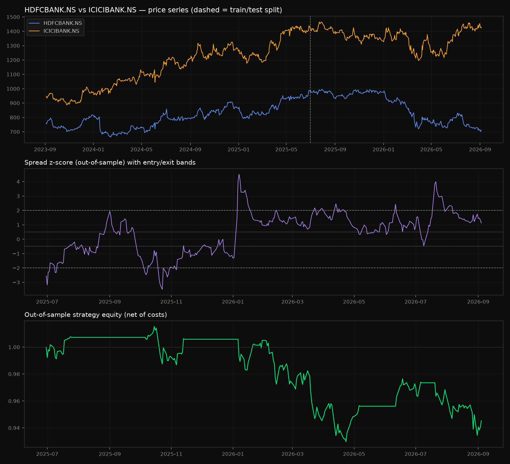

---

### AXISBANK.NS / ICICIBANK.NS

- **Latest prices:** AXISBANK.NS ₹1,273.00 · ICICIBANK.NS ₹1,423.20
- **Hedge ratio (train-fitted):** 0.9938
- **Cointegration (train):** FAIL at 5% — ADF -0.71, p=0.8431
- **Persistence:** passed 5% in 0 of 47 real-data runs (strict tier: 0/47)
- **Spread half-life:** 161.3 days
- **Current z-score:** +0.37
- **Signal today:** flat / no stretch
- ⚠️ _Pair did not cointegrate on training data. Any signal here is not statistically justified — observation only._

**Out-of-sample backtest** (beta frozen from train window):

| Metric | Value |
|---|---|
| Sharpe | -0.31 |
| Sortino | -0.32 |
| Annualised return | -3.03% |
| Annualised vol | 8.62% |
| Max drawdown | -7.61% |
| Round-trip trades | 5 |

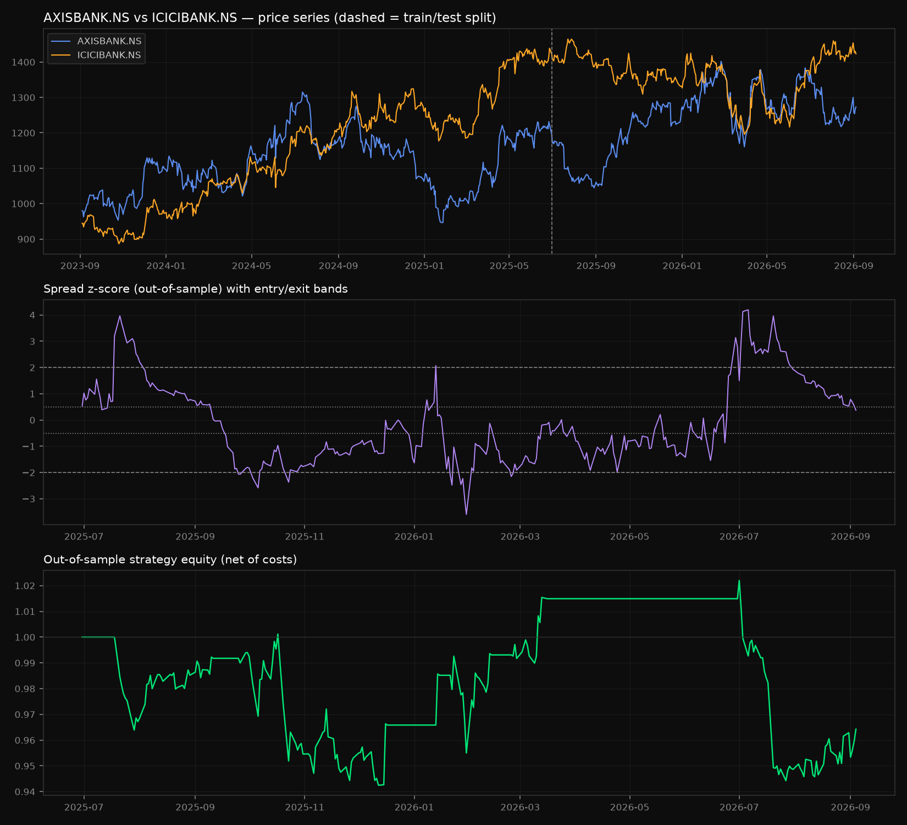

---

### KOTAKBANK.NS / HDFCBANK.NS

- **Latest prices:** KOTAKBANK.NS ₹424.50 · HDFCBANK.NS ₹712.10
- **Hedge ratio (train-fitted):** 2.0564
- **Cointegration (train):** FAIL at 5% — ADF -2.43, p=0.1325
- **Persistence:** passed 5% in 0 of 47 real-data runs (strict tier: 0/47)
- **Spread half-life:** 25.7 days
- **Current z-score:** -1.84
- **Signal today:** watch (approaching band)
- ⚠️ _Pair did not cointegrate on training data. Any signal here is not statistically justified — observation only._

**Out-of-sample backtest** (beta frozen from train window):

| Metric | Value |
|---|---|
| Sharpe | 0.63 |
| Sortino | 0.46 |
| Annualised return | 3.91% |
| Annualised vol | 6.46% |
| Max drawdown | -4.20% |
| Round-trip trades | 6 |

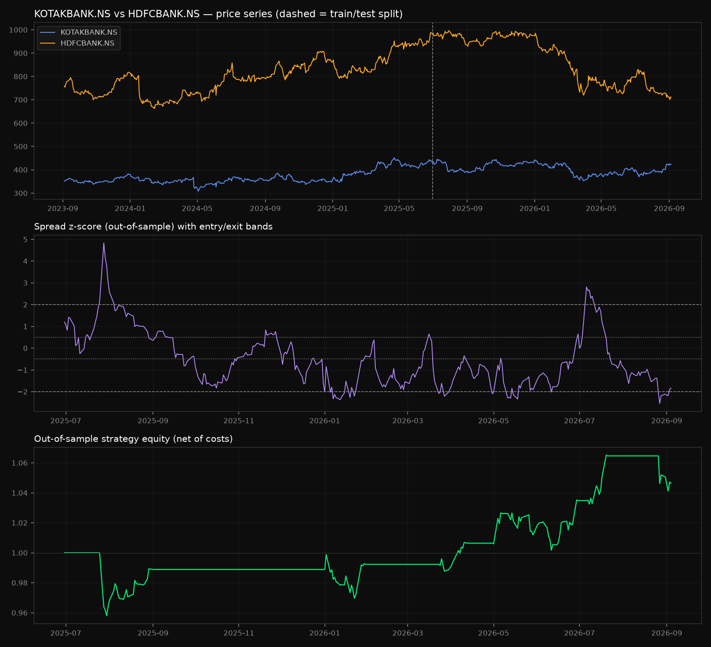

---

### SBIN.NS / BANKBARODA.NS

- **Latest prices:** SBIN.NS ₹1,016.10 · BANKBARODA.NS ₹239.00
- **Hedge ratio (train-fitted):** 0.1929
- **Cointegration (train):** FAIL at 5% — ADF -2.43, p=0.1324
- **Persistence:** passed 5% in 0 of 47 real-data runs (strict tier: 0/47)
- **Spread half-life:** 20.8 days
- **Current z-score:** -0.61
- **Signal today:** watch (approaching band)
- ⚠️ _Pair did not cointegrate on training data. Any signal here is not statistically justified — observation only._

**Out-of-sample backtest** (beta frozen from train window):

| Metric | Value |
|---|---|
| Sharpe | -0.05 |
| Sortino | -0.04 |
| Annualised return | -0.79% |
| Annualised vol | 8.81% |
| Max drawdown | -8.59% |
| Round-trip trades | 4 |

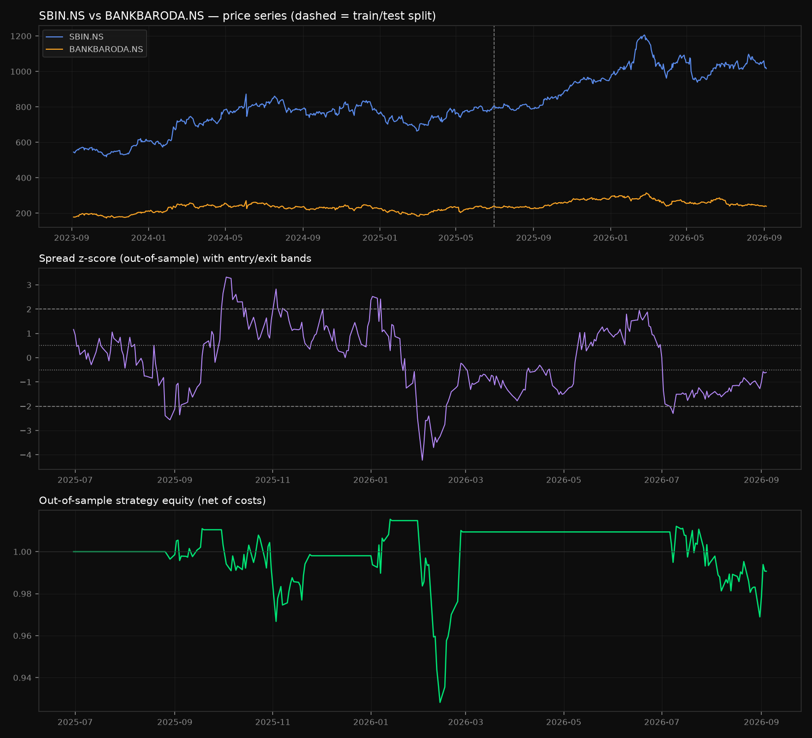

---

### TCS.NS / INFY.NS

- **Latest prices:** TCS.NS ₹2,304.00 · INFY.NS ₹1,130.00
- **Hedge ratio (train-fitted):** 0.4946
- **Cointegration (train):** FAIL at 5% — ADF -1.31, p=0.6255
- **Persistence:** passed 5% in 0 of 47 real-data runs (strict tier: 0/47)
- **Spread half-life:** 58.2 days
- **Current z-score:** -0.15
- **Signal today:** flat / no stretch
- ⚠️ _Pair did not cointegrate on training data. Any signal here is not statistically justified — observation only._

**Out-of-sample backtest** (beta frozen from train window):

| Metric | Value |
|---|---|
| Sharpe | 2.33 |
| Sortino | 2.39 |
| Annualised return | 9.97% |
| Annualised vol | 4.11% |
| Max drawdown | -1.32% |
| Round-trip trades | 8 |

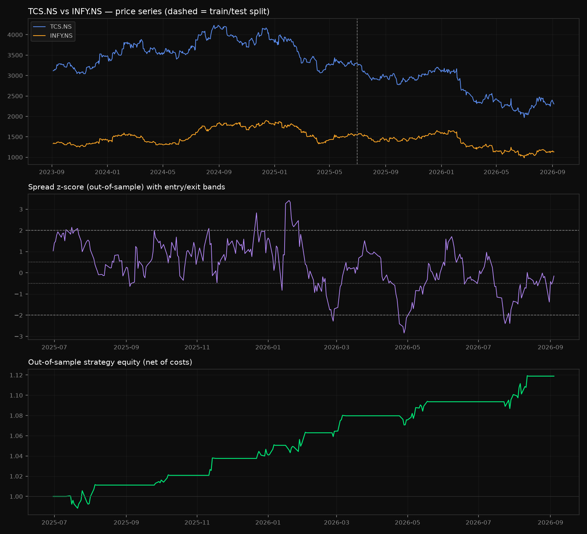

---

### INFY.NS / WIPRO.NS

- **Latest prices:** INFY.NS ₹1,130.00 · WIPRO.NS ₹176.40
- **Hedge ratio (train-fitted):** 0.1347
- **Cointegration (train):** FAIL at 5% — ADF -2.18, p=0.2134
- **Persistence:** passed 5% in 0 of 47 real-data runs (strict tier: 0/47)
- **Spread half-life:** 31.5 days
- **Current z-score:** -1.58
- **Signal today:** watch (approaching band)
- ⚠️ _Pair did not cointegrate on training data. Any signal here is not statistically justified — observation only._

**Out-of-sample backtest** (beta frozen from train window):

| Metric | Value |
|---|---|
| Sharpe | 1.68 |
| Sortino | 1.95 |
| Annualised return | 8.58% |
| Annualised vol | 4.98% |
| Max drawdown | -2.32% |
| Round-trip trades | 6 |

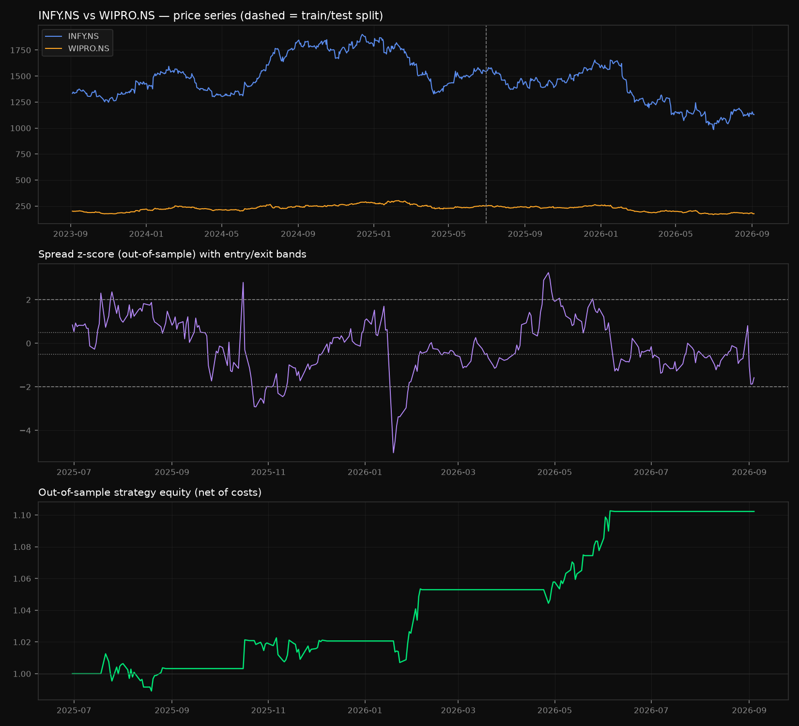

---

### HCLTECH.NS / TECHM.NS

- **Latest prices:** HCLTECH.NS ₹1,293.40 · TECHM.NS ₹1,596.90
- **Hedge ratio (train-fitted):** 0.8845
- **Cointegration (train):** FAIL at 5% — ADF -2.23, p=0.1950
- **Persistence:** passed 5% in 0 of 47 real-data runs (strict tier: 0/47)
- **Spread half-life:** 23.1 days
- **Current z-score:** +0.58
- **Signal today:** watch (approaching band)
- ⚠️ _Pair did not cointegrate on training data. Any signal here is not statistically justified — observation only._

**Out-of-sample backtest** (beta frozen from train window):

| Metric | Value |
|---|---|
| Sharpe | 0.04 |
| Sortino | 0.04 |
| Annualised return | 0.04% |
| Annualised vol | 6.73% |
| Max drawdown | -7.61% |
| Round-trip trades | 5 |

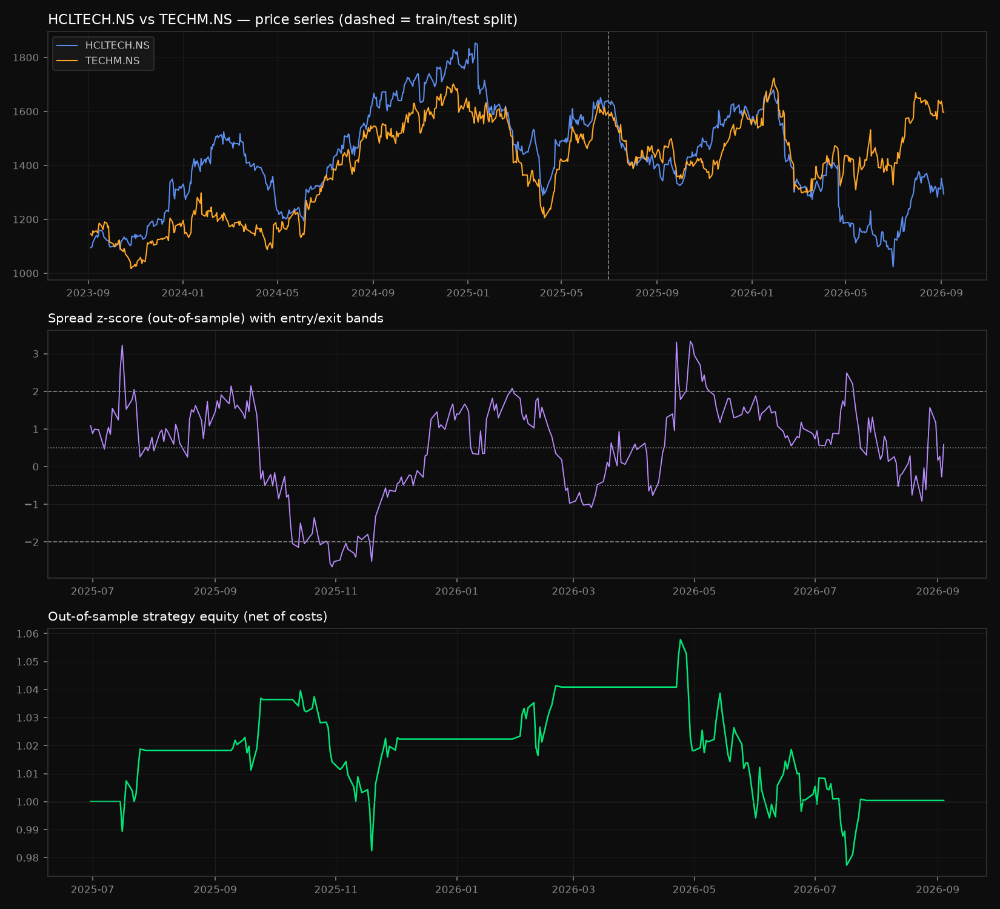

---

### ACC.NS / AMBUJACEM.NS

- **Latest prices:** ACC.NS ₹1,283.80 · AMBUJACEM.NS ₹405.00
- **Hedge ratio (train-fitted):** 0.2058
- **Cointegration (train):** FAIL at 5% — ADF -1.42, p=0.5707
- **Persistence:** passed 5% in 0 of 47 real-data runs (strict tier: 0/47)
- **Spread half-life:** 66.3 days
- **Current z-score:** -1.69
- **Signal today:** watch (approaching band)
- ⚠️ _Pair did not cointegrate on training data. Any signal here is not statistically justified — observation only._

**Out-of-sample backtest** (beta frozen from train window):

| Metric | Value |
|---|---|
| Sharpe | 0.53 |
| Sortino | 0.46 |
| Annualised return | 3.09% |
| Annualised vol | 6.05% |
| Max drawdown | -7.14% |
| Round-trip trades | 4 |

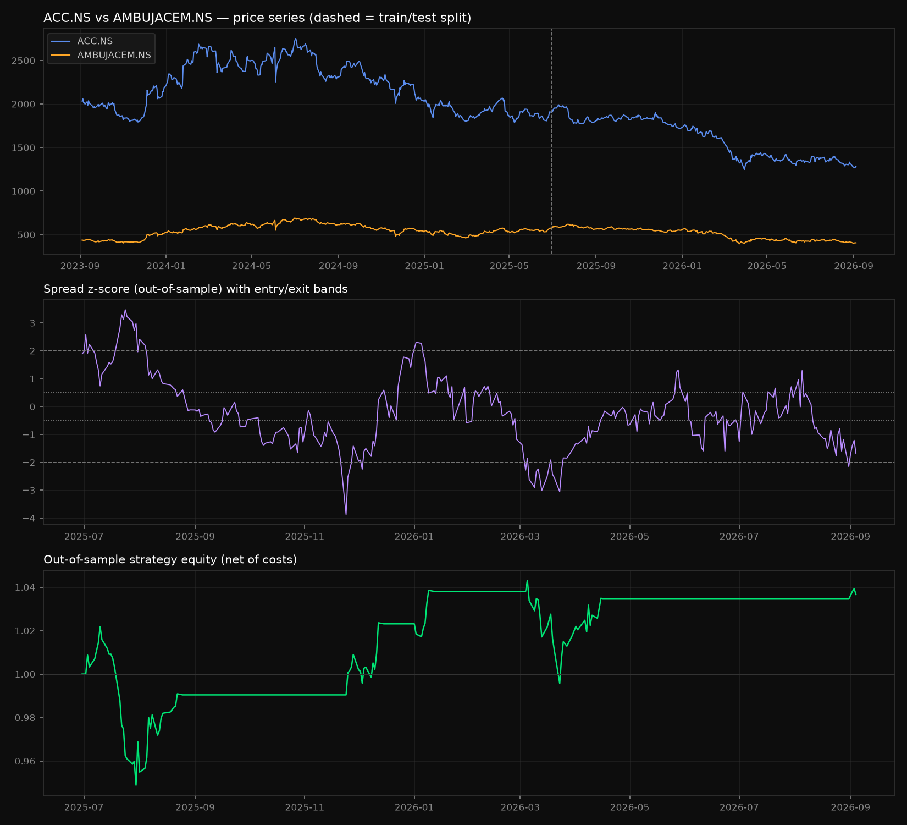

---

### ULTRACEMCO.NS / SHREECEM.NS

- **Latest prices:** ULTRACEMCO.NS ₹11,408.00 · SHREECEM.NS ₹23,855.00
- **Hedge ratio (train-fitted):** 0.6332
- **Cointegration (train):** FAIL at 5% — ADF -2.09, p=0.2474
- **Persistence:** passed 5% in 0 of 47 real-data runs (strict tier: 0/47)
- **Spread half-life:** 40.0 days
- **Current z-score:** -1.61
- **Signal today:** watch (approaching band)
- ⚠️ _Pair did not cointegrate on training data. Any signal here is not statistically justified — observation only._

**Out-of-sample backtest** (beta frozen from train window):

| Metric | Value |
|---|---|
| Sharpe | 0.35 |
| Sortino | 0.37 |
| Annualised return | 2.45% |
| Annualised vol | 7.72% |
| Max drawdown | -9.05% |
| Round-trip trades | 5 |

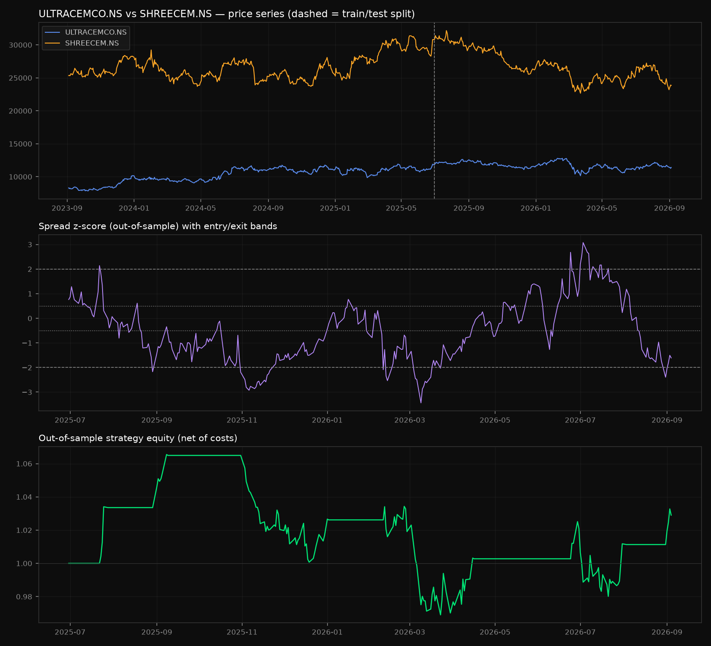

---

### IOC.NS / BPCL.NS

- **Latest prices:** IOC.NS ₹137.60 · BPCL.NS ₹315.70
- **Hedge ratio (train-fitted):** 1.7535
- **Cointegration (train):** FAIL at 5% — ADF -0.72, p=0.8426
- **Persistence:** passed 5% in 0 of 47 real-data runs (strict tier: 0/47)
- **Spread half-life:** 158.5 days
- **Current z-score:** +0.83
- **Signal today:** watch (approaching band)
- ⚠️ _Pair did not cointegrate on training data. Any signal here is not statistically justified — observation only._

**Out-of-sample backtest** (beta frozen from train window):

| Metric | Value |
|---|---|
| Sharpe | 0.42 |
| Sortino | 0.45 |
| Annualised return | 2.52% |
| Annualised vol | 6.39% |
| Max drawdown | -6.38% |
| Round-trip trades | 7 |

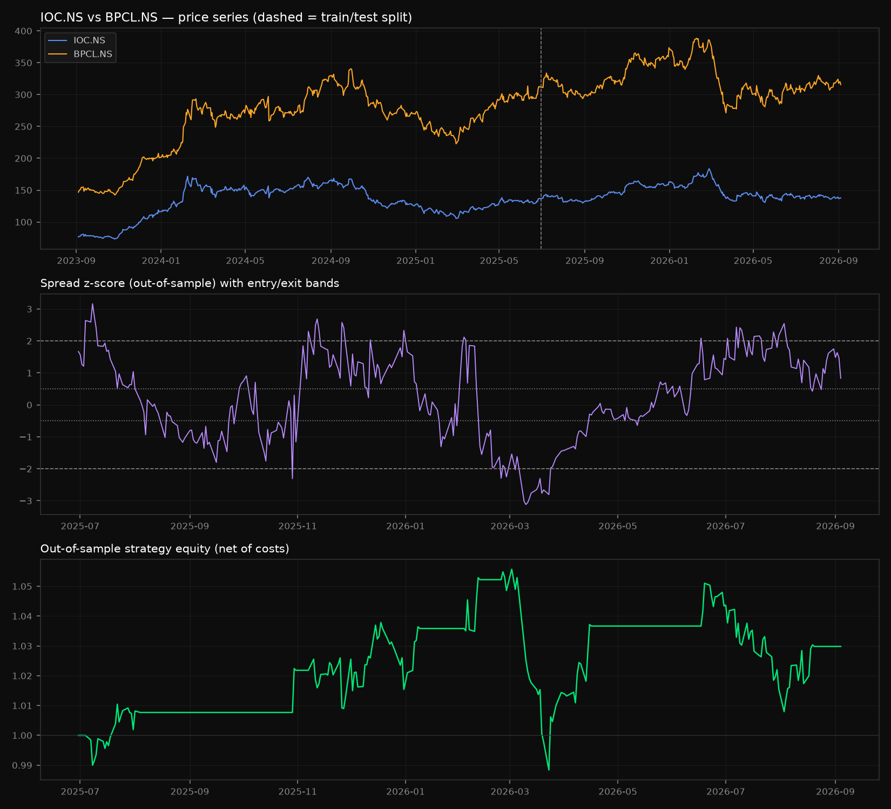

---

### BPCL.NS / HINDPETRO.NS

- **Latest prices:** BPCL.NS ₹315.70 · HINDPETRO.NS ₹356.50
- **Hedge ratio (train-fitted):** 1.3544
- **Cointegration (train):** FAIL at 5% — ADF -1.88, p=0.3430
- **Persistence:** passed 5% in 0 of 47 real-data runs (strict tier: 0/47)
- **Spread half-life:** 41.3 days
- **Current z-score:** -1.73
- **Signal today:** watch (approaching band)
- ⚠️ _Pair did not cointegrate on training data. Any signal here is not statistically justified — observation only._

**Out-of-sample backtest** (beta frozen from train window):

| Metric | Value |
|---|---|
| Sharpe | -0.16 |
| Sortino | -0.14 |
| Annualised return | -1.05% |
| Annualised vol | 5.70% |
| Max drawdown | -6.51% |
| Round-trip trades | 4 |

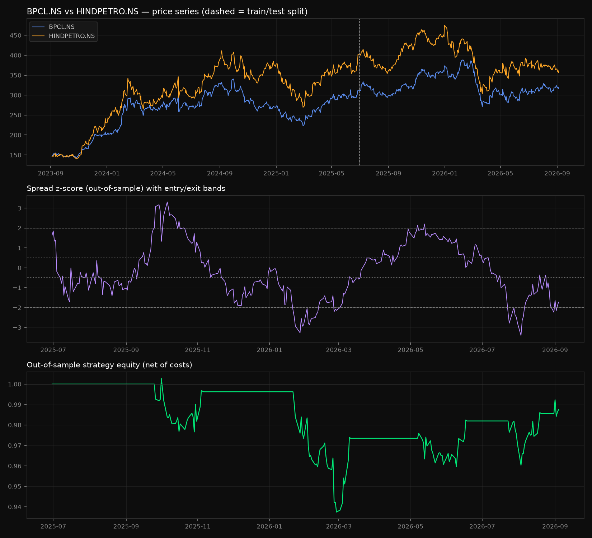

---

### ONGC.NS / COALINDIA.NS

- **Latest prices:** ONGC.NS ₹234.65 · COALINDIA.NS ₹415.35
- **Hedge ratio (train-fitted):** 1.5034
- **Cointegration (train):** PASS at 5% — ADF -3.67, p=0.0045
- **Persistence:** passed 5% in 39 of 47 real-data runs (strict tier: 1/47)
- **Spread half-life:** 11.6 days
- **Current z-score:** +0.68
- **Signal today:** watch (approaching band)

**Out-of-sample backtest** (beta frozen from train window):

| Metric | Value |
|---|---|
| Sharpe | 0.48 |
| Sortino | 0.35 |
| Annualised return | 3.20% |
| Annualised vol | 7.07% |
| Max drawdown | -5.95% |
| Round-trip trades | 4 |

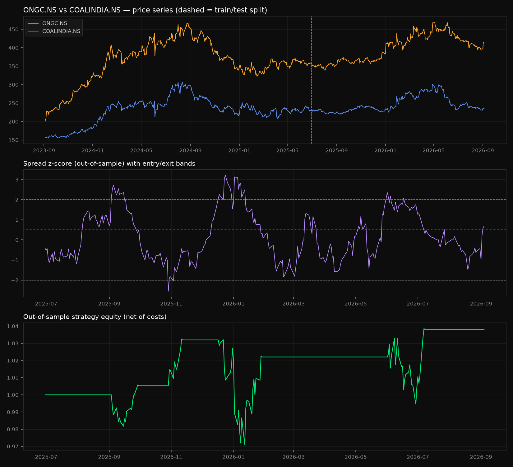

---

### NTPC.NS / POWERGRID.NS

- **Latest prices:** NTPC.NS ₹332.50 · POWERGRID.NS ₹266.00
- **Hedge ratio (train-fitted):** 0.8413
- **Cointegration (train):** FAIL at 5% — ADF -2.55, p=0.1033
- **Persistence:** passed 5% in 0 of 47 real-data runs (strict tier: 0/47)
- **Spread half-life:** 23.4 days
- **Current z-score:** -0.98
- **Signal today:** watch (approaching band)
- ⚠️ _Pair did not cointegrate on training data. Any signal here is not statistically justified — observation only._

**Out-of-sample backtest** (beta frozen from train window):

| Metric | Value |
|---|---|
| Sharpe | 0.38 |
| Sortino | 0.29 |
| Annualised return | 1.95% |
| Annualised vol | 5.48% |
| Max drawdown | -5.23% |
| Round-trip trades | 6 |

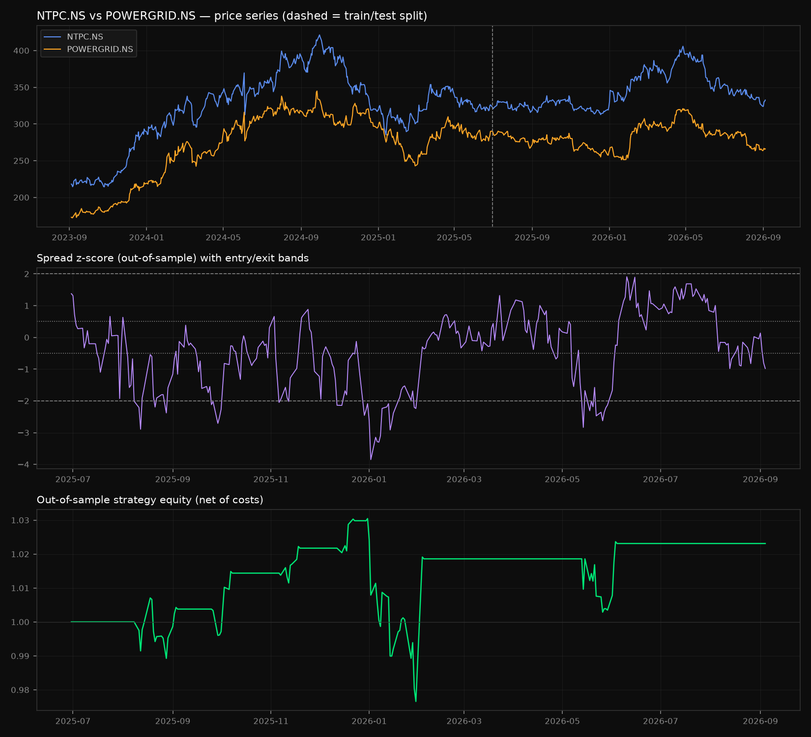

---

### BAJAJ-AUTO.NS / HEROMOTOCO.NS

- **Latest prices:** BAJAJ-AUTO.NS ₹11,919.00 · HEROMOTOCO.NS ₹5,300.00
- **Hedge ratio (train-fitted):** 0.4099
- **Cointegration (train):** FAIL at 5% — ADF -2.29, p=0.1753
- **Persistence:** passed 5% in 0 of 47 real-data runs (strict tier: 0/47)
- **Spread half-life:** 29.6 days
- **Current z-score:** -1.72
- **Signal today:** watch (approaching band)
- ⚠️ _Pair did not cointegrate on training data. Any signal here is not statistically justified — observation only._

**Out-of-sample backtest** (beta frozen from train window):

| Metric | Value |
|---|---|
| Sharpe | -0.77 |
| Sortino | -0.79 |
| Annualised return | -8.39% |
| Annualised vol | 10.63% |
| Max drawdown | -21.03% |
| Round-trip trades | 5 |

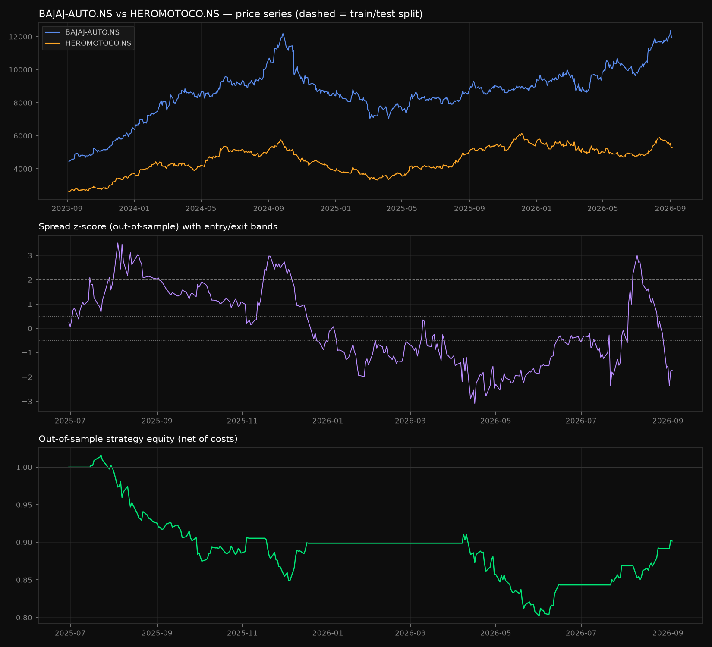

---

### TATASTEEL.NS / JSWSTEEL.NS

- **Latest prices:** TATASTEEL.NS ₹188.79 · JSWSTEEL.NS ₹1,325.00
- **Hedge ratio (train-fitted):** 3.0963
- **Cointegration (train):** FAIL at 5% — ADF -1.17, p=0.6858
- **Persistence:** passed 5% in 0 of 47 real-data runs (strict tier: 0/47)
- **Spread half-life:** 70.7 days
- **Current z-score:** +1.41
- **Signal today:** watch (approaching band)
- ⚠️ _Pair did not cointegrate on training data. Any signal here is not statistically justified — observation only._

**Out-of-sample backtest** (beta frozen from train window):

| Metric | Value |
|---|---|
| Sharpe | 0.08 |
| Sortino | 0.08 |
| Annualised return | 0.33% |
| Annualised vol | 8.18% |
| Max drawdown | -5.60% |
| Round-trip trades | 4 |

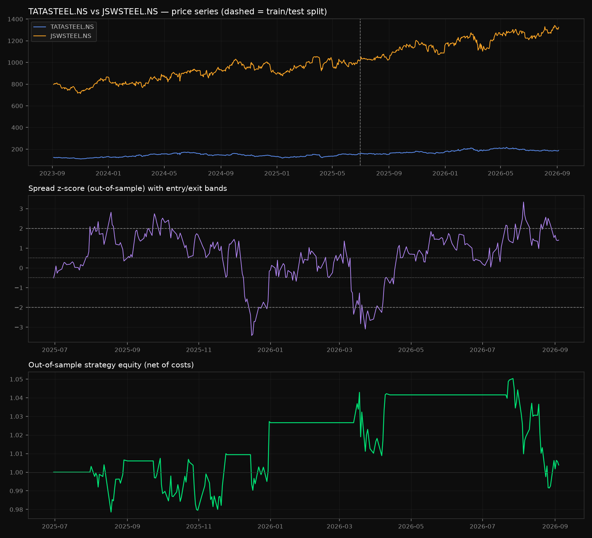

---

### SUNPHARMA.NS / CIPLA.NS

- **Latest prices:** SUNPHARMA.NS ₹1,899.00 · CIPLA.NS ₹1,385.00
- **Hedge ratio (train-fitted):** 0.4942
- **Cointegration (train):** PASS at 5% — ADF -3.39, p=0.0114
- **Persistence:** passed 5% in 47 of 47 real-data runs (strict tier: 5/47)
- **Spread half-life:** 10.7 days
- **Current z-score:** -1.45
- **Signal today:** watch (approaching band)

**Out-of-sample backtest** (beta frozen from train window):

| Metric | Value |
|---|---|
| Sharpe | -0.13 |
| Sortino | -0.14 |
| Annualised return | -1.30% |
| Annualised vol | 7.61% |
| Max drawdown | -10.22% |
| Round-trip trades | 4 |

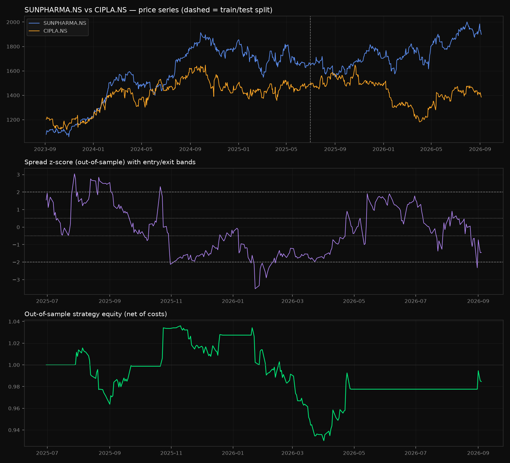

---

_Generated 2026-09-04 · pairs mean-reversion scanner · out-of-sample backtest · multiple-testing-aware · not investment advice._
