# Indian Pairs-Trading Scanner — 2026-09-07

> **What this is:** a market-neutral *pairs mean-reversion* scanner. It flags when two related NSE stocks have drifted apart far enough that their historical relationship signals a possible convergence trade. It does **not** forecast growth, rank "best" stocks, or predict company performance. A signal means the *spread between two stocks* is stretched — nothing about either stock being a good investment. Not investment advice; do your own research.

## Methodology (fixed in advance)

- **Universe:** 16 declared sector-mate pairs. Parameters (3y window, 60/40 train-test, z-entry 2.0, z-exit 0.5, 5 bps costs) are pre-registered; changes are logged in the README changelog *before* looking at results.
- **Multiple testing:** at the 5% level across 16 pairs, **≈0.8 false positives per run are expected by chance alone** even if nothing truly cointegrates. A single-day pass is a candidate, not a discovery.
- **Strict tier:** Bonferroni-corrected threshold p < 0.0031 (marked ✓✓).
- **Evidence = persistence:** the Persistence column counts how often each pair has passed the 5% test across all *real-data* daily runs recorded in `reports/history.csv`. Pairs deserve attention only when they pass persistently.

## Summary

| Pair | p-value | Coint. | Persistence | Current z | Signal | OOS Sharpe |
|---|---|---|---|---|---|---|
| HDFCBANK.NS/ICICIBANK.NS | 0.0694 | ✗ | 0/38 | +1.16 | watch | -0.64 |
| AXISBANK.NS/ICICIBANK.NS | 0.8582 | ✗ | 0/48 | +0.48 | flat / no stretch | -0.32 |
| KOTAKBANK.NS/HDFCBANK.NS | 0.1446 | ✗ | 0/48 | -1.72 | watch | 0.65 |
| SBIN.NS/BANKBARODA.NS | 0.1292 | ✗ | 0/48 | -0.59 | watch | -0.05 |
| TCS.NS/INFY.NS | 0.6044 | ✗ | 0/48 | -0.89 | watch | 2.33 |
| INFY.NS/WIPRO.NS | 0.2234 | ✗ | 0/48 | -0.91 | watch | 1.68 |
| HCLTECH.NS/TECHM.NS | 0.2263 | ✗ | 0/48 | -0.41 | flat / no stretch | 0.02 |
| ACC.NS/AMBUJACEM.NS | 0.6520 | ✗ | 0/48 | -2.26 | LONG spread | 0.48 |
| ULTRACEMCO.NS/SHREECEM.NS | 0.2541 | ✗ | 0/48 | -1.87 | watch | 0.26 |
| IOC.NS/BPCL.NS | 0.8413 | ✗ | 0/48 | +1.03 | watch | 0.42 |
| BPCL.NS/HINDPETRO.NS | 0.3346 | ✗ | 0/48 | -1.31 | watch | -0.08 |
| ONGC.NS/COALINDIA.NS | 0.0139 | ✓ | 40/48 | +1.09 | watch | 0.48 |
| NTPC.NS/POWERGRID.NS | 0.1193 | ✗ | 0/48 | -0.78 | watch | 0.38 |
| BAJAJ-AUTO.NS/HEROMOTOCO.NS | 0.1824 | ✗ | 0/48 | -1.56 | watch | -0.75 |
| TATASTEEL.NS/JSWSTEEL.NS | 0.6873 | ✗ | 0/48 | +1.03 | watch | -0.08 |
| SUNPHARMA.NS/CIPLA.NS | 0.0117 | ✓ | 48/48 | -0.99 | watch | -0.08 |

_Legend: ✓✓ passes strict Bonferroni tier · ✓ passes 5% only · ✗ fails. Persistence = 5%-passes / real-data runs recorded. \*no real-data history yet._

---

### HDFCBANK.NS / ICICIBANK.NS

- **Latest prices:** HDFCBANK.NS ₹710.50 · ICICIBANK.NS ₹1,427.50
- **Hedge ratio (train-fitted):** 1.7221
- **Cointegration (train):** FAIL at 5% — ADF -2.73, p=0.0694
- **Persistence:** passed 5% in 0 of 38 real-data runs (strict tier: 0/38)
- **Spread half-life:** 25.2 days
- **Current z-score:** +1.16
- **Signal today:** watch (approaching band)
- ⚠️ _Pair did not cointegrate on training data. Any signal here is not statistically justified — observation only._

**Out-of-sample backtest** (beta frozen from train window):

| Metric | Value |
|---|---|
| Sharpe | -0.64 |
| Sortino | -0.69 |
| Annualised return | -4.31% |
| Annualised vol | 6.53% |
| Max drawdown | -8.41% |
| Round-trip trades | 4 |

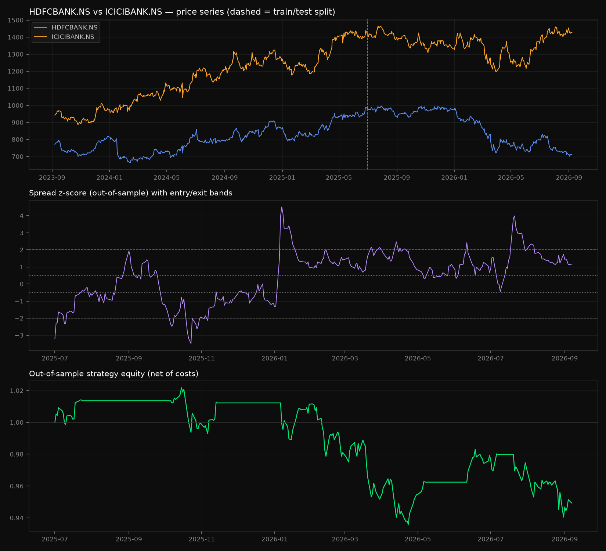

---

### AXISBANK.NS / ICICIBANK.NS

- **Latest prices:** AXISBANK.NS ₹1,266.00 · ICICIBANK.NS ₹1,427.50
- **Hedge ratio (train-fitted):** 0.9885
- **Cointegration (train):** FAIL at 5% — ADF -0.65, p=0.8582
- **Persistence:** passed 5% in 0 of 48 real-data runs (strict tier: 0/48)
- **Spread half-life:** 172.5 days
- **Current z-score:** +0.48
- **Signal today:** flat / no stretch
- ⚠️ _Pair did not cointegrate on training data. Any signal here is not statistically justified — observation only._

**Out-of-sample backtest** (beta frozen from train window):

| Metric | Value |
|---|---|
| Sharpe | -0.32 |
| Sortino | -0.32 |
| Annualised return | -3.13% |
| Annualised vol | 8.74% |
| Max drawdown | -7.71% |
| Round-trip trades | 6 |

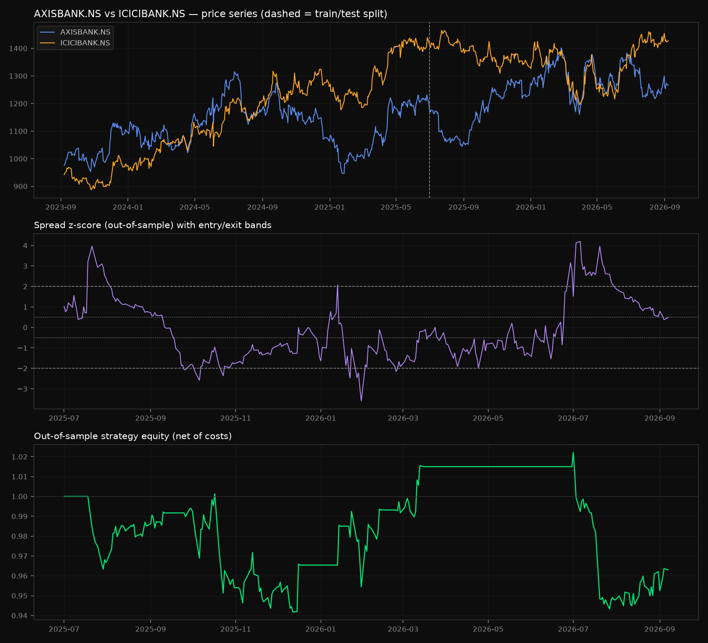

---

### KOTAKBANK.NS / HDFCBANK.NS

- **Latest prices:** KOTAKBANK.NS ₹422.10 · HDFCBANK.NS ₹710.50
- **Hedge ratio (train-fitted):** 2.0639
- **Cointegration (train):** FAIL at 5% — ADF -2.39, p=0.1446
- **Persistence:** passed 5% in 0 of 48 real-data runs (strict tier: 0/48)
- **Spread half-life:** 26.1 days
- **Current z-score:** -1.72
- **Signal today:** watch (approaching band)
- ⚠️ _Pair did not cointegrate on training data. Any signal here is not statistically justified — observation only._

**Out-of-sample backtest** (beta frozen from train window):

| Metric | Value |
|---|---|
| Sharpe | 0.65 |
| Sortino | 0.48 |
| Annualised return | 4.02% |
| Annualised vol | 6.42% |
| Max drawdown | -4.18% |
| Round-trip trades | 6 |

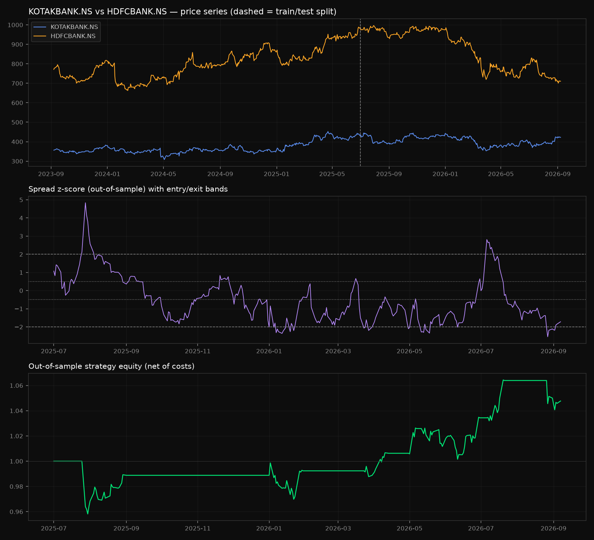

---

### SBIN.NS / BANKBARODA.NS

- **Latest prices:** SBIN.NS ₹1,005.90 · BANKBARODA.NS ₹237.00
- **Hedge ratio (train-fitted):** 0.1916
- **Cointegration (train):** FAIL at 5% — ADF -2.45, p=0.1292
- **Persistence:** passed 5% in 0 of 48 real-data runs (strict tier: 0/48)
- **Spread half-life:** 20.5 days
- **Current z-score:** -0.59
- **Signal today:** watch (approaching band)
- ⚠️ _Pair did not cointegrate on training data. Any signal here is not statistically justified — observation only._

**Out-of-sample backtest** (beta frozen from train window):

| Metric | Value |
|---|---|
| Sharpe | -0.05 |
| Sortino | -0.04 |
| Annualised return | -0.80% |
| Annualised vol | 8.85% |
| Max drawdown | -8.60% |
| Round-trip trades | 4 |

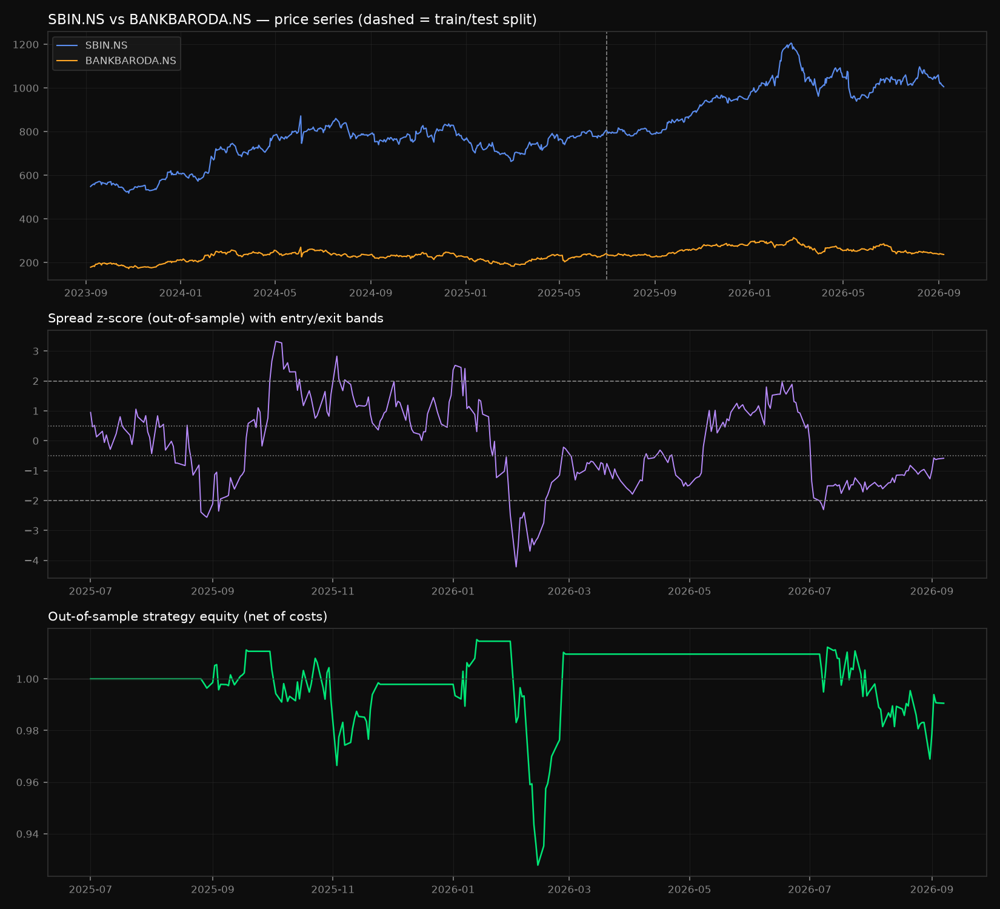

---

### TCS.NS / INFY.NS

- **Latest prices:** TCS.NS ₹2,270.00 · INFY.NS ₹1,087.50
- **Hedge ratio (train-fitted):** 0.4946
- **Cointegration (train):** FAIL at 5% — ADF -1.35, p=0.6044
- **Persistence:** passed 5% in 0 of 48 real-data runs (strict tier: 0/48)
- **Spread half-life:** 56.7 days
- **Current z-score:** -0.89
- **Signal today:** watch (approaching band)
- ⚠️ _Pair did not cointegrate on training data. Any signal here is not statistically justified — observation only._

**Out-of-sample backtest** (beta frozen from train window):

| Metric | Value |
|---|---|
| Sharpe | 2.33 |
| Sortino | 2.39 |
| Annualised return | 10.00% |
| Annualised vol | 4.13% |
| Max drawdown | -1.33% |
| Round-trip trades | 8 |

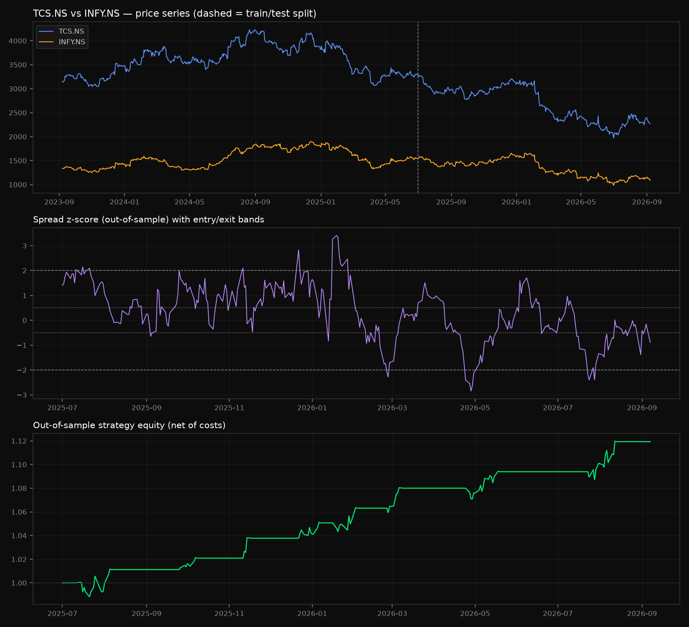

---

### INFY.NS / WIPRO.NS

- **Latest prices:** INFY.NS ₹1,087.50 · WIPRO.NS ₹172.80
- **Hedge ratio (train-fitted):** 0.1344
- **Cointegration (train):** FAIL at 5% — ADF -2.15, p=0.2234
- **Persistence:** passed 5% in 0 of 48 real-data runs (strict tier: 0/48)
- **Spread half-life:** 31.9 days
- **Current z-score:** -0.91
- **Signal today:** watch (approaching band)
- ⚠️ _Pair did not cointegrate on training data. Any signal here is not statistically justified — observation only._

**Out-of-sample backtest** (beta frozen from train window):

| Metric | Value |
|---|---|
| Sharpe | 1.68 |
| Sortino | 1.96 |
| Annualised return | 8.59% |
| Annualised vol | 4.98% |
| Max drawdown | -2.31% |
| Round-trip trades | 6 |

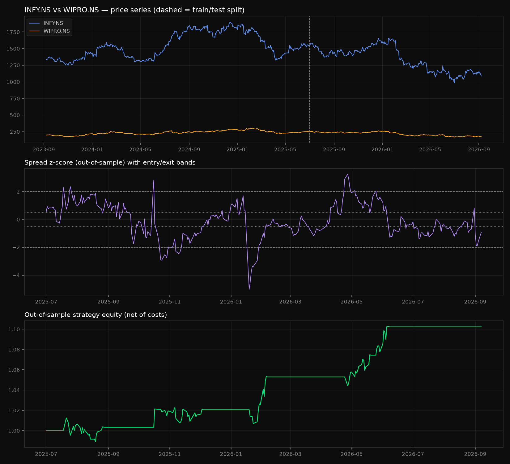

---

### HCLTECH.NS / TECHM.NS

- **Latest prices:** HCLTECH.NS ₹1,282.80 · TECHM.NS ₹1,564.00
- **Hedge ratio (train-fitted):** 0.8920
- **Cointegration (train):** FAIL at 5% — ADF -2.15, p=0.2263
- **Persistence:** passed 5% in 0 of 48 real-data runs (strict tier: 0/48)
- **Spread half-life:** 22.9 days
- **Current z-score:** -0.41
- **Signal today:** flat / no stretch
- ⚠️ _Pair did not cointegrate on training data. Any signal here is not statistically justified — observation only._

**Out-of-sample backtest** (beta frozen from train window):

| Metric | Value |
|---|---|
| Sharpe | 0.02 |
| Sortino | 0.02 |
| Annualised return | -0.06% |
| Annualised vol | 6.76% |
| Max drawdown | -7.64% |
| Round-trip trades | 5 |

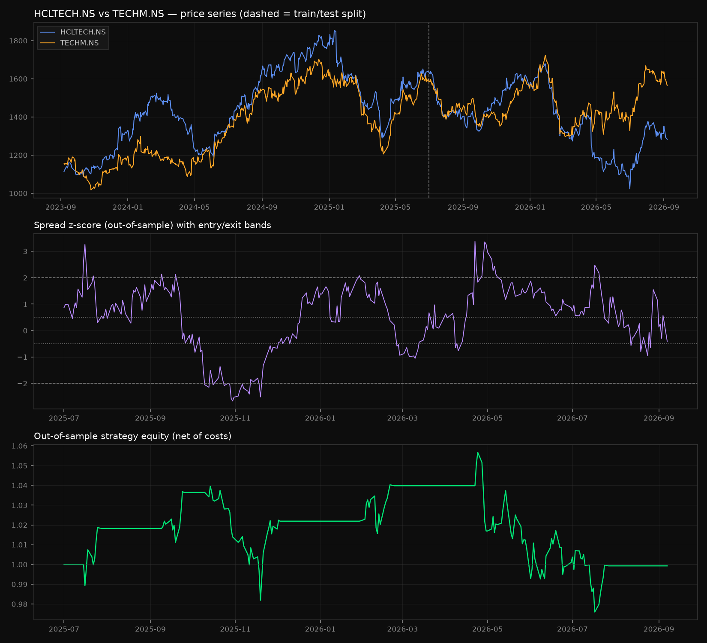

---

### ACC.NS / AMBUJACEM.NS

- **Latest prices:** ACC.NS ₹1,268.70 · AMBUJACEM.NS ₹398.60
- **Hedge ratio (train-fitted):** 0.2039
- **Cointegration (train):** FAIL at 5% — ADF -1.25, p=0.6520
- **Persistence:** passed 5% in 0 of 48 real-data runs (strict tier: 0/48)
- **Spread half-life:** 66.8 days
- **Current z-score:** -2.26
- **Signal today:** LONG spread (long AMBUJACEM.NS, short ACC.NS)
- ⚠️ _Pair did not cointegrate on training data. Any signal here is not statistically justified — observation only._

**Out-of-sample backtest** (beta frozen from train window):

| Metric | Value |
|---|---|
| Sharpe | 0.48 |
| Sortino | 0.42 |
| Annualised return | 2.78% |
| Annualised vol | 6.07% |
| Max drawdown | -7.10% |
| Round-trip trades | 4 |

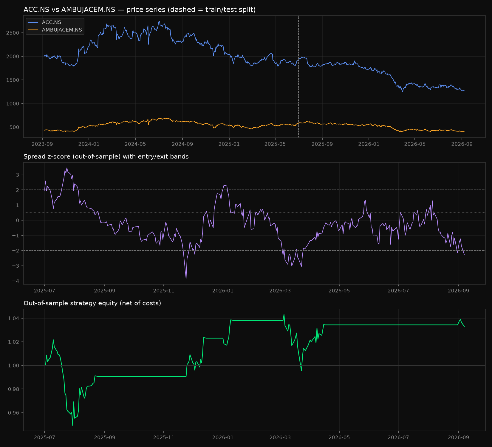

---

### ULTRACEMCO.NS / SHREECEM.NS

- **Latest prices:** ULTRACEMCO.NS ₹11,175.00 · SHREECEM.NS ₹23,365.00
- **Hedge ratio (train-fitted):** 0.6423
- **Cointegration (train):** FAIL at 5% — ADF -2.08, p=0.2541
- **Persistence:** passed 5% in 0 of 48 real-data runs (strict tier: 0/48)
- **Spread half-life:** 40.8 days
- **Current z-score:** -1.87
- **Signal today:** watch (approaching band)
- ⚠️ _Pair did not cointegrate on training data. Any signal here is not statistically justified — observation only._

**Out-of-sample backtest** (beta frozen from train window):

| Metric | Value |
|---|---|
| Sharpe | 0.26 |
| Sortino | 0.27 |
| Annualised return | 1.70% |
| Annualised vol | 7.67% |
| Max drawdown | -8.92% |
| Round-trip trades | 5 |

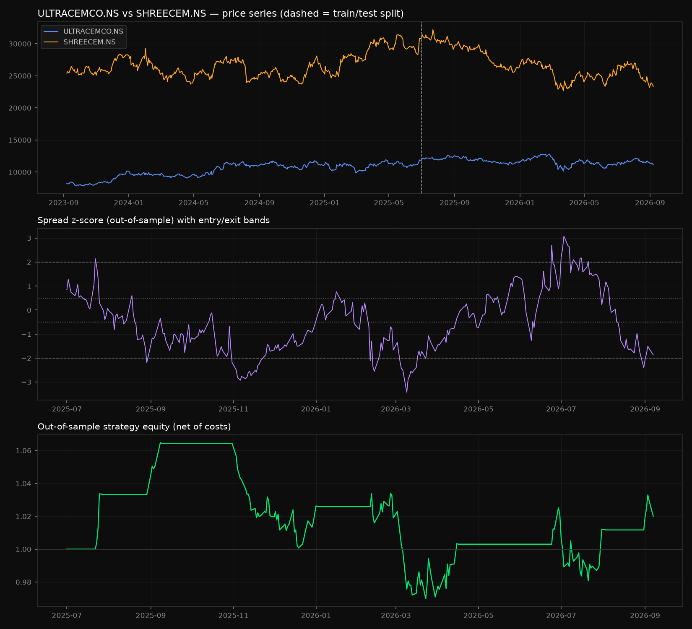

---

### IOC.NS / BPCL.NS

- **Latest prices:** IOC.NS ₹135.15 · BPCL.NS ₹312.90
- **Hedge ratio (train-fitted):** 1.7462
- **Cointegration (train):** FAIL at 5% — ADF -0.72, p=0.8413
- **Persistence:** passed 5% in 0 of 48 real-data runs (strict tier: 0/48)
- **Spread half-life:** 157.8 days
- **Current z-score:** +1.03
- **Signal today:** watch (approaching band)
- ⚠️ _Pair did not cointegrate on training data. Any signal here is not statistically justified — observation only._

**Out-of-sample backtest** (beta frozen from train window):

| Metric | Value |
|---|---|
| Sharpe | 0.42 |
| Sortino | 0.44 |
| Annualised return | 2.50% |
| Annualised vol | 6.41% |
| Max drawdown | -6.43% |
| Round-trip trades | 7 |

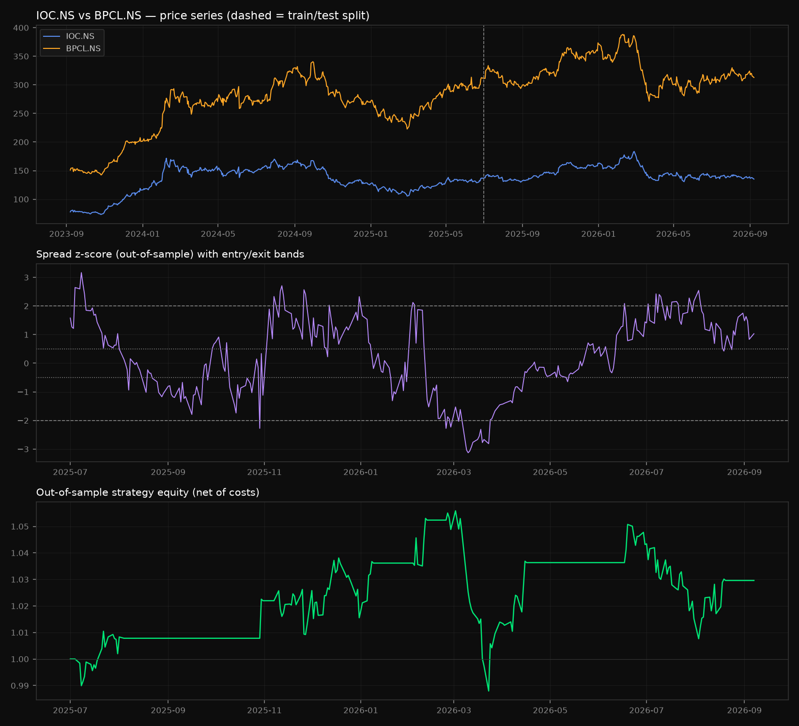

---

### BPCL.NS / HINDPETRO.NS

- **Latest prices:** BPCL.NS ₹312.90 · HINDPETRO.NS ₹356.90
- **Hedge ratio (train-fitted):** 1.3524
- **Cointegration (train):** FAIL at 5% — ADF -1.89, p=0.3346
- **Persistence:** passed 5% in 0 of 48 real-data runs (strict tier: 0/48)
- **Spread half-life:** 40.9 days
- **Current z-score:** -1.31
- **Signal today:** watch (approaching band)
- ⚠️ _Pair did not cointegrate on training data. Any signal here is not statistically justified — observation only._

**Out-of-sample backtest** (beta frozen from train window):

| Metric | Value |
|---|---|
| Sharpe | -0.08 |
| Sortino | -0.08 |
| Annualised return | -0.64% |
| Annualised vol | 5.70% |
| Max drawdown | -6.50% |
| Round-trip trades | 4 |

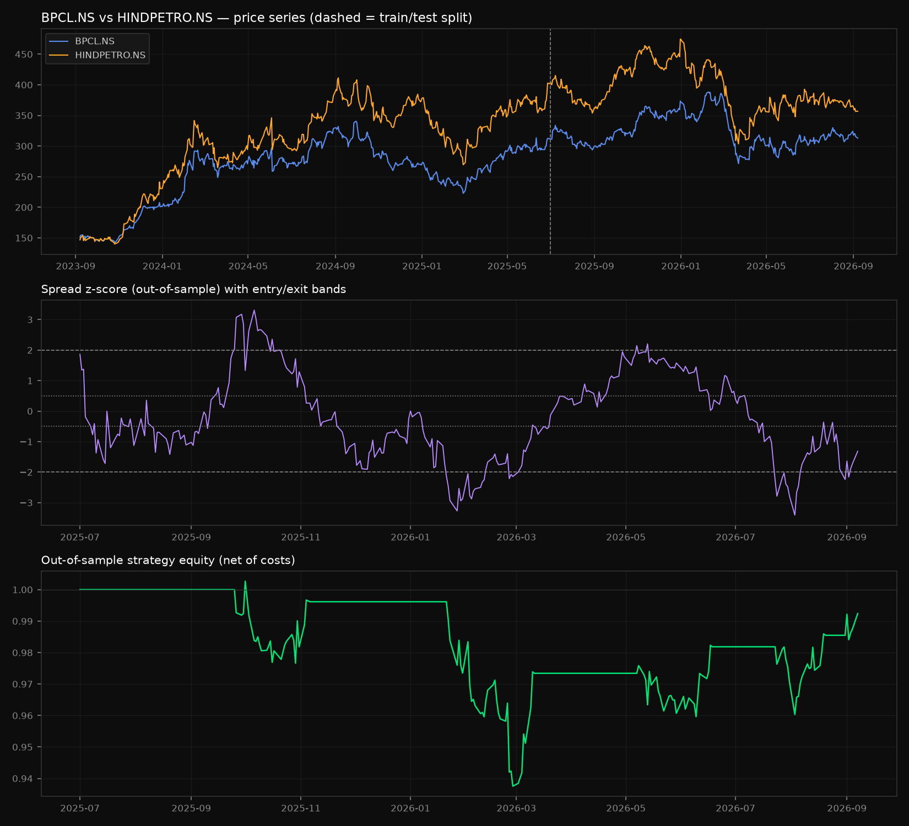

---

### ONGC.NS / COALINDIA.NS

- **Latest prices:** ONGC.NS ₹233.70 · COALINDIA.NS ₹418.85
- **Hedge ratio (train-fitted):** 1.4854
- **Cointegration (train):** PASS at 5% — ADF -3.32, p=0.0139
- **Persistence:** passed 5% in 40 of 48 real-data runs (strict tier: 1/48)
- **Spread half-life:** 12.6 days
- **Current z-score:** +1.09
- **Signal today:** watch (approaching band)

**Out-of-sample backtest** (beta frozen from train window):

| Metric | Value |
|---|---|
| Sharpe | 0.48 |
| Sortino | 0.34 |
| Annualised return | 3.19% |
| Annualised vol | 7.11% |
| Max drawdown | -6.01% |
| Round-trip trades | 4 |

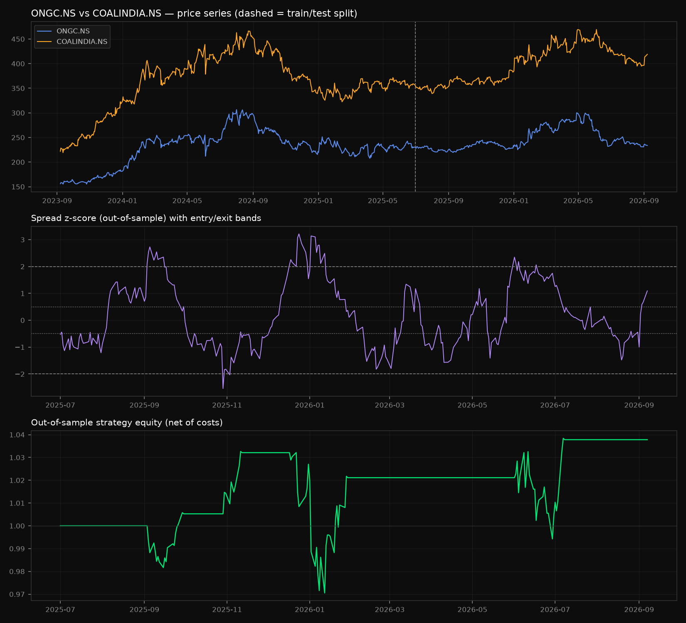

---

### NTPC.NS / POWERGRID.NS

- **Latest prices:** NTPC.NS ₹332.00 · POWERGRID.NS ₹266.45
- **Hedge ratio (train-fitted):** 0.8387
- **Cointegration (train):** FAIL at 5% — ADF -2.48, p=0.1193
- **Persistence:** passed 5% in 0 of 48 real-data runs (strict tier: 0/48)
- **Spread half-life:** 24.0 days
- **Current z-score:** -0.78
- **Signal today:** watch (approaching band)
- ⚠️ _Pair did not cointegrate on training data. Any signal here is not statistically justified — observation only._

**Out-of-sample backtest** (beta frozen from train window):

| Metric | Value |
|---|---|
| Sharpe | 0.38 |
| Sortino | 0.29 |
| Annualised return | 1.97% |
| Annualised vol | 5.52% |
| Max drawdown | -5.26% |
| Round-trip trades | 6 |

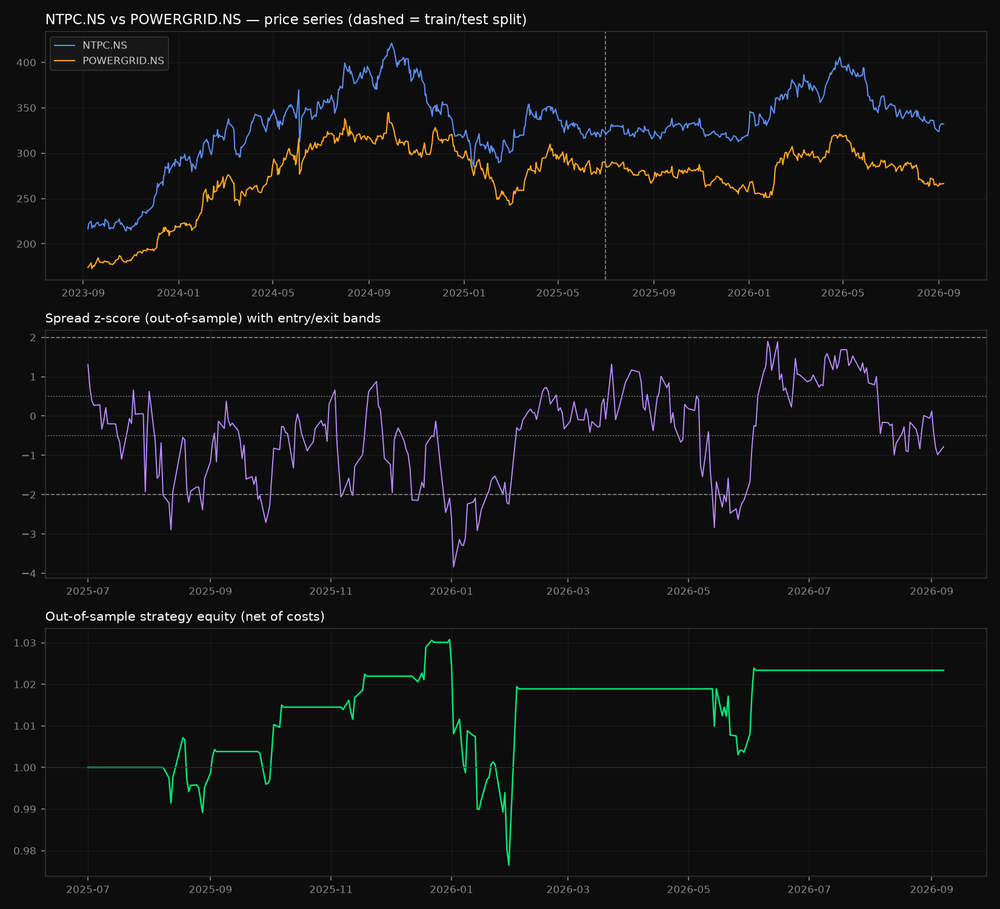

---

### BAJAJ-AUTO.NS / HEROMOTOCO.NS

- **Latest prices:** BAJAJ-AUTO.NS ₹11,800.00 · HEROMOTOCO.NS ₹5,270.00
- **Hedge ratio (train-fitted):** 0.4102
- **Cointegration (train):** FAIL at 5% — ADF -2.27, p=0.1824
- **Persistence:** passed 5% in 0 of 48 real-data runs (strict tier: 0/48)
- **Spread half-life:** 29.8 days
- **Current z-score:** -1.56
- **Signal today:** watch (approaching band)
- ⚠️ _Pair did not cointegrate on training data. Any signal here is not statistically justified — observation only._

**Out-of-sample backtest** (beta frozen from train window):

| Metric | Value |
|---|---|
| Sharpe | -0.75 |
| Sortino | -0.77 |
| Annualised return | -8.19% |
| Annualised vol | 10.63% |
| Max drawdown | -21.03% |
| Round-trip trades | 5 |

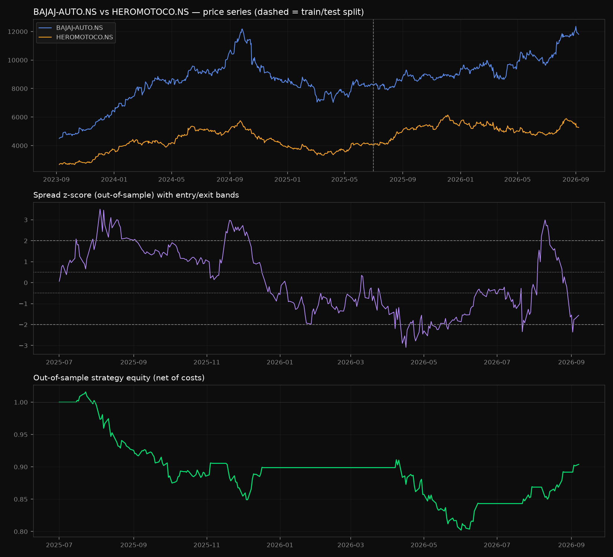

---

### TATASTEEL.NS / JSWSTEEL.NS

- **Latest prices:** TATASTEEL.NS ₹185.61 · JSWSTEEL.NS ₹1,302.00
- **Hedge ratio (train-fitted):** 3.0847
- **Cointegration (train):** FAIL at 5% — ADF -1.17, p=0.6873
- **Persistence:** passed 5% in 0 of 48 real-data runs (strict tier: 0/48)
- **Spread half-life:** 71.8 days
- **Current z-score:** +1.03
- **Signal today:** watch (approaching band)
- ⚠️ _Pair did not cointegrate on training data. Any signal here is not statistically justified — observation only._

**Out-of-sample backtest** (beta frozen from train window):

| Metric | Value |
|---|---|
| Sharpe | -0.08 |
| Sortino | -0.07 |
| Annualised return | -0.93% |
| Annualised vol | 8.09% |
| Max drawdown | -5.57% |
| Round-trip trades | 4 |

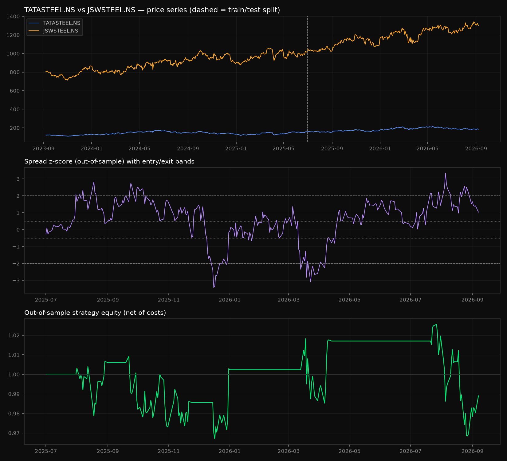

---

### SUNPHARMA.NS / CIPLA.NS

- **Latest prices:** SUNPHARMA.NS ₹1,895.00 · CIPLA.NS ₹1,395.00
- **Hedge ratio (train-fitted):** 0.4960
- **Cointegration (train):** PASS at 5% — ADF -3.38, p=0.0117
- **Persistence:** passed 5% in 48 of 48 real-data runs (strict tier: 5/48)
- **Spread half-life:** 10.7 days
- **Current z-score:** -0.99
- **Signal today:** watch (approaching band)

**Out-of-sample backtest** (beta frozen from train window):

| Metric | Value |
|---|---|
| Sharpe | -0.08 |
| Sortino | -0.08 |
| Annualised return | -0.87% |
| Annualised vol | 7.60% |
| Max drawdown | -10.19% |
| Round-trip trades | 4 |

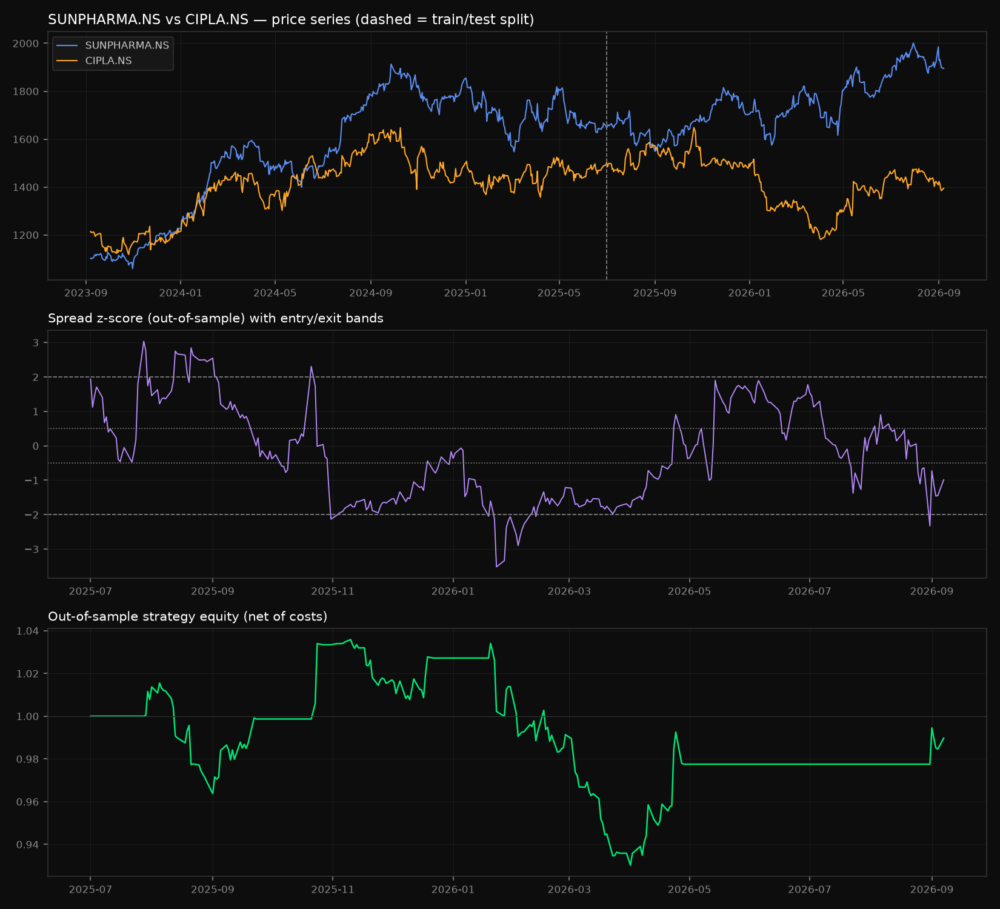

---

_Generated 2026-09-07 · pairs mean-reversion scanner · out-of-sample backtest · multiple-testing-aware · not investment advice._
