# Indian Pairs-Trading Scanner — 2026-09-08

> **What this is:** a market-neutral *pairs mean-reversion* scanner. It flags when two related NSE stocks have drifted apart far enough that their historical relationship signals a possible convergence trade. It does **not** forecast growth, rank "best" stocks, or predict company performance. A signal means the *spread between two stocks* is stretched — nothing about either stock being a good investment. Not investment advice; do your own research.

## Methodology (fixed in advance)

- **Universe:** 16 declared sector-mate pairs. Parameters (3y window, 60/40 train-test, z-entry 2.0, z-exit 0.5, 5 bps costs) are pre-registered; changes are logged in the README changelog *before* looking at results.
- **Multiple testing:** at the 5% level across 16 pairs, **≈0.8 false positives per run are expected by chance alone** even if nothing truly cointegrates. A single-day pass is a candidate, not a discovery.
- **Strict tier:** Bonferroni-corrected threshold p < 0.0031 (marked ✓✓).
- **Evidence = persistence:** the Persistence column counts how often each pair has passed the 5% test across all *real-data* daily runs recorded in `reports/history.csv`. Pairs deserve attention only when they pass persistently.

## Summary

| Pair | p-value | Coint. | Persistence | Current z | Signal | OOS Sharpe |
|---|---|---|---|---|---|---|
| HDFCBANK.NS/ICICIBANK.NS | 0.0688 | ✗ | 0/39 | +0.96 | watch | -0.65 |
| AXISBANK.NS/ICICIBANK.NS | 0.8659 | ✗ | 0/49 | +0.39 | flat / no stretch | -0.32 |
| KOTAKBANK.NS/HDFCBANK.NS | 0.1400 | ✗ | 0/49 | -1.68 | watch | 0.63 |
| SBIN.NS/BANKBARODA.NS | 0.1369 | ✗ | 0/49 | -0.62 | watch | -0.07 |
| TCS.NS/INFY.NS | 0.6381 | ✗ | 0/49 | -0.82 | watch | 2.16 |
| INFY.NS/WIPRO.NS | 0.2095 | ✗ | 0/49 | -1.08 | watch | 1.68 |
| HCLTECH.NS/TECHM.NS | 0.2146 | ✗ | 0/49 | -0.44 | flat / no stretch | 0.02 |
| ACC.NS/AMBUJACEM.NS | 0.6999 | ✗ | 0/49 | -2.09 | LONG spread | 0.49 |
| ULTRACEMCO.NS/SHREECEM.NS | 0.2497 | ✗ | 0/49 | -1.87 | watch | 0.24 |
| IOC.NS/BPCL.NS | 0.8382 | ✗ | 0/49 | -0.20 | flat / no stretch | 0.42 |
| BPCL.NS/HINDPETRO.NS | 0.3448 | ✗ | 0/49 | -1.07 | watch | -0.04 |
| ONGC.NS/COALINDIA.NS | 0.0131 | ✓ | 41/49 | +0.93 | watch | 0.48 |
| NTPC.NS/POWERGRID.NS | 0.1125 | ✗ | 0/49 | -0.72 | watch | 0.42 |
| BAJAJ-AUTO.NS/HEROMOTOCO.NS | 0.1841 | ✗ | 0/49 | -1.34 | watch | -0.72 |
| TATASTEEL.NS/JSWSTEEL.NS | 0.7039 | ✗ | 0/49 | +0.99 | watch | 0.17 |
| SUNPHARMA.NS/CIPLA.NS | 0.0127 | ✓ | 49/49 | -1.21 | watch | -0.11 |

_Legend: ✓✓ passes strict Bonferroni tier · ✓ passes 5% only · ✗ fails. Persistence = 5%-passes / real-data runs recorded. \*no real-data history yet._

---

### HDFCBANK.NS / ICICIBANK.NS

- **Latest prices:** HDFCBANK.NS ₹703.00 · ICICIBANK.NS ₹1,399.40
- **Hedge ratio (train-fitted):** 1.7155
- **Cointegration (train):** FAIL at 5% — ADF -2.73, p=0.0688
- **Persistence:** passed 5% in 0 of 39 real-data runs (strict tier: 0/39)
- **Spread half-life:** 25.0 days
- **Current z-score:** +0.96
- **Signal today:** watch (approaching band)
- ⚠️ _Pair did not cointegrate on training data. Any signal here is not statistically justified — observation only._

**Out-of-sample backtest** (beta frozen from train window):

| Metric | Value |
|---|---|
| Sharpe | -0.65 |
| Sortino | -0.70 |
| Annualised return | -4.40% |
| Annualised vol | 6.58% |
| Max drawdown | -8.46% |
| Round-trip trades | 4 |

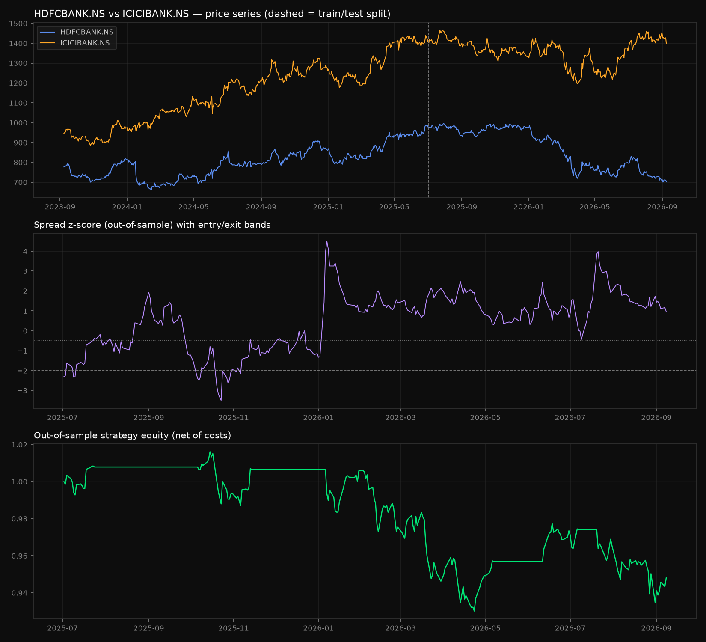

---

### AXISBANK.NS / ICICIBANK.NS

- **Latest prices:** AXISBANK.NS ₹1,244.90 · ICICIBANK.NS ₹1,399.40
- **Hedge ratio (train-fitted):** 0.9887
- **Cointegration (train):** FAIL at 5% — ADF -0.62, p=0.8659
- **Persistence:** passed 5% in 0 of 49 real-data runs (strict tier: 0/49)
- **Spread half-life:** 187.3 days
- **Current z-score:** +0.39
- **Signal today:** flat / no stretch
- ⚠️ _Pair did not cointegrate on training data. Any signal here is not statistically justified — observation only._

**Out-of-sample backtest** (beta frozen from train window):

| Metric | Value |
|---|---|
| Sharpe | -0.32 |
| Sortino | -0.32 |
| Annualised return | -3.14% |
| Annualised vol | 8.76% |
| Max drawdown | -7.72% |
| Round-trip trades | 6 |

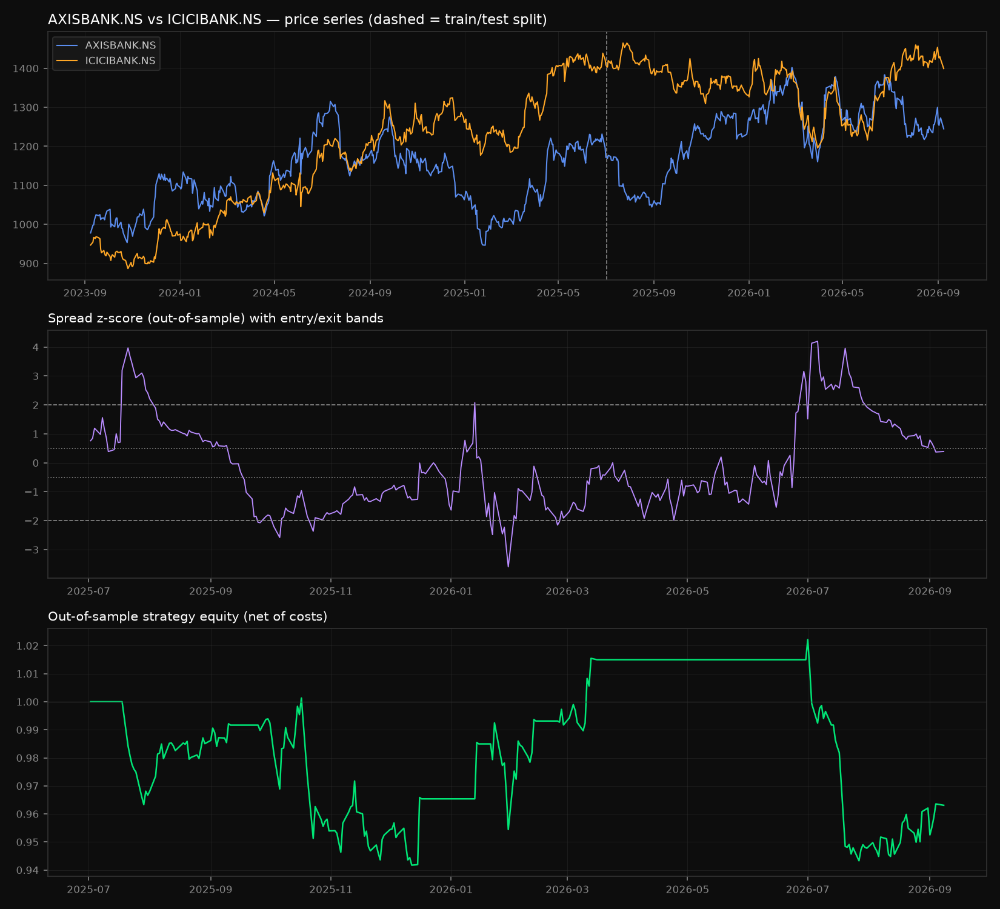

---

### KOTAKBANK.NS / HDFCBANK.NS

- **Latest prices:** KOTAKBANK.NS ₹419.25 · HDFCBANK.NS ₹703.00
- **Hedge ratio (train-fitted):** 2.0722
- **Cointegration (train):** FAIL at 5% — ADF -2.41, p=0.1400
- **Persistence:** passed 5% in 0 of 49 real-data runs (strict tier: 0/49)
- **Spread half-life:** 25.9 days
- **Current z-score:** -1.68
- **Signal today:** watch (approaching band)
- ⚠️ _Pair did not cointegrate on training data. Any signal here is not statistically justified — observation only._

**Out-of-sample backtest** (beta frozen from train window):

| Metric | Value |
|---|---|
| Sharpe | 0.63 |
| Sortino | 0.47 |
| Annualised return | 3.96% |
| Annualised vol | 6.48% |
| Max drawdown | -4.23% |
| Round-trip trades | 6 |

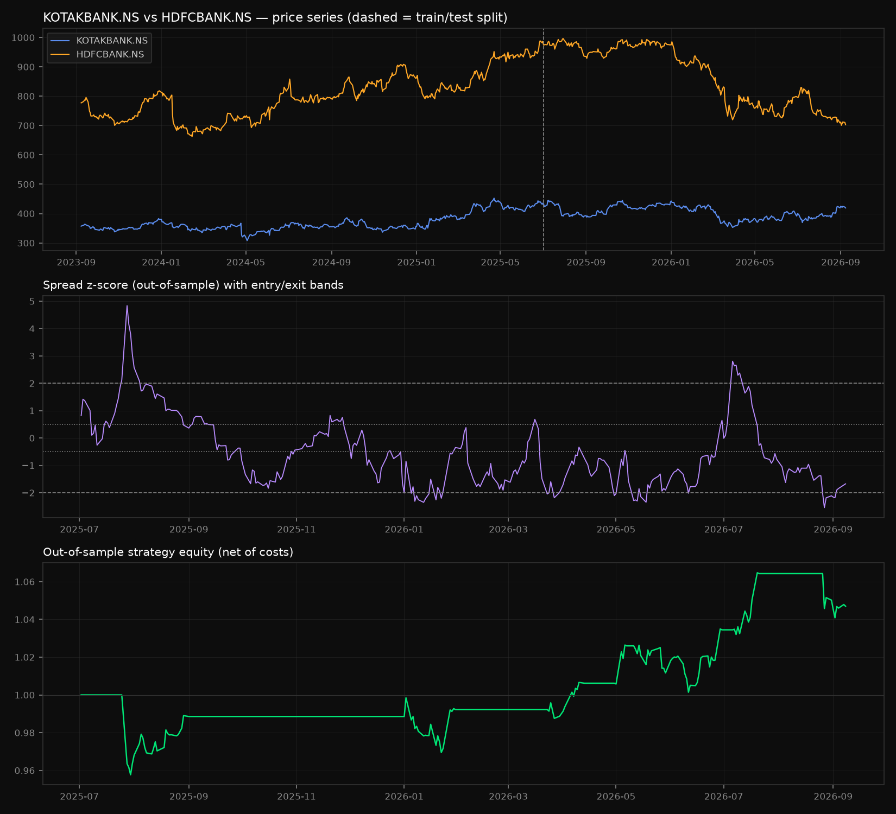

---

### SBIN.NS / BANKBARODA.NS

- **Latest prices:** SBIN.NS ₹1,008.00 · BANKBARODA.NS ₹236.60
- **Hedge ratio (train-fitted):** 0.1911
- **Cointegration (train):** FAIL at 5% — ADF -2.42, p=0.1369
- **Persistence:** passed 5% in 0 of 49 real-data runs (strict tier: 0/49)
- **Spread half-life:** 20.5 days
- **Current z-score:** -0.62
- **Signal today:** watch (approaching band)
- ⚠️ _Pair did not cointegrate on training data. Any signal here is not statistically justified — observation only._

**Out-of-sample backtest** (beta frozen from train window):

| Metric | Value |
|---|---|
| Sharpe | -0.07 |
| Sortino | -0.05 |
| Annualised return | -0.99% |
| Annualised vol | 8.99% |
| Max drawdown | -8.72% |
| Round-trip trades | 4 |

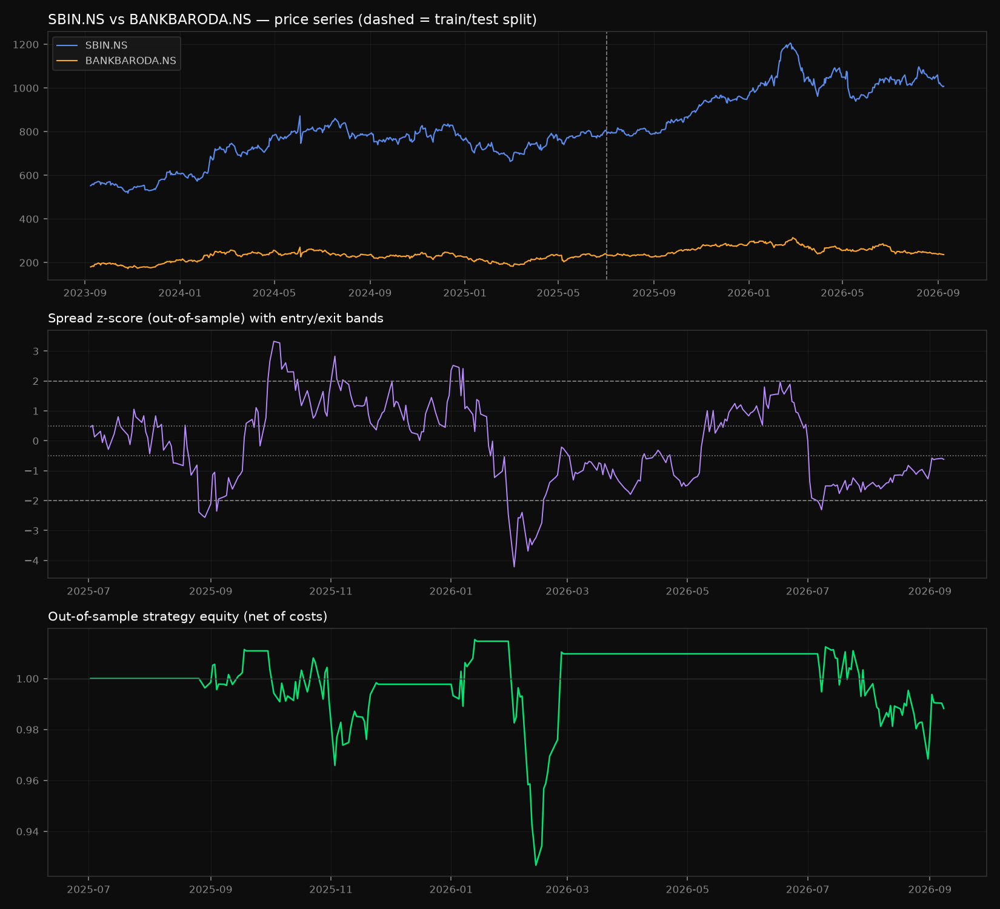

---

### TCS.NS / INFY.NS

- **Latest prices:** TCS.NS ₹2,255.50 · INFY.NS ₹1,082.00
- **Hedge ratio (train-fitted):** 0.4935
- **Cointegration (train):** FAIL at 5% — ADF -1.28, p=0.6381
- **Persistence:** passed 5% in 0 of 49 real-data runs (strict tier: 0/49)
- **Spread half-life:** 59.5 days
- **Current z-score:** -0.82
- **Signal today:** watch (approaching band)
- ⚠️ _Pair did not cointegrate on training data. Any signal here is not statistically justified — observation only._

**Out-of-sample backtest** (beta frozen from train window):

| Metric | Value |
|---|---|
| Sharpe | 2.16 |
| Sortino | 2.15 |
| Annualised return | 9.13% |
| Annualised vol | 4.09% |
| Max drawdown | -1.32% |
| Round-trip trades | 7 |

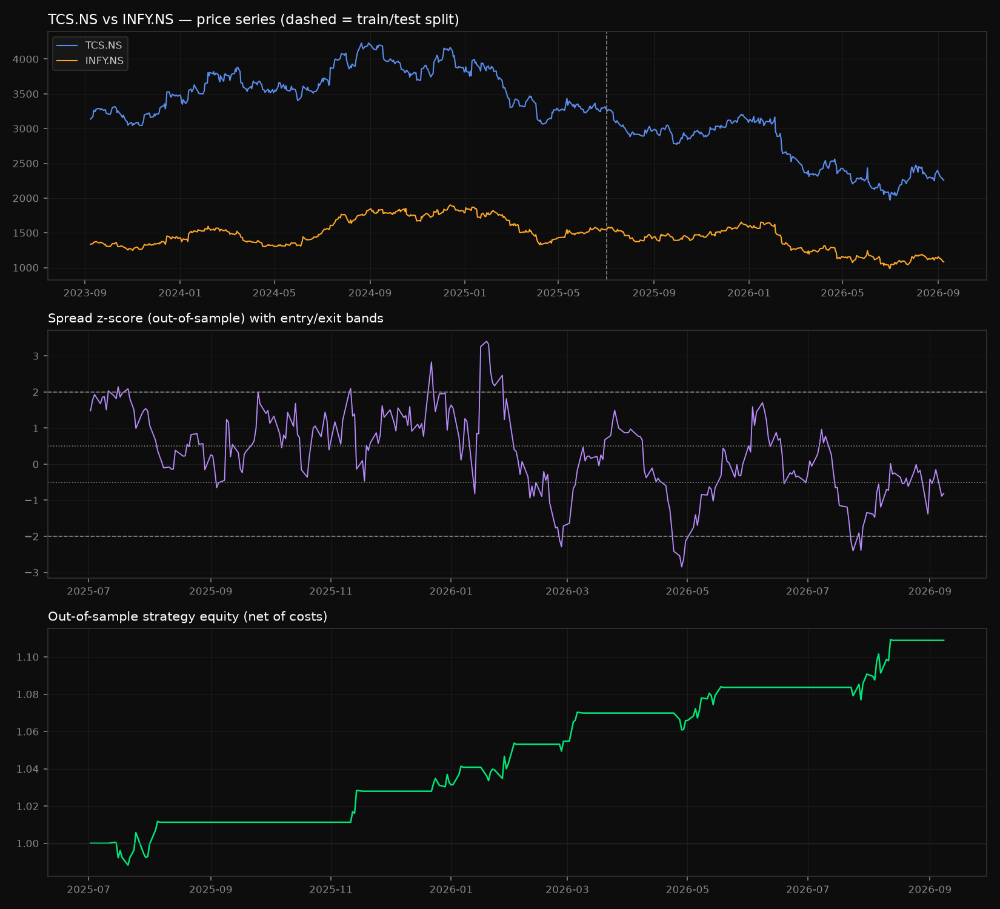

---

### INFY.NS / WIPRO.NS

- **Latest prices:** INFY.NS ₹1,082.00 · WIPRO.NS ₹171.50
- **Hedge ratio (train-fitted):** 0.1343
- **Cointegration (train):** FAIL at 5% — ADF -2.19, p=0.2095
- **Persistence:** passed 5% in 0 of 49 real-data runs (strict tier: 0/49)
- **Spread half-life:** 31.4 days
- **Current z-score:** -1.08
- **Signal today:** watch (approaching band)
- ⚠️ _Pair did not cointegrate on training data. Any signal here is not statistically justified — observation only._

**Out-of-sample backtest** (beta frozen from train window):

| Metric | Value |
|---|---|
| Sharpe | 1.68 |
| Sortino | 1.96 |
| Annualised return | 8.53% |
| Annualised vol | 4.95% |
| Max drawdown | -2.30% |
| Round-trip trades | 6 |

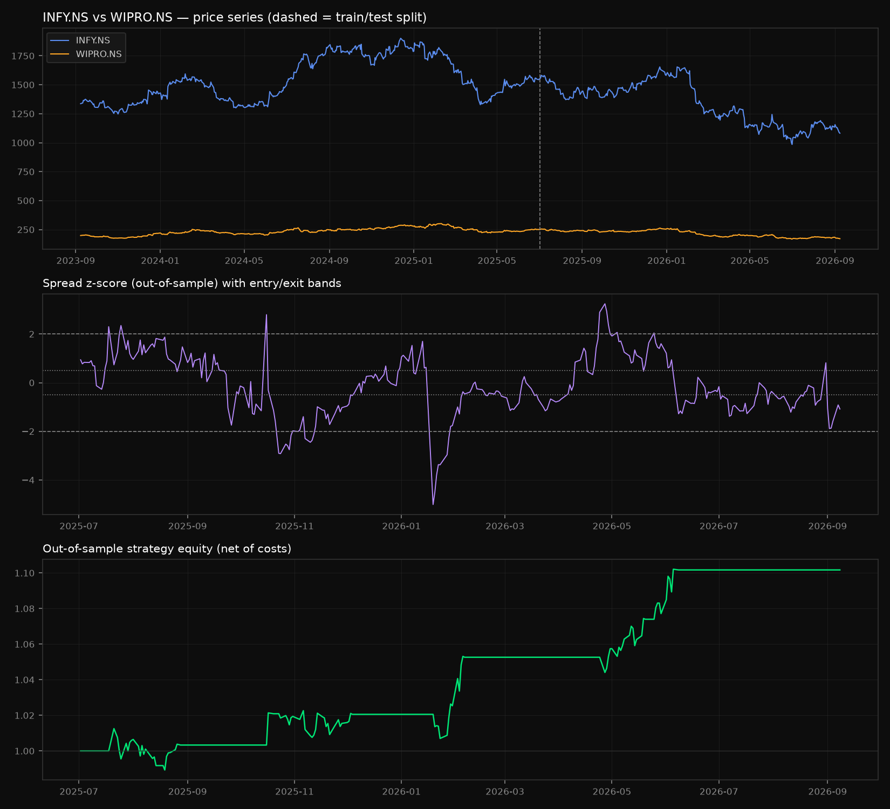

---

### HCLTECH.NS / TECHM.NS

- **Latest prices:** HCLTECH.NS ₹1,277.00 · TECHM.NS ₹1,559.00
- **Hedge ratio (train-fitted):** 0.8949
- **Cointegration (train):** FAIL at 5% — ADF -2.18, p=0.2146
- **Persistence:** passed 5% in 0 of 49 real-data runs (strict tier: 0/49)
- **Spread half-life:** 23.0 days
- **Current z-score:** -0.44
- **Signal today:** flat / no stretch
- ⚠️ _Pair did not cointegrate on training data. Any signal here is not statistically justified — observation only._

**Out-of-sample backtest** (beta frozen from train window):

| Metric | Value |
|---|---|
| Sharpe | 0.02 |
| Sortino | 0.02 |
| Annualised return | -0.10% |
| Annualised vol | 6.74% |
| Max drawdown | -7.61% |
| Round-trip trades | 5 |

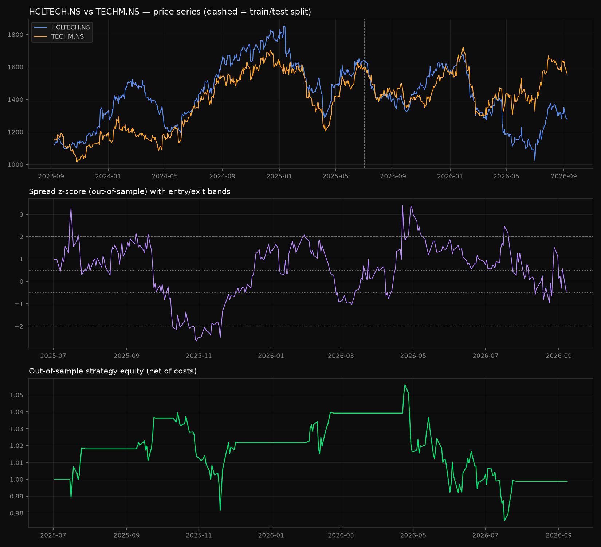

---

### ACC.NS / AMBUJACEM.NS

- **Latest prices:** ACC.NS ₹1,262.80 · AMBUJACEM.NS ₹398.30
- **Hedge ratio (train-fitted):** 0.2027
- **Cointegration (train):** FAIL at 5% — ADF -1.14, p=0.6999
- **Persistence:** passed 5% in 0 of 49 real-data runs (strict tier: 0/49)
- **Spread half-life:** 69.4 days
- **Current z-score:** -2.09
- **Signal today:** LONG spread (long AMBUJACEM.NS, short ACC.NS)
- ⚠️ _Pair did not cointegrate on training data. Any signal here is not statistically justified — observation only._

**Out-of-sample backtest** (beta frozen from train window):

| Metric | Value |
|---|---|
| Sharpe | 0.49 |
| Sortino | 0.43 |
| Annualised return | 2.82% |
| Annualised vol | 5.98% |
| Max drawdown | -6.97% |
| Round-trip trades | 4 |

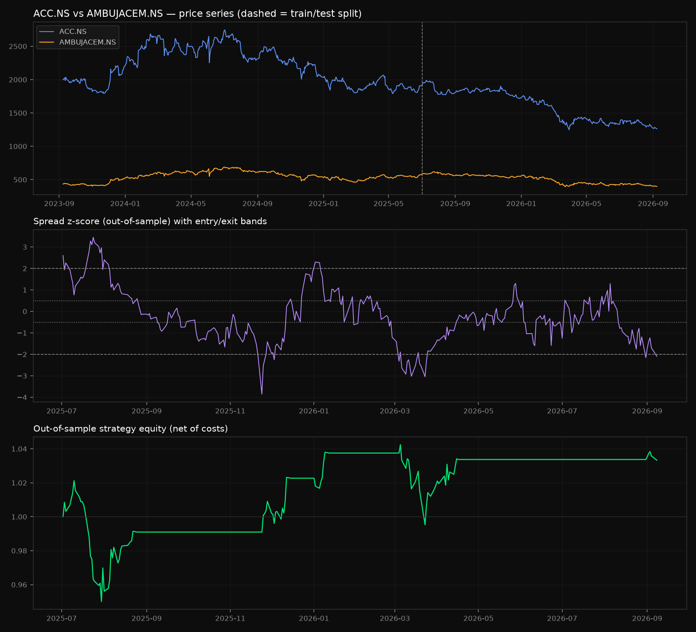

---

### ULTRACEMCO.NS / SHREECEM.NS

- **Latest prices:** ULTRACEMCO.NS ₹11,009.00 · SHREECEM.NS ₹23,160.00
- **Hedge ratio (train-fitted):** 0.6526
- **Cointegration (train):** FAIL at 5% — ADF -2.09, p=0.2497
- **Persistence:** passed 5% in 0 of 49 real-data runs (strict tier: 0/49)
- **Spread half-life:** 41.6 days
- **Current z-score:** -1.87
- **Signal today:** watch (approaching band)
- ⚠️ _Pair did not cointegrate on training data. Any signal here is not statistically justified — observation only._

**Out-of-sample backtest** (beta frozen from train window):

| Metric | Value |
|---|---|
| Sharpe | 0.24 |
| Sortino | 0.25 |
| Annualised return | 1.51% |
| Annualised vol | 7.50% |
| Max drawdown | -8.70% |
| Round-trip trades | 5 |

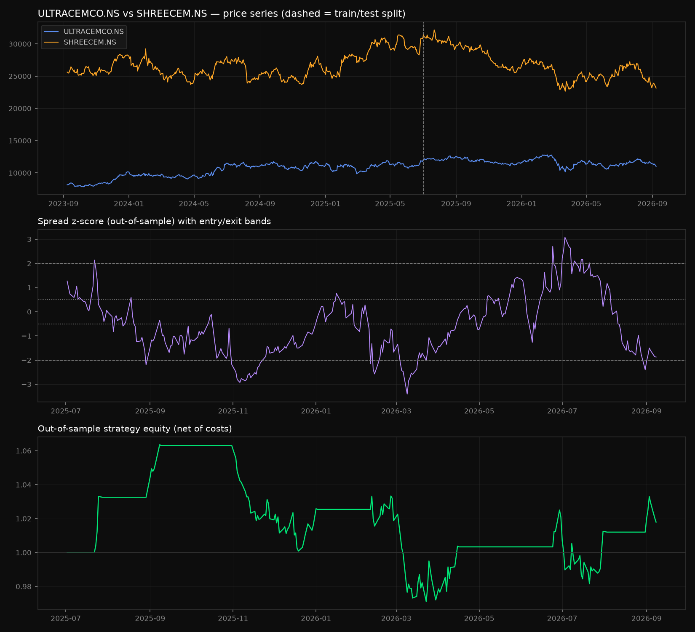

---

### IOC.NS / BPCL.NS

- **Latest prices:** IOC.NS ₹134.35 · BPCL.NS ₹303.85
- **Hedge ratio (train-fitted):** 1.7445
- **Cointegration (train):** FAIL at 5% — ADF -0.73, p=0.8382
- **Persistence:** passed 5% in 0 of 49 real-data runs (strict tier: 0/49)
- **Spread half-life:** 155.9 days
- **Current z-score:** -0.20
- **Signal today:** flat / no stretch
- ⚠️ _Pair did not cointegrate on training data. Any signal here is not statistically justified — observation only._

**Out-of-sample backtest** (beta frozen from train window):

| Metric | Value |
|---|---|
| Sharpe | 0.42 |
| Sortino | 0.44 |
| Annualised return | 2.49% |
| Annualised vol | 6.40% |
| Max drawdown | -6.43% |
| Round-trip trades | 7 |

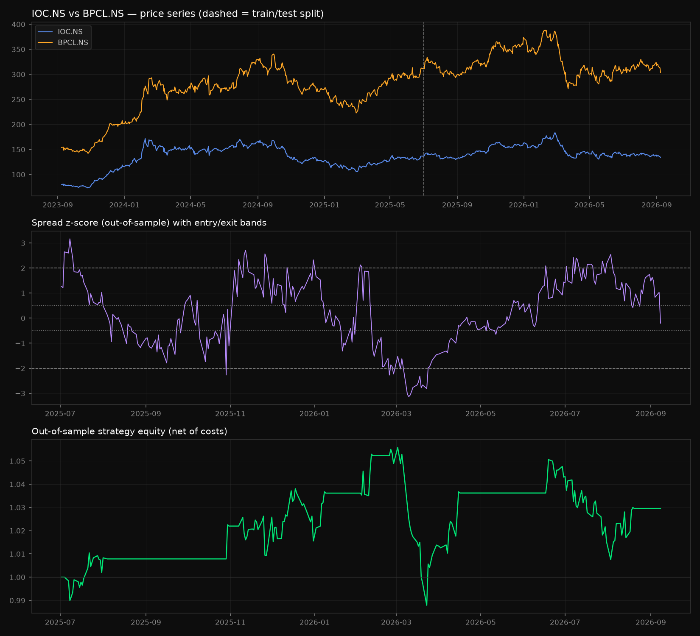

---

### BPCL.NS / HINDPETRO.NS

- **Latest prices:** BPCL.NS ₹303.85 · HINDPETRO.NS ₹347.00
- **Hedge ratio (train-fitted):** 1.3524
- **Cointegration (train):** FAIL at 5% — ADF -1.87, p=0.3448
- **Persistence:** passed 5% in 0 of 49 real-data runs (strict tier: 0/49)
- **Spread half-life:** 41.4 days
- **Current z-score:** -1.07
- **Signal today:** watch (approaching band)
- ⚠️ _Pair did not cointegrate on training data. Any signal here is not statistically justified — observation only._

**Out-of-sample backtest** (beta frozen from train window):

| Metric | Value |
|---|---|
| Sharpe | -0.04 |
| Sortino | -0.04 |
| Annualised return | -0.41% |
| Annualised vol | 5.73% |
| Max drawdown | -6.53% |
| Round-trip trades | 4 |

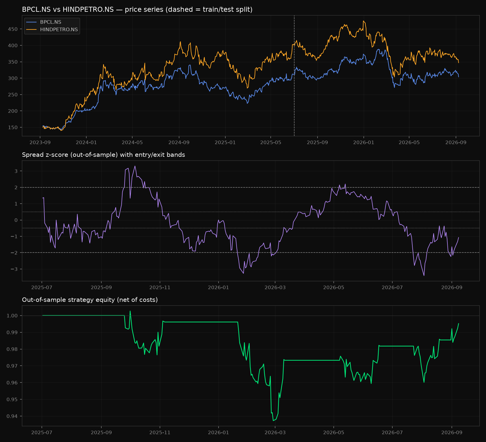

---

### ONGC.NS / COALINDIA.NS

- **Latest prices:** ONGC.NS ₹236.00 · COALINDIA.NS ₹420.25
- **Hedge ratio (train-fitted):** 1.4815
- **Cointegration (train):** PASS at 5% — ADF -3.34, p=0.0131
- **Persistence:** passed 5% in 41 of 49 real-data runs (strict tier: 1/49)
- **Spread half-life:** 12.7 days
- **Current z-score:** +0.93
- **Signal today:** watch (approaching band)

**Out-of-sample backtest** (beta frozen from train window):

| Metric | Value |
|---|---|
| Sharpe | 0.48 |
| Sortino | 0.34 |
| Annualised return | 3.21% |
| Annualised vol | 7.17% |
| Max drawdown | -6.07% |
| Round-trip trades | 4 |

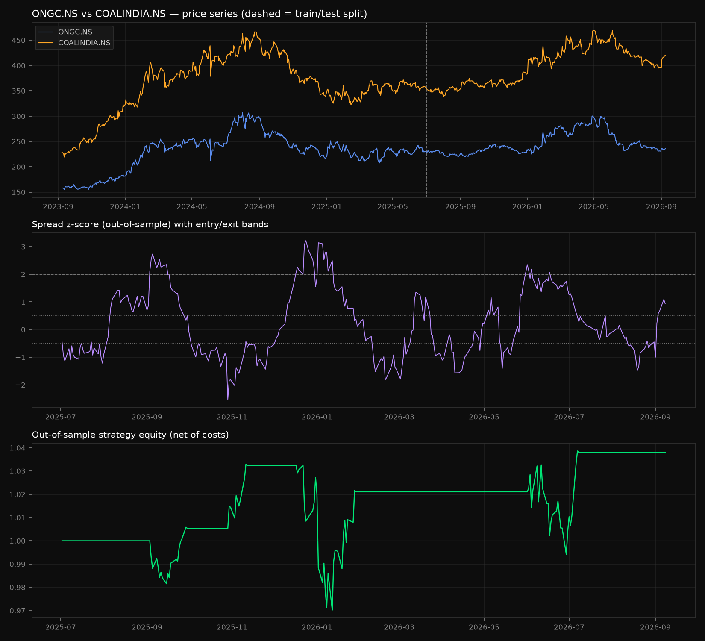

---

### NTPC.NS / POWERGRID.NS

- **Latest prices:** NTPC.NS ₹330.80 · POWERGRID.NS ₹265.75
- **Hedge ratio (train-fitted):** 0.8379
- **Cointegration (train):** FAIL at 5% — ADF -2.51, p=0.1125
- **Persistence:** passed 5% in 0 of 49 real-data runs (strict tier: 0/49)
- **Spread half-life:** 23.8 days
- **Current z-score:** -0.72
- **Signal today:** watch (approaching band)
- ⚠️ _Pair did not cointegrate on training data. Any signal here is not statistically justified — observation only._

**Out-of-sample backtest** (beta frozen from train window):

| Metric | Value |
|---|---|
| Sharpe | 0.42 |
| Sortino | 0.33 |
| Annualised return | 2.22% |
| Annualised vol | 5.55% |
| Max drawdown | -5.28% |
| Round-trip trades | 6 |

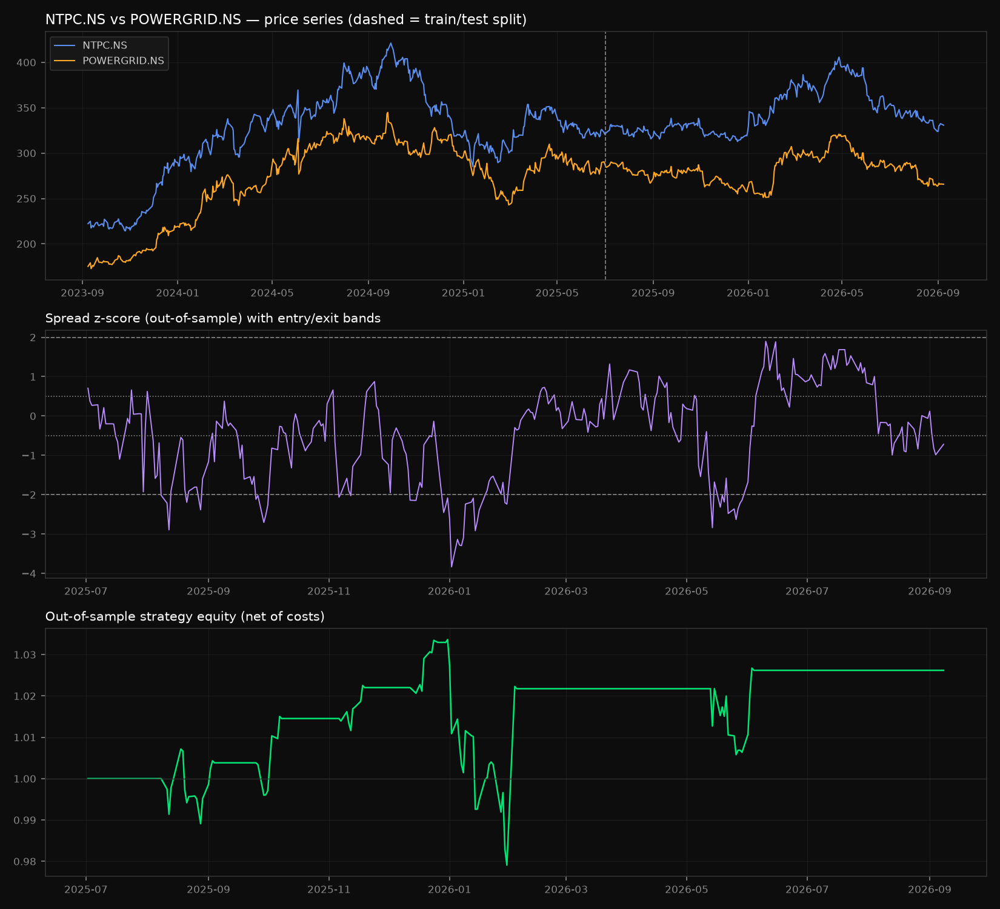

---

### BAJAJ-AUTO.NS / HEROMOTOCO.NS

- **Latest prices:** BAJAJ-AUTO.NS ₹11,880.00 · HEROMOTOCO.NS ₹5,333.50
- **Hedge ratio (train-fitted):** 0.4102
- **Cointegration (train):** FAIL at 5% — ADF -2.26, p=0.1841
- **Persistence:** passed 5% in 0 of 49 real-data runs (strict tier: 0/49)
- **Spread half-life:** 29.9 days
- **Current z-score:** -1.34
- **Signal today:** watch (approaching band)
- ⚠️ _Pair did not cointegrate on training data. Any signal here is not statistically justified — observation only._

**Out-of-sample backtest** (beta frozen from train window):

| Metric | Value |
|---|---|
| Sharpe | -0.72 |
| Sortino | -0.74 |
| Annualised return | -7.87% |
| Annualised vol | 10.64% |
| Max drawdown | -21.04% |
| Round-trip trades | 5 |

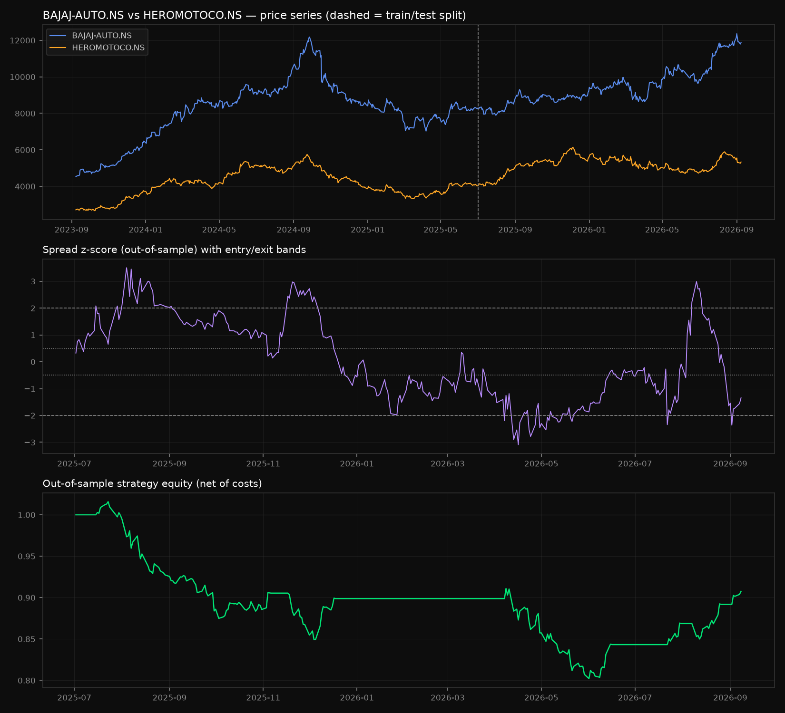

---

### TATASTEEL.NS / JSWSTEEL.NS

- **Latest prices:** TATASTEEL.NS ₹184.15 · JSWSTEEL.NS ₹1,297.30
- **Hedge ratio (train-fitted):** 3.0905
- **Cointegration (train):** FAIL at 5% — ADF -1.13, p=0.7039
- **Persistence:** passed 5% in 0 of 49 real-data runs (strict tier: 0/49)
- **Spread half-life:** 73.3 days
- **Current z-score:** +0.99
- **Signal today:** watch (approaching band)
- ⚠️ _Pair did not cointegrate on training data. Any signal here is not statistically justified — observation only._

**Out-of-sample backtest** (beta frozen from train window):

| Metric | Value |
|---|---|
| Sharpe | 0.17 |
| Sortino | 0.16 |
| Annualised return | 1.07% |
| Annualised vol | 7.93% |
| Max drawdown | -5.40% |
| Round-trip trades | 4 |

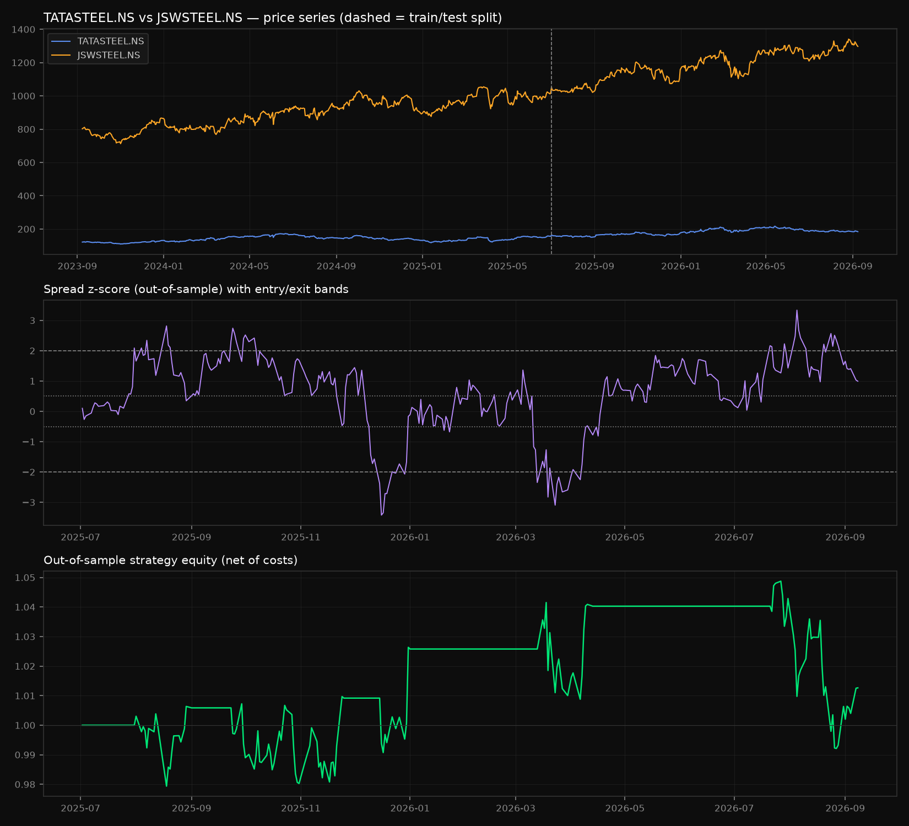

---

### SUNPHARMA.NS / CIPLA.NS

- **Latest prices:** SUNPHARMA.NS ₹1,885.90 · CIPLA.NS ₹1,384.00
- **Hedge ratio (train-fitted):** 0.4968
- **Cointegration (train):** PASS at 5% — ADF -3.35, p=0.0127
- **Persistence:** passed 5% in 49 of 49 real-data runs (strict tier: 5/49)
- **Spread half-life:** 10.8 days
- **Current z-score:** -1.21
- **Signal today:** watch (approaching band)

**Out-of-sample backtest** (beta frozen from train window):

| Metric | Value |
|---|---|
| Sharpe | -0.11 |
| Sortino | -0.12 |
| Annualised return | -1.12% |
| Annualised vol | 7.64% |
| Max drawdown | -10.24% |
| Round-trip trades | 4 |

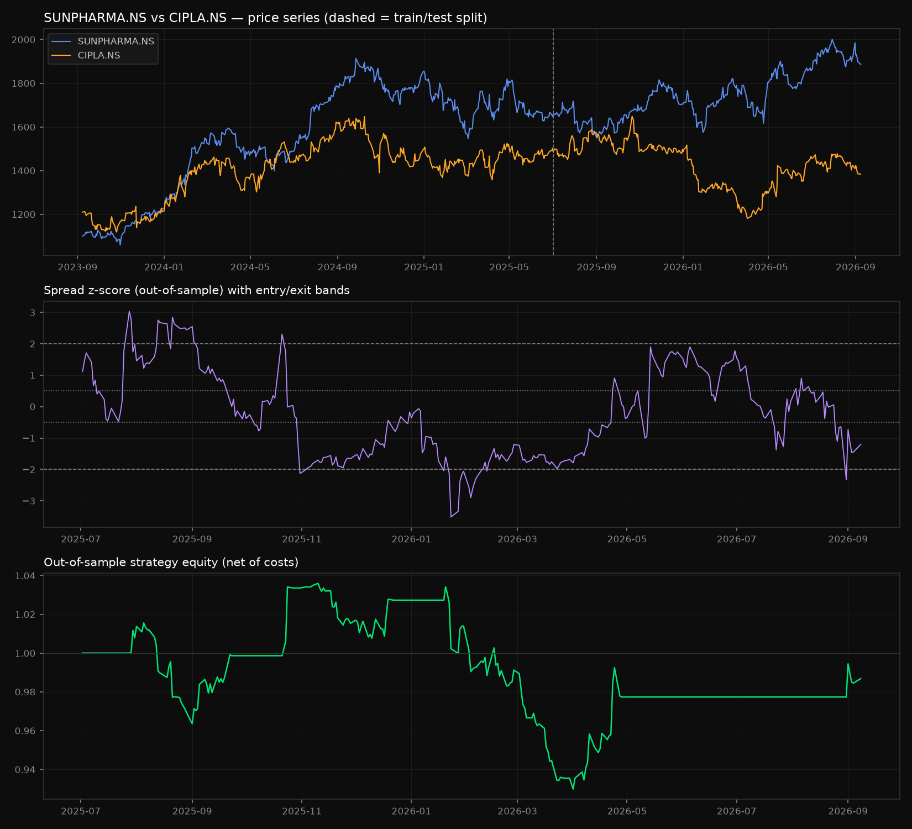

---

_Generated 2026-09-08 · pairs mean-reversion scanner · out-of-sample backtest · multiple-testing-aware · not investment advice._
