# Indian Pairs-Trading Scanner — 2026-09-09

> **What this is:** a market-neutral *pairs mean-reversion* scanner. It flags when two related NSE stocks have drifted apart far enough that their historical relationship signals a possible convergence trade. It does **not** forecast growth, rank "best" stocks, or predict company performance. A signal means the *spread between two stocks* is stretched — nothing about either stock being a good investment. Not investment advice; do your own research.

## Methodology (fixed in advance)

- **Universe:** 16 declared sector-mate pairs. Parameters (3y window, 60/40 train-test, z-entry 2.0, z-exit 0.5, 5 bps costs) are pre-registered; changes are logged in the README changelog *before* looking at results.
- **Multiple testing:** at the 5% level across 16 pairs, **≈0.8 false positives per run are expected by chance alone** even if nothing truly cointegrates. A single-day pass is a candidate, not a discovery.
- **Strict tier:** Bonferroni-corrected threshold p < 0.0031 (marked ✓✓).
- **Evidence = persistence:** the Persistence column counts how often each pair has passed the 5% test across all *real-data* daily runs recorded in `reports/history.csv`. Pairs deserve attention only when they pass persistently.

## Summary

| Pair | p-value | Coint. | Persistence | Current z | Signal | OOS Sharpe |
|---|---|---|---|---|---|---|
| HDFCBANK.NS/ICICIBANK.NS | 0.0609 | ✗ | 0/40 | +1.11 | watch | -0.71 |
| AXISBANK.NS/ICICIBANK.NS | 0.8641 | ✗ | 0/50 | +0.32 | flat / no stretch | -0.32 |
| KOTAKBANK.NS/HDFCBANK.NS | 0.1319 | ✗ | 0/50 | -1.68 | watch | 0.59 |
| SBIN.NS/BANKBARODA.NS | 0.1305 | ✗ | 0/50 | -0.68 | watch | -0.09 |
| TCS.NS/INFY.NS | 0.6523 | ✗ | 0/50 | -1.54 | watch | 2.16 |
| INFY.NS/WIPRO.NS | 0.2222 | ✗ | 0/50 | -0.52 | watch | 1.68 |
| HCLTECH.NS/TECHM.NS | 0.2034 | ✗ | 0/50 | -0.83 | watch | 0.01 |
| ACC.NS/AMBUJACEM.NS | 0.7717 | ✗ | 0/50 | -2.04 | LONG spread | 0.44 |
| ULTRACEMCO.NS/SHREECEM.NS | 0.2575 | ✗ | 0/50 | -1.91 | watch | 0.21 |
| IOC.NS/BPCL.NS | 0.8218 | ✗ | 0/50 | -0.60 | watch | 0.42 |
| BPCL.NS/HINDPETRO.NS | 0.3322 | ✗ | 0/50 | -0.84 | watch | -0.00 |
| ONGC.NS/COALINDIA.NS | 0.0109 | ✓ | 42/50 | +2.07 | SHORT spread | 0.48 |
| NTPC.NS/POWERGRID.NS | 0.1050 | ✗ | 0/50 | -1.30 | watch | 0.42 |
| BAJAJ-AUTO.NS/HEROMOTOCO.NS | 0.1783 | ✗ | 0/50 | -1.68 | watch | -0.80 |
| TATASTEEL.NS/JSWSTEEL.NS | 0.7275 | ✗ | 0/50 | +0.92 | watch | 0.18 |
| SUNPHARMA.NS/CIPLA.NS | 0.0118 | ✓ | 50/50 | -1.52 | watch | -0.16 |

_Legend: ✓✓ passes strict Bonferroni tier · ✓ passes 5% only · ✗ fails. Persistence = 5%-passes / real-data runs recorded. \*no real-data history yet._

---

### HDFCBANK.NS / ICICIBANK.NS

- **Latest prices:** HDFCBANK.NS ₹687.10 · ICICIBANK.NS ₹1,389.10
- **Hedge ratio (train-fitted):** 1.7108
- **Cointegration (train):** FAIL at 5% — ADF -2.78, p=0.0609
- **Persistence:** passed 5% in 0 of 40 real-data runs (strict tier: 0/40)
- **Spread half-life:** 24.5 days
- **Current z-score:** +1.11
- **Signal today:** watch (approaching band)
- ⚠️ _Pair did not cointegrate on training data. Any signal here is not statistically justified — observation only._

**Out-of-sample backtest** (beta frozen from train window):

| Metric | Value |
|---|---|
| Sharpe | -0.71 |
| Sortino | -0.77 |
| Annualised return | -4.75% |
| Annualised vol | 6.59% |
| Max drawdown | -8.45% |
| Round-trip trades | 4 |

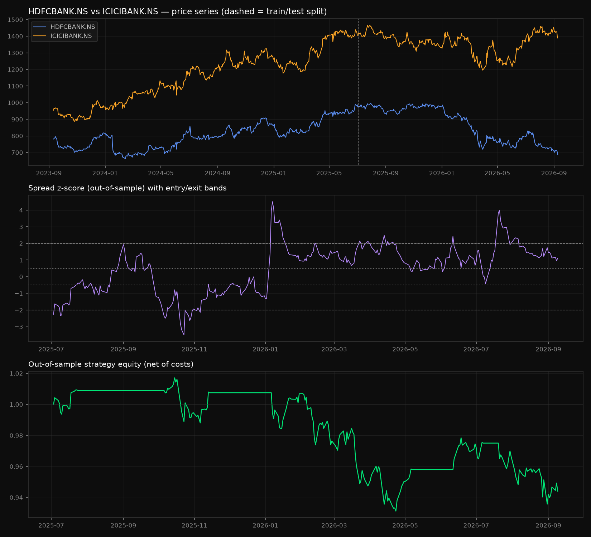

---

### AXISBANK.NS / ICICIBANK.NS

- **Latest prices:** AXISBANK.NS ₹1,238.50 · ICICIBANK.NS ₹1,389.10
- **Hedge ratio (train-fitted):** 0.9889
- **Cointegration (train):** FAIL at 5% — ADF -0.63, p=0.8641
- **Persistence:** passed 5% in 0 of 50 real-data runs (strict tier: 0/50)
- **Spread half-life:** 173.6 days
- **Current z-score:** +0.32
- **Signal today:** flat / no stretch
- ⚠️ _Pair did not cointegrate on training data. Any signal here is not statistically justified — observation only._

**Out-of-sample backtest** (beta frozen from train window):

| Metric | Value |
|---|---|
| Sharpe | -0.32 |
| Sortino | -0.32 |
| Annualised return | -3.15% |
| Annualised vol | 8.78% |
| Max drawdown | -7.74% |
| Round-trip trades | 6 |

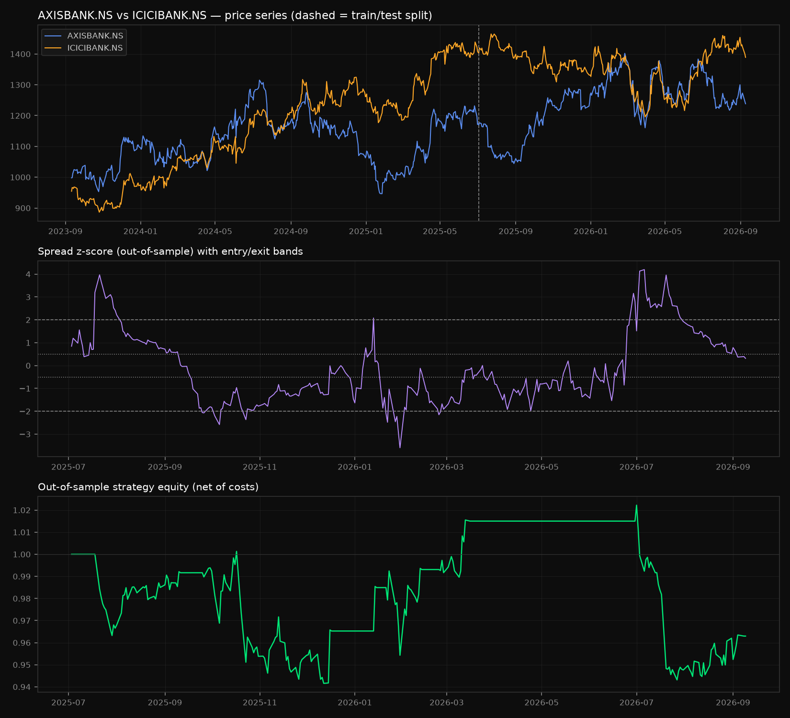

---

### KOTAKBANK.NS / HDFCBANK.NS

- **Latest prices:** KOTAKBANK.NS ₹414.00 · HDFCBANK.NS ₹687.10
- **Hedge ratio (train-fitted):** 2.0789
- **Cointegration (train):** FAIL at 5% — ADF -2.44, p=0.1319
- **Persistence:** passed 5% in 0 of 50 real-data runs (strict tier: 0/50)
- **Spread half-life:** 25.6 days
- **Current z-score:** -1.68
- **Signal today:** watch (approaching band)
- ⚠️ _Pair did not cointegrate on training data. Any signal here is not statistically justified — observation only._

**Out-of-sample backtest** (beta frozen from train window):

| Metric | Value |
|---|---|
| Sharpe | 0.59 |
| Sortino | 0.44 |
| Annualised return | 3.74% |
| Annualised vol | 6.55% |
| Max drawdown | -4.27% |
| Round-trip trades | 6 |

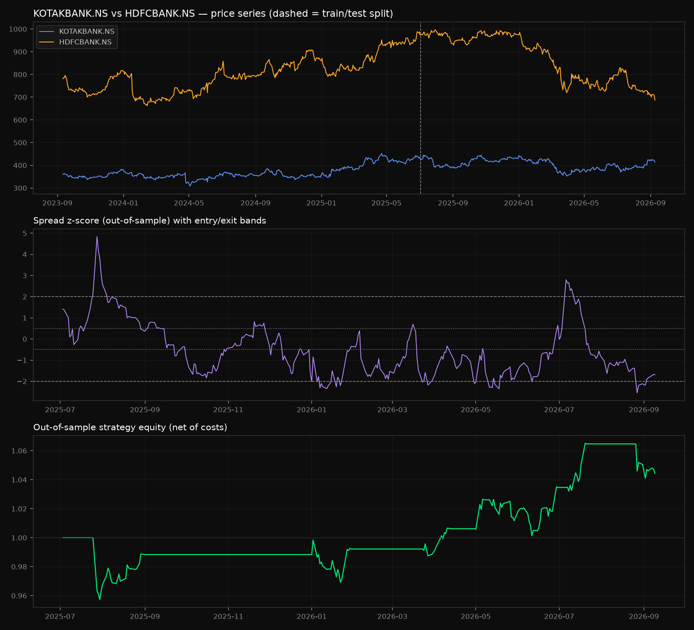

---

### SBIN.NS / BANKBARODA.NS

- **Latest prices:** SBIN.NS ₹1,000.50 · BANKBARODA.NS ₹234.10
- **Hedge ratio (train-fitted):** 0.1907
- **Cointegration (train):** FAIL at 5% — ADF -2.44, p=0.1305
- **Persistence:** passed 5% in 0 of 50 real-data runs (strict tier: 0/50)
- **Spread half-life:** 20.6 days
- **Current z-score:** -0.68
- **Signal today:** watch (approaching band)
- ⚠️ _Pair did not cointegrate on training data. Any signal here is not statistically justified — observation only._

**Out-of-sample backtest** (beta frozen from train window):

| Metric | Value |
|---|---|
| Sharpe | -0.09 |
| Sortino | -0.08 |
| Annualised return | -1.23% |
| Annualised vol | 9.04% |
| Max drawdown | -8.75% |
| Round-trip trades | 4 |

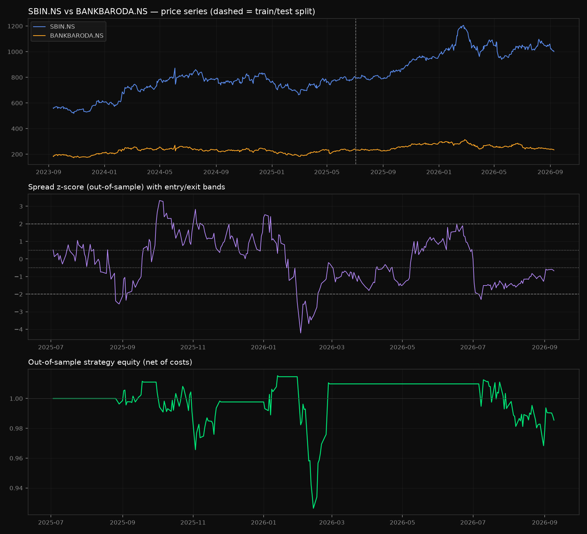

---

### TCS.NS / INFY.NS

- **Latest prices:** TCS.NS ₹2,208.00 · INFY.NS ₹1,035.00
- **Hedge ratio (train-fitted):** 0.4925
- **Cointegration (train):** FAIL at 5% — ADF -1.25, p=0.6523
- **Persistence:** passed 5% in 0 of 50 real-data runs (strict tier: 0/50)
- **Spread half-life:** 61.1 days
- **Current z-score:** -1.54
- **Signal today:** watch (approaching band)
- ⚠️ _Pair did not cointegrate on training data. Any signal here is not statistically justified — observation only._

**Out-of-sample backtest** (beta frozen from train window):

| Metric | Value |
|---|---|
| Sharpe | 2.16 |
| Sortino | 2.16 |
| Annualised return | 9.16% |
| Annualised vol | 4.09% |
| Max drawdown | -1.32% |
| Round-trip trades | 7 |

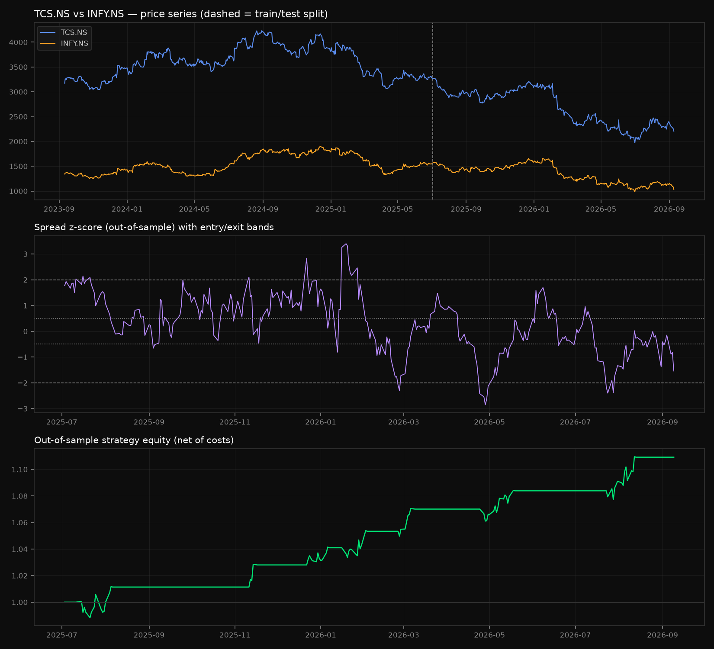

---

### INFY.NS / WIPRO.NS

- **Latest prices:** INFY.NS ₹1,035.00 · WIPRO.NS ₹167.00
- **Hedge ratio (train-fitted):** 0.1342
- **Cointegration (train):** FAIL at 5% — ADF -2.16, p=0.2222
- **Persistence:** passed 5% in 0 of 50 real-data runs (strict tier: 0/50)
- **Spread half-life:** 31.9 days
- **Current z-score:** -0.52
- **Signal today:** watch (approaching band)
- ⚠️ _Pair did not cointegrate on training data. Any signal here is not statistically justified — observation only._

**Out-of-sample backtest** (beta frozen from train window):

| Metric | Value |
|---|---|
| Sharpe | 1.68 |
| Sortino | 1.96 |
| Annualised return | 8.51% |
| Annualised vol | 4.94% |
| Max drawdown | -2.29% |
| Round-trip trades | 6 |

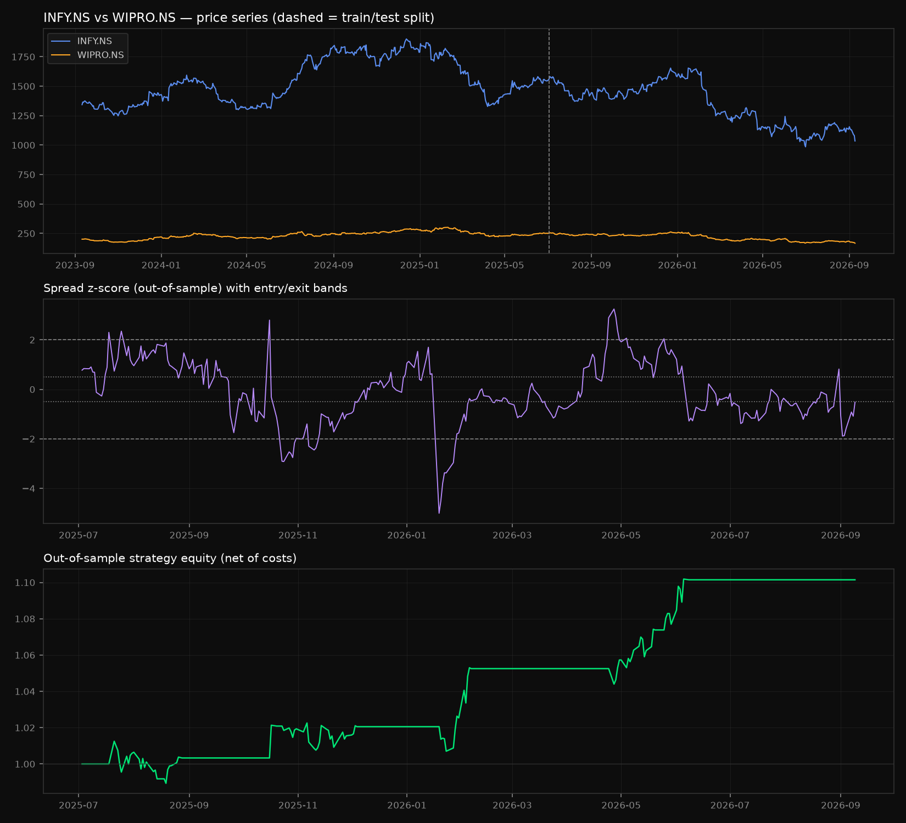

---

### HCLTECH.NS / TECHM.NS

- **Latest prices:** HCLTECH.NS ₹1,229.80 · TECHM.NS ₹1,508.00
- **Hedge ratio (train-fitted):** 0.8976
- **Cointegration (train):** FAIL at 5% — ADF -2.21, p=0.2034
- **Persistence:** passed 5% in 0 of 50 real-data runs (strict tier: 0/50)
- **Spread half-life:** 23.3 days
- **Current z-score:** -0.83
- **Signal today:** watch (approaching band)
- ⚠️ _Pair did not cointegrate on training data. Any signal here is not statistically justified — observation only._

**Out-of-sample backtest** (beta frozen from train window):

| Metric | Value |
|---|---|
| Sharpe | 0.01 |
| Sortino | 0.01 |
| Annualised return | -0.13% |
| Annualised vol | 6.76% |
| Max drawdown | -7.62% |
| Round-trip trades | 5 |

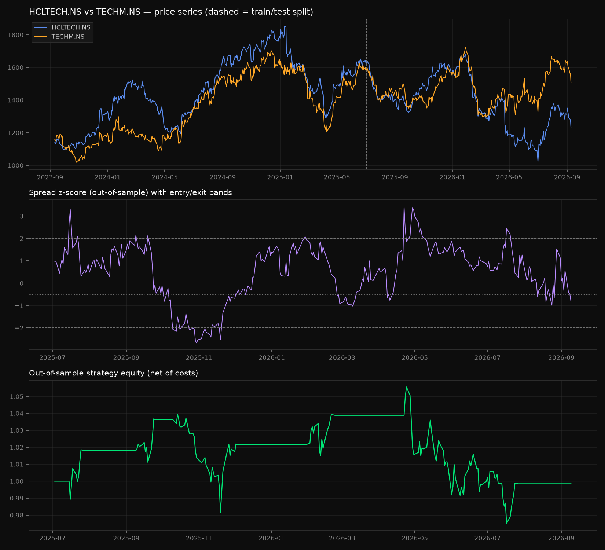

---

### ACC.NS / AMBUJACEM.NS

- **Latest prices:** ACC.NS ₹1,257.70 · AMBUJACEM.NS ₹397.00
- **Hedge ratio (train-fitted):** 0.2015
- **Cointegration (train):** FAIL at 5% — ADF -0.95, p=0.7717
- **Persistence:** passed 5% in 0 of 50 real-data runs (strict tier: 0/50)
- **Spread half-life:** 82.4 days
- **Current z-score:** -2.04
- **Signal today:** LONG spread (long AMBUJACEM.NS, short ACC.NS)
- ⚠️ _Pair did not cointegrate on training data. Any signal here is not statistically justified — observation only._

**Out-of-sample backtest** (beta frozen from train window):

| Metric | Value |
|---|---|
| Sharpe | 0.44 |
| Sortino | 0.38 |
| Annualised return | 2.48% |
| Annualised vol | 5.94% |
| Max drawdown | -6.98% |
| Round-trip trades | 4 |

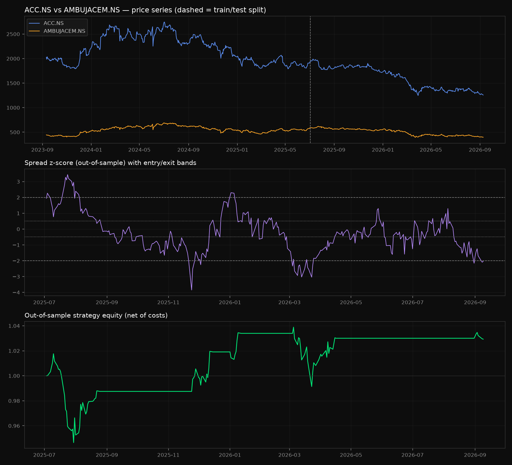

---

### ULTRACEMCO.NS / SHREECEM.NS

- **Latest prices:** ULTRACEMCO.NS ₹10,900.00 · SHREECEM.NS ₹22,950.00
- **Hedge ratio (train-fitted):** 0.6665
- **Cointegration (train):** FAIL at 5% — ADF -2.07, p=0.2575
- **Persistence:** passed 5% in 0 of 50 real-data runs (strict tier: 0/50)
- **Spread half-life:** 44.1 days
- **Current z-score:** -1.91
- **Signal today:** watch (approaching band)
- ⚠️ _Pair did not cointegrate on training data. Any signal here is not statistically justified — observation only._

**Out-of-sample backtest** (beta frozen from train window):

| Metric | Value |
|---|---|
| Sharpe | 0.21 |
| Sortino | 0.22 |
| Annualised return | 1.28% |
| Annualised vol | 7.48% |
| Max drawdown | -8.63% |
| Round-trip trades | 5 |

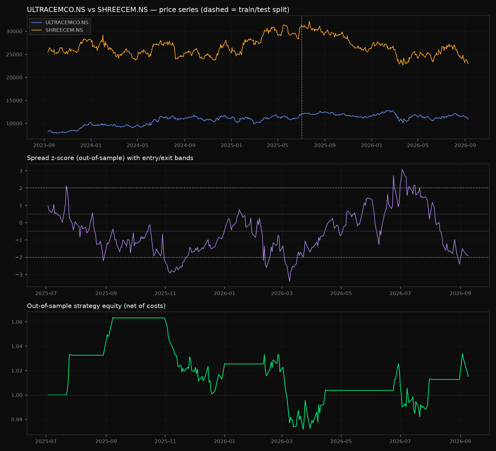

---

### IOC.NS / BPCL.NS

- **Latest prices:** IOC.NS ₹135.60 · BPCL.NS ₹303.55
- **Hedge ratio (train-fitted):** 1.7429
- **Cointegration (train):** FAIL at 5% — ADF -0.79, p=0.8218
- **Persistence:** passed 5% in 0 of 50 real-data runs (strict tier: 0/50)
- **Spread half-life:** 144.9 days
- **Current z-score:** -0.60
- **Signal today:** watch (approaching band)
- ⚠️ _Pair did not cointegrate on training data. Any signal here is not statistically justified — observation only._

**Out-of-sample backtest** (beta frozen from train window):

| Metric | Value |
|---|---|
| Sharpe | 0.42 |
| Sortino | 0.44 |
| Annualised return | 2.49% |
| Annualised vol | 6.41% |
| Max drawdown | -6.45% |
| Round-trip trades | 7 |

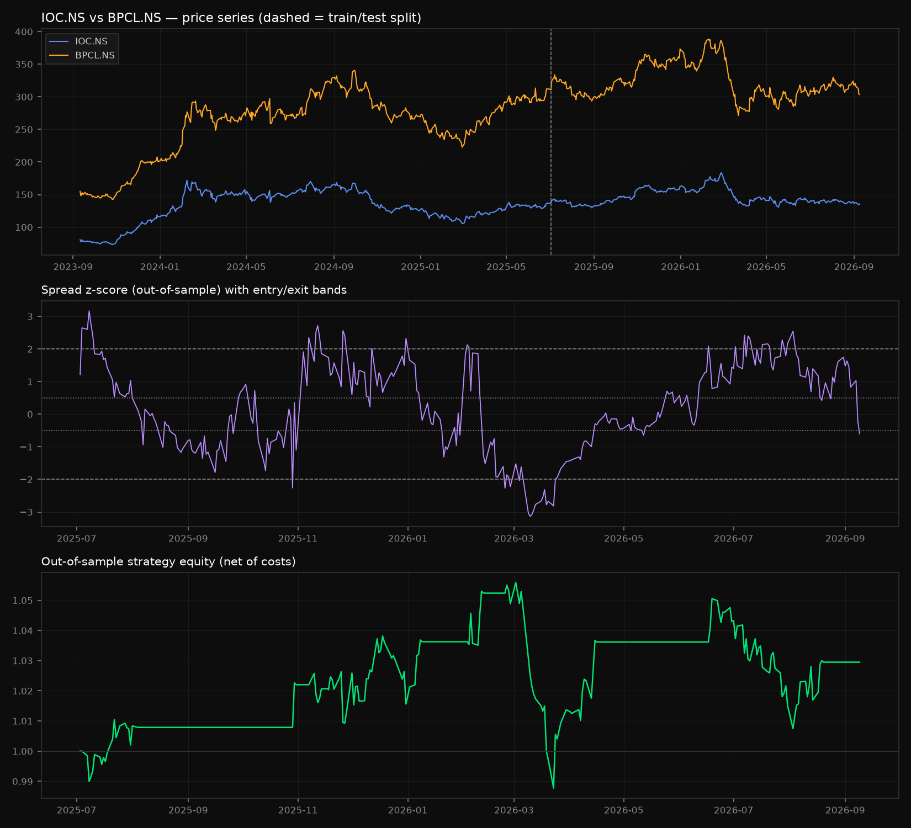

---

### BPCL.NS / HINDPETRO.NS

- **Latest prices:** BPCL.NS ₹303.55 · HINDPETRO.NS ₹348.90
- **Hedge ratio (train-fitted):** 1.3522
- **Cointegration (train):** FAIL at 5% — ADF -1.90, p=0.3322
- **Persistence:** passed 5% in 0 of 50 real-data runs (strict tier: 0/50)
- **Spread half-life:** 40.8 days
- **Current z-score:** -0.84
- **Signal today:** watch (approaching band)
- ⚠️ _Pair did not cointegrate on training data. Any signal here is not statistically justified — observation only._

**Out-of-sample backtest** (beta frozen from train window):

| Metric | Value |
|---|---|
| Sharpe | -0.00 |
| Sortino | -0.00 |
| Annualised return | -0.17% |
| Annualised vol | 5.74% |
| Max drawdown | -6.53% |
| Round-trip trades | 4 |

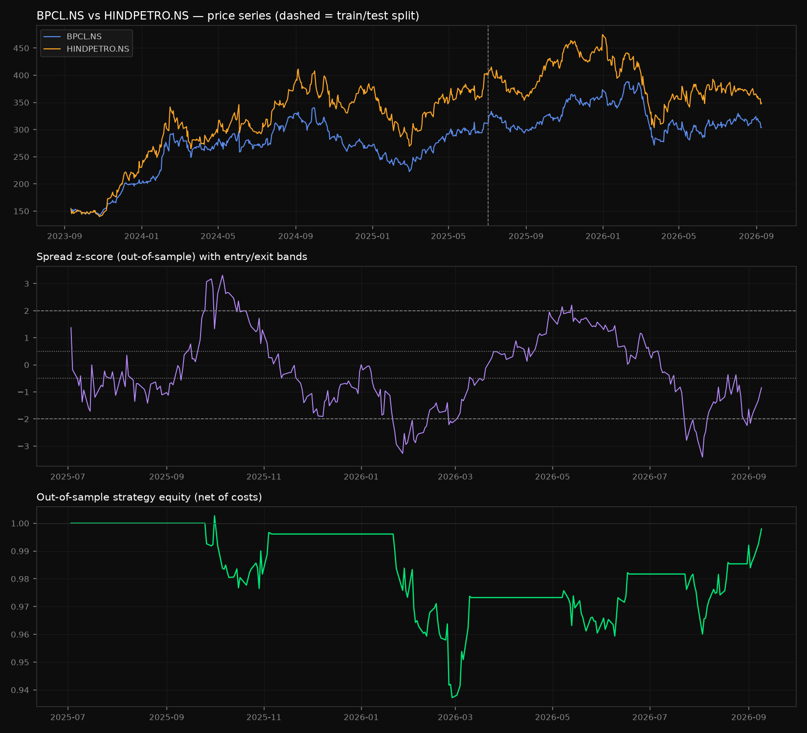

---

### ONGC.NS / COALINDIA.NS

- **Latest prices:** ONGC.NS ₹234.02 · COALINDIA.NS ₹431.00
- **Hedge ratio (train-fitted):** 1.4780
- **Cointegration (train):** PASS at 5% — ADF -3.40, p=0.0109
- **Persistence:** passed 5% in 42 of 50 real-data runs (strict tier: 1/50)
- **Spread half-life:** 12.6 days
- **Current z-score:** +2.07
- **Signal today:** SHORT spread (short COALINDIA.NS, long ONGC.NS)

**Out-of-sample backtest** (beta frozen from train window):

| Metric | Value |
|---|---|
| Sharpe | 0.48 |
| Sortino | 0.34 |
| Annualised return | 3.18% |
| Annualised vol | 7.13% |
| Max drawdown | -6.05% |
| Round-trip trades | 4 |

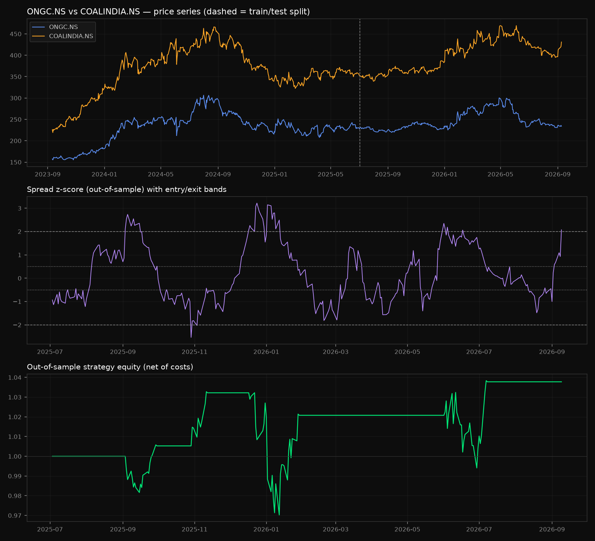

---

### NTPC.NS / POWERGRID.NS

- **Latest prices:** NTPC.NS ₹334.50 · POWERGRID.NS ₹265.85
- **Hedge ratio (train-fitted):** 0.8367
- **Cointegration (train):** FAIL at 5% — ADF -2.54, p=0.1050
- **Persistence:** passed 5% in 0 of 50 real-data runs (strict tier: 0/50)
- **Spread half-life:** 23.5 days
- **Current z-score:** -1.30
- **Signal today:** watch (approaching band)
- ⚠️ _Pair did not cointegrate on training data. Any signal here is not statistically justified — observation only._

**Out-of-sample backtest** (beta frozen from train window):

| Metric | Value |
|---|---|
| Sharpe | 0.42 |
| Sortino | 0.33 |
| Annualised return | 2.22% |
| Annualised vol | 5.56% |
| Max drawdown | -5.28% |
| Round-trip trades | 6 |

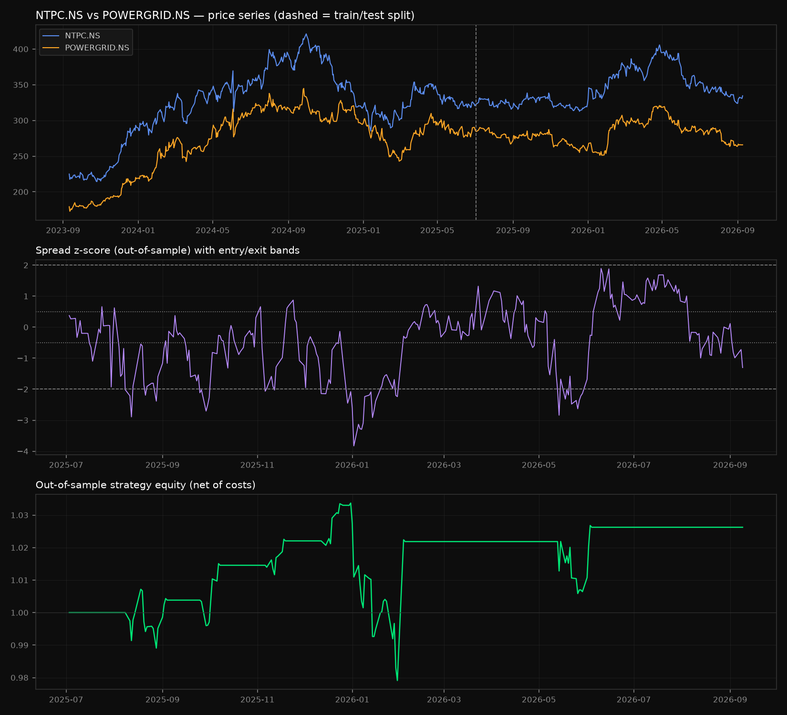

---

### BAJAJ-AUTO.NS / HEROMOTOCO.NS

- **Latest prices:** BAJAJ-AUTO.NS ₹11,790.00 · HEROMOTOCO.NS ₹5,218.00
- **Hedge ratio (train-fitted):** 0.4104
- **Cointegration (train):** FAIL at 5% — ADF -2.28, p=0.1783
- **Persistence:** passed 5% in 0 of 50 real-data runs (strict tier: 0/50)
- **Spread half-life:** 29.6 days
- **Current z-score:** -1.68
- **Signal today:** watch (approaching band)
- ⚠️ _Pair did not cointegrate on training data. Any signal here is not statistically justified — observation only._

**Out-of-sample backtest** (beta frozen from train window):

| Metric | Value |
|---|---|
| Sharpe | -0.80 |
| Sortino | -0.83 |
| Annualised return | -8.61% |
| Annualised vol | 10.57% |
| Max drawdown | -20.84% |
| Round-trip trades | 5 |

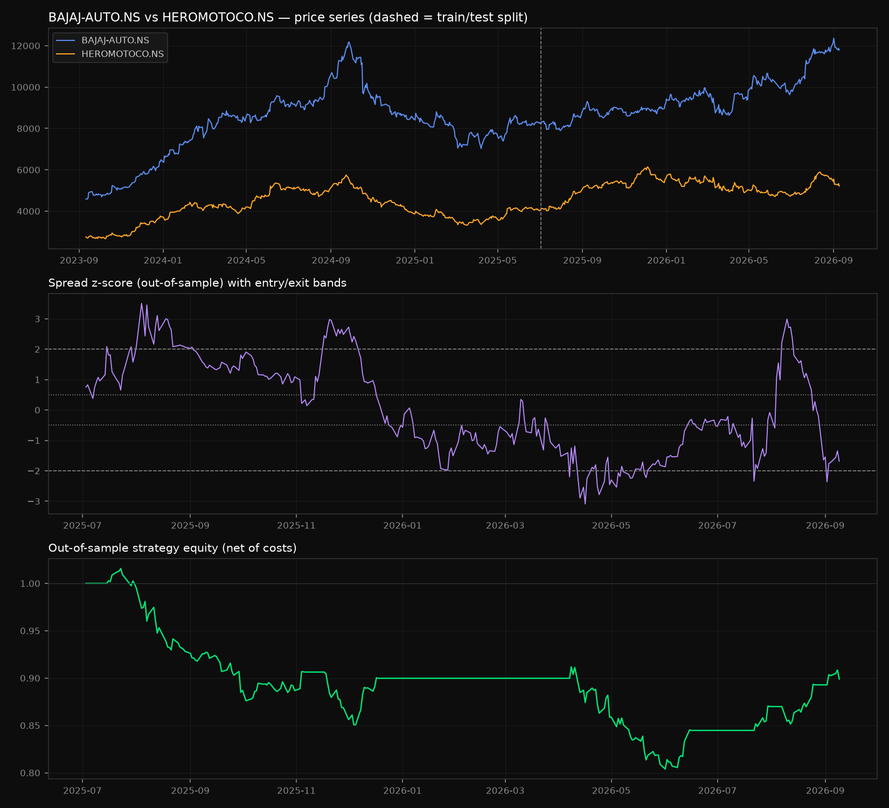

---

### TATASTEEL.NS / JSWSTEEL.NS

- **Latest prices:** TATASTEEL.NS ₹188.75 · JSWSTEEL.NS ₹1,310.00
- **Hedge ratio (train-fitted):** 3.1027
- **Cointegration (train):** FAIL at 5% — ADF -1.07, p=0.7275
- **Persistence:** passed 5% in 0 of 50 real-data runs (strict tier: 0/50)
- **Spread half-life:** 77.1 days
- **Current z-score:** +0.92
- **Signal today:** watch (approaching band)
- ⚠️ _Pair did not cointegrate on training data. Any signal here is not statistically justified — observation only._

**Out-of-sample backtest** (beta frozen from train window):

| Metric | Value |
|---|---|
| Sharpe | 0.18 |
| Sortino | 0.17 |
| Annualised return | 1.13% |
| Annualised vol | 7.98% |
| Max drawdown | -5.44% |
| Round-trip trades | 4 |

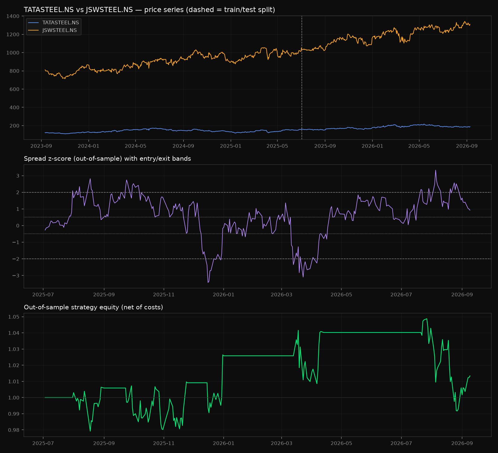

---

### SUNPHARMA.NS / CIPLA.NS

- **Latest prices:** SUNPHARMA.NS ₹1,864.90 · CIPLA.NS ₹1,363.10
- **Hedge ratio (train-fitted):** 0.4975
- **Cointegration (train):** PASS at 5% — ADF -3.38, p=0.0118
- **Persistence:** passed 5% in 50 of 50 real-data runs (strict tier: 5/50)
- **Spread half-life:** 10.7 days
- **Current z-score:** -1.52
- **Signal today:** watch (approaching band)

**Out-of-sample backtest** (beta frozen from train window):

| Metric | Value |
|---|---|
| Sharpe | -0.16 |
| Sortino | -0.17 |
| Annualised return | -1.49% |
| Annualised vol | 7.61% |
| Max drawdown | -10.19% |
| Round-trip trades | 4 |

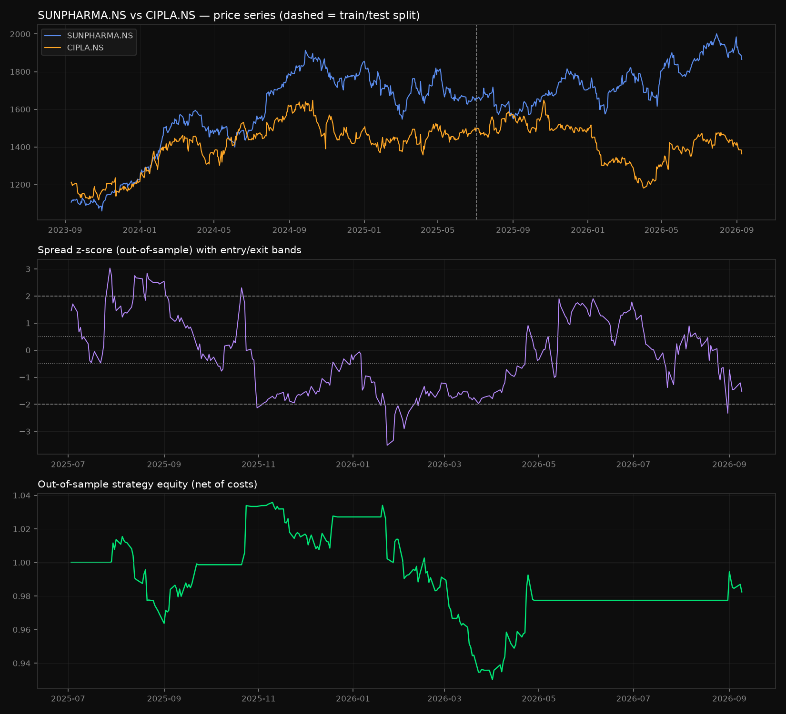

---

_Generated 2026-09-09 · pairs mean-reversion scanner · out-of-sample backtest · multiple-testing-aware · not investment advice._
