# Indian Pairs-Trading Scanner — 2026-09-10

> **What this is:** a market-neutral *pairs mean-reversion* scanner. It flags when two related NSE stocks have drifted apart far enough that their historical relationship signals a possible convergence trade. It does **not** forecast growth, rank "best" stocks, or predict company performance. A signal means the *spread between two stocks* is stretched — nothing about either stock being a good investment. Not investment advice; do your own research.

## Methodology (fixed in advance)

- **Universe:** 16 declared sector-mate pairs. Parameters (3y window, 60/40 train-test, z-entry 2.0, z-exit 0.5, 5 bps costs) are pre-registered; changes are logged in the README changelog *before* looking at results.
- **Multiple testing:** at the 5% level across 16 pairs, **≈0.8 false positives per run are expected by chance alone** even if nothing truly cointegrates. A single-day pass is a candidate, not a discovery.
- **Strict tier:** Bonferroni-corrected threshold p < 0.0031 (marked ✓✓).
- **Evidence = persistence:** the Persistence column counts how often each pair has passed the 5% test across all *real-data* daily runs recorded in `reports/history.csv`. Pairs deserve attention only when they pass persistently.

## Summary

| Pair | p-value | Coint. | Persistence | Current z | Signal | OOS Sharpe |
|---|---|---|---|---|---|---|
| HDFCBANK.NS/ICICIBANK.NS | 0.0617 | ✗ | 0/41 | +0.90 | watch | -0.58 |
| AXISBANK.NS/ICICIBANK.NS | 0.8641 | ✗ | 0/51 | +0.13 | flat / no stretch | -0.32 |
| KOTAKBANK.NS/HDFCBANK.NS | 0.1471 | ✗ | 0/51 | -1.60 | watch | 0.60 |
| SBIN.NS/BANKBARODA.NS | 0.1297 | ✗ | 0/51 | -0.52 | watch | -0.05 |
| TCS.NS/INFY.NS | 0.6905 | ✗ | 0/51 | -1.40 | watch | 2.17 |
| INFY.NS/WIPRO.NS | 0.2167 | ✗ | 0/51 | -0.79 | watch | 1.68 |
| HCLTECH.NS/TECHM.NS | 0.2042 | ✗ | 0/51 | +0.80 | watch | 0.01 |
| ACC.NS/AMBUJACEM.NS | 0.7717 | ✗ | 0/51 | -2.06 | LONG spread | 0.43 |
| ULTRACEMCO.NS/SHREECEM.NS | 0.2360 | ✗ | 0/51 | -1.99 | watch | 0.15 |
| IOC.NS/BPCL.NS | 0.8195 | ✗ | 0/51 | -0.52 | watch | 0.42 |
| BPCL.NS/HINDPETRO.NS | 0.3339 | ✗ | 0/51 | -0.43 | flat / no stretch | 0.08 |
| ONGC.NS/COALINDIA.NS | 0.0114 | ✓ | 43/51 | +1.74 | watch | 0.53 |
| NTPC.NS/POWERGRID.NS | 0.1050 | ✗ | 0/51 | -0.19 | flat / no stretch | 0.42 |
| BAJAJ-AUTO.NS/HEROMOTOCO.NS | 0.1724 | ✗ | 0/51 | -1.27 | watch | -0.72 |
| TATASTEEL.NS/JSWSTEEL.NS | 0.7049 | ✗ | 0/51 | +0.90 | watch | 0.18 |
| SUNPHARMA.NS/CIPLA.NS | 0.0118 | ✓ | 51/51 | -1.10 | watch | -0.10 |

_Legend: ✓✓ passes strict Bonferroni tier · ✓ passes 5% only · ✗ fails. Persistence = 5%-passes / real-data runs recorded. \*no real-data history yet._

---

### HDFCBANK.NS / ICICIBANK.NS

- **Latest prices:** HDFCBANK.NS ₹693.80 · ICICIBANK.NS ₹1,384.50
- **Hedge ratio (train-fitted):** 1.7075
- **Cointegration (train):** FAIL at 5% — ADF -2.78, p=0.0617
- **Persistence:** passed 5% in 0 of 41 real-data runs (strict tier: 0/41)
- **Spread half-life:** 24.6 days
- **Current z-score:** +0.90
- **Signal today:** watch (approaching band)
- ⚠️ _Pair did not cointegrate on training data. Any signal here is not statistically justified — observation only._

**Out-of-sample backtest** (beta frozen from train window):

| Metric | Value |
|---|---|
| Sharpe | -0.58 |
| Sortino | -0.62 |
| Annualised return | -3.92% |
| Annualised vol | 6.53% |
| Max drawdown | -8.39% |
| Round-trip trades | 4 |

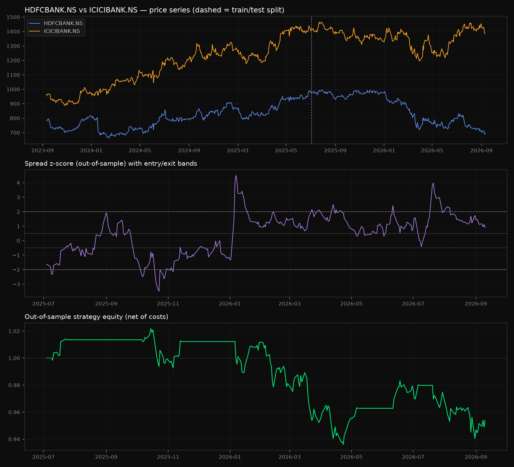

---

### AXISBANK.NS / ICICIBANK.NS

- **Latest prices:** AXISBANK.NS ₹1,246.00 · ICICIBANK.NS ₹1,384.50
- **Hedge ratio (train-fitted):** 0.9889
- **Cointegration (train):** FAIL at 5% — ADF -0.63, p=0.8641
- **Persistence:** passed 5% in 0 of 51 real-data runs (strict tier: 0/51)
- **Spread half-life:** 173.6 days
- **Current z-score:** +0.13
- **Signal today:** flat / no stretch
- ⚠️ _Pair did not cointegrate on training data. Any signal here is not statistically justified — observation only._

**Out-of-sample backtest** (beta frozen from train window):

| Metric | Value |
|---|---|
| Sharpe | -0.32 |
| Sortino | -0.32 |
| Annualised return | -3.14% |
| Annualised vol | 8.77% |
| Max drawdown | -7.74% |
| Round-trip trades | 6 |

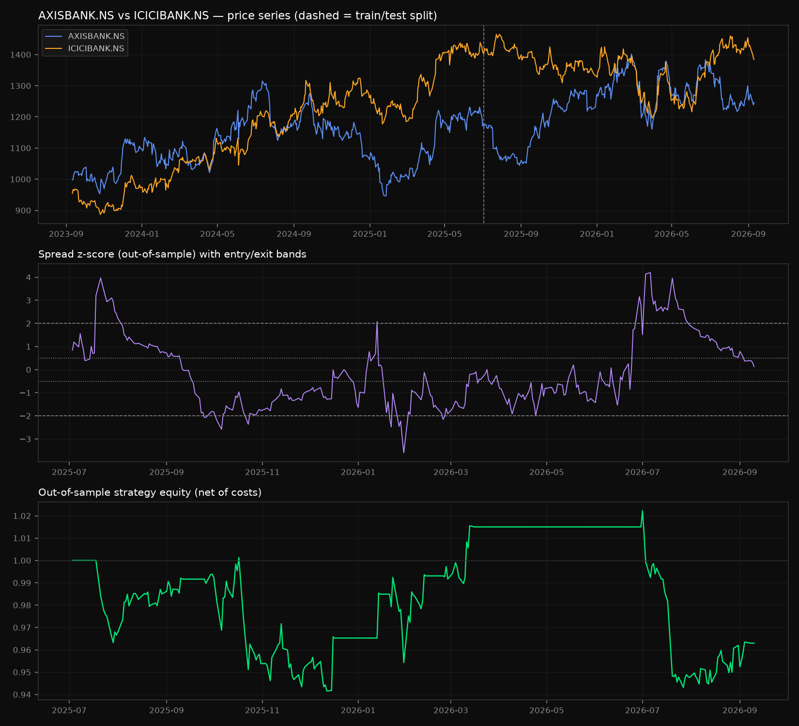

---

### KOTAKBANK.NS / HDFCBANK.NS

- **Latest prices:** KOTAKBANK.NS ₹416.55 · HDFCBANK.NS ₹693.80
- **Hedge ratio (train-fitted):** 2.0874
- **Cointegration (train):** FAIL at 5% — ADF -2.38, p=0.1471
- **Persistence:** passed 5% in 0 of 51 real-data runs (strict tier: 0/51)
- **Spread half-life:** 26.0 days
- **Current z-score:** -1.60
- **Signal today:** watch (approaching band)
- ⚠️ _Pair did not cointegrate on training data. Any signal here is not statistically justified — observation only._

**Out-of-sample backtest** (beta frozen from train window):

| Metric | Value |
|---|---|
| Sharpe | 0.60 |
| Sortino | 0.45 |
| Annualised return | 3.78% |
| Annualised vol | 6.55% |
| Max drawdown | -4.27% |
| Round-trip trades | 6 |

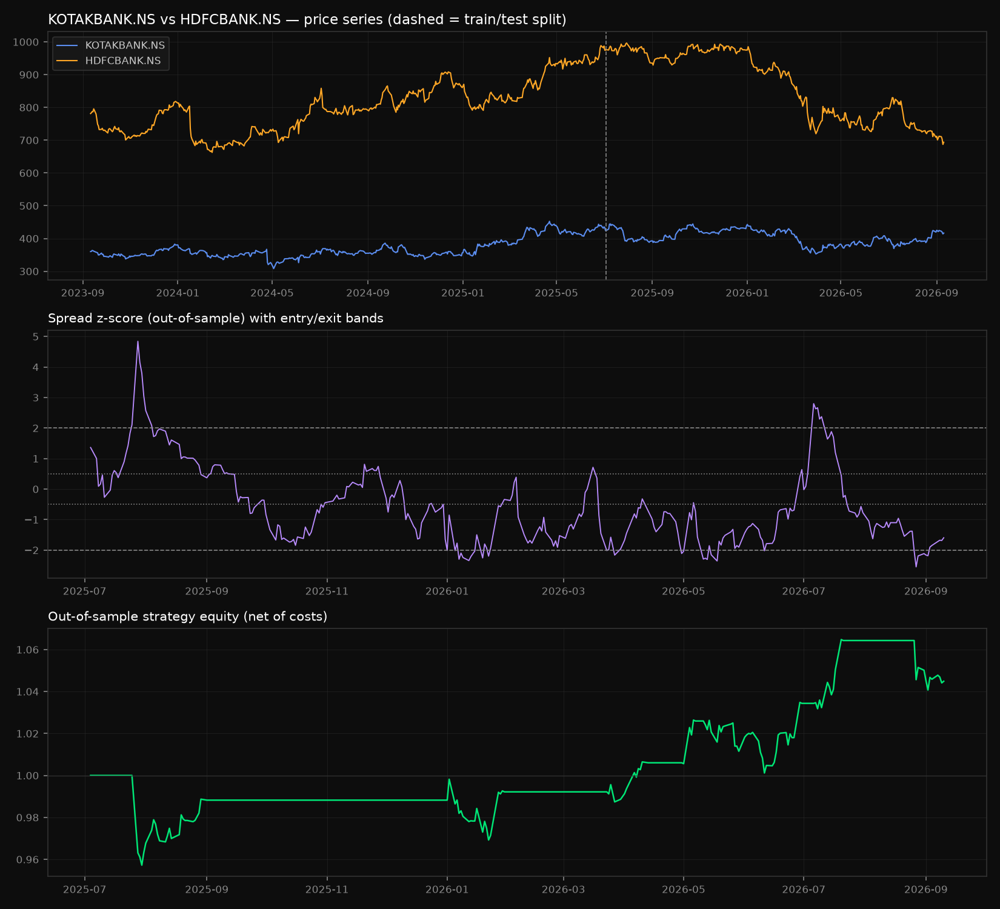

---

### SBIN.NS / BANKBARODA.NS

- **Latest prices:** SBIN.NS ₹1,009.70 · BANKBARODA.NS ₹237.62
- **Hedge ratio (train-fitted):** 0.1906
- **Cointegration (train):** FAIL at 5% — ADF -2.44, p=0.1297
- **Persistence:** passed 5% in 0 of 51 real-data runs (strict tier: 0/51)
- **Spread half-life:** 20.6 days
- **Current z-score:** -0.52
- **Signal today:** watch (approaching band)
- ⚠️ _Pair did not cointegrate on training data. Any signal here is not statistically justified — observation only._

**Out-of-sample backtest** (beta frozen from train window):

| Metric | Value |
|---|---|
| Sharpe | -0.05 |
| Sortino | -0.04 |
| Annualised return | -0.85% |
| Annualised vol | 9.07% |
| Max drawdown | -8.77% |
| Round-trip trades | 4 |

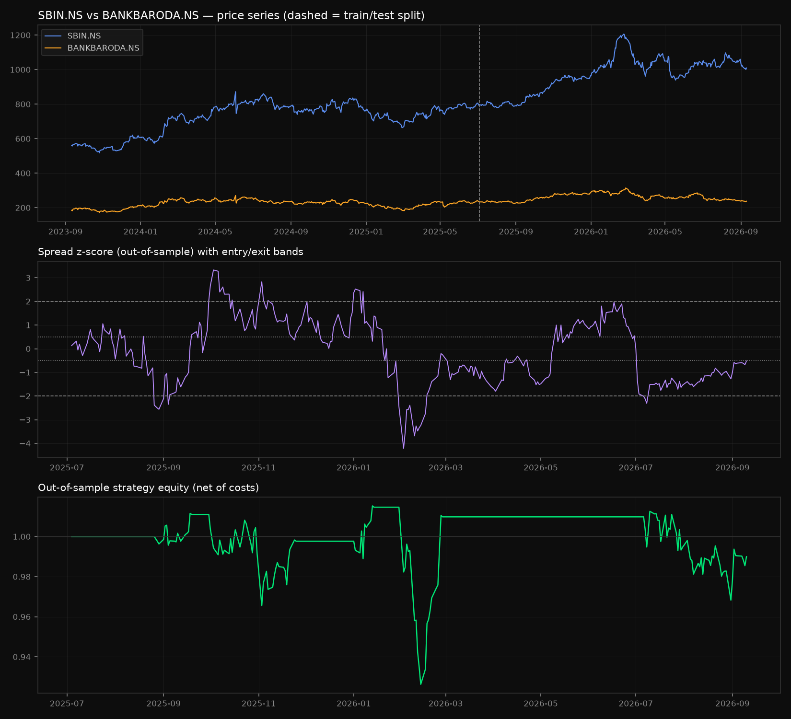

---

### TCS.NS / INFY.NS

- **Latest prices:** TCS.NS ₹2,204.10 · INFY.NS ₹1,036.50
- **Hedge ratio (train-fitted):** 0.4910
- **Cointegration (train):** FAIL at 5% — ADF -1.16, p=0.6905
- **Persistence:** passed 5% in 0 of 51 real-data runs (strict tier: 0/51)
- **Spread half-life:** 64.8 days
- **Current z-score:** -1.40
- **Signal today:** watch (approaching band)
- ⚠️ _Pair did not cointegrate on training data. Any signal here is not statistically justified — observation only._

**Out-of-sample backtest** (beta frozen from train window):

| Metric | Value |
|---|---|
| Sharpe | 2.17 |
| Sortino | 2.16 |
| Annualised return | 9.09% |
| Annualised vol | 4.05% |
| Max drawdown | -1.31% |
| Round-trip trades | 7 |

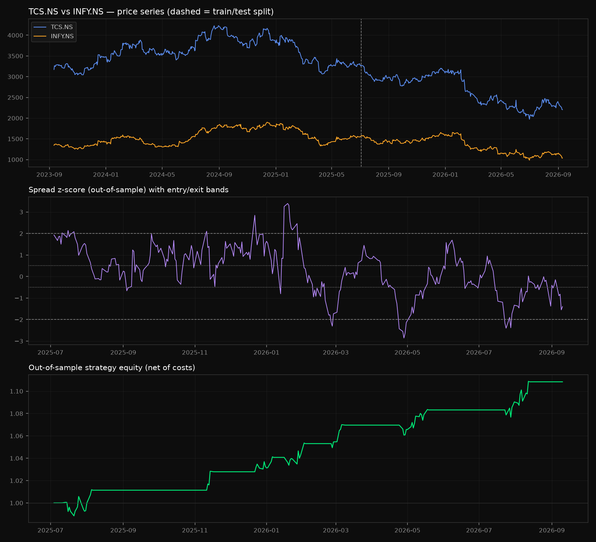

---

### INFY.NS / WIPRO.NS

- **Latest prices:** INFY.NS ₹1,036.50 · WIPRO.NS ₹166.30
- **Hedge ratio (train-fitted):** 0.1342
- **Cointegration (train):** FAIL at 5% — ADF -2.17, p=0.2167
- **Persistence:** passed 5% in 0 of 51 real-data runs (strict tier: 0/51)
- **Spread half-life:** 31.8 days
- **Current z-score:** -0.79
- **Signal today:** watch (approaching band)
- ⚠️ _Pair did not cointegrate on training data. Any signal here is not statistically justified — observation only._

**Out-of-sample backtest** (beta frozen from train window):

| Metric | Value |
|---|---|
| Sharpe | 1.68 |
| Sortino | 1.96 |
| Annualised return | 8.41% |
| Annualised vol | 4.88% |
| Max drawdown | -2.26% |
| Round-trip trades | 6 |

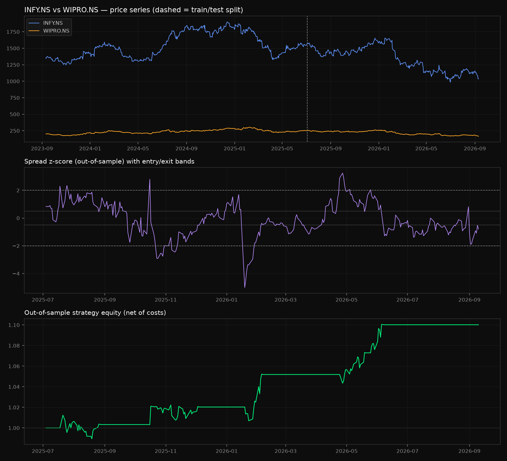

---

### HCLTECH.NS / TECHM.NS

- **Latest prices:** HCLTECH.NS ₹1,207.00 · TECHM.NS ₹1,525.80
- **Hedge ratio (train-fitted):** 0.8984
- **Cointegration (train):** FAIL at 5% — ADF -2.21, p=0.2042
- **Persistence:** passed 5% in 0 of 51 real-data runs (strict tier: 0/51)
- **Spread half-life:** 23.3 days
- **Current z-score:** +0.80
- **Signal today:** watch (approaching band)
- ⚠️ _Pair did not cointegrate on training data. Any signal here is not statistically justified — observation only._

**Out-of-sample backtest** (beta frozen from train window):

| Metric | Value |
|---|---|
| Sharpe | 0.01 |
| Sortino | 0.01 |
| Annualised return | -0.14% |
| Annualised vol | 6.70% |
| Max drawdown | -7.56% |
| Round-trip trades | 5 |

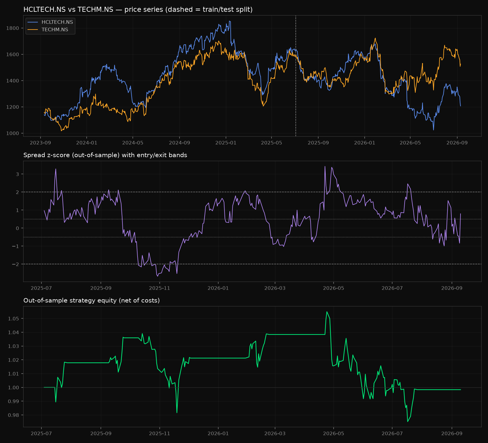

---

### ACC.NS / AMBUJACEM.NS

- **Latest prices:** ACC.NS ₹1,254.30 · AMBUJACEM.NS ₹395.60
- **Hedge ratio (train-fitted):** 0.2015
- **Cointegration (train):** FAIL at 5% — ADF -0.95, p=0.7717
- **Persistence:** passed 5% in 0 of 51 real-data runs (strict tier: 0/51)
- **Spread half-life:** 82.4 days
- **Current z-score:** -2.06
- **Signal today:** LONG spread (long AMBUJACEM.NS, short ACC.NS)
- ⚠️ _Pair did not cointegrate on training data. Any signal here is not statistically justified — observation only._

**Out-of-sample backtest** (beta frozen from train window):

| Metric | Value |
|---|---|
| Sharpe | 0.43 |
| Sortino | 0.37 |
| Annualised return | 2.41% |
| Annualised vol | 5.93% |
| Max drawdown | -6.98% |
| Round-trip trades | 4 |

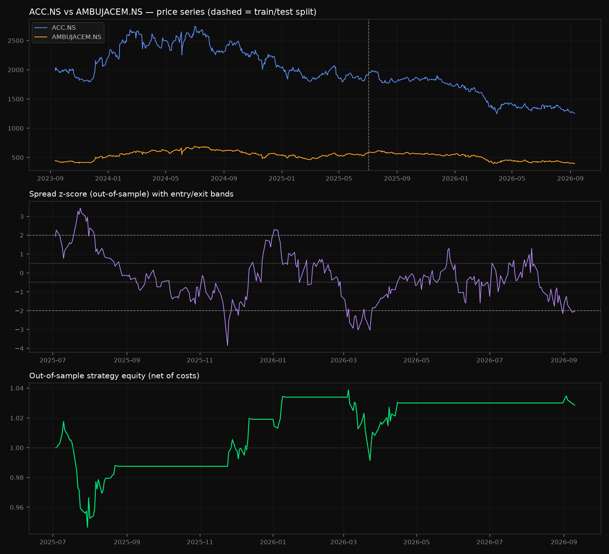

---

### ULTRACEMCO.NS / SHREECEM.NS

- **Latest prices:** ULTRACEMCO.NS ₹10,979.00 · SHREECEM.NS ₹22,785.00
- **Hedge ratio (train-fitted):** 0.6778
- **Cointegration (train):** FAIL at 5% — ADF -2.12, p=0.2360
- **Persistence:** passed 5% in 0 of 51 real-data runs (strict tier: 0/51)
- **Spread half-life:** 43.0 days
- **Current z-score:** -1.99
- **Signal today:** watch (approaching band)
- ⚠️ _Pair did not cointegrate on training data. Any signal here is not statistically justified — observation only._

**Out-of-sample backtest** (beta frozen from train window):

| Metric | Value |
|---|---|
| Sharpe | 0.15 |
| Sortino | 0.17 |
| Annualised return | 0.86% |
| Annualised vol | 7.45% |
| Max drawdown | -8.53% |
| Round-trip trades | 5 |

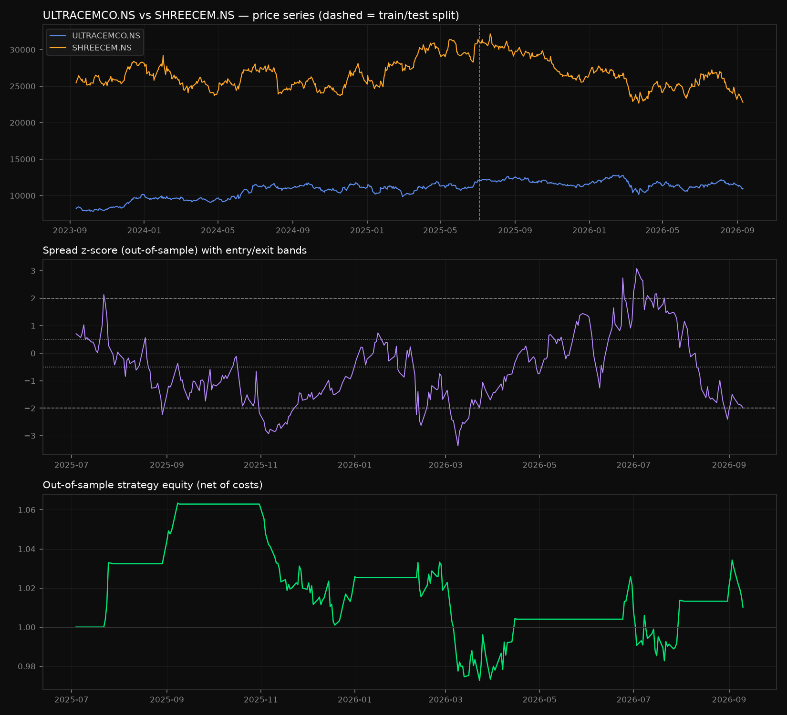

---

### IOC.NS / BPCL.NS

- **Latest prices:** IOC.NS ₹134.94 · BPCL.NS ₹303.00
- **Hedge ratio (train-fitted):** 1.7439
- **Cointegration (train):** FAIL at 5% — ADF -0.80, p=0.8195
- **Persistence:** passed 5% in 0 of 51 real-data runs (strict tier: 0/51)
- **Spread half-life:** 144.2 days
- **Current z-score:** -0.52
- **Signal today:** watch (approaching band)
- ⚠️ _Pair did not cointegrate on training data. Any signal here is not statistically justified — observation only._

**Out-of-sample backtest** (beta frozen from train window):

| Metric | Value |
|---|---|
| Sharpe | 0.42 |
| Sortino | 0.44 |
| Annualised return | 2.41% |
| Annualised vol | 6.19% |
| Max drawdown | -6.22% |
| Round-trip trades | 7 |

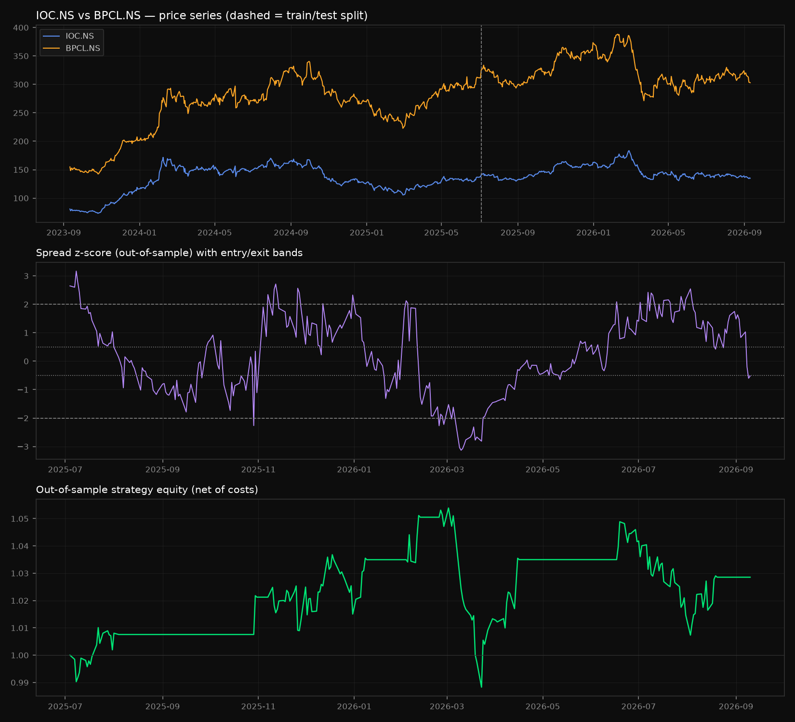

---

### BPCL.NS / HINDPETRO.NS

- **Latest prices:** BPCL.NS ₹303.00 · HINDPETRO.NS ₹352.65
- **Hedge ratio (train-fitted):** 1.3533
- **Cointegration (train):** FAIL at 5% — ADF -1.90, p=0.3339
- **Persistence:** passed 5% in 0 of 51 real-data runs (strict tier: 0/51)
- **Spread half-life:** 41.0 days
- **Current z-score:** -0.43
- **Signal today:** flat / no stretch
- ⚠️ _Pair did not cointegrate on training data. Any signal here is not statistically justified — observation only._

**Out-of-sample backtest** (beta frozen from train window):

| Metric | Value |
|---|---|
| Sharpe | 0.08 |
| Sortino | 0.07 |
| Annualised return | 0.29% |
| Annualised vol | 5.59% |
| Max drawdown | -6.33% |
| Round-trip trades | 4 |

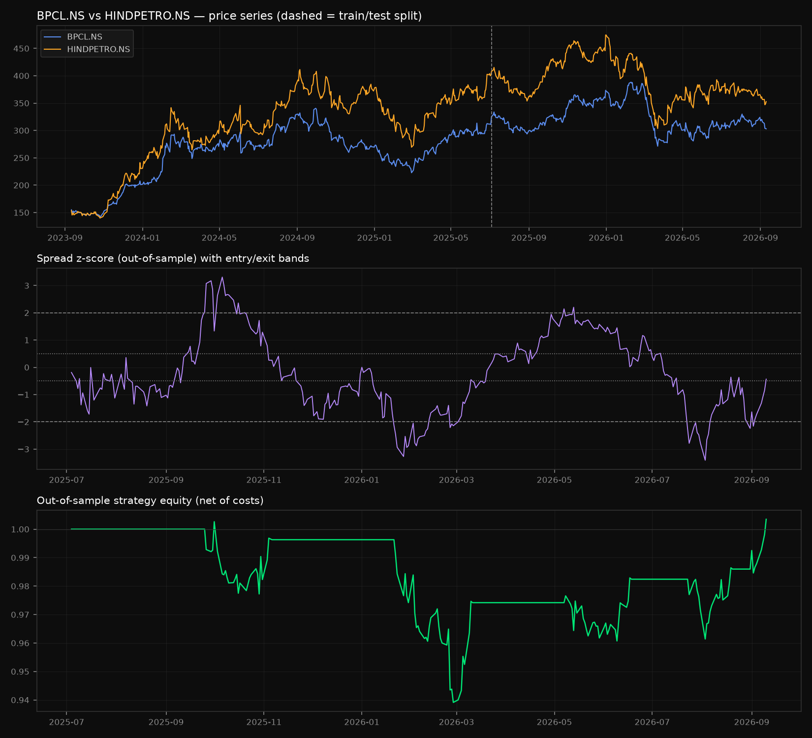

---

### ONGC.NS / COALINDIA.NS

- **Latest prices:** ONGC.NS ₹237.27 · COALINDIA.NS ₹432.00
- **Hedge ratio (train-fitted):** 1.4780
- **Cointegration (train):** PASS at 5% — ADF -3.39, p=0.0114
- **Persistence:** passed 5% in 43 of 51 real-data runs (strict tier: 1/51)
- **Spread half-life:** 12.6 days
- **Current z-score:** +1.74
- **Signal today:** watch (approaching band)

**Out-of-sample backtest** (beta frozen from train window):

| Metric | Value |
|---|---|
| Sharpe | 0.53 |
| Sortino | 0.38 |
| Annualised return | 3.61% |
| Annualised vol | 7.13% |
| Max drawdown | -6.04% |
| Round-trip trades | 4 |

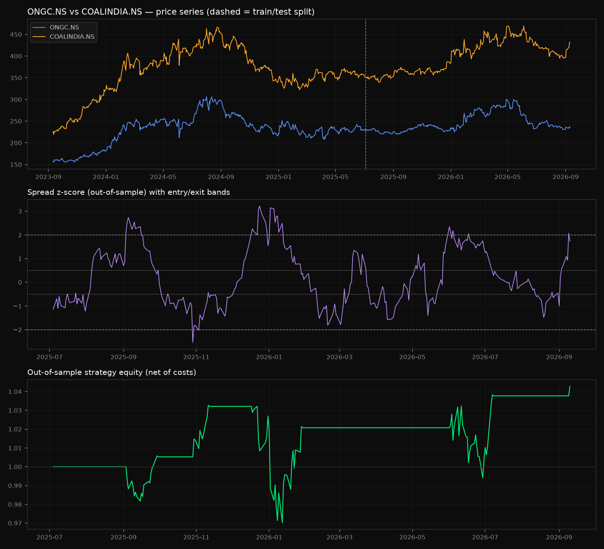

---

### NTPC.NS / POWERGRID.NS

- **Latest prices:** NTPC.NS ₹335.00 · POWERGRID.NS ₹271.75
- **Hedge ratio (train-fitted):** 0.8367
- **Cointegration (train):** FAIL at 5% — ADF -2.54, p=0.1050
- **Persistence:** passed 5% in 0 of 51 real-data runs (strict tier: 0/51)
- **Spread half-life:** 23.5 days
- **Current z-score:** -0.19
- **Signal today:** flat / no stretch
- ⚠️ _Pair did not cointegrate on training data. Any signal here is not statistically justified — observation only._

**Out-of-sample backtest** (beta frozen from train window):

| Metric | Value |
|---|---|
| Sharpe | 0.42 |
| Sortino | 0.33 |
| Annualised return | 2.22% |
| Annualised vol | 5.55% |
| Max drawdown | -5.28% |
| Round-trip trades | 6 |

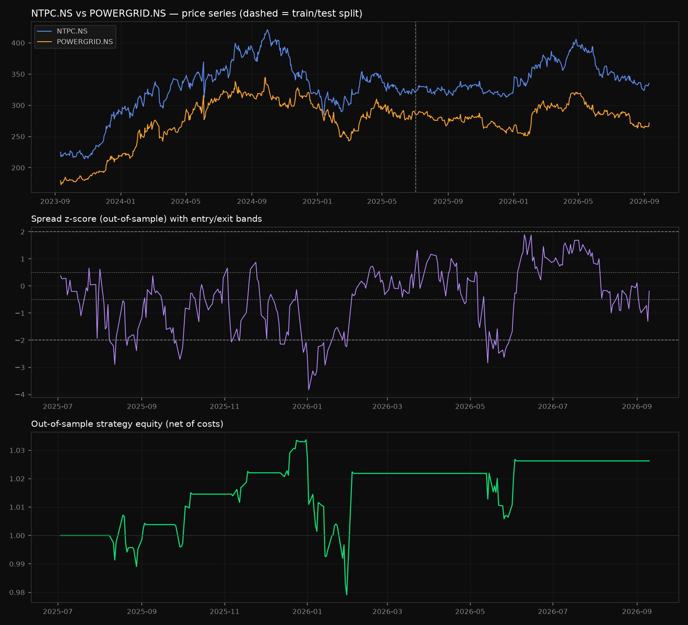

---

### BAJAJ-AUTO.NS / HEROMOTOCO.NS

- **Latest prices:** BAJAJ-AUTO.NS ₹11,768.00 · HEROMOTOCO.NS ₹5,280.00
- **Hedge ratio (train-fitted):** 0.4104
- **Cointegration (train):** FAIL at 5% — ADF -2.30, p=0.1724
- **Persistence:** passed 5% in 0 of 51 real-data runs (strict tier: 0/51)
- **Spread half-life:** 29.4 days
- **Current z-score:** -1.27
- **Signal today:** watch (approaching band)
- ⚠️ _Pair did not cointegrate on training data. Any signal here is not statistically justified — observation only._

**Out-of-sample backtest** (beta frozen from train window):

| Metric | Value |
|---|---|
| Sharpe | -0.72 |
| Sortino | -0.75 |
| Annualised return | -7.82% |
| Annualised vol | 10.54% |
| Max drawdown | -20.71% |
| Round-trip trades | 5 |

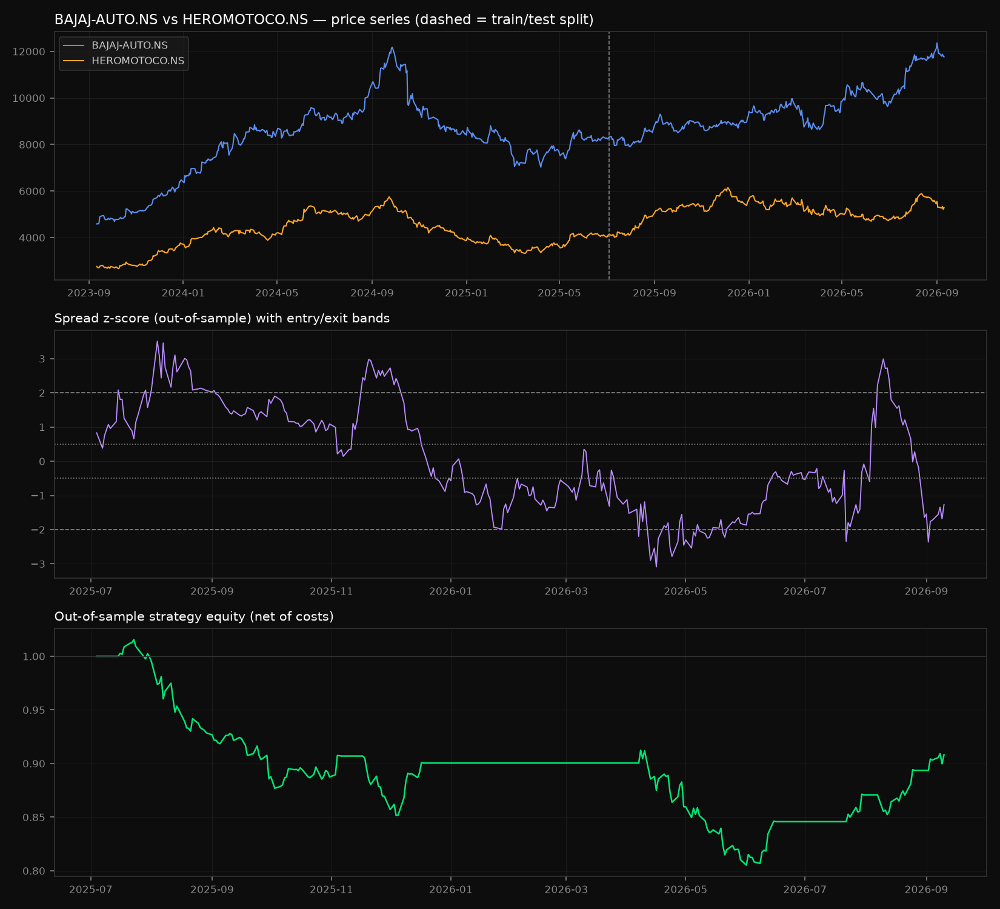

---

### TATASTEEL.NS / JSWSTEEL.NS

- **Latest prices:** TATASTEEL.NS ₹186.78 · JSWSTEEL.NS ₹1,304.00
- **Hedge ratio (train-fitted):** 3.1186
- **Cointegration (train):** FAIL at 5% — ADF -1.13, p=0.7049
- **Persistence:** passed 5% in 0 of 51 real-data runs (strict tier: 0/51)
- **Spread half-life:** 73.3 days
- **Current z-score:** +0.90
- **Signal today:** watch (approaching band)
- ⚠️ _Pair did not cointegrate on training data. Any signal here is not statistically justified — observation only._

**Out-of-sample backtest** (beta frozen from train window):

| Metric | Value |
|---|---|
| Sharpe | 0.18 |
| Sortino | 0.16 |
| Annualised return | 1.09% |
| Annualised vol | 8.02% |
| Max drawdown | -5.47% |
| Round-trip trades | 4 |

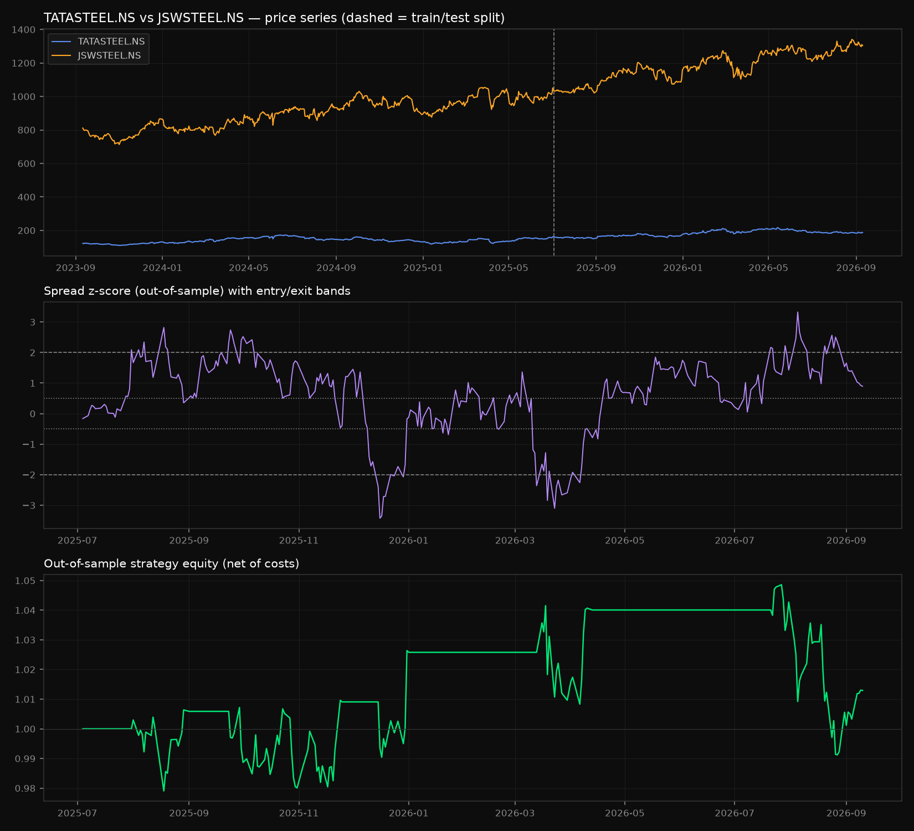

---

### SUNPHARMA.NS / CIPLA.NS

- **Latest prices:** SUNPHARMA.NS ₹1,861.00 · CIPLA.NS ₹1,373.30
- **Hedge ratio (train-fitted):** 0.4975
- **Cointegration (train):** PASS at 5% — ADF -3.38, p=0.0118
- **Persistence:** passed 5% in 51 of 51 real-data runs (strict tier: 5/51)
- **Spread half-life:** 10.7 days
- **Current z-score:** -1.10
- **Signal today:** watch (approaching band)

**Out-of-sample backtest** (beta frozen from train window):

| Metric | Value |
|---|---|
| Sharpe | -0.10 |
| Sortino | -0.11 |
| Annualised return | -1.05% |
| Annualised vol | 7.62% |
| Max drawdown | -10.19% |
| Round-trip trades | 4 |

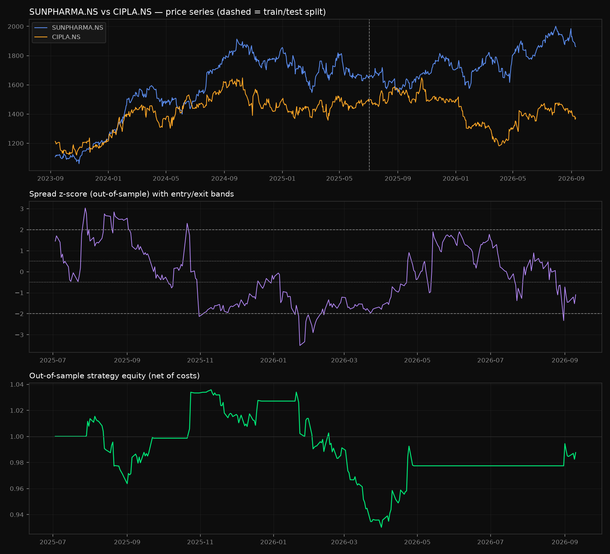

---

_Generated 2026-09-10 · pairs mean-reversion scanner · out-of-sample backtest · multiple-testing-aware · not investment advice._
