# Indian Pairs-Trading Scanner — 2026-09-11

> **What this is:** a market-neutral *pairs mean-reversion* scanner. It flags when two related NSE stocks have drifted apart far enough that their historical relationship signals a possible convergence trade. It does **not** forecast growth, rank "best" stocks, or predict company performance. A signal means the *spread between two stocks* is stretched — nothing about either stock being a good investment. Not investment advice; do your own research.

## Methodology (fixed in advance)

- **Universe:** 16 declared sector-mate pairs. Parameters (3y window, 60/40 train-test, z-entry 2.0, z-exit 0.5, 5 bps costs) are pre-registered; changes are logged in the README changelog *before* looking at results.
- **Multiple testing:** at the 5% level across 16 pairs, **≈0.8 false positives per run are expected by chance alone** even if nothing truly cointegrates. A single-day pass is a candidate, not a discovery.
- **Strict tier:** Bonferroni-corrected threshold p < 0.0031 (marked ✓✓).
- **Evidence = persistence:** the Persistence column counts how often each pair has passed the 5% test across all *real-data* daily runs recorded in `reports/history.csv`. Pairs deserve attention only when they pass persistently.

## Summary

| Pair | p-value | Coint. | Persistence | Current z | Signal | OOS Sharpe |
|---|---|---|---|---|---|---|
| HDFCBANK.NS/ICICIBANK.NS | 0.0578 | ✗ | 0/42 | +0.54 | watch | -0.45 |
| AXISBANK.NS/ICICIBANK.NS | 0.8647 | ✗ | 0/52 | +0.03 | flat / no stretch | -0.32 |
| KOTAKBANK.NS/HDFCBANK.NS | 0.1445 | ✗ | 0/52 | -1.40 | watch | 0.72 |
| SBIN.NS/BANKBARODA.NS | 0.1301 | ✗ | 0/52 | -0.24 | flat / no stretch | 0.03 |
| TCS.NS/INFY.NS | 0.7116 | ✗ | 0/52 | -1.27 | watch | 2.17 |
| INFY.NS/WIPRO.NS | 0.2162 | ✗ | 0/52 | -0.47 | flat / no stretch | 1.68 |
| HCLTECH.NS/TECHM.NS | 0.2037 | ✗ | 0/52 | +1.50 | watch | 0.01 |
| ACC.NS/AMBUJACEM.NS | 0.7246 | ✗ | 0/52 | -2.32 | LONG spread | 0.40 |
| ULTRACEMCO.NS/SHREECEM.NS | 0.2175 | ✗ | 0/52 | -2.07 | LONG spread | 0.09 |
| IOC.NS/BPCL.NS | 0.8777 | ✗ | 0/52 | -0.36 | flat / no stretch | 0.43 |
| BPCL.NS/HINDPETRO.NS | 0.2810 | ✗ | 0/52 | -0.64 | watch | 0.07 |
| ONGC.NS/COALINDIA.NS | 0.0117 | ✓ | 44/52 | +1.83 | watch | 0.51 |
| NTPC.NS/POWERGRID.NS | 0.1003 | ✗ | 0/52 | -0.46 | flat / no stretch | 0.42 |
| BAJAJ-AUTO.NS/HEROMOTOCO.NS | 0.1709 | ✗ | 0/52 | -1.33 | watch | -0.74 |
| TATASTEEL.NS/JSWSTEEL.NS | 0.7085 | ✗ | 0/52 | +0.19 | flat / no stretch | 0.35 |
| SUNPHARMA.NS/CIPLA.NS | 0.0122 | ✓ | 52/52 | -0.99 | watch | -0.09 |

_Legend: ✓✓ passes strict Bonferroni tier · ✓ passes 5% only · ✗ fails. Persistence = 5%-passes / real-data runs recorded. \*no real-data history yet._

---

### HDFCBANK.NS / ICICIBANK.NS

- **Latest prices:** HDFCBANK.NS ₹708.25 · ICICIBANK.NS ₹1,379.30
- **Hedge ratio (train-fitted):** 1.7053
- **Cointegration (train):** FAIL at 5% — ADF -2.80, p=0.0578
- **Persistence:** passed 5% in 0 of 42 real-data runs (strict tier: 0/42)
- **Spread half-life:** 24.4 days
- **Current z-score:** +0.54
- **Signal today:** watch (approaching band)
- ⚠️ _Pair did not cointegrate on training data. Any signal here is not statistically justified — observation only._

**Out-of-sample backtest** (beta frozen from train window):

| Metric | Value |
|---|---|
| Sharpe | -0.45 |
| Sortino | -0.49 |
| Annualised return | -3.13% |
| Annualised vol | 6.61% |
| Max drawdown | -8.40% |
| Round-trip trades | 4 |

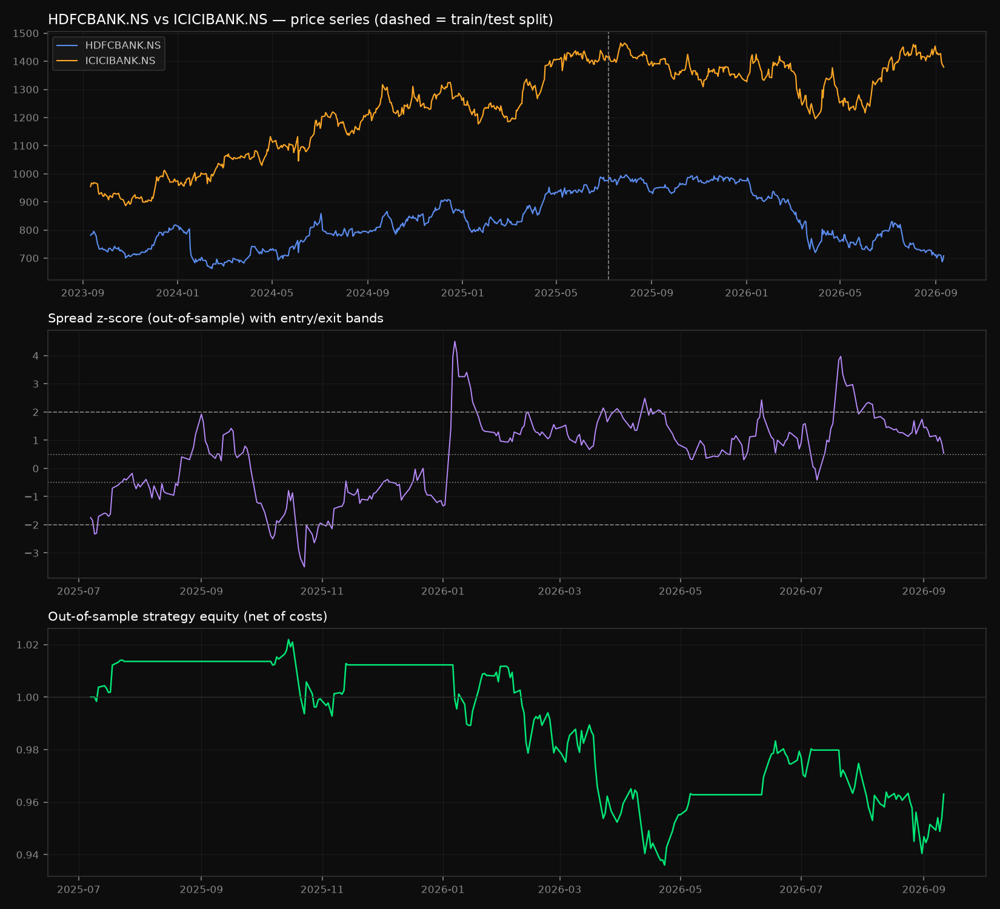

---

### AXISBANK.NS / ICICIBANK.NS

- **Latest prices:** AXISBANK.NS ₹1,246.00 · ICICIBANK.NS ₹1,379.30
- **Hedge ratio (train-fitted):** 0.9924
- **Cointegration (train):** FAIL at 5% — ADF -0.63, p=0.8647
- **Persistence:** passed 5% in 0 of 52 real-data runs (strict tier: 0/52)
- **Spread half-life:** 175.0 days
- **Current z-score:** +0.03
- **Signal today:** flat / no stretch
- ⚠️ _Pair did not cointegrate on training data. Any signal here is not statistically justified — observation only._

**Out-of-sample backtest** (beta frozen from train window):

| Metric | Value |
|---|---|
| Sharpe | -0.32 |
| Sortino | -0.32 |
| Annualised return | -3.10% |
| Annualised vol | 8.69% |
| Max drawdown | -7.67% |
| Round-trip trades | 6 |

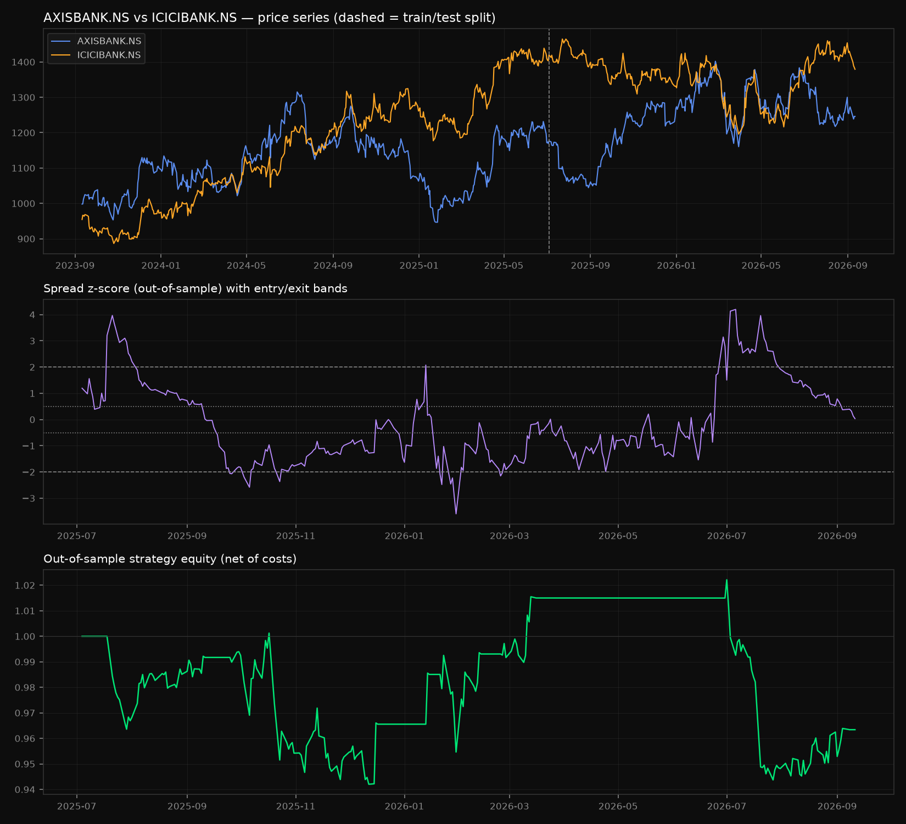

---

### KOTAKBANK.NS / HDFCBANK.NS

- **Latest prices:** KOTAKBANK.NS ₹419.00 · HDFCBANK.NS ₹708.25
- **Hedge ratio (train-fitted):** 2.0957
- **Cointegration (train):** FAIL at 5% — ADF -2.39, p=0.1445
- **Persistence:** passed 5% in 0 of 52 real-data runs (strict tier: 0/52)
- **Spread half-life:** 26.0 days
- **Current z-score:** -1.40
- **Signal today:** watch (approaching band)
- ⚠️ _Pair did not cointegrate on training data. Any signal here is not statistically justified — observation only._

**Out-of-sample backtest** (beta frozen from train window):

| Metric | Value |
|---|---|
| Sharpe | 0.72 |
| Sortino | 0.53 |
| Annualised return | 4.58% |
| Annualised vol | 6.48% |
| Max drawdown | -4.26% |
| Round-trip trades | 6 |

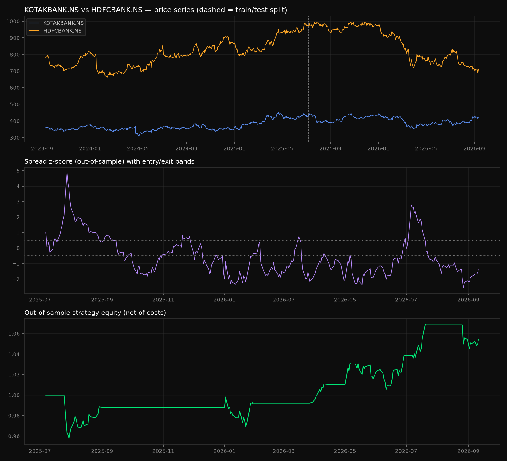

---

### SBIN.NS / BANKBARODA.NS

- **Latest prices:** SBIN.NS ₹995.70 · BANKBARODA.NS ₹238.13
- **Hedge ratio (train-fitted):** 0.1906
- **Cointegration (train):** FAIL at 5% — ADF -2.44, p=0.1301
- **Persistence:** passed 5% in 0 of 52 real-data runs (strict tier: 0/52)
- **Spread half-life:** 20.7 days
- **Current z-score:** -0.24
- **Signal today:** flat / no stretch
- ⚠️ _Pair did not cointegrate on training data. Any signal here is not statistically justified — observation only._

**Out-of-sample backtest** (beta frozen from train window):

| Metric | Value |
|---|---|
| Sharpe | 0.03 |
| Sortino | 0.02 |
| Annualised return | -0.16% |
| Annualised vol | 9.11% |
| Max drawdown | -8.78% |
| Round-trip trades | 4 |

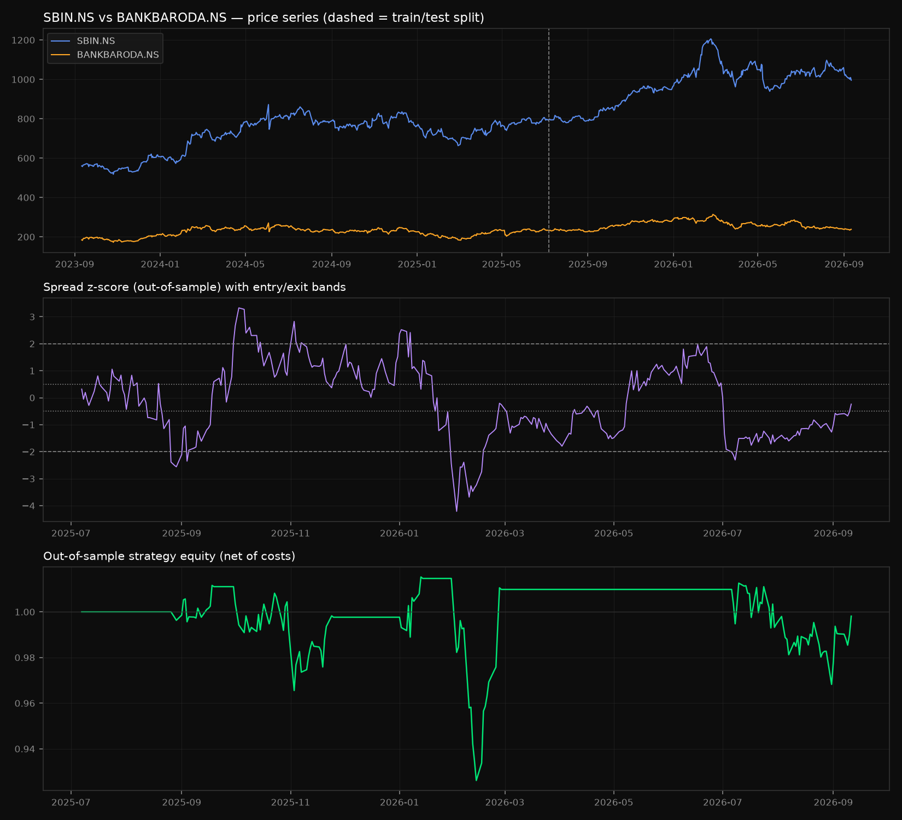

---

### TCS.NS / INFY.NS

- **Latest prices:** TCS.NS ₹2,200.80 · INFY.NS ₹1,037.70
- **Hedge ratio (train-fitted):** 0.4895
- **Cointegration (train):** FAIL at 5% — ADF -1.11, p=0.7116
- **Persistence:** passed 5% in 0 of 52 real-data runs (strict tier: 0/52)
- **Spread half-life:** 68.0 days
- **Current z-score:** -1.27
- **Signal today:** watch (approaching band)
- ⚠️ _Pair did not cointegrate on training data. Any signal here is not statistically justified — observation only._

**Out-of-sample backtest** (beta frozen from train window):

| Metric | Value |
|---|---|
| Sharpe | 2.17 |
| Sortino | 2.17 |
| Annualised return | 9.16% |
| Annualised vol | 4.07% |
| Max drawdown | -1.32% |
| Round-trip trades | 7 |

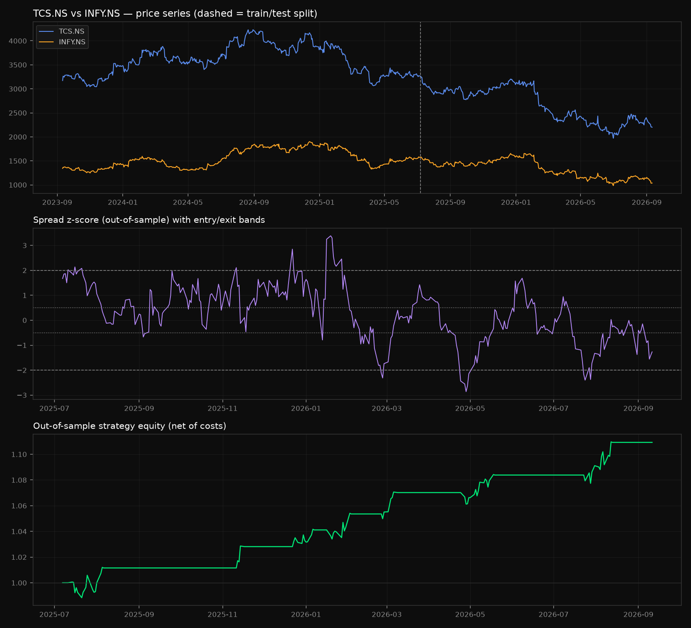

---

### INFY.NS / WIPRO.NS

- **Latest prices:** INFY.NS ₹1,037.70 · WIPRO.NS ₹167.40
- **Hedge ratio (train-fitted):** 0.1342
- **Cointegration (train):** FAIL at 5% — ADF -2.17, p=0.2162
- **Persistence:** passed 5% in 0 of 52 real-data runs (strict tier: 0/52)
- **Spread half-life:** 31.8 days
- **Current z-score:** -0.47
- **Signal today:** flat / no stretch
- ⚠️ _Pair did not cointegrate on training data. Any signal here is not statistically justified — observation only._

**Out-of-sample backtest** (beta frozen from train window):

| Metric | Value |
|---|---|
| Sharpe | 1.68 |
| Sortino | 1.96 |
| Annualised return | 8.48% |
| Annualised vol | 4.92% |
| Max drawdown | -2.28% |
| Round-trip trades | 6 |

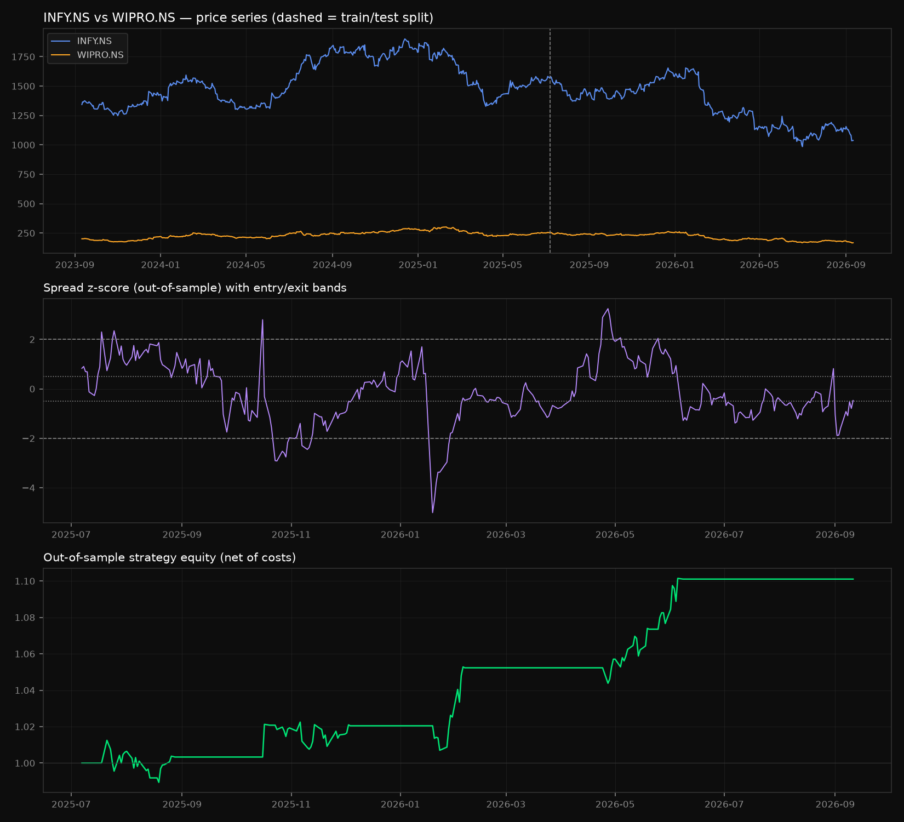

---

### HCLTECH.NS / TECHM.NS

- **Latest prices:** HCLTECH.NS ₹1,206.10 · TECHM.NS ₹1,541.00
- **Hedge ratio (train-fitted):** 0.8992
- **Cointegration (train):** FAIL at 5% — ADF -2.21, p=0.2037
- **Persistence:** passed 5% in 0 of 52 real-data runs (strict tier: 0/52)
- **Spread half-life:** 23.4 days
- **Current z-score:** +1.50
- **Signal today:** watch (approaching band)
- ⚠️ _Pair did not cointegrate on training data. Any signal here is not statistically justified — observation only._

**Out-of-sample backtest** (beta frozen from train window):

| Metric | Value |
|---|---|
| Sharpe | 0.01 |
| Sortino | 0.01 |
| Annualised return | -0.15% |
| Annualised vol | 6.79% |
| Max drawdown | -7.66% |
| Round-trip trades | 5 |

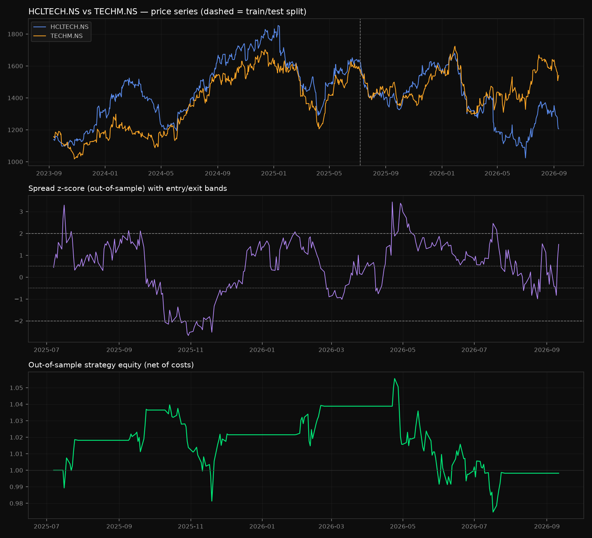

---

### ACC.NS / AMBUJACEM.NS

- **Latest prices:** ACC.NS ₹1,246.50 · AMBUJACEM.NS ₹391.85
- **Hedge ratio (train-fitted):** 0.2009
- **Cointegration (train):** FAIL at 5% — ADF -1.08, p=0.7246
- **Persistence:** passed 5% in 0 of 52 real-data runs (strict tier: 0/52)
- **Spread half-life:** 73.2 days
- **Current z-score:** -2.32
- **Signal today:** LONG spread (long AMBUJACEM.NS, short ACC.NS)
- ⚠️ _Pair did not cointegrate on training data. Any signal here is not statistically justified — observation only._

**Out-of-sample backtest** (beta frozen from train window):

| Metric | Value |
|---|---|
| Sharpe | 0.40 |
| Sortino | 0.34 |
| Annualised return | 2.20% |
| Annualised vol | 5.89% |
| Max drawdown | -6.92% |
| Round-trip trades | 4 |

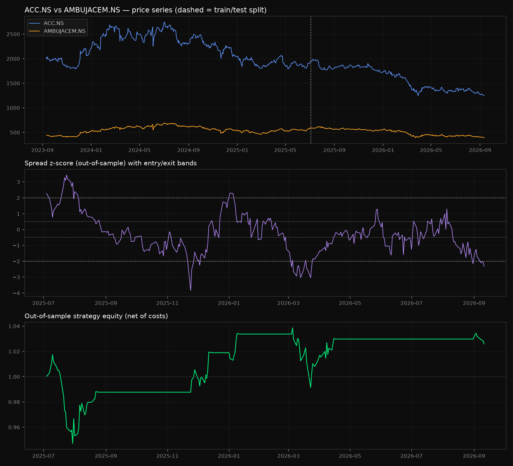

---

### ULTRACEMCO.NS / SHREECEM.NS

- **Latest prices:** ULTRACEMCO.NS ₹11,000.00 · SHREECEM.NS ₹22,570.00
- **Hedge ratio (train-fitted):** 0.6889
- **Cointegration (train):** FAIL at 5% — ADF -2.17, p=0.2175
- **Persistence:** passed 5% in 0 of 52 real-data runs (strict tier: 0/52)
- **Spread half-life:** 42.1 days
- **Current z-score:** -2.07
- **Signal today:** LONG spread (long SHREECEM.NS, short ULTRACEMCO.NS)
- ⚠️ _Pair did not cointegrate on training data. Any signal here is not statistically justified — observation only._

**Out-of-sample backtest** (beta frozen from train window):

| Metric | Value |
|---|---|
| Sharpe | 0.09 |
| Sortino | 0.10 |
| Annualised return | 0.42% |
| Annualised vol | 7.47% |
| Max drawdown | -8.50% |
| Round-trip trades | 5 |

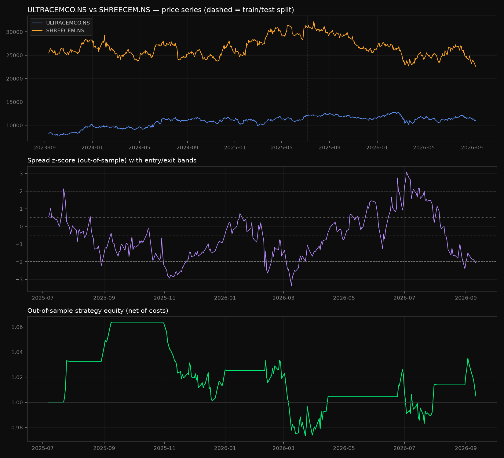

---

### IOC.NS / BPCL.NS

- **Latest prices:** IOC.NS ₹135.11 · BPCL.NS ₹304.50
- **Hedge ratio (train-fitted):** 1.7458
- **Cointegration (train):** FAIL at 5% — ADF -0.57, p=0.8777
- **Persistence:** passed 5% in 0 of 52 real-data runs (strict tier: 0/52)
- **Spread half-life:** 201.5 days
- **Current z-score:** -0.36
- **Signal today:** flat / no stretch
- ⚠️ _Pair did not cointegrate on training data. Any signal here is not statistically justified — observation only._

**Out-of-sample backtest** (beta frozen from train window):

| Metric | Value |
|---|---|
| Sharpe | 0.43 |
| Sortino | 0.46 |
| Annualised return | 2.47% |
| Annualised vol | 6.11% |
| Max drawdown | -6.13% |
| Round-trip trades | 7 |

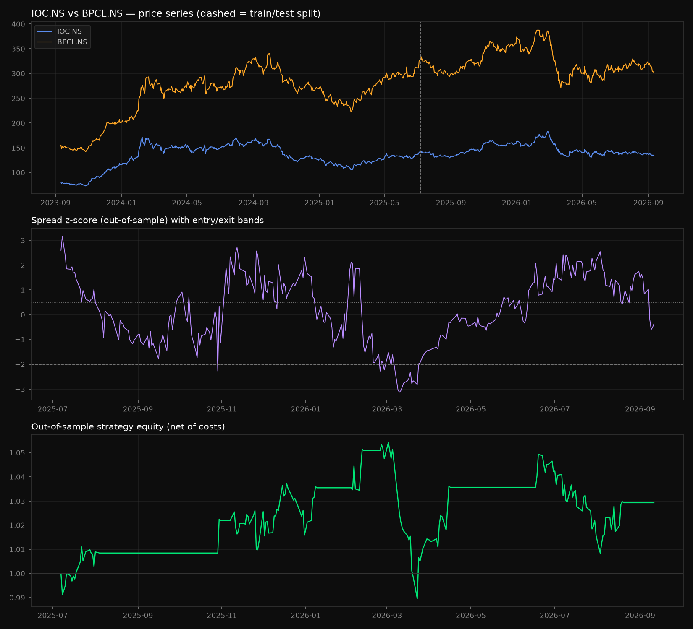

---

### BPCL.NS / HINDPETRO.NS

- **Latest prices:** BPCL.NS ₹304.50 · HINDPETRO.NS ₹352.00
- **Hedge ratio (train-fitted):** 1.3541
- **Cointegration (train):** FAIL at 5% — ADF -2.01, p=0.2810
- **Persistence:** passed 5% in 0 of 52 real-data runs (strict tier: 0/52)
- **Spread half-life:** 38.4 days
- **Current z-score:** -0.64
- **Signal today:** watch (approaching band)
- ⚠️ _Pair did not cointegrate on training data. Any signal here is not statistically justified — observation only._

**Out-of-sample backtest** (beta frozen from train window):

| Metric | Value |
|---|---|
| Sharpe | 0.07 |
| Sortino | 0.07 |
| Annualised return | 0.26% |
| Annualised vol | 5.53% |
| Max drawdown | -6.27% |
| Round-trip trades | 5 |

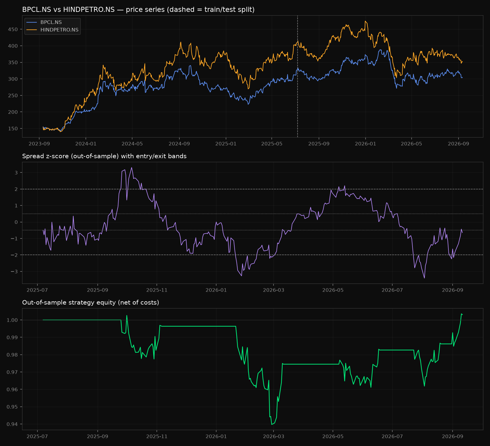

---

### ONGC.NS / COALINDIA.NS

- **Latest prices:** ONGC.NS ₹232.50 · COALINDIA.NS ₹426.40
- **Hedge ratio (train-fitted):** 1.4779
- **Cointegration (train):** PASS at 5% — ADF -3.38, p=0.0117
- **Persistence:** passed 5% in 44 of 52 real-data runs (strict tier: 1/52)
- **Spread half-life:** 12.7 days
- **Current z-score:** +1.83
- **Signal today:** watch (approaching band)

**Out-of-sample backtest** (beta frozen from train window):

| Metric | Value |
|---|---|
| Sharpe | 0.51 |
| Sortino | 0.37 |
| Annualised return | 3.46% |
| Annualised vol | 7.21% |
| Max drawdown | -6.10% |
| Round-trip trades | 4 |

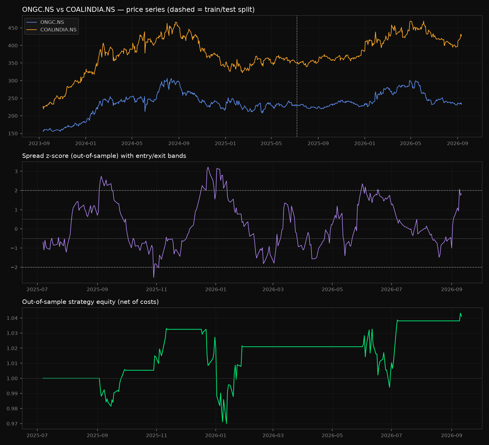

---

### NTPC.NS / POWERGRID.NS

- **Latest prices:** NTPC.NS ₹333.40 · POWERGRID.NS ₹269.10
- **Hedge ratio (train-fitted):** 0.8367
- **Cointegration (train):** FAIL at 5% — ADF -2.57, p=0.1003
- **Persistence:** passed 5% in 0 of 52 real-data runs (strict tier: 0/52)
- **Spread half-life:** 23.4 days
- **Current z-score:** -0.46
- **Signal today:** flat / no stretch
- ⚠️ _Pair did not cointegrate on training data. Any signal here is not statistically justified — observation only._

**Out-of-sample backtest** (beta frozen from train window):

| Metric | Value |
|---|---|
| Sharpe | 0.42 |
| Sortino | 0.33 |
| Annualised return | 2.21% |
| Annualised vol | 5.54% |
| Max drawdown | -5.27% |
| Round-trip trades | 6 |

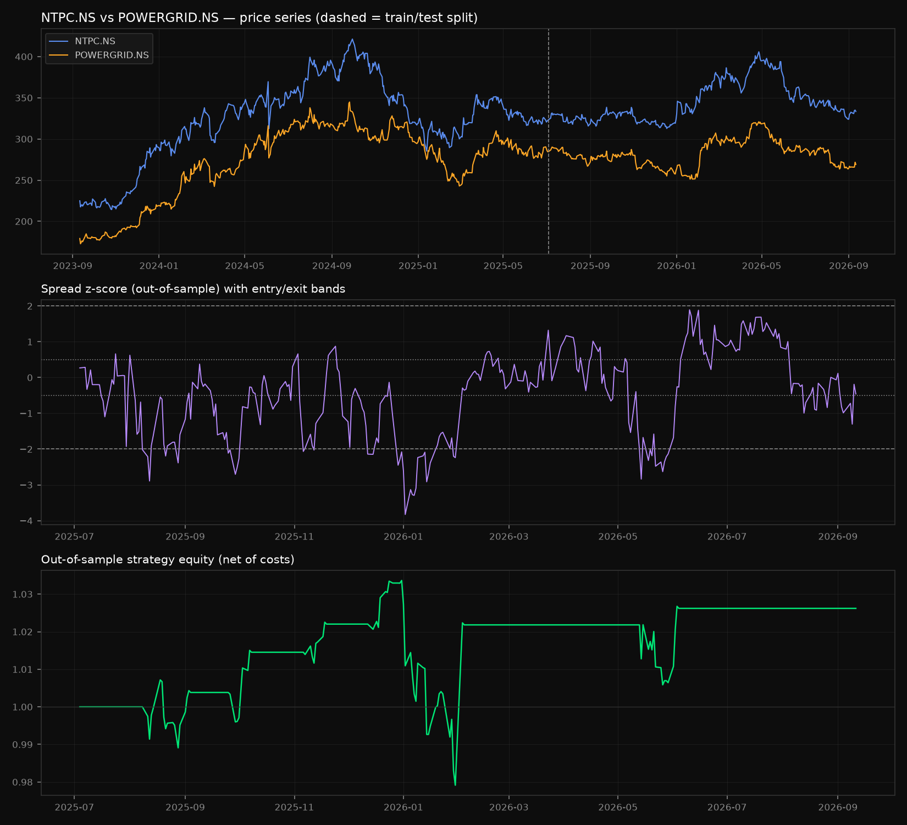

---

### BAJAJ-AUTO.NS / HEROMOTOCO.NS

- **Latest prices:** BAJAJ-AUTO.NS ₹11,678.00 · HEROMOTOCO.NS ₹5,221.50
- **Hedge ratio (train-fitted):** 0.4104
- **Cointegration (train):** FAIL at 5% — ADF -2.30, p=0.1709
- **Persistence:** passed 5% in 0 of 52 real-data runs (strict tier: 0/52)
- **Spread half-life:** 29.4 days
- **Current z-score:** -1.33
- **Signal today:** watch (approaching band)
- ⚠️ _Pair did not cointegrate on training data. Any signal here is not statistically justified — observation only._

**Out-of-sample backtest** (beta frozen from train window):

| Metric | Value |
|---|---|
| Sharpe | -0.74 |
| Sortino | -0.78 |
| Annualised return | -8.07% |
| Annualised vol | 10.57% |
| Max drawdown | -20.77% |
| Round-trip trades | 5 |

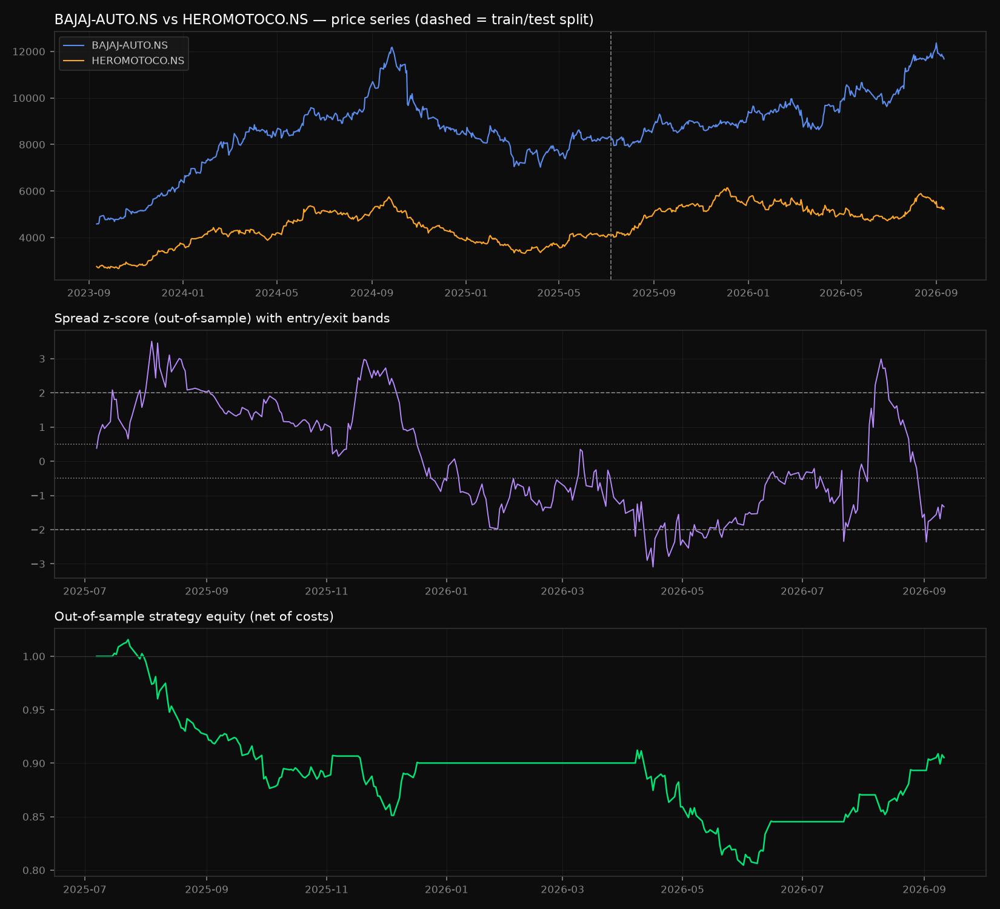

---

### TATASTEEL.NS / JSWSTEEL.NS

- **Latest prices:** TATASTEEL.NS ₹183.00 · JSWSTEEL.NS ₹1,265.00
- **Hedge ratio (train-fitted):** 3.1331
- **Cointegration (train):** FAIL at 5% — ADF -1.12, p=0.7085
- **Persistence:** passed 5% in 0 of 52 real-data runs (strict tier: 0/52)
- **Spread half-life:** 74.5 days
- **Current z-score:** +0.19
- **Signal today:** flat / no stretch
- ⚠️ _Pair did not cointegrate on training data. Any signal here is not statistically justified — observation only._

**Out-of-sample backtest** (beta frozen from train window):

| Metric | Value |
|---|---|
| Sharpe | 0.35 |
| Sortino | 0.34 |
| Annualised return | 2.57% |
| Annualised vol | 8.17% |
| Max drawdown | -5.46% |
| Round-trip trades | 4 |

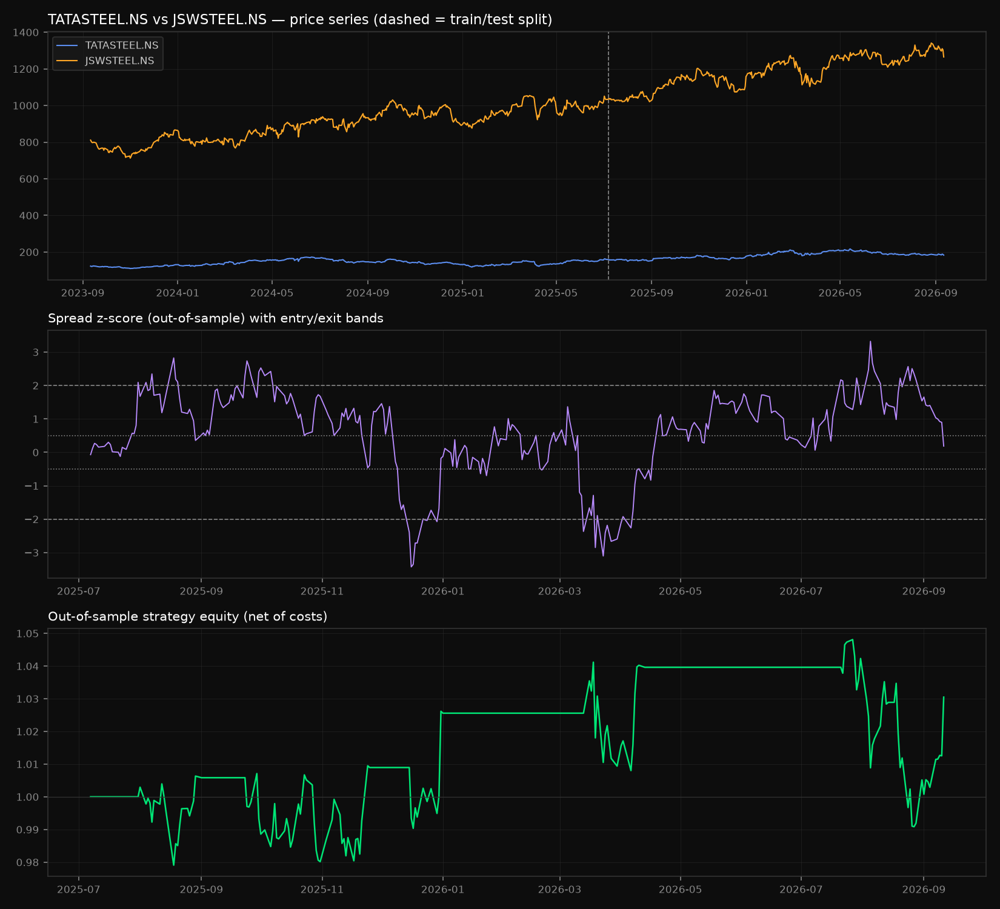

---

### SUNPHARMA.NS / CIPLA.NS

- **Latest prices:** SUNPHARMA.NS ₹1,840.00 · CIPLA.NS ₹1,366.00
- **Hedge ratio (train-fitted):** 0.4977
- **Cointegration (train):** PASS at 5% — ADF -3.37, p=0.0122
- **Persistence:** passed 5% in 52 of 52 real-data runs (strict tier: 5/52)
- **Spread half-life:** 10.7 days
- **Current z-score:** -0.99
- **Signal today:** watch (approaching band)

**Out-of-sample backtest** (beta frozen from train window):

| Metric | Value |
|---|---|
| Sharpe | -0.09 |
| Sortino | -0.09 |
| Annualised return | -0.93% |
| Annualised vol | 7.61% |
| Max drawdown | -10.18% |
| Round-trip trades | 4 |

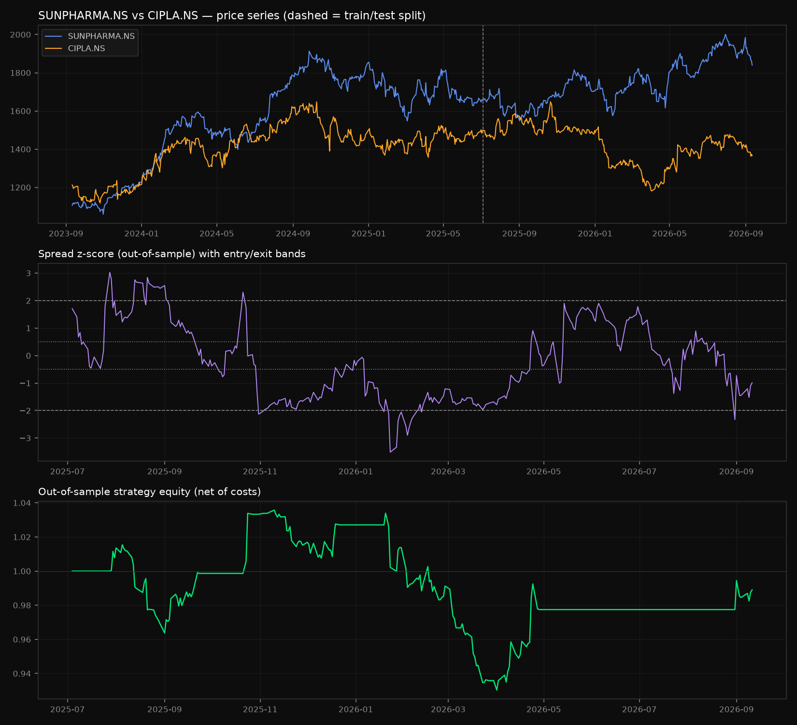

---

_Generated 2026-09-11 · pairs mean-reversion scanner · out-of-sample backtest · multiple-testing-aware · not investment advice._
