# Indian Pairs-Trading Scanner — 2026-09-14

> **What this is:** a market-neutral *pairs mean-reversion* scanner. It flags when two related NSE stocks have drifted apart far enough that their historical relationship signals a possible convergence trade. It does **not** forecast growth, rank "best" stocks, or predict company performance. A signal means the *spread between two stocks* is stretched — nothing about either stock being a good investment. Not investment advice; do your own research.

## Methodology (fixed in advance)

- **Universe:** 16 declared sector-mate pairs. Parameters (3y window, 60/40 train-test, z-entry 2.0, z-exit 0.5, 5 bps costs) are pre-registered; changes are logged in the README changelog *before* looking at results.
- **Multiple testing:** at the 5% level across 16 pairs, **≈0.8 false positives per run are expected by chance alone** even if nothing truly cointegrates. A single-day pass is a candidate, not a discovery.
- **Strict tier:** Bonferroni-corrected threshold p < 0.0031 (marked ✓✓).
- **Evidence = persistence:** the Persistence column counts how often each pair has passed the 5% test across all *real-data* daily runs recorded in `reports/history.csv`. Pairs deserve attention only when they pass persistently.

## Summary

| Pair | p-value | Coint. | Persistence | Current z | Signal | OOS Sharpe |
|---|---|---|---|---|---|---|
| HDFCBANK.NS/ICICIBANK.NS | 0.0533 | ✗ | 0/43 | +0.53 | watch | -0.45 |
| AXISBANK.NS/ICICIBANK.NS | 0.8626 | ✗ | 0/53 | +0.03 | flat / no stretch | -0.32 |
| KOTAKBANK.NS/HDFCBANK.NS | 0.1337 | ✗ | 0/53 | -1.40 | watch | 0.72 |
| SBIN.NS/BANKBARODA.NS | 0.1473 | ✗ | 0/53 | -0.24 | flat / no stretch | 0.03 |
| TCS.NS/INFY.NS | 0.6953 | ✗ | 0/53 | -1.28 | watch | 2.18 |
| INFY.NS/WIPRO.NS | 0.2080 | ✗ | 0/53 | -0.48 | flat / no stretch | 1.68 |
| HCLTECH.NS/TECHM.NS | 0.1945 | ✗ | 0/53 | +1.51 | watch | 0.00 |
| ACC.NS/AMBUJACEM.NS | 0.7157 | ✗ | 0/53 | -2.32 | LONG spread | 0.64 |
| ULTRACEMCO.NS/SHREECEM.NS | 0.2122 | ✗ | 0/53 | -2.07 | LONG spread | 0.10 |
| IOC.NS/BPCL.NS | 0.8776 | ✗ | 0/53 | -0.37 | flat / no stretch | 0.54 |
| BPCL.NS/HINDPETRO.NS | 0.2725 | ✗ | 0/53 | -0.65 | watch | 0.07 |
| ONGC.NS/COALINDIA.NS | 0.0094 | ✓ | 45/53 | +1.83 | watch | 0.51 |
| NTPC.NS/POWERGRID.NS | 0.1022 | ✗ | 0/53 | -0.46 | flat / no stretch | 0.42 |
| BAJAJ-AUTO.NS/HEROMOTOCO.NS | 0.1783 | ✗ | 0/53 | -1.33 | watch | -0.74 |
| TATASTEEL.NS/JSWSTEEL.NS | 0.7000 | ✗ | 0/53 | +0.18 | flat / no stretch | 0.35 |
| SUNPHARMA.NS/CIPLA.NS | 0.0134 | ✓ | 53/53 | -0.98 | watch | -0.09 |

_Legend: ✓✓ passes strict Bonferroni tier · ✓ passes 5% only · ✗ fails. Persistence = 5%-passes / real-data runs recorded. \*no real-data history yet._

---

### HDFCBANK.NS / ICICIBANK.NS

- **Latest prices:** HDFCBANK.NS ₹708.25 · ICICIBANK.NS ₹1,379.30
- **Hedge ratio (train-fitted):** 1.6993
- **Cointegration (train):** FAIL at 5% — ADF -2.84, p=0.0533
- **Persistence:** passed 5% in 0 of 43 real-data runs (strict tier: 0/43)
- **Spread half-life:** 23.8 days
- **Current z-score:** +0.53
- **Signal today:** watch (approaching band)
- ⚠️ _Pair did not cointegrate on training data. Any signal here is not statistically justified — observation only._

**Out-of-sample backtest** (beta frozen from train window):

| Metric | Value |
|---|---|
| Sharpe | -0.45 |
| Sortino | -0.48 |
| Annualised return | -3.10% |
| Annualised vol | 6.59% |
| Max drawdown | -8.34% |
| Round-trip trades | 4 |

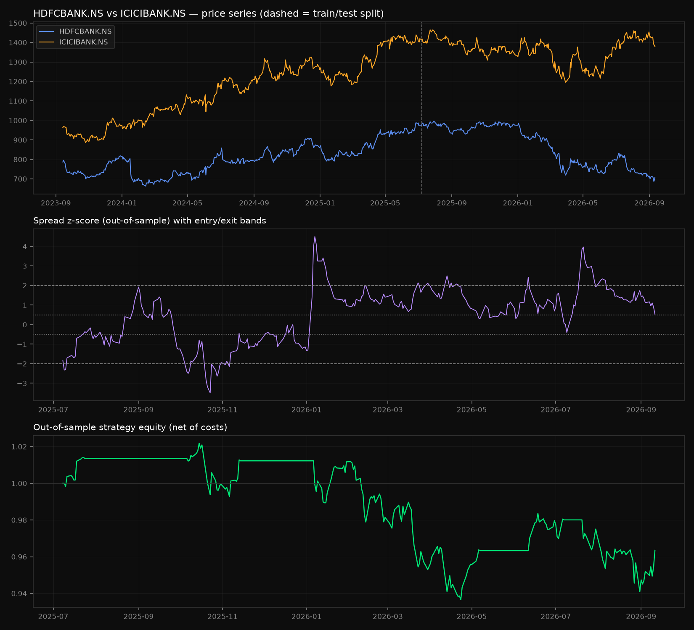

---

### AXISBANK.NS / ICICIBANK.NS

- **Latest prices:** AXISBANK.NS ₹1,246.00 · ICICIBANK.NS ₹1,379.30
- **Hedge ratio (train-fitted):** 0.9868
- **Cointegration (train):** FAIL at 5% — ADF -0.64, p=0.8626
- **Persistence:** passed 5% in 0 of 53 real-data runs (strict tier: 0/53)
- **Spread half-life:** 181.3 days
- **Current z-score:** +0.03
- **Signal today:** flat / no stretch
- ⚠️ _Pair did not cointegrate on training data. Any signal here is not statistically justified — observation only._

**Out-of-sample backtest** (beta frozen from train window):

| Metric | Value |
|---|---|
| Sharpe | -0.32 |
| Sortino | -0.32 |
| Annualised return | -3.13% |
| Annualised vol | 8.73% |
| Max drawdown | -7.69% |
| Round-trip trades | 6 |

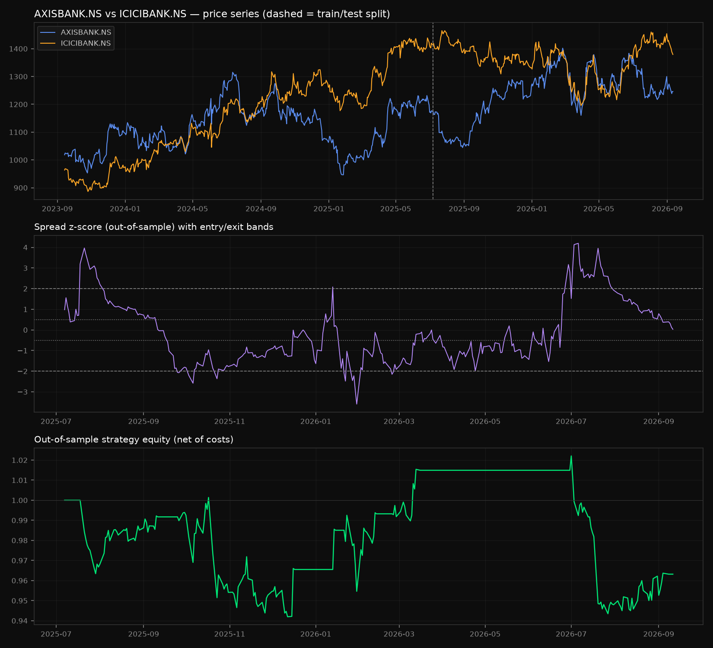

---

### KOTAKBANK.NS / HDFCBANK.NS

- **Latest prices:** KOTAKBANK.NS ₹419.00 · HDFCBANK.NS ₹708.25
- **Hedge ratio (train-fitted):** 2.1027
- **Cointegration (train):** FAIL at 5% — ADF -2.43, p=0.1337
- **Persistence:** passed 5% in 0 of 53 real-data runs (strict tier: 0/53)
- **Spread half-life:** 25.5 days
- **Current z-score:** -1.40
- **Signal today:** watch (approaching band)
- ⚠️ _Pair did not cointegrate on training data. Any signal here is not statistically justified — observation only._

**Out-of-sample backtest** (beta frozen from train window):

| Metric | Value |
|---|---|
| Sharpe | 0.72 |
| Sortino | 0.53 |
| Annualised return | 4.49% |
| Annualised vol | 6.36% |
| Max drawdown | -4.19% |
| Round-trip trades | 6 |

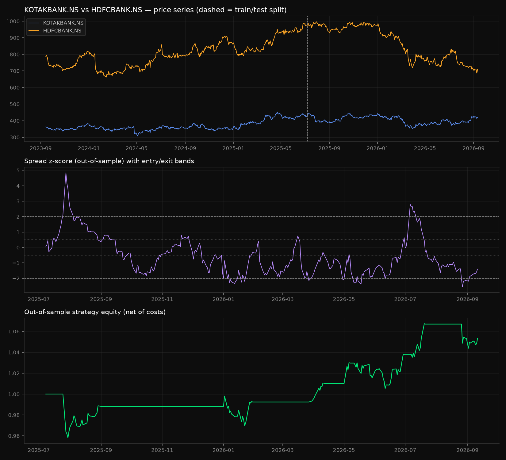

---

### SBIN.NS / BANKBARODA.NS

- **Latest prices:** SBIN.NS ₹995.70 · BANKBARODA.NS ₹238.13
- **Hedge ratio (train-fitted):** 0.1897
- **Cointegration (train):** FAIL at 5% — ADF -2.38, p=0.1473
- **Persistence:** passed 5% in 0 of 53 real-data runs (strict tier: 0/53)
- **Spread half-life:** 20.9 days
- **Current z-score:** -0.24
- **Signal today:** flat / no stretch
- ⚠️ _Pair did not cointegrate on training data. Any signal here is not statistically justified — observation only._

**Out-of-sample backtest** (beta frozen from train window):

| Metric | Value |
|---|---|
| Sharpe | 0.03 |
| Sortino | 0.02 |
| Annualised return | -0.16% |
| Annualised vol | 9.15% |
| Max drawdown | -8.78% |
| Round-trip trades | 4 |

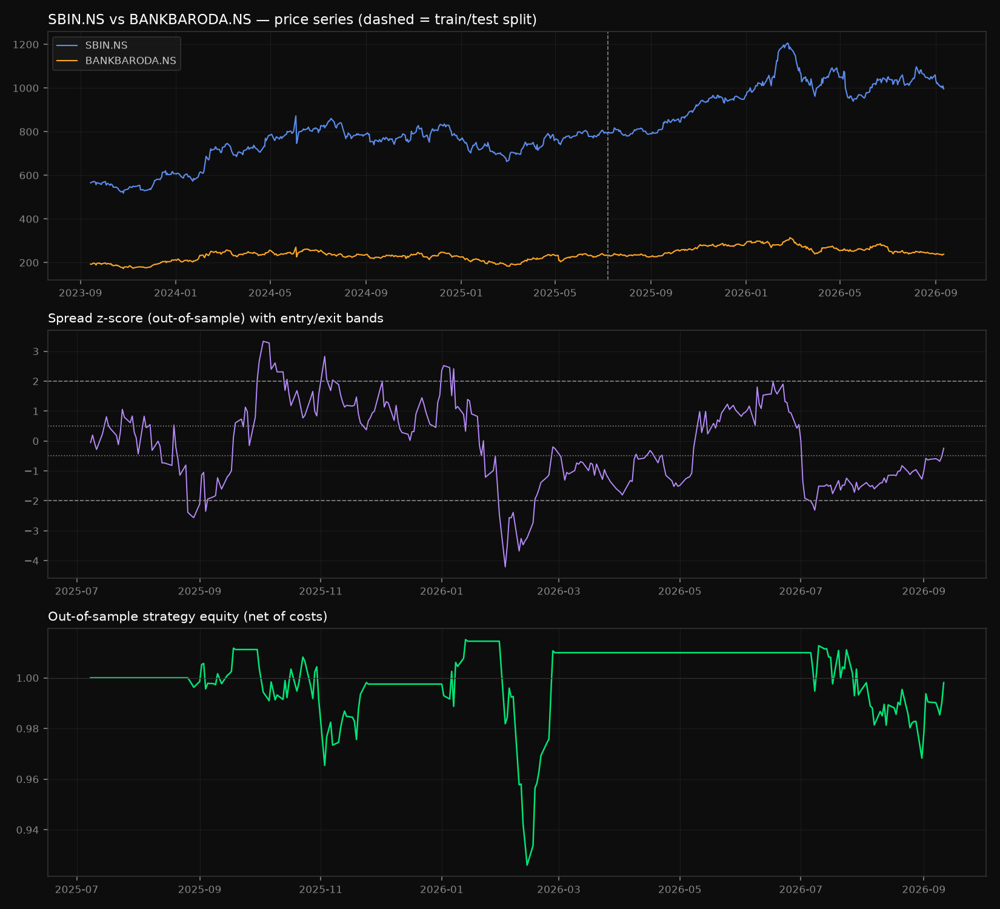

---

### TCS.NS / INFY.NS

- **Latest prices:** TCS.NS ₹2,200.80 · INFY.NS ₹1,037.70
- **Hedge ratio (train-fitted):** 0.4877
- **Cointegration (train):** FAIL at 5% — ADF -1.15, p=0.6953
- **Persistence:** passed 5% in 0 of 53 real-data runs (strict tier: 0/53)
- **Spread half-life:** 66.7 days
- **Current z-score:** -1.28
- **Signal today:** watch (approaching band)
- ⚠️ _Pair did not cointegrate on training data. Any signal here is not statistically justified — observation only._

**Out-of-sample backtest** (beta frozen from train window):

| Metric | Value |
|---|---|
| Sharpe | 2.18 |
| Sortino | 2.19 |
| Annualised return | 9.20% |
| Annualised vol | 4.07% |
| Max drawdown | -1.31% |
| Round-trip trades | 7 |

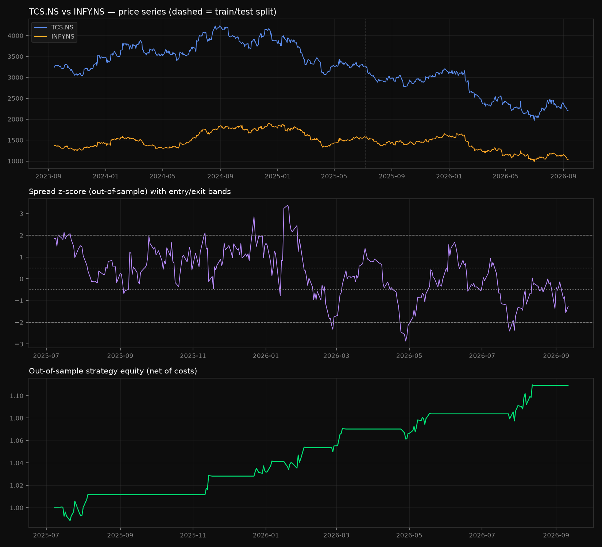

---

### INFY.NS / WIPRO.NS

- **Latest prices:** INFY.NS ₹1,037.70 · WIPRO.NS ₹167.40
- **Hedge ratio (train-fitted):** 0.1339
- **Cointegration (train):** FAIL at 5% — ADF -2.20, p=0.2080
- **Persistence:** passed 5% in 0 of 53 real-data runs (strict tier: 0/53)
- **Spread half-life:** 31.5 days
- **Current z-score:** -0.48
- **Signal today:** flat / no stretch
- ⚠️ _Pair did not cointegrate on training data. Any signal here is not statistically justified — observation only._

**Out-of-sample backtest** (beta frozen from train window):

| Metric | Value |
|---|---|
| Sharpe | 1.68 |
| Sortino | 1.97 |
| Annualised return | 8.45% |
| Annualised vol | 4.90% |
| Max drawdown | -2.26% |
| Round-trip trades | 6 |

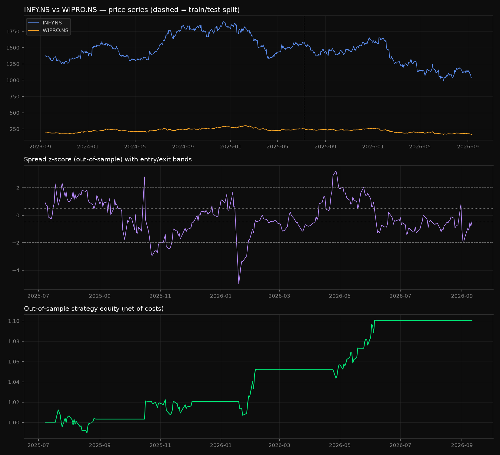

---

### HCLTECH.NS / TECHM.NS

- **Latest prices:** HCLTECH.NS ₹1,206.10 · TECHM.NS ₹1,541.00
- **Hedge ratio (train-fitted):** 0.9048
- **Cointegration (train):** FAIL at 5% — ADF -2.23, p=0.1945
- **Persistence:** passed 5% in 0 of 53 real-data runs (strict tier: 0/53)
- **Spread half-life:** 22.5 days
- **Current z-score:** +1.51
- **Signal today:** watch (approaching band)
- ⚠️ _Pair did not cointegrate on training data. Any signal here is not statistically justified — observation only._

**Out-of-sample backtest** (beta frozen from train window):

| Metric | Value |
|---|---|
| Sharpe | 0.00 |
| Sortino | 0.00 |
| Annualised return | -0.22% |
| Annualised vol | 6.77% |
| Max drawdown | -7.62% |
| Round-trip trades | 5 |

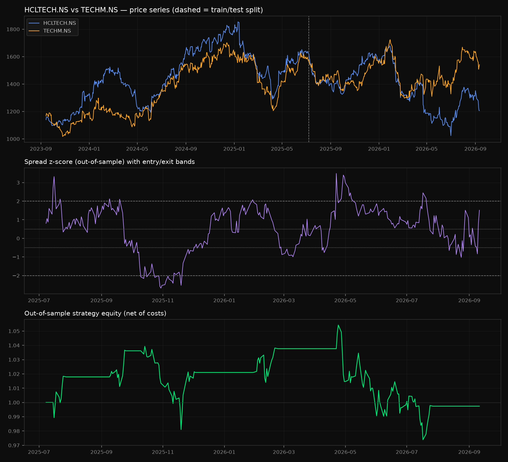

---

### ACC.NS / AMBUJACEM.NS

- **Latest prices:** ACC.NS ₹1,246.50 · AMBUJACEM.NS ₹391.85
- **Hedge ratio (train-fitted):** 0.1991
- **Cointegration (train):** FAIL at 5% — ADF -1.10, p=0.7157
- **Persistence:** passed 5% in 0 of 53 real-data runs (strict tier: 0/53)
- **Spread half-life:** 73.2 days
- **Current z-score:** -2.32
- **Signal today:** LONG spread (long AMBUJACEM.NS, short ACC.NS)
- ⚠️ _Pair did not cointegrate on training data. Any signal here is not statistically justified — observation only._

**Out-of-sample backtest** (beta frozen from train window):

| Metric | Value |
|---|---|
| Sharpe | 0.64 |
| Sortino | 0.52 |
| Annualised return | 3.54% |
| Annualised vol | 5.68% |
| Max drawdown | -4.62% |
| Round-trip trades | 4 |

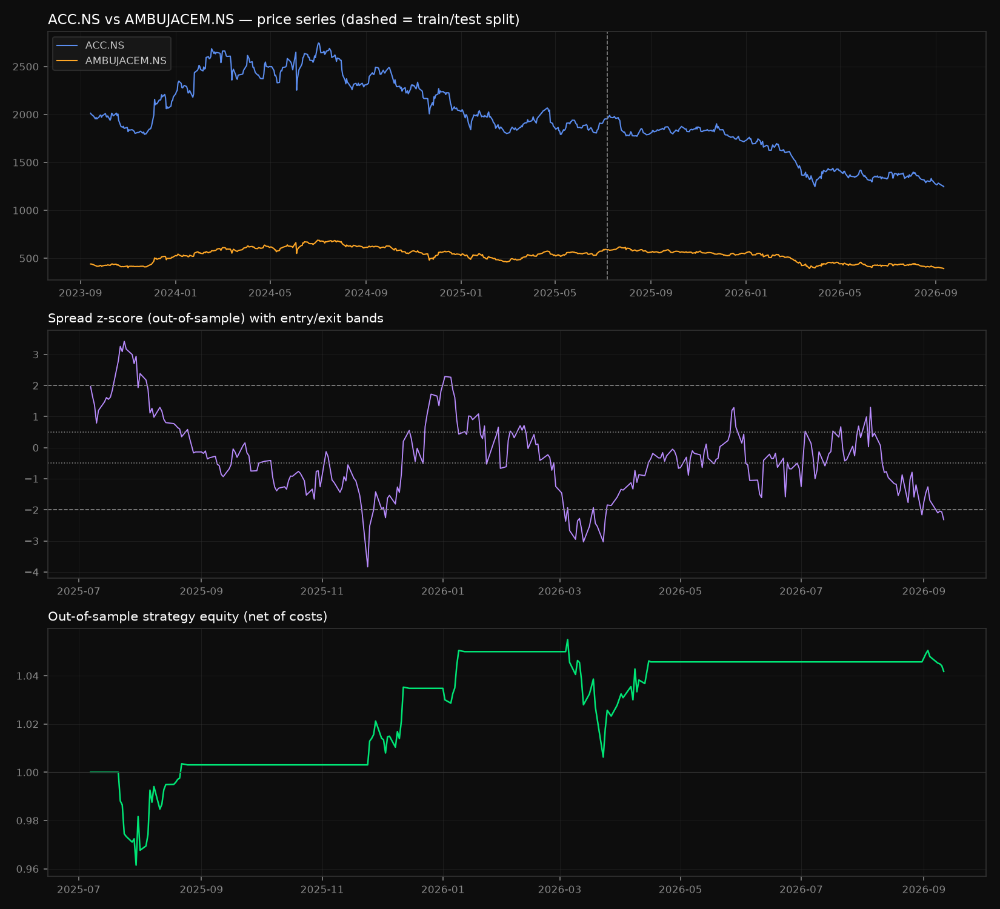

---

### ULTRACEMCO.NS / SHREECEM.NS

- **Latest prices:** ULTRACEMCO.NS ₹11,000.00 · SHREECEM.NS ₹22,570.00
- **Hedge ratio (train-fitted):** 0.7032
- **Cointegration (train):** FAIL at 5% — ADF -2.18, p=0.2122
- **Persistence:** passed 5% in 0 of 53 real-data runs (strict tier: 0/53)
- **Spread half-life:** 41.4 days
- **Current z-score:** -2.07
- **Signal today:** LONG spread (long SHREECEM.NS, short ULTRACEMCO.NS)
- ⚠️ _Pair did not cointegrate on training data. Any signal here is not statistically justified — observation only._

**Out-of-sample backtest** (beta frozen from train window):

| Metric | Value |
|---|---|
| Sharpe | 0.10 |
| Sortino | 0.11 |
| Annualised return | 0.49% |
| Annualised vol | 7.36% |
| Max drawdown | -8.32% |
| Round-trip trades | 5 |

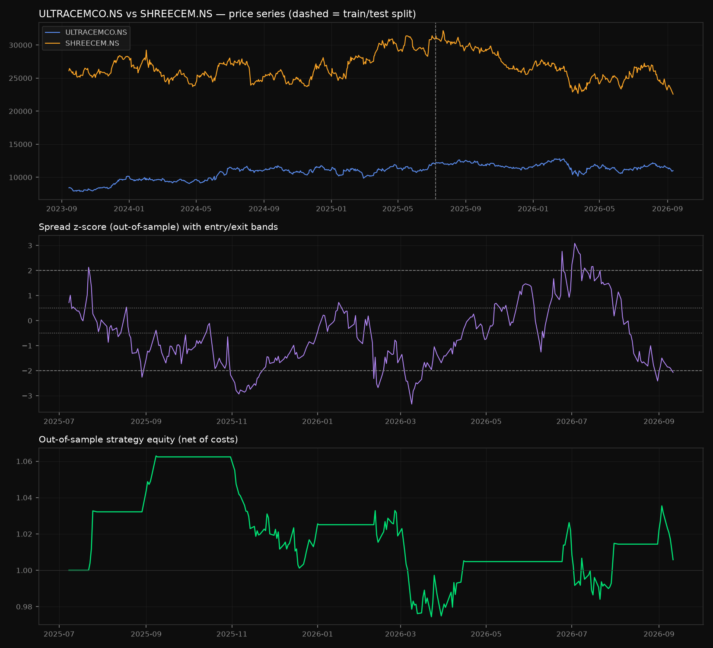

---

### IOC.NS / BPCL.NS

- **Latest prices:** IOC.NS ₹135.11 · BPCL.NS ₹304.50
- **Hedge ratio (train-fitted):** 1.7385
- **Cointegration (train):** FAIL at 5% — ADF -0.57, p=0.8776
- **Persistence:** passed 5% in 0 of 53 real-data runs (strict tier: 0/53)
- **Spread half-life:** 201.9 days
- **Current z-score:** -0.37
- **Signal today:** flat / no stretch
- ⚠️ _Pair did not cointegrate on training data. Any signal here is not statistically justified — observation only._

**Out-of-sample backtest** (beta frozen from train window):

| Metric | Value |
|---|---|
| Sharpe | 0.54 |
| Sortino | 0.58 |
| Annualised return | 3.15% |
| Annualised vol | 6.03% |
| Max drawdown | -6.14% |
| Round-trip trades | 7 |

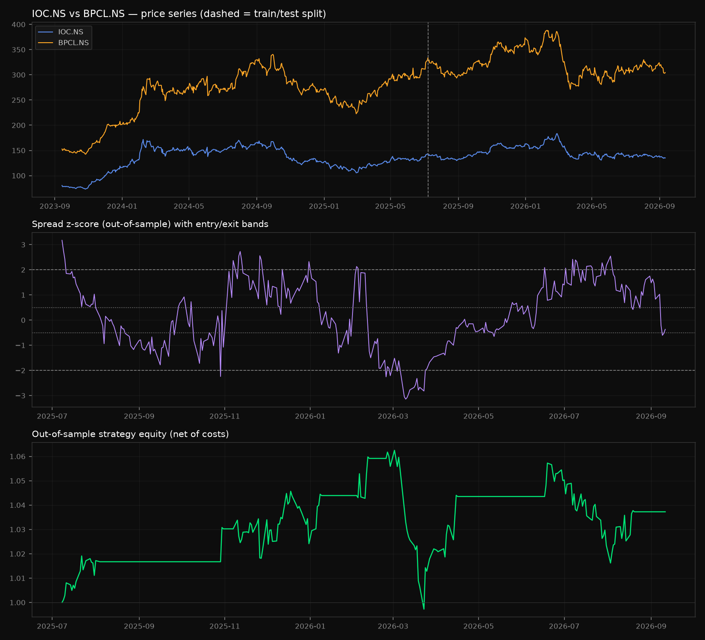

---

### BPCL.NS / HINDPETRO.NS

- **Latest prices:** BPCL.NS ₹304.50 · HINDPETRO.NS ₹352.00
- **Hedge ratio (train-fitted):** 1.3508
- **Cointegration (train):** FAIL at 5% — ADF -2.03, p=0.2725
- **Persistence:** passed 5% in 0 of 53 real-data runs (strict tier: 0/53)
- **Spread half-life:** 38.0 days
- **Current z-score:** -0.65
- **Signal today:** watch (approaching band)
- ⚠️ _Pair did not cointegrate on training data. Any signal here is not statistically justified — observation only._

**Out-of-sample backtest** (beta frozen from train window):

| Metric | Value |
|---|---|
| Sharpe | 0.07 |
| Sortino | 0.06 |
| Annualised return | 0.23% |
| Annualised vol | 5.47% |
| Max drawdown | -6.20% |
| Round-trip trades | 5 |

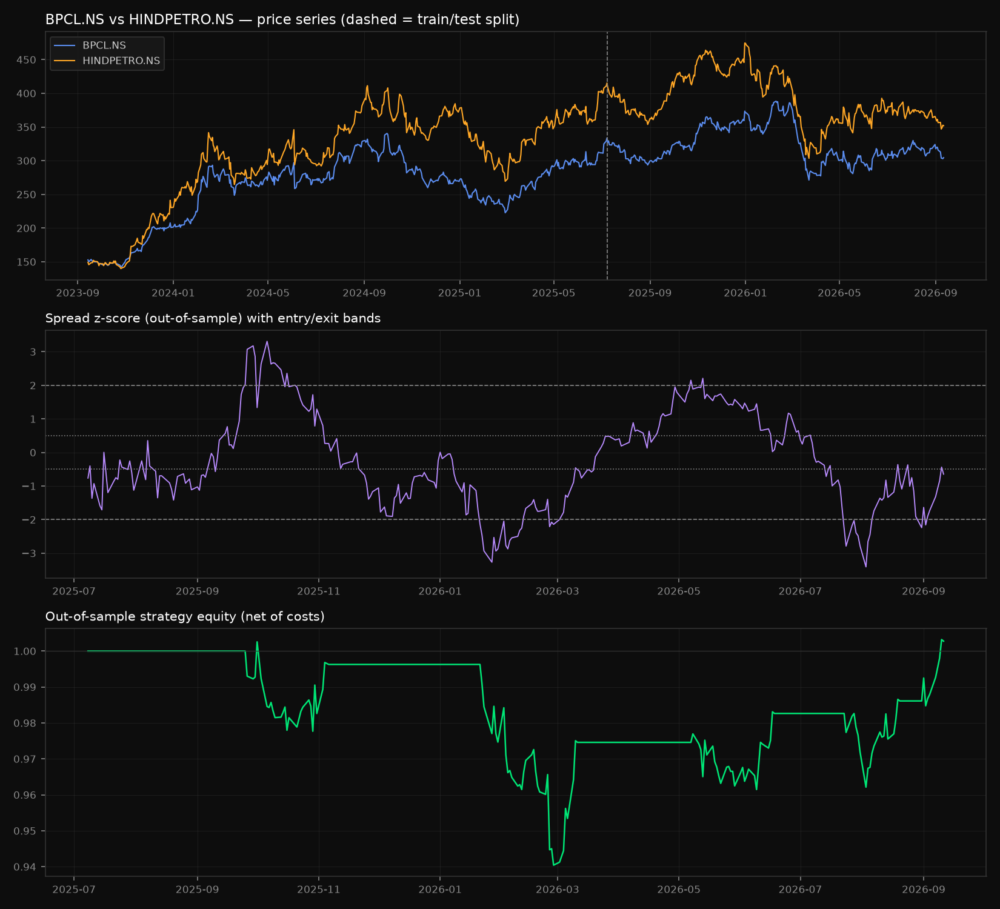

---

### ONGC.NS / COALINDIA.NS

- **Latest prices:** ONGC.NS ₹232.50 · COALINDIA.NS ₹426.40
- **Hedge ratio (train-fitted):** 1.4658
- **Cointegration (train):** PASS at 5% — ADF -3.45, p=0.0094
- **Persistence:** passed 5% in 45 of 53 real-data runs (strict tier: 1/53)
- **Spread half-life:** 12.1 days
- **Current z-score:** +1.83
- **Signal today:** watch (approaching band)

**Out-of-sample backtest** (beta frozen from train window):

| Metric | Value |
|---|---|
| Sharpe | 0.51 |
| Sortino | 0.37 |
| Annualised return | 3.45% |
| Annualised vol | 7.21% |
| Max drawdown | -6.12% |
| Round-trip trades | 4 |

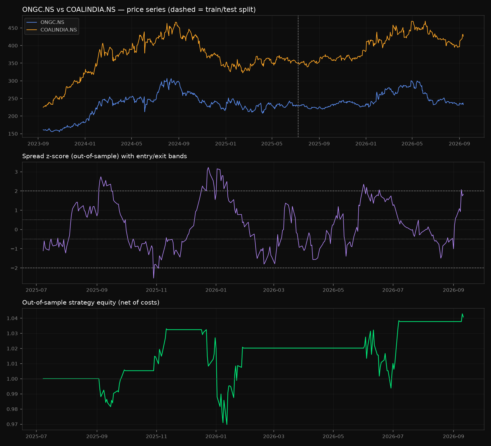

---

### NTPC.NS / POWERGRID.NS

- **Latest prices:** NTPC.NS ₹333.40 · POWERGRID.NS ₹269.10
- **Hedge ratio (train-fitted):** 0.8337
- **Cointegration (train):** FAIL at 5% — ADF -2.56, p=0.1022
- **Persistence:** passed 5% in 0 of 53 real-data runs (strict tier: 0/53)
- **Spread half-life:** 23.4 days
- **Current z-score:** -0.46
- **Signal today:** flat / no stretch
- ⚠️ _Pair did not cointegrate on training data. Any signal here is not statistically justified — observation only._

**Out-of-sample backtest** (beta frozen from train window):

| Metric | Value |
|---|---|
| Sharpe | 0.42 |
| Sortino | 0.33 |
| Annualised return | 2.22% |
| Annualised vol | 5.52% |
| Max drawdown | -5.23% |
| Round-trip trades | 6 |

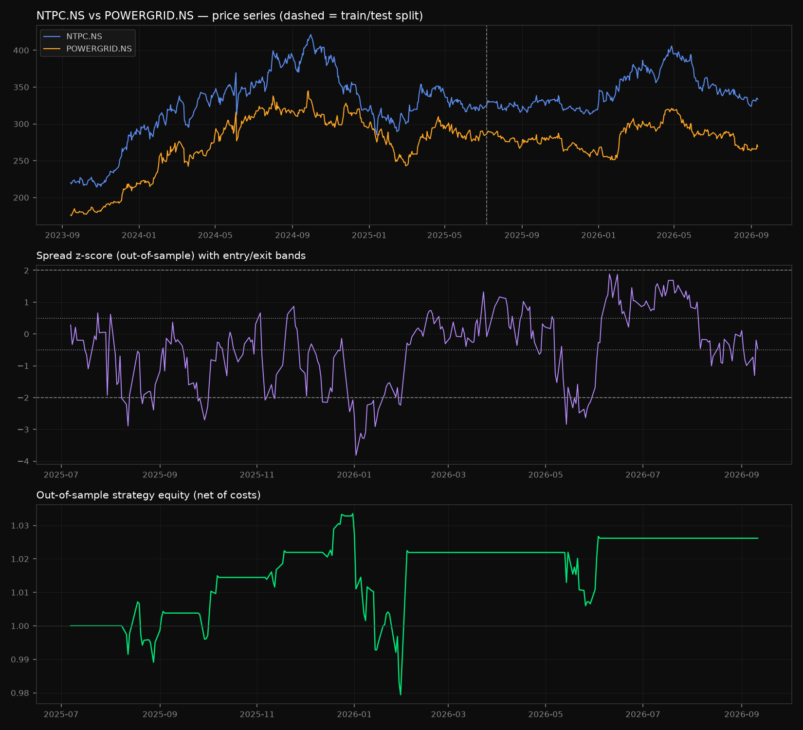

---

### BAJAJ-AUTO.NS / HEROMOTOCO.NS

- **Latest prices:** BAJAJ-AUTO.NS ₹11,678.00 · HEROMOTOCO.NS ₹5,221.50
- **Hedge ratio (train-fitted):** 0.4109
- **Cointegration (train):** FAIL at 5% — ADF -2.28, p=0.1783
- **Persistence:** passed 5% in 0 of 53 real-data runs (strict tier: 0/53)
- **Spread half-life:** 29.6 days
- **Current z-score:** -1.33
- **Signal today:** watch (approaching band)
- ⚠️ _Pair did not cointegrate on training data. Any signal here is not statistically justified — observation only._

**Out-of-sample backtest** (beta frozen from train window):

| Metric | Value |
|---|---|
| Sharpe | -0.74 |
| Sortino | -0.78 |
| Annualised return | -8.16% |
| Annualised vol | 10.67% |
| Max drawdown | -20.91% |
| Round-trip trades | 5 |

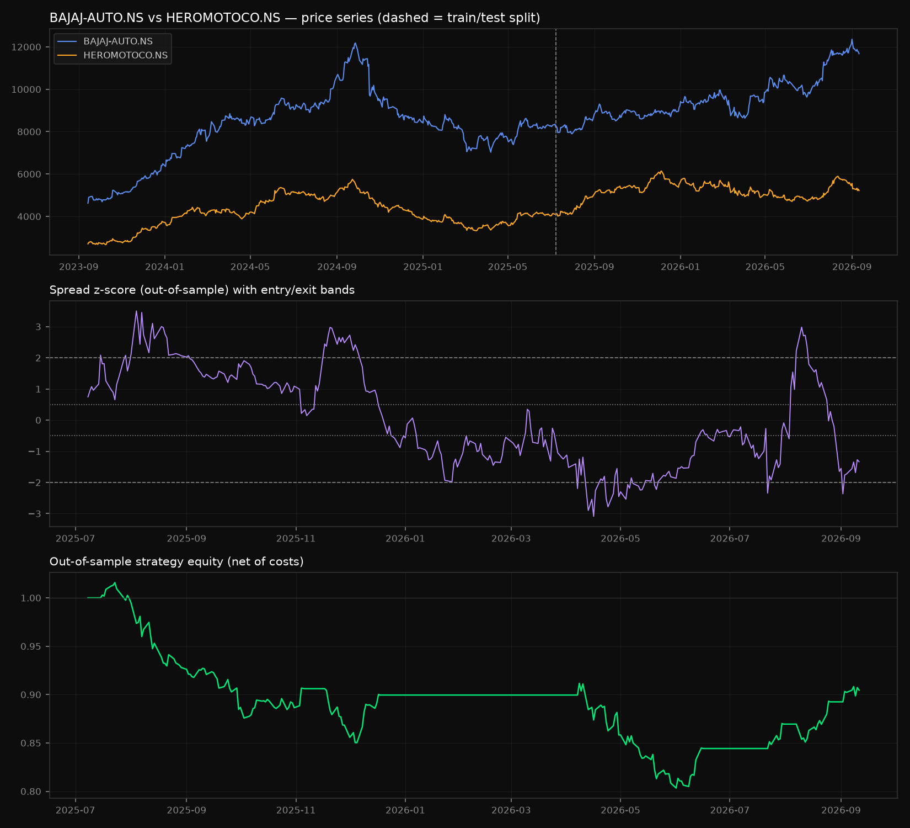

---

### TATASTEEL.NS / JSWSTEEL.NS

- **Latest prices:** TATASTEEL.NS ₹183.00 · JSWSTEEL.NS ₹1,265.00
- **Hedge ratio (train-fitted):** 3.1265
- **Cointegration (train):** FAIL at 5% — ADF -1.14, p=0.7000
- **Persistence:** passed 5% in 0 of 53 real-data runs (strict tier: 0/53)
- **Spread half-life:** 73.1 days
- **Current z-score:** +0.18
- **Signal today:** flat / no stretch
- ⚠️ _Pair did not cointegrate on training data. Any signal here is not statistically justified — observation only._

**Out-of-sample backtest** (beta frozen from train window):

| Metric | Value |
|---|---|
| Sharpe | 0.35 |
| Sortino | 0.34 |
| Annualised return | 2.59% |
| Annualised vol | 8.17% |
| Max drawdown | -5.45% |
| Round-trip trades | 4 |

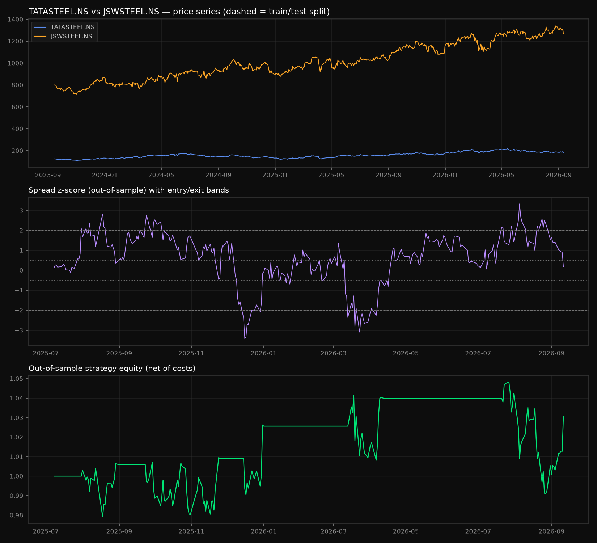

---

### SUNPHARMA.NS / CIPLA.NS

- **Latest prices:** SUNPHARMA.NS ₹1,840.00 · CIPLA.NS ₹1,366.00
- **Hedge ratio (train-fitted):** 0.4989
- **Cointegration (train):** PASS at 5% — ADF -3.33, p=0.0134
- **Persistence:** passed 5% in 53 of 53 real-data runs (strict tier: 5/53)
- **Spread half-life:** 10.8 days
- **Current z-score:** -0.98
- **Signal today:** watch (approaching band)

**Out-of-sample backtest** (beta frozen from train window):

| Metric | Value |
|---|---|
| Sharpe | -0.09 |
| Sortino | -0.09 |
| Annualised return | -0.94% |
| Annualised vol | 7.61% |
| Max drawdown | -10.17% |
| Round-trip trades | 4 |

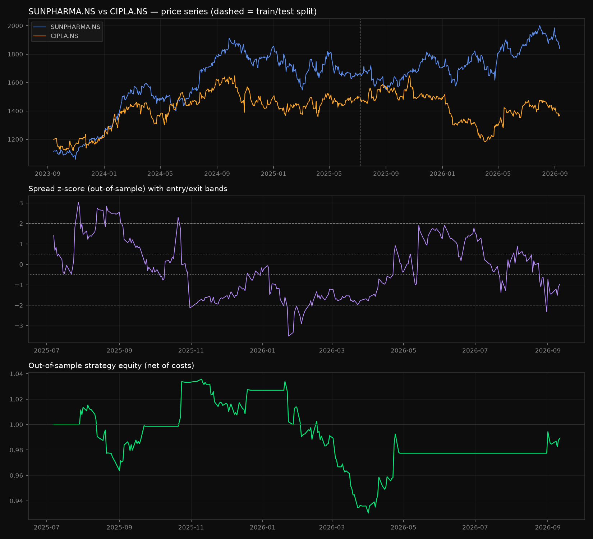

---

_Generated 2026-09-14 · pairs mean-reversion scanner · out-of-sample backtest · multiple-testing-aware · not investment advice._
