# Indian Pairs-Trading Scanner — 2026-09-15

> **What this is:** a market-neutral *pairs mean-reversion* scanner. It flags when two related NSE stocks have drifted apart far enough that their historical relationship signals a possible convergence trade. It does **not** forecast growth, rank "best" stocks, or predict company performance. A signal means the *spread between two stocks* is stretched — nothing about either stock being a good investment. Not investment advice; do your own research.

## Methodology (fixed in advance)

- **Universe:** 16 declared sector-mate pairs. Parameters (3y window, 60/40 train-test, z-entry 2.0, z-exit 0.5, 5 bps costs) are pre-registered; changes are logged in the README changelog *before* looking at results.
- **Multiple testing:** at the 5% level across 16 pairs, **≈0.8 false positives per run are expected by chance alone** even if nothing truly cointegrates. A single-day pass is a candidate, not a discovery.
- **Strict tier:** Bonferroni-corrected threshold p < 0.0031 (marked ✓✓).
- **Evidence = persistence:** the Persistence column counts how often each pair has passed the 5% test across all *real-data* daily runs recorded in `reports/history.csv`. Pairs deserve attention only when they pass persistently.

## Summary

| Pair | p-value | Coint. | Persistence | Current z | Signal | OOS Sharpe |
|---|---|---|---|---|---|---|
| HDFCBANK.NS/ICICIBANK.NS | 0.0435 | ✓ | 1/44 | +0.01 | flat / no stretch | -0.26 |
| AXISBANK.NS/ICICIBANK.NS | 0.8568 | ✗ | 0/54 | -0.09 | flat / no stretch | -0.32 |
| KOTAKBANK.NS/HDFCBANK.NS | 0.1139 | ✗ | 0/54 | -0.95 | watch | 0.89 |
| SBIN.NS/BANKBARODA.NS | 0.1483 | ✗ | 0/54 | -0.22 | flat / no stretch | 0.02 |
| TCS.NS/INFY.NS | 0.7207 | ✗ | 0/54 | -0.77 | watch | 2.19 |
| INFY.NS/WIPRO.NS | 0.2143 | ✗ | 0/54 | -1.34 | watch | 1.68 |
| HCLTECH.NS/TECHM.NS | 0.1699 | ✗ | 0/54 | +1.10 | watch | -0.00 |
| ACC.NS/AMBUJACEM.NS | 0.6638 | ✗ | 0/54 | -3.03 | LONG spread | 0.55 |
| ULTRACEMCO.NS/SHREECEM.NS | 0.2332 | ✗ | 0/54 | -2.29 | LONG spread | -0.02 |
| IOC.NS/BPCL.NS | 0.9104 | ✗ | 0/54 | -0.49 | flat / no stretch | 0.52 |
| BPCL.NS/HINDPETRO.NS | 0.2685 | ✗ | 0/54 | -0.52 | watch | 0.07 |
| ONGC.NS/COALINDIA.NS | 0.0105 | ✓ | 46/54 | +0.83 | watch | 0.70 |
| NTPC.NS/POWERGRID.NS | 0.1037 | ✗ | 0/54 | -1.07 | watch | 0.43 |
| BAJAJ-AUTO.NS/HEROMOTOCO.NS | 0.1750 | ✗ | 0/54 | -1.06 | watch | -0.69 |
| TATASTEEL.NS/JSWSTEEL.NS | 0.7143 | ✗ | 0/54 | -0.79 | watch | 0.35 |
| SUNPHARMA.NS/CIPLA.NS | 0.0128 | ✓ | 54/54 | -1.42 | watch | -0.15 |

_Legend: ✓✓ passes strict Bonferroni tier · ✓ passes 5% only · ✗ fails. Persistence = 5%-passes / real-data runs recorded. \*no real-data history yet._

---

### HDFCBANK.NS / ICICIBANK.NS

- **Latest prices:** HDFCBANK.NS ₹716.55 · ICICIBANK.NS ₹1,350.40
- **Hedge ratio (train-fitted):** 1.6954
- **Cointegration (train):** PASS at 5% — ADF -2.92, p=0.0435
- **Persistence:** passed 5% in 1 of 44 real-data runs (strict tier: 0/44)
- **Spread half-life:** 23.0 days
- **Current z-score:** +0.01
- **Signal today:** flat / no stretch

**Out-of-sample backtest** (beta frozen from train window):

| Metric | Value |
|---|---|
| Sharpe | -0.26 |
| Sortino | -0.29 |
| Annualised return | -1.95% |
| Annualised vol | 6.71% |
| Max drawdown | -8.33% |
| Round-trip trades | 4 |

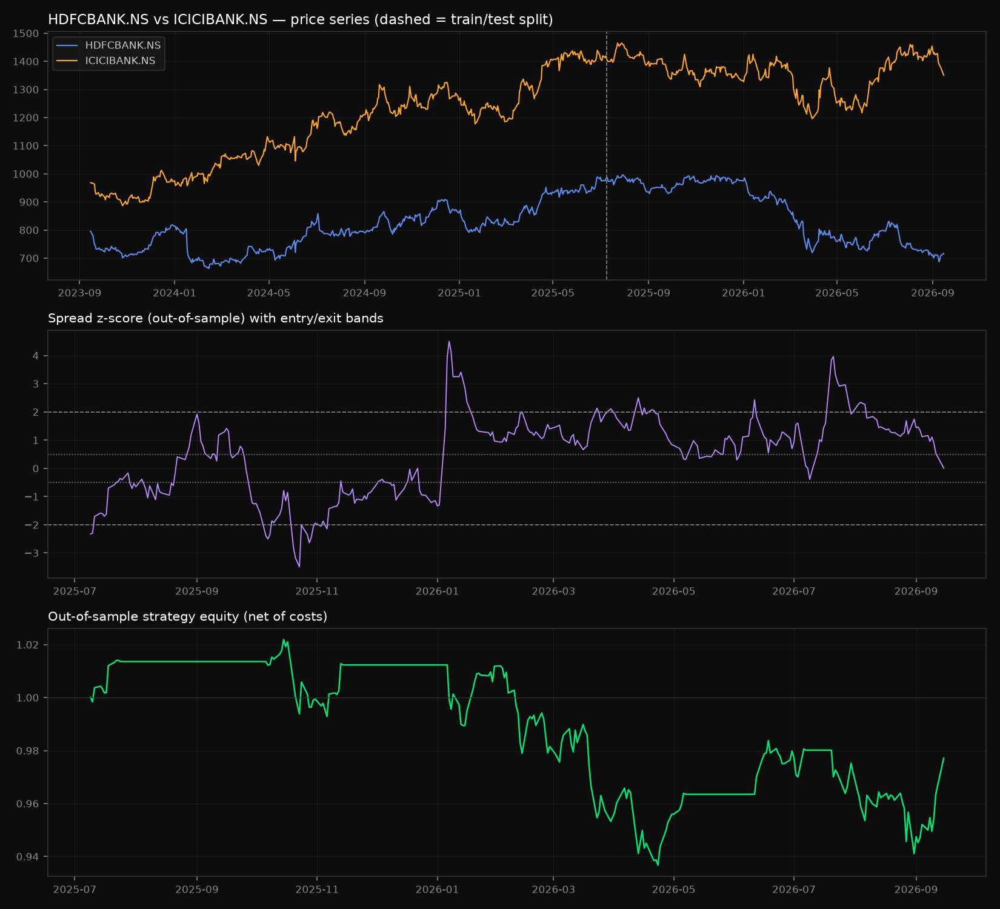

---

### AXISBANK.NS / ICICIBANK.NS

- **Latest prices:** AXISBANK.NS ₹1,222.90 · ICICIBANK.NS ₹1,350.40
- **Hedge ratio (train-fitted):** 0.9873
- **Cointegration (train):** FAIL at 5% — ADF -0.66, p=0.8568
- **Persistence:** passed 5% in 0 of 54 real-data runs (strict tier: 0/54)
- **Spread half-life:** 174.2 days
- **Current z-score:** -0.09
- **Signal today:** flat / no stretch
- ⚠️ _Pair did not cointegrate on training data. Any signal here is not statistically justified — observation only._

**Out-of-sample backtest** (beta frozen from train window):

| Metric | Value |
|---|---|
| Sharpe | -0.32 |
| Sortino | -0.32 |
| Annualised return | -3.14% |
| Annualised vol | 8.74% |
| Max drawdown | -7.70% |
| Round-trip trades | 6 |

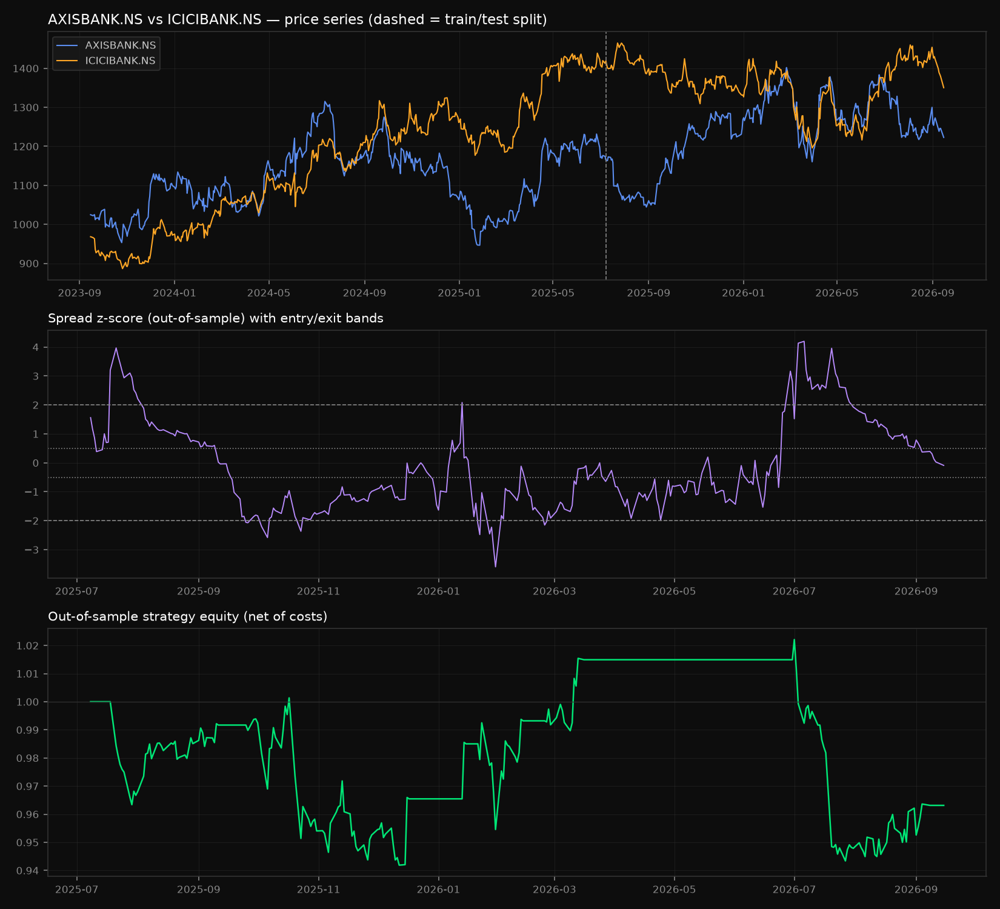

---

### KOTAKBANK.NS / HDFCBANK.NS

- **Latest prices:** KOTAKBANK.NS ₹409.80 · HDFCBANK.NS ₹716.55
- **Hedge ratio (train-fitted):** 2.1066
- **Cointegration (train):** FAIL at 5% — ADF -2.51, p=0.1139
- **Persistence:** passed 5% in 0 of 54 real-data runs (strict tier: 0/54)
- **Spread half-life:** 24.6 days
- **Current z-score:** -0.95
- **Signal today:** watch (approaching band)
- ⚠️ _Pair did not cointegrate on training data. Any signal here is not statistically justified — observation only._

**Out-of-sample backtest** (beta frozen from train window):

| Metric | Value |
|---|---|
| Sharpe | 0.89 |
| Sortino | 0.67 |
| Annualised return | 5.74% |
| Annualised vol | 6.47% |
| Max drawdown | -4.17% |
| Round-trip trades | 6 |

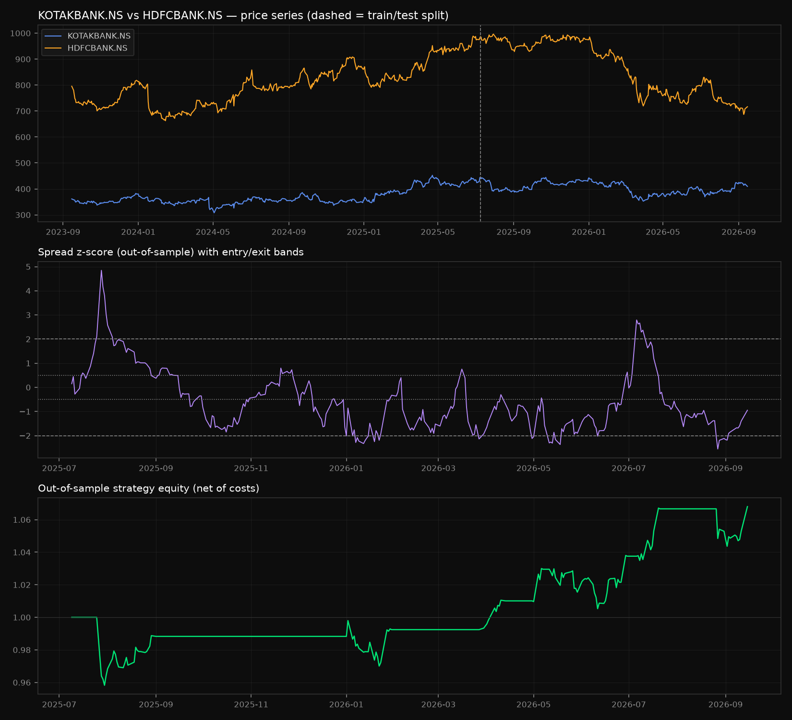

---

### SBIN.NS / BANKBARODA.NS

- **Latest prices:** SBIN.NS ₹968.00 · BANKBARODA.NS ₹232.70
- **Hedge ratio (train-fitted):** 0.1896
- **Cointegration (train):** FAIL at 5% — ADF -2.38, p=0.1483
- **Persistence:** passed 5% in 0 of 54 real-data runs (strict tier: 0/54)
- **Spread half-life:** 21.0 days
- **Current z-score:** -0.22
- **Signal today:** flat / no stretch
- ⚠️ _Pair did not cointegrate on training data. Any signal here is not statistically justified — observation only._

**Out-of-sample backtest** (beta frozen from train window):

| Metric | Value |
|---|---|
| Sharpe | 0.02 |
| Sortino | 0.02 |
| Annualised return | -0.20% |
| Annualised vol | 9.12% |
| Max drawdown | -8.75% |
| Round-trip trades | 5 |

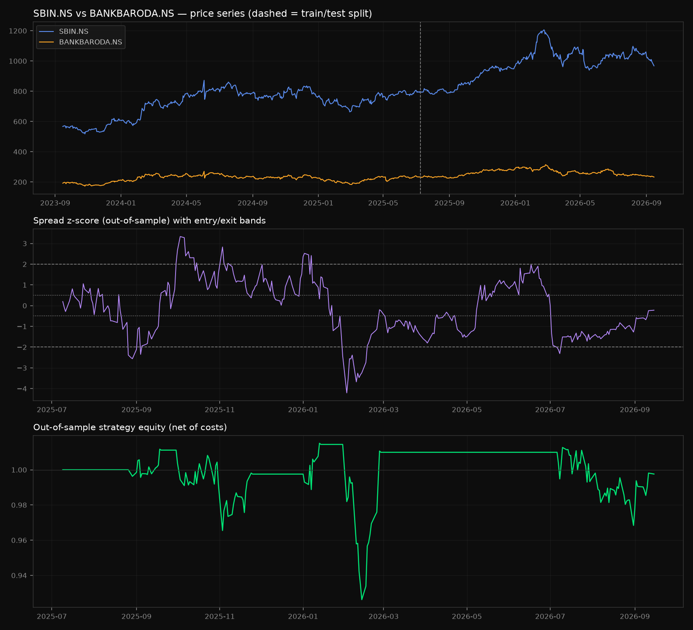

---

### TCS.NS / INFY.NS

- **Latest prices:** TCS.NS ₹2,251.00 · INFY.NS ₹1,077.00
- **Hedge ratio (train-fitted):** 0.4861
- **Cointegration (train):** FAIL at 5% — ADF -1.09, p=0.7207
- **Persistence:** passed 5% in 0 of 54 real-data runs (strict tier: 0/54)
- **Spread half-life:** 70.2 days
- **Current z-score:** -0.77
- **Signal today:** watch (approaching band)
- ⚠️ _Pair did not cointegrate on training data. Any signal here is not statistically justified — observation only._

**Out-of-sample backtest** (beta frozen from train window):

| Metric | Value |
|---|---|
| Sharpe | 2.19 |
| Sortino | 2.20 |
| Annualised return | 9.27% |
| Annualised vol | 4.09% |
| Max drawdown | -1.31% |
| Round-trip trades | 7 |

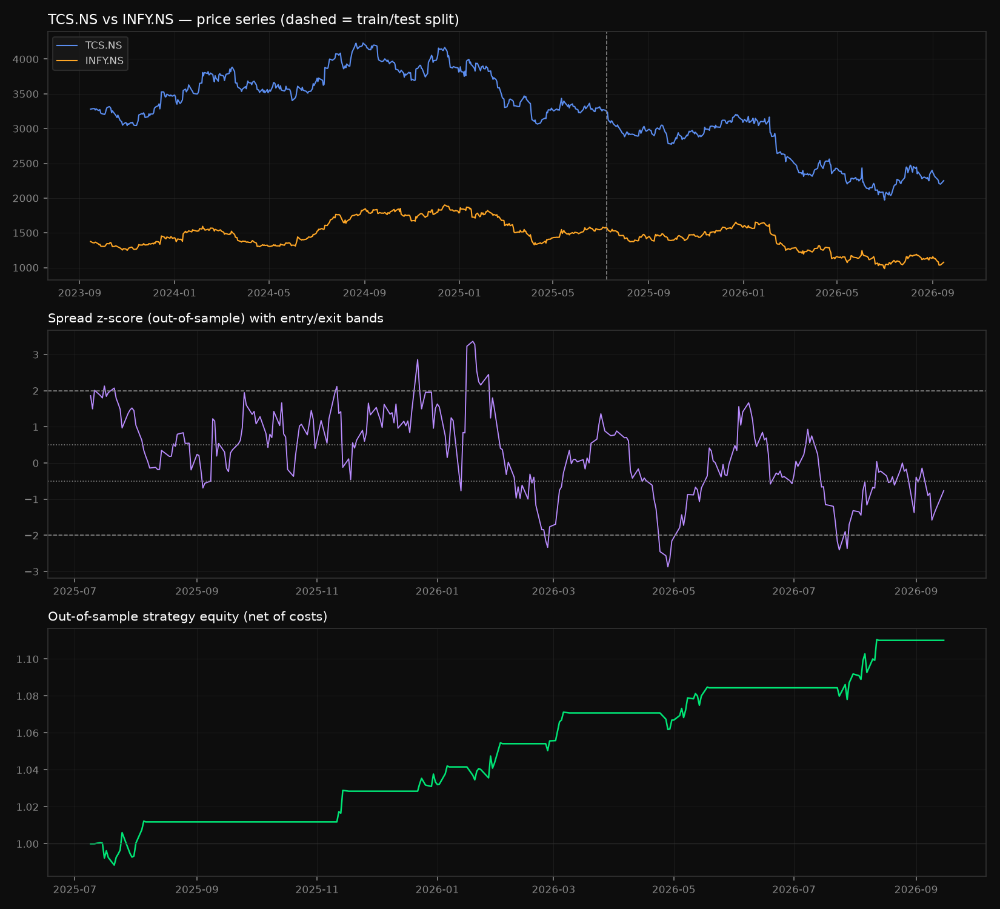

---

### INFY.NS / WIPRO.NS

- **Latest prices:** INFY.NS ₹1,077.00 · WIPRO.NS ₹170.00
- **Hedge ratio (train-fitted):** 0.1338
- **Cointegration (train):** FAIL at 5% — ADF -2.18, p=0.2143
- **Persistence:** passed 5% in 0 of 54 real-data runs (strict tier: 0/54)
- **Spread half-life:** 31.7 days
- **Current z-score:** -1.34
- **Signal today:** watch (approaching band)
- ⚠️ _Pair did not cointegrate on training data. Any signal here is not statistically justified — observation only._

**Out-of-sample backtest** (beta frozen from train window):

| Metric | Value |
|---|---|
| Sharpe | 1.68 |
| Sortino | 1.97 |
| Annualised return | 8.50% |
| Annualised vol | 4.92% |
| Max drawdown | -2.27% |
| Round-trip trades | 6 |

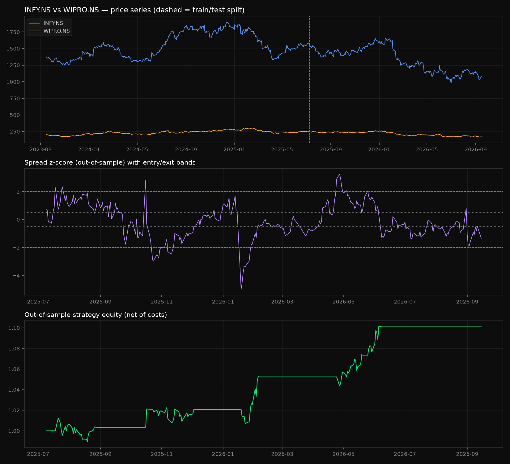

---

### HCLTECH.NS / TECHM.NS

- **Latest prices:** HCLTECH.NS ₹1,253.70 · TECHM.NS ₹1,575.90
- **Hedge ratio (train-fitted):** 0.9074
- **Cointegration (train):** FAIL at 5% — ADF -2.31, p=0.1699
- **Persistence:** passed 5% in 0 of 54 real-data runs (strict tier: 0/54)
- **Spread half-life:** 22.5 days
- **Current z-score:** +1.10
- **Signal today:** watch (approaching band)
- ⚠️ _Pair did not cointegrate on training data. Any signal here is not statistically justified — observation only._

**Out-of-sample backtest** (beta frozen from train window):

| Metric | Value |
|---|---|
| Sharpe | -0.00 |
| Sortino | -0.00 |
| Annualised return | -0.26% |
| Annualised vol | 6.87% |
| Max drawdown | -7.73% |
| Round-trip trades | 5 |

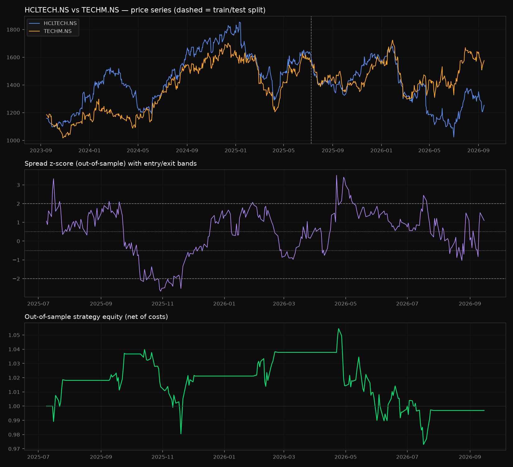

---

### ACC.NS / AMBUJACEM.NS

- **Latest prices:** ACC.NS ₹1,225.20 · AMBUJACEM.NS ₹381.75
- **Hedge ratio (train-fitted):** 0.1980
- **Cointegration (train):** FAIL at 5% — ADF -1.22, p=0.6638
- **Persistence:** passed 5% in 0 of 54 real-data runs (strict tier: 0/54)
- **Spread half-life:** 70.7 days
- **Current z-score:** -3.03
- **Signal today:** LONG spread (long AMBUJACEM.NS, short ACC.NS)
- ⚠️ _Pair did not cointegrate on training data. Any signal here is not statistically justified — observation only._

**Out-of-sample backtest** (beta frozen from train window):

| Metric | Value |
|---|---|
| Sharpe | 0.55 |
| Sortino | 0.45 |
| Annualised return | 3.00% |
| Annualised vol | 5.71% |
| Max drawdown | -4.63% |
| Round-trip trades | 4 |

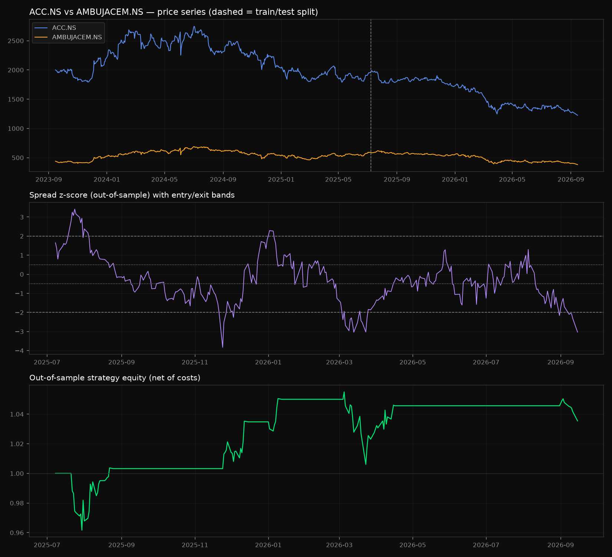

---

### ULTRACEMCO.NS / SHREECEM.NS

- **Latest prices:** ULTRACEMCO.NS ₹10,697.00 · SHREECEM.NS ₹21,905.00
- **Hedge ratio (train-fitted):** 0.7166
- **Cointegration (train):** FAIL at 5% — ADF -2.13, p=0.2332
- **Persistence:** passed 5% in 0 of 54 real-data runs (strict tier: 0/54)
- **Spread half-life:** 41.8 days
- **Current z-score:** -2.29
- **Signal today:** LONG spread (long SHREECEM.NS, short ULTRACEMCO.NS)
- ⚠️ _Pair did not cointegrate on training data. Any signal here is not statistically justified — observation only._

**Out-of-sample backtest** (beta frozen from train window):

| Metric | Value |
|---|---|
| Sharpe | -0.02 |
| Sortino | -0.02 |
| Annualised return | -0.40% |
| Annualised vol | 7.29% |
| Max drawdown | -8.13% |
| Round-trip trades | 5 |

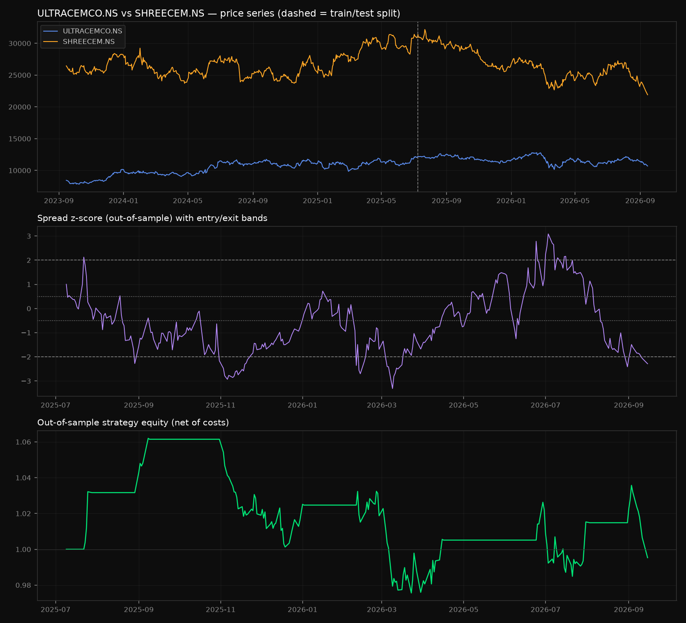

---

### IOC.NS / BPCL.NS

- **Latest prices:** IOC.NS ₹132.03 · BPCL.NS ₹298.65
- **Hedge ratio (train-fitted):** 1.7375
- **Cointegration (train):** FAIL at 5% — ADF -0.40, p=0.9104
- **Persistence:** passed 5% in 0 of 54 real-data runs (strict tier: 0/54)
- **Spread half-life:** 289.7 days
- **Current z-score:** -0.49
- **Signal today:** flat / no stretch
- ⚠️ _Pair did not cointegrate on training data. Any signal here is not statistically justified — observation only._

**Out-of-sample backtest** (beta frozen from train window):

| Metric | Value |
|---|---|
| Sharpe | 0.52 |
| Sortino | 0.55 |
| Annualised return | 3.08% |
| Annualised vol | 6.16% |
| Max drawdown | -6.28% |
| Round-trip trades | 7 |

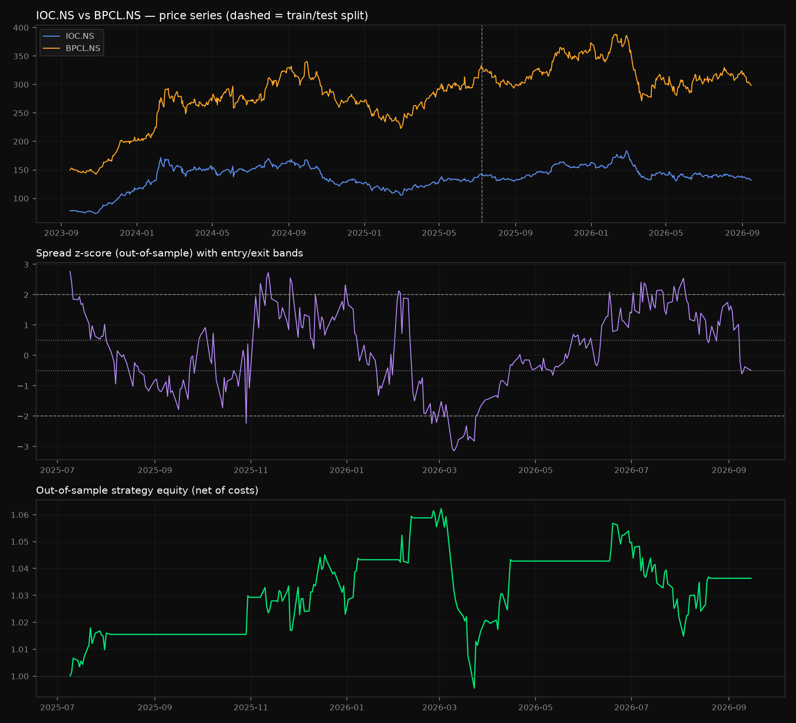

---

### BPCL.NS / HINDPETRO.NS

- **Latest prices:** BPCL.NS ₹298.65 · HINDPETRO.NS ₹345.30
- **Hedge ratio (train-fitted):** 1.3498
- **Cointegration (train):** FAIL at 5% — ADF -2.04, p=0.2685
- **Persistence:** passed 5% in 0 of 54 real-data runs (strict tier: 0/54)
- **Spread half-life:** 37.8 days
- **Current z-score:** -0.52
- **Signal today:** watch (approaching band)
- ⚠️ _Pair did not cointegrate on training data. Any signal here is not statistically justified — observation only._

**Out-of-sample backtest** (beta frozen from train window):

| Metric | Value |
|---|---|
| Sharpe | 0.07 |
| Sortino | 0.06 |
| Annualised return | 0.23% |
| Annualised vol | 5.57% |
| Max drawdown | -6.31% |
| Round-trip trades | 5 |

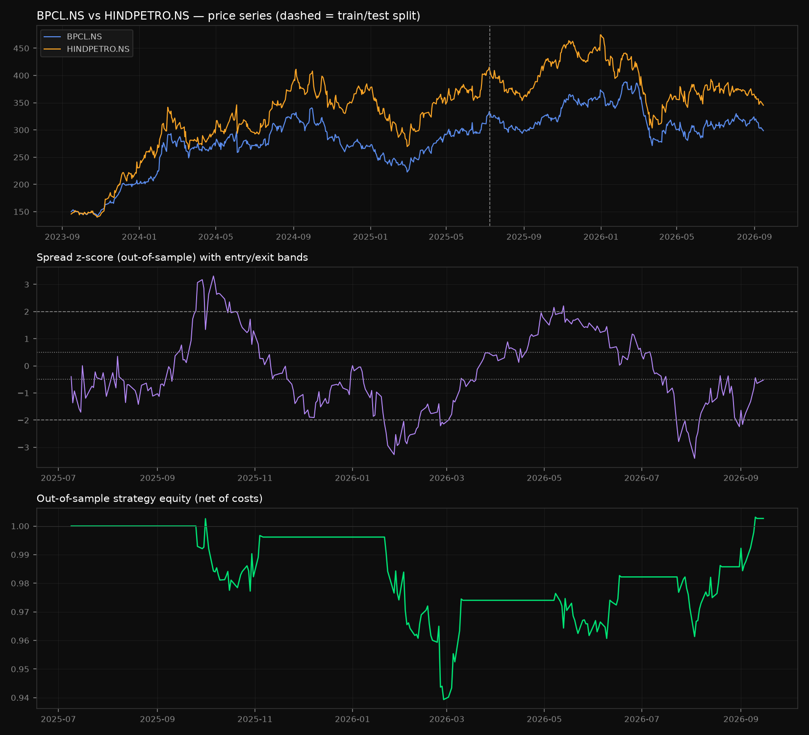

---

### ONGC.NS / COALINDIA.NS

- **Latest prices:** ONGC.NS ₹235.95 · COALINDIA.NS ₹419.25
- **Hedge ratio (train-fitted):** 1.4611
- **Cointegration (train):** PASS at 5% — ADF -3.41, p=0.0105
- **Persistence:** passed 5% in 46 of 54 real-data runs (strict tier: 1/54)
- **Spread half-life:** 12.3 days
- **Current z-score:** +0.83
- **Signal today:** watch (approaching band)

**Out-of-sample backtest** (beta frozen from train window):

| Metric | Value |
|---|---|
| Sharpe | 0.70 |
| Sortino | 0.52 |
| Annualised return | 4.97% |
| Annualised vol | 7.35% |
| Max drawdown | -6.09% |
| Round-trip trades | 4 |

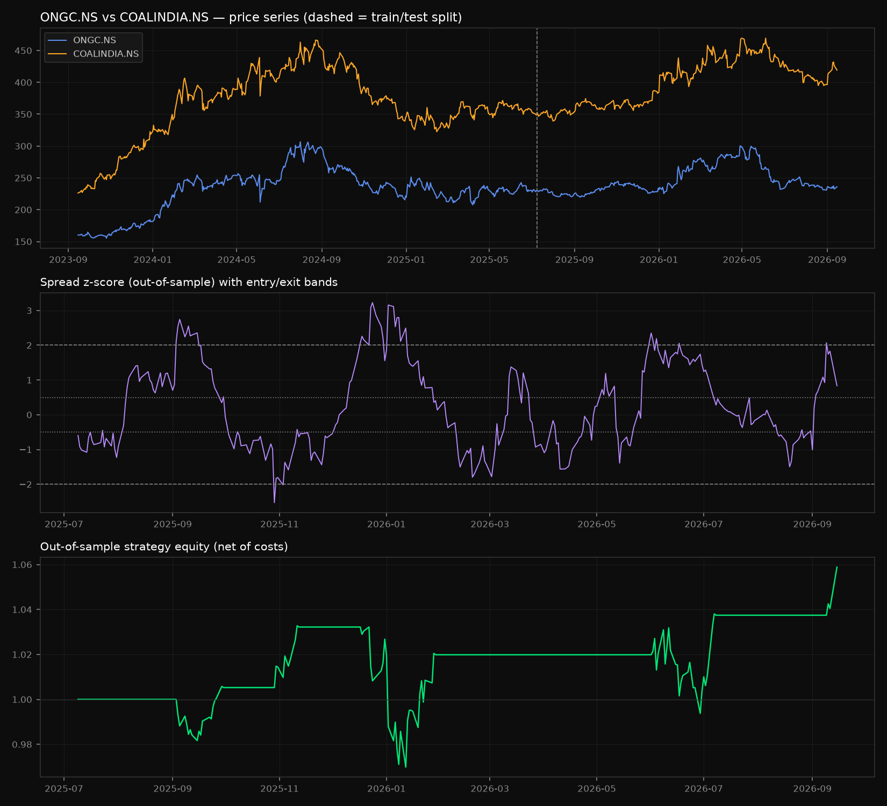

---

### NTPC.NS / POWERGRID.NS

- **Latest prices:** NTPC.NS ₹329.50 · POWERGRID.NS ₹262.80
- **Hedge ratio (train-fitted):** 0.8328
- **Cointegration (train):** FAIL at 5% — ADF -2.55, p=0.1037
- **Persistence:** passed 5% in 0 of 54 real-data runs (strict tier: 0/54)
- **Spread half-life:** 23.5 days
- **Current z-score:** -1.07
- **Signal today:** watch (approaching band)
- ⚠️ _Pair did not cointegrate on training data. Any signal here is not statistically justified — observation only._

**Out-of-sample backtest** (beta frozen from train window):

| Metric | Value |
|---|---|
| Sharpe | 0.43 |
| Sortino | 0.33 |
| Annualised return | 2.19% |
| Annualised vol | 5.45% |
| Max drawdown | -5.17% |
| Round-trip trades | 6 |

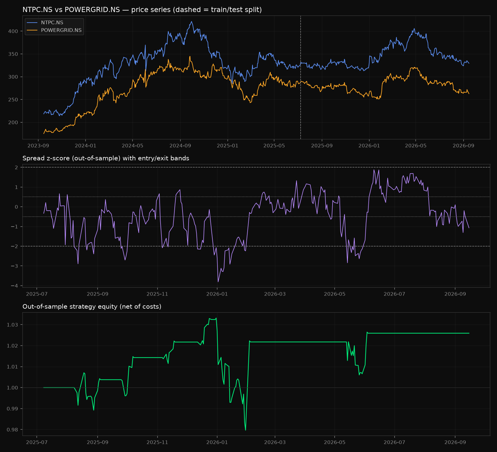

---

### BAJAJ-AUTO.NS / HEROMOTOCO.NS

- **Latest prices:** BAJAJ-AUTO.NS ₹11,424.00 · HEROMOTOCO.NS ₹5,166.00
- **Hedge ratio (train-fitted):** 0.4109
- **Cointegration (train):** FAIL at 5% — ADF -2.29, p=0.1750
- **Persistence:** passed 5% in 0 of 54 real-data runs (strict tier: 0/54)
- **Spread half-life:** 29.5 days
- **Current z-score:** -1.06
- **Signal today:** watch (approaching band)
- ⚠️ _Pair did not cointegrate on training data. Any signal here is not statistically justified — observation only._

**Out-of-sample backtest** (beta frozen from train window):

| Metric | Value |
|---|---|
| Sharpe | -0.69 |
| Sortino | -0.73 |
| Annualised return | -7.60% |
| Annualised vol | 10.63% |
| Max drawdown | -20.81% |
| Round-trip trades | 5 |

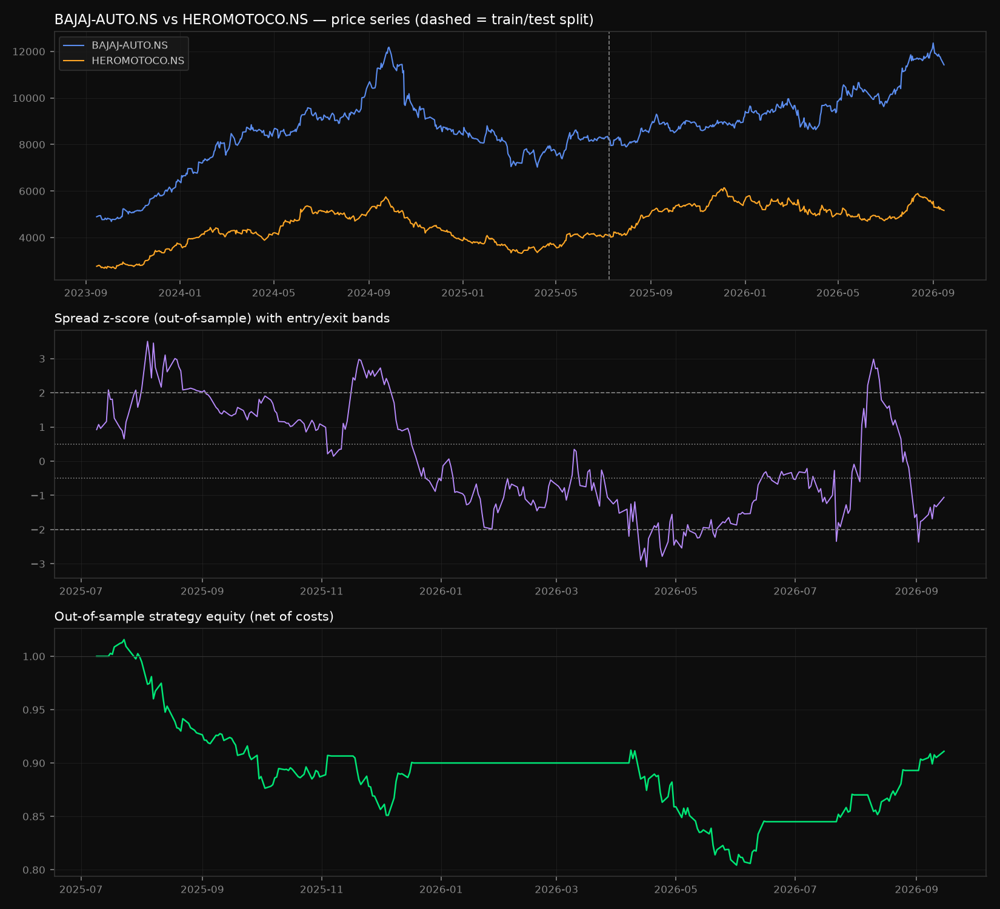

---

### TATASTEEL.NS / JSWSTEEL.NS

- **Latest prices:** TATASTEEL.NS ₹183.65 · JSWSTEEL.NS ₹1,229.20
- **Hedge ratio (train-fitted):** 3.1333
- **Cointegration (train):** FAIL at 5% — ADF -1.10, p=0.7143
- **Persistence:** passed 5% in 0 of 54 real-data runs (strict tier: 0/54)
- **Spread half-life:** 75.1 days
- **Current z-score:** -0.79
- **Signal today:** watch (approaching band)
- ⚠️ _Pair did not cointegrate on training data. Any signal here is not statistically justified — observation only._

**Out-of-sample backtest** (beta frozen from train window):

| Metric | Value |
|---|---|
| Sharpe | 0.35 |
| Sortino | 0.33 |
| Annualised return | 2.54% |
| Annualised vol | 8.23% |
| Max drawdown | -5.50% |
| Round-trip trades | 5 |

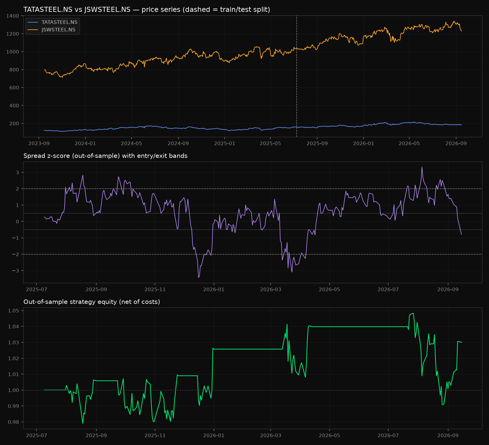

---

### SUNPHARMA.NS / CIPLA.NS

- **Latest prices:** SUNPHARMA.NS ₹1,835.00 · CIPLA.NS ₹1,351.00
- **Hedge ratio (train-fitted):** 0.4993
- **Cointegration (train):** PASS at 5% — ADF -3.35, p=0.0128
- **Persistence:** passed 5% in 54 of 54 real-data runs (strict tier: 5/54)
- **Spread half-life:** 10.8 days
- **Current z-score:** -1.42
- **Signal today:** watch (approaching band)

**Out-of-sample backtest** (beta frozen from train window):

| Metric | Value |
|---|---|
| Sharpe | -0.15 |
| Sortino | -0.16 |
| Annualised return | -1.41% |
| Annualised vol | 7.71% |
| Max drawdown | -10.27% |
| Round-trip trades | 4 |

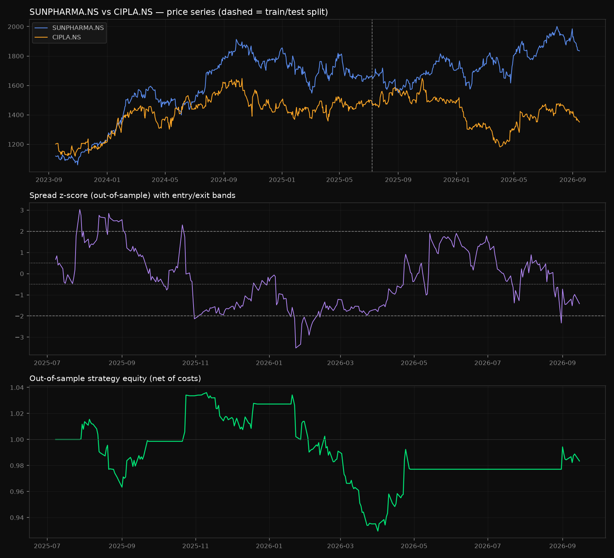

---

_Generated 2026-09-15 · pairs mean-reversion scanner · out-of-sample backtest · multiple-testing-aware · not investment advice._
