# Indian Pairs-Trading Scanner — 2026-09-16

> **What this is:** a market-neutral *pairs mean-reversion* scanner. It flags when two related NSE stocks have drifted apart far enough that their historical relationship signals a possible convergence trade. It does **not** forecast growth, rank "best" stocks, or predict company performance. A signal means the *spread between two stocks* is stretched — nothing about either stock being a good investment. Not investment advice; do your own research.

## Methodology (fixed in advance)

- **Universe:** 16 declared sector-mate pairs. Parameters (3y window, 60/40 train-test, z-entry 2.0, z-exit 0.5, 5 bps costs) are pre-registered; changes are logged in the README changelog *before* looking at results.
- **Multiple testing:** at the 5% level across 16 pairs, **≈0.8 false positives per run are expected by chance alone** even if nothing truly cointegrates. A single-day pass is a candidate, not a discovery.
- **Strict tier:** Bonferroni-corrected threshold p < 0.0031 (marked ✓✓).
- **Evidence = persistence:** the Persistence column counts how often each pair has passed the 5% test across all *real-data* daily runs recorded in `reports/history.csv`. Pairs deserve attention only when they pass persistently.

## Summary

| Pair | p-value | Coint. | Persistence | Current z | Signal | OOS Sharpe |
|---|---|---|---|---|---|---|
| HDFCBANK.NS/ICICIBANK.NS | 0.0690 | ✗ | 1/45 | -0.05 | flat / no stretch | -0.25 |
| AXISBANK.NS/ICICIBANK.NS | 0.8600 | ✗ | 0/55 | -0.32 | flat / no stretch | -0.32 |
| KOTAKBANK.NS/HDFCBANK.NS | 0.1151 | ✗ | 0/55 | -0.97 | watch | 0.85 |
| SBIN.NS/BANKBARODA.NS | 0.1477 | ✗ | 0/55 | -0.37 | flat / no stretch | 0.02 |
| TCS.NS/INFY.NS | 0.7286 | ✗ | 0/55 | -0.27 | flat / no stretch | 2.19 |
| INFY.NS/WIPRO.NS | 0.2097 | ✗ | 0/55 | -1.56 | watch | 1.68 |
| HCLTECH.NS/TECHM.NS | 0.1555 | ✗ | 0/55 | +0.27 | flat / no stretch | -0.01 |
| ACC.NS/AMBUJACEM.NS | 0.5691 | ✗ | 0/55 | -2.81 | LONG spread | 0.53 |
| ULTRACEMCO.NS/SHREECEM.NS | 0.2701 | ✗ | 0/55 | -2.23 | LONG spread | -0.04 |
| IOC.NS/BPCL.NS | 0.9085 | ✗ | 0/55 | -0.56 | watch | 0.50 |
| BPCL.NS/HINDPETRO.NS | 0.2660 | ✗ | 0/55 | -0.61 | watch | 0.07 |
| ONGC.NS/COALINDIA.NS | 0.0098 | ✓ | 47/55 | +0.97 | watch | 0.66 |
| NTPC.NS/POWERGRID.NS | 0.1019 | ✗ | 0/55 | -0.67 | watch | 0.43 |
| BAJAJ-AUTO.NS/HEROMOTOCO.NS | 0.1744 | ✗ | 0/55 | -0.98 | watch | -0.69 |
| TATASTEEL.NS/JSWSTEEL.NS | 0.7048 | ✗ | 0/55 | -0.29 | flat / no stretch | 0.33 |
| SUNPHARMA.NS/CIPLA.NS | 0.0117 | ✓ | 55/55 | -1.41 | watch | -0.16 |

_Legend: ✓✓ passes strict Bonferroni tier · ✓ passes 5% only · ✗ fails. Persistence = 5%-passes / real-data runs recorded. \*no real-data history yet._

---

### HDFCBANK.NS / ICICIBANK.NS

- **Latest prices:** HDFCBANK.NS ₹721.50 · ICICIBANK.NS ₹1,358.80
- **Hedge ratio (train-fitted):** 1.6907
- **Cointegration (train):** FAIL at 5% — ADF -2.73, p=0.0690
- **Persistence:** passed 5% in 1 of 45 real-data runs (strict tier: 0/45)
- **Spread half-life:** 24.5 days
- **Current z-score:** -0.05
- **Signal today:** flat / no stretch
- ⚠️ _Pair did not cointegrate on training data. Any signal here is not statistically justified — observation only._

**Out-of-sample backtest** (beta frozen from train window):

| Metric | Value |
|---|---|
| Sharpe | -0.25 |
| Sortino | -0.27 |
| Annualised return | -1.87% |
| Annualised vol | 6.72% |
| Max drawdown | -8.35% |
| Round-trip trades | 5 |

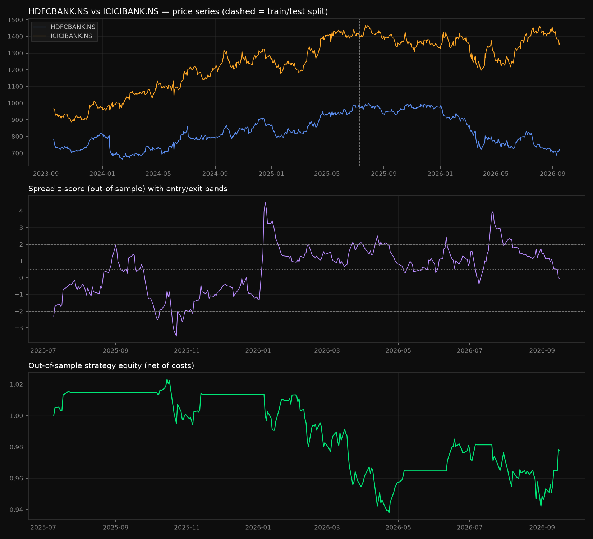

---

### AXISBANK.NS / ICICIBANK.NS

- **Latest prices:** AXISBANK.NS ₹1,241.00 · ICICIBANK.NS ₹1,358.80
- **Hedge ratio (train-fitted):** 0.9907
- **Cointegration (train):** FAIL at 5% — ADF -0.65, p=0.8600
- **Persistence:** passed 5% in 0 of 55 real-data runs (strict tier: 0/55)
- **Spread half-life:** 179.3 days
- **Current z-score:** -0.32
- **Signal today:** flat / no stretch
- ⚠️ _Pair did not cointegrate on training data. Any signal here is not statistically justified — observation only._

**Out-of-sample backtest** (beta frozen from train window):

| Metric | Value |
|---|---|
| Sharpe | -0.32 |
| Sortino | -0.32 |
| Annualised return | -3.16% |
| Annualised vol | 8.81% |
| Max drawdown | -7.76% |
| Round-trip trades | 6 |

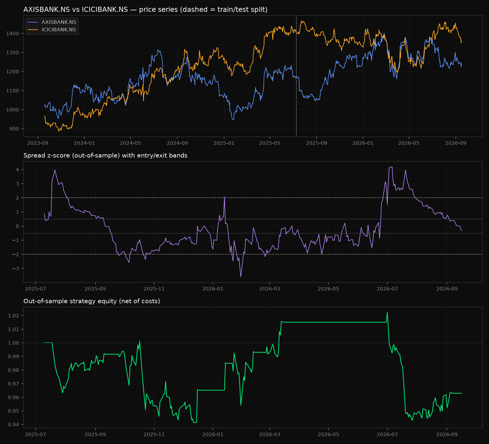

---

### KOTAKBANK.NS / HDFCBANK.NS

- **Latest prices:** KOTAKBANK.NS ₹415.00 · HDFCBANK.NS ₹721.50
- **Hedge ratio (train-fitted):** 2.1112
- **Cointegration (train):** FAIL at 5% — ADF -2.50, p=0.1151
- **Persistence:** passed 5% in 0 of 55 real-data runs (strict tier: 0/55)
- **Spread half-life:** 24.6 days
- **Current z-score:** -0.97
- **Signal today:** watch (approaching band)
- ⚠️ _Pair did not cointegrate on training data. Any signal here is not statistically justified — observation only._

**Out-of-sample backtest** (beta frozen from train window):

| Metric | Value |
|---|---|
| Sharpe | 0.85 |
| Sortino | 0.64 |
| Annualised return | 5.47% |
| Annualised vol | 6.52% |
| Max drawdown | -4.21% |
| Round-trip trades | 6 |

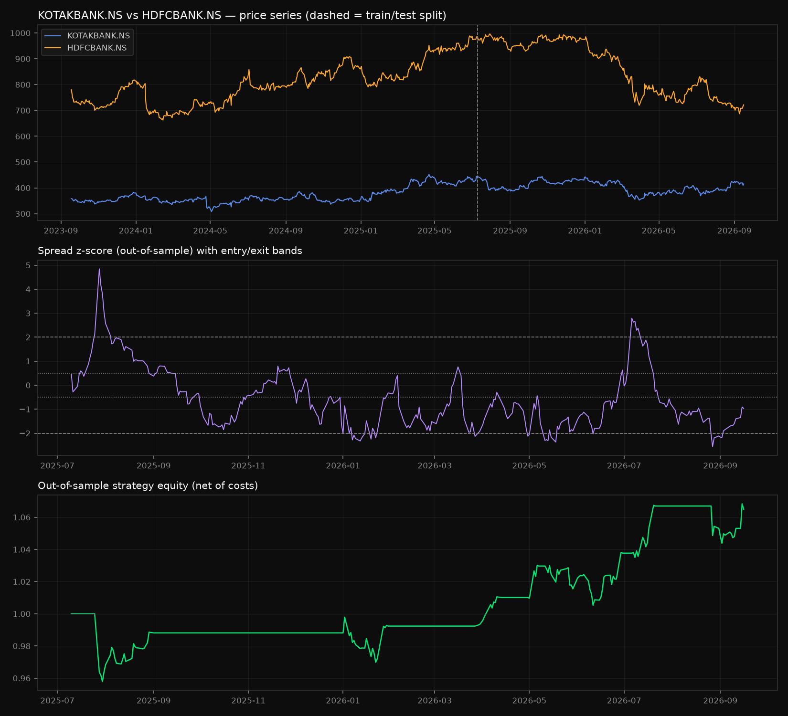

---

### SBIN.NS / BANKBARODA.NS

- **Latest prices:** SBIN.NS ₹991.40 · BANKBARODA.NS ₹234.98
- **Hedge ratio (train-fitted):** 0.1895
- **Cointegration (train):** FAIL at 5% — ADF -2.38, p=0.1477
- **Persistence:** passed 5% in 0 of 55 real-data runs (strict tier: 0/55)
- **Spread half-life:** 21.0 days
- **Current z-score:** -0.37
- **Signal today:** flat / no stretch
- ⚠️ _Pair did not cointegrate on training data. Any signal here is not statistically justified — observation only._

**Out-of-sample backtest** (beta frozen from train window):

| Metric | Value |
|---|---|
| Sharpe | 0.02 |
| Sortino | 0.02 |
| Annualised return | -0.21% |
| Annualised vol | 9.18% |
| Max drawdown | -8.81% |
| Round-trip trades | 5 |

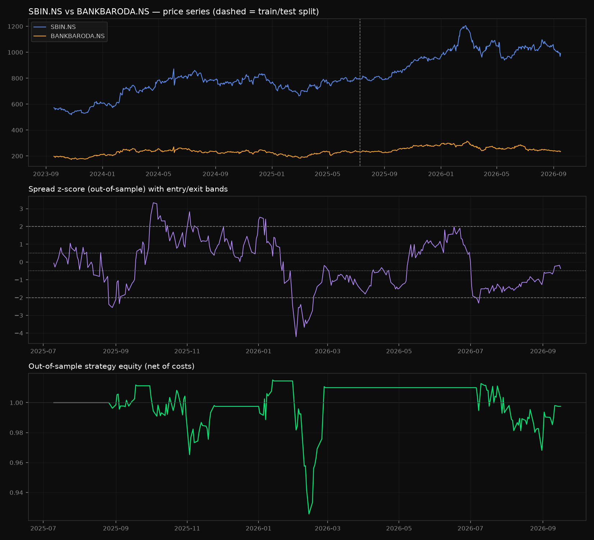

---

### TCS.NS / INFY.NS

- **Latest prices:** TCS.NS ₹2,188.80 · INFY.NS ₹1,060.00
- **Hedge ratio (train-fitted):** 0.4842
- **Cointegration (train):** FAIL at 5% — ADF -1.07, p=0.7286
- **Persistence:** passed 5% in 0 of 55 real-data runs (strict tier: 0/55)
- **Spread half-life:** 71.7 days
- **Current z-score:** -0.27
- **Signal today:** flat / no stretch
- ⚠️ _Pair did not cointegrate on training data. Any signal here is not statistically justified — observation only._

**Out-of-sample backtest** (beta frozen from train window):

| Metric | Value |
|---|---|
| Sharpe | 2.19 |
| Sortino | 2.20 |
| Annualised return | 9.32% |
| Annualised vol | 4.10% |
| Max drawdown | -1.32% |
| Round-trip trades | 7 |

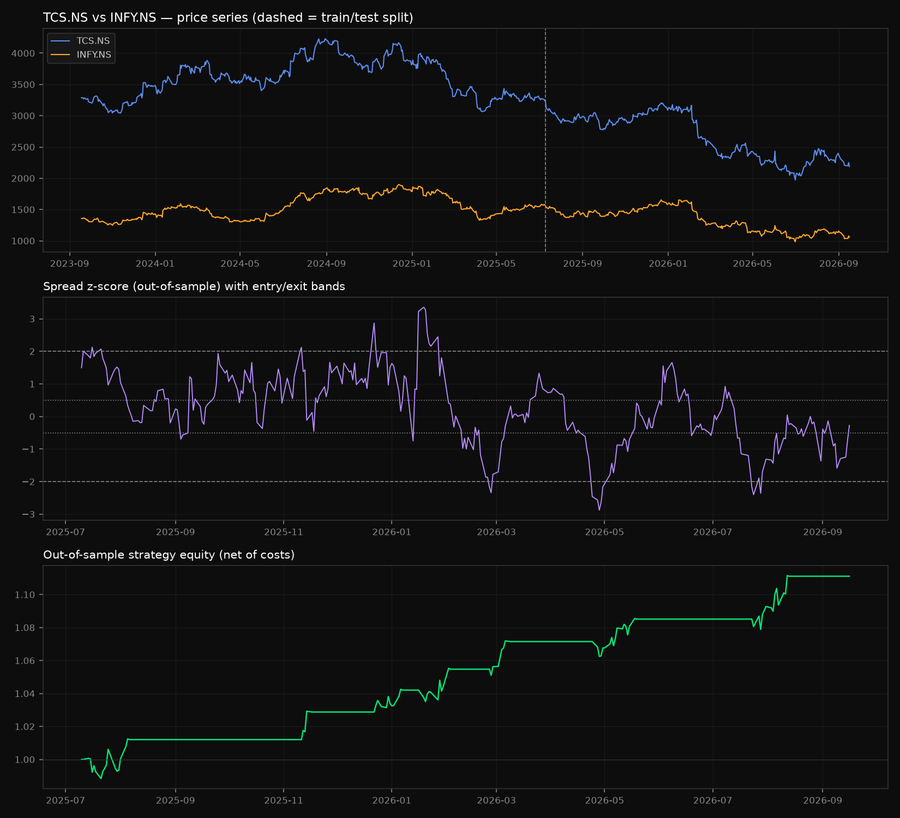

---

### INFY.NS / WIPRO.NS

- **Latest prices:** INFY.NS ₹1,060.00 · WIPRO.NS ₹166.89
- **Hedge ratio (train-fitted):** 0.1338
- **Cointegration (train):** FAIL at 5% — ADF -2.19, p=0.2097
- **Persistence:** passed 5% in 0 of 55 real-data runs (strict tier: 0/55)
- **Spread half-life:** 31.6 days
- **Current z-score:** -1.56
- **Signal today:** watch (approaching band)
- ⚠️ _Pair did not cointegrate on training data. Any signal here is not statistically justified — observation only._

**Out-of-sample backtest** (beta frozen from train window):

| Metric | Value |
|---|---|
| Sharpe | 1.68 |
| Sortino | 1.96 |
| Annualised return | 8.57% |
| Annualised vol | 4.96% |
| Max drawdown | -2.29% |
| Round-trip trades | 6 |

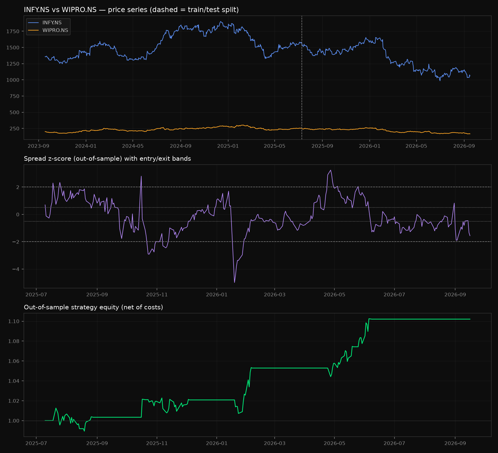

---

### HCLTECH.NS / TECHM.NS

- **Latest prices:** HCLTECH.NS ₹1,253.00 · TECHM.NS ₹1,558.00
- **Hedge ratio (train-fitted):** 0.9098
- **Cointegration (train):** FAIL at 5% — ADF -2.35, p=0.1555
- **Persistence:** passed 5% in 0 of 55 real-data runs (strict tier: 0/55)
- **Spread half-life:** 22.9 days
- **Current z-score:** +0.27
- **Signal today:** flat / no stretch
- ⚠️ _Pair did not cointegrate on training data. Any signal here is not statistically justified — observation only._

**Out-of-sample backtest** (beta frozen from train window):

| Metric | Value |
|---|---|
| Sharpe | -0.01 |
| Sortino | -0.01 |
| Annualised return | -0.30% |
| Annualised vol | 6.91% |
| Max drawdown | -7.77% |
| Round-trip trades | 5 |

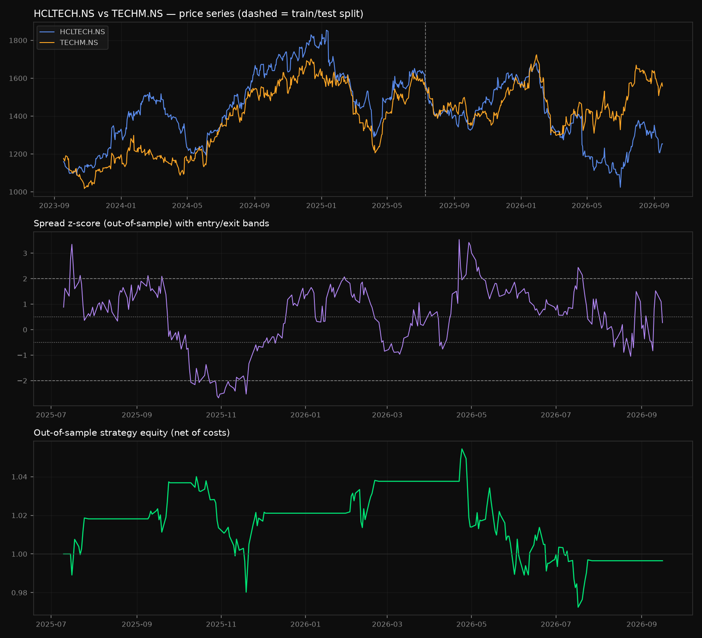

---

### ACC.NS / AMBUJACEM.NS

- **Latest prices:** ACC.NS ₹1,226.60 · AMBUJACEM.NS ₹381.05
- **Hedge ratio (train-fitted):** 0.1966
- **Cointegration (train):** FAIL at 5% — ADF -1.43, p=0.5691
- **Persistence:** passed 5% in 0 of 55 real-data runs (strict tier: 0/55)
- **Spread half-life:** 62.7 days
- **Current z-score:** -2.81
- **Signal today:** LONG spread (long AMBUJACEM.NS, short ACC.NS)
- ⚠️ _Pair did not cointegrate on training data. Any signal here is not statistically justified — observation only._

**Out-of-sample backtest** (beta frozen from train window):

| Metric | Value |
|---|---|
| Sharpe | 0.53 |
| Sortino | 0.44 |
| Annualised return | 2.92% |
| Annualised vol | 5.75% |
| Max drawdown | -4.68% |
| Round-trip trades | 4 |

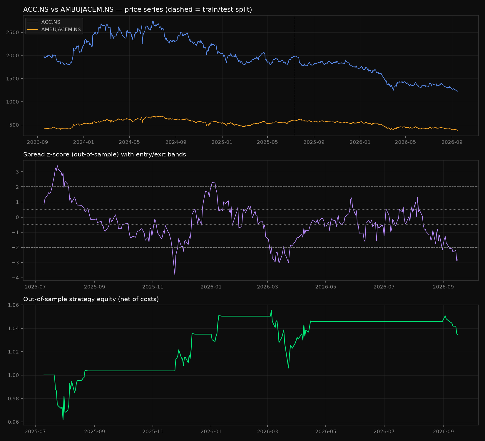

---

### ULTRACEMCO.NS / SHREECEM.NS

- **Latest prices:** ULTRACEMCO.NS ₹10,700.00 · SHREECEM.NS ₹21,795.00
- **Hedge ratio (train-fitted):** 0.7325
- **Cointegration (train):** FAIL at 5% — ADF -2.04, p=0.2701
- **Persistence:** passed 5% in 0 of 55 real-data runs (strict tier: 0/55)
- **Spread half-life:** 44.2 days
- **Current z-score:** -2.23
- **Signal today:** LONG spread (long SHREECEM.NS, short ULTRACEMCO.NS)
- ⚠️ _Pair did not cointegrate on training data. Any signal here is not statistically justified — observation only._

**Out-of-sample backtest** (beta frozen from train window):

| Metric | Value |
|---|---|
| Sharpe | -0.04 |
| Sortino | -0.04 |
| Annualised return | -0.55% |
| Annualised vol | 7.30% |
| Max drawdown | -8.09% |
| Round-trip trades | 5 |

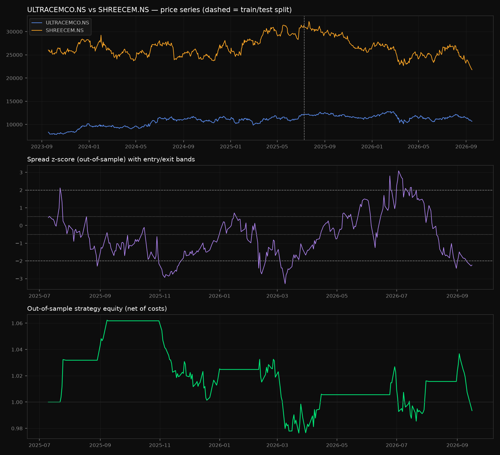

---

### IOC.NS / BPCL.NS

- **Latest prices:** IOC.NS ₹134.75 · BPCL.NS ₹303.35
- **Hedge ratio (train-fitted):** 1.7358
- **Cointegration (train):** FAIL at 5% — ADF -0.41, p=0.9085
- **Persistence:** passed 5% in 0 of 55 real-data runs (strict tier: 0/55)
- **Spread half-life:** 283.6 days
- **Current z-score:** -0.56
- **Signal today:** watch (approaching band)
- ⚠️ _Pair did not cointegrate on training data. Any signal here is not statistically justified — observation only._

**Out-of-sample backtest** (beta frozen from train window):

| Metric | Value |
|---|---|
| Sharpe | 0.50 |
| Sortino | 0.52 |
| Annualised return | 2.87% |
| Annualised vol | 6.09% |
| Max drawdown | -6.23% |
| Round-trip trades | 7 |

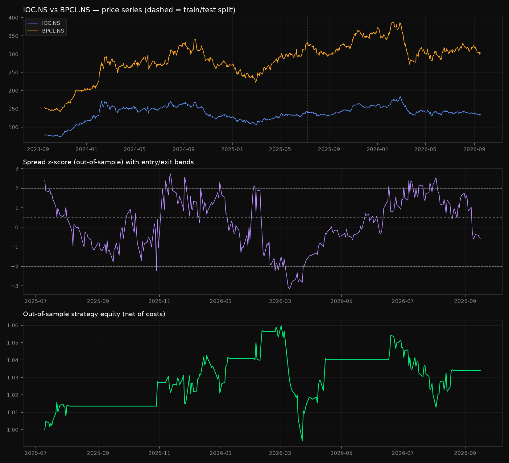

---

### BPCL.NS / HINDPETRO.NS

- **Latest prices:** BPCL.NS ₹303.35 · HINDPETRO.NS ₹350.05
- **Hedge ratio (train-fitted):** 1.3489
- **Cointegration (train):** FAIL at 5% — ADF -2.05, p=0.2660
- **Persistence:** passed 5% in 0 of 55 real-data runs (strict tier: 0/55)
- **Spread half-life:** 37.7 days
- **Current z-score:** -0.61
- **Signal today:** watch (approaching band)
- ⚠️ _Pair did not cointegrate on training data. Any signal here is not statistically justified — observation only._

**Out-of-sample backtest** (beta frozen from train window):

| Metric | Value |
|---|---|
| Sharpe | 0.07 |
| Sortino | 0.06 |
| Annualised return | 0.22% |
| Annualised vol | 5.57% |
| Max drawdown | -6.32% |
| Round-trip trades | 5 |

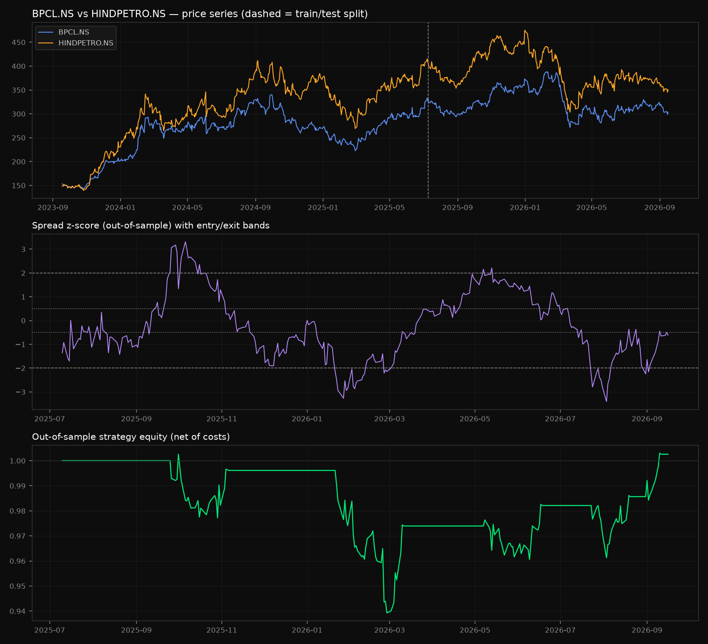

---

### ONGC.NS / COALINDIA.NS

- **Latest prices:** ONGC.NS ₹236.80 · COALINDIA.NS ₹422.25
- **Hedge ratio (train-fitted):** 1.4566
- **Cointegration (train):** PASS at 5% — ADF -3.43, p=0.0098
- **Persistence:** passed 5% in 47 of 55 real-data runs (strict tier: 1/55)
- **Spread half-life:** 12.2 days
- **Current z-score:** +0.97
- **Signal today:** watch (approaching band)

**Out-of-sample backtest** (beta frozen from train window):

| Metric | Value |
|---|---|
| Sharpe | 0.66 |
| Sortino | 0.49 |
| Annualised return | 4.74% |
| Annualised vol | 7.38% |
| Max drawdown | -6.13% |
| Round-trip trades | 4 |

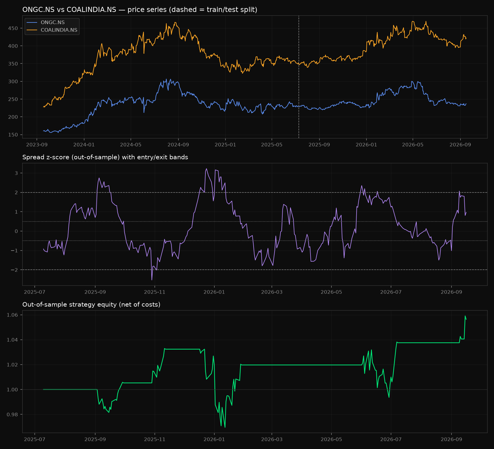

---

### NTPC.NS / POWERGRID.NS

- **Latest prices:** NTPC.NS ₹327.00 · POWERGRID.NS ₹262.80
- **Hedge ratio (train-fitted):** 0.8320
- **Cointegration (train):** FAIL at 5% — ADF -2.56, p=0.1019
- **Persistence:** passed 5% in 0 of 55 real-data runs (strict tier: 0/55)
- **Spread half-life:** 23.5 days
- **Current z-score:** -0.67
- **Signal today:** watch (approaching band)
- ⚠️ _Pair did not cointegrate on training data. Any signal here is not statistically justified — observation only._

**Out-of-sample backtest** (beta frozen from train window):

| Metric | Value |
|---|---|
| Sharpe | 0.43 |
| Sortino | 0.33 |
| Annualised return | 2.20% |
| Annualised vol | 5.45% |
| Max drawdown | -5.17% |
| Round-trip trades | 6 |

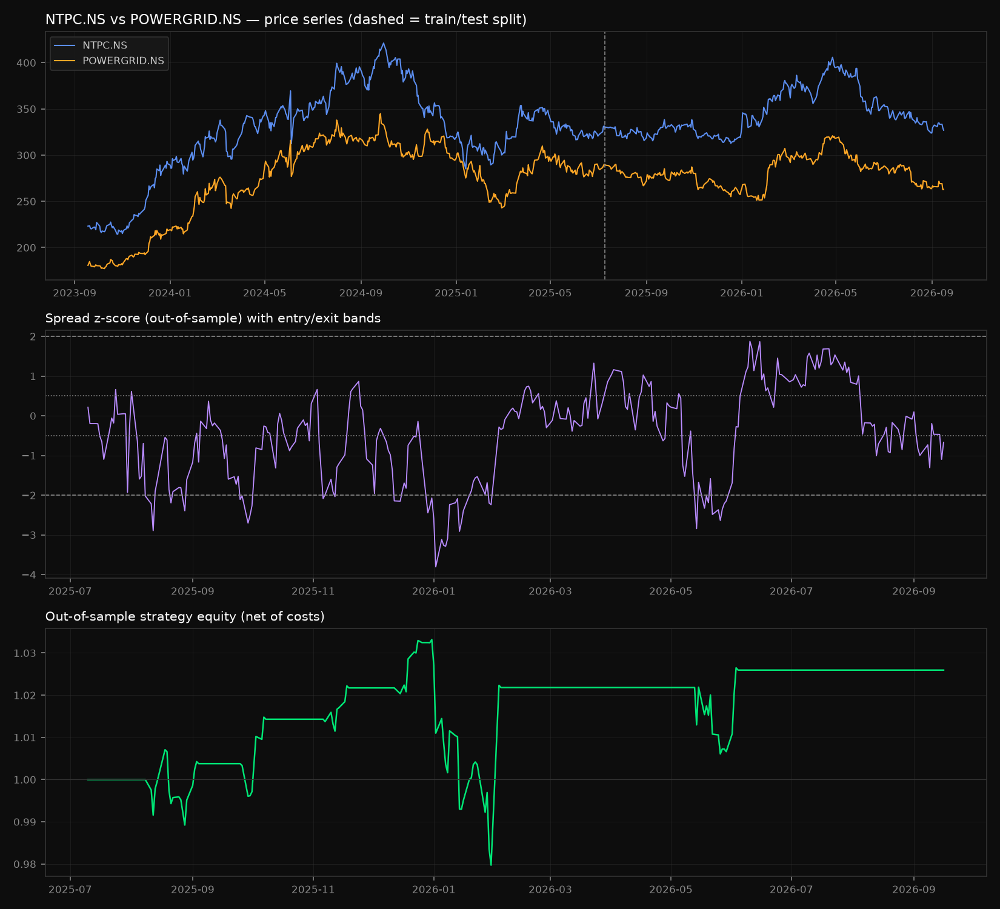

---

### BAJAJ-AUTO.NS / HEROMOTOCO.NS

- **Latest prices:** BAJAJ-AUTO.NS ₹11,593.00 · HEROMOTOCO.NS ₹5,235.00
- **Hedge ratio (train-fitted):** 0.4108
- **Cointegration (train):** FAIL at 5% — ADF -2.29, p=0.1744
- **Persistence:** passed 5% in 0 of 55 real-data runs (strict tier: 0/55)
- **Spread half-life:** 29.5 days
- **Current z-score:** -0.98
- **Signal today:** watch (approaching band)
- ⚠️ _Pair did not cointegrate on training data. Any signal here is not statistically justified — observation only._

**Out-of-sample backtest** (beta frozen from train window):

| Metric | Value |
|---|---|
| Sharpe | -0.69 |
| Sortino | -0.72 |
| Annualised return | -7.63% |
| Annualised vol | 10.67% |
| Max drawdown | -20.92% |
| Round-trip trades | 5 |

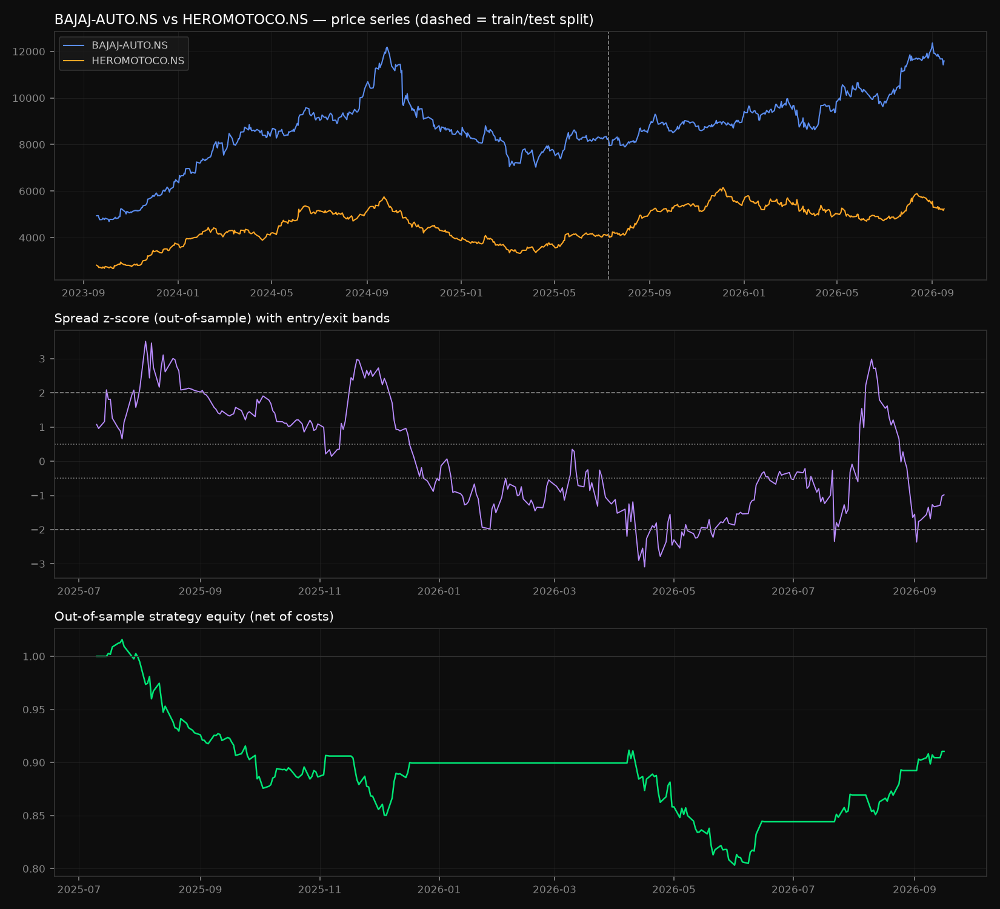

---

### TATASTEEL.NS / JSWSTEEL.NS

- **Latest prices:** TATASTEEL.NS ₹183.00 · JSWSTEEL.NS ₹1,248.90
- **Hedge ratio (train-fitted):** 3.1386
- **Cointegration (train):** FAIL at 5% — ADF -1.13, p=0.7048
- **Persistence:** passed 5% in 0 of 55 real-data runs (strict tier: 0/55)
- **Spread half-life:** 76.6 days
- **Current z-score:** -0.29
- **Signal today:** flat / no stretch
- ⚠️ _Pair did not cointegrate on training data. Any signal here is not statistically justified — observation only._

**Out-of-sample backtest** (beta frozen from train window):

| Metric | Value |
|---|---|
| Sharpe | 0.33 |
| Sortino | 0.28 |
| Annualised return | 2.27% |
| Annualised vol | 7.63% |
| Max drawdown | -5.47% |
| Round-trip trades | 5 |

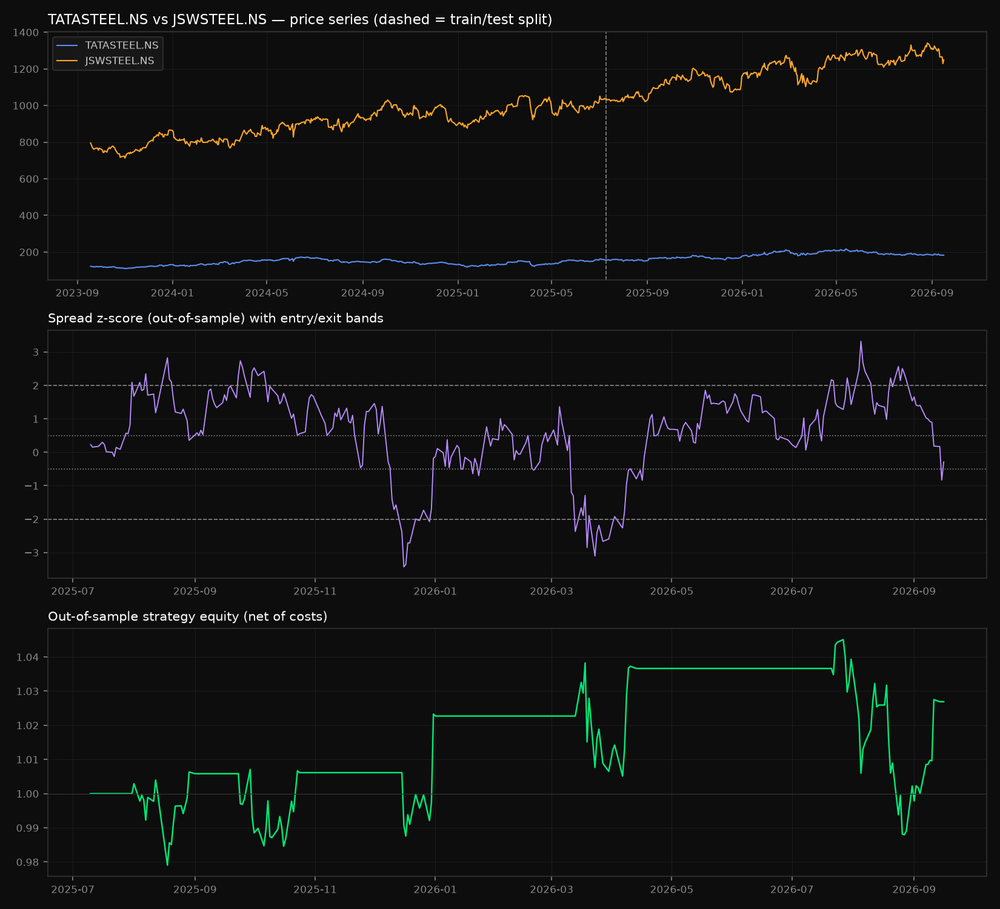

---

### SUNPHARMA.NS / CIPLA.NS

- **Latest prices:** SUNPHARMA.NS ₹1,853.50 · CIPLA.NS ₹1,358.00
- **Hedge ratio (train-fitted):** 0.4998
- **Cointegration (train):** PASS at 5% — ADF -3.38, p=0.0117
- **Persistence:** passed 5% in 55 of 55 real-data runs (strict tier: 5/55)
- **Spread half-life:** 10.7 days
- **Current z-score:** -1.41
- **Signal today:** watch (approaching band)

**Out-of-sample backtest** (beta frozen from train window):

| Metric | Value |
|---|---|
| Sharpe | -0.16 |
| Sortino | -0.17 |
| Annualised return | -1.50% |
| Annualised vol | 7.76% |
| Max drawdown | -10.34% |
| Round-trip trades | 4 |

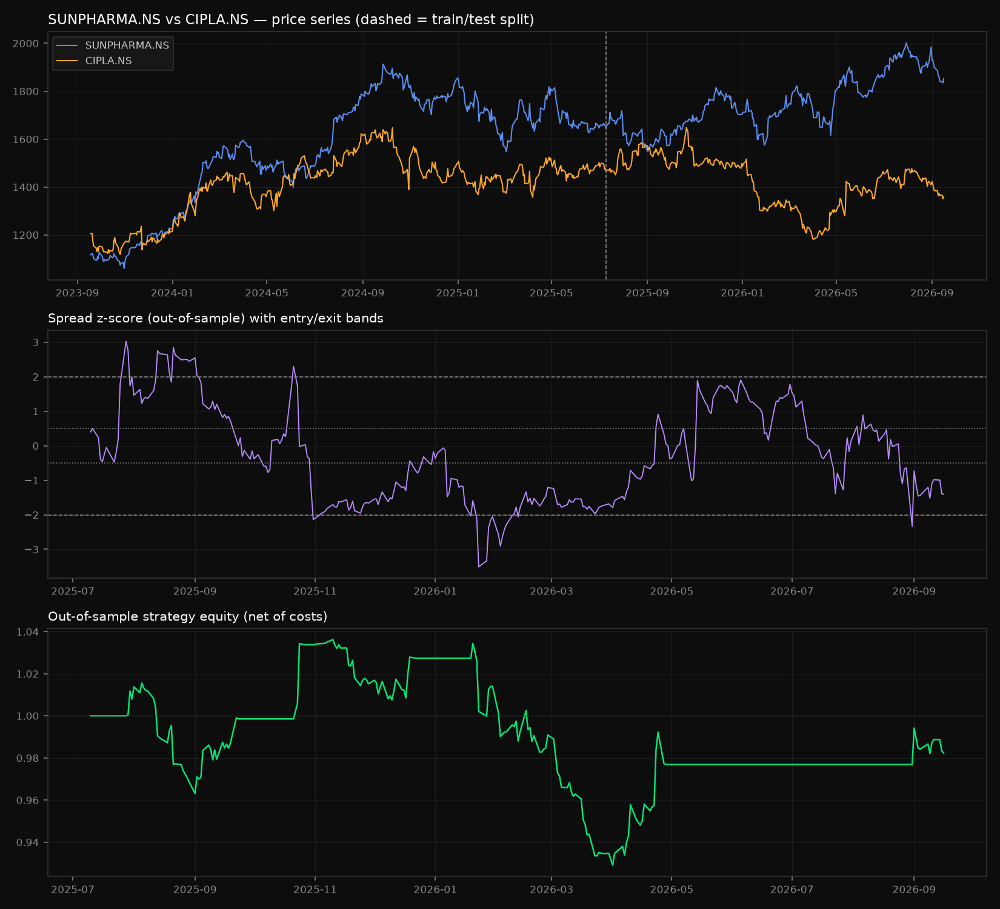

---

_Generated 2026-09-16 · pairs mean-reversion scanner · out-of-sample backtest · multiple-testing-aware · not investment advice._
