# Indian Pairs-Trading Scanner — 2026-09-17

> **What this is:** a market-neutral *pairs mean-reversion* scanner. It flags when two related NSE stocks have drifted apart far enough that their historical relationship signals a possible convergence trade. It does **not** forecast growth, rank "best" stocks, or predict company performance. A signal means the *spread between two stocks* is stretched — nothing about either stock being a good investment. Not investment advice; do your own research.

## Methodology (fixed in advance)

- **Universe:** 16 declared sector-mate pairs. Parameters (3y window, 60/40 train-test, z-entry 2.0, z-exit 0.5, 5 bps costs) are pre-registered; changes are logged in the README changelog *before* looking at results.
- **Multiple testing:** at the 5% level across 16 pairs, **≈0.8 false positives per run are expected by chance alone** even if nothing truly cointegrates. A single-day pass is a candidate, not a discovery.
- **Strict tier:** Bonferroni-corrected threshold p < 0.0031 (marked ✓✓).
- **Evidence = persistence:** the Persistence column counts how often each pair has passed the 5% test across all *real-data* daily runs recorded in `reports/history.csv`. Pairs deserve attention only when they pass persistently.

## Summary

| Pair | p-value | Coint. | Persistence | Current z | Signal | OOS Sharpe |
|---|---|---|---|---|---|---|
| HDFCBANK.NS/ICICIBANK.NS | 0.0706 | ✗ | 1/46 | -0.03 | flat / no stretch | -0.44 |
| AXISBANK.NS/ICICIBANK.NS | 0.8600 | ✗ | 0/56 | -0.54 | watch | -0.32 |
| KOTAKBANK.NS/HDFCBANK.NS | 0.1174 | ✗ | 0/56 | -1.11 | watch | 0.77 |
| SBIN.NS/BANKBARODA.NS | 0.1488 | ✗ | 0/56 | -0.59 | watch | 0.02 |
| TCS.NS/INFY.NS | 0.7027 | ✗ | 0/56 | -0.33 | flat / no stretch | 2.20 |
| INFY.NS/WIPRO.NS | 0.2079 | ✗ | 0/56 | -1.60 | watch | 1.68 |
| HCLTECH.NS/TECHM.NS | 0.1555 | ✗ | 0/56 | +0.19 | flat / no stretch | -0.01 |
| ACC.NS/AMBUJACEM.NS | 0.5691 | ✗ | 0/56 | -2.47 | LONG spread | 0.54 |
| ULTRACEMCO.NS/SHREECEM.NS | 0.2701 | ✗ | 0/56 | -2.03 | LONG spread | -0.01 |
| IOC.NS/BPCL.NS | 0.9012 | ✗ | 0/56 | +0.22 | flat / no stretch | 0.32 |
| BPCL.NS/HINDPETRO.NS | 0.2538 | ✗ | 0/56 | -0.99 | watch | 0.07 |
| ONGC.NS/COALINDIA.NS | 0.0102 | ✓ | 48/56 | +1.17 | watch | 0.63 |
| NTPC.NS/POWERGRID.NS | 0.1019 | ✗ | 0/56 | -0.89 | watch | 0.42 |
| BAJAJ-AUTO.NS/HEROMOTOCO.NS | 0.1730 | ✗ | 0/56 | -0.34 | flat / no stretch | -0.55 |
| TATASTEEL.NS/JSWSTEEL.NS | 0.7016 | ✗ | 0/56 | -0.55 | watch | 0.33 |
| SUNPHARMA.NS/CIPLA.NS | 0.0117 | ✓ | 56/56 | -0.98 | watch | -0.10 |

_Legend: ✓✓ passes strict Bonferroni tier · ✓ passes 5% only · ✗ fails. Persistence = 5%-passes / real-data runs recorded. \*no real-data history yet._

---

### HDFCBANK.NS / ICICIBANK.NS

- **Latest prices:** HDFCBANK.NS ₹713.00 · ICICIBANK.NS ₹1,347.60
- **Hedge ratio (train-fitted):** 1.6865
- **Cointegration (train):** FAIL at 5% — ADF -2.72, p=0.0706
- **Persistence:** passed 5% in 1 of 46 real-data runs (strict tier: 0/46)
- **Spread half-life:** 24.7 days
- **Current z-score:** -0.03
- **Signal today:** flat / no stretch
- ⚠️ _Pair did not cointegrate on training data. Any signal here is not statistically justified — observation only._

**Out-of-sample backtest** (beta frozen from train window):

| Metric | Value |
|---|---|
| Sharpe | -0.44 |
| Sortino | -0.47 |
| Annualised return | -3.10% |
| Annualised vol | 6.68% |
| Max drawdown | -8.39% |
| Round-trip trades | 4 |

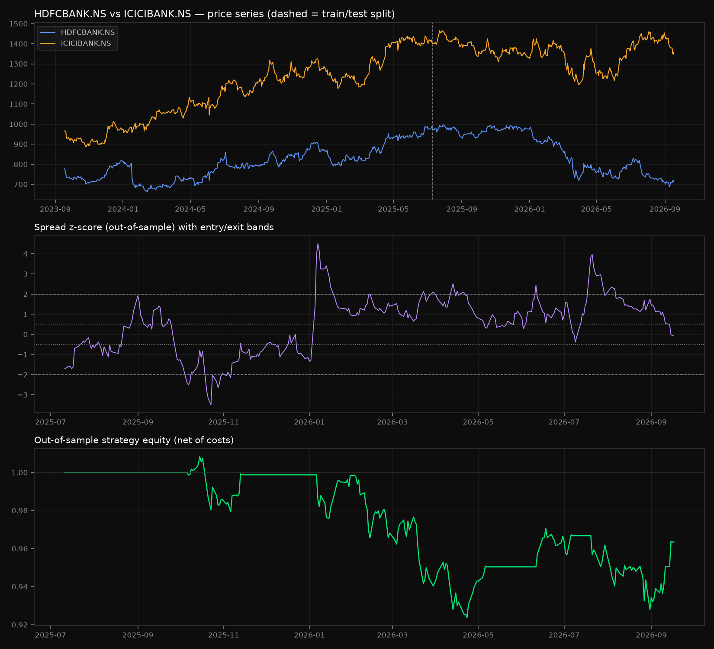

---

### AXISBANK.NS / ICICIBANK.NS

- **Latest prices:** AXISBANK.NS ₹1,240.00 · ICICIBANK.NS ₹1,347.60
- **Hedge ratio (train-fitted):** 0.9907
- **Cointegration (train):** FAIL at 5% — ADF -0.65, p=0.8600
- **Persistence:** passed 5% in 0 of 56 real-data runs (strict tier: 0/56)
- **Spread half-life:** 179.3 days
- **Current z-score:** -0.54
- **Signal today:** watch (approaching band)
- ⚠️ _Pair did not cointegrate on training data. Any signal here is not statistically justified — observation only._

**Out-of-sample backtest** (beta frozen from train window):

| Metric | Value |
|---|---|
| Sharpe | -0.32 |
| Sortino | -0.32 |
| Annualised return | -3.15% |
| Annualised vol | 8.80% |
| Max drawdown | -7.76% |
| Round-trip trades | 6 |

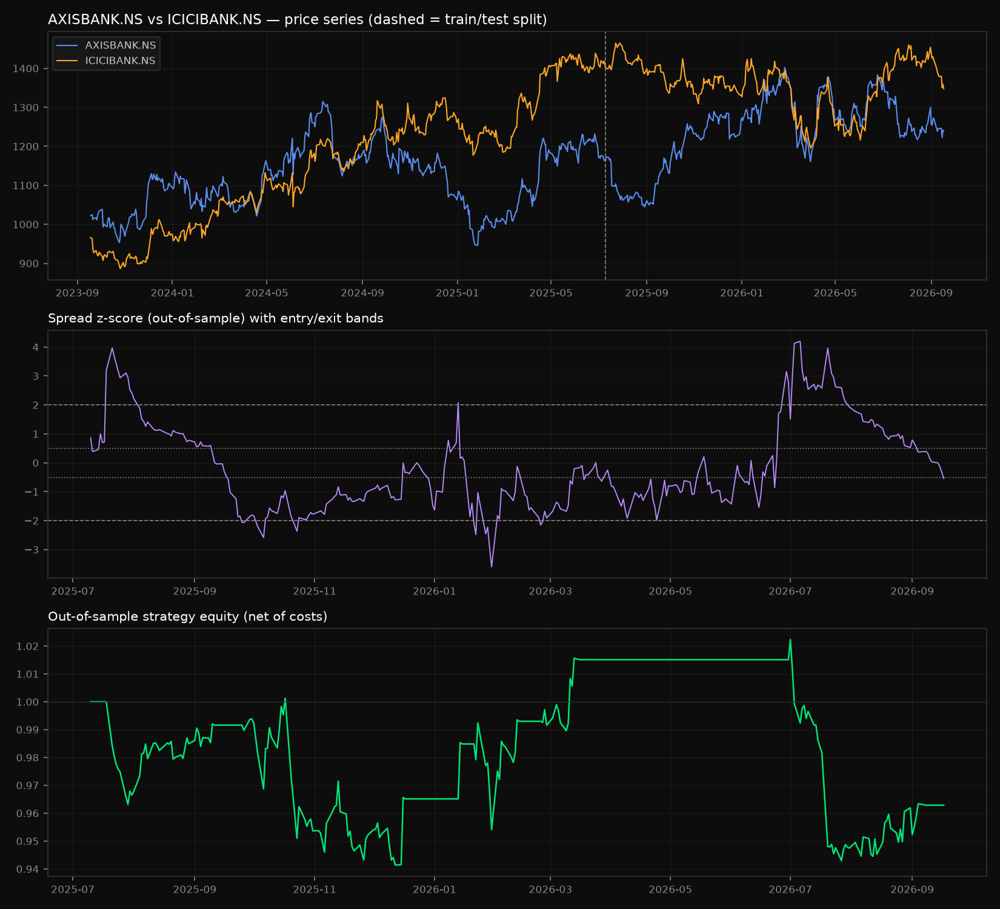

---

### KOTAKBANK.NS / HDFCBANK.NS

- **Latest prices:** KOTAKBANK.NS ₹416.50 · HDFCBANK.NS ₹713.00
- **Hedge ratio (train-fitted):** 2.1167
- **Cointegration (train):** FAIL at 5% — ADF -2.49, p=0.1174
- **Persistence:** passed 5% in 0 of 56 real-data runs (strict tier: 0/56)
- **Spread half-life:** 24.7 days
- **Current z-score:** -1.11
- **Signal today:** watch (approaching band)
- ⚠️ _Pair did not cointegrate on training data. Any signal here is not statistically justified — observation only._

**Out-of-sample backtest** (beta frozen from train window):

| Metric | Value |
|---|---|
| Sharpe | 0.77 |
| Sortino | 0.59 |
| Annualised return | 4.92% |
| Annualised vol | 6.56% |
| Max drawdown | -4.22% |
| Round-trip trades | 6 |

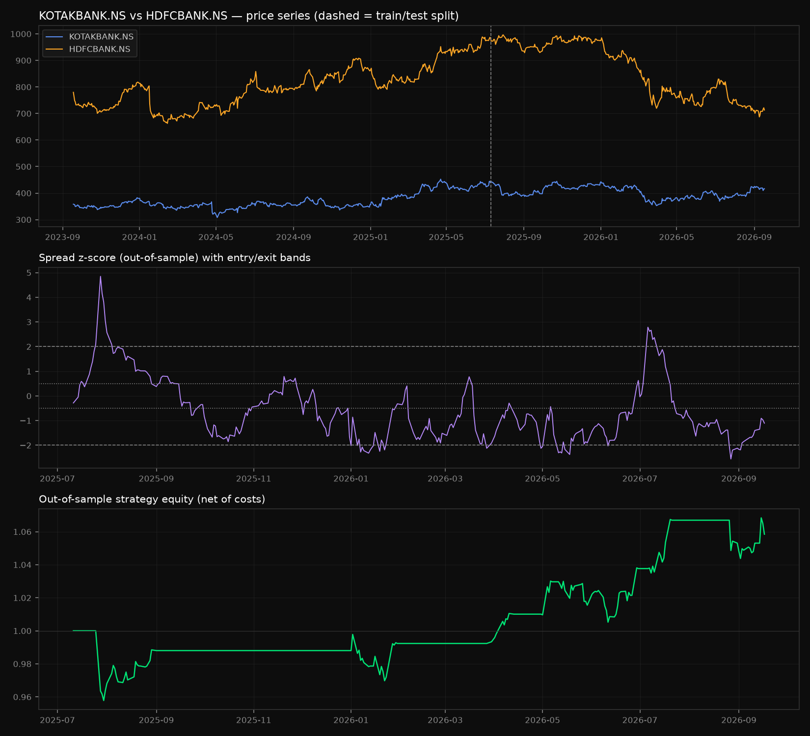

---

### SBIN.NS / BANKBARODA.NS

- **Latest prices:** SBIN.NS ₹988.70 · BANKBARODA.NS ₹232.30
- **Hedge ratio (train-fitted):** 0.1894
- **Cointegration (train):** FAIL at 5% — ADF -2.38, p=0.1488
- **Persistence:** passed 5% in 0 of 56 real-data runs (strict tier: 0/56)
- **Spread half-life:** 21.0 days
- **Current z-score:** -0.59
- **Signal today:** watch (approaching band)
- ⚠️ _Pair did not cointegrate on training data. Any signal here is not statistically justified — observation only._

**Out-of-sample backtest** (beta frozen from train window):

| Metric | Value |
|---|---|
| Sharpe | 0.02 |
| Sortino | 0.02 |
| Annualised return | -0.21% |
| Annualised vol | 9.21% |
| Max drawdown | -8.84% |
| Round-trip trades | 5 |

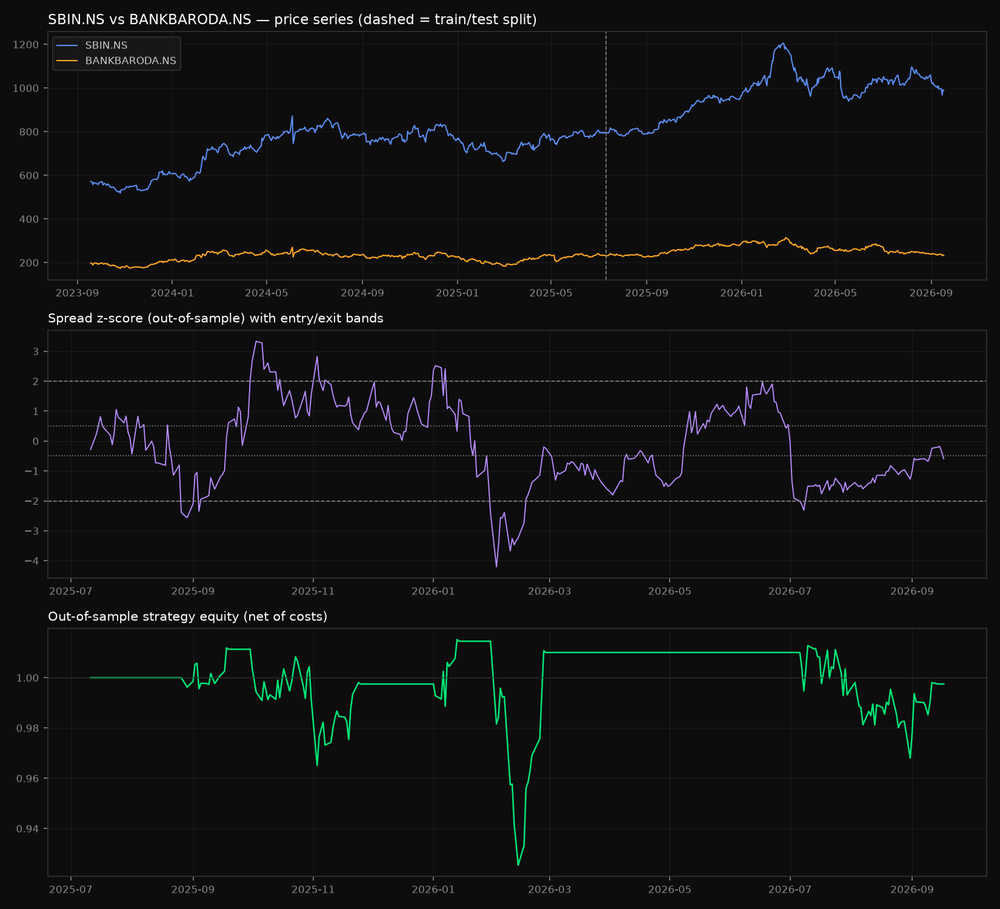

---

### TCS.NS / INFY.NS

- **Latest prices:** TCS.NS ₹2,190.00 · INFY.NS ₹1,058.60
- **Hedge ratio (train-fitted):** 0.4826
- **Cointegration (train):** FAIL at 5% — ADF -1.13, p=0.7027
- **Persistence:** passed 5% in 0 of 56 real-data runs (strict tier: 0/56)
- **Spread half-life:** 67.9 days
- **Current z-score:** -0.33
- **Signal today:** flat / no stretch
- ⚠️ _Pair did not cointegrate on training data. Any signal here is not statistically justified — observation only._

**Out-of-sample backtest** (beta frozen from train window):

| Metric | Value |
|---|---|
| Sharpe | 2.20 |
| Sortino | 2.21 |
| Annualised return | 9.58% |
| Annualised vol | 4.20% |
| Max drawdown | -1.35% |
| Round-trip trades | 7 |

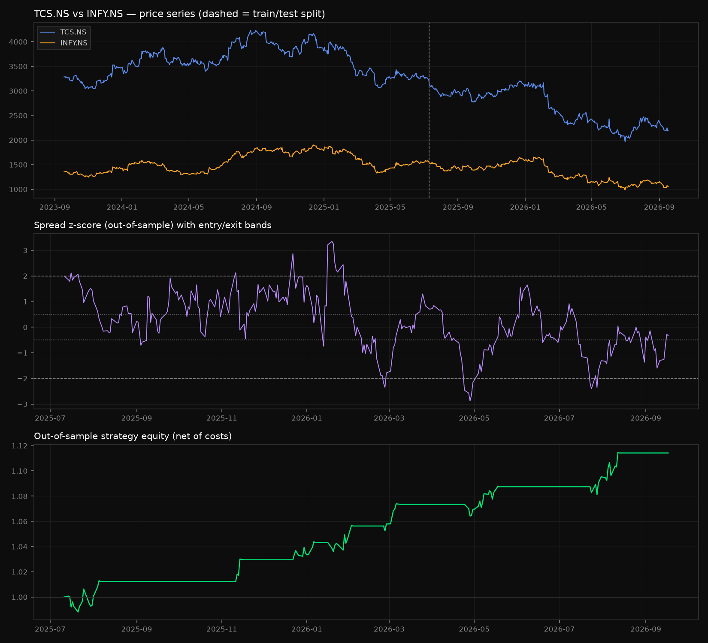

---

### INFY.NS / WIPRO.NS

- **Latest prices:** INFY.NS ₹1,058.60 · WIPRO.NS ₹166.40
- **Hedge ratio (train-fitted):** 0.1338
- **Cointegration (train):** FAIL at 5% — ADF -2.20, p=0.2079
- **Persistence:** passed 5% in 0 of 56 real-data runs (strict tier: 0/56)
- **Spread half-life:** 31.6 days
- **Current z-score:** -1.60
- **Signal today:** watch (approaching band)
- ⚠️ _Pair did not cointegrate on training data. Any signal here is not statistically justified — observation only._

**Out-of-sample backtest** (beta frozen from train window):

| Metric | Value |
|---|---|
| Sharpe | 1.68 |
| Sortino | 1.96 |
| Annualised return | 8.74% |
| Annualised vol | 5.06% |
| Max drawdown | -2.34% |
| Round-trip trades | 6 |

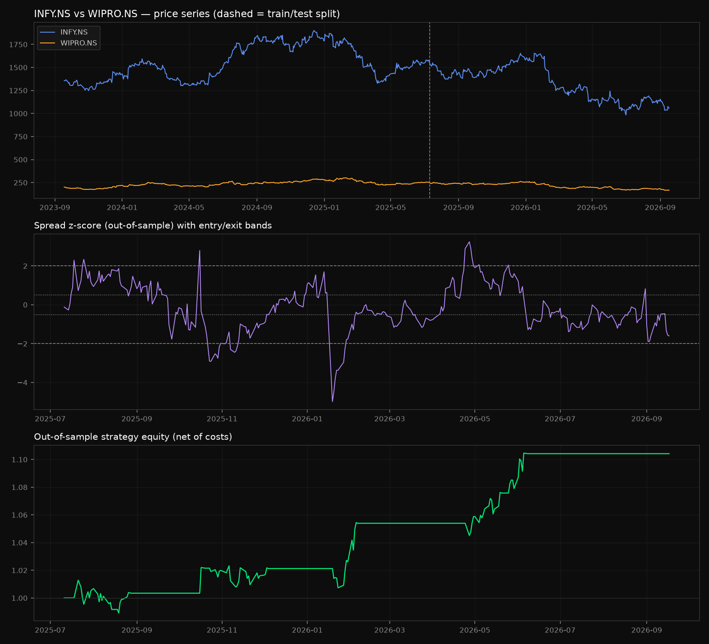

---

### HCLTECH.NS / TECHM.NS

- **Latest prices:** HCLTECH.NS ₹1,258.30 · TECHM.NS ₹1,561.00
- **Hedge ratio (train-fitted):** 0.9098
- **Cointegration (train):** FAIL at 5% — ADF -2.35, p=0.1555
- **Persistence:** passed 5% in 0 of 56 real-data runs (strict tier: 0/56)
- **Spread half-life:** 22.9 days
- **Current z-score:** +0.19
- **Signal today:** flat / no stretch
- ⚠️ _Pair did not cointegrate on training data. Any signal here is not statistically justified — observation only._

**Out-of-sample backtest** (beta frozen from train window):

| Metric | Value |
|---|---|
| Sharpe | -0.01 |
| Sortino | -0.01 |
| Annualised return | -0.30% |
| Annualised vol | 6.90% |
| Max drawdown | -7.77% |
| Round-trip trades | 5 |

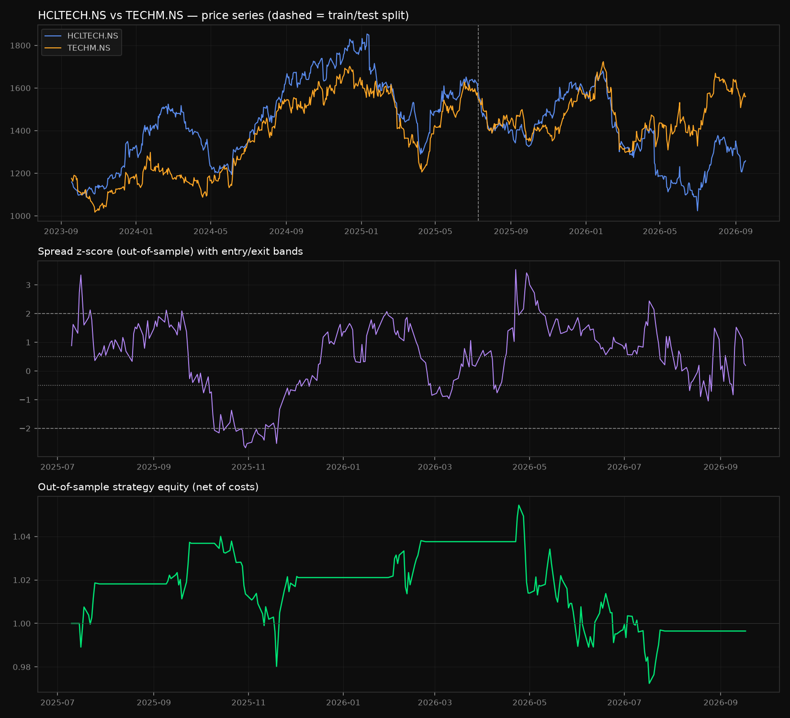

---

### ACC.NS / AMBUJACEM.NS

- **Latest prices:** ACC.NS ₹1,232.50 · AMBUJACEM.NS ₹383.25
- **Hedge ratio (train-fitted):** 0.1966
- **Cointegration (train):** FAIL at 5% — ADF -1.43, p=0.5691
- **Persistence:** passed 5% in 0 of 56 real-data runs (strict tier: 0/56)
- **Spread half-life:** 62.7 days
- **Current z-score:** -2.47
- **Signal today:** LONG spread (long AMBUJACEM.NS, short ACC.NS)
- ⚠️ _Pair did not cointegrate on training data. Any signal here is not statistically justified — observation only._

**Out-of-sample backtest** (beta frozen from train window):

| Metric | Value |
|---|---|
| Sharpe | 0.54 |
| Sortino | 0.45 |
| Annualised return | 3.00% |
| Annualised vol | 5.74% |
| Max drawdown | -4.68% |
| Round-trip trades | 4 |

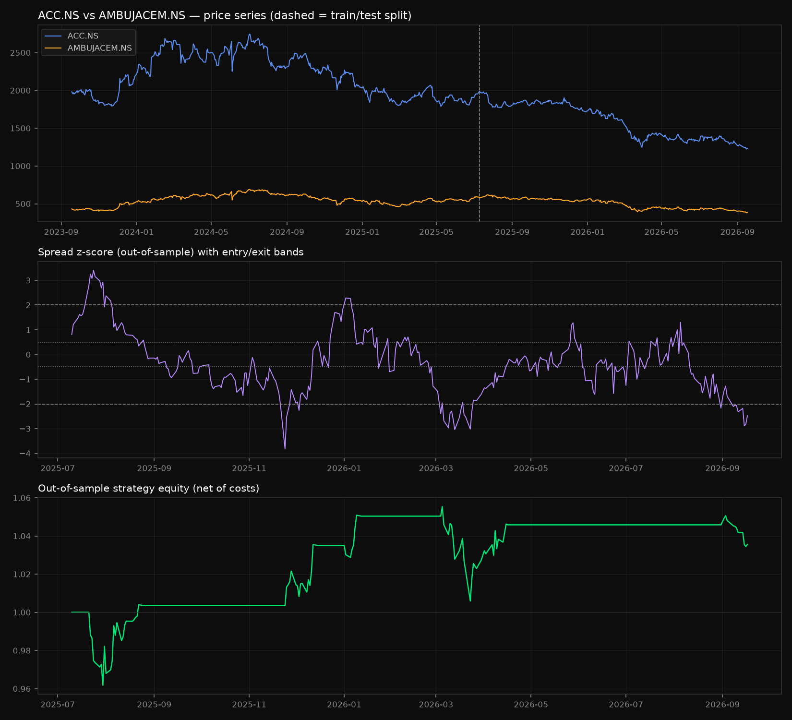

---

### ULTRACEMCO.NS / SHREECEM.NS

- **Latest prices:** ULTRACEMCO.NS ₹10,764.00 · SHREECEM.NS ₹21,960.00
- **Hedge ratio (train-fitted):** 0.7325
- **Cointegration (train):** FAIL at 5% — ADF -2.04, p=0.2701
- **Persistence:** passed 5% in 0 of 56 real-data runs (strict tier: 0/56)
- **Spread half-life:** 44.2 days
- **Current z-score:** -2.03
- **Signal today:** LONG spread (long SHREECEM.NS, short ULTRACEMCO.NS)
- ⚠️ _Pair did not cointegrate on training data. Any signal here is not statistically justified — observation only._

**Out-of-sample backtest** (beta frozen from train window):

| Metric | Value |
|---|---|
| Sharpe | -0.01 |
| Sortino | -0.01 |
| Annualised return | -0.30% |
| Annualised vol | 7.29% |
| Max drawdown | -8.09% |
| Round-trip trades | 5 |

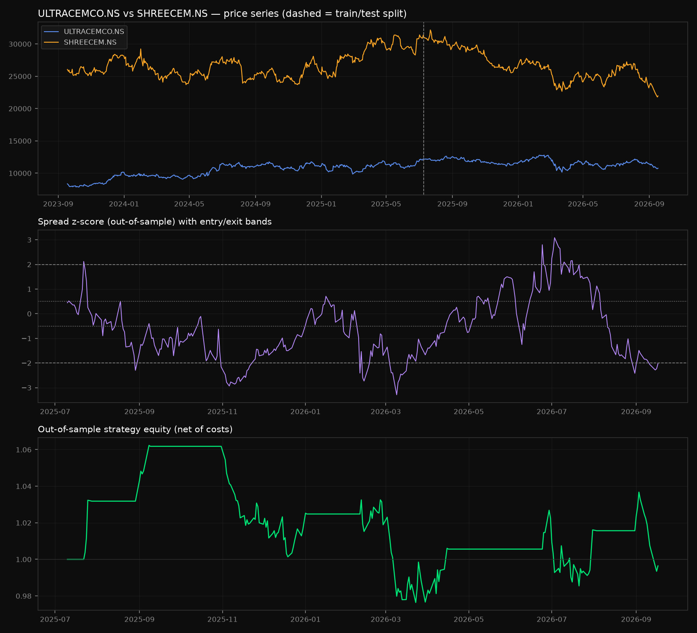

---

### IOC.NS / BPCL.NS

- **Latest prices:** IOC.NS ₹134.27 · BPCL.NS ₹307.00
- **Hedge ratio (train-fitted):** 1.7378
- **Cointegration (train):** FAIL at 5% — ADF -0.45, p=0.9012
- **Persistence:** passed 5% in 0 of 56 real-data runs (strict tier: 0/56)
- **Spread half-life:** 258.8 days
- **Current z-score:** +0.22
- **Signal today:** flat / no stretch
- ⚠️ _Pair did not cointegrate on training data. Any signal here is not statistically justified — observation only._

**Out-of-sample backtest** (beta frozen from train window):

| Metric | Value |
|---|---|
| Sharpe | 0.32 |
| Sortino | 0.32 |
| Annualised return | 1.74% |
| Annualised vol | 6.04% |
| Max drawdown | -6.30% |
| Round-trip trades | 6 |

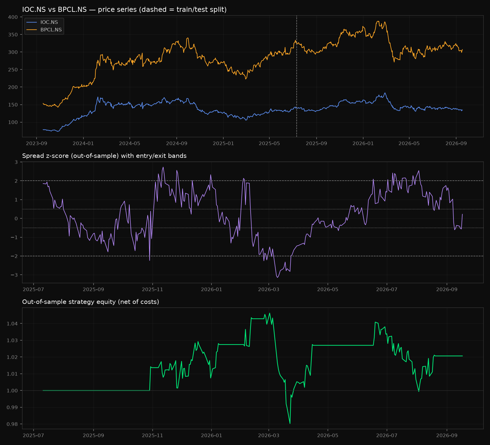

---

### BPCL.NS / HINDPETRO.NS

- **Latest prices:** BPCL.NS ₹307.00 · HINDPETRO.NS ₹350.60
- **Hedge ratio (train-fitted):** 1.3491
- **Cointegration (train):** FAIL at 5% — ADF -2.08, p=0.2538
- **Persistence:** passed 5% in 0 of 56 real-data runs (strict tier: 0/56)
- **Spread half-life:** 37.1 days
- **Current z-score:** -0.99
- **Signal today:** watch (approaching band)
- ⚠️ _Pair did not cointegrate on training data. Any signal here is not statistically justified — observation only._

**Out-of-sample backtest** (beta frozen from train window):

| Metric | Value |
|---|---|
| Sharpe | 0.07 |
| Sortino | 0.06 |
| Annualised return | 0.22% |
| Annualised vol | 5.65% |
| Max drawdown | -6.41% |
| Round-trip trades | 5 |

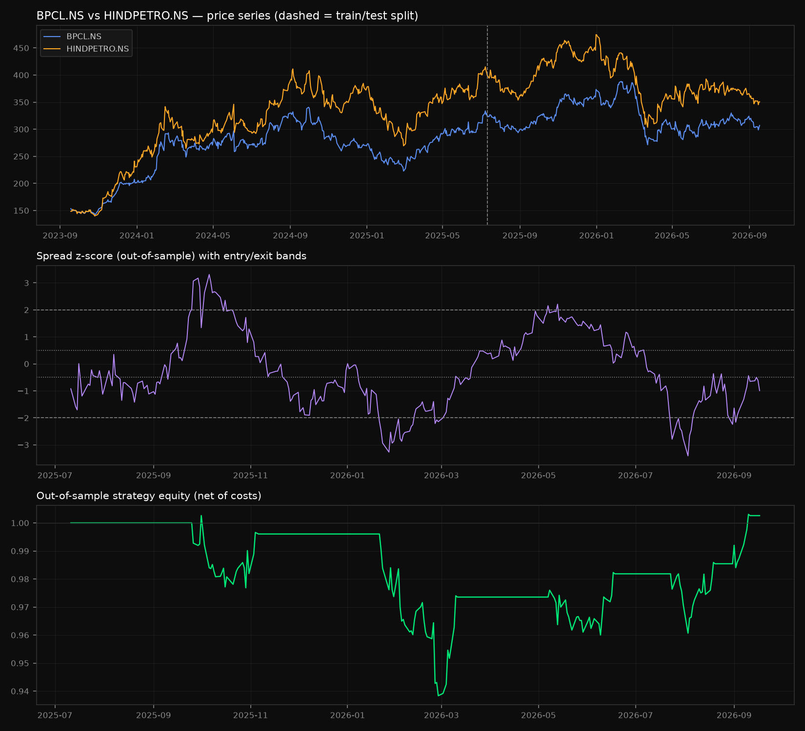

---

### ONGC.NS / COALINDIA.NS

- **Latest prices:** ONGC.NS ₹232.43 · COALINDIA.NS ₹418.00
- **Hedge ratio (train-fitted):** 1.4567
- **Cointegration (train):** PASS at 5% — ADF -3.42, p=0.0102
- **Persistence:** passed 5% in 48 of 56 real-data runs (strict tier: 1/56)
- **Spread half-life:** 12.2 days
- **Current z-score:** +1.17
- **Signal today:** watch (approaching band)

**Out-of-sample backtest** (beta frozen from train window):

| Metric | Value |
|---|---|
| Sharpe | 0.63 |
| Sortino | 0.47 |
| Annualised return | 4.50% |
| Annualised vol | 7.44% |
| Max drawdown | -6.17% |
| Round-trip trades | 4 |

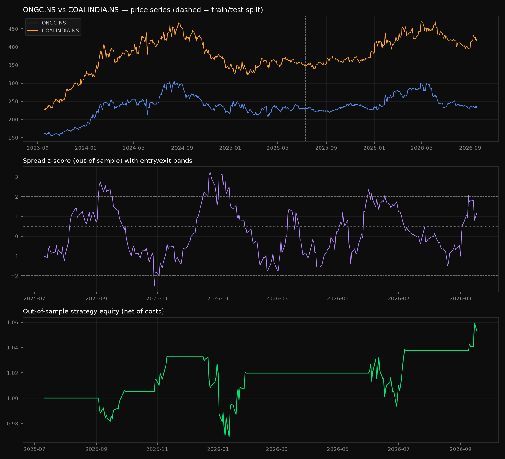

---

### NTPC.NS / POWERGRID.NS

- **Latest prices:** NTPC.NS ₹329.60 · POWERGRID.NS ₹263.75
- **Hedge ratio (train-fitted):** 0.8320
- **Cointegration (train):** FAIL at 5% — ADF -2.56, p=0.1019
- **Persistence:** passed 5% in 0 of 56 real-data runs (strict tier: 0/56)
- **Spread half-life:** 23.5 days
- **Current z-score:** -0.89
- **Signal today:** watch (approaching band)
- ⚠️ _Pair did not cointegrate on training data. Any signal here is not statistically justified — observation only._

**Out-of-sample backtest** (beta frozen from train window):

| Metric | Value |
|---|---|
| Sharpe | 0.42 |
| Sortino | 0.33 |
| Annualised return | 2.19% |
| Annualised vol | 5.44% |
| Max drawdown | -5.17% |
| Round-trip trades | 6 |

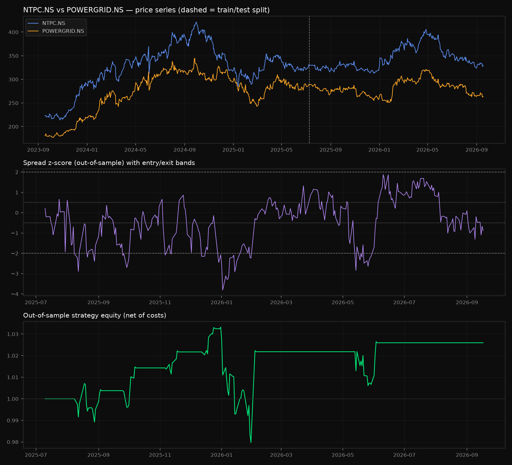

---

### BAJAJ-AUTO.NS / HEROMOTOCO.NS

- **Latest prices:** BAJAJ-AUTO.NS ₹11,500.00 · HEROMOTOCO.NS ₹5,325.00
- **Hedge ratio (train-fitted):** 0.4108
- **Cointegration (train):** FAIL at 5% — ADF -2.30, p=0.1730
- **Persistence:** passed 5% in 0 of 56 real-data runs (strict tier: 0/56)
- **Spread half-life:** 29.4 days
- **Current z-score:** -0.34
- **Signal today:** flat / no stretch
- ⚠️ _Pair did not cointegrate on training data. Any signal here is not statistically justified — observation only._

**Out-of-sample backtest** (beta frozen from train window):

| Metric | Value |
|---|---|
| Sharpe | -0.55 |
| Sortino | -0.58 |
| Annualised return | -6.46% |
| Annualised vol | 11.07% |
| Max drawdown | -21.40% |
| Round-trip trades | 5 |

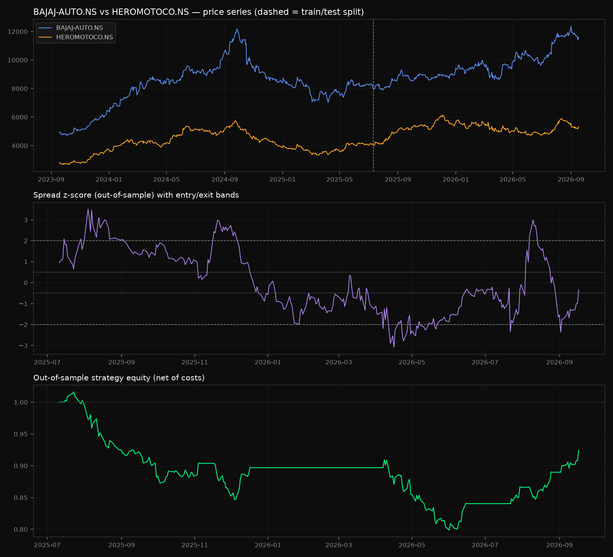

---

### TATASTEEL.NS / JSWSTEEL.NS

- **Latest prices:** TATASTEEL.NS ₹187.29 · JSWSTEEL.NS ₹1,253.40
- **Hedge ratio (train-fitted):** 3.1530
- **Cointegration (train):** FAIL at 5% — ADF -1.13, p=0.7016
- **Persistence:** passed 5% in 0 of 56 real-data runs (strict tier: 0/56)
- **Spread half-life:** 76.2 days
- **Current z-score:** -0.55
- **Signal today:** watch (approaching band)
- ⚠️ _Pair did not cointegrate on training data. Any signal here is not statistically justified — observation only._

**Out-of-sample backtest** (beta frozen from train window):

| Metric | Value |
|---|---|
| Sharpe | 0.33 |
| Sortino | 0.28 |
| Annualised return | 2.25% |
| Annualised vol | 7.65% |
| Max drawdown | -5.49% |
| Round-trip trades | 5 |

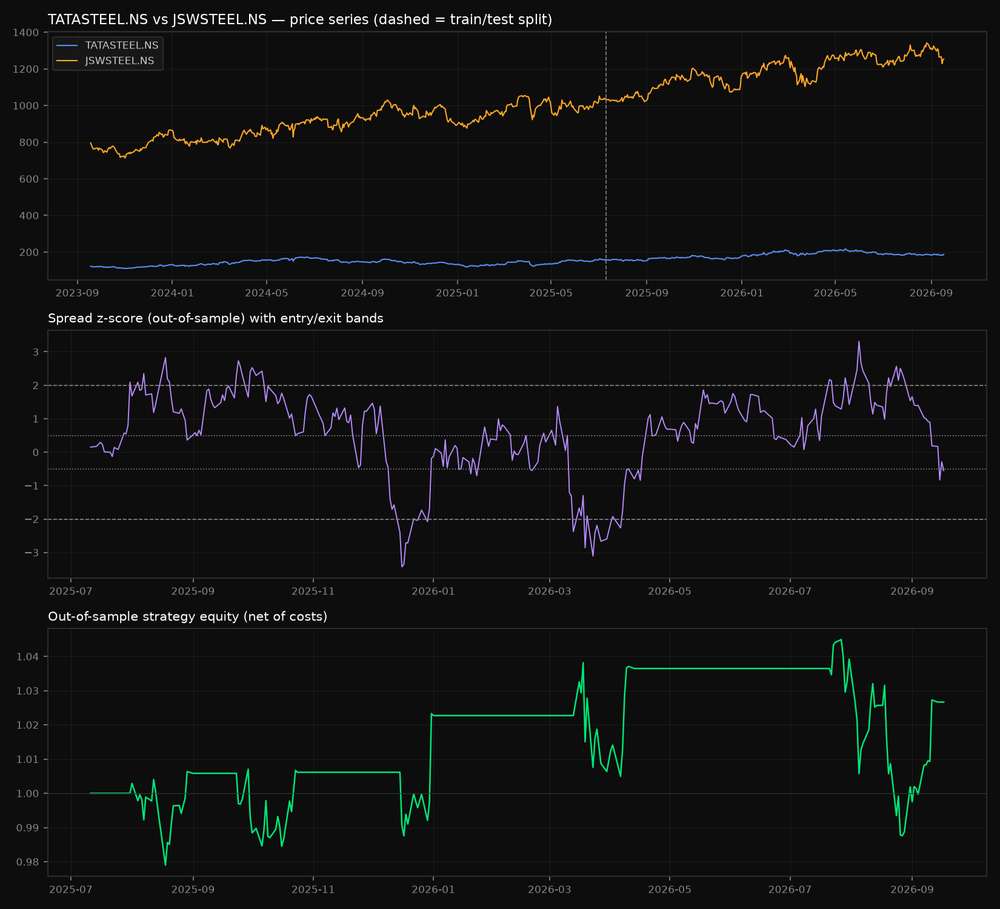

---

### SUNPHARMA.NS / CIPLA.NS

- **Latest prices:** SUNPHARMA.NS ₹1,867.30 · CIPLA.NS ₹1,376.30
- **Hedge ratio (train-fitted):** 0.4998
- **Cointegration (train):** PASS at 5% — ADF -3.38, p=0.0117
- **Persistence:** passed 5% in 56 of 56 real-data runs (strict tier: 5/56)
- **Spread half-life:** 10.7 days
- **Current z-score:** -0.98
- **Signal today:** watch (approaching band)

**Out-of-sample backtest** (beta frozen from train window):

| Metric | Value |
|---|---|
| Sharpe | -0.10 |
| Sortino | -0.11 |
| Annualised return | -1.08% |
| Annualised vol | 7.76% |
| Max drawdown | -10.34% |
| Round-trip trades | 4 |

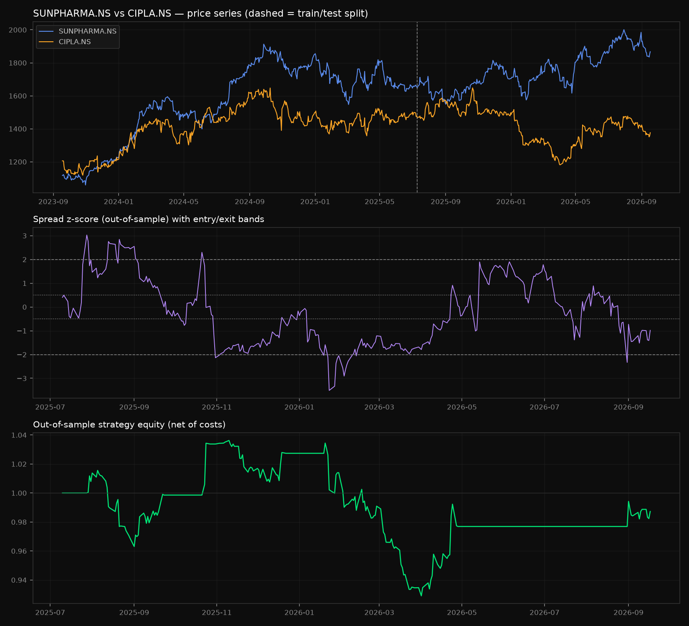

---

_Generated 2026-09-17 · pairs mean-reversion scanner · out-of-sample backtest · multiple-testing-aware · not investment advice._
