# Indian Pairs-Trading Scanner — 2026-09-18

> **What this is:** a market-neutral *pairs mean-reversion* scanner. It flags when two related NSE stocks have drifted apart far enough that their historical relationship signals a possible convergence trade. It does **not** forecast growth, rank "best" stocks, or predict company performance. A signal means the *spread between two stocks* is stretched — nothing about either stock being a good investment. Not investment advice; do your own research.

## Methodology (fixed in advance)

- **Universe:** 16 declared sector-mate pairs. Parameters (3y window, 60/40 train-test, z-entry 2.0, z-exit 0.5, 5 bps costs) are pre-registered; changes are logged in the README changelog *before* looking at results.
- **Multiple testing:** at the 5% level across 16 pairs, **≈0.8 false positives per run are expected by chance alone** even if nothing truly cointegrates. A single-day pass is a candidate, not a discovery.
- **Strict tier:** Bonferroni-corrected threshold p < 0.0031 (marked ✓✓).
- **Evidence = persistence:** the Persistence column counts how often each pair has passed the 5% test across all *real-data* daily runs recorded in `reports/history.csv`. Pairs deserve attention only when they pass persistently.

## Summary

| Pair | p-value | Coint. | Persistence | Current z | Signal | OOS Sharpe |
|---|---|---|---|---|---|---|
| HDFCBANK.NS/ICICIBANK.NS | 0.0643 | ✗ | 1/47 | -0.55 | watch | -0.44 |
| AXISBANK.NS/ICICIBANK.NS | 0.8300 | ✗ | 0/57 | -1.11 | watch | -0.32 |
| KOTAKBANK.NS/HDFCBANK.NS | 0.1074 | ✗ | 0/57 | -0.70 | watch | 0.93 |
| SBIN.NS/BANKBARODA.NS | 0.1488 | ✗ | 0/57 | -0.45 | flat / no stretch | 0.02 |
| TCS.NS/INFY.NS | 0.7581 | ✗ | 0/57 | +0.80 | watch | 2.40 |
| INFY.NS/WIPRO.NS | 0.1932 | ✗ | 0/57 | -1.10 | watch | 1.68 |
| HCLTECH.NS/TECHM.NS | 0.1555 | ✗ | 0/57 | -0.54 | watch | -0.01 |
| ACC.NS/AMBUJACEM.NS | 0.5403 | ✗ | 0/57 | -2.29 | LONG spread | 0.54 |
| ULTRACEMCO.NS/SHREECEM.NS | 0.2357 | ✗ | 0/57 | -1.55 | watch | 0.14 |
| IOC.NS/BPCL.NS | 0.8796 | ✗ | 0/57 | +0.62 | watch | 0.32 |
| BPCL.NS/HINDPETRO.NS | 0.2538 | ✗ | 0/57 | -1.09 | watch | 0.07 |
| ONGC.NS/COALINDIA.NS | 0.0104 | ✓ | 49/57 | +0.47 | flat / no stretch | 0.76 |
| NTPC.NS/POWERGRID.NS | 0.1049 | ✗ | 0/57 | +1.40 | watch | 0.42 |
| BAJAJ-AUTO.NS/HEROMOTOCO.NS | 0.1730 | ✗ | 0/57 | -0.36 | flat / no stretch | -0.55 |
| TATASTEEL.NS/JSWSTEEL.NS | 0.7016 | ✗ | 0/57 | +0.19 | flat / no stretch | 0.33 |
| SUNPHARMA.NS/CIPLA.NS | 0.0113 | ✓ | 57/57 | +0.18 | flat / no stretch | 0.06 |

_Legend: ✓✓ passes strict Bonferroni tier · ✓ passes 5% only · ✗ fails. Persistence = 5%-passes / real-data runs recorded. \*no real-data history yet._

---

### HDFCBANK.NS / ICICIBANK.NS

- **Latest prices:** HDFCBANK.NS ₹731.00 · ICICIBANK.NS ₹1,338.90
- **Hedge ratio (train-fitted):** 1.6837
- **Cointegration (train):** FAIL at 5% — ADF -2.76, p=0.0643
- **Persistence:** passed 5% in 1 of 47 real-data runs (strict tier: 0/47)
- **Spread half-life:** 24.4 days
- **Current z-score:** -0.55
- **Signal today:** watch (approaching band)
- ⚠️ _Pair did not cointegrate on training data. Any signal here is not statistically justified — observation only._

**Out-of-sample backtest** (beta frozen from train window):

| Metric | Value |
|---|---|
| Sharpe | -0.44 |
| Sortino | -0.47 |
| Annualised return | -3.09% |
| Annualised vol | 6.68% |
| Max drawdown | -8.38% |
| Round-trip trades | 4 |

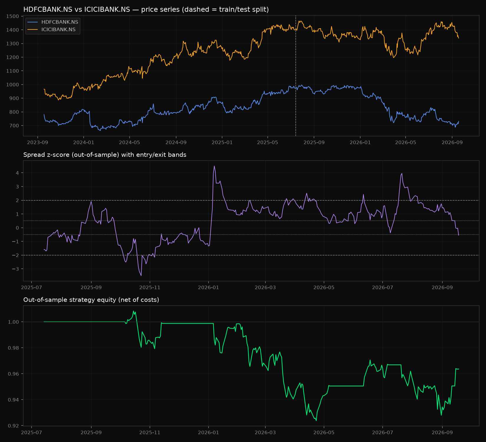

---

### AXISBANK.NS / ICICIBANK.NS

- **Latest prices:** AXISBANK.NS ₹1,257.00 · ICICIBANK.NS ₹1,338.90
- **Hedge ratio (train-fitted):** 0.9970
- **Cointegration (train):** FAIL at 5% — ADF -0.76, p=0.8300
- **Persistence:** passed 5% in 0 of 57 real-data runs (strict tier: 0/57)
- **Spread half-life:** 158.0 days
- **Current z-score:** -1.11
- **Signal today:** watch (approaching band)
- ⚠️ _Pair did not cointegrate on training data. Any signal here is not statistically justified — observation only._

**Out-of-sample backtest** (beta frozen from train window):

| Metric | Value |
|---|---|
| Sharpe | -0.32 |
| Sortino | -0.32 |
| Annualised return | -3.13% |
| Annualised vol | 8.79% |
| Max drawdown | -7.75% |
| Round-trip trades | 6 |

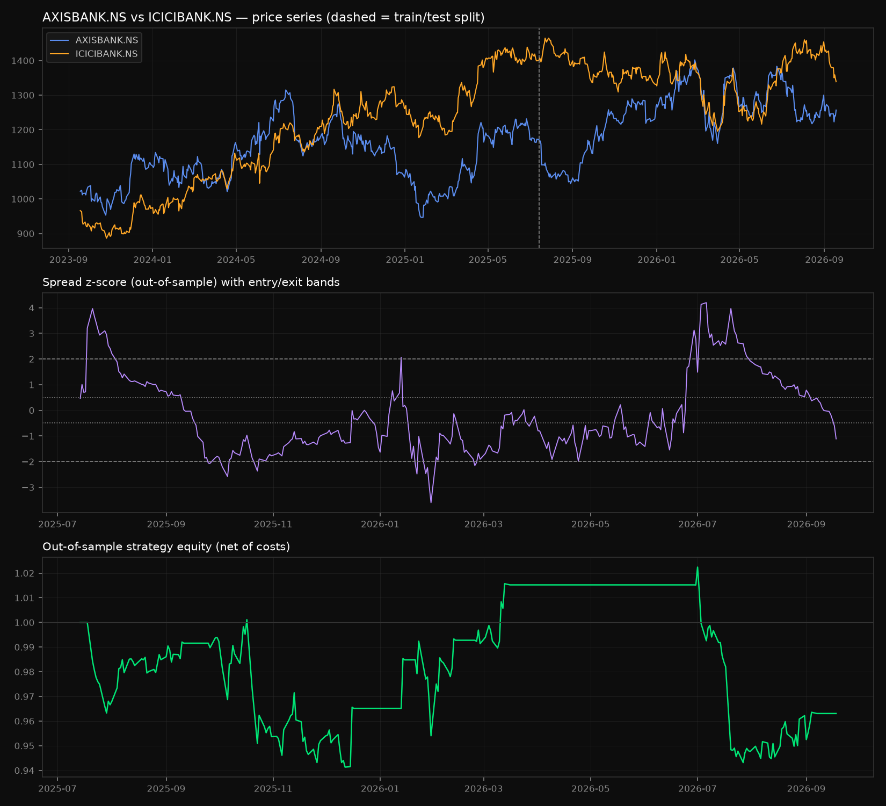

---

### KOTAKBANK.NS / HDFCBANK.NS

- **Latest prices:** KOTAKBANK.NS ₹412.50 · HDFCBANK.NS ₹731.00
- **Hedge ratio (train-fitted):** 2.1189
- **Cointegration (train):** FAIL at 5% — ADF -2.53, p=0.1074
- **Persistence:** passed 5% in 0 of 57 real-data runs (strict tier: 0/57)
- **Spread half-life:** 24.3 days
- **Current z-score:** -0.70
- **Signal today:** watch (approaching band)
- ⚠️ _Pair did not cointegrate on training data. Any signal here is not statistically justified — observation only._

**Out-of-sample backtest** (beta frozen from train window):

| Metric | Value |
|---|---|
| Sharpe | 0.93 |
| Sortino | 0.72 |
| Annualised return | 6.17% |
| Annualised vol | 6.71% |
| Max drawdown | -4.24% |
| Round-trip trades | 6 |

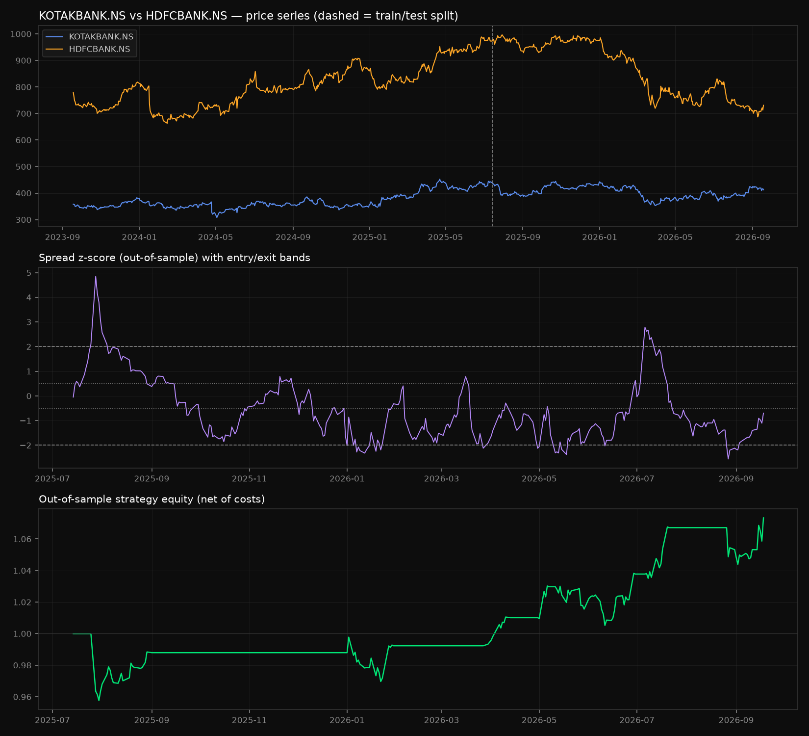

---

### SBIN.NS / BANKBARODA.NS

- **Latest prices:** SBIN.NS ₹996.20 · BANKBARODA.NS ₹234.94
- **Hedge ratio (train-fitted):** 0.1894
- **Cointegration (train):** FAIL at 5% — ADF -2.38, p=0.1488
- **Persistence:** passed 5% in 0 of 57 real-data runs (strict tier: 0/57)
- **Spread half-life:** 21.0 days
- **Current z-score:** -0.45
- **Signal today:** flat / no stretch
- ⚠️ _Pair did not cointegrate on training data. Any signal here is not statistically justified — observation only._

**Out-of-sample backtest** (beta frozen from train window):

| Metric | Value |
|---|---|
| Sharpe | 0.02 |
| Sortino | 0.02 |
| Annualised return | -0.21% |
| Annualised vol | 9.21% |
| Max drawdown | -8.84% |
| Round-trip trades | 5 |

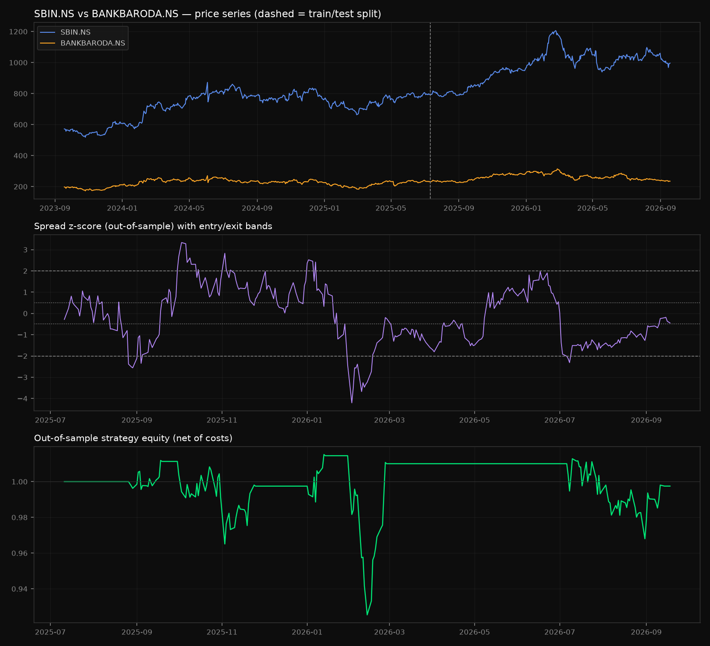

---

### TCS.NS / INFY.NS

- **Latest prices:** TCS.NS ₹2,105.00 · INFY.NS ₹1,051.40
- **Hedge ratio (train-fitted):** 0.4802
- **Cointegration (train):** FAIL at 5% — ADF -0.99, p=0.7581
- **Persistence:** passed 5% in 0 of 57 real-data runs (strict tier: 0/57)
- **Spread half-life:** 76.7 days
- **Current z-score:** +0.80
- **Signal today:** watch (approaching band)
- ⚠️ _Pair did not cointegrate on training data. Any signal here is not statistically justified — observation only._

**Out-of-sample backtest** (beta frozen from train window):

| Metric | Value |
|---|---|
| Sharpe | 2.40 |
| Sortino | 2.49 |
| Annualised return | 10.47% |
| Annualised vol | 4.18% |
| Max drawdown | -1.37% |
| Round-trip trades | 7 |

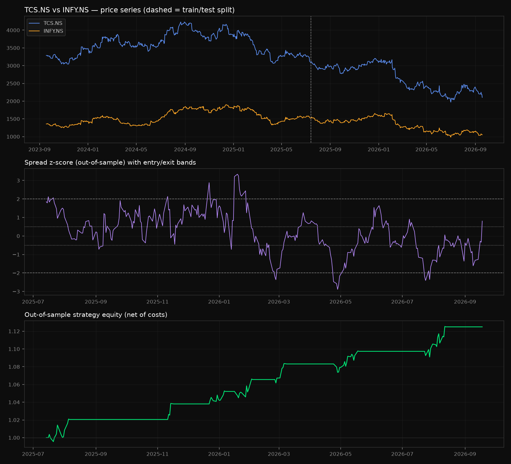

---

### INFY.NS / WIPRO.NS

- **Latest prices:** INFY.NS ₹1,051.40 · WIPRO.NS ₹166.83
- **Hedge ratio (train-fitted):** 0.1338
- **Cointegration (train):** FAIL at 5% — ADF -2.24, p=0.1932
- **Persistence:** passed 5% in 0 of 57 real-data runs (strict tier: 0/57)
- **Spread half-life:** 31.0 days
- **Current z-score:** -1.10
- **Signal today:** watch (approaching band)
- ⚠️ _Pair did not cointegrate on training data. Any signal here is not statistically justified — observation only._

**Out-of-sample backtest** (beta frozen from train window):

| Metric | Value |
|---|---|
| Sharpe | 1.68 |
| Sortino | 1.96 |
| Annualised return | 8.89% |
| Annualised vol | 5.14% |
| Max drawdown | -2.37% |
| Round-trip trades | 6 |

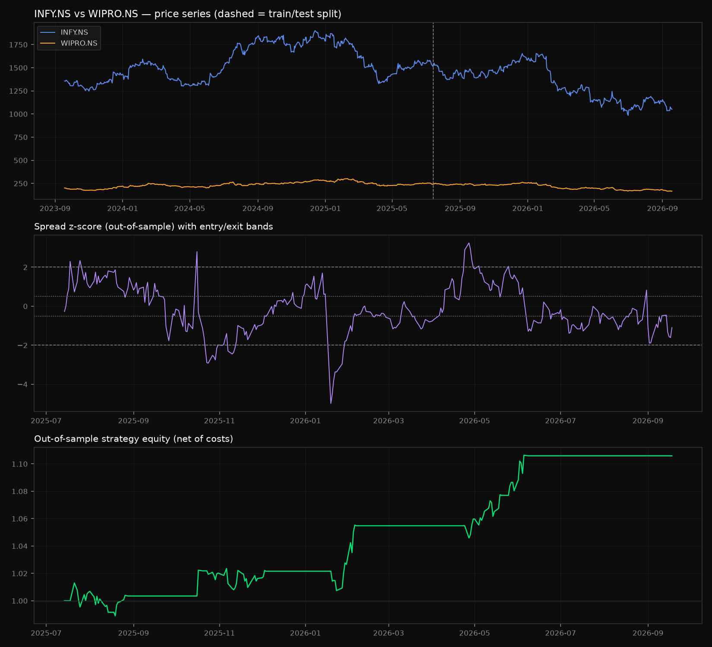

---

### HCLTECH.NS / TECHM.NS

- **Latest prices:** HCLTECH.NS ₹1,249.30 · TECHM.NS ₹1,537.10
- **Hedge ratio (train-fitted):** 0.9098
- **Cointegration (train):** FAIL at 5% — ADF -2.35, p=0.1555
- **Persistence:** passed 5% in 0 of 57 real-data runs (strict tier: 0/57)
- **Spread half-life:** 22.9 days
- **Current z-score:** -0.54
- **Signal today:** watch (approaching band)
- ⚠️ _Pair did not cointegrate on training data. Any signal here is not statistically justified — observation only._

**Out-of-sample backtest** (beta frozen from train window):

| Metric | Value |
|---|---|
| Sharpe | -0.01 |
| Sortino | -0.01 |
| Annualised return | -0.30% |
| Annualised vol | 6.90% |
| Max drawdown | -7.77% |
| Round-trip trades | 5 |

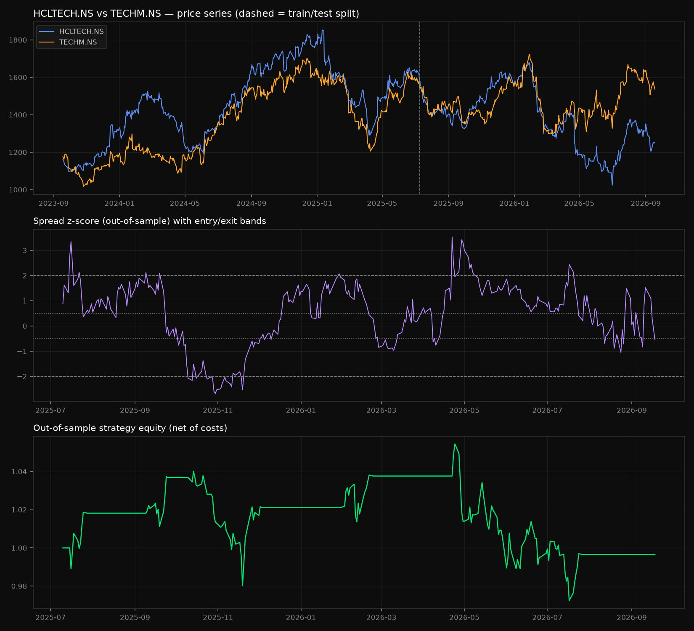

---

### ACC.NS / AMBUJACEM.NS

- **Latest prices:** ACC.NS ₹1,259.70 · AMBUJACEM.NS ₹388.30
- **Hedge ratio (train-fitted):** 0.1956
- **Cointegration (train):** FAIL at 5% — ADF -1.49, p=0.5403
- **Persistence:** passed 5% in 0 of 57 real-data runs (strict tier: 0/57)
- **Spread half-life:** 61.7 days
- **Current z-score:** -2.29
- **Signal today:** LONG spread (long AMBUJACEM.NS, short ACC.NS)
- ⚠️ _Pair did not cointegrate on training data. Any signal here is not statistically justified — observation only._

**Out-of-sample backtest** (beta frozen from train window):

| Metric | Value |
|---|---|
| Sharpe | 0.54 |
| Sortino | 0.45 |
| Annualised return | 2.97% |
| Annualised vol | 5.76% |
| Max drawdown | -4.71% |
| Round-trip trades | 4 |

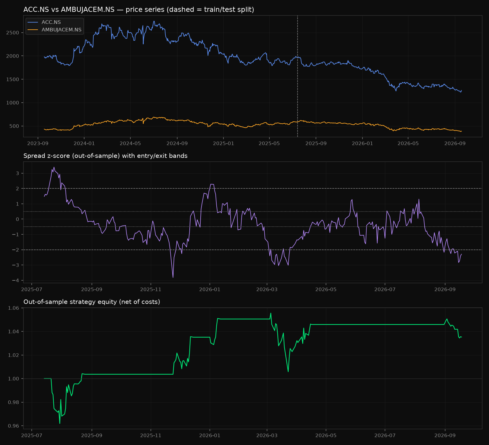

---

### ULTRACEMCO.NS / SHREECEM.NS

- **Latest prices:** ULTRACEMCO.NS ₹11,014.00 · SHREECEM.NS ₹22,600.00
- **Hedge ratio (train-fitted):** 0.7526
- **Cointegration (train):** FAIL at 5% — ADF -2.12, p=0.2357
- **Persistence:** passed 5% in 0 of 57 real-data runs (strict tier: 0/57)
- **Spread half-life:** 42.2 days
- **Current z-score:** -1.55
- **Signal today:** watch (approaching band)
- ⚠️ _Pair did not cointegrate on training data. Any signal here is not statistically justified — observation only._

**Out-of-sample backtest** (beta frozen from train window):

| Metric | Value |
|---|---|
| Sharpe | 0.14 |
| Sortino | 0.16 |
| Annualised return | 0.76% |
| Annualised vol | 7.28% |
| Max drawdown | -7.93% |
| Round-trip trades | 5 |

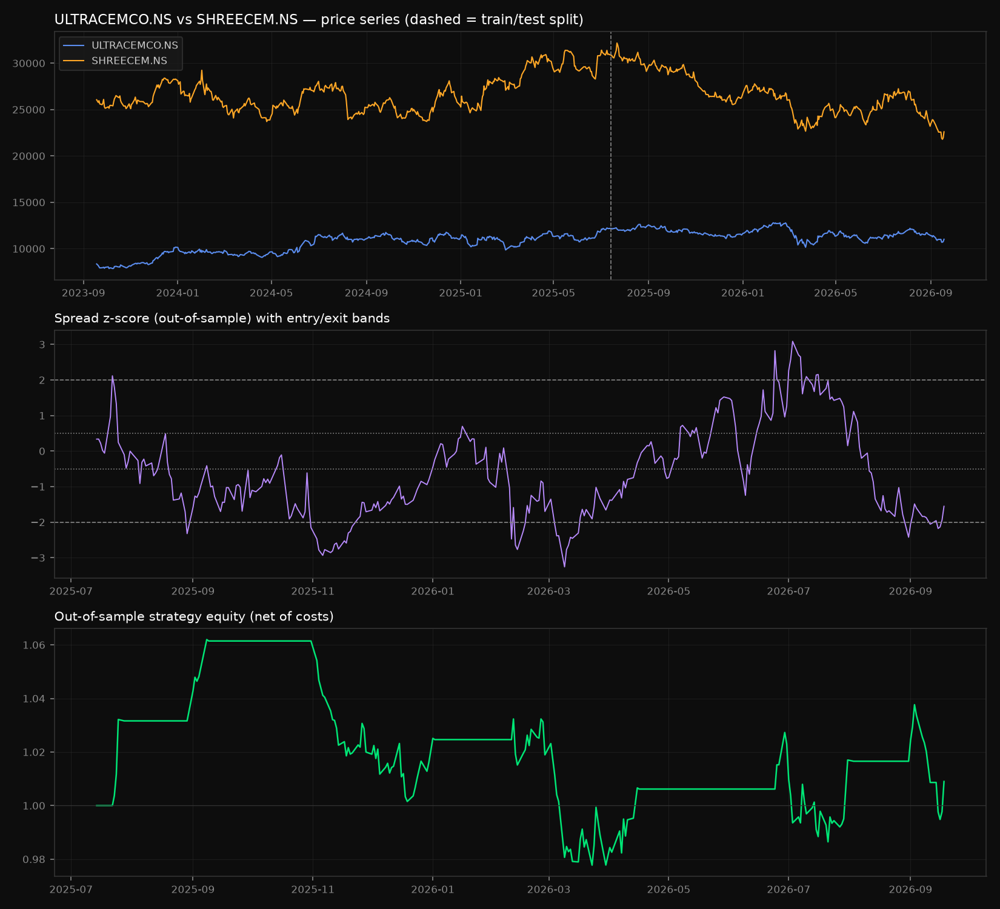

---

### IOC.NS / BPCL.NS

- **Latest prices:** IOC.NS ₹137.00 · BPCL.NS ₹314.00
- **Hedge ratio (train-fitted):** 1.7395
- **Cointegration (train):** FAIL at 5% — ADF -0.56, p=0.8796
- **Persistence:** passed 5% in 0 of 57 real-data runs (strict tier: 0/57)
- **Spread half-life:** 209.5 days
- **Current z-score:** +0.62
- **Signal today:** watch (approaching band)
- ⚠️ _Pair did not cointegrate on training data. Any signal here is not statistically justified — observation only._

**Out-of-sample backtest** (beta frozen from train window):

| Metric | Value |
|---|---|
| Sharpe | 0.32 |
| Sortino | 0.32 |
| Annualised return | 1.75% |
| Annualised vol | 6.04% |
| Max drawdown | -6.30% |
| Round-trip trades | 6 |

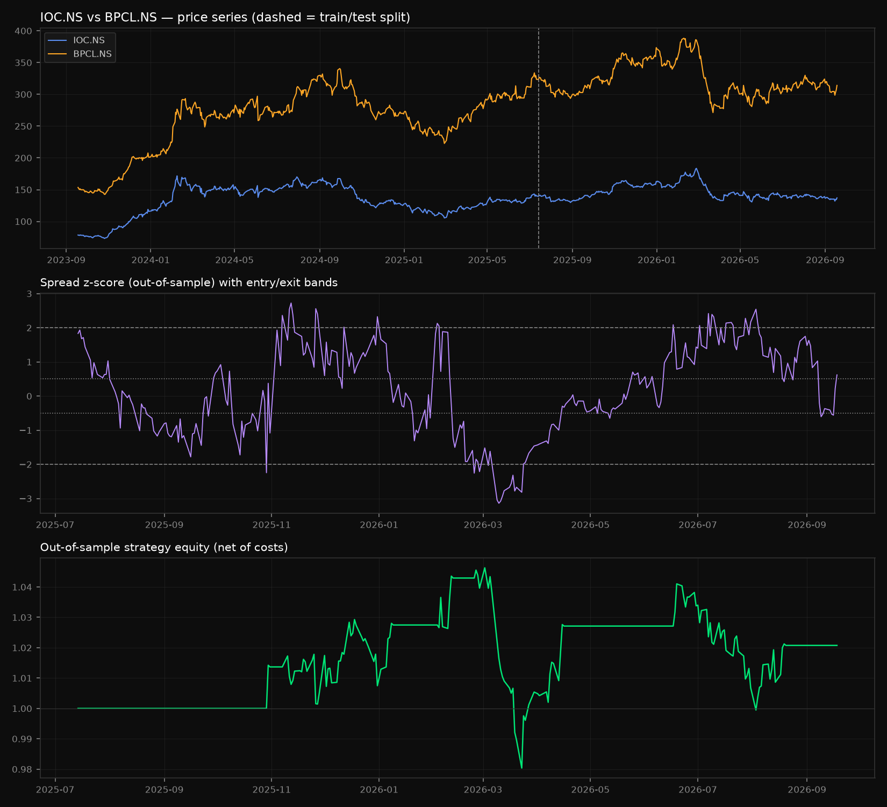

---

### BPCL.NS / HINDPETRO.NS

- **Latest prices:** BPCL.NS ₹314.00 · HINDPETRO.NS ₹359.00
- **Hedge ratio (train-fitted):** 1.3491
- **Cointegration (train):** FAIL at 5% — ADF -2.08, p=0.2538
- **Persistence:** passed 5% in 0 of 57 real-data runs (strict tier: 0/57)
- **Spread half-life:** 37.1 days
- **Current z-score:** -1.09
- **Signal today:** watch (approaching band)
- ⚠️ _Pair did not cointegrate on training data. Any signal here is not statistically justified — observation only._

**Out-of-sample backtest** (beta frozen from train window):

| Metric | Value |
|---|---|
| Sharpe | 0.07 |
| Sortino | 0.06 |
| Annualised return | 0.22% |
| Annualised vol | 5.65% |
| Max drawdown | -6.41% |
| Round-trip trades | 5 |

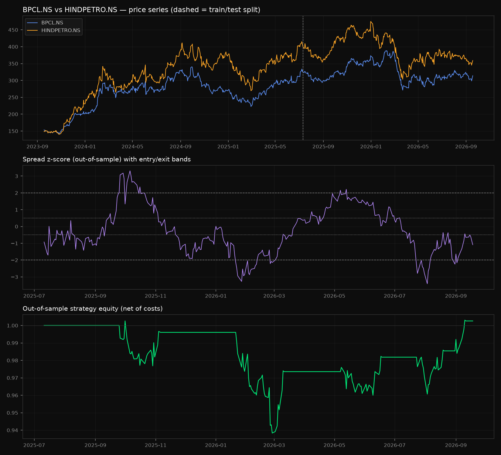

---

### ONGC.NS / COALINDIA.NS

- **Latest prices:** ONGC.NS ₹232.80 · COALINDIA.NS ₹409.90
- **Hedge ratio (train-fitted):** 1.4567
- **Cointegration (train):** PASS at 5% — ADF -3.42, p=0.0104
- **Persistence:** passed 5% in 49 of 57 real-data runs (strict tier: 1/57)
- **Spread half-life:** 12.3 days
- **Current z-score:** +0.47
- **Signal today:** flat / no stretch

**Out-of-sample backtest** (beta frozen from train window):

| Metric | Value |
|---|---|
| Sharpe | 0.76 |
| Sortino | 0.58 |
| Annualised return | 5.57% |
| Annualised vol | 7.46% |
| Max drawdown | -6.12% |
| Round-trip trades | 4 |

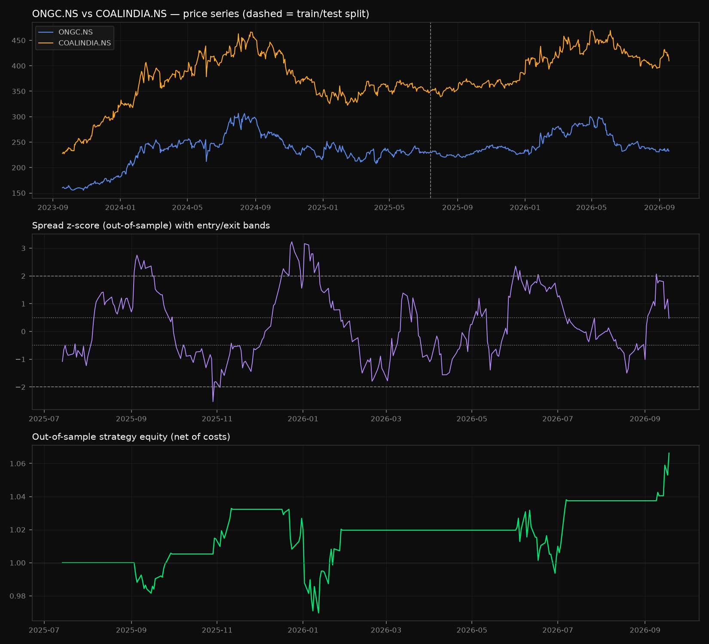

---

### NTPC.NS / POWERGRID.NS

- **Latest prices:** NTPC.NS ₹323.65 · POWERGRID.NS ₹270.30
- **Hedge ratio (train-fitted):** 0.8320
- **Cointegration (train):** FAIL at 5% — ADF -2.54, p=0.1049
- **Persistence:** passed 5% in 0 of 57 real-data runs (strict tier: 0/57)
- **Spread half-life:** 23.7 days
- **Current z-score:** +1.40
- **Signal today:** watch (approaching band)
- ⚠️ _Pair did not cointegrate on training data. Any signal here is not statistically justified — observation only._

**Out-of-sample backtest** (beta frozen from train window):

| Metric | Value |
|---|---|
| Sharpe | 0.42 |
| Sortino | 0.33 |
| Annualised return | 2.19% |
| Annualised vol | 5.44% |
| Max drawdown | -5.17% |
| Round-trip trades | 6 |

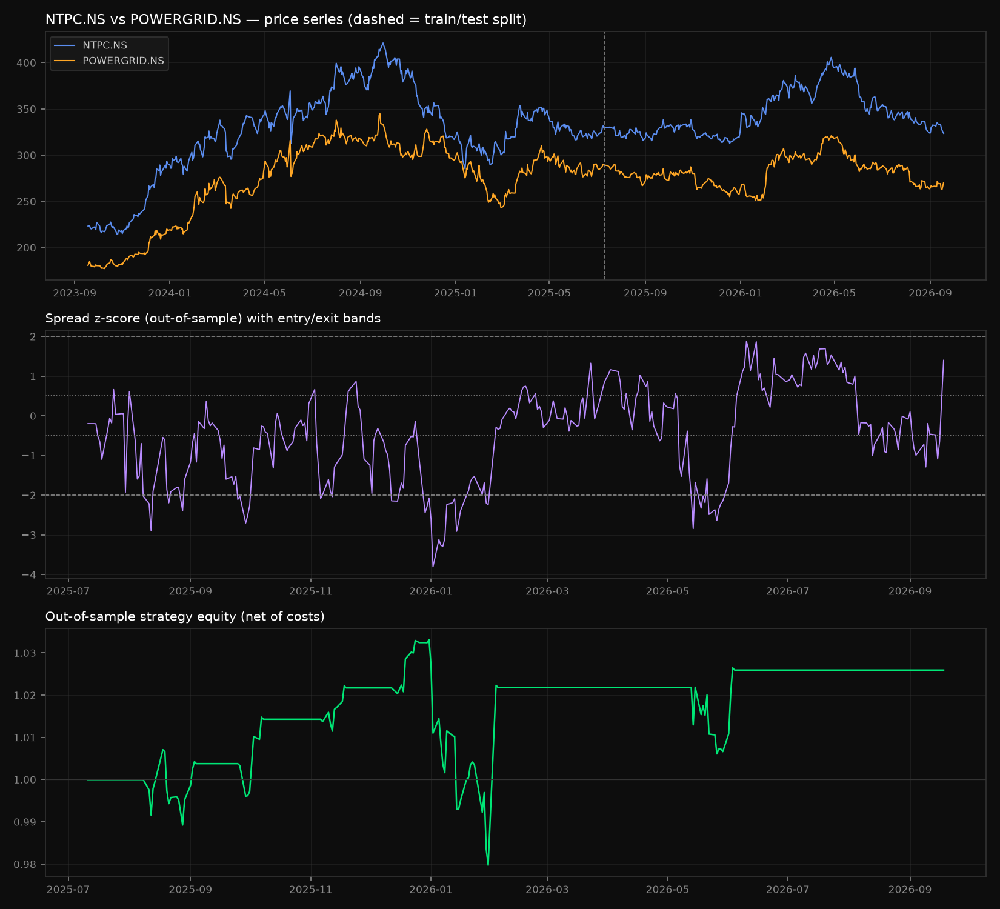

---

### BAJAJ-AUTO.NS / HEROMOTOCO.NS

- **Latest prices:** BAJAJ-AUTO.NS ₹11,414.00 · HEROMOTOCO.NS ₹5,285.50
- **Hedge ratio (train-fitted):** 0.4108
- **Cointegration (train):** FAIL at 5% — ADF -2.30, p=0.1730
- **Persistence:** passed 5% in 0 of 57 real-data runs (strict tier: 0/57)
- **Spread half-life:** 29.4 days
- **Current z-score:** -0.36
- **Signal today:** flat / no stretch
- ⚠️ _Pair did not cointegrate on training data. Any signal here is not statistically justified — observation only._

**Out-of-sample backtest** (beta frozen from train window):

| Metric | Value |
|---|---|
| Sharpe | -0.55 |
| Sortino | -0.59 |
| Annualised return | -6.51% |
| Annualised vol | 11.06% |
| Max drawdown | -21.40% |
| Round-trip trades | 5 |

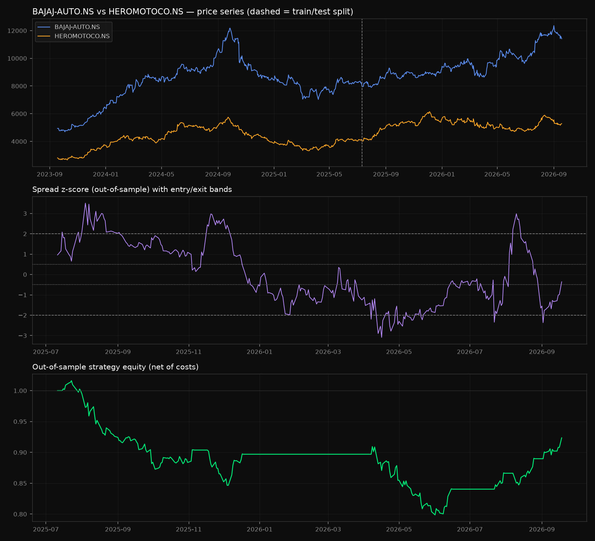

---

### TATASTEEL.NS / JSWSTEEL.NS

- **Latest prices:** TATASTEEL.NS ₹185.54 · JSWSTEEL.NS ₹1,275.60
- **Hedge ratio (train-fitted):** 3.1530
- **Cointegration (train):** FAIL at 5% — ADF -1.13, p=0.7016
- **Persistence:** passed 5% in 0 of 57 real-data runs (strict tier: 0/57)
- **Spread half-life:** 76.2 days
- **Current z-score:** +0.19
- **Signal today:** flat / no stretch
- ⚠️ _Pair did not cointegrate on training data. Any signal here is not statistically justified — observation only._

**Out-of-sample backtest** (beta frozen from train window):

| Metric | Value |
|---|---|
| Sharpe | 0.33 |
| Sortino | 0.28 |
| Annualised return | 2.25% |
| Annualised vol | 7.65% |
| Max drawdown | -5.49% |
| Round-trip trades | 5 |

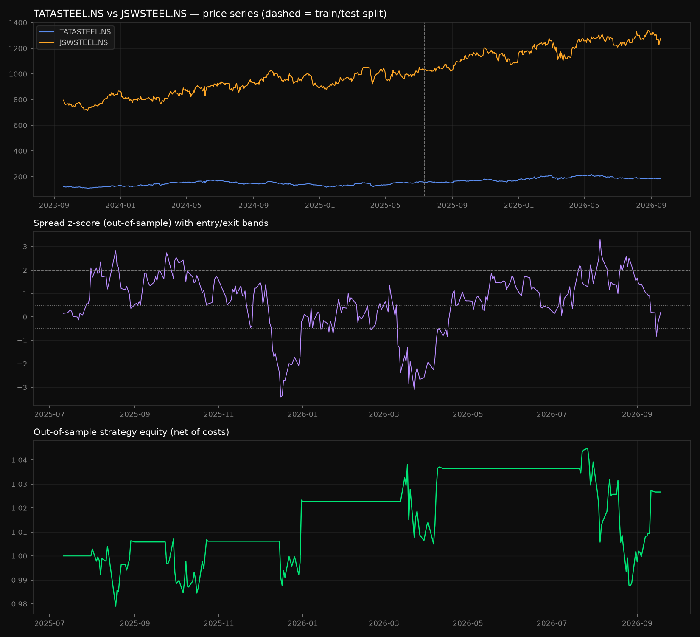

---

### SUNPHARMA.NS / CIPLA.NS

- **Latest prices:** SUNPHARMA.NS ₹1,837.30 · CIPLA.NS ₹1,394.50
- **Hedge ratio (train-fitted):** 0.4998
- **Cointegration (train):** PASS at 5% — ADF -3.39, p=0.0113
- **Persistence:** passed 5% in 57 of 57 real-data runs (strict tier: 5/57)
- **Spread half-life:** 10.7 days
- **Current z-score:** +0.18
- **Signal today:** flat / no stretch

**Out-of-sample backtest** (beta frozen from train window):

| Metric | Value |
|---|---|
| Sharpe | 0.06 |
| Sortino | 0.06 |
| Annualised return | 0.13% |
| Annualised vol | 7.93% |
| Max drawdown | -10.29% |
| Round-trip trades | 4 |

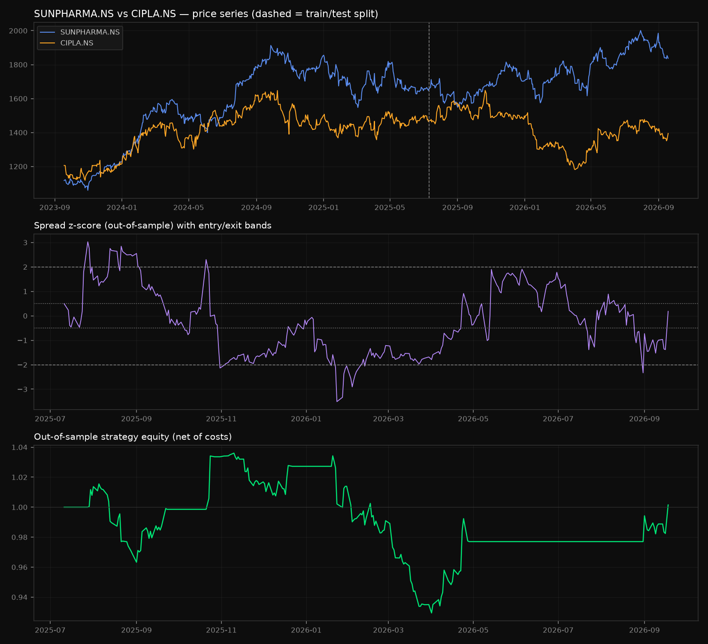

---

_Generated 2026-09-18 · pairs mean-reversion scanner · out-of-sample backtest · multiple-testing-aware · not investment advice._
