# Indian Pairs-Trading Scanner — 2026-09-21

> **What this is:** a market-neutral *pairs mean-reversion* scanner. It flags when two related NSE stocks have drifted apart far enough that their historical relationship signals a possible convergence trade. It does **not** forecast growth, rank "best" stocks, or predict company performance. A signal means the *spread between two stocks* is stretched — nothing about either stock being a good investment. Not investment advice; do your own research.

## Methodology (fixed in advance)

- **Universe:** 16 declared sector-mate pairs. Parameters (3y window, 60/40 train-test, z-entry 2.0, z-exit 0.5, 5 bps costs) are pre-registered; changes are logged in the README changelog *before* looking at results.
- **Multiple testing:** at the 5% level across 16 pairs, **≈0.8 false positives per run are expected by chance alone** even if nothing truly cointegrates. A single-day pass is a candidate, not a discovery.
- **Strict tier:** Bonferroni-corrected threshold p < 0.0031 (marked ✓✓).
- **Evidence = persistence:** the Persistence column counts how often each pair has passed the 5% test across all *real-data* daily runs recorded in `reports/history.csv`. Pairs deserve attention only when they pass persistently.

## Summary

| Pair | p-value | Coint. | Persistence | Current z | Signal | OOS Sharpe |
|---|---|---|---|---|---|---|
| HDFCBANK.NS/ICICIBANK.NS | 0.0982 | ✗ | 1/48 | -0.55 | watch | -0.43 |
| AXISBANK.NS/ICICIBANK.NS | 0.8061 | ✗ | 0/58 | -1.12 | watch | -0.32 |
| KOTAKBANK.NS/HDFCBANK.NS | 0.1087 | ✗ | 0/58 | -0.70 | watch | 0.93 |
| SBIN.NS/BANKBARODA.NS | 0.1533 | ✗ | 0/58 | -0.43 | flat / no stretch | 0.02 |
| TCS.NS/INFY.NS | 0.7475 | ✗ | 0/58 | +0.80 | watch | 2.41 |
| INFY.NS/WIPRO.NS | 0.1800 | ✗ | 0/58 | -1.10 | watch | 1.68 |
| HCLTECH.NS/TECHM.NS | 0.1709 | ✗ | 0/58 | -0.56 | watch | -0.02 |
| ACC.NS/AMBUJACEM.NS | 0.4582 | ✗ | 0/58 | -2.29 | LONG spread | 0.24 |
| ULTRACEMCO.NS/SHREECEM.NS | 0.2238 | ✗ | 0/58 | -1.55 | watch | 0.14 |
| IOC.NS/BPCL.NS | 0.8739 | ✗ | 0/58 | +0.62 | watch | 0.31 |
| BPCL.NS/HINDPETRO.NS | 0.2752 | ✗ | 0/58 | -1.07 | watch | 0.06 |
| ONGC.NS/COALINDIA.NS | 0.0112 | ✓ | 50/58 | +0.47 | flat / no stretch | 0.76 |
| NTPC.NS/POWERGRID.NS | 0.1062 | ✗ | 0/58 | +1.40 | watch | 0.43 |
| BAJAJ-AUTO.NS/HEROMOTOCO.NS | 0.1726 | ✗ | 0/58 | -0.34 | flat / no stretch | -0.55 |
| TATASTEEL.NS/JSWSTEEL.NS | 0.6713 | ✗ | 0/58 | +0.18 | flat / no stretch | 0.33 |
| SUNPHARMA.NS/CIPLA.NS | 0.0119 | ✓ | 58/58 | +0.23 | flat / no stretch | 0.06 |

_Legend: ✓✓ passes strict Bonferroni tier · ✓ passes 5% only · ✗ fails. Persistence = 5%-passes / real-data runs recorded. \*no real-data history yet._

---

### HDFCBANK.NS / ICICIBANK.NS

- **Latest prices:** HDFCBANK.NS ₹731.00 · ICICIBANK.NS ₹1,338.90
- **Hedge ratio (train-fitted):** 1.6802
- **Cointegration (train):** FAIL at 5% — ADF -2.58, p=0.0982
- **Persistence:** passed 5% in 1 of 48 real-data runs (strict tier: 0/48)
- **Spread half-life:** 26.2 days
- **Current z-score:** -0.55
- **Signal today:** watch (approaching band)
- ⚠️ _Pair did not cointegrate on training data. Any signal here is not statistically justified — observation only._

**Out-of-sample backtest** (beta frozen from train window):

| Metric | Value |
|---|---|
| Sharpe | -0.43 |
| Sortino | -0.47 |
| Annualised return | -3.08% |
| Annualised vol | 6.68% |
| Max drawdown | -8.37% |
| Round-trip trades | 4 |

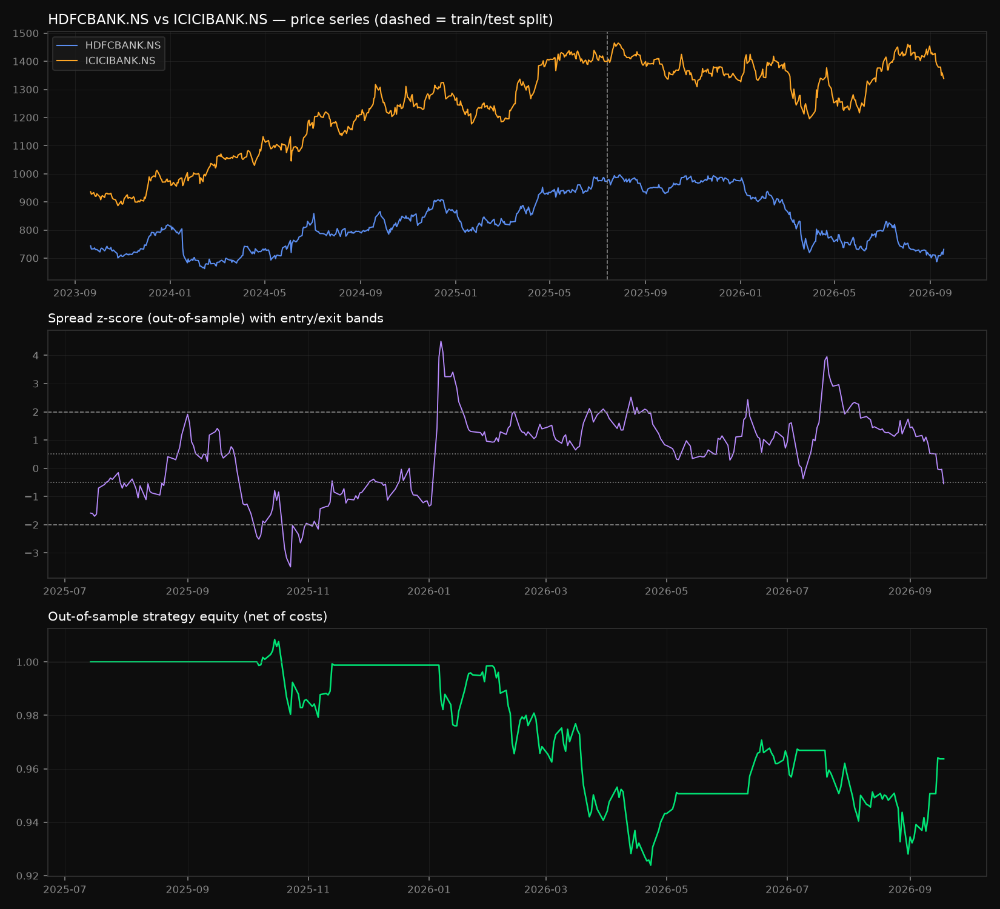

---

### AXISBANK.NS / ICICIBANK.NS

- **Latest prices:** AXISBANK.NS ₹1,257.00 · ICICIBANK.NS ₹1,338.90
- **Hedge ratio (train-fitted):** 0.9903
- **Cointegration (train):** FAIL at 5% — ADF -0.84, p=0.8061
- **Persistence:** passed 5% in 0 of 58 real-data runs (strict tier: 0/58)
- **Spread half-life:** 149.1 days
- **Current z-score:** -1.12
- **Signal today:** watch (approaching band)
- ⚠️ _Pair did not cointegrate on training data. Any signal here is not statistically justified — observation only._

**Out-of-sample backtest** (beta frozen from train window):

| Metric | Value |
|---|---|
| Sharpe | -0.32 |
| Sortino | -0.32 |
| Annualised return | -3.14% |
| Annualised vol | 8.77% |
| Max drawdown | -7.74% |
| Round-trip trades | 6 |

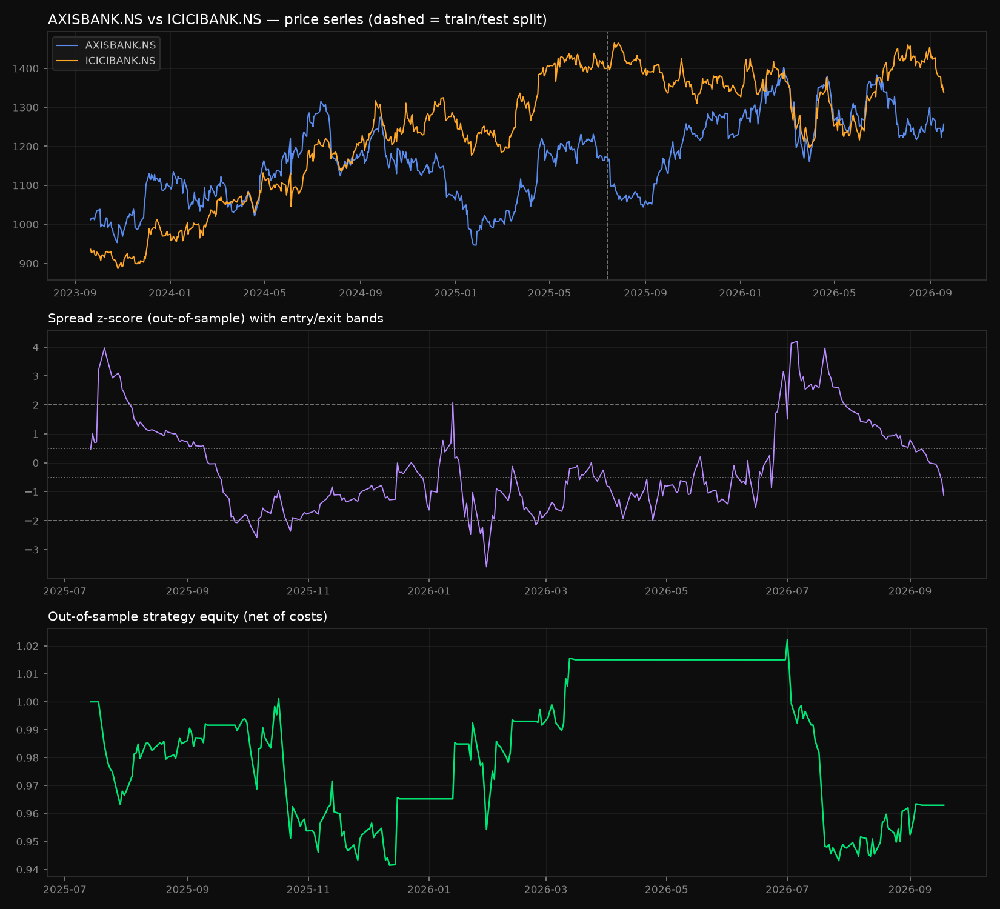

---

### KOTAKBANK.NS / HDFCBANK.NS

- **Latest prices:** KOTAKBANK.NS ₹412.50 · HDFCBANK.NS ₹731.00
- **Hedge ratio (train-fitted):** 2.1179
- **Cointegration (train):** FAIL at 5% — ADF -2.53, p=0.1087
- **Persistence:** passed 5% in 0 of 58 real-data runs (strict tier: 0/58)
- **Spread half-life:** 24.4 days
- **Current z-score:** -0.70
- **Signal today:** watch (approaching band)
- ⚠️ _Pair did not cointegrate on training data. Any signal here is not statistically justified — observation only._

**Out-of-sample backtest** (beta frozen from train window):

| Metric | Value |
|---|---|
| Sharpe | 0.93 |
| Sortino | 0.72 |
| Annualised return | 6.17% |
| Annualised vol | 6.70% |
| Max drawdown | -4.24% |
| Round-trip trades | 6 |

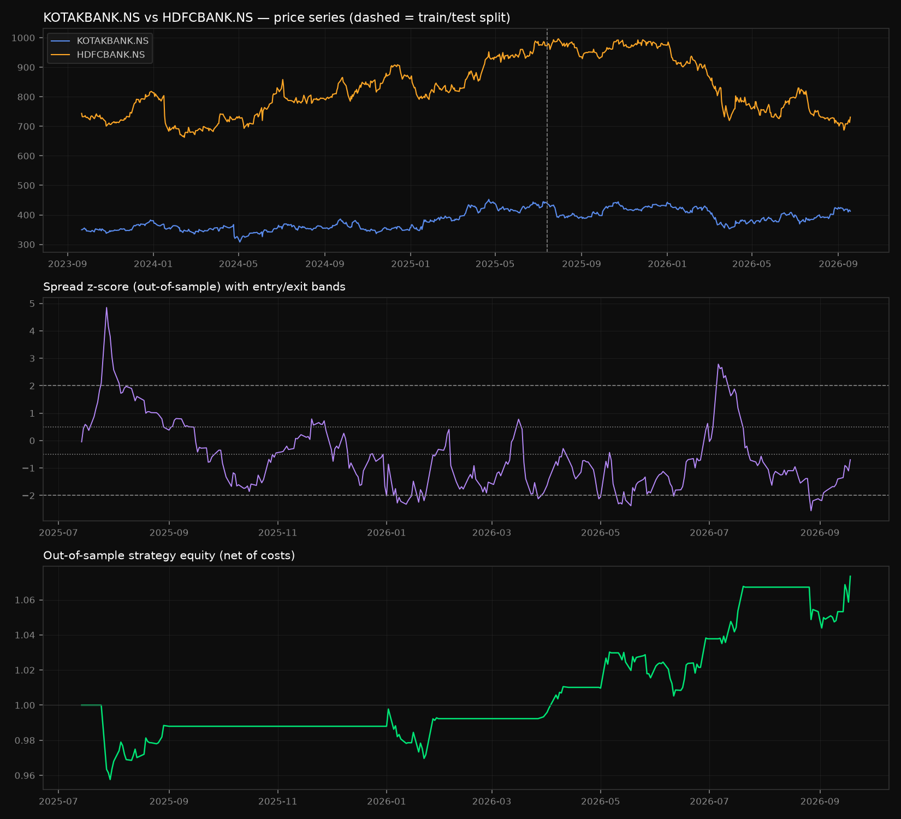

---

### SBIN.NS / BANKBARODA.NS

- **Latest prices:** SBIN.NS ₹996.20 · BANKBARODA.NS ₹234.94
- **Hedge ratio (train-fitted):** 0.1895
- **Cointegration (train):** FAIL at 5% — ADF -2.36, p=0.1533
- **Persistence:** passed 5% in 0 of 58 real-data runs (strict tier: 0/58)
- **Spread half-life:** 21.2 days
- **Current z-score:** -0.43
- **Signal today:** flat / no stretch
- ⚠️ _Pair did not cointegrate on training data. Any signal here is not statistically justified — observation only._

**Out-of-sample backtest** (beta frozen from train window):

| Metric | Value |
|---|---|
| Sharpe | 0.02 |
| Sortino | 0.02 |
| Annualised return | -0.21% |
| Annualised vol | 9.12% |
| Max drawdown | -8.76% |
| Round-trip trades | 5 |

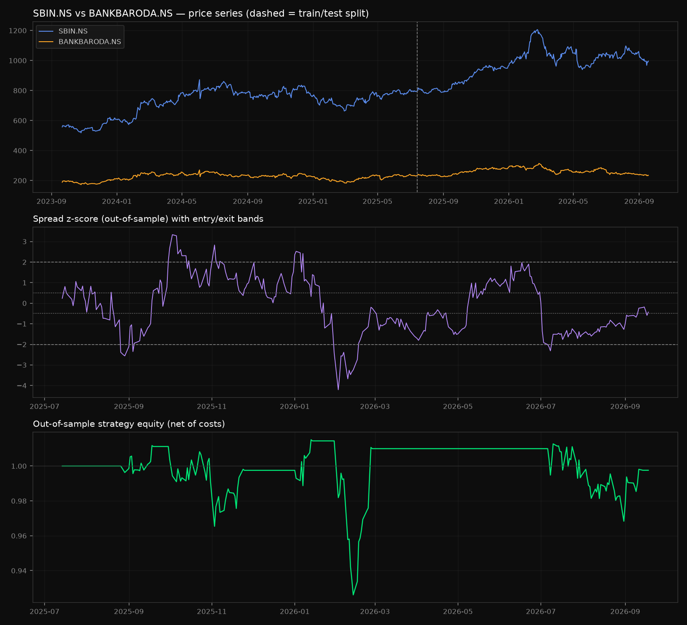

---

### TCS.NS / INFY.NS

- **Latest prices:** TCS.NS ₹2,105.00 · INFY.NS ₹1,051.40
- **Hedge ratio (train-fitted):** 0.4796
- **Cointegration (train):** FAIL at 5% — ADF -1.02, p=0.7475
- **Persistence:** passed 5% in 0 of 58 real-data runs (strict tier: 0/58)
- **Spread half-life:** 77.9 days
- **Current z-score:** +0.80
- **Signal today:** watch (approaching band)
- ⚠️ _Pair did not cointegrate on training data. Any signal here is not statistically justified — observation only._

**Out-of-sample backtest** (beta frozen from train window):

| Metric | Value |
|---|---|
| Sharpe | 2.41 |
| Sortino | 2.49 |
| Annualised return | 10.48% |
| Annualised vol | 4.18% |
| Max drawdown | -1.37% |
| Round-trip trades | 7 |

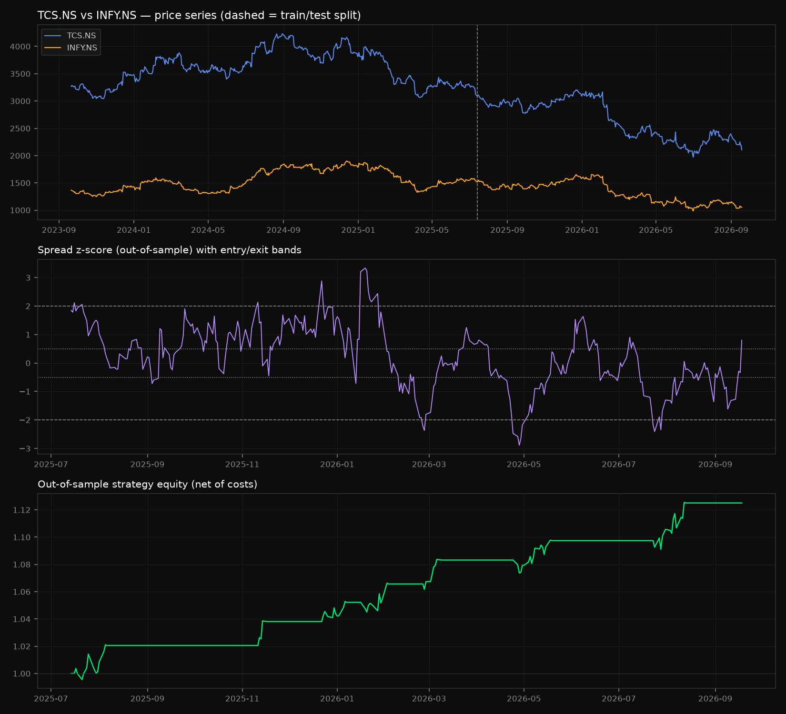

---

### INFY.NS / WIPRO.NS

- **Latest prices:** INFY.NS ₹1,051.40 · WIPRO.NS ₹166.83
- **Hedge ratio (train-fitted):** 0.1335
- **Cointegration (train):** FAIL at 5% — ADF -2.28, p=0.1800
- **Persistence:** passed 5% in 0 of 58 real-data runs (strict tier: 0/58)
- **Spread half-life:** 30.4 days
- **Current z-score:** -1.10
- **Signal today:** watch (approaching band)
- ⚠️ _Pair did not cointegrate on training data. Any signal here is not statistically justified — observation only._

**Out-of-sample backtest** (beta frozen from train window):

| Metric | Value |
|---|---|
| Sharpe | 1.68 |
| Sortino | 1.96 |
| Annualised return | 8.89% |
| Annualised vol | 5.14% |
| Max drawdown | -2.37% |
| Round-trip trades | 6 |

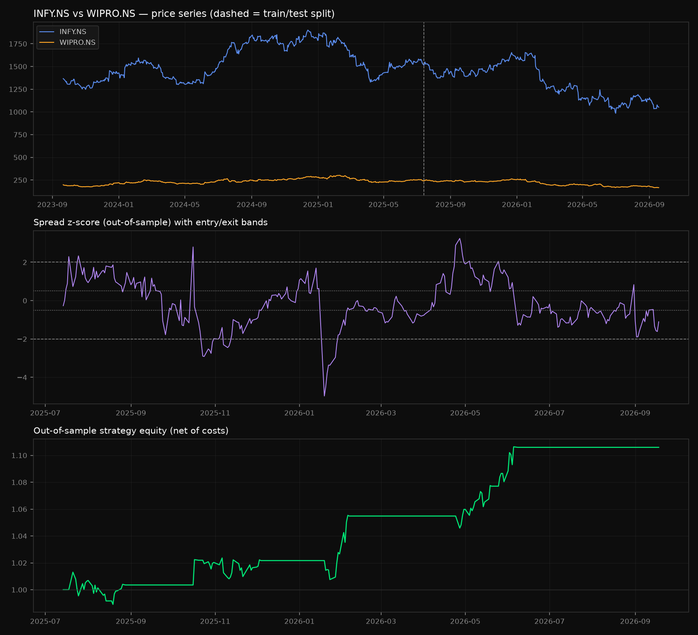

---

### HCLTECH.NS / TECHM.NS

- **Latest prices:** HCLTECH.NS ₹1,249.30 · TECHM.NS ₹1,537.10
- **Hedge ratio (train-fitted):** 0.9143
- **Cointegration (train):** FAIL at 5% — ADF -2.30, p=0.1709
- **Persistence:** passed 5% in 0 of 58 real-data runs (strict tier: 0/58)
- **Spread half-life:** 22.5 days
- **Current z-score:** -0.56
- **Signal today:** watch (approaching band)
- ⚠️ _Pair did not cointegrate on training data. Any signal here is not statistically justified — observation only._

**Out-of-sample backtest** (beta frozen from train window):

| Metric | Value |
|---|---|
| Sharpe | -0.02 |
| Sortino | -0.02 |
| Annualised return | -0.36% |
| Annualised vol | 7.03% |
| Max drawdown | -7.91% |
| Round-trip trades | 5 |

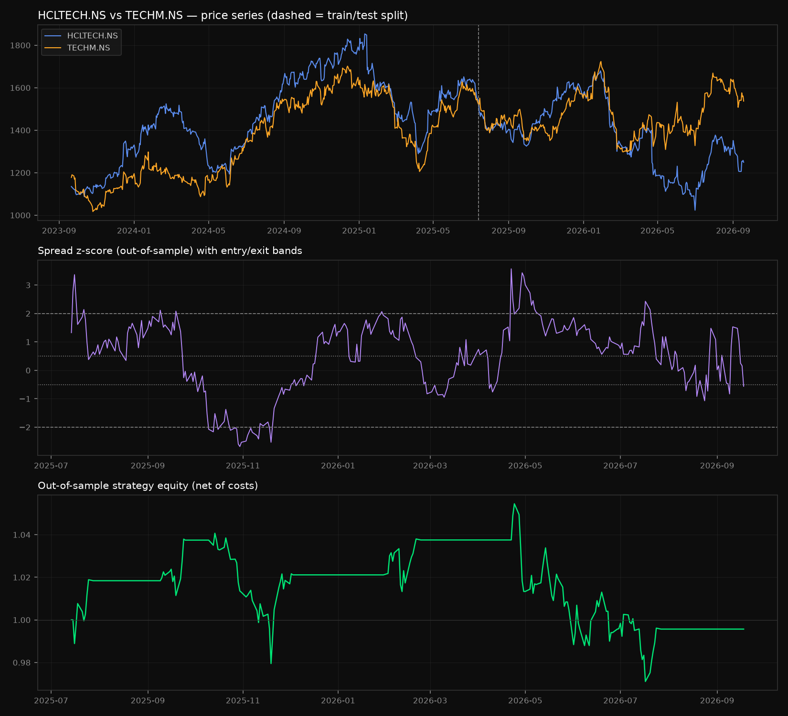

---

### ACC.NS / AMBUJACEM.NS

- **Latest prices:** ACC.NS ₹1,259.70 · AMBUJACEM.NS ₹388.30
- **Hedge ratio (train-fitted):** 0.1945
- **Cointegration (train):** FAIL at 5% — ADF -1.65, p=0.4582
- **Persistence:** passed 5% in 0 of 58 real-data runs (strict tier: 0/58)
- **Spread half-life:** 55.8 days
- **Current z-score:** -2.29
- **Signal today:** LONG spread (long AMBUJACEM.NS, short ACC.NS)
- ⚠️ _Pair did not cointegrate on training data. Any signal here is not statistically justified — observation only._

**Out-of-sample backtest** (beta frozen from train window):

| Metric | Value |
|---|---|
| Sharpe | 0.24 |
| Sortino | 0.18 |
| Annualised return | 1.25% |
| Annualised vol | 6.08% |
| Max drawdown | -4.74% |
| Round-trip trades | 4 |

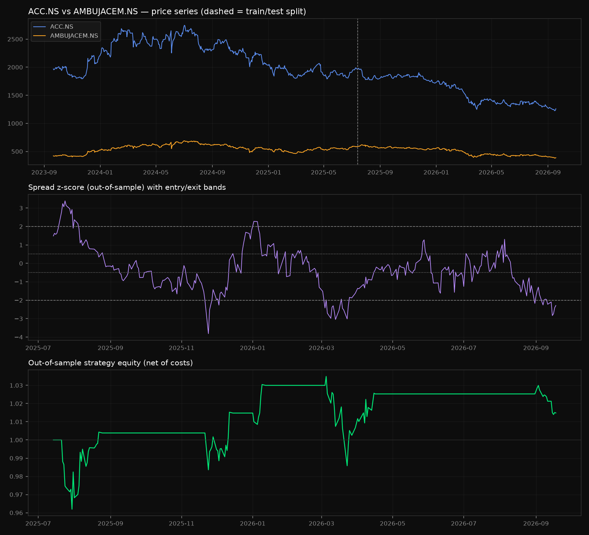

---

### ULTRACEMCO.NS / SHREECEM.NS

- **Latest prices:** ULTRACEMCO.NS ₹11,014.00 · SHREECEM.NS ₹22,600.00
- **Hedge ratio (train-fitted):** 0.7584
- **Cointegration (train):** FAIL at 5% — ADF -2.15, p=0.2238
- **Persistence:** passed 5% in 0 of 58 real-data runs (strict tier: 0/58)
- **Spread half-life:** 42.1 days
- **Current z-score:** -1.55
- **Signal today:** watch (approaching band)
- ⚠️ _Pair did not cointegrate on training data. Any signal here is not statistically justified — observation only._

**Out-of-sample backtest** (beta frozen from train window):

| Metric | Value |
|---|---|
| Sharpe | 0.14 |
| Sortino | 0.16 |
| Annualised return | 0.79% |
| Annualised vol | 7.25% |
| Max drawdown | -7.88% |
| Round-trip trades | 5 |

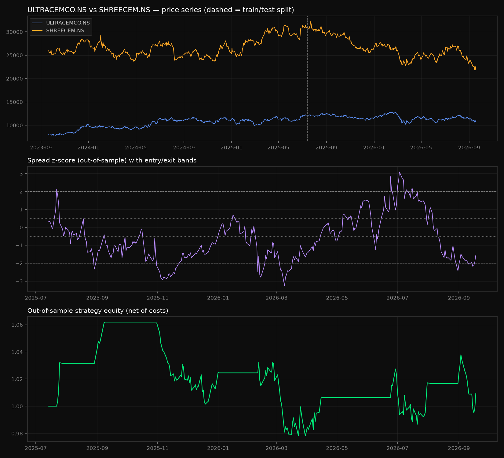

---

### IOC.NS / BPCL.NS

- **Latest prices:** IOC.NS ₹137.00 · BPCL.NS ₹314.00
- **Hedge ratio (train-fitted):** 1.7330
- **Cointegration (train):** FAIL at 5% — ADF -0.59, p=0.8739
- **Persistence:** passed 5% in 0 of 58 real-data runs (strict tier: 0/58)
- **Spread half-life:** 199.8 days
- **Current z-score:** +0.62
- **Signal today:** watch (approaching band)
- ⚠️ _Pair did not cointegrate on training data. Any signal here is not statistically justified — observation only._

**Out-of-sample backtest** (beta frozen from train window):

| Metric | Value |
|---|---|
| Sharpe | 0.31 |
| Sortino | 0.31 |
| Annualised return | 1.73% |
| Annualised vol | 6.06% |
| Max drawdown | -6.36% |
| Round-trip trades | 6 |

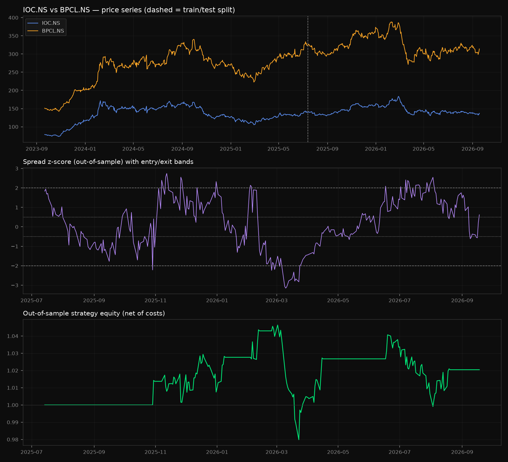

---

### BPCL.NS / HINDPETRO.NS

- **Latest prices:** BPCL.NS ₹314.00 · HINDPETRO.NS ₹359.00
- **Hedge ratio (train-fitted):** 1.3465
- **Cointegration (train):** FAIL at 5% — ADF -2.03, p=0.2752
- **Persistence:** passed 5% in 0 of 58 real-data runs (strict tier: 0/58)
- **Spread half-life:** 38.0 days
- **Current z-score:** -1.07
- **Signal today:** watch (approaching band)
- ⚠️ _Pair did not cointegrate on training data. Any signal here is not statistically justified — observation only._

**Out-of-sample backtest** (beta frozen from train window):

| Metric | Value |
|---|---|
| Sharpe | 0.06 |
| Sortino | 0.06 |
| Annualised return | 0.20% |
| Annualised vol | 5.70% |
| Max drawdown | -6.46% |
| Round-trip trades | 5 |

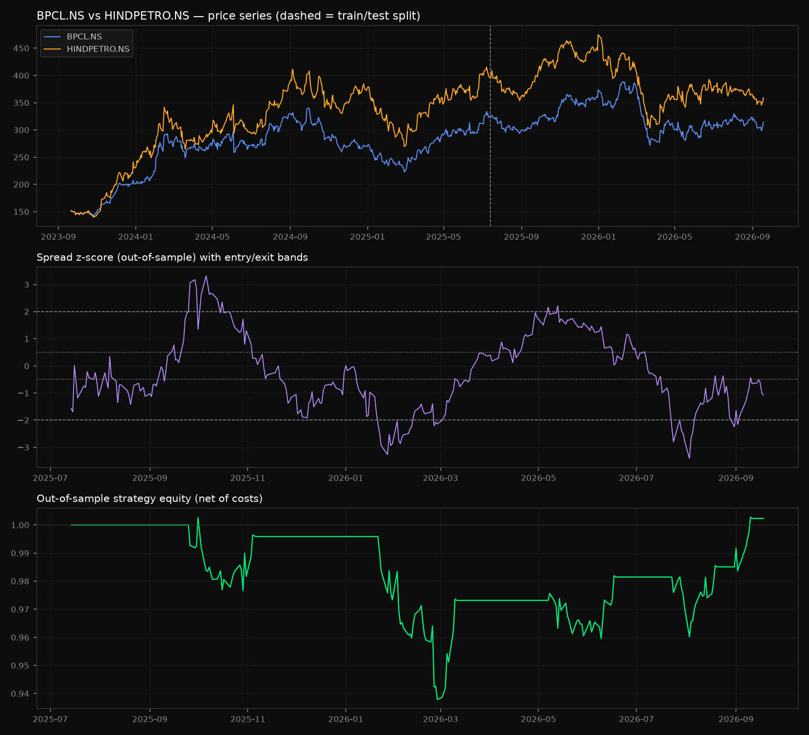

---

### ONGC.NS / COALINDIA.NS

- **Latest prices:** ONGC.NS ₹232.80 · COALINDIA.NS ₹409.90
- **Hedge ratio (train-fitted):** 1.4480
- **Cointegration (train):** PASS at 5% — ADF -3.39, p=0.0112
- **Persistence:** passed 5% in 50 of 58 real-data runs (strict tier: 1/58)
- **Spread half-life:** 12.1 days
- **Current z-score:** +0.47
- **Signal today:** flat / no stretch

**Out-of-sample backtest** (beta frozen from train window):

| Metric | Value |
|---|---|
| Sharpe | 0.76 |
| Sortino | 0.58 |
| Annualised return | 5.57% |
| Annualised vol | 7.47% |
| Max drawdown | -6.14% |
| Round-trip trades | 4 |

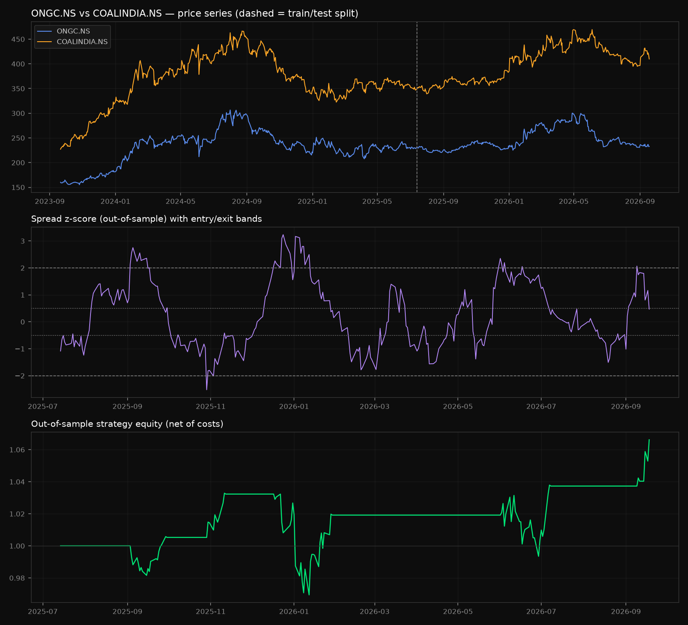

---

### NTPC.NS / POWERGRID.NS

- **Latest prices:** NTPC.NS ₹323.65 · POWERGRID.NS ₹270.30
- **Hedge ratio (train-fitted):** 0.8309
- **Cointegration (train):** FAIL at 5% — ADF -2.54, p=0.1062
- **Persistence:** passed 5% in 0 of 58 real-data runs (strict tier: 0/58)
- **Spread half-life:** 23.7 days
- **Current z-score:** +1.40
- **Signal today:** watch (approaching band)
- ⚠️ _Pair did not cointegrate on training data. Any signal here is not statistically justified — observation only._

**Out-of-sample backtest** (beta frozen from train window):

| Metric | Value |
|---|---|
| Sharpe | 0.43 |
| Sortino | 0.33 |
| Annualised return | 2.19% |
| Annualised vol | 5.45% |
| Max drawdown | -5.18% |
| Round-trip trades | 6 |

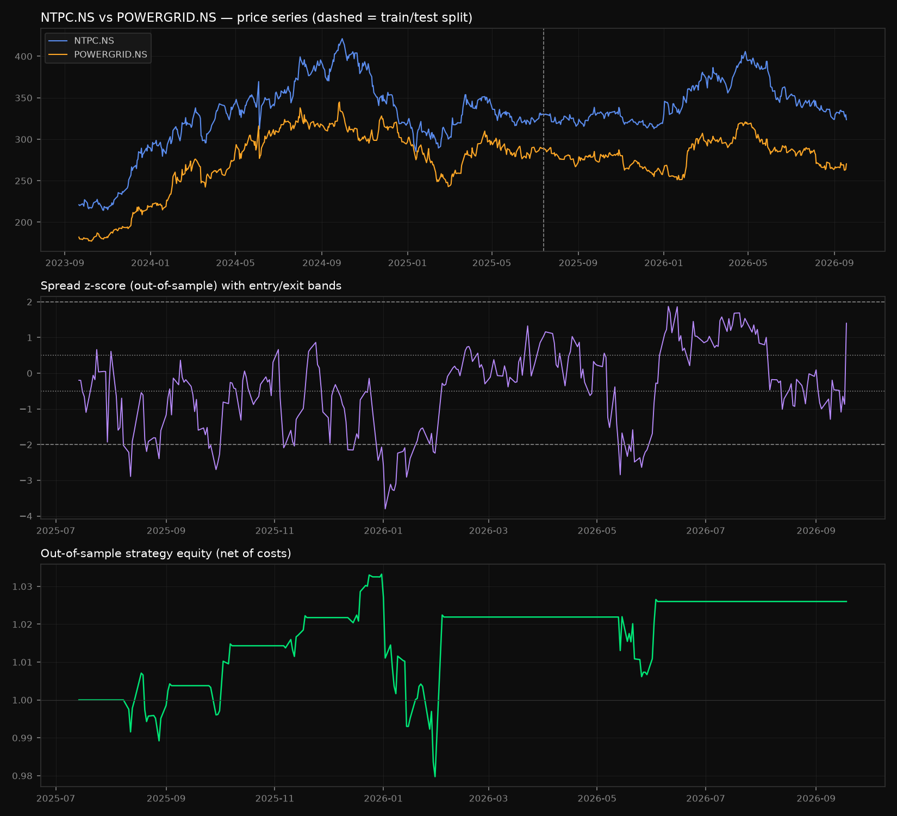

---

### BAJAJ-AUTO.NS / HEROMOTOCO.NS

- **Latest prices:** BAJAJ-AUTO.NS ₹11,414.00 · HEROMOTOCO.NS ₹5,285.50
- **Hedge ratio (train-fitted):** 0.4107
- **Cointegration (train):** FAIL at 5% — ADF -2.30, p=0.1726
- **Persistence:** passed 5% in 0 of 58 real-data runs (strict tier: 0/58)
- **Spread half-life:** 29.4 days
- **Current z-score:** -0.34
- **Signal today:** flat / no stretch
- ⚠️ _Pair did not cointegrate on training data. Any signal here is not statistically justified — observation only._

**Out-of-sample backtest** (beta frozen from train window):

| Metric | Value |
|---|---|
| Sharpe | -0.55 |
| Sortino | -0.59 |
| Annualised return | -6.48% |
| Annualised vol | 11.01% |
| Max drawdown | -21.29% |
| Round-trip trades | 6 |

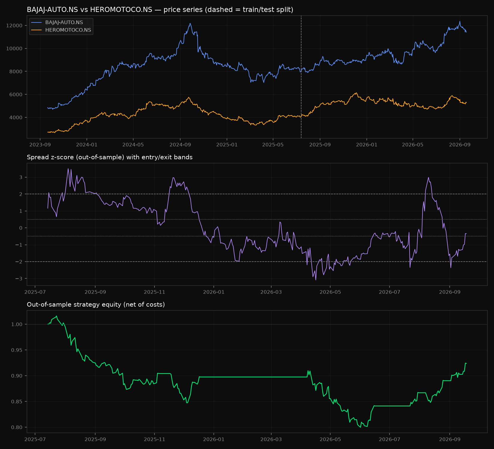

---

### TATASTEEL.NS / JSWSTEEL.NS

- **Latest prices:** TATASTEEL.NS ₹185.54 · JSWSTEEL.NS ₹1,275.60
- **Hedge ratio (train-fitted):** 3.1440
- **Cointegration (train):** FAIL at 5% — ADF -1.21, p=0.6713
- **Persistence:** passed 5% in 0 of 58 real-data runs (strict tier: 0/58)
- **Spread half-life:** 71.0 days
- **Current z-score:** +0.18
- **Signal today:** flat / no stretch
- ⚠️ _Pair did not cointegrate on training data. Any signal here is not statistically justified — observation only._

**Out-of-sample backtest** (beta frozen from train window):

| Metric | Value |
|---|---|
| Sharpe | 0.33 |
| Sortino | 0.28 |
| Annualised return | 2.26% |
| Annualised vol | 7.65% |
| Max drawdown | -5.48% |
| Round-trip trades | 5 |

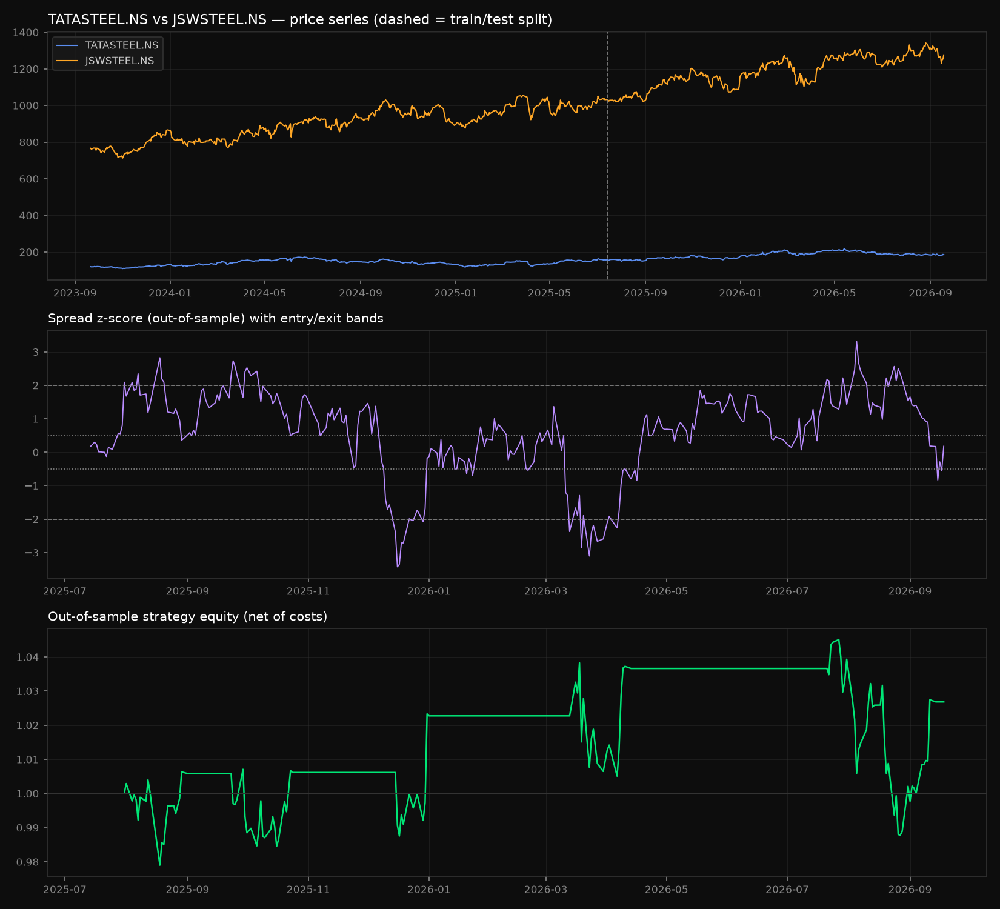

---

### SUNPHARMA.NS / CIPLA.NS

- **Latest prices:** SUNPHARMA.NS ₹1,837.30 · CIPLA.NS ₹1,394.50
- **Hedge ratio (train-fitted):** 0.5005
- **Cointegration (train):** PASS at 5% — ADF -3.37, p=0.0119
- **Persistence:** passed 5% in 58 of 58 real-data runs (strict tier: 5/58)
- **Spread half-life:** 10.8 days
- **Current z-score:** +0.23
- **Signal today:** flat / no stretch

**Out-of-sample backtest** (beta frozen from train window):

| Metric | Value |
|---|---|
| Sharpe | 0.06 |
| Sortino | 0.06 |
| Annualised return | 0.13% |
| Annualised vol | 7.84% |
| Max drawdown | -10.27% |
| Round-trip trades | 4 |

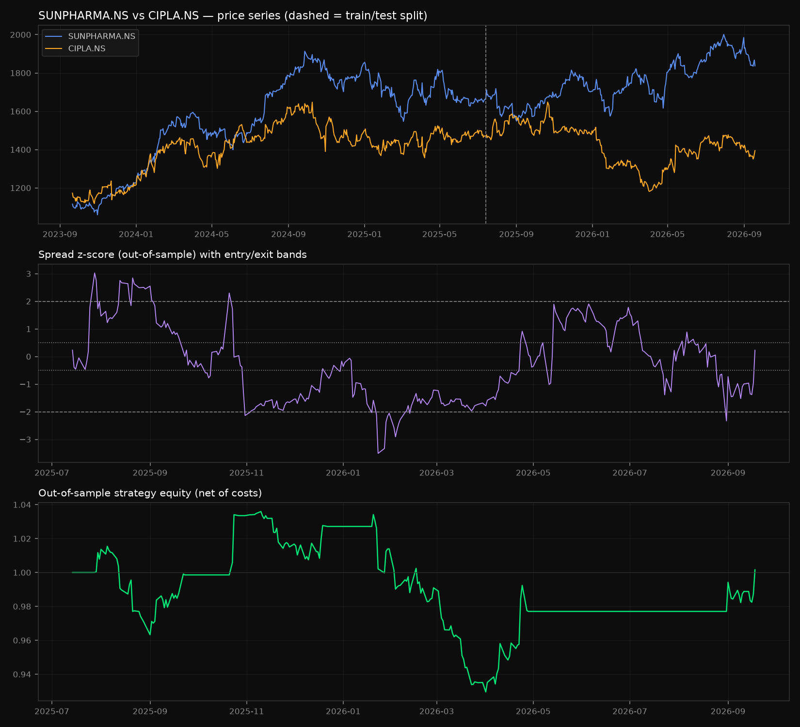

---

_Generated 2026-09-21 · pairs mean-reversion scanner · out-of-sample backtest · multiple-testing-aware · not investment advice._
