# Indian Pairs-Trading Scanner — 2026-09-22

> **What this is:** a market-neutral *pairs mean-reversion* scanner. It flags when two related NSE stocks have drifted apart far enough that their historical relationship signals a possible convergence trade. It does **not** forecast growth, rank "best" stocks, or predict company performance. A signal means the *spread between two stocks* is stretched — nothing about either stock being a good investment. Not investment advice; do your own research.

## Methodology (fixed in advance)

- **Universe:** 16 declared sector-mate pairs. Parameters (3y window, 60/40 train-test, z-entry 2.0, z-exit 0.5, 5 bps costs) are pre-registered; changes are logged in the README changelog *before* looking at results.
- **Multiple testing:** at the 5% level across 16 pairs, **≈0.8 false positives per run are expected by chance alone** even if nothing truly cointegrates. A single-day pass is a candidate, not a discovery.
- **Strict tier:** Bonferroni-corrected threshold p < 0.0031 (marked ✓✓).
- **Evidence = persistence:** the Persistence column counts how often each pair has passed the 5% test across all *real-data* daily runs recorded in `reports/history.csv`. Pairs deserve attention only when they pass persistently.

## Summary

| Pair | p-value | Coint. | Persistence | Current z | Signal | OOS Sharpe |
|---|---|---|---|---|---|---|
| HDFCBANK.NS/ICICIBANK.NS | 0.1084 | ✗ | 1/49 | -0.76 | watch | -0.43 |
| AXISBANK.NS/ICICIBANK.NS | 0.8292 | ✗ | 0/59 | -0.97 | watch | -0.32 |
| KOTAKBANK.NS/HDFCBANK.NS | 0.1083 | ✗ | 0/59 | -0.55 | watch | 0.97 |
| SBIN.NS/BANKBARODA.NS | 0.1435 | ✗ | 0/59 | -0.19 | flat / no stretch | 0.02 |
| TCS.NS/INFY.NS | 0.7518 | ✗ | 0/59 | +0.05 | flat / no stretch | 2.42 |
| INFY.NS/WIPRO.NS | 0.1626 | ✗ | 0/59 | -0.31 | flat / no stretch | 1.68 |
| HCLTECH.NS/TECHM.NS | 0.2044 | ✗ | 0/59 | -0.76 | watch | 0.11 |
| ACC.NS/AMBUJACEM.NS | 0.4747 | ✗ | 0/59 | -1.76 | watch | 0.27 |
| ULTRACEMCO.NS/SHREECEM.NS | 0.2344 | ✗ | 0/59 | -1.68 | watch | 0.05 |
| IOC.NS/BPCL.NS | 0.8836 | ✗ | 0/59 | +0.21 | flat / no stretch | 0.31 |
| BPCL.NS/HINDPETRO.NS | 0.2703 | ✗ | 0/59 | -0.80 | watch | 0.06 |
| ONGC.NS/COALINDIA.NS | 0.0123 | ✓ | 51/59 | +1.76 | watch | 0.76 |
| NTPC.NS/POWERGRID.NS | 0.1049 | ✗ | 0/59 | -0.15 | flat / no stretch | 0.43 |
| BAJAJ-AUTO.NS/HEROMOTOCO.NS | 0.1748 | ✗ | 0/59 | +0.20 | flat / no stretch | -0.54 |
| TATASTEEL.NS/JSWSTEEL.NS | 0.6762 | ✗ | 0/59 | -0.07 | flat / no stretch | 0.33 |
| SUNPHARMA.NS/CIPLA.NS | 0.0113 | ✓ | 59/59 | -0.24 | flat / no stretch | 0.05 |

_Legend: ✓✓ passes strict Bonferroni tier · ✓ passes 5% only · ✗ fails. Persistence = 5%-passes / real-data runs recorded. \*no real-data history yet._

---

### HDFCBANK.NS / ICICIBANK.NS

- **Latest prices:** HDFCBANK.NS ₹738.60 · ICICIBANK.NS ₹1,339.60
- **Hedge ratio (train-fitted):** 1.6720
- **Cointegration (train):** FAIL at 5% — ADF -2.53, p=0.1084
- **Persistence:** passed 5% in 1 of 49 real-data runs (strict tier: 0/49)
- **Spread half-life:** 26.7 days
- **Current z-score:** -0.76
- **Signal today:** watch (approaching band)
- ⚠️ _Pair did not cointegrate on training data. Any signal here is not statistically justified — observation only._

**Out-of-sample backtest** (beta frozen from train window):

| Metric | Value |
|---|---|
| Sharpe | -0.43 |
| Sortino | -0.47 |
| Annualised return | -3.04% |
| Annualised vol | 6.64% |
| Max drawdown | -8.31% |
| Round-trip trades | 4 |

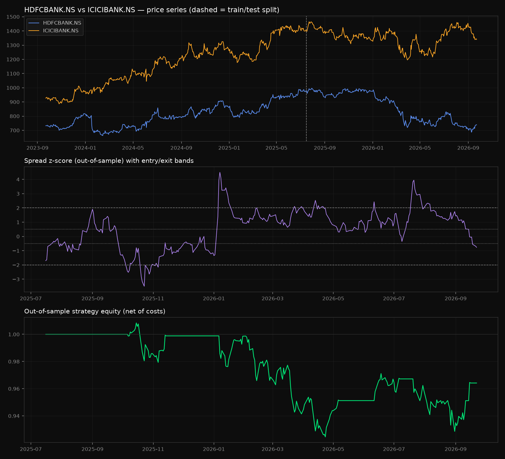

---

### AXISBANK.NS / ICICIBANK.NS

- **Latest prices:** AXISBANK.NS ₹1,242.70 · ICICIBANK.NS ₹1,339.60
- **Hedge ratio (train-fitted):** 0.9923
- **Cointegration (train):** FAIL at 5% — ADF -0.77, p=0.8292
- **Persistence:** passed 5% in 0 of 59 real-data runs (strict tier: 0/59)
- **Spread half-life:** 154.2 days
- **Current z-score:** -0.97
- **Signal today:** watch (approaching band)
- ⚠️ _Pair did not cointegrate on training data. Any signal here is not statistically justified — observation only._

**Out-of-sample backtest** (beta frozen from train window):

| Metric | Value |
|---|---|
| Sharpe | -0.32 |
| Sortino | -0.32 |
| Annualised return | -3.14% |
| Annualised vol | 8.78% |
| Max drawdown | -7.75% |
| Round-trip trades | 6 |

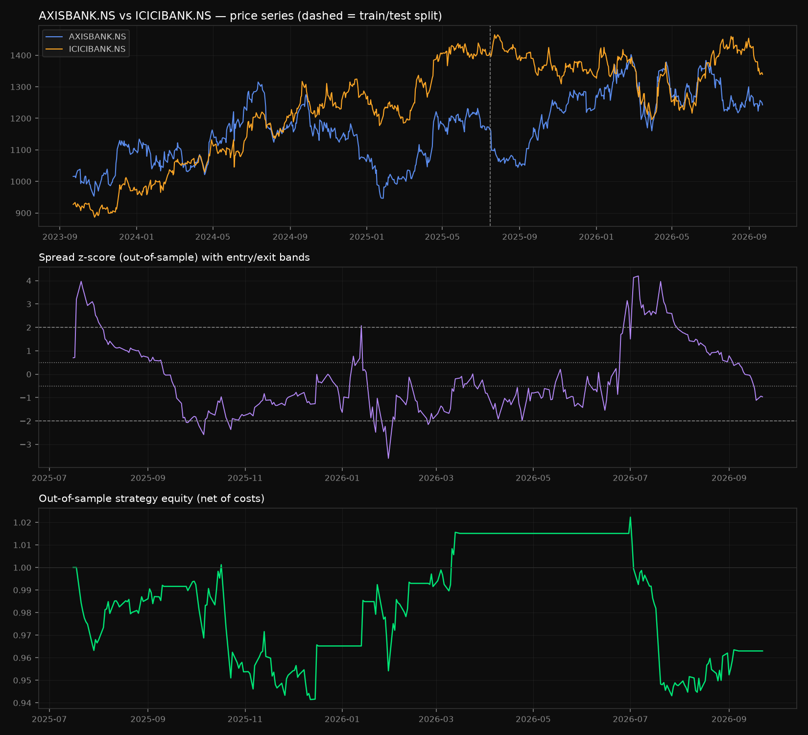

---

### KOTAKBANK.NS / HDFCBANK.NS

- **Latest prices:** KOTAKBANK.NS ₹412.65 · HDFCBANK.NS ₹738.60
- **Hedge ratio (train-fitted):** 2.1253
- **Cointegration (train):** FAIL at 5% — ADF -2.53, p=0.1083
- **Persistence:** passed 5% in 0 of 59 real-data runs (strict tier: 0/59)
- **Spread half-life:** 24.4 days
- **Current z-score:** -0.55
- **Signal today:** watch (approaching band)
- ⚠️ _Pair did not cointegrate on training data. Any signal here is not statistically justified — observation only._

**Out-of-sample backtest** (beta frozen from train window):

| Metric | Value |
|---|---|
| Sharpe | 0.97 |
| Sortino | 0.75 |
| Annualised return | 6.51% |
| Annualised vol | 6.72% |
| Max drawdown | -4.25% |
| Round-trip trades | 6 |

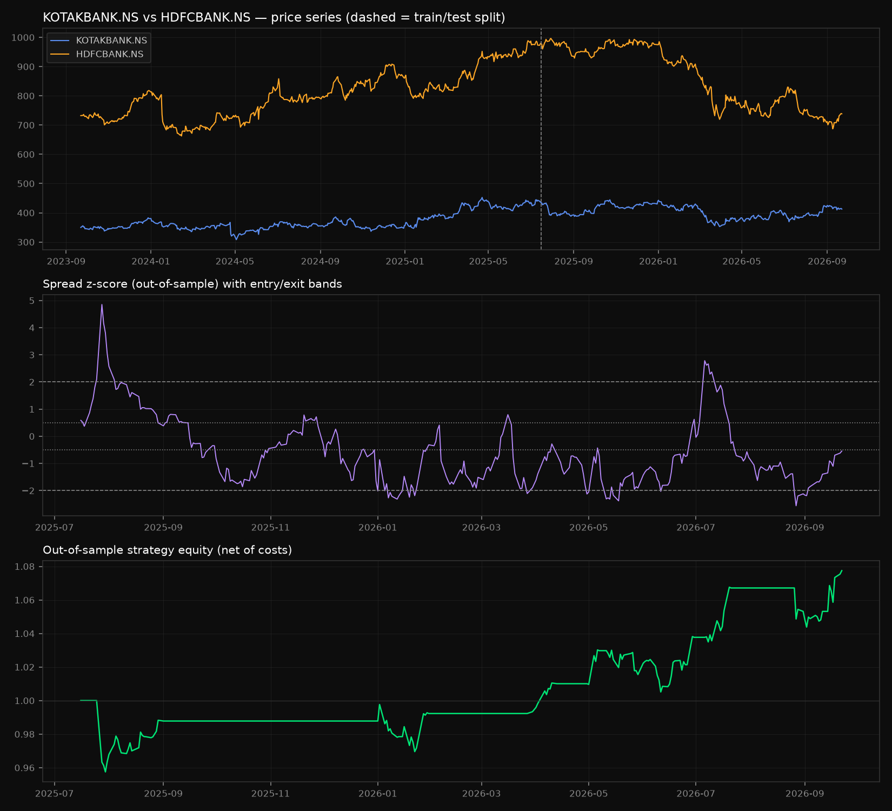

---

### SBIN.NS / BANKBARODA.NS

- **Latest prices:** SBIN.NS ₹987.00 · BANKBARODA.NS ₹234.35
- **Hedge ratio (train-fitted):** 0.1894
- **Cointegration (train):** FAIL at 5% — ADF -2.39, p=0.1435
- **Persistence:** passed 5% in 0 of 59 real-data runs (strict tier: 0/59)
- **Spread half-life:** 21.1 days
- **Current z-score:** -0.19
- **Signal today:** flat / no stretch
- ⚠️ _Pair did not cointegrate on training data. Any signal here is not statistically justified — observation only._

**Out-of-sample backtest** (beta frozen from train window):

| Metric | Value |
|---|---|
| Sharpe | 0.02 |
| Sortino | 0.02 |
| Annualised return | -0.19% |
| Annualised vol | 8.85% |
| Max drawdown | -8.50% |
| Round-trip trades | 5 |

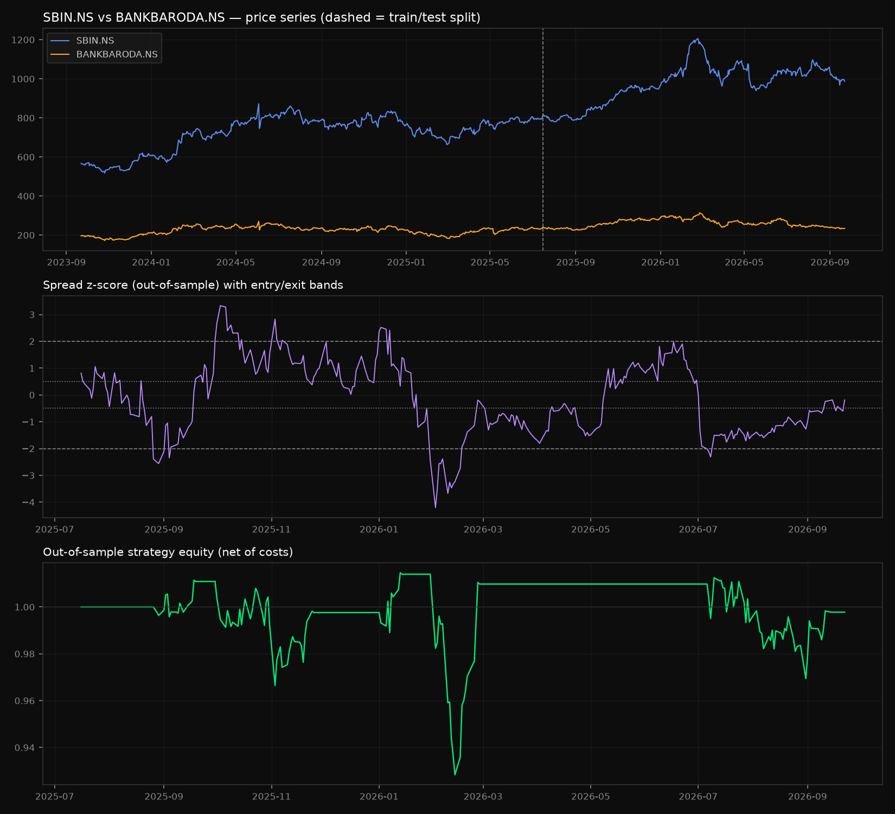

---

### TCS.NS / INFY.NS

- **Latest prices:** TCS.NS ₹2,105.00 · INFY.NS ₹1,029.40
- **Hedge ratio (train-fitted):** 0.4744
- **Cointegration (train):** FAIL at 5% — ADF -1.00, p=0.7518
- **Persistence:** passed 5% in 0 of 59 real-data runs (strict tier: 0/59)
- **Spread half-life:** 77.4 days
- **Current z-score:** +0.05
- **Signal today:** flat / no stretch
- ⚠️ _Pair did not cointegrate on training data. Any signal here is not statistically justified — observation only._

**Out-of-sample backtest** (beta frozen from train window):

| Metric | Value |
|---|---|
| Sharpe | 2.42 |
| Sortino | 2.60 |
| Annualised return | 9.72% |
| Annualised vol | 3.87% |
| Max drawdown | -1.34% |
| Round-trip trades | 7 |

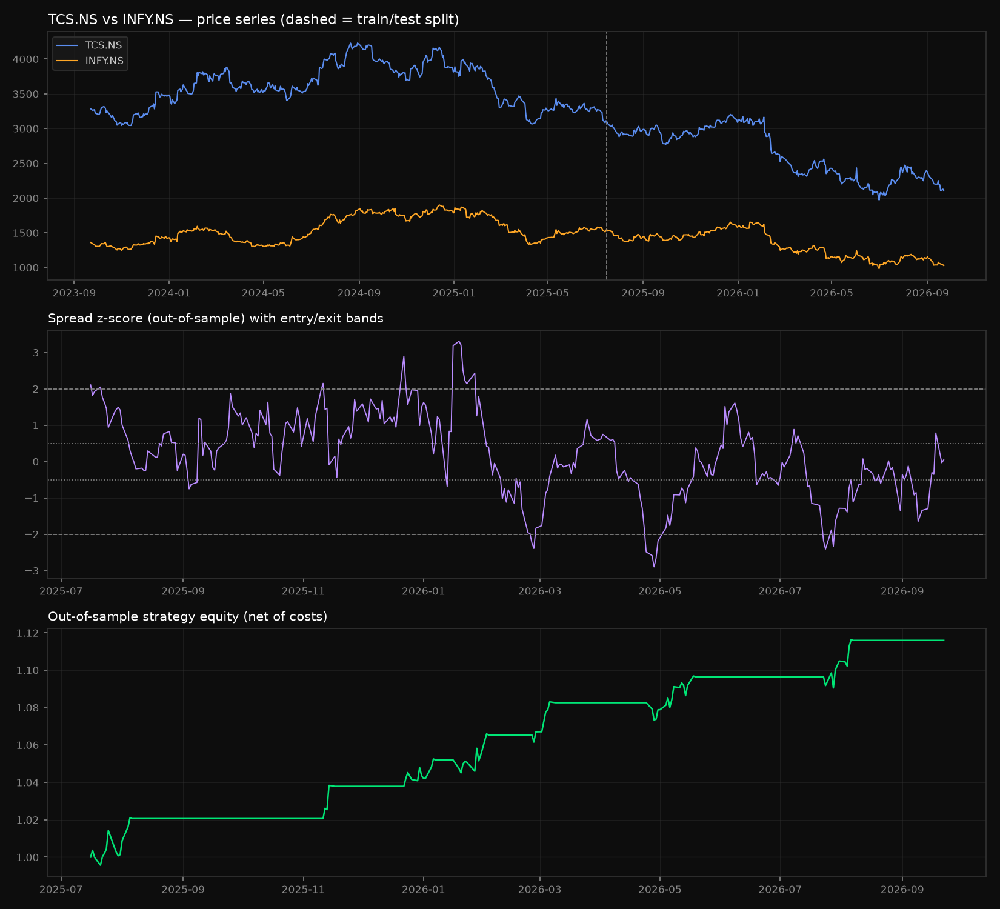

---

### INFY.NS / WIPRO.NS

- **Latest prices:** INFY.NS ₹1,029.40 · WIPRO.NS ₹166.00
- **Hedge ratio (train-fitted):** 0.1333
- **Cointegration (train):** FAIL at 5% — ADF -2.33, p=0.1626
- **Persistence:** passed 5% in 0 of 59 real-data runs (strict tier: 0/59)
- **Spread half-life:** 29.8 days
- **Current z-score:** -0.31
- **Signal today:** flat / no stretch
- ⚠️ _Pair did not cointegrate on training data. Any signal here is not statistically justified — observation only._

**Out-of-sample backtest** (beta frozen from train window):

| Metric | Value |
|---|---|
| Sharpe | 1.68 |
| Sortino | 1.96 |
| Annualised return | 8.64% |
| Annualised vol | 5.00% |
| Max drawdown | -2.29% |
| Round-trip trades | 6 |

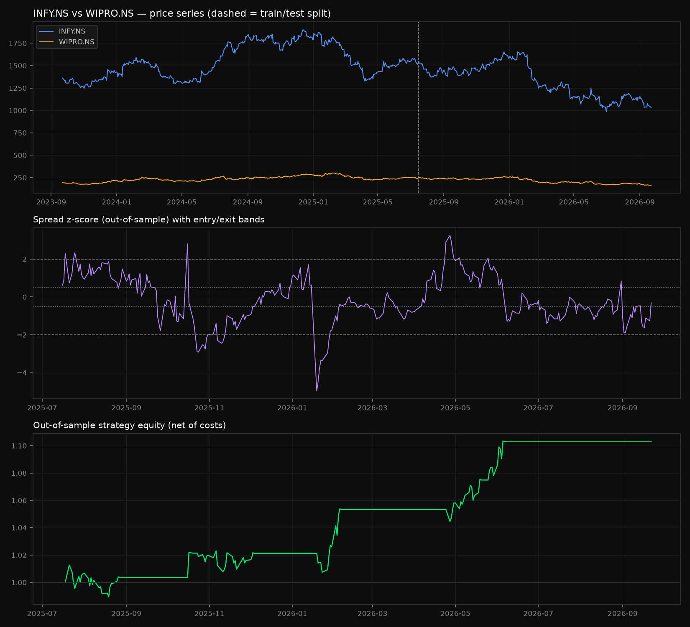

---

### HCLTECH.NS / TECHM.NS

- **Latest prices:** HCLTECH.NS ₹1,270.40 · TECHM.NS ₹1,551.60
- **Hedge ratio (train-fitted):** 0.9172
- **Cointegration (train):** FAIL at 5% — ADF -2.21, p=0.2044
- **Persistence:** passed 5% in 0 of 59 real-data runs (strict tier: 0/59)
- **Spread half-life:** 22.9 days
- **Current z-score:** -0.76
- **Signal today:** watch (approaching band)
- ⚠️ _Pair did not cointegrate on training data. Any signal here is not statistically justified — observation only._

**Out-of-sample backtest** (beta frozen from train window):

| Metric | Value |
|---|---|
| Sharpe | 0.11 |
| Sortino | 0.10 |
| Annualised return | 0.50% |
| Annualised vol | 6.99% |
| Max drawdown | -7.95% |
| Round-trip trades | 5 |

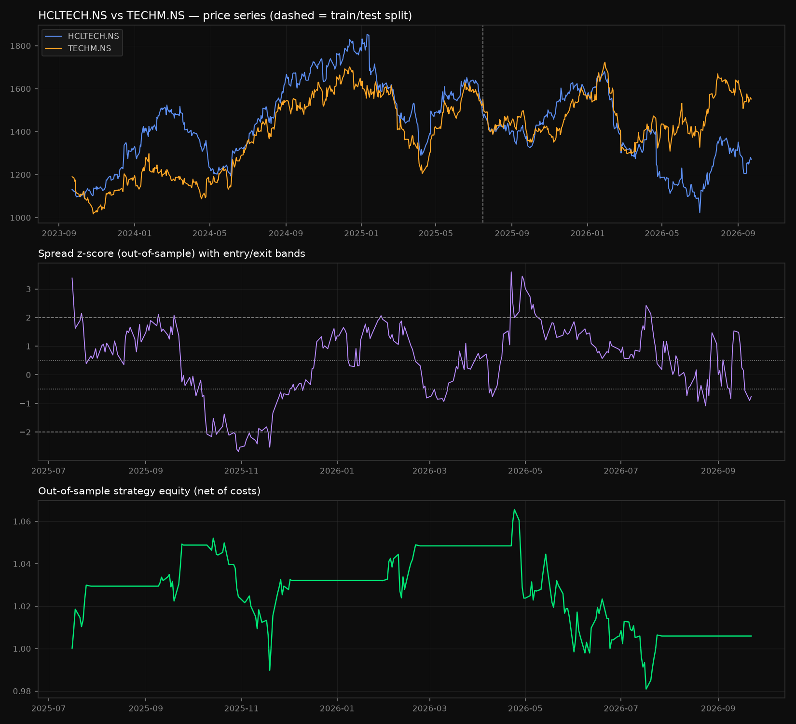

---

### ACC.NS / AMBUJACEM.NS

- **Latest prices:** ACC.NS ₹1,238.20 · AMBUJACEM.NS ₹386.90
- **Hedge ratio (train-fitted):** 0.1929
- **Cointegration (train):** FAIL at 5% — ADF -1.62, p=0.4747
- **Persistence:** passed 5% in 0 of 59 real-data runs (strict tier: 0/59)
- **Spread half-life:** 56.6 days
- **Current z-score:** -1.76
- **Signal today:** watch (approaching band)
- ⚠️ _Pair did not cointegrate on training data. Any signal here is not statistically justified — observation only._

**Out-of-sample backtest** (beta frozen from train window):

| Metric | Value |
|---|---|
| Sharpe | 0.27 |
| Sortino | 0.21 |
| Annualised return | 1.49% |
| Annualised vol | 6.06% |
| Max drawdown | -4.75% |
| Round-trip trades | 4 |

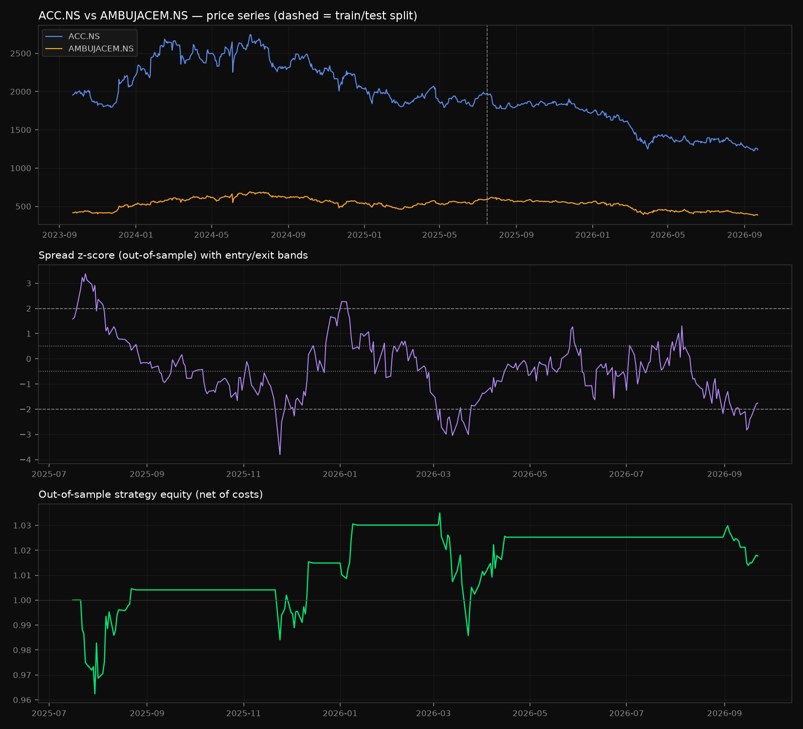

---

### ULTRACEMCO.NS / SHREECEM.NS

- **Latest prices:** ULTRACEMCO.NS ₹11,000.00 · SHREECEM.NS ₹22,200.00
- **Hedge ratio (train-fitted):** 0.7816
- **Cointegration (train):** FAIL at 5% — ADF -2.13, p=0.2344
- **Persistence:** passed 5% in 0 of 59 real-data runs (strict tier: 0/59)
- **Spread half-life:** 42.1 days
- **Current z-score:** -1.68
- **Signal today:** watch (approaching band)
- ⚠️ _Pair did not cointegrate on training data. Any signal here is not statistically justified — observation only._

**Out-of-sample backtest** (beta frozen from train window):

| Metric | Value |
|---|---|
| Sharpe | 0.05 |
| Sortino | 0.05 |
| Annualised return | 0.07% |
| Annualised vol | 7.20% |
| Max drawdown | -7.74% |
| Round-trip trades | 5 |

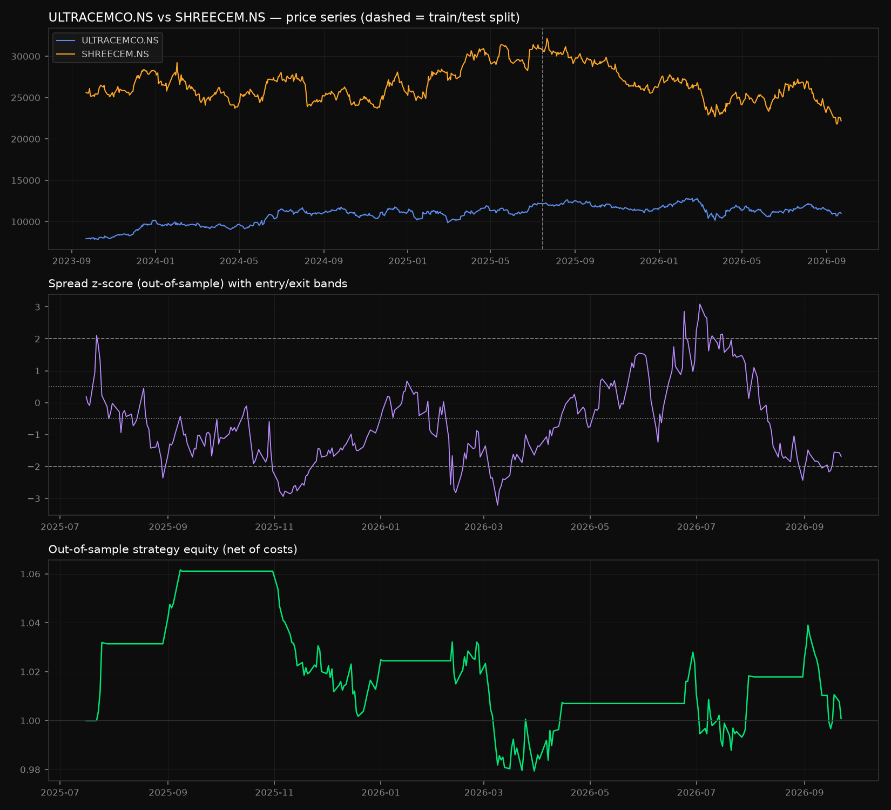

---

### IOC.NS / BPCL.NS

- **Latest prices:** IOC.NS ₹137.80 · BPCL.NS ₹313.60
- **Hedge ratio (train-fitted):** 1.7326
- **Cointegration (train):** FAIL at 5% — ADF -0.54, p=0.8836
- **Persistence:** passed 5% in 0 of 59 real-data runs (strict tier: 0/59)
- **Spread half-life:** 218.5 days
- **Current z-score:** +0.21
- **Signal today:** flat / no stretch
- ⚠️ _Pair did not cointegrate on training data. Any signal here is not statistically justified — observation only._

**Out-of-sample backtest** (beta frozen from train window):

| Metric | Value |
|---|---|
| Sharpe | 0.31 |
| Sortino | 0.31 |
| Annualised return | 1.71% |
| Annualised vol | 6.00% |
| Max drawdown | -6.29% |
| Round-trip trades | 6 |

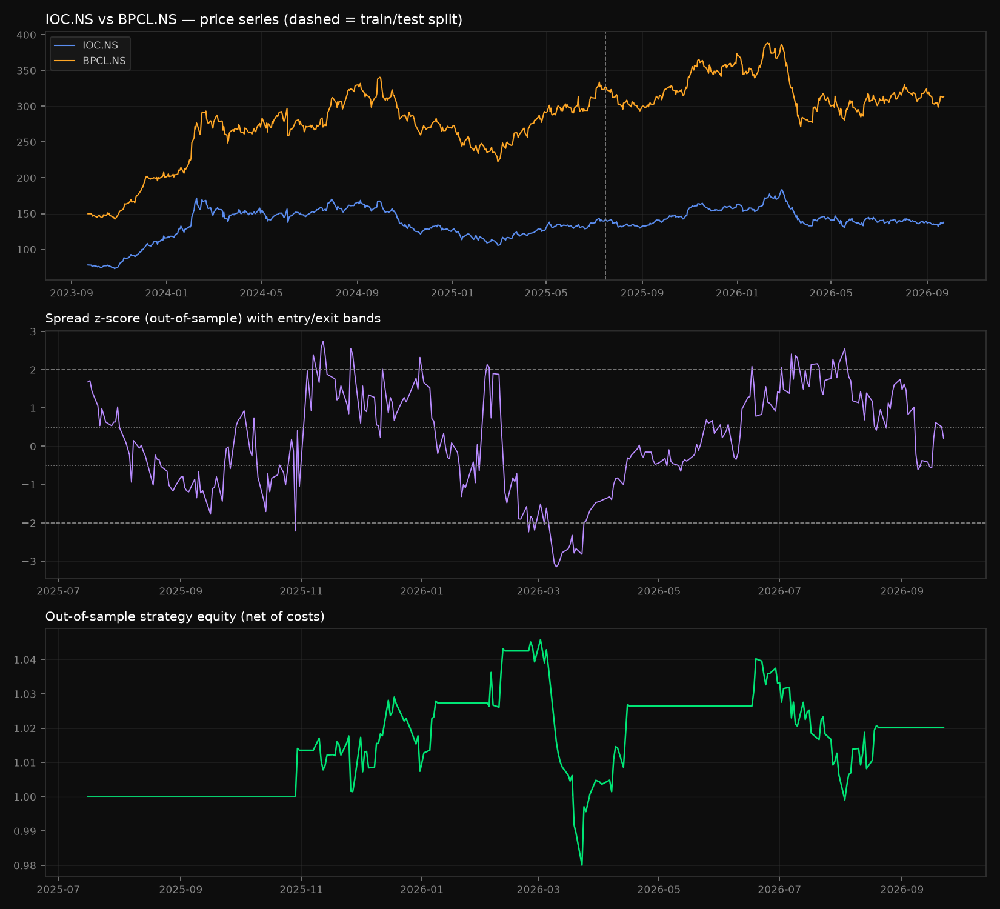

---

### BPCL.NS / HINDPETRO.NS

- **Latest prices:** BPCL.NS ₹313.60 · HINDPETRO.NS ₹360.70
- **Hedge ratio (train-fitted):** 1.3454
- **Cointegration (train):** FAIL at 5% — ADF -2.04, p=0.2703
- **Persistence:** passed 5% in 0 of 59 real-data runs (strict tier: 0/59)
- **Spread half-life:** 37.8 days
- **Current z-score:** -0.80
- **Signal today:** watch (approaching band)
- ⚠️ _Pair did not cointegrate on training data. Any signal here is not statistically justified — observation only._

**Out-of-sample backtest** (beta frozen from train window):

| Metric | Value |
|---|---|
| Sharpe | 0.06 |
| Sortino | 0.06 |
| Annualised return | 0.19% |
| Annualised vol | 5.57% |
| Max drawdown | -6.32% |
| Round-trip trades | 5 |

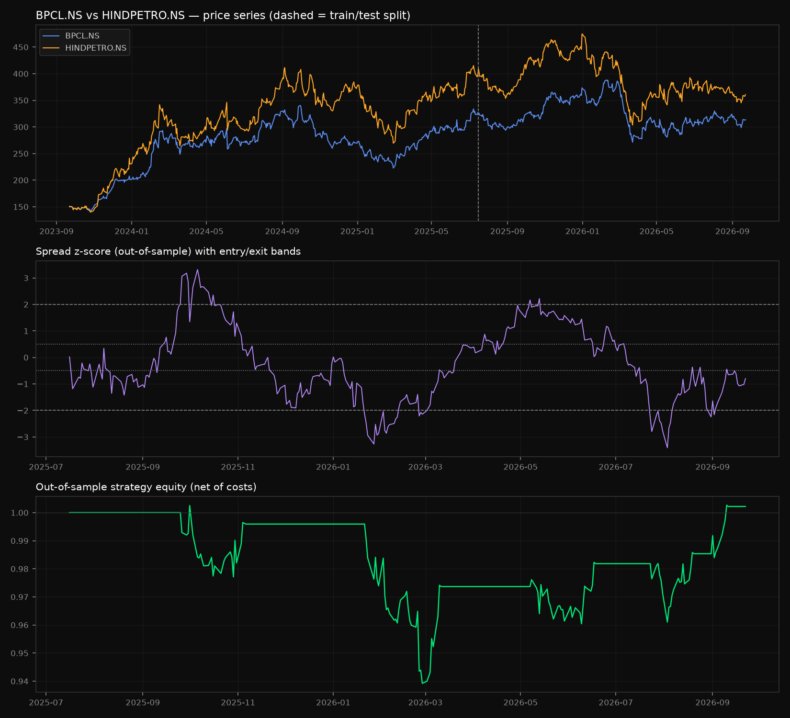

---

### ONGC.NS / COALINDIA.NS

- **Latest prices:** ONGC.NS ₹236.13 · COALINDIA.NS ₹428.00
- **Hedge ratio (train-fitted):** 1.4434
- **Cointegration (train):** PASS at 5% — ADF -3.36, p=0.0123
- **Persistence:** passed 5% in 51 of 59 real-data runs (strict tier: 1/59)
- **Spread half-life:** 12.2 days
- **Current z-score:** +1.76
- **Signal today:** watch (approaching band)

**Out-of-sample backtest** (beta frozen from train window):

| Metric | Value |
|---|---|
| Sharpe | 0.76 |
| Sortino | 0.57 |
| Annualised return | 5.51% |
| Annualised vol | 7.47% |
| Max drawdown | -6.14% |
| Round-trip trades | 5 |

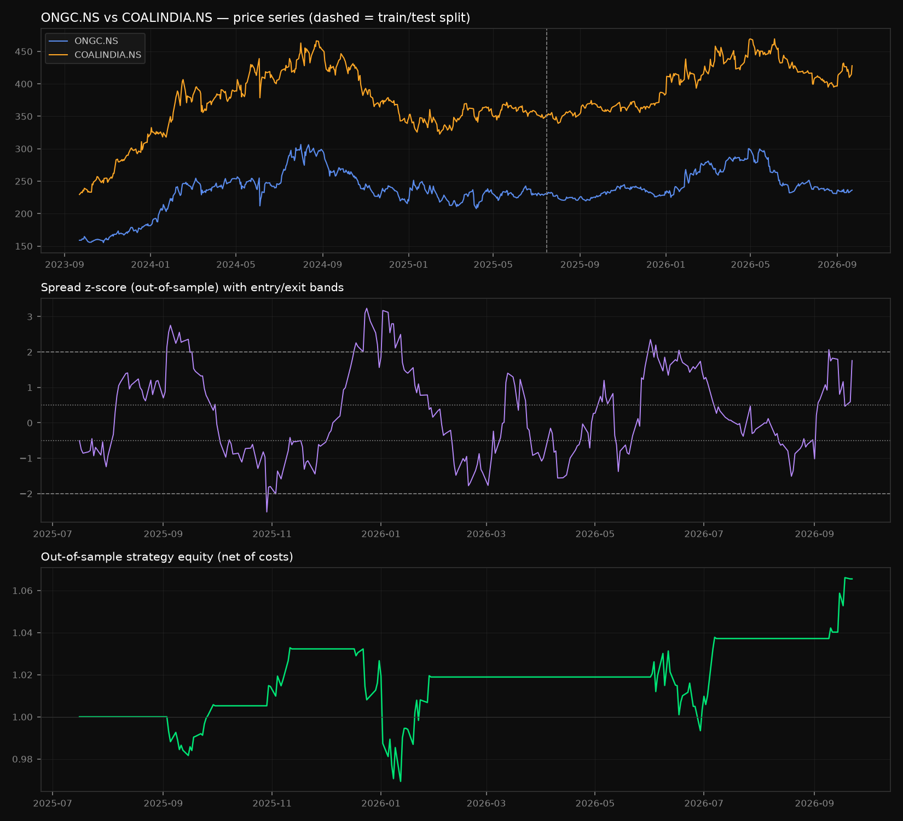

---

### NTPC.NS / POWERGRID.NS

- **Latest prices:** NTPC.NS ₹327.80 · POWERGRID.NS ₹265.95
- **Hedge ratio (train-fitted):** 0.8305
- **Cointegration (train):** FAIL at 5% — ADF -2.54, p=0.1049
- **Persistence:** passed 5% in 0 of 59 real-data runs (strict tier: 0/59)
- **Spread half-life:** 23.7 days
- **Current z-score:** -0.15
- **Signal today:** flat / no stretch
- ⚠️ _Pair did not cointegrate on training data. Any signal here is not statistically justified — observation only._

**Out-of-sample backtest** (beta frozen from train window):

| Metric | Value |
|---|---|
| Sharpe | 0.43 |
| Sortino | 0.33 |
| Annualised return | 2.20% |
| Annualised vol | 5.46% |
| Max drawdown | -5.18% |
| Round-trip trades | 6 |

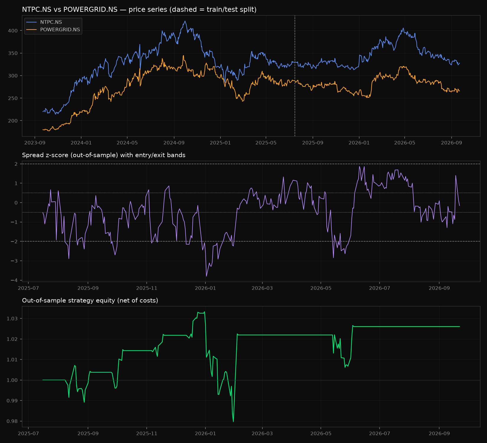

---

### BAJAJ-AUTO.NS / HEROMOTOCO.NS

- **Latest prices:** BAJAJ-AUTO.NS ₹11,363.00 · HEROMOTOCO.NS ₹5,373.00
- **Hedge ratio (train-fitted):** 0.4105
- **Cointegration (train):** FAIL at 5% — ADF -2.29, p=0.1748
- **Persistence:** passed 5% in 0 of 59 real-data runs (strict tier: 0/59)
- **Spread half-life:** 29.5 days
- **Current z-score:** +0.20
- **Signal today:** flat / no stretch
- ⚠️ _Pair did not cointegrate on training data. Any signal here is not statistically justified — observation only._

**Out-of-sample backtest** (beta frozen from train window):

| Metric | Value |
|---|---|
| Sharpe | -0.54 |
| Sortino | -0.56 |
| Annualised return | -6.10% |
| Annualised vol | 10.57% |
| Max drawdown | -19.62% |
| Round-trip trades | 6 |

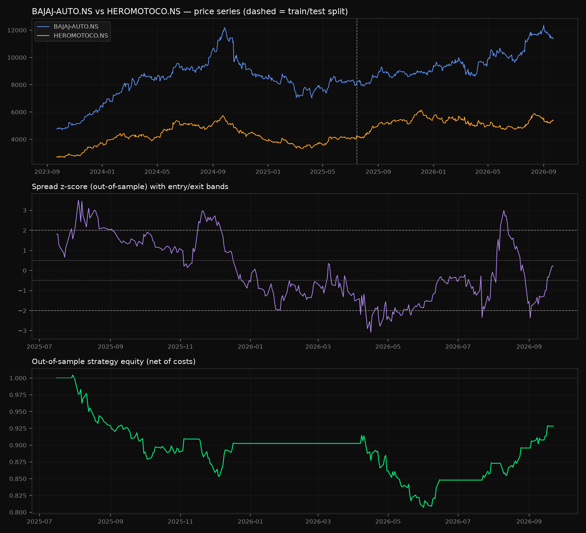

---

### TATASTEEL.NS / JSWSTEEL.NS

- **Latest prices:** TATASTEEL.NS ₹184.97 · JSWSTEEL.NS ₹1,267.00
- **Hedge ratio (train-fitted):** 3.1545
- **Cointegration (train):** FAIL at 5% — ADF -1.19, p=0.6762
- **Persistence:** passed 5% in 0 of 59 real-data runs (strict tier: 0/59)
- **Spread half-life:** 70.9 days
- **Current z-score:** -0.07
- **Signal today:** flat / no stretch
- ⚠️ _Pair did not cointegrate on training data. Any signal here is not statistically justified — observation only._

**Out-of-sample backtest** (beta frozen from train window):

| Metric | Value |
|---|---|
| Sharpe | 0.33 |
| Sortino | 0.28 |
| Annualised return | 2.27% |
| Annualised vol | 7.72% |
| Max drawdown | -5.54% |
| Round-trip trades | 5 |

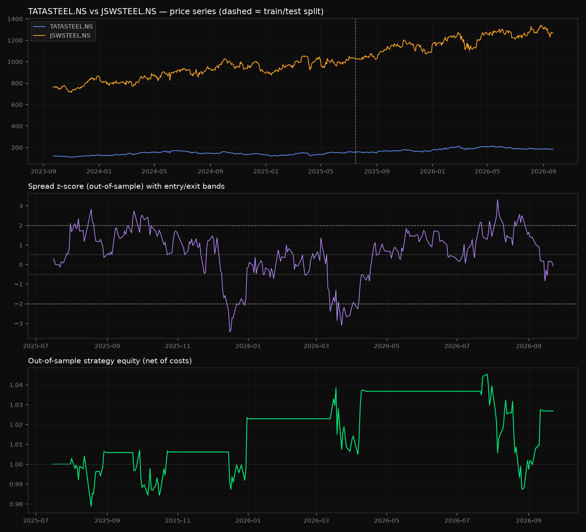

---

### SUNPHARMA.NS / CIPLA.NS

- **Latest prices:** SUNPHARMA.NS ₹1,846.40 · CIPLA.NS ₹1,384.10
- **Hedge ratio (train-fitted):** 0.5003
- **Cointegration (train):** PASS at 5% — ADF -3.39, p=0.0113
- **Persistence:** passed 5% in 59 of 59 real-data runs (strict tier: 5/59)
- **Spread half-life:** 10.7 days
- **Current z-score:** -0.24
- **Signal today:** flat / no stretch

**Out-of-sample backtest** (beta frozen from train window):

| Metric | Value |
|---|---|
| Sharpe | 0.05 |
| Sortino | 0.06 |
| Annualised return | 0.09% |
| Annualised vol | 7.83% |
| Max drawdown | -10.26% |
| Round-trip trades | 5 |

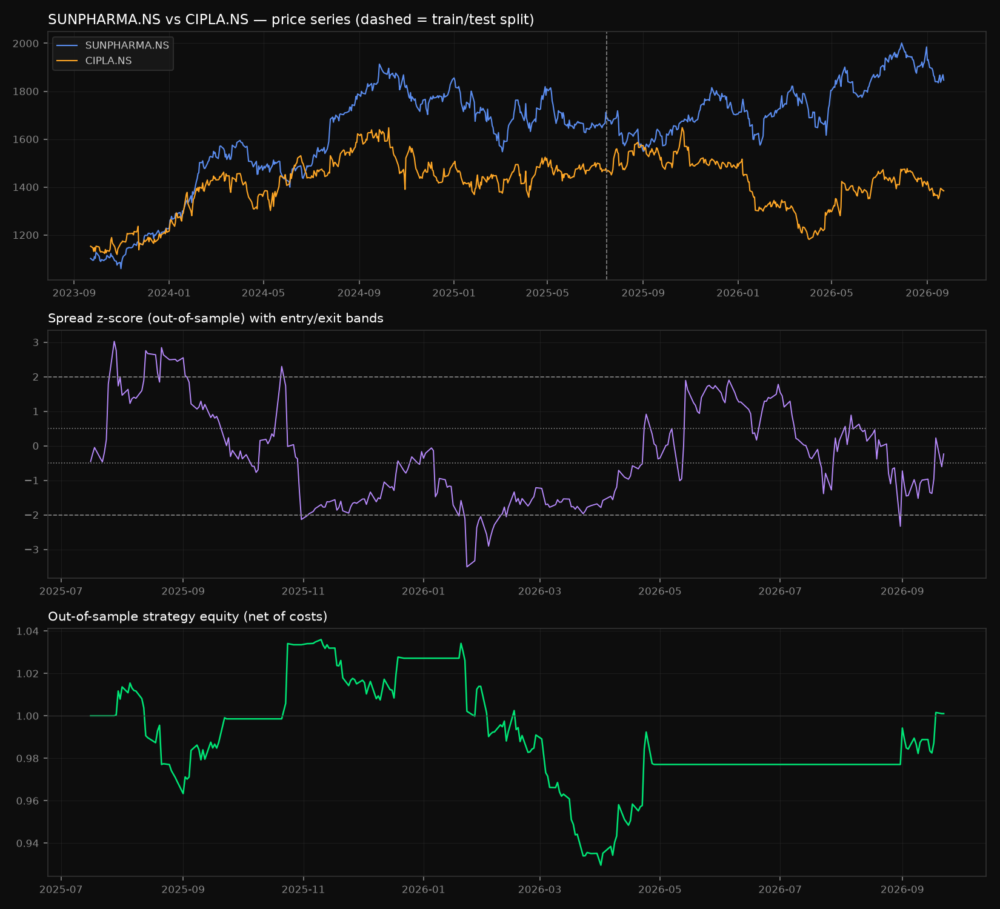

---

_Generated 2026-09-22 · pairs mean-reversion scanner · out-of-sample backtest · multiple-testing-aware · not investment advice._
