# Indian Pairs-Trading Scanner — 2026-09-23

> **What this is:** a market-neutral *pairs mean-reversion* scanner. It flags when two related NSE stocks have drifted apart far enough that their historical relationship signals a possible convergence trade. It does **not** forecast growth, rank "best" stocks, or predict company performance. A signal means the *spread between two stocks* is stretched — nothing about either stock being a good investment. Not investment advice; do your own research.

## Methodology (fixed in advance)

- **Universe:** 16 declared sector-mate pairs. Parameters (3y window, 60/40 train-test, z-entry 2.0, z-exit 0.5, 5 bps costs) are pre-registered; changes are logged in the README changelog *before* looking at results.
- **Multiple testing:** at the 5% level across 16 pairs, **≈0.8 false positives per run are expected by chance alone** even if nothing truly cointegrates. A single-day pass is a candidate, not a discovery.
- **Strict tier:** Bonferroni-corrected threshold p < 0.0031 (marked ✓✓).
- **Evidence = persistence:** the Persistence column counts how often each pair has passed the 5% test across all *real-data* daily runs recorded in `reports/history.csv`. Pairs deserve attention only when they pass persistently.

> ⚠️ **Some results use SIMULATED fallback data** (real data was unreachable this run) and are not real market results. These are marked below and are EXCLUDED from persistence counts.

## Summary

| Pair | p-value | Coint. | Persistence | Current z | Signal | OOS Sharpe |
|---|---|---|---|---|---|---|
| HDFCBANK.NS/ICICIBANK.NS *(sim)* | 0.0030 | ✓✓ | 1/49 | -1.55 | watch | 1.13 |
| AXISBANK.NS/ICICIBANK.NS | 0.8179 | ✗ | 0/60 | -1.07 | watch | -0.32 |
| KOTAKBANK.NS/HDFCBANK.NS | 0.1024 | ✗ | 0/60 | -0.56 | watch | 0.95 |
| SBIN.NS/BANKBARODA.NS | 0.1468 | ✗ | 0/60 | +0.15 | flat / no stretch | 0.02 |
| TCS.NS/INFY.NS | 0.7865 | ✗ | 0/60 | -0.02 | flat / no stretch | 2.45 |
| INFY.NS/WIPRO.NS | 0.1708 | ✗ | 0/60 | -0.25 | flat / no stretch | 1.68 |
| HCLTECH.NS/TECHM.NS | 0.1243 | ✗ | 0/60 | +0.06 | flat / no stretch | -0.01 |
| ACC.NS/AMBUJACEM.NS | 0.4963 | ✗ | 0/60 | -1.32 | watch | 0.32 |
| ULTRACEMCO.NS/SHREECEM.NS | 0.2365 | ✗ | 0/60 | -1.50 | watch | 0.11 |
| IOC.NS/BPCL.NS | 0.8748 | ✗ | 0/60 | +0.50 | watch | 0.31 |
| BPCL.NS/HINDPETRO.NS | 0.2752 | ✗ | 0/60 | -1.14 | watch | 0.06 |
| ONGC.NS/COALINDIA.NS | 0.0100 | ✓ | 52/60 | +1.36 | watch | 0.76 |
| NTPC.NS/POWERGRID.NS | 0.1009 | ✗ | 0/60 | +0.96 | watch | 0.43 |
| BAJAJ-AUTO.NS/HEROMOTOCO.NS | 0.1721 | ✗ | 0/60 | +0.23 | flat / no stretch | -0.54 |
| TATASTEEL.NS/JSWSTEEL.NS | 0.6665 | ✗ | 0/60 | +0.26 | flat / no stretch | 0.33 |
| SUNPHARMA.NS/CIPLA.NS | 0.0104 | ✓ | 60/60 | -0.62 | watch | 0.05 |

_Legend: ✓✓ passes strict Bonferroni tier · ✓ passes 5% only · ✗ fails. Persistence = 5%-passes / real-data runs recorded. \*no real-data history yet._

---

### HDFCBANK.NS / ICICIBANK.NS · _SIMULATED_

- **Latest prices:** HDFCBANK.NS ₹77.27 · ICICIBANK.NS ₹113.78
- **Hedge ratio (train-fitted):** 1.5557
- **Cointegration (train):** PASS at 5% — ADF -3.79, p=0.0030 · **passes strict Bonferroni tier**
- **Persistence:** passed 5% in 1 of 49 real-data runs (strict tier: 0/49)
- **Spread half-life:** 14.0 days
- **Current z-score:** -1.55
- **Signal today:** watch (approaching band)

**Out-of-sample backtest** (beta frozen from train window):

| Metric | Value |
|---|---|
| Sharpe | 1.13 |
| Sortino | 0.86 |
| Annualised return | 1.88% |
| Annualised vol | 1.66% |
| Max drawdown | -1.19% |
| Round-trip trades | 5 |

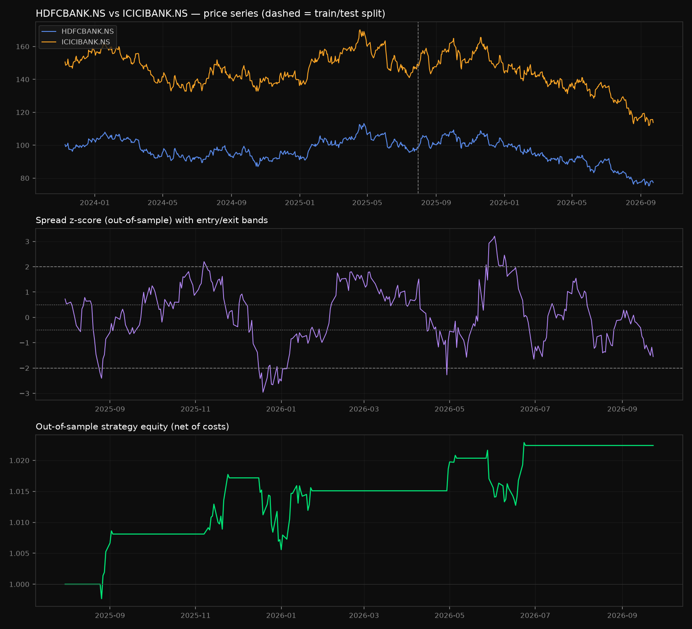

---

### AXISBANK.NS / ICICIBANK.NS

- **Latest prices:** AXISBANK.NS ₹1,243.20 · ICICIBANK.NS ₹1,340.00
- **Hedge ratio (train-fitted):** 0.9906
- **Cointegration (train):** FAIL at 5% — ADF -0.80, p=0.8179
- **Persistence:** passed 5% in 0 of 60 real-data runs (strict tier: 0/60)
- **Spread half-life:** 151.3 days
- **Current z-score:** -1.07
- **Signal today:** watch (approaching band)
- ⚠️ _Pair did not cointegrate on training data. Any signal here is not statistically justified — observation only._

**Out-of-sample backtest** (beta frozen from train window):

| Metric | Value |
|---|---|
| Sharpe | -0.32 |
| Sortino | -0.32 |
| Annualised return | -3.16% |
| Annualised vol | 8.83% |
| Max drawdown | -7.79% |
| Round-trip trades | 6 |

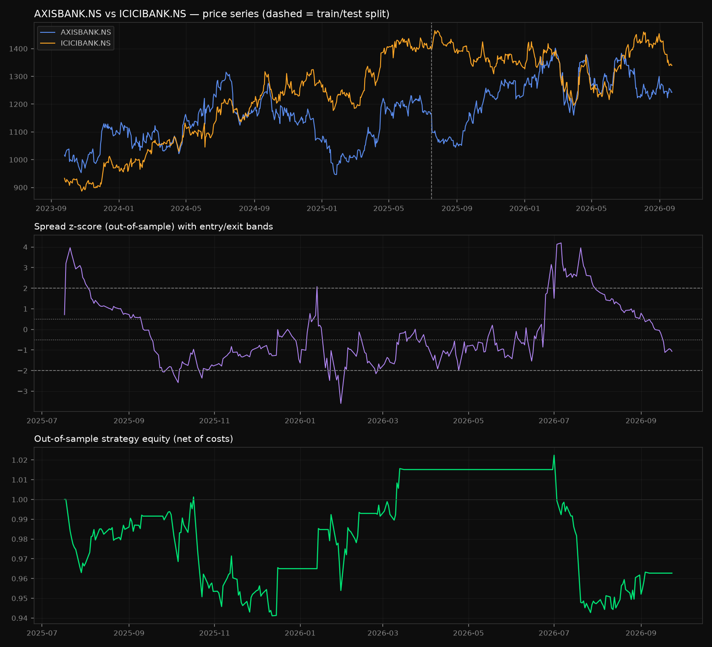

---

### KOTAKBANK.NS / HDFCBANK.NS

- **Latest prices:** KOTAKBANK.NS ₹413.25 · HDFCBANK.NS ₹737.25
- **Hedge ratio (train-fitted):** 2.1292
- **Cointegration (train):** FAIL at 5% — ADF -2.56, p=0.1024
- **Persistence:** passed 5% in 0 of 60 real-data runs (strict tier: 0/60)
- **Spread half-life:** 24.1 days
- **Current z-score:** -0.56
- **Signal today:** watch (approaching band)
- ⚠️ _Pair did not cointegrate on training data. Any signal here is not statistically justified — observation only._

**Out-of-sample backtest** (beta frozen from train window):

| Metric | Value |
|---|---|
| Sharpe | 0.95 |
| Sortino | 0.74 |
| Annualised return | 6.41% |
| Annualised vol | 6.76% |
| Max drawdown | -4.27% |
| Round-trip trades | 6 |

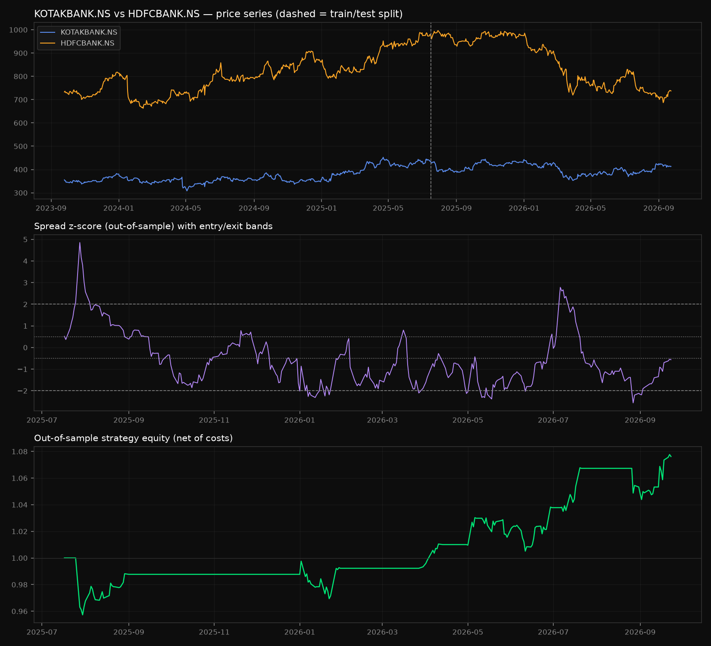

---

### SBIN.NS / BANKBARODA.NS

- **Latest prices:** SBIN.NS ₹994.10 · BANKBARODA.NS ₹236.87
- **Hedge ratio (train-fitted):** 0.1896
- **Cointegration (train):** FAIL at 5% — ADF -2.38, p=0.1468
- **Persistence:** passed 5% in 0 of 60 real-data runs (strict tier: 0/60)
- **Spread half-life:** 21.0 days
- **Current z-score:** +0.15
- **Signal today:** flat / no stretch
- ⚠️ _Pair did not cointegrate on training data. Any signal here is not statistically justified — observation only._

**Out-of-sample backtest** (beta frozen from train window):

| Metric | Value |
|---|---|
| Sharpe | 0.02 |
| Sortino | 0.02 |
| Annualised return | -0.19% |
| Annualised vol | 8.91% |
| Max drawdown | -8.57% |
| Round-trip trades | 5 |

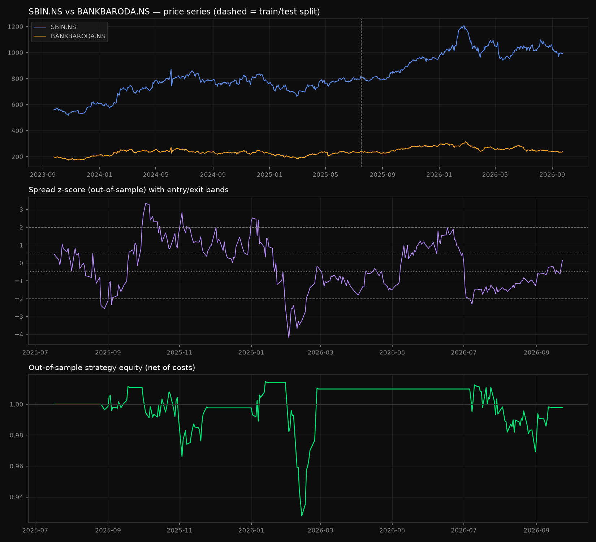

---

### TCS.NS / INFY.NS

- **Latest prices:** TCS.NS ₹2,089.60 · INFY.NS ₹1,020.50
- **Hedge ratio (train-fitted):** 0.4714
- **Cointegration (train):** FAIL at 5% — ADF -0.90, p=0.7865
- **Persistence:** passed 5% in 0 of 60 real-data runs (strict tier: 0/60)
- **Spread half-life:** 86.2 days
- **Current z-score:** -0.02
- **Signal today:** flat / no stretch
- ⚠️ _Pair did not cointegrate on training data. Any signal here is not statistically justified — observation only._

**Out-of-sample backtest** (beta frozen from train window):

| Metric | Value |
|---|---|
| Sharpe | 2.45 |
| Sortino | 2.58 |
| Annualised return | 9.88% |
| Annualised vol | 3.88% |
| Max drawdown | -1.35% |
| Round-trip trades | 7 |

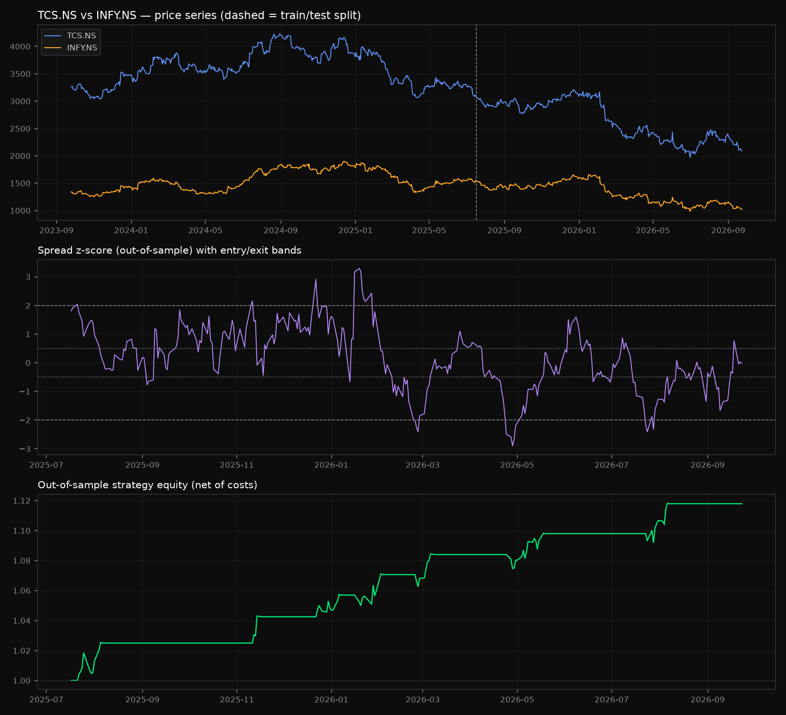

---

### INFY.NS / WIPRO.NS

- **Latest prices:** INFY.NS ₹1,020.50 · WIPRO.NS ₹164.90
- **Hedge ratio (train-fitted):** 0.1331
- **Cointegration (train):** FAIL at 5% — ADF -2.30, p=0.1708
- **Persistence:** passed 5% in 0 of 60 real-data runs (strict tier: 0/60)
- **Spread half-life:** 30.1 days
- **Current z-score:** -0.25
- **Signal today:** flat / no stretch
- ⚠️ _Pair did not cointegrate on training data. Any signal here is not statistically justified — observation only._

**Out-of-sample backtest** (beta frozen from train window):

| Metric | Value |
|---|---|
| Sharpe | 1.68 |
| Sortino | 1.97 |
| Annualised return | 8.74% |
| Annualised vol | 5.05% |
| Max drawdown | -2.32% |
| Round-trip trades | 6 |

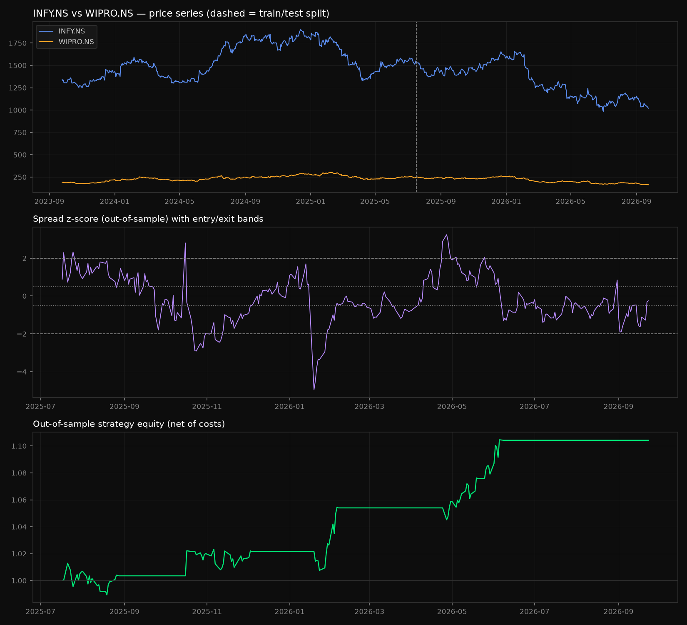

---

### HCLTECH.NS / TECHM.NS

- **Latest prices:** HCLTECH.NS ₹1,256.70 · TECHM.NS ₹1,557.00
- **Hedge ratio (train-fitted):** 0.9201
- **Cointegration (train):** FAIL at 5% — ADF -2.46, p=0.1243
- **Persistence:** passed 5% in 0 of 60 real-data runs (strict tier: 0/60)
- **Spread half-life:** 24.0 days
- **Current z-score:** +0.06
- **Signal today:** flat / no stretch
- ⚠️ _Pair did not cointegrate on training data. Any signal here is not statistically justified — observation only._

**Out-of-sample backtest** (beta frozen from train window):

| Metric | Value |
|---|---|
| Sharpe | -0.01 |
| Sortino | -0.01 |
| Annualised return | -0.30% |
| Annualised vol | 7.08% |
| Max drawdown | -8.10% |
| Round-trip trades | 5 |

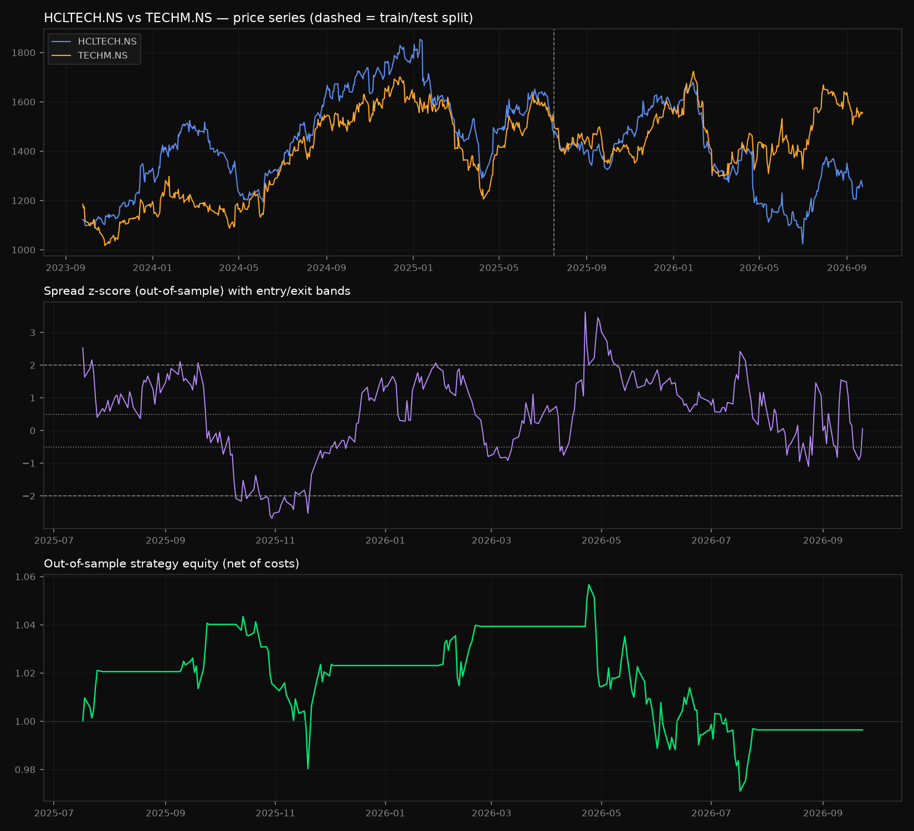

---

### ACC.NS / AMBUJACEM.NS

- **Latest prices:** ACC.NS ₹1,251.40 · AMBUJACEM.NS ₹392.75
- **Hedge ratio (train-fitted):** 0.1917
- **Cointegration (train):** FAIL at 5% — ADF -1.57, p=0.4963
- **Persistence:** passed 5% in 0 of 60 real-data runs (strict tier: 0/60)
- **Spread half-life:** 54.5 days
- **Current z-score:** -1.32
- **Signal today:** watch (approaching band)
- ⚠️ _Pair did not cointegrate on training data. Any signal here is not statistically justified — observation only._

**Out-of-sample backtest** (beta frozen from train window):

| Metric | Value |
|---|---|
| Sharpe | 0.32 |
| Sortino | 0.25 |
| Annualised return | 1.79% |
| Annualised vol | 6.11% |
| Max drawdown | -4.80% |
| Round-trip trades | 4 |

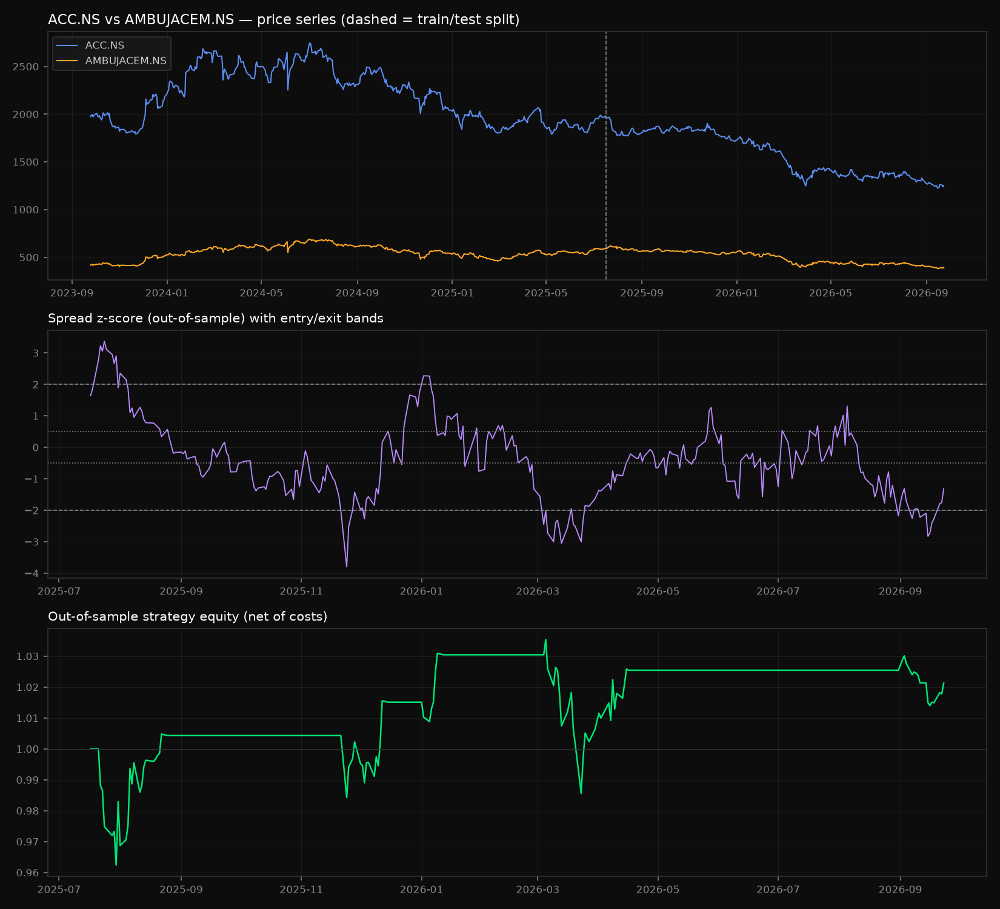

---

### ULTRACEMCO.NS / SHREECEM.NS

- **Latest prices:** ULTRACEMCO.NS ₹11,155.00 · SHREECEM.NS ₹22,500.00
- **Hedge ratio (train-fitted):** 0.7939
- **Cointegration (train):** FAIL at 5% — ADF -2.12, p=0.2365
- **Persistence:** passed 5% in 0 of 60 real-data runs (strict tier: 0/60)
- **Spread half-life:** 42.0 days
- **Current z-score:** -1.50
- **Signal today:** watch (approaching band)
- ⚠️ _Pair did not cointegrate on training data. Any signal here is not statistically justified — observation only._

**Out-of-sample backtest** (beta frozen from train window):

| Metric | Value |
|---|---|
| Sharpe | 0.11 |
| Sortino | 0.12 |
| Annualised return | 0.50% |
| Annualised vol | 7.17% |
| Max drawdown | -7.66% |
| Round-trip trades | 5 |

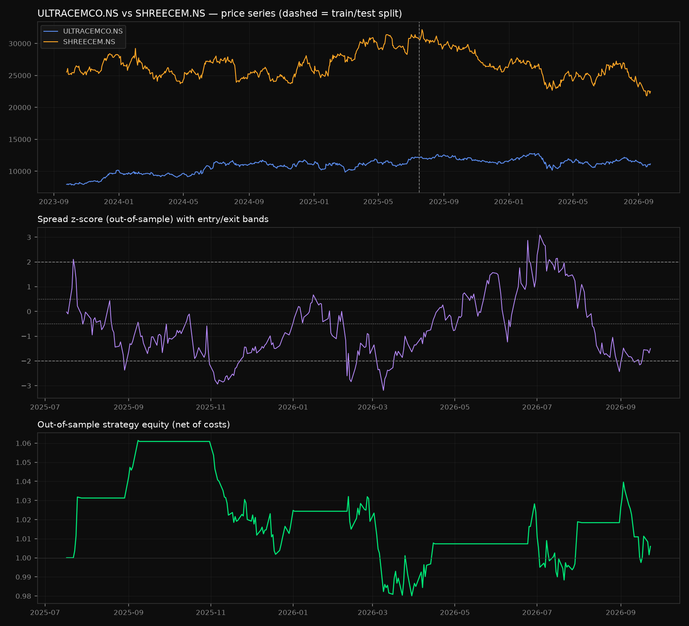

---

### IOC.NS / BPCL.NS

- **Latest prices:** IOC.NS ₹138.15 · BPCL.NS ₹315.75
- **Hedge ratio (train-fitted):** 1.7306
- **Cointegration (train):** FAIL at 5% — ADF -0.58, p=0.8748
- **Persistence:** passed 5% in 0 of 60 real-data runs (strict tier: 0/60)
- **Spread half-life:** 204.1 days
- **Current z-score:** +0.50
- **Signal today:** watch (approaching band)
- ⚠️ _Pair did not cointegrate on training data. Any signal here is not statistically justified — observation only._

**Out-of-sample backtest** (beta frozen from train window):

| Metric | Value |
|---|---|
| Sharpe | 0.31 |
| Sortino | 0.31 |
| Annualised return | 1.71% |
| Annualised vol | 6.03% |
| Max drawdown | -6.34% |
| Round-trip trades | 6 |

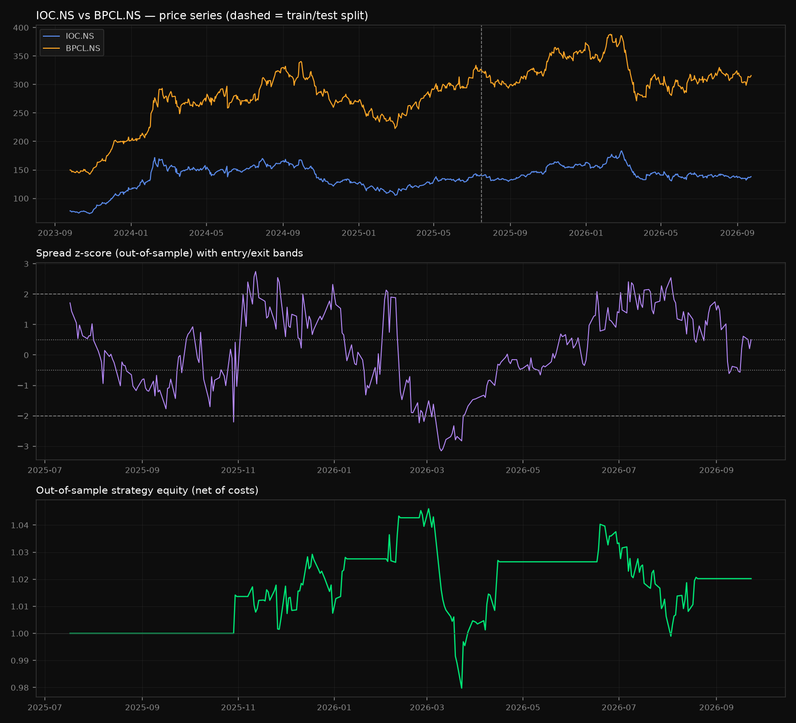

---

### BPCL.NS / HINDPETRO.NS

- **Latest prices:** BPCL.NS ₹315.75 · HINDPETRO.NS ₹360.00
- **Hedge ratio (train-fitted):** 1.3451
- **Cointegration (train):** FAIL at 5% — ADF -2.03, p=0.2752
- **Persistence:** passed 5% in 0 of 60 real-data runs (strict tier: 0/60)
- **Spread half-life:** 37.6 days
- **Current z-score:** -1.14
- **Signal today:** watch (approaching band)
- ⚠️ _Pair did not cointegrate on training data. Any signal here is not statistically justified — observation only._

**Out-of-sample backtest** (beta frozen from train window):

| Metric | Value |
|---|---|
| Sharpe | 0.06 |
| Sortino | 0.06 |
| Annualised return | 0.18% |
| Annualised vol | 5.61% |
| Max drawdown | -6.37% |
| Round-trip trades | 5 |

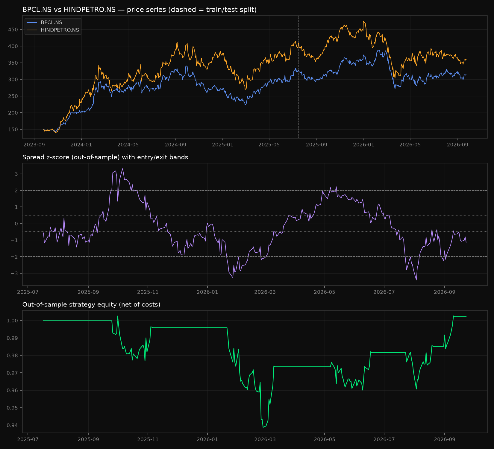

---

### ONGC.NS / COALINDIA.NS

- **Latest prices:** ONGC.NS ₹236.90 · COALINDIA.NS ₹424.55
- **Hedge ratio (train-fitted):** 1.4391
- **Cointegration (train):** PASS at 5% — ADF -3.43, p=0.0100
- **Persistence:** passed 5% in 52 of 60 real-data runs (strict tier: 1/60)
- **Spread half-life:** 12.3 days
- **Current z-score:** +1.36
- **Signal today:** watch (approaching band)

**Out-of-sample backtest** (beta frozen from train window):

| Metric | Value |
|---|---|
| Sharpe | 0.76 |
| Sortino | 0.57 |
| Annualised return | 5.50% |
| Annualised vol | 7.46% |
| Max drawdown | -6.15% |
| Round-trip trades | 5 |

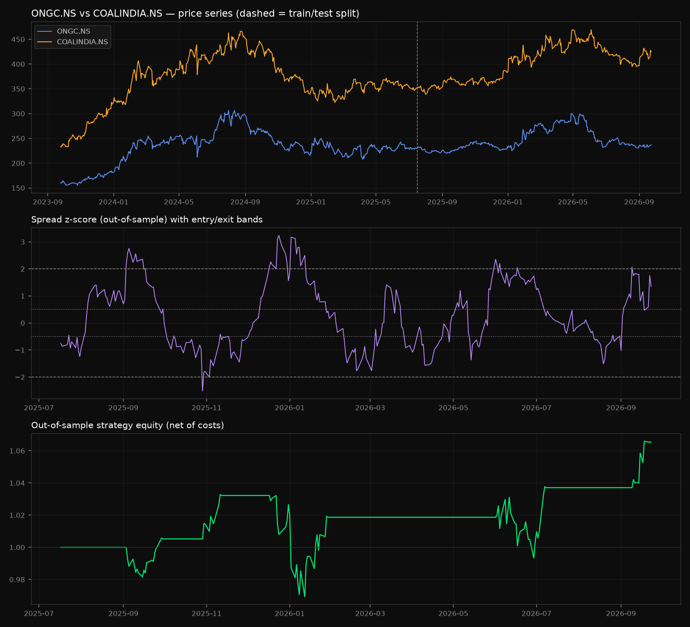

---

### NTPC.NS / POWERGRID.NS

- **Latest prices:** NTPC.NS ₹326.00 · POWERGRID.NS ₹270.20
- **Hedge ratio (train-fitted):** 0.8299
- **Cointegration (train):** FAIL at 5% — ADF -2.56, p=0.1009
- **Persistence:** passed 5% in 0 of 60 real-data runs (strict tier: 0/60)
- **Spread half-life:** 23.6 days
- **Current z-score:** +0.96
- **Signal today:** watch (approaching band)
- ⚠️ _Pair did not cointegrate on training data. Any signal here is not statistically justified — observation only._

**Out-of-sample backtest** (beta frozen from train window):

| Metric | Value |
|---|---|
| Sharpe | 0.43 |
| Sortino | 0.33 |
| Annualised return | 2.20% |
| Annualised vol | 5.46% |
| Max drawdown | -5.18% |
| Round-trip trades | 6 |

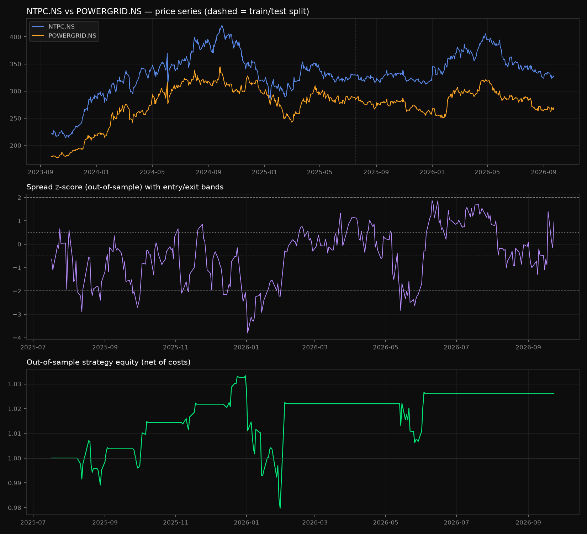

---

### BAJAJ-AUTO.NS / HEROMOTOCO.NS

- **Latest prices:** BAJAJ-AUTO.NS ₹11,400.00 · HEROMOTOCO.NS ₹5,394.00
- **Hedge ratio (train-fitted):** 0.4104
- **Cointegration (train):** FAIL at 5% — ADF -2.30, p=0.1721
- **Persistence:** passed 5% in 0 of 60 real-data runs (strict tier: 0/60)
- **Spread half-life:** 29.4 days
- **Current z-score:** +0.23
- **Signal today:** flat / no stretch
- ⚠️ _Pair did not cointegrate on training data. Any signal here is not statistically justified — observation only._

**Out-of-sample backtest** (beta frozen from train window):

| Metric | Value |
|---|---|
| Sharpe | -0.54 |
| Sortino | -0.56 |
| Annualised return | -6.07% |
| Annualised vol | 10.53% |
| Max drawdown | -19.56% |
| Round-trip trades | 6 |

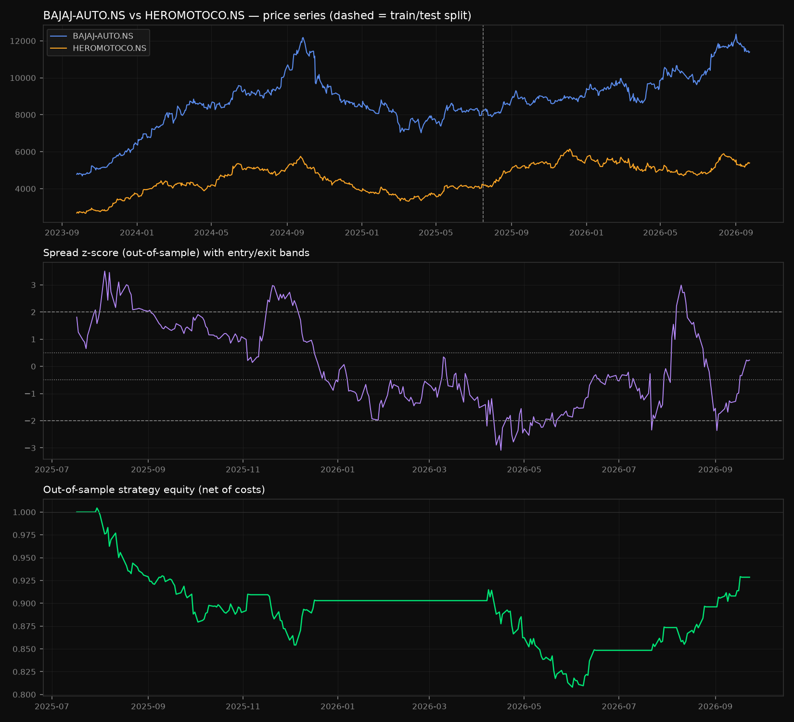

---

### TATASTEEL.NS / JSWSTEEL.NS

- **Latest prices:** TATASTEEL.NS ₹190.82 · JSWSTEEL.NS ₹1,297.80
- **Hedge ratio (train-fitted):** 3.1492
- **Cointegration (train):** FAIL at 5% — ADF -1.22, p=0.6665
- **Persistence:** passed 5% in 0 of 60 real-data runs (strict tier: 0/60)
- **Spread half-life:** 71.6 days
- **Current z-score:** +0.26
- **Signal today:** flat / no stretch
- ⚠️ _Pair did not cointegrate on training data. Any signal here is not statistically justified — observation only._

**Out-of-sample backtest** (beta frozen from train window):

| Metric | Value |
|---|---|
| Sharpe | 0.33 |
| Sortino | 0.28 |
| Annualised return | 2.26% |
| Annualised vol | 7.67% |
| Max drawdown | -5.50% |
| Round-trip trades | 5 |

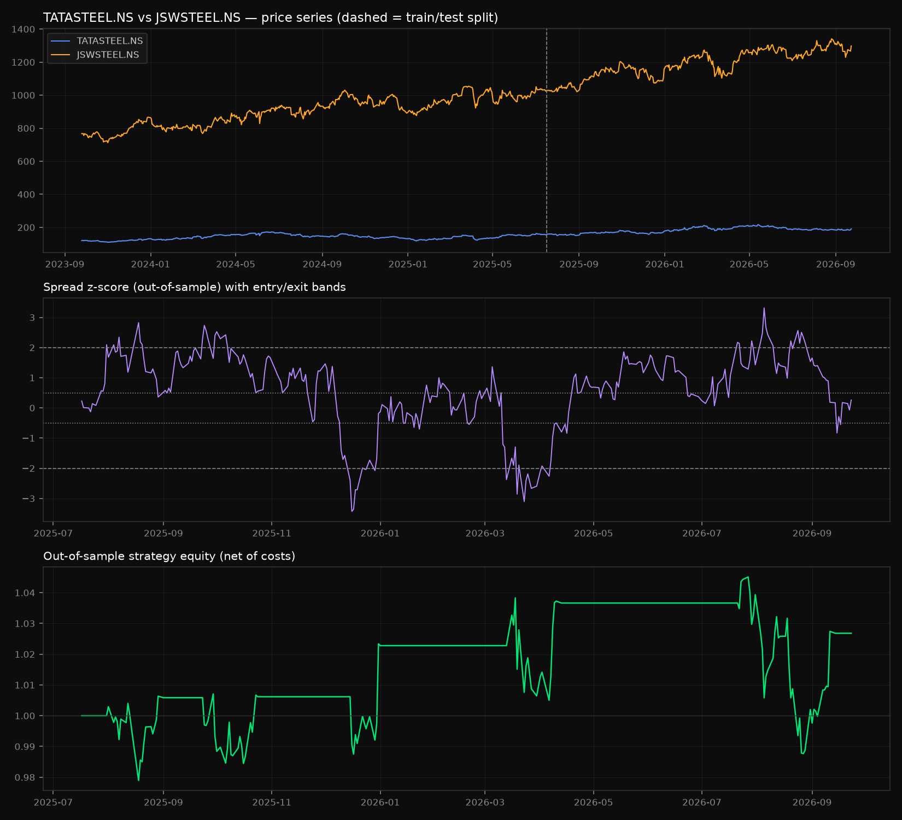

---

### SUNPHARMA.NS / CIPLA.NS

- **Latest prices:** SUNPHARMA.NS ₹1,865.00 · CIPLA.NS ₹1,383.00
- **Hedge ratio (train-fitted):** 0.4997
- **Cointegration (train):** PASS at 5% — ADF -3.42, p=0.0104
- **Persistence:** passed 5% in 60 of 60 real-data runs (strict tier: 5/60)
- **Spread half-life:** 10.7 days
- **Current z-score:** -0.62
- **Signal today:** watch (approaching band)

**Out-of-sample backtest** (beta frozen from train window):

| Metric | Value |
|---|---|
| Sharpe | 0.05 |
| Sortino | 0.06 |
| Annualised return | 0.09% |
| Annualised vol | 7.81% |
| Max drawdown | -10.23% |
| Round-trip trades | 5 |

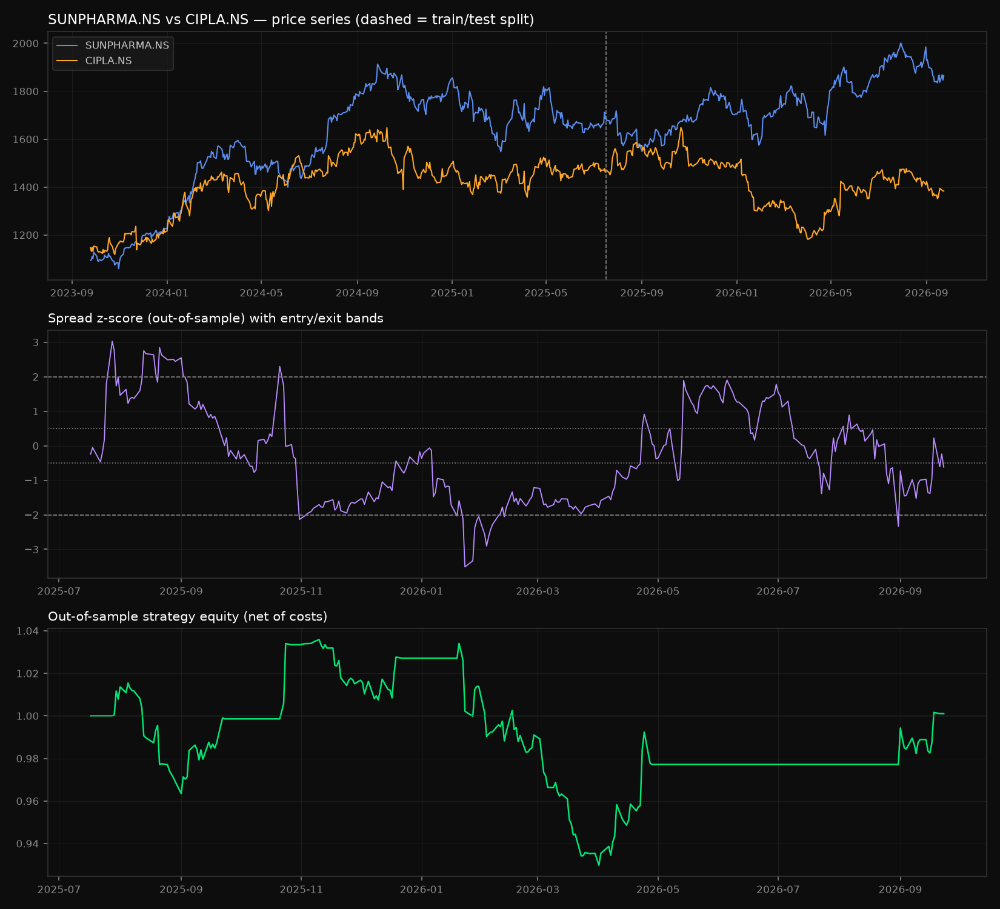

---

_Generated 2026-09-23 · pairs mean-reversion scanner · out-of-sample backtest · multiple-testing-aware · not investment advice._
