# Indian Pairs-Trading Scanner — 2026-09-24

> **What this is:** a market-neutral *pairs mean-reversion* scanner. It flags when two related NSE stocks have drifted apart far enough that their historical relationship signals a possible convergence trade. It does **not** forecast growth, rank "best" stocks, or predict company performance. A signal means the *spread between two stocks* is stretched — nothing about either stock being a good investment. Not investment advice; do your own research.

## Methodology (fixed in advance)

- **Universe:** 16 declared sector-mate pairs. Parameters (3y window, 60/40 train-test, z-entry 2.0, z-exit 0.5, 5 bps costs) are pre-registered; changes are logged in the README changelog *before* looking at results.
- **Multiple testing:** at the 5% level across 16 pairs, **≈0.8 false positives per run are expected by chance alone** even if nothing truly cointegrates. A single-day pass is a candidate, not a discovery.
- **Strict tier:** Bonferroni-corrected threshold p < 0.0031 (marked ✓✓).
- **Evidence = persistence:** the Persistence column counts how often each pair has passed the 5% test across all *real-data* daily runs recorded in `reports/history.csv`. Pairs deserve attention only when they pass persistently.

## Summary

| Pair | p-value | Coint. | Persistence | Current z | Signal | OOS Sharpe |
|---|---|---|---|---|---|---|
| HDFCBANK.NS/ICICIBANK.NS | 0.1146 | ✗ | 1/50 | -0.67 | watch | -0.57 |
| AXISBANK.NS/ICICIBANK.NS | 0.8170 | ✗ | 0/61 | -0.07 | flat / no stretch | -0.32 |
| KOTAKBANK.NS/HDFCBANK.NS | 0.1005 | ✗ | 0/61 | -0.41 | flat / no stretch | 1.01 |
| SBIN.NS/BANKBARODA.NS | 0.1462 | ✗ | 0/61 | +0.32 | flat / no stretch | 0.02 |
| TCS.NS/INFY.NS | 0.7686 | ✗ | 0/61 | -0.18 | flat / no stretch | 2.43 |
| INFY.NS/WIPRO.NS | 0.1739 | ✗ | 0/61 | -0.41 | flat / no stretch | 1.68 |
| HCLTECH.NS/TECHM.NS | 0.0947 | ✗ | 0/61 | -0.03 | flat / no stretch | -0.03 |
| ACC.NS/AMBUJACEM.NS | 0.5047 | ✗ | 0/61 | -1.89 | watch | 0.24 |
| ULTRACEMCO.NS/SHREECEM.NS | 0.2262 | ✗ | 0/61 | -1.49 | watch | 0.09 |
| IOC.NS/BPCL.NS | 0.8793 | ✗ | 0/61 | -0.68 | watch | 0.31 |
| BPCL.NS/HINDPETRO.NS | 0.2653 | ✗ | 0/61 | -0.90 | watch | 0.06 |
| ONGC.NS/COALINDIA.NS | 0.0102 | ✓ | 53/61 | +0.88 | watch | 0.76 |
| NTPC.NS/POWERGRID.NS | 0.0994 | ✗ | 0/61 | +0.11 | flat / no stretch | 0.43 |
| BAJAJ-AUTO.NS/HEROMOTOCO.NS | 0.1716 | ✗ | 0/61 | +0.14 | flat / no stretch | -0.54 |
| TATASTEEL.NS/JSWSTEEL.NS | 0.6585 | ✗ | 0/61 | -0.24 | flat / no stretch | 0.38 |
| SUNPHARMA.NS/CIPLA.NS | 0.0102 | ✓ | 61/61 | +0.38 | flat / no stretch | 0.05 |

_Legend: ✓✓ passes strict Bonferroni tier · ✓ passes 5% only · ✗ fails. Persistence = 5%-passes / real-data runs recorded. \*no real-data history yet._

---

### HDFCBANK.NS / ICICIBANK.NS

- **Latest prices:** HDFCBANK.NS ₹728.90 · ICICIBANK.NS ₹1,334.50
- **Hedge ratio (train-fitted):** 1.6631
- **Cointegration (train):** FAIL at 5% — ADF -2.50, p=0.1146
- **Persistence:** passed 5% in 1 of 50 real-data runs (strict tier: 0/50)
- **Spread half-life:** 27.1 days
- **Current z-score:** -0.67
- **Signal today:** watch (approaching band)
- ⚠️ _Pair did not cointegrate on training data. Any signal here is not statistically justified — observation only._

**Out-of-sample backtest** (beta frozen from train window):

| Metric | Value |
|---|---|
| Sharpe | -0.57 |
| Sortino | -0.60 |
| Annualised return | -3.89% |
| Annualised vol | 6.59% |
| Max drawdown | -8.37% |
| Round-trip trades | 4 |

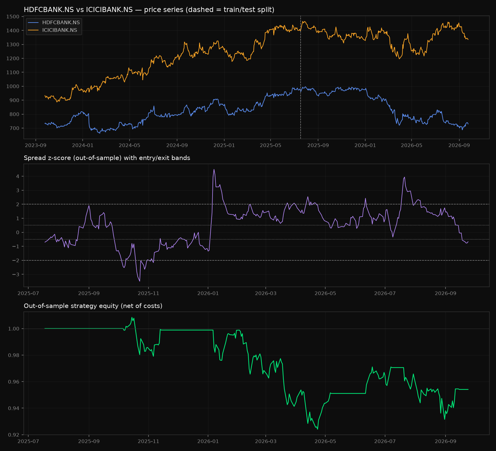

---

### AXISBANK.NS / ICICIBANK.NS

- **Latest prices:** AXISBANK.NS ₹1,186.50 · ICICIBANK.NS ₹1,334.50
- **Hedge ratio (train-fitted):** 0.9932
- **Cointegration (train):** FAIL at 5% — ADF -0.81, p=0.8170
- **Persistence:** passed 5% in 0 of 61 real-data runs (strict tier: 0/61)
- **Spread half-life:** 151.6 days
- **Current z-score:** -0.07
- **Signal today:** flat / no stretch
- ⚠️ _Pair did not cointegrate on training data. Any signal here is not statistically justified — observation only._

**Out-of-sample backtest** (beta frozen from train window):

| Metric | Value |
|---|---|
| Sharpe | -0.32 |
| Sortino | -0.32 |
| Annualised return | -3.23% |
| Annualised vol | 9.02% |
| Max drawdown | -7.96% |
| Round-trip trades | 6 |

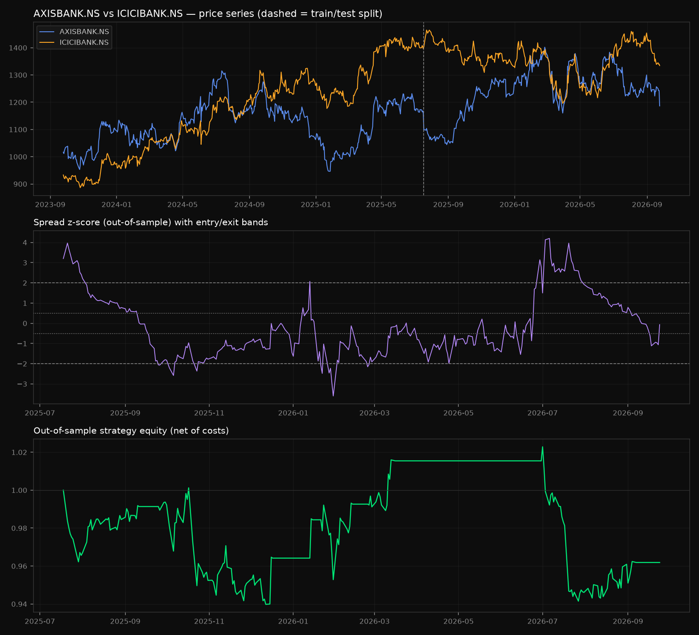

---

### KOTAKBANK.NS / HDFCBANK.NS

- **Latest prices:** KOTAKBANK.NS ₹405.00 · HDFCBANK.NS ₹728.90
- **Hedge ratio (train-fitted):** 2.1343
- **Cointegration (train):** FAIL at 5% — ADF -2.56, p=0.1005
- **Persistence:** passed 5% in 0 of 61 real-data runs (strict tier: 0/61)
- **Spread half-life:** 24.0 days
- **Current z-score:** -0.41
- **Signal today:** flat / no stretch
- ⚠️ _Pair did not cointegrate on training data. Any signal here is not statistically justified — observation only._

**Out-of-sample backtest** (beta frozen from train window):

| Metric | Value |
|---|---|
| Sharpe | 1.01 |
| Sortino | 0.79 |
| Annualised return | 6.93% |
| Annualised vol | 6.87% |
| Max drawdown | -4.33% |
| Round-trip trades | 6 |

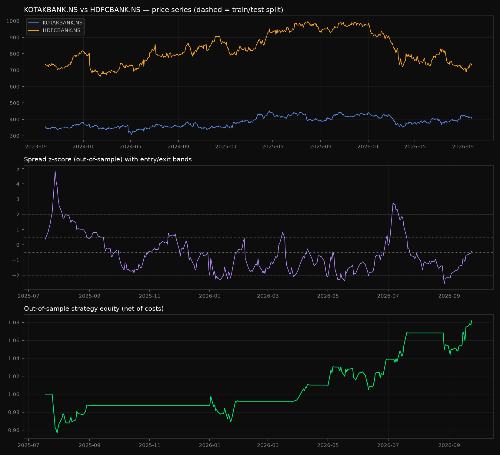

---

### SBIN.NS / BANKBARODA.NS

- **Latest prices:** SBIN.NS ₹978.50 · BANKBARODA.NS ₹234.30
- **Hedge ratio (train-fitted):** 0.1895
- **Cointegration (train):** FAIL at 5% — ADF -2.38, p=0.1462
- **Persistence:** passed 5% in 0 of 61 real-data runs (strict tier: 0/61)
- **Spread half-life:** 21.0 days
- **Current z-score:** +0.32
- **Signal today:** flat / no stretch
- ⚠️ _Pair did not cointegrate on training data. Any signal here is not statistically justified — observation only._

**Out-of-sample backtest** (beta frozen from train window):

| Metric | Value |
|---|---|
| Sharpe | 0.02 |
| Sortino | 0.02 |
| Annualised return | -0.20% |
| Annualised vol | 8.97% |
| Max drawdown | -8.63% |
| Round-trip trades | 5 |

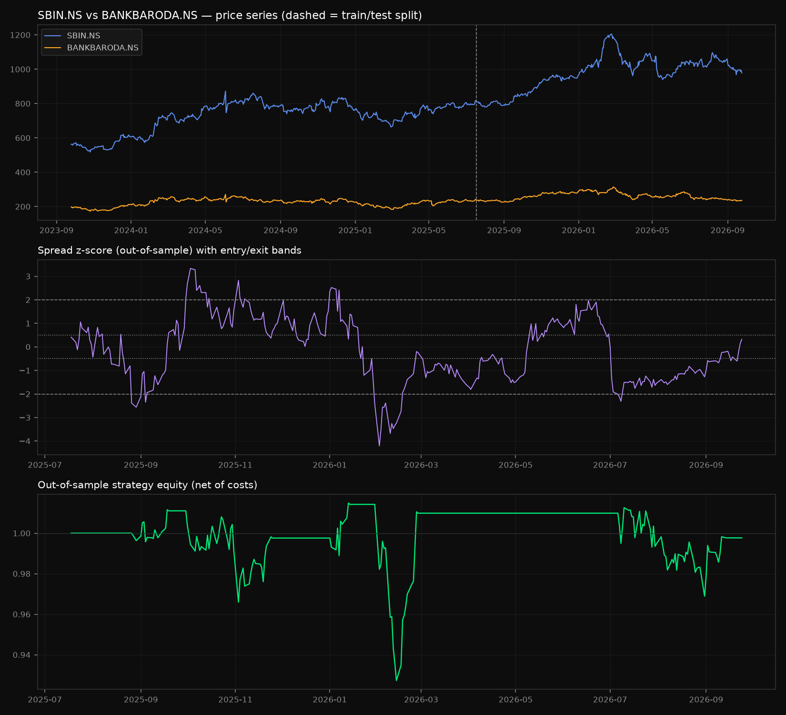

---

### TCS.NS / INFY.NS

- **Latest prices:** TCS.NS ₹2,087.00 · INFY.NS ₹1,014.50
- **Hedge ratio (train-fitted):** 0.4688
- **Cointegration (train):** FAIL at 5% — ADF -0.96, p=0.7686
- **Persistence:** passed 5% in 0 of 61 real-data runs (strict tier: 0/61)
- **Spread half-life:** 81.4 days
- **Current z-score:** -0.18
- **Signal today:** flat / no stretch
- ⚠️ _Pair did not cointegrate on training data. Any signal here is not statistically justified — observation only._

**Out-of-sample backtest** (beta frozen from train window):

| Metric | Value |
|---|---|
| Sharpe | 2.43 |
| Sortino | 2.61 |
| Annualised return | 9.83% |
| Annualised vol | 3.89% |
| Max drawdown | -1.35% |
| Round-trip trades | 7 |

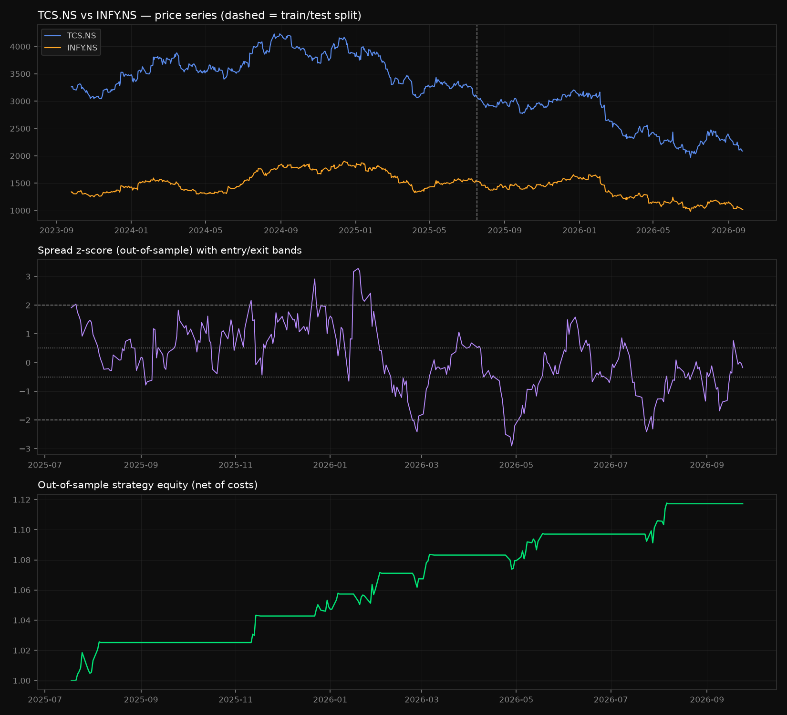

---

### INFY.NS / WIPRO.NS

- **Latest prices:** INFY.NS ₹1,014.50 · WIPRO.NS ₹163.64
- **Hedge ratio (train-fitted):** 0.1330
- **Cointegration (train):** FAIL at 5% — ADF -2.29, p=0.1739
- **Persistence:** passed 5% in 0 of 61 real-data runs (strict tier: 0/61)
- **Spread half-life:** 30.3 days
- **Current z-score:** -0.41
- **Signal today:** flat / no stretch
- ⚠️ _Pair did not cointegrate on training data. Any signal here is not statistically justified — observation only._

**Out-of-sample backtest** (beta frozen from train window):

| Metric | Value |
|---|---|
| Sharpe | 1.68 |
| Sortino | 1.97 |
| Annualised return | 8.62% |
| Annualised vol | 4.98% |
| Max drawdown | -2.28% |
| Round-trip trades | 6 |

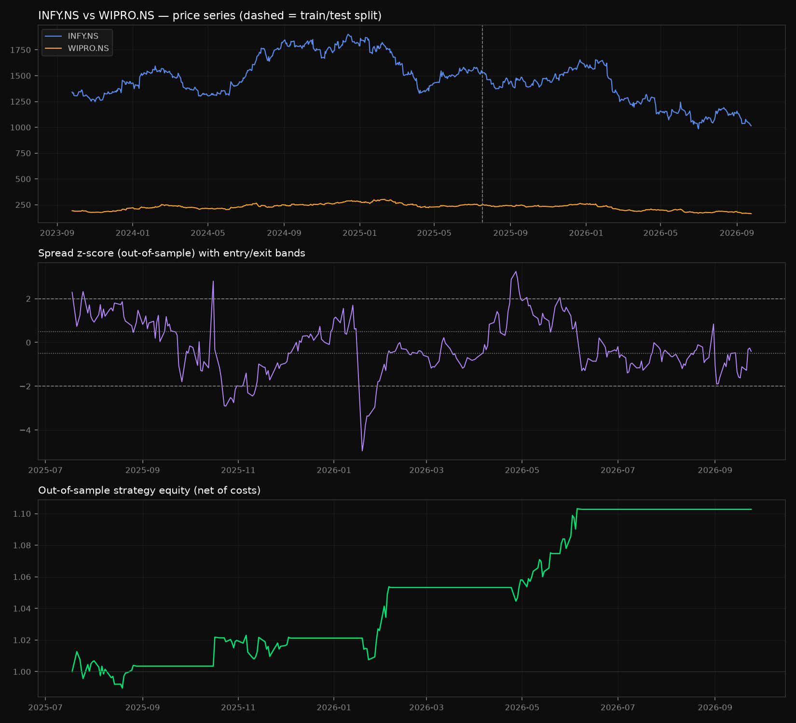

---

### HCLTECH.NS / TECHM.NS

- **Latest prices:** HCLTECH.NS ₹1,243.60 · TECHM.NS ₹1,543.00
- **Hedge ratio (train-fitted):** 0.9200
- **Cointegration (train):** FAIL at 5% — ADF -2.59, p=0.0947
- **Persistence:** passed 5% in 0 of 61 real-data runs (strict tier: 0/61)
- **Spread half-life:** 22.9 days
- **Current z-score:** -0.03
- **Signal today:** flat / no stretch
- ⚠️ _Pair did not cointegrate on training data. Any signal here is not statistically justified — observation only._

**Out-of-sample backtest** (beta frozen from train window):

| Metric | Value |
|---|---|
| Sharpe | -0.03 |
| Sortino | -0.03 |
| Annualised return | -0.46% |
| Annualised vol | 7.00% |
| Max drawdown | -8.10% |
| Round-trip trades | 5 |

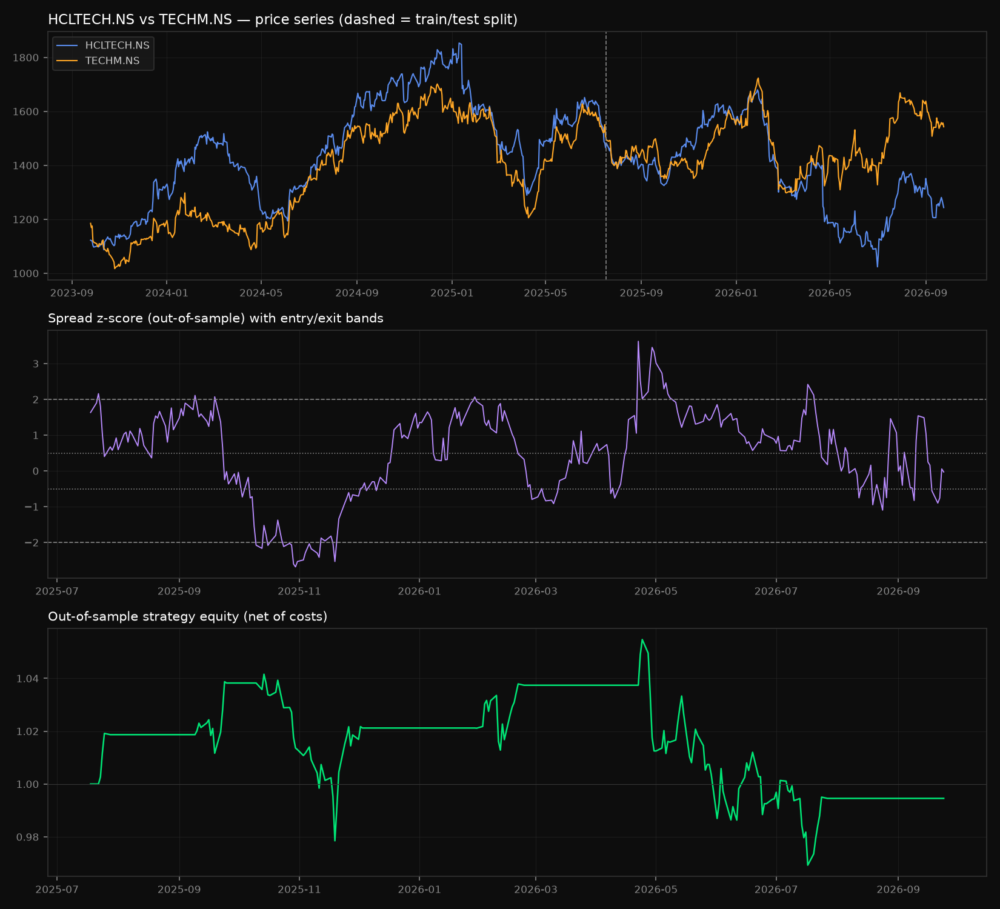

---

### ACC.NS / AMBUJACEM.NS

- **Latest prices:** ACC.NS ₹1,236.10 · AMBUJACEM.NS ₹384.10
- **Hedge ratio (train-fitted):** 0.1912
- **Cointegration (train):** FAIL at 5% — ADF -1.56, p=0.5047
- **Persistence:** passed 5% in 0 of 61 real-data runs (strict tier: 0/61)
- **Spread half-life:** 55.3 days
- **Current z-score:** -1.89
- **Signal today:** watch (approaching band)
- ⚠️ _Pair did not cointegrate on training data. Any signal here is not statistically justified — observation only._

**Out-of-sample backtest** (beta frozen from train window):

| Metric | Value |
|---|---|
| Sharpe | 0.24 |
| Sortino | 0.19 |
| Annualised return | 1.29% |
| Annualised vol | 6.14% |
| Max drawdown | -4.81% |
| Round-trip trades | 4 |

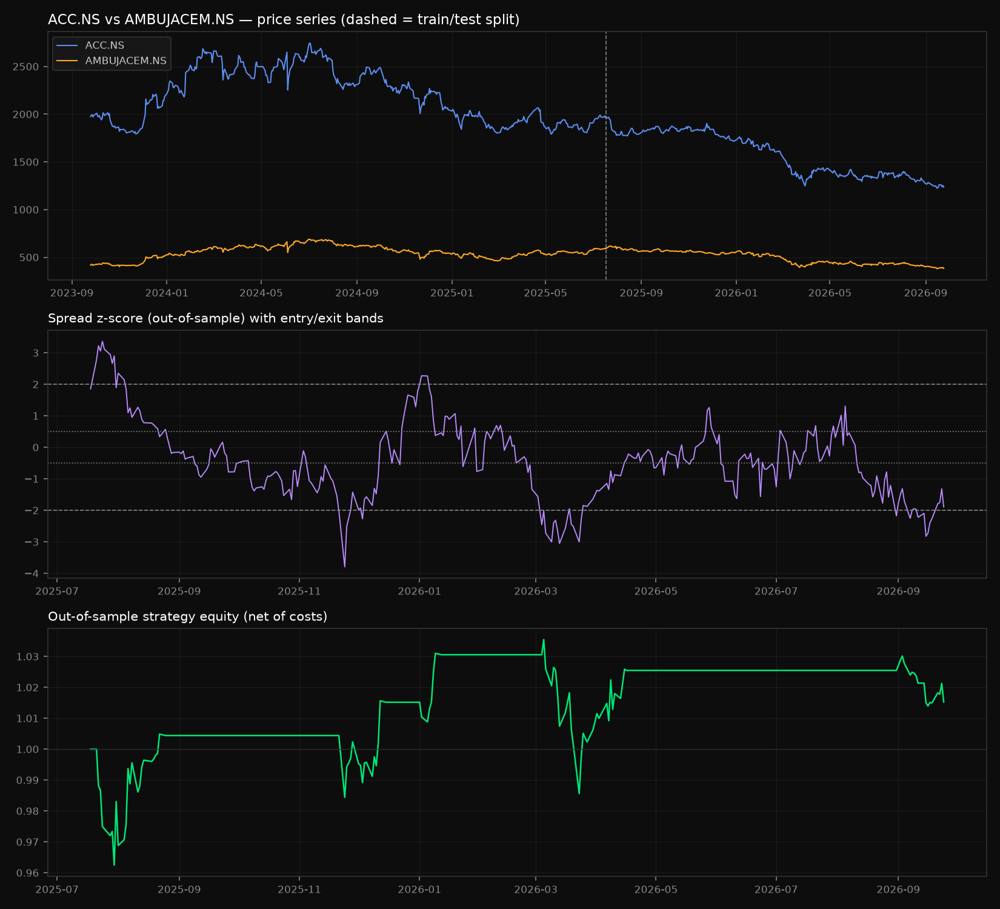

---

### ULTRACEMCO.NS / SHREECEM.NS

- **Latest prices:** ULTRACEMCO.NS ₹11,056.00 · SHREECEM.NS ₹22,350.00
- **Hedge ratio (train-fitted):** 0.8022
- **Cointegration (train):** FAIL at 5% — ADF -2.15, p=0.2262
- **Persistence:** passed 5% in 0 of 61 real-data runs (strict tier: 0/61)
- **Spread half-life:** 41.5 days
- **Current z-score:** -1.49
- **Signal today:** watch (approaching band)
- ⚠️ _Pair did not cointegrate on training data. Any signal here is not statistically justified — observation only._

**Out-of-sample backtest** (beta frozen from train window):

| Metric | Value |
|---|---|
| Sharpe | 0.09 |
| Sortino | 0.10 |
| Annualised return | 0.39% |
| Annualised vol | 7.14% |
| Max drawdown | -7.61% |
| Round-trip trades | 5 |

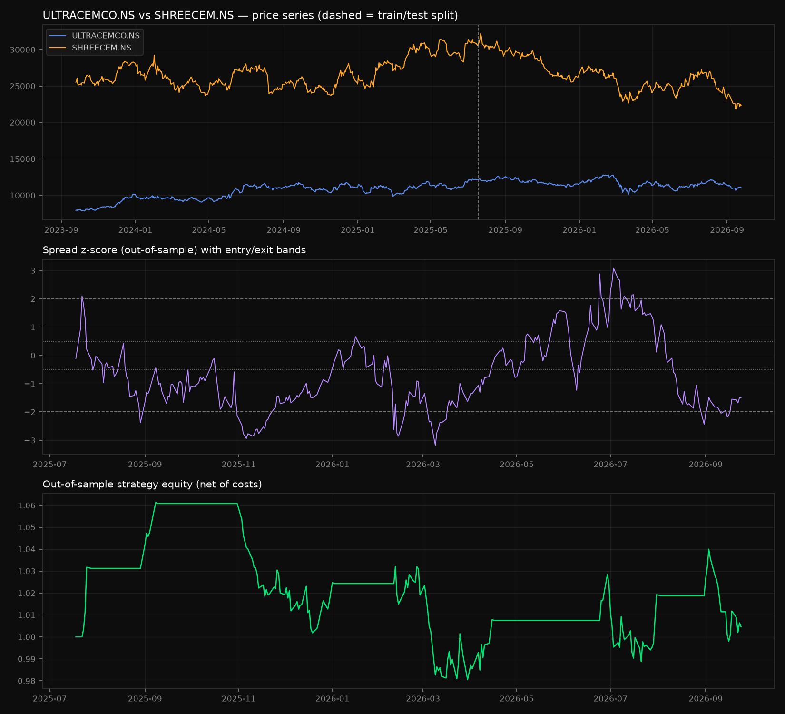

---

### IOC.NS / BPCL.NS

- **Latest prices:** IOC.NS ₹136.27 · BPCL.NS ₹307.10
- **Hedge ratio (train-fitted):** 1.7322
- **Cointegration (train):** FAIL at 5% — ADF -0.56, p=0.8793
- **Persistence:** passed 5% in 0 of 61 real-data runs (strict tier: 0/61)
- **Spread half-life:** 212.7 days
- **Current z-score:** -0.68
- **Signal today:** watch (approaching band)
- ⚠️ _Pair did not cointegrate on training data. Any signal here is not statistically justified — observation only._

**Out-of-sample backtest** (beta frozen from train window):

| Metric | Value |
|---|---|
| Sharpe | 0.31 |
| Sortino | 0.31 |
| Annualised return | 1.73% |
| Annualised vol | 6.07% |
| Max drawdown | -6.37% |
| Round-trip trades | 6 |

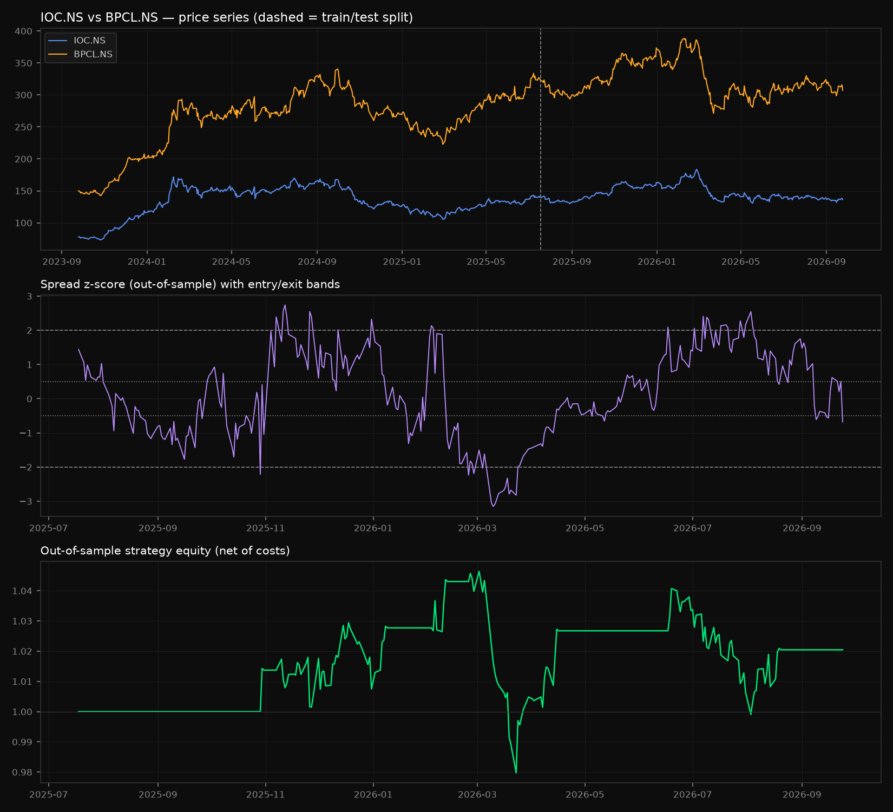

---

### BPCL.NS / HINDPETRO.NS

- **Latest prices:** BPCL.NS ₹307.10 · HINDPETRO.NS ₹350.40
- **Hedge ratio (train-fitted):** 1.3455
- **Cointegration (train):** FAIL at 5% — ADF -2.05, p=0.2653
- **Persistence:** passed 5% in 0 of 61 real-data runs (strict tier: 0/61)
- **Spread half-life:** 37.2 days
- **Current z-score:** -0.90
- **Signal today:** watch (approaching band)
- ⚠️ _Pair did not cointegrate on training data. Any signal here is not statistically justified — observation only._

**Out-of-sample backtest** (beta frozen from train window):

| Metric | Value |
|---|---|
| Sharpe | 0.06 |
| Sortino | 0.06 |
| Annualised return | 0.19% |
| Annualised vol | 5.70% |
| Max drawdown | -6.46% |
| Round-trip trades | 5 |

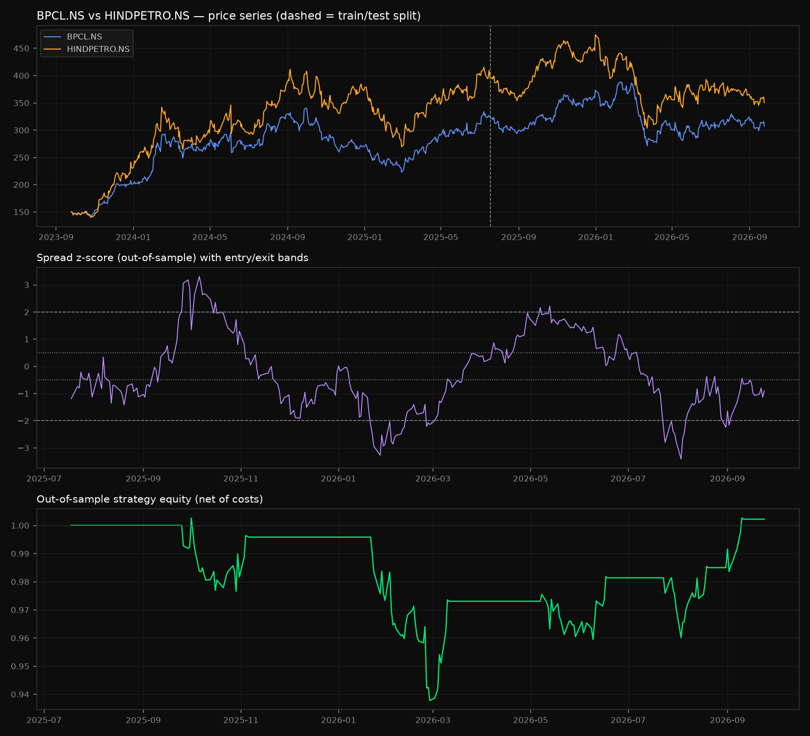

---

### ONGC.NS / COALINDIA.NS

- **Latest prices:** ONGC.NS ₹239.00 · COALINDIA.NS ₹422.00
- **Hedge ratio (train-fitted):** 1.4391
- **Cointegration (train):** PASS at 5% — ADF -3.42, p=0.0102
- **Persistence:** passed 5% in 53 of 61 real-data runs (strict tier: 1/61)
- **Spread half-life:** 12.3 days
- **Current z-score:** +0.88
- **Signal today:** watch (approaching band)

**Out-of-sample backtest** (beta frozen from train window):

| Metric | Value |
|---|---|
| Sharpe | 0.76 |
| Sortino | 0.57 |
| Annualised return | 5.46% |
| Annualised vol | 7.40% |
| Max drawdown | -6.10% |
| Round-trip trades | 5 |

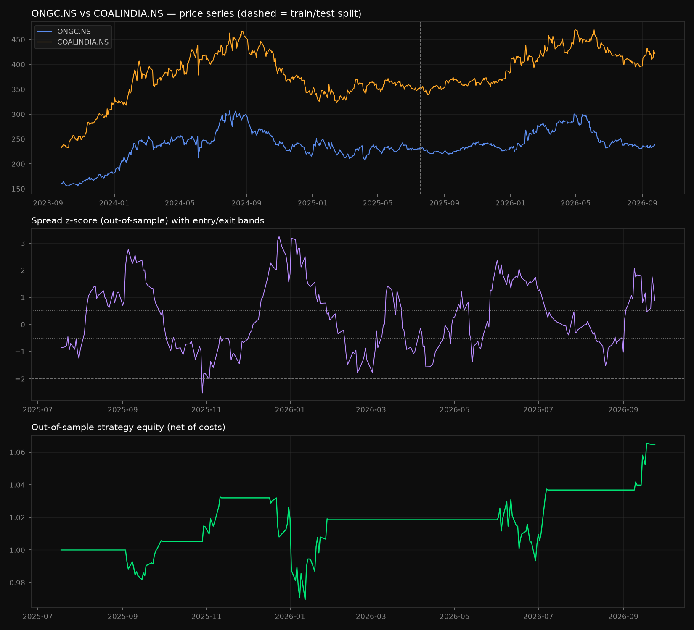

---

### NTPC.NS / POWERGRID.NS

- **Latest prices:** NTPC.NS ₹326.60 · POWERGRID.NS ₹266.40
- **Hedge ratio (train-fitted):** 0.8299
- **Cointegration (train):** FAIL at 5% — ADF -2.57, p=0.0994
- **Persistence:** passed 5% in 0 of 61 real-data runs (strict tier: 0/61)
- **Spread half-life:** 23.6 days
- **Current z-score:** +0.11
- **Signal today:** flat / no stretch
- ⚠️ _Pair did not cointegrate on training data. Any signal here is not statistically justified — observation only._

**Out-of-sample backtest** (beta frozen from train window):

| Metric | Value |
|---|---|
| Sharpe | 0.43 |
| Sortino | 0.33 |
| Annualised return | 2.21% |
| Annualised vol | 5.49% |
| Max drawdown | -5.21% |
| Round-trip trades | 6 |

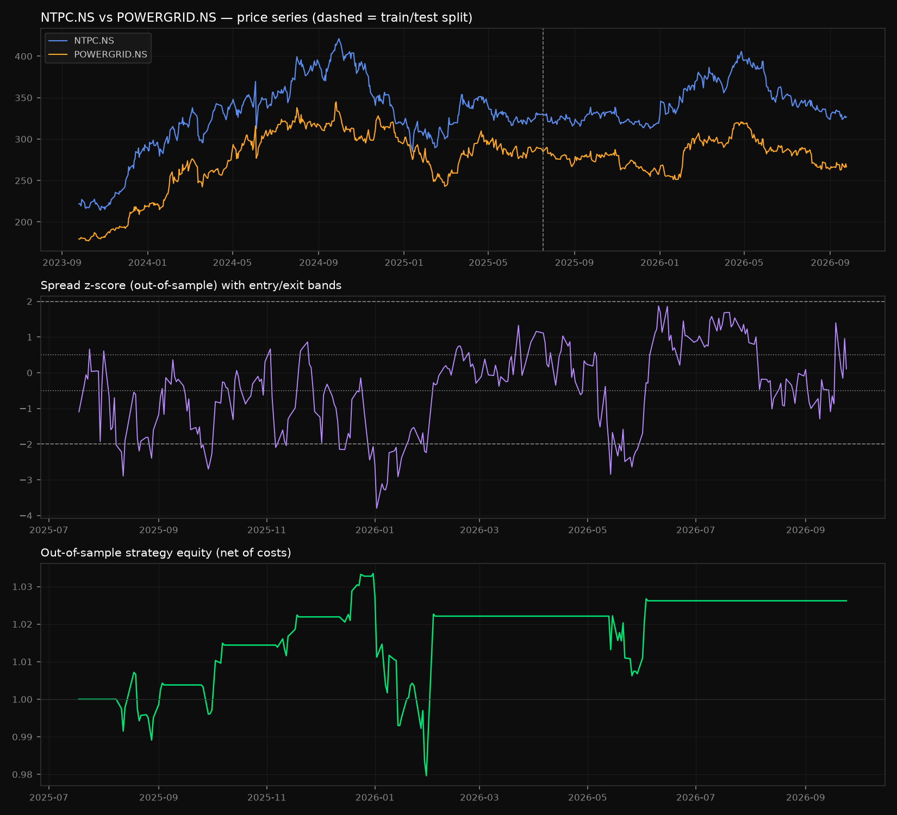

---

### BAJAJ-AUTO.NS / HEROMOTOCO.NS

- **Latest prices:** BAJAJ-AUTO.NS ₹11,208.00 · HEROMOTOCO.NS ₹5,296.00
- **Hedge ratio (train-fitted):** 0.4104
- **Cointegration (train):** FAIL at 5% — ADF -2.30, p=0.1716
- **Persistence:** passed 5% in 0 of 61 real-data runs (strict tier: 0/61)
- **Spread half-life:** 29.4 days
- **Current z-score:** +0.14
- **Signal today:** flat / no stretch
- ⚠️ _Pair did not cointegrate on training data. Any signal here is not statistically justified — observation only._

**Out-of-sample backtest** (beta frozen from train window):

| Metric | Value |
|---|---|
| Sharpe | -0.54 |
| Sortino | -0.56 |
| Annualised return | -6.11% |
| Annualised vol | 10.59% |
| Max drawdown | -19.64% |
| Round-trip trades | 6 |

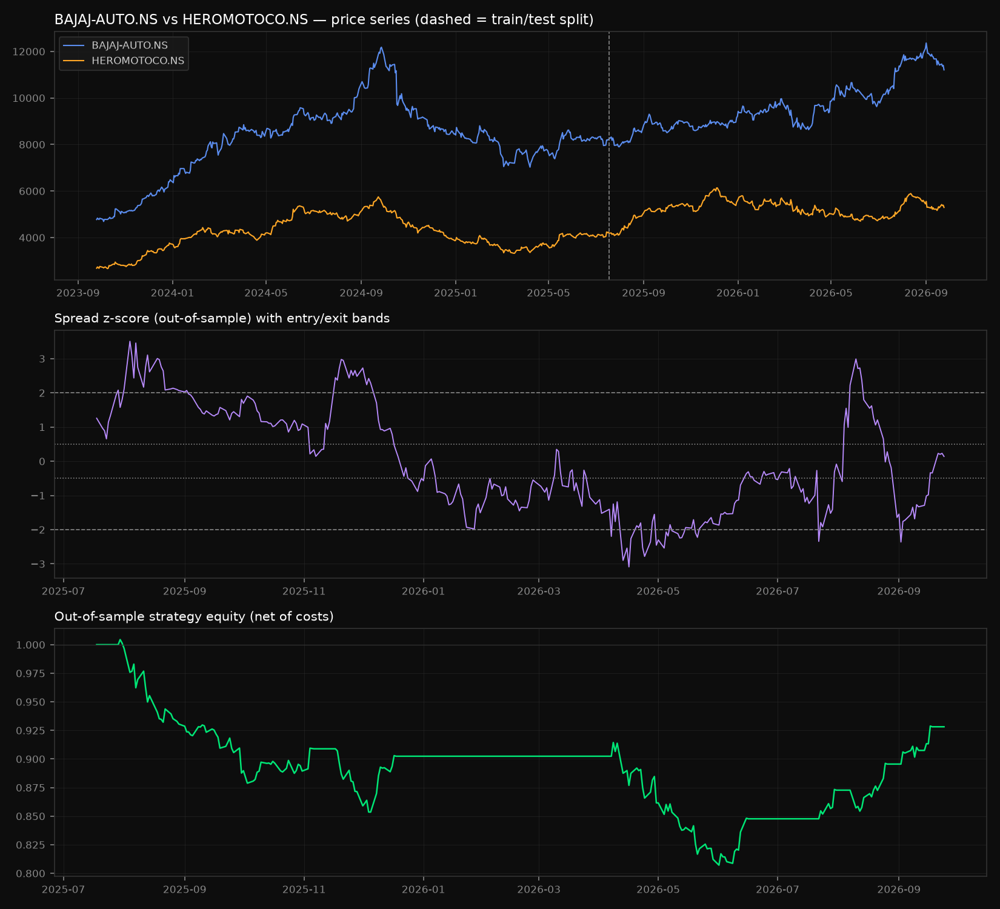

---

### TATASTEEL.NS / JSWSTEEL.NS

- **Latest prices:** TATASTEEL.NS ₹188.02 · JSWSTEEL.NS ₹1,273.20
- **Hedge ratio (train-fitted):** 3.1614
- **Cointegration (train):** FAIL at 5% — ADF -1.23, p=0.6585
- **Persistence:** passed 5% in 0 of 61 real-data runs (strict tier: 0/61)
- **Spread half-life:** 71.0 days
- **Current z-score:** -0.24
- **Signal today:** flat / no stretch
- ⚠️ _Pair did not cointegrate on training data. Any signal here is not statistically justified — observation only._

**Out-of-sample backtest** (beta frozen from train window):

| Metric | Value |
|---|---|
| Sharpe | 0.38 |
| Sortino | 0.33 |
| Annualised return | 2.68% |
| Annualised vol | 7.77% |
| Max drawdown | -5.46% |
| Round-trip trades | 5 |

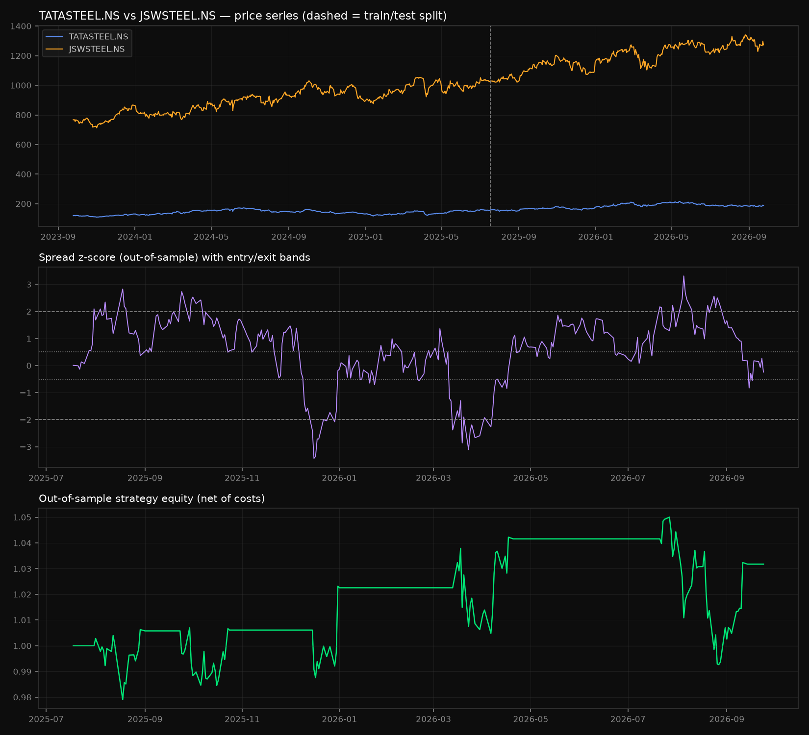

---

### SUNPHARMA.NS / CIPLA.NS

- **Latest prices:** SUNPHARMA.NS ₹1,849.90 · CIPLA.NS ₹1,399.00
- **Hedge ratio (train-fitted):** 0.4996
- **Cointegration (train):** PASS at 5% — ADF -3.42, p=0.0102
- **Persistence:** passed 5% in 61 of 61 real-data runs (strict tier: 5/61)
- **Spread half-life:** 10.7 days
- **Current z-score:** +0.38
- **Signal today:** flat / no stretch

**Out-of-sample backtest** (beta frozen from train window):

| Metric | Value |
|---|---|
| Sharpe | 0.05 |
| Sortino | 0.06 |
| Annualised return | 0.09% |
| Annualised vol | 7.83% |
| Max drawdown | -10.25% |
| Round-trip trades | 5 |

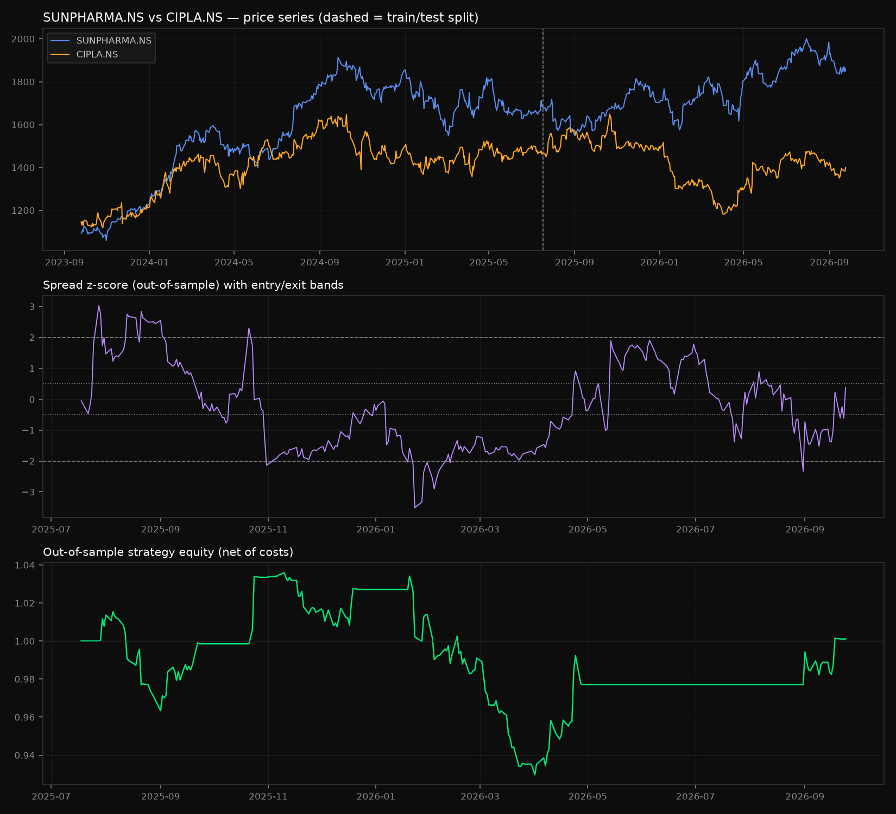

---

_Generated 2026-09-24 · pairs mean-reversion scanner · out-of-sample backtest · multiple-testing-aware · not investment advice._
