# Indian Pairs-Trading Scanner — 2026-09-28

> **What this is:** a market-neutral *pairs mean-reversion* scanner. It flags when two related NSE stocks have drifted apart far enough that their historical relationship signals a possible convergence trade. It does **not** forecast growth, rank "best" stocks, or predict company performance. A signal means the *spread between two stocks* is stretched — nothing about either stock being a good investment. Not investment advice; do your own research.

## Methodology (fixed in advance)

- **Universe:** 16 declared sector-mate pairs. Parameters (3y window, 60/40 train-test, z-entry 2.0, z-exit 0.5, 5 bps costs) are pre-registered; changes are logged in the README changelog *before* looking at results.
- **Multiple testing:** at the 5% level across 16 pairs, **≈0.8 false positives per run are expected by chance alone** even if nothing truly cointegrates. A single-day pass is a candidate, not a discovery.
- **Strict tier:** Bonferroni-corrected threshold p < 0.0031 (marked ✓✓).
- **Evidence = persistence:** the Persistence column counts how often each pair has passed the 5% test across all *real-data* daily runs recorded in `reports/history.csv`. Pairs deserve attention only when they pass persistently.

## Summary

| Pair | p-value | Coint. | Persistence | Current z | Signal | OOS Sharpe |
|---|---|---|---|---|---|---|
| HDFCBANK.NS/ICICIBANK.NS | 0.0910 | ✗ | 1/52 | -0.95 | watch | -0.57 |
| AXISBANK.NS/ICICIBANK.NS | 0.8816 | ✗ | 0/63 | -1.07 | watch | -0.18 |
| KOTAKBANK.NS/HDFCBANK.NS | 0.1123 | ✗ | 0/63 | -0.26 | flat / no stretch | 1.00 |
| SBIN.NS/BANKBARODA.NS | 0.1482 | ✗ | 0/63 | +0.40 | flat / no stretch | 0.02 |
| TCS.NS/INFY.NS | 0.7896 | ✗ | 0/63 | -0.61 | watch | 2.56 |
| INFY.NS/WIPRO.NS | 0.1969 | ✗ | 0/63 | +0.49 | flat / no stretch | 1.83 |
| HCLTECH.NS/TECHM.NS | 0.2704 | ✗ | 0/63 | -0.42 | flat / no stretch | -0.02 |
| ACC.NS/AMBUJACEM.NS | 0.4572 | ✗ | 0/63 | -1.85 | watch | 0.29 |
| ULTRACEMCO.NS/SHREECEM.NS | 0.2138 | ✗ | 0/63 | -1.38 | watch | 0.13 |
| IOC.NS/BPCL.NS | 0.8648 | ✗ | 0/63 | -0.20 | flat / no stretch | 0.25 |
| BPCL.NS/HINDPETRO.NS | 0.2573 | ✗ | 0/63 | -1.01 | watch | 0.06 |
| ONGC.NS/COALINDIA.NS | 0.0104 | ✓ | 55/63 | +1.70 | watch | 0.75 |
| NTPC.NS/POWERGRID.NS | 0.1024 | ✗ | 0/63 | +0.87 | watch | 0.43 |
| BAJAJ-AUTO.NS/HEROMOTOCO.NS | 0.1711 | ✗ | 0/63 | +0.31 | flat / no stretch | -0.54 |
| TATASTEEL.NS/JSWSTEEL.NS | 0.6317 | ✗ | 0/63 | -0.16 | flat / no stretch | 0.35 |
| SUNPHARMA.NS/CIPLA.NS | 0.0102 | ✓ | 63/63 | +0.39 | flat / no stretch | 0.05 |

_Legend: ✓✓ passes strict Bonferroni tier · ✓ passes 5% only · ✗ fails. Persistence = 5%-passes / real-data runs recorded. \*no real-data history yet._

---

### HDFCBANK.NS / ICICIBANK.NS

- **Latest prices:** HDFCBANK.NS ₹735.60 · ICICIBANK.NS ₹1,326.80
- **Hedge ratio (train-fitted):** 1.6531
- **Cointegration (train):** FAIL at 5% — ADF -2.61, p=0.0910
- **Persistence:** passed 5% in 1 of 52 real-data runs (strict tier: 0/52)
- **Spread half-life:** 25.7 days
- **Current z-score:** -0.95
- **Signal today:** watch (approaching band)
- ⚠️ _Pair did not cointegrate on training data. Any signal here is not statistically justified — observation only._

**Out-of-sample backtest** (beta frozen from train window):

| Metric | Value |
|---|---|
| Sharpe | -0.57 |
| Sortino | -0.60 |
| Annualised return | -3.77% |
| Annualised vol | 6.43% |
| Max drawdown | -8.14% |
| Round-trip trades | 4 |

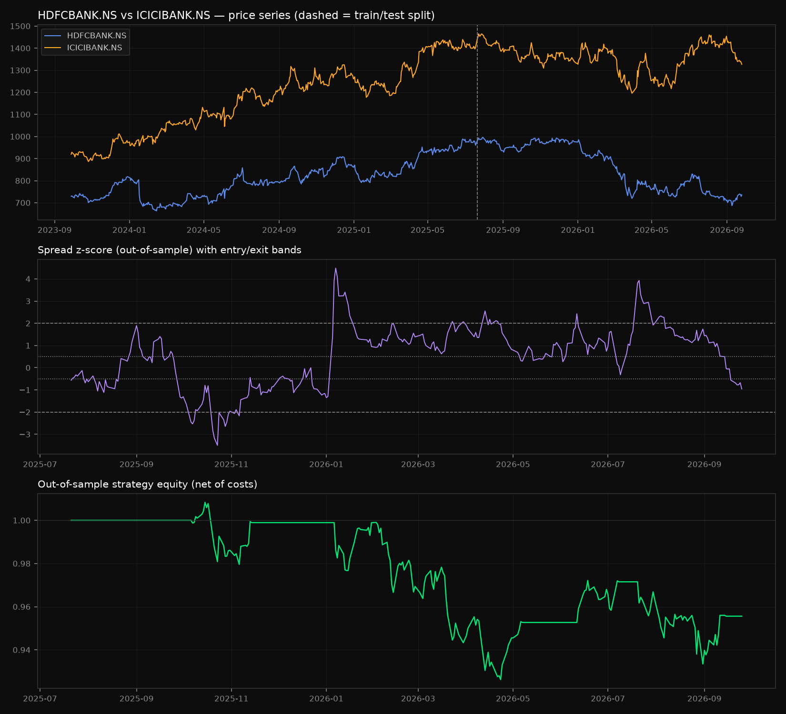

---

### AXISBANK.NS / ICICIBANK.NS

- **Latest prices:** AXISBANK.NS ₹1,222.40 · ICICIBANK.NS ₹1,326.80
- **Hedge ratio (train-fitted):** 0.9767
- **Cointegration (train):** FAIL at 5% — ADF -0.55, p=0.8816
- **Persistence:** passed 5% in 0 of 63 real-data runs (strict tier: 0/63)
- **Spread half-life:** 203.8 days
- **Current z-score:** -1.07
- **Signal today:** watch (approaching band)
- ⚠️ _Pair did not cointegrate on training data. Any signal here is not statistically justified — observation only._

**Out-of-sample backtest** (beta frozen from train window):

| Metric | Value |
|---|---|
| Sharpe | -0.18 |
| Sortino | -0.18 |
| Annualised return | -1.90% |
| Annualised vol | 8.73% |
| Max drawdown | -7.80% |
| Round-trip trades | 6 |

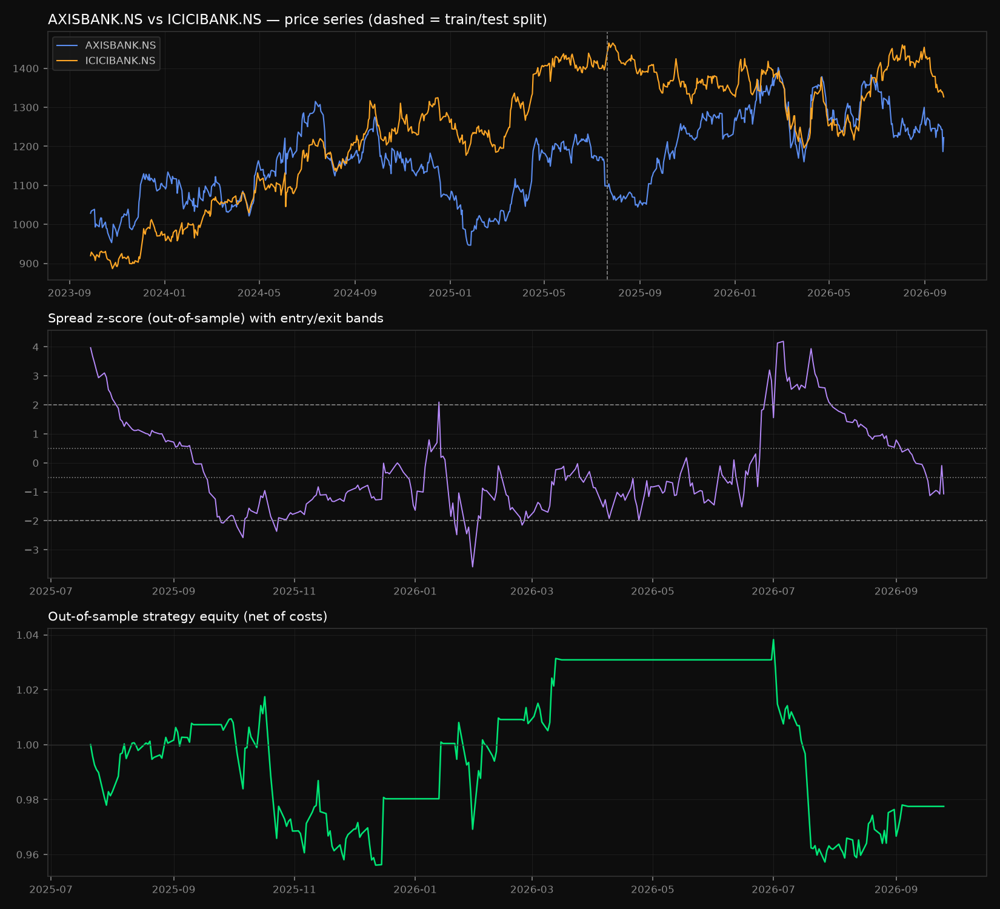

---

### KOTAKBANK.NS / HDFCBANK.NS

- **Latest prices:** KOTAKBANK.NS ₹404.00 · HDFCBANK.NS ₹735.60
- **Hedge ratio (train-fitted):** 2.1340
- **Cointegration (train):** FAIL at 5% — ADF -2.51, p=0.1123
- **Persistence:** passed 5% in 0 of 63 real-data runs (strict tier: 0/63)
- **Spread half-life:** 24.5 days
- **Current z-score:** -0.26
- **Signal today:** flat / no stretch
- ⚠️ _Pair did not cointegrate on training data. Any signal here is not statistically justified — observation only._

**Out-of-sample backtest** (beta frozen from train window):

| Metric | Value |
|---|---|
| Sharpe | 1.00 |
| Sortino | 0.79 |
| Annualised return | 6.78% |
| Annualised vol | 6.75% |
| Max drawdown | -4.26% |
| Round-trip trades | 7 |

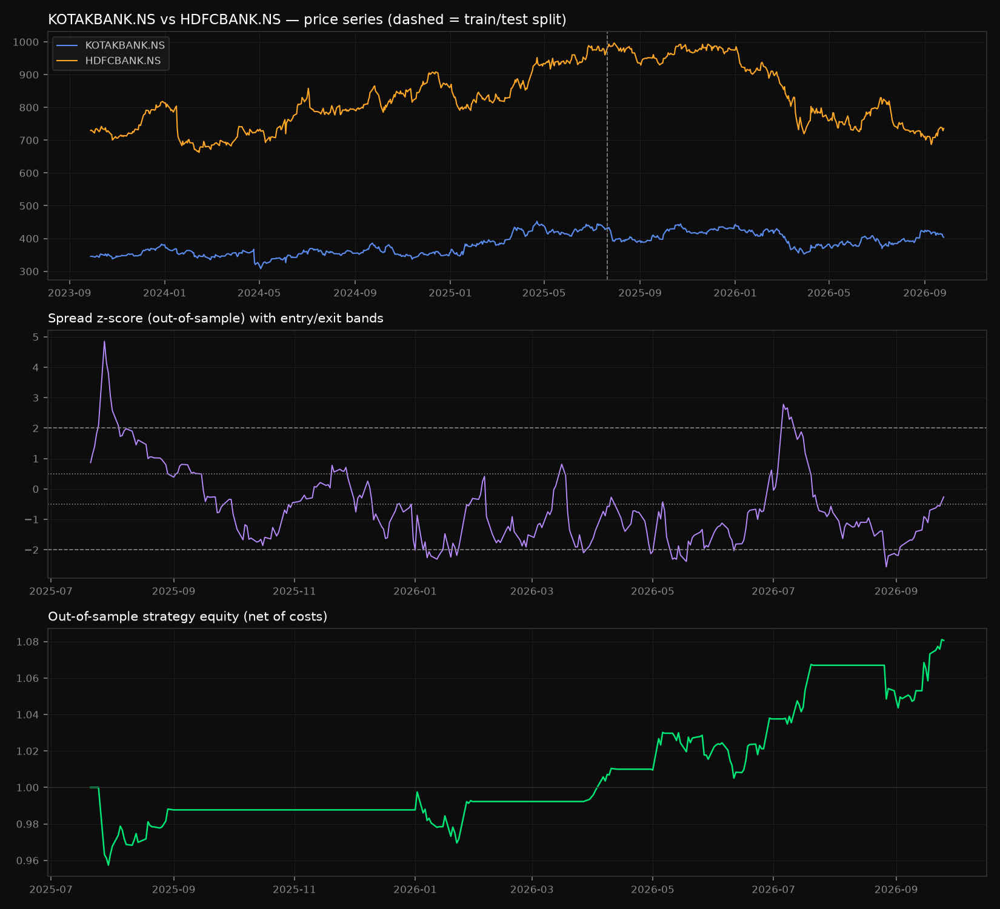

---

### SBIN.NS / BANKBARODA.NS

- **Latest prices:** SBIN.NS ₹983.00 · BANKBARODA.NS ₹235.26
- **Hedge ratio (train-fitted):** 0.1901
- **Cointegration (train):** FAIL at 5% — ADF -2.38, p=0.1482
- **Persistence:** passed 5% in 0 of 63 real-data runs (strict tier: 0/63)
- **Spread half-life:** 21.3 days
- **Current z-score:** +0.40
- **Signal today:** flat / no stretch
- ⚠️ _Pair did not cointegrate on training data. Any signal here is not statistically justified — observation only._

**Out-of-sample backtest** (beta frozen from train window):

| Metric | Value |
|---|---|
| Sharpe | 0.02 |
| Sortino | 0.02 |
| Annualised return | -0.20% |
| Annualised vol | 8.99% |
| Max drawdown | -8.66% |
| Round-trip trades | 5 |

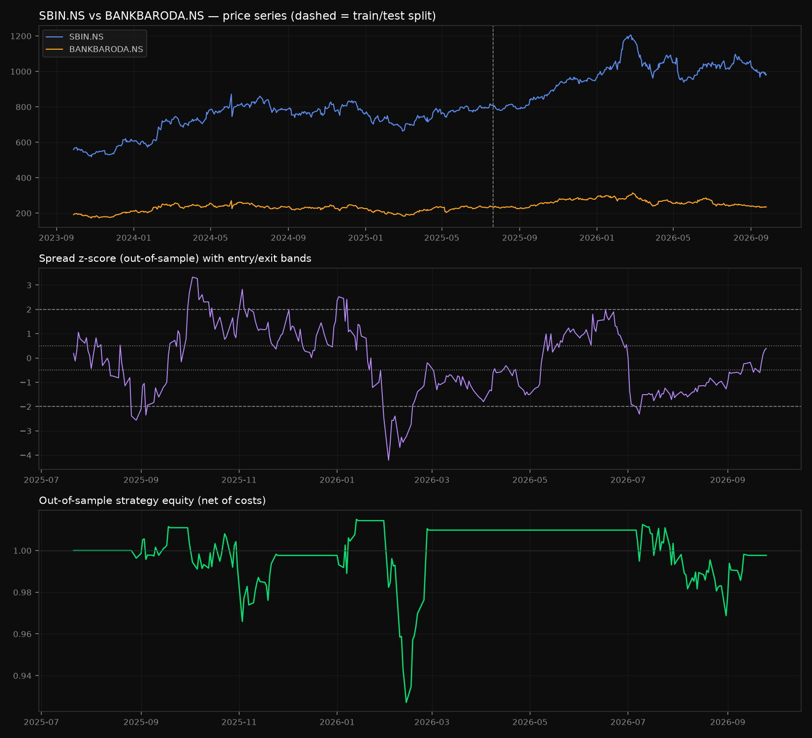

---

### TCS.NS / INFY.NS

- **Latest prices:** TCS.NS ₹2,082.00 · INFY.NS ₹1,000.20
- **Hedge ratio (train-fitted):** 0.4645
- **Cointegration (train):** FAIL at 5% — ADF -0.90, p=0.7896
- **Persistence:** passed 5% in 0 of 63 real-data runs (strict tier: 0/63)
- **Spread half-life:** 84.2 days
- **Current z-score:** -0.61
- **Signal today:** watch (approaching band)
- ⚠️ _Pair did not cointegrate on training data. Any signal here is not statistically justified — observation only._

**Out-of-sample backtest** (beta frozen from train window):

| Metric | Value |
|---|---|
| Sharpe | 2.56 |
| Sortino | 2.78 |
| Annualised return | 10.58% |
| Annualised vol | 3.95% |
| Max drawdown | -1.35% |
| Round-trip trades | 7 |

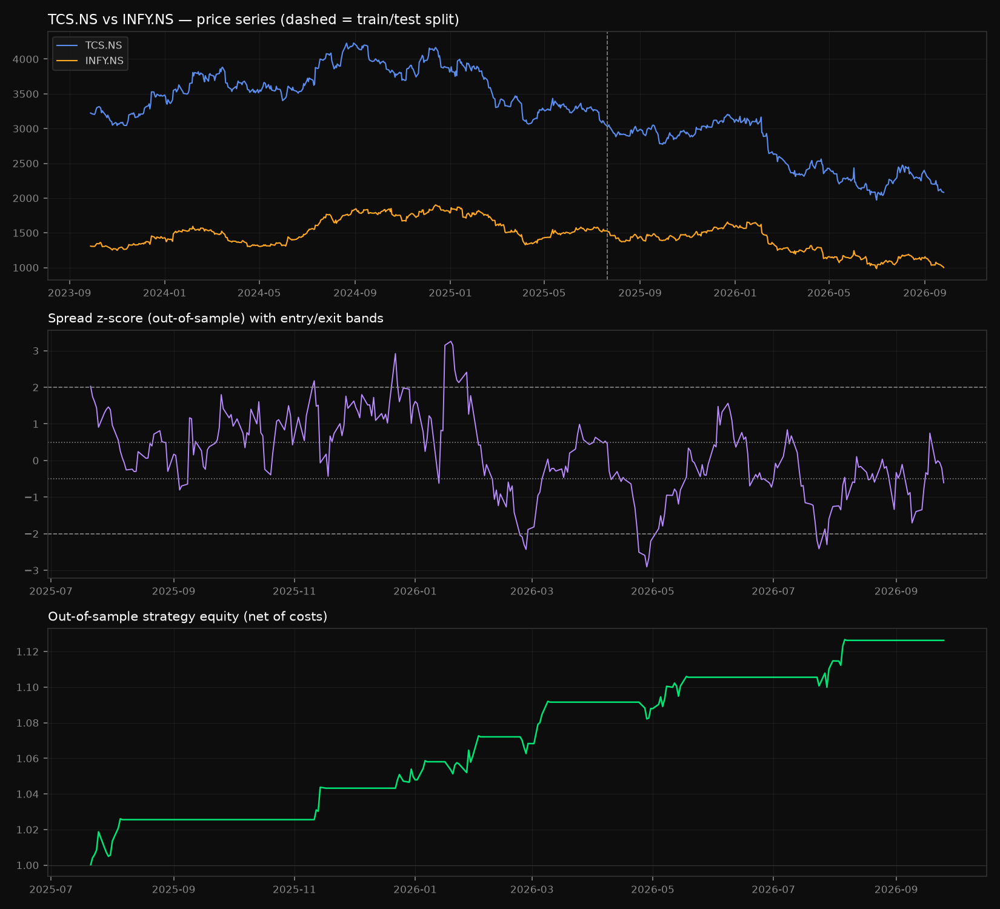

---

### INFY.NS / WIPRO.NS

- **Latest prices:** INFY.NS ₹1,000.20 · WIPRO.NS ₹164.02
- **Hedge ratio (train-fitted):** 0.1323
- **Cointegration (train):** FAIL at 5% — ADF -2.23, p=0.1969
- **Persistence:** passed 5% in 0 of 63 real-data runs (strict tier: 0/63)
- **Spread half-life:** 31.0 days
- **Current z-score:** +0.49
- **Signal today:** flat / no stretch
- ⚠️ _Pair did not cointegrate on training data. Any signal here is not statistically justified — observation only._

**Out-of-sample backtest** (beta frozen from train window):

| Metric | Value |
|---|---|
| Sharpe | 1.83 |
| Sortino | 2.00 |
| Annualised return | 9.11% |
| Annualised vol | 4.83% |
| Max drawdown | -1.74% |
| Round-trip trades | 6 |

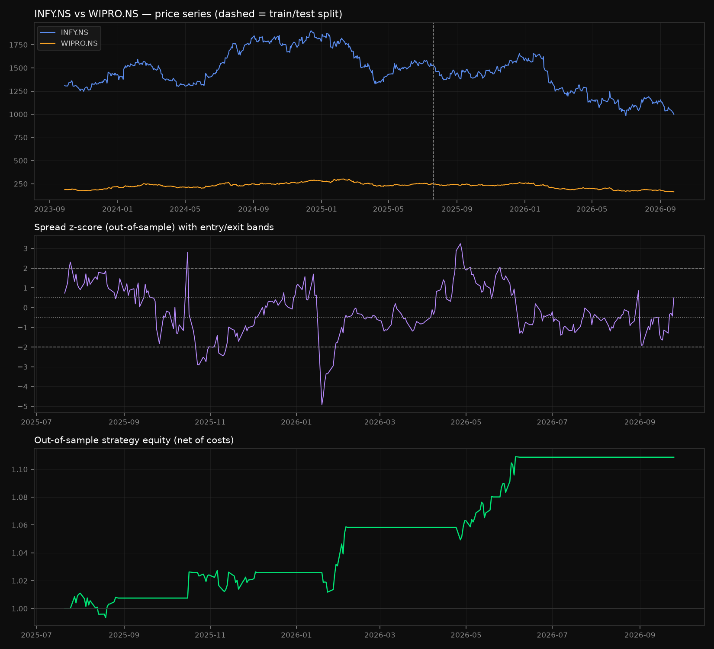

---

### HCLTECH.NS / TECHM.NS

- **Latest prices:** HCLTECH.NS ₹1,258.00 · TECHM.NS ₹1,548.00
- **Hedge ratio (train-fitted):** 0.9287
- **Cointegration (train):** FAIL at 5% — ADF -2.04, p=0.2704
- **Persistence:** passed 5% in 0 of 63 real-data runs (strict tier: 0/63)
- **Spread half-life:** 22.9 days
- **Current z-score:** -0.42
- **Signal today:** flat / no stretch
- ⚠️ _Pair did not cointegrate on training data. Any signal here is not statistically justified — observation only._

**Out-of-sample backtest** (beta frozen from train window):

| Metric | Value |
|---|---|
| Sharpe | -0.02 |
| Sortino | -0.02 |
| Annualised return | -0.37% |
| Annualised vol | 7.03% |
| Max drawdown | -8.12% |
| Round-trip trades | 5 |

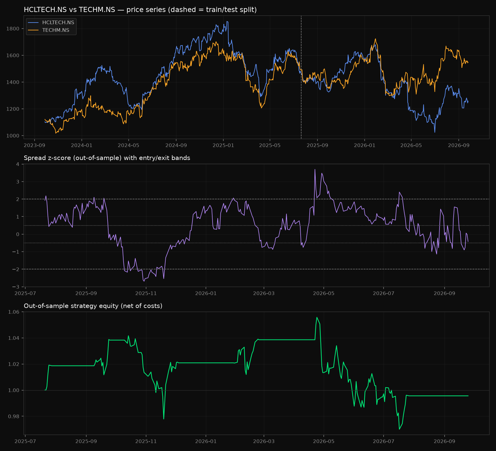

---

### ACC.NS / AMBUJACEM.NS

- **Latest prices:** ACC.NS ₹1,236.40 · AMBUJACEM.NS ₹383.80
- **Hedge ratio (train-fitted):** 0.1888
- **Cointegration (train):** FAIL at 5% — ADF -1.65, p=0.4572
- **Persistence:** passed 5% in 0 of 63 real-data runs (strict tier: 0/63)
- **Spread half-life:** 52.9 days
- **Current z-score:** -1.85
- **Signal today:** watch (approaching band)
- ⚠️ _Pair did not cointegrate on training data. Any signal here is not statistically justified — observation only._

**Out-of-sample backtest** (beta frozen from train window):

| Metric | Value |
|---|---|
| Sharpe | 0.29 |
| Sortino | 0.23 |
| Annualised return | 1.60% |
| Annualised vol | 6.05% |
| Max drawdown | -4.79% |
| Round-trip trades | 4 |

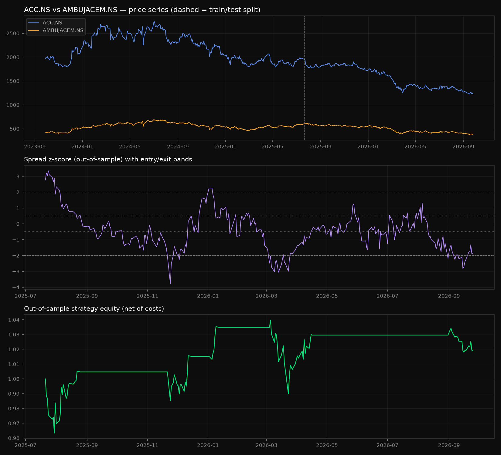

---

### ULTRACEMCO.NS / SHREECEM.NS

- **Latest prices:** ULTRACEMCO.NS ₹11,155.00 · SHREECEM.NS ₹22,520.00
- **Hedge ratio (train-fitted):** 0.8234
- **Cointegration (train):** FAIL at 5% — ADF -2.18, p=0.2138
- **Persistence:** passed 5% in 0 of 63 real-data runs (strict tier: 0/63)
- **Spread half-life:** 42.0 days
- **Current z-score:** -1.38
- **Signal today:** watch (approaching band)
- ⚠️ _Pair did not cointegrate on training data. Any signal here is not statistically justified — observation only._

**Out-of-sample backtest** (beta frozen from train window):

| Metric | Value |
|---|---|
| Sharpe | 0.13 |
| Sortino | 0.15 |
| Annualised return | 0.67% |
| Annualised vol | 6.89% |
| Max drawdown | -7.30% |
| Round-trip trades | 5 |

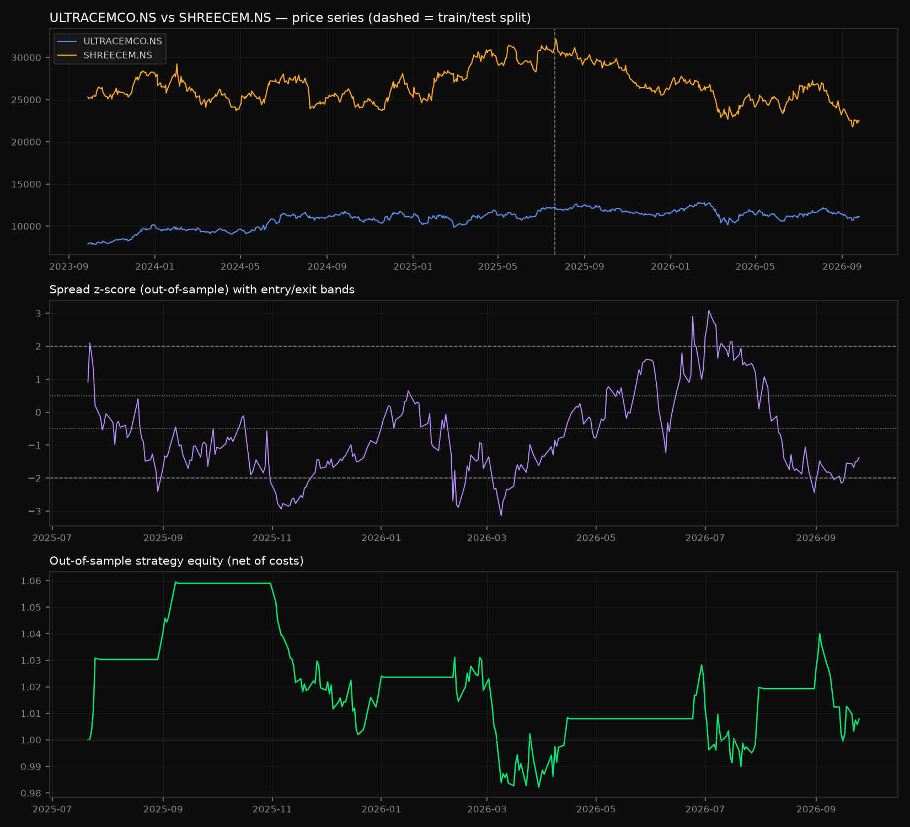

---

### IOC.NS / BPCL.NS

- **Latest prices:** IOC.NS ₹135.70 · BPCL.NS ₹308.50
- **Hedge ratio (train-fitted):** 1.7215
- **Cointegration (train):** FAIL at 5% — ADF -0.63, p=0.8648
- **Persistence:** passed 5% in 0 of 63 real-data runs (strict tier: 0/63)
- **Spread half-life:** 191.2 days
- **Current z-score:** -0.20
- **Signal today:** flat / no stretch
- ⚠️ _Pair did not cointegrate on training data. Any signal here is not statistically justified — observation only._

**Out-of-sample backtest** (beta frozen from train window):

| Metric | Value |
|---|---|
| Sharpe | 0.25 |
| Sortino | 0.25 |
| Annualised return | 1.39% |
| Annualised vol | 6.18% |
| Max drawdown | -6.45% |
| Round-trip trades | 6 |

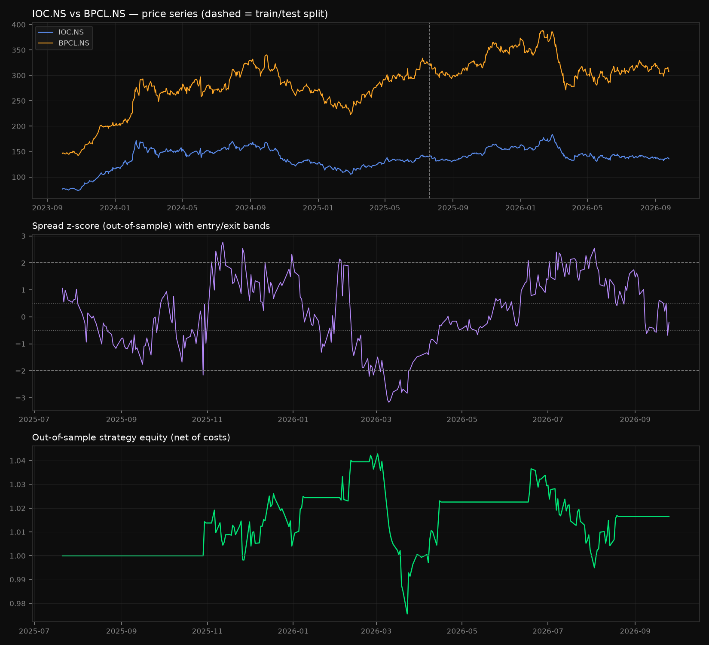

---

### BPCL.NS / HINDPETRO.NS

- **Latest prices:** BPCL.NS ₹308.50 · HINDPETRO.NS ₹351.00
- **Hedge ratio (train-fitted):** 1.3421
- **Cointegration (train):** FAIL at 5% — ADF -2.07, p=0.2573
- **Persistence:** passed 5% in 0 of 63 real-data runs (strict tier: 0/63)
- **Spread half-life:** 36.8 days
- **Current z-score:** -1.01
- **Signal today:** watch (approaching band)
- ⚠️ _Pair did not cointegrate on training data. Any signal here is not statistically justified — observation only._

**Out-of-sample backtest** (beta frozen from train window):

| Metric | Value |
|---|---|
| Sharpe | 0.06 |
| Sortino | 0.05 |
| Annualised return | 0.16% |
| Annualised vol | 5.70% |
| Max drawdown | -6.47% |
| Round-trip trades | 5 |

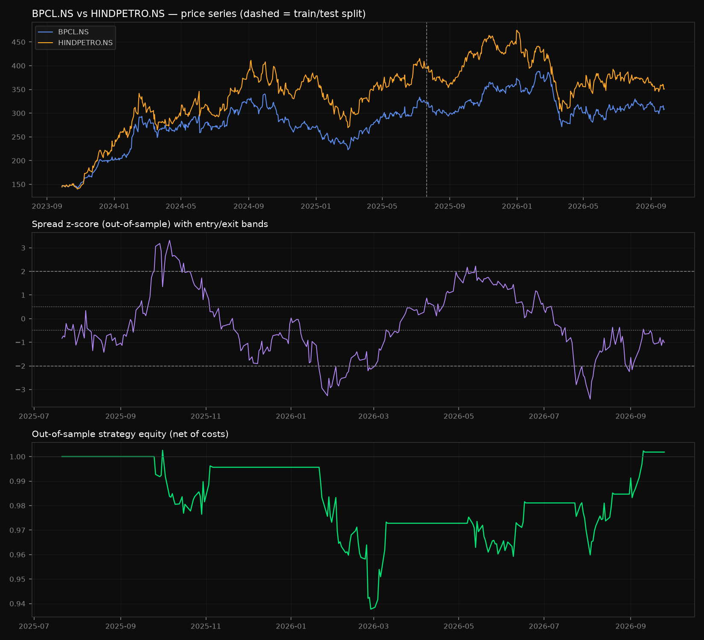

---

### ONGC.NS / COALINDIA.NS

- **Latest prices:** ONGC.NS ₹235.86 · COALINDIA.NS ₹426.10
- **Hedge ratio (train-fitted):** 1.4270
- **Cointegration (train):** PASS at 5% — ADF -3.42, p=0.0104
- **Persistence:** passed 5% in 55 of 63 real-data runs (strict tier: 1/63)
- **Spread half-life:** 12.2 days
- **Current z-score:** +1.70
- **Signal today:** watch (approaching band)

**Out-of-sample backtest** (beta frozen from train window):

| Metric | Value |
|---|---|
| Sharpe | 0.75 |
| Sortino | 0.57 |
| Annualised return | 5.47% |
| Annualised vol | 7.44% |
| Max drawdown | -6.15% |
| Round-trip trades | 5 |

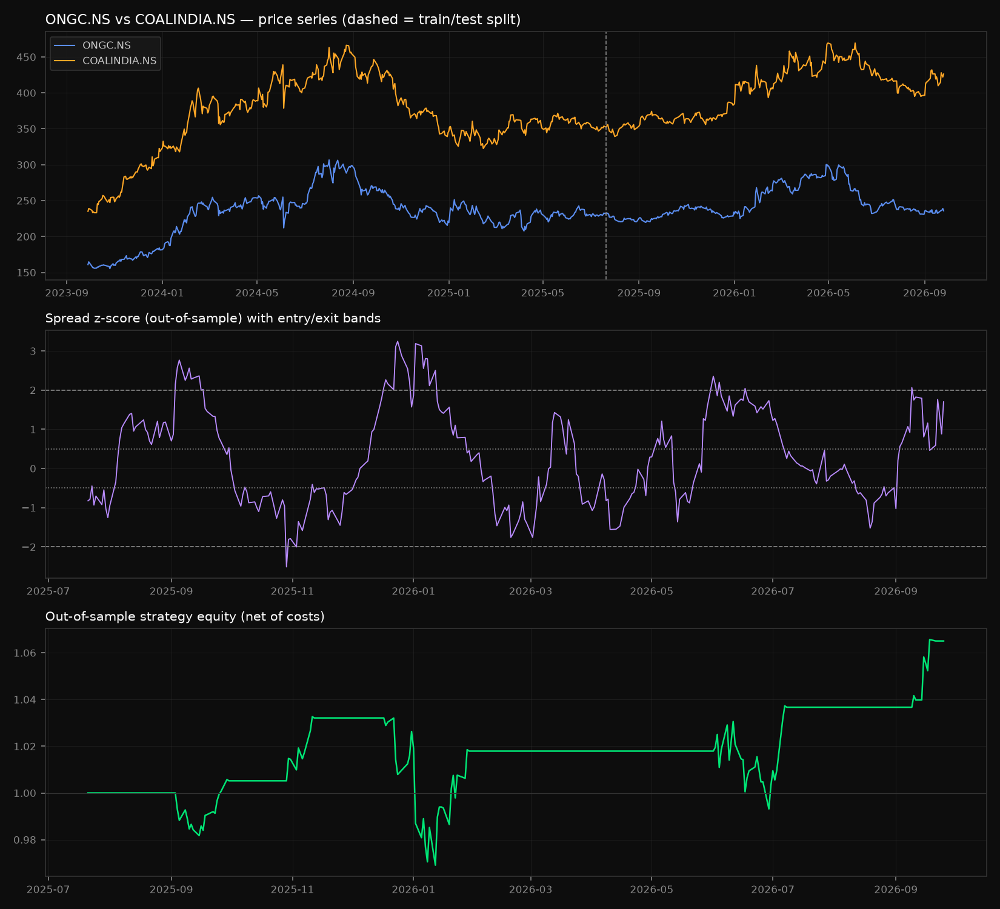

---

### NTPC.NS / POWERGRID.NS

- **Latest prices:** NTPC.NS ₹326.60 · POWERGRID.NS ₹269.50
- **Hedge ratio (train-fitted):** 0.8234
- **Cointegration (train):** FAIL at 5% — ADF -2.56, p=0.1024
- **Persistence:** passed 5% in 0 of 63 real-data runs (strict tier: 0/63)
- **Spread half-life:** 23.7 days
- **Current z-score:** +0.87
- **Signal today:** watch (approaching band)
- ⚠️ _Pair did not cointegrate on training data. Any signal here is not statistically justified — observation only._

**Out-of-sample backtest** (beta frozen from train window):

| Metric | Value |
|---|---|
| Sharpe | 0.43 |
| Sortino | 0.33 |
| Annualised return | 2.21% |
| Annualised vol | 5.46% |
| Max drawdown | -5.18% |
| Round-trip trades | 6 |

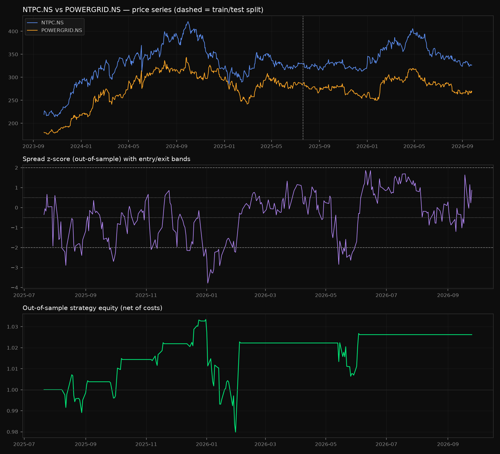

---

### BAJAJ-AUTO.NS / HEROMOTOCO.NS

- **Latest prices:** BAJAJ-AUTO.NS ₹11,281.00 · HEROMOTOCO.NS ₹5,360.00
- **Hedge ratio (train-fitted):** 0.4099
- **Cointegration (train):** FAIL at 5% — ADF -2.30, p=0.1711
- **Persistence:** passed 5% in 0 of 63 real-data runs (strict tier: 0/63)
- **Spread half-life:** 29.3 days
- **Current z-score:** +0.31
- **Signal today:** flat / no stretch
- ⚠️ _Pair did not cointegrate on training data. Any signal here is not statistically justified — observation only._

**Out-of-sample backtest** (beta frozen from train window):

| Metric | Value |
|---|---|
| Sharpe | -0.54 |
| Sortino | -0.56 |
| Annualised return | -6.07% |
| Annualised vol | 10.53% |
| Max drawdown | -19.54% |
| Round-trip trades | 6 |

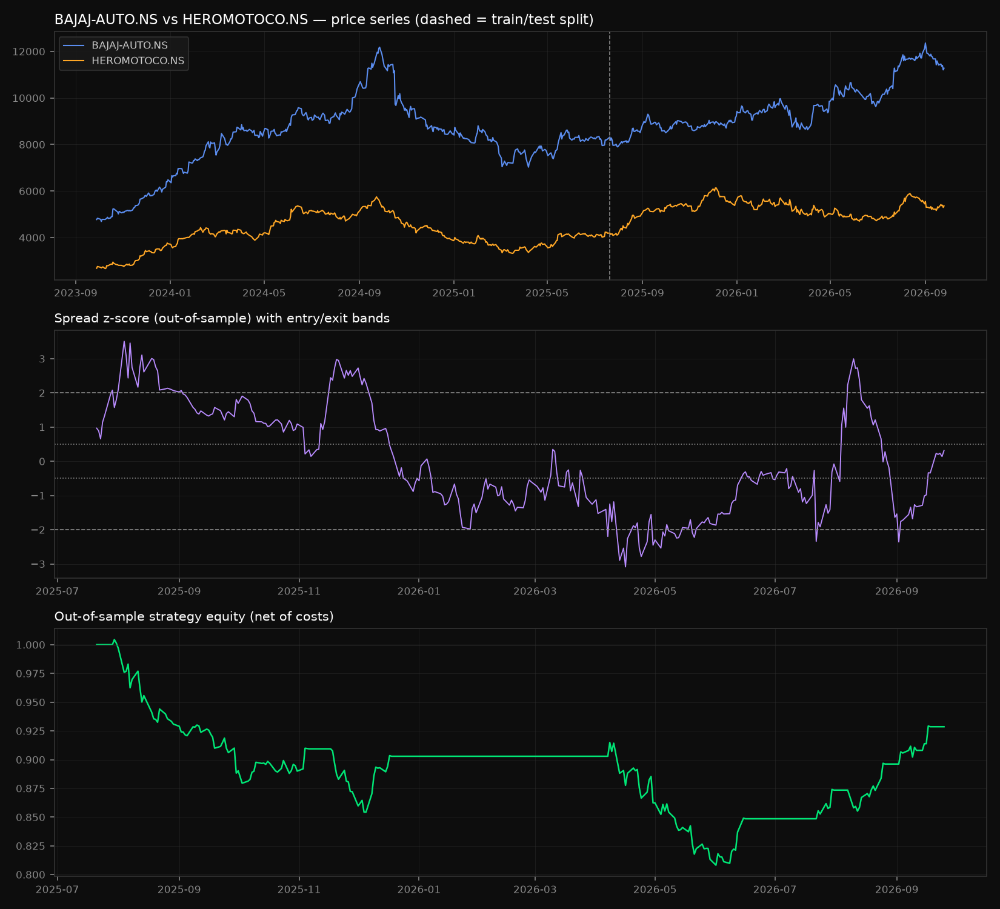

---

### TATASTEEL.NS / JSWSTEEL.NS

- **Latest prices:** TATASTEEL.NS ₹187.97 · JSWSTEEL.NS ₹1,277.00
- **Hedge ratio (train-fitted):** 3.1283
- **Cointegration (train):** FAIL at 5% — ADF -1.29, p=0.6317
- **Persistence:** passed 5% in 0 of 63 real-data runs (strict tier: 0/63)
- **Spread half-life:** 66.4 days
- **Current z-score:** -0.16
- **Signal today:** flat / no stretch
- ⚠️ _Pair did not cointegrate on training data. Any signal here is not statistically justified — observation only._

**Out-of-sample backtest** (beta frozen from train window):

| Metric | Value |
|---|---|
| Sharpe | 0.35 |
| Sortino | 0.33 |
| Annualised return | 2.54% |
| Annualised vol | 8.19% |
| Max drawdown | -5.48% |
| Round-trip trades | 5 |

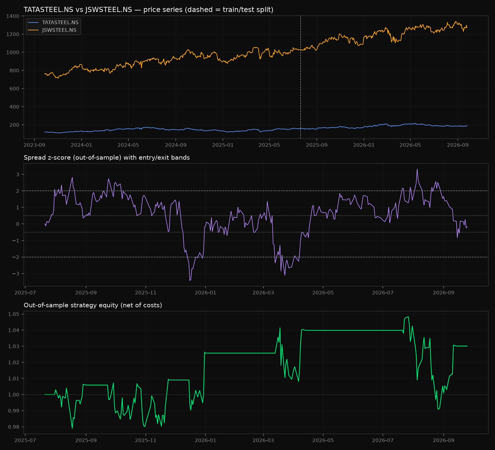

---

### SUNPHARMA.NS / CIPLA.NS

- **Latest prices:** SUNPHARMA.NS ₹1,852.20 · CIPLA.NS ₹1,399.70
- **Hedge ratio (train-fitted):** 0.4972
- **Cointegration (train):** PASS at 5% — ADF -3.42, p=0.0102
- **Persistence:** passed 5% in 63 of 63 real-data runs (strict tier: 5/63)
- **Spread half-life:** 10.6 days
- **Current z-score:** +0.39
- **Signal today:** flat / no stretch

**Out-of-sample backtest** (beta frozen from train window):

| Metric | Value |
|---|---|
| Sharpe | 0.05 |
| Sortino | 0.06 |
| Annualised return | 0.09% |
| Annualised vol | 7.86% |
| Max drawdown | -10.30% |
| Round-trip trades | 5 |

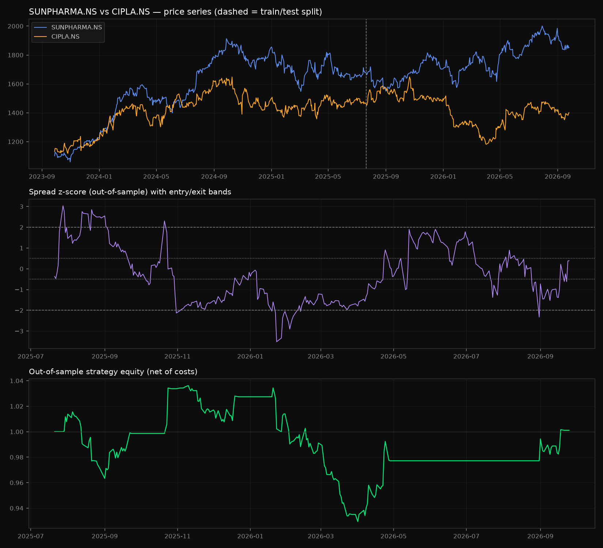

---

_Generated 2026-09-28 · pairs mean-reversion scanner · out-of-sample backtest · multiple-testing-aware · not investment advice._
