# Indian Pairs-Trading Scanner — 2026-09-29

> **What this is:** a market-neutral *pairs mean-reversion* scanner. It flags when two related NSE stocks have drifted apart far enough that their historical relationship signals a possible convergence trade. It does **not** forecast growth, rank "best" stocks, or predict company performance. A signal means the *spread between two stocks* is stretched — nothing about either stock being a good investment. Not investment advice; do your own research.

## Methodology (fixed in advance)

- **Universe:** 16 declared sector-mate pairs. Parameters (3y window, 60/40 train-test, z-entry 2.0, z-exit 0.5, 5 bps costs) are pre-registered; changes are logged in the README changelog *before* looking at results.
- **Multiple testing:** at the 5% level across 16 pairs, **≈0.8 false positives per run are expected by chance alone** even if nothing truly cointegrates. A single-day pass is a candidate, not a discovery.
- **Strict tier:** Bonferroni-corrected threshold p < 0.0031 (marked ✓✓).
- **Evidence = persistence:** the Persistence column counts how often each pair has passed the 5% test across all *real-data* daily runs recorded in `reports/history.csv`. Pairs deserve attention only when they pass persistently.

## Summary

| Pair | p-value | Coint. | Persistence | Current z | Signal | OOS Sharpe |
|---|---|---|---|---|---|---|
| HDFCBANK.NS/ICICIBANK.NS | 0.0959 | ✗ | 1/53 | -0.96 | watch | -0.56 |
| AXISBANK.NS/ICICIBANK.NS | 0.9100 | ✗ | 0/64 | -1.38 | watch | -0.14 |
| KOTAKBANK.NS/HDFCBANK.NS | 0.1183 | ✗ | 0/64 | -0.40 | flat / no stretch | 1.00 |
| SBIN.NS/BANKBARODA.NS | 0.1469 | ✗ | 0/64 | -0.62 | watch | 0.02 |
| TCS.NS/INFY.NS | 0.8024 | ✗ | 0/64 | -0.32 | flat / no stretch | 2.24 |
| INFY.NS/WIPRO.NS | 0.1702 | ✗ | 0/64 | -0.64 | watch | 1.83 |
| HCLTECH.NS/TECHM.NS | 0.2903 | ✗ | 0/64 | -0.47 | flat / no stretch | -0.02 |
| ACC.NS/AMBUJACEM.NS | 0.5931 | ✗ | 0/64 | -2.28 | LONG spread | 0.38 |
| ULTRACEMCO.NS/SHREECEM.NS | 0.2815 | ✗ | 0/64 | -1.48 | watch | 0.07 |
| IOC.NS/BPCL.NS | 0.8424 | ✗ | 0/64 | -0.74 | watch | 0.40 |
| BPCL.NS/HINDPETRO.NS | 0.2619 | ✗ | 0/64 | -1.02 | watch | 0.05 |
| ONGC.NS/COALINDIA.NS | 0.0131 | ✓ | 56/64 | +2.05 | SHORT spread | 0.75 |
| NTPC.NS/POWERGRID.NS | 0.0987 | ✗ | 0/64 | +0.20 | flat / no stretch | 0.43 |
| BAJAJ-AUTO.NS/HEROMOTOCO.NS | 0.1737 | ✗ | 0/64 | +0.97 | watch | -0.54 |
| TATASTEEL.NS/JSWSTEEL.NS | 0.6100 | ✗ | 0/64 | -0.43 | flat / no stretch | 0.35 |
| SUNPHARMA.NS/CIPLA.NS | 0.0105 | ✓ | 64/64 | +0.04 | flat / no stretch | 0.05 |

_Legend: ✓✓ passes strict Bonferroni tier · ✓ passes 5% only · ✗ fails. Persistence = 5%-passes / real-data runs recorded. \*no real-data history yet._

---

### HDFCBANK.NS / ICICIBANK.NS

- **Latest prices:** HDFCBANK.NS ₹719.05 · ICICIBANK.NS ₹1,302.00
- **Hedge ratio (train-fitted):** 1.6491
- **Cointegration (train):** FAIL at 5% — ADF -2.59, p=0.0959
- **Persistence:** passed 5% in 1 of 53 real-data runs (strict tier: 0/53)
- **Spread half-life:** 25.9 days
- **Current z-score:** -0.96
- **Signal today:** watch (approaching band)
- ⚠️ _Pair did not cointegrate on training data. Any signal here is not statistically justified — observation only._

**Out-of-sample backtest** (beta frozen from train window):

| Metric | Value |
|---|---|
| Sharpe | -0.56 |
| Sortino | -0.60 |
| Annualised return | -3.74% |
| Annualised vol | 6.40% |
| Max drawdown | -8.09% |
| Round-trip trades | 4 |

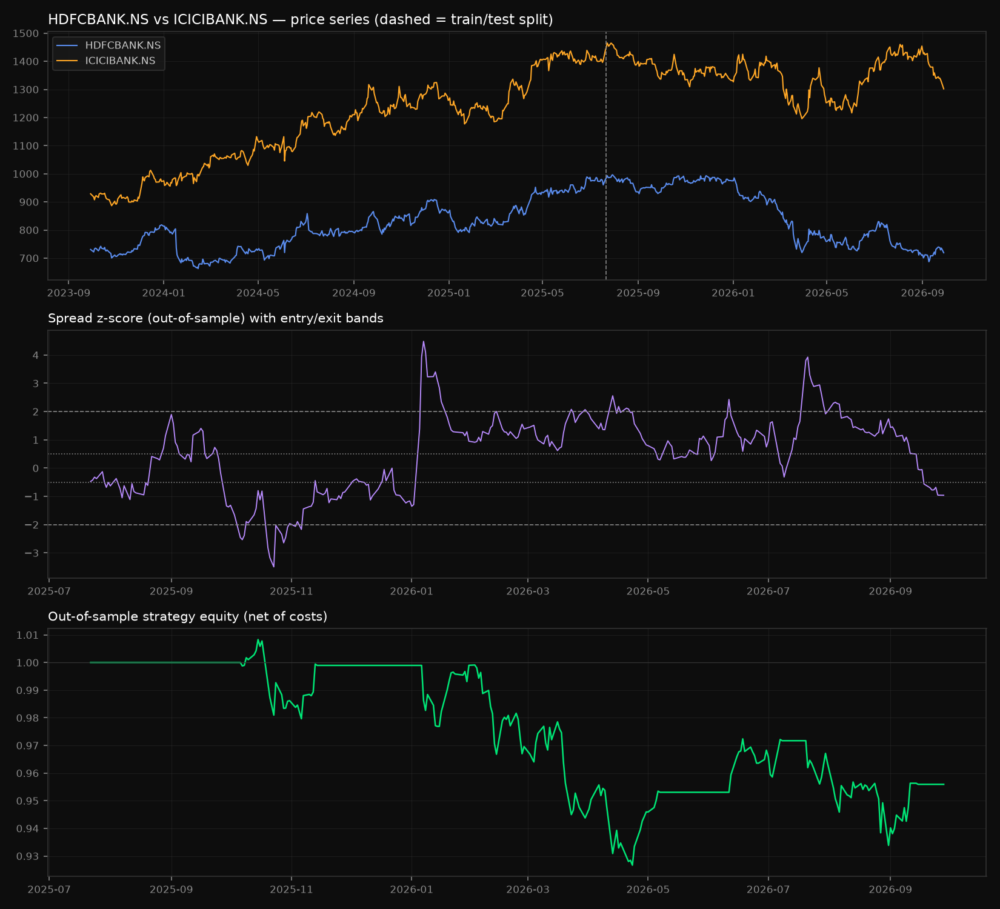

---

### AXISBANK.NS / ICICIBANK.NS

- **Latest prices:** AXISBANK.NS ₹1,209.90 · ICICIBANK.NS ₹1,302.00
- **Hedge ratio (train-fitted):** 0.9696
- **Cointegration (train):** FAIL at 5% — ADF -0.40, p=0.9100
- **Persistence:** passed 5% in 0 of 64 real-data runs (strict tier: 0/64)
- **Spread half-life:** 337.1 days
- **Current z-score:** -1.38
- **Signal today:** watch (approaching band)
- ⚠️ _Pair did not cointegrate on training data. Any signal here is not statistically justified — observation only._

**Out-of-sample backtest** (beta frozen from train window):

| Metric | Value |
|---|---|
| Sharpe | -0.14 |
| Sortino | -0.14 |
| Annualised return | -1.60% |
| Annualised vol | 8.68% |
| Max drawdown | -7.77% |
| Round-trip trades | 6 |

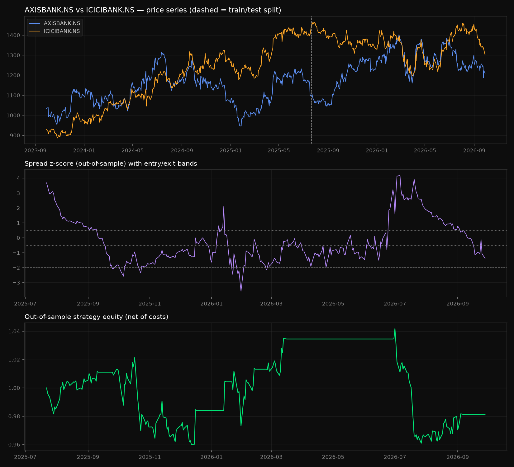

---

### KOTAKBANK.NS / HDFCBANK.NS

- **Latest prices:** KOTAKBANK.NS ₹401.55 · HDFCBANK.NS ₹719.05
- **Hedge ratio (train-fitted):** 2.1385
- **Cointegration (train):** FAIL at 5% — ADF -2.49, p=0.1183
- **Persistence:** passed 5% in 0 of 64 real-data runs (strict tier: 0/64)
- **Spread half-life:** 24.7 days
- **Current z-score:** -0.40
- **Signal today:** flat / no stretch
- ⚠️ _Pair did not cointegrate on training data. Any signal here is not statistically justified — observation only._

**Out-of-sample backtest** (beta frozen from train window):

| Metric | Value |
|---|---|
| Sharpe | 1.00 |
| Sortino | 0.79 |
| Annualised return | 6.76% |
| Annualised vol | 6.75% |
| Max drawdown | -4.26% |
| Round-trip trades | 7 |

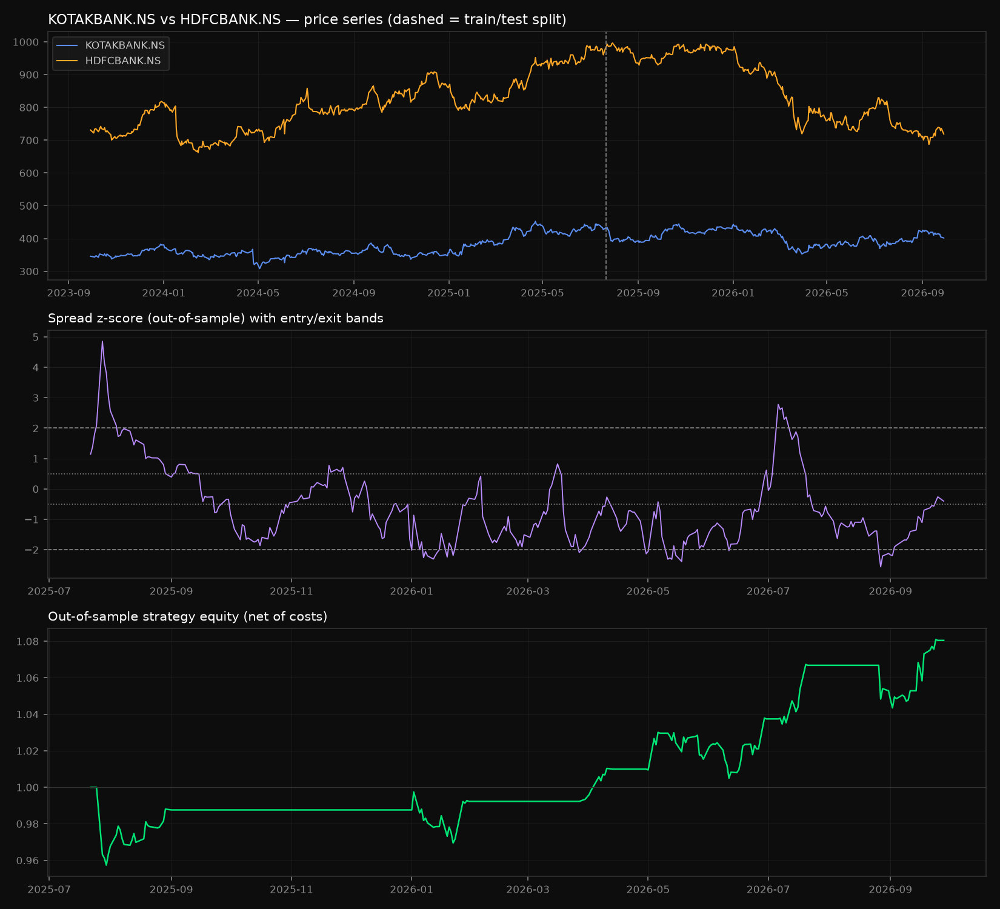

---

### SBIN.NS / BANKBARODA.NS

- **Latest prices:** SBIN.NS ₹962.00 · BANKBARODA.NS ₹227.50
- **Hedge ratio (train-fitted):** 0.1901
- **Cointegration (train):** FAIL at 5% — ADF -2.38, p=0.1469
- **Persistence:** passed 5% in 0 of 64 real-data runs (strict tier: 0/64)
- **Spread half-life:** 21.3 days
- **Current z-score:** -0.62
- **Signal today:** watch (approaching band)
- ⚠️ _Pair did not cointegrate on training data. Any signal here is not statistically justified — observation only._

**Out-of-sample backtest** (beta frozen from train window):

| Metric | Value |
|---|---|
| Sharpe | 0.02 |
| Sortino | 0.02 |
| Annualised return | -0.21% |
| Annualised vol | 9.12% |
| Max drawdown | -8.78% |
| Round-trip trades | 5 |

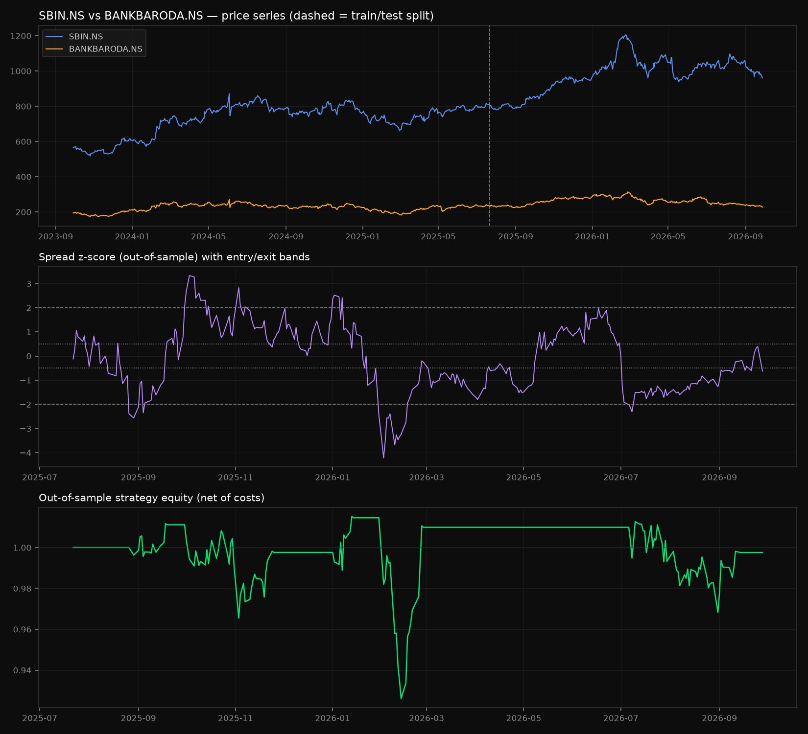

---

### TCS.NS / INFY.NS

- **Latest prices:** TCS.NS ₹2,070.70 · INFY.NS ₹1,003.20
- **Hedge ratio (train-fitted):** 0.4608
- **Cointegration (train):** FAIL at 5% — ADF -0.85, p=0.8024
- **Persistence:** passed 5% in 0 of 64 real-data runs (strict tier: 0/64)
- **Spread half-life:** 89.5 days
- **Current z-score:** -0.32
- **Signal today:** flat / no stretch
- ⚠️ _Pair did not cointegrate on training data. Any signal here is not statistically justified — observation only._

**Out-of-sample backtest** (beta frozen from train window):

| Metric | Value |
|---|---|
| Sharpe | 2.24 |
| Sortino | 2.38 |
| Annualised return | 8.30% |
| Annualised vol | 3.59% |
| Max drawdown | -0.94% |
| Round-trip trades | 6 |

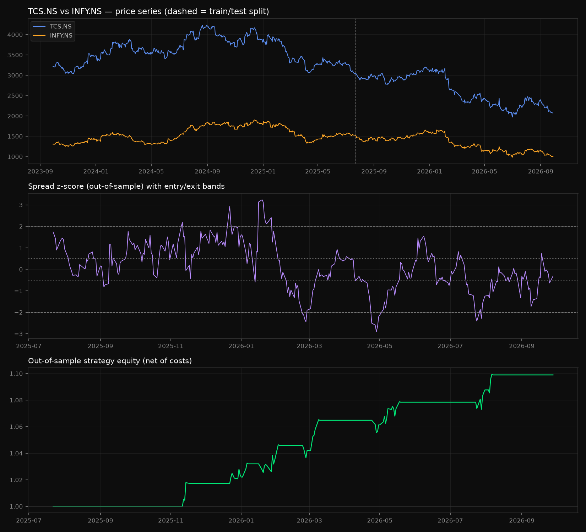

---

### INFY.NS / WIPRO.NS

- **Latest prices:** INFY.NS ₹1,003.20 · WIPRO.NS ₹161.56
- **Hedge ratio (train-fitted):** 0.1320
- **Cointegration (train):** FAIL at 5% — ADF -2.31, p=0.1702
- **Persistence:** passed 5% in 0 of 64 real-data runs (strict tier: 0/64)
- **Spread half-life:** 29.9 days
- **Current z-score:** -0.64
- **Signal today:** watch (approaching band)
- ⚠️ _Pair did not cointegrate on training data. Any signal here is not statistically justified — observation only._

**Out-of-sample backtest** (beta frozen from train window):

| Metric | Value |
|---|---|
| Sharpe | 1.83 |
| Sortino | 2.00 |
| Annualised return | 9.16% |
| Annualised vol | 4.85% |
| Max drawdown | -1.75% |
| Round-trip trades | 6 |

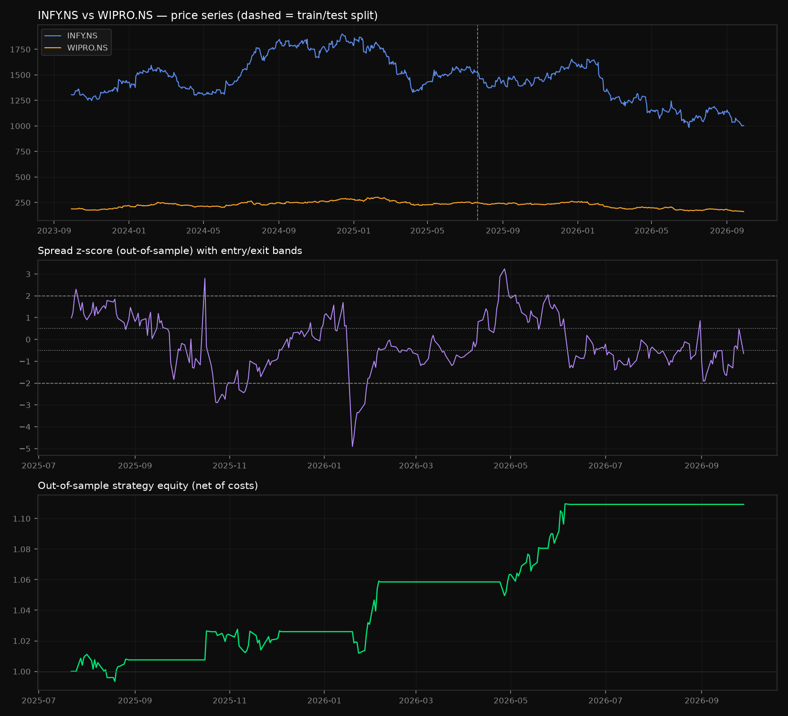

---

### HCLTECH.NS / TECHM.NS

- **Latest prices:** HCLTECH.NS ₹1,252.60 · TECHM.NS ₹1,542.20
- **Hedge ratio (train-fitted):** 0.9308
- **Cointegration (train):** FAIL at 5% — ADF -1.99, p=0.2903
- **Persistence:** passed 5% in 0 of 64 real-data runs (strict tier: 0/64)
- **Spread half-life:** 23.3 days
- **Current z-score:** -0.47
- **Signal today:** flat / no stretch
- ⚠️ _Pair did not cointegrate on training data. Any signal here is not statistically justified — observation only._

**Out-of-sample backtest** (beta frozen from train window):

| Metric | Value |
|---|---|
| Sharpe | -0.02 |
| Sortino | -0.02 |
| Annualised return | -0.40% |
| Annualised vol | 7.04% |
| Max drawdown | -8.12% |
| Round-trip trades | 5 |

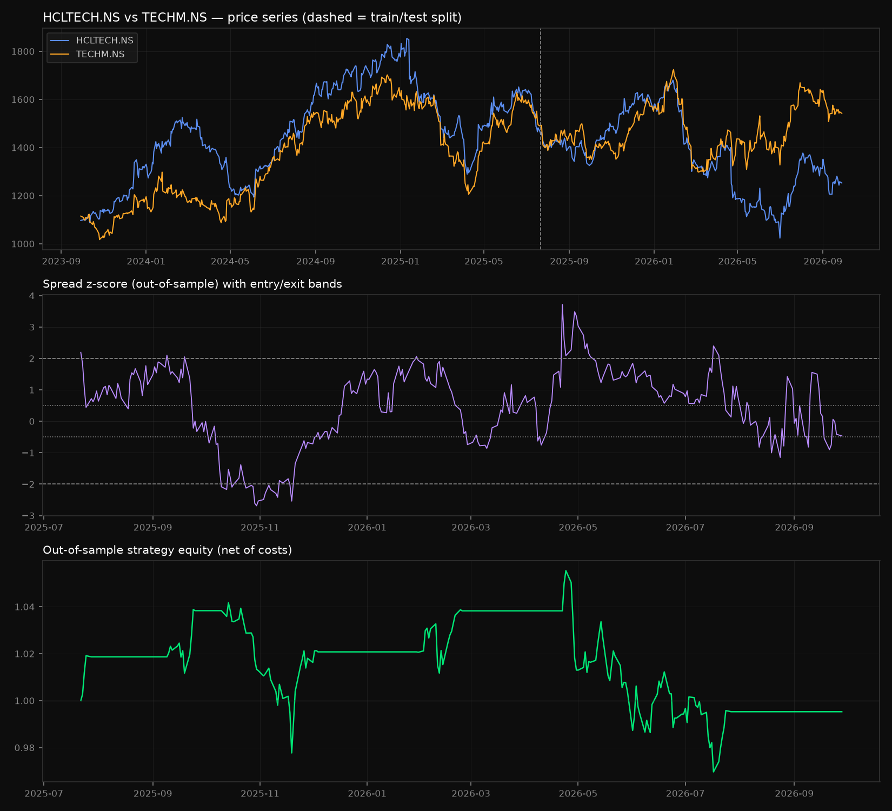

---

### ACC.NS / AMBUJACEM.NS

- **Latest prices:** ACC.NS ₹1,213.50 · AMBUJACEM.NS ₹374.35
- **Hedge ratio (train-fitted):** 0.1875
- **Cointegration (train):** FAIL at 5% — ADF -1.38, p=0.5931
- **Persistence:** passed 5% in 0 of 64 real-data runs (strict tier: 0/64)
- **Spread half-life:** 60.1 days
- **Current z-score:** -2.28
- **Signal today:** LONG spread (long AMBUJACEM.NS, short ACC.NS)
- ⚠️ _Pair did not cointegrate on training data. Any signal here is not statistically justified — observation only._

**Out-of-sample backtest** (beta frozen from train window):

| Metric | Value |
|---|---|
| Sharpe | 0.38 |
| Sortino | 0.30 |
| Annualised return | 2.11% |
| Annualised vol | 5.97% |
| Max drawdown | -4.81% |
| Round-trip trades | 4 |

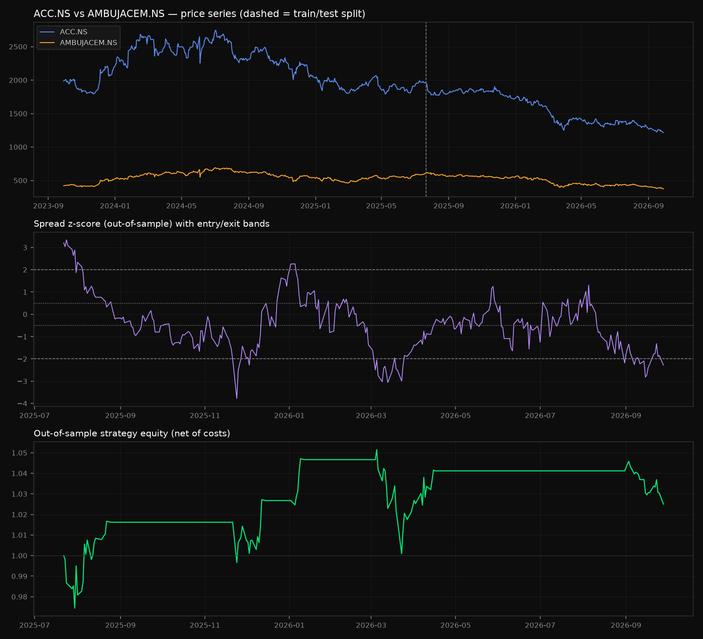

---

### ULTRACEMCO.NS / SHREECEM.NS

- **Latest prices:** ULTRACEMCO.NS ₹11,025.00 · SHREECEM.NS ₹22,170.00
- **Hedge ratio (train-fitted):** 0.8373
- **Cointegration (train):** FAIL at 5% — ADF -2.01, p=0.2815
- **Persistence:** passed 5% in 0 of 64 real-data runs (strict tier: 0/64)
- **Spread half-life:** 45.9 days
- **Current z-score:** -1.48
- **Signal today:** watch (approaching band)
- ⚠️ _Pair did not cointegrate on training data. Any signal here is not statistically justified — observation only._

**Out-of-sample backtest** (beta frozen from train window):

| Metric | Value |
|---|---|
| Sharpe | 0.07 |
| Sortino | 0.08 |
| Annualised return | 0.23% |
| Annualised vol | 6.73% |
| Max drawdown | -7.08% |
| Round-trip trades | 5 |

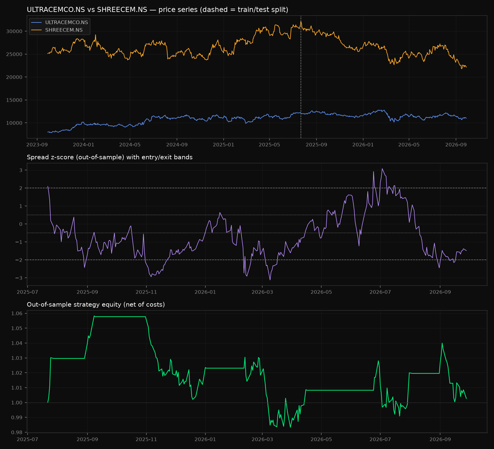

---

### IOC.NS / BPCL.NS

- **Latest prices:** IOC.NS ₹133.32 · BPCL.NS ₹302.25
- **Hedge ratio (train-fitted):** 1.7185
- **Cointegration (train):** FAIL at 5% — ADF -0.72, p=0.8424
- **Persistence:** passed 5% in 0 of 64 real-data runs (strict tier: 0/64)
- **Spread half-life:** 167.9 days
- **Current z-score:** -0.74
- **Signal today:** watch (approaching band)
- ⚠️ _Pair did not cointegrate on training data. Any signal here is not statistically justified — observation only._

**Out-of-sample backtest** (beta frozen from train window):

| Metric | Value |
|---|---|
| Sharpe | 0.40 |
| Sortino | 0.38 |
| Annualised return | 2.24% |
| Annualised vol | 5.98% |
| Max drawdown | -6.48% |
| Round-trip trades | 6 |

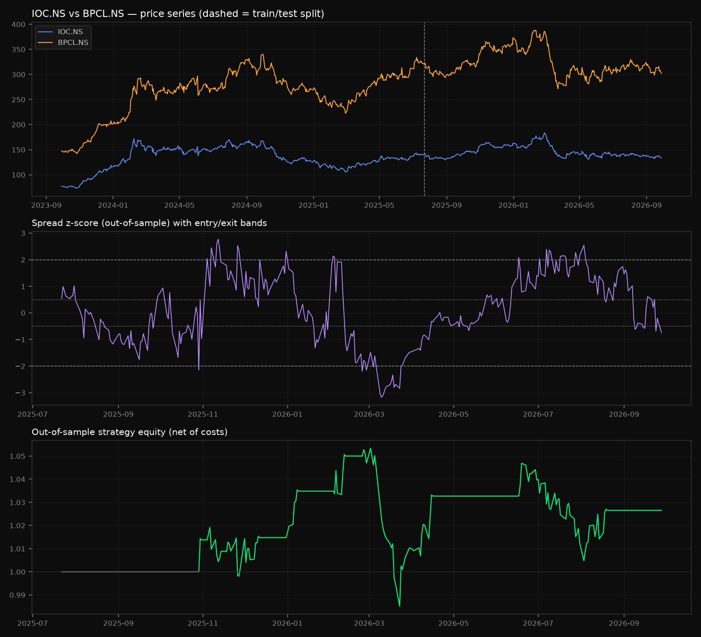

---

### BPCL.NS / HINDPETRO.NS

- **Latest prices:** BPCL.NS ₹302.25 · HINDPETRO.NS ₹342.45
- **Hedge ratio (train-fitted):** 1.3409
- **Cointegration (train):** FAIL at 5% — ADF -2.06, p=0.2619
- **Persistence:** passed 5% in 0 of 64 real-data runs (strict tier: 0/64)
- **Spread half-life:** 36.9 days
- **Current z-score:** -1.02
- **Signal today:** watch (approaching band)
- ⚠️ _Pair did not cointegrate on training data. Any signal here is not statistically justified — observation only._

**Out-of-sample backtest** (beta frozen from train window):

| Metric | Value |
|---|---|
| Sharpe | 0.05 |
| Sortino | 0.05 |
| Annualised return | 0.14% |
| Annualised vol | 5.74% |
| Max drawdown | -6.51% |
| Round-trip trades | 5 |

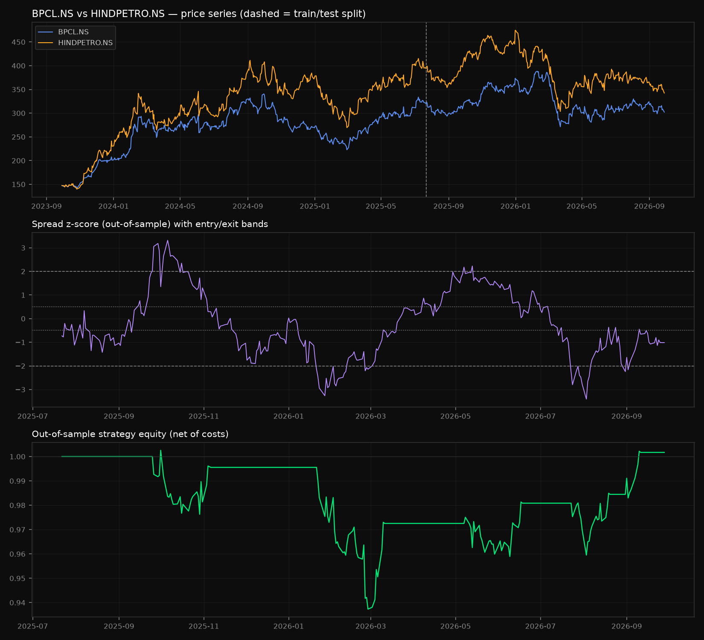

---

### ONGC.NS / COALINDIA.NS

- **Latest prices:** ONGC.NS ₹230.00 · COALINDIA.NS ₹422.50
- **Hedge ratio (train-fitted):** 1.4228
- **Cointegration (train):** PASS at 5% — ADF -3.34, p=0.0131
- **Persistence:** passed 5% in 56 of 64 real-data runs (strict tier: 1/64)
- **Spread half-life:** 12.1 days
- **Current z-score:** +2.05
- **Signal today:** SHORT spread (short COALINDIA.NS, long ONGC.NS)

**Out-of-sample backtest** (beta frozen from train window):

| Metric | Value |
|---|---|
| Sharpe | 0.75 |
| Sortino | 0.57 |
| Annualised return | 5.44% |
| Annualised vol | 7.40% |
| Max drawdown | -6.13% |
| Round-trip trades | 5 |

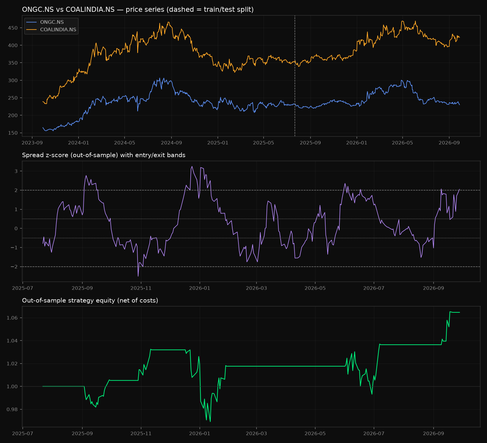

---

### NTPC.NS / POWERGRID.NS

- **Latest prices:** NTPC.NS ₹321.10 · POWERGRID.NS ₹261.85
- **Hedge ratio (train-fitted):** 0.8229
- **Cointegration (train):** FAIL at 5% — ADF -2.57, p=0.0987
- **Persistence:** passed 5% in 0 of 64 real-data runs (strict tier: 0/64)
- **Spread half-life:** 23.6 days
- **Current z-score:** +0.20
- **Signal today:** flat / no stretch
- ⚠️ _Pair did not cointegrate on training data. Any signal here is not statistically justified — observation only._

**Out-of-sample backtest** (beta frozen from train window):

| Metric | Value |
|---|---|
| Sharpe | 0.43 |
| Sortino | 0.33 |
| Annualised return | 2.21% |
| Annualised vol | 5.46% |
| Max drawdown | -5.18% |
| Round-trip trades | 6 |

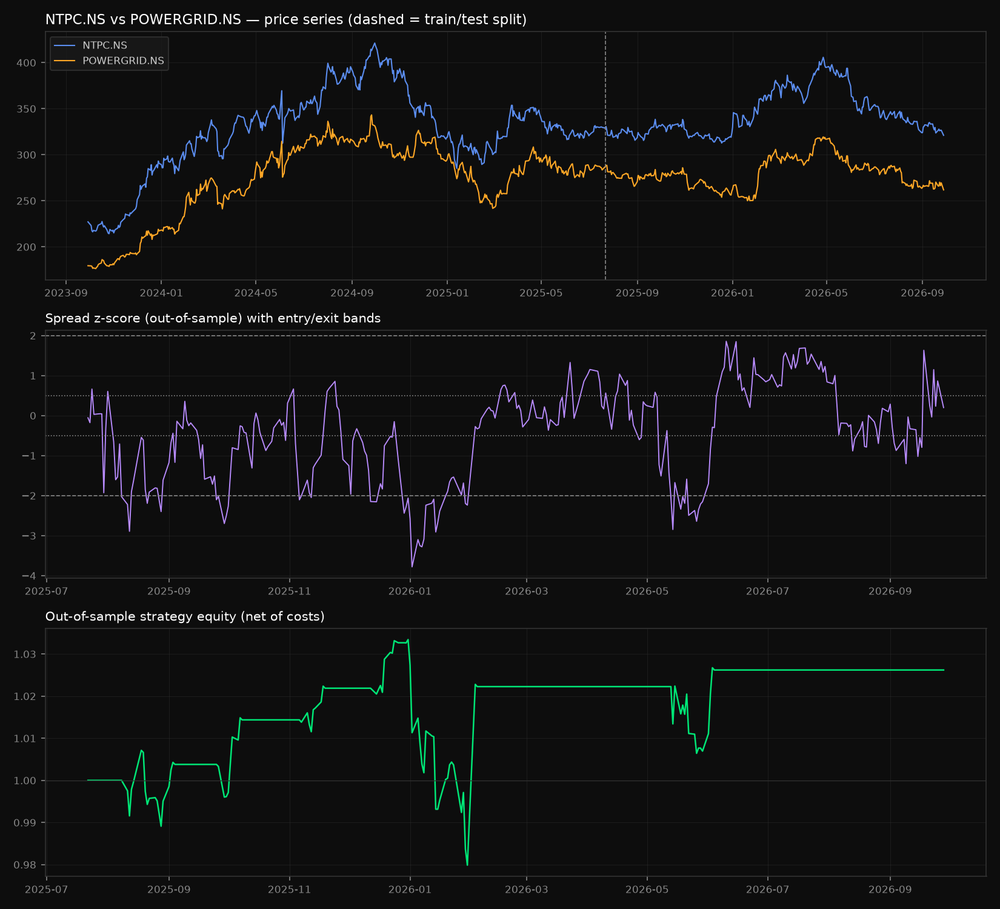

---

### BAJAJ-AUTO.NS / HEROMOTOCO.NS

- **Latest prices:** BAJAJ-AUTO.NS ₹11,024.00 · HEROMOTOCO.NS ₹5,390.00
- **Hedge ratio (train-fitted):** 0.4097
- **Cointegration (train):** FAIL at 5% — ADF -2.29, p=0.1737
- **Persistence:** passed 5% in 0 of 64 real-data runs (strict tier: 0/64)
- **Spread half-life:** 29.4 days
- **Current z-score:** +0.97
- **Signal today:** watch (approaching band)
- ⚠️ _Pair did not cointegrate on training data. Any signal here is not statistically justified — observation only._

**Out-of-sample backtest** (beta frozen from train window):

| Metric | Value |
|---|---|
| Sharpe | -0.54 |
| Sortino | -0.56 |
| Annualised return | -6.17% |
| Annualised vol | 10.70% |
| Max drawdown | -19.83% |
| Round-trip trades | 6 |

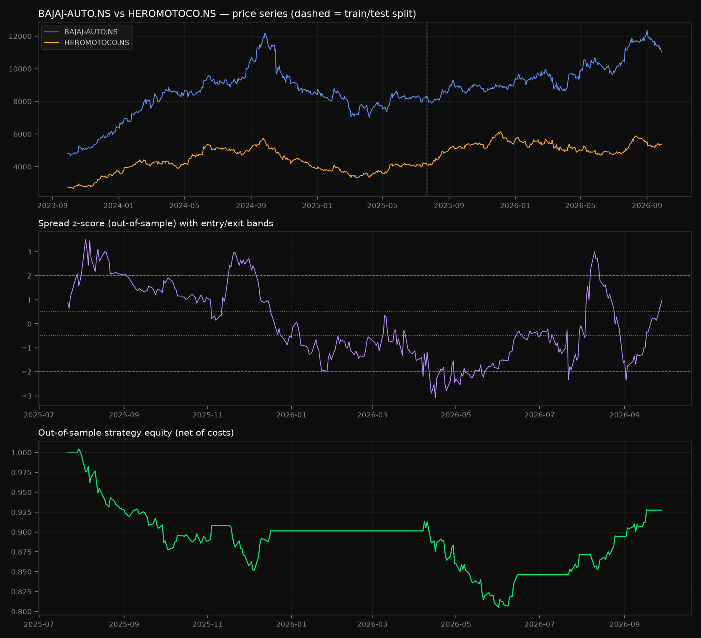

---

### TATASTEEL.NS / JSWSTEEL.NS

- **Latest prices:** TATASTEEL.NS ₹186.30 · JSWSTEEL.NS ₹1,264.10
- **Hedge ratio (train-fitted):** 3.1227
- **Cointegration (train):** FAIL at 5% — ADF -1.34, p=0.6100
- **Persistence:** passed 5% in 0 of 64 real-data runs (strict tier: 0/64)
- **Spread half-life:** 67.0 days
- **Current z-score:** -0.43
- **Signal today:** flat / no stretch
- ⚠️ _Pair did not cointegrate on training data. Any signal here is not statistically justified — observation only._

**Out-of-sample backtest** (beta frozen from train window):

| Metric | Value |
|---|---|
| Sharpe | 0.35 |
| Sortino | 0.33 |
| Annualised return | 2.56% |
| Annualised vol | 8.22% |
| Max drawdown | -5.50% |
| Round-trip trades | 5 |

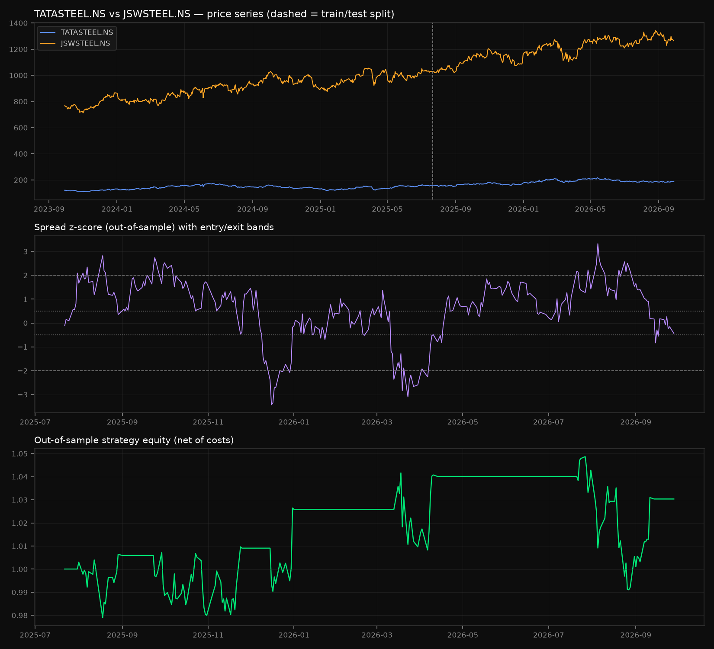

---

### SUNPHARMA.NS / CIPLA.NS

- **Latest prices:** SUNPHARMA.NS ₹1,838.00 · CIPLA.NS ₹1,383.70
- **Hedge ratio (train-fitted):** 0.4961
- **Cointegration (train):** PASS at 5% — ADF -3.41, p=0.0105
- **Persistence:** passed 5% in 64 of 64 real-data runs (strict tier: 5/64)
- **Spread half-life:** 10.6 days
- **Current z-score:** +0.04
- **Signal today:** flat / no stretch

**Out-of-sample backtest** (beta frozen from train window):

| Metric | Value |
|---|---|
| Sharpe | 0.05 |
| Sortino | 0.06 |
| Annualised return | 0.09% |
| Annualised vol | 7.92% |
| Max drawdown | -10.37% |
| Round-trip trades | 5 |

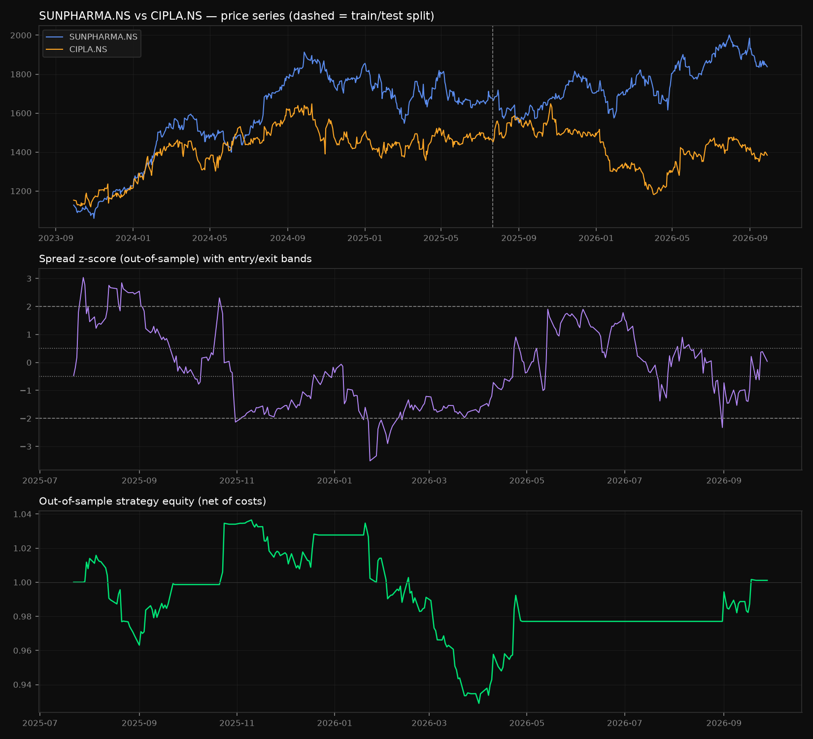

---

_Generated 2026-09-29 · pairs mean-reversion scanner · out-of-sample backtest · multiple-testing-aware · not investment advice._
