# Indian Pairs-Trading Scanner — 2026-10-01

> **What this is:** a market-neutral *pairs mean-reversion* scanner. It flags when two related NSE stocks have drifted apart far enough that their historical relationship signals a possible convergence trade. It does **not** forecast growth, rank "best" stocks, or predict company performance. A signal means the *spread between two stocks* is stretched — nothing about either stock being a good investment. Not investment advice; do your own research.

## Methodology (fixed in advance)

- **Universe:** 16 declared sector-mate pairs. Parameters (3y window, 60/40 train-test, z-entry 2.0, z-exit 0.5, 5 bps costs) are pre-registered; changes are logged in the README changelog *before* looking at results.
- **Multiple testing:** at the 5% level across 16 pairs, **≈0.8 false positives per run are expected by chance alone** even if nothing truly cointegrates. A single-day pass is a candidate, not a discovery.
- **Strict tier:** Bonferroni-corrected threshold p < 0.0031 (marked ✓✓).
- **Evidence = persistence:** the Persistence column counts how often each pair has passed the 5% test across all *real-data* daily runs recorded in `reports/history.csv`. Pairs deserve attention only when they pass persistently.

## Summary

| Pair | p-value | Coint. | Persistence | Current z | Signal | OOS Sharpe |
|---|---|---|---|---|---|---|
| HDFCBANK.NS/ICICIBANK.NS | 0.0967 | ✗ | 1/55 | -0.52 | watch | -0.56 |
| AXISBANK.NS/ICICIBANK.NS | 0.9189 | ✗ | 0/66 | -1.35 | watch | -0.09 |
| KOTAKBANK.NS/HDFCBANK.NS | 0.1210 | ✗ | 0/66 | -1.04 | watch | 1.03 |
| SBIN.NS/BANKBARODA.NS | 0.1474 | ✗ | 0/66 | +0.40 | flat / no stretch | 0.02 |
| TCS.NS/INFY.NS | 0.7695 | ✗ | 0/66 | -0.32 | flat / no stretch | 2.25 |
| INFY.NS/WIPRO.NS | 0.1765 | ✗ | 0/66 | -1.24 | watch | 1.97 |
| HCLTECH.NS/TECHM.NS | 0.2790 | ✗ | 0/66 | -0.34 | flat / no stretch | -0.25 |
| ACC.NS/AMBUJACEM.NS | 0.7196 | ✗ | 0/66 | -1.85 | watch | 0.58 |
| ULTRACEMCO.NS/SHREECEM.NS | 0.5396 | ✗ | 0/66 | -1.23 | watch | -0.22 |
| IOC.NS/BPCL.NS | 0.8336 | ✗ | 0/66 | -1.20 | watch | 0.40 |
| BPCL.NS/HINDPETRO.NS | 0.2665 | ✗ | 0/66 | -0.21 | flat / no stretch | 0.05 |
| ONGC.NS/COALINDIA.NS | 0.0119 | ✓ | 58/66 | +2.48 | SHORT spread | 0.60 |
| NTPC.NS/POWERGRID.NS | 0.1062 | ✗ | 0/66 | -0.38 | flat / no stretch | 0.43 |
| BAJAJ-AUTO.NS/HEROMOTOCO.NS | 0.1729 | ✗ | 0/66 | +0.53 | watch | -0.54 |
| TATASTEEL.NS/JSWSTEEL.NS | 0.5886 | ✗ | 0/66 | -0.65 | watch | 0.35 |
| SUNPHARMA.NS/CIPLA.NS | 0.0099 | ✓ | 66/66 | -1.14 | watch | 0.05 |

_Legend: ✓✓ passes strict Bonferroni tier · ✓ passes 5% only · ✗ fails. Persistence = 5%-passes / real-data runs recorded. \*no real-data history yet._

---

### HDFCBANK.NS / ICICIBANK.NS

- **Latest prices:** HDFCBANK.NS ₹708.70 · ICICIBANK.NS ₹1,321.70
- **Hedge ratio (train-fitted):** 1.6448
- **Cointegration (train):** FAIL at 5% — ADF -2.58, p=0.0967
- **Persistence:** passed 5% in 1 of 55 real-data runs (strict tier: 0/55)
- **Spread half-life:** 26.0 days
- **Current z-score:** -0.52
- **Signal today:** watch (approaching band)
- ⚠️ _Pair did not cointegrate on training data. Any signal here is not statistically justified — observation only._

**Out-of-sample backtest** (beta frozen from train window):

| Metric | Value |
|---|---|
| Sharpe | -0.56 |
| Sortino | -0.59 |
| Annualised return | -3.71% |
| Annualised vol | 6.37% |
| Max drawdown | -8.04% |
| Round-trip trades | 4 |

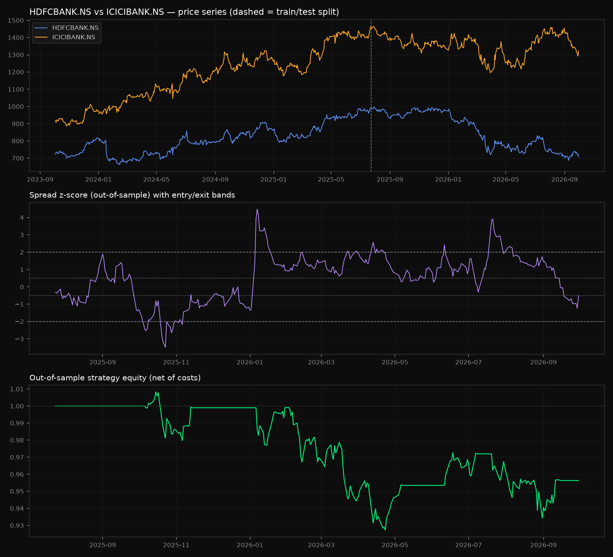

---

### AXISBANK.NS / ICICIBANK.NS

- **Latest prices:** AXISBANK.NS ₹1,226.00 · ICICIBANK.NS ₹1,321.70
- **Hedge ratio (train-fitted):** 0.9611
- **Cointegration (train):** FAIL at 5% — ADF -0.35, p=0.9189
- **Persistence:** passed 5% in 0 of 66 real-data runs (strict tier: 0/66)
- **Spread half-life:** 398.1 days
- **Current z-score:** -1.35
- **Signal today:** watch (approaching band)
- ⚠️ _Pair did not cointegrate on training data. Any signal here is not statistically justified — observation only._

**Out-of-sample backtest** (beta frozen from train window):

| Metric | Value |
|---|---|
| Sharpe | -0.09 |
| Sortino | -0.09 |
| Annualised return | -1.18% |
| Annualised vol | 8.63% |
| Max drawdown | -7.73% |
| Round-trip trades | 6 |

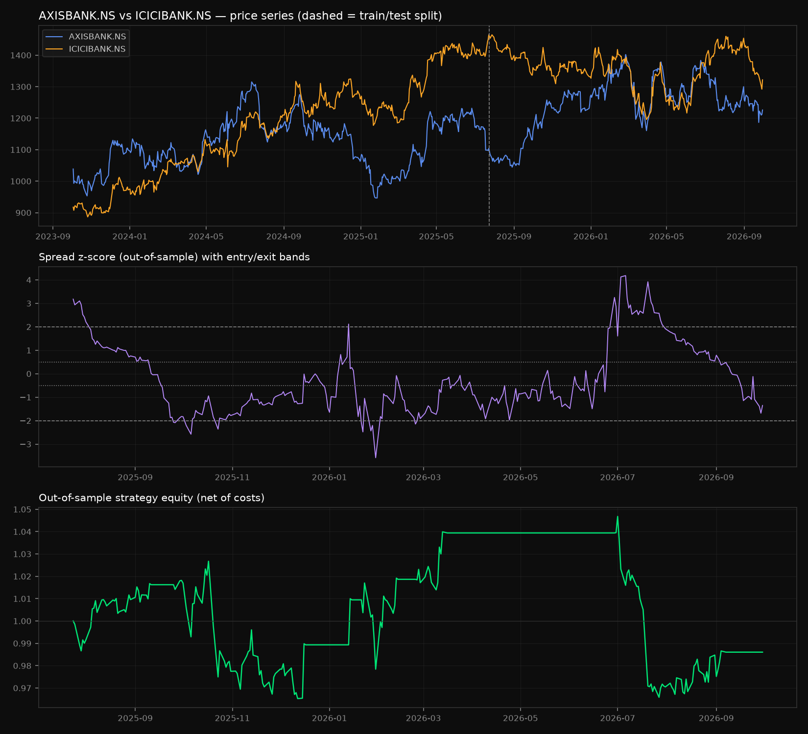

---

### KOTAKBANK.NS / HDFCBANK.NS

- **Latest prices:** KOTAKBANK.NS ₹417.00 · HDFCBANK.NS ₹708.70
- **Hedge ratio (train-fitted):** 2.1508
- **Cointegration (train):** FAIL at 5% — ADF -2.48, p=0.1210
- **Persistence:** passed 5% in 0 of 66 real-data runs (strict tier: 0/66)
- **Spread half-life:** 24.8 days
- **Current z-score:** -1.04
- **Signal today:** watch (approaching band)
- ⚠️ _Pair did not cointegrate on training data. Any signal here is not statistically justified — observation only._

**Out-of-sample backtest** (beta frozen from train window):

| Metric | Value |
|---|---|
| Sharpe | 1.03 |
| Sortino | 0.81 |
| Annualised return | 6.97% |
| Annualised vol | 6.77% |
| Max drawdown | -4.28% |
| Round-trip trades | 7 |

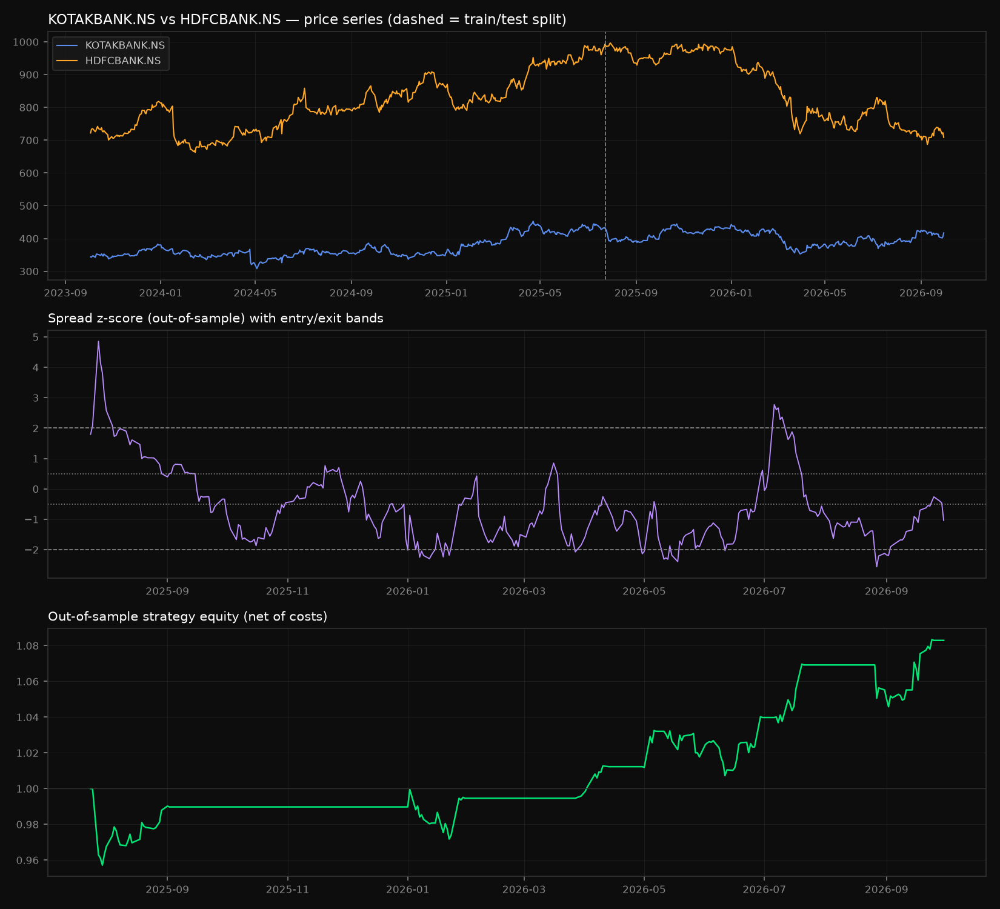

---

### SBIN.NS / BANKBARODA.NS

- **Latest prices:** SBIN.NS ₹959.50 · BANKBARODA.NS ₹230.55
- **Hedge ratio (train-fitted):** 0.1900
- **Cointegration (train):** FAIL at 5% — ADF -2.38, p=0.1474
- **Persistence:** passed 5% in 0 of 66 real-data runs (strict tier: 0/66)
- **Spread half-life:** 21.2 days
- **Current z-score:** +0.40
- **Signal today:** flat / no stretch
- ⚠️ _Pair did not cointegrate on training data. Any signal here is not statistically justified — observation only._

**Out-of-sample backtest** (beta frozen from train window):

| Metric | Value |
|---|---|
| Sharpe | 0.02 |
| Sortino | 0.02 |
| Annualised return | -0.19% |
| Annualised vol | 8.95% |
| Max drawdown | -8.62% |
| Round-trip trades | 5 |

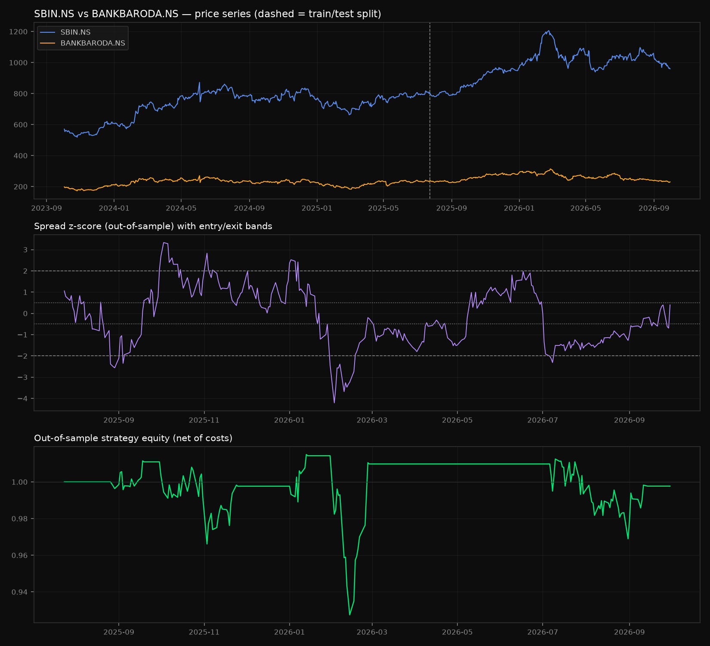

---

### TCS.NS / INFY.NS

- **Latest prices:** TCS.NS ₹2,050.60 · INFY.NS ₹994.10
- **Hedge ratio (train-fitted):** 0.4547
- **Cointegration (train):** FAIL at 5% — ADF -0.95, p=0.7695
- **Persistence:** passed 5% in 0 of 66 real-data runs (strict tier: 0/66)
- **Spread half-life:** 82.6 days
- **Current z-score:** -0.32
- **Signal today:** flat / no stretch
- ⚠️ _Pair did not cointegrate on training data. Any signal here is not statistically justified — observation only._

**Out-of-sample backtest** (beta frozen from train window):

| Metric | Value |
|---|---|
| Sharpe | 2.25 |
| Sortino | 2.41 |
| Annualised return | 8.42% |
| Annualised vol | 3.62% |
| Max drawdown | -0.96% |
| Round-trip trades | 6 |

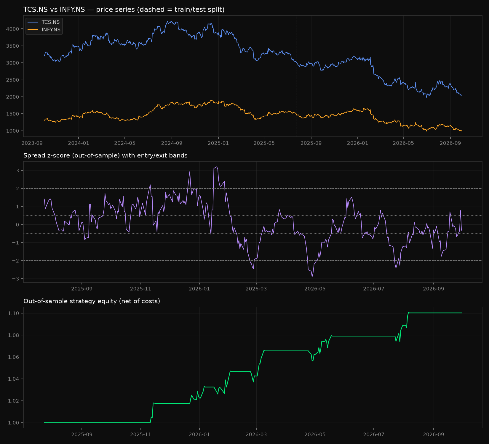

---

### INFY.NS / WIPRO.NS

- **Latest prices:** INFY.NS ₹994.10 · WIPRO.NS ₹158.50
- **Hedge ratio (train-fitted):** 0.1316
- **Cointegration (train):** FAIL at 5% — ADF -2.29, p=0.1765
- **Persistence:** passed 5% in 0 of 66 real-data runs (strict tier: 0/66)
- **Spread half-life:** 30.1 days
- **Current z-score:** -1.24
- **Signal today:** watch (approaching band)
- ⚠️ _Pair did not cointegrate on training data. Any signal here is not statistically justified — observation only._

**Out-of-sample backtest** (beta frozen from train window):

| Metric | Value |
|---|---|
| Sharpe | 1.97 |
| Sortino | 2.18 |
| Annualised return | 10.08% |
| Annualised vol | 4.93% |
| Max drawdown | -1.75% |
| Round-trip trades | 6 |

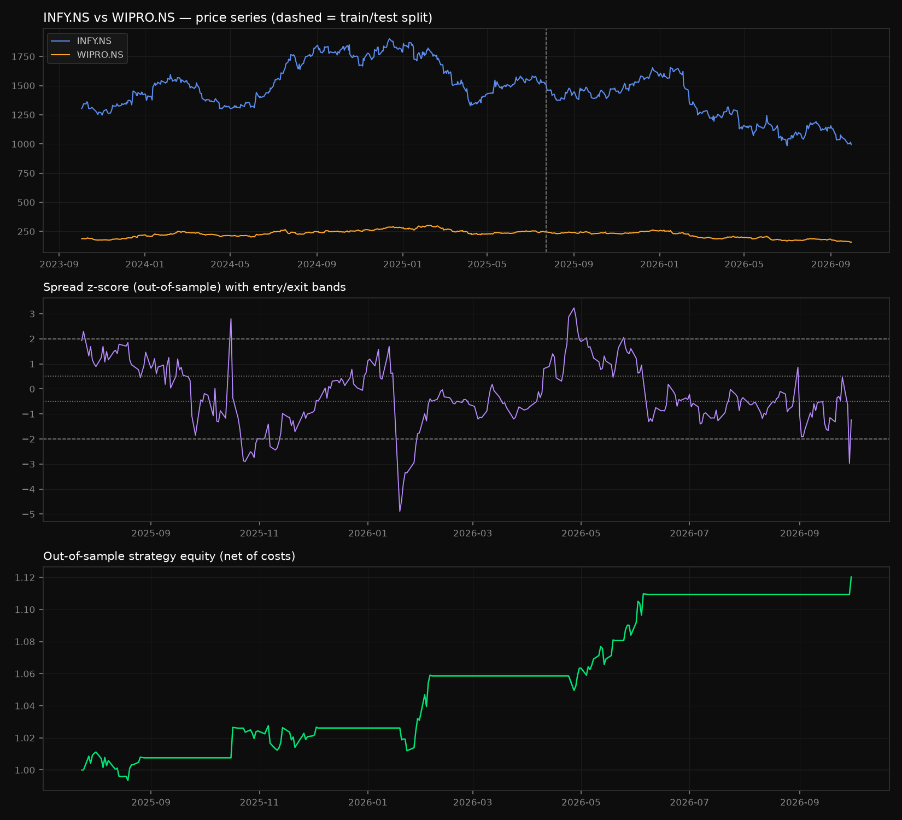

---

### HCLTECH.NS / TECHM.NS

- **Latest prices:** HCLTECH.NS ₹1,230.00 · TECHM.NS ₹1,524.00
- **Hedge ratio (train-fitted):** 0.9328
- **Cointegration (train):** FAIL at 5% — ADF -2.02, p=0.2790
- **Persistence:** passed 5% in 0 of 66 real-data runs (strict tier: 0/66)
- **Spread half-life:** 23.8 days
- **Current z-score:** -0.34
- **Signal today:** flat / no stretch
- ⚠️ _Pair did not cointegrate on training data. Any signal here is not statistically justified — observation only._

**Out-of-sample backtest** (beta frozen from train window):

| Metric | Value |
|---|---|
| Sharpe | -0.25 |
| Sortino | -0.23 |
| Annualised return | -2.01% |
| Annualised vol | 7.09% |
| Max drawdown | -8.28% |
| Round-trip trades | 4 |

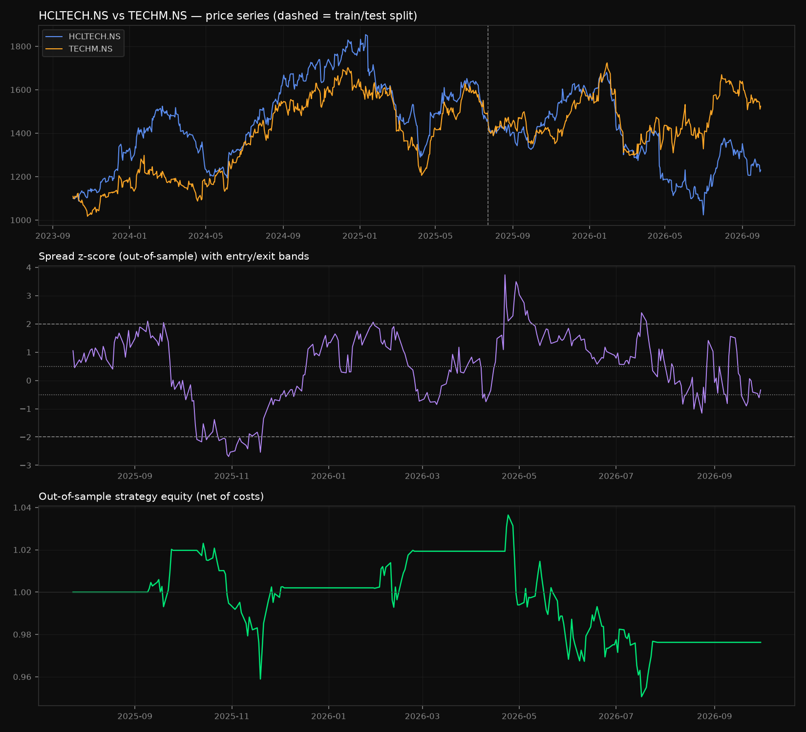

---

### ACC.NS / AMBUJACEM.NS

- **Latest prices:** ACC.NS ₹1,204.10 · AMBUJACEM.NS ₹374.00
- **Hedge ratio (train-fitted):** 0.1853
- **Cointegration (train):** FAIL at 5% — ADF -1.09, p=0.7196
- **Persistence:** passed 5% in 0 of 66 real-data runs (strict tier: 0/66)
- **Spread half-life:** 70.7 days
- **Current z-score:** -1.85
- **Signal today:** watch (approaching band)
- ⚠️ _Pair did not cointegrate on training data. Any signal here is not statistically justified — observation only._

**Out-of-sample backtest** (beta frozen from train window):

| Metric | Value |
|---|---|
| Sharpe | 0.58 |
| Sortino | 0.47 |
| Annualised return | 3.40% |
| Annualised vol | 6.07% |
| Max drawdown | -4.94% |
| Round-trip trades | 4 |

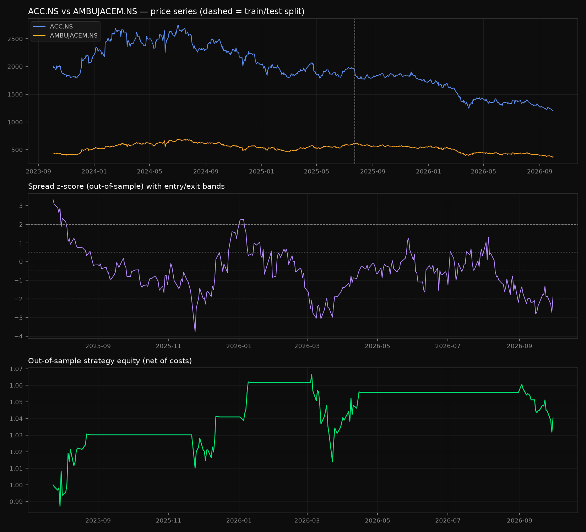

---

### ULTRACEMCO.NS / SHREECEM.NS

- **Latest prices:** ULTRACEMCO.NS ₹10,956.00 · SHREECEM.NS ₹22,345.00
- **Hedge ratio (train-fitted):** 0.8644
- **Cointegration (train):** FAIL at 5% — ADF -1.49, p=0.5396
- **Persistence:** passed 5% in 0 of 66 real-data runs (strict tier: 0/66)
- **Spread half-life:** 51.4 days
- **Current z-score:** -1.23
- **Signal today:** watch (approaching band)
- ⚠️ _Pair did not cointegrate on training data. Any signal here is not statistically justified — observation only._

**Out-of-sample backtest** (beta frozen from train window):

| Metric | Value |
|---|---|
| Sharpe | -0.22 |
| Sortino | -0.26 |
| Annualised return | -1.65% |
| Annualised vol | 6.49% |
| Max drawdown | -7.01% |
| Round-trip trades | 4 |

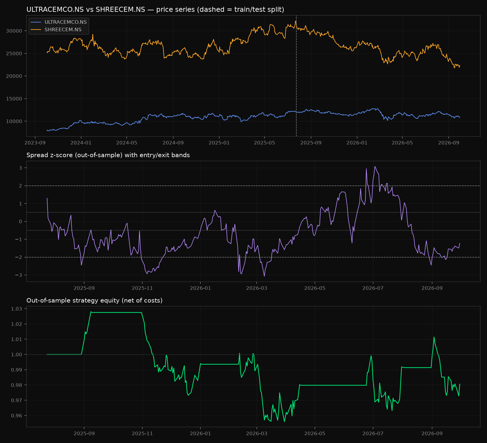

---

### IOC.NS / BPCL.NS

- **Latest prices:** IOC.NS ₹134.93 · BPCL.NS ₹303.20
- **Hedge ratio (train-fitted):** 1.7170
- **Cointegration (train):** FAIL at 5% — ADF -0.75, p=0.8336
- **Persistence:** passed 5% in 0 of 66 real-data runs (strict tier: 0/66)
- **Spread half-life:** 161.3 days
- **Current z-score:** -1.20
- **Signal today:** watch (approaching band)
- ⚠️ _Pair did not cointegrate on training data. Any signal here is not statistically justified — observation only._

**Out-of-sample backtest** (beta frozen from train window):

| Metric | Value |
|---|---|
| Sharpe | 0.40 |
| Sortino | 0.38 |
| Annualised return | 2.24% |
| Annualised vol | 5.99% |
| Max drawdown | -6.49% |
| Round-trip trades | 6 |

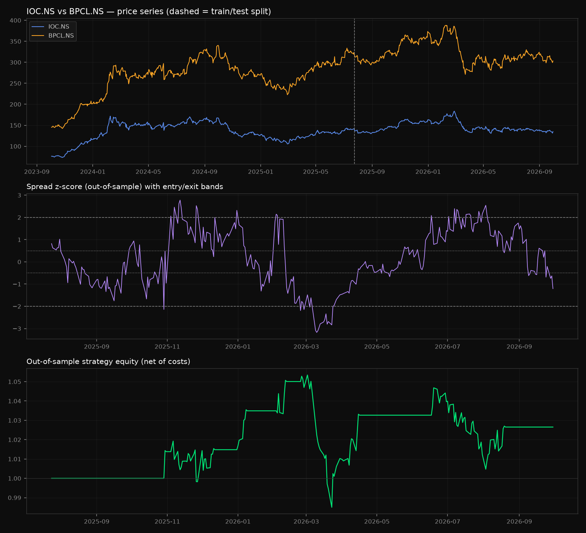

---

### BPCL.NS / HINDPETRO.NS

- **Latest prices:** BPCL.NS ₹303.20 · HINDPETRO.NS ₹350.35
- **Hedge ratio (train-fitted):** 1.3402
- **Cointegration (train):** FAIL at 5% — ADF -2.05, p=0.2665
- **Persistence:** passed 5% in 0 of 66 real-data runs (strict tier: 0/66)
- **Spread half-life:** 37.2 days
- **Current z-score:** -0.21
- **Signal today:** flat / no stretch
- ⚠️ _Pair did not cointegrate on training data. Any signal here is not statistically justified — observation only._

**Out-of-sample backtest** (beta frozen from train window):

| Metric | Value |
|---|---|
| Sharpe | 0.05 |
| Sortino | 0.05 |
| Annualised return | 0.14% |
| Annualised vol | 5.69% |
| Max drawdown | -6.46% |
| Round-trip trades | 5 |

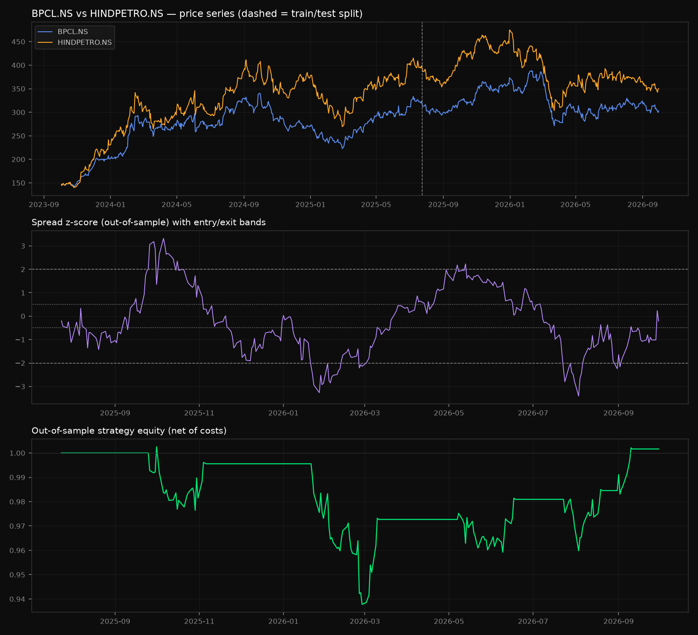

---

### ONGC.NS / COALINDIA.NS

- **Latest prices:** ONGC.NS ₹225.80 · COALINDIA.NS ₹425.00
- **Hedge ratio (train-fitted):** 1.4186
- **Cointegration (train):** PASS at 5% — ADF -3.37, p=0.0119
- **Persistence:** passed 5% in 58 of 66 real-data runs (strict tier: 1/66)
- **Spread half-life:** 12.3 days
- **Current z-score:** +2.48
- **Signal today:** SHORT spread (short COALINDIA.NS, long ONGC.NS)

**Out-of-sample backtest** (beta frozen from train window):

| Metric | Value |
|---|---|
| Sharpe | 0.60 |
| Sortino | 0.47 |
| Annualised return | 4.32% |
| Annualised vol | 7.52% |
| Max drawdown | -6.19% |
| Round-trip trades | 5 |

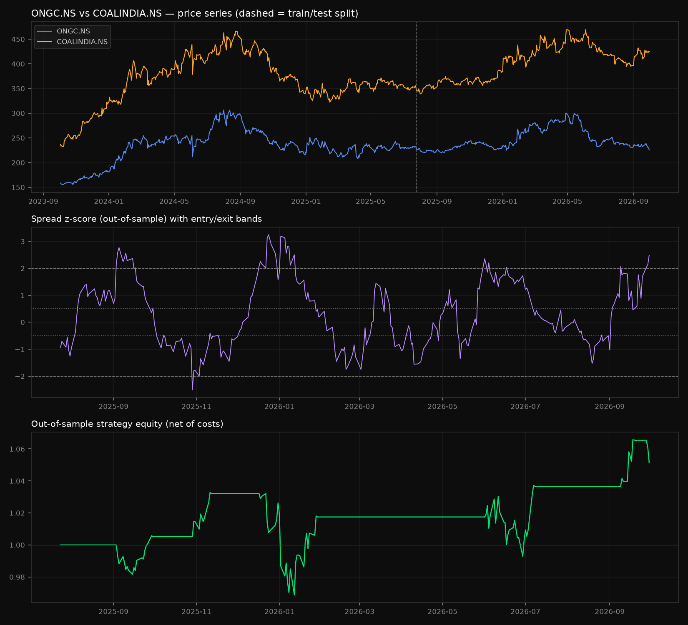

---

### NTPC.NS / POWERGRID.NS

- **Latest prices:** NTPC.NS ₹322.75 · POWERGRID.NS ₹260.50
- **Hedge ratio (train-fitted):** 0.8217
- **Cointegration (train):** FAIL at 5% — ADF -2.54, p=0.1062
- **Persistence:** passed 5% in 0 of 66 real-data runs (strict tier: 0/66)
- **Spread half-life:** 24.0 days
- **Current z-score:** -0.38
- **Signal today:** flat / no stretch
- ⚠️ _Pair did not cointegrate on training data. Any signal here is not statistically justified — observation only._

**Out-of-sample backtest** (beta frozen from train window):

| Metric | Value |
|---|---|
| Sharpe | 0.43 |
| Sortino | 0.33 |
| Annualised return | 2.22% |
| Annualised vol | 5.46% |
| Max drawdown | -5.18% |
| Round-trip trades | 6 |

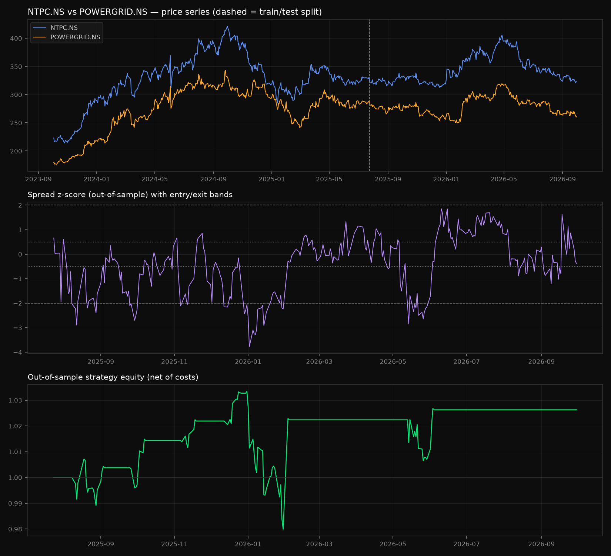

---

### BAJAJ-AUTO.NS / HEROMOTOCO.NS

- **Latest prices:** BAJAJ-AUTO.NS ₹10,874.00 · HEROMOTOCO.NS ₹5,241.00
- **Hedge ratio (train-fitted):** 0.4096
- **Cointegration (train):** FAIL at 5% — ADF -2.30, p=0.1729
- **Persistence:** passed 5% in 0 of 66 real-data runs (strict tier: 0/66)
- **Spread half-life:** 29.4 days
- **Current z-score:** +0.53
- **Signal today:** watch (approaching band)
- ⚠️ _Pair did not cointegrate on training data. Any signal here is not statistically justified — observation only._

**Out-of-sample backtest** (beta frozen from train window):

| Metric | Value |
|---|---|
| Sharpe | -0.54 |
| Sortino | -0.56 |
| Annualised return | -6.16% |
| Annualised vol | 10.67% |
| Max drawdown | -19.78% |
| Round-trip trades | 6 |

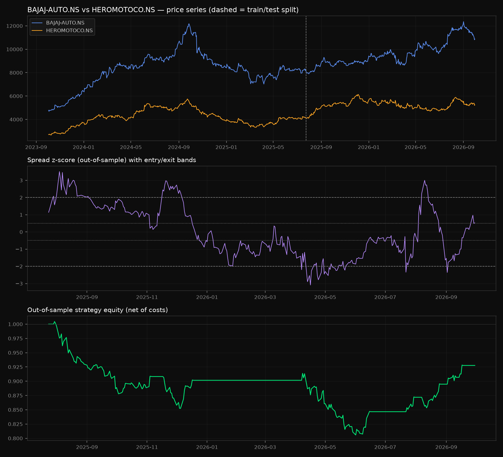

---

### TATASTEEL.NS / JSWSTEEL.NS

- **Latest prices:** TATASTEEL.NS ₹184.30 · JSWSTEEL.NS ₹1,253.40
- **Hedge ratio (train-fitted):** 3.1309
- **Cointegration (train):** FAIL at 5% — ADF -1.39, p=0.5886
- **Persistence:** passed 5% in 0 of 66 real-data runs (strict tier: 0/66)
- **Spread half-life:** 65.5 days
- **Current z-score:** -0.65
- **Signal today:** watch (approaching band)
- ⚠️ _Pair did not cointegrate on training data. Any signal here is not statistically justified — observation only._

**Out-of-sample backtest** (beta frozen from train window):

| Metric | Value |
|---|---|
| Sharpe | 0.35 |
| Sortino | 0.33 |
| Annualised return | 2.53% |
| Annualised vol | 8.18% |
| Max drawdown | -5.47% |
| Round-trip trades | 5 |

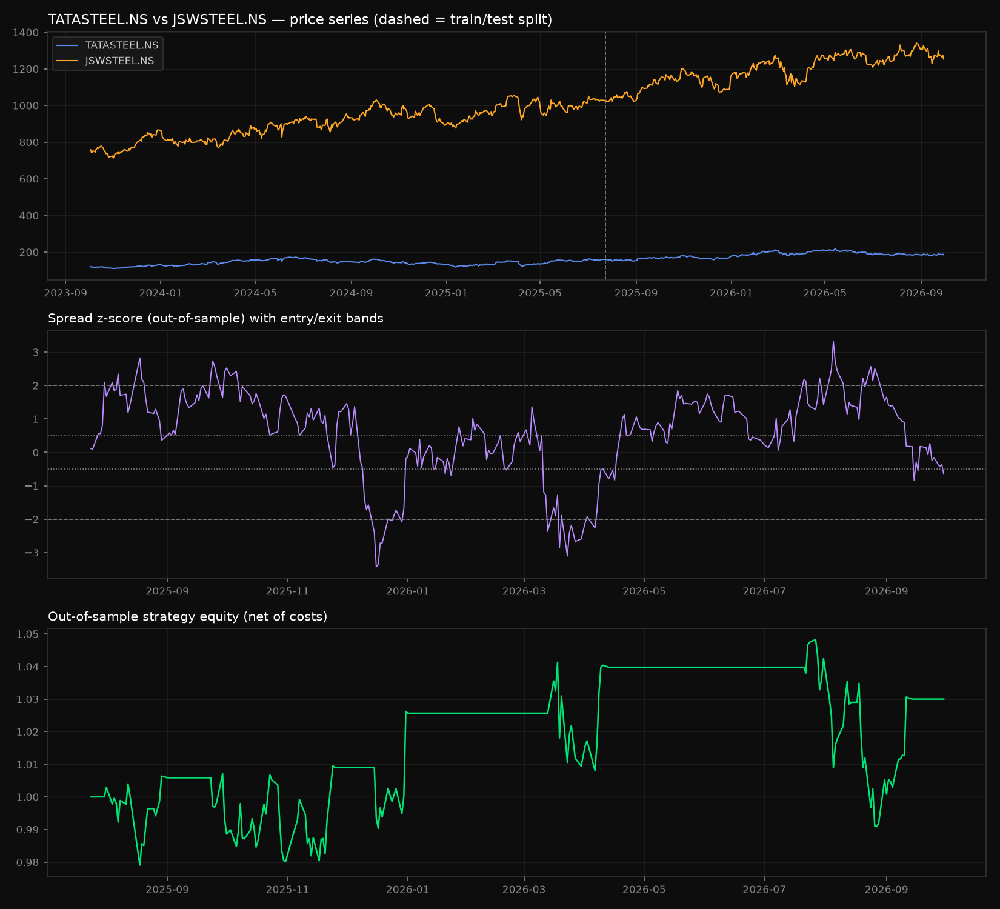

---

### SUNPHARMA.NS / CIPLA.NS

- **Latest prices:** SUNPHARMA.NS ₹1,816.60 · CIPLA.NS ₹1,346.00
- **Hedge ratio (train-fitted):** 0.4952
- **Cointegration (train):** PASS at 5% — ADF -3.43, p=0.0099
- **Persistence:** passed 5% in 66 of 66 real-data runs (strict tier: 5/66)
- **Spread half-life:** 10.6 days
- **Current z-score:** -1.14
- **Signal today:** watch (approaching band)

**Out-of-sample backtest** (beta frozen from train window):

| Metric | Value |
|---|---|
| Sharpe | 0.05 |
| Sortino | 0.06 |
| Annualised return | 0.10% |
| Annualised vol | 7.82% |
| Max drawdown | -10.25% |
| Round-trip trades | 5 |

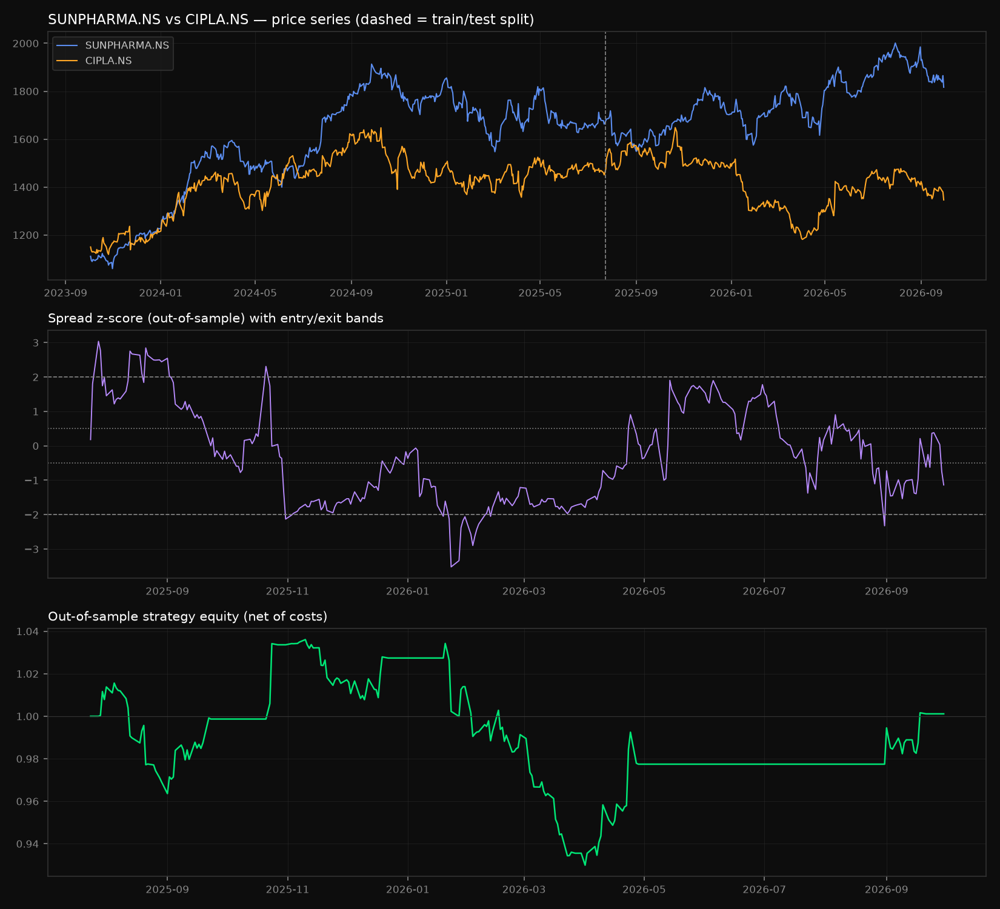

---

_Generated 2026-10-01 · pairs mean-reversion scanner · out-of-sample backtest · multiple-testing-aware · not investment advice._
