# Indian Pairs-Trading Scanner — 2026-10-02

> **What this is:** a market-neutral *pairs mean-reversion* scanner. It flags when two related NSE stocks have drifted apart far enough that their historical relationship signals a possible convergence trade. It does **not** forecast growth, rank "best" stocks, or predict company performance. A signal means the *spread between two stocks* is stretched — nothing about either stock being a good investment. Not investment advice; do your own research.

## Methodology (fixed in advance)

- **Universe:** 16 declared sector-mate pairs. Parameters (3y window, 60/40 train-test, z-entry 2.0, z-exit 0.5, 5 bps costs) are pre-registered; changes are logged in the README changelog *before* looking at results.
- **Multiple testing:** at the 5% level across 16 pairs, **≈0.8 false positives per run are expected by chance alone** even if nothing truly cointegrates. A single-day pass is a candidate, not a discovery.
- **Strict tier:** Bonferroni-corrected threshold p < 0.0031 (marked ✓✓).
- **Evidence = persistence:** the Persistence column counts how often each pair has passed the 5% test across all *real-data* daily runs recorded in `reports/history.csv`. Pairs deserve attention only when they pass persistently.

> ⚠️ **Some results use SIMULATED fallback data** (real data was unreachable this run) and are not real market results. These are marked below and are EXCLUDED from persistence counts.

## Summary

| Pair | p-value | Coint. | Persistence | Current z | Signal | OOS Sharpe |
|---|---|---|---|---|---|---|
| HDFCBANK.NS/ICICIBANK.NS *(sim)* | 0.0030 | ✓✓ | 1/55 | -1.55 | watch | 1.13 |
| AXISBANK.NS/ICICIBANK.NS | 0.9229 | ✗ | 0/67 | -1.44 | watch | -0.09 |
| KOTAKBANK.NS/HDFCBANK.NS | 0.1266 | ✗ | 0/67 | -0.86 | watch | 1.03 |
| SBIN.NS/BANKBARODA.NS | 0.1422 | ✗ | 0/67 | +0.77 | watch | 0.02 |
| TCS.NS/INFY.NS | 0.7491 | ✗ | 0/67 | +0.93 | watch | 2.36 |
| INFY.NS/WIPRO.NS | 0.1905 | ✗ | 0/67 | -2.70 | LONG spread | 1.76 |
| HCLTECH.NS/TECHM.NS | 0.2406 | ✗ | 0/67 | -0.50 | flat / no stretch | -0.25 |
| ACC.NS/AMBUJACEM.NS | 0.7928 | ✗ | 0/67 | -2.42 | LONG spread | 0.47 |
| ULTRACEMCO.NS/SHREECEM.NS | 0.4950 | ✗ | 0/67 | -1.33 | watch | -0.29 |
| IOC.NS/BPCL.NS | 0.8244 | ✗ | 0/67 | -0.36 | flat / no stretch | 0.40 |
| BPCL.NS/HINDPETRO.NS | 0.2708 | ✗ | 0/67 | -0.41 | flat / no stretch | 0.05 |
| ONGC.NS/COALINDIA.NS | 0.0126 | ✓ | 59/67 | +2.34 | SHORT spread | 0.60 |
| NTPC.NS/POWERGRID.NS | 0.1134 | ✗ | 0/67 | -0.29 | flat / no stretch | 0.43 |
| BAJAJ-AUTO.NS/HEROMOTOCO.NS | 0.1712 | ✗ | 0/67 | +1.76 | watch | -0.54 |
| TATASTEEL.NS/JSWSTEEL.NS | 0.5857 | ✗ | 0/67 | -0.71 | watch | 0.33 |
| SUNPHARMA.NS/CIPLA.NS | 0.0097 | ✓ | 67/67 | -0.85 | watch | 0.05 |

_Legend: ✓✓ passes strict Bonferroni tier · ✓ passes 5% only · ✗ fails. Persistence = 5%-passes / real-data runs recorded. \*no real-data history yet._

---

### HDFCBANK.NS / ICICIBANK.NS · _SIMULATED_

- **Latest prices:** HDFCBANK.NS ₹77.27 · ICICIBANK.NS ₹113.78
- **Hedge ratio (train-fitted):** 1.5557
- **Cointegration (train):** PASS at 5% — ADF -3.79, p=0.0030 · **passes strict Bonferroni tier**
- **Persistence:** passed 5% in 1 of 55 real-data runs (strict tier: 0/55)
- **Spread half-life:** 14.0 days
- **Current z-score:** -1.55
- **Signal today:** watch (approaching band)

**Out-of-sample backtest** (beta frozen from train window):

| Metric | Value |
|---|---|
| Sharpe | 1.13 |
| Sortino | 0.86 |
| Annualised return | 1.88% |
| Annualised vol | 1.66% |
| Max drawdown | -1.19% |
| Round-trip trades | 5 |

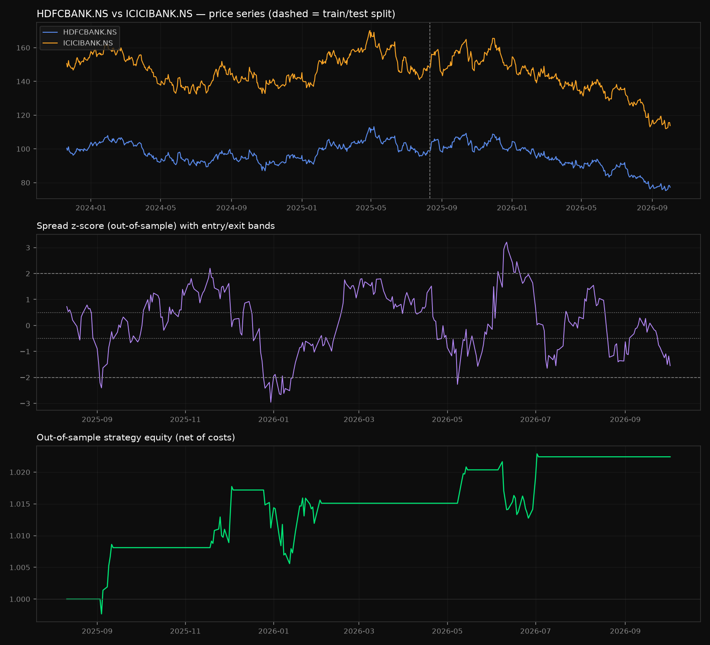

---

### AXISBANK.NS / ICICIBANK.NS

- **Latest prices:** AXISBANK.NS ₹1,217.10 · ICICIBANK.NS ₹1,310.60
- **Hedge ratio (train-fitted):** 0.9585
- **Cointegration (train):** FAIL at 5% — ADF -0.32, p=0.9229
- **Persistence:** passed 5% in 0 of 67 real-data runs (strict tier: 0/67)
- **Spread half-life:** 436.1 days
- **Current z-score:** -1.44
- **Signal today:** watch (approaching band)
- ⚠️ _Pair did not cointegrate on training data. Any signal here is not statistically justified — observation only._

**Out-of-sample backtest** (beta frozen from train window):

| Metric | Value |
|---|---|
| Sharpe | -0.09 |
| Sortino | -0.08 |
| Annualised return | -1.11% |
| Annualised vol | 8.68% |
| Max drawdown | -7.77% |
| Round-trip trades | 6 |

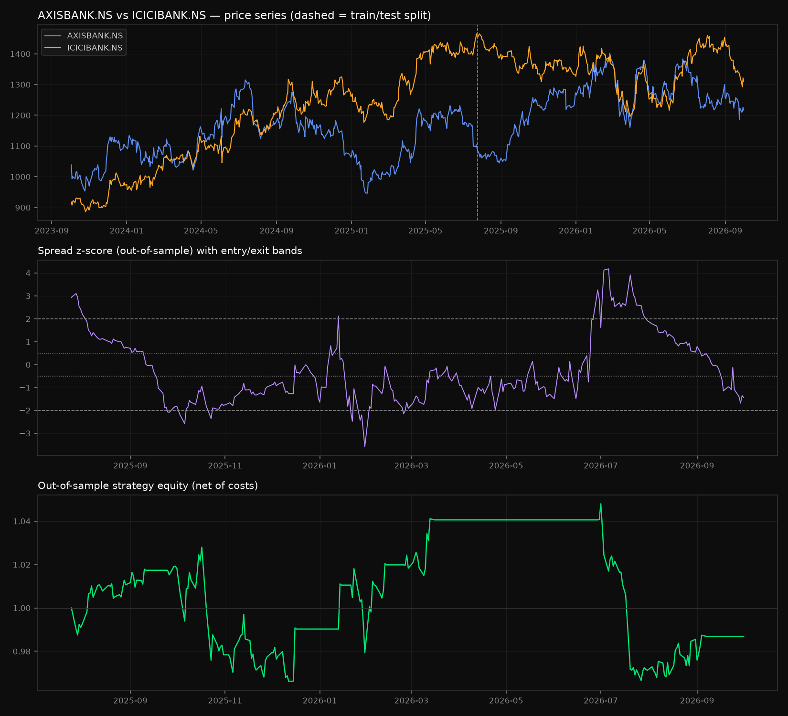

---

### KOTAKBANK.NS / HDFCBANK.NS

- **Latest prices:** KOTAKBANK.NS ₹418.35 · HDFCBANK.NS ₹721.20
- **Hedge ratio (train-fitted):** 2.1581
- **Cointegration (train):** FAIL at 5% — ADF -2.46, p=0.1266
- **Persistence:** passed 5% in 0 of 67 real-data runs (strict tier: 0/67)
- **Spread half-life:** 25.0 days
- **Current z-score:** -0.86
- **Signal today:** watch (approaching band)
- ⚠️ _Pair did not cointegrate on training data. Any signal here is not statistically justified — observation only._

**Out-of-sample backtest** (beta frozen from train window):

| Metric | Value |
|---|---|
| Sharpe | 1.03 |
| Sortino | 0.81 |
| Annualised return | 6.99% |
| Annualised vol | 6.81% |
| Max drawdown | -4.31% |
| Round-trip trades | 7 |

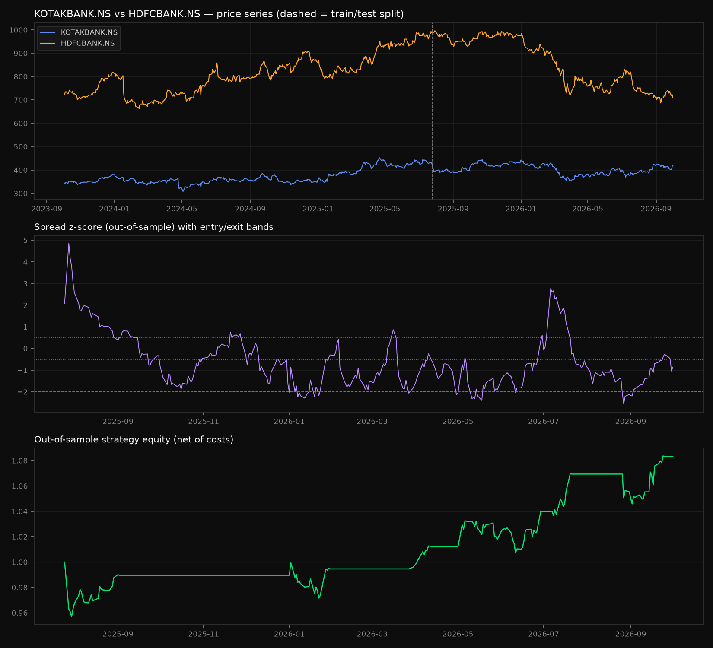

---

### SBIN.NS / BANKBARODA.NS

- **Latest prices:** SBIN.NS ₹954.10 · BANKBARODA.NS ₹230.82
- **Hedge ratio (train-fitted):** 0.1901
- **Cointegration (train):** FAIL at 5% — ADF -2.40, p=0.1422
- **Persistence:** passed 5% in 0 of 67 real-data runs (strict tier: 0/67)
- **Spread half-life:** 21.1 days
- **Current z-score:** +0.77
- **Signal today:** watch (approaching band)
- ⚠️ _Pair did not cointegrate on training data. Any signal here is not statistically justified — observation only._

**Out-of-sample backtest** (beta frozen from train window):

| Metric | Value |
|---|---|
| Sharpe | 0.02 |
| Sortino | 0.02 |
| Annualised return | -0.20% |
| Annualised vol | 9.07% |
| Max drawdown | -8.73% |
| Round-trip trades | 5 |

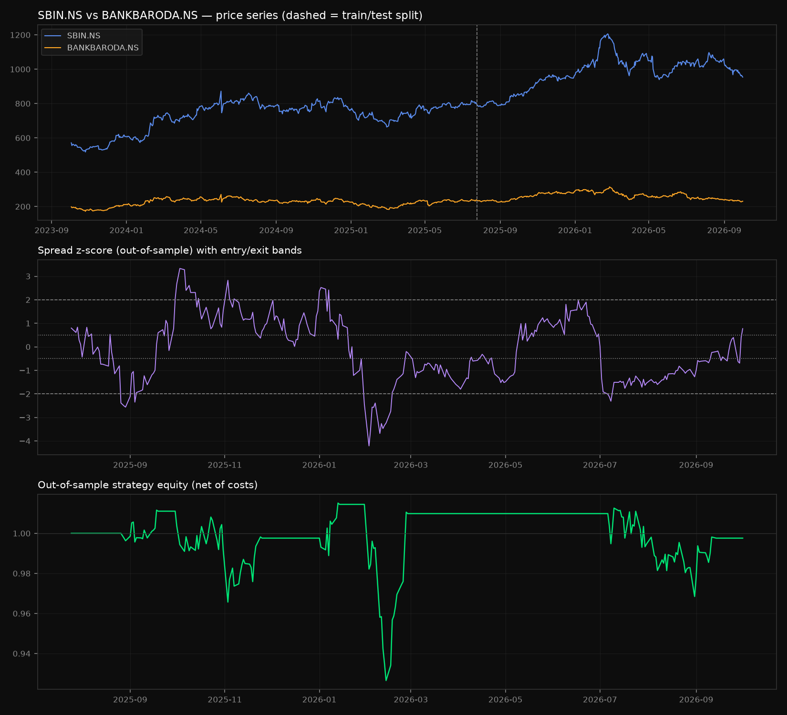

---

### TCS.NS / INFY.NS

- **Latest prices:** TCS.NS ₹2,075.00 · INFY.NS ₹1,035.00
- **Hedge ratio (train-fitted):** 0.4521
- **Cointegration (train):** FAIL at 5% — ADF -1.01, p=0.7491
- **Persistence:** passed 5% in 0 of 67 real-data runs (strict tier: 0/67)
- **Spread half-life:** 80.2 days
- **Current z-score:** +0.93
- **Signal today:** watch (approaching band)
- ⚠️ _Pair did not cointegrate on training data. Any signal here is not statistically justified — observation only._

**Out-of-sample backtest** (beta frozen from train window):

| Metric | Value |
|---|---|
| Sharpe | 2.36 |
| Sortino | 2.71 |
| Annualised return | 9.43% |
| Annualised vol | 3.84% |
| Max drawdown | -0.98% |
| Round-trip trades | 6 |

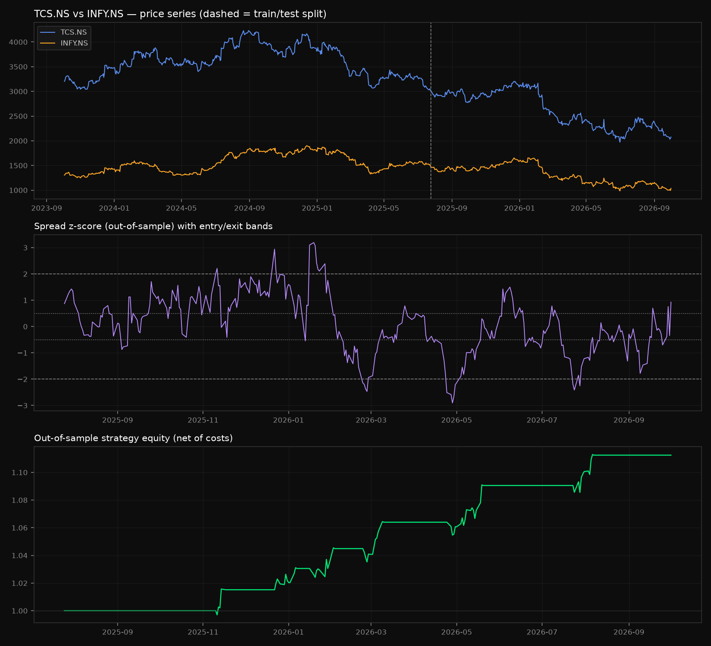

---

### INFY.NS / WIPRO.NS

- **Latest prices:** INFY.NS ₹1,035.00 · WIPRO.NS ₹159.35
- **Hedge ratio (train-fitted):** 0.1316
- **Cointegration (train):** FAIL at 5% — ADF -2.24, p=0.1905
- **Persistence:** passed 5% in 0 of 67 real-data runs (strict tier: 0/67)
- **Spread half-life:** 30.7 days
- **Current z-score:** -2.70
- **Signal today:** LONG spread (long WIPRO.NS, short INFY.NS)
- ⚠️ _Pair did not cointegrate on training data. Any signal here is not statistically justified — observation only._

**Out-of-sample backtest** (beta frozen from train window):

| Metric | Value |
|---|---|
| Sharpe | 1.76 |
| Sortino | 1.88 |
| Annualised return | 9.28% |
| Annualised vol | 5.11% |
| Max drawdown | -1.78% |
| Round-trip trades | 6 |

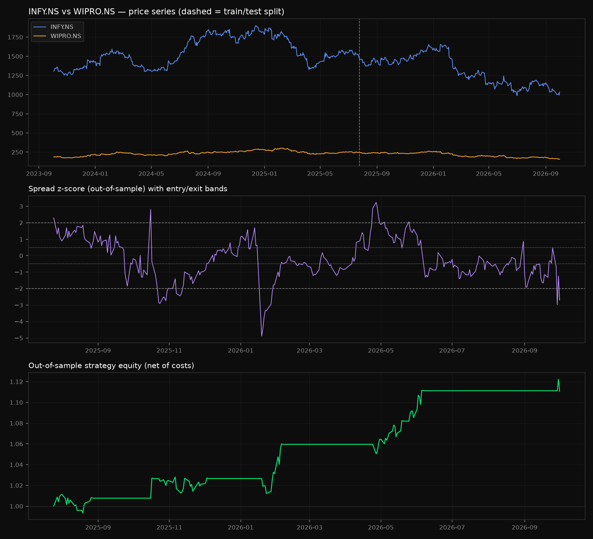

---

### HCLTECH.NS / TECHM.NS

- **Latest prices:** HCLTECH.NS ₹1,243.10 · TECHM.NS ₹1,533.00
- **Hedge ratio (train-fitted):** 0.9326
- **Cointegration (train):** FAIL at 5% — ADF -2.11, p=0.2406
- **Persistence:** passed 5% in 0 of 67 real-data runs (strict tier: 0/67)
- **Spread half-life:** 23.0 days
- **Current z-score:** -0.50
- **Signal today:** flat / no stretch
- ⚠️ _Pair did not cointegrate on training data. Any signal here is not statistically justified — observation only._

**Out-of-sample backtest** (beta frozen from train window):

| Metric | Value |
|---|---|
| Sharpe | -0.25 |
| Sortino | -0.23 |
| Annualised return | -2.05% |
| Annualised vol | 7.22% |
| Max drawdown | -8.43% |
| Round-trip trades | 4 |

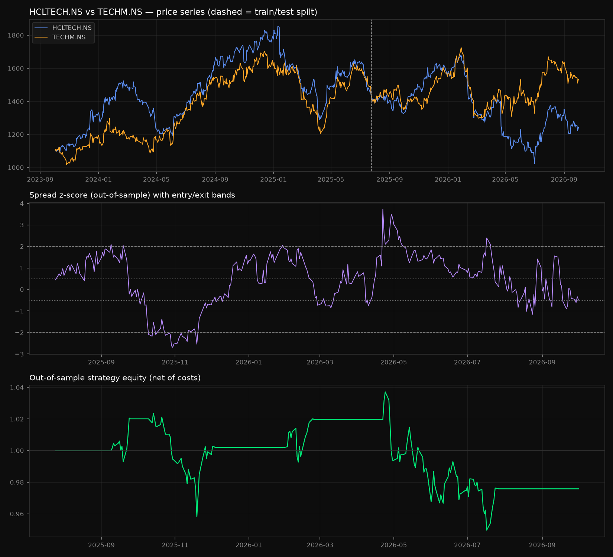

---

### ACC.NS / AMBUJACEM.NS

- **Latest prices:** ACC.NS ₹1,182.80 · AMBUJACEM.NS ₹362.25
- **Hedge ratio (train-fitted):** 0.1842
- **Cointegration (train):** FAIL at 5% — ADF -0.89, p=0.7928
- **Persistence:** passed 5% in 0 of 67 real-data runs (strict tier: 0/67)
- **Spread half-life:** 83.2 days
- **Current z-score:** -2.42
- **Signal today:** LONG spread (long AMBUJACEM.NS, short ACC.NS)
- ⚠️ _Pair did not cointegrate on training data. Any signal here is not statistically justified — observation only._

**Out-of-sample backtest** (beta frozen from train window):

| Metric | Value |
|---|---|
| Sharpe | 0.47 |
| Sortino | 0.39 |
| Annualised return | 2.77% |
| Annualised vol | 6.24% |
| Max drawdown | -5.05% |
| Round-trip trades | 4 |

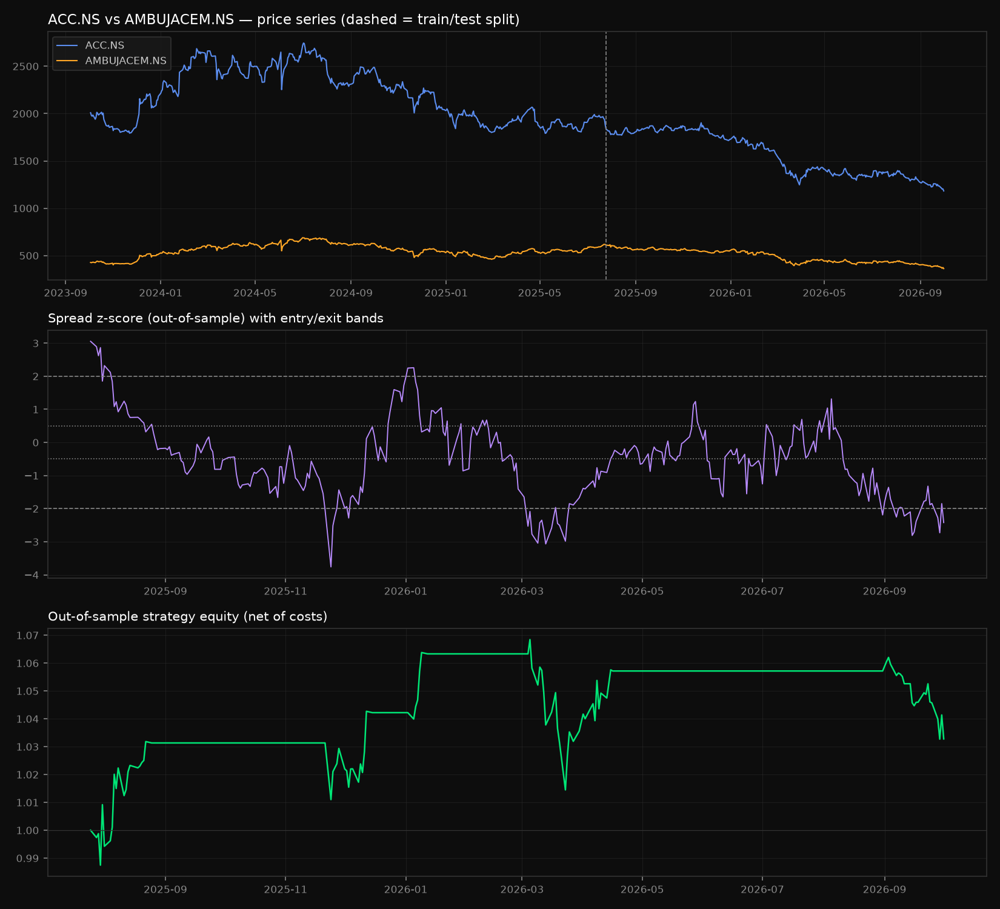

---

### ULTRACEMCO.NS / SHREECEM.NS

- **Latest prices:** ULTRACEMCO.NS ₹10,710.00 · SHREECEM.NS ₹21,900.00
- **Hedge ratio (train-fitted):** 0.8748
- **Cointegration (train):** FAIL at 5% — ADF -1.58, p=0.4950
- **Persistence:** passed 5% in 0 of 67 real-data runs (strict tier: 0/67)
- **Spread half-life:** 48.8 days
- **Current z-score:** -1.33
- **Signal today:** watch (approaching band)
- ⚠️ _Pair did not cointegrate on training data. Any signal here is not statistically justified — observation only._

**Out-of-sample backtest** (beta frozen from train window):

| Metric | Value |
|---|---|
| Sharpe | -0.29 |
| Sortino | -0.33 |
| Annualised return | -2.09% |
| Annualised vol | 6.58% |
| Max drawdown | -7.06% |
| Round-trip trades | 4 |

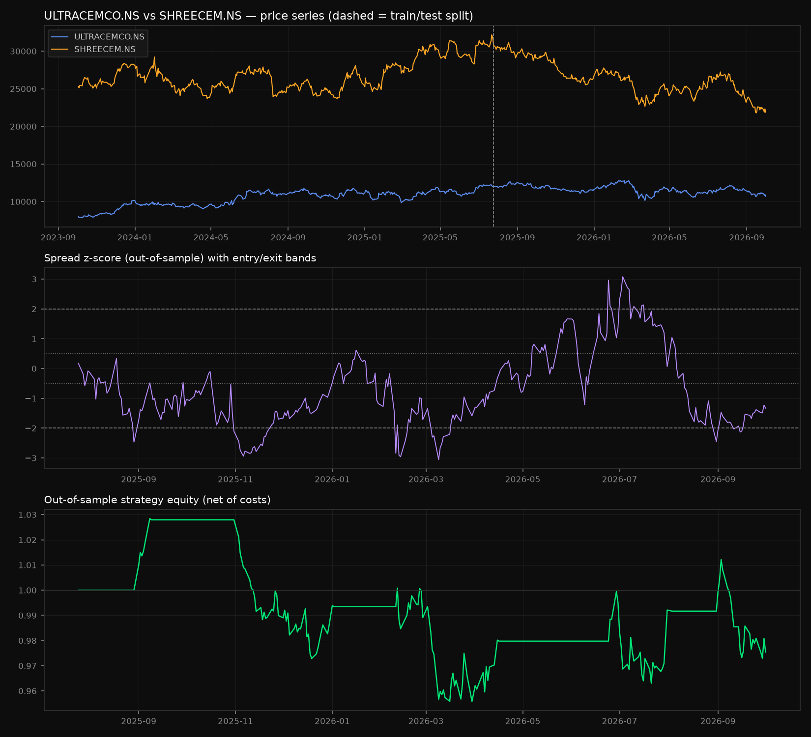

---

### IOC.NS / BPCL.NS

- **Latest prices:** IOC.NS ₹131.34 · BPCL.NS ₹300.60
- **Hedge ratio (train-fitted):** 1.7185
- **Cointegration (train):** FAIL at 5% — ADF -0.78, p=0.8244
- **Persistence:** passed 5% in 0 of 67 real-data runs (strict tier: 0/67)
- **Spread half-life:** 155.3 days
- **Current z-score:** -0.36
- **Signal today:** flat / no stretch
- ⚠️ _Pair did not cointegrate on training data. Any signal here is not statistically justified — observation only._

**Out-of-sample backtest** (beta frozen from train window):

| Metric | Value |
|---|---|
| Sharpe | 0.40 |
| Sortino | 0.38 |
| Annualised return | 2.30% |
| Annualised vol | 6.14% |
| Max drawdown | -6.65% |
| Round-trip trades | 6 |

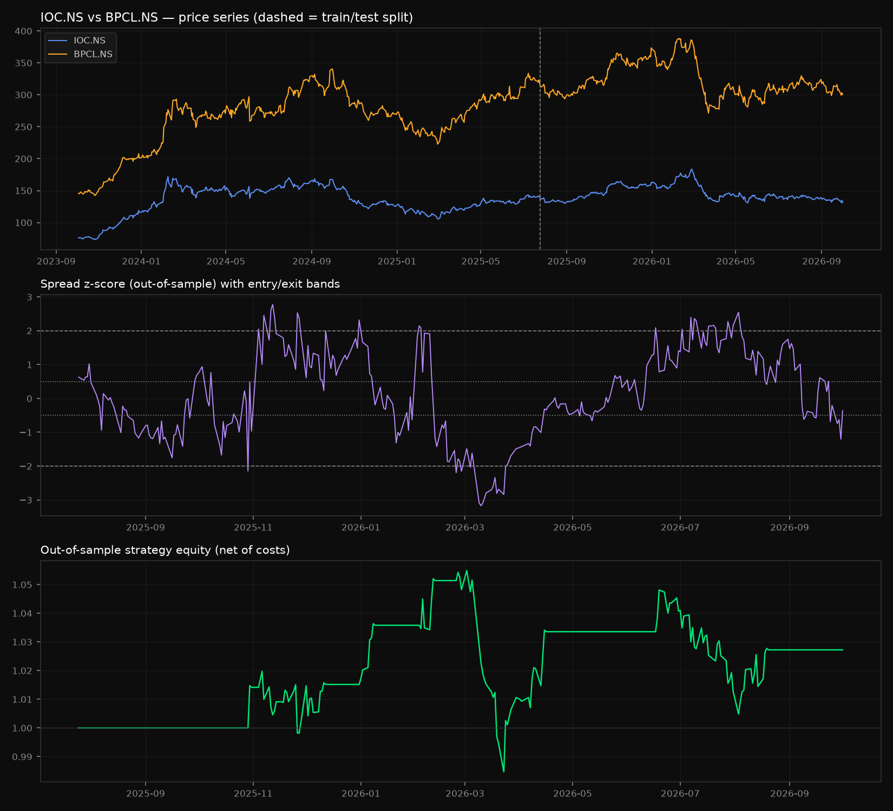

---

### BPCL.NS / HINDPETRO.NS

- **Latest prices:** BPCL.NS ₹300.60 · HINDPETRO.NS ₹345.00
- **Hedge ratio (train-fitted):** 1.3408
- **Cointegration (train):** FAIL at 5% — ADF -2.04, p=0.2708
- **Persistence:** passed 5% in 0 of 67 real-data runs (strict tier: 0/67)
- **Spread half-life:** 37.4 days
- **Current z-score:** -0.41
- **Signal today:** flat / no stretch
- ⚠️ _Pair did not cointegrate on training data. Any signal here is not statistically justified — observation only._

**Out-of-sample backtest** (beta frozen from train window):

| Metric | Value |
|---|---|
| Sharpe | 0.05 |
| Sortino | 0.05 |
| Annualised return | 0.14% |
| Annualised vol | 5.85% |
| Max drawdown | -6.64% |
| Round-trip trades | 5 |

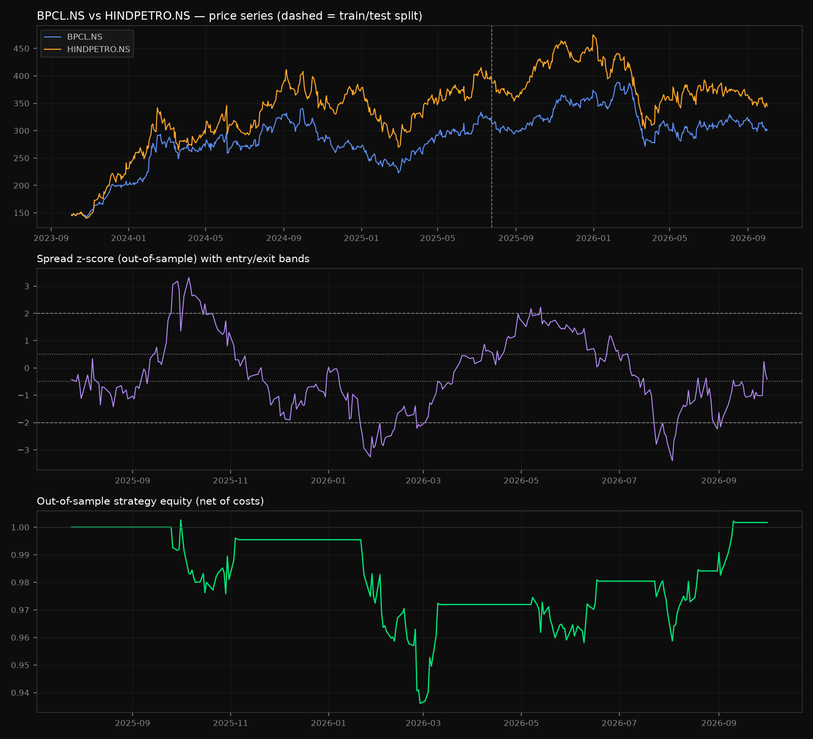

---

### ONGC.NS / COALINDIA.NS

- **Latest prices:** ONGC.NS ₹222.37 · COALINDIA.NS ₹420.40
- **Hedge ratio (train-fitted):** 1.4186
- **Cointegration (train):** PASS at 5% — ADF -3.35, p=0.0126
- **Persistence:** passed 5% in 59 of 67 real-data runs (strict tier: 1/67)
- **Spread half-life:** 12.4 days
- **Current z-score:** +2.34
- **Signal today:** SHORT spread (short COALINDIA.NS, long ONGC.NS)

**Out-of-sample backtest** (beta frozen from train window):

| Metric | Value |
|---|---|
| Sharpe | 0.60 |
| Sortino | 0.46 |
| Annualised return | 4.35% |
| Annualised vol | 7.64% |
| Max drawdown | -6.28% |
| Round-trip trades | 5 |

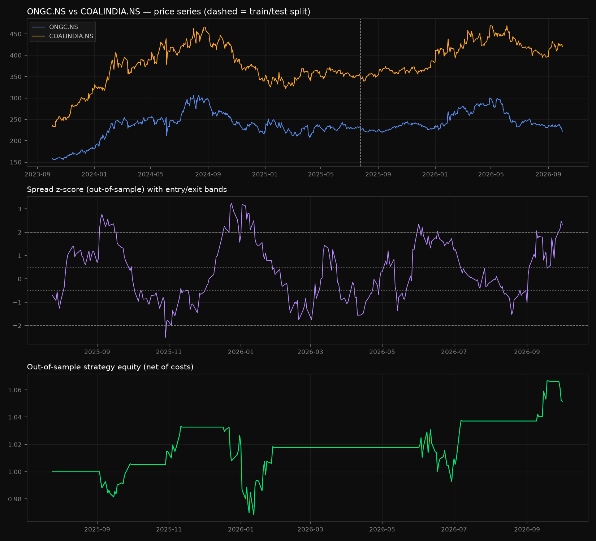

---

### NTPC.NS / POWERGRID.NS

- **Latest prices:** NTPC.NS ₹315.10 · POWERGRID.NS ₹254.55
- **Hedge ratio (train-fitted):** 0.8217
- **Cointegration (train):** FAIL at 5% — ADF -2.51, p=0.1134
- **Persistence:** passed 5% in 0 of 67 real-data runs (strict tier: 0/67)
- **Spread half-life:** 24.3 days
- **Current z-score:** -0.29
- **Signal today:** flat / no stretch
- ⚠️ _Pair did not cointegrate on training data. Any signal here is not statistically justified — observation only._

**Out-of-sample backtest** (beta frozen from train window):

| Metric | Value |
|---|---|
| Sharpe | 0.43 |
| Sortino | 0.33 |
| Annualised return | 2.26% |
| Annualised vol | 5.58% |
| Max drawdown | -5.29% |
| Round-trip trades | 6 |

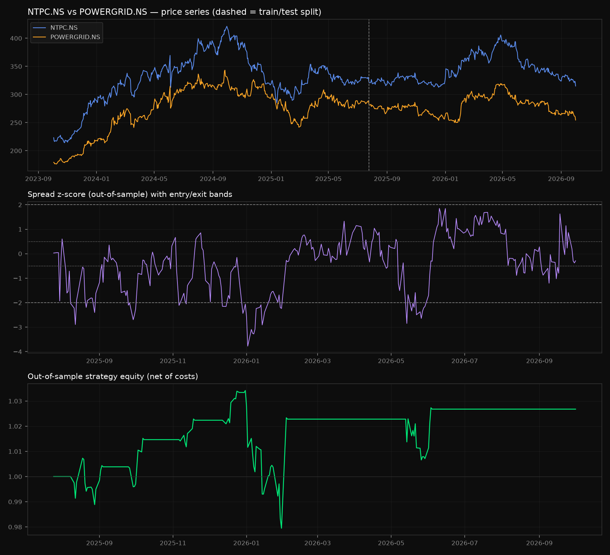

---

### BAJAJ-AUTO.NS / HEROMOTOCO.NS

- **Latest prices:** BAJAJ-AUTO.NS ₹10,045.00 · HEROMOTOCO.NS ₹5,168.00
- **Hedge ratio (train-fitted):** 0.4096
- **Cointegration (train):** FAIL at 5% — ADF -2.30, p=0.1712
- **Persistence:** passed 5% in 0 of 67 real-data runs (strict tier: 0/67)
- **Spread half-life:** 29.4 days
- **Current z-score:** +1.76
- **Signal today:** watch (approaching band)
- ⚠️ _Pair did not cointegrate on training data. Any signal here is not statistically justified — observation only._

**Out-of-sample backtest** (beta frozen from train window):

| Metric | Value |
|---|---|
| Sharpe | -0.54 |
| Sortino | -0.56 |
| Annualised return | -6.29% |
| Annualised vol | 10.89% |
| Max drawdown | -20.16% |
| Round-trip trades | 6 |

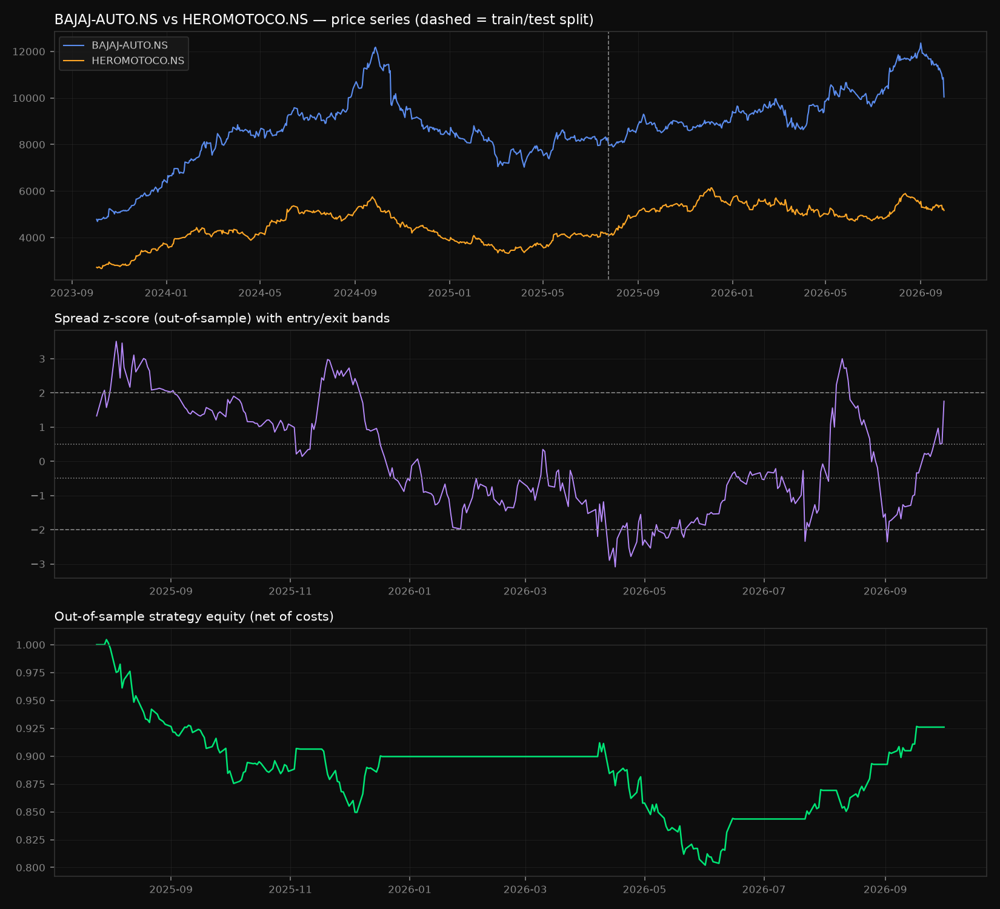

---

### TATASTEEL.NS / JSWSTEEL.NS

- **Latest prices:** TATASTEEL.NS ₹178.00 · JSWSTEEL.NS ₹1,233.00
- **Hedge ratio (train-fitted):** 3.1431
- **Cointegration (train):** FAIL at 5% — ADF -1.39, p=0.5857
- **Persistence:** passed 5% in 0 of 67 real-data runs (strict tier: 0/67)
- **Spread half-life:** 65.4 days
- **Current z-score:** -0.71
- **Signal today:** watch (approaching band)
- ⚠️ _Pair did not cointegrate on training data. Any signal here is not statistically justified — observation only._

**Out-of-sample backtest** (beta frozen from train window):

| Metric | Value |
|---|---|
| Sharpe | 0.33 |
| Sortino | 0.28 |
| Annualised return | 2.28% |
| Annualised vol | 7.69% |
| Max drawdown | -5.51% |
| Round-trip trades | 5 |

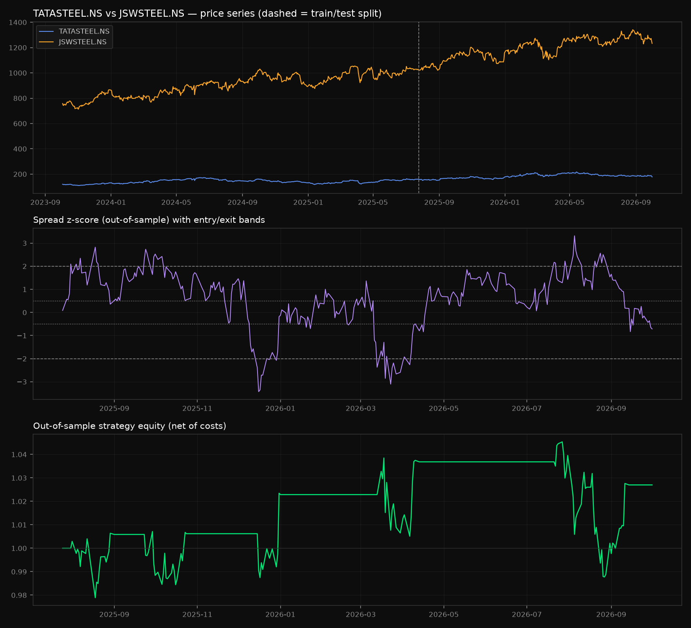

---

### SUNPHARMA.NS / CIPLA.NS

- **Latest prices:** SUNPHARMA.NS ₹1,801.00 · CIPLA.NS ₹1,344.00
- **Hedge ratio (train-fitted):** 0.4952
- **Cointegration (train):** PASS at 5% — ADF -3.44, p=0.0097
- **Persistence:** passed 5% in 67 of 67 real-data runs (strict tier: 5/67)
- **Spread half-life:** 10.6 days
- **Current z-score:** -0.85
- **Signal today:** watch (approaching band)

**Out-of-sample backtest** (beta frozen from train window):

| Metric | Value |
|---|---|
| Sharpe | 0.05 |
| Sortino | 0.06 |
| Annualised return | 0.10% |
| Annualised vol | 7.66% |
| Max drawdown | -10.05% |
| Round-trip trades | 5 |

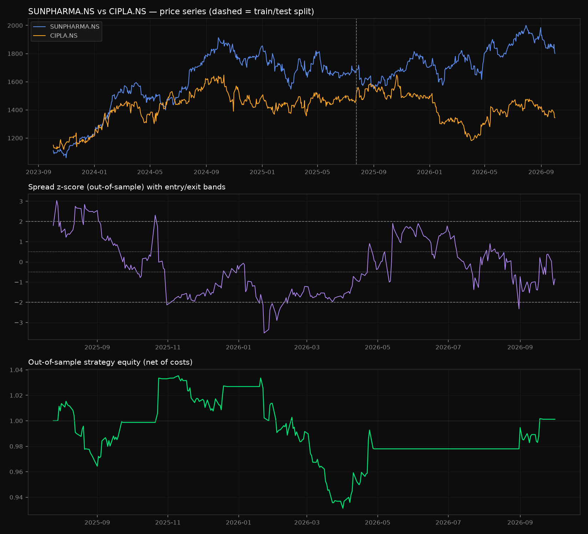

---

_Generated 2026-10-02 · pairs mean-reversion scanner · out-of-sample backtest · multiple-testing-aware · not investment advice._
