# Indian Pairs-Trading Scanner — 2026-10-05

> **What this is:** a market-neutral *pairs mean-reversion* scanner. It flags when two related NSE stocks have drifted apart far enough that their historical relationship signals a possible convergence trade. It does **not** forecast growth, rank "best" stocks, or predict company performance. A signal means the *spread between two stocks* is stretched — nothing about either stock being a good investment. Not investment advice; do your own research.

## Methodology (fixed in advance)

- **Universe:** 16 declared sector-mate pairs. Parameters (3y window, 60/40 train-test, z-entry 2.0, z-exit 0.5, 5 bps costs) are pre-registered; changes are logged in the README changelog *before* looking at results.
- **Multiple testing:** at the 5% level across 16 pairs, **≈0.8 false positives per run are expected by chance alone** even if nothing truly cointegrates. A single-day pass is a candidate, not a discovery.
- **Strict tier:** Bonferroni-corrected threshold p < 0.0031 (marked ✓✓).
- **Evidence = persistence:** the Persistence column counts how often each pair has passed the 5% test across all *real-data* daily runs recorded in `reports/history.csv`. Pairs deserve attention only when they pass persistently.

## Summary

| Pair | p-value | Coint. | Persistence | Current z | Signal | OOS Sharpe |
|---|---|---|---|---|---|---|
| HDFCBANK.NS/ICICIBANK.NS | 0.0734 | ✗ | 1/56 | -1.08 | watch | -0.56 |
| AXISBANK.NS/ICICIBANK.NS | 0.9434 | ✗ | 0/68 | -1.45 | watch | -0.16 |
| KOTAKBANK.NS/HDFCBANK.NS | 0.1348 | ✗ | 0/68 | -0.86 | watch | 1.03 |
| SBIN.NS/BANKBARODA.NS | 0.1433 | ✗ | 0/68 | +0.78 | watch | 0.02 |
| TCS.NS/INFY.NS | 0.7550 | ✗ | 0/68 | +0.92 | watch | 2.36 |
| INFY.NS/WIPRO.NS | 0.1733 | ✗ | 0/68 | -2.70 | LONG spread | 1.77 |
| HCLTECH.NS/TECHM.NS | 0.2483 | ✗ | 0/68 | -0.49 | flat / no stretch | -0.26 |
| ACC.NS/AMBUJACEM.NS | 0.8140 | ✗ | 0/68 | -2.42 | LONG spread | 0.47 |
| ULTRACEMCO.NS/SHREECEM.NS | 0.4902 | ✗ | 0/68 | -1.33 | watch | -0.28 |
| IOC.NS/BPCL.NS | 0.8294 | ✗ | 0/68 | -0.38 | flat / no stretch | 0.45 |
| BPCL.NS/HINDPETRO.NS | 0.2682 | ✗ | 0/68 | -0.42 | flat / no stretch | 0.05 |
| ONGC.NS/COALINDIA.NS | 0.0130 | ✓ | 60/68 | +2.34 | SHORT spread | 0.60 |
| NTPC.NS/POWERGRID.NS | 0.1200 | ✗ | 0/68 | -0.30 | flat / no stretch | 0.43 |
| BAJAJ-AUTO.NS/HEROMOTOCO.NS | 0.1731 | ✗ | 0/68 | +1.76 | watch | -0.54 |
| TATASTEEL.NS/JSWSTEEL.NS | 0.5951 | ✗ | 0/68 | -0.73 | watch | 0.35 |
| SUNPHARMA.NS/CIPLA.NS | 0.0092 | ✓ | 68/68 | -0.85 | watch | 0.05 |

_Legend: ✓✓ passes strict Bonferroni tier · ✓ passes 5% only · ✗ fails. Persistence = 5%-passes / real-data runs recorded. \*no real-data history yet._

---

### HDFCBANK.NS / ICICIBANK.NS

- **Latest prices:** HDFCBANK.NS ₹721.20 · ICICIBANK.NS ₹1,310.60
- **Hedge ratio (train-fitted):** 1.6376
- **Cointegration (train):** FAIL at 5% — ADF -2.70, p=0.0734
- **Persistence:** passed 5% in 1 of 56 real-data runs (strict tier: 0/56)
- **Spread half-life:** 24.8 days
- **Current z-score:** -1.08
- **Signal today:** watch (approaching band)
- ⚠️ _Pair did not cointegrate on training data. Any signal here is not statistically justified — observation only._

**Out-of-sample backtest** (beta frozen from train window):

| Metric | Value |
|---|---|
| Sharpe | -0.56 |
| Sortino | -0.59 |
| Annualised return | -3.70% |
| Annualised vol | 6.39% |
| Max drawdown | -8.04% |
| Round-trip trades | 4 |

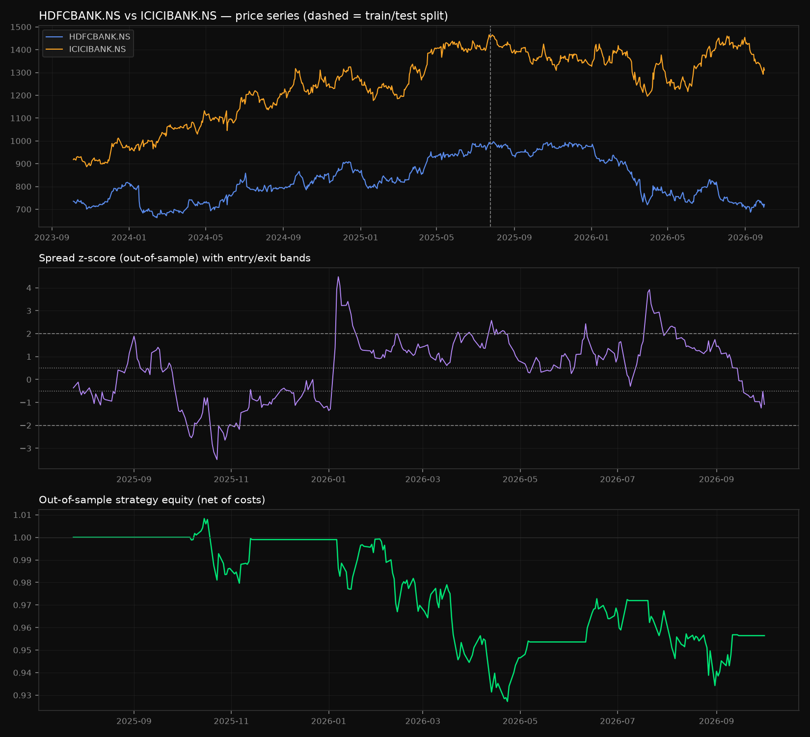

---

### AXISBANK.NS / ICICIBANK.NS

- **Latest prices:** AXISBANK.NS ₹1,217.10 · ICICIBANK.NS ₹1,310.60
- **Hedge ratio (train-fitted):** 0.9471
- **Cointegration (train):** FAIL at 5% — ADF -0.16, p=0.9434
- **Persistence:** passed 5% in 0 of 68 real-data runs (strict tier: 0/68)
- **Spread half-life:** 885.5 days
- **Current z-score:** -1.45
- **Signal today:** watch (approaching band)
- ⚠️ _Pair did not cointegrate on training data. Any signal here is not statistically justified — observation only._

**Out-of-sample backtest** (beta frozen from train window):

| Metric | Value |
|---|---|
| Sharpe | -0.16 |
| Sortino | -0.16 |
| Annualised return | -1.77% |
| Annualised vol | 8.69% |
| Max drawdown | -7.86% |
| Round-trip trades | 6 |

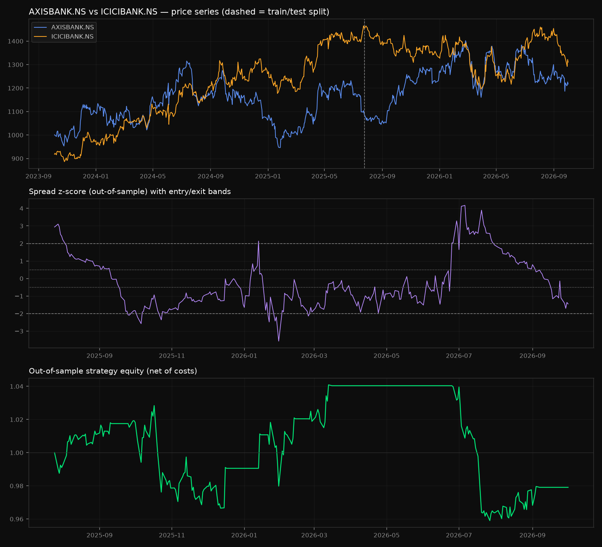

---

### KOTAKBANK.NS / HDFCBANK.NS

- **Latest prices:** KOTAKBANK.NS ₹418.35 · HDFCBANK.NS ₹721.20
- **Hedge ratio (train-fitted):** 2.1551
- **Cointegration (train):** FAIL at 5% — ADF -2.43, p=0.1348
- **Persistence:** passed 5% in 0 of 68 real-data runs (strict tier: 0/68)
- **Spread half-life:** 25.3 days
- **Current z-score:** -0.86
- **Signal today:** watch (approaching band)
- ⚠️ _Pair did not cointegrate on training data. Any signal here is not statistically justified — observation only._

**Out-of-sample backtest** (beta frozen from train window):

| Metric | Value |
|---|---|
| Sharpe | 1.03 |
| Sortino | 0.81 |
| Annualised return | 7.00% |
| Annualised vol | 6.81% |
| Max drawdown | -4.31% |
| Round-trip trades | 7 |

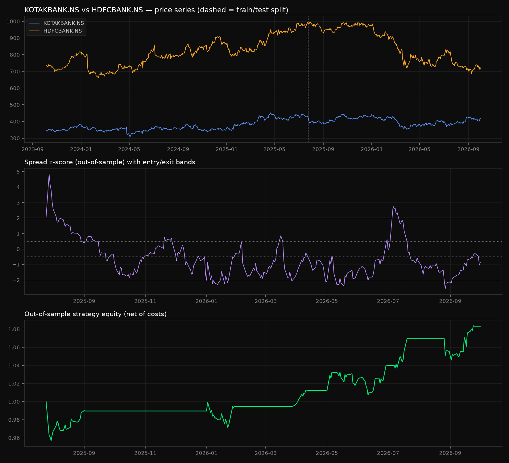

---

### SBIN.NS / BANKBARODA.NS

- **Latest prices:** SBIN.NS ₹954.10 · BANKBARODA.NS ₹230.82
- **Hedge ratio (train-fitted):** 0.1905
- **Cointegration (train):** FAIL at 5% — ADF -2.39, p=0.1433
- **Persistence:** passed 5% in 0 of 68 real-data runs (strict tier: 0/68)
- **Spread half-life:** 21.2 days
- **Current z-score:** +0.78
- **Signal today:** watch (approaching band)
- ⚠️ _Pair did not cointegrate on training data. Any signal here is not statistically justified — observation only._

**Out-of-sample backtest** (beta frozen from train window):

| Metric | Value |
|---|---|
| Sharpe | 0.02 |
| Sortino | 0.02 |
| Annualised return | -0.20% |
| Annualised vol | 9.06% |
| Max drawdown | -8.73% |
| Round-trip trades | 5 |

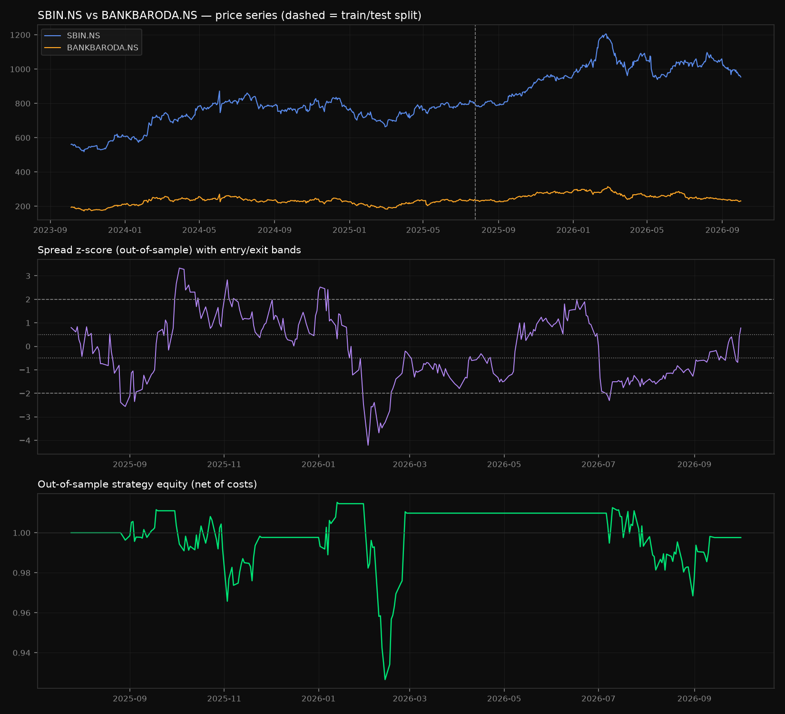

---

### TCS.NS / INFY.NS

- **Latest prices:** TCS.NS ₹2,075.00 · INFY.NS ₹1,035.00
- **Hedge ratio (train-fitted):** 0.4508
- **Cointegration (train):** FAIL at 5% — ADF -1.00, p=0.7550
- **Persistence:** passed 5% in 0 of 68 real-data runs (strict tier: 0/68)
- **Spread half-life:** 79.4 days
- **Current z-score:** +0.92
- **Signal today:** watch (approaching band)
- ⚠️ _Pair did not cointegrate on training data. Any signal here is not statistically justified — observation only._

**Out-of-sample backtest** (beta frozen from train window):

| Metric | Value |
|---|---|
| Sharpe | 2.36 |
| Sortino | 2.72 |
| Annualised return | 9.44% |
| Annualised vol | 3.85% |
| Max drawdown | -0.98% |
| Round-trip trades | 6 |

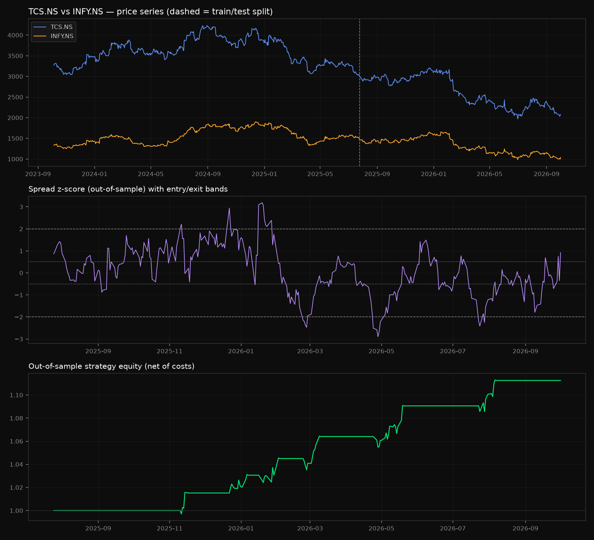

---

### INFY.NS / WIPRO.NS

- **Latest prices:** INFY.NS ₹1,035.00 · WIPRO.NS ₹159.35
- **Hedge ratio (train-fitted):** 0.1310
- **Cointegration (train):** FAIL at 5% — ADF -2.30, p=0.1733
- **Persistence:** passed 5% in 0 of 68 real-data runs (strict tier: 0/68)
- **Spread half-life:** 29.9 days
- **Current z-score:** -2.70
- **Signal today:** LONG spread (long WIPRO.NS, short INFY.NS)
- ⚠️ _Pair did not cointegrate on training data. Any signal here is not statistically justified — observation only._

**Out-of-sample backtest** (beta frozen from train window):

| Metric | Value |
|---|---|
| Sharpe | 1.77 |
| Sortino | 1.88 |
| Annualised return | 9.29% |
| Annualised vol | 5.11% |
| Max drawdown | -1.78% |
| Round-trip trades | 6 |

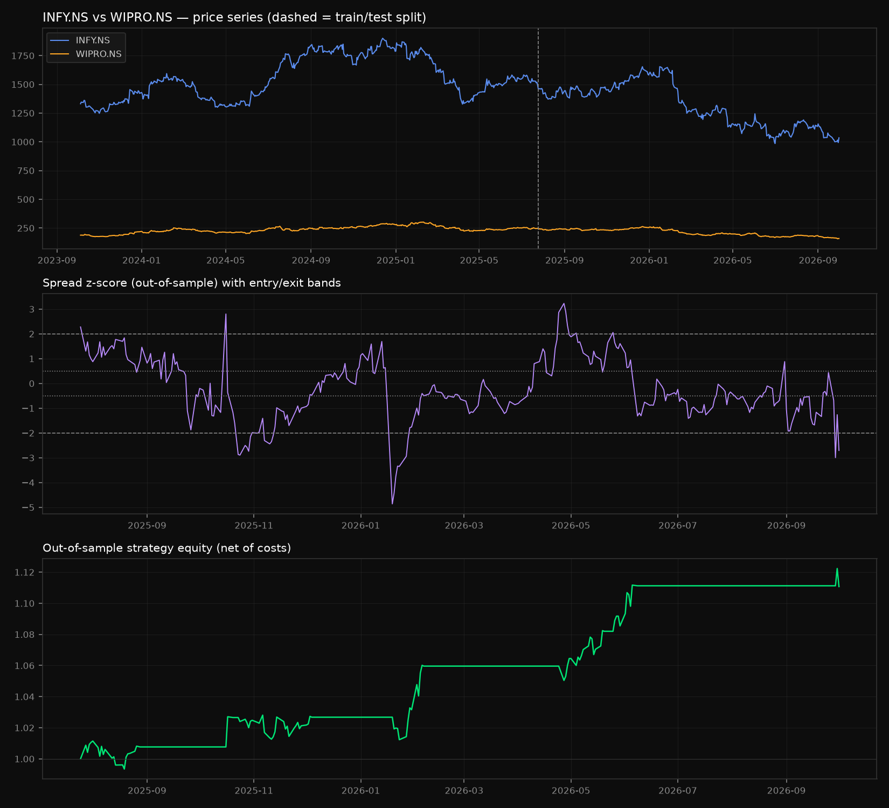

---

### HCLTECH.NS / TECHM.NS

- **Latest prices:** HCLTECH.NS ₹1,243.10 · TECHM.NS ₹1,533.00
- **Hedge ratio (train-fitted):** 0.9366
- **Cointegration (train):** FAIL at 5% — ADF -2.09, p=0.2483
- **Persistence:** passed 5% in 0 of 68 real-data runs (strict tier: 0/68)
- **Spread half-life:** 22.9 days
- **Current z-score:** -0.49
- **Signal today:** flat / no stretch
- ⚠️ _Pair did not cointegrate on training data. Any signal here is not statistically justified — observation only._

**Out-of-sample backtest** (beta frozen from train window):

| Metric | Value |
|---|---|
| Sharpe | -0.26 |
| Sortino | -0.24 |
| Annualised return | -2.09% |
| Annualised vol | 7.21% |
| Max drawdown | -8.41% |
| Round-trip trades | 4 |

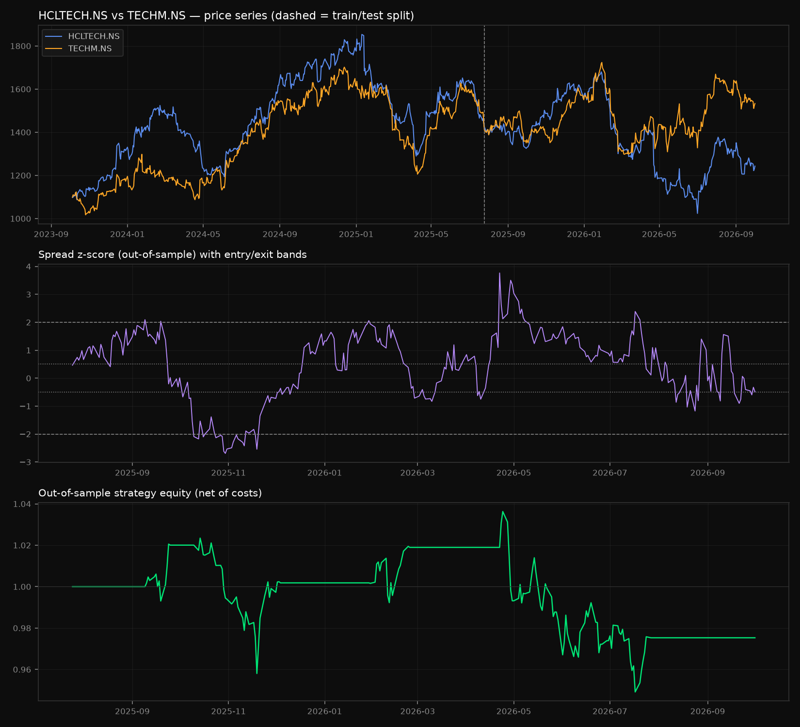

---

### ACC.NS / AMBUJACEM.NS

- **Latest prices:** ACC.NS ₹1,182.80 · AMBUJACEM.NS ₹362.25
- **Hedge ratio (train-fitted):** 0.1831
- **Cointegration (train):** FAIL at 5% — ADF -0.82, p=0.8140
- **Persistence:** passed 5% in 0 of 68 real-data runs (strict tier: 0/68)
- **Spread half-life:** 88.2 days
- **Current z-score:** -2.42
- **Signal today:** LONG spread (long AMBUJACEM.NS, short ACC.NS)
- ⚠️ _Pair did not cointegrate on training data. Any signal here is not statistically justified — observation only._

**Out-of-sample backtest** (beta frozen from train window):

| Metric | Value |
|---|---|
| Sharpe | 0.47 |
| Sortino | 0.38 |
| Annualised return | 2.75% |
| Annualised vol | 6.26% |
| Max drawdown | -5.08% |
| Round-trip trades | 4 |

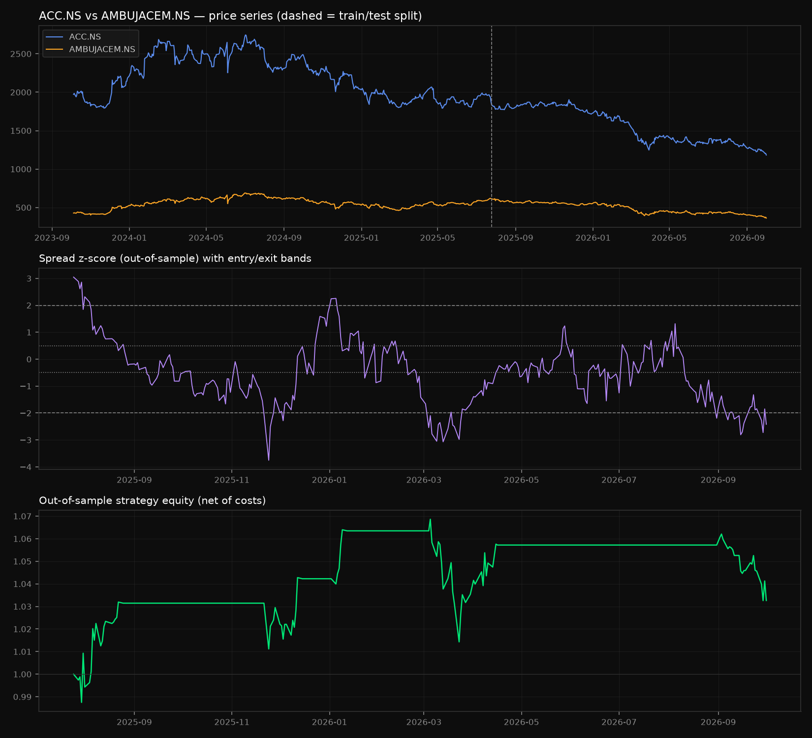

---

### ULTRACEMCO.NS / SHREECEM.NS

- **Latest prices:** ULTRACEMCO.NS ₹10,710.00 · SHREECEM.NS ₹21,900.00
- **Hedge ratio (train-fitted):** 0.8800
- **Cointegration (train):** FAIL at 5% — ADF -1.59, p=0.4902
- **Persistence:** passed 5% in 0 of 68 real-data runs (strict tier: 0/68)
- **Spread half-life:** 48.4 days
- **Current z-score:** -1.33
- **Signal today:** watch (approaching band)
- ⚠️ _Pair did not cointegrate on training data. Any signal here is not statistically justified — observation only._

**Out-of-sample backtest** (beta frozen from train window):

| Metric | Value |
|---|---|
| Sharpe | -0.28 |
| Sortino | -0.33 |
| Annualised return | -2.05% |
| Annualised vol | 6.56% |
| Max drawdown | -7.02% |
| Round-trip trades | 4 |

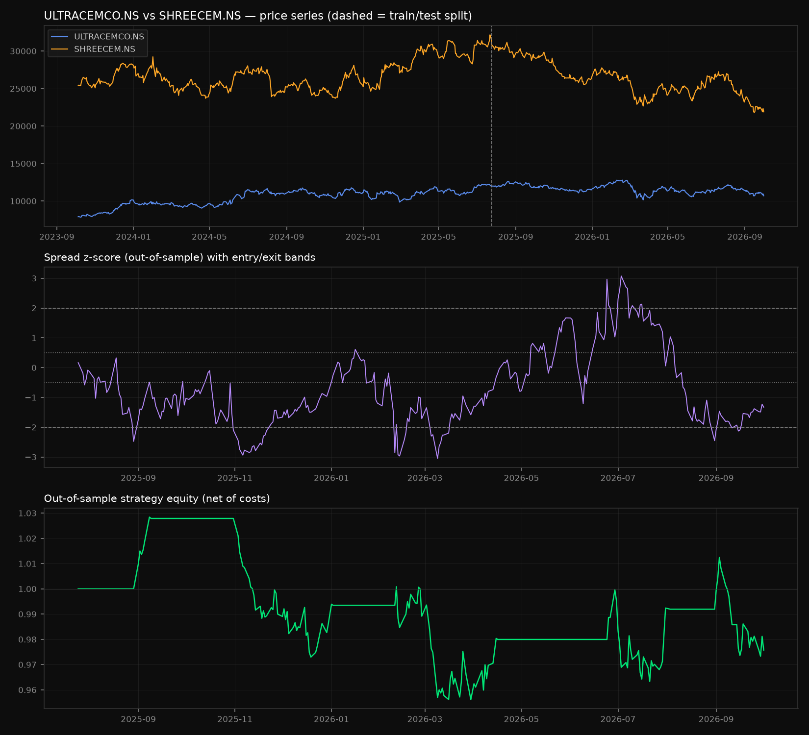

---

### IOC.NS / BPCL.NS

- **Latest prices:** IOC.NS ₹131.34 · BPCL.NS ₹300.60
- **Hedge ratio (train-fitted):** 1.7082
- **Cointegration (train):** FAIL at 5% — ADF -0.76, p=0.8294
- **Persistence:** passed 5% in 0 of 68 real-data runs (strict tier: 0/68)
- **Spread half-life:** 158.4 days
- **Current z-score:** -0.38
- **Signal today:** flat / no stretch
- ⚠️ _Pair did not cointegrate on training data. Any signal here is not statistically justified — observation only._

**Out-of-sample backtest** (beta frozen from train window):

| Metric | Value |
|---|---|
| Sharpe | 0.45 |
| Sortino | 0.49 |
| Annualised return | 2.73% |
| Annualised vol | 6.36% |
| Max drawdown | -6.74% |
| Round-trip trades | 5 |

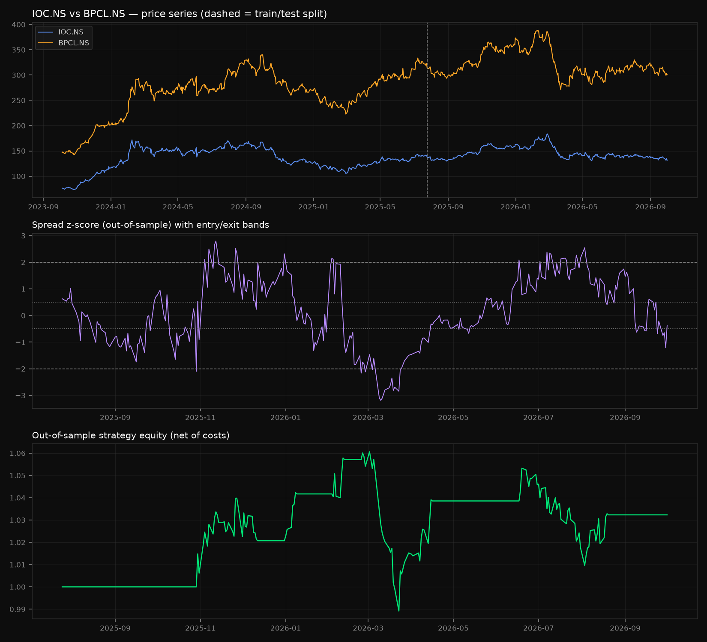

---

### BPCL.NS / HINDPETRO.NS

- **Latest prices:** BPCL.NS ₹300.60 · HINDPETRO.NS ₹345.00
- **Hedge ratio (train-fitted):** 1.3383
- **Cointegration (train):** FAIL at 5% — ADF -2.04, p=0.2682
- **Persistence:** passed 5% in 0 of 68 real-data runs (strict tier: 0/68)
- **Spread half-life:** 37.2 days
- **Current z-score:** -0.42
- **Signal today:** flat / no stretch
- ⚠️ _Pair did not cointegrate on training data. Any signal here is not statistically justified — observation only._

**Out-of-sample backtest** (beta frozen from train window):

| Metric | Value |
|---|---|
| Sharpe | 0.05 |
| Sortino | 0.05 |
| Annualised return | 0.12% |
| Annualised vol | 5.85% |
| Max drawdown | -6.64% |
| Round-trip trades | 5 |

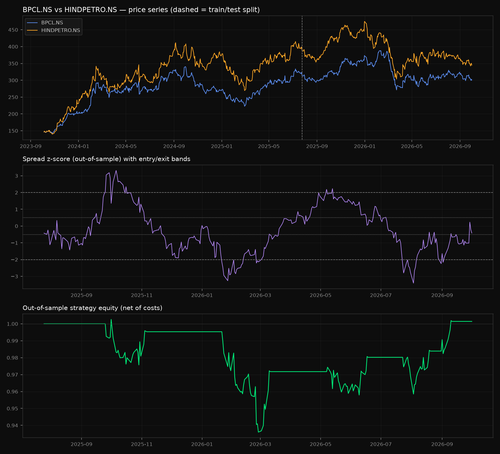

---

### ONGC.NS / COALINDIA.NS

- **Latest prices:** ONGC.NS ₹222.37 · COALINDIA.NS ₹420.40
- **Hedge ratio (train-fitted):** 1.4107
- **Cointegration (train):** PASS at 5% — ADF -3.34, p=0.0130
- **Persistence:** passed 5% in 60 of 68 real-data runs (strict tier: 1/68)
- **Spread half-life:** 12.3 days
- **Current z-score:** +2.34
- **Signal today:** SHORT spread (short COALINDIA.NS, long ONGC.NS)

**Out-of-sample backtest** (beta frozen from train window):

| Metric | Value |
|---|---|
| Sharpe | 0.60 |
| Sortino | 0.46 |
| Annualised return | 4.35% |
| Annualised vol | 7.64% |
| Max drawdown | -6.30% |
| Round-trip trades | 5 |

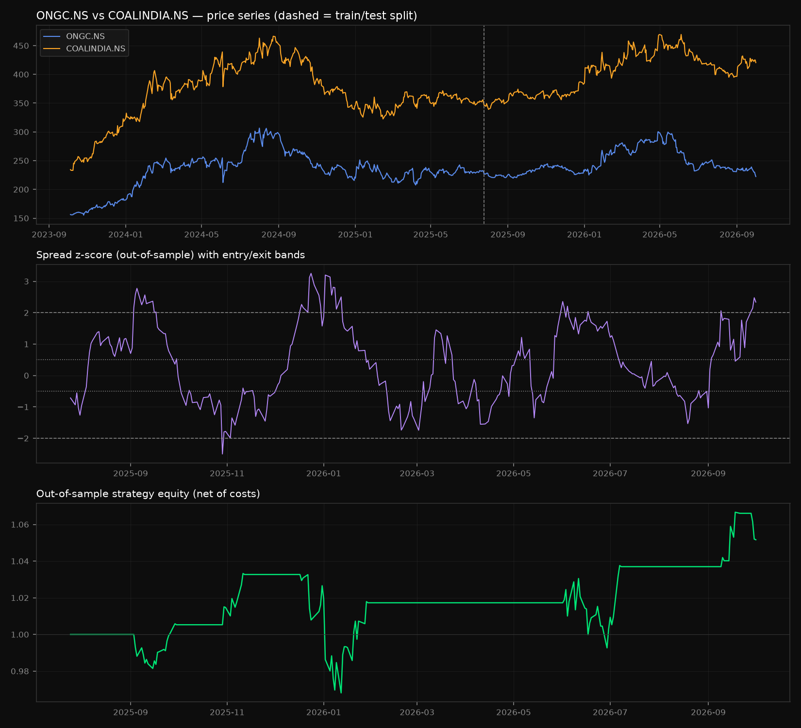

---

### NTPC.NS / POWERGRID.NS

- **Latest prices:** NTPC.NS ₹315.10 · POWERGRID.NS ₹254.55
- **Hedge ratio (train-fitted):** 0.8200
- **Cointegration (train):** FAIL at 5% — ADF -2.48, p=0.1200
- **Persistence:** passed 5% in 0 of 68 real-data runs (strict tier: 0/68)
- **Spread half-life:** 24.5 days
- **Current z-score:** -0.30
- **Signal today:** flat / no stretch
- ⚠️ _Pair did not cointegrate on training data. Any signal here is not statistically justified — observation only._

**Out-of-sample backtest** (beta frozen from train window):

| Metric | Value |
|---|---|
| Sharpe | 0.43 |
| Sortino | 0.33 |
| Annualised return | 2.26% |
| Annualised vol | 5.58% |
| Max drawdown | -5.29% |
| Round-trip trades | 6 |

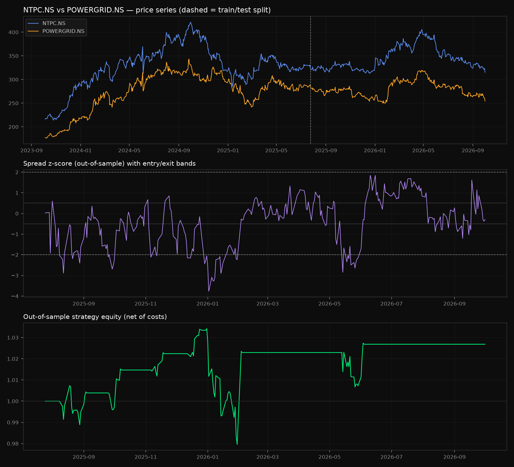

---

### BAJAJ-AUTO.NS / HEROMOTOCO.NS

- **Latest prices:** BAJAJ-AUTO.NS ₹10,045.00 · HEROMOTOCO.NS ₹5,168.00
- **Hedge ratio (train-fitted):** 0.4094
- **Cointegration (train):** FAIL at 5% — ADF -2.30, p=0.1731
- **Persistence:** passed 5% in 0 of 68 real-data runs (strict tier: 0/68)
- **Spread half-life:** 29.4 days
- **Current z-score:** +1.76
- **Signal today:** watch (approaching band)
- ⚠️ _Pair did not cointegrate on training data. Any signal here is not statistically justified — observation only._

**Out-of-sample backtest** (beta frozen from train window):

| Metric | Value |
|---|---|
| Sharpe | -0.54 |
| Sortino | -0.56 |
| Annualised return | -6.29% |
| Annualised vol | 10.90% |
| Max drawdown | -20.16% |
| Round-trip trades | 6 |

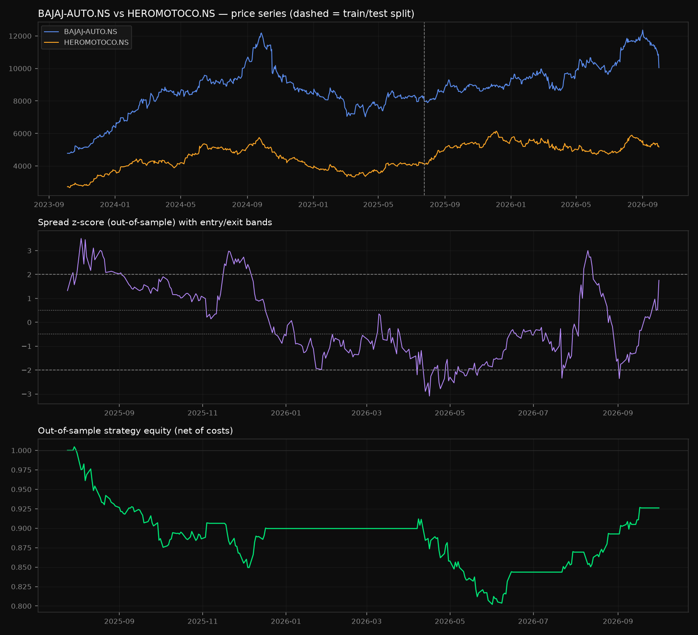

---

### TATASTEEL.NS / JSWSTEEL.NS

- **Latest prices:** TATASTEEL.NS ₹178.00 · JSWSTEEL.NS ₹1,233.00
- **Hedge ratio (train-fitted):** 3.1034
- **Cointegration (train):** FAIL at 5% — ADF -1.37, p=0.5951
- **Persistence:** passed 5% in 0 of 68 real-data runs (strict tier: 0/68)
- **Spread half-life:** 63.0 days
- **Current z-score:** -0.73
- **Signal today:** watch (approaching band)
- ⚠️ _Pair did not cointegrate on training data. Any signal here is not statistically justified — observation only._

**Out-of-sample backtest** (beta frozen from train window):

| Metric | Value |
|---|---|
| Sharpe | 0.35 |
| Sortino | 0.34 |
| Annualised return | 2.63% |
| Annualised vol | 8.30% |
| Max drawdown | -5.54% |
| Round-trip trades | 5 |

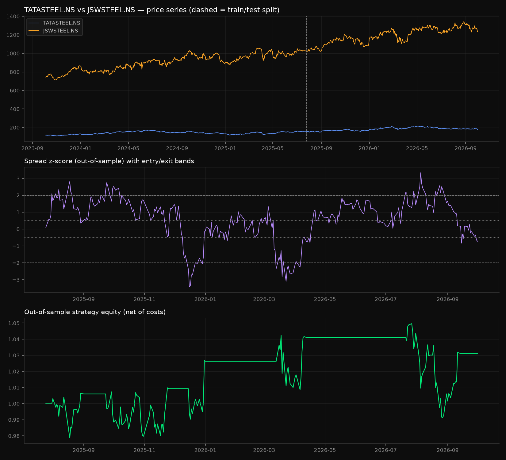

---

### SUNPHARMA.NS / CIPLA.NS

- **Latest prices:** SUNPHARMA.NS ₹1,801.00 · CIPLA.NS ₹1,344.00
- **Hedge ratio (train-fitted):** 0.4934
- **Cointegration (train):** PASS at 5% — ADF -3.46, p=0.0092
- **Persistence:** passed 5% in 68 of 68 real-data runs (strict tier: 5/68)
- **Spread half-life:** 10.5 days
- **Current z-score:** -0.85
- **Signal today:** watch (approaching band)

**Out-of-sample backtest** (beta frozen from train window):

| Metric | Value |
|---|---|
| Sharpe | 0.05 |
| Sortino | 0.06 |
| Annualised return | 0.10% |
| Annualised vol | 7.67% |
| Max drawdown | -10.05% |
| Round-trip trades | 5 |

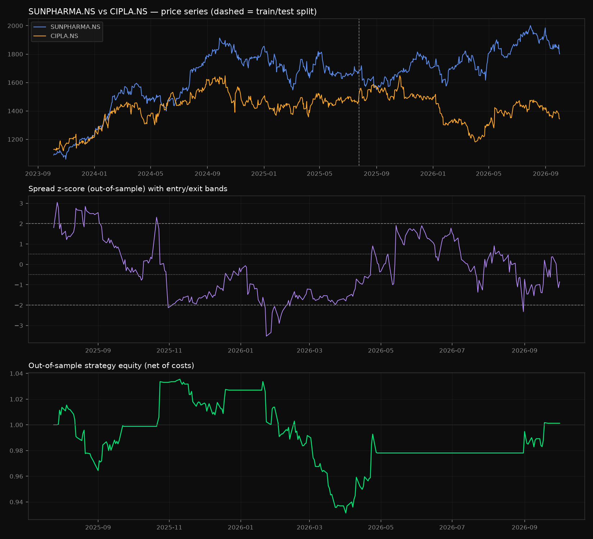

---

_Generated 2026-10-05 · pairs mean-reversion scanner · out-of-sample backtest · multiple-testing-aware · not investment advice._
