# Indian Pairs-Trading Scanner — 2026-10-06

> **What this is:** a market-neutral *pairs mean-reversion* scanner. It flags when two related NSE stocks have drifted apart far enough that their historical relationship signals a possible convergence trade. It does **not** forecast growth, rank "best" stocks, or predict company performance. A signal means the *spread between two stocks* is stretched — nothing about either stock being a good investment. Not investment advice; do your own research.

## Methodology (fixed in advance)

- **Universe:** 16 declared sector-mate pairs. Parameters (3y window, 60/40 train-test, z-entry 2.0, z-exit 0.5, 5 bps costs) are pre-registered; changes are logged in the README changelog *before* looking at results.
- **Multiple testing:** at the 5% level across 16 pairs, **≈0.8 false positives per run are expected by chance alone** even if nothing truly cointegrates. A single-day pass is a candidate, not a discovery.
- **Strict tier:** Bonferroni-corrected threshold p < 0.0031 (marked ✓✓).
- **Evidence = persistence:** the Persistence column counts how often each pair has passed the 5% test across all *real-data* daily runs recorded in `reports/history.csv`. Pairs deserve attention only when they pass persistently.

## Summary

| Pair | p-value | Coint. | Persistence | Current z | Signal | OOS Sharpe |
|---|---|---|---|---|---|---|
| HDFCBANK.NS/ICICIBANK.NS | 0.0762 | ✗ | 1/57 | -0.40 | flat / no stretch | -0.56 |
| AXISBANK.NS/ICICIBANK.NS | 0.9627 | ✗ | 0/69 | -1.12 | watch | -0.05 |
| KOTAKBANK.NS/HDFCBANK.NS | 0.1379 | ✗ | 0/69 | -1.04 | watch | 1.71 |
| SBIN.NS/BANKBARODA.NS | 0.1436 | ✗ | 0/69 | +1.23 | watch | 0.02 |
| TCS.NS/INFY.NS | 0.7387 | ✗ | 0/69 | -0.45 | flat / no stretch | 2.37 |
| INFY.NS/WIPRO.NS | 0.1542 | ✗ | 0/69 | -0.94 | watch | 1.90 |
| HCLTECH.NS/TECHM.NS | 0.2121 | ✗ | 0/69 | +1.39 | watch | -0.26 |
| ACC.NS/AMBUJACEM.NS | 0.8254 | ✗ | 0/69 | -1.96 | watch | 0.54 |
| ULTRACEMCO.NS/SHREECEM.NS | 0.3855 | ✗ | 0/69 | -1.30 | watch | -0.29 |
| IOC.NS/BPCL.NS | 0.8172 | ✗ | 0/69 | -0.96 | watch | 0.45 |
| BPCL.NS/HINDPETRO.NS | 0.2656 | ✗ | 0/69 | -0.07 | flat / no stretch | 0.05 |
| ONGC.NS/COALINDIA.NS | 0.0127 | ✓ | 61/69 | +2.15 | SHORT spread | 0.58 |
| NTPC.NS/POWERGRID.NS | 0.1126 | ✗ | 0/69 | -0.91 | watch | 0.43 |
| BAJAJ-AUTO.NS/HEROMOTOCO.NS | 0.1739 | ✗ | 0/69 | +1.38 | watch | -0.54 |
| TATASTEEL.NS/JSWSTEEL.NS | 0.6031 | ✗ | 0/69 | -0.72 | watch | 0.35 |
| SUNPHARMA.NS/CIPLA.NS | 0.0123 | ✓ | 69/69 | -0.72 | watch | 0.04 |

_Legend: ✓✓ passes strict Bonferroni tier · ✓ passes 5% only · ✗ fails. Persistence = 5%-passes / real-data runs recorded. \*no real-data history yet._

---

### HDFCBANK.NS / ICICIBANK.NS

- **Latest prices:** HDFCBANK.NS ₹704.80 · ICICIBANK.NS ₹1,332.00
- **Hedge ratio (train-fitted):** 1.6337
- **Cointegration (train):** FAIL at 5% — ADF -2.69, p=0.0762
- **Persistence:** passed 5% in 1 of 57 real-data runs (strict tier: 0/57)
- **Spread half-life:** 24.9 days
- **Current z-score:** -0.40
- **Signal today:** flat / no stretch
- ⚠️ _Pair did not cointegrate on training data. Any signal here is not statistically justified — observation only._

**Out-of-sample backtest** (beta frozen from train window):

| Metric | Value |
|---|---|
| Sharpe | -0.56 |
| Sortino | -0.59 |
| Annualised return | -3.66% |
| Annualised vol | 6.34% |
| Max drawdown | -7.97% |
| Round-trip trades | 4 |

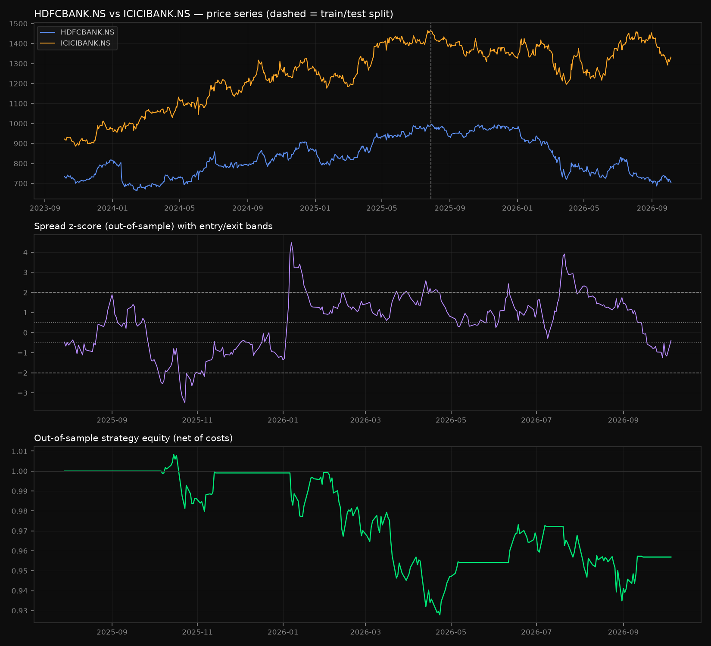

---

### AXISBANK.NS / ICICIBANK.NS

- **Latest prices:** AXISBANK.NS ₹1,222.20 · ICICIBANK.NS ₹1,332.00
- **Hedge ratio (train-fitted):** 0.9320
- **Cointegration (train):** FAIL at 5% — ADF 0.05, p=0.9627
- **Persistence:** passed 5% in 0 of 69 real-data runs (strict tier: 0/69)
- **Spread half-life:** n/a (not mean-reverting)
- **Current z-score:** -1.12
- **Signal today:** watch (approaching band)
- ⚠️ _Pair did not cointegrate on training data. Any signal here is not statistically justified — observation only._

**Out-of-sample backtest** (beta frozen from train window):

| Metric | Value |
|---|---|
| Sharpe | -0.05 |
| Sortino | -0.05 |
| Annualised return | -0.78% |
| Annualised vol | 8.64% |
| Max drawdown | -7.86% |
| Round-trip trades | 6 |

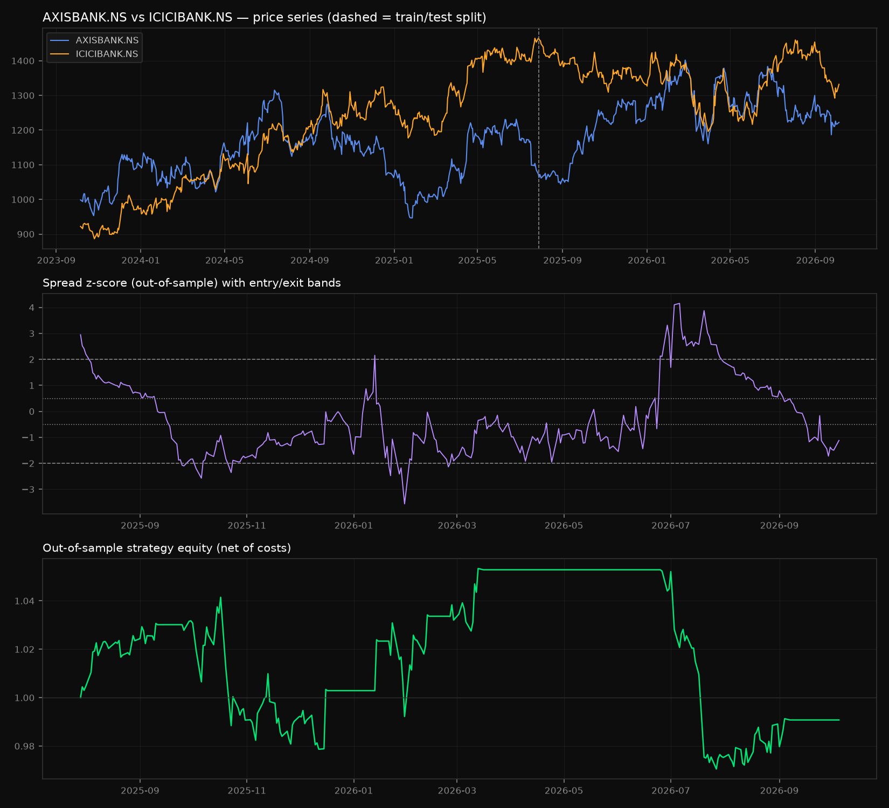

---

### KOTAKBANK.NS / HDFCBANK.NS

- **Latest prices:** KOTAKBANK.NS ₹416.00 · HDFCBANK.NS ₹704.80
- **Hedge ratio (train-fitted):** 2.1614
- **Cointegration (train):** FAIL at 5% — ADF -2.41, p=0.1379
- **Persistence:** passed 5% in 0 of 69 real-data runs (strict tier: 0/69)
- **Spread half-life:** 25.4 days
- **Current z-score:** -1.04
- **Signal today:** watch (approaching band)
- ⚠️ _Pair did not cointegrate on training data. Any signal here is not statistically justified — observation only._

**Out-of-sample backtest** (beta frozen from train window):

| Metric | Value |
|---|---|
| Sharpe | 1.71 |
| Sortino | 1.93 |
| Annualised return | 10.78% |
| Annualised vol | 6.08% |
| Max drawdown | -2.89% |
| Round-trip trades | 7 |

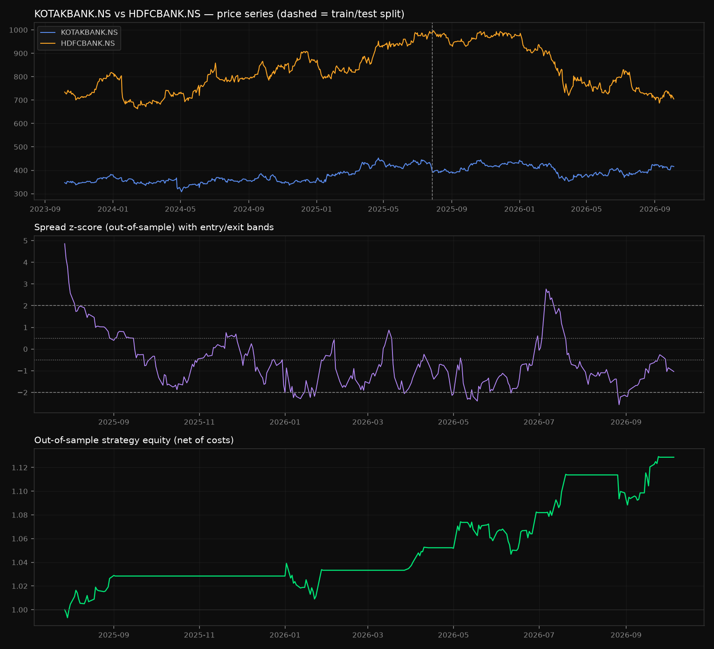

---

### SBIN.NS / BANKBARODA.NS

- **Latest prices:** SBIN.NS ₹958.00 · BANKBARODA.NS ₹232.80
- **Hedge ratio (train-fitted):** 0.1906
- **Cointegration (train):** FAIL at 5% — ADF -2.39, p=0.1436
- **Persistence:** passed 5% in 0 of 69 real-data runs (strict tier: 0/69)
- **Spread half-life:** 21.2 days
- **Current z-score:** +1.23
- **Signal today:** watch (approaching band)
- ⚠️ _Pair did not cointegrate on training data. Any signal here is not statistically justified — observation only._

**Out-of-sample backtest** (beta frozen from train window):

| Metric | Value |
|---|---|
| Sharpe | 0.02 |
| Sortino | 0.02 |
| Annualised return | -0.21% |
| Annualised vol | 9.12% |
| Max drawdown | -8.79% |
| Round-trip trades | 5 |

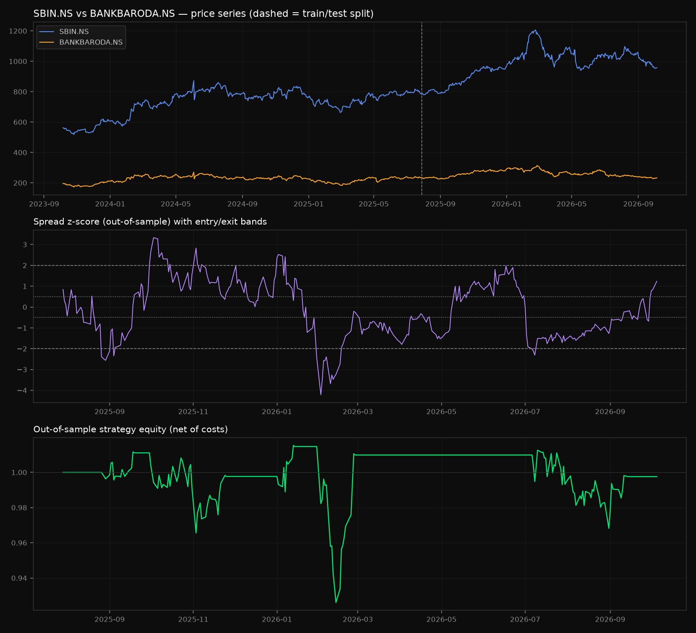

---

### TCS.NS / INFY.NS

- **Latest prices:** TCS.NS ₹2,114.40 · INFY.NS ₹1,020.50
- **Hedge ratio (train-fitted):** 0.4452
- **Cointegration (train):** FAIL at 5% — ADF -1.04, p=0.7387
- **Persistence:** passed 5% in 0 of 69 real-data runs (strict tier: 0/69)
- **Spread half-life:** 76.8 days
- **Current z-score:** -0.45
- **Signal today:** flat / no stretch
- ⚠️ _Pair did not cointegrate on training data. Any signal here is not statistically justified — observation only._

**Out-of-sample backtest** (beta frozen from train window):

| Metric | Value |
|---|---|
| Sharpe | 2.37 |
| Sortino | 2.75 |
| Annualised return | 9.62% |
| Annualised vol | 3.91% |
| Max drawdown | -1.00% |
| Round-trip trades | 6 |

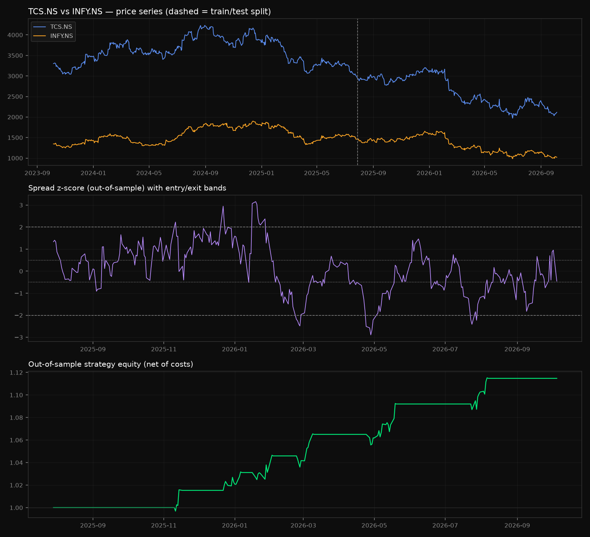

---

### INFY.NS / WIPRO.NS

- **Latest prices:** INFY.NS ₹1,020.50 · WIPRO.NS ₹162.14
- **Hedge ratio (train-fitted):** 0.1304
- **Cointegration (train):** FAIL at 5% — ADF -2.36, p=0.1542
- **Persistence:** passed 5% in 0 of 69 real-data runs (strict tier: 0/69)
- **Spread half-life:** 29.2 days
- **Current z-score:** -0.94
- **Signal today:** watch (approaching band)
- ⚠️ _Pair did not cointegrate on training data. Any signal here is not statistically justified — observation only._

**Out-of-sample backtest** (beta frozen from train window):

| Metric | Value |
|---|---|
| Sharpe | 1.90 |
| Sortino | 1.77 |
| Annualised return | 9.64% |
| Annualised vol | 4.90% |
| Max drawdown | -1.53% |
| Round-trip trades | 5 |

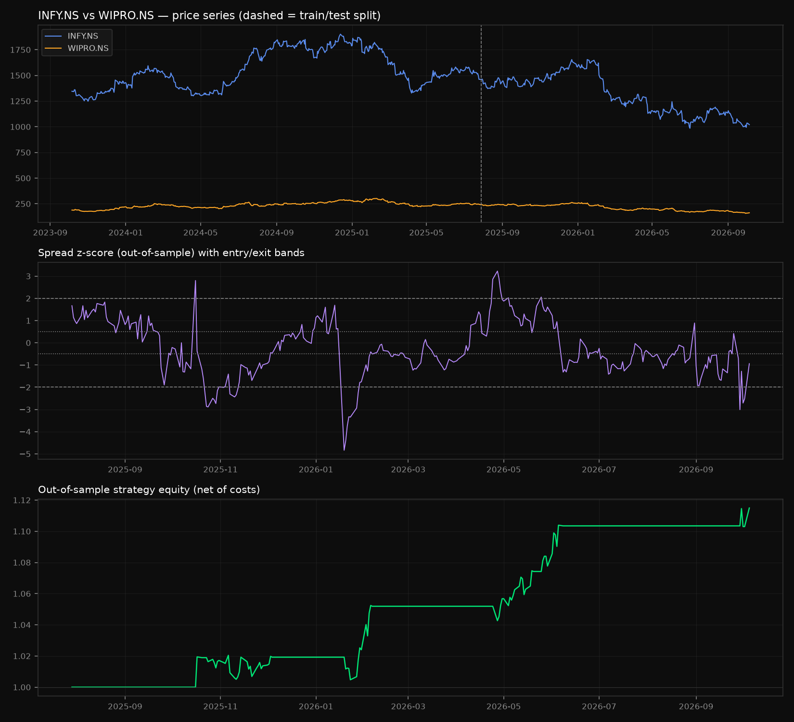

---

### HCLTECH.NS / TECHM.NS

- **Latest prices:** HCLTECH.NS ₹1,201.90 · TECHM.NS ₹1,535.90
- **Hedge ratio (train-fitted):** 0.9378
- **Cointegration (train):** FAIL at 5% — ADF -2.18, p=0.2121
- **Persistence:** passed 5% in 0 of 69 real-data runs (strict tier: 0/69)
- **Spread half-life:** 22.4 days
- **Current z-score:** +1.39
- **Signal today:** watch (approaching band)
- ⚠️ _Pair did not cointegrate on training data. Any signal here is not statistically justified — observation only._

**Out-of-sample backtest** (beta frozen from train window):

| Metric | Value |
|---|---|
| Sharpe | -0.26 |
| Sortino | -0.24 |
| Annualised return | -2.13% |
| Annualised vol | 7.27% |
| Max drawdown | -8.48% |
| Round-trip trades | 4 |

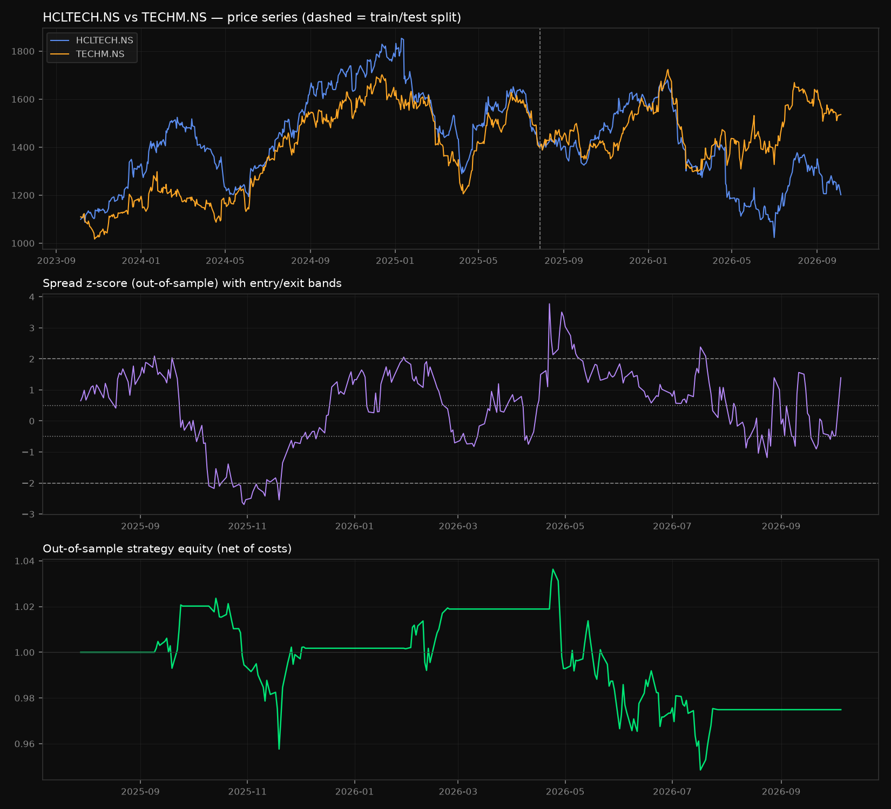

---

### ACC.NS / AMBUJACEM.NS

- **Latest prices:** ACC.NS ₹1,184.40 · AMBUJACEM.NS ₹366.50
- **Hedge ratio (train-fitted):** 0.1813
- **Cointegration (train):** FAIL at 5% — ADF -0.78, p=0.8254
- **Persistence:** passed 5% in 0 of 69 real-data runs (strict tier: 0/69)
- **Spread half-life:** 86.4 days
- **Current z-score:** -1.96
- **Signal today:** watch (approaching band)
- ⚠️ _Pair did not cointegrate on training data. Any signal here is not statistically justified — observation only._

**Out-of-sample backtest** (beta frozen from train window):

| Metric | Value |
|---|---|
| Sharpe | 0.54 |
| Sortino | 0.45 |
| Annualised return | 3.30% |
| Annualised vol | 6.34% |
| Max drawdown | -5.17% |
| Round-trip trades | 4 |

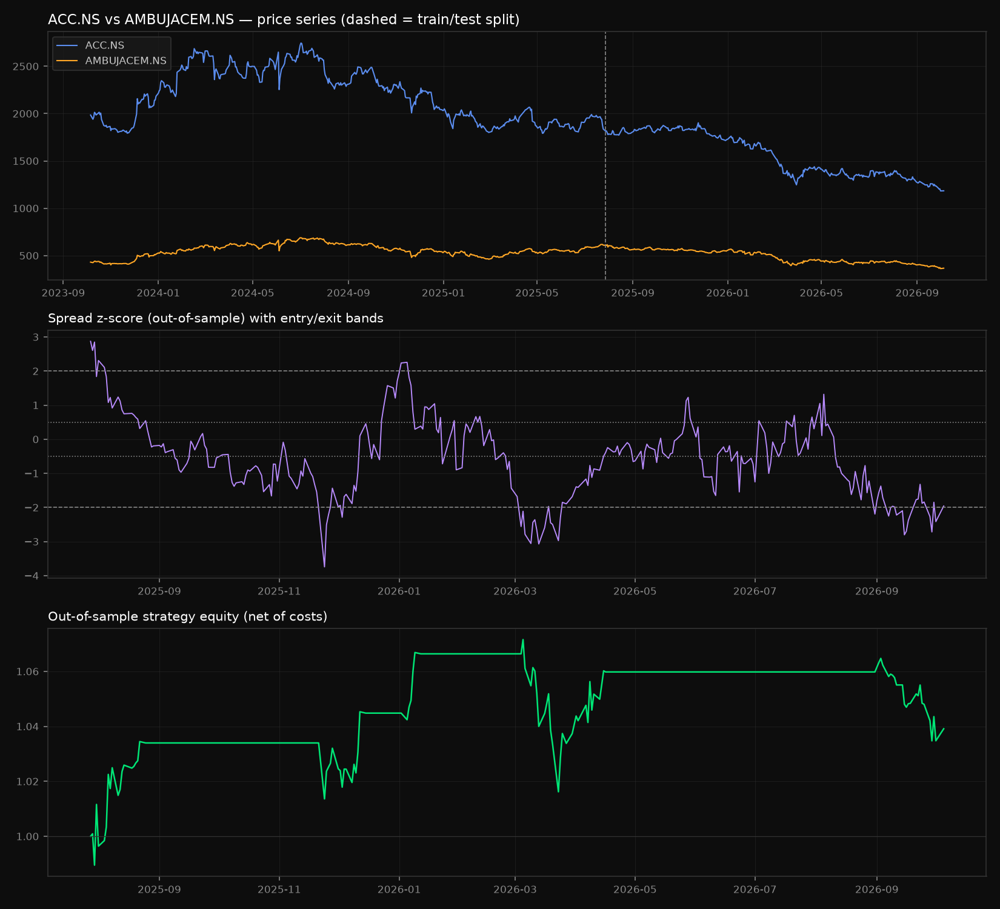

---

### ULTRACEMCO.NS / SHREECEM.NS

- **Latest prices:** ULTRACEMCO.NS ₹10,850.00 · SHREECEM.NS ₹21,990.00
- **Hedge ratio (train-fitted):** 0.8922
- **Cointegration (train):** FAIL at 5% — ADF -1.79, p=0.3855
- **Persistence:** passed 5% in 0 of 69 real-data runs (strict tier: 0/69)
- **Spread half-life:** 42.9 days
- **Current z-score:** -1.30
- **Signal today:** watch (approaching band)
- ⚠️ _Pair did not cointegrate on training data. Any signal here is not statistically justified — observation only._

**Out-of-sample backtest** (beta frozen from train window):

| Metric | Value |
|---|---|
| Sharpe | -0.29 |
| Sortino | -0.33 |
| Annualised return | -2.06% |
| Annualised vol | 6.55% |
| Max drawdown | -6.99% |
| Round-trip trades | 4 |

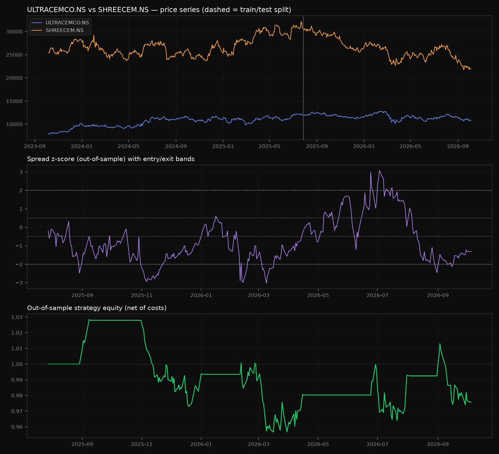

---

### IOC.NS / BPCL.NS

- **Latest prices:** IOC.NS ₹130.50 · BPCL.NS ₹296.95
- **Hedge ratio (train-fitted):** 1.7045
- **Cointegration (train):** FAIL at 5% — ADF -0.81, p=0.8172
- **Persistence:** passed 5% in 0 of 69 real-data runs (strict tier: 0/69)
- **Spread half-life:** 151.3 days
- **Current z-score:** -0.96
- **Signal today:** watch (approaching band)
- ⚠️ _Pair did not cointegrate on training data. Any signal here is not statistically justified — observation only._

**Out-of-sample backtest** (beta frozen from train window):

| Metric | Value |
|---|---|
| Sharpe | 0.45 |
| Sortino | 0.49 |
| Annualised return | 2.69% |
| Annualised vol | 6.33% |
| Max drawdown | -6.73% |
| Round-trip trades | 5 |

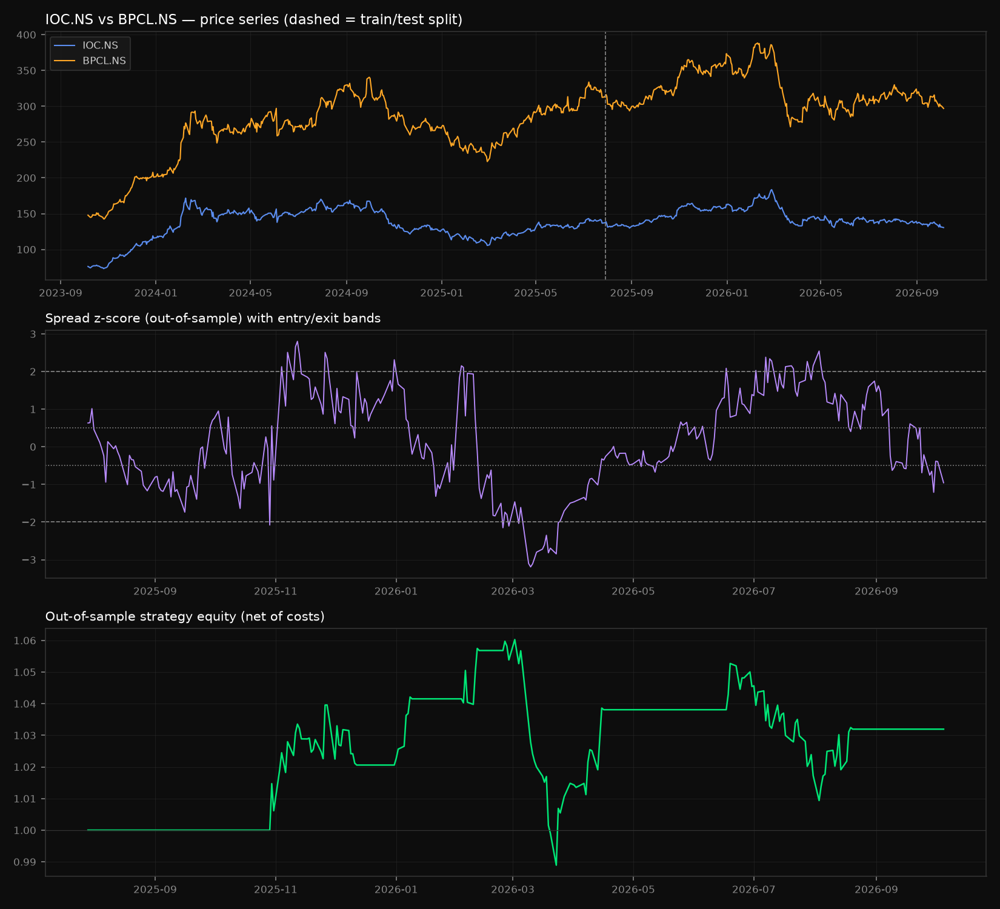

---

### BPCL.NS / HINDPETRO.NS

- **Latest prices:** BPCL.NS ₹296.95 · HINDPETRO.NS ₹342.35
- **Hedge ratio (train-fitted):** 1.3378
- **Cointegration (train):** FAIL at 5% — ADF -2.05, p=0.2656
- **Persistence:** passed 5% in 0 of 69 real-data runs (strict tier: 0/69)
- **Spread half-life:** 37.1 days
- **Current z-score:** -0.07
- **Signal today:** flat / no stretch
- ⚠️ _Pair did not cointegrate on training data. Any signal here is not statistically justified — observation only._

**Out-of-sample backtest** (beta frozen from train window):

| Metric | Value |
|---|---|
| Sharpe | 0.05 |
| Sortino | 0.04 |
| Annualised return | 0.12% |
| Annualised vol | 5.81% |
| Max drawdown | -6.59% |
| Round-trip trades | 5 |

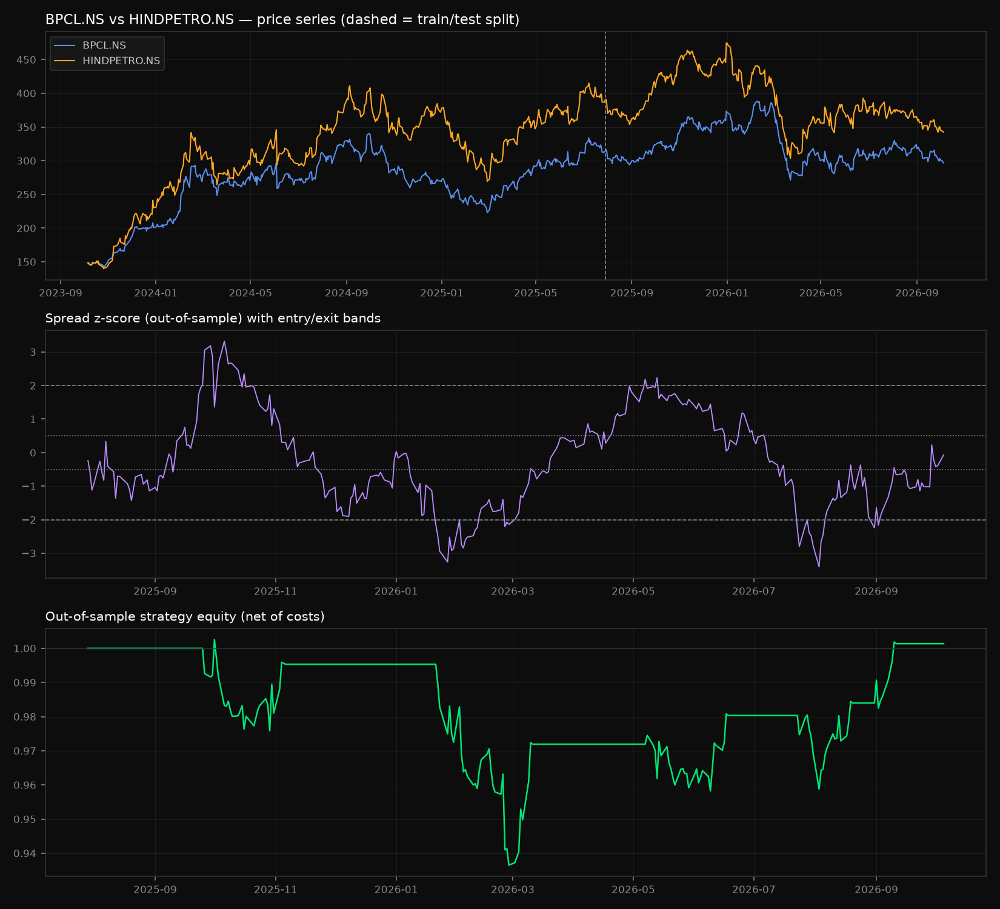

---

### ONGC.NS / COALINDIA.NS

- **Latest prices:** ONGC.NS ₹224.90 · COALINDIA.NS ₹425.10
- **Hedge ratio (train-fitted):** 1.4070
- **Cointegration (train):** PASS at 5% — ADF -3.35, p=0.0127
- **Persistence:** passed 5% in 61 of 69 real-data runs (strict tier: 1/69)
- **Spread half-life:** 12.3 days
- **Current z-score:** +2.15
- **Signal today:** SHORT spread (short COALINDIA.NS, long ONGC.NS)

**Out-of-sample backtest** (beta frozen from train window):

| Metric | Value |
|---|---|
| Sharpe | 0.58 |
| Sortino | 0.45 |
| Annualised return | 4.17% |
| Annualised vol | 7.60% |
| Max drawdown | -6.27% |
| Round-trip trades | 5 |

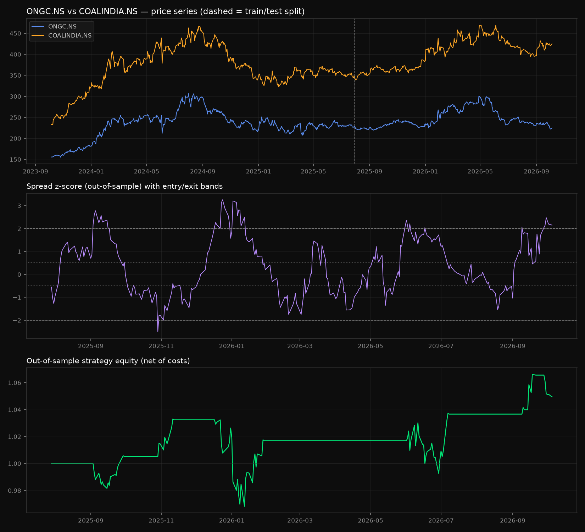

---

### NTPC.NS / POWERGRID.NS

- **Latest prices:** NTPC.NS ₹321.80 · POWERGRID.NS ₹257.00
- **Hedge ratio (train-fitted):** 0.8191
- **Cointegration (train):** FAIL at 5% — ADF -2.51, p=0.1126
- **Persistence:** passed 5% in 0 of 69 real-data runs (strict tier: 0/69)
- **Spread half-life:** 24.3 days
- **Current z-score:** -0.91
- **Signal today:** watch (approaching band)
- ⚠️ _Pair did not cointegrate on training data. Any signal here is not statistically justified — observation only._

**Out-of-sample backtest** (beta frozen from train window):

| Metric | Value |
|---|---|
| Sharpe | 0.43 |
| Sortino | 0.33 |
| Annualised return | 2.27% |
| Annualised vol | 5.58% |
| Max drawdown | -5.29% |
| Round-trip trades | 6 |

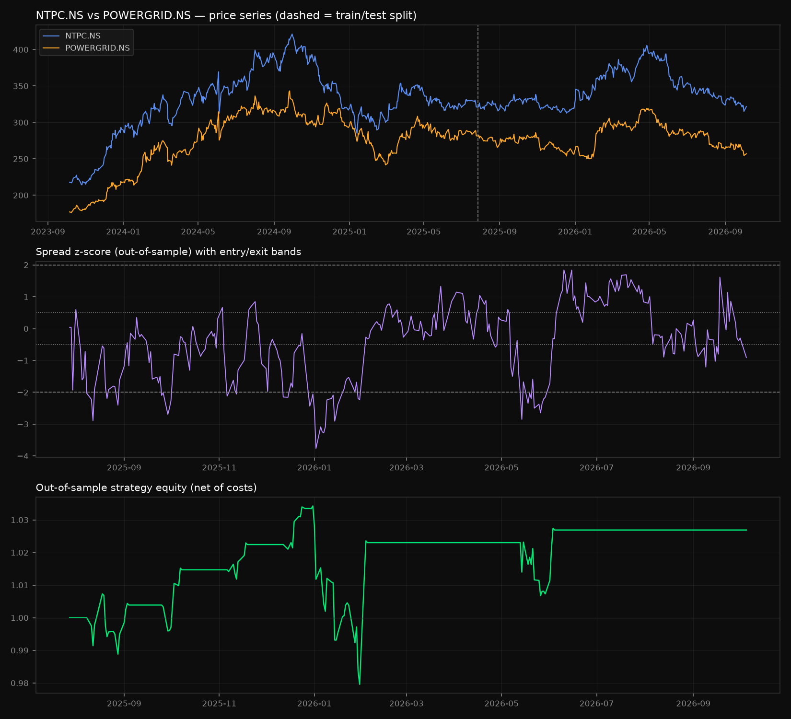

---

### BAJAJ-AUTO.NS / HEROMOTOCO.NS

- **Latest prices:** BAJAJ-AUTO.NS ₹10,024.00 · HEROMOTOCO.NS ₹5,089.50
- **Hedge ratio (train-fitted):** 0.4093
- **Cointegration (train):** FAIL at 5% — ADF -2.29, p=0.1739
- **Persistence:** passed 5% in 0 of 69 real-data runs (strict tier: 0/69)
- **Spread half-life:** 29.4 days
- **Current z-score:** +1.38
- **Signal today:** watch (approaching band)
- ⚠️ _Pair did not cointegrate on training data. Any signal here is not statistically justified — observation only._

**Out-of-sample backtest** (beta frozen from train window):

| Metric | Value |
|---|---|
| Sharpe | -0.54 |
| Sortino | -0.56 |
| Annualised return | -6.24% |
| Annualised vol | 10.80% |
| Max drawdown | -20.00% |
| Round-trip trades | 6 |

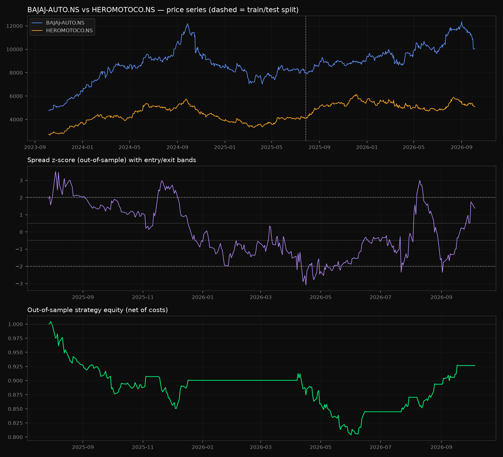

---

### TATASTEEL.NS / JSWSTEEL.NS

- **Latest prices:** TATASTEEL.NS ₹178.14 · JSWSTEEL.NS ₹1,235.30
- **Hedge ratio (train-fitted):** 3.1026
- **Cointegration (train):** FAIL at 5% — ADF -1.36, p=0.6031
- **Persistence:** passed 5% in 0 of 69 real-data runs (strict tier: 0/69)
- **Spread half-life:** 65.6 days
- **Current z-score:** -0.72
- **Signal today:** watch (approaching band)
- ⚠️ _Pair did not cointegrate on training data. Any signal here is not statistically justified — observation only._

**Out-of-sample backtest** (beta frozen from train window):

| Metric | Value |
|---|---|
| Sharpe | 0.35 |
| Sortino | 0.34 |
| Annualised return | 2.62% |
| Annualised vol | 8.26% |
| Max drawdown | -5.51% |
| Round-trip trades | 5 |

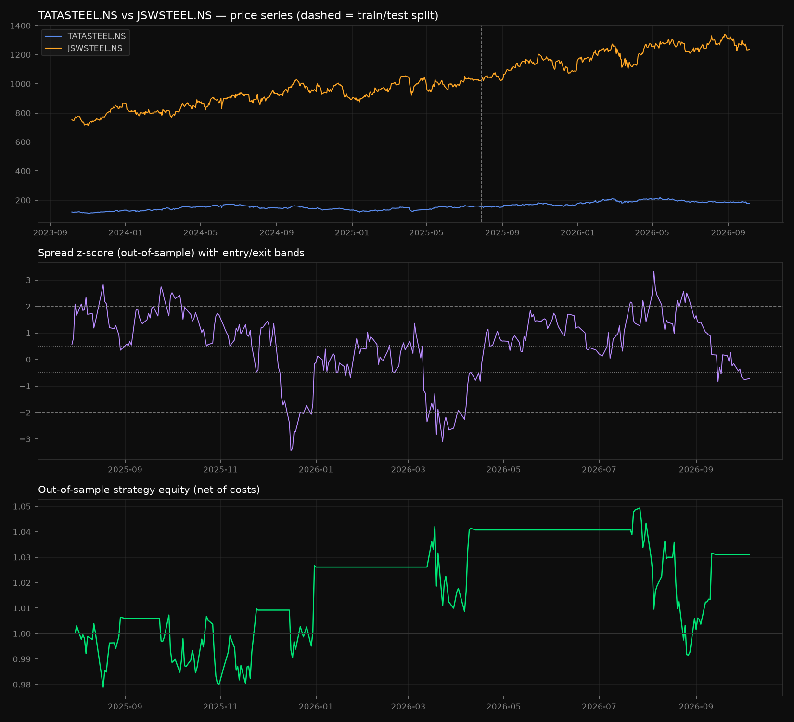

---

### SUNPHARMA.NS / CIPLA.NS

- **Latest prices:** SUNPHARMA.NS ₹1,779.70 · CIPLA.NS ₹1,335.50
- **Hedge ratio (train-fitted):** 0.4929
- **Cointegration (train):** PASS at 5% — ADF -3.36, p=0.0123
- **Persistence:** passed 5% in 69 of 69 real-data runs (strict tier: 5/69)
- **Spread half-life:** 10.8 days
- **Current z-score:** -0.72
- **Signal today:** watch (approaching band)

**Out-of-sample backtest** (beta frozen from train window):

| Metric | Value |
|---|---|
| Sharpe | 0.04 |
| Sortino | 0.05 |
| Annualised return | 0.03% |
| Annualised vol | 7.51% |
| Max drawdown | -9.86% |
| Round-trip trades | 5 |

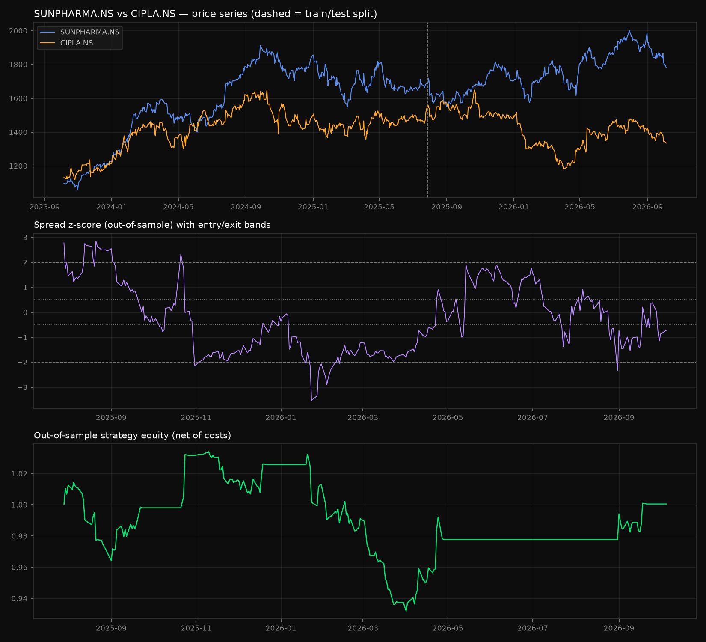

---

_Generated 2026-10-06 · pairs mean-reversion scanner · out-of-sample backtest · multiple-testing-aware · not investment advice._
