# Indian Pairs-Trading Scanner — 2026-10-07

> **What this is:** a market-neutral *pairs mean-reversion* scanner. It flags when two related NSE stocks have drifted apart far enough that their historical relationship signals a possible convergence trade. It does **not** forecast growth, rank "best" stocks, or predict company performance. A signal means the *spread between two stocks* is stretched — nothing about either stock being a good investment. Not investment advice; do your own research.

## Methodology (fixed in advance)

- **Universe:** 16 declared sector-mate pairs. Parameters (3y window, 60/40 train-test, z-entry 2.0, z-exit 0.5, 5 bps costs) are pre-registered; changes are logged in the README changelog *before* looking at results.
- **Multiple testing:** at the 5% level across 16 pairs, **≈0.8 false positives per run are expected by chance alone** even if nothing truly cointegrates. A single-day pass is a candidate, not a discovery.
- **Strict tier:** Bonferroni-corrected threshold p < 0.0031 (marked ✓✓).
- **Evidence = persistence:** the Persistence column counts how often each pair has passed the 5% test across all *real-data* daily runs recorded in `reports/history.csv`. Pairs deserve attention only when they pass persistently.

## Summary

| Pair | p-value | Coint. | Persistence | Current z | Signal | OOS Sharpe |
|---|---|---|---|---|---|---|
| HDFCBANK.NS/ICICIBANK.NS | 0.0823 | ✗ | 1/58 | -0.45 | flat / no stretch | -0.55 |
| AXISBANK.NS/ICICIBANK.NS | 0.9656 | ✗ | 0/70 | -1.46 | watch | -0.10 |
| KOTAKBANK.NS/HDFCBANK.NS | 0.3060 | ✗ | 0/70 | -1.51 | watch | 1.81 |
| SBIN.NS/BANKBARODA.NS | 0.1426 | ✗ | 0/70 | +1.22 | watch | 0.02 |
| TCS.NS/INFY.NS | 0.7544 | ✗ | 0/70 | -0.46 | flat / no stretch | 2.38 |
| INFY.NS/WIPRO.NS | 0.1567 | ✗ | 0/70 | -0.74 | watch | 1.92 |
| HCLTECH.NS/TECHM.NS | 0.2165 | ✗ | 0/70 | -0.12 | flat / no stretch | -0.26 |
| ACC.NS/AMBUJACEM.NS | 0.8261 | ✗ | 0/70 | -2.03 | LONG spread | 0.65 |
| ULTRACEMCO.NS/SHREECEM.NS | 0.3614 | ✗ | 0/70 | -1.06 | watch | -0.18 |
| IOC.NS/BPCL.NS | 0.8234 | ✗ | 0/70 | -0.57 | watch | 0.45 |
| BPCL.NS/HINDPETRO.NS | 0.2693 | ✗ | 0/70 | +0.48 | flat / no stretch | 0.05 |
| ONGC.NS/COALINDIA.NS | 0.0171 | ✓ | 62/70 | +1.19 | watch | 0.76 |
| NTPC.NS/POWERGRID.NS | 0.1121 | ✗ | 0/70 | -0.77 | watch | 0.43 |
| BAJAJ-AUTO.NS/HEROMOTOCO.NS | 0.1742 | ✗ | 0/70 | +1.22 | watch | -0.52 |
| TATASTEEL.NS/JSWSTEEL.NS | 0.6266 | ✗ | 0/70 | +0.08 | flat / no stretch | 0.36 |
| SUNPHARMA.NS/CIPLA.NS | 0.0120 | ✓ | 70/70 | -1.03 | watch | 0.15 |

_Legend: ✓✓ passes strict Bonferroni tier · ✓ passes 5% only · ✗ fails. Persistence = 5%-passes / real-data runs recorded. \*no real-data history yet._

---

### HDFCBANK.NS / ICICIBANK.NS

- **Latest prices:** HDFCBANK.NS ₹711.45 · ICICIBANK.NS ₹1,342.80
- **Hedge ratio (train-fitted):** 1.6298
- **Cointegration (train):** FAIL at 5% — ADF -2.65, p=0.0823
- **Persistence:** passed 5% in 1 of 58 real-data runs (strict tier: 0/58)
- **Spread half-life:** 25.1 days
- **Current z-score:** -0.45
- **Signal today:** flat / no stretch
- ⚠️ _Pair did not cointegrate on training data. Any signal here is not statistically justified — observation only._

**Out-of-sample backtest** (beta frozen from train window):

| Metric | Value |
|---|---|
| Sharpe | -0.55 |
| Sortino | -0.59 |
| Annualised return | -3.65% |
| Annualised vol | 6.34% |
| Max drawdown | -7.96% |
| Round-trip trades | 4 |

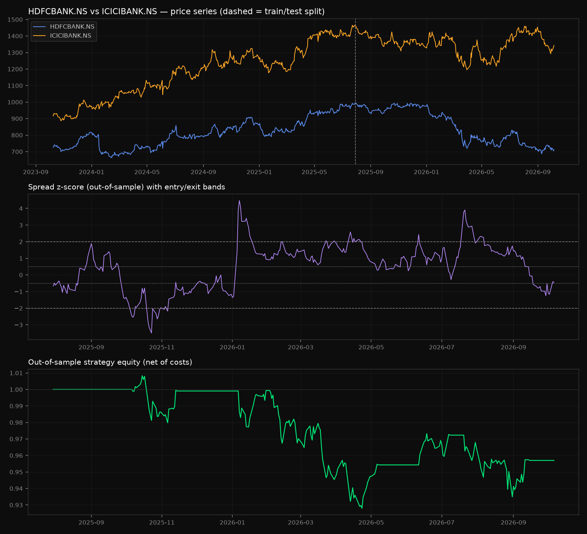

---

### AXISBANK.NS / ICICIBANK.NS

- **Latest prices:** AXISBANK.NS ₹1,248.00 · ICICIBANK.NS ₹1,342.80
- **Hedge ratio (train-fitted):** 0.9193
- **Cointegration (train):** FAIL at 5% — ADF 0.09, p=0.9656
- **Persistence:** passed 5% in 0 of 70 real-data runs (strict tier: 0/70)
- **Spread half-life:** n/a (not mean-reverting)
- **Current z-score:** -1.46
- **Signal today:** watch (approaching band)
- ⚠️ _Pair did not cointegrate on training data. Any signal here is not statistically justified — observation only._

**Out-of-sample backtest** (beta frozen from train window):

| Metric | Value |
|---|---|
| Sharpe | -0.10 |
| Sortino | -0.10 |
| Annualised return | -1.20% |
| Annualised vol | 8.59% |
| Max drawdown | -7.82% |
| Round-trip trades | 6 |

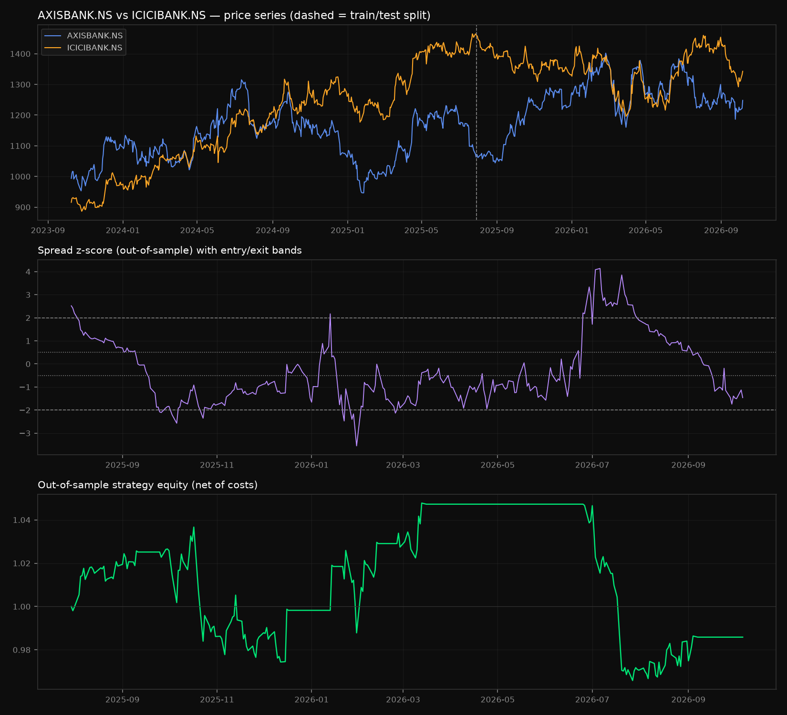

---

### KOTAKBANK.NS / HDFCBANK.NS

- **Latest prices:** KOTAKBANK.NS ₹431.90 · HDFCBANK.NS ₹711.45
- **Hedge ratio (train-fitted):** 2.1735
- **Cointegration (train):** FAIL at 5% — ADF -1.96, p=0.3060
- **Persistence:** passed 5% in 0 of 70 real-data runs (strict tier: 0/70)
- **Spread half-life:** 30.3 days
- **Current z-score:** -1.51
- **Signal today:** watch (approaching band)
- ⚠️ _Pair did not cointegrate on training data. Any signal here is not statistically justified — observation only._

**Out-of-sample backtest** (beta frozen from train window):

| Metric | Value |
|---|---|
| Sharpe | 1.81 |
| Sortino | 1.99 |
| Annualised return | 11.32% |
| Annualised vol | 6.03% |
| Max drawdown | -2.87% |
| Round-trip trades | 7 |

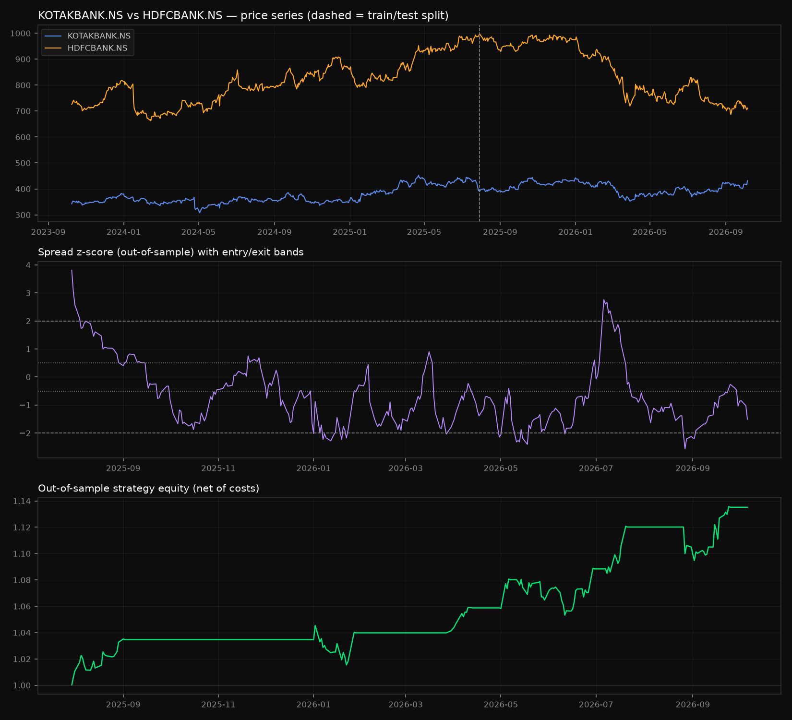

---

### SBIN.NS / BANKBARODA.NS

- **Latest prices:** SBIN.NS ₹958.75 · BANKBARODA.NS ₹232.73
- **Hedge ratio (train-fitted):** 0.1908
- **Cointegration (train):** FAIL at 5% — ADF -2.40, p=0.1426
- **Persistence:** passed 5% in 0 of 70 real-data runs (strict tier: 0/70)
- **Spread half-life:** 21.2 days
- **Current z-score:** +1.22
- **Signal today:** watch (approaching band)
- ⚠️ _Pair did not cointegrate on training data. Any signal here is not statistically justified — observation only._

**Out-of-sample backtest** (beta frozen from train window):

| Metric | Value |
|---|---|
| Sharpe | 0.02 |
| Sortino | 0.02 |
| Annualised return | -0.21% |
| Annualised vol | 9.17% |
| Max drawdown | -8.84% |
| Round-trip trades | 5 |

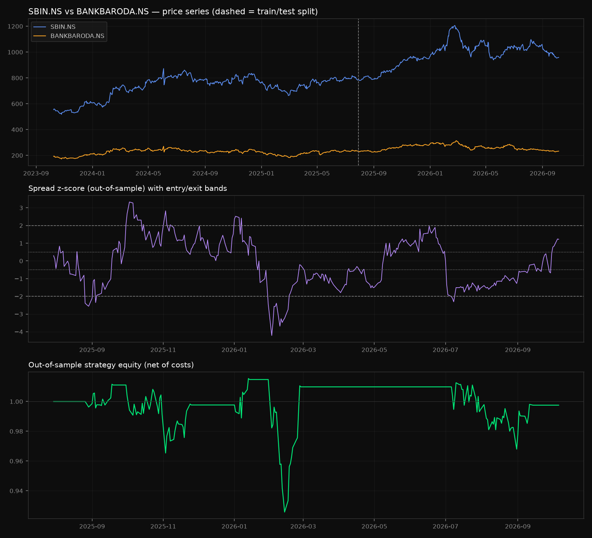

---

### TCS.NS / INFY.NS

- **Latest prices:** TCS.NS ₹2,100.00 · INFY.NS ₹1,013.85
- **Hedge ratio (train-fitted):** 0.4418
- **Cointegration (train):** FAIL at 5% — ADF -1.00, p=0.7544
- **Persistence:** passed 5% in 0 of 70 real-data runs (strict tier: 0/70)
- **Spread half-life:** 77.6 days
- **Current z-score:** -0.46
- **Signal today:** flat / no stretch
- ⚠️ _Pair did not cointegrate on training data. Any signal here is not statistically justified — observation only._

**Out-of-sample backtest** (beta frozen from train window):

| Metric | Value |
|---|---|
| Sharpe | 2.38 |
| Sortino | 2.77 |
| Annualised return | 9.64% |
| Annualised vol | 3.91% |
| Max drawdown | -1.01% |
| Round-trip trades | 6 |

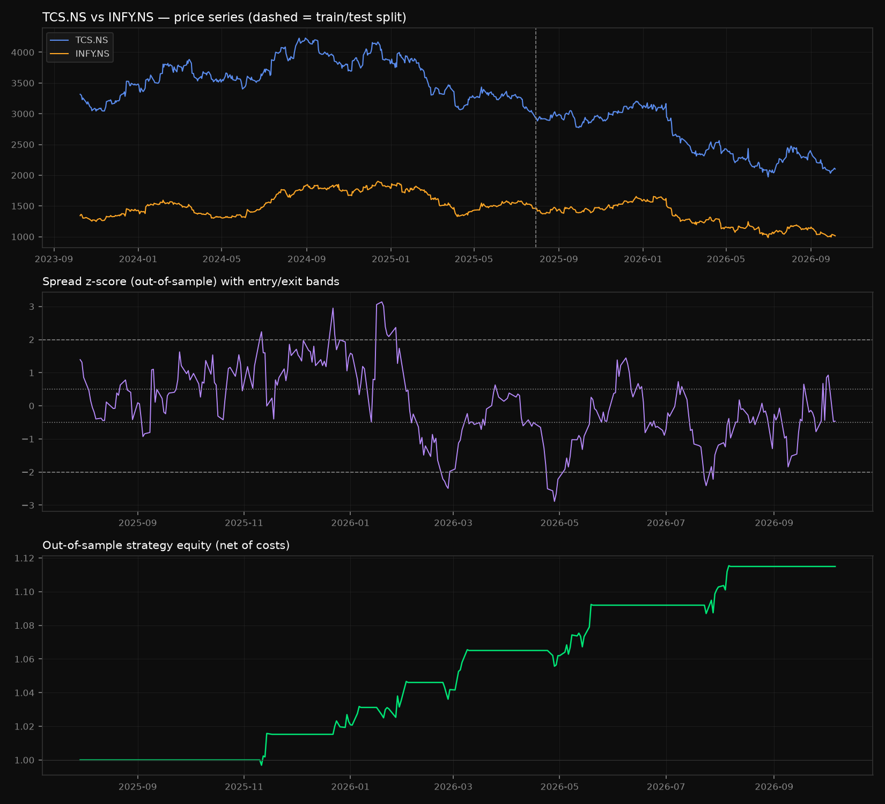

---

### INFY.NS / WIPRO.NS

- **Latest prices:** INFY.NS ₹1,013.85 · WIPRO.NS ₹161.84
- **Hedge ratio (train-fitted):** 0.1300
- **Cointegration (train):** FAIL at 5% — ADF -2.35, p=0.1567
- **Persistence:** passed 5% in 0 of 70 real-data runs (strict tier: 0/70)
- **Spread half-life:** 29.3 days
- **Current z-score:** -0.74
- **Signal today:** watch (approaching band)
- ⚠️ _Pair did not cointegrate on training data. Any signal here is not statistically justified — observation only._

**Out-of-sample backtest** (beta frozen from train window):

| Metric | Value |
|---|---|
| Sharpe | 1.92 |
| Sortino | 1.79 |
| Annualised return | 9.78% |
| Annualised vol | 4.91% |
| Max drawdown | -1.53% |
| Round-trip trades | 5 |

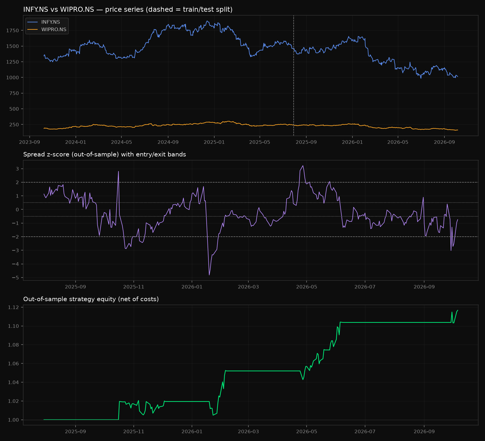

---

### HCLTECH.NS / TECHM.NS

- **Latest prices:** HCLTECH.NS ₹1,204.40 · TECHM.NS ₹1,504.50
- **Hedge ratio (train-fitted):** 0.9397
- **Cointegration (train):** FAIL at 5% — ADF -2.17, p=0.2165
- **Persistence:** passed 5% in 0 of 70 real-data runs (strict tier: 0/70)
- **Spread half-life:** 22.7 days
- **Current z-score:** -0.12
- **Signal today:** flat / no stretch
- ⚠️ _Pair did not cointegrate on training data. Any signal here is not statistically justified — observation only._

**Out-of-sample backtest** (beta frozen from train window):

| Metric | Value |
|---|---|
| Sharpe | -0.26 |
| Sortino | -0.24 |
| Annualised return | -2.14% |
| Annualised vol | 7.23% |
| Max drawdown | -8.43% |
| Round-trip trades | 4 |

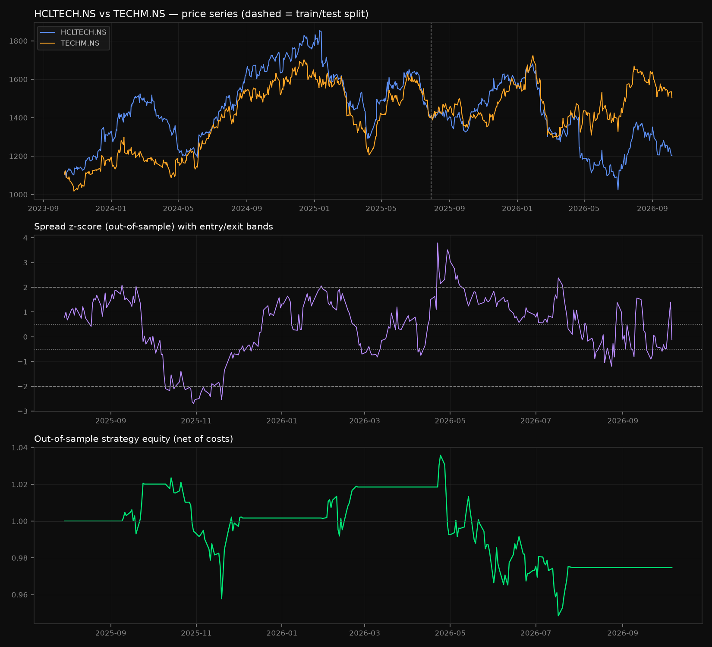

---

### ACC.NS / AMBUJACEM.NS

- **Latest prices:** ACC.NS ₹1,177.00 · AMBUJACEM.NS ₹361.55
- **Hedge ratio (train-fitted):** 0.1781
- **Cointegration (train):** FAIL at 5% — ADF -0.78, p=0.8261
- **Persistence:** passed 5% in 0 of 70 real-data runs (strict tier: 0/70)
- **Spread half-life:** 86.2 days
- **Current z-score:** -2.03
- **Signal today:** LONG spread (long AMBUJACEM.NS, short ACC.NS)
- ⚠️ _Pair did not cointegrate on training data. Any signal here is not statistically justified — observation only._

**Out-of-sample backtest** (beta frozen from train window):

| Metric | Value |
|---|---|
| Sharpe | 0.65 |
| Sortino | 0.54 |
| Annualised return | 3.97% |
| Annualised vol | 6.28% |
| Max drawdown | -5.24% |
| Round-trip trades | 4 |

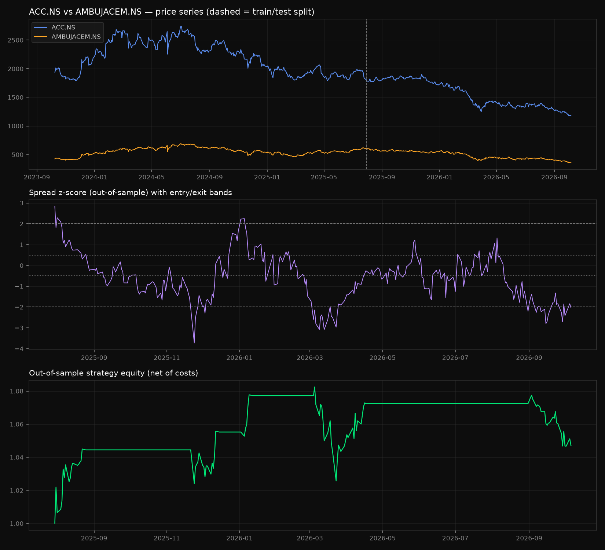

---

### ULTRACEMCO.NS / SHREECEM.NS

- **Latest prices:** ULTRACEMCO.NS ₹10,750.00 · SHREECEM.NS ₹22,210.00
- **Hedge ratio (train-fitted):** 0.9036
- **Cointegration (train):** FAIL at 5% — ADF -1.84, p=0.3614
- **Persistence:** passed 5% in 0 of 70 real-data runs (strict tier: 0/70)
- **Spread half-life:** 41.8 days
- **Current z-score:** -1.06
- **Signal today:** watch (approaching band)
- ⚠️ _Pair did not cointegrate on training data. Any signal here is not statistically justified — observation only._

**Out-of-sample backtest** (beta frozen from train window):

| Metric | Value |
|---|---|
| Sharpe | -0.18 |
| Sortino | -0.21 |
| Annualised return | -1.39% |
| Annualised vol | 6.58% |
| Max drawdown | -6.97% |
| Round-trip trades | 4 |

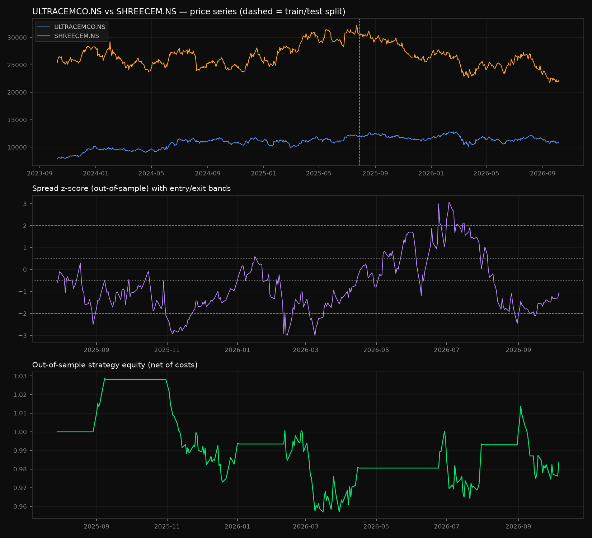

---

### IOC.NS / BPCL.NS

- **Latest prices:** IOC.NS ₹131.60 · BPCL.NS ₹300.50
- **Hedge ratio (train-fitted):** 1.7003
- **Cointegration (train):** FAIL at 5% — ADF -0.79, p=0.8234
- **Persistence:** passed 5% in 0 of 70 real-data runs (strict tier: 0/70)
- **Spread half-life:** 155.8 days
- **Current z-score:** -0.57
- **Signal today:** watch (approaching band)
- ⚠️ _Pair did not cointegrate on training data. Any signal here is not statistically justified — observation only._

**Out-of-sample backtest** (beta frozen from train window):

| Metric | Value |
|---|---|
| Sharpe | 0.45 |
| Sortino | 0.48 |
| Annualised return | 2.66% |
| Annualised vol | 6.30% |
| Max drawdown | -6.72% |
| Round-trip trades | 5 |

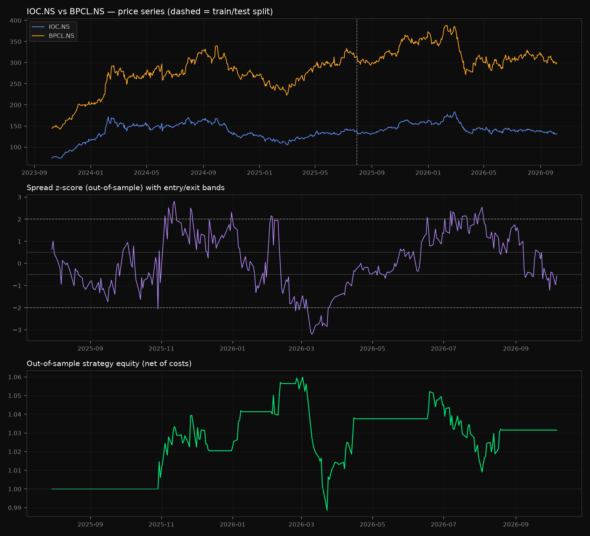

---

### BPCL.NS / HINDPETRO.NS

- **Latest prices:** BPCL.NS ₹300.50 · HINDPETRO.NS ₹351.00
- **Hedge ratio (train-fitted):** 1.3370
- **Cointegration (train):** FAIL at 5% — ADF -2.04, p=0.2693
- **Persistence:** passed 5% in 0 of 70 real-data runs (strict tier: 0/70)
- **Spread half-life:** 37.3 days
- **Current z-score:** +0.48
- **Signal today:** flat / no stretch
- ⚠️ _Pair did not cointegrate on training data. Any signal here is not statistically justified — observation only._

**Out-of-sample backtest** (beta frozen from train window):

| Metric | Value |
|---|---|
| Sharpe | 0.05 |
| Sortino | 0.04 |
| Annualised return | 0.11% |
| Annualised vol | 5.79% |
| Max drawdown | -6.57% |
| Round-trip trades | 5 |

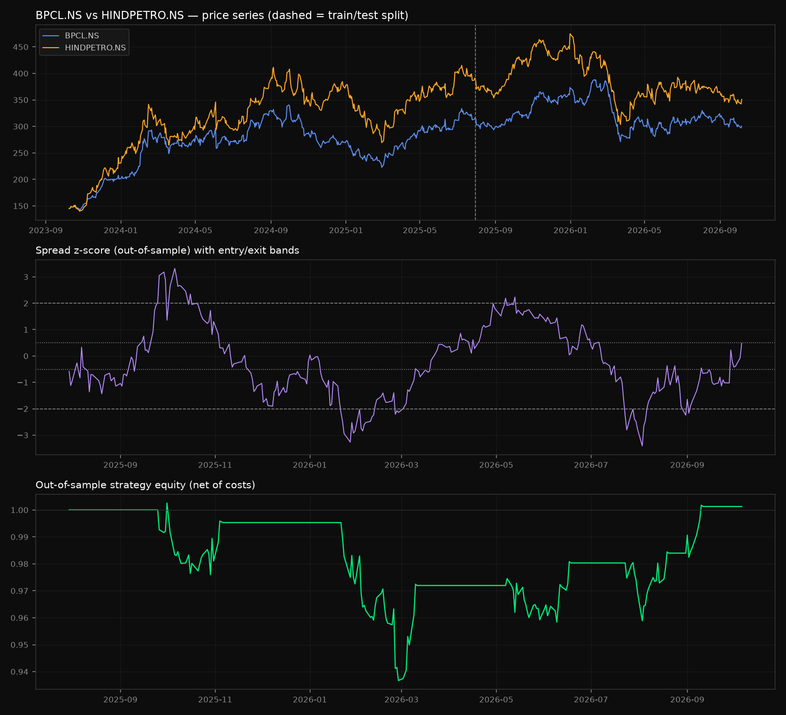

---

### ONGC.NS / COALINDIA.NS

- **Latest prices:** ONGC.NS ₹224.20 · COALINDIA.NS ₹411.65
- **Hedge ratio (train-fitted):** 1.4030
- **Cointegration (train):** PASS at 5% — ADF -3.25, p=0.0171
- **Persistence:** passed 5% in 62 of 70 real-data runs (strict tier: 1/70)
- **Spread half-life:** 12.2 days
- **Current z-score:** +1.19
- **Signal today:** watch (approaching band)

**Out-of-sample backtest** (beta frozen from train window):

| Metric | Value |
|---|---|
| Sharpe | 0.76 |
| Sortino | 0.61 |
| Annualised return | 5.84% |
| Annualised vol | 7.82% |
| Max drawdown | -6.31% |
| Round-trip trades | 5 |

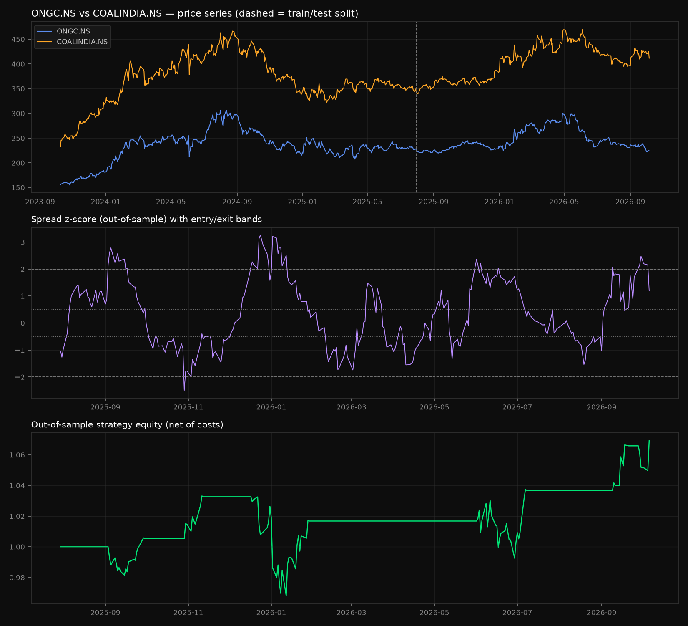

---

### NTPC.NS / POWERGRID.NS

- **Latest prices:** NTPC.NS ₹321.45 · POWERGRID.NS ₹257.20
- **Hedge ratio (train-fitted):** 0.8180
- **Cointegration (train):** FAIL at 5% — ADF -2.51, p=0.1121
- **Persistence:** passed 5% in 0 of 70 real-data runs (strict tier: 0/70)
- **Spread half-life:** 24.3 days
- **Current z-score:** -0.77
- **Signal today:** watch (approaching band)
- ⚠️ _Pair did not cointegrate on training data. Any signal here is not statistically justified — observation only._

**Out-of-sample backtest** (beta frozen from train window):

| Metric | Value |
|---|---|
| Sharpe | 0.43 |
| Sortino | 0.34 |
| Annualised return | 2.27% |
| Annualised vol | 5.57% |
| Max drawdown | -5.27% |
| Round-trip trades | 6 |

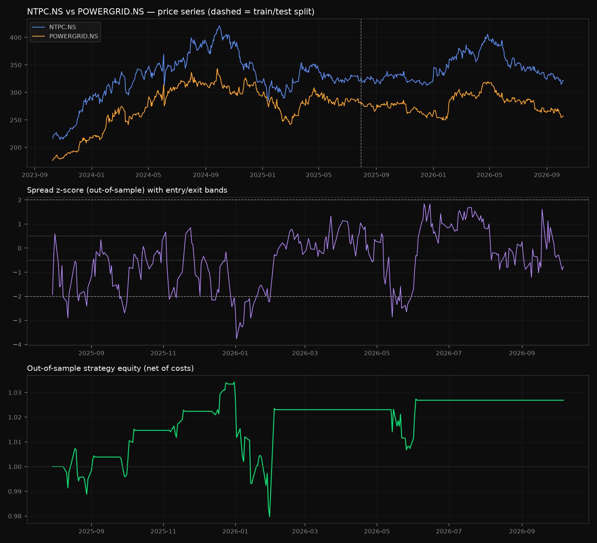

---

### BAJAJ-AUTO.NS / HEROMOTOCO.NS

- **Latest prices:** BAJAJ-AUTO.NS ₹10,017.00 · HEROMOTOCO.NS ₹5,075.00
- **Hedge ratio (train-fitted):** 0.4092
- **Cointegration (train):** FAIL at 5% — ADF -2.29, p=0.1742
- **Persistence:** passed 5% in 0 of 70 real-data runs (strict tier: 0/70)
- **Spread half-life:** 29.5 days
- **Current z-score:** +1.22
- **Signal today:** watch (approaching band)
- ⚠️ _Pair did not cointegrate on training data. Any signal here is not statistically justified — observation only._

**Out-of-sample backtest** (beta frozen from train window):

| Metric | Value |
|---|---|
| Sharpe | -0.52 |
| Sortino | -0.53 |
| Annualised return | -6.07% |
| Annualised vol | 10.88% |
| Max drawdown | -19.56% |
| Round-trip trades | 6 |

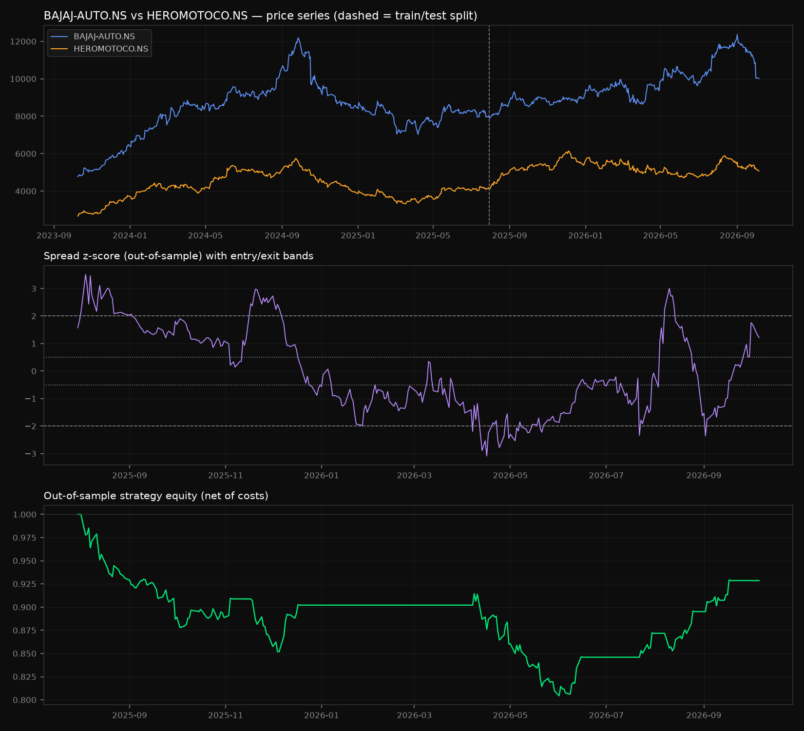

---

### TATASTEEL.NS / JSWSTEEL.NS

- **Latest prices:** TATASTEEL.NS ₹178.69 · JSWSTEEL.NS ₹1,259.60
- **Hedge ratio (train-fitted):** 3.0945
- **Cointegration (train):** FAIL at 5% — ADF -1.31, p=0.6266
- **Persistence:** passed 5% in 0 of 70 real-data runs (strict tier: 0/70)
- **Spread half-life:** 65.0 days
- **Current z-score:** +0.08
- **Signal today:** flat / no stretch
- ⚠️ _Pair did not cointegrate on training data. Any signal here is not statistically justified — observation only._

**Out-of-sample backtest** (beta frozen from train window):

| Metric | Value |
|---|---|
| Sharpe | 0.36 |
| Sortino | 0.34 |
| Annualised return | 2.64% |
| Annualised vol | 8.26% |
| Max drawdown | -5.51% |
| Round-trip trades | 5 |

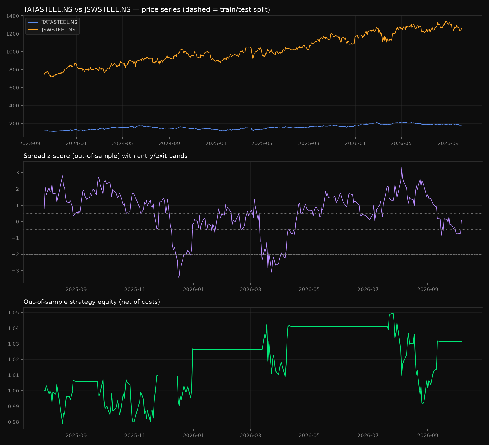

---

### SUNPHARMA.NS / CIPLA.NS

- **Latest prices:** SUNPHARMA.NS ₹1,804.10 · CIPLA.NS ₹1,340.20
- **Hedge ratio (train-fitted):** 0.4922
- **Cointegration (train):** PASS at 5% — ADF -3.37, p=0.0120
- **Persistence:** passed 5% in 70 of 70 real-data runs (strict tier: 5/70)
- **Spread half-life:** 10.8 days
- **Current z-score:** -1.03
- **Signal today:** watch (approaching band)

**Out-of-sample backtest** (beta frozen from train window):

| Metric | Value |
|---|---|
| Sharpe | 0.15 |
| Sortino | 0.16 |
| Annualised return | 0.82% |
| Annualised vol | 7.31% |
| Max drawdown | -9.88% |
| Round-trip trades | 5 |

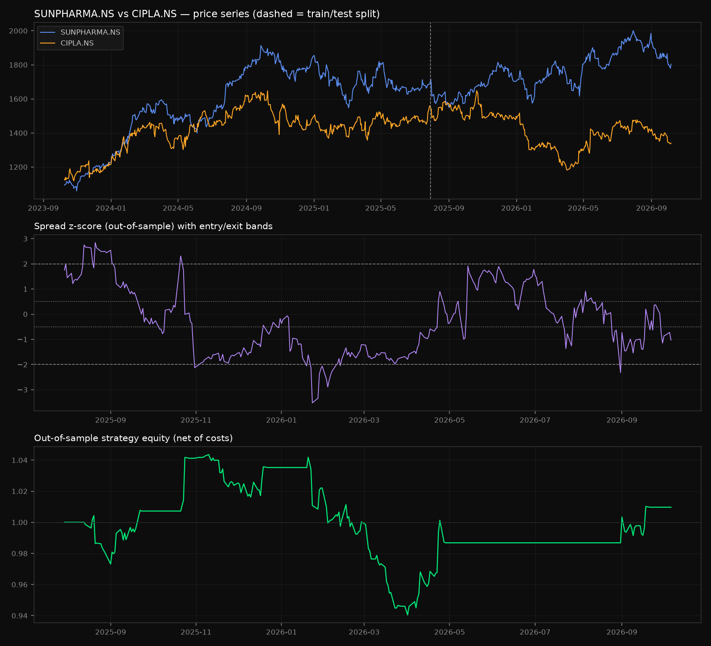

---

_Generated 2026-10-07 · pairs mean-reversion scanner · out-of-sample backtest · multiple-testing-aware · not investment advice._
