# Indian Pairs-Trading Scanner — 2026-10-08

> **What this is:** a market-neutral *pairs mean-reversion* scanner. It flags when two related NSE stocks have drifted apart far enough that their historical relationship signals a possible convergence trade. It does **not** forecast growth, rank "best" stocks, or predict company performance. A signal means the *spread between two stocks* is stretched — nothing about either stock being a good investment. Not investment advice; do your own research.

## Methodology (fixed in advance)

- **Universe:** 16 declared sector-mate pairs. Parameters (3y window, 60/40 train-test, z-entry 2.0, z-exit 0.5, 5 bps costs) are pre-registered; changes are logged in the README changelog *before* looking at results.
- **Multiple testing:** at the 5% level across 16 pairs, **≈0.8 false positives per run are expected by chance alone** even if nothing truly cointegrates. A single-day pass is a candidate, not a discovery.
- **Strict tier:** Bonferroni-corrected threshold p < 0.0031 (marked ✓✓).
- **Evidence = persistence:** the Persistence column counts how often each pair has passed the 5% test across all *real-data* daily runs recorded in `reports/history.csv`. Pairs deserve attention only when they pass persistently.

## Summary

| Pair | p-value | Coint. | Persistence | Current z | Signal | OOS Sharpe |
|---|---|---|---|---|---|---|
| HDFCBANK.NS/ICICIBANK.NS | 0.0827 | ✗ | 1/59 | +0.05 | flat / no stretch | -0.55 |
| AXISBANK.NS/ICICIBANK.NS | 0.9572 | ✗ | 0/71 | -0.99 | watch | -0.08 |
| KOTAKBANK.NS/HDFCBANK.NS | 0.3439 | ✗ | 0/71 | -1.98 | watch | 1.72 |
| SBIN.NS/BANKBARODA.NS | 0.1425 | ✗ | 0/71 | +2.04 | SHORT spread | 0.02 |
| TCS.NS/INFY.NS | 0.7708 | ✗ | 0/71 | -1.07 | watch | 2.38 |
| INFY.NS/WIPRO.NS | 0.1468 | ✗ | 0/71 | -0.54 | watch | 1.95 |
| HCLTECH.NS/TECHM.NS | 0.2213 | ✗ | 0/71 | +0.13 | flat / no stretch | -0.26 |
| ACC.NS/AMBUJACEM.NS | 0.8732 | ✗ | 0/71 | -2.11 | LONG spread | 0.55 |
| ULTRACEMCO.NS/SHREECEM.NS | 0.3481 | ✗ | 0/71 | -1.21 | watch | -0.31 |
| IOC.NS/BPCL.NS | 0.8248 | ✗ | 0/71 | -0.93 | watch | 0.45 |
| BPCL.NS/HINDPETRO.NS | 0.2645 | ✗ | 0/71 | +0.21 | flat / no stretch | 0.05 |
| ONGC.NS/COALINDIA.NS | 0.0183 | ✓ | 63/71 | +1.57 | watch | 0.66 |
| NTPC.NS/POWERGRID.NS | 0.0985 | ✗ | 0/71 | -0.81 | watch | 0.43 |
| BAJAJ-AUTO.NS/HEROMOTOCO.NS | 0.1707 | ✗ | 0/71 | +1.11 | watch | -0.52 |
| TATASTEEL.NS/JSWSTEEL.NS | 0.6348 | ✗ | 0/71 | -0.71 | watch | 0.35 |
| SUNPHARMA.NS/CIPLA.NS | 0.0089 | ✓ | 71/71 | -1.07 | watch | 0.15 |

_Legend: ✓✓ passes strict Bonferroni tier · ✓ passes 5% only · ✗ fails. Persistence = 5%-passes / real-data runs recorded. \*no real-data history yet._

---

### HDFCBANK.NS / ICICIBANK.NS

- **Latest prices:** HDFCBANK.NS ₹702.75 · ICICIBANK.NS ₹1,357.50
- **Hedge ratio (train-fitted):** 1.6286
- **Cointegration (train):** FAIL at 5% — ADF -2.65, p=0.0827
- **Persistence:** passed 5% in 1 of 59 real-data runs (strict tier: 0/59)
- **Spread half-life:** 25.2 days
- **Current z-score:** +0.05
- **Signal today:** flat / no stretch
- ⚠️ _Pair did not cointegrate on training data. Any signal here is not statistically justified — observation only._

**Out-of-sample backtest** (beta frozen from train window):

| Metric | Value |
|---|---|
| Sharpe | -0.55 |
| Sortino | -0.59 |
| Annualised return | -3.65% |
| Annualised vol | 6.36% |
| Max drawdown | -7.98% |
| Round-trip trades | 4 |

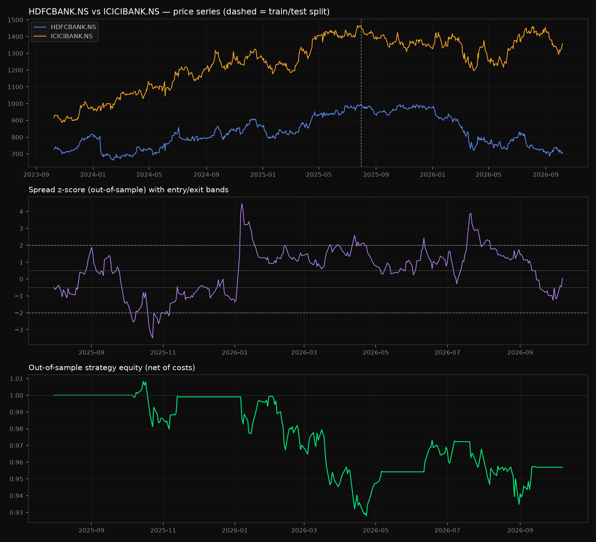

---

### AXISBANK.NS / ICICIBANK.NS

- **Latest prices:** AXISBANK.NS ₹1,242.50 · ICICIBANK.NS ₹1,357.50
- **Hedge ratio (train-fitted):** 0.9140
- **Cointegration (train):** FAIL at 5% — ADF -0.02, p=0.9572
- **Persistence:** passed 5% in 0 of 71 real-data runs (strict tier: 0/71)
- **Spread half-life:** 9412.7 days
- **Current z-score:** -0.99
- **Signal today:** watch (approaching band)
- ⚠️ _Pair did not cointegrate on training data. Any signal here is not statistically justified — observation only._

**Out-of-sample backtest** (beta frozen from train window):

| Metric | Value |
|---|---|
| Sharpe | -0.08 |
| Sortino | -0.08 |
| Annualised return | -1.08% |
| Annualised vol | 8.59% |
| Max drawdown | -7.82% |
| Round-trip trades | 6 |

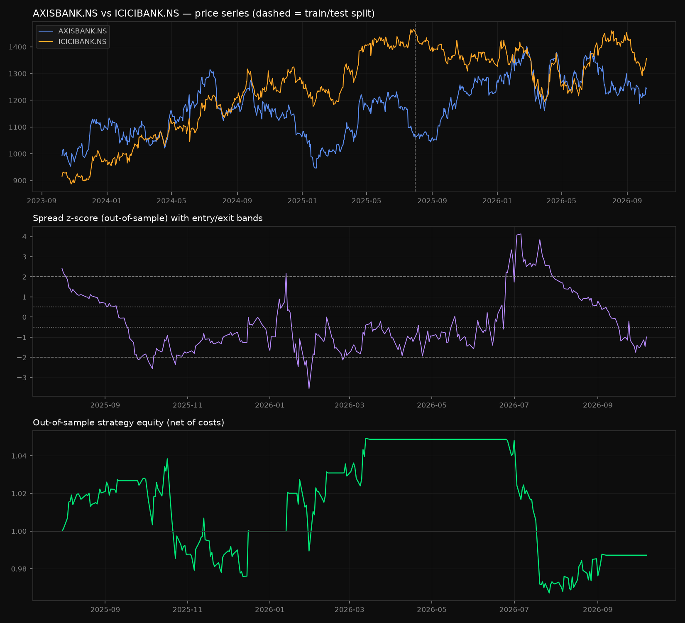

---

### KOTAKBANK.NS / HDFCBANK.NS

- **Latest prices:** KOTAKBANK.NS ₹440.00 · HDFCBANK.NS ₹702.75
- **Hedge ratio (train-fitted):** 2.1801
- **Cointegration (train):** FAIL at 5% — ADF -1.88, p=0.3439
- **Persistence:** passed 5% in 0 of 71 real-data runs (strict tier: 0/71)
- **Spread half-life:** 31.8 days
- **Current z-score:** -1.98
- **Signal today:** watch (approaching band)
- ⚠️ _Pair did not cointegrate on training data. Any signal here is not statistically justified — observation only._

**Out-of-sample backtest** (beta frozen from train window):

| Metric | Value |
|---|---|
| Sharpe | 1.72 |
| Sortino | 1.89 |
| Annualised return | 10.68% |
| Annualised vol | 6.00% |
| Max drawdown | -2.85% |
| Round-trip trades | 7 |

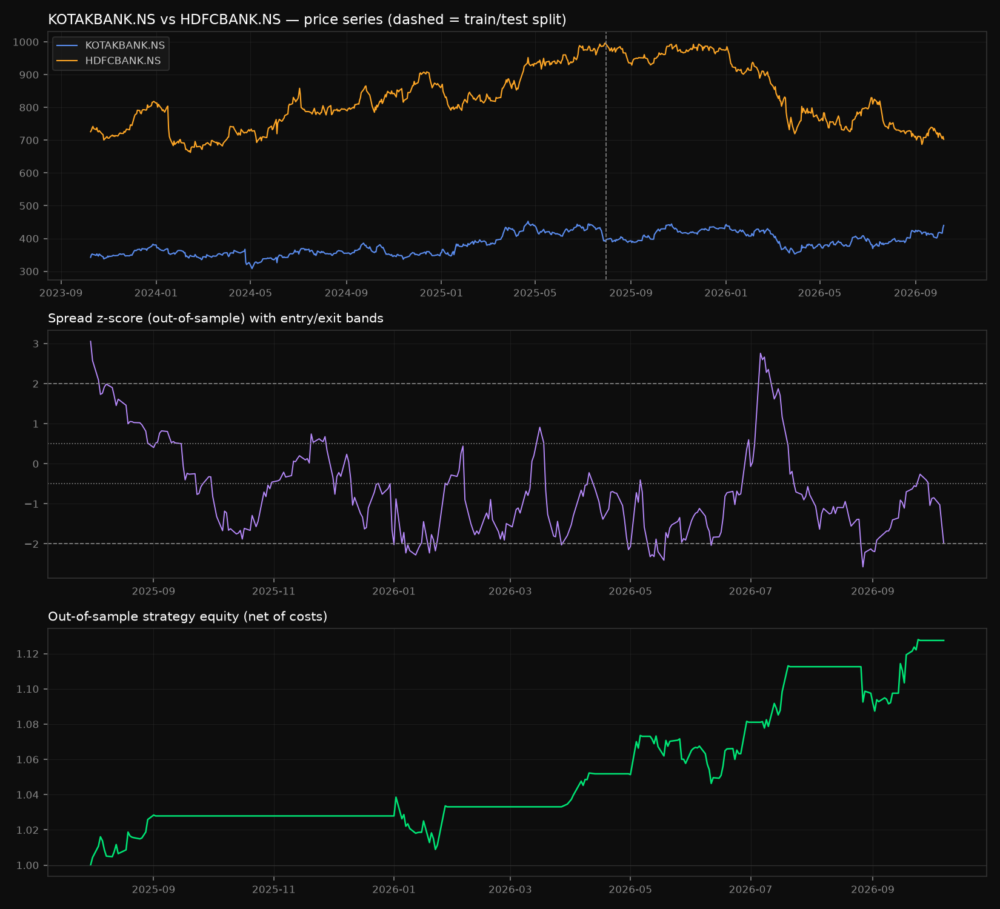

---

### SBIN.NS / BANKBARODA.NS

- **Latest prices:** SBIN.NS ₹954.00 · BANKBARODA.NS ₹234.55
- **Hedge ratio (train-fitted):** 0.1908
- **Cointegration (train):** FAIL at 5% — ADF -2.40, p=0.1425
- **Persistence:** passed 5% in 0 of 71 real-data runs (strict tier: 0/71)
- **Spread half-life:** 21.2 days
- **Current z-score:** +2.04
- **Signal today:** SHORT spread (short BANKBARODA.NS, long SBIN.NS)
- ⚠️ _Pair did not cointegrate on training data. Any signal here is not statistically justified — observation only._

**Out-of-sample backtest** (beta frozen from train window):

| Metric | Value |
|---|---|
| Sharpe | 0.02 |
| Sortino | 0.02 |
| Annualised return | -0.21% |
| Annualised vol | 9.23% |
| Max drawdown | -8.90% |
| Round-trip trades | 5 |

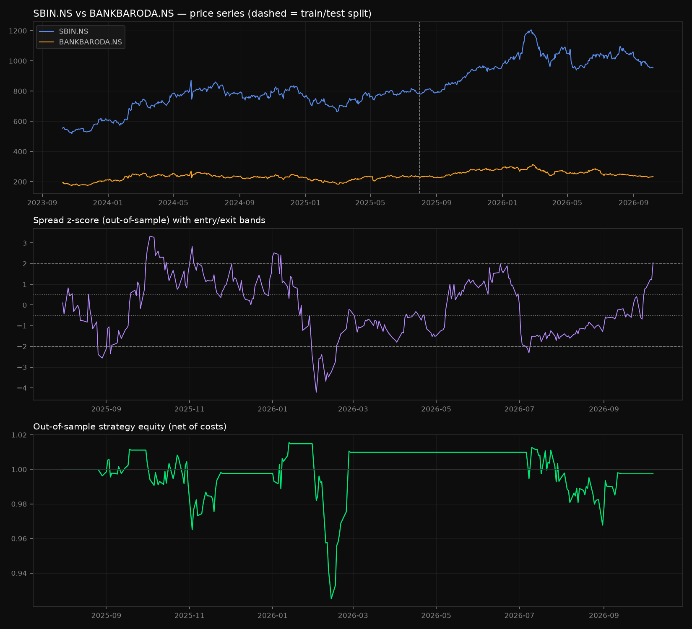

---

### TCS.NS / INFY.NS

- **Latest prices:** TCS.NS ₹2,080.30 · INFY.NS ₹992.00
- **Hedge ratio (train-fitted):** 0.4388
- **Cointegration (train):** FAIL at 5% — ADF -0.95, p=0.7708
- **Persistence:** passed 5% in 0 of 71 real-data runs (strict tier: 0/71)
- **Spread half-life:** 79.4 days
- **Current z-score:** -1.07
- **Signal today:** watch (approaching band)
- ⚠️ _Pair did not cointegrate on training data. Any signal here is not statistically justified — observation only._

**Out-of-sample backtest** (beta frozen from train window):

| Metric | Value |
|---|---|
| Sharpe | 2.38 |
| Sortino | 2.79 |
| Annualised return | 9.73% |
| Annualised vol | 3.94% |
| Max drawdown | -1.02% |
| Round-trip trades | 6 |

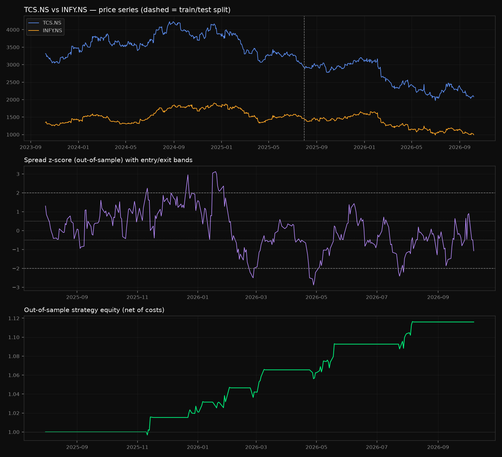

---

### INFY.NS / WIPRO.NS

- **Latest prices:** INFY.NS ₹992.00 · WIPRO.NS ₹159.60
- **Hedge ratio (train-fitted):** 0.1299
- **Cointegration (train):** FAIL at 5% — ADF -2.38, p=0.1468
- **Persistence:** passed 5% in 0 of 71 real-data runs (strict tier: 0/71)
- **Spread half-life:** 28.9 days
- **Current z-score:** -0.54
- **Signal today:** watch (approaching band)
- ⚠️ _Pair did not cointegrate on training data. Any signal here is not statistically justified — observation only._

**Out-of-sample backtest** (beta frozen from train window):

| Metric | Value |
|---|---|
| Sharpe | 1.95 |
| Sortino | 1.81 |
| Annualised return | 9.98% |
| Annualised vol | 4.95% |
| Max drawdown | -1.54% |
| Round-trip trades | 5 |

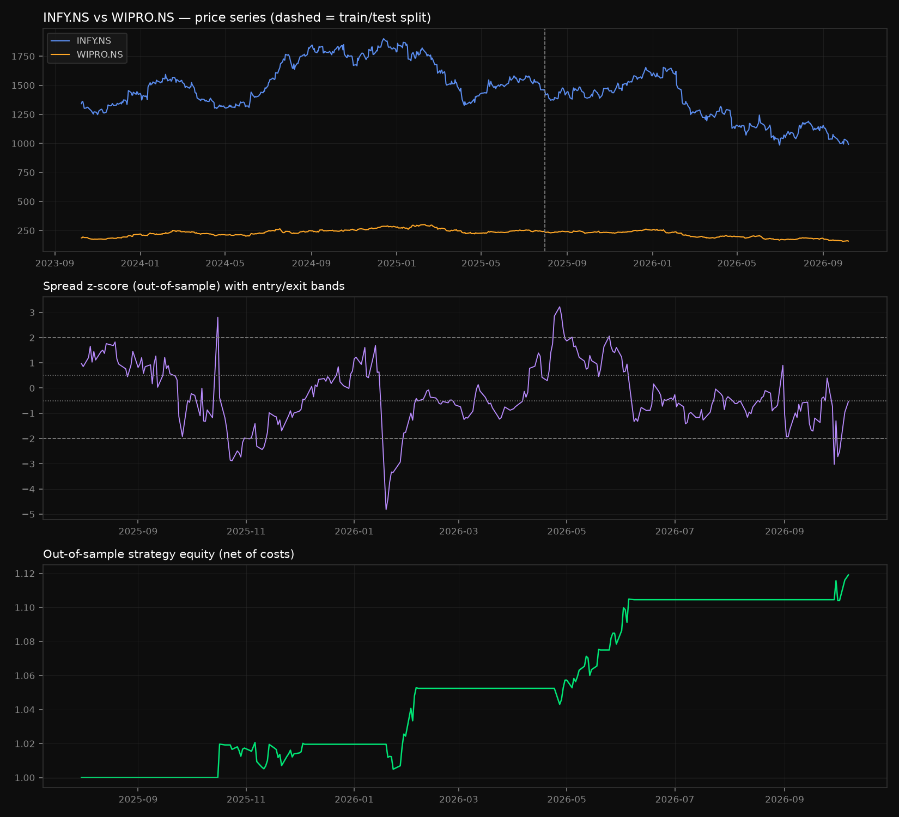

---

### HCLTECH.NS / TECHM.NS

- **Latest prices:** HCLTECH.NS ₹1,185.00 · TECHM.NS ₹1,491.10
- **Hedge ratio (train-fitted):** 0.9392
- **Cointegration (train):** FAIL at 5% — ADF -2.16, p=0.2213
- **Persistence:** passed 5% in 0 of 71 real-data runs (strict tier: 0/71)
- **Spread half-life:** 22.9 days
- **Current z-score:** +0.13
- **Signal today:** flat / no stretch
- ⚠️ _Pair did not cointegrate on training data. Any signal here is not statistically justified — observation only._

**Out-of-sample backtest** (beta frozen from train window):

| Metric | Value |
|---|---|
| Sharpe | -0.26 |
| Sortino | -0.24 |
| Annualised return | -2.14% |
| Annualised vol | 7.25% |
| Max drawdown | -8.45% |
| Round-trip trades | 4 |

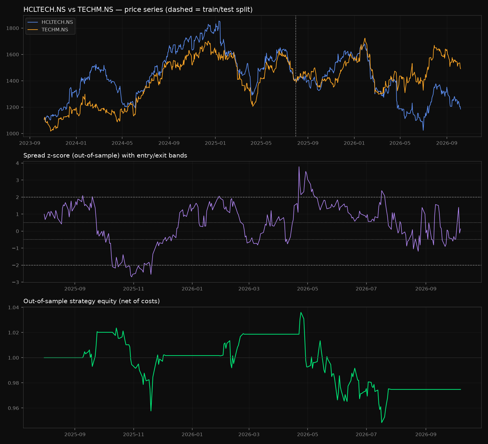

---

### ACC.NS / AMBUJACEM.NS

- **Latest prices:** ACC.NS ₹1,165.50 · AMBUJACEM.NS ₹356.90
- **Hedge ratio (train-fitted):** 0.1767
- **Cointegration (train):** FAIL at 5% — ADF -0.59, p=0.8732
- **Persistence:** passed 5% in 0 of 71 real-data runs (strict tier: 0/71)
- **Spread half-life:** 104.3 days
- **Current z-score:** -2.11
- **Signal today:** LONG spread (long AMBUJACEM.NS, short ACC.NS)
- ⚠️ _Pair did not cointegrate on training data. Any signal here is not statistically justified — observation only._

**Out-of-sample backtest** (beta frozen from train window):

| Metric | Value |
|---|---|
| Sharpe | 0.55 |
| Sortino | 0.44 |
| Annualised return | 3.18% |
| Annualised vol | 6.00% |
| Max drawdown | -5.45% |
| Round-trip trades | 4 |

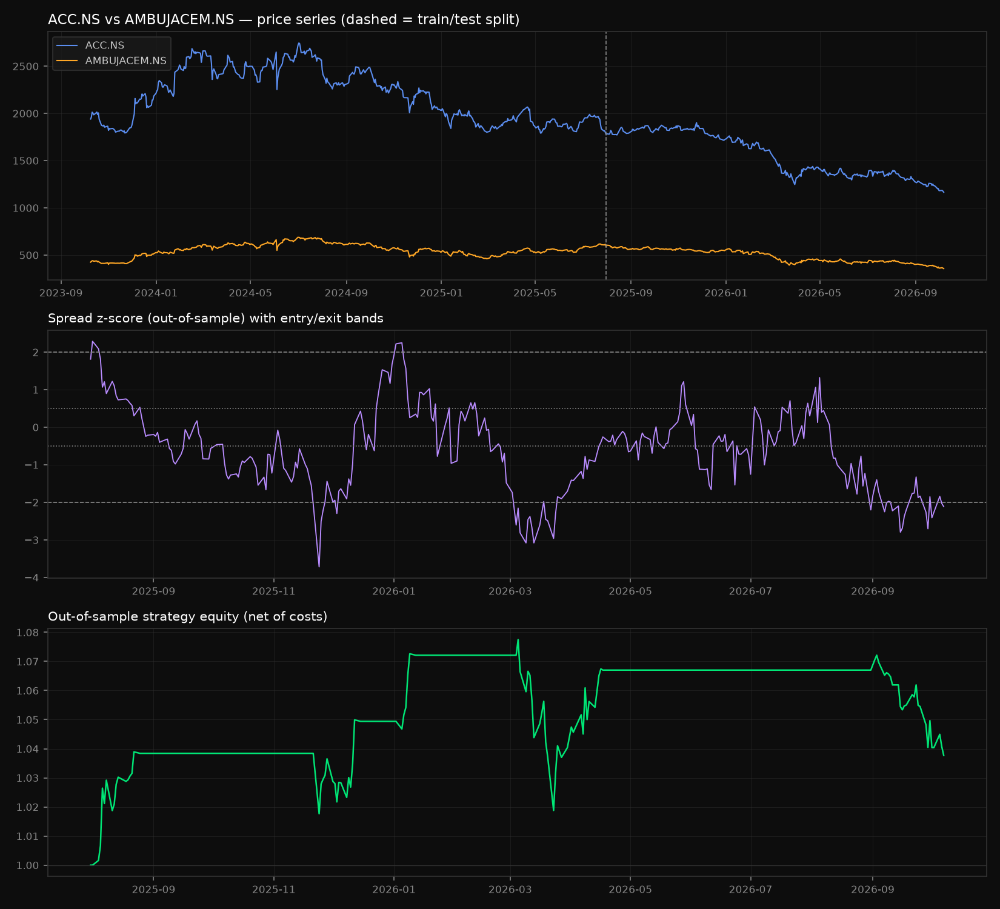

---

### ULTRACEMCO.NS / SHREECEM.NS

- **Latest prices:** ULTRACEMCO.NS ₹10,658.00 · SHREECEM.NS ₹21,780.00
- **Hedge ratio (train-fitted):** 0.9165
- **Cointegration (train):** FAIL at 5% — ADF -1.87, p=0.3481
- **Persistence:** passed 5% in 0 of 71 real-data runs (strict tier: 0/71)
- **Spread half-life:** 41.4 days
- **Current z-score:** -1.21
- **Signal today:** watch (approaching band)
- ⚠️ _Pair did not cointegrate on training data. Any signal here is not statistically justified — observation only._

**Out-of-sample backtest** (beta frozen from train window):

| Metric | Value |
|---|---|
| Sharpe | -0.31 |
| Sortino | -0.39 |
| Annualised return | -2.40% |
| Annualised vol | 7.09% |
| Max drawdown | -7.27% |
| Round-trip trades | 4 |

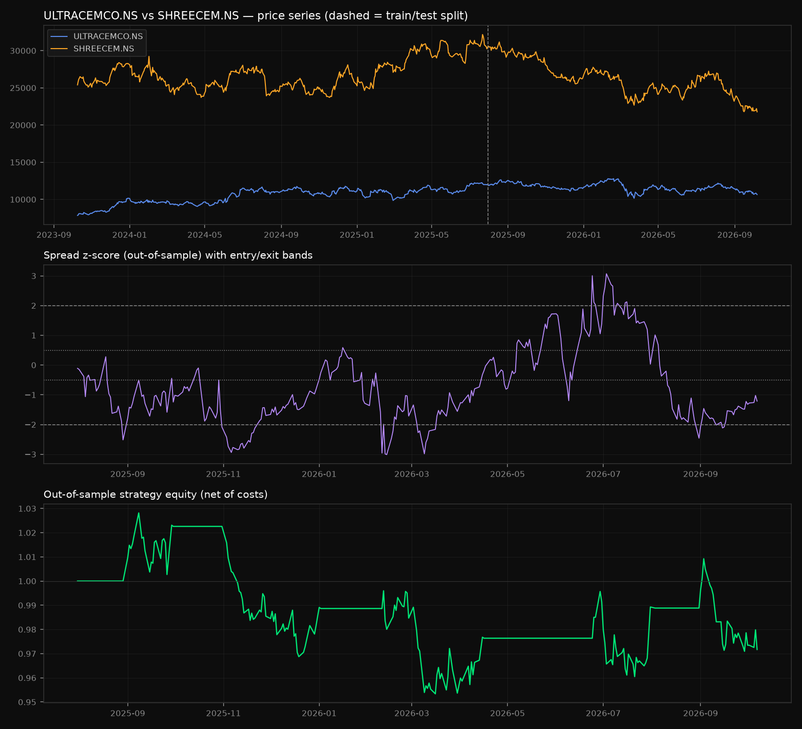

---

### IOC.NS / BPCL.NS

- **Latest prices:** IOC.NS ₹130.00 · BPCL.NS ₹296.35
- **Hedge ratio (train-fitted):** 1.7013
- **Cointegration (train):** FAIL at 5% — ADF -0.78, p=0.8248
- **Persistence:** passed 5% in 0 of 71 real-data runs (strict tier: 0/71)
- **Spread half-life:** 157.4 days
- **Current z-score:** -0.93
- **Signal today:** watch (approaching band)
- ⚠️ _Pair did not cointegrate on training data. Any signal here is not statistically justified — observation only._

**Out-of-sample backtest** (beta frozen from train window):

| Metric | Value |
|---|---|
| Sharpe | 0.45 |
| Sortino | 0.48 |
| Annualised return | 2.70% |
| Annualised vol | 6.39% |
| Max drawdown | -6.81% |
| Round-trip trades | 5 |

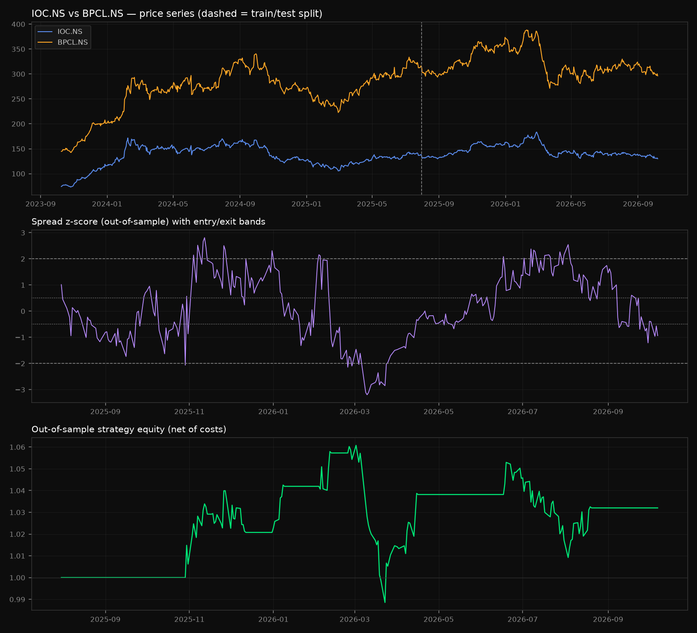

---

### BPCL.NS / HINDPETRO.NS

- **Latest prices:** BPCL.NS ₹296.35 · HINDPETRO.NS ₹343.15
- **Hedge ratio (train-fitted):** 1.3373
- **Cointegration (train):** FAIL at 5% — ADF -2.05, p=0.2645
- **Persistence:** passed 5% in 0 of 71 real-data runs (strict tier: 0/71)
- **Spread half-life:** 37.1 days
- **Current z-score:** +0.21
- **Signal today:** flat / no stretch
- ⚠️ _Pair did not cointegrate on training data. Any signal here is not statistically justified — observation only._

**Out-of-sample backtest** (beta frozen from train window):

| Metric | Value |
|---|---|
| Sharpe | 0.05 |
| Sortino | 0.04 |
| Annualised return | 0.11% |
| Annualised vol | 5.86% |
| Max drawdown | -6.65% |
| Round-trip trades | 5 |

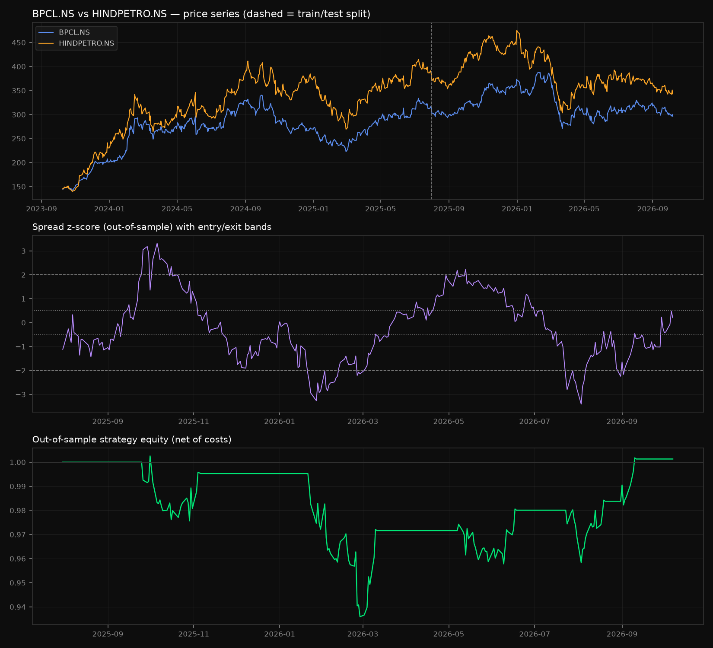

---

### ONGC.NS / COALINDIA.NS

- **Latest prices:** ONGC.NS ₹221.88 · COALINDIA.NS ₹414.50
- **Hedge ratio (train-fitted):** 1.4031
- **Cointegration (train):** PASS at 5% — ADF -3.23, p=0.0183
- **Persistence:** passed 5% in 63 of 71 real-data runs (strict tier: 1/71)
- **Spread half-life:** 12.3 days
- **Current z-score:** +1.57
- **Signal today:** watch (approaching band)

**Out-of-sample backtest** (beta frozen from train window):

| Metric | Value |
|---|---|
| Sharpe | 0.66 |
| Sortino | 0.53 |
| Annualised return | 5.05% |
| Annualised vol | 7.92% |
| Max drawdown | -6.35% |
| Round-trip trades | 5 |

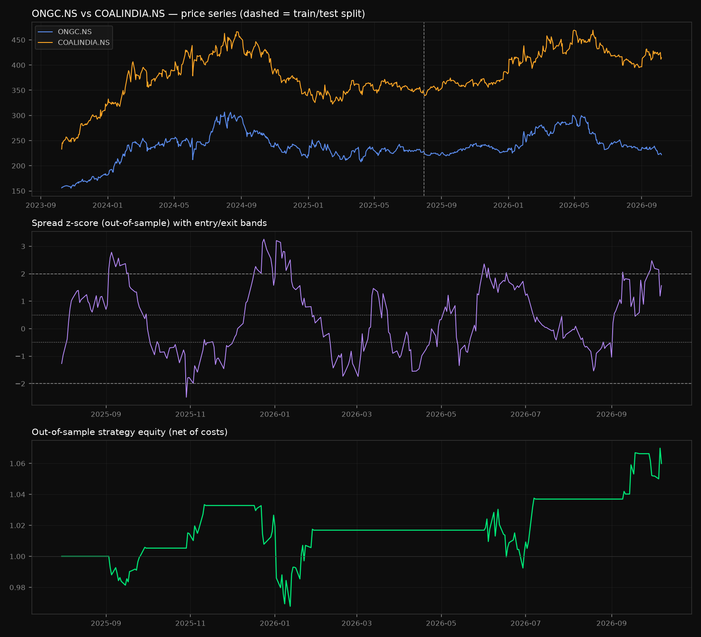

---

### NTPC.NS / POWERGRID.NS

- **Latest prices:** NTPC.NS ₹316.75 · POWERGRID.NS ₹253.05
- **Hedge ratio (train-fitted):** 0.8180
- **Cointegration (train):** FAIL at 5% — ADF -2.57, p=0.0985
- **Persistence:** passed 5% in 0 of 71 real-data runs (strict tier: 0/71)
- **Spread half-life:** 23.7 days
- **Current z-score:** -0.81
- **Signal today:** watch (approaching band)
- ⚠️ _Pair did not cointegrate on training data. Any signal here is not statistically justified — observation only._

**Out-of-sample backtest** (beta frozen from train window):

| Metric | Value |
|---|---|
| Sharpe | 0.43 |
| Sortino | 0.34 |
| Annualised return | 2.27% |
| Annualised vol | 5.58% |
| Max drawdown | -5.28% |
| Round-trip trades | 6 |

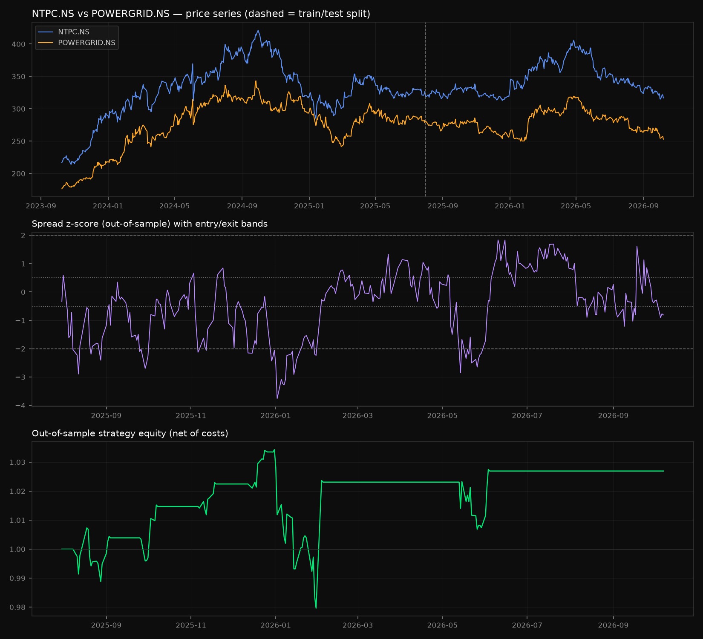

---

### BAJAJ-AUTO.NS / HEROMOTOCO.NS

- **Latest prices:** BAJAJ-AUTO.NS ₹9,884.00 · HEROMOTOCO.NS ₹5,004.00
- **Hedge ratio (train-fitted):** 0.4091
- **Cointegration (train):** FAIL at 5% — ADF -2.30, p=0.1707
- **Persistence:** passed 5% in 0 of 71 real-data runs (strict tier: 0/71)
- **Spread half-life:** 29.4 days
- **Current z-score:** +1.11
- **Signal today:** watch (approaching band)
- ⚠️ _Pair did not cointegrate on training data. Any signal here is not statistically justified — observation only._

**Out-of-sample backtest** (beta frozen from train window):

| Metric | Value |
|---|---|
| Sharpe | -0.52 |
| Sortino | -0.53 |
| Annualised return | -6.08% |
| Annualised vol | 10.88% |
| Max drawdown | -19.57% |
| Round-trip trades | 6 |

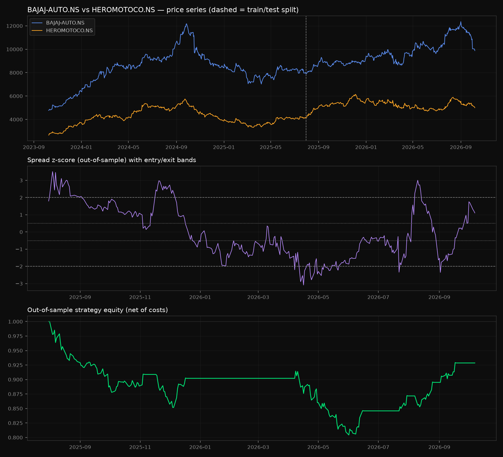

---

### TATASTEEL.NS / JSWSTEEL.NS

- **Latest prices:** TATASTEEL.NS ₹175.64 · JSWSTEEL.NS ₹1,230.00
- **Hedge ratio (train-fitted):** 3.1068
- **Cointegration (train):** FAIL at 5% — ADF -1.29, p=0.6348
- **Persistence:** passed 5% in 0 of 71 real-data runs (strict tier: 0/71)
- **Spread half-life:** 65.9 days
- **Current z-score:** -0.71
- **Signal today:** watch (approaching band)
- ⚠️ _Pair did not cointegrate on training data. Any signal here is not statistically justified — observation only._

**Out-of-sample backtest** (beta frozen from train window):

| Metric | Value |
|---|---|
| Sharpe | 0.35 |
| Sortino | 0.34 |
| Annualised return | 2.60% |
| Annualised vol | 8.24% |
| Max drawdown | -5.50% |
| Round-trip trades | 5 |

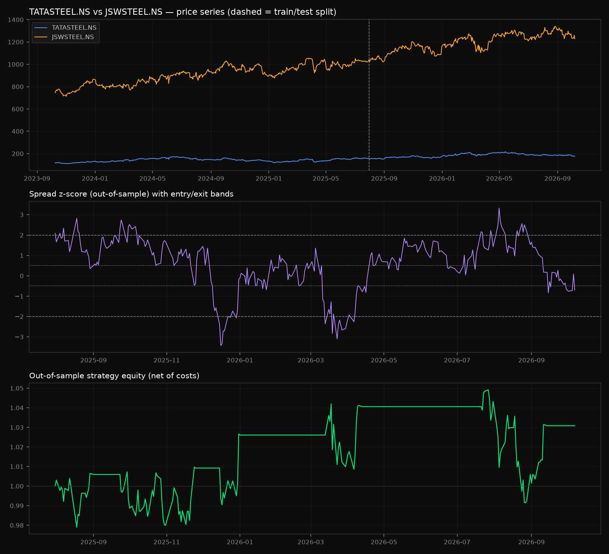

---

### SUNPHARMA.NS / CIPLA.NS

- **Latest prices:** SUNPHARMA.NS ₹1,781.00 · CIPLA.NS ₹1,327.20
- **Hedge ratio (train-fitted):** 0.4926
- **Cointegration (train):** PASS at 5% — ADF -3.47, p=0.0089
- **Persistence:** passed 5% in 71 of 71 real-data runs (strict tier: 5/71)
- **Spread half-life:** 10.6 days
- **Current z-score:** -1.07
- **Signal today:** watch (approaching band)

**Out-of-sample backtest** (beta frozen from train window):

| Metric | Value |
|---|---|
| Sharpe | 0.15 |
| Sortino | 0.16 |
| Annualised return | 0.82% |
| Annualised vol | 7.36% |
| Max drawdown | -9.95% |
| Round-trip trades | 5 |

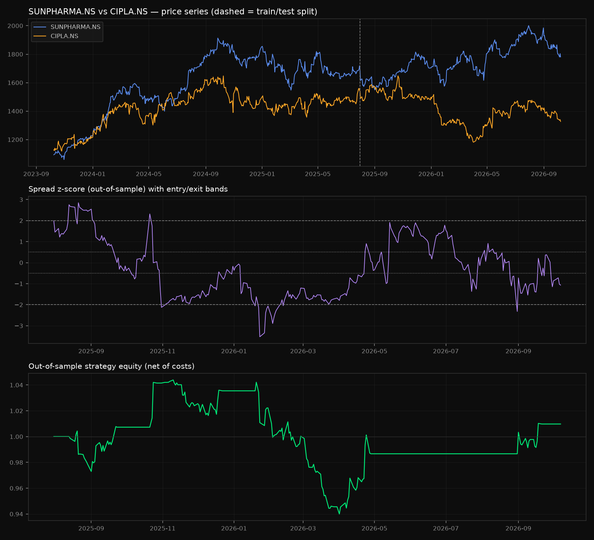

---

_Generated 2026-10-08 · pairs mean-reversion scanner · out-of-sample backtest · multiple-testing-aware · not investment advice._
