# Indian Pairs-Trading Scanner — 2026-10-09

> **What this is:** a market-neutral *pairs mean-reversion* scanner. It flags when two related NSE stocks have drifted apart far enough that their historical relationship signals a possible convergence trade. It does **not** forecast growth, rank "best" stocks, or predict company performance. A signal means the *spread between two stocks* is stretched — nothing about either stock being a good investment. Not investment advice; do your own research.

## Methodology (fixed in advance)

- **Universe:** 16 declared sector-mate pairs. Parameters (3y window, 60/40 train-test, z-entry 2.0, z-exit 0.5, 5 bps costs) are pre-registered; changes are logged in the README changelog *before* looking at results.
- **Multiple testing:** at the 5% level across 16 pairs, **≈0.8 false positives per run are expected by chance alone** even if nothing truly cointegrates. A single-day pass is a candidate, not a discovery.
- **Strict tier:** Bonferroni-corrected threshold p < 0.0031 (marked ✓✓).
- **Evidence = persistence:** the Persistence column counts how often each pair has passed the 5% test across all *real-data* daily runs recorded in `reports/history.csv`. Pairs deserve attention only when they pass persistently.

## Summary

| Pair | p-value | Coint. | Persistence | Current z | Signal | OOS Sharpe |
|---|---|---|---|---|---|---|
| HDFCBANK.NS/ICICIBANK.NS | 0.0833 | ✗ | 1/60 | +0.23 | flat / no stretch | -0.36 |
| AXISBANK.NS/ICICIBANK.NS | 0.9466 | ✗ | 0/72 | -1.24 | watch | 0.00 |
| KOTAKBANK.NS/HDFCBANK.NS | 0.1399 | ✗ | 0/72 | -1.86 | watch | 1.72 |
| SBIN.NS/BANKBARODA.NS | 0.1445 | ✗ | 0/72 | +2.46 | SHORT spread | 0.27 |
| TCS.NS/INFY.NS | 0.7028 | ✗ | 0/72 | -0.70 | watch | 2.37 |
| INFY.NS/WIPRO.NS | 0.1692 | ✗ | 0/72 | -1.21 | watch | 1.87 |
| HCLTECH.NS/TECHM.NS | 0.2107 | ✗ | 0/72 | +0.71 | watch | -0.26 |
| ACC.NS/AMBUJACEM.NS | 0.8353 | ✗ | 0/72 | -2.76 | LONG spread | 0.31 |
| ULTRACEMCO.NS/SHREECEM.NS | 0.3851 | ✗ | 0/72 | -1.22 | watch | -0.28 |
| IOC.NS/BPCL.NS | 0.8214 | ✗ | 0/72 | -1.77 | watch | 0.45 |
| BPCL.NS/HINDPETRO.NS | 0.2694 | ✗ | 0/72 | -0.26 | flat / no stretch | 0.05 |
| ONGC.NS/COALINDIA.NS | 0.0176 | ✓ | 64/72 | +1.49 | watch | 0.70 |
| NTPC.NS/POWERGRID.NS | 0.1132 | ✗ | 0/72 | -1.34 | watch | 0.43 |
| BAJAJ-AUTO.NS/HEROMOTOCO.NS | 0.1727 | ✗ | 0/72 | +0.92 | watch | -0.54 |
| TATASTEEL.NS/JSWSTEEL.NS | 0.6107 | ✗ | 0/72 | -2.18 | LONG spread | 0.12 |
| SUNPHARMA.NS/CIPLA.NS | 0.0091 | ✓ | 72/72 | -1.50 | watch | 0.05 |

_Legend: ✓✓ passes strict Bonferroni tier · ✓ passes 5% only · ✗ fails. Persistence = 5%-passes / real-data runs recorded. \*no real-data history yet._

---

### HDFCBANK.NS / ICICIBANK.NS

- **Latest prices:** HDFCBANK.NS ₹692.25 · ICICIBANK.NS ₹1,349.00
- **Hedge ratio (train-fitted):** 1.6306
- **Cointegration (train):** FAIL at 5% — ADF -2.65, p=0.0833
- **Persistence:** passed 5% in 1 of 60 real-data runs (strict tier: 0/60)
- **Spread half-life:** 25.1 days
- **Current z-score:** +0.23
- **Signal today:** flat / no stretch
- ⚠️ _Pair did not cointegrate on training data. Any signal here is not statistically justified — observation only._

**Out-of-sample backtest** (beta frozen from train window):

| Metric | Value |
|---|---|
| Sharpe | -0.36 |
| Sortino | -0.39 |
| Annualised return | -2.55% |
| Annualised vol | 6.50% |
| Max drawdown | -7.99% |
| Round-trip trades | 4 |

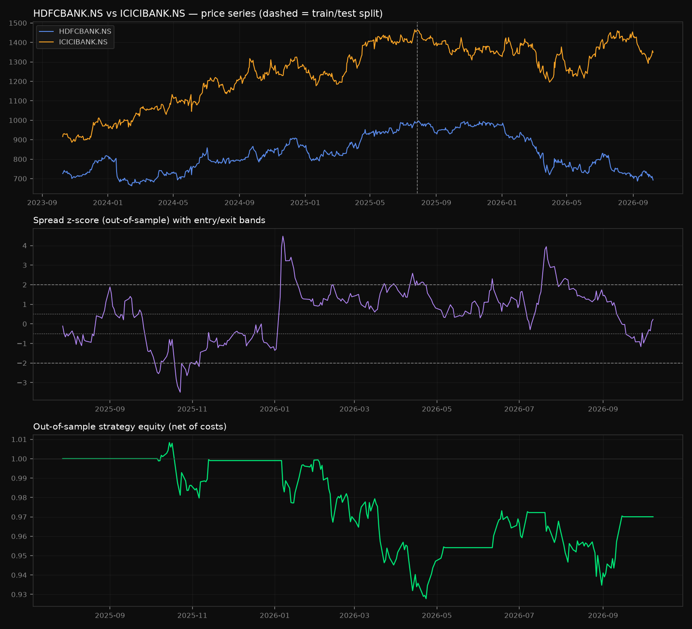

---

### AXISBANK.NS / ICICIBANK.NS

- **Latest prices:** AXISBANK.NS ₹1,245.00 · ICICIBANK.NS ₹1,349.00
- **Hedge ratio (train-fitted):** 0.9314
- **Cointegration (train):** FAIL at 5% — ADF -0.13, p=0.9466
- **Persistence:** passed 5% in 0 of 72 real-data runs (strict tier: 0/72)
- **Spread half-life:** 1103.3 days
- **Current z-score:** -1.24
- **Signal today:** watch (approaching band)
- ⚠️ _Pair did not cointegrate on training data. Any signal here is not statistically justified — observation only._

**Out-of-sample backtest** (beta frozen from train window):

| Metric | Value |
|---|---|
| Sharpe | 0.00 |
| Sortino | 0.00 |
| Annualised return | -0.35% |
| Annualised vol | 8.59% |
| Max drawdown | -7.72% |
| Round-trip trades | 6 |

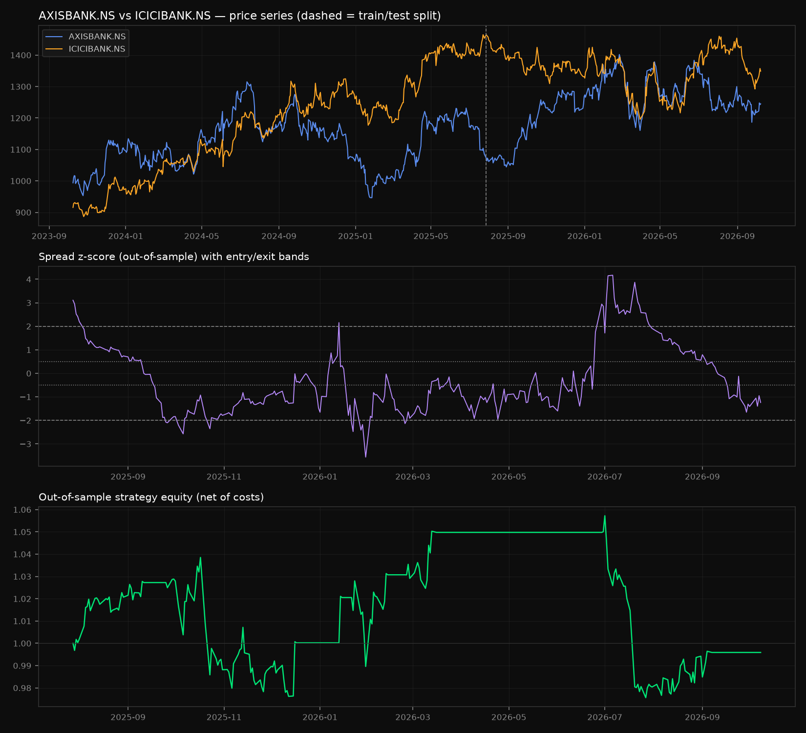

---

### KOTAKBANK.NS / HDFCBANK.NS

- **Latest prices:** KOTAKBANK.NS ₹435.00 · HDFCBANK.NS ₹692.25
- **Hedge ratio (train-fitted):** 2.1600
- **Cointegration (train):** FAIL at 5% — ADF -2.41, p=0.1399
- **Persistence:** passed 5% in 0 of 72 real-data runs (strict tier: 0/72)
- **Spread half-life:** 25.4 days
- **Current z-score:** -1.86
- **Signal today:** watch (approaching band)
- ⚠️ _Pair did not cointegrate on training data. Any signal here is not statistically justified — observation only._

**Out-of-sample backtest** (beta frozen from train window):

| Metric | Value |
|---|---|
| Sharpe | 1.72 |
| Sortino | 1.93 |
| Annualised return | 10.82% |
| Annualised vol | 6.07% |
| Max drawdown | -2.89% |
| Round-trip trades | 7 |

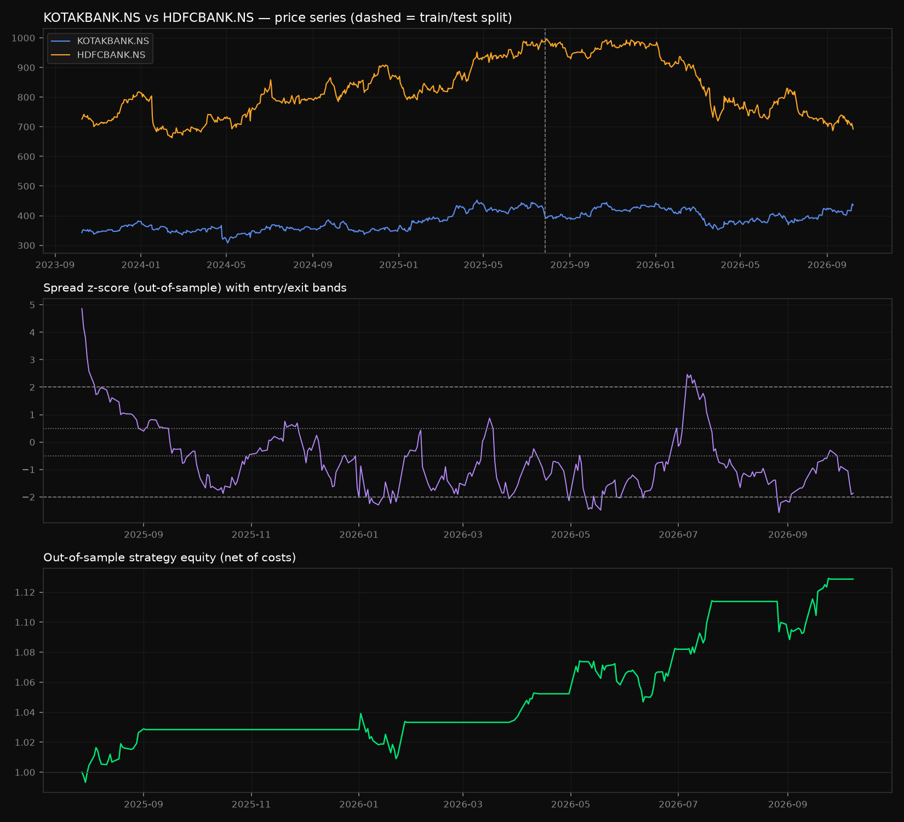

---

### SBIN.NS / BANKBARODA.NS

- **Latest prices:** SBIN.NS ₹940.00 · BANKBARODA.NS ₹234.00
- **Hedge ratio (train-fitted):** 0.1908
- **Cointegration (train):** FAIL at 5% — ADF -2.39, p=0.1445
- **Persistence:** passed 5% in 0 of 72 real-data runs (strict tier: 0/72)
- **Spread half-life:** 21.3 days
- **Current z-score:** +2.46
- **Signal today:** SHORT spread (short BANKBARODA.NS, long SBIN.NS)
- ⚠️ _Pair did not cointegrate on training data. Any signal here is not statistically justified — observation only._

**Out-of-sample backtest** (beta frozen from train window):

| Metric | Value |
|---|---|
| Sharpe | 0.27 |
| Sortino | 0.23 |
| Annualised return | 2.10% |
| Annualised vol | 9.41% |
| Max drawdown | -8.84% |
| Round-trip trades | 6 |

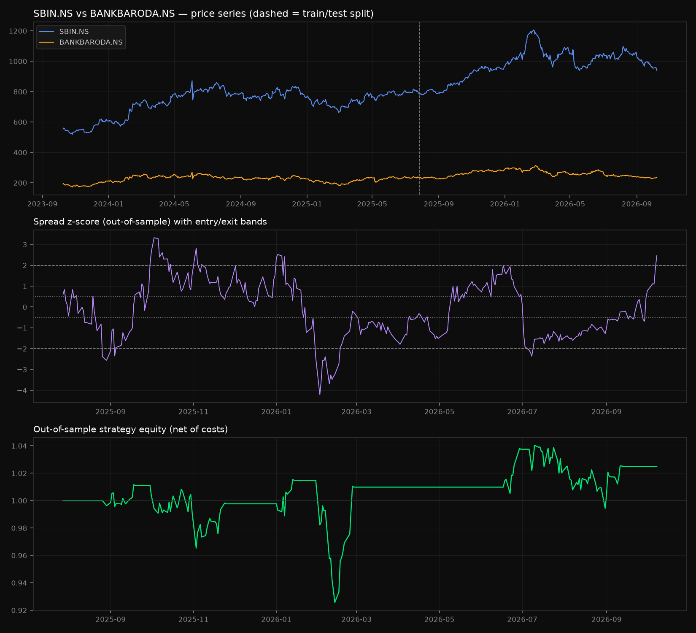

---

### TCS.NS / INFY.NS

- **Latest prices:** TCS.NS ₹2,076.00 · INFY.NS ₹997.00
- **Hedge ratio (train-fitted):** 0.4474
- **Cointegration (train):** FAIL at 5% — ADF -1.13, p=0.7028
- **Persistence:** passed 5% in 0 of 72 real-data runs (strict tier: 0/72)
- **Spread half-life:** 70.1 days
- **Current z-score:** -0.70
- **Signal today:** watch (approaching band)
- ⚠️ _Pair did not cointegrate on training data. Any signal here is not statistically justified — observation only._

**Out-of-sample backtest** (beta frozen from train window):

| Metric | Value |
|---|---|
| Sharpe | 2.37 |
| Sortino | 2.75 |
| Annualised return | 9.59% |
| Annualised vol | 3.89% |
| Max drawdown | -0.99% |
| Round-trip trades | 6 |

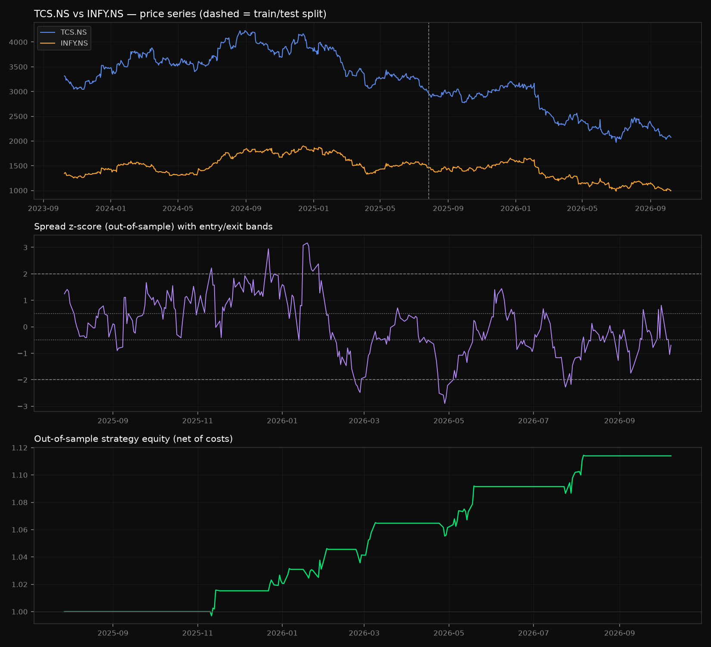

---

### INFY.NS / WIPRO.NS

- **Latest prices:** INFY.NS ₹997.00 · WIPRO.NS ₹158.38
- **Hedge ratio (train-fitted):** 0.1302
- **Cointegration (train):** FAIL at 5% — ADF -2.31, p=0.1692
- **Persistence:** passed 5% in 0 of 72 real-data runs (strict tier: 0/72)
- **Spread half-life:** 29.7 days
- **Current z-score:** -1.21
- **Signal today:** watch (approaching band)
- ⚠️ _Pair did not cointegrate on training data. Any signal here is not statistically justified — observation only._

**Out-of-sample backtest** (beta frozen from train window):

| Metric | Value |
|---|---|
| Sharpe | 1.87 |
| Sortino | 1.78 |
| Annualised return | 9.55% |
| Annualised vol | 4.95% |
| Max drawdown | -1.53% |
| Round-trip trades | 5 |

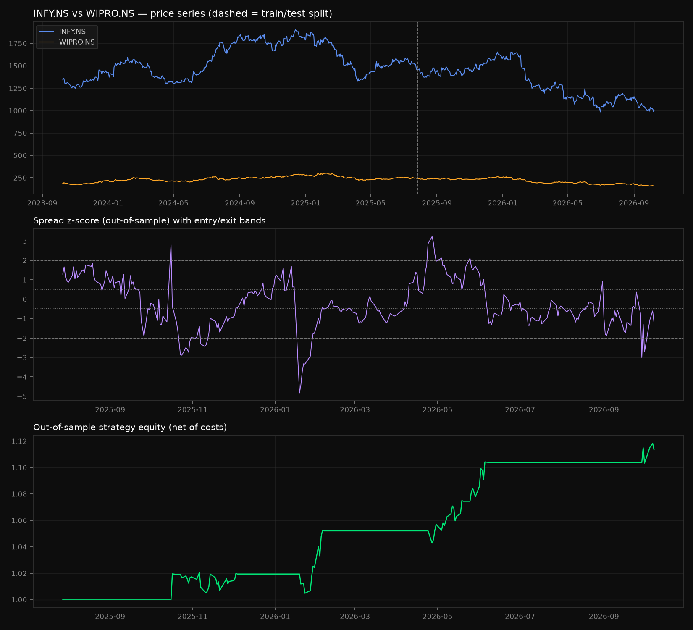

---

### HCLTECH.NS / TECHM.NS

- **Latest prices:** HCLTECH.NS ₹1,176.90 · TECHM.NS ₹1,496.20
- **Hedge ratio (train-fitted):** 0.9406
- **Cointegration (train):** FAIL at 5% — ADF -2.19, p=0.2107
- **Persistence:** passed 5% in 0 of 72 real-data runs (strict tier: 0/72)
- **Spread half-life:** 22.3 days
- **Current z-score:** +0.71
- **Signal today:** watch (approaching band)
- ⚠️ _Pair did not cointegrate on training data. Any signal here is not statistically justified — observation only._

**Out-of-sample backtest** (beta frozen from train window):

| Metric | Value |
|---|---|
| Sharpe | -0.26 |
| Sortino | -0.24 |
| Annualised return | -2.17% |
| Annualised vol | 7.30% |
| Max drawdown | -8.49% |
| Round-trip trades | 4 |

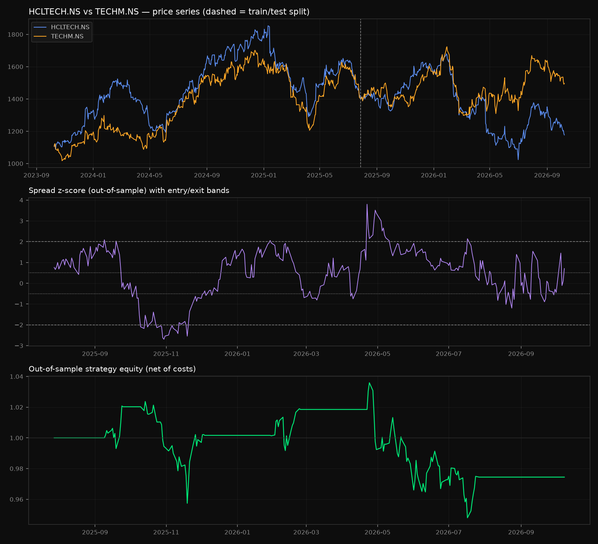

---

### ACC.NS / AMBUJACEM.NS

- **Latest prices:** ACC.NS ₹1,130.10 · AMBUJACEM.NS ₹341.00
- **Hedge ratio (train-fitted):** 0.1807
- **Cointegration (train):** FAIL at 5% — ADF -0.74, p=0.8353
- **Persistence:** passed 5% in 0 of 72 real-data runs (strict tier: 0/72)
- **Spread half-life:** 87.5 days
- **Current z-score:** -2.76
- **Signal today:** LONG spread (long AMBUJACEM.NS, short ACC.NS)
- ⚠️ _Pair did not cointegrate on training data. Any signal here is not statistically justified — observation only._

**Out-of-sample backtest** (beta frozen from train window):

| Metric | Value |
|---|---|
| Sharpe | 0.31 |
| Sortino | 0.27 |
| Annualised return | 1.84% |
| Annualised vol | 6.44% |
| Max drawdown | -5.18% |
| Round-trip trades | 4 |

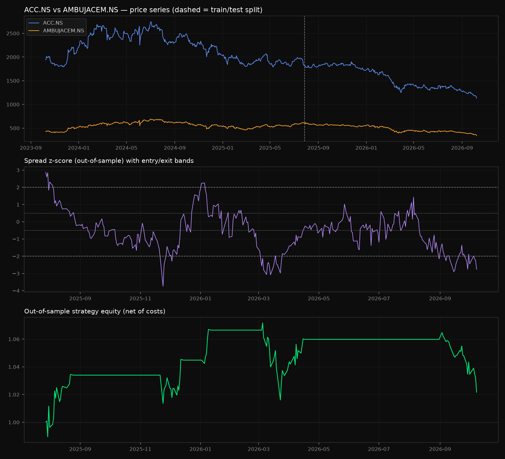

---

### ULTRACEMCO.NS / SHREECEM.NS

- **Latest prices:** ULTRACEMCO.NS ₹10,426.00 · SHREECEM.NS ₹21,600.00
- **Hedge ratio (train-fitted):** 0.8964
- **Cointegration (train):** FAIL at 5% — ADF -1.79, p=0.3851
- **Persistence:** passed 5% in 0 of 72 real-data runs (strict tier: 0/72)
- **Spread half-life:** 42.8 days
- **Current z-score:** -1.22
- **Signal today:** watch (approaching band)
- ⚠️ _Pair did not cointegrate on training data. Any signal here is not statistically justified — observation only._

**Out-of-sample backtest** (beta frozen from train window):

| Metric | Value |
|---|---|
| Sharpe | -0.28 |
| Sortino | -0.33 |
| Annualised return | -2.07% |
| Annualised vol | 6.62% |
| Max drawdown | -6.96% |
| Round-trip trades | 4 |

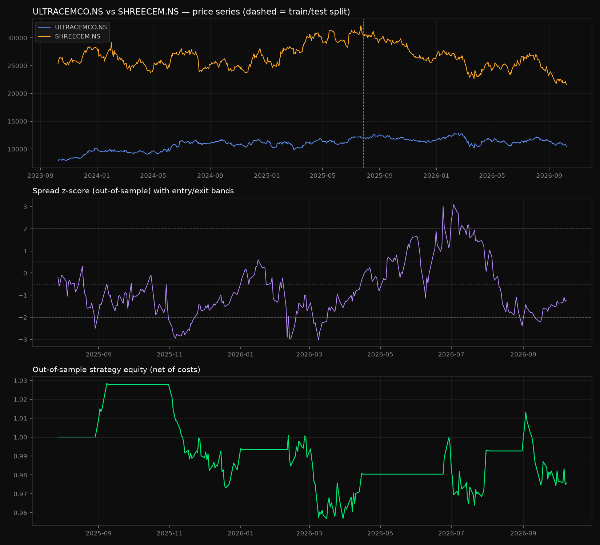

---

### IOC.NS / BPCL.NS

- **Latest prices:** IOC.NS ₹126.25 · BPCL.NS ₹286.25
- **Hedge ratio (train-fitted):** 1.6987
- **Cointegration (train):** FAIL at 5% — ADF -0.79, p=0.8214
- **Persistence:** passed 5% in 0 of 72 real-data runs (strict tier: 0/72)
- **Spread half-life:** 153.2 days
- **Current z-score:** -1.77
- **Signal today:** watch (approaching band)
- ⚠️ _Pair did not cointegrate on training data. Any signal here is not statistically justified — observation only._

**Out-of-sample backtest** (beta frozen from train window):

| Metric | Value |
|---|---|
| Sharpe | 0.45 |
| Sortino | 0.48 |
| Annualised return | 2.69% |
| Annualised vol | 6.38% |
| Max drawdown | -6.80% |
| Round-trip trades | 5 |

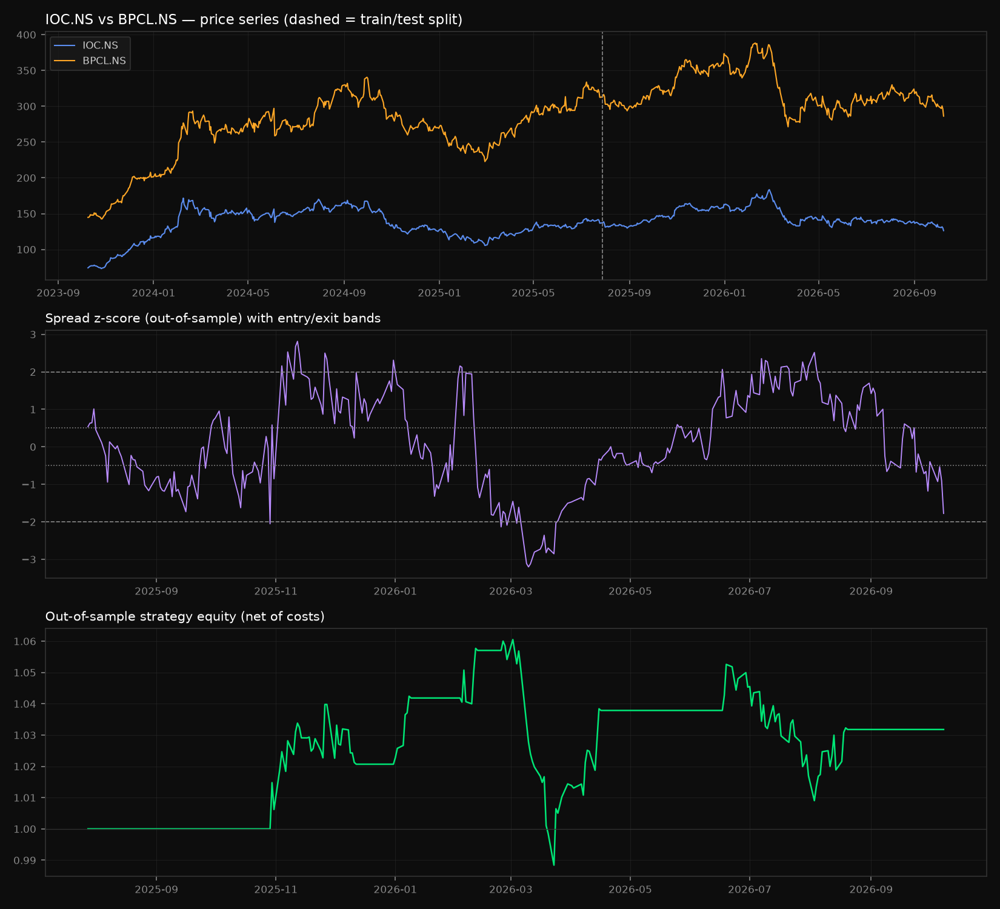

---

### BPCL.NS / HINDPETRO.NS

- **Latest prices:** BPCL.NS ₹286.25 · HINDPETRO.NS ₹326.60
- **Hedge ratio (train-fitted):** 1.3361
- **Cointegration (train):** FAIL at 5% — ADF -2.04, p=0.2694
- **Persistence:** passed 5% in 0 of 72 real-data runs (strict tier: 0/72)
- **Spread half-life:** 37.2 days
- **Current z-score:** -0.26
- **Signal today:** flat / no stretch
- ⚠️ _Pair did not cointegrate on training data. Any signal here is not statistically justified — observation only._

**Out-of-sample backtest** (beta frozen from train window):

| Metric | Value |
|---|---|
| Sharpe | 0.05 |
| Sortino | 0.04 |
| Annualised return | 0.10% |
| Annualised vol | 5.86% |
| Max drawdown | -6.64% |
| Round-trip trades | 5 |

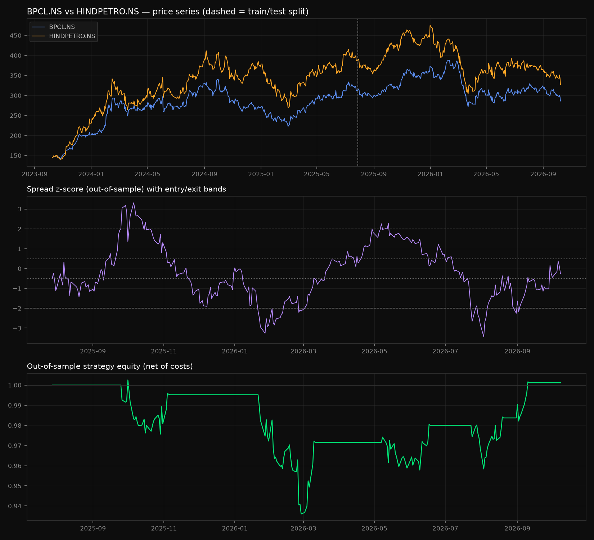

---

### ONGC.NS / COALINDIA.NS

- **Latest prices:** ONGC.NS ₹219.80 · COALINDIA.NS ₹409.35
- **Hedge ratio (train-fitted):** 1.4027
- **Cointegration (train):** PASS at 5% — ADF -3.24, p=0.0176
- **Persistence:** passed 5% in 64 of 72 real-data runs (strict tier: 1/72)
- **Spread half-life:** 12.2 days
- **Current z-score:** +1.49
- **Signal today:** watch (approaching band)

**Out-of-sample backtest** (beta frozen from train window):

| Metric | Value |
|---|---|
| Sharpe | 0.70 |
| Sortino | 0.57 |
| Annualised return | 5.36% |
| Annualised vol | 7.94% |
| Max drawdown | -6.35% |
| Round-trip trades | 5 |

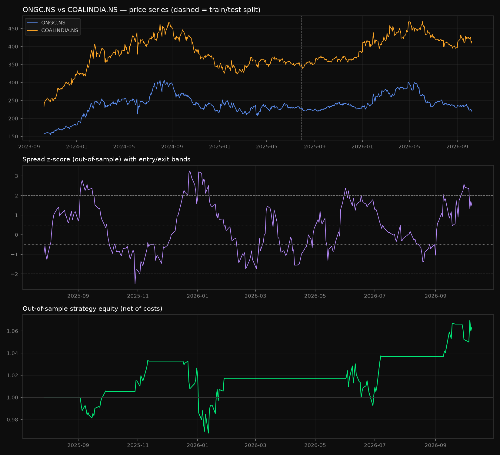

---

### NTPC.NS / POWERGRID.NS

- **Latest prices:** NTPC.NS ₹309.70 · POWERGRID.NS ₹244.65
- **Hedge ratio (train-fitted):** 0.8181
- **Cointegration (train):** FAIL at 5% — ADF -2.51, p=0.1132
- **Persistence:** passed 5% in 0 of 72 real-data runs (strict tier: 0/72)
- **Spread half-life:** 24.3 days
- **Current z-score:** -1.34
- **Signal today:** watch (approaching band)
- ⚠️ _Pair did not cointegrate on training data. Any signal here is not statistically justified — observation only._

**Out-of-sample backtest** (beta frozen from train window):

| Metric | Value |
|---|---|
| Sharpe | 0.43 |
| Sortino | 0.34 |
| Annualised return | 2.28% |
| Annualised vol | 5.59% |
| Max drawdown | -5.29% |
| Round-trip trades | 6 |

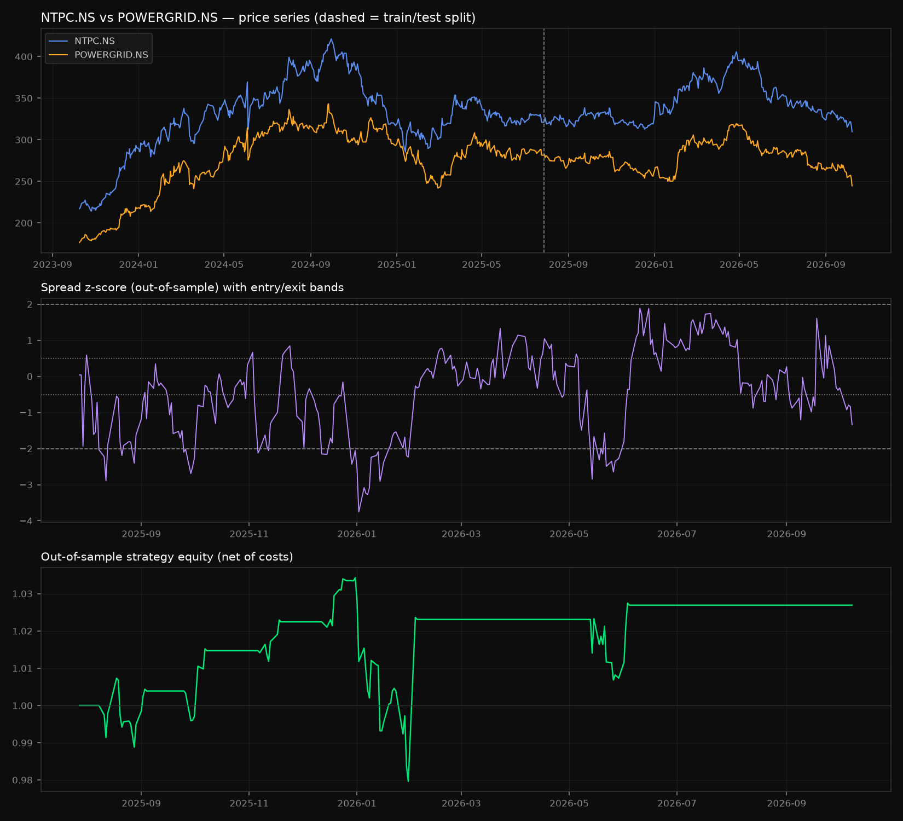

---

### BAJAJ-AUTO.NS / HEROMOTOCO.NS

- **Latest prices:** BAJAJ-AUTO.NS ₹9,637.00 · HEROMOTOCO.NS ₹4,856.50
- **Hedge ratio (train-fitted):** 0.4092
- **Cointegration (train):** FAIL at 5% — ADF -2.30, p=0.1727
- **Persistence:** passed 5% in 0 of 72 real-data runs (strict tier: 0/72)
- **Spread half-life:** 29.4 days
- **Current z-score:** +0.92
- **Signal today:** watch (approaching band)
- ⚠️ _Pair did not cointegrate on training data. Any signal here is not statistically justified — observation only._

**Out-of-sample backtest** (beta frozen from train window):

| Metric | Value |
|---|---|
| Sharpe | -0.54 |
| Sortino | -0.56 |
| Annualised return | -6.26% |
| Annualised vol | 10.82% |
| Max drawdown | -20.00% |
| Round-trip trades | 6 |

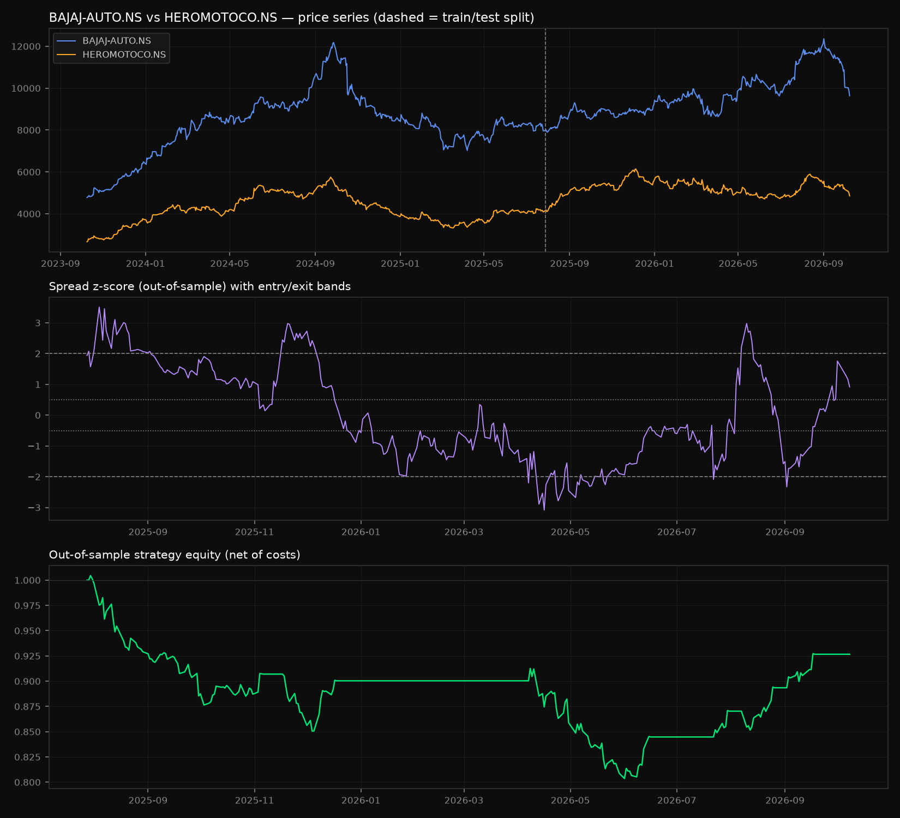

---

### TATASTEEL.NS / JSWSTEEL.NS

- **Latest prices:** TATASTEEL.NS ₹171.96 · JSWSTEEL.NS ₹1,175.20
- **Hedge ratio (train-fitted):** 3.0717
- **Cointegration (train):** FAIL at 5% — ADF -1.34, p=0.6107
- **Persistence:** passed 5% in 0 of 72 real-data runs (strict tier: 0/72)
- **Spread half-life:** 63.5 days
- **Current z-score:** -2.18
- **Signal today:** LONG spread (long JSWSTEEL.NS, short TATASTEEL.NS)
- ⚠️ _Pair did not cointegrate on training data. Any signal here is not statistically justified — observation only._

**Out-of-sample backtest** (beta frozen from train window):

| Metric | Value |
|---|---|
| Sharpe | 0.12 |
| Sortino | 0.11 |
| Annualised return | 0.66% |
| Annualised vol | 8.29% |
| Max drawdown | -5.58% |
| Round-trip trades | 5 |

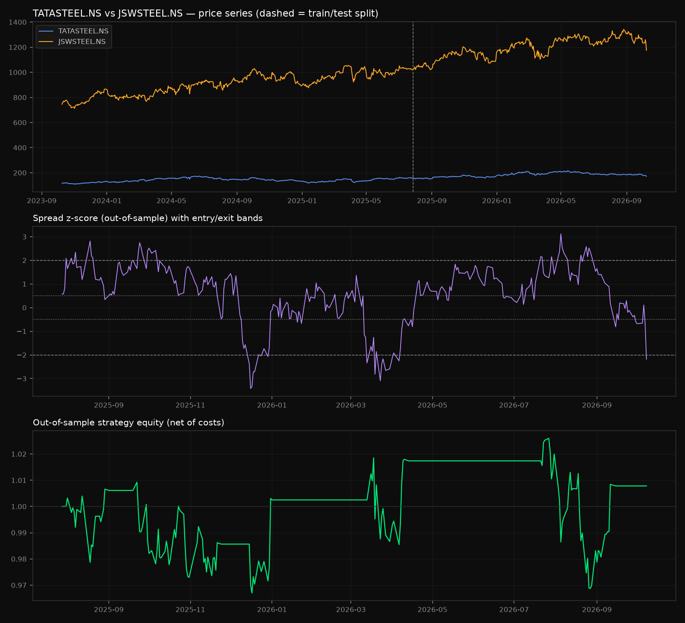

---

### SUNPHARMA.NS / CIPLA.NS

- **Latest prices:** SUNPHARMA.NS ₹1,759.80 · CIPLA.NS ₹1,306.80
- **Hedge ratio (train-fitted):** 0.4912
- **Cointegration (train):** PASS at 5% — ADF -3.46, p=0.0091
- **Persistence:** passed 5% in 72 of 72 real-data runs (strict tier: 5/72)
- **Spread half-life:** 10.5 days
- **Current z-score:** -1.50
- **Signal today:** watch (approaching band)

**Out-of-sample backtest** (beta frozen from train window):

| Metric | Value |
|---|---|
| Sharpe | 0.05 |
| Sortino | 0.06 |
| Annualised return | 0.11% |
| Annualised vol | 7.55% |
| Max drawdown | -9.89% |
| Round-trip trades | 5 |

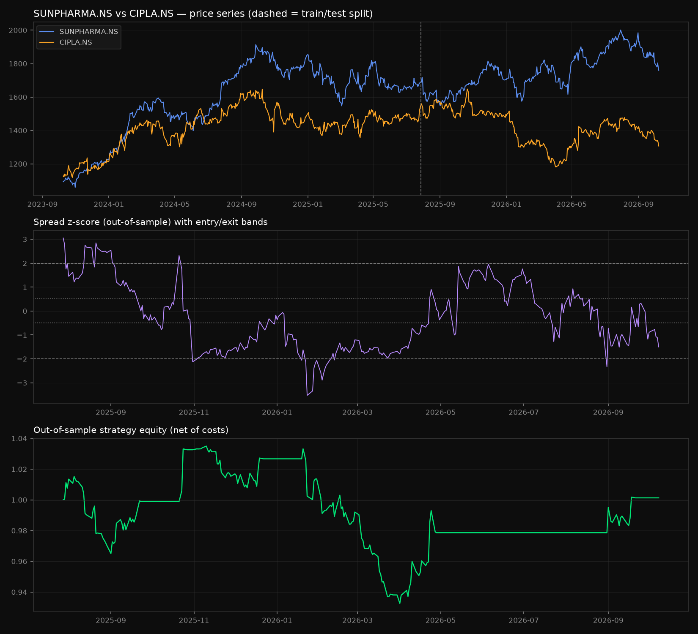

---

_Generated 2026-10-09 · pairs mean-reversion scanner · out-of-sample backtest · multiple-testing-aware · not investment advice._
